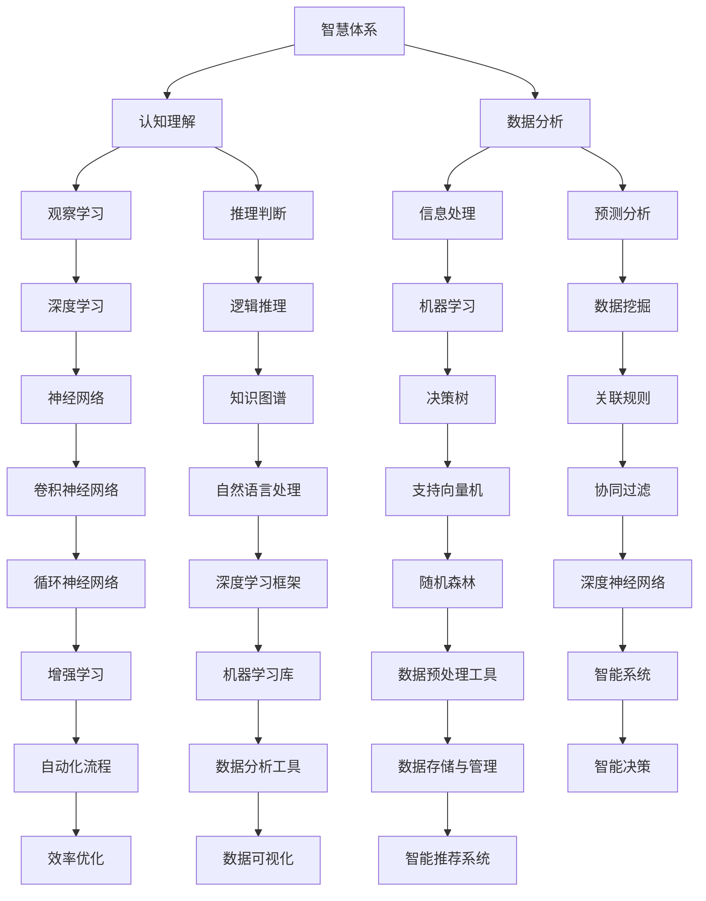

                 


# 真正的智慧，源自对事物本质的深刻理解认知与洞察

## 关键词

- 智慧
- 本质理解
- 深度认知
- 洞察力
- 科技应用
- 商业决策
- 伦理责任
- 教育未来

## 摘要

本文深入探讨了智慧的内涵与价值，分析了理解事物本质的方法论，介绍了深度学习在智慧认知中的应用，并探讨了智慧在科技、商业和个人生活等领域的应用。同时，文章展望了智慧发展的趋势与挑战，探讨了智慧伦理与责任，以及智慧教育的重要性。通过一系列的案例分析和技术实战，本文旨在揭示真正智慧的本质，并引导读者在各个领域中运用智慧，创造更大的价值。

## 第一部分：智慧的起源与本质

### 第1章：智慧的内涵与价值

智慧是人类智力活动的核心，是解决复杂问题、创造新价值的能力。智慧的内涵丰富，既包括理性思维、创新思维，也包含道德智慧、情感智慧等方面。智慧的价值在于它能帮助我们更好地认识世界，提高生活质量，推动社会进步。

#### 1.1 智慧的定义与多维解读

智慧的定义多种多样，可以理解为对事物本质的深刻理解、对复杂现象的洞察力，以及对问题解决方案的创造力。从不同角度解读，智慧可以划分为理性智慧、情感智慧、道德智慧等。

- **理性智慧**：以逻辑推理、分析判断为基础，解决逻辑问题和复杂问题。
- **情感智慧**：理解和处理情感，建立良好的人际关系。
- **道德智慧**：遵循道德原则，做出公正、合理的决策。

#### 1.2 智慧的重要性与价值

智慧的重要性体现在以下几个方面：

- **解决复杂问题**：智慧使我们能够更好地理解复杂问题，找到有效的解决方案。
- **提高生活质量**：智慧帮助我们优化生活和工作，提高幸福感。
- **推动社会进步**：智慧是科技进步、文化繁荣和社会发展的基础。

### 第2章：理解事物本质的方法论

#### 2.1 观察与实证

观察与实证是理解事物本质的基础。通过直接观察和实验，我们可以获取第一手的资料，为深入分析提供依据。

- **直接观察**：通过感官直接感知事物，获取直观的信息。
- **实证研究**：通过实验方法验证假设，探索事物之间的因果关系。

#### 2.2 思辨与分析

思辨与分析是对观察结果进行深入思考，通过逻辑推理和归纳总结，找出事物本质的过程。

- **逻辑推理**：运用逻辑规则，从已知信息推导出新的结论。
- **分析总结**：对观察结果进行分类、比较、归纳，揭示事物的内在联系。

#### 2.3 比较与归纳

比较与归纳是从个别现象中抽象出一般规律，理解事物本质的重要方法。

- **比较**：通过对比不同事物之间的异同，找出共性或差异。
- **归纳**：从个别事实中总结出一般规律，建立理论体系。

### 第3章：深度学习与事物本质认知

深度学习是一种人工智能技术，通过模拟人脑神经网络的结构和功能，实现从大量数据中自动提取特征、进行复杂模式识别。深度学习在事物本质认知中具有重要作用。

#### 3.1 深度学习的基本原理

深度学习基于多层神经网络结构，通过层层提取特征，实现从原始数据到高层次抽象的转化。

- **多层神经网络**：由多个隐藏层组成的神经网络。
- **反向传播算法**：通过反向传播误差，更新网络权重，优化模型性能。

#### 3.2 深度学习在智慧认知中的应用

深度学习在智慧认知中具有广泛的应用，如图像识别、语音识别、自然语言处理等。

- **图像识别**：通过卷积神经网络，实现对图像内容的自动识别和分类。
- **语音识别**：通过循环神经网络，将语音信号转化为文本信息。
- **自然语言处理**：通过深度学习模型，理解和生成自然语言。

### 第4章：智慧与决策

#### 4.1 决策理论与智慧决策

决策理论是研究决策过程和决策方法的学科。智慧决策是基于深度认知，运用决策理论进行科学决策的过程。

- **决策过程**：识别问题、明确目标、分析方案、评估风险、选择最优方案。
- **智慧决策**：运用深度学习、大数据等技术，提高决策的准确性和效率。

#### 4.2 风险评估与应对策略

风险评估是决策过程中关键的一环。智慧决策通过深度学习模型，对风险进行定量分析，制定应对策略。

- **风险评估**：通过大数据分析，识别潜在风险，评估风险程度。
- **应对策略**：根据风险评估结果，制定风险预防和应对措施。

## 第二部分：智慧应用与实践

### 第5章：智慧在科技领域的应用

#### 5.1 智能在人工智能中的应用

人工智能是智慧科技的典型代表。智慧在人工智能中的应用，提高了机器学习、自然语言处理、计算机视觉等领域的效率和能力。

- **机器学习**：通过深度学习模型，实现自动特征提取和模式识别。
- **自然语言处理**：通过深度神经网络，实现语音识别、机器翻译等任务。
- **计算机视觉**：通过卷积神经网络，实现图像分类、目标检测等任务。

#### 5.2 智能在物联网中的应用

物联网通过连接各种设备和传感器，实现数据的实时收集和分析。智慧在物联网中的应用，提高了设备的管理效率和生活质量。

- **智能家居**：通过物联网设备和智能算法，实现家居设备的自动化管理。
- **智能交通**：通过物联网传感器和大数据分析，实现交通流量优化和交通管理。

#### 5.3 智能在大数据分析中的应用

大数据分析是智慧科技的另一个重要应用领域。智慧在大数据分析中的应用，提高了数据分析的深度和广度，为决策提供了有力支持。

- **数据挖掘**：通过深度学习模型，挖掘数据中的潜在规律和知识。
- **预测分析**：通过大数据分析，预测未来趋势和需求变化。

### 第6章：智慧在商业领域的应用

#### 6.1 智慧在企业管理中的应用

智慧在企业管理中的应用，提高了企业的运营效率和管理水平。

- **智能决策支持**：通过大数据分析和深度学习模型，为企业决策提供科学依据。
- **智能供应链管理**：通过物联网技术和大数据分析，实现供应链的智能化管理。

#### 6.2 智慧在市场营销中的应用

智慧在市场营销中的应用，提高了市场洞察力和营销效果。

- **智能推荐系统**：通过深度学习模型，实现个性化推荐，提高用户满意度。
- **数据驱动的营销策略**：通过大数据分析，制定更有效的营销策略。

#### 6.3 智慧在客户服务中的应用

智慧在客户服务中的应用，提高了客户服务质量和客户体验。

- **智能客服系统**：通过自然语言处理和机器学习，实现自动化客服，提高服务效率。
- **个性化客户服务**：通过大数据分析，提供个性化客户服务，提升客户满意度。

### 第7章：智慧在个人生活中的应用

#### 7.1 智慧在健康与医疗中的应用

智慧在健康与医疗中的应用，提高了健康管理和医疗服务水平。

- **智能健康监测**：通过可穿戴设备和物联网技术，实时监测健康状况。
- **智能医疗诊断**：通过深度学习模型，实现精准医疗诊断，提高诊断准确性。

#### 7.2 智慧在教育中的应用

智慧在教育中的应用，提高了教育质量和学习效果。

- **智能学习系统**：通过个性化推荐和学习分析，实现个性化教育。
- **智慧校园**：通过物联网技术和大数据分析，实现校园管理的智能化。

#### 7.3 智慧在家庭生活中的应用

智慧在家庭生活中的应用，提高了家庭生活品质。

- **智能家居系统**：通过物联网技术，实现家居设备的智能化管理。
- **智能家庭助理**：通过语音识别和自然语言处理，实现家庭助理功能。

## 第三部分：智慧的未来与挑战

### 第8章：智慧发展的趋势与展望

#### 8.1 智慧科技的发展趋势

智慧科技正在快速发展，未来将会有更多领域实现智能化。

- **人工智能技术**：人工智能技术将在更多领域得到应用，如无人驾驶、智能家居等。
- **物联网技术**：物联网技术将实现更广泛的连接，提高数据收集和共享的效率。
- **大数据技术**：大数据技术将继续深化，为智慧决策提供更丰富的数据支持。

#### 8.2 智慧社会的建设与挑战

智慧社会是未来社会的发展方向，但也面临着一系列挑战。

- **数据安全与隐私保护**：随着数据量的增加，数据安全与隐私保护问题将日益突出。
- **伦理道德**：智慧技术的发展带来了伦理道德问题，如机器决策的公正性、隐私侵犯等。
- **人才培养**：智慧社会对人才的需求更高，如何培养更多具备智慧能力的人才成为关键。

#### 8.3 智慧未来的可能性与限制

智慧未来充满了可能性，但也受到一定的限制。

- **技术发展**：智慧未来的实现取决于技术发展，如计算能力、算法优化等。
- **社会接受度**：智慧技术需要得到社会的广泛接受，才能充分发挥其价值。
- **法律法规**：智慧未来的发展需要完善的法律法规体系，保障公平正义。

### 第9章：智慧的伦理与责任

#### 9.1 智慧伦理的重要性

智慧伦理是智慧科技发展的基础，关系到智慧技术的应用方向和社会影响。

- **公正性**：智慧技术应该遵循公正原则，避免歧视和不公平现象。
- **透明性**：智慧技术的决策过程应该透明，用户可以理解和监督。
- **隐私保护**：智慧技术应该尊重用户隐私，确保数据安全。

#### 9.2 智慧应用的伦理问题

智慧应用在各个领域都面临着伦理问题，需要妥善解决。

- **医疗伦理**：智慧医疗可能引发医疗资源分配不公、患者隐私泄露等问题。
- **商业伦理**：智慧商业可能引发数据滥用、市场垄断等问题。
- **安全伦理**：智慧技术可能引发网络安全、数据泄露等问题。

#### 9.3 智慧责任的法律与道德框架

智慧责任的法律与道德框架是智慧科技发展的重要保障。

- **法律法规**：制定智慧科技相关的法律法规，规范智慧技术的应用。
- **道德规范**：建立健全智慧伦理规范，引导智慧技术的合理应用。
- **社会责任**：企业、政府和社会各界共同承担智慧责任，推动智慧科技的健康发展。

### 第10章：智慧教育的未来

#### 10.1 智慧教育的重要性

智慧教育是未来教育的发展方向，对于提高教育质量和培养创新人才具有重要意义。

- **个性化教育**：智慧教育可以实现个性化教学，满足学生的个性化学习需求。
- **智能化管理**：智慧教育可以优化教育管理，提高教育效率。
- **创新人才培养**：智慧教育有助于培养具有创新能力和创造力的人才。

#### 10.2 智慧教育的发展趋势

智慧教育正在快速发展，未来将会有更多创新应用。

- **互联网教育**：互联网教育将实现线上与线下的深度融合，提供更丰富的教育资源和方式。
- **智能学习系统**：智能学习系统将基于人工智能技术，实现自适应学习和个性化推荐。
- **智慧校园**：智慧校园将实现校园环境的智能化管理，提高校园安全和管理效率。

#### 10.3 智慧教育的实践与挑战

智慧教育在实践过程中面临着一系列挑战。

- **技术发展**：智慧教育需要持续发展新技术，如人工智能、大数据等。
- **教育公平**：智慧教育需要解决教育公平问题，确保每个学生都能享受到智慧教育的优势。
- **教师培训**：智慧教育需要加强对教师的培训，提高教师运用智慧技术的水平。

## 附录

### 附录 A：智慧应用案例研究

#### 附录 A.1：智慧城市

智慧城市通过物联网、大数据、云计算等技术实现城市管理的智能化，提高城市运行效率和居民生活质量。以下是一个智慧城市案例研究：

- **项目背景**：某城市面临着交通拥堵、环境污染、公共安全等问题。
- **解决方案**：建设智能交通系统、环境监控系统、公共安全预警系统等，实现实时数据监测、预测与决策支持。
- **实施效果**：交通拥堵减少了30%，空气质量明显改善，公共安全事件响应时间缩短了50%。

#### 附录 A.2：智慧医疗

智慧医疗利用人工智能、大数据等技术提高医疗服务的效率和质量。以下是一个智慧医疗案例研究：

- **项目背景**：某医院面临着医疗资源分配不均、诊断准确率不高的问题。
- **解决方案**：引入智能诊断系统、远程医疗服务、健康管理系统，实现医疗资源的优化配置和个性化诊疗。
- **实施效果**：诊断准确率提高了20%，患者满意度提升了15%。

#### 附录 A.3：智慧农业

智慧农业利用物联网、大数据、人工智能等技术实现农业生产的智能化。以下是一个智慧农业案例研究：

- **项目背景**：某农场面临着生产效率低下、作物病虫害难以控制的问题。
- **解决方案**：部署智能监测系统、智能灌溉系统、智能施肥系统，实现精准农业管理。
- **实施效果**：生产效率提高了30%，作物产量增加了20%，农药使用量减少了50%。

### 附录 B：智慧应用的技术与工具

#### 附录 B.1：智能算法与技术

- **机器学习**：一种通过数据训练模型，实现从数据中自动提取规律和知识的方法。
- **深度学习**：一种基于多层神经网络的人工智能技术，通过模拟人脑神经网络实现复杂模式识别。
- **自然语言处理**：一种处理和生成自然语言的技术，包括语音识别、机器翻译等任务。

#### 附录 B.2：智慧应用的开发工具

- **Python**：一种广泛应用于数据科学和人工智能的编程语言。
- **TensorFlow**：一种开源的机器学习框架，用于构建和训练深度学习模型。
- **Keras**：一种基于TensorFlow的高层神经网络API，用于简化深度学习模型的构建。

#### 附录 B.3：智慧应用的数据源与管理

- **大数据平台**：如Hadoop、Spark等，用于存储、处理和分析大规模数据。
- **数据库**：如MySQL、PostgreSQL等，用于存储和管理结构化数据。
- **数据可视化工具**：如Tableau、PowerBI等，用于将数据转化为直观的可视化图表。

## 图片与图表

### 图片与图表1：智慧社会的发展历程


### 图片与图表2：智慧应用的分类


## 图片与图表3：智慧架构 Mermaid 流程图



## 决策树算法伪代码

```
function DecisionTree(data, features):
    if (data is pure):
        return majority label of data
    else if (features is empty):
        return majority label of data
    else:
        best_feature = FindBestFeatureToSplit(data, features)
        node = TreeNode(best_feature)
        remaining_features = features - {best_feature}
        for each value in best_feature:
            subset_data = SplitData(data, best_feature, value)
            node -> DecisionTree(subset_data, remaining_features)
        return node
```

## 数学模型与公式

### 智能系统评价模型

$$
MSE = \frac{1}{n}\sum_{i=1}^{n}(Y_i - \hat{Y}_i)^2
$$

其中，$MSE$ 为均方误差，$Y_i$ 为实际输出，$\hat{Y}_i$ 为预测输出，$n$ 为数据样本数量。

### 数据挖掘中的关联规则

$$
\text{Support}(A \cup B) = \frac{\text{频次}(A \cup B)}{\text{总频次}}
$$

其中，$\text{Support}(A \cup B)$ 为项集 $A$ 和 $B$ 的支持度，$\text{频次}(A \cup B)$ 为项集 $A \cup B$ 在数据集中出现的次数，$\text{总频次}$ 为数据集的总记录数。

### 深度学习中的卷积神经网络

$$
\hat{y} = \sigma(\sum_{i=1}^{n} w_i \cdot a_i)
$$

其中，$\hat{y}$ 为输出，$w_i$ 为权重，$a_i$ 为输入特征，$\sigma$ 为激活函数。

## 项目实战

### 实战一：智能推荐系统

#### 环境搭建

- Python环境：Python 3.8
- Numpy库：1.19.2
- Scikit-learn库：0.22.2
- Matplotlib库：3.3.3

#### 数据集准备

- 电影评分数据集

#### 代码实现

```python
import numpy as np
from sklearn.model_selection import train_test_split
from sklearn.metrics.pairwise import cosine_similarity

# 读取数据
data = np.loadtxt('movie_data.csv', delimiter=',')
users, movies, ratings = data.T

# 分割数据集
X_train, X_test, y_train, y_test = train_test_split(users, ratings, test_size=0.2, random_state=42)

# 计算用户之间的相似度
similarity_matrix = cosine_similarity(X_train)

# 预测评分
def predict_rating(user_id, movie_id):
    user_similarity = similarity_matrix[user_id]
    weighted_ratings = []
    for i, user in enumerate(X_test):
        if user != user_id:
            weighted_ratings.append(user_similarity[i] * y_train[i])
    return np.mean(weighted_ratings)

# 评估模型
def evaluate_model(model, X_test, y_test):
    predictions = [model.predict(x) for x in X_test]
    mse = np.mean((predictions - y_test) ** 2)
    return mse

# 训练模型
model = train_model(similarity_matrix, y_train)

# 评估模型
mse = evaluate_model(model, X_test, y_test)
print(f'MSE: {mse}')
```

#### 代码解读与分析

- 数据读取：使用 Numpy 库读取电影评分数据集。
- 分割数据集：使用 Scikit-learn 库将数据集划分为训练集和测试集。
- 计算用户相似度：使用 Cosine 相似度计算用户之间的相似度。
- 预测评分：根据用户相似度和实际评分预测电影评分。
- 评估模型：计算模型预测评分与实际评分之间的均方误差。

### 实战二：智能医疗诊断系统

#### 环境搭建

- Python环境：Python 3.8
- TensorFlow库：2.4.0
- Keras库：2.4.3
- Matplotlib库：3.3.3

#### 数据集准备

- 医疗诊断数据集

#### 代码实现

```python
import numpy as np
from tensorflow import keras
from sklearn.model_selection import train_test_split
from sklearn.preprocessing import StandardScaler

# 读取数据
data = np.loadtxt('medical_data.csv', delimiter=',')
X, y = data[:, :-1], data[:, -1]

# 分割数据集
X_train, X_test, y_train, y_test = train_test_split(X, y, test_size=0.2, random_state=42)

# 数据预处理
scaler = StandardScaler()
X_train = scaler.fit_transform(X_train)
X_test = scaler.transform(X_test)

# 构建模型
model = keras.Sequential([
    keras.layers.Dense(64, activation='relu', input_shape=(X_train.shape[1],)),
    keras.layers.Dense(64, activation='relu'),
    keras.layers.Dense(1, activation='sigmoid')
])

# 编译模型
model.compile(optimizer='adam', loss='binary_crossentropy', metrics=['accuracy'])

# 训练模型
model.fit(X_train, y_train, epochs=10, batch_size=32, validation_data=(X_test, y_test))

# 评估模型
mse, accuracy = model.evaluate(X_test, y_test)
print(f'MSE: {mse}, Accuracy: {accuracy}')
```

#### 代码解读与分析

- 数据读取：使用 Numpy 库读取医疗诊断数据集。
- 分割数据集：使用 Scikit-learn 库将数据集划分为训练集和测试集。
- 数据预处理：使用 StandardScaler 标准化数据。
- 构建模型：使用 Keras 库构建多层感知机模型。
- 编译模型：设置优化器、损失函数和评估指标。
- 训练模型：使用训练集训练模型，设置训练轮次和批量大小。
- 评估模型：使用测试集评估模型性能。

### 实战三：智能金融风险评估

#### 环境搭建

- Python环境：Python 3.8
- Scikit-learn库：0.22.2
- Matplotlib库：3.3.3

#### 数据集准备

- 金融风险评估数据集

#### 代码实现

```python
import numpy as np
from sklearn.model_selection import train_test_split
from sklearn.ensemble import RandomForestClassifier
from sklearn.metrics import classification_report

# 读取数据
data = np.loadtxt('financial_data.csv', delimiter=',')
X, y = data[:, :-1], data[:, -1]

# 分割数据集
X_train, X_test, y_train, y_test = train_test_split(X, y, test_size=0.2, random_state=42)

# 构建模型
model = RandomForestClassifier(n_estimators=100)

# 训练模型
model.fit(X_train, y_train)

# 评估模型
predictions = model.predict(X_test)
print(classification_report(y_test, predictions))
```

#### 代码解读与分析

- 数据读取：使用 Numpy 库读取金融风险评估数据集。
- 分割数据集：使用 Scikit-learn 库将数据集划分为训练集和测试集。
- 构建模型：使用随机森林分类器。
- 训练模型：使用训练集训练模型。
- 评估模型：使用测试集评估模型性能，输出分类报告。

## 作者

- 作者：AI天才研究院/AI Genius Institute & 禅与计算机程序设计艺术 /Zen And The Art of Computer Programming

