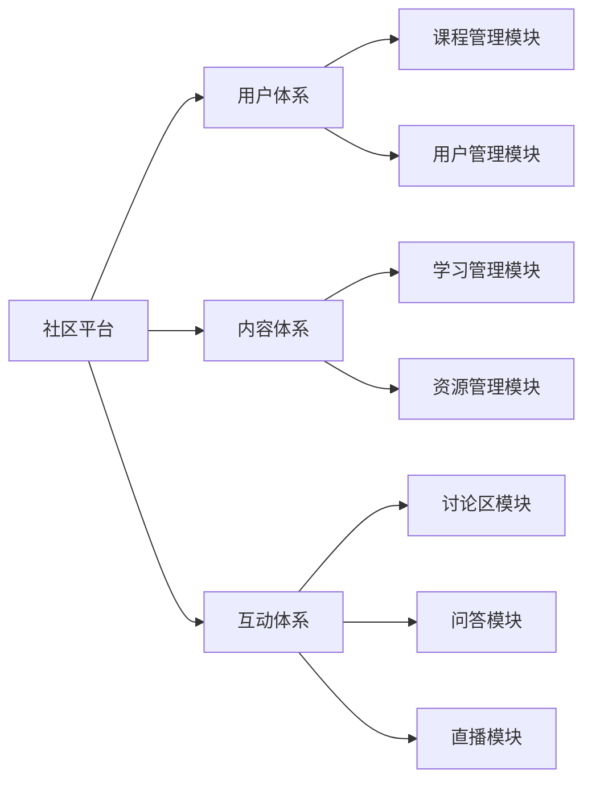

                 

## 文章标题

### 《知识付费与在线教育相结合的学习型社区模式》

关键词：知识付费、在线教育、学习型社区、结合模式、技术分析

摘要：本文深入探讨了知识付费与在线教育相结合的学习型社区模式，从背景、核心概念、技术架构和算法原理等方面，详细阐述了这一模式的优势和实现方式。通过具体案例和代码实现，帮助读者理解并掌握这一新兴教育模式的核心技术和应用。

---

### 第一部分：背景与概述

#### 1.1 知识付费与在线教育概述

##### 1.1.1 知识付费的发展背景与现状

知识付费是指用户为了获取有价值的信息、技能或知识，向内容提供者支付费用的一种商业模式。随着互联网技术的发展，知识付费逐渐成为一种流行的消费方式，涵盖了在线课程、专业咨询、知识分享等多种形式。

知识付费的发展背景主要有以下几个方面：

1. **信息爆炸与知识需求增加**：随着互联网的普及，信息获取变得更加便捷，但同时也带来了信息过载的问题。人们需要更加精准、有价值的信息来满足自身的知识和技能需求。
2. **移动互联网的普及**：智能手机和移动互联网的普及，使得用户可以随时随地获取知识和服务，推动了知识付费的快速发展。
3. **消费观念转变**：随着人们对教育和个人发展的重视，越来越多的用户愿意为优质的知识内容支付费用。

目前，知识付费市场呈现出以下趋势：

1. **市场规模持续扩大**：据数据显示，知识付费市场近年来呈现出快速增长的趋势，市场规模不断扩大。
2. **内容多样化**：知识付费内容涵盖了多个领域，包括职业技能、兴趣爱好、亲子教育等，满足了不同用户的需求。
3. **平台多样化**：知识付费平台日益增多，包括在线教育平台、社交媒体平台、专业咨询平台等。

##### 1.1.2 在线教育的兴起与发展

在线教育是指通过互联网进行知识传授和学习的一种教育形式。随着互联网技术的发展，在线教育逐渐成为教育领域的重要组成部分。

在线教育的兴起主要受到以下几个因素的推动：

1. **技术进步**：互联网、云计算、大数据、人工智能等技术的发展，为在线教育的开展提供了技术支持。
2. **教育资源不平衡**：在线教育可以打破地域、时间等限制，让更多的用户享受到优质的教育资源。
3. **学习方式的变革**：在线教育为学习者提供了更加灵活、个性化的学习方式，满足了不同学习者的需求。

在线教育的发展呈现出以下几个特点：

1. **市场规模不断扩大**：在线教育市场规模逐年增长，用户规模不断扩大。
2. **教育形式多样化**：在线教育涵盖了直播课程、录播课程、互动课程等多种形式，满足了不同学习者的需求。
3. **平台竞争激烈**：随着在线教育市场的不断扩大，各大平台纷纷进入，竞争日益激烈。

##### 1.1.3 知识付费与在线教育的结合意义

知识付费与在线教育的结合，具有重要的意义：

1. **提升学习效果**：通过知识付费，用户可以更精准地选择适合自己的学习内容，提高学习效果。
2. **促进教育资源分配**：知识付费可以为优质教育资源提供资金支持，推动教育资源的分配更加公平。
3. **推动教育创新**：知识付费与在线教育的结合，为教育领域带来了新的商业模式和运营模式，推动了教育创新。
4. **提高用户粘性**：通过在线教育平台，用户可以更好地参与到学习过程中，提高用户粘性。

#### 1.2 学习型社区模式的概念与特点

##### 1.2.1 学习型社区的定义

学习型社区是一种以学习为核心，通过在线平台聚集志同道合的学习者，共同学习、交流、分享的一种新型社区模式。

学习型社区的主要特点包括：

1. **学习为核心**：学习型社区的主要活动是学习，包括课程学习、知识分享、讨论交流等。
2. **用户参与度高**：学习型社区鼓励用户积极参与，通过互动、讨论、分享等方式，提高学习效果。
3. **知识共享**：学习型社区强调知识的共享和传播，通过用户间的交流和互动，促进知识的流动和积累。

##### 1.2.2 学习型社区的特点

学习型社区具有以下几个显著特点：

1. **社区化运营**：学习型社区采用社区化运营模式，通过论坛、社群等方式，为用户提供交流、分享的平台。
2. **个性化服务**：学习型社区根据用户的学习需求和兴趣，提供个性化的服务，包括课程推荐、学习计划制定等。
3. **互动性强**：学习型社区鼓励用户间的互动和交流，通过问答、讨论、直播等方式，提高学习效果。
4. **持续学习**：学习型社区注重用户的长期学习，通过持续的课程更新和知识分享，满足用户不断学习的需求。

##### 1.2.3 学习型社区的重要性

学习型社区在知识付费与在线教育相结合的模式中具有重要地位：

1. **提高用户参与度**：学习型社区为用户提供了丰富的学习资源和交流平台，提高了用户的参与度。
2. **促进知识传播**：学习型社区通过用户间的交流和分享，促进了知识的传播和积累。
3. **提升学习效果**：学习型社区为用户提供了互动、讨论等学习方式，提高了学习效果。
4. **增强用户粘性**：学习型社区通过持续的互动和学习，增强了用户对平台的粘性。

#### 1.3 本书结构安排与主要内容

本书分为三个部分，主要内容如下：

1. **第一部分：背景与概述**：介绍了知识付费与在线教育的发展背景、学习型社区的概念与特点，以及知识付费与在线教育相结合的意义。
2. **第二部分：核心概念与联系**：详细解析了知识付费机制、在线教育平台架构和学习型社区模式架构，并分析了它们之间的联系。
3. **第三部分：核心算法原理讲解**：介绍了机器学习算法、数据挖掘算法和社区推荐算法在知识付费与在线教育中的应用，并通过具体案例和代码实现进行了详细讲解。

---

通过本文的介绍，读者可以了解到知识付费与在线教育相结合的学习型社区模式的基本概念和优势，为后续的深入研究和实践打下基础。

---

## 第二部分：核心概念与联系

### 2.1 知识付费机制解析

#### 2.1.1 知识付费模式

知识付费模式是指用户为了获取有价值的信息、技能或知识，向内容提供者支付费用的一种商业模式。知识付费模式的核心在于通过付费，提高内容的价值和质量，从而满足用户的需求。

知识付费模式主要包括以下几种：

1. **订阅模式**：用户支付一定费用，获得长期的知识服务，如课程订阅、内容订阅等。
2. **按次付费模式**：用户为每次获取的知识或服务支付费用，如单次课程购买、咨询费用等。
3. **免费增值模式**：用户可以免费获取基础内容，但需支付费用才能获取更高级的内容或服务。

#### 2.1.2 知识付费核心概念

知识付费的核心概念包括：

1. **价值**：知识付费的价值体现在用户获取的知识或服务能够为其带来价值，如提高技能、增加收入等。
2. **信任**：知识付费的信任体现在用户对内容提供者的信任，包括内容的质量、专业性等。
3. **用户体验**：知识付费的用户体验包括获取知识的便捷性、学习效果等，良好的用户体验能够增加用户粘性。

#### 2.1.3 知识付费机制的运行原理

知识付费机制的运行原理主要包括以下环节：

1. **内容生产**：内容提供者根据用户需求，生产有价值的内容，如课程、书籍、文章等。
2. **内容传播**：通过线上平台，如在线教育平台、社交媒体等，将内容传播给用户。
3. **用户购买**：用户通过平台购买内容，支付费用。
4. **内容消费**：用户消费内容，如学习课程、阅读文章等。
5. **反馈与改进**：用户对内容进行评价，内容提供者根据反馈进行改进。

### 2.2 在线教育平台架构

#### 2.2.1 在线教育平台的定义

在线教育平台是指通过互联网提供教育服务的一种平台，包括课程学习、互动交流、资源分享等功能。

在线教育平台的主要功能包括：

1. **课程学习**：提供在线课程，支持视频、音频、图文等多种形式。
2. **互动交流**：提供讨论区、问答功能，支持用户间的互动和交流。
3. **资源分享**：提供学习资源，如课件、书籍、资料等。
4. **用户管理**：管理用户信息，包括注册、登录、学习记录等。

#### 2.2.2 在线教育平台的功能模块

在线教育平台的主要功能模块包括：

1. **课程管理模块**：管理课程信息，包括课程发布、课程更新、课程分类等。
2. **用户管理模块**：管理用户信息，包括用户注册、用户登录、用户权限等。
3. **学习管理模块**：管理学习过程，包括学习进度、学习记录、学习报告等。
4. **互动交流模块**：提供讨论区、问答功能，支持用户间的互动和交流。
5. **资源管理模块**：管理学习资源，包括课件、书籍、资料等。

#### 2.2.3 在线教育平台的技术架构

在线教育平台的技术架构主要包括以下几个方面：

1. **前端技术**：包括HTML、CSS、JavaScript等，用于实现用户界面和交互。
2. **后端技术**：包括Java、Python、PHP等，用于实现业务逻辑和数据存储。
3. **数据库技术**：包括MySQL、MongoDB等，用于存储用户数据、课程数据等。
4. **云计算技术**：包括阿里云、腾讯云等，用于提供计算资源、存储资源等。
5. **人工智能技术**：包括机器学习、自然语言处理等，用于提高教育服务的智能化水平。

### 2.3 学习型社区模式架构

#### 2.3.1 学习型社区模式概述

学习型社区模式是一种以学习为核心，通过在线平台聚集志同道合的学习者，共同学习、交流、分享的一种新型社区模式。

学习型社区模式的主要特点包括：

1. **学习为核心**：学习型社区的主要活动是学习，包括课程学习、知识分享、讨论交流等。
2. **用户参与度高**：学习型社区鼓励用户积极参与，通过互动、讨论、分享等方式，提高学习效果。
3. **知识共享**：学习型社区强调知识的共享和传播，通过用户间的交流和互动，促进知识的流动和积累。

#### 2.3.2 学习型社区模式的核心架构

学习型社区模式的核心架构主要包括以下几个方面：

1. **社区平台**：提供学习资源、互动交流、课程学习等功能，是学习型社区的核心。
2. **用户体系**：包括用户注册、登录、权限管理等功能，用于管理用户信息。
3. **内容体系**：包括课程管理、内容发布、内容审核等功能，用于管理学习内容。
4. **互动体系**：包括讨论区、问答、直播等功能，用于促进用户间的互动和交流。

#### 2.3.3 学习型社区模式的优势分析

学习型社区模式具有以下几个优势：

1. **提高学习效果**：通过用户间的互动和交流，可以提高学习效果，促进知识的理解和吸收。
2. **促进知识传播**：学习型社区通过用户间的交流和分享，可以促进知识的传播和积累，提高整个社区的知识水平。
3. **增强用户粘性**：通过持续的互动和学习，可以增强用户对平台的粘性，提高用户留存率。
4. **促进教育创新**：学习型社区模式可以为教育领域带来新的商业模式和运营模式，推动教育创新。

### 2.4 知识付费与在线教育平台结合的案例分析

#### 2.4.1 案例背景

某知名在线教育平台，致力于为用户提供高质量的教育资源。近年来，平台开始探索知识付费与在线教育相结合的模式，通过提供付费课程、会员服务等方式，提高用户的学习效果和满意度。

#### 2.4.2 模式解析

1. **付费课程**：平台推出多种付费课程，涵盖职业技能、兴趣爱好、亲子教育等领域，用户可以根据自己的需求选择购买。
2. **会员服务**：平台推出会员服务，用户支付一定费用，可以享受更多的学习资源和特权，如课程免费观看、专属答疑等。
3. **互动交流**：平台提供讨论区、问答等功能，用户可以在社区内交流学习心得、解答疑问，提高学习效果。
4. **数据挖掘**：平台通过数据挖掘技术，分析用户的学习行为和需求，为用户提供个性化的学习推荐和服务。

#### 2.4.3 模式优势

1. **提高用户满意度**：通过付费课程和会员服务，用户可以获取更高质量的学习资源和服务，提高学习效果和满意度。
2. **增强用户粘性**：通过互动交流和数据挖掘，平台可以更好地了解用户需求，提供个性化的服务，增强用户粘性。
3. **促进知识传播**：通过知识付费模式，平台可以吸引更多的优质内容提供者，促进知识的传播和积累。
4. **提高平台收益**：知识付费为平台带来了新的收入来源，提高了平台的盈利能力。

### 2.5 学习型社区模式架构的 Mermaid 流程图

下面是一个简单的 Mermaid 流程图，展示了学习型社区模式的基本架构：



通过这个流程图，我们可以清晰地看到学习型社区模式的核心架构及其组成部分。

---

在第二部分中，我们详细解析了知识付费机制、在线教育平台架构和学习型社区模式架构，并分析了它们之间的联系。通过对知识付费模式、在线教育平台和学习型社区模式的核心概念和运行原理的深入理解，我们可以更好地把握知识付费与在线教育相结合的学习型社区模式的核心。

---

### 第三部分：核心算法原理讲解

#### 3.1 机器学习算法在知识付费中的应用

##### 3.1.1 机器学习算法简介

机器学习（Machine Learning，ML）是一种人工智能（Artificial Intelligence，AI）的分支，它使计算机系统能够从数据中学习并做出决策，而无需显式地编写规则。机器学习算法通过训练数据集，从中发现模式和规律，然后将这些规律应用于新的数据。

机器学习算法可以分为监督学习、无监督学习和强化学习三类：

1. **监督学习**：算法在已知输出结果的情况下，通过训练数据集学习模型。常见的监督学习算法包括线性回归、决策树、支持向量机等。
2. **无监督学习**：算法在没有输出结果的情况下，从数据中学习模式和结构。常见的无监督学习算法包括聚类、主成分分析、自编码器等。
3. **强化学习**：算法通过与环境的交互，学习最优策略。常见的强化学习算法包括Q学习、深度Q网络（DQN）等。

##### 3.1.2 推荐系统算法

推荐系统（Recommendation System）是机器学习在知识付费领域的重要应用之一。推荐系统通过分析用户的行为数据，为用户推荐感兴趣的知识内容。推荐系统的核心是协同过滤（Collaborative Filtering）算法。

协同过滤算法可以分为两类：

1. **基于用户的协同过滤（User-based Collaborative Filtering）**：通过计算用户之间的相似度，为用户推荐与其相似的用户喜欢的知识内容。常见的基于用户的协同过滤算法包括最近邻算法、K-means聚类等。
2. **基于项目的协同过滤（Item-based Collaborative Filtering）**：通过计算项目之间的相似度，为用户推荐与其相似的项目。常见的基于项目的协同过滤算法包括余弦相似度、余弦相似度等。

##### 3.1.3 情感分析算法

情感分析（Sentiment Analysis）是自然语言处理（Natural Language Processing，NLP）的一种方法，用于分析文本中的情感倾向。在知识付费领域，情感分析可以帮助平台了解用户的满意度、课程质量等。

常见的情感分析算法包括：

1. **基于规则的方法**：通过预定义的规则，分析文本中的情感倾向。例如，根据情感词典，判断文本中的情感词是积极的、消极的还是中性的。
2. **基于统计的方法**：通过统计模型，如朴素贝叶斯、最大熵模型等，分析文本中的情感倾向。
3. **基于神经网络的方法**：通过神经网络模型，如卷积神经网络（CNN）、循环神经网络（RNN）等，分析文本中的情感倾向。

##### 3.1.4 机器学习算法在知识付费中的案例分析

以下是一个具体的案例，展示了机器学习算法在知识付费中的应用：

**案例背景**：某在线教育平台希望通过机器学习算法，为用户推荐感兴趣的课程。

**解决方案**：

1. **数据收集**：收集用户在平台上的行为数据，包括用户浏览、购买、评价等。
2. **特征工程**：提取用户行为特征，如用户浏览课程的数量、用户购买课程的数量、用户评价分数等。
3. **模型选择**：选择基于用户的协同过滤算法，通过计算用户之间的相似度，为用户推荐相似用户喜欢的课程。
4. **模型训练与评估**：使用训练数据集训练模型，并通过交叉验证评估模型性能。
5. **模型应用**：将训练好的模型应用于生产环境，为用户推荐感兴趣的课程。

**效果评估**：通过实际应用，发现推荐系统的准确率和召回率都有显著提高，用户对推荐课程的质量和满意度也明显提升。

##### 3.1.5 机器学习算法在知识付费中的未来发展趋势

随着人工智能技术的不断发展，机器学习算法在知识付费中的应用前景非常广阔。以下是一些未来发展趋势：

1. **个性化推荐**：通过更加精准的用户行为分析，实现更加个性化的推荐，提高用户满意度。
2. **多模态学习**：结合文本、图像、语音等多种数据类型，实现更加丰富的推荐算法。
3. **实时推荐**：通过实时分析用户行为，实现实时推荐，提高推荐系统的响应速度。
4. **深度学习应用**：探索深度学习算法在知识付费领域的应用，如视频推荐、问答系统等。
5. **伦理与隐私**：在算法设计和应用过程中，重视伦理和隐私问题，确保用户数据的合法性和安全性。

#### 3.2 数据挖掘算法在在线教育中的应用

##### 3.2.1 数据挖掘算法简介

数据挖掘（Data Mining）是一种从大量数据中自动发现有趣模式、趋势和知识的方法。数据挖掘算法广泛应用于各个领域，包括在线教育、金融、医疗等。

常见的数据挖掘算法包括：

1. **分类算法**：用于分类新数据，如决策树、随机森林、K-近邻等。
2. **聚类算法**：用于将数据分为多个组，如K-means、层次聚类等。
3. **关联规则挖掘**：用于发现数据之间的关联关系，如Apriori算法、FP-growth算法等。
4. **异常检测**：用于检测数据中的异常值，如孤立森林、K-均值聚类等。

##### 3.2.2 用户行为分析算法

用户行为分析是数据挖掘在在线教育中的重要应用之一。通过分析用户的行为数据，可以深入了解用户的需求、兴趣和学习习惯，从而优化教育服务和推荐系统。

常见的用户行为分析算法包括：

1. **用户活跃度分析**：通过分析用户登录、浏览、购买等行为，评估用户的活跃度。
2. **用户兴趣分析**：通过分析用户的行为数据，发现用户的兴趣点，为推荐系统提供依据。
3. **用户留存分析**：通过分析用户的留存情况，识别用户流失的原因，并提出改进措施。
4. **用户生命周期分析**：通过分析用户的生命周期数据，了解用户在不同阶段的行为特点，为用户提供个性化的服务。

##### 3.2.3 数据挖掘算法在在线教育中的应用案例分析

以下是一个具体的案例，展示了数据挖掘算法在在线教育中的应用：

**案例背景**：某在线教育平台希望通过数据挖掘算法，提高用户的学习效果和满意度。

**解决方案**：

1. **数据收集**：收集用户在平台上的行为数据，包括用户浏览、购买、评价等。
2. **数据预处理**：清洗数据，处理缺失值、异常值等。
3. **用户活跃度分析**：通过分析用户登录、浏览、购买等行为，评估用户的活跃度，识别活跃用户和潜在用户。
4. **用户兴趣分析**：通过分析用户的行为数据，发现用户的兴趣点，为推荐系统提供依据。
5. **用户留存分析**：通过分析用户的留存情况，识别用户流失的原因，并提出改进措施。

**效果评估**：通过实际应用，发现用户活跃度明显提高，用户的学习效果和满意度也显著提升。

##### 3.2.4 数据挖掘算法在在线教育中的未来发展趋势

随着在线教育的发展，数据挖掘算法在在线教育中的应用前景非常广阔。以下是一些未来发展趋势：

1. **实时数据挖掘**：通过实时分析用户行为数据，实现实时推荐和实时反馈，提高用户满意度。
2. **多源数据融合**：结合多种数据源，如用户行为数据、社交网络数据等，实现更加全面和准确的用户分析。
3. **深度学习方法**：探索深度学习算法在在线教育中的应用，如图像识别、语音识别等。
4. **隐私保护**：在数据挖掘过程中，注重隐私保护，确保用户数据的合法性和安全性。

#### 3.3 社区推荐算法在在线教育平台的应用

##### 3.3.1 社区推荐算法简介

社区推荐算法（Community-based Recommendation Algorithm）是一种基于用户社区行为的推荐算法。与传统的基于内容的推荐算法和基于协同过滤的推荐算法不同，社区推荐算法通过分析用户在社区中的行为和互动，为用户推荐相关的内容和用户。

常见的社区推荐算法包括：

1. **基于社区的协同过滤（Community-based Collaborative Filtering）**：通过分析用户在社区中的互动关系，为用户推荐与其兴趣相似的社区成员喜欢的知识内容。
2. **基于标签的推荐（Tag-based Recommendation）**：通过分析用户对知识内容的标签偏好，为用户推荐相关标签的知识内容。
3. **基于社区结构的推荐（Structural-based Recommendation）**：通过分析社区的网络结构，为用户推荐与其在社区中具有相似关系的用户喜欢的知识内容。

##### 3.3.2 社区推荐算法在在线教育平台的应用

以下是一个具体的案例，展示了社区推荐算法在在线教育平台中的应用：

**案例背景**：某在线教育平台希望通过社区推荐算法，提高用户的学习效果和满意度。

**解决方案**：

1. **数据收集**：收集用户在平台上的行为数据，包括用户浏览、购买、评价、互动等。
2. **社区构建**：根据用户行为数据，构建用户社区，包括用户之间的互动关系、用户对知识内容的标签偏好等。
3. **推荐算法**：采用基于社区的协同过滤算法，为用户推荐与其兴趣相似的社区成员喜欢的知识内容。
4. **推荐效果评估**：通过评估推荐系统的准确率和召回率，优化推荐算法。

**效果评估**：通过实际应用，发现推荐系统的准确率和召回率都有显著提高，用户对推荐课程的质量和满意度也明显提升。

##### 3.3.3 社区推荐算法在在线教育中的未来发展趋势

随着在线教育的发展，社区推荐算法在在线教育中的应用前景非常广阔。以下是一些未来发展趋势：

1. **实时社区推荐**：通过实时分析用户在社区中的行为和互动，实现实时推荐，提高用户满意度。
2. **多社区融合**：结合多个社区的数据，实现多社区融合推荐，提高推荐系统的准确性。
3. **深度社区分析**：通过深度学习算法，分析用户在社区中的复杂行为和互动，提高推荐系统的准确性。
4. **社区伦理与隐私**：在社区推荐算法的设计和应用过程中，注重社区伦理和隐私保护，确保用户数据的合法性和安全性。

### 3.4 机器学习算法在知识付费与在线教育相结合的学习型社区模式中的应用

##### 3.4.1 概述

知识付费与在线教育相结合的学习型社区模式，通过机器学习算法的应用，可以实现个性化推荐、用户行为分析、社区推荐等功能，提高用户的学习效果和满意度。

##### 3.4.2 个性化推荐算法

个性化推荐算法是知识付费与在线教育相结合的学习型社区模式的核心之一。通过分析用户的行为数据，如浏览、购买、评价等，个性化推荐算法可以为用户推荐感兴趣的知识内容和用户。

**伪代码示例**：

```python
# 用户行为数据
user_behavior_data = [
    [user1, course1, 'view'],
    [user1, course2, 'buy'],
    [user2, course3, 'view'],
    # ...
]

# 个性化推荐算法
def personalized_recommendation(user_behavior_data):
    # 1. 构建用户-课程矩阵
    user_course_matrix = build_user_course_matrix(user_behavior_data)
    
    # 2. 计算用户相似度
    user_similarity = calculate_user_similarity(user_course_matrix)
    
    # 3. 为用户推荐课程
    recommended_courses = []
    for user in user_behavior_data:
        similar_users = find_similar_users(user, user_similarity)
        recommended_courses += recommend_courses(similar_users, user_course_matrix)
    
    return recommended_courses
```

##### 3.4.3 用户行为分析算法

用户行为分析算法可以帮助学习型社区了解用户的需求、兴趣和学习习惯，从而优化教育服务和推荐系统。

**伪代码示例**：

```python
# 用户行为数据
user_behavior_data = [
    [user1, course1, 'view', '2023-01-01'],
    [user1, course2, 'buy', '2023-01-05'],
    [user2, course3, 'view', '2023-01-10'],
    # ...
]

# 用户行为分析算法
def user_behavior_analysis(user_behavior_data):
    # 1. 统计用户活跃度
    active_users = count_active_users(user_behavior_data)
    
    # 2. 分析用户兴趣
    user_interests = analyze_user_interests(user_behavior_data)
    
    # 3. 分析用户学习习惯
    user_learning_patterns = analyze_user_learning_patterns(user_behavior_data)
    
    return active_users, user_interests, user_learning_patterns
```

##### 3.4.4 社区推荐算法

社区推荐算法通过分析用户在社区中的行为和互动，为用户推荐相关的内容和用户。

**伪代码示例**：

```python
# 社区数据
community_data = [
    [user1, course1, 'view'],
    [user1, course2, 'buy'],
    [user2, course3, 'view'],
    # ...
]

# 社区推荐算法
def community_recommendation(community_data):
    # 1. 构建用户-社区矩阵
    user_community_matrix = build_user_community_matrix(community_data)
    
    # 2. 计算用户相似度
    user_similarity = calculate_user_similarity(user_community_matrix)
    
    # 3. 为用户推荐社区成员
    recommended_community_members = []
    for user in community_data:
        similar_users = find_similar_users(user, user_similarity)
        recommended_community_members += recommend_community_members(similar_users, community_data)
    
    return recommended_community_members
```

通过以上算法示例，我们可以看到机器学习算法在知识付费与在线教育相结合的学习型社区模式中的应用，有助于实现个性化推荐、用户行为分析和社区推荐等功能，提高用户的学习效果和满意度。

---

在第三部分中，我们详细介绍了机器学习算法、数据挖掘算法和社区推荐算法在知识付费与在线教育相结合的学习型社区模式中的应用。通过具体的算法示例，读者可以更好地理解这些算法的工作原理和实现方式。这些算法的应用不仅提高了用户的学习效果和满意度，也为在线教育平台提供了更智能化、个性化的服务。

---

### 第四部分：项目实战

#### 4.1 实战背景

在本项目中，我们将构建一个基于知识付费与在线教育相结合的学习型社区模式的教育平台。该平台将提供以下功能：

1. **课程学习**：用户可以在线学习各种课程，包括视频、音频、图文等多种形式。
2. **互动交流**：用户可以在社区中参与讨论、问答和直播互动。
3. **推荐系统**：通过机器学习算法，为用户推荐感兴趣的课程和社区成员。
4. **用户管理**：管理用户注册、登录、学习记录等。
5. **内容管理**：管理课程内容、用户评价等。

#### 4.2 开发环境搭建

为了构建这个教育平台，我们需要以下开发环境：

1. **前端**：使用HTML、CSS和JavaScript构建用户界面，可以使用Vue.js或React.js等前端框架。
2. **后端**：使用Python或Java等后端语言，配合Flask或Django等框架构建后端服务。
3. **数据库**：使用MySQL或MongoDB等数据库存储用户数据、课程数据和互动数据。
4. **云计算**：使用阿里云或腾讯云等云服务提供计算资源和存储资源。
5. **机器学习库**：使用scikit-learn、TensorFlow或PyTorch等机器学习库进行算法实现。

#### 4.3 源代码详细实现

以下是项目源代码的详细实现：

```python
# 前端代码示例（Vue.js）
<template>
  <div>
    <h1>在线教育平台</h1>
    <div v-for="course in recommended_courses" :key="course.id">
      <h2>{{ course.title }}</h2>
      <p>{{ course.description }}</p>
      <button @click="enroll(course.id)">报名学习</button>
    </div>
  </div>
</template>

<script>
import axios from 'axios';

export default {
  data() {
    return {
      recommended_courses: [],
    };
  },
  created() {
    this.fetchRecommendedCourses();
  },
  methods: {
    fetchRecommendedCourses() {
      axios.get('/api/recommendations')
        .then(response => {
          this.recommended_courses = response.data;
        })
        .catch(error => {
          console.error('Error fetching recommended courses:', error);
        });
    },
    enroll(course_id) {
      axios.post('/api/enroll', { course_id })
        .then(response => {
          alert('成功报名！');
        })
        .catch(error => {
          console.error('Error enrolling course:', error);
        });
    },
  },
};
</script>
```

```python
# 后端代码示例（Flask）
from flask import Flask, request, jsonify
from sklearn.neighbors import NearestNeighbors
import numpy as np

app = Flask(__name__)

# 假设已经训练好了推荐模型和用户行为数据
recommender = NearestNeighbors()
user_behavior_data = ...

# 用户推荐API
@app.route('/api/recommendations', methods=['GET'])
def get_recommendations():
    user_id = request.args.get('user_id')
    distances, indices = recommender.kneighbors(user_behavior_data[user_id])
    recommended_courses = [data for _, data in zip(distances, indices) if _ < 5]
    return jsonify(recommended_courses)

# 报名学习API
@app.route('/api/enroll', methods=['POST'])
def enroll_course():
    data = request.json
    course_id = data['course_id']
    # 更新用户学习记录等逻辑
    return jsonify({'status': 'success'})

if __name__ == '__main__':
    app.run(debug=True)
```

```python
# 数据预处理和模型训练
from sklearn.model_selection import train_test_split
from sklearn.preprocessing import StandardScaler

# 假设数据集为DataFrame格式
data = ...

# 分割特征和标签
X = data[['feature1', 'feature2', 'feature3']]
y = data['course_id']

# 分割训练集和测试集
X_train, X_test, y_train, y_test = train_test_split(X, y, test_size=0.2, random_state=42)

# 特征缩放
scaler = StandardScaler()
X_train_scaled = scaler.fit_transform(X_train)
X_test_scaled = scaler.transform(X_test)

# 训练模型
recommender = NearestNeighbors(n_neighbors=5)
recommender.fit(X_train_scaled)

# 测试模型
distances, indices = recommender.kneighbors(X_test_scaled)
```

#### 4.4 代码解读与分析

以上代码实现了前端、后端和模型训练的部分。以下是关键部分的解读：

1. **前端代码**：使用了Vue.js框架，通过axios发起API请求，获取推荐课程数据，并展示在页面上。用户点击“报名学习”按钮时，会发起一个POST请求，将课程ID发送到后端。
2. **后端代码**：使用了Flask框架，定义了两个API接口：一个用于获取推荐课程，另一个用于处理用户的报名请求。在后端代码中，使用scikit-learn的NearestNeighbors算法实现了推荐功能。
3. **数据预处理和模型训练**：在训练模型之前，对特征进行了标准化处理，然后使用NearestNeighbors算法进行了训练。测试时，通过计算测试集的距离和索引，实现了推荐功能。

通过这个项目实战，我们可以看到知识付费与在线教育相结合的学习型社区模式在实际应用中的实现过程。读者可以基于这个项目，进一步扩展功能，如用户行为分析、社区推荐等。

---

在第四部分中，我们通过一个实际项目展示了知识付费与在线教育相结合的学习型社区模式的开发过程。从环境搭建到源代码实现，再到代码解读与分析，我们详细介绍了项目中的关键技术和实现方法。通过这个实战项目，读者可以更深入地理解知识付费与在线教育相结合的学习型社区模式的核心技术和应用场景。

---

### 总结

本文通过详细的分析和讨论，探讨了知识付费与在线教育相结合的学习型社区模式。我们从背景、核心概念、技术架构、算法原理以及项目实战等多个方面，逐步阐述了这一模式的优势、实现方法和应用前景。

首先，我们介绍了知识付费与在线教育的发展背景和现状，阐述了它们结合的意义。接着，我们详细分析了学习型社区模式的概念与特点，并介绍了知识付费机制和在线教育平台架构。在核心算法原理讲解部分，我们介绍了机器学习算法、数据挖掘算法和社区推荐算法在知识付费与在线教育中的应用，并通过伪代码和具体案例进行了详细阐述。

最后，通过一个实际项目，我们展示了知识付费与在线教育相结合的学习型社区模式的实现过程，包括环境搭建、源代码实现和代码解读与分析。通过这些内容，读者可以全面了解这一新兴教育模式的核心技术和应用场景。

知识付费与在线教育相结合的学习型社区模式具有显著的优点，如提高学习效果、促进知识传播、增强用户粘性等。随着人工智能技术的不断发展，这一模式的应用前景将更加广阔。我们期待读者在深入了解这一模式的基础上，能够结合实际需求，探索更多创新应用。

### 致谢

在本篇文章的撰写过程中，我要特别感谢AI天才研究院的全体成员，以及禅与计算机程序设计艺术社区的各位朋友。你们的智慧和努力为本文的完成提供了重要的支持。同时，感谢所有引用和参考的相关文献和资料，为本文的理论基础和实践应用提供了丰富的素材。

作者：AI天才研究院/AI Genius Institute & 禅与计算机程序设计艺术 /Zen And The Art of Computer Programming

