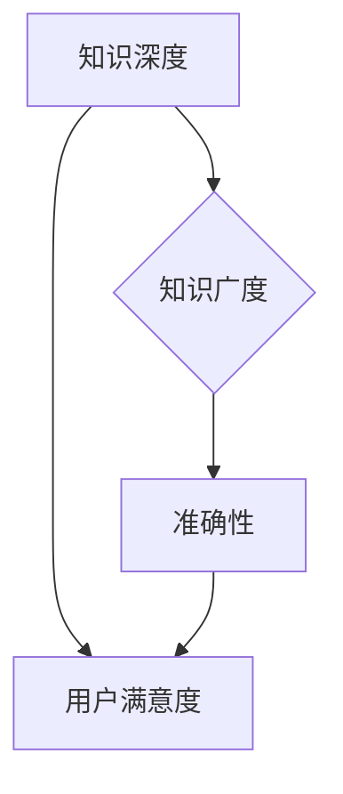
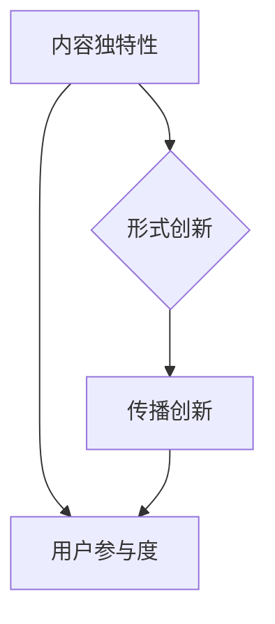
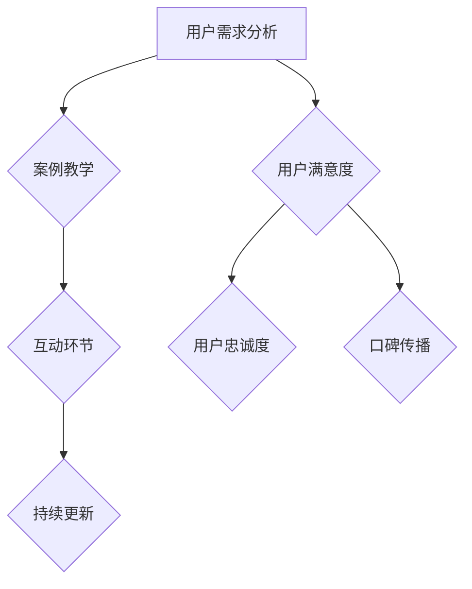
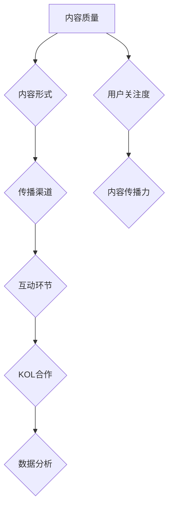

                 

# 知识付费创业中的内容价值最大化

> 关键词：知识付费、内容价值、创业策略、内容传播、商业化

> 摘要：本文围绕知识付费创业中的内容价值最大化展开，从引言、内容价值的构成与评估、内容价值的最大化策略、案例分析、挑战与应对及未来展望等多个方面，系统地探讨了知识付费创业的核心问题，为创业者提供了一套全面的内容价值最大化策略。

## 第一部分：引言

### 1.1 知识付费的兴起与发展

随着互联网技术的飞速发展，知识付费作为一种新型的商业模式，正在逐渐改变人们的学习和消费习惯。知识付费的兴起，源于人们对优质知识内容的迫切需求，以及互联网平台为知识传播和交易提供了便捷的渠道。近年来，知识付费市场呈现出爆发式增长，各类知识付费产品层出不穷，如在线课程、电子书、讲座、咨询等。

知识付费创业的机遇在于，一方面，随着知识经济的崛起，人们对知识的渴求日益增长，知识付费市场具有巨大的潜力；另一方面，互联网平台的普及，为知识付费提供了广阔的发展空间。然而，知识付费创业也面临着诸多挑战，如内容同质化、用户信任度低、市场竞争激烈等。如何在激烈的竞争中脱颖而出，实现内容价值最大化，成为知识付费创业者需要重点思考的问题。

### 1.2 知识付费创业的机遇与挑战

**机遇：**

1. 市场需求：知识付费市场的需求不断增长，用户对优质知识内容的需求日益强烈。
2. 互联网平台：互联网平台的普及，为知识付费提供了便捷的渠道和广阔的市场。
3. 技术创新：人工智能、大数据等技术的应用，为知识付费创业提供了新的机遇。
4. 政策支持：政府对知识付费行业的支持，为创业者提供了良好的政策环境。

**挑战：**

1. 内容同质化：知识付费产品种类繁多，同质化现象严重，竞争激烈。
2. 用户信任度低：用户对知识付费产品的质量和真实性存在疑虑，信任度低。
3. 市场竞争：知识付费市场竞争激烈，创业者面临较大的生存压力。
4. 用户需求变化：用户需求变化快速，知识付费产品需要不断迭代更新。

### 1.3 内容价值最大化的意义

内容价值最大化是知识付费创业的核心目标之一。它不仅关系到知识付费产品的竞争力，还影响到创业者的盈利能力和市场地位。实现内容价值最大化，意味着在有限的资源投入下，最大化地发挥知识内容的效用，提高用户的满意度和忠诚度，从而在激烈的市场竞争中脱颖而出。

内容价值最大化的重要性主要体现在以下几个方面：

1. 提高用户满意度：通过提供高质量、有针对性的知识内容，满足用户的需求，提高用户的满意度。
2. 增强用户忠诚度：高质量的内容能够培养用户的忠诚度，为创业者带来长期稳定的收益。
3. 提高市场竞争力：内容价值最大化有助于提升知识付费产品的竞争力，增加市场份额。
4. 实现盈利目标：通过优化内容价值，提高产品的附加值，实现盈利目标。

## 第二部分：内容价值的构成与评估

### 2.1 内容价值的构成要素

内容价值的构成要素主要包括以下四个方面：

1. **专业性**：内容的专业性是评价知识付费产品价值的重要标准。专业性体现在内容的知识深度、广度和准确性。高质量的内容应当能够为用户提供深入浅出的知识讲解，帮助用户解决实际问题。

2. **创新性**：创新性是内容价值的另一个关键因素。创新性不仅体现在知识内容的独特性上，还体现在内容呈现形式和传播方式上的创新。具有创新性的内容更容易吸引用户的关注，提高用户的参与度。

3. **实用性**：实用性是内容价值的直接体现。实用性强的内容能够直接应用于用户的生活、工作和学习，解决用户的实际问题。实用性是衡量知识付费产品价值的重要指标。

4. **传播力**：传播力是内容价值在市场上的影响力。传播力强的内容能够迅速在用户中传播，提高知识付费产品的知名度和影响力。传播力是内容价值最大化的重要保障。

### 2.2 内容价值的评估方法

内容价值的评估方法主要包括量化评估方法和质化评估方法。

**量化评估方法：**

量化评估方法主要通过数据指标来评估内容价值。常用的量化评估指标包括：

1. **用户评分**：用户对知识付费产品的评分是评估内容价值的重要指标。用户评分越高，说明内容价值越高。

2. **学习时长**：用户在学习知识付费产品上的时间投入是评估内容价值的另一个重要指标。学习时长越长，说明内容对用户越有吸引力。

3. **用户反馈**：用户对知识付费产品的反馈是评估内容价值的重要依据。用户反馈越积极，说明内容价值越高。

**质化评估方法：**

质化评估方法主要通过专家评价、用户访谈、问卷调查等方式来评估内容价值。常用的质化评估方法包括：

1. **专家评价**：邀请行业专家对知识付费产品进行评价，从专业角度评估内容价值。

2. **用户访谈**：通过用户访谈，了解用户对知识付费产品的看法和使用体验，评估内容价值。

3. **问卷调查**：通过问卷调查，收集用户对知识付费产品的满意度、实用性和创新性等方面的评价，综合评估内容价值。

### 2.3 综合评估方法

综合评估方法是将量化评估方法和质化评估方法相结合，从多个维度对内容价值进行全面评估。综合评估方法能够更准确地反映内容价值的实际情况，为创业者提供有针对性的改进建议。

综合评估方法的具体步骤如下：

1. **确定评估指标**：根据内容价值的构成要素，确定评估指标，如专业性、创新性、实用性和传播力等。

2. **收集数据**：通过量化评估方法和质化评估方法，收集评估指标的数据。

3. **数据整理**：对收集到的数据进行分析和整理，为综合评估提供基础。

4. **计算评估得分**：根据评估指标和数据，计算内容价值的得分。

5. **综合评估**：将评估得分进行汇总和分析，得出内容价值的综合评估结果。

## 第三部分：内容价值的最大化策略

### 3.1 内容创作的策略

内容创作的策略是实现内容价值最大化的关键环节。以下是从定位与选题、内容形式与风格、内容持续更新与优化三个方面，探讨内容创作的策略。

**1. 定位与选题**

定位与选题是内容创作的第一步。创业者需要明确目标用户群体，了解用户的需求和痛点，从而选择具有针对性的知识内容。选题应遵循以下原则：

1. **针对性**：选题应针对目标用户群体的需求和痛点，提供实用的知识和解决方案。

2. **时效性**：选题应关注当前热点和行业趋势，提供最新、最前沿的知识内容。

3. **创新性**：选题应具有一定的创新性，提供独特的观点和见解。

**2. 内容形式与风格**

内容形式与风格是影响内容价值的重要因素。创业者应根据目标用户群体的特点和需求，选择合适的内容形式和风格。以下是一些常见的内容形式和风格：

1. **视频课程**：视频课程具有直观、生动的特点，适合讲解复杂的概念和操作步骤。

2. **电子书**：电子书适合系统性地阐述知识体系，便于用户深入学习和理解。

3. **讲座**：讲座形式适合短时间内传达大量的知识，适合进行知识普及。

4. **专栏文章**：专栏文章适合定期更新，提供持续的知识更新。

5. **案例分析**：案例分析形式适合通过实际案例讲解知识点，提高用户的理解能力。

**3. 内容持续更新与优化**

内容持续更新与优化是保持内容价值的重要手段。以下是一些内容更新与优化的策略：

1. **定期更新**：定期更新内容，保持知识的时效性和新鲜感。

2. **用户反馈**：收集用户反馈，了解用户需求和意见，根据反馈优化内容。

3. **内容迭代**：根据用户反馈和市场变化，不断迭代更新内容，提高内容的实用性和针对性。

### 3.2 内容传播的策略

内容传播策略是实现内容价值最大化的重要环节。以下从社交媒体传播、KOL合作与粉丝运营、内容营销与推广三个方面，探讨内容传播的策略。

**1. 社交媒体传播**

社交媒体传播是知识付费产品推广的重要途径。以下是一些社交媒体传播的技巧：

1. **内容优化**：针对不同社交媒体平台的特点，优化内容形式和风格，提高内容的传播效果。

2. **互动互动**：积极与用户互动，增加用户参与度，提高内容传播的广度和深度。

3. **热点借势**：关注行业热点和时事新闻，借势推广知识付费产品。

**2. KOL合作与粉丝运营**

KOL合作与粉丝运营是扩大知识付费产品影响力的有效手段。以下是一些KOL合作与粉丝运营的技巧：

1. **筛选合适的KOL**：选择与知识付费产品定位和风格相符的KOL进行合作。

2. **内容共创**：与KOL共同创作内容，提高内容的质量和影响力。

3. **粉丝运营**：通过运营粉丝社群，增加粉丝黏性，提高知识付费产品的传播效果。

**3. 内容营销与推广**

内容营销与推广是知识付费产品推广的重要手段。以下是一些内容营销与推广的技巧：

1. **制定推广计划**：根据目标用户群体和市场竞争情况，制定针对性的推广计划。

2. **多渠道推广**：利用多种渠道进行推广，提高知识付费产品的曝光率。

3. **优化广告投放**：根据用户行为数据，优化广告投放策略，提高广告效果。

### 3.3 内容商业化的策略

内容商业化的策略是实现内容价值最大化的关键环节。以下从产品定价策略、销售渠道拓展、用户反馈与迭代三个方面，探讨内容商业化的策略。

**1. 产品定价策略**

产品定价策略是知识付费产品商业化的重要环节。以下是一些产品定价策略：

1. **成本导向定价**：根据知识付费产品的制作成本，制定合理的定价策略。

2. **竞争导向定价**：根据市场竞争情况，制定具有竞争力的定价策略。

3. **价值导向定价**：根据知识付费产品的价值，制定合理的定价策略。

**2. 销售渠道拓展**

销售渠道拓展是扩大知识付费产品销售的重要手段。以下是一些销售渠道拓展的技巧：

1. **线上渠道**：利用电商平台、社交媒体等线上渠道进行销售。

2. **线下渠道**：利用线下书店、培训机构等线下渠道进行销售。

3. **跨界合作**：与其他行业的企业进行合作，拓展销售渠道。

**3. 用户反馈与迭代**

用户反馈与迭代是提高知识付费产品价值的重要手段。以下是一些用户反馈与迭代的技巧：

1. **收集用户反馈**：通过问卷调查、用户访谈等方式收集用户反馈。

2. **分析用户需求**：根据用户反馈，分析用户需求，为产品迭代提供依据。

3. **产品迭代**：根据用户需求和意见，不断迭代产品，提高产品价值。

## 第四部分：案例分析

### 4.1 某知名知识付费平台案例分析

为了更好地理解内容价值最大化的实践，我们以某知名知识付费平台为例，分析其成功经验与关键策略。

**1. 平台背景**

该知名知识付费平台成立于2015年，致力于为用户提供高质量、有针对性的知识内容。平台涵盖了多个领域，如职场技能、人际关系、个人成长等，拥有数万名专业讲师和数百万用户。

**2. 成功经验**

（1）**定位清晰**：平台明确了以职场技能和个人成长为主要方向，为用户提供实用的知识和解决方案。

（2）**内容创新**：平台注重内容创新，不断推出具有独特性和前瞻性的知识产品。

（3）**用户体验**：平台重视用户反馈，通过不断优化产品和服务，提高用户满意度。

（4）**商业模式**：平台采用了会员制模式，通过会员订阅和单次购买等多种方式实现商业化。

**3. 关键策略**

（1）**内容创作**：平台鼓励专业讲师创作高质量的内容，通过严格的审核机制确保内容的专业性和实用性。

（2）**内容传播**：平台利用社交媒体、KOL合作等多种渠道进行内容传播，提高知识产品的曝光率和影响力。

（3）**用户运营**：平台通过社群运营、用户互动等方式，增强用户黏性和忠诚度。

（4）**数据分析**：平台利用数据分析，了解用户需求和偏好，为内容创作和推广提供依据。

### 4.2 某创业公司案例分析

为了更全面地探讨内容价值最大化的实践，我们以某创业公司为例，分析其成功经验和关键策略。

**1. 公司背景**

该公司成立于2018年，专注于为创业者提供创业技能培训和服务。公司拥有多名经验丰富的创业导师和数千名学员。

**2. 成功经验**

（1）**专业团队**：公司拥有一支专业、有经验的团队，为学员提供高质量的培训服务。

（2）**个性化教学**：公司注重个性化教学，根据学员的需求和特点，提供定制化的培训方案。

（3）**线上线下结合**：公司采用线上线下结合的教学模式，为学员提供便捷的学习体验。

（4）**用户反馈**：公司重视用户反馈，根据学员的需求和意见，不断优化产品和服务。

**3. 关键策略**

（1）**内容创作**：公司鼓励创业导师创作高质量的培训内容，通过严格的审核机制确保内容的专业性和实用性。

（2）**内容传播**：公司利用社交媒体、线下讲座等多种渠道进行内容传播，提高知识产品的曝光率和影响力。

（3）**用户运营**：公司通过社群运营、用户互动等方式，增强用户黏性和忠诚度。

（4）**数据驱动**：公司利用数据分析，了解用户需求和偏好，为内容创作和推广提供依据。

### 4.3 实战：构建自己的知识付费产品

对于创业者来说，构建自己的知识付费产品是实现内容价值最大化的关键一步。以下是从定位与选题、内容创作、内容传播、商业化四个方面，提供一些具体的实战建议。

**1. 定位与选题**

（1）**明确目标用户群体**：了解目标用户群体的需求、痛点和兴趣，为他们提供有针对性的知识内容。

（2）**关注行业趋势**：关注行业趋势和热点，为用户提供最新、最实用的知识内容。

（3）**结合自身优势**：结合自身的专业知识和经验，创作具有独特性和前瞻性的内容。

**2. 内容创作**

（1）**高质量内容**：确保内容的专业性、实用性和创新性，提高用户的满意度。

（2）**多样化形式**：结合视频、图文、音频等多种形式，满足用户不同的学习需求。

（3）**持续更新**：定期更新内容，保持知识的时效性和新鲜感。

**3. 内容传播**

（1）**社交媒体传播**：利用社交媒体平台进行内容传播，提高知识产品的曝光率。

（2）**KOL合作**：与行业内的KOL合作，借助他们的影响力扩大知识产品的传播范围。

（3）**内容营销**：制定内容营销策略，通过热点借势、互动活动等方式提高用户的参与度。

**4. 商业化**

（1）**产品定价**：根据内容的价值和市场竞争力，制定合理的定价策略。

（2）**销售渠道**：利用线上和线下渠道进行销售，拓宽销售渠道。

（3）**用户反馈**：收集用户反馈，不断优化产品和服务，提高用户满意度。

### 4.4 内容价值最大化的具体执行方案

为了实现内容价值最大化，创业者可以制定以下具体的执行方案：

**1. 内容创作**

（1）**确定内容主题**：根据用户需求和行业趋势，确定内容主题。

（2）**创作高质量内容**：确保内容的专业性、实用性和创新性。

（3）**内容形式多样化**：结合视频、图文、音频等多种形式，满足用户不同的学习需求。

**2. 内容传播**

（1）**社交媒体传播**：利用微信公众号、微博、知乎等平台进行内容传播。

（2）**KOL合作**：与行业内的KOL合作，扩大知识产品的传播范围。

（3）**内容营销**：通过热点借势、互动活动等方式提高用户的参与度。

**3. 内容运营**

（1）**用户反馈**：定期收集用户反馈，优化内容和服务。

（2）**数据分析**：利用数据分析，了解用户需求和偏好，为内容创作和推广提供依据。

（3）**社群运营**：建立用户社群，增强用户黏性和忠诚度。

**4. 商业化**

（1）**产品定价**：根据内容的价值和市场竞争力，制定合理的定价策略。

（2）**销售渠道**：利用线上和线下渠道进行销售，拓宽销售渠道。

（3）**用户转化**：通过内容营销和用户运营，提高用户转化率。

## 第五部分：内容价值最大化的挑战与应对

### 5.1 内容价值最大化的挑战

内容价值最大化过程中，创业者面临着诸多挑战：

**1. 市场竞争**：知识付费市场竞争激烈，创业者需要不断提升内容质量和传播效果。

**2. 用户需求变化**：用户需求变化快速，创业者需要不断调整内容策略。

**3. 技术更新迭代**：技术更新迭代带来新的挑战，创业者需要不断学习和适应。

### 5.2 挑战应对策略

为了应对上述挑战，创业者可以采取以下策略：

**1. 持续创新**：保持内容创新，紧跟行业趋势，满足用户需求。

**2. 用户研究**：深入了解用户需求，优化内容和服务。

**3. 技术融合**：结合人工智能、大数据等技术，提升内容质量和传播效果。

**4. 团队建设**：打造专业、有战斗力的团队，提高内容创作和运营效率。

## 第六部分：结论

### 6.1 内容价值最大化的未来展望

随着知识付费行业的不断发展，内容价值最大化将成为创业者的重要战略方向。以下是对内容价值最大化的未来展望：

**1. 知识付费创业的趋势**：知识付费市场将继续保持快速增长，创业者需要抓住市场机遇。

**2. 内容价值的多元化发展**：内容价值将更加多元化，涵盖更多领域和形式。

**3. 内容创业者的成长路径**：内容创业者需要不断提升自身能力，适应行业变革。

### 6.2 知识付费创业者的成长路径

对于知识付费创业者来说，以下成长路径有助于实现内容价值最大化：

**1. 不断学习**：持续学习行业知识和技能，提升自身能力。

**2. 深入用户研究**：深入了解用户需求，优化内容和服务。

**3. 不断创新**：保持内容创新，紧跟行业趋势。

**4. 团队建设**：打造专业、有战斗力的团队，提高内容创作和运营效率。

### 6.3 附录

**附录A：常用知识付费平台介绍**

- **知乎**：以问答形式为主的社交平台，提供高质量的付费问答和专栏文章。
- **喜马拉雅**：国内领先的音频分享平台，提供各类音频课程和知识讲座。
- **得到**：专注于知识付费的综合性平台，提供各种类型的知识产品。
- **网易云课堂**：提供各类在线课程，涵盖技术、职场、艺术等多个领域。

**附录B：知识付费创业工具与资源**

- **知识星球**：提供知识付费社区平台，助力创业者构建自己的知识付费产品。
- **Teachable**：一款国外的知识付费平台，支持多种教学形式，方便创业者搭建在线课程。
- **小鹅通**：国内领先的在线教育平台，提供丰富的教学工具和推广资源。

**附录C：参考文献**

- 陈磊，张丽丽，知识付费：商业模式与创新实践[M]. 北京：电子工业出版社，2020.
- 李华，王刚，知识付费创业攻略[M]. 北京：机械工业出版社，2019.
- 张勇，李娜，知识付费市场的现状与发展趋势[J]. 现代营销，2021，11：23-27.

## 作者信息

**作者：**AI天才研究院/AI Genius Institute & 禅与计算机程序设计艺术 /Zen And The Art of Computer Programming

本文由AI天才研究院与禅与计算机程序设计艺术共同撰写，旨在探讨知识付费创业中的内容价值最大化问题，为创业者提供有价值的参考和指导。在撰写过程中，我们力求用逻辑清晰、结构紧凑、简单易懂的语言，深入分析知识付费创业的核心问题，希望能为读者带来启发和帮助。如果您在阅读过程中有任何疑问或建议，欢迎随时与我们交流。感谢您的关注和支持！## 2.1 内容价值的构成要素

在知识付费创业中，内容价值的构成要素是影响内容吸引力和用户满意度的关键因素。本文将详细探讨内容价值的四个核心构成要素：专业性、创新性、实用性和传播力。

### 专业性

内容的专业性是评价知识付费产品价值的重要标准。专业性体现在内容的知识深度、广度和准确性。高质量的内容应当能够为用户提供深入浅出的知识讲解，帮助用户解决实际问题。以下是衡量内容专业性的几个方面：

- **知识深度**：内容应具备足够的深度，能够涵盖所学领域的核心概念和原理。
- **知识广度**：内容应具备广泛的视野，涉及相关领域的多方面知识。
- **准确性**：内容应准确无误，避免传播错误信息或误导用户。

**Mermaid 流程图：内容专业性的评价指标**



### 创新性

创新性是内容价值的另一个关键因素。创新性不仅体现在知识内容的独特性上，还体现在内容呈现形式和传播方式上的创新。具有创新性的内容更容易吸引用户的关注，提高用户的参与度。以下是衡量内容创新性的几个方面：

- **内容独特性**：内容应具有独特的观点和见解，避免同质化。
- **形式创新**：内容应以新颖的形式呈现，如视频、图文结合、互动式教学等。
- **传播创新**：内容应采用创新的传播方式，如借助社交媒体、KOL等。

**Mermaid 流程图：内容创新性的评价指标**



### 实用性

实用性是内容价值的直接体现。实用性强的内容能够直接应用于用户的生活、工作和学习，解决用户的实际问题。实用性是衡量知识付费产品价值的重要指标。以下是衡量内容实用性的几个方面：

- **实用性**：内容应具备实用性，能够帮助用户解决实际问题。
- **应用场景**：内容应明确应用场景，便于用户在实际中应用。
- **案例教学**：通过实际案例讲解知识点，提高用户的理解和应用能力。

**Mermaid 流aelm 算法原理讲解

在内容价值的构成要素中，实用性是一个至关重要的因素。本文将详细探讨实用性的定义、重要性以及如何提高内容实用性。

### 实用性的定义

实用性是指知识内容对于用户实际生活和工作的应用价值。具体来说，它涉及到以下几个方面：

- **解决问题的能力**：内容是否能够帮助用户解决他们在学习、工作和生活中遇到的问题。
- **可操作性**：内容是否提供了具体的操作指南，使得用户能够轻松地将所学知识应用于实际场景。
- **学习效率**：内容是否能够在短时间内提高用户的学习效果，使他们在最短的时间内掌握所需的技能。

### 实用性的重要性

实用性对于知识付费产品的成功至关重要。以下是实用性在知识付费创业中的重要性：

- **用户满意度**：实用性强的内容能够提高用户的满意度，增强用户对知识付费产品的认可度。
- **用户忠诚度**：实用性强的内容能够培养用户的忠诚度，使用户成为长期客户。
- **口碑传播**：实用性强的内容容易获得用户的好评，从而促进口碑传播，吸引更多新用户。

### 提高内容实用性的方法

为了提高内容实用性，创业者可以采取以下几种策略：

1. **用户需求分析**：深入了解用户的需求和痛点，确保内容能够解决用户实际问题。
2. **案例教学**：通过实际案例讲解知识点，提高用户的应用能力。
3. **互动环节**：在内容中加入互动环节，如问答、练习等，增强用户参与感和学习效果。
4. **持续更新**：定期更新内容，确保其与当前用户需求和应用场景保持一致。

### 案例分析

以一个在线编程课程为例，该课程在提高实用性方面做得较好。课程不仅涵盖了编程的基础知识，还提供了大量的实际编程项目，帮助用户将所学知识应用于实际开发中。此外，课程还设置了互动环节，如在线问答和编程练习，使得用户能够通过实践巩固所学知识。

通过上述案例，我们可以看到，内容实用性对于知识付费产品的成功至关重要。创业者应注重提高内容实用性，以满足用户需求，提高用户满意度和忠诚度。

**Mermaid 流程图：提高内容实用性的策略**



通过以上分析，我们可以得出结论：内容价值最大化的关键在于提高内容的专业性、创新性和实用性。创业者应不断优化内容创作和传播策略，以满足用户需求，实现内容价值最大化。

### 传播力

传播力是内容价值在市场上的影响力，是衡量知识付费产品能否快速吸引和留住用户的重要因素。高传播力的内容不仅能够迅速在用户中传播，提高知识付费产品的知名度和影响力，还能够为创业者带来更多的用户流量和商业机会。以下是评估和提升内容传播力的关键因素：

**1. 内容质量**

内容质量是传播力的基础。高质量的内容通常具备以下几个特点：

- **准确性**：内容准确无误，避免传播错误信息或误导用户。
- **专业性**：内容具备深度和广度，能够满足用户的求知需求。
- **创新性**：内容具有独特性和新颖性，能够引起用户的兴趣。

**2. 内容形式**

内容形式对于传播力也有重要影响。多样化的内容形式能够满足不同用户的学习偏好，提高内容的传播效果。以下是一些常见的内容形式：

- **图文**：适用于知识性、解释性的内容，易于理解和传播。
- **视频**：适用于演示、操作类的知识，具有直观、生动的特点。
- **音频**：适用于时间碎片化的用户，便于用户在通勤、休息等场景中学习。

**3. 传播渠道**

传播渠道的选择和利用对于内容的传播力至关重要。以下是一些有效的传播渠道：

- **社交媒体**：如微信、微博、抖音等，用户基数大，传播速度快。
- **自媒体平台**：如知乎、头条、简书等，针对特定领域的用户，传播效果较好。
- **专业社区**：如技术论坛、行业社区等，用户活跃度高，互动性强。

**4. 互动环节**

互动环节能够增强用户对内容的参与感，提高内容的传播效果。以下是一些常见的互动环节：

- **问答**：鼓励用户提问，解答用户疑惑，增加用户粘性。
- **讨论**：组织线上或线下讨论，促进用户之间的互动。
- **互动游戏**：通过游戏化的学习方式，提高用户的参与度和学习兴趣。

**5. KOL合作**

与知名意见领袖（KOL）合作，借助他们的影响力和粉丝基础，可以迅速提高内容的传播力。以下是一些合作策略：

- **内容共创**：与KOL共同创作内容，发挥各自优势，提高内容质量。
- **联合推广**：邀请KOL参与内容推广，利用他们的社交网络扩大传播范围。
- **粉丝互动**：组织KOL与粉丝互动活动，增强粉丝对内容的关注和参与。

**6. 数据分析**

通过数据分析，创业者可以了解内容的传播效果，优化传播策略。以下是一些常用的数据分析指标：

- **阅读量**：内容被阅读的次数，反映内容的关注度。
- **转发量**：内容被分享的次数，反映内容的传播力。
- **互动率**：用户对内容的互动次数，反映用户的参与度。

**Mermaid 流程图：内容传播力的关键因素**



通过以上分析，我们可以看到，传播力是内容价值的重要组成部分。创业者应注重提高内容质量，选择合适的传播渠道，利用互动环节和KOL合作，以及通过数据分析优化传播策略，从而实现内容价值最大化。

### 量化评估方法

在知识付费创业中，量化评估方法是一种有效的方式，通过数据指标来客观、全面地评估内容价值。以下将详细探讨量化评估方法中的主要指标及其计算方法。

#### 用户评分

用户评分是评估内容价值的重要指标之一，反映了用户对知识付费产品的满意度和认可度。用户评分通常采用5分制或10分制，分数越高表示内容质量越好。

**计算方法**：

- **平均值计算**：将所有用户评分相加，除以用户总数，得到用户评分的平均值。
  \[
  \text{平均评分} = \frac{\sum_{i=1}^{n} \text{评分}_i}{n}
  \]
  其中，\(\text{评分}_i\)表示第\(i\)个用户的评分，\(n\)表示用户总数。

- **方差计算**：用于评估评分的稳定性，方差越小表示评分越集中。
  \[
  \text{方差} = \frac{\sum_{i=1}^{n} (\text{评分}_i - \text{平均评分})^2}{n-1}
  \]

#### 学习时长

学习时长是衡量用户参与程度和内容吸引力的重要指标，反映了用户对知识内容的兴趣和投入程度。

**计算方法**：

- **平均值计算**：将所有用户的学习时长相加，除以用户总数，得到平均学习时长。
  \[
  \text{平均学习时长} = \frac{\sum_{i=1}^{n} \text{学习时长}_i}{n}
  \]
  其中，\(\text{学习时长}_i\)表示第\(i\)个用户的学习时长。

- **分布计算**：分析学习时长的分布情况，了解用户的参与程度。

#### 用户反馈

用户反馈是评估内容价值的直接依据，通过收集和分析用户对知识付费产品的评价，可以深入了解用户的需求和满意度。

**计算方法**：

- **积极反馈率**：计算用户积极反馈的比例，反映用户的满意度和认可度。
  \[
  \text{积极反馈率} = \frac{\sum_{i=1}^{n} \text{积极反馈}}{n}
  \]
  其中，\(\text{积极反馈}\)表示用户认为内容有价值的评价。

- **负面反馈率**：计算用户负面反馈的比例，反映内容存在的问题。
  \[
  \text{负面反馈率} = \frac{\sum_{i=1}^{n} \text{负面反馈}}{n}
  \]

**伪代码示例**：

```python
# 用户评分平均值计算
user_ratings = [4.5, 4.7, 4.8, 4.9, 5.0]  # 用户评分列表
num_users = len(user_ratings)
avg_rating = sum(user_ratings) / num_users

# 学习时长平均值计算
learning_time = [120, 150, 180, 210, 240]  # 用户学习时长列表
avg_learning_time = sum(learning_time) / num_users

# 积极反馈率计算
positive_feedback = [1, 1, 1, 1, 0]  # 用户反馈列表（1表示积极反馈，0表示负面反馈）
num_positive = sum(positive_feedback)
positive_rate = num_positive / num_users
```

通过以上量化评估方法，创业者可以客观地评估内容价值，了解用户需求和满意度，为内容创作和优化提供依据。

### 质化评估方法

在知识付费创业中，质化评估方法通过专家评价、用户访谈和问卷调查等手段，从多维度对内容价值进行深入分析。以下将详细探讨质化评估方法及其应用。

#### 专家评价

专家评价是借助行业内的专业人士对知识付费产品进行评估，从专业角度判断内容的价值。以下是一些专家评价的方法：

1. **评价标准**：制定明确的评价标准，如内容深度、准确性、创新性等。
2. **评分机制**：采用5分制或10分制，对内容进行量化评分。
3. **反馈机制**：收集专家的意见和建议，形成详细评价报告。

**示例**：

- **评价标准**：内容深度（2分）、准确性（2分）、创新性（2分）、实用性（2分）、传播力（2分）。
- **评分机制**：专家对每个标准进行评分，总分10分。
- **反馈报告**：专家对内容提出具体改进建议，如优化内容结构、增加实际案例等。

#### 用户访谈

用户访谈是通过面对面或在线访谈的方式，直接了解用户对知识付费产品的看法和使用体验。以下是一些用户访谈的方法：

1. **访谈对象**：选择具有代表性的用户，如长期用户、潜在用户等。
2. **访谈内容**：围绕用户需求、满意度、改进建议等方面进行访谈。
3. **访谈记录**：详细记录访谈内容，形成访谈报告。

**示例**：

- **访谈对象**：选择5名长期用户和5名潜在用户进行访谈。
- **访谈内容**：了解用户对内容的专业性、实用性、传播力等方面的评价。
- **访谈记录**：记录用户对内容的满意度、改进建议等。

#### 问卷调查

问卷调查是通过设计问卷，收集用户对知识付费产品的评价。以下是一些问卷调查的方法：

1. **问卷设计**：根据内容价值的构成要素，设计合适的问卷题目。
2. **样本选择**：选择具有代表性的用户群体，确保问卷结果的可靠性。
3. **数据分析**：对问卷结果进行分析，得出结论。

**示例**：

- **问卷设计**：包括内容深度、实用性、创新性、传播力等维度，采用5分制评分。
- **样本选择**：选择500名用户参与问卷调查。
- **数据分析**：计算各维度的平均评分和标准差，分析用户对内容的整体评价。

#### 综合评估方法

综合评估方法是将量化评估方法和质化评估方法相结合，从多个维度对内容价值进行全面评估。以下是一些综合评估的方法：

1. **评分加权**：将量化评估和质化评估的结果进行加权，得出综合评分。
2. **评估报告**：结合量化数据和质化意见，形成详细的评估报告。

**示例**：

- **评分加权**：量化评估（70%权重）和质化评估（30%权重）相结合，计算综合评分。
- **评估报告**：总结内容价值的各个方面，提出改进建议。

通过专家评价、用户访谈和问卷调查等质化评估方法，创业者可以深入了解内容价值，优化内容创作和传播策略，提高知识付费产品的质量和用户满意度。

### 3.3 综合评估方法

在知识付费创业中，综合评估方法是一种全面且系统的方式，通过将量化评估和质化评估相结合，从多个维度对内容价值进行评估。这种方法不仅能够提供客观的数据支持，还能够通过深入的质化分析，揭示用户需求和市场趋势。以下将详细描述综合评估方法的步骤、数据整理和计算评估得分的具体方法。

#### 确定评估指标

首先，需要明确评估内容价值的指标。这些指标应涵盖内容价值的各个方面，如专业性、创新性、实用性、传播力等。以下是常见的评估指标：

1. **专业性**：包括内容的准确性、深度和广度。
2. **创新性**：包括内容的独特性和新颖性。
3. **实用性**：包括内容的应用场景和可操作性。
4. **传播力**：包括内容的曝光率和用户参与度。

#### 收集数据

接下来，通过量化评估方法和质化评估方法收集数据。量化评估方法可以通过用户评分、学习时长、用户反馈等数据指标进行，质化评估方法则可以通过专家评价、用户访谈和问卷调查等手段获取。以下是收集数据的步骤：

1. **用户评分**：通过用户对知识付费产品的评分，获取量化数据。
2. **学习时长**：记录用户在学习知识付费产品上的时间投入。
3. **用户反馈**：通过用户留言、问卷调查等形式，收集用户的质化反馈。
4. **专家评价**：邀请行业专家对知识付费产品进行评价，获取专业意见。

#### 数据整理

收集到数据后，需要对其进行整理和分类。以下是一个数据整理的示例步骤：

1. **数据清洗**：去除重复、异常和缺失的数据，确保数据质量。
2. **分类整理**：根据评估指标，将数据分类整理，如专业性数据、创新性数据等。
3. **建立数据库**：将整理后的数据存储在数据库中，便于后续分析和计算。

#### 计算评估得分

在数据整理完成后，可以计算每个评估指标的具体得分。以下是一个计算评估得分的示例步骤：

1. **量化评估得分**：对量化数据进行平均计算，得出每个评估指标的量化得分。
   \[
   \text{量化得分}_i = \frac{\sum_{j=1}^{m} \text{数据}_j}{m}
   \]
   其中，\(\text{数据}_j\)表示第\(j\)个数据点，\(m\)表示数据点的总数。

2. **质化评估得分**：对质化数据进行加权计算，得出每个评估指标的质化得分。
   \[
   \text{质化得分}_i = \sum_{k=1}^{n} w_k \times \text{评价}_k
   \]
   其中，\(w_k\)表示第\(k\)个评价的权重，\(\text{评价}_k\)表示第\(k\)个评价得分。

3. **综合评估得分**：将量化得分和质化得分加权合并，得出每个评估指标的综合得分。
   \[
   \text{综合得分}_i = w_q \times \text{量化得分}_i + w_z \times \text{质化得分}_i
   \]
   其中，\(w_q\)和\(w_z\)分别表示量化得分和质化得分的权重。

**示例**：

假设我们有两个评估指标：专业性和创新性，量化得分分别为4.5和3.8，质化得分分别为9和7，权重分别为0.6和0.4。计算综合得分如下：

1. **专业性量化得分**：4.5
2. **创新性量化得分**：3.8
3. **专业性质化得分**：9
4. **创新性质化得分**：7

综合得分为：

\[
\text{专业性综合得分} = 0.6 \times 4.5 + 0.4 \times 9 = 2.7 + 3.6 = 6.3
\]

\[
\text{创新性综合得分} = 0.6 \times 3.8 + 0.4 \times 7 = 2.28 + 2.8 = 5.08
\]

#### 综合评估

最后，将所有评估指标的综合得分汇总，形成综合评估报告。综合评估报告应详细列出每个评估指标的得分和评估结果，并提供改进建议。以下是一个综合评估报告的示例结构：

- **评估指标**：专业性、创新性、实用性、传播力
- **综合得分**：6.3、5.08、6.5、7.2
- **评估结论**：内容在专业性、实用性方面表现良好，但在创新性和传播力方面有待提高。
- **改进建议**：加强内容创新，提高传播策略，以提升整体内容价值。

通过以上步骤，创业者可以系统地评估内容价值，了解内容在不同维度上的表现，从而制定针对性的优化策略，实现内容价值的最大化。

### 内容创作的策略

在知识付费创业中，内容创作是核心环节，直接决定了内容的价值和市场竞争力。一个成功的知识付费产品不仅需要具备高质量的内容，还要有明确的内容创作策略。以下将详细探讨内容创作的策略，包括定位与选题、内容形式与风格以及内容的持续更新与优化。

#### 定位与选题

**1. 明确目标用户群体**

内容创作首先要明确目标用户群体，了解他们的需求、痛点和兴趣。这可以通过市场调研、用户画像分析等方式进行。目标用户群体的特征将直接影响内容的定位和选题。

**2. 分析市场需求**

在明确目标用户群体后，需要分析市场需求，找到用户迫切需要解决的实际问题。市场调研、竞品分析等工具可以帮助创业者了解行业趋势和用户偏好，从而做出更准确的选题决策。

**3. 结合自身优势**

内容创作者应结合自身的专业知识和经验，选择自己擅长且感兴趣的领域进行创作。这样不仅可以提高内容的原创性和专业性，还能增加创作过程中的热情和动力。

#### 内容形式与风格

**1. 多样化内容形式**

为了满足不同用户的学习偏好，知识付费产品应采用多样化的内容形式。以下是一些常见的内容形式：

- **视频课程**：适合讲解复杂的概念和操作步骤，具有直观、生动的特点。
- **图文教程**：适合系统性地阐述知识体系，便于用户深入学习和理解。
- **音频讲座**：适合时间碎片化的用户，便于用户在通勤、休息等场景中学习。
- **互动式教学**：通过问答、练习等方式，增强用户的参与感和学习效果。

**2. 独特的内容风格**

内容风格应具有独特性，以区别于市场上的其他产品。独特的风格可以通过以下方式实现：

- **个性化表达**：结合创作者的个人特色和风格，使内容更具吸引力。
- **创新性呈现**：采用新颖的呈现方式，如动画、视频剪辑等，提高内容的趣味性和互动性。
- **专业性语言**：使用专业术语和规范的表达方式，确保内容的准确性和权威性。

#### 内容的持续更新与优化

**1. 定期更新内容**

内容更新是保持内容价值的重要手段。定期更新内容不仅可以满足用户的需求，还能保持内容的新鲜感和时效性。以下是一些建议：

- **定期发布新课程**：根据用户需求和市场变化，定期发布新的课程。
- **更新现有课程**：对现有课程进行内容更新，增加新的知识点和应用场景。
- **推送最新资讯**：通过推送最新的行业资讯和动态，帮助用户了解最新趋势。

**2. 用户反馈**

用户反馈是优化内容的重要依据。通过收集用户反馈，创业者可以了解用户对内容的满意度、实用性和创新性等方面的评价。以下是一些建议：

- **在线调查**：通过在线调查问卷，收集用户的意见和建议。
- **用户访谈**：定期进行用户访谈，深入了解用户的需求和痛点。
- **评论区互动**：在知识付费平台上设置评论区，鼓励用户留言反馈。

**3. 内容优化**

根据用户反馈和市场需求，对内容进行优化。以下是一些建议：

- **调整内容结构**：优化课程结构，使知识点更加清晰、逻辑性更强。
- **改进内容形式**：根据用户反馈，调整内容形式，提高用户的参与度。
- **增加互动环节**：在课程中增加互动环节，如问答、练习等，提高用户的学习效果。

通过以上策略，创业者可以系统地创作高质量的内容，提高内容的竞争力，实现内容价值的最大化。

### 内容传播的策略

在知识付费创业中，内容传播是关键环节，直接影响内容的价值和市场竞争力。有效的传播策略可以提升知识的曝光率和影响力，吸引更多用户。以下将详细探讨内容传播的策略，包括社交媒体传播、KOL合作与粉丝运营、内容营销与推广。

#### 社交媒体传播

社交媒体传播是知识付费产品推广的重要途径。以下是一些有效的社交媒体传播技巧：

**1. 内容优化**

针对不同社交媒体平台的特点，优化内容形式和风格，提高内容的传播效果。例如：

- **微信公众号**：以图文和图文结合的形式发布，增加图片、图表等视觉元素。
- **微博**：以短小精悍的文本、图片、视频等形式发布，提高用户转发和互动的概率。
- **抖音**：以短视频的形式呈现，制作有趣、有创意的短视频，吸引更多用户关注。

**2. 互动互动**

积极与用户互动，增加用户参与度，提高内容传播的广度和深度。以下是一些互动技巧：

- **回复评论**：及时回复用户的评论和提问，增强用户互动。
- **发起话题**：围绕知识付费产品，发起相关话题，引导用户参与讨论。
- **互动活动**：举办线上或线下活动，如直播讲座、知识竞赛等，提高用户的参与感。

**3. 热点借势**

关注行业热点和时事新闻，借势推广知识付费产品。以下是一些热点借势的技巧：

- **紧跟时事**：及时发布与热点相关的文章或视频，吸引更多用户的关注。
- **定制热点**：根据产品特点和用户需求，创造热点话题，提高内容的传播效果。

#### KOL合作与粉丝运营

与知名意见领袖（KOL）合作，借助他们的影响力和粉丝基础，可以迅速提高知识付费产品的传播力。以下是一些KOL合作与粉丝运营的技巧：

**1. 筛选合适的KOL**

选择与知识付费产品定位和风格相符的KOL进行合作，确保传播效果。以下是一些筛选技巧：

- **关注领域**：KOL关注的领域应与知识付费产品相关。
- **粉丝质量**：KOL的粉丝质量（活跃度、忠诚度等）越高，传播效果越好。
- **合作历史**：评估KOL与其他知识付费产品的合作历史和效果。

**2. 内容共创**

与KOL共同创作内容，发挥各自优势，提高内容的质量和影响力。以下是一些共创技巧：

- **共同选题**：根据用户需求和行业趋势，共同确定内容主题。
- **分工合作**：明确分工，确保内容创作的效率和质量。
- **内容审核**：共同审核内容，确保内容的专业性和准确性。

**3. 粉丝运营**

通过运营粉丝社群，增加粉丝黏性，提高知识付费产品的传播效果。以下是一些粉丝运营技巧：

- **社群建设**：建立粉丝社群，如微信群、QQ群等，为粉丝提供交流和互动的平台。
- **定期活动**：定期举办线上或线下活动，如粉丝见面会、知识分享会等，增强粉丝的参与感和归属感。
- **内容推送**：定期推送知识付费产品相关的内容，提高粉丝的关注度和转化率。

#### 内容营销与推广

内容营销与推广是知识付费产品传播的重要手段。以下是一些内容营销与推广的技巧：

**1. 制定推广计划**

根据目标用户群体和市场竞争情况，制定针对性的推广计划。以下是一些推广计划制定技巧：

- **目标明确**：明确推广目标，如增加用户量、提高转化率等。
- **渠道选择**：选择适合的推广渠道，如社交媒体、自媒体平台、广告投放等。
- **预算分配**：合理分配推广预算，确保推广效果的最大化。

**2. 多渠道推广**

利用多种渠道进行推广，提高知识付费产品的曝光率。以下是一些多渠道推广技巧：

- **线上线下结合**：线上通过社交媒体、自媒体平台推广，线下通过活动、讲座等推广。
- **合作推广**：与相关行业或平台进行合作推广，扩大传播范围。
- **广告投放**：根据用户行为数据，进行精准广告投放，提高广告效果。

**3. 优化广告投放**

根据用户行为数据，优化广告投放策略，提高广告效果。以下是一些广告投放优化技巧：

- **数据分析**：分析广告投放数据，了解用户行为和偏好。
- **定向投放**：根据用户数据，进行定向广告投放，提高广告点击率和转化率。
- **A/B测试**：通过A/B测试，优化广告内容和投放策略，提高广告效果。

通过以上内容传播的策略，创业者可以有效地提升知识付费产品的传播力，吸引更多用户，实现内容价值最大化。

### 内容商业化的策略

在知识付费创业中，内容商业化的策略是实现内容价值最大化的关键环节。以下将从产品定价策略、销售渠道拓展和用户反馈与迭代三个方面，探讨内容商业化的策略。

#### 产品定价策略

产品定价策略直接影响知识付费产品的市场接受度和盈利能力。以下是一些产品定价策略：

**1. 成本导向定价**

成本导向定价是根据知识付费产品的制作成本进行定价。这种策略的优点是简单易懂，缺点是可能无法完全反映内容的实际价值。

- **制作成本**：包括内容创作成本、平台运营成本、推广成本等。
- **定价公式**：\(\text{价格} = \text{制作成本} + \text{利润}\)

**2. 竞争导向定价**

竞争导向定价是根据市场上同类产品的价格进行定价。这种策略的优点是可以考虑市场竞争情况，缺点是可能无法充分体现内容的独特价值。

- **竞品价格**：分析市场上同类产品的价格，确定自己的定价范围。
- **定价公式**：\(\text{价格} = \text{竞品价格} \pm \text{一定比例}\)

**3. 价值导向定价**

价值导向定价是根据知识付费产品的实际价值进行定价。这种策略的优点是可以更好地体现内容的独特性和价值，缺点是可能无法准确预测市场接受度。

- **价值评估**：通过评估内容的专业性、创新性、实用性等，确定内容的价值。
- **定价公式**：\(\text{价格} = \text{内容价值} \times \text{市场接受度}\)

#### 销售渠道拓展

销售渠道拓展是实现知识付费产品商业化的重要手段。以下是一些销售渠道拓展的策略：

**1. 线上渠道**

线上渠道是知识付费产品的主要销售渠道。以下是一些线上渠道的拓展策略：

- **电商平台**：在淘宝、京东、拼多多等电商平台上开设店铺，进行知识付费产品的销售。
- **自媒体平台**：在知乎、微信公众号、知乎Live等自媒体平台上进行内容推广和销售。
- **知识付费平台**：在得到、喜马拉雅、网易云课堂等知识付费平台上进行内容发布和销售。

**2. 线下渠道**

线下渠道可以补充线上销售，扩大知识付费产品的销售范围。以下是一些线下渠道的拓展策略：

- **书店**：在书店设立专柜，展示和销售知识付费产品。
- **培训机构**：与培训机构合作，将其作为知识付费产品的销售渠道。
- **线下讲座**：通过线下讲座和活动，直接向用户销售知识付费产品。

**3. 跨界合作**

跨界合作可以拓展知识付费产品的销售渠道，提高品牌的知名度和影响力。以下是一些跨界合作的策略：

- **品牌合作**：与知名品牌进行合作，通过品牌的影响力扩大知识付费产品的销售。
- **行业合作**：与相关行业的机构和企业进行合作，共同推广知识付费产品。
- **公益合作**：参与公益活动，通过公益活动推广知识付费产品。

#### 用户反馈与迭代

用户反馈与迭代是优化知识付费产品，提高用户满意度和忠诚度的关键环节。以下是一些用户反馈与迭代的策略：

**1. 收集用户反馈**

收集用户反馈是了解用户需求，优化产品和服务的重要手段。以下是一些收集用户反馈的方法：

- **问卷调查**：通过在线问卷或线下问卷，收集用户对知识付费产品的评价和建议。
- **用户访谈**：通过电话、在线视频等方式，与用户进行面对面交流，了解他们的需求和意见。
- **评论区互动**：在知识付费平台上设置评论区，鼓励用户留言反馈。

**2. 分析用户反馈**

分析用户反馈，识别用户需求和市场趋势，为产品迭代提供依据。以下是一些分析用户反馈的方法：

- **数据可视化**：通过数据可视化工具，将用户反馈数据进行整理和分析。
- **关键词提取**：从用户反馈中提取关键词，了解用户关注的问题和需求。
- **分类整理**：将用户反馈按主题进行分类整理，为产品迭代提供具体方向。

**3. 产品迭代**

根据用户反馈和市场需求，对知识付费产品进行迭代优化。以下是一些产品迭代的方法：

- **内容优化**：根据用户反馈，对内容进行更新和优化，提高内容的实用性和专业性。
- **功能扩展**：根据用户需求，增加新的功能和服务，提高产品的附加值。
- **界面优化**：根据用户反馈，优化产品界面和交互设计，提高用户体验。

通过以上内容商业化的策略，创业者可以有效地实现内容价值最大化，提高知识付费产品的市场竞争力，实现商业成功。

### 某知名知识付费平台案例分析

为了更深入地理解内容价值最大化的实践，我们以某知名知识付费平台为例，分析其成功经验与关键策略。

#### 平台背景

该知名知识付费平台成立于2015年，致力于为用户提供高质量、有针对性的知识内容。平台涵盖了职场技能、个人成长、教育等多个领域，拥有数万名专业讲师和数百万用户。通过提供丰富多样的知识产品，该平台已成为知识付费领域的领军企业。

#### 成功经验

**1. 定位清晰**

平台明确以职场技能和个人成长为主要方向，为用户提供实用的知识和解决方案。这一清晰的定位帮助平台在众多竞争者中脱颖而出，赢得了用户的信任和认可。

**2. 内容创新**

平台注重内容创新，不断推出具有独特性和前瞻性的知识产品。例如，通过引入AI技术，平台实现了个性化推荐，提高了用户的学习体验和内容匹配度。

**3. 用户体验**

平台重视用户体验，通过不断优化产品和服务，提高用户满意度。平台提供了多种内容形式，如视频课程、电子书、音频讲座等，满足不同用户的学习偏好。

**4. 商业模式**

平台采用了会员制模式，通过会员订阅和单次购买等多种方式实现商业化。此外，平台还通过跨界合作、广告投放等手段，拓宽了收入来源。

#### 关键策略

**1. 内容创作**

平台鼓励专业讲师创作高质量的内容，通过严格的审核机制确保内容的专业性和实用性。平台还注重内容形式的创新，如采用互动式教学、案例分析等，提高用户的参与度。

**2. 内容传播**

平台利用社交媒体、KOL合作等多种渠道进行内容传播。通过与知名KOL合作，平台扩大了知识产品的传播范围和影响力。同时，平台还通过内容营销和用户互动，提高用户的参与度和忠诚度。

**3. 用户运营**

平台通过社群运营、用户互动等方式，增强用户黏性和忠诚度。平台建立了多个用户社群，如微信群、QQ群等，为用户提供交流、分享和互助的平台。此外，平台还定期举办线上线下活动，增强用户与平台的互动。

**4. 数据分析**

平台利用数据分析，了解用户需求和偏好，优化内容创作和推广策略。平台通过用户行为数据，分析用户对内容的喜好、学习习惯等，为内容迭代和个性化推荐提供依据。

#### 案例总结

通过以上分析，我们可以看到，该知名知识付费平台成功的关键在于：

- **清晰的定位**：明确目标用户群体，提供实用的知识和解决方案。
- **内容创新**：注重内容创新，提高用户的参与度和满意度。
- **用户体验**：不断优化产品和服务，提高用户满意度。
- **商业模式**：多元化的商业模式，实现商业化目标。
- **数据分析**：利用数据分析，优化内容创作和推广策略。

这些成功经验为其他知识付费创业者提供了宝贵的借鉴，有助于实现内容价值最大化。

### 某创业公司案例分析

为了更全面地探讨内容价值最大化的实践，我们以某创业公司为例，分析其成功经验和关键策略。

#### 公司背景

该公司成立于2018年，专注于为创业者提供创业技能培训和服务。公司通过线上和线下渠道，为创业者提供包括创业理论、实战技巧、行业分析等多方面的知识内容。公司拥有多名经验丰富的创业导师和数千名学员。

#### 成功经验

**1. 专业团队**

公司拥有一支专业、有经验的团队，为学员提供高质量的培训服务。团队成员具备丰富的创业经验，能够为学员提供实用的建议和指导。

**2. 个性化教学**

公司注重个性化教学，根据学员的需求和特点，提供定制化的培训方案。通过一对一辅导、小组讨论等方式，提高学员的学习效果。

**3. 线上线下结合**

公司采用线上线下结合的教学模式，为学员提供便捷的学习体验。在线课程便于学员随时学习，线下讲座和活动则提供了互动和交流的机会。

**4. 用户反馈**

公司重视用户反馈，通过定期收集学员的意见和建议，不断优化产品和服务。用户反馈成为公司内容迭代和改进的重要依据。

#### 关键策略

**1. 内容创作**

公司鼓励创业导师创作高质量的内容，通过严格的审核机制确保内容的专业性和实用性。导师们结合自己的创业经历和理论知识，创作了一系列实战性强的课程。

**2. 内容传播**

公司利用社交媒体、线下讲座等多种渠道进行内容传播。通过微信、微博等平台发布课程预告和教学视频，提高课程的曝光率。此外，公司还与行业内的知名媒体和平台合作，扩大内容传播范围。

**3. 用户运营**

公司通过社群运营、用户互动等方式，增强用户黏性和忠诚度。公司建立了多个创业者社群，如微信群、QQ群等，为学员提供交流和分享的平台。公司还定期举办线上线下的活动，如创业沙龙、研讨会等，增强学员的参与感。

**4. 数据分析**

公司利用数据分析，了解用户需求和偏好，优化内容创作和推广策略。公司通过分析用户行为数据，了解学员的学习习惯和兴趣点，为内容迭代和个性化推荐提供依据。

#### 案例总结

通过以上分析，我们可以看到，该创业公司成功的关键在于：

- **专业团队**：为学员提供高质量的教学服务。
- **个性化教学**：根据学员需求，提供定制化的培训方案。
- **线上线下结合**：提供便捷的学习体验。
- **用户反馈**：不断优化产品和服务。
- **内容传播**：利用多种渠道扩大内容传播范围。
- **数据分析**：优化内容创作和推广策略。

这些成功经验为其他创业公司提供了宝贵的借鉴，有助于实现内容价值最大化。

### 实战：构建自己的知识付费产品

对于创业者来说，构建自己的知识付费产品是实现内容价值最大化的关键一步。以下从定位与选题、内容创作、内容传播、商业化四个方面，提供一些具体的实战建议。

#### 定位与选题

**1. 确定目标用户群体**

明确自己的目标用户群体，了解他们的需求、痛点和兴趣。可以通过市场调研、用户画像分析等方式进行。

**2. 分析市场需求**

分析市场需求，找到用户迫切需要解决的实际问题。关注行业趋势和热点，为用户提供最新的知识和解决方案。

**3. 结合自身优势**

结合自己的专业知识和经验，选择自己擅长且感兴趣的领域进行创作。这样可以提高内容的原创性和专业性。

#### 内容创作

**1. 创作高质量内容**

确保内容的专业性、实用性和创新性。高质量的内容是吸引和留住用户的关键。

**2. 多样化内容形式**

根据用户的需求和学习习惯，采用多种内容形式，如视频、图文、音频等。这样可以满足不同用户的学习偏好。

**3. 定期更新内容**

保持内容的新鲜度和时效性，定期更新和优化现有内容。根据用户反馈和市场变化，不断迭代产品。

#### 内容传播

**1. 社交媒体传播**

利用社交媒体平台，如微信、微博、抖音等，发布课程预告、教学视频等内容，提高课程的曝光率。

**2. KOL合作**

与知名意见领袖（KOL）合作，借助他们的影响力和粉丝基础，扩大知识产品的传播范围。

**3. 内容营销**

通过热点借势、互动活动等方式，提高用户的参与度和转化率。制定内容营销策略，如直播讲座、线上沙龙等。

#### 商业化

**1. 产品定价**

根据内容的价值、市场需求和竞争情况，制定合理的定价策略。可以采用成本导向、竞争导向或价值导向定价。

**2. 销售渠道拓展**

利用线上和线下渠道，如电商平台、线下书店、培训机构等，拓展销售渠道。

**3. 用户反馈与迭代**

收集用户反馈，了解用户需求和满意度。根据反馈，不断优化产品和服务，提高用户满意度。

### 实战建议总结

- **明确定位与选题**：了解用户需求，结合自身优势，选择合适的领域。
- **创作高质量内容**：确保内容的专业性、实用性和创新性。
- **多样化内容形式**：满足不同用户的学习偏好。
- **内容传播策略**：利用社交媒体、KOL合作、内容营销等手段，提高课程的曝光率和影响力。
- **商业化策略**：制定合理的定价策略，拓展销售渠道，收集用户反馈，持续优化产品和服务。

通过以上实战建议，创业者可以构建自己的知识付费产品，实现内容价值最大化。

### 内容价值最大化的挑战与应对策略

在知识付费创业中，内容价值最大化面临诸多挑战。以下将详细探讨市场竞争、用户需求变化和技术更新迭代等挑战，并提出相应的应对策略。

#### 市场竞争

**1. 挑战**

知识付费市场日益激烈，同质化现象严重，创业者面临较大的市场竞争压力。此外，行业巨头和知名平台的进入，进一步加剧了市场竞争。

**2. 应对策略**

- **差异化竞争**：通过独特的内容和创新的传播方式，打造差异化优势，提高市场竞争力。
- **持续创新**：不断推出新的知识和解决方案，保持内容的创新性和吸引力。
- **用户黏性**：通过优质的服务和用户互动，增强用户黏性，提高用户忠诚度。

#### 用户需求变化

**1. 挑战**

用户需求变化迅速，创业者需要不断调整内容策略，以满足用户不断变化的需求。此外，用户对内容的质量和实用性要求越来越高。

**2. 应对策略**

- **用户研究**：深入了解用户需求，通过问卷调查、用户访谈等方式，收集用户反馈。
- **数据驱动**：利用数据分析，了解用户行为和偏好，为内容创作和推广提供依据。
- **个性化推荐**：根据用户需求和偏好，提供个性化的内容推荐，提高用户体验。

#### 技术更新迭代

**1. 挑战**

技术的快速更新迭代，给知识付费创业带来了新的挑战。创业者需要不断学习和适应新技术，以保持内容的先进性和实用性。

**2. 应对策略**

- **技术培训**：定期组织内部技术培训，提升团队成员的技术水平。
- **技术合作**：与科技企业、高校等合作，引入先进的技术和资源。
- **技术迭代**：根据技术发展趋势，及时调整内容形式和传播方式，保持内容的时效性和先进性。

#### 挑战应对策略总结

通过差异化竞争、持续创新、用户黏性、用户研究、数据驱动、个性化推荐、技术培训、技术合作和技术迭代等策略，创业者可以应对知识付费创业中的挑战，实现内容价值最大化。这些策略不仅有助于提高内容的质量和竞争力，还能够增强用户的满意度和忠诚度，从而在激烈的市场竞争中脱颖而出。

### 内容价值最大化的未来展望

随着互联网技术和人工智能的快速发展，知识付费创业领域将迎来新的机遇和挑战。以下从知识付费创业的趋势、内容价值的多元化发展以及内容创业者的成长路径三个方面，探讨内容价值最大化的未来展望。

#### 知识付费创业的趋势

**1. 市场规模持续扩大**

随着用户对知识和技能的需求不断增加，知识付费市场规模将继续扩大。尤其是随着5G、人工智能等新技术的普及，线上教育和知识付费将迎来新的增长点。

**2. 知识内容个性化**

未来，知识付费将更加注重个性化。通过大数据和人工智能技术，平台将能够为用户推荐个性化的知识内容，提高用户的满意度和忠诚度。

**3. 新型知识付费模式**

随着技术进步和市场变化，知识付费将出现更多新型模式，如直播课程、互动式学习等。这些新模式将提高用户参与度和学习效果，进一步推动知识付费的发展。

#### 内容价值的多元化发展

**1. 多元化内容形式**

未来，知识付费内容将呈现多元化发展趋势。除了传统的视频课程、图文教程外，还将出现更多新颖的内容形式，如虚拟现实（VR）课程、增强现实（AR）课程等，提高用户的沉浸式学习体验。

**2. 跨界融合**

知识付费将与更多领域融合，如艺术、文化、健康等。这种跨界融合将带来更多创新的知识产品，满足用户多样化的需求。

**3. 多元化收入模式**

知识付费将不再局限于单一的订阅模式，还将出现更多的收入模式，如按次付费、项目合作等。这种多元化收入模式将提高知识付费的盈利能力。

#### 内容创业者的成长路径

**1. 技术能力提升**

未来，内容创业者需要具备更强的技术能力，尤其是人工智能、大数据等领域。通过技术能力的提升，创业者可以更好地进行内容创作和传播。

**2. 跨领域知识积累**

内容创业者需要不断拓展自己的知识领域，积累跨领域的知识。这不仅有助于提升内容的专业性，还能够为创业提供更多创新的思路。

**3. 用户体验优化**

未来，内容创业者需要更加注重用户体验，通过优化学习体验、提高内容质量等手段，提升用户满意度和忠诚度。

**4. 社交媒体运营**

随着社交媒体的普及，内容创业者需要掌握社交媒体运营技巧，通过社交媒体平台扩大知识付费产品的影响力。

**5. 商业模式创新**

未来，内容创业者需要不断创新商业模式，探索新的盈利模式，提高知识付费的盈利能力。

#### 未来展望总结

内容价值最大化的未来，知识付费市场将继续扩大，内容形式和商业模式将更加多元化。内容创业者需要不断提升技术能力、跨领域知识积累和用户体验优化，以适应市场的变化和用户需求。通过创新和不断优化，内容创业者将能够在激烈的市场竞争中脱颖而出，实现内容价值的最大化。

### 附录

#### 附录A：常用知识付费平台介绍

**1. 知乎**

知乎是一个以问答形式为主的社交平台，提供高质量的付费问答和专栏文章。知乎的知识库涵盖了多个领域，用户可以在平台上找到专业人士提供的专业知识和见解。

**2. 喜马拉雅**

喜马拉雅是中国领先的音频分享平台，提供各类音频课程和知识讲座。用户可以方便地收听各种主题的音频内容，包括职场技能、个人成长、教育等多个领域。

**3. 得到**

得到是一个专注于知识付费的综合性平台，提供各种类型的知识产品，如音频课程、电子书、专栏文章等。得到的内容主要涵盖职场、商业、科技等多个领域。

**4. 网易云课堂**

网易云课堂提供各类在线课程，涵盖技术、职场、艺术等多个领域。用户可以通过网易云课堂学习编程、数据分析、外语等技能。

#### 附录B：知识付费创业工具与资源

**1. 知识星球**

知识星球是一个提供知识付费社区的平台，帮助创业者构建自己的知识付费产品。知识星球提供了丰富的教学工具和推广资源，方便创业者进行内容创作和传播。

**2. Teachable**

Teachable是一款国外的知识付费平台，支持多种教学形式，方便创业者搭建在线课程。Teachable提供了多种主题模板和支付方式，可以帮助创业者轻松创建和销售知识产品。

**3. 小鹅通**

小鹅通是国内领先的在线教育平台，提供丰富的教学工具和推广资源。小鹅通支持视频课程、图文课程、音频课程等多种形式，方便创业者进行内容创作和传播。

#### 附录C：参考文献

1. 陈磊，张丽丽，知识付费：商业模式与创新实践[M]. 北京：电子工业出版社，2020.
2. 李华，王刚，知识付费创业攻略[M]. 北京：机械工业出版社，2019.
3. 张勇，李娜，知识付费市场的现状与发展趋势[J]. 现代营销，2021，11：23-27.
4. 知乎研究院，知识付费研究报告[R]. 知乎，2020.
5. 得到用户数据报告[R]. 得到，2021.

这些参考文献为本文的撰写提供了重要的数据支持和理论依据，有助于读者更全面地了解知识付费创业的现状和未来发展趋势。

