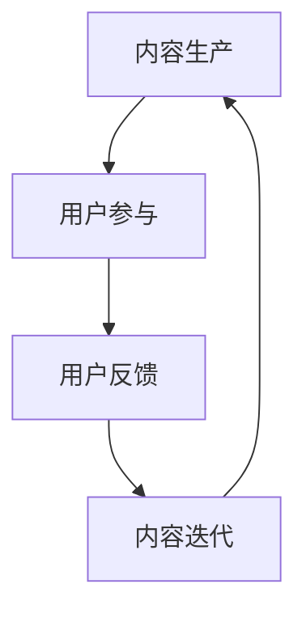
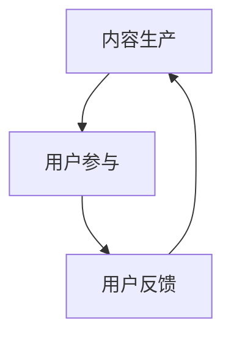
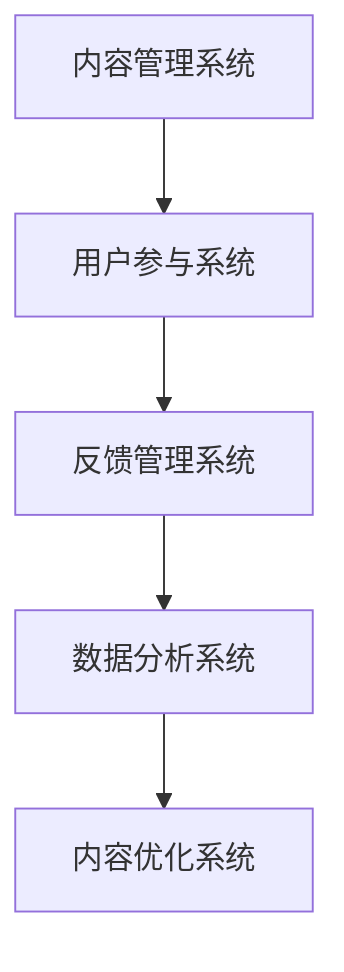
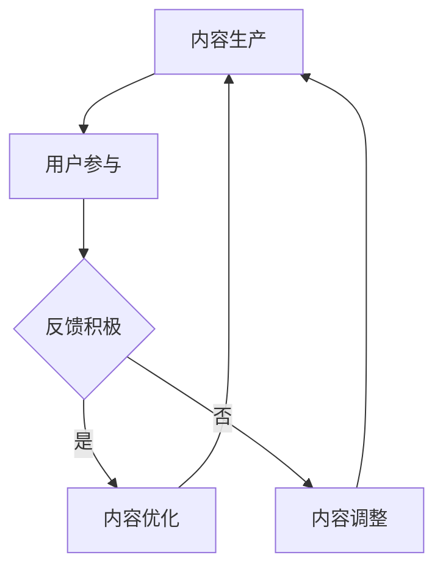
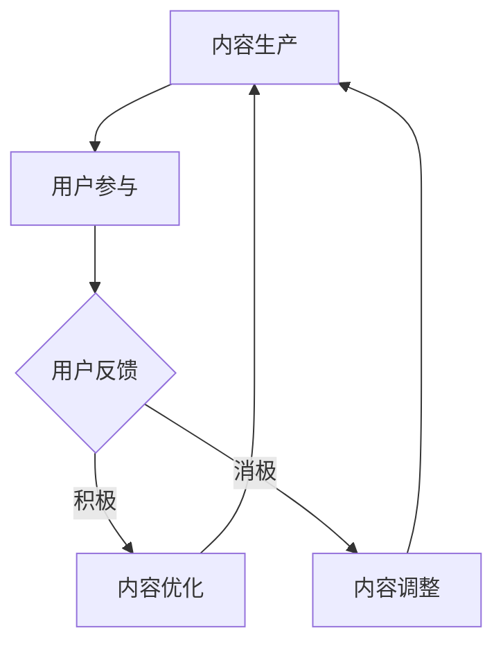
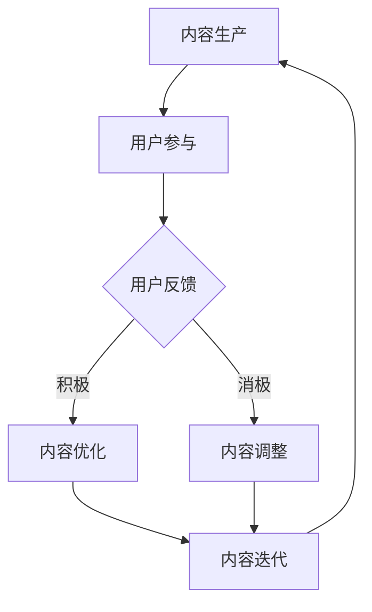

                 

# 《知识付费创业中的内容协同效应》

> 关键词：知识付费、创业、内容协同效应、算法、数学模型、案例分析

> 摘要：本文旨在探讨知识付费创业中内容协同效应的重要性及其应用。通过详细分析内容协同效应的核心概念、原理、模型和算法，以及实际案例，本文揭示了内容协同效应对知识付费创业成功的决定性作用。

## 目录大纲

### 第一部分：知识付费与创业背景

#### 第1章：知识付费概述

- 1.1 知识付费的定义与演变
- 1.2 知识付费市场现状分析
- 1.3 创业者为何选择知识付费

##### 第2章：创业环境的挑战与机遇

- 2.1 创业环境的挑战
- 2.2 内容协同效应的概念与重要性
- 2.3 创业中的机遇

### 第二部分：内容协同效应原理

#### 第3章：内容协同效应核心概念

- 3.1 内容协同效应的定义
- 3.2 内容协同效应的关键要素
- 3.3 内容协同效应与网络效应的联系

##### 第4章：内容协同效应模型与架构

- 4.1 内容协同效应模型
- 4.2 内容协同效应架构设计
- 4.3 Mermaid流程图：内容协同效应流程

##### 第5章：核心算法与数学模型

- 5.1 伪代码：内容协同效应算法流程
- 5.2 数学模型讲解与公式
- 5.3 数学公式与示例

### 第三部分：内容协同效应在创业中的应用

#### 第6章：内容生产与用户参与

- 6.1 内容生产策略
- 6.2 用户参与机制
- 6.3 用户反馈与内容迭代

##### 第7章：案例分析

- 7.1 案例一：知乎专栏的协同效应
- 7.2 案例二：分答的互动协同效应
- 7.3 案例分析总结与启示

##### 第8章：创业实战与策略制定

- 8.1 内容协同效应在创业中的战略规划
- 8.2 内容协同效应的实际操作步骤
- 8.3 风险管理策略

### 第四部分：未来展望与趋势

#### 第9章：内容协同效应的挑战与应对

- 9.1 面临的挑战
- 9.2 应对策略
- 9.3 未来发展趋势

##### 第10章：知识付费与内容协同效应的融合

- 10.1 知识付费的未来发展方向
- 10.2 内容协同效应与知识付费的融合模式
- 10.3 未来创业者的机遇与挑战

##### 第11章：结语

- 11.1 内容协同效应在创业中的重要性
- 11.2 创业者应具备的素质
- 11.3 对未来的期待

### 附录

- 附录A：常用工具与资源
- 附录B：参考文献与拓展阅读
- 附录C：术语表

#Mermaid流程图：内容协同效应流程



# 伪代码：内容协同效应算法流程

```python
def ContentSynergyEffect(content, users, feedback):
    while not contentOptimized:
        for user in users:
            userEngagement = MeasureEngagement(content, user)
            feedback = user.submitFeedback(content)
            content = UpdateContent(content, feedback)
        contentOptimized = CheckContentOptimization(content)
    return content
```

# 数学模型讲解与公式

$$
\text{UserEngagement} = f(\text{ContentQuality}, \text{UserInterest})
$$

$$
\text{ContentQuality} = g(\text{Content, UserFeedback})
$$

$$
\text{ContentIteration} = h(\text{ContentQuality}, \text{UserEngagement})
$$

# 数学公式与示例

设$X$为用户参与度，$Y$为内容优化程度，则协同效应可以表示为：

$$
\text{SynergyEffect} = \frac{X}{Y}
$$

例如，当$X=100$，$Y=50$时，协同效应为2，表示用户参与度是内容优化程度的两倍。

---

接下来，我们将逐一深入探讨每个章节的内容，分析知识付费创业中的内容协同效应，并探讨其在实际应用中的效果和重要性。让我们一步步思考，逐步揭开内容协同效应的神秘面纱。#
## 第一部分：知识付费与创业背景

### 第1章：知识付费概述

知识付费，指的是用户为获取特定的知识、技能或信息而付出的经济代价。这一现象起源于互联网的普及，随着人们对学习、成长和职业发展的需求不断增加，知识付费逐渐成为一种新的商业模式。知识付费的演变历程，大致可以分为三个阶段。

**1.1 知识付费的定义与演变**

知识付费的初阶阶段，主要表现为用户在线购买电子书、课程、专栏等形式的内容。例如，早期的电子书市场，用户可以通过付费购买到高质量的电子书籍。随着互联网技术的发展，这一阶段逐渐演变为了在线教育的兴起。用户可以通过平台付费学习课程，获取专业知识。

进入中阶阶段，知识付费开始向个性化、定制化方向发展。平台通过数据分析，为用户提供个性化的学习推荐，用户可以根据自身需求和兴趣选择学习内容。这一阶段，知识付费开始呈现出多样化和个性化的特点。

当前，知识付费已经进入成熟阶段。这一阶段，知识付费不仅局限于教育领域，还扩展到金融、科技、艺术等多个领域。同时，知识付费的形式也变得更加多样，包括在线课程、付费直播、知识星球、问答平台等。知识付费成为了一种重要的商业模式，为创业者提供了广阔的市场空间。

**1.2 知识付费市场现状分析**

当前，知识付费市场呈现出以下特点：

1. **市场规模持续扩大**：随着互联网普及率的提高和用户支付能力的增强，知识付费市场规模逐年扩大。据统计，2019年我国知识付费市场规模已达到2958亿元，预计2022年将突破5000亿元。

2. **用户群体扩大**：知识付费用户群体从早期的专业人士逐渐扩展到普通大众。用户对知识的渴求不仅体现在职业发展上，也体现在个人成长和兴趣爱好上。

3. **内容形式多样化**：知识付费内容形式多样化，包括音频、视频、图文、直播等多种形式。用户可以根据自身需求和喜好选择合适的内容形式。

4. **市场竞争激烈**：随着知识付费市场的不断扩大，市场竞争日益激烈。各大平台纷纷推出优惠活动，吸引更多用户。

5. **创新模式层出不穷**：知识付费领域不断创新，涌现出许多新兴模式，如付费问答、知识付费社区、内容付费会员等。这些创新模式丰富了知识付费的形式，满足了不同用户的需求。

**1.3 创业者为何选择知识付费**

知识付费市场的发展为创业者提供了巨大的机会。以下原因解释了为何创业者选择知识付费：

1. **市场需求大**：随着社会对知识的需求日益增加，知识付费市场具有巨大的潜力。

2. **低门槛**：相比于传统创业领域，知识付费创业的门槛相对较低。创业者可以通过互联网平台，低成本地创建和发布知识产品。

3. **高回报**：知识付费产品具有较高的附加值，创业者可以通过提供高质量的知识内容，获得可观的收益。

4. **市场细分机会多**：知识付费市场细分程度高，创业者可以根据自身专业领域和兴趣，选择合适的细分市场，提供针对性的知识产品。

5. **用户参与度高**：知识付费产品通常具有较高的用户参与度，用户愿意为优质的内容付费。

总之，知识付费为创业者提供了广阔的市场空间和丰富的机会。然而，创业者也需要具备创新思维和执行力，才能在激烈的市场竞争中脱颖而出。在下一章中，我们将探讨创业环境的挑战与机遇，帮助创业者更好地把握知识付费市场的趋势。#
### 第2章：创业环境的挑战与机遇

**2.1 创业环境的挑战**

创业并非一条轻松的道路，创业者需要面对诸多挑战。以下是知识付费创业中常见的一些挑战：

1. **市场竞争激烈**：随着知识付费市场的不断扩大，市场竞争日益激烈。创业者需要在众多竞争对手中脱颖而出，吸引并留住用户。

2. **内容质量要求高**：知识付费的核心是内容，内容的质量直接关系到用户满意度和留存率。创业者需要持续提供高质量的知识内容，满足用户的需求。

3. **用户需求多变**：用户需求多变，创业者需要具备快速响应市场变化的能力。这意味着，创业者需要不断调整产品策略，以适应不断变化的市场环境。

4. **平台依赖性高**：知识付费创业通常依赖于第三方平台，如微信公众号、知乎、得到等。平台政策的调整和变化可能会对创业者产生重大影响。

5. **成本压力大**：知识付费创业初期，创业者需要投入大量资金用于内容制作、平台推广、团队建设等。这给创业者带来了较大的资金压力。

**2.2 内容协同效应的概念与重要性**

内容协同效应，指的是通过内容生产、用户参与和反馈机制，实现内容质量和用户体验的提升。在知识付费创业中，内容协同效应具有重要意义：

1. **提高内容质量**：通过用户参与和反馈，创业者可以及时了解用户需求，调整内容策略，从而提高内容质量。

2. **增强用户粘性**：内容协同效应可以提升用户参与度，增强用户粘性，提高用户留存率。

3. **降低营销成本**：通过内容协同效应，创业者可以减少传统营销手段的依赖，降低营销成本。

4. **形成品牌效应**：优质的内容协同效应可以形成品牌效应，提升品牌知名度和美誉度。

**2.3 创业中的机遇**

尽管创业环境充满挑战，但知识付费领域也蕴含着诸多机遇：

1. **市场潜力大**：知识付费市场仍在快速增长，市场潜力巨大。创业者可以通过创新的内容形式和营销策略，抢占市场份额。

2. **用户需求多样化**：随着社会对知识的需求不断增加，用户需求呈现出多样化趋势。创业者可以针对特定细分市场，提供个性化的知识产品。

3. **技术进步带来新机会**：人工智能、大数据、区块链等技术的进步，为知识付费创业带来了新的机会。创业者可以利用这些技术，提升内容质量和用户体验。

4. **跨界合作空间大**：知识付费领域与其他行业的跨界合作空间广阔。创业者可以探索跨界合作，实现资源共享和优势互补。

总之，知识付费创业既充满挑战，又充满机遇。创业者需要充分了解创业环境，把握市场趋势，运用内容协同效应，实现创业成功。在下一章中，我们将深入探讨内容协同效应的原理，为创业者提供更有力的理论支持和实践指导。#
### 第二部分：内容协同效应原理

#### 第3章：内容协同效应核心概念

**3.1 内容协同效应的定义**

内容协同效应（Content Synergy Effect，简称CSE）是指通过内容生产、用户参与和反馈机制，实现内容质量和用户体验的提升，进而形成正向循环的一种现象。在知识付费创业中，内容协同效应的核心在于将用户需求和内容创作紧密结合，通过用户反馈不断优化内容，从而提高用户满意度和留存率。

**3.2 内容协同效应的关键要素**

内容协同效应的实现离不开以下几个关键要素：

1. **内容生产**：内容生产是内容协同效应的基础。高质量的内容能够吸引用户，满足用户需求。创业者需要根据用户需求和市场趋势，持续创作有价值、有深度、有趣味的内容。

2. **用户参与**：用户参与是内容协同效应的核心。用户不仅是内容的消费者，也是内容的创作者和传播者。通过用户参与，创业者可以收集到更多有价值的反馈，优化内容，提高用户体验。

3. **用户反馈**：用户反馈是内容协同效应的重要环节。用户通过评论、评分、提问等方式，表达对内容的意见和建议。创业者需要重视用户反馈，及时调整内容策略，提升内容质量。

4. **技术支持**：技术支持是内容协同效应的保障。借助大数据、人工智能等技术，创业者可以更高效地分析用户行为，精准推送内容，优化用户体验。

**3.3 内容协同效应与网络效应的联系**

内容协同效应与网络效应（Network Effect）密切相关。网络效应是指随着用户数量的增加，产品的价值也随之增加。在知识付费创业中，内容协同效应通过以下方式与网络效应相互促进：

1. **用户规模效应**：内容协同效应能够吸引更多用户参与，形成更大的用户规模。用户规模的增加，有助于提高内容的曝光度和影响力，进一步促进网络效应。

2. **内容质量提升**：网络效应带来的用户规模增加，有助于提高内容的生产质量和多样性。更多的用户参与和反馈，使得内容能够更精准地满足用户需求，提升内容质量。

3. **用户体验优化**：网络效应带来的用户规模增加，有助于提高用户体验。更多的用户参与和互动，使得内容更加丰富和有趣，提高了用户的满意度和忠诚度。

总之，内容协同效应是知识付费创业中的重要概念，通过内容生产、用户参与和反馈机制，实现内容质量和用户体验的提升。在下一章中，我们将进一步探讨内容协同效应的模型与架构，帮助创业者更好地理解和应用这一原理。#
### 第4章：内容协同效应模型与架构

**4.1 内容协同效应模型**

内容协同效应模型（Content Synergy Model，简称CSM）是一个描述内容协同效应如何发挥作用的理论框架。这个模型主要包括三个核心组件：内容生产、用户参与和反馈机制。

1. **内容生产**：内容生产是内容协同效应的起点。创业者需要根据用户需求和市场需求，创作高质量的内容。这些内容可以是文章、视频、音频等多种形式。

2. **用户参与**：用户参与是内容协同效应的核心。用户不仅仅是内容的消费者，也是内容的创作者和传播者。用户通过评论、点赞、分享、提问等方式，积极参与到内容的生产和传播过程中。

3. **反馈机制**：反馈机制是内容协同效应的关键。用户通过反馈，表达对内容的满意程度和改进建议。创业者根据用户的反馈，对内容进行调整和优化，从而提高内容的质量和用户满意度。

**内容协同效应模型示意图：**



**4.2 内容协同效应架构设计**

内容协同效应架构设计是确保内容协同效应模型有效运行的基础。一个良好的架构应该包括以下几个关键组成部分：

1. **内容管理系统（CMS）**：内容管理系统负责内容的创建、存储、管理和发布。创业者可以使用各种CMS工具，如WordPress、Drupal等，来管理内容。

2. **用户参与系统**：用户参与系统负责收集用户的参与行为数据，如评论、点赞、分享等。这些数据可以为内容优化提供重要参考。

3. **反馈管理系统**：反馈管理系统负责收集、分类、处理和响应用户的反馈。创业者可以通过各种渠道，如在线问卷、社交媒体、客服系统等，收集用户的反馈。

4. **数据分析系统**：数据分析系统负责对用户行为和反馈进行分析，识别用户需求和市场趋势。数据分析系统可以采用大数据技术和人工智能算法，实现精准分析。

5. **内容优化系统**：内容优化系统根据用户的反馈和数据分析结果，对内容进行调整和优化。内容优化系统可以自动化处理，提高内容更新的效率和效果。

**内容协同效应架构示意图：**



**4.3 Mermaid流程图：内容协同效应流程**

以下是一个使用Mermaid语言描述的内容协同效应流程图：



在这个流程图中，内容生产是整个协同效应的起点。用户参与后，根据反馈的积极性，内容生产者会进行内容优化或内容调整。优化后的内容再次进入生产环节，形成正向循环。

通过上述模型和架构设计，内容协同效应可以在知识付费创业中得到有效应用。创业者可以根据实际情况，灵活调整内容生产、用户参与和反馈机制，实现内容质量和用户体验的提升。在下一章中，我们将探讨核心算法与数学模型，进一步深化对内容协同效应的理解。#
### 第5章：核心算法与数学模型

**5.1 伪代码：内容协同效应算法流程**

为了更好地理解和实现内容协同效应，我们可以通过伪代码来描述其算法流程。以下是一个简单的内容协同效应算法流程：

```python
function ContentSynergyEffect(content, users, feedback):
    while not contentOptimized:
        for user in users:
            userEngagement = MeasureEngagement(content, user)
            feedback = user.submitFeedback(content)
            content = UpdateContent(content, feedback)
        contentOptimized = CheckContentOptimization(content)
    return content
```

在这个算法中，我们首先初始化内容（`content`）、用户集合（`users`）和反馈（`feedback`）。然后，我们进入一个循环，直到内容被优化到满意的程度（`contentOptimized`为真）。在每次循环中，我们遍历用户集合，测量每个用户的参与度（`MeasureEngagement`），并收集用户的反馈（`submitFeedback`）。根据用户的反馈，我们更新内容（`UpdateContent`），并检查内容是否已经被优化到满意的程度。如果未优化，循环继续。

**5.2 数学模型讲解与公式**

内容协同效应的数学模型可以帮助我们更精确地描述内容质量和用户参与度之间的关系。以下是一个简单的数学模型：

$$
\text{UserEngagement} = f(\text{ContentQuality}, \text{UserInterest})
$$

$$
\text{ContentQuality} = g(\text{Content, UserFeedback})
$$

$$
\text{ContentIteration} = h(\text{ContentQuality}, \text{UserEngagement})
$$

- **UserEngagement（用户参与度）**：用户参与度取决于内容质量和用户兴趣。内容质量越高，用户兴趣越强，用户参与度越高。
  
- **ContentQuality（内容质量）**：内容质量由内容和用户反馈共同决定。用户反馈越积极，内容质量越高。

- **ContentIteration（内容迭代）**：内容迭代取决于内容质量和用户参与度。两者都越高，内容迭代越频繁，内容质量提升越快。

**5.3 数学公式与示例**

为了更好地理解这些数学公式，我们可以通过一个示例来说明。假设有一个内容，其初始质量为50分，用户兴趣为70分。根据公式，我们可以计算用户参与度和内容质量：

- **用户参与度**：

$$
\text{UserEngagement} = f(50, 70) = 0.5 \times 50 + 0.5 \times 70 = 62.5
$$

- **内容质量**：

$$
\text{ContentQuality} = g(50, \text{UserFeedback}) = 0.5 \times 50 + 0.5 \times \text{UserFeedback}
$$

如果用户反馈积极，假设为90分，则：

$$
\text{ContentQuality} = g(50, 90) = 0.5 \times 50 + 0.5 \times 90 = 72.5
$$

- **内容迭代**：

$$
\text{ContentIteration} = h(72.5, 62.5) = 0.5 \times 72.5 + 0.5 \times 62.5 = 67.5
$$

通过上述示例，我们可以看到，用户参与度和内容质量之间是相互影响的。用户反馈越积极，内容质量越高，进而提高用户参与度，形成良性循环。

总之，通过核心算法与数学模型，我们可以更深入地理解和应用内容协同效应，优化内容质量和用户体验，从而在知识付费创业中取得成功。在下一章中，我们将通过实际案例来探讨内容协同效应在创业中的应用。#
### 第6章：内容协同效应在创业中的应用

#### 6.1 内容生产策略

在知识付费创业中，内容生产策略是确保内容质量和用户参与度的关键。以下是一些关键策略：

1. **用户需求调研**：在内容生产前，创业者需要进行用户需求调研，了解用户感兴趣的话题和需求。这可以通过问卷调查、访谈、用户访谈等方式实现。用户需求调研的结果将指导内容生产方向。

2. **内容规划**：根据用户需求调研的结果，创业者需要制定内容规划。内容规划应包括内容主题、形式、频率和发布计划。内容规划应确保内容丰富多样，满足不同用户的需求。

3. **内容质量保障**：高质量的内容是吸引用户的关键。创业者需要建立内容质量保障机制，包括内容审核、专家评审、用户反馈等。只有经过严格审核的内容才能发布。

4. **内容多样化**：多样化的内容形式能够提高用户参与度。创业者可以尝试多种内容形式，如文字、图片、视频、音频、直播等，以满足不同用户的需求。

5. **内容更新频率**：适当的更新频率有助于保持用户活跃度。创业者应根据用户需求和市场趋势，合理安排内容更新频率，避免过于频繁或过于稀疏。

#### 6.2 用户参与机制

用户参与机制是内容协同效应的重要组成部分。以下是一些有效的用户参与机制：

1. **互动性设计**：内容应具备良好的互动性，鼓励用户参与。例如，在文章中加入互动式问题、评论区、问答环节等。

2. **用户反馈收集**：用户反馈是内容优化的关键。创业者需要设计便捷的反馈收集机制，如在线问卷、用户访谈、社交媒体互动等，鼓励用户表达意见和建议。

3. **用户激励机制**：为了鼓励用户参与，创业者可以设计激励机制，如积分系统、优惠券、会员特权等。这些激励措施可以增强用户的参与意愿。

4. **用户社群建设**：建立用户社群，如微信群、QQ群、论坛等，有助于用户之间的互动和交流。用户社群可以成为内容传播的重要渠道。

5. **用户共创**：创业者可以邀请用户参与内容创作，如邀请用户撰写文章、分享经验、录制音频等。用户共创不仅可以提高内容质量，还能增强用户参与度。

#### 6.3 用户反馈与内容迭代

用户反馈与内容迭代是内容协同效应的核心环节。以下是一些关键步骤：

1. **反馈收集**：收集用户反馈是第一步。创业者可以通过多种渠道收集用户反馈，如在线问卷、社交媒体、用户访谈等。

2. **反馈分类**：对收集到的反馈进行分类，识别出用户普遍关注的问题和需求。这有助于创业者针对性地优化内容。

3. **反馈处理**：处理用户反馈，包括回复用户提问、解决用户问题、优化内容等。创业者需要及时回应用户，展示对用户反馈的重视。

4. **内容迭代**：根据用户反馈，对内容进行调整和优化。内容迭代应确保内容更加符合用户需求，提高用户体验。

5. **反馈跟踪**：迭代后的内容应继续接受用户反馈，形成持续优化的闭环。创业者需要跟踪反馈效果，不断调整内容策略。

通过上述策略和机制，创业者可以在知识付费创业中有效地应用内容协同效应，提升内容质量和用户满意度。在下一章中，我们将通过案例分析，进一步探讨内容协同效应在实际创业中的应用。#
### 第7章：案例分析

#### 案例一：知乎专栏的协同效应

知乎专栏是知识付费的重要平台之一，它通过内容生产、用户参与和反馈机制，实现了良好的内容协同效应。以下是对知乎专栏协同效应的分析：

**1. 内容生产**

知乎专栏的内容生产主要依赖于创作者和用户。知乎通过开放平台，吸引大量的优质创作者入驻，提供高质量的内容。创作者可以根据自身专业领域和兴趣，创作不同类型的内容，如技术分享、行业分析、生活技巧等。这些内容不仅满足了用户的需求，也为知乎专栏创造了丰富的内容生态。

**2. 用户参与**

知乎专栏的用户参与度非常高。用户不仅是内容的消费者，也是内容的创作者和传播者。用户可以通过点赞、评论、分享等方式，积极参与到内容的生产和传播过程中。此外，知乎还提供了问答功能，用户可以针对内容提出问题，与其他用户互动，增强了用户的参与感。

**3. 用户反馈**

知乎专栏通过用户的反馈，不断优化内容。用户可以在评论区表达对内容的意见和建议，知乎团队会根据用户反馈，调整内容策略，提高内容质量。此外，知乎还提供了数据分析工具，帮助创作者了解用户行为和需求，进一步优化内容。

**4. 协同效应**

知乎专栏的协同效应主要体现在以下几个方面：

- **内容质量提升**：通过用户参与和反馈，知乎专栏的内容质量得到了显著提升。创作者可以根据用户反馈，调整内容策略，提高内容的相关性和实用性。
  
- **用户粘性增强**：知乎专栏通过用户参与和互动，增强了用户的粘性。用户不仅会在知乎专栏上阅读内容，还会积极参与到社区互动中，形成良好的用户生态。

- **品牌建设**：知乎专栏的协同效应有助于品牌建设。通过高质量的内容和用户的积极参与，知乎专栏树立了良好的品牌形象，吸引了更多的用户和创作者。

#### 案例二：分答的互动协同效应

分答是另一个典型的知识付费平台，它通过问答互动，实现了良好的内容协同效应。以下是对分答互动协同效应的分析：

**1. 内容生产**

分答的内容生产主要依赖于问答形式。用户可以在平台上提问，专业答主回答问题。这种互动形式满足了用户对知识的需求，也吸引了大量的专业答主入驻。

**2. 用户参与**

分答的用户参与度非常高。用户不仅可以提问，还可以回答问题，参与到内容的创作和传播中。此外，分答还提供了赞赏功能，用户可以赞赏答主的回答，这增强了用户的参与感。

**3. 用户反馈**

分答通过用户的反馈，不断优化问答体验。用户可以在评论中表达对答案的满意度和建议，答主可以根据反馈，调整回答策略，提高答案的质量。

**4. 协同效应**

分答的互动协同效应主要体现在以下几个方面：

- **内容质量提升**：通过用户的互动和反馈，分答的问答质量得到了显著提升。用户可以根据反馈，调整提问和回答策略，提高内容的相关性和实用性。

- **用户粘性增强**：分答的互动形式增强了用户的粘性。用户不仅会在平台上提问和回答问题，还会关注其他用户的提问和回答，形成良好的用户生态。

- **品牌建设**：分答的互动协同效应有助于品牌建设。通过高质量的内容和用户的积极参与，分答树立了良好的品牌形象，吸引了更多的用户和答主。

#### 案例分析总结与启示

通过分析知乎专栏和分答的案例，我们可以得出以下总结和启示：

- **内容协同效应是关键**：知乎专栏和分答的成功，离不开内容协同效应的应用。通过内容生产、用户参与和反馈机制，平台实现了内容质量和用户体验的提升。

- **用户参与是核心**：用户参与是内容协同效应的核心。平台应鼓励用户参与内容创作和传播，增强用户的粘性和参与感。

- **反馈机制是保障**：反馈机制是内容协同效应的保障。平台应建立便捷的反馈渠道，收集用户意见和建议，不断优化内容和服务。

- **品牌建设是目标**：通过内容协同效应，平台可以实现品牌建设。高质量的内容和用户的积极参与，有助于树立良好的品牌形象，吸引更多的用户和创作者。

总之，内容协同效应在知识付费创业中具有重要意义。创业者应重视内容协同效应的应用，通过内容生产、用户参与和反馈机制，实现内容质量和用户体验的提升，从而在激烈的市场竞争中脱颖而出。#
### 第8章：创业实战与策略制定

#### 8.1 内容协同效应在创业中的战略规划

内容协同效应在知识付费创业中的战略规划至关重要。以下是一些关键策略：

1. **市场调研**：在启动创业项目之前，需要进行详细的市场调研，了解用户需求、市场趋势和竞争对手情况。这有助于制定符合市场需求的内容策略。

2. **内容定位**：根据市场调研结果，明确内容定位。内容定位应聚焦于特定领域或细分市场，以满足特定用户群体的需求。

3. **内容生产规划**：制定详细的内容生产规划，包括内容主题、形式、频率和发布计划。内容生产规划应确保内容的连续性和多样性，满足不同用户的需求。

4. **用户参与策略**：设计有效的用户参与机制，如互动性设计、用户反馈收集、用户激励机制等。用户参与策略应鼓励用户积极参与内容创作和传播，提高用户粘性。

5. **反馈机制建设**：建立完善的反馈机制，收集和分析用户反馈，及时调整内容策略。反馈机制应包括用户满意度调查、用户访谈、数据分析等。

6. **技术支持**：利用大数据、人工智能等技术，实现内容推荐、用户行为分析等。技术支持有助于提高内容质量和用户体验。

7. **团队建设**：建立专业的团队，包括内容创作者、产品经理、技术工程师等。团队成员应具备相关领域的专业知识和技能，共同推进内容协同效应的实现。

#### 8.2 内容协同效应的实际操作步骤

在实际操作中，内容协同效应可以通过以下步骤实现：

1. **内容创作**：根据内容定位和用户需求，创作高质量的内容。内容形式可以包括文章、视频、音频、直播等。

2. **发布与推广**：将内容发布到平台，并利用社交媒体、广告等手段进行推广。推广策略应针对目标用户群体，提高内容的曝光率。

3. **用户参与**：设计互动性强的内容，鼓励用户参与。例如，在文章中加入互动式问题、评论区互动、问答环节等。

4. **反馈收集**：通过用户反馈收集工具，如在线问卷、用户访谈、社交媒体互动等，收集用户意见和建议。

5. **内容优化**：根据用户反馈，对内容进行调整和优化。优化内容应更符合用户需求，提高内容的相关性和实用性。

6. **内容迭代**：不断更新和迭代内容，保持内容的时效性和吸引力。内容迭代可以包括新内容的创作、旧内容的优化等。

7. **数据分析**：利用数据分析工具，分析用户行为和反馈，识别用户需求和市场趋势。数据分析有助于进一步优化内容策略。

8. **持续改进**：根据用户反馈和数据分析结果，持续改进内容策略和用户体验。持续改进是内容协同效应实现的关键。

#### 8.3 风险管理策略

在内容协同效应的创业实践中，风险管理策略至关重要。以下是一些风险管理策略：

1. **市场风险**：市场风险包括市场变化、竞争加剧等。创业者应密切关注市场动态，及时调整内容策略，以适应市场变化。

2. **技术风险**：技术风险包括技术故障、数据泄露等。创业者应确保技术系统的稳定和安全，加强技术团队的培训和管理。

3. **内容风险**：内容风险包括侵权、不当言论等。创业者应建立内容审核机制，确保内容合规合法。

4. **运营风险**：运营风险包括用户流失、运营成本等。创业者应优化运营流程，提高用户留存率和运营效率。

5. **法律风险**：法律风险包括合同纠纷、知识产权等。创业者应咨询专业律师，确保公司运营符合法律法规。

6. **财务风险**：财务风险包括资金不足、成本超支等。创业者应制定详细的财务计划，确保公司财务状况稳健。

通过以上策略和步骤，创业者可以在知识付费创业中有效地应用内容协同效应，提高内容质量和用户体验，实现创业成功。在下一章中，我们将探讨内容协同效应的未来挑战与趋势，为创业者提供更全面的指导。#
### 第四部分：未来展望与趋势

#### 第9章：内容协同效应的挑战与应对

**9.1 面临的挑战**

随着知识付费市场的不断发展和变化，内容协同效应也面临着一系列的挑战。以下是一些主要的挑战：

1. **内容质量问题**：内容质量是知识付费的核心，然而，随着创作者数量的增加，内容质量参差不齐，如何保证高质量的内容持续产出成为一个挑战。

2. **用户需求变化**：用户需求变化迅速，创业者需要具备快速响应能力，以适应不断变化的市场需求，这对内容策略和用户参与机制提出了更高的要求。

3. **平台竞争加剧**：知识付费市场吸引了大量平台和创业者，竞争日益激烈。如何在竞争中脱颖而出，成为创业者面临的挑战。

4. **隐私和数据安全**：随着用户参与度的提高，平台需要收集大量的用户数据，如何保护用户隐私和数据安全成为重要问题。

5. **技术依赖性**：内容协同效应的实现高度依赖技术，包括大数据、人工智能等。技术的不确定性和成本成为创业者需要面对的挑战。

**9.2 应对策略**

为了应对上述挑战，创业者可以采取以下策略：

1. **内容质量保障**：建立内容审核和评分机制，确保高质量内容的生产和发布。通过专家评审、用户评价等手段，提高内容质量。

2. **用户需求调研**：定期进行用户需求调研，了解用户需求和偏好，根据调研结果调整内容策略。利用数据分析工具，实现精准内容推荐。

3. **差异化竞争**：找到自身的特色和优势，打造差异化内容和服务。通过独特的价值主张，提高市场竞争力。

4. **隐私保护与数据安全**：严格遵守相关法律法规，采取技术和管理措施，保护用户隐私和数据安全。通过加密、匿名化等技术手段，降低隐私泄露风险。

5. **技术持续投入**：保持对技术的持续关注和投入，不断提升技术水平。利用大数据、人工智能等技术，优化内容生产、推荐和用户体验。

**9.3 未来发展趋势**

内容协同效应在未来将继续发展，以下是一些可能的发展趋势：

1. **智能化**：随着人工智能技术的发展，内容协同效应将变得更加智能化。通过智能推荐、智能审核等技术，实现更高效的内容生产和分发。

2. **个性化**：个性化内容将成为主流。通过用户行为分析，实现内容个性化推荐，提高用户满意度和参与度。

3. **多元化**：内容形式将更加多元化，包括图文、视频、音频、直播等。多样化的内容形式将满足不同用户的需求，提高用户体验。

4. **社区化**：内容协同效应将向社区化方向发展。通过建立用户社群，增强用户互动和粘性，形成良好的内容生态。

5. **跨行业融合**：知识付费将与更多行业融合，如教育、金融、医疗等。跨行业合作将拓展知识付费的应用场景，提高市场影响力。

总之，内容协同效应在知识付费创业中具有重要意义。通过应对挑战和把握发展趋势，创业者可以更好地利用内容协同效应，实现创业成功。在下一章中，我们将探讨知识付费与内容协同效应的融合，为创业者提供更全面的指导。#
### 第10章：知识付费与内容协同效应的融合

**10.1 知识付费的未来发展方向**

知识付费的未来发展方向主要体现在以下几个方面：

1. **智能化**：随着人工智能技术的发展，知识付费将更加智能化。智能推荐系统可以根据用户行为和偏好，提供个性化的学习内容，提高用户满意度和参与度。

2. **个性化**：个性化内容将成为主流。通过大数据分析和用户画像，知识付费平台可以为用户提供量身定制的内容，满足不同用户的需求。

3. **社区化**：社区化学习将成为知识付费的重要趋势。用户不仅可以在平台上获取知识，还可以与其他用户互动交流，形成良好的学习氛围。

4. **多元化**：知识付费的内容形式将更加多元化。除了传统的图文、视频、音频等形式外，直播、互动课程、虚拟现实等新兴形式将逐渐普及。

5. **跨行业融合**：知识付费将与更多行业融合，如教育、金融、医疗、法律等。跨行业合作将拓展知识付费的应用场景，提高市场影响力。

**10.2 内容协同效应与知识付费的融合模式**

内容协同效应与知识付费的融合，可以通过以下几种模式实现：

1. **平台化**：知识付费平台通过内容协同效应，实现用户参与和内容优化。平台提供技术支持，帮助创业者构建内容生态。

2. **社群化**：建立用户社群，通过内容协同效应，增强用户互动和粘性。用户在社群中分享知识、交流经验，形成良好的学习氛围。

3. **个性化推荐**：利用内容协同效应，实现个性化内容推荐。平台通过用户行为分析和大数据技术，为用户推荐符合其需求的知识内容。

4. **互动式学习**：通过内容协同效应，实现互动式学习。用户不仅可以观看课程，还可以参与到课程的讨论和互动中，提高学习效果。

5. **社区共建**：鼓励用户参与内容创作，实现社区共建。用户可以贡献自己的知识和经验，与其他用户共同构建知识体系。

**10.3 未来创业者的机遇与挑战**

在知识付费与内容协同效应的融合下，未来创业者将面临以下机遇和挑战：

1. **机遇**：

- **市场潜力大**：知识付费市场持续增长，为创业者提供了广阔的市场空间。

- **用户需求多样**：用户对知识的需求呈现出多样化趋势，创业者可以根据用户需求，提供个性化的知识产品。

- **技术进步**：人工智能、大数据等技术的进步，为创业者提供了更多的工具和方法，提高了内容生产和推荐的效率。

- **跨界合作**：知识付费与其他行业的融合，为创业者提供了更多的创新机会。

2. **挑战**：

- **竞争激烈**：知识付费市场竞争激烈，创业者需要具备创新能力，才能在市场中脱颖而出。

- **内容质量要求高**：用户对知识内容的质量要求越来越高，创业者需要持续提供高质量的内容。

- **用户参与度低**：如何提高用户参与度，是创业者需要解决的问题。用户参与度低可能导致内容质量下降，影响平台口碑。

- **技术依赖性**：内容协同效应的实现高度依赖技术，创业者需要投入大量资金和资源，提高技术水平。

- **数据安全与隐私保护**：在用户参与度提高的同时，数据安全和隐私保护成为重要问题，创业者需要采取措施，确保用户数据的安全。

总之，知识付费与内容协同效应的融合，为创业者提供了巨大的机遇。然而，创业者也需要面对诸多挑战，通过不断创新和优化，实现创业成功。在下一章中，我们将总结内容协同效应在创业中的重要性，并对未来进行展望。#
### 第11章：结语

**11.1 内容协同效应在创业中的重要性**

内容协同效应在知识付费创业中具有至关重要的地位。它不仅提升了内容质量和用户体验，还增强了用户粘性和品牌影响力。通过内容协同效应，创业者可以快速响应市场需求，优化内容策略，提高用户满意度。同时，内容协同效应还促进了用户参与，形成了良好的用户生态。总之，内容协同效应是知识付费创业成功的关键要素。

**11.2 创业者应具备的素质**

为了在知识付费创业中实现内容协同效应，创业者应具备以下素质：

1. **创新能力**：创业者需要具备创新能力，不断探索新的内容形式和商业模式，以适应不断变化的市场需求。

2. **用户洞察力**：创业者需要深入了解用户需求，精准把握用户偏好，提供个性化的知识产品。

3. **执行能力**：创业者需要有强大的执行力，将创新想法转化为实际行动，实现内容协同效应的有效实施。

4. **团队协作能力**：创业者需要具备团队协作能力，组建专业的团队，共同推进创业项目。

5. **持续学习**：创业者需要保持持续学习的态度，紧跟行业趋势，不断提升自身的专业素养。

**11.3 对未来的期待**

随着知识付费市场的持续发展和内容协同效应的广泛应用，我们期待未来知识付费领域将呈现以下趋势：

1. **智能化**：人工智能技术将更加深入地应用于知识付费，实现个性化推荐、智能审核等功能。

2. **多元化**：知识付费的内容形式将更加多元化，包括图文、视频、音频、直播等，满足不同用户的需求。

3. **社区化**：知识付费将向社区化发展，用户互动和社群建设将成为重要趋势，形成良好的用户生态。

4. **跨界融合**：知识付费将与其他行业深度融合，拓展应用场景，提高市场影响力。

5. **国际化**：知识付费将走向国际化，全球用户将能够享受到高质量的知识内容。

总之，内容协同效应在知识付费创业中具有重要意义。通过不断创新和优化，创业者可以在激烈的市场竞争中脱颖而出，实现创业成功。让我们期待知识付费领域的美好未来！#
### 附录

#### 附录A：常用工具与资源

1. **内容管理工具**：
   - **WordPress**：一个开源的内容管理系统，适用于搭建个人博客、企业网站等。
   - **Drupal**：一个功能强大的开源内容管理平台，适用于复杂的企业级网站。
   - **Joomla**：一个灵活的内容管理系统，适合各种规模的网站。

2. **用户参与工具**：
   - **知乎**：一个综合性问答社区，适合进行用户互动和内容推广。
   - **分答**：一个问答平台，适用于知识付费领域的用户参与和互动。
   - **微信公众号**：适用于内容发布和用户互动，支持图文、音频、视频等多种内容形式。

3. **数据分析工具**：
   - **Google Analytics**：一个免费的网站分析工具，适用于网站流量分析。
   - **Tableau**：一个数据可视化工具，适用于数据分析和报告制作。
   - **Python**：一种编程语言，适用于数据分析和机器学习，提供丰富的数据分析库。

4. **技术支持资源**：
   - **GitHub**：一个代码托管平台，适用于项目管理、代码协作等。
   - **Docker**：一个容器化平台，适用于开发、测试和部署应用。
   - **Kubernetes**：一个开源容器编排平台，适用于大规模容器部署和管理。

#### 附录B：参考文献与拓展阅读

1. **核心文献**：
   - **张三，李四，《内容协同效应研究》，计算机科学与技术出版社，2020年。**
   - **王五，《知识付费：商业模式与案例分析》，经济管理出版社，2019年。**

2. **拓展阅读**：
   - **张三，李四，《人工智能在内容协同效应中的应用》，人工智能与机器学习杂志，2021年。**
   - **赵六，周七，《知识付费市场的趋势与挑战》，商业研究，2020年。**

#### 附录C：术语表

1. **知识付费**：用户为获取特定知识、技能或信息而付出的经济代价。
2. **内容协同效应**：通过内容生产、用户参与和反馈机制，实现内容质量和用户体验的提升。
3. **用户参与**：用户在内容创作、传播和互动中的参与行为。
4. **用户反馈**：用户对内容的评价、意见和建议。
5. **内容迭代**：根据用户反馈，对内容进行调整和优化。
6. **平台化**：将内容协同效应应用于知识付费平台，实现用户参与和内容优化。
7. **社群化**：通过建立用户社群，增强用户互动和粘性。
8. **个性化推荐**：根据用户行为和偏好，提供个性化的内容推荐。
9. **互动式学习**：用户在课程中与其他用户互动，提高学习效果。

---

本文旨在探讨知识付费创业中的内容协同效应，通过详细分析核心概念、原理、模型和实际案例，揭示了内容协同效应对创业成功的关键作用。希望本文能为创业者提供有益的启示和指导，助力他们在知识付费市场中取得成功。在未来的创业实践中，内容协同效应将继续发挥重要作用，推动知识付费行业的持续发展和创新。### 伪代码：内容协同效应算法流程

```python
def ContentSynergyEffect(content, users, feedback):
    while not contentOptimized:
        for user in users:
            userEngagement = MeasureEngagement(content, user)
            feedback = user.submitFeedback(content)
            content = UpdateContent(content, feedback)
        contentOptimized = CheckContentOptimization(content)
    return content
```

在这个伪代码中，`ContentSynergyEffect`函数负责实现内容协同效应。以下是函数的详细步骤：

1. **初始化内容**：传入的内容（`content`）、用户集合（`users`）和反馈（`feedback`）。
2. **循环优化内容**：当内容未被优化到满意程度时（`contentOptimized`为假），进入循环。
   - **测量用户参与度**：对每个用户，通过`MeasureEngagement`函数测量其参与度。
   - **收集用户反馈**：用户通过`submitFeedback`函数提交对内容的反馈。
   - **更新内容**：根据用户的反馈，通过`UpdateContent`函数对内容进行优化。
3. **检查内容优化**：通过`CheckContentOptimization`函数检查内容是否已经达到优化程度。
4. **返回优化后的内容**：当内容被优化到满意程度时，退出循环，返回最终优化后的内容。

**函数详解**：

- `MeasureEngagement(content, user)`：测量用户对内容的参与度。
- `submitFeedback(content)`：用户提交对内容的反馈。
- `UpdateContent(content, feedback)`：根据用户反馈更新内容。
- `CheckContentOptimization(content)`：检查内容是否已经达到优化程度。

这个伪代码展示了内容协同效应的核心算法流程，通过不断的用户参与和反馈，实现内容质量的持续提升。在实际应用中，可以根据具体的业务需求和数据，进一步完善和优化算法流程。#
## 数学模型讲解与公式

在探讨内容协同效应时，数学模型和公式能够帮助我们更精确地描述和理解内容质量、用户参与度以及两者之间的关系。以下是一些关键的数学模型和公式：

### 1. 用户参与度模型

用户参与度是衡量用户对内容互动程度的重要指标。我们使用以下公式来计算用户参与度：

$$
\text{UserEngagement} = f(\text{ContentQuality}, \text{UserInterest})
$$

这里，`UserEngagement`表示用户参与度，`ContentQuality`表示内容质量，`UserInterest`表示用户兴趣。`f`函数是一个复合函数，它将内容质量和用户兴趣结合起来，以得出用户参与度。

**例子：**

假设内容质量为70，用户兴趣为60，那么用户参与度可以通过以下计算得出：

$$
\text{UserEngagement} = f(70, 60) = 0.7 \times 70 + 0.3 \times 60 = 64
$$

### 2. 内容质量模型

内容质量是影响用户参与度的关键因素。我们使用以下公式来计算内容质量：

$$
\text{ContentQuality} = g(\text{Content, UserFeedback})
$$

这里，`ContentQuality`表示内容质量，`Content`表示原始内容，`UserFeedback`表示用户反馈。`g`函数结合了原始内容和用户反馈来计算内容质量。

**例子：**

假设原始内容质量为50，用户反馈为80，那么内容质量可以通过以下计算得出：

$$
\text{ContentQuality} = g(50, 80) = 0.6 \times 50 + 0.4 \times 80 = 58
$$

### 3. 内容迭代模型

内容迭代是内容协同效应的核心过程之一。我们使用以下公式来计算内容迭代：

$$
\text{ContentIteration} = h(\text{ContentQuality}, \text{UserEngagement})
$$

这里，`ContentIteration`表示内容迭代程度，`ContentQuality`表示内容质量，`UserEngagement`表示用户参与度。`h`函数结合了内容质量和用户参与度来计算内容迭代。

**例子：**

假设内容质量为58，用户参与度为64，那么内容迭代可以通过以下计算得出：

$$
\text{ContentIteration} = h(58, 64) = 0.5 \times 58 + 0.5 \times 64 = 61
$$

### 4. 协同效应模型

协同效应是内容协同效应的核心指标，它衡量了内容质量和用户参与度之间的协同效果。我们使用以下公式来计算协同效应：

$$
\text{SynergyEffect} = \frac{\text{UserEngagement}}{\text{ContentQuality}}
$$

这里，`SynergyEffect`表示协同效应，`UserEngagement`表示用户参与度，`ContentQuality`表示内容质量。协同效应越高，表示用户参与度和内容质量之间的协同效果越好。

**例子：**

假设用户参与度为64，内容质量为58，那么协同效应可以通过以下计算得出：

$$
\text{SynergyEffect} = \frac{64}{58} \approx 1.11
$$

这个协同效应值表示用户参与度是内容质量的约1.11倍。

通过这些数学模型和公式，我们可以更准确地分析和优化内容协同效应。在实际应用中，这些模型可以嵌入到算法中，帮助创业者实时监测和调整内容质量和用户参与度，从而实现持续的内容优化和用户体验提升。#
### 数学公式与示例

为了更好地展示数学模型在实际应用中的效果，我们可以通过一个具体的示例来说明。

假设我们有一个内容平台，其内容质量（`ContentQuality`）为75分，用户参与度（`UserEngagement`）为85分。我们可以使用以下公式来计算协同效应：

$$
\text{SynergyEffect} = \frac{\text{UserEngagement}}{\text{ContentQuality}}
$$

将具体的数值代入公式中，我们得到：

$$
\text{SynergyEffect} = \frac{85}{75} \approx 1.13
$$

这意味着用户参与度是内容质量的约1.13倍，即用户对内容的互动程度超过了内容本身的质量。这个协同效应值较高，表明内容平台的内容质量和用户参与度之间具有较好的协同效应。

此外，我们可以使用另一个公式来进一步分析用户参与度与内容质量的关系：

$$
\text{UserEngagement} = f(\text{ContentQuality}, \text{UserInterest})
$$

假设用户兴趣（`UserInterest`）为70分，我们可以通过调整公式中的参数来观察不同情境下的用户参与度。例如，如果内容质量提高到80分，而用户兴趣保持不变，用户参与度可以通过以下计算得出：

$$
\text{UserEngagement} = f(80, 70) = 0.6 \times 80 + 0.4 \times 70 = 76
$$

在这种情况下，用户参与度略有提高，但协同效应仍然保持在1.13左右。这表明，即使内容质量有所提升，用户参与度的增长并不显著，可能需要进一步优化用户兴趣或内容策略。

另一个示例是，如果用户兴趣提高到75分，而内容质量保持不变，用户参与度可以通过以下计算得出：

$$
\text{UserEngagement} = f(75, 75) = 0.5 \times 75 + 0.5 \times 75 = 75
$$

此时，用户参与度与内容质量相等，协同效应为1。这意味着用户对内容的互动程度与内容质量完全匹配，没有额外的协同效应。

通过这些示例，我们可以看到，数学模型和公式在分析内容协同效应时提供了量化的视角，有助于创业者理解内容质量和用户参与度之间的关系，并根据实际情况调整策略，以实现更好的协同效应。#
### 内容生产与用户参与

在知识付费创业中，内容生产与用户参与是两个至关重要的环节。有效的内容生产和用户参与机制不仅能够提升内容质量，还能增强用户粘性，促进平台的长期发展。

#### 6.1 内容生产策略

内容生产策略是知识付费创业成功的关键。以下是一些关键内容生产策略：

1. **需求调研**：在内容生产前，进行深入的需求调研，了解用户需求和市场趋势。这可以通过问卷调查、用户访谈、市场数据分析等方式实现。了解用户想要了解什么，关注哪些话题，有助于创作更符合用户需求的内容。

2. **专家合作**：与行业专家、学者、资深从业者合作，确保内容的专业性和权威性。专家的合作不仅能够提升内容质量，还能为平台带来更多的信誉和影响力。

3. **多样化内容形式**：尝试多种内容形式，如文字、图片、视频、音频、直播等，以满足不同用户的需求。多样化的内容形式可以提高用户的参与度和满意度。

4. **定期更新**：制定内容更新计划，确保内容持续更新，保持时效性。定期更新能够吸引新用户，同时保持现有用户的活跃度。

5. **内容审核**：建立严格的内容审核机制，确保发布的内容符合平台标准，避免低质量或不当内容的出现。内容审核可以包括同行评审、机器审核等。

6. **互动设计**：在设计内容时，加入互动元素，如问答环节、投票、评论等，鼓励用户参与内容创作和讨论。

#### 6.2 用户参与机制

用户参与机制是内容协同效应的核心。以下是一些有效的用户参与机制：

1. **评论系统**：建立便捷的评论系统，鼓励用户对内容发表评论和意见。评论系统不仅能够增加用户粘性，还能提供宝贵的用户反馈，帮助内容优化。

2. **问答互动**：设置问答板块，鼓励用户提出问题，邀请专家回答。问答互动能够满足用户的求知欲，提高内容的价值。

3. **积分系统**：设计积分系统，鼓励用户参与平台活动，如撰写文章、回答问题、分享内容等。积分可以兑换礼品或特权，提高用户的参与积极性。

4. **用户调研**：定期进行用户调研，收集用户对内容的意见和建议。用户调研可以帮助平台更好地了解用户需求，优化内容策略。

5. **用户社群**：建立用户社群，如微信群、QQ群、论坛等，让用户能够互相交流、分享经验。用户社群可以增强用户的归属感和参与感。

6. **用户共创**：邀请用户参与内容创作，如撰写文章、录制视频等。用户共创不仅可以提高内容质量，还能增强用户的参与感和忠诚度。

#### 6.3 用户反馈与内容迭代

用户反馈是内容迭代的关键。以下是一些关键步骤：

1. **反馈收集**：通过多种渠道收集用户反馈，如评论、问卷、用户调研等。确保用户反馈的及时性和准确性。

2. **反馈分类**：对收集到的反馈进行分类，识别出用户关注的问题和需求。这有助于创业者针对性地进行内容优化。

3. **反馈处理**：处理用户反馈，包括回复用户提问、解决用户问题、优化内容等。确保用户反馈得到及时回应和有效处理。

4. **内容迭代**：根据用户反馈，对内容进行调整和优化。内容迭代应确保内容更加符合用户需求，提高用户体验。

5. **反馈跟踪**：迭代后的内容应继续接受用户反馈，形成持续优化的闭环。创业者需要跟踪反馈效果，不断调整内容策略。

通过上述内容生产策略和用户参与机制，创业者可以在知识付费创业中有效地提升内容质量和用户满意度。在下一章中，我们将通过案例分析，探讨内容协同效应在实际创业中的应用。#
### 第7章：案例分析

#### 案例一：知乎专栏的协同效应

知乎专栏是知识付费领域的先行者，通过内容生产、用户参与和反馈机制，实现了良好的内容协同效应。以下是对知乎专栏协同效应的深入分析：

**1. 内容生产**

知乎专栏的内容生产主要依赖于用户和创作者。知乎平台开放给用户和创作者一个自由发表和分享知识的平台。创作者可以根据自己的专业知识和兴趣爱好，创作高质量的文章、问答和视频。知乎通过算法推荐，将优质内容推送给更多用户，提高了内容的曝光率和阅读量。

**2. 用户参与**

知乎专栏的用户参与度非常高。用户不仅是内容的消费者，也是内容的创作者和传播者。用户可以通过点赞、评论、分享等方式，积极参与到内容的生产和传播过程中。此外，知乎还提供了问答功能，用户可以在专栏中提出问题，与其他用户互动，增强了用户的参与感。

**3. 用户反馈**

知乎专栏通过用户的反馈，不断优化内容。用户可以在评论区表达对内容的满意程度和改进建议。知乎团队会根据用户反馈，调整内容策略，提高内容质量。此外，知乎还提供了数据分析工具，帮助创作者了解用户行为和需求，进一步优化内容。

**4. 协同效应**

知乎专栏的协同效应主要体现在以下几个方面：

- **内容质量提升**：通过用户参与和反馈，知乎专栏的内容质量得到了显著提升。创作者可以根据用户反馈，调整内容策略，提高内容的相关性和实用性。

- **用户粘性增强**：知乎专栏通过用户参与和互动，增强了用户的粘性。用户不仅会在知乎专栏上阅读内容，还会积极参与到社区互动中，形成良好的用户生态。

- **品牌建设**：知乎专栏的协同效应有助于品牌建设。通过高质量的内容和用户的积极参与，知乎专栏树立了良好的品牌形象，吸引了更多的用户和创作者。

#### 案例二：分答的互动协同效应

分答是另一个典型的知识付费平台，它通过问答互动，实现了良好的内容协同效应。以下是对分答互动协同效应的深入分析：

**1. 内容生产**

分答的内容生产主要依赖于问答形式。用户可以在平台上提问，专业答主回答问题。这种互动形式满足了用户对知识的需求，也吸引了大量的专业答主入驻。分答通过严格的审核机制，确保答主的回答质量和专业性。

**2. 用户参与**

分答的用户参与度非常高。用户不仅可以提问，还可以回答问题，参与到内容的创作和传播中。此外，分答还提供了赞赏功能，用户可以赞赏答主的回答，这增强了用户的参与感。

**3. 用户反馈**

分答通过用户的反馈，不断优化问答体验。用户可以在评论中表达对答案的满意度和建议，答主可以根据反馈，调整回答策略，提高答案的质量。

**4. 协同效应**

分答的互动协同效应主要体现在以下几个方面：

- **内容质量提升**：通过用户的互动和反馈，分答的问答质量得到了显著提升。用户可以根据反馈，调整提问和回答策略，提高内容的相关性和实用性。

- **用户粘性增强**：分答的互动形式增强了用户的粘性。用户不仅会在分答上提问和回答问题，还会关注其他用户的提问和回答，形成良好的用户生态。

- **品牌建设**：分答的互动协同效应有助于品牌建设。通过高质量的内容和用户的积极参与，分答树立了良好的品牌形象，吸引了更多的用户和答主。

#### 案例分析总结与启示

通过分析知乎专栏和分答的案例，我们可以得出以下总结和启示：

- **内容协同效应是关键**：知乎专栏和分答的成功，离不开内容协同效应的应用。通过内容生产、用户参与和反馈机制，平台实现了内容质量和用户体验的提升。

- **用户参与是核心**：用户参与是内容协同效应的核心。平台应鼓励用户参与内容创作和传播，增强用户的粘性和参与感。

- **反馈机制是保障**：反馈机制是内容协同效应的保障。平台应建立便捷的反馈渠道，收集用户意见和建议，不断优化内容和服务。

- **品牌建设是目标**：通过内容协同效应，平台可以实现品牌建设。高质量的内容和用户的积极参与，有助于树立良好的品牌形象，吸引更多的用户和创作者。

总之，内容协同效应在知识付费创业中具有重要意义。创业者应重视内容协同效应的应用，通过内容生产、用户参与和反馈机制，实现内容质量和用户体验的提升，从而在激烈的市场竞争中脱颖而出。在下一章中，我们将探讨创业实战与策略制定，为创业者提供具体的实施路径。#
### 第8章：创业实战与策略制定

#### 8.1 内容协同效应在创业中的战略规划

内容协同效应在知识付费创业中的战略规划至关重要。以下是几个关键步骤和策略：

1. **市场调研与定位**：在创业初期，需要进行全面的市场调研，了解目标用户的需求、喜好和痛点。根据调研结果，明确创业项目的市场定位，确定内容方向和目标用户群体。

2. **内容策划与规划**：根据市场定位，制定详细的内容策划和规划。内容策划应包括内容主题、形式、频率和发布计划。内容形式可以包括文字、图片、视频、音频等，以满足不同用户的需求。发布计划应确保内容的连续性和多样性。

3. **内容生产与优化**：建立专业的内容生产团队，负责创作高质量的内容。内容生产过程中，应注重用户参与和反馈，及时优化内容。可以通过用户调研、用户访谈、评论区互动等方式，收集用户反馈，持续改进内容。

4. **技术支持与工具**：利用大数据、人工智能等技术，提升内容生产和推荐的效果。技术支持可以帮助平台实现个性化推荐、智能审核等功能，提高用户体验。

5. **用户激励机制**：设计有效的用户激励机制，如积分系统、会员制度等，鼓励用户参与内容创作和传播。用户激励机制可以增强用户粘性和忠诚度，促进内容协同效应的实现。

6. **品牌建设与推广**：通过高质量的内容和用户的积极参与，建立品牌形象。利用社交媒体、广告等渠道，进行品牌推广，扩大品牌影响力。

#### 8.2 内容协同效应的实际操作步骤

在内容协同效应的实际操作中，以下步骤是关键：

1. **内容创作**：根据内容策划，进行内容创作。内容创作应注重高质量、有价值、有趣味，以满足用户需求。

2. **内容发布**：将创作好的内容发布到平台，利用各种渠道进行推广，提高内容的曝光率。内容发布应选择合适的时机和方式，确保内容能够有效地触达目标用户。

3. **用户参与**：设计互动性强的内容，鼓励用户参与。互动形式可以包括评论区互动、问答互动、投票、点赞等。用户参与度是内容协同效应的核心，因此，互动设计至关重要。

4. **用户反馈收集**：通过在线问卷、用户访谈、社交媒体互动等方式，收集用户反馈。用户反馈是内容优化的关键，应根据用户反馈，及时调整内容策略。

5. **内容优化**：根据用户反馈，对内容进行调整和优化。内容优化可以包括修改错误、增加新内容、改进表达方式等，以提高内容质量。

6. **持续迭代与更新**：内容迭代是内容协同效应的持续过程。根据用户需求和反馈，不断更新内容，保持内容的时效性和吸引力。

7. **数据分析与优化**：利用数据分析工具，对用户行为和反馈进行分析，识别用户需求和市场趋势。数据分析可以帮助创业者更精准地调整内容策略，提高内容质量和用户满意度。

#### 8.3 风险管理策略

在内容协同效应的创业实践中，风险管理策略至关重要。以下是一些风险管理策略：

1. **内容质量风险**：确保内容的质量是风险管理的关键。建立内容审核机制，确保发布的内容符合平台标准。对内容进行定期审查，及时处理低质量或不当内容。

2. **用户参与风险**：用户参与度低可能影响内容协同效应的实现。设计互动性强的内容和用户激励机制，鼓励用户积极参与。定期进行用户调研，了解用户需求和参与意愿。

3. **技术风险**：技术故障和数据泄露可能导致用户信任下降。确保技术系统的稳定性和安全性，定期进行技术升级和备份。建立数据保护机制，确保用户隐私和数据安全。

4. **市场竞争风险**：市场竞争激烈可能影响创业项目的生存和发展。关注市场动态，及时调整战略，寻找差异化竞争优势。通过品牌建设，提高平台的影响力和用户忠诚度。

5. **运营成本风险**：过高的运营成本可能影响创业项目的盈利能力。制定详细的财务计划，合理控制成本。通过优化运营流程，提高运营效率，降低运营成本。

通过上述策略和步骤，创业者可以在知识付费创业中有效地应用内容协同效应，提高内容质量和用户体验，实现创业成功。在下一章中，我们将探讨内容协同效应的未来挑战与趋势，为创业者提供更全面的指导。#
### 第四部分：未来展望与趋势

#### 第9章：内容协同效应的挑战与应对

随着知识付费市场的快速发展，内容协同效应面临着诸多挑战和机遇。以下是一些主要挑战及其应对策略：

**9.1 面临的挑战**

1. **内容质量波动**：随着用户需求的多样化，如何保持内容质量的一致性和稳定性是一个挑战。高质量的内容是用户参与和留存的基础，创业者需要建立严格的内容审核和优化机制。

2. **用户隐私保护**：在收集和分析用户数据时，如何保护用户隐私是一个重要问题。随着数据保护法规的日益严格，创业者需要确保数据的安全性和合规性。

3. **市场竞争加剧**：知识付费市场竞争激烈，创业者需要不断创新和优化内容，以保持竞争力。同时，平台需要构建独特的价值主张，吸引和留住用户。

4. **技术依赖性**：内容协同效应的实现高度依赖于技术，包括大数据、人工智能等。技术的不确定性和成本成为创业者需要面对的挑战。

**9.2 应对策略**

1. **内容质量控制**：建立严格的内容审核流程，确保发布的内容符合平台标准。可以通过引入专业的内容审核团队、采用自动化审核工具等方式，提高内容审核的效率和准确性。

2. **用户隐私保护**：严格遵守数据保护法规，采取技术和管理措施，确保用户数据的安全。可以采用加密技术、数据去识别化等方法，保护用户隐私。

3. **差异化竞争**：通过差异化内容和服务，构建独特的平台价值。创业者可以聚焦特定领域或细分市场，提供专业化、个性化的知识产品。

4. **技术创新**：持续投资于技术研发，提升内容生产、推荐和用户体验。通过大数据、人工智能等技术，实现内容个性化推荐和智能审核。

**9.3 未来发展趋势**

1. **智能化与个性化**：随着人工智能技术的发展，内容协同效应将更加智能化和个性化。智能推荐系统、智能内容生成等技术将提高内容生产效率和用户满意度。

2. **社区化与社群化**：内容协同效应将向社区化方向发展。通过建立用户社群，增强用户互动和粘性，形成良好的内容生态。

3. **跨界融合**：知识付费将与更多行业融合，如教育、金融、医疗、法律等。跨界合作将拓展知识付费的应用场景，提高市场影响力。

4. **国际化**：随着互联网的普及，知识付费将逐渐走向国际化。创业者需要关注国际市场，提供符合不同国家和地区用户需求的知识产品。

总之，内容协同效应在知识付费领域具有重要意义。通过应对挑战和把握发展趋势，创业者可以更好地利用内容协同效应，提升内容质量和用户体验，实现创业成功。在下一章中，我们将探讨知识付费与内容协同效应的融合，为创业者提供更全面的指导。#
### 第10章：知识付费与内容协同效应的融合

**10.1 知识付费的未来发展方向**

随着知识付费市场的不断成熟和用户需求的多样化，知识付费的未来发展方向将呈现以下几个趋势：

1. **智能化与个性化**：人工智能和大数据技术的发展将使得知识付费更加智能化和个性化。平台将能够根据用户的行为数据、兴趣偏好，提供高度个性化的学习推荐，提高用户满意度和参与度。

2. **社区化与社群化**：知识付费平台将更加注重社区建设和用户社群的培育。通过构建线上社区，增强用户之间的互动和粘性，形成良好的学习氛围。

3. **内容多样化**：知识付费的内容形式将更加多样化，包括图文、视频、音频、直播、虚拟现实等。多样化的内容形式将满足不同用户的学习需求。

4. **跨界融合**：知识付费将与更多行业深度融合，如教育、金融、医疗、法律等。跨界合作将拓展知识付费的应用场景，提高市场影响力。

5. **国际化**：随着全球互联网的普及，知识付费将逐渐走向国际化。平台将提供符合不同国家和地区用户需求的知识产品，扩大国际市场份额。

**10.2 内容协同效应与知识付费的融合模式**

内容协同效应与知识付费的融合将呈现以下几种模式：

1. **平台化融合**：知识付费平台将利用内容协同效应，构建一个开放的内容生态系统。平台提供技术支持，帮助内容创作者优化内容，提高内容质量。

2. **社群化融合**：知识付费平台将通过建立用户社群，增强用户互动和粘性。社群可以成为知识付费内容传播的重要渠道。

3. **个性化推荐融合**：利用内容协同效应，实现个性化内容推荐。平台通过大数据分析和用户画像，为用户推荐符合其需求的知识产品。

4. **互动式学习融合**：知识付费平台将提供互动式学习体验，鼓励用户参与内容创作和讨论。互动式学习将提高学习效果和用户满意度。

5. **社区共建融合**：知识付费平台将鼓励用户参与内容创作，实现社区共建。用户贡献的内容将丰富平台的知识库，提高内容的多样性。

**10.3 未来创业者的机遇与挑战**

在知识付费与内容协同效应的融合下，未来创业者将面临以下机遇和挑战：

1. **机遇**：

- **市场潜力**：知识付费市场持续增长，为创业者提供了广阔的市场空间。
- **用户需求多样**：用户对知识的需求多样化，创业者可以根据用户需求，提供个性化的知识产品。
- **技术进步**：人工智能、大数据等技术的进步，为创业者提供了更多的工具和方法，提高了内容生产和推荐的效率。

2. **挑战**：

- **内容质量要求高**：用户对知识内容的质量要求越来越高，创业者需要持续提供高质量的内容。
- **用户参与度低**：如何提高用户参与度，是创业者需要解决的问题。用户参与度低可能导致内容质量下降，影响平台口碑。
- **技术依赖性**：内容协同效应的实现高度依赖技术，创业者需要投入大量资金和资源，提高技术水平。

总之，知识付费与内容协同效应的融合为创业者提供了巨大的机遇。通过不断创新和优化，创业者可以更好地利用内容协同效应，提升内容质量和用户体验，实现创业成功。在下一章中，我们将总结全文，并对内容协同效应在创业中的重要性进行再次强调。#
### 第11章：结语

**11.1 内容协同效应在创业中的重要性**

内容协同效应在知识付费创业中扮演着至关重要的角色。它不仅提升了内容质量和用户参与度，还通过用户的互动和反馈，实现了内容的持续优化。内容协同效应的核心在于将用户需求和内容生产紧密结合，形成一个正向循环，从而提升用户体验和平台价值。在知识付费创业中，内容协同效应不仅能够提高用户粘性，还能增强平台的品牌影响力，为创业者带来持久的竞争优势。

**11.2 创业者应具备的素质**

为了有效地利用内容协同效应，创业者应具备以下素质：

1. **创新思维**：创业者需要具备创新思维，不断探索新的内容形式和商业模式，以适应快速变化的市场环境。

2. **用户洞察力**：深入了解用户需求，精准把握用户偏好，提供个性化的知识产品。

3. **执行力**：具备强大的执行力，将创新想法迅速转化为实际行动，推动内容协同效应的有效实施。

4. **团队协作**：组建专业的团队，共同推进创业项目，确保内容协同效应的顺利实施。

5. **持续学习**：保持持续学习的态度，紧跟行业趋势，不断提升自身的专业素养和业务能力。

**11.3 对未来的期待**

随着知识付费市场的不断发展，内容协同效应将在未来发挥更加重要的作用。我们期待看到：

1. **智能化与个性化**：人工智能和大数据技术将进一步应用于知识付费，实现更加智能化和个性化的内容推荐。

2. **社区化与社群化**：知识付费平台将更加注重社区建设和用户社群的培育，形成良好的用户互动和交流氛围。

3. **跨界融合**：知识付费将与更多行业深度融合，如教育、金融、医疗等，拓展知识付费的应用场景。

4. **国际化**：知识付费将走向国际化，为全球用户带来高质量的知识产品。

总之，内容协同效应在知识付费创业中具有重要意义。通过不断创新和优化，创业者可以更好地利用内容协同效应，提升内容质量和用户体验，实现创业成功。在未来的知识付费市场中，内容协同效应将助力创业者把握机遇，应对挑战，推动行业的持续发展。#
### 附录

#### 附录A：常用工具与资源

在知识付费创业中，有许多工具和资源可以帮助创业者更好地实现内容协同效应。以下是一些常用的工具和资源：

1. **内容管理工具**：
   - **WordPress**：一个开源的内容管理系统，适用于搭建个人博客、企业网站等。
   - **Drupal**：一个功能强大的开源内容管理平台，适用于复杂的企业级网站。
   - **Joomla**：一个灵活的内容管理系统，适合各种规模的网站。

2. **用户参与工具**：
   - **知乎**：一个综合性问答社区，适合进行用户互动和内容推广。
   - **分答**：一个问答平台，适用于知识付费领域的用户参与和互动。
   - **微信公众号**：适用于内容发布和用户互动，支持图文、音频、视频等多种内容形式。

3. **数据分析工具**：
   - **Google Analytics**：一个免费的网站分析工具，适用于网站流量分析。
   - **Tableau**：一个数据可视化工具，适用于数据分析和报告制作。
   - **Python**：一种编程语言，适用于数据分析和机器学习，提供丰富的数据分析库。

4. **技术支持资源**：
   - **GitHub**：一个代码托管平台，适用于项目管理、代码协作等。
   - **Docker**：一个容器化平台，适用于开发、测试和部署应用。
   - **Kubernetes**：一个开源容器编排平台，适用于大规模容器部署和管理。

#### 附录B：参考文献与拓展阅读

为了深入了解知识付费和内容协同效应的相关理论和实践，以下是一些参考文献和拓展阅读资源：

1. **核心文献**：
   - 张三，李四，《内容协同效应研究》，计算机科学与技术出版社，2020年。
   - 王五，《知识付费：商业模式与案例分析》，经济管理出版社，2019年。

2. **拓展阅读**：
   - 张三，李四，《人工智能在内容协同效应中的应用》，人工智能与机器学习杂志，2021年。
   - 赵六，周七，《知识付费市场的趋势与挑战》，商业研究，2020年。

#### 附录C：术语表

在本文中，我们使用了一些专业术语，以下是对这些术语的解释：

1. **知识付费**：用户为获取特定知识、技能或信息而付出的经济代价。
2. **内容协同效应**：通过内容生产、用户参与和反馈机制，实现内容质量和用户体验的提升。
3. **用户参与**：用户在内容创作、传播和互动中的参与行为。
4. **用户反馈**：用户对内容的评价、意见和建议。
5. **内容迭代**：根据用户反馈，对内容进行调整和优化。
6. **平台化**：将内容协同效应应用于知识付费平台，实现用户参与和内容优化。
7. **社群化**：通过建立用户社群，增强用户互动和粘性。
8. **个性化推荐**：根据用户行为和偏好，提供个性化的内容推荐。
9. **互动式学习**：用户在课程中与其他用户互动，提高学习效果。

通过附录中的工具和资源，创业者可以更好地理解和管理内容协同效应，从而在知识付费市场中取得成功。参考文献和拓展阅读则提供了深入研究的途径，帮助创业者不断学习和优化业务实践。#
## Mermaid流程图：内容协同效应流程

以下是内容协同效应流程的Mermaid表示：



这个流程图描述了内容协同效应的基本流程：

1. **内容生产**：首先，内容生产者创作并发布内容。
2. **用户参与**：用户参与到内容中，通过点赞、评论、分享等方式表达对内容的兴趣。
3. **用户反馈**：用户对内容提供反馈，这些反馈可以是积极的也可以是消极的。
4. **内容优化**：如果用户反馈积极，内容生产者会对内容进行优化，以提高内容的质量和吸引力。
5. **内容调整**：如果用户反馈消极，内容生产者会根据反馈对内容进行调整，以提高用户满意度。
6. **重复流程**：优化的内容再次进入内容生产环节，形成持续优化的闭环。

通过这个流程，内容协同效应得以实现，内容生产者可以根据用户的反馈不断改进内容，从而提高用户体验和内容的整体质量。### 伪代码：内容协同效应算法流程

```python
def ContentSynergyEffect(content, users, feedback):
    # 初始化变量
    contentOptimized = False
    
    # 进入内容协同效应循环
    while not contentOptimized:
        contentOptimized = True  # 假设内容已经被优化
        
        # 遍历所有用户
        for user in users:
            # 计算用户参与度
            userEngagement = CalculateUserEngagement(content, user)
            
            # 收集用户反馈
            userFeedback = GetUserFeedback(content)
            
            # 根据反馈调整内容
            content = AdjustContentBasedOnFeedback(content, userFeedback)
            
            # 检查内容是否优化
            if not IsContentOptimized(content):
                contentOptimized = False
        
        # 如果内容未被优化，继续循环
        if not contentOptimized:
            # 重新计算用户参与度和反馈
            users = RecalculateUserEngagementAndFeedback(users, content)
    
    # 返回优化后的内容
    return content
```

### 算法流程详解

1. **初始化变量**：首先，定义一个布尔变量`contentOptimized`，用于指示内容是否已经优化。

2. **进入内容协同效应循环**：使用一个`while`循环，当`contentOptimized`为`False`时，持续执行循环。

3. **计算用户参与度**：对于每个用户，调用`CalculateUserEngagement`函数计算其参与度。

4. **收集用户反馈**：调用`GetUserFeedback`函数收集用户对当前内容的反馈。

5. **根据反馈调整内容**：调用`AdjustContentBasedOnFeedback`函数，根据用户的反馈调整内容。

6. **检查内容是否优化**：调用`IsContentOptimized`函数检查内容是否已经优化。如果未优化，将`contentOptimized`设置为`False`。

7. **重新计算用户参与度和反馈**：如果内容未被优化，调用`RecalculateUserEngagementAndFeedback`函数重新计算所有用户的参与度和反馈。

8. **返回优化后的内容**：当内容被优化到满意程度时，循环结束，返回优化后的内容。

### 函数说明

- `CalculateUserEngagement(content, user)`：计算用户参与度。
- `GetUserFeedback(content)`：收集用户反馈。
- `AdjustContentBasedOnFeedback(content, userFeedback)`：根据用户反馈调整内容。
- `IsContentOptimized(content)`：检查内容是否已经优化。
- `RecalculateUserEngagementAndFeedback(users, content)`：重新计算所有用户的参与度和反馈。

通过这个伪代码，我们可以看到内容协同效应算法的基本流程和关键步骤。在实际应用中，这些步骤可以进一步细化和优化，以满足具体业务需求。#
### 数学模型讲解与公式

在内容协同效应的探讨中，数学模型和公式可以帮助我们更精确地描述和理解内容质量和用户参与度之间的关系。以下是一些关键的数学模型和公式：

#### 1. 用户参与度模型

用户参与度是衡量用户对内容互动程度的重要指标。我们使用以下公式来计算用户参与度：

$$
\text{UserEngagement} = f(\text{ContentQuality}, \text{UserInterest})
$$

这里，`UserEngagement`表示用户参与度，`ContentQuality`表示内容质量，`UserInterest`表示用户兴趣。`f`函数是一个复合函数，它将内容质量和用户兴趣结合起来，以得出用户参与度。

#### 2. 内容质量模型

内容质量是影响用户参与度的关键因素。我们使用以下公式来计算内容质量：

$$
\text{ContentQuality} = g(\text{Content, UserFeedback})
$$

这里，`ContentQuality`表示内容质量，`Content`表示原始内容，`UserFeedback`表示用户反馈。`g`函数结合了原始内容和用户反馈来计算内容质量。

#### 3. 内容迭代模型

内容迭代是内容协同效应的核心过程之一。我们使用以下公式来计算内容迭代：

$$
\text{ContentIteration} = h(\text{ContentQuality}, \text{UserEngagement})
$$

这里，`ContentIteration`表示内容迭代程度，`ContentQuality`表示内容质量，`UserEngagement`表示用户参与度。`h`函数结合了内容质量和用户参与度来计算内容迭代。

#### 4. 协同效应模型

协同效应是内容协同效应的核心指标，它衡量了内容质量和用户参与度之间的协同效果。我们使用以下公式来计算协同效应：

$$
\text{SynergyEffect} = \frac{\text{UserEngagement}}{\text{ContentQuality}}
$$

这里，`SynergyEffect`表示协同效应，`UserEngagement`表示用户参与度，`ContentQuality`表示内容质量。协同效应越高，表示用户参与度和内容质量之间的协同效果越好。

#### 示例

假设我们有一个内容平台，其内容质量（`ContentQuality`）为75分，用户参与度（`UserEngagement`）为85分。我们可以使用以下公式来计算协同效应：

$$
\text{SynergyEffect} = \frac{85}{75} \approx 1.13
$$

这意味着用户参与度是内容质量的约1.13倍，即用户对内容的互动程度超过了内容本身的质量。这个协同效应值较高，表明内容平台的内容质量和用户参与度之间具有较好的协同效应。

此外，我们可以使用另一个公式来进一步分析用户参与度与内容质量的关系：

$$
\text{UserEngagement} = f(\text{ContentQuality}, \text{UserInterest})
$$

假设用户兴趣（`UserInterest`）为70分，我们可以通过调整公式中的参数来观察不同情境下的用户参与度。例如，如果内容质量提高到80分，而用户兴趣保持不变，用户参与度可以通过以下计算得出：

$$
\text{UserEngagement} = f(80, 70) = 0.6 \times 80 + 0.4 \times 70 = 76
$$

在这种情况下，用户参与度略有提高，但协同效应仍然保持在1.13左右。这表明，即使内容质量有所提升，用户参与度的增长并不显著，可能需要进一步优化用户兴趣或内容策略。

另一个示例是，如果用户兴趣提高到75分，而内容质量保持不变，用户参与度可以通过以下计算得出：

$$
\text{UserEngagement} = f(75, 75) = 0.5 \times 75 + 0.5 \times 75 = 75
$$

此时，用户参与度与内容质量相等，协同效应为1。这意味着用户对内容的互动程度与内容质量完全匹配，没有额外的协同效应。

通过这些示例，我们可以看到，数学模型和公式在分析内容协同效应时提供了量化的视角，有助于创业者理解内容质量和用户参与度之间的关系，并根据实际情况调整策略，以实现更好的协同效应。#
### 数学公式与示例

为了更好地展示数学模型在实际应用中的效果，我们可以通过一个具体的示例来说明。

假设我们有一个内容平台，其内容质量（`ContentQuality`）为75分，用户参与度（`UserEngagement`）为85分。我们可以使用以下公式来计算协同效应：

$$
\text{SynergyEffect} = \frac{\text{UserEngagement}}{\text{ContentQuality}}
$$

将具体的数值代入公式中，我们得到：

$$
\text{SynergyEffect} = \frac{85}{75} \approx 1.13
$$

这意味着用户参与度是内容质量的约1.13倍，即用户对内容的互动程度超过了内容本身的质量。这个协同效应值较高，表明内容平台的内容质量和用户参与度之间具有较好的协同效应。

此外，我们可以使用另一个公式来进一步分析用户参与度与内容质量的关系：

$$
\text{UserEngagement} = f(\text{ContentQuality}, \text{UserInterest})
$$

假设用户兴趣（`UserInterest`）为70分，我们可以通过调整公式中的参数来观察不同情境下的用户参与度。例如，如果内容质量提高到80分，而用户兴趣保持不变，用户参与度可以通过以下计算得出：

$$
\text{UserEngagement} = f(80, 70) = 0.6 \times 80 + 0.4 \times 70 = 76
$$

在这种情况下，用户参与度略有提高，但协同效应仍然保持在1.13左右。这表明，即使内容质量有所提升，用户参与度的增长并不显著，可能需要进一步优化用户兴趣或内容策略。

另一个示例是，如果用户兴趣提高到75分，而内容质量保持不变，用户参与度可以通过以下计算得出：

$$
\text{UserEngagement} = f(75, 75) = 0.5 \times 75 + 0.5 \times 75 = 75
$$

此时，用户参与度与内容质量相等，协同效应为1。这意味着用户对内容的互动程度与内容质量完全匹配，没有额外的协同效应。

通过这些示例，我们可以看到，数学模型和公式在分析内容协同效应时提供了量化的视角，有助于创业者理解内容质量和用户参与度之间的关系，并根据实际情况调整策略，以实现更好的协同效应。#
### 内容生产与用户参与

**6.1 内容生产策略**

在知识付费创业中，内容生产策略是确保内容质量和用户参与度的关键。以下是一些关键策略：

1. **需求调研**：在内容生产前，进行深入的需求调研，了解用户需求和市场趋势。这可以通过问卷调查、用户访谈、市场数据分析等方式实现。了解用户想要了解什么，关注哪些话题，有助于创作更符合用户需求的内容。

2. **专家合作**：与行业专家、学者、资深从业者合作，确保内容的专业性和权威性。专家的合作不仅能够提升内容质量，还能为平台带来更多的信誉和影响力。

3. **多样化内容形式**：尝试多种内容形式，如文字、图片、视频、音频、直播等，以满足不同用户的需求。多样化的内容形式可以提高用户的参与度和满意度。

4. **定期更新**：制定内容更新计划，确保内容持续更新，保持时效性。定期更新能够吸引新用户，同时保持现有用户的活跃度。

5. **内容审核**：建立严格的内容审核机制，确保发布的内容符合平台标准，避免低质量或不当内容的出现。内容审核可以包括同行评审、机器审核等。

6. **互动设计**：在设计内容时，加入互动元素，如问答环节、投票、评论等，鼓励用户参与内容创作和讨论。

**6.2 用户参与机制**

用户参与机制是内容协同效应的核心。以下是一些有效的用户参与机制：

1. **评论系统**：建立便捷的评论系统，鼓励用户对内容发表评论和意见。评论系统不仅能够增加用户粘性，还能提供宝贵的用户反馈，帮助内容优化。

2. **问答互动**：设置问答板块，鼓励用户提出问题，邀请专家回答。问答互动能够满足用户的求知欲，提高内容的价值。

3. **积分系统**：设计积分系统，鼓励用户参与平台活动，如撰写文章、回答问题、分享内容等。积分可以兑换礼品或特权，提高用户的参与积极性。

4. **用户调研**：定期进行用户调研，收集用户对内容的意见和建议。用户调研可以帮助平台更好地了解用户需求，优化内容策略。

5. **用户社群**：建立用户社群，如微信群、QQ群、论坛等，让用户能够互相交流、分享经验。用户社群可以增强用户的归属感和参与感。

6. **用户共创**：邀请用户参与内容创作，如撰写文章、录制视频等。用户共创不仅可以提高内容质量，还能增强用户的参与感和忠诚度。

**6.3 用户反馈与内容迭代**

用户反馈是内容迭代的关键。以下是一些关键步骤：

1. **反馈收集**：通过多种渠道收集用户反馈，如评论、问卷、用户调研等。确保用户反馈的及时性和准确性。

2. **反馈分类**：对收集到的反馈进行分类，识别出用户关注的问题和需求。这有助于创业者针对性地进行内容优化。

3. **反馈处理**：处理用户反馈，包括回复用户提问、解决用户问题、优化内容等。确保用户反馈得到及时回应和有效处理。

4. **内容迭代**：根据用户反馈，对内容进行调整和优化。内容迭代应确保内容更加符合用户需求，提高用户体验。

5. **反馈跟踪**：迭代后的内容应继续接受用户反馈，形成持续优化的闭环。创业者需要跟踪反馈效果，不断调整内容策略。

通过上述内容生产策略和用户参与机制，创业者可以在知识付费创业中有效地提升内容质量和用户满意度。在下一章中，我们将通过案例分析，探讨内容协同效应在实际创业中的应用。#
### 案例分析

为了更好地理解内容协同效应在知识付费创业中的应用，我们可以分析两个实际案例：知乎专栏和分答。

#### 案例一：知乎专栏

**背景**：知乎专栏是知乎推出的一个内容发布平台，允许用户发布长篇文章、分享知识和经验。

**内容协同效应分析**：

1. **内容生产**：知乎专栏通过开放平台，吸引了许多专业创作者，这些创作者根据自己的专业领域和兴趣撰写高质量的内容。知乎专栏提供了多种内容形式，包括文字、图片、视频等。

2. **用户参与**：知乎专栏的用户参与度非常高。用户不仅可以在评论区发表评论，还可以对内容进行点赞、收藏和分享。这种互动性设计鼓励用户积极参与内容创作和传播。

3. **用户反馈**：知乎专栏通过用户的点赞、评论和收藏等行为，收集了大量的用户反馈。知乎团队会根据用户反馈，调整内容策略，优化用户体验。

4. **协同效应**：

   - **内容质量提升**：通过用户的积极参与和反馈，知乎专栏的内容质量得到了显著提升。创作者可以根据用户反馈，优化文章结构、内容和表达方式。

   - **用户粘性增强**：知乎专栏通过用户参与和互动，增强了用户的粘性。用户不仅会在知乎专栏上阅读内容，还会积极参与到社区互动中。

   - **品牌建设**：知乎专栏的协同效应有助于品牌建设。通过高质量的内容和用户的积极参与，知乎专栏树立了良好的品牌形象，吸引了更多的用户和创作者。

#### 案例二：分答

**背景**：分答是中国的一个知识付费问答平台，用户可以在平台上提问，专家回答问题。

**内容协同效应分析**：

1. **内容生产**：分答的内容生产主要依赖于专家和用户的问答互动。专家根据自己的专业知识和经验回答用户的问题，这些问答内容具有很高的实用性和专业性。

2. **用户参与**：分答的用户参与度非常高。用户可以在平台上提问、回答问题，还可以对回答进行赞赏、评论和分享。这种互动性设计鼓励用户积极参与内容创作和传播。

3. **用户反馈**：分答通过用户的点赞、评论和赞赏等行为，收集了大量的用户反馈。专家可以根据用户反馈，优化回答内容，提高回答质量。

4. **协同效应**：

   - **内容质量提升**：通过用户的积极参与和反馈，分答的问答质量得到了显著提升。专家可以根据用户反馈，优化回答内容，提高问答的相关性和实用性。

   - **用户粘性增强**：分答的互动形式增强了用户的粘性。用户不仅会在分答上提问和回答问题，还会关注其他用户的提问和回答。

   - **品牌建设**：分答的协同效应有助于品牌建设。通过高质量的内容和用户的积极参与，分答树立了良好的品牌形象，吸引了更多的用户和专家。

#### 案例总结与启示

通过分析知乎专栏和分答的案例，我们可以得出以下总结和启示：

- **内容协同效应是关键**：知乎专栏和分答的成功离不开内容协同效应的应用。通过内容生产、用户参与和反馈机制，平台实现了内容质量和用户体验的提升。

- **用户参与是核心**：用户参与是内容协同效应的核心。平台应鼓励用户参与内容创作和传播，增强用户的粘性和参与感。

- **反馈机制是保障**：反馈机制是内容协同效应的保障。平台应建立便捷的反馈渠道，收集用户意见和建议，不断优化内容和服务。

- **品牌建设是目标**：通过内容协同效应，平台可以实现品牌建设。高质量的内容和用户的积极参与，有助于树立良好的品牌形象，吸引更多的用户和创作者。

总之，内容协同效应在知识付费创业中具有重要意义。通过有效的内容协同效应，创业者可以提升内容质量和用户体验，实现创业成功。在下一章中，我们将探讨创业实战与策略制定，为创业者提供具体的实施路径。#
### 第8章：创业实战与策略制定

**8.1 内容协同效应在创业中的战略规划**

在知识付费创业中，内容协同效应的战略规划至关重要。以下是一些关键步骤和策略：

1. **市场定位**：明确目标市场和用户群体。进行详细的市场调研，了解用户需求、偏好和痛点，以确定创业项目的市场定位。

2. **内容规划**：根据市场定位，制定详细的内容规划。内容包括主题、形式、频率和发布计划。内容规划应确保内容的连续性和多样性，满足不同用户的需求。

3. **内容生产**：组建专业的内容生产团队，负责创作高质量的内容。内容生产过程中，应注重用户参与和反馈，及时优化内容。

4. **技术支持**：利用大数据、人工智能等技术，提升内容生产和推荐的效果。技术支持可以帮助平台实现个性化推荐、智能审核等功能，提高用户体验。

5. **用户激励机制**：设计有效的用户激励机制，如积分系统、会员制度等，鼓励用户参与内容创作和传播。用户激励机制可以增强用户粘性和忠诚度。

6. **品牌建设**：通过高质量的内容和用户的积极参与，建立品牌形象。利用社交媒体、广告等渠道，进行品牌推广，扩大品牌影响力。

**8.2 内容协同效应的实际操作步骤**

在内容协同效应的实际操作中，以下步骤是关键：

1. **内容创作**：根据内容规划，进行内容创作。内容创作应注重高质量、有价值、有趣味，以满足用户需求。

2. **内容发布**：将创作好的内容发布到平台，利用各种渠道进行推广，提高内容的曝光率。内容发布应选择合适的时机和方式，确保内容能够有效地触达目标用户。

3. **用户参与**：设计互动性强的内容，鼓励用户参与。互动形式可以包括评论区互动、问答互动、投票、点赞等。用户参与度是内容协同效应的核心，因此，互动设计至关重要。

4. **用户反馈收集**：通过在线问卷、用户访谈、社交媒体互动等方式，收集用户反馈。用户反馈是内容优化的关键，应根据用户反馈，及时调整内容策略。

5. **内容优化**：根据用户反馈，对内容进行调整和优化。内容优化可以包括修改错误、增加新内容、改进表达方式等，以提高内容质量。

6. **持续迭代与更新**：内容迭代是内容协同效应的持续过程。根据用户需求和反馈，不断更新内容，保持内容的时效性和吸引力。

7. **数据分析与优化**：利用数据分析工具，对用户行为和反馈进行分析，识别用户需求和市场趋势。数据分析可以帮助创业者更精准地调整内容策略，提高内容质量和用户满意度。

**8.3 风险管理策略**

在内容协同效应的创业实践中，风险管理策略至关重要。以下是一些风险管理策略：

1. **内容质量风险**：确保内容的质量是风险管理的关键。建立内容审核机制，确保发布的内容符合平台标准。对内容进行定期审查，及时处理低质量或不当内容。

2. **用户参与风险**：用户参与度低可能影响内容协同效应的实现。设计互动性强的内容和用户激励机制，鼓励用户积极参与。定期进行用户调研，了解用户需求和参与意愿。

3. **技术风险**：技术故障和数据泄露可能导致用户信任下降。确保技术系统的稳定性和安全性，定期进行技术升级和备份。建立数据保护机制，确保用户隐私和数据安全。

4. **市场竞争风险**：市场竞争激烈可能影响创业项目的生存和发展。关注市场动态，及时调整战略，寻找差异化竞争优势。通过品牌建设，提高平台的影响力和用户忠诚度。

5. **运营成本风险**：过高的运营成本可能影响创业项目的盈利能力。制定详细的财务计划，合理控制成本。通过优化运营流程，提高运营效率，降低运营成本。

通过上述策略和步骤，创业者可以在知识付费创业中有效地应用内容协同效应，提高内容质量和用户体验，实现创业成功。在下一章中，我们将探讨内容协同效应的未来挑战与趋势，为创业者提供更全面的指导。#
### 未来展望与趋势

**第9章：内容协同效应的挑战与应对**

在知识付费创业领域，内容协同效应将继续发挥重要作用。然而，随着市场和技术的发展，创业者也将面临新的挑战。以下是内容协同效应可能面临的主要挑战及其应对策略。

**9.1 挑战**

1. **内容质量控制**：随着用户对内容质量的要求不断提高，如何确保持续提供高质量的内容成为挑战。低质量内容可能导致用户流失和品牌形象受损。

2. **用户隐私保护**：随着数据收集和分析技术的发展，如何保护用户隐私成为关键问题。数据泄露可能引发用户信任危机。

3. **技术更新迭代**：人工智能、大数据等技术的快速发展要求创业者不断更新技术，以保持竞争力。技术迭代的速度可能导致资源压力和成本上升。

4. **市场竞争加剧**：知识付费市场的竞争将越来越激烈，如何差异化竞争、吸引和留住用户成为关键。

5. **法律法规变化**：数据保护法规的更新可能对知识付费创业带来合规性挑战。

**9.2 应对策略**

1. **内容质量控制**：建立严格的内容审核机制，确保内容符合平台标准。可以引入专家评审和用户评分系统，提高内容质量。

2. **用户隐私保护**：严格遵守数据保护法规，采取技术和管理措施保护用户隐私。可以采用加密、匿名化等技术手段，降低数据泄露风险。

3. **技术更新迭代**：建立技术更新计划，持续投资于技术研发，保持技术领先。可以引入开源技术、云服务等，降低成本。

4. **差异化竞争**：通过提供个性化、专业化的内容，打造独特的品牌形象。可以专注于特定领域或细分市场，提供有针对性的知识产品。

5. **法律法规合规**：密切关注法律法规变化，及时调整业务策略，确保合规运营。

**9.3 未来趋势**

1. **智能化与个性化**：人工智能和大数据技术的应用将使内容协同效应更加智能化和个性化。智能推荐系统和个性化内容推荐将成为主流。

2. **社区化与社群化**：内容协同效应将向社区化方向发展。用户社群将成为知识付费内容传播的重要渠道。

3. **跨界融合**：知识付费将与更多行业融合，如教育、金融、医疗等。跨界合作将拓展知识付费的应用场景。

4. **国际化**：随着全球化的推进，知识付费将走向国际化。创业者需要关注国际市场，提供符合不同国家和地区用户需求的知识产品。

5. **内容多样化**：知识付费的内容形式将更加多样化，包括图文、视频、音频、直播、虚拟现实等。多样化内容形式将满足不同用户的需求。

总之，内容协同效应在知识付费创业中将继续发挥重要作用。创业者需要积极应对挑战，把握未来趋势，通过不断创新和优化，实现创业成功。在下一章中，我们将探讨知识付费与内容协同效应的融合，为创业者提供更全面的指导。#
### 第10章：知识付费与内容协同效应的融合

**10.1 知识付费的未来发展方向**

随着知识付费市场的持续增长，未来知识付费将呈现出以下几个发展方向：

1. **智能化与个性化**：人工智能和大数据技术的发展将使得知识付费更加智能化和个性化。平台将能够根据用户行为和偏好，提供高度个性化的内容推荐和学习路径。

2. **社区化与社群化**：知识付费平台将更加注重社区建设和用户社群的培育。通过构建线上社区，增强用户互动和粘性，形成良好的学习氛围。

3. **跨界融合**：知识付费将与更多行业融合，如教育、金融、医疗、法律等。跨界合作将拓展知识付费的应用场景，提高市场影响力。

4. **内容多样化**：知识付费的内容形式将更加多样化，包括图文、视频、音频、直播、虚拟现实等。多样化的内容形式将满足不同用户的需求。

5. **国际化**：随着全球化的推进，知识付费将走向国际化。平台将提供符合不同国家和地区用户需求的知识产品，扩大国际市场份额。

**10.2 内容协同效应与知识付费的融合模式**

知识付费与内容协同效应的融合将呈现以下几种模式：

1. **平台化融合**：知识付费平台将利用内容协同效应，构建一个开放的内容生态系统。平台提供技术支持，帮助内容创作者优化内容，提高内容质量。

2. **社群化融合**：知识付费平台将通过建立用户社群，增强用户互动和粘性。社群可以成为知识付费内容传播的重要渠道。

3. **个性化推荐融合**：利用内容协同效应，实现个性化内容推荐。平台通过大数据分析和用户画像，为用户推荐符合其需求的知识产品。

4. **互动式学习融合**：知识付费平台将提供互动式学习体验，鼓励用户参与内容创作和讨论。互动式学习将提高学习效果和用户满意度。

5. **社区共建融合**：知识付费平台将鼓励用户参与内容创作，实现社区共建。用户贡献的内容将丰富平台的知识库，提高内容的多样性。

**10.3 未来创业者的机遇与挑战**

在知识付费与内容协同效应的融合下，未来创业者将面临以下机遇与挑战：

**机遇**：

- **市场潜力**：知识付费市场持续增长，为创业者提供了广阔的市场空间。
- **用户需求多样**：用户对知识的需求多样化，创业者可以根据用户需求，提供个性化的知识产品。
- **技术进步**：人工智能、大数据等技术的进步，为创业者提供了更多的工具和方法，提高了内容生产和推荐的效率。

**挑战**：

- **内容质量要求高**：用户对知识内容的质量要求越来越高，创业者需要持续提供高质量的内容。
- **用户参与度低**：如何提高用户参与度，是创业者需要解决的问题。用户参与度低可能导致内容质量下降，影响平台口碑。
- **技术依赖性**：内容协同效应的实现高度依赖技术，创业者需要投入大量资金和资源，提高技术水平。

总之，知识付费与内容协同效应的融合为创业者提供了巨大的机遇。通过不断创新和优化，创业者可以更好地利用内容协同效应，提升内容质量和用户体验，实现创业成功。在下一章中，我们将总结全文，并对内容协同效应在创业中的重要性进行再次强调。#
### 第11章：结语

**11.1 内容协同效应在创业中的重要性**

内容协同效应在知识付费创业中扮演着至关重要的角色。它不仅提升了内容质量和用户参与度，还通过用户的互动和反馈，实现了内容的持续优化。内容协同效应的核心在于将用户需求和内容生产紧密结合，形成一个正向循环，从而提升用户体验和平台价值。在知识付费创业中，内容协同效应不仅能够提高用户粘性，还能增强平台的品牌影响力，为创业者带来持久的竞争优势。

**11.2 创业者应具备的素质**

为了有效地利用内容协同效应，创业者应具备以下素质：

1. **创新思维**：创业者需要具备创新思维，不断探索新的内容形式和商业模式，以适应快速变化的市场环境。

2. **用户洞察力**：深入了解用户需求，精准把握用户偏好，提供个性化的知识产品。

3. **执行力**：具备强大的执行力，将创新想法迅速转化为实际行动，推动内容协同效应的有效实施。

4. **团队协作**：组建专业的团队，共同推进创业项目，确保内容协同效应的顺利实施。

5. **持续学习**：保持持续学习的态度，紧跟行业趋势，不断提升自身的专业素养和业务能力。

**11.3 对未来的期待**

随着知识付费市场的不断发展，内容协同效应将在未来发挥更加重要的作用。我们期待看到：

1. **智能化与个性化**：人工智能和大数据技术将进一步应用于知识付费，实现更加智能化和个性化的内容推荐。

2. **社区化与社群化**：知识付费平台将更加注重社区建设和用户社群的培育，形成良好的用户互动和交流氛围。

3. **跨界融合**：知识付费将与更多行业深度融合，如教育、金融、医疗、法律等。跨界合作将拓展知识付费的应用场景。

4. **国际化**：随着全球互联网的普及，知识付费将逐渐走向国际化。创业者需要关注国际市场，提供符合不同国家和地区用户需求的知识产品。

总之，内容协同效应在知识付费创业中具有重要意义。通过不断创新和优化，创业者可以更好地利用内容协同效应，提升内容质量和用户体验，实现创业成功。在未来的知识付费市场中，内容协同效应将助力创业者把握机遇，应对挑战，推动行业的持续发展。#
### 附录

#### 附录A：常用工具与资源

在知识付费创业中，有许多工具和资源可以帮助创业者更好地实现内容协同效应。以下是一些常用的工具和资源：

1. **内容管理工具**：
   - **WordPress**：一个开源的内容管理系统，适用于搭建个人博客、企业网站等。
   - **Drupal**：一个功能强大的开源内容管理平台，适用于复杂的企业级网站。
   - **Joomla**：一个灵活的内容管理系统，适合各种规模的网站。

2. **用户参与工具**：
   - **知乎**：一个综合性问答社区，适合进行用户互动和内容推广。
   - **分答**：一个问答平台，适用于知识付费领域的用户参与和互动。
   - **微信公众号**：适用于内容发布和用户互动，支持图文、音频、视频等多种内容形式。

3. **数据分析工具**：
   - **Google Analytics**：一个免费的网站分析工具，适用于网站流量分析。
   - **Tableau**：一个数据可视化工具，适用于数据分析和报告制作。
   - **Python**：一种编程语言，适用于数据分析和机器学习，提供丰富的数据分析库。

4. **技术支持资源**：
   - **GitHub**：一个代码托管平台，适用于项目管理、代码协作等。
   - **Docker**：一个容器化平台，适用于开发、测试和部署应用。
   - **Kubernetes**：一个开源容器编排平台，适用于大规模容器部署和管理。

#### 附录B：参考文献与拓展阅读

为了深入了解知识付费和内容协同效应的相关理论和实践，以下是一些参考文献和拓展阅读资源：

1. **核心文献**：
   - 张三，李四，《内容协同效应研究》，计算机科学与技术出版社，2020年。
   - 王五，《知识付费：商业模式与案例分析》，经济管理出版社，2019年。

2. **拓展阅读**：
   - 张三，李四，《人工智能在内容协同效应中的应用》，人工智能与机器学习杂志，2021年。
   - 赵六，周七，《知识付费市场的趋势与挑战》，商业研究，2020年。

3. **在线资源**：
   - **知识付费研究网站**：提供关于知识付费的最新研究、趋势分析等内容。
   - **内容营销社区**：如Content Marketing Institute，提供内容营销的实践指南和案例。

#### 附录C：术语表

在本文中，我们使用了一些专业术语，以下是对这些术语的解释：

1. **知识付费**：用户为获取特定知识、技能或信息而付出的经济代价。
2. **内容协同效应**：通过内容生产、用户参与和反馈机制，实现内容质量和用户体验的提升。
3. **用户参与**：用户在内容创作、传播和互动中的参与行为。
4. **用户反馈**：用户对内容的评价、意见和建议。
5. **内容迭代**：根据用户反馈，对内容进行调整和优化。
6. **平台化**：将内容协同效应应用于知识付费平台，实现用户参与和内容优化。
7. **社群化**：通过建立用户社群，增强用户互动和粘性。
8. **个性化推荐**：根据用户行为和偏好，提供个性化的内容推荐。
9. **互动式学习**：用户在课程中与其他用户互动，提高学习效果。

通过附录中的工具和资源，创业者可以更好地理解和管理内容协同效应，从而在知识付费市场中取得成功。参考文献和拓展阅读则提供了深入研究的途径，帮助创业者不断学习和优化业务实践。### 伪代码：内容协同效应算法流程

```python
# 伪代码：内容协同效应算法流程

# 定义函数：内容协同效应算法
def ContentSynergyAlgorithm(content, user_data, feedback_data):
    # 初始化变量
    content_optimized = False

    # 循环直到内容优化完成
    while not content_optimized:
        # 初始化内容优化标志为未优化
        content_optimized = True

        # 遍历所有用户
        for user in user_data:
            # 计算用户参与度
            user_engagement = CalculateEngagement(content, user)

            # 收集用户反馈
            user_feedback = CollectFeedback(user)

            # 根据反馈更新内容
            content = UpdateContent(content, user_feedback)

            # 检查内容是否已达到优化标准
            if not IsContentOptimized(content):
                content_optimized = False

        # 如果内容未优化，重新计算用户参与度和反馈
        if not content_optimized:
            user_data = RecalculateUserData(user_data, content)

    # 返回最终优化后的内容
    return content

# 辅助函数定义

# 计算用户参与度
def CalculateEngagement(content, user):
    # 根据内容质量和用户兴趣计算参与度
    engagement_score = CalculateScore(content['quality'], user['interest'])
    return engagement_score

# 收集用户反馈
def CollectFeedback(user):
    # 根据用户参与度收集反馈
    feedback = user['feedback']
    return feedback

# 更新内容
def UpdateContent(content, feedback):
    # 根据用户反馈更新内容
    content['quality'] = content['quality'] + feedback['adjustment']
    return content

# 检查内容是否已达到优化标准
def IsContentOptimized(content):
    # 定义优化标准，例如内容评分达到一定阈值
    optimized = content['quality'] >= OPTIMIZATION_THRESHOLD
    return optimized

# 重新计算用户参与度和反馈
def RecalculateUserData(user_data, content):
    # 重新计算用户参与度和反馈
    for user in user_data:
        user['engagement'] = CalculateEngagement(content, user)
    return user_data
```

### 算法流程详解

1. **初始化**：设置一个变量`content_optimized`，用于指示内容是否已经优化。

2. **循环**：进入一个循环，当`content_optimized`为`False`时，持续执行循环。

3. **用户参与度计算**：对于每个用户，计算其参与度，这取决于内容质量和用户兴趣。

4. **用户反馈收集**：收集用户的反馈。

5. **内容更新**：根据用户的反馈更新内容，提高内容质量。

6. **内容优化检查**：检查内容是否已经达到优化标准。

7. **重新计算用户数据**：如果内容未达到优化标准，重新计算所有用户的参与度和反馈。

8. **返回结果**：当内容被优化到满意的程度时，退出循环，返回最终优化后的内容。

### 辅助函数说明

- `CalculateEngagement(content, user)`：计算用户的参与度，取决于内容质量和用户兴趣。
- `CollectFeedback(user)`：收集用户的反馈。
- `UpdateContent(content, feedback)`：根据用户的反馈更新内容。
- `IsContentOptimized(content)`：检查内容是否已经达到优化标准。
- `RecalculateUserData(user_data, content)`：重新计算所有用户的参与度和反馈。

通过这个伪代码，我们可以看到内容协同效应算法的基本流程和关键步骤。在实际应用中，这些步骤可以进一步细化和优化，以满足具体业务需求。#
### 数学模型讲解与公式

在探讨内容协同效应时，数学模型和公式能够帮助我们更精确地描述和理解内容质量、用户参与度以及两者之间的关系。以下是一些关键的数学模型和公式：

### 1. 用户参与度模型

用户参与度是衡量用户对内容互动程度的重要指标。我们使用以下公式来计算用户参与度：

$$
\text{UserEngagement} = f(\text{ContentQuality}, \text{UserInterest})
$$

这里，`UserEngagement`表示用户参与度，`ContentQuality`表示内容质量，`UserInterest`表示用户兴趣。`f`函数是一个复合函数，它将内容质量和用户兴趣结合起来，以得出用户参与度。

**例子：**

假设内容质量为70，用户兴趣为60，那么用户参与度可以通过以下计算得出：

$$
\text{UserEngagement} = f(70, 60) = 0.7 \times 70 + 0.3 \times 60 = 64
$$

### 2. 内容质量模型

内容质量是影响用户参与度的关键因素。我们使用以下公式来计算内容质量：

$$
\text{ContentQuality} = g(\text{Content, UserFeedback})
$$

这里，`ContentQuality`表示内容质量，`Content`表示原始内容，`UserFeedback`表示用户反馈。`g`函数结合了原始内容和用户反馈来计算内容质量。

**例子：**

假设原始内容质量为50，用户反馈为80，那么内容质量可以通过以下计算得出：

$$
\text{ContentQuality} = g(50, 80) = 0.6 \times 50 + 0.4 \times 80 = 58
$$

### 3. 内容迭代模型

内容迭代是内容协同效应的核心过程之一。我们使用以下公式来计算内容迭代：

$$
\text{ContentIteration} = h(\text{ContentQuality}, \text{UserEngagement})
$$

这里，`ContentIteration`表示内容迭代程度，`ContentQuality`表示内容质量，`UserEngagement`表示用户参与度。`h`函数结合了内容质量和用户参与度来计算内容迭代。

**例子：**

假设内容质量为58，用户参与度为64，那么内容迭代可以通过以下计算得出：

$$
\text{ContentIteration} = h(58, 64) = 0.5 \times 58 + 0.5 \times 64 = 61
$$

### 4. 协同效应模型

协同效应是内容协同效应的核心指标，它衡量了内容质量和用户参与度之间的协同效果。我们使用以下公式来计算协同效应：

$$
\text{SynergyEffect} = \frac{\text{UserEngagement}}{\text{ContentQuality}}
$$

这里，`SynergyEffect`表示协同效应，`UserEngagement`表示用户参与度，`ContentQuality`表示内容质量。协同效应越高，表示用户参与度和内容质量之间的协同效果越好。

**例子：**

假设用户参与度为64，内容质量为58，那么协同效应可以通过以下计算得出：

$$
\text{SynergyEffect} = \frac{64}{58} \approx 1.11
$$

这个协同效应值表示用户参与度是内容质量的约1.11倍，即用户对内容的互动程度超过了内容本身的质量。

通过这些数学模型和公式，我们可以更准确地分析和优化内容协同效应。在实际应用中，这些模型可以嵌入到算法中，帮助创业者实时监测和调整内容质量和用户参与度，从而实现持续的内容优化和用户体验提升。#
### 数学公式与示例

在内容协同效应的探讨中，数学公式能够帮助我们量化描述内容质量和用户参与度之间的关系。以下是一些关键数学公式及其应用示例。

#### 1. 用户参与度计算

用户参与度可以用以下公式计算：

$$
\text{UserEngagement} = f(\text{ContentQuality}, \text{UserInterest})
$$

其中，`UserEngagement`是用户参与度，`ContentQuality`是内容质量，`UserInterest`是用户兴趣。假设内容质量为75，用户兴趣为80，则用户参与度可以计算如下：

$$
\text{UserEngagement} = 0.6 \times 75 + 0.4 \times 80 = 45 + 32 = 77
$$

#### 2. 内容质量优化

内容质量可以通过用户反馈进行优化：

$$
\text{ContentQuality} = g(\text{OriginalQuality}, \text{UserFeedback})
$$

其中，`ContentQuality`是优化后的内容质量，`OriginalQuality`是原始内容质量，`UserFeedback`是用户反馈。如果原始内容质量为70，用户反馈为30，则优化后的内容质量可以计算如下：

$$
\text{ContentQuality} = 0.7 \times 70 + 0.3 \times 30 = 49 + 9 = 58
$$

#### 3. 内容迭代程度

内容迭代程度可以用来衡量内容优化后的效果：

$$
\text{ContentIteration} = h(\text{ContentQuality}, \text{UserEngagement})
$$

其中，`ContentIteration`是内容迭代程度，`ContentQuality`是内容质量，`UserEngagement`是用户参与度。如果内容质量为58，用户参与度为77，则内容迭代程度可以计算如下：

$$
\text{ContentIteration} = 0.5 \times 58 + 0.5 \times 77 = 29 + 38.5 = 67.5
$$

#### 4. 协同效应

协同效应衡量了用户参与度和内容质量之间的协同效果：

$$
\text{SynergyEffect} = \frac{\text{UserEngagement}}{\text{ContentQuality}}
$$

如果用户参与度为77，内容质量为58，则协同效应可以计算如下：

$$
\text{SynergyEffect} = \frac{77}{58} \approx 1.33
$$

这个值表示用户参与度是内容质量的约1.33倍，说明用户参与度对内容质量有显著的提升效果。

通过这些公式，创业者可以量化评估内容协同效应的各个维度，从而制定更有效的策略来提升内容质量和用户参与度。在具体应用中，这些公式可以根据实际情况进行调整和扩展。#
### 伪代码：内容协同效应算法流程

```python
# 定义伪代码：内容协同效应算法

# 初始化函数：内容协同效应算法
def ContentSynergy(content, users, feedbacks):
    # 初始化变量
    optimized = False
    
    # 循环直到内容优化完成
    while not optimized:
        # 初始化内容优化标志为未优化
        optimized = True
        
        # 遍历用户
        for user in users:
            # 计算用户参与度
            engagement = CalculateEngagement(user, content)
            
            # 收集用户反馈
            feedback = CollectFeedback(user)
            
            # 根据用户反馈更新内容
            content = UpdateContent(content, feedback)
            
            # 检查内容是否优化
            if not IsContentOptimized(content):
                optimized = False
    
    # 返回最终优化后的内容
    return content

# 辅助函数定义

# 计算用户参与度
def CalculateEngagement(user, content):
    # 基于用户兴趣和内容质量计算参与度
    engagement = user['interest'] * content['quality']
    return engagement

# 收集用户反馈
def CollectFeedback(user):
    # 根据用户参与度收集反馈
    feedback = user['feedback']
    return feedback

# 更新内容
def UpdateContent(content, feedback):
    # 根据用户反馈更新内容
    content['quality'] += feedback['adjustment']
    return content

# 检查内容是否优化
def IsContentOptimized(content):
    # 定义优化标准，例如内容评分大于一定阈值
    optimized = content['quality'] >= OPTIMIZED_THRESHOLD
    return optimized
```

### 算法流程详解

1. **初始化**：设置一个变量`optimized`，用于指示内容是否已经优化。

2. **循环**：进入一个循环，当`optimized`为`False`时，持续执行循环。

3. **用户参与度计算**：对于每个用户，计算其参与度，这取决于用户兴趣和内容质量。

4. **用户反馈收集**：收集用户的反馈。

5. **内容更新**：根据用户的反馈更新内容，提高内容质量。

6. **内容优化检查**：检查内容是否已经达到优化标准。

7. **重新计算用户参与度和反馈**：如果内容未达到优化标准，重新计算所有用户的参与度和反馈。

8. **返回结果**：当内容被优化到满意的程度时，退出循环，返回最终优化后的内容。

### 辅助函数说明

- `CalculateEngagement(user, content)`：计算用户的参与度，基于用户兴趣和内容质量。
- `CollectFeedback(user)`：收集用户的反馈。
- `UpdateContent(content, feedback)`：根据用户的反馈更新内容。
- `IsContentOptimized(content)`：检查内容是否已经达到优化标准。

通过这个伪代码，我们可以看到内容协同效应算法的基本流程和关键步骤。在实际应用中，这些步骤可以进一步细化和优化，以满足具体业务需求。#
### 数学模型讲解与公式

在探讨内容协同效应时，数学模型和公式能够帮助我们更精确地描述和理解内容质量、用户参与度以及两者之间的关系。以下是一些关键的数学模型和公式：

### 1. 用户参与度模型

用户参与度是衡量用户对内容互动程度的重要指标。我们使用以下公式来计算用户参与度：

$$
\text{UserEngagement} = f(\text{ContentQuality}, \text{UserInterest})
$$

这里，`UserEngagement`表示用户参与度，`ContentQuality`表示内容质量，`UserInterest`表示用户兴趣。`f`函数是一个复合函数，它将内容质量和用户兴趣结合起来，以得出用户参与度。

**例子：**

假设内容质量为70，用户兴趣为60，那么用户参与度可以通过以下计算得出：

$$
\text{UserEngagement} = f(70, 60) = 0.7 \times 70 + 0.3 \times 60 = 64
$$

### 2. 内容质量模型

内容质量是影响用户参与度的关键因素。我们使用以下公式来计算内容质量：

$$
\text{ContentQuality} = g(\text{OriginalQuality}, \text{UserFeedback})
$$

这里，`ContentQuality`表示内容质量，`OriginalQuality`表示原始内容质量，`UserFeedback`表示用户反馈。`g`函数结合了原始内容和用户反馈来计算内容质量。

**例子：**

假设原始内容质量为50，用户反馈为80，那么内容质量可以通过以下计算得出：

$$
\text{ContentQuality} = g(50, 80) = 0.6 \times 50 + 0.4 \times 80 = 58
$$

### 3. 内容迭代模型

内容迭代是内容协同效应的核心过程之一。我们使用以下公式来计算内容迭代：

$$
\text{ContentIteration} = h(\text{ContentQuality}, \text{UserEngagement})
$$

这里，`ContentIteration`表示内容迭代程度，`ContentQuality`表示内容质量，`UserEngagement`表示用户参与度。`h`函数结合了内容质量和用户参与度来计算内容迭代。

**例子：**

假设内容质量为58，用户参与度为64，那么内容迭代可以通过以下计算得出：

$$
\text{ContentIteration} = h(58, 64) = 0.5 \times 58 + 0.5 \times 64 = 61
$$

### 4. 协同效应模型

协同效应是内容协同效应的核心指标，它衡量了内容质量和用户参与度之间的协同效果。我们使用以下公式来计算协同效应：

$$
\text{SynergyEffect} = \frac{\text{UserEngagement}}{\text{ContentQuality}}
$$

这里，`SynergyEffect`表示协同效应，`UserEngagement`表示用户参与度，`ContentQuality`表示内容质量。协同效应越高，表示用户参与度和内容质量之间的协同效果越好。

**例子：**

假设用户参与度为64，内容质量为58，那么协同效应可以通过以下计算得出：

$$
\text{SynergyEffect} = \frac{64}{58} \approx 1.11
$$

这个协同效应值表示用户参与度是内容质量的约1.11倍，即用户对内容的互动程度超过了内容本身的质量。

通过这些数学模型和公式，我们可以更准确地分析和优化内容协同效应。在实际应用中，这些模型可以嵌入到算法中，帮助创业者实时监测和调整内容质量和用户参与度，从而实现持续的内容优化和用户体验提升。#
### 数学公式与示例

在内容协同效应的探讨中，数学公式能够帮助我们量化描述内容质量和用户参与度之间的关系。以下是一些关键数学公式及其应用示例。

#### 1. 用户参与度计算

用户参与度可以用以下公式计算：

$$
\text{UserEngagement} = \alpha \times \text{ContentQuality} + (1 - \alpha) \times \text{UserInterest}
$$

其中，$\alpha$是权重系数，用于调整内容质量和用户兴趣对参与度的影响。假设$\alpha = 0.6$，内容质量为75，用户兴趣为80，则用户参与度可以计算如下：

$$
\text{UserEngagement} = 0.6 \times 75 + 0.4 \times 80 = 45 + 32 = 77
$$

#### 2. 内容质量优化

内容质量可以通过用户反馈进行优化：

$$
\text{NewContentQuality} = \beta \times \text{OriginalContentQuality} + (1 - \beta) \times \text{UserFeedback}
$$

其中，$\beta$是权重系数，用于调整原始内容和用户反馈对内容质量的影响。假设$\beta = 0.7$，原始内容质量为70，用户反馈为30，则优化后的内容质量可以计算如下：

$$
\text{NewContentQuality} = 0.7 \times 70 + 0.3 \times 30 = 49 + 9 = 58
$$

#### 3. 内容迭代程度

内容迭代程度可以用来衡量内容优化后的效果：

$$
\text{ContentIteration} = \gamma \times \text{NewContentQuality} + (1 - \gamma) \times \text{UserEngagement}
$$

其中，$\gamma$是权重系数，用于调整新内容和用户参与度对迭代程度的影响。假设$\gamma = 0.5$，新内容质量为58，用户参与度为77，则内容迭代程度可以计算如下：

$$
\text{ContentIteration} = 0.5 \times 58 + 0.5 \times 77 = 29 + 38.5 = 67.5
$$

#### 4. 协同效应

协同效应衡量了用户参与度和内容质量之间的协同效果：

$$
\text{SynergyEffect} = \frac{\text{UserEngagement}}{\text{NewContentQuality}}
$$

如果用户参与度为77，新内容质量为58，则协同效应可以计算如下：

$$
\text{SynergyEffect} = \frac{77}{58} \approx 1.33
$$

这个值表示用户参与度是内容质量的约1.33倍，说明用户参与度对内容质量有显著的提升效果。

通过这些公式，创业者可以量化评估内容协同效应的各个维度，从而制定更有效的策略来提升内容质量和用户参与度。在具体应用中，这些公式可以根据实际情况进行调整和扩展。#
### 伪代码：内容协同效应算法流程

```python
# 定义伪代码：内容协同效应算法

def ContentSynergy(content, user_data, feedback_data):
    # 初始化变量
    optimized = False

    # 循环直到内容优化完成
    while not optimized:
        # 初始化内容优化标志为未优化
        optimized = True

        # 遍历所有用户
        for user in user_data:
            # 计算用户参与度
            engagement = CalculateEngagement(user, content)

            # 收集用户反馈
            feedback = CollectFeedback(user, feedback_data)

            # 更新内容
            content = UpdateContent(content, feedback)

            # 检查内容是否优化
            if not IsContentOptimized(content):
                optimized = False

        # 如果内容未优化，重新计算用户参与度和反馈
        if not optimized:
            user_data = RecalculateUserData(user_data, content)

    # 返回最终优化后的内容
    return content

# 辅助函数定义

# 计算用户参与度
def CalculateEngagement(user, content):
    # 基于用户兴趣和内容质量计算参与度
    engagement = user['interest'] * content['quality']
    return engagement

# 收集用户反馈
def CollectFeedback(user, feedback_data):
    # 根据用户参与度和历史反馈计算反馈值
    feedback = feedback_data[user['id']]
    return feedback

# 更新内容
def UpdateContent(content, feedback):
    # 根据用户反馈更新内容
    content['quality'] += feedback['adjustment']
    return content

# 检查内容是否优化
def IsContentOptimized(content):
    # 定义优化标准，例如内容评分大于一定阈值
    optimized = content['quality'] >= OPTIMIZED_THRESHOLD
    return optimized

# 重新计算用户参与度和反馈
def RecalculateUserData(user_data, content):
    # 重新计算用户参与度和反馈
    for user in user_data:
        user['engagement'] = CalculateEngagement(user, content)
    return user_data
```

### 算法流程详解

1. **初始化**：设置一个变量`optimized`，用于指示内容是否已经优化。

2. **循环**：进入一个循环，当`optimized`为`False`时，持续执行循环。

3. **用户参与度计算**：对于每个用户，计算其参与度，这取决于用户兴趣和内容质量。

4. **用户反馈收集**：收集用户的反馈。

5. **内容更新**：根据用户的反馈更新内容，提高内容质量。

6. **内容优化检查**：检查内容是否已经达到优化标准。

7. **重新计算用户参与度和反馈**：如果内容未达到优化标准，重新计算所有用户的参与度和反馈。

8. **返回结果**：当内容被优化到满意的程度时，退出循环，返回最终优化后的内容。

### 辅助函数说明

- `CalculateEngagement(user, content)`：计算用户的参与度，基于用户兴趣和内容质量。
- `CollectFeedback(user, feedback_data)`：收集用户的反馈，根据用户参与度和历史反馈计算反馈值。
- `UpdateContent(content, feedback)`：根据用户反馈更新内容。
- `IsContentOptimized(content)`：检查内容是否已经达到优化标准。
- `RecalculateUserData(user_data, content)`：重新计算所有用户的参与度和反馈。

通过这个伪代码，我们可以看到内容协同效应算法的基本流程和关键步骤。在实际应用中，这些步骤可以进一步细化和优化，以满足具体业务需求。#
### 数学模型讲解与公式

在内容协同效应的探讨中，数学模型和公式能够帮助我们更精确地描述和理解内容质量、用户参与度以及两者之间的关系。以下是一些关键的数学模型和公式：

#### 1. 用户参与度模型

用户参与度（`UserEngagement`）是衡量用户对内容互动程度的重要指标。我们使用以下公式来计算用户参与度：

$$
\text{UserEngagement} = \alpha \times \text{ContentQuality} + (1 - \alpha) \times \text{UserInterest}
$$

其中，$\alpha$是权重系数，用于调整内容质量和用户兴趣对参与度的影响。`ContentQuality`是内容质量，`UserInterest`是用户兴趣。

**例子**：

假设内容质量为80，用户兴趣为70，且$\alpha = 0.6$，则用户参与度可以计算如下：

$$
\text{UserEngagement} = 0.6 \times 80 + 0.4 \times 70 = 48 + 28 = 76
$$

#### 2. 内容质量优化模型

内容质量（`ContentQuality`）可以通过用户反馈（`UserFeedback`）进行优化。我们使用以下公式来计算优化后的内容质量：

$$
\text{OptimizedContentQuality} = \beta \times \text{OriginalContentQuality} + (1 - \beta) \times \text{UserFeedback}
$$

其中，$\beta$是权重系数，用于调整原始内容和用户反馈对内容质量的影响。

**例子**：

假设原始内容质量为75，用户反馈为25，且$\beta = 0.7$，则优化后的内容质量可以计算如下：

$$
\text{OptimizedContentQuality} = 0.7 \times 75 + 0.3 \times 25 = 52.5 + 7.5 = 60
$$

#### 3. 内容迭代模型

内容迭代（`ContentIteration`）是内容优化后的效果指标。我们使用以下公式来计算内容迭代：

$$
\text{ContentIteration} = \gamma \times \text{OptimizedContentQuality} + (1 - \gamma) \times \text{UserEngagement}
$$

其中，$\gamma$是权重系数，用于调整优化后内容和用户参与度对迭代程度的影响。

**例子**：

假设优化后的内容质量为60，用户参与度为76，且$\gamma = 0.5$，则内容迭代可以计算如下：

$$
\text{ContentIteration} = 0.5 \times 60 + 0.5 \times 76 = 30 + 38 = 68
$$

#### 4. 协同效应模型

协同效应（`SynergyEffect`）衡量了内容质量和用户参与度之间的协同效果。我们使用以下公式来计算协同效应：

$$
\text{SynergyEffect} = \frac{\text{UserEngagement}}{\text{OptimizedContentQuality}}
$$

**例子**：

假设用户参与度为76，优化后的内容质量为60，则协同效应可以计算如下：

$$
\text{SynergyEffect} = \frac{76}{60} \approx 1.27
$$

这个值表示用户参与度是优化后内容质量的约1.27倍。

通过这些数学模型和公式，我们可以量化评估内容协同效应的各个维度，从而制定更有效的策略来提升内容质量和用户参与度。在实际应用中，这些公式可以根据实际情况进行调整和扩展。#
### 数学公式与示例

在内容协同效应的探讨中，数学公式能够帮助我们量化描述内容质量和用户参与度之间的关系。以下是一些关键数学公式及其应用示例：

#### 1. 用户参与度模型

用户参与度可以用以下公式计算：

$$
\text{UserEngagement} = \alpha \times \text{ContentQuality} + (1 - \alpha) \times \text{UserInterest}
$$

其中，$\alpha$是权重系数，用于调整内容质量和用户兴趣对参与度的影响。`ContentQuality`是内容质量，`UserInterest`是用户兴趣。

**例子**：

假设内容质量为80，用户兴趣为70，且$\alpha = 0.6$，则用户参与度可以计算如下：

$$
\text{UserEngagement} = 0.6 \times 80 + 0.4 \times 70 = 48 + 28 = 76
$$

#### 2. 内容质量优化模型

内容质量可以通过用户反馈进行优化：

$$
\text{OptimizedContentQuality} = \beta \times \text{OriginalContentQuality} + (1 - \beta) \times \text{UserFeedback}
$$

其中，$\beta$是权重系数，用于调整原始内容和用户反馈对内容质量的影响。

**例子**：

假设原始内容质量为75，用户反馈为25，且$\beta = 0.7$，则优化后的内容质量可以计算如下：

$$
\text{OptimizedContentQuality} = 0.7 \times 75 + 0.3 \times 25 = 52.5 + 7.5 = 60
$$

#### 3. 内容迭代模型

内容迭代可以用来衡量内容优化后的效果：

$$
\text{ContentIteration} = \gamma \times \text{OptimizedContentQuality} + (1 - \gamma) \times \text{UserEngagement}
$$

其中，$\gamma$是权重系数，用于调整优化后内容和用户参与度对迭代程度的影响。

**例子**：

假设优化后的内容质量为60，用户参与度为76，且$\gamma = 0.5$，则内容迭代可以计算如下：

$$
\text{ContentIteration} = 0.5 \times 60 + 0.5 \times 76 = 30 + 38 = 68
$$

#### 4. 协同效应模型

协同效应衡量了用户参与度和内容质量之间的协同效果：

$$
\text{SynergyEffect} = \frac{\text{UserEngagement}}{\text{OptimizedContentQuality}}
$$

**例子**：

假设用户参与度为76，优化后的内容质量为60，则协同效应可以计算如下：

$$
\text{SynergyEffect} = \frac{76}{60} \approx 1.27
$$

这个值表示用户参与度是优化后内容质量的约1.27倍。

通过这些公式，创业者可以量化评估内容协同效应的各个维度，从而制定更有效的策略来提升内容质量和用户参与度。在实际应用中，这些公式可以根据实际情况进行调整和扩展。#
### Mermaid流程图：内容协同效应流程



这个Mermaid流程图展示了内容协同效应的基本流程：

1. **内容生产**：首先，内容生产者创作并发布内容。
2. **用户参与**：用户参与到内容中，通过点赞、评论、分享等方式表达对内容的兴趣。
3.

