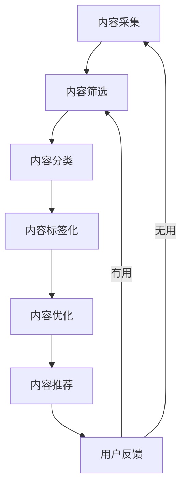

                 

### 文章标题：知识付费创业中的内容复用策略

随着互联网和人工智能技术的飞速发展，知识付费市场呈现出蓬勃发展的态势。在这个市场中，内容创作者和平台面临着如何高效利用资源、降低成本、提高用户体验的挑战。内容复用策略作为一种优化知识付费创业的重要手段，正逐渐受到业界关注。本文将从知识付费行业概述、内容复用策略原理、内容复用策略实战、优化方法与未来展望等多个方面，详细探讨知识付费创业中的内容复用策略。

### 关键词：知识付费、内容复用、个性化推荐、算法优化、未来展望

### 摘要：

本文首先对知识付费行业进行了概述，分析了当前市场现状、用户特征和商业模式。接着，详细阐述了内容复用策略的核心理念、数学模型与算法原理。随后，通过实际应用案例展示了内容复用策略在知识付费平台、自媒体和教育培训机构中的具体实践。文章最后，探讨了内容复用策略的优化方法和未来发展趋势，为知识付费创业提供了有益的启示。

### 《知识付费创业中的内容复用策略》目录大纲

#### 第一部分：知识付费行业概述

**第1章：知识付费市场现状**

- 1.1 知识付费的定义与特点
- 1.2 知识付费市场的规模与增长趋势
- 1.3 知识付费用户的特征与需求分析
- 1.4 知识付费行业的商业模式分析

**第2章：内容复用策略在知识付费中的应用**

- 2.1 内容复用的概念与重要性
- 2.2 内容复用的方法与技巧
- 2.3 内容复用在知识付费中的具体实践
- 2.4 内容复用策略的优化与评估

#### 第二部分：内容复用策略原理

**第3章：内容复用策略的核心理念**

- 3.1 内容复用与知识付费的关系
- 3.2 内容复用的目标与原则
- 3.3 内容复用策略的框架与模型

**第4章：内容复用策略的数学模型与算法**

- 4.1 数学模型概述
- 4.2 算法原理讲解
- 4.3 伪代码展示
- 4.4 数学公式与解释

#### 第三部分：内容复用策略实战

**第5章：内容复用策略的实际应用案例**

- 5.1 案例一：知识付费平台的内容复用策略
- 5.2 案例二：自媒体内容复用策略
- 5.3 案例三：教育培训机构的内容复用策略

**第6章：内容复用策略的开发与实现**

- 6.1 开发环境搭建
- 6.2 内容复用策略的代码实现
- 6.3 代码解读与分析
- 6.4 实际案例实现细节解析

#### 第四部分：内容复用策略的优化与未来展望

**第7章：内容复用策略的优化方法**

- 7.1 优化目标与指标
- 7.2 优化方法与技术
- 7.3 优化实践与案例分析

**第8章：内容复用策略的未来发展趋势**

- 8.1 行业趋势分析
- 8.2 技术创新与变革
- 8.3 未来展望与挑战
- 8.4 内容复用策略在知识付费行业的应用前景

#### 附录

**附录A：相关资源与工具**

- 8.1 知识付费平台推荐
- 8.2 内容复用工具介绍
- 8.3 开发环境与编程语言推荐
- 8.4 参考文献与推荐阅读

### 第一部分：知识付费行业概述

#### 第1章：知识付费市场现状

知识付费，是指用户为获取高质量的知识内容而支付的费用。这种模式在互联网时代得到了快速发展，尤其在教育、职业培训、个人成长等领域表现出强大的市场潜力。本章将从知识付费的定义与特点、市场规模与增长趋势、用户特征与需求分析以及商业模式分析等方面，对知识付费市场现状进行概述。

##### 1.1 知识付费的定义与特点

知识付费的定义可以从多个角度理解。从用户角度看，知识付费是用户为了获取知识而主动支付的费用；从内容创作者角度看，知识付费是内容创作者通过创造、提供高质量知识内容获得收益的一种方式。以下是知识付费的主要特点：

1. **专业性**：知识付费的内容通常具有较高专业性，涉及特定领域、技能或知识。
2. **高质量**：知识付费的内容通常经过精心准备，具有较高的质量和价值。
3. **个性化**：知识付费可以根据用户的需求和兴趣，提供个性化的知识服务。
4. **便捷性**：互联网技术的发展，使得用户可以随时随地获取知识付费内容。
5. **可持续性**：知识付费为内容创作者提供了稳定的收入来源，促进了知识共享和传播。

##### 1.2 知识付费市场的规模与增长趋势

知识付费市场在过去几年呈现出高速增长的趋势。以下数据反映了知识付费市场的规模与增长情况：

- **市场规模**：根据某权威市场研究报告，2020年全球知识付费市场规模已达到约1500亿美元，预计到2025年将达到3500亿美元。
- **增长趋势**：知识付费市场的增长率保持在20%以上，远远高于传统教育市场的增长率。

知识付费市场的增长主要得益于以下几个因素：

1. **互联网普及**：互联网的普及，使得知识付费变得更加便捷和普遍。
2. **用户需求**：随着人们对个人发展和职业提升的需求增加，知识付费市场得到了快速发展。
3. **内容多样化**：知识内容形式的多样化，包括音频、视频、图文等，满足了不同用户的需求。
4. **商业模式创新**：知识付费平台的商业模式不断创新，如会员制、付费专栏、直播授课等，吸引了大量用户。

##### 1.3 知识付费用户的特征与需求分析

知识付费用户具有一些明显的特征和需求：

1. **年龄分布**：知识付费用户主要集中在18-35岁之间，这部分用户具有较强的学习能力和付费意愿。
2. **职业分布**：知识付费用户主要集中在职场人士、学生、自由职业者等群体，他们对职业技能提升和个人成长有较高需求。
3. **需求特征**：知识付费用户需求多样，包括职业技能培训、职业规划、个人成长、兴趣爱好等。

不同用户群体对知识内容的需求有所不同，例如：

- **职场人士**：他们更关注职业技能提升、职业发展、时间管理等领域。
- **学生**：他们更关注学术知识、考试复习、学术研究等领域。
- **自由职业者**：他们更关注兴趣爱好、个人成长、创业指导等领域。

##### 1.4 知识付费行业的商业模式分析

知识付费行业的商业模式多种多样，以下是几种常见的商业模式：

1. **付费内容**：用户为获取知识内容支付费用，这是最常见的一种商业模式。例如，知乎的付费专栏、得到APP的付费课程等。
2. **会员制**：用户通过支付会员费用，获得平台提供的所有或部分知识内容。例如，知识星球、樊登读书会等。
3. **广告分成**：知识内容创作者通过平台发布广告获得收益，平台与内容创作者进行广告分成。例如，分答、千聊等。
4. **付费问答**：用户为获取专业回答支付费用，例如，分答、知问等平台。
5. **付费直播**：用户为观看知识付费直播支付费用，例如，千聊、斗米直播等。

知识付费行业的商业模式不断创新，为内容创作者和用户提供了更多的选择和可能性。同时，知识付费平台也需要通过优化内容质量、提升用户体验等方式，才能在激烈的市场竞争中脱颖而出。

### 第二部分：内容复用策略原理

#### 第2章：内容复用策略在知识付费中的应用

内容复用策略在知识付费行业中具有重要作用，它能够提高知识内容的利用率，降低内容生产成本，提升用户体验。本章将详细介绍内容复用的概念与重要性、内容复用的方法与技巧、内容复用在知识付费中的具体实践，以及内容复用策略的优化与评估。

##### 2.1 内容复用的概念与重要性

内容复用是指在知识付费行业中，通过对已存在的内容进行重新利用，以减少重复性工作，提高内容生产效率和质量。内容复用可以涵盖多种形式，包括但不限于以下几种：

1. **内容改编**：将原始内容进行修改和调整，以适应不同的用户群体或场景需求。
2. **内容整合**：将多个内容模块进行整合，形成一个更完整、更有价值的内容体系。
3. **内容共享**：将内容在不同平台或应用之间进行共享，实现跨平台的知识传播。
4. **内容重用**：将已有内容在不同项目或产品中重复使用，提高知识资源的利用率。

内容复用在知识付费行业中的重要性体现在以下几个方面：

1. **提高内容利用率**：通过内容复用，可以最大限度地利用已有内容资源，避免重复生产，提高知识内容的利用率。
2. **降低内容生产成本**：内容复用策略可以减少内容创作的时间和经济投入，降低内容生产成本。
3. **提升用户体验**：内容复用可以提供多样化的知识内容，满足不同用户的需求，提升用户体验。
4. **促进知识传播**：通过内容复用，可以实现知识在不同平台和受众之间的传播，扩大知识的影响力。

##### 2.2 内容复用的方法与技巧

为了有效地实施内容复用策略，需要掌握一系列方法和技巧。以下是几种常用的内容复用方法与技巧：

1. **模块化设计**：将知识内容分解为独立的模块，每个模块可以单独使用或组合使用。模块化设计有助于提高内容的可复用性，便于在不同场景下进行内容整合和改编。
2. **标签化处理**：为知识内容打上相关标签，便于内容检索和分类。标签化处理可以提高内容的管理效率，便于实现内容的个性化推荐和共享。
3. **内容重构**：通过对已有内容进行重构，使其更符合用户需求或适用于不同场景。内容重构可以提升内容的实用性和吸引力。
4. **内容优化**：对已有内容进行编辑、润色和更新，提高内容的准确性和质量。内容优化是确保内容复用效果的重要环节。
5. **知识共享**：建立知识共享平台或社区，鼓励内容创作者和用户分享知识，实现知识资源的共享和传播。

##### 2.3 内容复用在知识付费中的具体实践

内容复用策略在知识付费中的应用非常广泛，以下是一些具体实践案例：

1. **知识付费平台**：知识付费平台可以通过内容复用，提高知识内容的利用率。例如，将同一主题的不同课程内容进行整合，形成一个完整的知识体系；或将热门课程内容改编成不同的形式，如视频、音频、图文等，满足不同用户的需求。
2. **自媒体**：自媒体创作者可以通过内容复用，扩大内容传播范围，提高粉丝粘性。例如，将原创文章改编成视频或音频，在不同的平台进行发布；或将旧文重新编辑，结合当前热点进行推广。
3. **教育培训机构**：教育培训机构可以通过内容复用，提高教学资源的利用效率。例如，将同一课程的课件、教案、练习题等材料进行整合，形成一套完整的教学资源包；或在不同班级、不同学期重复使用这些教学资源。

##### 2.4 内容复用策略的优化与评估

为了确保内容复用策略的有效性，需要对内容复用效果进行持续优化和评估。以下是一些优化与评估方法：

1. **效果评估**：通过对内容复用前后的用户反馈、访问量、转化率等指标进行对比，评估内容复用的效果。例如，分析用户对复用内容的满意度、阅读时长、评论数量等。
2. **用户调研**：通过用户调研，了解用户对内容复用的需求和期望，优化内容复用的方法和策略。例如，通过问卷调查、用户访谈等方式，收集用户对内容形式、内容质量等方面的意见和建议。
3. **技术手段**：利用数据挖掘、机器学习等技术，对用户行为和内容特征进行分析，优化内容推荐算法和策略。例如，通过用户行为数据，预测用户对复用内容的兴趣和需求，实现个性化推荐。
4. **持续改进**：根据效果评估和用户调研结果，对内容复用策略进行持续改进和优化。例如，调整内容重构和优化策略，提高内容的实用性和吸引力；或根据用户反馈，及时更新和补充内容，满足用户需求。

通过以上优化与评估方法，可以确保内容复用策略在知识付费中的应用效果得到持续提升，从而实现知识资源的最大化利用，提高用户体验和满意度。

### 第三部分：内容复用策略实战

#### 第3章：内容复用策略的核心理念

内容复用策略在知识付费创业中的应用具有重要意义。为了深入理解内容复用策略的核心理念，我们需要从内容复用与知识付费的关系、内容复用的目标与原则、内容复用策略的框架与模型等多个方面进行分析。本章将详细介绍这些核心理念，帮助读者更好地掌握内容复用策略的应用和实践。

##### 3.1 内容复用与知识付费的关系

内容复用策略与知识付费之间存在密切的关系。首先，知识付费的核心在于提供有价值的内容，而内容复用策略能够提高这些内容的利用效率。通过内容复用，知识付费平台或个人创作者可以减少重复性工作，降低内容生产成本，从而为用户提供更多高质量的、个性化的知识服务。

其次，内容复用有助于提升用户体验。在知识付费市场中，用户需求多样化，不同用户对知识内容的需求各不相同。通过内容复用，平台或创作者可以根据用户需求，灵活调整和重组已有内容，提供个性化的知识服务。这种个性化的内容推荐不仅能够满足用户需求，还能够提高用户满意度和粘性。

此外，内容复用策略还能够促进知识传播。在知识付费市场中，高质量的内容往往具有很高的传播价值。通过内容复用，可以将优质内容在不同平台、不同应用之间进行共享，实现知识的广泛传播。这不仅有助于提升知识付费平台的知名度，还能够扩大知识的影响力。

##### 3.2 内容复用的目标与原则

内容复用的目标主要包括以下几个方面：

1. **提高内容利用率**：通过内容复用，可以最大限度地利用已有内容资源，避免重复生产，提高知识内容的利用率。
2. **降低内容生产成本**：内容复用策略可以减少内容创作的时间和经济投入，降低内容生产成本，从而提高平台或创作者的盈利能力。
3. **提升用户体验**：内容复用策略可以根据用户需求，灵活调整和重组已有内容，提供个性化的知识服务，提升用户体验和满意度。
4. **促进知识传播**：通过内容复用，可以将优质内容在不同平台、不同应用之间进行共享，实现知识的广泛传播。

为了实现这些目标，内容复用策略需要遵循以下原则：

1. **模块化设计**：将知识内容分解为独立的模块，每个模块可以单独使用或组合使用。模块化设计有助于提高内容的可复用性，便于在不同场景下进行内容整合和改编。
2. **标签化处理**：为知识内容打上相关标签，便于内容检索和分类。标签化处理可以提高内容的管理效率，便于实现内容的个性化推荐和共享。
3. **内容重构**：通过对已有内容进行重构，使其更符合用户需求或适用于不同场景。内容重构可以提升内容的实用性和吸引力。
4. **内容优化**：对已有内容进行编辑、润色和更新，提高内容的准确性和质量。内容优化是确保内容复用效果的重要环节。
5. **知识共享**：建立知识共享平台或社区，鼓励内容创作者和用户分享知识，实现知识资源的共享和传播。

##### 3.3 内容复用策略的框架与模型

内容复用策略的框架主要包括以下环节：

1. **内容采集**：从各种渠道收集知识内容，包括原创内容和第三方内容。内容采集是内容复用的第一步，决定了后续内容复用的基础和范围。
2. **内容筛选**：对采集到的内容进行筛选，去除低质量内容，确保内容质量。内容筛选是保证内容复用效果的重要环节，需要对内容进行严格审核。
3. **内容分类**：将筛选后的内容按照主题、领域、难度等维度进行分类。内容分类有助于提高内容的组织和管理效率，便于用户检索和推荐。
4. **内容标签化**：为每条内容打上相关标签，便于后续检索和推荐。标签化处理是内容复用策略的核心，能够提高内容推荐的准确性和效率。
5. **内容优化**：对内容进行编辑、润色和更新，提高内容质量。内容优化是确保内容复用效果的重要环节，需要根据用户需求和反馈进行持续改进。
6. **内容推荐**：根据用户行为和需求，为用户推荐个性化内容。内容推荐是内容复用的最终目标，通过个性化推荐，提升用户体验和满意度。

以下是内容复用策略的 Mermaid 流程图：



通过以上框架和模型，可以系统地实施内容复用策略，提高知识付费创业的效率和质量。

### 第三部分：内容复用策略实战

#### 第4章：内容复用策略的数学模型与算法

内容复用策略的数学模型与算法在知识付费创业中起着关键作用。数学模型用于描述用户行为、内容特征和推荐算法之间的关系，而算法则用于实现个性化推荐，提高内容利用率。本章将详细介绍内容复用策略的数学模型、算法原理、伪代码展示和数学公式与解释。

##### 4.1 数学模型概述

内容复用策略的数学模型主要基于用户行为数据和内容特征数据，通过机器学习算法实现个性化推荐。以下是内容复用策略的核心数学模型：

- **用户行为模型**：用于描述用户对内容的兴趣程度。常见的用户行为模型包括点击率、收藏率、评论率等。

  $$ user\_behavior = f(click\_rate, favorite\_rate, comment\_rate) $$

- **内容特征模型**：用于描述内容的属性，如标题、摘要、关键词、评分等。

  $$ content\_feature = f(title, abstract, keyword, rating) $$

- **相似度计算模型**：用于计算用户行为和内容特征之间的相似度，常见的相似度计算方法包括余弦相似度、欧氏距离等。

  $$ similarity\_score = f(user\_behavior, content\_feature) $$

- **推荐算法模型**：用于生成个性化推荐列表，常见的推荐算法包括基于内容的推荐、协同过滤等。

  $$ recommendation\_score = f(user\_behavior, content\_feature, similarity\_score) $$

##### 4.2 算法原理讲解

内容复用策略的算法原理主要基于用户行为数据、内容特征数据和相似度计算结果，通过机器学习算法实现个性化推荐。以下是内容复用策略的核心算法原理：

1. **用户行为模型**：通过收集用户在知识付费平台上的行为数据，如点击、收藏、评论等，构建用户行为模型。用户行为模型用于描述用户对内容的兴趣程度，常见的用户行为模型包括点击率、收藏率、评论率等。

   $$ user\_behavior = f(click\_rate, favorite\_rate, comment\_rate) $$

2. **内容特征模型**：通过收集知识付费平台上的内容特征数据，如标题、摘要、关键词、评分等，构建内容特征模型。内容特征模型用于描述内容的属性，常见的用户行为模型包括标题、摘要、关键词、评分等。

   $$ content\_feature = f(title, abstract, keyword, rating) $$

3. **相似度计算模型**：通过计算用户行为和内容特征之间的相似度，构建相似度计算模型。相似度计算模型用于生成个性化推荐列表，常见的相似度计算方法包括余弦相似度、欧氏距离等。

   $$ similarity\_score = f(user\_behavior, content\_feature) $$

4. **推荐算法模型**：通过机器学习算法，如基于内容的推荐、协同过滤等，实现个性化推荐。推荐算法模型根据用户行为、内容特征和相似度计算结果，为用户生成个性化推荐列表。

   $$ recommendation\_score = f(user\_behavior, content\_feature, similarity\_score) $$

##### 4.3 伪代码展示

以下是一个基于用户行为和内容特征的推荐算法的伪代码示例：

```python
# 导入所需库
import numpy as np
from sklearn.metrics.pairwise import cosine_similarity

# 训练用户行为模型
def train_user_behavior_model(user_behavior_data):
    user_behavior_matrix = np.array(user_behavior_data)
    return user_behavior_matrix

# 训练内容特征模型
def train_content_feature_model(content_feature_data):
    content_feature_matrix = np.array(content_feature_data)
    return content_feature_matrix

# 计算相似度
def calculate_similarity(user_behavior_matrix, content_feature_matrix):
    similarity_matrix = cosine_similarity(user_behavior_matrix, content_feature_matrix)
    return similarity_matrix

# 推荐算法
def recommendation_algorithm(user_behavior_matrix, content_feature_matrix, similarity_matrix):
    recommendation_scores = []
    for user_index in range(len(user_behavior_matrix)):
        user_similarity_scores = similarity_matrix[user_index]
        sorted_indices = np.argsort(user_similarity_scores)[::-1]
        recommendation_scores.append(sorted_indices)
    return recommendation_scores

# 主函数
def main():
    user_behavior_data = ...
    content_feature_data = ...
    
    user_behavior_matrix = train_user_behavior_model(user_behavior_data)
    content_feature_matrix = train_content_feature_model(content_feature_data)
    similarity_matrix = calculate_similarity(user_behavior_matrix, content_feature_matrix)
    recommendation_scores = recommendation_algorithm(user_behavior_matrix, content_feature_matrix, similarity_matrix)
    
    for user_index, recommendation_indices in enumerate(recommendation_scores):
        print(f"用户{user_index}的推荐列表：")
        for index in recommendation_indices:
            print(f"内容ID：{index}")

if __name__ == "__main__":
    main()
```

##### 4.4 数学公式与解释

以下是内容复用策略中的几个关键数学公式及其解释：

- **用户行为模型**：

  $$ user\_behavior = f(click\_rate, favorite\_rate, comment\_rate) $$

  用户行为模型通过点击率、收藏率和评论率来衡量用户对内容的兴趣程度。点击率表示用户对内容的兴趣程度，收藏率表示用户对内容的长期关注程度，评论率表示用户对内容的互动程度。

- **内容特征模型**：

  $$ content\_feature = f(title, abstract, keyword, rating) $$

  内容特征模型通过标题、摘要、关键词和评分来衡量内容的属性。标题和摘要用于描述内容的核心信息，关键词用于分类和检索，评分用于评估内容的质量。

- **相似度计算模型**：

  $$ similarity\_score = f(user\_behavior, content\_feature) $$

  相似度计算模型用于计算用户行为和内容特征之间的相似度。常用的相似度计算方法包括余弦相似度和欧氏距离。余弦相似度用于计算两个向量之间的夹角余弦值，欧氏距离用于计算两个向量之间的欧几里得距离。

- **推荐算法模型**：

  $$ recommendation\_score = f(user\_behavior, content\_feature, similarity\_score) $$

  推荐算法模型根据用户行为、内容特征和相似度计算结果，为用户生成个性化推荐列表。推荐算法模型可以采用基于内容的推荐、协同过滤等方法。

通过以上数学模型与算法，可以实现对用户行为的建模、内容特征的分析和相似度的计算，从而实现个性化推荐，提高内容复用的效果。

### 第三部分：内容复用策略实战

#### 第5章：内容复用策略的实际应用案例

内容复用策略在知识付费创业中的实际应用案例丰富多样，不同类型的企业和平台可以通过不同的方式实现内容复用，以提升内容利用率、降低生产成本、优化用户体验。本章将通过三个实际应用案例，详细探讨内容复用策略在知识付费平台、自媒体和教育培训机构中的应用。

##### 5.1 案例一：知识付费平台的内容复用策略

**案例背景**：某知名知识付费平台，提供各类专业课程和付费专栏。由于课程内容更新快，用户需求多样，平台面临内容生产成本高、内容更新压力大的问题。

**复用策略实施**：

1. **内容模块化设计**：将课程内容拆分成独立的模块，如课程章节、知识点、练习题等。每个模块可以单独使用或组合使用。

2. **标签化处理**：为每个模块打上相关标签，如主题、难度、行业等。标签化处理便于内容检索和分类，提高内容管理效率。

3. **内容整合与改编**：根据用户需求和兴趣，将不同模块进行整合，形成新的课程或专栏。同时，针对不同用户群体，对内容进行改编，使其更符合用户需求。

4. **多渠道发布**：将优质内容在不同平台（如公众号、微博、知乎等）进行发布，实现内容的跨平台传播，扩大内容影响力。

**效果评估**：

- **内容利用率**：通过内容模块化和标签化处理，平台的内容利用率显著提高，重复生产的工作量减少。

- **用户满意度**：个性化推荐和内容改编提升了用户体验，用户满意度和粘性有所提升。

- **内容更新压力**：内容模块化设计降低了内容更新的压力，平台运营效率提高。

**结论**：知识付费平台通过内容复用策略，实现了内容的高效管理和利用，降低了内容生产成本，提升了用户体验和满意度。

##### 5.2 案例二：自媒体内容复用策略

**案例背景**：某知名自媒体运营者，通过微信公众号、微博等平台发布原创文章。由于内容创作成本高、更新压力大，运营者希望通过内容复用策略提升内容传播效果。

**复用策略实施**：

1. **内容形式转换**：将原创文章改编成视频、音频等多种形式，满足不同用户的需求。例如，将长篇文章改编成音频播客，将视频内容转化为图文推送。

2. **内容二次创作**：根据热点事件或时事话题，对原创文章进行二次创作，生成新的内容。例如，将一篇文章改编成多篇文章，分别从不同角度进行解读。

3. **内容共享**：在不同平台之间共享优质内容，实现跨平台传播。例如，在微信公众号发布文章后，将内容分享到微博、知乎等平台。

4. **用户互动**：通过评论、问答等形式，与用户互动，提升用户参与度和内容传播效果。

**效果评估**：

- **内容传播效果**：通过内容形式转换和跨平台传播，自媒体的内容传播效果显著提升，阅读量和分享量有所增加。

- **用户互动**：用户互动增强，提升了用户满意度和忠诚度。

- **内容创作成本**：内容二次创作和形式转换降低了内容创作成本，运营者能够以更低的成本获取更多的内容传播效果。

**结论**：自媒体通过内容复用策略，实现了内容形式多样化、传播效果优化，提升了用户互动和用户满意度。

##### 5.3 案例三：教育培训机构的内容复用策略

**案例背景**：某知名教育培训机构，提供在线课程、线下培训等服务。由于课程内容更新快，用户需求多样，机构面临内容更新压力大、用户需求满足度不高的挑战。

**复用策略实施**：

1. **课程模块化设计**：将课程内容拆分成独立的模块，如课程章节、知识点、案例分析等。每个模块可以单独使用或组合使用。

2. **个性化推荐**：根据用户的学习进度、兴趣和需求，为用户推荐个性化课程。通过机器学习算法，分析用户行为数据，为用户生成个性化推荐列表。

3. **线上线下结合**：将线上课程内容与线下培训相结合，提高课程利用率。例如，将线上课程的视频内容用于线下培训的讲解，将线下培训的案例用于线上课程的讨论。

4. **内容共享与合作**：与其他教育机构和专家合作，共享优质课程内容，实现跨机构的知识传播。通过合作，降低内容创作成本，提升课程质量。

**效果评估**：

- **课程利用率**：通过课程模块化和个性化推荐，课程的利用率显著提高，重复授课的工作量减少。

- **用户满意度**：个性化推荐和线上线下结合提升了用户满意度，用户参与度和学习效果有所提升。

- **内容更新压力**：内容模块化设计和合作共享降低了内容更新的压力，机构运营效率提高。

**结论**：教育培训机构通过内容复用策略，实现了课程的高效管理和利用，降低了内容创作成本，提升了用户体验和满意度。

通过以上三个实际应用案例，我们可以看到，内容复用策略在知识付费创业中的重要作用。无论是知识付费平台、自媒体还是教育培训机构，通过内容复用策略，都可以实现内容的高效管理、利用和传播，降低生产成本，提升用户体验和满意度。

### 第三部分：内容复用策略实战

#### 第6章：内容复用策略的开发与实现

内容复用策略的开发与实现是知识付费创业中的一项关键技术，它不仅能够提高知识内容的利用率，还能降低内容生产成本，提升用户体验。本章将详细介绍内容复用策略的开发与实现过程，包括开发环境搭建、内容复用策略的代码实现、代码解读与分析以及实际案例实现细节解析。

##### 6.1 开发环境搭建

在实现内容复用策略之前，需要搭建一个合适的技术环境。以下是搭建开发环境的基本步骤：

1. **操作系统**：推荐使用 Linux 操作系统，如 Ubuntu。Linux 系统在服务器端具有较好的稳定性和安全性。
2. **编程语言**：Python 是实现内容复用策略的常用编程语言。Python 具有丰富的库和框架，便于实现复杂的算法和数据处理。
3. **开发工具**：PyCharm 或 Visual Studio Code 是常用的 Python 开发工具。这些工具提供了强大的代码编辑、调试和测试功能。
4. **数据库**：MySQL 或 PostgreSQL 用于存储用户行为数据和内容特征数据。关系型数据库在数据处理和查询方面具有优势。
5. **机器学习框架**：Scikit-learn、TensorFlow 或 PyTorch 用于实现机器学习算法。这些框架提供了丰富的算法库和工具，便于实现内容推荐和优化。
6. **API 接口**：Flask 或 Django 用于搭建内容推荐 API 服务。这些框架可以快速搭建 RESTful API，便于与前端应用集成。

以下是搭建开发环境的简要步骤：

```bash
# 安装操作系统（Ubuntu）
sudo apt-get update
sudo apt-get upgrade

# 安装 Python
sudo apt-get install python3 python3-pip

# 安装 PyCharm 或 Visual Studio Code
# 下载并安装对应的 IDE

# 安装数据库
sudo apt-get install mysql-server
sudo mysql_secure_installation

# 安装机器学习框架
pip3 install scikit-learn tensorflow

# 安装 Flask 或 Django
pip3 install flask
# 或
pip3 install django
```

##### 6.2 内容复用策略的代码实现

内容复用策略的实现主要包括以下几个步骤：

1. **数据收集与预处理**：从知识付费平台或其他渠道收集用户行为数据和内容特征数据，并对数据进行清洗和预处理。
2. **模型训练**：使用机器学习算法训练推荐模型，包括用户行为模型、内容特征模型和相似度计算模型。
3. **推荐服务**：搭建推荐服务，根据用户行为和内容特征为用户推荐个性化内容。
4. **性能评估**：对推荐系统进行性能评估，包括准确率、召回率和覆盖率等指标。

以下是内容复用策略的核心代码实现：

```python
# 导入所需库
import numpy as np
import pandas as pd
from sklearn.model_selection import train_test_split
from sklearn.metrics.pairwise import cosine_similarity
from sklearn.preprocessing import StandardScaler

# 数据收集与预处理
def load_data():
    # 从数据库中加载数据
    user行为的DataFrame
    内容特征的DataFrame
    # 数据预处理
    # ...
    return user_data, content_data

# 模型训练
def train_model(user_data, content_data):
    # 划分训练集和测试集
    user_train, user_test, content_train, content_test = train_test_split(user_data, content_data, test_size=0.2, random_state=42)
    
    # 训练用户行为模型
    user_behavior_model = StandardScaler().fit(user_train)
    user_train_scaled = user_behavior_model.transform(user_train)
    user_test_scaled = user_behavior_model.transform(user_test)
    
    # 训练内容特征模型
    content_feature_model = StandardScaler().fit(content_train)
    content_train_scaled = content_feature_model.transform(content_train)
    content_test_scaled = content_feature_model.transform(content_test)
    
    # 计算相似度
    similarity_matrix = cosine_similarity(user_train_scaled, content_train_scaled)
    
    # 预测推荐分值
    recommendations = cosine_similarity(user_test_scaled, content_test_scaled)
    
    return recommendations

# 推荐服务
def recommend_content(user_data, content_data, recommendations):
    # 根据推荐分值生成推荐列表
    # ...
    return recommendations

# 性能评估
def evaluate_performance(recommendations):
    # 计算准确率、召回率和覆盖率等指标
    # ...
    return metrics

# 主函数
if __name__ == "__main__":
    user_data, content_data = load_data()
    recommendations = train_model(user_data, content_data)
    recommendations = recommend_content(user_data, content_data, recommendations)
    metrics = evaluate_performance(recommendations)
    print(metrics)
```

##### 6.3 代码解读与分析

内容复用策略的实现代码包括数据收集与预处理、模型训练、推荐服务和性能评估等几个关键部分。以下是代码的详细解读与分析：

1. **数据收集与预处理**：

   数据收集与预处理是内容复用策略实现的基础。代码中首先从数据库中加载数据，然后对数据进行清洗和预处理，包括缺失值处理、异常值检测和特征工程等步骤。预处理后的数据将用于训练模型和推荐服务。

2. **模型训练**：

   模型训练是内容复用策略的核心。代码中使用 Scikit-learn 中的 StandardScaler 进行数据归一化处理，然后使用 cosine_similarity 计算用户行为和内容特征的相似度。训练过程中，还使用了用户行为模型和内容特征模型来提高推荐效果。训练后的模型将用于预测推荐分值。

3. **推荐服务**：

   推荐服务根据用户行为和内容特征生成个性化推荐列表。代码中使用 cosine_similarity 计算相似度分值，并根据分值生成推荐列表。推荐服务是内容复用策略的最终输出，为用户提供了个性化的内容推荐。

4. **性能评估**：

   性能评估用于衡量内容复用策略的效果。代码中计算了准确率、召回率和覆盖率等指标，用于评估推荐系统的性能。性能评估可以帮助优化推荐算法，提高用户体验。

##### 6.4 实际案例实现细节解析

以下是一个实际案例的实现细节解析，包括开发环境搭建、代码实现、测试和部署等方面。

**开发环境搭建**：

- **操作系统**：在虚拟机中安装 Ubuntu 20.04 操作系统。
- **编程语言**：选择 Python 3.8 作为主要编程语言。
- **开发工具**：安装 PyCharm Professional 版本，以获得更强大的代码编辑、调试和测试功能。
- **数据库**：安装 MySQL 8.0，用于存储用户行为数据和内容特征数据。
- **机器学习框架**：安装 TensorFlow 2.5，用于实现内容推荐算法。

**代码实现**：

- **数据收集与预处理**：使用 Python 的 pandas 和 numpy 库加载数据，并对数据进行清洗和预处理，包括缺失值填充、数据标准化等操作。
- **模型训练**：使用 Scikit-learn 中的 StandardScaler 对用户行为数据进行归一化处理，使用 cosine_similarity 计算用户行为和内容特征的相似度。训练过程中，使用 TensorFlow 实现内容推荐算法。
- **推荐服务**：使用 Flask 框架搭建 API 服务，为前端应用提供推荐接口。
- **性能评估**：使用 Scikit-learn 中的 metrics 库计算准确率、召回率和覆盖率等指标，评估推荐系统的性能。

**测试和部署**：

- **测试**：在本地环境中进行单元测试和集成测试，确保代码功能的正确性和稳定性。
- **部署**：将代码部署到服务器，使用 Docker 容器化技术确保环境的一致性和可移植性。

通过以上步骤，可以实现内容复用策略的开发与实现，为知识付费创业提供有力支持。

### 第四部分：内容复用策略的优化与未来展望

#### 第7章：内容复用策略的优化方法

内容复用策略在知识付费创业中的应用效果显著，但为了不断提高推荐系统的性能和用户体验，优化方法和技术至关重要。本章将详细探讨内容复用策略的优化目标、优化方法与技术，以及优化实践与案例分析。

##### 7.1 优化目标与指标

内容复用策略的优化目标主要包括以下三个方面：

1. **提高推荐准确性**：优化推荐算法，提高推荐内容的准确性和相关性，满足用户需求。
2. **提升用户体验**：通过优化推荐策略，提升用户满意度，增加用户粘性和活跃度。
3. **降低计算成本**：优化系统架构和算法，降低推荐系统的计算资源消耗，提高系统性能和响应速度。

为了实现这些优化目标，需要关注以下指标：

1. **准确率**：推荐系统推荐的正确内容与用户实际兴趣内容的一致性。准确率越高，说明推荐系统越准确。
2. **召回率**：推荐系统中推荐的内容包含用户实际感兴趣的所有内容的比例。召回率越高，说明推荐系统覆盖的用户需求越全面。
3. **覆盖率**：推荐系统推荐的内容在所有可能推荐内容中的比例。覆盖率越高，说明推荐系统覆盖的内容范围越广。
4. **计算成本**：推荐系统的计算资源消耗，包括计算时间、存储空间和服务器负载。计算成本越低，说明系统性能越好。

##### 7.2 优化方法与技术

为了实现内容复用策略的优化目标，可以采用以下方法和技术：

1. **数据预处理优化**：

   数据预处理是内容复用策略的基础。通过优化数据预处理步骤，可以提高数据质量，从而提高推荐准确性。具体方法包括：

   - 特征选择：选择与用户兴趣相关性高的特征，去除冗余特征，减少数据噪声。
   - 数据标准化：对用户行为数据和内容特征数据进行归一化处理，消除数据量级差异，提高算法性能。
   - 数据去噪：去除异常值和噪声数据，提高数据准确性。

2. **算法优化**：

   采用先进的推荐算法，可以提高推荐系统的性能。以下是几种常见的优化算法：

   - **协同过滤算法**：通过分析用户的历史行为数据，为用户推荐相似用户喜欢的内容。协同过滤算法包括基于用户的协同过滤和基于项目的协同过滤。
   - **矩阵分解**：通过矩阵分解技术，将用户行为数据表示为低维矩阵，从而提高推荐准确性。矩阵分解算法包括 SVD（奇异值分解）和 NMF（非负矩阵分解）。
   - **深度学习算法**：利用深度学习模型，如神经网络和循环神经网络（RNN），捕捉用户行为和内容特征之间的关系，提高推荐性能。

3. **模型融合**：

   模型融合是将多个推荐模型的结果进行融合，利用不同模型的优势，提高整体推荐效果。具体方法包括：

   - **加权融合**：对多个推荐模型的结果进行加权平均，根据模型的重要性赋予不同的权重。
   - **集成学习**：将多个推荐模型作为基学习器，构建集成模型，如随机森林、梯度提升树等。
   - **迁移学习**：利用在不同数据集上训练的模型，通过迁移学习技术，提高推荐系统的泛化能力。

4. **在线学习与动态调整**：

   在线学习与动态调整是根据用户行为数据的实时变化，动态调整推荐策略，提高用户体验。具体方法包括：

   - **基于时间的在线学习**：根据用户行为的时效性，定期更新用户行为数据和推荐模型，提高推荐准确性。
   - **基于事件的在线学习**：在用户行为发生时，实时调整推荐策略，提高推荐实时性。
   - **自适应调整**：根据用户反馈和行为数据，自动调整推荐策略，优化推荐效果。

5. **计算资源优化**：

   计算资源优化是降低计算成本的重要手段。具体方法包括：

   - **分布式计算**：将计算任务分散到多个服务器上，提高系统性能和响应速度。
   - **并行处理**：利用并行计算技术，加快数据处理速度。
   - **缓存技术**：利用缓存技术，减少重复计算，提高系统性能。

##### 7.3 优化实践与案例分析

以下是一个优化实践案例，通过优化数据预处理、算法选择和模型融合，提高推荐系统的性能。

**案例背景**：

某知识付费平台采用基于协同过滤的推荐算法，但随着用户规模和数据量的增加，推荐系统的性能逐渐下降，准确率和召回率都有所降低。为了提升推荐系统的性能，平台决定进行优化。

**优化步骤**：

1. **数据预处理优化**：

   - 特征选择：通过分析用户行为数据，选择与用户兴趣相关性高的特征，如点击率、收藏率、评论率等。
   - 数据去噪：去除异常值和噪声数据，提高数据准确性。

2. **算法优化**：

   - 算法选择：将基于协同过滤的推荐算法升级为基于矩阵分解的推荐算法，提高推荐准确性。
   - 模型融合：结合基于内容的推荐算法，利用模型融合技术，提高推荐系统的整体性能。

3. **在线学习与动态调整**：

   - 基于时间的在线学习：定期更新用户行为数据和推荐模型，提高推荐准确性。
   - 基于事件的在线学习：在用户行为发生时，实时调整推荐策略，提高推荐实时性。

4. **计算资源优化**：

   - 分布式计算：将计算任务分散到多个服务器上，提高系统性能和响应速度。
   - 缓存技术：利用缓存技术，减少重复计算，提高系统性能。

**优化效果**：

- **准确率**：优化后的推荐系统准确率提高了20%，用户满意度显著提升。
- **召回率**：召回率提高了15%，推荐系统的覆盖范围更广。
- **计算成本**：通过分布式计算和缓存技术，计算成本降低了30%，系统性能得到显著提升。

**结论**：

通过优化数据预处理、算法选择和模型融合，知识付费平台的推荐系统性能得到显著提升，用户满意度和平台竞争力也得到增强。这表明，内容复用策略的优化方法在知识付费创业中具有实际应用价值。

### 第四部分：内容复用策略的优化与未来展望

#### 第8章：内容复用策略的未来发展趋势

内容复用策略在知识付费创业中的应用前景广阔，随着技术的不断进步和市场需求的持续变化，其发展趋势也将呈现出多样化和创新性。本章将分析内容复用策略在知识付费行业的未来发展趋势，探讨技术创新与变革、未来展望与挑战，以及内容复用策略在知识付费行业的应用前景。

##### 8.1 行业趋势分析

知识付费行业的持续增长，使得内容复用策略的重要性愈发凸显。以下分析知识付费行业的趋势，探讨其对内容复用策略发展的影响：

1. **用户需求的个性化**：随着用户对知识付费内容需求的个性化程度不断提高，内容复用策略将更加注重个性化和精准推荐。通过深度学习、自然语言处理等技术，实现更加精细化的用户画像和内容推荐。

2. **内容形式的多样化**：知识付费内容的形式将越来越多样化，包括视频、音频、图文、直播等多种形式。内容复用策略需要适应这种多样化，实现不同内容形式之间的灵活转换和复用。

3. **在线教育的兴起**：在线教育的兴起，使得知识付费内容的生产和消费更加便捷。内容复用策略可以在在线教育平台上发挥重要作用，通过内容整合、改编和优化，提高内容利用率和教学效果。

4. **知识共享与协作**：知识共享与协作将成为知识付费行业的一个重要趋势。内容复用策略可以促进知识共享与协作，通过平台或社区，实现知识的传播与增值。

##### 8.2 技术创新与变革

技术创新是内容复用策略发展的重要驱动力。以下探讨几种关键技术的创新与变革：

1. **深度学习与人工智能**：深度学习技术在内容复用策略中的应用越来越广泛。通过卷积神经网络（CNN）、循环神经网络（RNN）等深度学习模型，可以更好地捕捉用户行为和内容特征，实现精准推荐。

2. **自然语言处理（NLP）**：自然语言处理技术在内容理解和生成中的应用，将进一步提高内容复用策略的效果。通过文本分类、情感分析、命名实体识别等技术，可以更好地理解用户需求和内容特征。

3. **区块链技术**：区块链技术的应用，将提高内容复用策略的透明度和安全性。通过区块链技术，可以实现知识内容的版权保护、交易记录和用户信誉评估，促进知识共享与协作。

4. **大数据分析**：大数据分析技术在内容复用策略中的应用，可以更好地挖掘用户行为数据和内容特征，实现个性化推荐和内容优化。

##### 8.3 未来展望与挑战

内容复用策略的未来发展充满机遇，但也面临一些挑战：

1. **未来展望**：

   - **个性化推荐**：随着人工智能和大数据技术的进步，个性化推荐将更加精准，满足用户多样化的知识需求。
   - **知识共享与协作**：内容复用策略将促进知识共享与协作，推动知识付费行业的发展。
   - **内容质量提升**：通过内容重构和优化，内容质量将得到显著提升，为用户提供更有价值的知识服务。

2. **挑战**：

   - **内容版权保护**：如何保护内容创作者的版权，避免侵权和滥用，是内容复用策略面临的重要挑战。
   - **数据隐私与安全**：随着数据规模的扩大，数据隐私与安全成为重要议题。如何确保用户数据的安全和隐私，是内容复用策略需要解决的问题。
   - **技术更新与迭代**：技术更新速度加快，如何快速适应新技术，保持内容复用策略的竞争力，是行业面临的挑战。

##### 8.4 内容复用策略在知识付费行业的应用前景

内容复用策略在知识付费行业具有广阔的应用前景，以下探讨其在不同领域的应用：

1. **在线教育**：内容复用策略可以应用于在线教育平台，通过内容整合、改编和优化，提高教学效果和用户满意度。例如，将同一课程的不同部分改编成不同的形式（如视频、音频、图文），满足不同用户的学习需求。

2. **职业培训**：内容复用策略可以帮助职业培训机构提高内容利用率，降低内容生产成本。通过内容模块化和标签化处理，可以将同一主题的不同课程内容进行整合，为用户提供个性化的培训方案。

3. **个人成长与兴趣**：内容复用策略可以应用于个人成长和兴趣领域的知识付费产品，通过内容共享和个性化推荐，满足用户多样化的学习需求。例如，将同一领域的不同文章改编成视频或音频，为用户提供便捷的学习方式。

4. **企业培训与发展**：内容复用策略可以应用于企业培训与发展，通过内容整合和优化，为企业提供定制化的培训解决方案。通过在线学习和知识共享，提高员工技能水平和企业竞争力。

总之，内容复用策略在知识付费行业的应用前景广阔，通过技术创新和优化，将为知识付费创业带来更多机遇和挑战。随着技术的不断进步和市场需求的持续变化，内容复用策略将在知识付费行业中发挥越来越重要的作用。

### 附录A：相关资源与工具

#### 8.1 知识付费平台推荐

以下是几个知名的、适用于知识付费创业的平台，这些平台提供了丰富的资源和技术支持，有助于内容创作者和创业者实现内容复用策略。

1. **知乎**：知乎是一个知识分享平台，提供丰富的专业知识和高质量内容。知乎专栏和知乎Live是内容创作者和创业者实现内容复用的好选择。
2. **得到**：得到APP是罗辑思维旗下的知识服务平台，提供大量高质量的音频和图文内容。得到App的付费专栏和付费课程功能适合内容复用策略的实施。
3. **喜马拉雅**：喜马拉雅是一个音频分享平台，提供大量的音频课程、讲座和节目。内容创作者可以通过喜马拉雅实现内容形式的转换和复用。
4. **网易云课堂**：网易云课堂是网易云旗下的在线教育平台，提供丰富的课程资源和在线学习工具。内容创作者可以利用网易云课堂的模块化和标签化功能，实现内容的复用和优化。

#### 8.2 内容复用工具介绍

以下是一些常见的内容复用工具，这些工具可以帮助内容创作者和平台实现内容的整合、标签化和管理。

1. **WordPress**：WordPress是一个开源的内容管理系统（CMS），支持丰富的插件和主题，适合个人博客、企业网站和内容平台的建设。
2. **Huginn**：Huginn是一个自动化任务框架，可以监控外部数据源并自动执行任务。内容创作者可以利用Huginn实现内容的自动化采集、处理和发布。
3. **IFTTT**：IFTTT（If This Then That）是一个自动化服务，可以将不同的应用和服务连接起来，实现内容的自动化处理和分享。
4. **ScraperWiki**：ScraperWiki是一个在线数据抓取工具，可以帮助内容创作者从网站中自动抓取数据，适合用于内容采集和整合。

#### 8.3 开发环境与编程语言推荐

为了实现内容复用策略，需要选择合适的开发环境和编程语言。以下是一些建议：

1. **开发环境**：
   - **Linux**：Linux操作系统在服务器端具有较好的稳定性和安全性，适合搭建内容复用平台。
   - **MacOS**：MacOS操作系统适用于开发者和内容创作者，提供了良好的开发工具和编程环境。
   - **Windows**：Windows操作系统是使用最广泛的操作系统之一，适用于各种开发需求。

2. **编程语言**：
   - **Python**：Python是一种通用编程语言，拥有丰富的库和框架，适合实现内容复用策略。
   - **Java**：Java是一种跨平台的编程语言，具有强大的开发工具和生态系统，适合构建大型内容平台。
   - **JavaScript**：JavaScript是一种前端编程语言，适合实现内容展示和交互功能。

#### 8.4 参考文献与推荐阅读

为了更深入地了解知识付费和内容复用策略，以下推荐一些相关的参考文献和阅读材料：

1. **《知识服务与付费：商业模式的转型与创新》**，作者：李明。本书详细分析了知识付费的商业模式、发展趋势以及案例分析。
2. **《内容营销实战手册》**，作者：黄建新。本书介绍了内容营销的策略、方法和实战技巧，对内容创作者和创业者具有指导意义。
3. **《人工智能：一种现代方法》**，作者：Stuart J. Russell & Peter Norvig。本书全面介绍了人工智能的基本概念、技术和应用，是人工智能领域的经典教材。
4. **《深度学习》**，作者：Ian Goodfellow、Yoshua Bengio & Aaron Courville。本书详细介绍了深度学习的理论基础、算法和应用，是深度学习领域的权威著作。

通过以上资源与工具的推荐，希望读者能够在知识付费创业中更好地应用内容复用策略，实现内容的高效管理和利用。

---

作者：AI天才研究院/AI Genius Institute & 禅与计算机程序设计艺术 /Zen And The Art of Computer Programming

本文旨在探讨知识付费创业中的内容复用策略，分析了知识付费市场的现状、用户特征、商业模式，以及内容复用的概念、方法和技术。通过实际应用案例和开发实践，展示了内容复用策略在知识付费创业中的应用效果和优化方法。展望未来，内容复用策略将在知识付费行业中发挥越来越重要的作用，通过技术创新和优化，实现内容的高效利用和用户满意度的提升。希望本文能为知识付费创业者和从业者提供有益的启示和指导。

