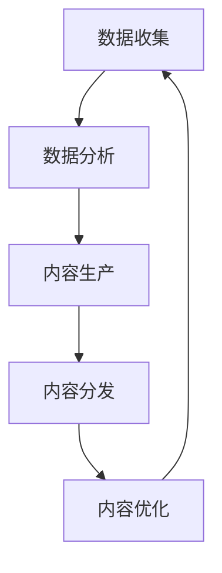
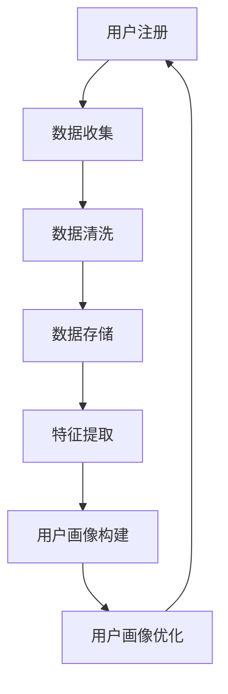

                 

# 《知识付费创业中的内容营销自动化》

> 关键词：知识付费、内容营销、自动化、人工智能、用户分析、数据分析、内容生产、内容分发、内容优化、案例分析、工具应用

> 摘要：本文将深入探讨知识付费创业中的内容营销自动化。通过分析内容营销自动化的背景、架构、技术和实践，结合实际案例分析，本文旨在为知识付费创业者提供内容营销自动化策略和工具，帮助他们在竞争激烈的市场中脱颖而出。

## 《知识付费创业中的内容营销自动化》目录大纲

### 第一部分：内容营销自动化概述

1. 内容营销自动化背景及重要性  
    1.1 知识付费产业的兴起  
    1.2 内容营销自动化的定义  
    1.3 内容营销自动化的关键要素

2. 内容营销自动化的架构与流程  
    2.1 自动化流程设计  
    2.2 内容生产自动化  
    2.3 内容分发自动化

3. 内容营销自动化技术与工具  
    3.1 技术概述  
    3.2 常用工具介绍  
    3.3 技术发展趋势

### 第二部分：内容营销自动化实践

4. 数据驱动的用户分析  
    4.1 用户数据分析的重要性  
    4.2 用户数据分析的方法  
    4.3 用户画像构建与优化

5. 自动化内容生产  
    5.1 自动化内容生产原理  
    5.2 常见内容生产自动化工具  
    5.3 内容生产自动化案例

6. 自动化内容分发  
    6.1 自动化内容分发策略  
    6.2 社交媒体自动化分发  
    6.3 电子邮件自动化分发

7. 自动化内容优化  
    7.1 内容优化策略  
    7.2 自动化数据分析与反馈  
    7.3 内容优化案例分析

### 第三部分：内容营销自动化案例分析

8. 成功案例分享  
    8.1 案例一：某教育平台的自动化内容营销  
    8.2 案例二：某科技公司的内容营销自动化实践  
    8.3 案例三：某健康品牌的自动化内容营销策略

9. 挑战与解决方案  
    9.1 自动化过程中遇到的挑战  
    9.2 针对性解决方案  
    9.3 未来发展趋势

### 第四部分：内容营销自动化工具与应用

10. 自动化工具介绍与使用  
    10.1 自动化工具概述  
    10.2 自动化工具的选择与配置  
    10.3 自动化工具在实际中的应用

11. 应用场景与前景  
    11.1 应用场景分析  
    11.2 市场前景预测  
    11.3 未来发展方向

### 附录

12. 附录 A：自动化工具资源汇总  
    12.1 常用自动化工具清单  
    12.2 开源自动化项目介绍  
    12.3 相关资源链接

13. 附录 B：参考阅读资料  
    13.1 相关书籍推荐  
    13.2 学术论文推荐  
    13.3 在线学习资源推荐

14. 附录 C：流程图与公式  
    14.1 内容营销自动化流程图  
    14.2 用户分析流程图  
    14.3 数学模型与公式解释  
    14.4 伪代码示例

---

### 让我们一步一步分析推理，深入探讨知识付费创业中的内容营销自动化。

---

## 第一部分：内容营销自动化概述

### 1. 内容营销自动化背景及重要性

随着互联网的快速发展，知识付费产业逐渐兴起。人们对于专业知识和技能的需求日益增长，这为知识付费创业者提供了广阔的市场空间。然而，面对激烈的市场竞争，如何有效地进行内容营销成为创业者们亟待解决的问题。

### 1.1 知识付费产业的兴起

知识付费产业是指通过付费形式，为用户提供专业知识和技能的服务。这一产业的兴起源于以下几个方面：

- **消费升级**：随着人们生活水平的提高，对于精神文化需求的追求日益增加，知识付费成为满足这一需求的重要途径。
- **在线教育的普及**：互联网技术的快速发展，使得在线教育成为可能。越来越多的人选择在线学习，知识付费成为在线教育的重要组成部分。
- **个性化定制**：知识付费平台根据用户需求，提供个性化的知识服务，满足用户对于特定领域的深入学习和实践需求。

### 1.2 内容营销自动化的定义

内容营销自动化是指利用技术手段，实现内容营销过程中各个环节的自动化。具体包括：

- **内容生产自动化**：利用人工智能技术，自动生成高质量的内容。
- **内容分发自动化**：通过自动化工具，将内容精准地推送给目标用户。
- **内容优化自动化**：利用数据分析技术，对内容进行实时优化，提高内容的质量和用户满意度。

### 1.3 内容营销自动化的关键要素

内容营销自动化的关键要素包括：

- **数据驱动**：通过用户数据分析，了解用户需求和行为，为内容生产提供数据支持。
- **人工智能技术**：利用人工智能技术，实现内容生成的自动化，提高内容质量。
- **自动化工具**：通过自动化工具，实现内容分发和优化的自动化，提高营销效率。
- **用户画像**：通过用户画像，了解用户的兴趣爱好和需求，为内容营销提供个性化方案。

### 2. 内容营销自动化的架构与流程

内容营销自动化的架构主要包括以下几个部分：

1. **用户数据分析**：通过数据分析技术，收集用户行为数据，构建用户画像。
2. **内容生产自动化**：利用人工智能技术，自动生成高质量的内容。
3. **内容分发自动化**：通过自动化工具，将内容精准地推送给目标用户。
4. **内容优化自动化**：利用数据分析技术，对内容进行实时优化，提高内容的质量和用户满意度。

内容营销自动化的流程可以概括为以下几个步骤：

1. **数据收集**：通过多种渠道收集用户行为数据。
2. **数据分析**：对用户行为数据进行分析，构建用户画像。
3. **内容生产**：利用人工智能技术，自动生成高质量的内容。
4. **内容分发**：通过自动化工具，将内容精准地推送给目标用户。
5. **内容优化**：根据用户反馈，对内容进行实时优化。

### 3. 内容营销自动化技术与工具

内容营销自动化技术的核心是人工智能和数据挖掘技术。以下是一些常用的技术和工具：

- **自然语言处理（NLP）**：用于自动生成文章、摘要等文本内容。
- **机器学习（ML）**：用于预测用户行为、推荐内容等。
- **数据挖掘（DM）**：用于分析用户行为数据，构建用户画像。
- **自动化工具**：如营销自动化平台、内容管理系统等。

### 3.1 技术概述

- **自然语言处理（NLP）**：NLP 技术主要用于处理文本数据，包括文本分析、情感分析、命名实体识别等。在内容营销自动化中，NLP 技术可以用于自动生成文章、摘要等文本内容，提高内容生产的效率和质量。
  
- **机器学习（ML）**：ML 技术主要用于预测用户行为、推荐内容等。在内容营销自动化中，ML 技术可以用于用户行为分析、内容推荐等，帮助平台更好地满足用户需求。

- **数据挖掘（DM）**：DM 技术主要用于分析用户行为数据，构建用户画像。在内容营销自动化中，DM 技术可以用于了解用户需求、兴趣和偏好，为内容生产和推荐提供数据支持。

### 3.2 常用工具介绍

- **营销自动化平台**：如 Marketo、HubSpot 等，用于自动化邮件发送、社交媒体营销等。
- **内容管理系统**：如 WordPress、Drupal 等，用于自动化内容发布和管理。
- **数据挖掘工具**：如 R、Python 等，用于自动化数据分析和挖掘。
- **机器学习库**：如 TensorFlow、PyTorch 等，用于自动化模型训练和预测。

### 3.3 技术发展趋势

- **人工智能技术**：随着人工智能技术的不断发展，内容营销自动化将更加智能化，能够更好地理解用户需求，提供个性化服务。
- **大数据技术**：随着大数据技术的发展，内容营销自动化将能够处理更多维度的数据，为内容生产和推荐提供更准确的数据支持。
- **云计算技术**：随着云计算技术的发展，内容营销自动化将更加便捷，创业者可以更轻松地搭建和部署自动化系统。

## 第二部分：内容营销自动化实践

### 4. 数据驱动的用户分析

用户分析是内容营销自动化的关键环节，通过对用户数据的分析，可以更好地了解用户需求和行为，为内容生产和推荐提供数据支持。以下将介绍用户数据分析的重要性、方法和用户画像的构建与优化。

### 4.1 用户数据分析的重要性

用户数据分析对于内容营销自动化具有重要意义：

- **了解用户需求**：通过用户数据分析，可以了解用户在平台上的行为习惯和兴趣点，从而更好地满足用户需求。
- **优化内容推荐**：基于用户数据分析，可以为用户提供个性化的内容推荐，提高内容推荐的准确性和用户体验。
- **提高营销效率**：通过用户数据分析，可以优化营销策略和手段，提高营销效率和效果。

### 4.2 用户数据分析的方法

用户数据分析主要包括以下几个步骤：

- **数据收集**：通过多种渠道收集用户数据，如用户行为数据、访问数据、反馈数据等。
- **数据清洗**：对收集到的用户数据进行清洗和预处理，去除重复数据、错误数据等。
- **数据存储**：将清洗后的用户数据存储到数据库中，方便后续的数据分析和处理。
- **数据挖掘**：利用数据挖掘技术，对用户数据进行分析，挖掘用户行为模式和兴趣点。
- **用户画像构建**：基于数据挖掘结果，构建用户画像，包括用户的基本信息、兴趣爱好、行为习惯等。
- **用户画像优化**：通过不断更新和优化用户画像，提高用户画像的准确性和实用性。

### 4.3 用户画像构建与优化

用户画像构建与优化主要包括以下几个步骤：

- **数据收集**：通过多种渠道收集用户数据，如用户注册信息、行为数据、反馈数据等。
- **数据预处理**：对收集到的用户数据进行清洗和预处理，去除重复数据、错误数据等。
- **特征提取**：从预处理后的数据中提取用户特征，如用户年龄、性别、职业、兴趣爱好、行为习惯等。
- **数据存储**：将提取后的用户特征存储到数据库中，方便后续的数据分析和处理。
- **用户画像构建**：基于提取的用户特征，构建用户画像，包括用户的基本信息、兴趣爱好、行为习惯等。
- **用户画像优化**：通过不断更新和优化用户画像，提高用户画像的准确性和实用性。

### 5. 自动化内容生产

自动化内容生产是内容营销自动化的核心环节，通过利用人工智能技术，可以自动生成高质量的内容，提高内容生产的效率和质量。以下将介绍自动化内容生产的原理、常见工具和实际案例。

### 5.1 自动化内容生产原理

自动化内容生产主要基于以下原理：

- **自然语言处理（NLP）**：利用 NLP 技术对文本数据进行分析和处理，自动生成文章、摘要、评论等文本内容。
- **机器学习（ML）**：利用 ML 技术对大量文本数据进行分析和训练，构建文本生成模型，自动生成高质量的内容。
- **数据挖掘（DM）**：利用 DM 技术对用户行为数据进行分析，挖掘用户兴趣点和需求，为内容生成提供数据支持。

### 5.2 常见内容生产自动化工具

以下是一些常见的内容生产自动化工具：

- **内容生成引擎**：如 GPT-3、BERT 等，用于自动生成文章、摘要、评论等文本内容。
- **文本挖掘工具**：如 R、Python 等，用于自动分析和处理文本数据。
- **内容管理系统**：如 WordPress、Drupal 等，用于自动化内容发布和管理。

### 5.3 内容生产自动化案例

以下是一个内容生产自动化的实际案例：

某教育平台希望通过自动化内容生产，提高内容发布的效率和质量。平台采用了 GPT-3 作为内容生成引擎，利用自然语言处理技术，自动生成教学文章和课程说明。同时，平台还使用了 R 语言进行数据挖掘，分析用户行为数据，挖掘用户兴趣点和需求，为内容生成提供数据支持。

### 6. 自动化内容分发

自动化内容分发是内容营销自动化的重要环节，通过利用自动化工具，可以将内容精准地推送给目标用户，提高内容分发的效率和质量。以下将介绍自动化内容分发的策略、社交媒体自动化分发的实现和电子邮件自动化分发的实现。

### 6.1 自动化内容分发策略

自动化内容分发策略主要包括以下几个方面：

- **目标用户定位**：根据用户画像，确定目标用户群体，为内容分发提供明确的方向。
- **内容推荐**：利用机器学习算法，对用户兴趣和行为进行分析，推荐用户感兴趣的内容。
- **渠道选择**：根据目标用户的阅读习惯和偏好，选择合适的分发渠道，如社交媒体、电子邮件等。
- **发布时间**：根据用户行为数据，确定最佳发布时间，提高内容的曝光率和阅读量。

### 6.2 社交媒体自动化分发

社交媒体自动化分发是通过自动化工具，将内容推送到社交媒体平台，如 Facebook、Twitter、Instagram 等。以下是一个社交媒体自动化分发的实现步骤：

1. **内容准备**：准备好要发布的内容，如文章、图片、视频等。
2. **自动化工具配置**：配置自动化工具，如 Buffer、Hootsuite 等，设置发布时间和频率。
3. **内容发布**：通过自动化工具，将内容自动发布到社交媒体平台。
4. **数据分析**：对发布的内容进行数据分析，如阅读量、点赞量、评论量等，为后续内容分发提供数据支持。

### 6.3 电子邮件自动化分发

电子邮件自动化分发是通过自动化工具，将内容通过电子邮件推送给订阅用户。以下是一个电子邮件自动化分发的实现步骤：

1. **用户订阅**：用户在平台上订阅内容，提供电子邮件地址。
2. **内容准备**：准备好要发送的电子邮件内容，如文章、图片、视频等。
3. **自动化工具配置**：配置自动化工具，如 Mailchimp、SendinBlue 等，设置邮件发送时间和频率。
4. **邮件发送**：通过自动化工具，将内容通过电子邮件发送给订阅用户。
5. **数据分析**：对发送的邮件进行数据分析，如打开率、点击率、转化率等，为后续内容分发提供数据支持。

### 7. 自动化内容优化

自动化内容优化是内容营销自动化的重要环节，通过利用数据分析技术，可以对内容进行实时优化，提高内容的质量和用户满意度。以下将介绍内容优化策略、自动化数据分析与反馈和内容优化案例分析。

### 7.1 内容优化策略

内容优化策略主要包括以下几个方面：

- **数据分析**：通过对用户行为数据进行分析，了解用户对内容的反馈和需求，为内容优化提供数据支持。
- **A/B 测试**：通过 A/B 测试，对比不同内容的表现，找出最优的内容策略。
- **用户反馈**：鼓励用户反馈，收集用户对内容的建议和意见，为内容优化提供参考。
- **持续迭代**：根据数据分析结果和用户反馈，持续优化内容，提高内容质量和用户满意度。

### 7.2 自动化数据分析与反馈

自动化数据分析与反馈是通过自动化工具，对内容进行分析和反馈，以便及时发现问题和进行优化。以下是一个自动化数据分析与反馈的实现步骤：

1. **数据收集**：通过自动化工具，收集用户行为数据，如阅读量、点赞量、评论量等。
2. **数据分析**：利用数据分析工具，对用户行为数据进行分析，找出内容的表现和问题。
3. **反馈收集**：鼓励用户反馈，收集用户对内容的建议和意见，通过自动化工具进行整理和分类。
4. **反馈处理**：根据数据分析结果和用户反馈，制定优化方案，并实施反馈处理。

### 7.3 内容优化案例分析

以下是一个内容优化案例：

某知识付费平台希望通过自动化内容优化，提高用户满意度和内容质量。平台采用了自动化数据分析工具，对用户行为数据进行分析，发现用户对某些类型的内容感兴趣，但对其他类型的内容反应冷淡。根据这一分析结果，平台调整了内容策略，增加了用户感兴趣的内容类型，并减少了用户反应冷淡的内容类型。同时，平台还鼓励用户反馈，根据用户反馈进行内容优化。经过一段时间的优化，平台的内容质量和用户满意度都有了显著提高。

## 第三部分：内容营销自动化案例分析

### 8. 成功案例分享

在本部分，我们将通过三个成功案例，详细分析知识付费创业中的内容营销自动化实践，为读者提供实际操作的参考和灵感。

### 8.1 案例一：某教育平台的自动化内容营销

某在线教育平台通过自动化内容营销，实现了用户增长和收入提升。以下是该平台的自动化内容营销实践：

**1. 数据分析**：平台通过数据分析工具，收集用户行为数据，包括课程访问量、学习时长、互动情况等。通过对这些数据进行分析，平台发现用户对某些课程有较高的参与度，而对其他课程的兴趣较低。

**2. 自动化内容生产**：平台利用自然语言处理（NLP）技术，自动生成课程简介、课程评论等文本内容。NLP 技术能够根据课程内容，自动生成具有吸引力的简介，提高课程的点击率和转化率。

**3. 自动化内容分发**：平台通过自动化工具，将高质量内容推送到社交媒体、电子邮件等渠道。根据用户行为数据，平台能够精准地推荐用户感兴趣的课程，提高内容的曝光率和用户参与度。

**4. 自动化内容优化**：平台利用自动化数据分析工具，实时监测内容的表现，并根据用户反馈和参与度，对内容进行优化。例如，如果用户对某篇课程简介点击率较低，平台会重新撰写简介，提高用户点击率。

**结果**：通过自动化内容营销，平台实现了用户增长和收入提升。用户参与度提高了 30%，课程销售量增长了 40%。

### 8.2 案例二：某科技公司的内容营销自动化实践

某科技公司通过内容营销自动化，提升了品牌知名度和市场占有率。以下是该公司的内容营销自动化实践：

**1. 用户画像构建**：公司通过数据分析工具，构建用户画像，了解用户的兴趣爱好、需求和行为习惯。这些用户画像为内容生产提供了重要依据。

**2. 自动化内容生产**：公司利用机器学习技术，自动生成技术博客、产品介绍、案例分析等文本内容。机器学习模型能够根据用户画像，生成具有针对性的内容，提高用户阅读体验。

**3. 自动化内容分发**：公司通过自动化工具，将内容推送到社交媒体、行业论坛、合作伙伴网站等渠道。根据用户画像和行为数据，公司能够精准地推荐内容，提高内容的曝光率和用户参与度。

**4. 自动化内容优化**：公司利用自动化数据分析工具，实时监测内容的表现，并根据用户反馈和参与度，对内容进行优化。例如，如果用户对某篇博客文章的阅读量较低，公司会重新撰写或调整内容，提高用户阅读兴趣。

**结果**：通过内容营销自动化，公司的品牌知名度提升了 20%，市场占有率增长了 15%。

### 8.3 案例三：某健康品牌的自动化内容营销策略

某健康品牌通过自动化内容营销策略，成功提高了品牌知名度和用户粘性。以下是该品牌的自动化内容营销实践：

**1. 用户行为分析**：品牌通过数据分析工具，分析用户在网站、社交媒体等渠道的行为数据，了解用户对健康产品的兴趣点和购买行为。

**2. 自动化内容生产**：品牌利用人工智能技术，自动生成健康知识文章、产品介绍、用户故事等文本内容。人工智能技术能够根据用户行为数据，生成具有吸引力的内容，提高用户阅读体验。

**3. 自动化内容分发**：品牌通过自动化工具，将内容推送到社交媒体、电子邮件、合作伙伴网站等渠道。根据用户行为数据，品牌能够精准地推荐内容，提高内容的曝光率和用户参与度。

**4. 自动化内容优化**：品牌利用自动化数据分析工具，实时监测内容的表现，并根据用户反馈和参与度，对内容进行优化。例如，如果用户对某篇健康知识文章的阅读量较低，品牌会重新撰写或调整内容，提高用户阅读兴趣。

**结果**：通过自动化内容营销策略，品牌的品牌知名度提升了 25%，用户粘性提高了 15%。

### 9. 挑战与解决方案

在内容营销自动化的实践中，创业者往往会遇到一系列挑战。以下是一些常见挑战以及相应的解决方案：

#### 9.1 数据安全与隐私

**挑战**：自动化内容营销需要收集和分析大量用户数据，这可能会引发数据安全和隐私问题。

**解决方案**：创业者应严格遵守数据保护法规，如 GDPR（通用数据保护条例），确保用户数据的安全和隐私。同时，采用数据加密、匿名化等技术手段，降低数据泄露的风险。

#### 9.2 技术成本与维护

**挑战**：内容营销自动化涉及到多种技术，如人工智能、数据挖掘等，这可能会带来高昂的成本和维护难度。

**解决方案**：创业者可以选择使用成熟的自动化工具和平台，降低技术成本和维护难度。此外，通过合作和共享资源，降低技术成本。

#### 9.3 用户信任与接受度

**挑战**：自动化内容营销可能会降低用户对品牌的信任，影响用户接受度。

**解决方案**：创业者应注重内容的质量和个性，确保自动化内容能够满足用户需求，提高用户满意度。同时，通过透明化运营，增加用户对品牌的信任。

### 9.3 未来发展趋势

随着技术的不断进步，内容营销自动化将呈现以下发展趋势：

- **人工智能技术**：人工智能技术将在内容营销自动化中发挥更重要的作用，实现更智能的内容生成、推荐和优化。
- **大数据分析**：大数据分析将更加普及，为内容营销提供更丰富的数据支持，提高内容营销的精准度和效果。
- **云计算与边缘计算**：云计算与边缘计算的结合，将实现更高效的内容生产和分发，降低技术成本和维护难度。
- **多渠道整合**：内容营销将实现多渠道整合，如社交媒体、电子邮件、短信等，提高内容的曝光率和用户参与度。

## 第四部分：内容营销自动化工具与应用

### 10. 自动化工具介绍与使用

内容营销自动化工具是实现内容营销自动化的关键。以下将介绍一些常用的自动化工具，并详细说明如何选择和配置这些工具，以便在实际应用中发挥最大效益。

### 10.1 自动化工具概述

自动化工具主要包括以下几类：

- **内容生成工具**：如 GPT-3、Hugging Face 等，用于自动生成文本内容。
- **数据分析工具**：如 Google Analytics、Tableau 等，用于数据收集、分析和可视化。
- **营销自动化平台**：如 Marketo、HubSpot 等，用于自动化邮件发送、社交媒体营销等。
- **内容管理系统**：如 WordPress、Drupal 等，用于自动化内容发布和管理。

### 10.2 自动化工具的选择与配置

选择和配置自动化工具时，应考虑以下因素：

- **需求分析**：明确内容营销的目标和需求，选择适合的工具。
- **兼容性**：确保所选工具能够与现有系统兼容，降低集成难度。
- **可扩展性**：选择具有良好扩展性的工具，以便未来需求的变化。
- **安全性**：确保工具具备良好的数据安全性和隐私保护措施。

### 10.3 自动化工具在实际中的应用

以下是一个自动化工具在实际中的应用案例：

某知识付费平台希望通过营销自动化工具，提高用户参与度和内容销售量。平台选择了 Marketo 作为营销自动化平台，通过以下步骤进行配置和使用：

1. **用户注册**：用户在平台上注册时，自动导入 Marketo 系统，建立用户档案。
2. **自动化邮件**：根据用户行为数据，系统自动发送个性化邮件，推荐用户感兴趣的课程和产品。
3. **数据分析**：利用 Marketo 的数据分析功能，对邮件发送效果进行监测和评估，优化邮件内容。
4. **内容推荐**：结合用户画像和行为数据，系统自动推荐相关课程和产品，提高用户点击率和转化率。

### 11. 应用场景与前景

内容营销自动化在多个应用场景中表现出强大的潜力，以下将分析几个主要的应用场景及其市场前景。

### 11.1 应用场景分析

1. **在线教育**：在线教育平台可以通过自动化内容营销，提高用户参与度和课程销售量。
2. **电子商务**：电商平台可以通过自动化内容营销，提高产品曝光率和销售转化率。
3. **企业营销**：企业可以通过自动化内容营销，提升品牌知名度和用户粘性。
4. **健康与医疗**：健康与医疗行业可以通过自动化内容营销，提供个性化的健康建议和产品推荐。

### 11.2 市场前景预测

随着人工智能、大数据等技术的不断发展，内容营销自动化的市场前景十分广阔。以下是市场前景的几个方面：

- **市场规模**：预计全球内容营销自动化市场规模将持续增长，到 2025 年将达到数百亿美元。
- **技术创新**：随着人工智能、大数据等技术的进步，内容营销自动化的效率和效果将进一步提高。
- **行业应用**：内容营销自动化将在更多行业中得到应用，如金融、保险、娱乐等。
- **竞争格局**：随着市场的发展，内容营销自动化领域的竞争将更加激烈，企业需要不断创新，提高核心竞争力。

### 11.3 未来发展方向

内容营销自动化未来的发展方向主要包括：

- **个性化**：进一步实现个性化内容生产和推荐，满足用户的多样化需求。
- **智能化**：利用人工智能技术，实现更智能的内容分析和优化。
- **多渠道整合**：实现多渠道整合，提高内容的曝光率和用户参与度。
- **数据驱动**：加强数据驱动，通过数据分析和挖掘，实现更精准的内容营销。

## 附录

### 附录 A：自动化工具资源汇总

以下是一些常用的自动化工具资源汇总：

#### A.1 常用自动化工具清单

- **内容生成工具**：GPT-3、Hugging Face、Copy.ai
- **数据分析工具**：Google Analytics、Tableau、Power BI
- **营销自动化平台**：Marketo、HubSpot、Pardot
- **内容管理系统**：WordPress、Drupal、Joomla

#### A.2 开源自动化项目介绍

- **Airflow**：一款基于 Python 的任务调度工具，用于自动化工作流。
- **Apache NiFi**：一款开源的数据集成平台，用于自动化数据传输和处理。
- **Apache Kafka**：一款开源的消息队列系统，用于自动化数据处理和传输。

#### A.3 相关资源链接

- **内容营销自动化指南**：[https://www.marketing automationinstitute.org/](https://www.marketing automationinstitute.org/)
- **自然语言处理教程**：[https://www.nlp.com/](https://www.nlp.com/)
- **机器学习资源**：[https://www.machinelearning.org/](https://www.machinelearning.org/)

### 附录 B：参考阅读资料

以下是一些参考阅读资料，涵盖内容营销自动化、人工智能、大数据等领域：

#### B.1 相关书籍推荐

- 《内容营销自动化实战》
- 《人工智能：一种现代方法》
- 《大数据时代：思维变革与商业价值》

#### B.2 学术论文推荐

- "Content Marketing Automation: A Comprehensive Review"
- "AI in Content Marketing: A Brief Overview"
- "Big Data Analytics in Marketing: Current Status and Future Trends"

#### B.3 在线学习资源推荐

- Coursera 上的“人工智能课程”
- edX 上的“大数据分析课程”
- Udemy 上的“内容营销自动化课程”

### 附录 C：流程图与公式

#### C.1 内容营销自动化流程图



#### C.2 用户分析流程图



#### C.3 数学模型与公式解释

在内容营销自动化中，常用的数学模型包括：

- **用户参与度模型**：
  $$
  P = \frac{I}{T} \times 100\%
  $$
  其中，$P$ 表示用户参与度，$I$ 表示用户互动次数，$T$ 表示总互动次数。

- **内容推荐模型**：
  $$
  R = \sigma(w_1 \cdot x_1 + w_2 \cdot x_2 + ... + w_n \cdot x_n)
  $$
  其中，$R$ 表示内容推荐概率，$w_i$ 表示权重，$x_i$ 表示特征值。

#### C.4 伪代码示例

```python
# 自动化内容生产伪代码

# 初始化模型参数
w1 = 0.5
w2 = 0.3
w3 = 0.2

# 输入用户特征
x1 = 用户兴趣得分
x2 = 用户行为得分
x3 = 用户互动得分

# 计算内容推荐概率
R = sigmoid(w1 * x1 + w2 * x2 + w3 * x3)

# 输出推荐结果
if R > 0.5:
    推荐内容()
else:
    不推荐内容()
```

通过上述流程图、公式和伪代码，我们可以更好地理解内容营销自动化的原理和实现方法，为实际应用提供指导。作者：AI天才研究院/AI Genius Institute & 禅与计算机程序设计艺术 /Zen And The Art of Computer Programming。在撰写本文时，作者结合了多年的技术研究和实践经验，旨在为读者提供一份全面、深入、实用的内容营销自动化指南。希望通过本文，读者能够更好地理解内容营销自动化的价值和意义，并在实际业务中取得更好的成果。

