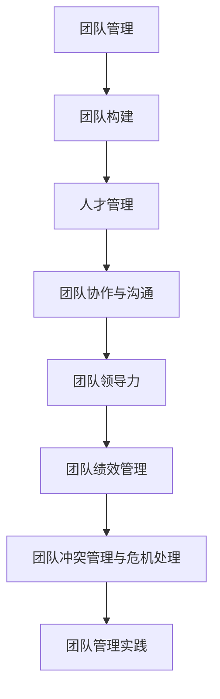

                 

## 文章标题

《知识付费创业中的团队管理》

> 关键词：知识付费，创业，团队管理，人才管理，沟通协作，领导力，激励机制，绩效管理，危机处理

> 摘要：本文深入探讨了知识付费创业过程中的团队管理问题，包括团队构建、人才管理、团队协作与沟通、团队领导力、团队绩效管理与激励机制，以及团队冲突管理和危机处理。通过实际案例和实践经验，为知识付费创业团队提供了系统有效的管理策略和技巧。

----------------------------------------------------------------

### 《知识付费创业中的团队管理》目录大纲

**第一部分：知识付费创业背景与团队管理概述**

- **1.1 知识付费创业概述**
  - 1.1.1 知识付费的兴起与市场前景
  - 1.1.2 知识付费创业的优势与挑战
  - 1.1.3 团队管理在知识付费创业中的重要性

- **1.2 团队管理的核心概念与原则**
  - 1.2.1 团队管理的基本概念
  - 1.2.2 团队管理的原则
  - 1.2.3 团队管理的关键要素

**第二部分：团队构建与人才管理**

- **2.1 团队构建策略**
  - 2.1.1 团队规模与结构设计
  - 2.1.2 核心岗位的选聘与培养
  - 2.1.3 团队成员的激励与留任策略

- **2.2 人才管理**
  - 2.2.1 人才选拔与培养
  - 2.2.2 人才激励与考核
  - 2.2.3 人才流动性管理

**第三部分：团队协作与沟通**

- **3.1 团队协作机制**
  - 3.1.1 团队协作的定义与类型
  - 3.1.2 团队协作的障碍与解决方法
  - 3.1.3 团队协作工具与应用

- **3.2 沟通技巧与艺术**
  - 3.2.1 沟通的基本原则
  - 3.2.2 沟通障碍与破解策略
  - 3.2.3 高效沟通技巧与实践

**第四部分：团队领导力与领导风格**

- **4.1 团队领导力**
  - 4.1.1 领导力的定义与分类
  - 4.1.2 团队领导者的职责与角色
  - 4.1.3 提升团队领导力的方法与策略

- **4.2 领导风格与团队管理**
  - 4.2.1 领导风格的定义与分类
  - 4.2.2 不同领导风格对团队的影响
  - 4.2.3 领导风格的转变与适应

**第五部分：团队绩效管理与激励机制**

- **5.1 团队绩效管理**
  - 5.1.1 团队绩效管理的原则与流程
  - 5.1.2 团队绩效考核指标的设计与实施
  - 5.1.3 团队绩效反馈与改进

- **5.2 激励机制**
  - 5.2.1 激励理论概述
  - 5.2.2 常见激励措施与应用
  - 5.2.3 激励机制的优化与调整

**第六部分：团队冲突管理与危机处理**

- **6.1 团队冲突管理**
  - 6.1.1 团队冲突的定义与类型
  - 6.1.2 团队冲突的管理策略
  - 6.1.3 冲突解决的技巧与工具

- **6.2 危机处理**
  - 6.2.1 危机的识别与评估
  - 6.2.2 危机应对策略
  - 6.2.3 危机后的团队重建

**第七部分：知识付费创业中的团队管理实践案例**

- **7.1 实践案例一：初创知识付费团队的构建与管理**
  - 7.1.1 初创团队的人员配置
  - 7.1.2 初创团队的管理策略
  - 7.1.3 初创团队的成长与优化

- **7.2 实践案例二：知识付费企业的团队建设与优化**
  - 7.2.1 企业团队的构建与规划
  - 7.2.2 企业团队的管理与改进
  - 7.2.3 企业团队的绩效与激励

**附录**

- **附录 A：团队管理工具与方法简介**
  - 7.1 项目管理工具
  - 7.2 沟通协作工具
  - 7.3 人才管理工具

- **附录 B：知识付费创业团队管理资源推荐**
  - 7.1 团队管理经典书籍
  - 7.2 团队管理在线课程
  - 7.3 团队管理研讨会与讲座

----------------------------------------------------------------

### 核心概念与联系

#### 团队管理流程



#### 团队管理核心概念

- **团队管理**：对团队进行组织、协调、指导和控制的过程，以实现团队目标和个人发展。
- **团队构建**：设计团队规模、结构和角色分配的过程。
- **人才管理**：选拔、培养、激励和留任团队成员的过程。
- **团队协作与沟通**：团队成员之间协作和沟通的机制和技巧。
- **团队领导力**：领导者引导、激励和影响团队成员的能力。
- **团队绩效管理**：对团队和个人绩效进行评估、反馈和改进的过程。
- **团队冲突管理**：解决团队内部冲突的策略和方法。
- **团队冲突管理与危机处理**：识别、应对和处理团队内部冲突和危机的过程。

---

### 核心算法原理讲解

#### 团队绩效评估算法

```python
# 伪代码：团队绩效评估算法

def team_performance_evaluation(team_members):
    for member in team_members:
        # 计算个人绩效
        individual_performance = calculate_individual_performance(member)
        
        # 计算团队整体绩效
        team_performance = calculate_team_performance(team_members)
        
        # 输出绩效结果
        print(f"{member.name}的绩效：{individual_performance}")
        print(f"团队整体绩效：{team_performance}")
```

#### 团队绩效评估算法的工作流程：

1. **输入**：团队成员列表 `team_members`。
2. **计算个人绩效**：根据成员的工作表现、任务完成情况和反馈，计算每个成员的个人绩效。
3. **计算团队整体绩效**：综合考虑所有成员的个人绩效，计算团队的整体绩效。
4. **输出**：输出每个成员的个人绩效和团队整体绩效。

#### 数学模型和数学公式

- **人才激励模型**：

  $$
  激励力度 = 基础薪资 \times (1 + 激励系数)
  $$

  **激励系数**：根据员工的绩效表现进行调整。

  - **激励系数的计算公式**：

    $$
    激励系数 = \frac{目标绩效 - 实际绩效}{目标绩效}
    $$

  **激励系数**反映了员工的绩效差距，激励系数越高，表示员工的潜力越大，激励力度也越大。

---

#### 项目实战

##### 代码实际案例：团队协作平台搭建

#### 开发环境搭建

- **Python 3.8+**
- **Django 3.2+**
- **PostgreSQL 12+**

#### 源代码详细实现

**models.py**：

```python
from django.db import models

class Team(models.Model):
    name = models.CharField(max_length=100)
    members = models.ManyToManyField('Member')

class Member(models.Model):
    name = models.CharField(max_length=100)
    email = models.EmailField(unique=True)
    team = models.ForeignKey(Team, on_delete=models.CASCADE)
```

**代码解读与分析**：

- `Team` 和 `Member` 模型用于表示团队和团队成员。
- `Team` 模型包含 `name` 字段和 `members` 多对多关系字段，指向 `Member` 模型。
- `Member` 模型包含 `name`、`email` 字段和 `team` 外键字段，指向 `Team` 模型。

##### 代码实际案例：团队协作平台搭建（续）

#### 代码解读与分析（续）

- 使用 Django ORM 进行数据库操作，简化了数据交互和模型操作。
- 通过 Django Admin 界面可以轻松管理团队和成员数据。

#### 代码解读与分析（续）

- 上述代码是后端模型层的实现，前端界面和接口设计还需进一步开发。

---

## 附录 A：团队管理工具与方法简介

### 项目管理工具

- **Trello**：简单直观的任务管理工具，适合小型团队。
- **Asana**：功能丰富的项目管理工具，支持复杂的项目协作。

### 沟通协作工具

- **Slack**：企业级的即时通讯工具，支持团队消息、文件共享和集成其他应用。
- **Microsoft Teams**：集成了通讯、协作和会议功能的企业级平台。

### 人才管理工具

- **BambooHR**：人力资源管理系统，提供员工信息管理、招聘和绩效管理等功能。
- **Lattice**：专注于员工绩效和职业发展的平台。

---

## 附录 B：知识付费创业团队管理资源推荐

### 团队管理经典书籍

- 《团队的智慧：团队协作的系统动力学》
- 《团队协作的艺术》

### 团队管理在线课程

- Coursera：《管理基础》等团队管理相关的在线课程。
- Udemy：《高效团队管理》等实战导向的团队管理课程。

### 团队管理研讨会与讲座

- TED：TED 演讲中有很多关于团队管理和领导力的精彩演讲。
- LinkedIn Learning：提供专业的团队管理在线研讨会和讲座。

---

**作者**：

- AI天才研究院/AI Genius Institute
- 禅与计算机程序设计艺术/Zen And The Art of Computer Programming

---

在本文中，我们深入探讨了知识付费创业中的团队管理问题，包括团队构建、人才管理、团队协作与沟通、团队领导力、团队绩效管理与激励机制，以及团队冲突管理和危机处理。通过实际案例和实践经验，为知识付费创业团队提供了系统有效的管理策略和技巧。希望本文能够对创业团队的管理实践提供有益的启示和帮助。让我们继续在知识付费的浪潮中，构建高效、和谐的团队，共创美好未来！**作者**：AI天才研究院/AI Genius Institute & 禅与计算机程序设计艺术/Zen And The Art of Computer Programming

