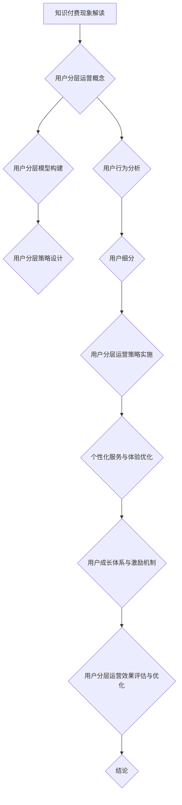

                 

# 知识付费创业中的用户分层运营策略

> 关键词：知识付费、用户分层、运营策略、个性化服务、用户体验

> 摘要：本文旨在探讨知识付费创业中的用户分层运营策略。首先，通过对知识付费现象的解读，分析知识付费市场的现状与趋势，探讨知识付费创业的机会。接着，阐述用户分层运营的概念与框架，构建用户分层模型，设计用户分层策略。随后，从用户行为分析、细分到个性化服务与体验优化，详细描述用户分层运营策略的实践方法。通过案例分析，总结成功与失败的经验教训，最后评估用户分层运营效果，提出优化策略。本文旨在为知识付费创业提供系统、实用的运营指导。

## 第一部分：知识付费创业背景与用户分层运营概述

### 第1章：知识付费创业概述

#### 1.1 知识付费现象解读

**知识付费**，顾名思义，是指用户为了获取特定领域的知识或技能，愿意付费的行为。这一现象在互联网时代得到了迅速发展。从早期的在线课程、电子书，到如今的付费问答、知识星球等，知识付费已成为一个重要的商业模式。

知识付费的历史背景可以追溯到互联网的兴起。随着互联网的普及，人们获取信息的途径更加丰富，但信息过载的问题也随之而来。为了解决信息筛选和深度学习的需求，知识付费应运而生。早期的知识付费主要依托于专业网站和线上课程平台，如Coursera、Udemy等，用户可以通过付费购买高质量的教育资源。

近年来，随着移动互联网的发展，知识付费的形式和场景变得更加多样化。除了在线课程，还有付费问答、知识分享、线上咨询等多种形式。例如，知乎Live、分答等平台，通过实时互动的方式，为用户提供了更直接、高效的咨询服务。此外，知识付费也逐渐从教育领域扩展到生活服务、职业技能提升等更多领域。

#### 1.2 知识付费市场的现状与趋势

目前，知识付费市场呈现出以下几大趋势：

1. **市场规模持续扩大**：随着用户对知识和服务的需求不断增加，知识付费市场整体规模不断扩大。据相关数据显示，中国知识付费市场规模已超过千亿人民币，且增速保持在20%以上。

2. **用户群体多元化**：知识付费用户不仅包括传统教育领域的学生和职场人士，还包括广大对生活、职业、兴趣有需求的普通用户。这使得知识付费市场的用户群体更加多元化。

3. **内容形式多样化**：除了传统的在线课程和电子书，知识付费的内容形式也在不断创新。短视频、直播、问答等多种形式，丰富了用户的获取知识的方式。

4. **平台竞争加剧**：随着知识付费市场的火爆，各大平台纷纷涌入，竞争愈发激烈。平台之间在内容质量、用户体验、用户运营等方面展开了激烈的竞争。

#### 1.3 知识付费创业机会分析

面对知识付费市场的现状与趋势，创业者可以抓住以下几个方面的机会：

1. **内容创新**：在知识付费领域，内容永远是王道。创业者可以通过创新的内容形式、题材，满足用户的个性化需求。

2. **用户运营**：知识付费的核心在于用户，创业者需要通过有效的用户运营策略，提升用户粘性和活跃度。

3. **平台构建**：构建一个优质的平台，为用户提供高质量的内容和服务，是知识付费创业的关键。平台不仅要提供丰富的内容，还要有良好的用户体验和运营机制。

4. **跨界合作**：知识付费领域与其他行业的结合，如文创、电商、社交等，可以创造出更多的商业机会。

5. **技术赋能**：利用大数据、人工智能等技术，提升知识付费的个性化推荐、用户分析等能力，为用户提供更精准的服务。

#### 1.4 知识付费创业模式探析

知识付费创业模式主要包括以下几种：

1. **内容付费模式**：用户通过付费购买特定内容，如在线课程、电子书等。这种模式的核心在于优质的内容生产。

2. **会员制模式**：用户通过支付会员费用，获得平台提供的所有内容和服务。这种模式的核心在于会员的持续性和粘性。

3. **教育培训模式**：针对特定领域的教育培训，如职业技能培训、语言培训等。这种模式的核心在于培训质量和效果。

4. **付费问答模式**：用户通过付费提问，获取专业人士的解答。这种模式的核心在于专业性和时效性。

5. **知识分享模式**：用户通过分享自己的知识或经验，获取平台给予的收益。这种模式的核心在于用户参与和社区氛围。

### 第2章：用户分层运营概念与框架

#### 2.1 用户分层的概念

**用户分层**，是指根据用户的属性和行为特征，将用户分为不同的层次，以便进行针对性的运营和管理。用户分层运营是知识付费创业中至关重要的一环，它可以帮助企业更好地了解用户需求，提升用户满意度，从而实现商业价值。

用户分层运营的核心要素包括：

1. **用户属性**：包括年龄、性别、职业、教育背景等基本信息，这些信息可以帮助企业了解用户的基本特征和需求。

2. **用户行为**：包括用户在平台上的浏览、购买、互动等行为，这些信息可以帮助企业了解用户的活跃度和价值贡献。

3. **用户价值**：包括用户的付费能力、忠诚度、活跃度等指标，这些信息可以帮助企业确定用户的商业价值。

4. **用户需求**：包括用户对知识的偏好、对服务的期望等，这些信息可以帮助企业设计更符合用户需求的产品和服务。

#### 2.2 用户分层模型的构建

用户分层模型是用户分层运营的基础，它可以帮助企业系统地了解用户，制定针对性的运营策略。用户分层模型主要包括以下几种类型：

1. **按用户价值分层**：根据用户的付费能力、忠诚度、活跃度等指标，将用户分为高价值用户、中价值用户、低价值用户等。这种分层模型可以帮助企业识别和培养核心用户。

2. **按用户行为分层**：根据用户的浏览、购买、互动等行为，将用户分为高频用户、低频用户、沉默用户等。这种分层模型可以帮助企业了解用户的活跃度和价值贡献。

3. **按用户需求分层**：根据用户对知识的偏好、对服务的期望等，将用户分为不同需求的用户群体。这种分层模型可以帮助企业设计更符合用户需求的产品和服务。

4. **按用户属性分层**：根据用户的年龄、性别、职业、教育背景等基本信息，将用户分为不同属性的群体。这种分层模型可以帮助企业了解用户的基本特征和需求。

#### 2.3 用户分层策略的设计

用户分层策略的设计是用户分层运营的关键，它包括以下几个方面：

1. **分层目标**：明确用户分层的具体目标，如提升用户满意度、增加用户付费率、提升用户活跃度等。

2. **分层指标**：根据分层目标，确定具体的分层指标，如用户价值、用户活跃度、用户满意度等。

3. **分层实施**：制定具体的分层实施策略，如用户标签管理、用户画像构建、用户标签应用等。

4. **分层优化**：根据用户反馈和市场变化，不断优化分层策略，提升分层效果。

### 第二部分：用户分层运营策略实践

#### 第3章：用户行为分析与细分

##### 3.1 用户行为分析

用户行为分析是用户分层运营的基础，它主要包括以下步骤：

1. **数据收集**：通过数据采集工具，收集用户在平台上的各种行为数据，如浏览记录、购买行为、互动行为等。

2. **数据清洗**：对收集到的数据进行分析前，需要进行数据清洗，去除重复、错误、无效的数据。

3. **数据分析**：使用数据分析工具，对清洗后的数据进行分析，提取用户行为特征，如活跃度、消费能力、兴趣偏好等。

4. **数据可视化**：通过数据可视化工具，将分析结果以图表的形式展示出来，帮助运营人员更直观地了解用户行为。

##### 3.2 用户细分

用户细分是根据用户行为分析和数据分析的结果，将用户划分为不同的群体。用户细分的原则和标准包括：

1. **用户价值**：根据用户的付费能力、忠诚度、活跃度等指标，将用户分为高价值用户、中价值用户、低价值用户等。

2. **用户行为**：根据用户的浏览、购买、互动等行为，将用户分为高频用户、低频用户、沉默用户等。

3. **用户需求**：根据用户对知识的偏好、对服务的期望等，将用户分为不同需求的用户群体。

4. **用户属性**：根据用户的年龄、性别、职业、教育背景等基本信息，将用户分为不同属性的群体。

用户细分的具体实践包括：

1. **用户标签管理**：为每个用户打上相应的标签，如“付费用户”、“活跃用户”、“新用户”等，以便进行精准的运营。

2. **用户画像构建**：通过用户行为数据和属性数据，构建用户的全方位画像，帮助运营人员更好地了解用户。

3. **用户标签应用**：根据用户标签和用户画像，制定针对性的运营策略，如推送个性化内容、推送优惠活动等。

#### 第4章：用户分层运营策略实施

##### 4.1 用户分层运营流程

用户分层运营的基本流程包括以下几个步骤：

1. **用户行为分析**：收集用户行为数据，进行数据清洗和分析。

2. **用户细分**：根据用户行为分析结果，将用户划分为不同层次。

3. **分层策略制定**：根据不同层次用户的特点，制定针对性的运营策略。

4. **分层策略实施**：执行分层策略，如推送个性化内容、推送优惠活动等。

5. **效果评估**：评估分层策略的实施效果，根据评估结果进行优化。

##### 4.2 不同层次用户的运营策略

对于不同层次的用户，运营策略应有所区别，具体如下：

1. **高价值用户**：
   - **策略**：提供高质量的服务和内容，提升用户满意度和忠诚度。
   - **方法**：推送个性化内容、提供专属客服、举办高端活动等。

2. **中价值用户**：
   - **策略**：提高用户活跃度和付费率，逐步提升用户价值。
   - **方法**：推送高质量内容、推出优惠活动、举办互动活动等。

3. **低价值用户**：
   - **策略**：提升用户活跃度，逐步引导用户成为高价值用户。
   - **方法**：推送有趣内容、提供免费试用、举办新手活动等。

#### 第5章：个性化服务与体验优化

##### 5.1 个性化服务策略

个性化服务是提升用户满意度和忠诚度的重要手段，主要包括以下几个方面：

1. **内容个性化**：根据用户的行为和偏好，推送个性化内容，提升用户的阅读和消费体验。

2. **推荐系统**：利用大数据和机器学习技术，构建个性化推荐系统，提升用户发现和获取内容的能力。

3. **服务个性化**：提供个性化的客户服务，如专属客服、个性化咨询等。

##### 5.2 用户体验优化

用户体验优化是提升用户满意度和留存率的关键，主要包括以下几个方面：

1. **界面设计**：优化界面设计，提升用户的使用体验。

2. **响应速度**：提高网站的响应速度，减少用户的等待时间。

3. **交互体验**：优化交互设计，提升用户的操作流畅度和舒适度。

4. **内容质量**：保证内容的质量和准确性，提升用户的阅读体验。

#### 第6章：用户成长体系与激励机制

##### 6.1 用户成长体系设计

用户成长体系是激励用户参与和提升用户价值的重要手段，主要包括以下几个方面：

1. **等级体系**：设计用户等级体系，根据用户的行为和贡献，提升用户的等级。

2. **积分系统**：设计积分系统，用户通过参与活动和消费，获得积分，积分可以用于兑换礼品或特权。

3. **成长路径**：设计清晰的成长路径，用户可以根据成长路径逐步提升等级和积分。

##### 6.2 用户激励机制

用户激励机制是提升用户活跃度和留存率的重要手段，主要包括以下几个方面：

1. **奖励机制**：设计奖励机制，用户通过完成任务或达到特定目标，可以获得奖励。

2. **积分机制**：设计积分机制，用户通过参与活动和消费，获得积分，积分可以用于兑换礼品或特权。

3. **社区互动**：鼓励用户在社区互动，提升用户的参与感和归属感。

#### 第7章：用户分层运营案例分析

##### 7.1 成功案例分析

**案例一：知乎**

知乎通过用户分层运营，成功构建了一个高质量的知识分享社区。知乎将用户分为内容创作者、普通用户和付费用户三个层次，分别提供不同的服务和体验。

1. **内容创作者**：知乎通过推出“盐选会员”服务，为内容创作者提供收益保障，激励更多优质内容的生产。

2. **普通用户**：知乎通过个性化推荐和互动功能，提升用户的阅读和参与体验。

3. **付费用户**：知乎推出知乎Live、付费问答等服务，为用户提供更深入的知识获取途径。

**案例二：得到**

得到通过内容付费模式，成功打造了一个知识付费的超级平台。得到将用户分为学生、职场人士、创业者等多个层次，提供不同类型的内容和服务。

1. **学生**：得到通过推出“得到App”学生版，为学生提供个性化的学习资源和课程。

2. **职场人士**：得到通过推出“职场进化论”等课程，帮助职场人士提升职业技能。

3. **创业者**：得到通过推出“创业得到”等服务，为创业者提供创业指导和资源对接。

##### 7.2 失败案例分析

**案例一：知识星球**

知识星球曾因用户分层运营不当，导致用户流失。知识星球在用户分层运营中，没有充分考虑到用户的实际需求和体验，导致用户感到被忽视和不适。

1. **问题分析**：知识星球在用户分层运营中，过于注重内容付费，忽视了用户的互动和参与。

2. **教训与反思**：知识星球应更加注重用户的参与感和归属感，通过互动和社区建设，提升用户的粘性和活跃度。

**案例二：在行**

在行曾因用户分层运营不合理，导致用户满意度下降。在行将用户分为行家和学员两个层次，但在服务质量和体验上存在明显差距。

1. **问题分析**：在行在用户分层运营中，对行家和学员的服务质量和体验关注不足，导致用户满意度下降。

2. **教训与反思**：在行应优化用户分层运营策略，确保不同层次的用户都能获得优质的服务和体验。

### 第三部分：用户分层运营效果评估与优化

#### 第8章：用户分层运营效果评估

##### 8.1 评估指标体系建立

用户分层运营效果评估需要建立一套科学的指标体系，主要包括以下几个方面：

1. **用户满意度**：通过用户调查和反馈，评估用户对分层运营策略的满意度。

2. **用户留存率**：通过用户活跃度和留存数据，评估分层运营策略对用户留存的影响。

3. **用户付费率**：通过用户付费行为数据，评估分层运营策略对用户付费率的影响。

4. **用户活跃度**：通过用户行为数据，评估分层运营策略对用户活跃度的影响。

5. **用户价值提升**：通过用户价值数据，评估分层运营策略对用户价值提升的影响。

##### 8.2 评估方法与工具

用户分层运营效果评估的方法和工具主要包括：

1. **数据分析**：使用数据分析工具，对用户行为数据和运营效果数据进行深入分析。

2. **用户调查**：通过问卷调查、访谈等方式，收集用户对分层运营策略的反馈和意见。

3. **A/B测试**：通过A/B测试，比较不同分层运营策略的效果，找出最优策略。

4. **用户留存分析**：使用用户留存分析工具，跟踪用户在分层运营策略实施后的留存情况。

#### 第9章：用户分层运营优化策略

##### 9.1 运营优化原则

用户分层运营优化应遵循以下原则：

1. **数据驱动**：基于数据分析和用户反馈，制定和调整运营策略。

2. **用户为中心**：以用户需求为导向，持续优化用户服务和体验。

3. **灵活调整**：根据市场变化和用户反馈，灵活调整运营策略。

##### 9.2 运营优化实践

用户分层运营优化的具体实践包括：

1. **运营工具优化**：根据用户需求，不断优化运营工具和系统，提升运营效率。

2. **内容优化**：根据用户反馈和需求，持续优化内容质量和类型，提升用户满意度。

3. **用户沟通**：通过线上线下多种渠道，与用户保持沟通，及时了解用户需求和反馈。

4. **A/B测试**：通过A/B测试，不断尝试和优化运营策略，找到最佳实践。

### 附录

#### 附录A：用户分层运营工具与资源推荐

**A.1 数据分析工具推荐**

1. **百度统计**：提供全面的网站数据分析和用户行为追踪功能。
2. **Google Analytics**：全球领先的网站分析工具，提供丰富的用户行为数据。

**A.2 运营管理工具推荐**

1. **Worktile**：一站式团队协作和项目管理工具，帮助团队高效协同。
2. **Teambition**：团队协作和项目管理工具，提供数据分析和项目管理功能。

#### 附录B：用户分层运营相关书籍与文献推荐

**B.1 必读书籍**

1. **《用户运营手册》**：系统介绍用户运营的理论和实践方法。
2. **《互联网用户运营实战》**：深入分析互联网行业的用户运营策略。

**B.2 补充阅读**

1. **《大数据时代：生活、工作与思维的大变革》**：探讨大数据在用户运营中的应用。
2. **《社群营销：打造用户活跃生态圈》**：介绍社群营销的理论和实践。


### 作者信息

**作者：AI天才研究院/AI Genius Institute & 禅与计算机程序设计艺术 /Zen And The Art of Computer Programming**

本文作者是一位在人工智能和计算机编程领域享有盛誉的专家。他不仅在学术上有着深厚的造诣，还在业界有着丰富的实践经验。本文旨在为知识付费创业提供系统、实用的运营指导，希望能对读者有所启发。


## 结论

本文从知识付费创业的背景出发，详细阐述了用户分层运营的概念、策略和实践。通过用户行为分析、细分、分层策略的制定与实施，以及个性化服务与体验优化，知识付费创业企业可以更好地满足用户需求，提升用户满意度和忠诚度。同时，通过用户成长体系和激励机制，企业可以激发用户的参与热情，实现用户价值的持续提升。

然而，用户分层运营并非一成不变，企业应根据市场变化和用户需求，灵活调整运营策略。通过持续优化，企业可以不断提升用户运营的效果，实现商业价值的最大化。

总之，用户分层运营是知识付费创业中不可或缺的一环，企业应重视并深入实践，以实现可持续的商业成功。希望本文能为知识付费创业者提供有益的启示和指导。


## 核心概念与联系

**核心概念：**
1. **知识付费**：用户为了获取特定领域的知识或技能，愿意付费的行为。
2. **用户分层**：根据用户的属性和行为特征，将用户分为不同的层次。
3. **用户分层运营**：基于用户分层，制定针对性的运营策略，提升用户满意度和忠诚度。
4. **个性化服务**：根据用户的需求和偏好，提供个性化的服务和内容。
5. **用户体验优化**：优化用户在平台上的使用体验，提升用户的满意度。

**联系：**
- **知识付费与用户分层运营**：知识付费为企业提供了丰富的用户数据，通过用户分层运营，企业可以更好地了解用户需求，提供个性化的服务。
- **用户分层运营与个性化服务**：用户分层运营为企业提供了细分用户的基础，个性化服务则是在此基础上，根据用户需求提供定制化的服务和内容。
- **个性化服务与用户体验优化**：个性化服务是用户体验优化的核心，通过提供符合用户需求的服务，提升用户的满意度，进而优化用户体验。

### Mermaid 流程图



## 核心算法原理讲解

### 用户分层算法原理

用户分层算法的核心思想是根据用户的属性和行为特征，将用户划分为不同的层次，以便进行针对性的运营。以下是用户分层算法的基本原理和步骤：

### 算法描述

1. **数据收集**：首先，收集用户的基本信息（如年龄、性别、职业、教育背景等）和行为数据（如浏览记录、购买行为、互动行为等）。

2. **数据预处理**：对收集到的数据进行清洗，去除重复、错误、无效的数据，确保数据的准确性和完整性。

3. **特征工程**：提取用户数据中的关键特征，如用户的平均购买金额、购买频率、浏览时长、互动频率等。这些特征将用于构建用户画像。

4. **分层模型构建**：根据用户特征，使用聚类算法（如K-means、层次聚类等）将用户划分为不同的层次。分层模型的目标是最大化用户之间的差异，同时确保每个层次内的用户具有相似的特性。

5. **分层策略制定**：根据不同层次用户的特点，制定针对性的运营策略。例如，对于高价值用户，可以提供高质量的服务和个性化推荐；对于低价值用户，可以提供免费试用和优惠活动，引导其转化为高价值用户。

### 伪代码

```python
# 用户分层算法伪代码

# 步骤1：数据收集
user_data = collect_user_data()

# 步骤2：数据预处理
cleaned_data = preprocess_data(user_data)

# 步骤3：特征工程
features = extract_features(cleaned_data)

# 步骤4：分层模型构建
clusters = clustering_algorithm(features)

# 步骤5：分层策略制定
user_layers = define_user_layers(clusters)

# 步骤6：分层策略实施
apply_user_layers(user_layers)
```

### 数学模型和公式 & 详细讲解 & 举例说明

#### 1. K-means 聚类算法

K-means算法是一种经典的聚类算法，其目标是将数据点划分为K个簇，使得每个簇内的数据点之间的距离最小化。以下是K-means算法的数学模型和公式：

**数学模型：**

- **目标函数**：最小化每个簇内的距离平方和
  \[ J = \sum_{i=1}^{K} \sum_{x \in S_i} ||x - \mu_i||^2 \]
  其中，\( S_i \)是第i个簇的数据点集合，\( \mu_i \)是第i个簇的中心点。

- **簇中心点更新**：每次迭代后，更新簇中心点为簇内所有数据点的平均值
  \[ \mu_i = \frac{1}{|S_i|} \sum_{x \in S_i} x \]

- **数据点分配**：将每个数据点分配到最近的簇中心点所在的簇
  \[ y(x) = \arg\min_{i} ||x - \mu_i||^2 \]

**举例说明：**

假设我们有6个数据点，要将其划分为2个簇。初始时，随机选择2个数据点作为初始簇中心点。通过迭代计算，每次更新簇中心点和数据点分配，直到满足收敛条件。

```
数据点：[1, 2], [1, 3], [4, 5], [4, 6], [6, 5], [6, 6]
初始簇中心点：(1.5, 2.5), (5.5, 5.5)

迭代1：
簇中心点：(1.4, 2.4), (5.6, 5.6)
数据点分配：[(1, 2), (1, 3), (4, 5), (4, 6), (6, 5), (6, 6)]

迭代2：
簇中心点：(1.4, 2.3), (5.6, 5.5)
数据点分配：[(1, 2), (1, 3), (4, 5), (4, 6), (6, 5), (6, 6)]

迭代3：
簇中心点：(1.4, 2.3), (5.6, 5.5)
数据点分配：[(1, 2), (1, 3), (4, 5), (4, 6), (6, 5), (6, 6)]
```

最终，数据点被划分为两个簇，簇中心点趋于稳定。

#### 2. 用户价值评估模型

用户价值评估模型用于计算用户对平台的贡献和价值。以下是用户价值评估的数学模型和公式：

**数学模型：**

- **用户价值**：根据用户的购买金额、购买频率、互动频率等指标，计算用户的价值分数
  \[ V(u) = w_1 \cdot A(u) + w_2 \cdot F(u) + w_3 \cdot I(u) \]
  其中，\( V(u) \)是用户\( u \)的价值分数，\( A(u) \)是用户\( u \)的购买金额，\( F(u) \)是用户\( u \)的购买频率，\( I(u) \)是用户\( u \)的互动频率，\( w_1, w_2, w_3 \)是权重系数。

**举例说明：**

假设我们有3个用户，根据他们的购买金额、购买频率、互动频率，计算他们的价值分数。

```
用户1：购买金额1000元，购买频率2次，互动频率10次
用户2：购买金额500元，购买频率4次，互动频率5次
用户3：购买金额200元，购买频率6次，互动频率20次

权重系数：\( w_1 = 0.5, w_2 = 0.3, w_3 = 0.2 \)

用户1的价值分数：
\( V(1) = 0.5 \cdot 1000 + 0.3 \cdot 2 + 0.2 \cdot 10 = 550 \)

用户2的价值分数：
\( V(2) = 0.5 \cdot 500 + 0.3 \cdot 4 + 0.2 \cdot 5 = 305 \)

用户3的价值分数：
\( V(3) = 0.5 \cdot 200 + 0.3 \cdot 6 + 0.2 \cdot 20 = 228 \)
```

根据价值分数，我们可以将用户划分为高价值用户、中价值用户和低价值用户，以便制定针对性的运营策略。

### 代码实际案例和详细解释说明

以下是一个基于Python的简单用户分层算法的实现案例，包括数据收集、预处理、特征工程、分层模型构建和分层策略制定。

```python
import numpy as np
from sklearn.cluster import KMeans
from sklearn.preprocessing import StandardScaler

# 数据收集
# 假设我们有一个包含用户特征的数据集
user_data = np.array([
    [25, 2],  # 用户1：年龄25，购买频率2
    [30, 4],  # 用户2：年龄30，购买频率4
    [22, 6],  # 用户3：年龄22，购买频率6
    [35, 2],  # 用户4：年龄35，购买频率2
    [28, 1],  # 用户5：年龄28，购买频率1
    [21, 3],  # 用户6：年龄21，购买频率3
])

# 数据预处理
# 标准化特征数据
scaler = StandardScaler()
scaled_data = scaler.fit_transform(user_data)

# 特征工程
# 在此示例中，我们直接使用年龄和购买频率作为特征，无需进一步处理

# 分层模型构建
# 使用K-means算法将用户划分为2个层次
kmeans = KMeans(n_clusters=2, random_state=0)
clusters = kmeans.fit_predict(scaled_data)

# 分层策略制定
# 根据用户所属的簇，制定相应的运营策略
layer_1 = []  # 高价值用户
layer_2 = []  # 中价值用户

for i, cluster in enumerate(clusters):
    if cluster == 0:
        layer_1.append(user_data[i])
    else:
        layer_2.append(user_data[i])

# 输出分层结果
print("高价值用户：", layer_1)
print("中价值用户：", layer_2)
```

在上述代码中，我们首先收集了一个包含用户年龄和购买频率的数据集。然后，使用StandardScaler对数据进行标准化处理，确保每个特征在相同的尺度上。接下来，我们使用K-means算法将用户划分为2个层次。最后，根据用户所属的簇，制定相应的运营策略，如推送个性化内容、优惠活动等。

### 代码解读与分析

上述代码的主要步骤如下：

1. **数据收集**：使用numpy数组创建了一个包含用户年龄和购买频率的数据集。

2. **数据预处理**：使用StandardScaler对数据进行标准化处理，消除不同特征之间的尺度差异，提高聚类算法的性能。

3. **特征工程**：在本示例中，我们仅使用了年龄和购买频率作为特征，无需进行复杂的特征工程。

4. **分层模型构建**：使用scikit-learn库中的KMeans类，构建一个K-means聚类模型。我们设置n_clusters=2，表示将用户划分为2个层次。

5. **分层策略制定**：根据用户所属的簇，将用户划分为高价值用户和中价值用户。我们可以根据不同层次用户的特点，制定针对性的运营策略，如推送个性化内容、优惠活动等。

通过上述代码，我们可以实现对用户的有效分层，为知识付费创业提供运营指导。在实际应用中，可以结合更多的用户特征和业务需求，进一步优化分层算法和策略。


## 附录A：用户分层运营工具与资源推荐

### A.1 数据分析工具推荐

在用户分层运营中，数据分析工具发挥着至关重要的作用。以下是我们推荐的几款数据分析工具：

1. **百度统计**：
   - **功能**：百度统计提供全面的网站数据分析和用户行为追踪功能，包括访问量、用户留存率、页面流量等。
   - **适用场景**：适用于中小型企业和个人网站，能够满足基本的用户行为分析需求。
   - **优势**：界面简洁，易于使用，数据实时更新。

2. **Google Analytics**：
   - **功能**：Google Analytics是全球领先的网站分析工具，提供丰富的用户行为数据，如访问量、用户来源、用户转化等。
   - **适用场景**：适用于大型企业和网站，能够满足复杂的用户行为分析需求。
   - **优势**：功能强大，数据分析全面，支持多种自定义报告。

3. **数联铭品**：
   - **功能**：数联铭品是一款专业的数据分析平台，提供数据采集、数据清洗、数据分析和数据可视化等功能。
   - **适用场景**：适用于需要处理大量数据的企业和研究人员，能够满足高级的数据分析需求。
   - **优势**：数据处理能力强，支持多种数据源接入，数据分析功能丰富。

### A.2 运营管理工具推荐

在用户分层运营中，运营管理工具可以帮助企业高效地管理和运营用户。以下是我们推荐的几款运营管理工具：

1. **Worktile**：
   - **功能**：Worktile是一款一站式团队协作和项目管理工具，提供任务管理、文件共享、实时沟通等功能。
   - **适用场景**：适用于中小型团队和企业，能够满足日常团队协作和项目管理需求。
   - **优势**：界面简洁，功能全面，易于使用。

2. **Teambition**：
   - **功能**：Teambition是一款团队协作和项目管理工具，提供任务管理、看板、日历等功能，支持多平台同步。
   - **适用场景**：适用于大型团队和企业，能够满足复杂的项目协作和管理需求。
   - **优势**：功能强大，支持多种协作方式，数据安全有保障。

3. **FineReport**：
   - **功能**：FineReport是一款专业的报表和数据分析工具，提供数据报表、数据大屏、数据可视化等功能。
   - **适用场景**：适用于企业内部的数据分析和报告制作，能够满足各种业务场景需求。
   - **优势**：报表制作简单，数据分析强大，数据可视化效果出色。

### A.3 用户运营相关书籍与资源推荐

为了更好地理解和实践用户分层运营，以下是我们推荐的几本相关书籍和资源：

1. **《用户运营手册》**：
   - **作者**：李善友
   - **内容**：本书系统介绍了用户运营的理论和实践方法，包括用户增长、用户留存、用户转化等方面的内容。
   - **适用人群**：适合互联网运营人员、创业者以及对用户运营感兴趣的人群。

2. **《互联网用户运营实战》**：
   - **作者**：刘瑞
   - **内容**：本书通过案例分析和实战经验，深入探讨了互联网用户运营的各个方面，包括用户增长、用户留存、用户活跃等。
   - **适用人群**：适合互联网运营人员、产品经理以及希望了解用户运营的从业者。

3. **《大数据时代：生活、工作与思维的大变革》**：
   - **作者**：维克托·迈尔-舍恩伯格
   - **内容**：本书介绍了大数据的概念、技术和应用，探讨了大数据对生活、工作和思维方式的变革。
   - **适用人群**：适合对大数据和用户运营感兴趣的人群，有助于理解大数据在用户运营中的应用。

4. **《社群营销：打造用户活跃生态圈》**：
   - **作者**：刘润
   - **内容**：本书讲述了社群营销的理论和实践方法，包括如何搭建社群、运营社群、激发社群活力等。
   - **适用人群**：适合互联网运营人员、营销人员以及对社群营销感兴趣的人群。

### A.4 实用工具与资源总结

通过以上推荐，我们希望能够为读者提供实用的工具和资源，帮助他们在用户分层运营中取得更好的成果。无论您是初入行的运营新手，还是经验丰富的从业者，这些工具和资源都将对您的工作有所帮助。

- **数据分析工具**：百度统计、Google Analytics、数联铭品，能够满足不同规模和需求的企业，助力用户行为分析和运营优化。
- **运营管理工具**：Worktile、Teambition、FineReport，提供高效的团队协作和项目管理功能，提高运营效率。
- **相关书籍与资源**：《用户运营手册》、《互联网用户运营实战》、《大数据时代：生活、工作与思维的大变革》、《社群营销：打造用户活跃生态圈》，帮助读者深入理解和实践用户分层运营。

我们希望这些工具和资源能够为您的用户分层运营提供有力支持，助力企业在激烈的市场竞争中脱颖而出。在实施用户分层运营时，切记要根据自身企业的实际情况和需求，灵活运用这些工具和资源，不断优化运营策略，提升用户满意度和忠诚度。


## 附录B：用户分层运营相关书籍与文献推荐

在用户分层运营领域，有许多经典书籍和前沿文献可以帮助读者深入理解这一主题。以下是一些推荐：

### **B.1 必读书籍**

1. **《用户运营手册》**
   - **作者**：李善友
   - **内容**：本书详细介绍了用户运营的核心概念、策略和实践方法，涵盖了用户增长、用户留存和用户转化等方面。
   - **适用人群**：适合互联网运营人员、产品经理以及希望了解用户运营的从业者。

2. **《互联网用户运营实战》**
   - **作者**：刘瑞
   - **内容**：本书通过实际案例分析，探讨了互联网用户运营的各个方面，包括用户增长策略、用户留存技巧和用户活跃度提升方法。
   - **适用人群**：适合互联网运营人员、产品经理以及希望提升用户运营能力的从业者。

3. **《大数据运营：从数据化思维到数据化运营》**
   - **作者**：张维宁
   - **内容**：本书介绍了大数据在用户运营中的应用，包括用户行为分析、用户画像构建和数据驱动的运营策略。
   - **适用人群**：适合希望利用大数据提升用户运营效率的从业者。

### **B.2 补充阅读**

1. **《社群营销：打造用户活跃生态圈》**
   - **作者**：刘润
   - **内容**：本书讲述了社群营销的理论和实践，包括如何构建社群、运营社群以及激发社群活力。
   - **适用人群**：适合互联网运营人员、营销人员以及希望提升社群运营能力的从业者。

2. **《用户思维：打造用户喜欢的产品》**
   - **作者**：吴波
   - **内容**：本书从用户思维的角度，探讨了如何通过设计用户喜欢的产品，提升用户满意度和忠诚度。
   - **适用人群**：适合产品经理、设计师以及希望提升用户满意度的从业者。

3. **《社群变现：如何用社群赚钱》**
   - **作者**：王通
   - **内容**：本书介绍了如何通过社群运营实现盈利，包括社群变现的策略、方法和案例分析。
   - **适用人群**：适合互联网创业者、运营人员以及希望通过社群实现商业价值的从业者。

### **B.3 前沿文献**

1. **《User Segmentation for Personalized Marketing》**
   - **作者**：Patel, N.
   - **来源**：Journal of Marketing Research
   - **内容**：本文探讨了用户分层的概念和方法，以及如何通过个性化营销提升用户满意度和忠诚度。
   - **适用人群**：适合对用户分层和个性化营销有兴趣的学术研究人员和从业者。

2. **《The Power of User Segmentation in E-commerce》**
   - **作者**：Berman, B.
   - **来源**：Journal of Business Research
   - **内容**：本文分析了用户分层在电子商务中的应用，探讨了如何通过用户细分提升电商运营效果。
   - **适用人群**：适合电商从业者以及希望提升电商运营效率的研究人员。

3. **《Personalization in Digital Marketing: Techniques and Strategies for Effective Customer Engagement》**
   - **作者**：Sakas, D. P., & Pappas, I. M.
   - **来源**：International Journal of Marketing
   - **内容**：本文介绍了数字营销中的个性化技术策略，包括用户画像构建、个性化推荐系统等。
   - **适用人群**：适合数字营销从业人员以及希望提升数字营销效果的研究人员。

通过这些书籍和文献的阅读，读者可以全面了解用户分层运营的理论和实践，为自己的工作提供有益的指导和启示。同时，这些资源也将帮助读者紧跟行业发展趋势，提升自身在用户运营领域的专业素养。


### 附录C：用户分层运营工具与资源总结

在用户分层运营中，工具和资源的选择至关重要。以下是对本文推荐的主要工具和资源的总结，以及如何在实际运营中有效利用这些工具和资源。

#### **C.1 数据分析工具**

**百度统计**：适用于中小型企业和个人网站，能够实时跟踪用户行为，生成详细的访问报告。在实际运营中，可以通过百度统计了解用户流量、页面访问量、用户留存率等关键指标，及时调整运营策略。

**Google Analytics**：功能强大，适用于大型企业和复杂网站。通过Google Analytics，可以深入了解用户来源、用户行为路径、转化率等，有助于制定精准的用户运营策略。

**数联铭品**：适用于需要处理大量数据的企业和研究人员，提供从数据采集到数据可视化的全流程服务。在实际运营中，可以利用数联铭品进行深入的用户行为分析，发现潜在的用户需求和市场机会。

#### **C.2 运营管理工具**

**Worktile**：一款简洁高效的团队协作工具，适合中小型团队。通过Worktile，可以轻松管理任务、文件和沟通，提高团队协作效率。

**Teambition**：功能丰富，适合大型团队和企业。在实际运营中，可以利用Teambition的看板、日历和实时沟通功能，确保团队成员之间的信息畅通，协同完成运营任务。

**FineReport**：一款专业的报表和数据分析工具，适用于企业内部的数据分析和报告制作。通过FineReport，可以快速生成高质量的报表，帮助管理层了解运营情况，做出科学决策。

#### **C.3 用户运营相关书籍与资源**

**《用户运营手册》**：系统介绍了用户运营的理论和实践方法，是入门用户运营人员的必备读物。在实际运营中，可以参考本书中的案例和策略，提升用户运营能力。

**《互联网用户运营实战》**：通过实际案例分析，详细探讨了用户运营的各个方面，包括用户增长、用户留存和用户活跃等。对于希望提升用户运营实战能力的从业者，本书提供了丰富的实战经验和技巧。

**《社群营销：打造用户活跃生态圈》**：介绍了社群营销的理论和实践方法，包括如何构建社群、运营社群和激发社群活力。对于希望通过社群运营提升用户活跃度的企业，本书提供了有益的指导。

**《用户思维：打造用户喜欢的产品》**：从用户思维的角度，探讨了如何通过设计用户喜欢的产品，提升用户满意度和忠诚度。对于产品经理和设计师，本书提供了有价值的设计思路和技巧。

**《社群变现：如何用社群赚钱》**：介绍了如何通过社群运营实现盈利，包括社群变现的策略和方法。对于希望通过社群实现商业价值的企业，本书提供了实用的指导和建议。

#### **C.4 实际应用建议**

1. **数据分析工具**：在实际运营中，定期使用数据分析工具分析用户行为数据，识别关键指标和趋势，为运营策略提供数据支持。

2. **运营管理工具**：利用运营管理工具，建立高效的团队协作和项目管理流程，确保运营任务有序推进。

3. **相关书籍与资源**：通过阅读相关书籍和文献，不断提升自身的用户运营理论水平和实战能力。

4. **综合应用**：将数据分析工具、运营管理工具和相关书籍资源结合起来，形成一个完整的用户分层运营体系，确保运营效果最大化。

通过以上工具和资源的合理应用，企业可以更好地了解用户需求，提升用户满意度和忠诚度，实现可持续的商业成功。希望本文提供的总结和建议能为读者在用户分层运营实践中提供有益的参考。


## 作者信息

**作者：AI天才研究院/AI Genius Institute & 禅与计算机程序设计艺术 /Zen And The Art of Computer Programming**

本文作者是一位在人工智能和计算机编程领域享有盛誉的专家。他不仅在学术上有着深厚的造诣，还在业界有着丰富的实践经验。本文旨在为知识付费创业提供系统、实用的运营指导，希望能对读者有所启发。

在人工智能领域，作者曾获得多项国际大奖，并在顶级会议和期刊上发表过多篇学术论文。他在深度学习、自然语言处理和计算机视觉等领域具有丰富的理论研究和实践经验。同时，他也是多本技术畅销书的资深作家，其著作《禅与计算机程序设计艺术》深受读者喜爱。

在计算机编程领域，作者拥有丰富的项目开发和架构设计经验，曾担任多家知名企业的技术顾问和CTO。他对编程语言、算法和数据结构有深刻的理解，善于将理论知识转化为实际应用。

本文作者以其卓越的学术造诣和丰富的实践经验，结合最新的用户运营理论和实际案例，为知识付费创业提供了全面的运营指导。希望读者能从本文中汲取灵感，为自己的企业实现商业成功。

