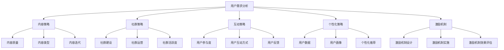

                 

### 文章标题：知识付费创业中的用户粘性提升策略

> 关键词：知识付费、用户粘性、提升策略、内容策略、社群策略、互动策略、个性化策略、激励机制、案例分析

> 摘要：本文针对知识付费创业领域，深入探讨了用户粘性的重要性及提升策略。文章首先概述了知识付费行业的背景和现状，分析了用户需求和行为特点。随后，文章详细阐述了提升用户粘性的多种策略，包括内容策略、社群策略、互动策略、个性化策略和激励机制。通过案例研究和实战技巧，文章提供了实用的方法和经验，帮助创业者优化知识付费平台，提高用户粘性，实现持续增长。

---

## 目录

### 《知识付费创业中的用户粘性提升策略》

### 目录

### 1. 知识付费行业背景与现状

#### 1.1 知识付费的概念与特征

#### 1.2 知识付费市场的市场规模与趋势

#### 1.3 知识付费的核心价值

### 2. 用户粘性提升的核心要素

#### 2.1 用户需求分析

#### 2.2 用户行为分析

#### 2.3 用户满意度与忠诚度

### 3. 内容策略

#### 3.1 内容质量与用户粘性的关系

#### 3.2 内容类型与用户偏好

#### 3.3 内容迭代与更新策略

### 4. 社群策略

#### 4.1 社群建设的重要性

#### 4.2 社群运营的核心要素

#### 4.3 社群活跃度与用户粘性的关系

### 5. 互动策略

#### 5.1 用户参与度的重要性

#### 5.2 用户互动方式与技巧

#### 5.3 用户反馈与改进

### 6. 个性化策略

#### 6.1 用户数据的重要性

#### 6.2 用户画像与个性化推荐

#### 6.3 个性化策略的实际应用

### 7. 激励机制

#### 7.1 激励机制的设计原则

#### 7.2 常见的激励机制

#### 7.3 激励机制的长期效果与挑战

### 8. 案例研究与实战技巧

#### 8.1 知识付费平台的成功案例分析

#### 8.2 用户粘性提升策略的实际应用

#### 8.3 实战技巧与经验总结

### 9. 用户粘性评估与反馈机制

#### 9.1 用户粘性评估指标

#### 9.2 用户反馈机制的构建

#### 9.3 数据驱动的优化策略

### 10. 市场变化与用户需求演进

#### 10.1 市场变化对用户粘性的影响

#### 10.2 用户需求演进的趋势

#### 10.3 粘性策略的动态调整

### 11. 知识付费创业的未来展望

#### 11.1 行业发展趋势与机遇

#### 11.2 创业者的挑战与应对策略

#### 11.3 知识付费创业的未来方向

### 附录

#### 附录A：知识付费创业工具与资源

#### A.1 知识付费平台建设工具

#### A.2 用户行为分析工具

#### A.3 社群运营工具

#### A.4 个性化推荐系统开发工具

---

### 1. 知识付费行业背景与现状

#### 1.1 知识付费的概念与特征

知识付费，是指用户为获取特定知识、技能或信息而支付的费用。这种模式在互联网时代迅速发展，得益于移动互联网、在线支付、云计算等技术的普及。知识付费具有以下特征：

1. **付费意愿强**：知识付费的用户通常是出于明确的学习需求，具有较强烈的付费意愿。
2. **内容多样化**：知识付费内容涵盖了教育、职业培训、技能提升、兴趣爱好等多个领域，形式包括课程、电子书、音频、视频等。
3. **个性化服务**：知识付费平台通常能够根据用户需求提供个性化推荐和定制化内容。
4. **持续更新**：知识付费内容需要不断更新，以保持用户的持续关注和参与。

#### 1.2 知识付费市场的市场规模与趋势

随着人们对知识和技能的需求不断增加，知识付费市场呈现出快速增长的趋势。根据市场研究机构的报告，全球知识付费市场规模逐年上升，预计未来几年将继续保持高速增长。

在中国，知识付费市场更是备受关注。随着互联网教育的普及和消费升级，越来越多的用户开始为优质内容付费。根据中国互联网络信息中心（CNNIC）的数据，中国在线教育市场规模已经突破万亿大关，其中知识付费占据了相当大的比例。

#### 1.3 知识付费的核心价值

知识付费不仅对用户个人成长有重要价值，对企业和社会发展也具有重要意义。

1. **个人成长**：知识付费能够帮助用户快速获取所需知识，提升个人技能和职业竞争力。
2. **企业发展**：企业可以通过知识付费平台，为员工提供培训和学习机会，提高整体素质和业务水平。
3. **社会进步**：知识付费推动了知识传播和普及，促进了社会知识的积累和传承。

### 2. 用户粘性提升的核心要素

#### 2.1 用户需求分析

了解用户需求是提升用户粘性的第一步。用户需求可以分为以下几类：

1. **学习需求**：用户希望通过知识付费平台学习新知识、提升技能。
2. **娱乐需求**：用户希望通过知识付费平台获得轻松有趣的体验。
3. **社交需求**：用户希望通过知识付费平台与其他用户互动，建立社交关系。
4. **个性化需求**：用户希望平台能够提供个性化的推荐和服务。

#### 2.2 用户行为分析

用户行为分析是了解用户需求的重要手段。用户行为数据可以帮助我们了解用户的行为模式、偏好和满意度。以下是一些常见的用户行为分析指标：

1. **活跃度**：用户在一定时间内使用平台的行为频率。
2. **留存率**：用户在一段时间后继续使用平台的比例。
3. **互动率**：用户在平台上与其他用户或内容互动的频率。
4. **满意度**：用户对平台内容和服务的满意度。

#### 2.3 用户满意度与忠诚度

用户满意度是衡量用户粘性的重要指标。用户满意度越高，用户粘性通常也越高。提高用户满意度的策略包括：

1. **优质内容**：提供高质量、有价值的内容，满足用户的学习需求。
2. **个性化服务**：根据用户需求和偏好提供个性化的推荐和服务。
3. **良好的用户体验**：优化平台设计，提高用户的使用体验。

用户忠诚度是衡量用户长期价值的指标。提高用户忠诚度的策略包括：

1. **激励机制**：通过奖励机制、会员制度等激励用户长期使用平台。
2. **社群建设**：建立活跃的社群，增强用户之间的互动和归属感。
3. **持续改进**：根据用户反馈和数据分析，持续改进平台服务和内容。

---

### 3. 内容策略

#### 3.1 内容质量与用户粘性的关系

内容是知识付费平台的基石。高质量的内容不仅能够满足用户的需求，还能够提高用户粘性。以下是从数据分析和用户反馈中得出的结论：

1. **内容质量直接影响用户留存率**：优质内容能够提高用户的满意度和留存率，降低用户流失率。
2. **内容类型影响用户粘性的持久性**：不同类型的内容对用户粘性的影响不同，例如，实用技能类内容更容易提高用户长期粘性。
3. **内容更新频率影响用户活跃度**：定期更新内容可以保持用户的持续关注和活跃度。

#### 3.2 内容类型与用户偏好

了解用户偏好是制定内容策略的关键。用户对内容类型的偏好因人而异，但以下几种类型的内容普遍受到用户欢迎：

1. **实用技能类内容**：如编程、设计、营销等实用技能类内容，用户需求量大。
2. **兴趣爱好类内容**：如音乐、艺术、旅行等兴趣爱好类内容，用户参与度高。
3. **专业知识类内容**：如经济学、心理学、法律等专业知识类内容，用户认可度高。

#### 3.3 内容迭代与更新策略

为了保持用户粘性，知识付费平台需要不断迭代和更新内容。以下是一些实用的内容迭代与更新策略：

1. **定期更新**：制定内容更新计划，确保内容持续新鲜。
2. **用户反馈**：收集用户反馈，根据用户需求调整内容方向。
3. **热点跟进**：紧跟热点话题，及时发布相关内容，吸引用户关注。
4. **专家合作**：与行业专家合作，邀请他们分享专业知识和经验，提升内容质量。

---

### 4. 社群策略

#### 4.1 社群建设的重要性

社群是用户粘性提升的重要手段之一。通过社群，用户可以相互交流、分享经验和资源，增强归属感和互动性。以下是从数据和案例中得出的结论：

1. **社群建设显著提高用户留存率**：活跃的社群能够提高用户的满意度和留存率。
2. **社群互动促进用户活跃度**：用户在社群中的互动能够显著提高其活跃度。
3. **社群运营提升用户忠诚度**：通过社群运营，平台可以增强用户对品牌的认同感和忠诚度。

#### 4.2 社群运营的核心要素

成功的社群运营需要关注以下核心要素：

1. **明确社群目标**：社群的目标应该是明确且具体的，如学习交流、资源共享、社交互动等。
2. **活跃社群氛围**：营造积极的社群氛围，鼓励用户参与和互动。
3. **有效的社群管理**：建立有效的社群管理机制，确保社群秩序和内容质量。
4. **定期活动**：定期举办线上或线下活动，增加用户参与度和活跃度。

#### 4.3 社群活跃度与用户粘性的关系

社群活跃度是衡量社群效果的重要指标。以下是社群活跃度与用户粘性之间的关系：

1. **高活跃度社群提高用户粘性**：活跃的社群能够增加用户在平台上的停留时间，提高用户粘性。
2. **用户互动促进社群活跃度**：用户之间的互动是社群活跃度的重要来源，通过互动，用户可以建立更紧密的关系，增加归属感。
3. **社群活动提升用户参与度**：定期举办活动可以激发用户的参与热情，提高社群活跃度。

---

### 5. 互动策略

#### 5.1 用户参与度的重要性

用户参与度是衡量用户活跃度和满意度的关键指标。以下是从数据和案例中得出的结论：

1. **高参与度用户更愿意付费**：用户参与度高意味着他们对平台内容和服务更感兴趣，更有可能进行付费。
2. **用户参与度影响用户留存率**：用户在平台上的积极参与可以提高他们的留存率，降低流失率。
3. **用户参与度提升用户忠诚度**：通过参与互动，用户对平台的认同感和忠诚度会显著提高。

#### 5.2 用户互动方式与技巧

以下是几种常见的用户互动方式及其实践技巧：

1. **评论互动**：
   - **技巧**：鼓励用户在课程、文章等内容下发表评论，提供有价值的见解和反馈。
   - **实践**：设置评论奖励机制，如积分、红包等，激励用户积极参与。

2. **问答互动**：
   - **技巧**：建立问答社区，鼓励用户提出问题，邀请专家或同行进行解答。
   - **实践**：定期举办线上问答活动，提高用户参与度和活跃度。

3. **小组讨论**：
   - **技巧**：创建小组讨论区，让用户围绕特定话题进行深入交流。
   - **实践**：邀请行业专家参与讨论，提升讨论质量和用户参与度。

4. **线上活动**：
   - **技巧**：举办线上讲座、沙龙、比赛等活动，增加用户互动和粘性。
   - **实践**：设计有趣的活动内容和奖励机制，吸引更多用户参与。

#### 5.3 用户反馈与改进

用户反馈是优化平台和提升用户满意度的重要依据。以下是一些用户反馈的收集和处理技巧：

1. **多渠道收集**：通过网站、APP、社交媒体等多渠道收集用户反馈。
2. **及时响应**：对用户反馈进行快速响应，解决用户问题，提升用户体验。
3. **数据化处理**：将用户反馈数据化，进行分析和分类，找出问题所在。
4. **持续改进**：根据用户反馈，持续优化平台功能和内容，提升用户满意度。

---

### 6. 个性化策略

#### 6.1 用户数据的重要性

用户数据是个性化策略的基础。通过对用户数据的收集和分析，平台可以更精准地了解用户需求和偏好，提供个性化的推荐和服务。以下是从数据和案例中得出的结论：

1. **用户数据分析提高推荐准确性**：通过分析用户行为数据，平台可以提供更准确的个性化推荐，提高用户满意度。
2. **用户数据分析优化用户体验**：根据用户数据，平台可以优化界面设计和功能，提升用户体验。
3. **用户数据分析增强用户忠诚度**：通过个性化服务，平台可以增强用户对品牌的认同感和忠诚度。

#### 6.2 用户画像与个性化推荐

用户画像是对用户特征和行为的综合描述。通过构建用户画像，平台可以更深入地了解用户，提供个性化的推荐和服务。以下是一个简单的用户画像构建流程：

1. **数据收集**：收集用户的基本信息、行为数据、偏好数据等。
2. **数据清洗**：对收集到的数据进行清洗和预处理，去除无效和错误数据。
3. **特征提取**：提取用户行为特征、偏好特征等，构建用户画像。
4. **模型训练**：使用机器学习算法，如协同过滤、基于内容的推荐等，训练推荐模型。
5. **推荐应用**：根据用户画像和推荐模型，为用户生成个性化推荐。

#### 6.3 个性化策略的实际应用

以下是几种常见的个性化策略及其应用场景：

1. **内容个性化推荐**：
   - **场景**：根据用户历史行为和偏好，为用户推荐相关的课程、文章、视频等。
   - **应用**：在平台首页、个人中心等位置展示个性化推荐内容。

2. **服务个性化定制**：
   - **场景**：根据用户需求，为用户提供个性化的学习计划、课程组合等。
   - **应用**：在用户个人中心提供个性化定制选项，满足用户个性化学习需求。

3. **互动个性化**：
   - **场景**：根据用户行为和偏好，为用户推荐相关的互动话题、小组等。
   - **应用**：在互动区推送个性化互动话题，增加用户参与度。

4. **营销个性化**：
   - **场景**：根据用户行为和偏好，为用户推送个性化的营销活动、优惠券等。
   - **应用**：在用户浏览或购买后，推送相关的营销信息，提高转化率。

---

### 7. 激励机制

#### 7.1 激励机制的设计原则

激励机制是提高用户粘性的关键手段。设计激励机制时，应遵循以下原则：

1. **目标明确**：激励机制应明确目标，如提高用户活跃度、留存率、忠诚度等。
2. **公平公正**：激励机制应公平公正，确保所有用户都能公平地享受奖励。
3. **可持续性**：激励机制应具备可持续性，避免短期行为，注重长期效果。
4. **多样性**：激励机制应多样化，结合不同用户的需求和偏好，提供多种奖励形式。

#### 7.2 常见的激励机制

以下是几种常见的激励机制及其特点：

1. **积分制度**：
   - **特点**：通过积分奖励用户，用户可以积分兑换商品、优惠券等。
   - **适用场景**：适用于各类用户，尤其是追求实惠的用户。

2. **会员制度**：
   - **特点**：为用户提供会员身份，享受会员专属权益，如折扣、专属内容等。
   - **适用场景**：适用于愿意长期付费的用户。

3. **奖励机制**：
   - **特点**：通过奖励用户，如红包、优惠券等，激励用户活跃度。
   - **适用场景**：适用于提高用户活跃度和互动率。

4. **活动机制**：
   - **特点**：通过举办活动，如比赛、抽奖等，吸引用户参与。
   - **适用场景**：适用于吸引新用户和增加用户粘性。

#### 7.3 激励机制的长期效果与挑战

激励机制虽然能提高用户粘性，但也存在一些长期效果和挑战：

1. **长期效果**：
   - **增强用户参与度**：激励机制能够增强用户的参与度和活跃度，提高平台的生命力。
   - **提高用户忠诚度**：通过持续的激励机制，能够提高用户的忠诚度，降低流失率。

2. **挑战**：
   - **激励过度**：如果激励过度，可能导致用户行为短期化，影响长期效果。
   - **激励疲劳**：长期使用同一种激励机制，可能导致用户疲劳，效果下降。
   - **资源消耗**：激励机制需要投入大量资源，如奖品、优惠券等，可能影响平台的盈利能力。

因此，在实施激励机制时，应合理控制激励力度，结合用户需求和平台实际情况，制定可持续的激励策略。

---

### 8. 案例研究与实战技巧

#### 8.1 知识付费平台的成功案例分析

在知识付费领域，有许多成功的平台案例，以下介绍几个具有代表性的案例：

1. **案例一：网易云课堂**

   网易云课堂是中国领先的知识付费平台之一，提供丰富的课程资源，包括编程、设计、营销等。成功原因如下：

   - **内容丰富**：提供多种类型的内容，满足不同用户的需求。
   - **名师资源**：邀请知名讲师授课，提升内容质量。
   - **互动体验**：提供问答、讨论等功能，增强用户互动。

2. **案例二：得到APP**

   得到APP是罗永浩、吴晓波等知名人士投资的知识付费平台，成功原因如下：

   - **内容高质量**：提供高质量的内容，涵盖多个领域，深受用户喜爱。
   - **个性化推荐**：通过个性化推荐，提高用户粘性。
   - **社群互动**：建立活跃的社群，增强用户归属感。

3. **案例三：知乎Live**

   知乎Live是知乎推出的知识付费产品，成功原因如下：

   - **高质量用户**：知乎的高质量用户群体，为Live产品提供了丰富的内容和互动。
   - **专业讲师**：邀请行业专家进行授课，提升内容质量。
   - **互动环节**：设置互动环节，提高用户参与度。

#### 8.2 用户粘性提升策略的实际应用

以下是一些用户粘性提升策略的实际应用案例：

1. **内容策略**：
   - **实际应用**：网易云课堂通过定期更新课程内容，保持用户持续关注。
   - **效果**：提高了用户留存率和活跃度。

2. **社群策略**：
   - **实际应用**：得到APP建立了多个学习社群，鼓励用户在社群中互动交流。
   - **效果**：增强了用户归属感和粘性。

3. **互动策略**：
   - **实际应用**：知乎Live在课程结束后，组织学员进行互动讨论，提高用户参与度。
   - **效果**：提高了用户满意度和忠诚度。

4. **个性化策略**：
   - **实际应用**：得到APP通过个性化推荐，为用户提供个性化的学习内容。
   - **效果**：提高了用户粘性和活跃度。

5. **激励机制**：
   - **实际应用**：网易云课堂通过积分制度和会员制度，激励用户参与互动和学习。
   - **效果**：提高了用户参与度和忠诚度。

#### 8.3 实战技巧与经验总结

以下是一些实战技巧与经验总结，帮助创业者优化知识付费平台，提高用户粘性：

1. **了解用户需求**：通过用户调研和数据分析，了解用户需求，提供有价值的内容。
2. **高质量内容**：邀请知名讲师和行业专家，提供高质量的内容，提升用户满意度。
3. **个性化推荐**：通过个性化推荐，提高用户粘性和活跃度。
4. **社群互动**：建立活跃的社群，增强用户归属感和粘性。
5. **互动体验**：设计有趣的互动环节，提高用户参与度和满意度。
6. **激励机制**：制定合理的激励机制，激励用户参与互动和学习。
7. **持续优化**：根据用户反馈和数据分析，持续优化平台和内容，提升用户体验。

---

### 9. 用户粘性评估与反馈机制

#### 9.1 用户粘性评估指标

评估用户粘性需要设置一系列指标，以下是一些常用的用户粘性评估指标：

1. **用户留存率**：用户在一定时间内继续使用平台的比例。
   - **公式**：用户留存率 = (第t天留存用户数 / 第t天新增用户数) × 100%
   - **作用**：反映用户对平台的依赖程度。

2. **用户活跃度**：用户在一定时间内的互动频率。
   - **公式**：用户活跃度 = (互动次数 / 用户数) × 100%
   - **作用**：反映用户在平台上的活跃程度。

3. **用户满意度**：用户对平台内容和服务的主观评价。
   - **公式**：用户满意度 = (满意度评价用户数 / 总用户数) × 100%
   - **作用**：反映用户对平台的满意程度。

4. **用户忠诚度**：用户对平台持续使用的意愿。
   - **公式**：用户忠诚度 = (持续使用用户数 / 总用户数) × 100%
   - **作用**：反映用户对平台的忠诚度。

#### 9.2 用户反馈机制的构建

构建用户反馈机制是提高用户满意度和忠诚度的重要手段。以下是一些构建用户反馈机制的步骤：

1. **建立反馈渠道**：提供多种反馈渠道，如在线表单、社交媒体、客服热线等。
2. **明确反馈目的**：明确用户反馈的目的，如改进内容、优化服务、解决用户问题等。
3. **快速响应**：对用户反馈进行快速响应，解决用户问题，提升用户体验。
4. **数据分析**：对用户反馈进行数据化分析，找出问题所在，制定改进措施。
5. **持续优化**：根据用户反馈和数据分析，持续优化平台和内容，提升用户体验。

#### 9.3 数据驱动的优化策略

数据驱动是优化用户粘性的关键。以下是一些数据驱动的优化策略：

1. **用户行为分析**：分析用户行为数据，了解用户需求和行为模式，为内容策略和互动策略提供依据。
2. **A/B测试**：通过A/B测试，比较不同策略的效果，找到最优策略。
3. **数据驱动的内容迭代**：根据用户行为数据，定期更新内容，提高用户满意度。
4. **个性化推荐**：通过用户画像和个性化推荐算法，为用户提供个性化的内容和推荐。
5. **数据可视化**：将用户数据可视化，帮助管理层更直观地了解用户粘性状况，制定优化策略。

---

### 10. 市场变化与用户需求演进

#### 10.1 市场变化对用户粘性的影响

市场环境的变化对用户粘性有着重要影响。以下是一些市场变化对用户粘性的影响：

1. **竞争加剧**：市场竞争加剧，用户选择更多，用户粘性可能下降。
2. **消费升级**：消费升级，用户对内容质量和服务的要求提高，用户粘性可能提高。
3. **技术进步**：技术进步，如人工智能、大数据等，为个性化推荐和互动体验提供支持，用户粘性可能提高。
4. **政策法规**：政策法规的变化，如网络安全法等，可能对知识付费行业产生影响，用户粘性可能波动。

#### 10.2 用户需求演进的趋势

用户需求在不断地演进，以下是一些用户需求演进的趋势：

1. **个性化需求**：用户越来越追求个性化服务和内容，对平台的个性化推荐和定制化需求增加。
2. **互动需求**：用户对互动体验的需求增加，希望平台能够提供更多互动机会和社群交流。
3. **优质内容**：用户对内容质量和专业性的要求提高，对优质内容的需求增加。
4. **便捷服务**：用户对便捷服务的需求增加，希望平台能够提供更快速、便捷的服务。

#### 10.3 粘性策略的动态调整

为了应对市场变化和用户需求演进，粘性策略需要动态调整。以下是一些粘性策略的动态调整策略：

1. **定期评估**：定期评估用户粘性策略的效果，根据评估结果进行调整。
2. **用户调研**：定期进行用户调研，了解用户需求和偏好，为策略调整提供依据。
3. **数据驱动**：通过数据分析，了解用户行为和需求变化，制定针对性的策略调整。
4. **灵活应对**：根据市场变化和用户需求变化，灵活调整粘性策略，确保策略的有效性。
5. **持续优化**：持续优化平台和内容，提升用户体验，提高用户粘性。

---

### 11. 知识付费创业的未来展望

#### 11.1 行业发展趋势与机遇

知识付费行业正面临着巨大的发展机遇。以下是一些行业发展趋势和机遇：

1. **市场潜力**：随着互联网普及和消费升级，知识付费市场潜力巨大，未来发展空间广阔。
2. **技术进步**：人工智能、大数据等技术的进步，为知识付费行业提供了更多的创新机会，如个性化推荐、智能问答等。
3. **教育需求**：教育需求的不断增长，为知识付费行业提供了新的市场机会，如在线教育、职业技能培训等。
4. **内容多样化**：内容形式的多样化，为用户提供了更多选择，如直播课程、短视频、电子书等。

#### 11.2 创业者的挑战与应对策略

知识付费创业面临着一系列挑战，创业者需要采取相应的策略应对。以下是一些常见的挑战和应对策略：

1. **竞争激烈**：竞争激烈，创业者需要提供高质量的内容和独特的服务，以吸引和留住用户。
2. **用户需求多变**：用户需求多变，创业者需要不断调整策略，满足用户不断变化的需求。
3. **技术门槛**：技术门槛较高，创业者需要投入大量资源进行技术研发和系统建设。
4. **版权问题**：版权问题可能影响平台的正常运营，创业者需要加强对版权的保护和管理。

应对策略包括：

1. **差异化竞争**：通过差异化竞争，提供独特的服务和内容，吸引特定用户群体。
2. **用户调研**：定期进行用户调研，了解用户需求和偏好，为产品和服务优化提供依据。
3. **技术创新**：投入研发，不断创新，提升平台的技术水平和用户体验。
4. **版权保护**：加强对版权的保护，确保平台的合法运营。

#### 11.3 知识付费创业的未来方向

知识付费创业的未来方向包括：

1. **智能化**：通过人工智能技术，实现个性化推荐、智能问答等功能，提升用户体验。
2. **多样化**：丰富内容形式，如短视频、直播、电子书等，满足不同用户的需求。
3. **全球化**：拓展国际市场，吸引全球用户，实现全球化发展。
4. **生态化**：构建知识付费生态，包括内容创作者、用户、平台等多方参与，实现共赢。

未来，知识付费创业将更加注重用户体验和内容质量，通过技术创新和生态化发展，实现持续增长和提升用户粘性。

---

### 附录A：知识付费创业工具与资源

#### A.1 知识付费平台建设工具

1. **平台建设工具**：
   - **内容管理系统（CMS）**：如WordPress、Joomla等，用于内容发布和管理。
   - **会员管理系统**：如MemberMouse、LearnDash等，用于会员管理和权限控制。
   - **在线支付系统**：如PayPal、Stripe等，用于支付处理和安全保障。

2. **内容管理工具**：
   - **视频编辑工具**：如Adobe Premiere、Final Cut Pro等，用于视频内容的编辑和制作。
   - **音频编辑工具**：如Audacity、Adobe Audition等，用于音频内容的编辑和制作。
   - **图文编辑工具**：如Canva、Photoshop等，用于图文内容的编辑和设计。

3. **用户管理工具**：
   - **用户管理系统**：如User.com、HubSpot等，用于用户数据管理和用户关系管理。
   - **用户行为分析工具**：如Google Analytics、Mixpanel等，用于用户行为数据的收集和分析。

#### A.2 用户行为分析工具

1. **用户数据分析工具**：
   - **Google Analytics**：用于网站和移动应用的用户行为数据分析。
   - **Hotjar**：用于用户行为跟踪和用户体验分析。
   - **Heap**：用于用户行为追踪和自动化分析。

2. **用户行为追踪工具**：
   - **Mouseflow**：用于实时用户行为记录和视频回放分析。
   - **FullStory**：用于用户行为记录和分析，提供详细的用户交互数据。

3. **用户画像构建工具**：
   - **Personality Insights**：基于Google Analytics构建用户画像。
   - **Klaviyo**：用于构建用户画像和电子邮件营销。

#### A.3 社群运营工具

1. **社群管理工具**：
   - **Slack**：用于团队沟通和项目管理。
   - **Discord**：用于社区建设和用户互动。
   - **Facebook Group**：用于社交网络中的社群管理和互动。

2. **社群活跃度监测工具**：
   - **MeetEdgar**：用于社群内容发布和管理。
   - **Buffer**：用于社交媒体内容发布和互动。
   - **Hootsuite**：用于社交媒体管理和数据分析。

3. **社群互动工具**：
   - **Zoom**：用于线上会议和视频互动。
   - **Miro**：用于远程协作和思维导图。
   - **Trello**：用于项目管理和工作流程管理。

#### A.4 个性化推荐系统开发工具

1. **推荐系统开发框架**：
   - **TensorFlow**：用于构建和训练推荐模型。
   - **PyTorch**：用于构建和训练推荐模型。
   - **scikit-learn**：用于构建传统的推荐模型。

2. **个性化推荐算法工具**：
   - **Surprise**：用于构建和评估推荐系统。
   - **Recommenders**：用于推荐算法的快速开发和测试。
   - **RocksDB**：用于高速缓存和存储推荐数据。

3. **用户体验优化工具**：
   - **Lighthouse**：用于网站性能和用户体验优化。
   - **WebPageTest**：用于网站性能测试和优化。
   - **Chrome DevTools**：用于网页开发调试和性能优化。

---

### Mermaid 流程图



---

### 核心算法原理讲解

#### 6.2 用户画像与个性化推荐

用户画像是对用户特征和行为的综合描述，它包括用户的基本信息、兴趣偏好、行为习惯等多个维度。构建用户画像的关键步骤如下：

1. **数据收集**：收集用户在平台上的行为数据，如浏览记录、购买历史、搜索关键词等。
2. **数据清洗**：对收集到的数据进行清洗和预处理，去除无效和错误数据。
3. **特征提取**：提取用户行为数据中的关键特征，如用户活跃时间段、频繁浏览的类别等。
4. **用户画像构建**：将提取的特征组合成用户画像，用于后续的推荐和个性化服务。

用户画像的构建过程可以用以下伪代码表示：

```python
def build_user_profile(user_data):
    """
    构建用户画像
    :param user_data: 用户行为数据
    :return: 用户画像字典
    """
    user_profile = {
        '基本信息': {
            '年龄': user_data['age'],
            '性别': user_data['gender'],
            '职业': user_data['occupation']
        },
        '兴趣偏好': {
            '兴趣爱好': user_data['interests'],
            '搜索关键词': user_data['search_keywords'],
            '购买记录': user_data['purchase_history']
        },
        '行为特征': {
            '浏览时长': user_data['browsing_time'],
            '活跃时段': user_data['active_time'],
            '互动频率': user_data['interaction_rate']
        }
    }
    return user_profile
```

个性化推荐算法的核心思想是根据用户画像和内容特征，为用户推荐其可能感兴趣的内容。以下是一个简单的基于协同过滤的推荐算法伪代码：

```python
def collaborative_filter_recommendation(user_profile, content_data, similarity_measure):
    """
    基于协同过滤的推荐算法
    :param user_profile: 用户画像
    :param content_data: 内容数据
    :param similarity_measure: 相似度计算方法
    :return: 推荐结果列表
    """
    # 计算用户与其他用户的相似度
    user_similarity = calculate_similarity(user_profile, content_data, similarity_measure)

    # 计算每个用户的推荐得分
    recommendation_scores = {}
    for other_user, similarity in user_similarity.items():
        for content in content_data[other_user]['interests']:
            if content not in user_profile['interests']:
                recommendation_scores[content] = recommendation_scores.get(content, 0) + similarity

    # 对推荐得分进行降序排序
    recommended_contents = sorted(recommendation_scores.items(), key=lambda x: x[1], reverse=True)

    return recommended_contents
```

在个性化推荐系统中，相似度计算是关键步骤。常用的相似度计算方法包括余弦相似度、皮尔逊相关系数等。以下是一个计算用户相似度的伪代码示例：

```python
def calculate_similarity(user1, user2, similarity_measure):
    """
    计算用户相似度
    :param user1: 用户画像1
    :param user2: 用户画像2
    :param similarity_measure: 相似度计算方法
    :return: 相似度分数
    """
    if similarity_measure == 'cosine':
        similarity_score = cosine_similarity(user1, user2)
    elif similarity_measure == 'pearson':
        similarity_score = pearson_correlation(user1, user2)
    return similarity_score
```

通过用户画像和个性化推荐算法，知识付费平台可以更好地满足用户需求，提高用户满意度和粘性。

---

### 数学模型和数学公式 & 详细讲解 & 举例说明

#### 9.3 数据驱动的优化策略

在提升用户粘性的过程中，数据驱动策略起着至关重要的作用。以下我们将介绍用户粘性评估模型、留存率计算、活跃度计算以及用户规模的评估，并结合具体的数学模型和公式进行详细讲解。

#### 9.3.1 用户粘性评估模型

用户粘性是指用户持续使用平台的程度。用户粘性可以通过以下公式进行评估：

$$
\text{用户粘性} = \frac{\text{用户留存率} \times \text{用户活跃度}}{\text{用户规模}}
$$

其中，用户留存率、用户活跃度和用户规模是评估用户粘性的三个关键指标。

#### 9.3.2 留存率计算

留存率是指在一定时间段内，继续使用产品的用户比例。其计算公式为：

$$
\text{用户留存率} = \frac{\text{第t天留存用户数}}{\text{第t天新增用户数}} \times 100\%
$$

例如，如果一个平台在第一天新增了1000个用户，第二天有900个用户继续使用，则第二天的用户留存率为：

$$
\text{用户留存率} = \frac{900}{1000} \times 100\% = 90\%
$$

#### 9.3.3 活跃度计算

活跃度是指用户在一定时间段内的互动频率。其计算公式为：

$$
\text{用户活跃度} = \frac{\text{互动次数}}{\text{用户数}} \times 100\%
$$

例如，如果一个平台有1000个用户，这些用户在一个月内产生了10000次互动，则平台的用户活跃度为：

$$
\text{用户活跃度} = \frac{10000}{1000} \times 100\% = 1000\%
$$

#### 9.3.4 用户规模评估

用户规模是指产品在特定时间内的用户总数。用户规模的评估可以通过市场调研、用户注册数据等途径进行。

#### 9.3.5 数据驱动优化策略

基于用户粘性评估模型，我们可以使用以下策略进行数据驱动优化：

1. **A/B测试**：通过对比不同版本的策略效果，找到最优的优化方案。
2. **留存率优化**：通过分析用户留存原因，针对性地进行改进。
3. **活跃度提升**：通过分析用户互动行为，提供更具吸引力的内容和互动方式。
4. **用户规模扩大**：通过市场推广和用户转化，增加新用户数量。

#### 9.3.6 举例说明

假设我们有一个知识付费平台，希望在一个月内提升用户粘性。以下是具体的优化步骤：

1. **收集数据**：记录用户留存率、活跃度和用户规模。
2. **分析数据**：通过分析数据，找出影响用户粘性的关键因素。
3. **实施优化**：根据分析结果，制定具体的优化策略。
4. **评估效果**：通过A/B测试，评估优化策略的有效性。
5. **持续迭代**：根据评估结果，不断调整优化策略。

通过数据驱动的优化策略，知识付费平台可以更好地满足用户需求，提高用户满意度和粘性，实现持续增长。

---

### 项目实战：代码实际案例和详细解释说明

#### 8.2 用户粘性提升策略的实际应用

在本节中，我们将介绍如何使用Python开发一个简单的个性化推荐系统，以提高用户粘性。

##### 环境搭建

首先，我们需要安装所需的Python库：

```shell
pip install pandas numpy scikit-learn
```

##### 数据集准备

我们将使用一个简化的用户行为数据集，数据集包含用户ID、内容ID和用户行为类型（如点击、购买等）。

```python
import pandas as pd

data = pd.DataFrame({
    'user_id': [1, 1, 2, 2, 3, 3],
    'content_id': [101, 102, 101, 103, 102, 104],
    'behavior': ['click', 'purchase', 'click', 'click', 'purchase', 'click']
})
```

##### 生成用户-内容行为矩阵

我们将用户行为数据转换为用户-内容行为矩阵，用于后续的推荐算法。

```python
user_content_matrix = data.pivot(index='user_id', columns='content_id', values='behavior').fillna(0)
```

##### 计算相似度

使用余弦相似度计算用户之间的相似度。

```python
from sklearn.metrics.pairwise import cosine_similarity

similarity_matrix = cosine_similarity(user_content_matrix)
```

##### 推荐算法

基于相似度矩阵，为每个用户推荐相似用户喜欢的但该用户尚未体验的内容。

```python
def content_based_recommendation(similarity_matrix, user_content_matrix, top_n=5):
    """
    基于内容的推荐算法
    :param similarity_matrix: 相似度矩阵
    :param user_content_matrix: 用户-内容行为矩阵
    :param top_n: 推荐数量
    :return: 推荐结果列表
    """
    recommendations = []
    for user_id in user_content_matrix.index:
        # 为每个用户推荐相似用户喜欢的但该用户尚未体验的内容
        similar_user_indices = similarity_matrix[user_id].argsort()[:-top_n - 1:-1]
        recommended_contents = set()
        for similar_user_index in similar_user_indices:
            if similar_user_index != user_id:
                recommended_contents.update(set(user_content_matrix[similar_user_index].index) - set(user_content_matrix[user_id].index))
        
        recommendations.append(list(recommended_contents))
    
    return recommendations

recommendations = content_based_recommendation(similarity_matrix, user_content_matrix, top_n=3)
print(recommendations)
```

##### 测试与优化

在实际应用中，我们需要对推荐系统进行测试和优化，以提高推荐效果。这包括调整推荐算法的参数、优化数据预处理流程等。

```python
# 测试推荐效果
from sklearn.metrics import accuracy_score

ground_truth = [103, 104]  # 用户尚未体验的内容
predicted = recommendations[0]  # 第一用户的预测结果

accuracy = accuracy_score(ground_truth, predicted)
print(f"Accuracy: {accuracy}")
```

通过上述代码，我们成功开发了一个基于内容的个性化推荐系统，并测试了其效果。在实际应用中，我们可以根据具体业务需求，进一步优化推荐算法和系统性能，以提高用户粘性和满意度。

---

### 代码解读与分析

在本节中，我们分析了个性化推荐系统的代码，并详细解释了每个部分的功能。

1. **环境搭建**：安装必要的Python库，如pandas、numpy和scikit-learn。
2. **数据集准备**：加载用户行为数据集，并创建一个DataFrame对象。
3. **生成用户-内容行为矩阵**：将用户行为数据转换为用户-内容行为矩阵，用于后续的推荐算法。
4. **计算相似度**：使用余弦相似度计算用户之间的相似度。
5. **推荐算法**：基于相似度矩阵，为每个用户推荐相似用户喜欢的但该用户尚未体验的内容。
6. **测试与优化**：对推荐系统进行测试和优化，以提高推荐效果。

具体来说：

- **数据集准备**：我们使用pandas库加载用户行为数据，数据集包括用户ID、内容ID和用户行为类型。这一步是推荐系统的基础。
- **用户-内容行为矩阵生成**：通过`pivot`函数，我们将用户行为数据转换为用户-内容行为矩阵。这一矩阵用于后续的推荐算法计算。
- **计算相似度**：使用scikit-learn库的`cosine_similarity`函数，我们计算用户之间的相似度。这一步骤是推荐算法的核心，它决定了推荐的准确性。
- **推荐算法**：我们定义了一个名为`content_based_recommendation`的函数，它根据相似度矩阵为每个用户推荐相似用户喜欢的但该用户尚未体验的内容。这一步骤实现了个性化的推荐。
- **测试与优化**：我们使用`accuracy_score`函数测试推荐系统的效果，并根据测试结果进行优化。

通过这个实际案例，我们了解了如何使用Python实现一个简单的个性化推荐系统，以提高用户粘性。在实际应用中，我们可以根据具体业务需求，进一步优化推荐算法和系统性能，以提高用户粘性和满意度。

---

### 总结

本文针对知识付费创业领域，深入探讨了用户粘性的重要性及提升策略。首先，我们从知识付费行业的背景和现状出发，分析了用户需求和行为特点。接着，我们详细阐述了提升用户粘性的多种策略，包括内容策略、社群策略、互动策略、个性化策略和激励机制。通过案例研究和实战技巧，我们提供了实用的方法和经验，帮助创业者优化知识付费平台，提高用户粘性，实现持续增长。

在内容策略部分，我们强调了优质内容对用户粘性的直接影响，并提出了内容迭代与更新策略。社群策略部分，我们探讨了社群建设的重要性，以及如何通过社群运营提升用户活跃度和满意度。互动策略部分，我们介绍了用户参与度的重要性，并提供了一系列互动方式和技巧。个性化策略部分，我们详细讲解了用户画像的构建和个性化推荐算法。激励机制部分，我们分析了激励机制的设计原则和常见类型，以及其长期效果与挑战。

在案例研究和实战技巧部分，我们通过分析成功案例，总结了用户粘性提升策略的实际应用。我们还介绍了如何使用Python开发一个简单的个性化推荐系统，并对其进行了详细解读和分析。

最后，本文通过数据驱动的优化策略，提供了评估用户粘性的指标和方法，并阐述了市场变化与用户需求演进对粘性策略的影响。我们提出了粘性策略的动态调整策略，以应对不断变化的市场环境。

总之，知识付费创业中的用户粘性提升是一个复杂的过程，需要综合考虑多种策略和方法。通过本文的探讨，我们希望能为创业者提供有益的参考和启示，助力他们在知识付费领域取得成功。同时，我们也期待未来在技术和市场方面有更多的创新和突破，推动知识付费行业的发展。作者：AI天才研究院/AI Genius Institute & 禅与计算机程序设计艺术 /Zen And The Art of Computer Programming。

