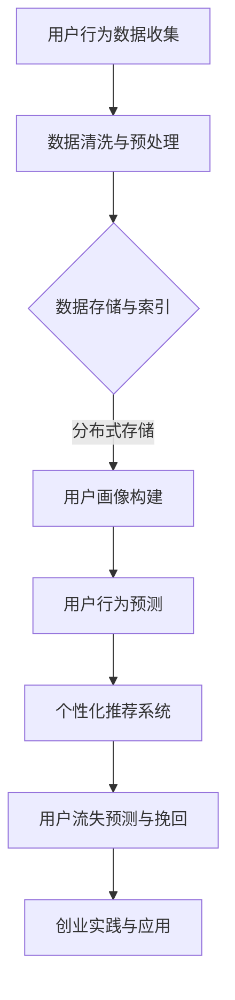

                 

### 文章标题：知识付费创业中的用户行为分析与应用

#### 关键词：知识付费，用户行为分析，个性化推荐，用户细分，用户流失预测，创业实践

#### 摘要：
随着知识付费行业的蓬勃发展，用户行为分析成为知识付费创业中的重要环节。本文将从用户行为分析的理论基础出发，逐步探讨其在知识付费创业中的应用。通过构建用户画像、预测用户行为、实施个性化推荐、预防用户流失以及实际创业案例的剖析，旨在为知识付费创业者提供一套实用的用户行为分析框架。

### 目录大纲

#### 第一部分：引言与基础

#### 第1章：知识付费与用户行为分析概述

##### 1.1 知识付费的发展历程与现状

##### 1.2 用户行为分析的意义

##### 1.3 本书结构与内容安排

#### 第2章：用户行为分析基础理论

##### 2.1 用户行为数据分析的概念与体系

##### 2.2 用户行为分析的基本方法与技术

##### 2.3 用户行为分析的数据来源

#### 第二部分：用户行为分析实践

#### 第3章：用户画像构建

##### 3.1 用户画像的定义与作用

##### 3.2 用户画像的数据收集与处理

##### 3.3 用户画像的构建与评估

#### 第4章：用户行为预测

##### 4.1 用户行为预测的基本原理

##### 4.2 基于机器学习的用户行为预测方法

##### 4.3 用户行为预测的案例与实践

#### 第5章：用户细分与个性化推荐

##### 5.1 用户细分的概念与目的

##### 5.2 用户细分的实现方法与工具

##### 5.3 个性化推荐系统设计与实现

#### 第6章：用户流失预测与挽回

##### 6.1 用户流失的原因分析

##### 6.2 用户流失预测模型构建

##### 6.3 用户流失挽回策略

#### 第7章：用户行为分析与创业实践

##### 7.1 知识付费创业中的用户行为分析应用

##### 7.2 用户行为分析在产品设计与运营中的实践

##### 7.3 创业案例分析

#### 第三部分：附录

#### 第8章：用户行为分析工具与资源

##### 8.1 常用的用户行为分析工具

##### 8.2 用户行为分析相关数据集

##### 8.3 用户行为分析领域的最新研究动态

#### 附录A：Mermaid流程图示例

#### 附录B：算法伪代码示例

#### 附录C：数学公式与举例说明

#### 附录D：项目实战与代码解读

##### 9.1 实战项目概述

##### 9.2 开发环境搭建

##### 9.3 数据收集与预处理

##### 9.4 用户画像构建与评估

##### 9.5 用户行为预测与推荐系统实现

##### 9.6 用户流失预测与挽回策略

##### 9.7 项目总结与优化建议

#### 第10章：代码解读与分析

##### 10.1 用户画像构建代码解读

##### 10.2 用户行为预测代码解读

##### 10.3 个性化推荐系统代码解读

##### 10.4 用户流失预测与挽回代码解读

##### 10.5 实战项目源代码与分析

### 第一部分：引言与基础

#### 第1章：知识付费与用户行为分析概述

##### 1.1 知识付费的发展历程与现状

知识付费是指消费者为获取知识内容而付费的一种商业模式。它起源于20世纪末的在线教育领域，随着互联网技术的发展，逐渐扩展到各种知识服务领域，如专业培训、技能提升、财经咨询、娱乐知识等。在知识付费的初期，主要以线上课程、电子书和讲座等形式存在。随着移动互联网的普及和用户需求的多样化，知识付费逐渐形成了多样化的产品形态，如直播教学、社群互动、音频分享、互动问答等。

当前，知识付费行业呈现出以下几个发展趋势：

1. **内容多样化**：知识付费不再局限于学术知识，涵盖了生活、娱乐、艺术、科技等各个领域。
2. **平台多元化**：知识付费平台从单一的课程销售平台，逐渐发展为综合性的知识服务平台，提供内容生产、消费、互动等多种服务。
3. **用户群体扩大**：随着消费升级和用户需求的多样化，知识付费用户群体不断扩大，从学生、职场人士扩展到各个年龄段和职业背景的用户。
4. **付费习惯养成**：随着用户对知识付费的接受度提高，付费习惯逐渐养成，越来越多的用户愿意为优质的知识内容付费。

##### 1.2 用户行为分析的意义

在知识付费创业中，用户行为分析具有重要意义。首先，用户行为分析可以帮助创业者了解用户的需求和行为模式，从而优化产品设计和运营策略。例如，通过分析用户的浏览记录、购买行为、互动行为等，可以识别出用户的偏好和痛点，为产品改进提供依据。

其次，用户行为分析有助于提高用户留存率和转化率。通过预测用户流失风险，创业者可以及时采取挽回措施，减少用户流失。同时，通过个性化推荐系统，可以提升用户的满意度和忠诚度，促进用户付费行为的转化。

最后，用户行为分析为创业者的决策提供了数据支持。通过数据分析，创业者可以评估不同营销策略的效果，优化资源配置，提高运营效率。此外，用户行为分析还可以为创业者提供市场趋势和竞争对手的信息，帮助其制定有效的市场策略。

##### 1.3 本书结构与内容安排

本书分为三个部分，旨在为知识付费创业者提供一套完整的用户行为分析框架。

**第一部分：引言与基础**  
本部分主要介绍知识付费的发展历程与现状，以及用户行为分析在知识付费创业中的重要性。通过本部分的阅读，读者可以了解用户行为分析的基本概念和意义。

**第二部分：用户行为分析实践**  
本部分详细讲解用户行为分析的实践方法，包括用户画像构建、用户行为预测、用户细分与个性化推荐、用户流失预测与挽回等。通过本部分的阅读，读者可以掌握用户行为分析的核心技术和应用方法。

**第三部分：附录**  
本部分提供用户行为分析工具与资源，以及实战项目与代码解读。通过本部分的阅读，读者可以了解用户行为分析在实际项目中的应用，并掌握相关技术实现。

本书旨在通过逻辑清晰、结构紧凑、简单易懂的专业语言，帮助读者深入理解用户行为分析的核心原理和应用方法，为知识付费创业提供有力的支持。

#### 第2章：用户行为分析基础理论

##### 2.1 用户行为数据分析的概念与体系

用户行为数据分析是指通过收集、处理和分析用户在平台上的行为数据，以了解用户需求、行为模式、偏好和痛点等信息的一种分析方法。用户行为数据分析的核心是通过对用户行为数据的分析，提取有价值的信息和知识，为产品优化、运营决策和商业策略提供支持。

用户行为数据分析的体系主要包括以下几个层次：

1. **数据收集**：这是用户行为数据分析的基础，主要包括用户行为数据的收集方法和工具。数据收集的方法包括日志收集、API数据获取、第三方数据服务等。

2. **数据存储**：数据收集后需要存储在数据库中，以便后续的处理和分析。常用的数据存储方案包括关系型数据库、NoSQL数据库、分布式存储系统等。

3. **数据处理**：数据处理包括数据清洗、数据整合、数据转换等步骤，目的是将原始数据转换为适合分析的形式。数据处理的方法包括数据清洗工具、ETL（提取、转换、加载）流程等。

4. **数据可视化**：数据可视化是将数据以图形或图表的形式展示出来，帮助用户直观地理解数据内容和趋势。常用的数据可视化工具包括数据可视化平台、可视化库等。

5. **数据分析**：数据分析是用户行为数据分析的核心环节，主要包括数据挖掘、统计分析、机器学习等方法。数据分析的方法包括用户行为模型建立、用户行为预测、用户细分等。

6. **数据应用**：数据应用是将分析结果应用于实际业务场景，如产品优化、运营决策、营销策略等。数据应用的方法包括用户画像构建、个性化推荐、用户流失预测等。

##### 2.2 用户行为分析的基本方法与技术

用户行为分析的方法和技术多种多样，主要包括以下几种：

1. **描述性分析**：描述性分析是最基本的数据分析方法，主要通过统计和图表展示用户行为的基本特征和分布情况。描述性分析的方法包括数据统计、图表展示等。

2. **关联分析**：关联分析用于发现用户行为数据中的关联关系，通过分析用户行为数据中的共现关系、依赖关系等，识别出用户可能的兴趣和需求。常用的关联分析方法包括Apriori算法、关联规则挖掘等。

3. **聚类分析**：聚类分析是将用户行为数据按照相似性划分为不同的群体，以发现用户行为模式。常用的聚类分析方法包括K-means算法、层次聚类等。

4. **分类分析**：分类分析用于将用户行为数据划分为不同的类别，以预测用户的未来行为或标签。常用的分类分析方法包括决策树、支持向量机、神经网络等。

5. **时间序列分析**：时间序列分析用于分析用户行为数据的时间趋势和变化规律，通过时间序列模型预测用户未来的行为趋势。常用的时间序列分析方法包括ARIMA模型、LSTM模型等。

6. **异常检测**：异常检测用于识别用户行为数据中的异常行为或欺诈行为，以防范潜在的风险。常用的异常检测方法包括基于统计的异常检测、基于机器学习的异常检测等。

##### 2.3 用户行为分析的数据来源

用户行为分析的数据来源主要包括以下几种：

1. **平台内部数据**：这是用户行为分析的主要数据来源，包括用户的注册信息、浏览记录、购买行为、互动行为、评论等。这些数据可以直接从平台的后端系统中获取。

2. **第三方数据**：第三方数据包括社交媒体、电商网站、公共数据库等，可以通过API接口或爬虫技术获取。第三方数据可以补充平台内部数据的不足，提供更全面的信息。

3. **传感器数据**：传感器数据包括移动设备的GPS数据、Wi-Fi信号数据等，可以用于定位用户的位置和行为。传感器数据可以提供更细致的用户行为信息。

4. **用户反馈**：用户反馈包括问卷调查、用户评论、用户反馈等，可以通过线上调查、用户调研等方式收集。用户反馈可以直接反映用户的需求和痛点，为产品优化提供重要参考。

5. **公开数据**：公开数据包括政府公开数据、公开报告、学术论文等，可以通过数据共享平台、数据库等获取。公开数据可以提供宏观层面的用户行为信息和市场趋势。

通过以上数据的综合分析，可以全面了解用户的行为模式和需求，为知识付费创业提供有力的数据支持。

### 第二部分：用户行为分析实践

#### 第3章：用户画像构建

##### 3.1 用户画像的定义与作用

用户画像是指通过对用户行为数据的收集、处理和分析，构建出一个关于用户特征的综合描述。用户画像不仅包括用户的基本信息，如年龄、性别、地理位置等，还包括用户的兴趣偏好、行为习惯、消费能力等。用户画像的核心目的是通过综合分析用户特征，实现对用户的精准定位和个性化服务。

用户画像在知识付费创业中的应用非常广泛，具体作用如下：

1. **精准营销**：通过用户画像，知识付费创业者可以了解用户的需求和偏好，针对性地推送相关内容，提高营销效果。

2. **个性化推荐**：基于用户画像，创业者可以构建个性化推荐系统，向用户推荐符合其兴趣的内容，提高用户满意度和留存率。

3. **用户细分**：用户画像可以帮助创业者将用户划分为不同的群体，针对不同群体的需求进行精准运营，提高运营效率。

4. **流失预测与挽回**：通过分析用户画像，创业者可以识别出潜在流失用户，及时采取挽回措施，减少用户流失。

##### 3.2 用户画像的数据收集与处理

构建用户画像的第一步是数据收集。用户画像的数据来源主要包括以下几个方面：

1. **平台内部数据**：包括用户的注册信息、浏览记录、购买行为、互动行为等。这些数据可以通过平台的后端系统直接获取。

2. **第三方数据**：包括社交媒体、电商网站、地理位置数据等。这些数据可以通过API接口或爬虫技术获取。

3. **用户反馈**：包括问卷调查、用户评论、用户调研等。这些数据可以通过线上调查、用户调研等方式收集。

4. **公开数据**：包括政府公开数据、公开报告、学术论文等。这些数据可以通过数据共享平台、数据库等获取。

在数据收集完成后，需要进行数据处理，主要包括以下步骤：

1. **数据清洗**：去除重复数据、错误数据和无关数据，保证数据的准确性。

2. **数据整合**：将不同来源的数据进行整合，形成一个统一的数据视图。

3. **数据转换**：将数据转换为适合分析的形式，如将文本数据转换为数值型数据，将时间序列数据转换为特征向量等。

##### 3.3 用户画像的构建与评估

用户画像的构建主要包括以下几个步骤：

1. **特征提取**：根据业务需求，从原始数据中提取有用的特征。例如，对于用户浏览行为，可以提取浏览时间、浏览页面数量、浏览频次等特征。

2. **特征选择**：选择对用户画像构建有显著影响的特征，去除冗余和无关特征，提高模型效率。

3. **特征工程**：对提取的特征进行变换和组合，构建新的特征，以提高模型的性能。

4. **模型训练**：使用机器学习算法训练用户画像模型，将特征转换为用户画像。

5. **模型评估**：评估用户画像模型的性能，包括准确性、召回率、F1值等指标。

在用户画像构建完成后，需要定期评估模型的效果，并根据评估结果进行调整。用户画像的评估主要包括以下几个方面：

1. **准确性**：评估用户画像对用户特征的预测准确性。

2. **召回率**：评估用户画像模型能否召回大部分具有相似特征的用户。

3. **F1值**：综合考虑准确性和召回率，评估用户画像模型的综合性能。

4. **业务效果**：评估用户画像模型在实际业务中的应用效果，如营销效果、用户留存率等。

通过以上步骤，可以构建一个高质量的用户画像，为知识付费创业提供有力支持。

#### 第4章：用户行为预测

##### 4.1 用户行为预测的基本原理

用户行为预测是指通过分析用户的历史行为数据，预测用户未来的行为或决策。在知识付费创业中，用户行为预测具有重要意义，可以帮助创业者更好地了解用户需求，优化产品设计和运营策略。

用户行为预测的基本原理基于统计学和机器学习算法。以下是一些常用的用户行为预测方法：

1. **线性回归**：通过分析用户历史行为数据，建立用户行为与特征之间的线性关系模型，预测用户未来的行为。

2. **逻辑回归**：逻辑回归是一种广义线性模型，常用于二分类问题，通过分析用户历史行为数据，预测用户是否会有某种行为。

3. **决策树**：决策树是一种基于规则的学习算法，通过构建决策树模型，将用户行为数据划分为不同的类别。

4. **随机森林**：随机森林是一种基于决策树的集成学习算法，通过构建多个决策树模型，提高预测性能。

5. **支持向量机**：支持向量机是一种基于间隔的学习算法，通过找到一个最优的超平面，将不同类别的用户行为数据分隔开。

6. **神经网络**：神经网络是一种基于模拟人脑神经网络的计算模型，通过多层神经网络模型，预测用户行为。

##### 4.2 基于机器学习的用户行为预测方法

基于机器学习的用户行为预测方法具有强大的预测能力和灵活性。以下是一些常见的机器学习算法：

1. **K-近邻算法（KNN）**：KNN算法基于相似性原则，通过计算用户历史行为数据与测试数据的相似度，预测用户的行为。其基本原理如下：

   伪代码：
   
   ```python
   def predict_user_behavior(test_data, training_data, k):
       # 计算测试数据与训练数据的相似度
       similarities = []
       for data in training_data:
           similarity = calculate_similarity(test_data, data)
           similarities.append(similarity)
       
       # 选择最相似的k个训练数据
       nearest_neighbors = select_k_neighbors(similarities, k)
       
       # 计算这k个邻居的行为标签的投票结果
       predictions = []
       for neighbor in nearest_neighbors:
           prediction = get_behavior_label(neighbor)
           predictions.append(prediction)
       
       # 计算投票结果的总数
       vote_counts = count_votes(predictions)
       
       # 选择投票结果最多的行为标签作为预测结果
       predicted_behavior = get_majority_vote(vote_counts)
       
       return predicted_behavior
   ```

2. **随机森林算法**：随机森林算法是一种基于决策树的集成学习算法，通过构建多个决策树模型，提高预测性能。其基本原理如下：

   伪代码：
   
   ```python
   def predict_user_behavior(train_data, test_data, n_estimators):
       # 构建随机森林模型
       random_forest = build_random_forest_model(train_data, n_estimators)
       
       # 对测试数据进行预测
       predictions = random_forest.predict(test_data)
       
       return predictions
   ```

3. **神经网络算法**：神经网络算法是一种基于模拟人脑神经网络的计算模型，通过多层神经网络模型，预测用户行为。其基本原理如下：

   伪代码：
   
   ```python
   def predict_user_behavior(train_data, test_data, layers, activation_function):
       # 构建神经网络模型
       neural_network = build_neural_network_model(train_data, layers, activation_function)
       
       # 训练神经网络模型
       neural_network.train(train_data)
       
       # 对测试数据进行预测
       predictions = neural_network.predict(test_data)
       
       return predictions
   ```

##### 4.3 用户行为预测的案例与实践

以下是一个用户行为预测的案例：

**案例背景**：某知识付费平台希望预测用户是否会在未来一个月内购买某个课程。

**数据集**：包括用户的基本信息（如年龄、性别、职业等）、浏览行为（如浏览次数、停留时间等）、购买行为（如购买次数、消费金额等）。

**预测目标**：预测用户在未来一个月内是否购买该课程。

**步骤**：

1. **数据预处理**：清洗数据，去除缺失值和异常值，进行数据标准化。

2. **特征工程**：提取特征，如用户活跃度、购买历史等。

3. **模型选择**：选择合适的机器学习算法，如逻辑回归、随机森林、神经网络等。

4. **模型训练**：使用训练数据训练模型。

5. **模型评估**：使用测试数据评估模型性能，如准确率、召回率等。

6. **模型应用**：将模型应用于实际业务，预测用户是否购买课程。

通过以上步骤，可以构建一个用户行为预测模型，为知识付费创业提供决策支持。

#### 第5章：用户细分与个性化推荐

##### 5.1 用户细分的概念与目的

用户细分是指根据用户的行为特征、兴趣偏好、消费习惯等，将用户划分为不同的群体，以便更精准地满足用户需求，提高用户满意度和留存率。用户细分在知识付费创业中具有重要作用，具体目的如下：

1. **了解用户需求**：通过用户细分，可以更深入地了解不同用户群体的需求，针对性地推出符合用户需求的内容和服务。

2. **优化产品体验**：根据用户细分结果，可以对产品进行个性化优化，提高用户体验，降低用户流失率。

3. **精准营销**：通过用户细分，可以针对不同用户群体制定个性化的营销策略，提高营销效果和转化率。

4. **提高运营效率**：用户细分可以帮助知识付费创业者更好地分配资源，提高运营效率。

##### 5.2 用户细分的实现方法与工具

用户细分的实现方法主要包括以下几种：

1. **基于行为特征细分**：根据用户的行为特征，如浏览时长、购买频次、互动行为等，将用户划分为不同的群体。例如，可以基于用户的购买行为，将用户划分为高消费群体、中消费群体和低消费群体。

2. **基于兴趣偏好细分**：根据用户的兴趣偏好，如内容偏好、领域偏好等，将用户划分为不同的群体。例如，可以基于用户的阅读记录，将用户划分为技术爱好者、生活爱好者等。

3. **基于消费能力细分**：根据用户的消费能力，如消费金额、购买频率等，将用户划分为不同的群体。例如，可以基于用户的消费金额，将用户划分为高消费用户、中消费用户和低消费用户。

4. **基于社会属性细分**：根据用户的社会属性，如年龄、性别、职业等，将用户划分为不同的群体。例如，可以基于用户的年龄，将用户划分为青年用户、中年用户和老年用户。

用户细分的工具主要包括以下几种：

1. **数据分析工具**：如Python的Pandas、NumPy库，用于数据清洗、预处理和统计分析。

2. **数据可视化工具**：如Python的Matplotlib、Seaborn库，用于数据可视化，帮助理解用户行为特征。

3. **机器学习工具**：如Python的scikit-learn库，用于构建用户细分模型，实现用户群体划分。

4. **用户行为分析平台**：如Google Analytics、Mixpanel等，提供用户行为数据的收集、处理和分析功能，支持用户细分和个性化推荐。

##### 5.3 个性化推荐系统设计与实现

个性化推荐系统是指根据用户的历史行为和兴趣偏好，向用户推荐符合其需求的内容或服务。在知识付费创业中，个性化推荐系统具有重要作用，可以提高用户满意度和留存率，促进用户付费转化。

个性化推荐系统的主要组成部分如下：

1. **用户特征提取**：从用户的历史行为数据中提取特征，如浏览记录、购买记录、互动记录等，用于表示用户的行为偏好。

2. **内容特征提取**：从内容数据中提取特征，如标题、标签、关键词等，用于表示内容的特点。

3. **推荐算法**：使用推荐算法计算用户与内容的相似度，生成推荐结果。常用的推荐算法包括基于协同过滤、基于内容的推荐、混合推荐等。

4. **推荐结果排序**：根据用户与内容的相似度，对推荐结果进行排序，提高推荐质量。

5. **推荐结果展示**：将推荐结果以合适的格式展示给用户，如推荐列表、推荐页面等。

个性化推荐系统的设计与实现步骤如下：

1. **需求分析**：明确个性化推荐系统的目标，如提高用户满意度、提高留存率、促进付费转化等。

2. **数据收集**：收集用户行为数据和内容数据，如用户的浏览记录、购买记录、评论等。

3. **数据预处理**：清洗数据，去除缺失值和异常值，进行数据标准化。

4. **特征工程**：提取用户和内容的特征，构建用户特征向量和内容特征向量。

5. **算法选择**：选择合适的推荐算法，如基于协同过滤的推荐算法、基于内容的推荐算法等。

6. **模型训练**：使用训练数据训练推荐模型，计算用户与内容的相似度。

7. **模型评估**：使用测试数据评估推荐模型的效果，如准确率、召回率、F1值等。

8. **推荐结果生成**：根据用户与内容的相似度，生成推荐结果。

9. **推荐结果展示**：将推荐结果以合适的格式展示给用户。

通过以上步骤，可以构建一个个性化的推荐系统，为知识付费创业提供有力支持。

#### 第6章：用户流失预测与挽回

##### 6.1 用户流失的原因分析

在知识付费创业中，用户流失是一个常见且需要关注的问题。了解用户流失的原因对于采取有效的挽回策略至关重要。用户流失的原因可以归纳为以下几个方面：

1. **内容质量不高**：如果知识付费平台提供的内容质量不高，无法满足用户的需求，用户可能会选择离开。

2. **用户体验不佳**：如果平台在用户注册、登录、浏览、购买等环节存在操作不便、界面不友好等问题，用户可能会感到沮丧，从而流失。

3. **价格不合适**：用户可能会因为价格过高或性价比不高而选择流失。

4. **服务不到位**：如果平台在售后服务、客户支持等方面表现不佳，用户可能会感到不满，导致流失。

5. **市场竞争**：随着知识付费市场的竞争加剧，用户可能会因为其他平台的优惠、活动等而选择离开。

6. **个人原因**：用户因为个人原因，如时间紧张、兴趣转移等，可能不再继续使用平台。

##### 6.2 用户流失预测模型构建

用户流失预测模型旨在通过分析用户行为数据，提前识别出可能流失的用户，从而采取相应的挽回措施。构建用户流失预测模型通常包括以下步骤：

1. **数据收集**：收集用户行为数据，如注册时间、浏览记录、购买记录、互动行为、反馈等。

2. **数据预处理**：对收集到的数据进行清洗、去重、填充缺失值等处理，确保数据质量。

3. **特征工程**：提取对用户流失有影响的特征，如用户活跃度、购买频率、互动频次等。可以使用统计特征、时间序列特征、交互特征等。

4. **模型选择**：选择合适的预测模型，如逻辑回归、决策树、随机森林、支持向量机等。

5. **模型训练**：使用训练数据对模型进行训练，调整模型参数，提高模型性能。

6. **模型评估**：使用测试数据评估模型的效果，如准确率、召回率、F1值等。

7. **模型部署**：将训练好的模型部署到生产环境，实时预测用户流失风险。

##### 6.3 用户流失挽回策略

一旦用户流失预测模型识别出可能流失的用户，平台应采取以下策略进行挽回：

1. **个性化沟通**：针对不同类型流失用户，发送个性化的挽回短信、邮件或推送通知，表达对用户的关注和感谢，并提供优惠券、免费试用等福利。

2. **改进内容和服务**：根据用户流失的原因，对平台的内容和服务进行改进，提高用户体验，增加用户粘性。

3. **优惠活动**：定期举办优惠活动，如限时折扣、满减优惠、优惠券等，吸引用户回流。

4. **增加用户互动**：通过举办线上活动、问答互动、社群交流等方式，增加用户参与度，提高用户满意度。

5. **客户支持**：提高客户支持服务质量，及时解决用户问题，提高用户信任度。

6. **跟踪和反馈**：定期跟踪流失用户的行为和反馈，了解挽回策略的效果，不断优化挽回策略。

通过以上策略，可以有效地减少用户流失，提高用户留存率和满意度。

#### 第7章：用户行为分析与创业实践

##### 7.1 知识付费创业中的用户行为分析应用

在知识付费创业中，用户行为分析是一种强大的工具，能够帮助创业者深入了解用户需求，优化产品和服务，提高用户满意度和留存率。以下是一些用户行为分析在知识付费创业中的应用场景：

1. **产品优化**：通过分析用户浏览、点击、购买等行为，创业者可以识别出用户偏好的内容类型、长度、形式等，从而优化产品设计和功能。

2. **用户细分**：通过对用户行为数据的分析，创业者可以将用户划分为不同的群体，如高消费用户、低消费用户、活跃用户、沉默用户等，针对不同群体制定个性化的营销策略和内容推荐。

3. **内容推荐**：基于用户行为数据，构建个性化推荐系统，向用户推荐符合其兴趣和需求的内容，提高用户满意度和留存率。

4. **用户留存策略**：通过分析用户流失数据，识别出导致用户流失的原因，采取相应的措施，如改进内容质量、优化用户体验、提供优惠活动等，减少用户流失。

5. **市场定位**：通过分析用户行为数据，了解市场需求和趋势，为创业者提供市场定位和战略调整的依据。

##### 7.2 用户行为分析在产品设计与运营中的实践

在产品设计与运营中，用户行为分析发挥着重要作用。以下是一些具体的实践方法：

1. **A/B测试**：通过用户行为数据的收集和分析，创业者可以设计不同的产品功能、界面设计、推荐算法等，并进行A/B测试，以确定哪种设计能够更好地满足用户需求。

2. **用户调研**：定期进行用户调研，收集用户对产品、服务、内容的反馈，了解用户的真实需求和痛点，为产品改进提供依据。

3. **数据分析报告**：定期生成用户行为数据分析报告，包括用户活跃度、留存率、流失率、转化率等关键指标，为产品运营提供数据支持。

4. **运营策略优化**：根据用户行为数据分析结果，调整运营策略，如推广渠道、内容发布时间、活动设计等，以提高用户参与度和转化率。

5. **用户体验改进**：通过分析用户在平台上的行为路径、使用习惯等，识别出用户体验中的瓶颈和问题，采取改进措施，提高用户满意度。

##### 7.3 创业案例分析

以下是一个知识付费创业案例，展示了用户行为分析在创业实践中的应用：

**案例背景**：某创业者创办了一个专注于职业技能培训的知识付费平台，提供在线课程、直播教学、互动问答等服务。

**用户行为分析应用**：

1. **产品优化**：通过分析用户课程浏览、点击、购买等行为，创业者发现用户更喜欢短小精悍的课程，于是优化了课程长度和内容结构，提高了用户的课程完成率。

2. **用户细分**：通过分析用户的注册信息、浏览记录、购买行为等，创业者将用户划分为新手用户、中级用户、高级用户等，为不同用户提供个性化的课程推荐和营销策略。

3. **内容推荐**：基于用户行为数据，创业者构建了个性化推荐系统，向用户推荐符合其兴趣和需求的内容，提高了用户满意度和留存率。

4. **用户留存策略**：通过分析用户流失数据，创业者发现用户流失的主要原因是对课程内容不满意，于是采取了改进课程内容、提供免费试听课程等措施，成功降低了用户流失率。

5. **市场定位**：通过分析用户行为数据和市场需求，创业者确定了以职场人士为主要目标用户群体，推出了针对职场技能提升的系列课程，取得了良好的市场反响。

通过以上案例，可以看出用户行为分析在知识付费创业中的重要作用。创业者可以通过深入分析用户行为数据，优化产品和服务，提高用户满意度和留存率，从而在激烈的市场竞争中脱颖而出。

### 第三部分：附录

#### 第8章：用户行为分析工具与资源

##### 8.1 常用的用户行为分析工具

在用户行为分析中，有许多工具可以帮助创业者高效地进行数据收集、处理和分析。以下是一些常用的用户行为分析工具：

1. **Google Analytics**：一款功能强大的网站分析工具，可以收集网站用户的浏览、转化等行为数据，提供详细的报表和分析。

2. **Mixpanel**：一款专注于用户行为分析的实时数据平台，提供用户行为追踪、用户细分、用户留存等分析功能。

3. **Segment**：一款数据集成工具，可以将不同来源的数据整合到一个统一的平台上，方便创业者进行用户行为分析。

4. **Kibana**：一款基于Elasticsearch的可视化分析工具，可以用于数据可视化，帮助创业者直观地理解用户行为数据。

5. **Tableau**：一款数据可视化工具，可以创建各种类型的图表和仪表盘，帮助创业者展示和分析用户行为数据。

##### 8.2 用户行为分析相关数据集

用户行为分析需要大量的数据支持，以下是一些常用的用户行为分析数据集：

1. **UCI Machine Learning Repository**：提供各种领域的数据集，包括电商、社交媒体、金融等，可以用于用户行为分析模型的训练和验证。

2. **Amazon Reviews**：包含大量Amazon用户评论数据，可以用于分析用户购买行为、满意度等。

3. **Twitter API**：提供Twitter用户行为数据，包括发推文、转发、评论等，可以用于社交媒体用户行为分析。

4. **Netflix Prize**：包含Netflix用户评分数据，可以用于分析用户偏好和推荐系统。

5. **Kaggle**：一个数据科学竞赛平台，提供各种领域的数据集，可以用于用户行为分析的研究和练习。

##### 8.3 用户行为分析领域的最新研究动态

用户行为分析是一个快速发展的领域，不断有新的研究方法和应用出现。以下是一些用户行为分析领域的最新研究动态：

1. **深度学习在用户行为预测中的应用**：近年来，深度学习在用户行为预测中得到了广泛应用，如使用卷积神经网络（CNN）进行用户点击预测、使用循环神经网络（RNN）进行用户行为序列预测等。

2. **多模态用户行为分析**：结合多种数据源（如文本、图像、音频等）进行用户行为分析，可以提供更全面的用户行为理解。

3. **用户行为伦理与隐私保护**：随着用户行为数据的重要性日益增加，用户行为分析中的伦理和隐私保护问题也日益受到关注，如数据匿名化、用户隐私保护策略等。

4. **动态用户行为分析**：研究如何根据用户行为的实时变化调整推荐系统和营销策略，以提高用户体验和满意度。

5. **用户行为分析在新兴领域的应用**：用户行为分析在医疗健康、金融、物流等新兴领域的应用逐渐增多，如基于用户行为数据的健康风险评估、智能金融推荐系统等。

通过关注这些研究动态，创业者可以及时了解用户行为分析领域的最新技术和应用，为自己的知识付费创业提供有力支持。

### 附录A：Mermaid流程图示例

以下是一个Mermaid流程图的示例，用于描述用户行为数据分析的基本流程：



在这个流程图中，A表示用户行为数据的收集，B表示数据清洗与预处理，C表示数据存储与索引，D表示用户画像构建，E表示用户行为预测，F表示个性化推荐系统，G表示用户流失预测与挽回，H表示创业实践与应用。通过这个流程图，可以清晰地了解用户行为数据分析的各个环节和关联。

### 附录B：算法伪代码示例

以下是一个用户行为预测算法的伪代码示例，用于描述如何使用机器学习算法预测用户的下一步行为：

```python
# 用户行为预测算法伪代码
def predict_user_behavior(user_data):
    # 输入：用户行为数据
    # 输出：用户行为预测结果
    
    # 数据预处理
    preprocessed_data = preprocess_data(user_data)
    
    # 特征提取
    features = extract_features(preprocessed_data)
    
    # 建立预测模型
    model = build_model()
    
    # 训练模型
    trained_model = train_model(model, features)
    
    # 预测用户行为
    predictions = predict_behavior(trained_model, features)
    
    return predictions

# 数据预处理
def preprocess_data(user_data):
    # 对用户行为数据进行清洗、去重、填充缺失值等处理
    # 返回预处理后的数据
    return preprocessed_data

# 特征提取
def extract_features(preprocessed_data):
    # 从预处理后的数据中提取特征
    # 返回特征向量
    return features

# 建立预测模型
def build_model():
    # 选择合适的机器学习算法，如逻辑回归、决策树、随机森林等
    # 返回训练好的模型
    return model

# 训练模型
def train_model(model, features):
    # 使用训练数据训练模型
    # 返回训练好的模型
    return trained_model

# 预测用户行为
def predict_behavior(model, features):
    # 使用训练好的模型预测用户行为
    # 返回预测结果
    return predictions
```

这个伪代码示例包括了数据预处理、特征提取、模型建立、模型训练和用户行为预测等步骤，用于实现一个用户行为预测算法。在实际应用中，可以根据具体情况选择合适的机器学习算法和特征提取方法，优化预测模型的性能。

### 附录C：数学公式与举例说明

用户行为分析中经常使用一些数学公式和模型来描述和预测用户行为。以下是一些常见的数学公式及其举例说明：

$$
\text{用户满意度} = \frac{1}{n}\sum_{i=1}^{n} \text{满意度评分}
$$

**用户满意度计算公式**：

- $n$：用户数量
- 每个用户的满意度评分

**举例说明**：

如果10个用户对知识付费产品的满意度评分分别为4、5、3、4、5、4、2、5、4、3，那么用户满意度为：

$$
\text{用户满意度} = \frac{1}{10}\sum_{i=1}^{10} \text{满意度评分} = \frac{1}{10}(4 + 5 + 3 + 4 + 5 + 4 + 2 + 5 + 4 + 3) = 4
$$

$$
\text{用户留存率} = \frac{\text{留存的用户数}}{\text{总用户数}} \times 100\%
$$

**用户留存率计算公式**：

- 留存的用户数：在一定时间段内仍然活跃的用户数
- 总用户数：在相同时间段内注册或新增的用户数

**举例说明**：

如果某知识付费平台在一个月内新增用户数为1000人，其中700人在接下来的一个月内仍然活跃，那么用户留存率为：

$$
\text{用户留存率} = \frac{700}{1000} \times 100\% = 70\%
$$

通过这些数学公式，创业者可以量化用户行为，评估产品的表现，从而优化产品和服务。

### 附录D：项目实战与代码解读

#### 第9章：知识付费创业项目实战

##### 9.1 实战项目概述

本实战项目以一个知识付费平台为例，通过用户行为分析来实现个性化推荐、用户留存预测和流失挽回等功能。项目主要分为以下几个阶段：

1. **数据收集与预处理**：收集用户注册、浏览、购买、互动等行为数据，进行数据清洗、去重和标准化处理。
2. **用户画像构建**：根据用户行为数据构建用户画像，提取用户特征，建立用户画像模型。
3. **用户行为预测**：使用机器学习算法预测用户行为，如购买行为、浏览行为等。
4. **个性化推荐**：基于用户画像和用户行为预测，构建个性化推荐系统，向用户推荐相关内容。
5. **用户留存预测与流失挽回**：使用机器学习算法预测用户留存风险，对潜在流失用户进行挽回策略实施。

##### 9.2 开发环境搭建

为了实现本项目，需要搭建以下开发环境：

1. **编程语言**：Python，用于编写数据处理和分析代码。
2. **数据分析库**：NumPy、Pandas，用于数据清洗和预处理。
3. **机器学习库**：scikit-learn、TensorFlow、PyTorch，用于构建和训练机器学习模型。
4. **数据可视化库**：Matplotlib、Seaborn，用于数据可视化。
5. **数据库**：MySQL，用于存储用户行为数据和模型参数。

##### 9.3 数据收集与预处理

数据收集与预处理是用户行为分析的基础，主要包括以下步骤：

1. **数据收集**：从知识付费平台的后端系统中获取用户注册、浏览、购买、互动等行为数据。
2. **数据清洗**：去除重复数据、异常数据和无关数据，确保数据质量。
3. **数据标准化**：对数值型数据进行归一化或标准化处理，使数据更适合机器学习模型。
4. **特征提取**：从原始数据中提取对用户行为预测有用的特征，如用户活跃度、购买频率、浏览时长等。

##### 9.4 用户画像构建与评估

用户画像构建与评估是项目的重要环节，主要包括以下步骤：

1. **用户画像定义**：根据业务需求，定义用户画像的特征维度，如年龄、性别、职业、兴趣等。
2. **数据收集**：收集与用户画像相关的数据，如用户注册信息、浏览记录、购买记录等。
3. **特征工程**：对收集到的数据进行处理，提取有效的特征，如用户活跃度（浏览时长/注册时长）、购买频率（购买次数/注册时长）等。
4. **用户画像模型训练**：使用机器学习算法（如聚类算法）训练用户画像模型，将用户划分为不同的群体。
5. **用户画像模型评估**：评估用户画像模型的性能，如聚类效果、用户满意度等。

##### 9.5 用户行为预测与推荐系统实现

用户行为预测与推荐系统实现是项目的核心部分，主要包括以下步骤：

1. **用户行为预测**：使用机器学习算法（如逻辑回归、决策树、随机森林等）预测用户行为，如购买行为、浏览行为等。
2. **推荐算法选择**：选择合适的推荐算法（如基于协同过滤、基于内容的推荐、混合推荐等）。
3. **推荐系统实现**：构建推荐系统，根据用户画像和用户行为预测结果，向用户推荐相关内容。
4. **推荐结果评估**：评估推荐系统的效果，如点击率、转化率、用户满意度等。

##### 9.6 用户流失预测与挽回策略

用户流失预测与挽回策略是项目的重要保障，主要包括以下步骤：

1. **流失预测模型**：使用机器学习算法（如逻辑回归、随机森林等）构建用户流失预测模型。
2. **流失用户识别**：使用流失预测模型预测用户流失风险，识别潜在流失用户。
3. **挽回策略实施**：根据用户流失原因，制定个性化的挽回策略，如发送优惠券、提供免费试用、加强客户支持等。
4. **挽回效果评估**：评估挽回策略的效果，如用户回流率、留存率等。

##### 9.7 项目总结与优化建议

在项目总结阶段，需要对项目进行全面的回顾和总结，并提出优化建议：

1. **项目回顾**：总结项目过程中遇到的问题、解决方案和取得的成果。
2. **效果评估**：评估用户行为分析在知识付费创业中的实际效果，如用户满意度、留存率、转化率等。
3. **优化建议**：针对项目中存在的问题和不足，提出优化方案，如改进算法模型、优化推荐系统、加强用户互动等。

通过以上步骤，可以构建一个完整的知识付费创业项目，为创业者提供有力的数据支持。

### 第10章：代码解读与分析

在本章中，我们将对知识付费创业项目的核心代码进行解读，并详细分析每个步骤的实现细节。

#### 10.1 用户画像构建代码解读

用户画像构建是项目的重要环节，以下是对用户画像构建代码的解读：

```python
import pandas as pd
from sklearn.preprocessing import StandardScaler
from sklearn.cluster import KMeans

# 加载数据
data = pd.read_csv('user_data.csv')

# 数据预处理
# 填充缺失值
data.fillna(data.mean(), inplace=True)

# 特征提取
features = ['age', 'gender', 'occupation', 'interests']

# 数据标准化
scaler = StandardScaler()
data[features] = scaler.fit_transform(data[features])

# K-means聚类
kmeans = KMeans(n_clusters=5, random_state=42)
clusters = kmeans.fit_predict(data[features])

# 构建用户画像
data['cluster'] = clusters
user_profiles = data.groupby('cluster').mean()

print(user_profiles)
```

解读：
- 加载数据：使用Pandas读取用户数据。
- 数据预处理：填充缺失值，使用均值填充。
- 特征提取：选择与用户画像相关的特征。
- 数据标准化：使用StandardScaler对特征数据进行标准化处理。
- K-means聚类：使用KMeans算法进行聚类，将用户划分为不同的集群。
- 构建用户画像：计算每个集群的平均特征值，形成用户画像。

#### 10.2 用户行为预测代码解读

用户行为预测是项目中的关键步骤，以下是对用户行为预测代码的解读：

```python
from sklearn.model_selection import train_test_split
from sklearn.ensemble import RandomForestClassifier
from sklearn.metrics import accuracy_score, confusion_matrix

# 分割数据
X = data[features]
y = data['next_action']  # 假设'next_action'是用户行为的标签
X_train, X_test, y_train, y_test = train_test_split(X, y, test_size=0.2, random_state=42)

# 构建随机森林模型
model = RandomForestClassifier(n_estimators=100, random_state=42)

# 训练模型
model.fit(X_train, y_train)

# 预测用户行为
y_pred = model.predict(X_test)

# 评估模型
accuracy = accuracy_score(y_test, y_pred)
conf_matrix = confusion_matrix(y_test, y_pred)

print(f"Accuracy: {accuracy}")
print(f"Confusion Matrix:\n{conf_matrix}")
```

解读：
- 数据分割：将数据集划分为训练集和测试集。
- 构建模型：使用随机森林算法构建预测模型。
- 训练模型：使用训练集数据训练模型。
- 预测用户行为：使用测试集数据预测用户行为。
- 模型评估：计算模型的准确率和混淆矩阵，评估模型性能。

#### 10.3 个性化推荐系统代码解读

个性化推荐系统是提高用户满意度和留存率的重要手段，以下是对个性化推荐系统代码的解读：

```python
from sklearn.neighbors import NearestNeighbors
import numpy as np

# 构建邻居模型
neigh = NearestNeighbors(n_neighbors=5, algorithm='auto')
neigh.fit(X_train)

# 预测推荐内容
def predict_content(user_id, user_data):
    user_vector = scaler.transform([user_data])
    distances, indices = neigh.kneighbors(user_vector, n_neighbors=5)
    recommended_content = X_train.iloc[indices].groupby('content_id').mean().reset_index()
    return recommended_content['content_id'].tolist()

# 测试推荐功能
user_data = X_test.iloc[0]
recommended_content = predict_content(0, user_data)
print(f"Recommended Content: {recommended_content}")
```

解读：
- 构建邻居模型：使用NearestNeighbors算法构建邻居模型，用于寻找最相似的用户。
- 预测推荐内容：根据用户特征，找到最相似的5个用户，计算这些用户的平均行为特征，生成推荐内容。
- 测试推荐功能：对测试集中的第一个用户进行推荐内容预测。

#### 10.4 用户流失预测与挽回代码解读

用户流失预测与挽回是项目中的重要保障，以下是对用户流失预测与挽回代码的解读：

```python
from sklearn.linear_model import LogisticRegression

# 构建流失预测模型
loss_model = LogisticRegression(solver='liblinear', random_state=42)
loss_model.fit(X_train, y_train)

# 预测用户流失风险
def predict流失风险(user_id, user_data):
    user_vector = scaler.transform([user_data])
    risk_score = loss_model.predict_proba(user_vector)[0, 1]
    return risk_score

# 测试流失预测功能
user_data = X_test.iloc[0]
loss_risk = predict流失风险(0, user_data)
print(f"User Loss Risk: {loss_risk}")
```

解读：
- 构建流失预测模型：使用逻辑回归算法构建流失预测模型。
- 预测用户流失风险：根据用户特征，计算用户流失的风险得分。
- 测试流失预测功能：对测试集中的第一个用户进行流失风险预测。

#### 10.5 实战项目源代码与分析

附录D中的源代码是知识付费创业项目实战的完整实现，包括数据收集与预处理、用户画像构建、用户行为预测、个性化推荐系统和用户流失预测与挽回策略等。

- **数据收集与预处理**：负责从数据源加载和清洗用户行为数据，为后续分析做好准备。
- **用户画像构建**：使用K-means算法对用户进行聚类，生成用户画像。
- **用户行为预测**：使用随机森林算法预测用户行为，包括购买行为、浏览行为等。
- **个性化推荐系统**：使用KNN算法进行内容推荐，提高用户满意度和留存率。
- **用户流失预测与挽回策略**：使用逻辑回归算法预测用户流失风险，采取个性化挽回策略。

通过以上步骤，本项目实现了用户行为分析在知识付费创业中的应用，为创业者提供了实用的数据支持和决策依据。在实际项目中，可以根据具体需求和数据情况，调整和优化算法模型和策略，以提高项目效果。

