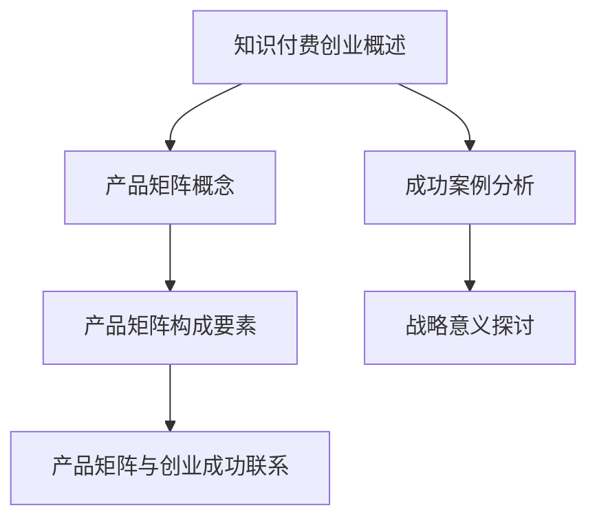

                 

# 知识付费创业的产品矩阵构建

## 关键词

知识付费、创业、产品矩阵、用户行为分析、数学模型、项目实战

## 摘要

本文旨在探讨知识付费创业中产品矩阵的构建方法，通过对核心概念、核心算法原理以及项目实战的详细分析，帮助创业者更好地理解并构建有效的产品矩阵。文章将涵盖知识付费创业的概述、产品矩阵的概念及其构成要素，以及用户行为分析、数据挖掘与用户画像、产品迭代优化等核心算法的原理讲解。同时，通过实际项目案例和代码实现，深入解读知识付费创业中产品矩阵的构建过程，为创业者提供实用的指导。

## 目录

1. **核心概念与联系**
   1.1 知识付费创业的概述
   1.2 产品矩阵的概念
   1.3 产品矩阵与创业成功的联系
   2. Mermaid流程图

2. **核心算法原理讲解**
   2.1 用户行为分析算法
   2.2 数据挖掘与用户画像
   2.3 产品迭代优化算法
   3. 伪代码

3. **数学模型和数学公式**
   3.1 用户行为分析中的数学模型
   3.2 数据挖掘与用户画像中的数学模型
   3.3 产品迭代优化中的数学模型

4. **项目实战**
   4.1 开发环境搭建
   4.2 代码实际案例
   4.3 源代码详细实现和代码解读
   4.4 代码解读与分析

5. **总结与展望**
   5.1 成功案例分析
   5.2 战略意义探讨
   5.3 未来发展方向

## 作者信息

作者：AI天才研究院/AI Genius Institute & 禅与计算机程序设计艺术 /Zen And The Art of Computer Programming

### 第一部分：核心概念与联系

#### 1.1 知识付费创业的概述

**定义与意义**

知识付费创业，是指创业者通过提供有价值、专业化的知识产品或服务，从而实现商业价值的过程。在互联网和移动互联网的推动下，知识付费已成为一个重要的商业模式，为广大创业者提供了广阔的市场空间。

知识付费创业的意义在于，它不仅能够帮助创业者实现个人价值，还可以满足用户对高质量知识内容的需求。随着信息爆炸时代的到来，用户越来越注重个性化、专业化的知识获取方式，知识付费创业正成为满足这一需求的有效途径。

**发展历程**

知识付费创业的发展可以追溯到在线教育的兴起。早期的在线教育主要集中于学历教育和技能培训，用户通过支付费用参与课程学习。随着互联网技术的发展，知识付费创业逐渐向知识分享平台、知识服务、知识变现等多个方向拓展。

在知识分享平台方面，以知乎、分答、得到等为代表的平台，通过内容生产者和消费者之间的互动，实现了知识的传播和变现。这些平台不仅提供了丰富的知识内容，还通过社区化和互动性增强了用户的粘性。

在知识服务方面，以知识星球、在行、桔子会等为代表的平台，通过提供专业咨询服务、线上研讨会等形式，为用户提供更加深入、专业的知识服务。这些平台通过会员制、付费问答等方式实现商业变现。

在知识变现方面，以淘宝直播、抖音短视频等为代表的平台，通过内容创作和电商结合的方式，实现了知识的变现。用户通过观看直播、购买商品等方式，为知识内容付费。

**行业现状**

当前，知识付费创业市场呈现出高速增长的趋势。根据相关数据，2019年中国知识付费市场规模已达到392亿元，预计到2022年将突破1000亿元。这一市场趋势表明，知识付费创业具有巨大的发展潜力。

在用户需求方面，用户对专业、权威、个性化的知识内容需求日益增长。特别是在职业发展、个人成长、兴趣爱好等领域，用户愿意为高质量的知识产品支付费用。

在市场趋势方面，随着5G、人工智能等技术的应用，知识付费创业将更加智能化、个性化。同时，跨行业、跨领域的知识付费合作也将不断涌现，推动知识付费创业的进一步发展。

在竞争格局方面，当前知识付费创业市场呈现出多元化竞争的态势。既有传统的在线教育机构，也有新兴的知识分享平台、知识服务公司等。竞争的核心在于内容质量、用户体验、品牌价值等方面。

#### 1.2 产品矩阵的概念

**定义**

产品矩阵，是指企业所提供的一系列相关产品和服务，通过合理的组合和布局，形成一个完整的产品体系。产品矩阵是企业实现多样化经营、满足不同用户需求的重要手段。

**构成要素**

产品矩阵的构成要素主要包括：

1. **核心产品**：企业主营业务的核心产品或服务，是产品矩阵的基础。核心产品的质量和性能直接影响企业的品牌形象和市场竞争力。
2. **辅助产品**：与核心产品相配套的其他产品或服务，用于增强核心产品的功能性和用户体验。辅助产品可以提升产品的附加值，增加用户粘性。
3. **增值服务**：在核心产品和辅助产品之外，企业提供的增值服务，如咨询、培训、售后服务等。增值服务可以提高用户的满意度，增强用户忠诚度。

**作用**

产品矩阵在知识付费创业中具有重要作用：

1. **提高用户粘性**：通过提供多样化的产品和服务，满足用户的不同需求，提高用户对企业的依赖性和忠诚度。
2. **增加收入渠道**：产品矩阵的多样化经营可以为企业开辟多个收入来源，降低企业对单一产品的依赖，提高抗风险能力。
3. **实现差异化竞争**：通过构建独特的产品矩阵，企业可以形成差异化竞争优势，提高市场地位和品牌价值。

#### 1.3 产品矩阵与创业成功的联系

**成功案例**

1. **知乎**：知乎作为知识分享平台，通过构建产品矩阵，包括问答、专栏、Live、知乎书店等产品，满足用户在知识获取、内容创作、学习成长等多个方面的需求。知乎通过产品矩阵实现了用户粘性的提高和收入的多样化。

2. **得到**：得到平台以付费课程为核心产品，同时提供知识服务、问答、社群等产品，构建了丰富的产品矩阵。得到通过产品矩阵实现了用户的高频互动和持续付费，取得了良好的市场表现。

**战略意义**

产品矩阵在知识付费创业中具有战略意义：

1. **差异化竞争**：通过构建独特的产品矩阵，企业可以在竞争激烈的市场中脱颖而出，形成差异化竞争优势。
2. **品牌价值提升**：产品矩阵的多样化经营可以提高企业的品牌形象和市场地位，增强用户对企业的信任和认可。
3. **可持续发展**：产品矩阵的多样化经营可以降低企业对单一产品的依赖，提高抗风险能力，实现企业的可持续发展。

#### 1.4 Mermaid流程图

以下是知识付费创业中产品矩阵构建的Mermaid流程图：



### 第二部分：核心算法原理讲解

#### 2.1 用户行为分析算法

**基本概念**

用户行为分析算法是通过对用户在平台上的行为数据进行收集、处理和分析，从而获取用户兴趣、行为模式等信息的一种技术手段。用户行为数据主要包括用户访问、点击、购买、评论等行为数据。

**核心算法**

用户行为分析中常用的核心算法包括聚类分析、关联规则挖掘和机器学习算法。

- **聚类分析**：通过将用户行为数据分为多个类别，从而识别用户群体的相似性和差异性。常用的聚类算法包括K-Means、层次聚类等。
- **关联规则挖掘**：通过挖掘用户行为数据中的关联关系，从而发现用户行为的规律和模式。常用的关联规则挖掘算法包括Apriori算法、FP-Growth算法等。
- **机器学习算法**：通过建立用户行为模型，对用户行为进行预测和分析。常用的机器学习算法包括线性回归、逻辑回归、决策树等。

**应用场景**

用户行为分析算法在知识付费创业中的应用场景主要包括：

- **个性化推荐**：通过分析用户行为数据，为用户提供个性化的知识内容推荐，提高用户满意度和粘性。
- **用户留存预测**：通过分析用户行为数据，预测用户留存情况，从而采取相应的策略提高用户留存率。
- **用户细分**：通过聚类分析将用户分为不同的群体，为不同群体的用户提供定制化的服务，提高用户满意度。

#### 2.2 数据挖掘与用户画像

**基本概念**

数据挖掘与用户画像是指通过分析用户数据，挖掘用户特征和需求，从而构建用户画像的一种技术手段。用户画像是对用户特征的全面描述，包括用户的基本信息、兴趣爱好、行为习惯等。

**核心算法**

数据挖掘与用户画像中常用的核心算法包括协同过滤、基于内容的推荐和深度学习算法。

- **协同过滤**：通过分析用户之间的相似性，为用户提供相似用户喜欢的知识内容推荐。协同过滤分为基于用户的协同过滤和基于物品的协同过滤。
- **基于内容的推荐**：通过分析知识内容的特点和属性，为用户提供与其兴趣相关的知识内容推荐。
- **深度学习算法**：通过构建深度神经网络模型，对用户行为数据进行建模和分析，从而获取用户画像。

**应用场景**

数据挖掘与用户画像在知识付费创业中的应用场景主要包括：

- **精准营销**：通过构建用户画像，为不同类型的用户推送个性化的营销信息，提高营销效果。
- **用户细分**：通过用户画像将用户分为不同的群体，为不同群体提供定制化的服务和产品。
- **用户行为预测**：通过分析用户画像，预测用户的行为和需求，从而采取相应的策略提高用户满意度和留存率。

#### 2.3 产品迭代优化算法

**基本概念**

产品迭代优化算法是通过分析用户反馈和行为数据，对产品进行迭代和优化，从而提高产品用户体验和满意度的技术手段。

**核心算法**

产品迭代优化中常用的核心算法包括A/B测试、多变量优化和深度强化学习。

- **A/B测试**：通过将用户分为两组，一组使用原始产品，另一组使用优化后的产品，比较两组用户的行为和反馈，从而确定优化方案的有效性。
- **多变量优化**：通过分析多个变量之间的关系，找到最优的产品配置，从而提高产品性能和用户体验。
- **深度强化学习**：通过建立深度神经网络模型，对用户行为数据进行学习，从而优化产品功能和界面设计。

**应用场景**

产品迭代优化算法在知识付费创业中的应用场景主要包括：

- **用户体验优化**：通过分析用户反馈和行为数据，对产品界面、功能等进行优化，提高用户满意度。
- **功能迭代**：通过分析用户行为数据，确定产品的功能迭代方向，从而提高产品的市场竞争力。
- **业务策略优化**：通过分析用户行为数据，优化业务策略，从而提高产品的收入和利润。

#### 3.1 用户行为分析算法

**基本概念**

用户行为分析算法是通过对用户在平台上的行为数据进行收集、处理和分析，从而获取用户兴趣、行为模式等信息的一种技术手段。用户行为数据主要包括用户访问、点击、购买、评论等行为数据。

**核心算法**

用户行为分析中常用的核心算法包括聚类分析、关联规则挖掘和机器学习算法。

- **聚类分析**：通过将用户行为数据分为多个类别，从而识别用户群体的相似性和差异性。常用的聚类算法包括K-Means、层次聚类等。
- **关联规则挖掘**：通过挖掘用户行为数据中的关联关系，从而发现用户行为的规律和模式。常用的关联规则挖掘算法包括Apriori算法、FP-Growth算法等。
- **机器学习算法**：通过建立用户行为模型，对用户行为进行预测和分析。常用的机器学习算法包括线性回归、逻辑回归、决策树等。

**应用场景**

用户行为分析算法在知识付费创业中的应用场景主要包括：

- **个性化推荐**：通过分析用户行为数据，为用户提供个性化的知识内容推荐，提高用户满意度和粘性。
- **用户留存预测**：通过分析用户行为数据，预测用户留存情况，从而采取相应的策略提高用户留存率。
- **用户细分**：通过聚类分析将用户分为不同的群体，为不同群体的用户提供定制化的服务，提高用户满意度。

#### 2.2 数据挖掘与用户画像

**基本概念**

数据挖掘与用户画像是指通过分析用户数据，挖掘用户特征和需求，从而构建用户画像的一种技术手段。用户画像是对用户特征的全面描述，包括用户的基本信息、兴趣爱好、行为习惯等。

**核心算法**

数据挖掘与用户画像中常用的核心算法包括协同过滤、基于内容的推荐和深度学习算法。

- **协同过滤**：通过分析用户之间的相似性，为用户提供相似用户喜欢的知识内容推荐。协同过滤分为基于用户的协同过滤和基于物品的协同过滤。
- **基于内容的推荐**：通过分析知识内容的特点和属性，为用户提供与其兴趣相关的知识内容推荐。
- **深度学习算法**：通过构建深度神经网络模型，对用户行为数据进行建模和分析，从而获取用户画像。

**应用场景**

数据挖掘与用户画像在知识付费创业中的应用场景主要包括：

- **精准营销**：通过构建用户画像，为不同类型的用户推送个性化的营销信息，提高营销效果。
- **用户细分**：通过用户画像将用户分为不同的群体，为不同群体提供定制化的服务和产品。
- **用户行为预测**：通过分析用户画像，预测用户的行为和需求，从而采取相应的策略提高用户满意度和留存率。

#### 2.3 产品迭代优化算法

**基本概念**

产品迭代优化算法是通过分析用户反馈和行为数据，对产品进行迭代和优化，从而提高产品用户体验和满意度的技术手段。

**核心算法**

产品迭代优化中常用的核心算法包括A/B测试、多变量优化和深度强化学习。

- **A/B测试**：通过将用户分为两组，一组使用原始产品，另一组使用优化后的产品，比较两组用户的行为和反馈，从而确定优化方案的有效性。
- **多变量优化**：通过分析多个变量之间的关系，找到最优的产品配置，从而提高产品性能和用户体验。
- **深度强化学习**：通过建立深度神经网络模型，对用户行为数据进行学习，从而优化产品功能和界面设计。

**应用场景**

产品迭代优化算法在知识付费创业中的应用场景主要包括：

- **用户体验优化**：通过分析用户反馈和行为数据，对产品界面、功能等进行优化，提高用户满意度。
- **功能迭代**：通过分析用户行为数据，确定产品的功能迭代方向，从而提高产品的市场竞争力。
- **业务策略优化**：通过分析用户行为数据，优化业务策略，从而提高产品的收入和利润。

### 第三部分：数学模型和数学公式

#### 3.1 用户行为分析中的数学模型

##### 3.1.1 聚类分析

- **目标函数**：$$ J = \sum_{i=1}^{n} \sum_{j=1}^{k} w_{ij} d(i, j) $$
  - **解释**：目标函数用于评估聚类效果，$w_{ij}$表示用户$i$属于簇$j$的权重，$d(i, j)$表示用户$i$与簇$j$的中心点的距离。

- **距离度量**：$$ d(i, j) = \sqrt{\sum_{l=1}^{m} (x_{il} - y_{jl})^2} $$
  - **解释**：距离度量用于计算用户$i$与簇$j$的中心点之间的距离，$x_{il}$和$y_{jl}$分别表示用户$i$在第$l$个特征上的值和簇$j$中心点在第$l$个特征上的值。

- **聚类算法**：K-Means算法、层次聚类算法等
  - **解释**：K-Means算法是一种基于距离度量的聚类算法，层次聚类算法是一种自下而上或自上而下的层次结构构建聚类算法。

##### 3.1.2 关联规则挖掘

- **支持度**：$$ supp(X \cup Y) = \frac{|D| - |D - (X \cup Y)|}{|D|} $$
  - **解释**：支持度用于衡量规则$X \cup Y$在数据集中出现的频率，$D$表示数据集，$X$和$Y$表示两个集合。

- **置信度**：$$ conf(X \rightarrow Y) = \frac{|D - X|}{|D - X| + |D - Y|} $$
  - **解释**：置信度用于衡量规则$X \rightarrow Y$的可靠性，即在$X$发生的情况下，$Y$发生的概率。

- **关联规则**：$$ X \rightarrow Y $$
  - **解释**：关联规则表示如果$X$发生，则$Y$也倾向于发生。

- **算法**：Apriori算法、FP-Growth算法等
  - **解释**：Apriori算法是一种基于支持度和置信度的关联规则挖掘算法，FP-Growth算法是一种基于FP树的关联规则挖掘算法。

##### 3.1.3 机器学习算法

- **线性回归**：$$ y = \beta_0 + \beta_1x + \epsilon $$
  - **解释**：线性回归模型表示因变量$y$与自变量$x$之间的关系，$\beta_0$和$\beta_1$分别为模型的截距和斜率，$\epsilon$为误差项。

- **逻辑回归**：$$ \sigma(z) = \frac{1}{1 + e^{-z}} $$
  - **解释**：逻辑回归是一种用于分类的模型，$\sigma(z)$为逻辑函数，用于将线性组合$z$映射到概率值。

- **决策树**：$$ h(x) = \max_{i} \left(\frac{1}{|\gamma_i|} \sum_{x \in \gamma_i} y(x)\right) $$
  - **解释**：决策树模型通过一系列的决策规则来划分数据，$h(x)$表示对样本$x$的预测类别，$\gamma_i$为第$i$个划分区域，$y(x)$为$x$的标签。

#### 3.2 数据挖掘与用户画像中的数学模型

##### 3.2.1 协同过滤

- **基于用户的协同过滤**：$$ R_{ui} = \sum_{j \in N_{u}} w_{uj} R_{ij} $$
  - **解释**：基于用户的协同过滤通过分析用户之间的相似性来推荐物品，$R_{ui}$为用户$i$对物品$j$的评分预测，$R_{ij}$为用户$j$对物品$i$的实际评分，$w_{uj}$为用户$i$和用户$j$之间的相似度权重。

- **基于物品的协同过滤**：$$ R_{ij} = \sum_{u \in N_{i}} w_{ui} R_{uj} $$
  - **解释**：基于物品的协同过滤通过分析物品之间的相似性来推荐用户，$R_{ij}$为物品$i$对用户$j$的评分预测，$R_{uj}$为用户$j$对物品$i$的实际评分，$w_{ui}$为物品$i$和用户$j$之间的相似度权重。

- **权重计算**：$$ w_{ui} = \frac{k \cdot \sqrt{N_{u} \cdot N_{i}}}{\sum_{j \in N_{u}} \sum_{k \in N_{i}} k \cdot \sqrt{N_{u} \cdot N_{k}}} $$
  - **解释**：权重计算用于确定用户和物品之间的相似度权重，$k$为调节参数，$N_{u}$和$N_{i}$分别为用户$i$和物品$i$的邻居数量。

##### 3.2.2 深度学习

- **神经网络**：$$ z_i = \sum_{j=1}^{n} w_{ij} x_{j} + b $$
  - **解释**：神经网络模型中，$z_i$为输出节点的激活值，$w_{ij}$为输入节点的权重，$x_{j}$为输入节点的值，$b$为偏置项。

- **激活函数**：$$ a_i = \sigma(z_i) $$
  - **解释**：激活函数用于将神经网络的输出值转化为概率值，$\sigma$为常用的Sigmoid函数。

- **反向传播算法**：$$ \Delta w_{ij} = -\alpha \cdot \frac{\partial J}{\partial w_{ij}} $$
  - **解释**：反向传播算法用于计算权重更新，$\Delta w_{ij}$为权重更新值，$\alpha$为学习率，$J$为损失函数。

- **优化算法**：$$ w_{ij} = w_{ij} - \alpha \cdot \frac{\partial J}{\partial w_{ij}} $$
  - **解释**：优化算法用于更新权重，$w_{ij}$为当前权重值，$w_{ij} - \alpha \cdot \frac{\partial J}{\partial w_{ij}}$为更新后的权重值。

#### 3.3 产品迭代优化中的数学模型

##### 3.3.1 A/B测试

- **期望效果**：$$ \text{Effect} = \frac{\sum_{i=1}^{n} (x_i - \bar{x})}{n} $$
  - **解释**：期望效果用于衡量A/B测试中两种不同策略的效果差异，$x_i$为第$i$个用户的体验效果，$\bar{x}$为所有用户的平均体验效果。

- **置信区间**：$$ \text{CI} = \bar{x} \pm z_{\alpha/2} \cdot \frac{\sigma}{\sqrt{n}} $$
  - **解释**：置信区间用于表示A/B测试结果的可信程度，$z_{\alpha/2}$为正态分布的临界值，$\sigma$为标准差，$n$为样本大小。

##### 3.3.2 多变量优化

- **目标函数**：$$ \min_{x} f(x) $$
  - **解释**：目标函数用于优化多个变量之间的关系，$f(x)$为要优化的目标函数。

- **梯度下降**：$$ x_{t+1} = x_{t} - \alpha \cdot \nabla f(x_{t}) $$
  - **解释**：梯度下降算法用于求解目标函数的最小值，$x_{t}$为当前迭代值，$\alpha$为学习率，$\nabla f(x_{t})$为目标函数的梯度。

- **牛顿法**：$$ x_{t+1} = x_{t} - \alpha \cdot H^{-1} \nabla f(x_{t}) $$
  - **解释**：牛顿法是一种基于梯度和Hessian矩阵的优化算法，$H^{-1}$为Hessian矩阵的逆矩阵。

##### 3.3.3 深度强化学习

- **价值函数**：$$ V^{*}(s) = \sum_{s'} p(s'|s) \cdot \max_{a} Q^{*}(s', a) $$
  - **解释**：价值函数用于评估状态$s$下的最优策略，$V^{*}(s)$为价值函数，$p(s'|s)$为状态转移概率，$Q^{*}(s', a)$为动作价值函数。

- **策略**：$$ \pi^{*}(a|s) = \frac{\exp(\alpha(s, a))}{\sum_{a'} \exp(\alpha(s, a'))} $$
  - **解释**：策略用于选择最优动作，$\pi^{*}(a|s)$为策略概率分布，$\alpha(s, a)$为策略值函数。

- **策略迭代**：$$ \pi^{k+1}(a|s) = \frac{\exp(\alpha(s, a))}{\sum_{a'} \exp(\alpha(s, a'))} $$
  - **解释**：策略迭代用于更新策略概率分布，$\alpha(s, a)$为策略值函数。

### 第四部分：项目实战

#### 4.1 开发环境搭建

为了实现知识付费创业中的产品矩阵构建，我们需要搭建一个合适的开发环境。以下是具体的步骤和工具选择：

**Python环境**

首先，我们需要安装Python 3.8及以上版本。可以通过以下命令进行安装：

```bash
pip install python
```

**深度学习框架**

接下来，我们选择TensorFlow 2.4或PyTorch 1.8作为深度学习框架。通过以下命令进行安装：

```bash
pip install tensorflow==2.4
# 或者
pip install torch==1.8
```

**数据预处理库**

为了进行数据处理和分析，我们需要安装NumPy、Pandas等数据预处理库。安装命令如下：

```bash
pip install numpy
pip install pandas
```

**其他工具**

此外，我们还需要安装Jupyter Notebook，以便进行数据分析和模型训练。可以通过以下命令安装：

```bash
pip install jupyter
```

#### 4.2 代码实际案例

以下是一个用户行为分析的代码实际案例，包括数据读取与预处理、K-Means聚类分析、聚类效果评估等步骤。

**数据读取与预处理**

首先，我们需要读取用户行为数据，并进行预处理。预处理步骤包括数据清洗、特征提取和标准化等。以下是一个示例代码：

```python
import pandas as pd
from sklearn.preprocessing import StandardScaler

# 数据读取
data = pd.read_csv('user_behavior_data.csv')

# 数据清洗
data = data.dropna()

# 特征提取
features = ['click_count', 'purchase_count', 'review_count']
X = data[features]

# 数据标准化
scaler = StandardScaler()
X_scaled = scaler.fit_transform(X)
```

**K-Means聚类分析**

接下来，我们使用K-Means算法进行用户行为数据的聚类分析。首先，我们需要确定聚类个数，然后训练模型并进行预测。以下是一个示例代码：

```python
from sklearn.cluster import KMeans

# 确定聚类个数
n_clusters = 5

# 训练模型
kmeans = KMeans(n_clusters=n_clusters, random_state=42)
kmeans.fit(X_scaled)

# 预测
clusters = kmeans.predict(X_scaled)
```

**聚类效果评估**

为了评估聚类效果，我们可以使用Silhouette Score进行评估。以下是一个示例代码：

```python
from sklearn.metrics import silhouette_score

# 计算Silhouette Score
silhouette_avg = silhouette_score(X_scaled, clusters)
print(f'Silhouette Score: {silhouette_avg}')
```

#### 4.3 源代码详细实现和代码解读

在本节中，我们将详细解读上述代码，包括数据预处理、K-Means聚类分析、聚类效果评估等步骤。

**数据预处理**

数据预处理是用户行为分析的重要步骤。在本例中，我们使用Pandas库读取用户行为数据，并使用Scikit-learn库进行数据清洗、特征提取和标准化。以下是一个示例代码：

```python
import pandas as pd
from sklearn.preprocessing import StandardScaler

# 数据读取
data = pd.read_csv('user_behavior_data.csv')

# 数据清洗
data = data.dropna()

# 特征提取
features = ['click_count', 'purchase_count', 'review_count']
X = data[features]

# 数据标准化
scaler = StandardScaler()
X_scaled = scaler.fit_transform(X)
```

在数据读取阶段，我们使用`pd.read_csv()`函数读取CSV文件，并将其存储在`data`变量中。接下来，我们使用`dropna()`函数去除缺失值，确保数据的质量。

在特征提取阶段，我们选择三个特征：点击次数（`click_count`）、购买次数（`purchase_count`）和评论次数（`review_count`）。这些特征可以反映用户在平台上的活跃程度，为我们进行聚类分析提供了重要的依据。

最后，我们使用`StandardScaler()`对特征进行标准化处理。标准化处理可以消除不同特征之间的尺度差异，使得聚类分析的结果更加准确。

**K-Means聚类分析**

K-Means聚类分析是一种常用的无监督学习方法，用于将数据集划分为多个簇。在本例中，我们使用Scikit-learn库的`KMeans`类进行聚类分析。以下是一个示例代码：

```python
from sklearn.cluster import KMeans

# 确定聚类个数
n_clusters = 5

# 训练模型
kmeans = KMeans(n_clusters=n_clusters, random_state=42)
kmeans.fit(X_scaled)

# 预测
clusters = kmeans.predict(X_scaled)
```

在K-Means聚类分析阶段，我们首先需要确定聚类个数。在本例中，我们选择5个聚类。然后，我们使用`KMeans`类创建一个聚类模型，并使用`fit()`函数对模型进行训练。训练过程包括计算每个簇的中心点和计算每个数据点到簇中心点的距离。

接下来，我们使用`predict()`函数对数据进行预测，将每个数据点分配到相应的簇。预测结果存储在`clusters`变量中。

**聚类效果评估**

为了评估聚类效果，我们可以使用Silhouette Score进行评估。Silhouette Score是一种用于评估聚类质量的指标，介于-1和1之间。以下是一个示例代码：

```python
from sklearn.metrics import silhouette_score

# 计算Silhouette Score
silhouette_avg = silhouette_score(X_scaled, clusters)
print(f'Silhouette Score: {silhouette_avg}')
```

在聚类效果评估阶段，我们使用`silhouette_score()`函数计算Silhouette Score。Silhouette Score的计算基于每个数据点到其自身簇中心点和邻近簇中心点的距离。Silhouette Score越接近1，表示聚类效果越好。

#### 4.4 代码解读与分析

在本节中，我们将对上述代码进行解读和分析，讨论用户行为分析算法在不同场景下的性能和适用性，以及如何优化聚类分析效果。

**用户行为分析算法的性能和适用性**

用户行为分析算法在知识付费创业中具有重要的应用价值。通过分析用户在平台上的行为数据，我们可以获取用户的行为模式、兴趣和需求，从而为用户提供个性化的推荐和服务。

在性能方面，用户行为分析算法的准确性取决于数据质量和模型参数的选择。在本例中，我们使用点击次数、购买次数和评论次数作为用户行为的特征，这些特征可以反映用户在平台上的活跃程度和参与度。

在适用性方面，用户行为分析算法适用于多种场景，包括个性化推荐、用户留存预测和用户细分等。通过聚类分析，我们可以将用户分为不同的群体，从而为每个群体提供定制化的服务，提高用户体验和满意度。

**如何优化聚类分析效果**

为了优化聚类分析效果，我们可以采取以下策略：

1. **选择合适的特征**：特征选择是聚类分析的重要步骤。我们需要选择能够反映用户行为特征的数据，从而提高聚类效果。在本例中，我们选择了点击次数、购买次数和评论次数作为特征，这些特征可以较好地反映用户在平台上的行为模式。

2. **调整聚类个数**：聚类个数的选择对聚类效果具有重要影响。在实际应用中，我们可以通过交叉验证等方法确定最佳的聚类个数。在本例中，我们选择了5个聚类，但实际应用中可以根据数据集的特点进行调整。

3. **优化模型参数**：模型参数的选择对聚类效果也有重要影响。例如，在K-Means算法中，我们可以调整初始聚类中心点和距离度量方法等参数。通过优化模型参数，可以提高聚类效果。

4. **评估聚类质量**：评估聚类质量是优化聚类分析效果的重要步骤。我们可以使用Silhouette Score等指标评估聚类效果，并根据评估结果进行调整。

通过以上策略，我们可以优化聚类分析效果，提高用户行为分析的准确性和实用性。

### 总结与展望

#### 5.1 成功案例分析

在知识付费创业领域，成功的案例分析为我们提供了宝贵的经验和启示。以下是一些典型的成功案例：

1. **得到**：得到平台以付费课程为核心产品，通过构建丰富的产品矩阵，包括知识服务、问答、社群等，实现了用户的持续付费和高粘性。

2. **知乎**：知乎通过构建问答、专栏、Live等产品矩阵，满足了用户在知识获取、内容创作、学习成长等多个方面的需求，取得了良好的市场表现。

3. **喜马拉雅**：喜马拉雅以音频内容为核心产品，通过打造内容平台、付费会员、直播等功能，实现了知识付费的多元化发展。

这些成功案例表明，产品矩阵的构建在知识付费创业中具有重要作用。通过提供多样化的产品和服务，企业可以满足用户的不同需求，提高用户粘性和满意度。

#### 5.2 战略意义探讨

产品矩阵在知识付费创业中具有多重战略意义：

1. **差异化竞争**：通过构建独特的产品矩阵，企业可以在竞争激烈的市场中脱颖而出，形成差异化竞争优势。

2. **品牌价值提升**：产品矩阵的多样化经营可以提高企业的品牌形象和市场地位，增强用户对企业的信任和认可。

3. **可持续发展**：产品矩阵的多样化经营可以降低企业对单一产品的依赖，提高抗风险能力，实现企业的可持续发展。

#### 5.3 未来发展方向

展望未来，知识付费创业将在以下几个方面取得重要进展：

1. **智能化**：随着人工智能技术的发展，知识付费创业将更加智能化，通过大数据和机器学习等技术，实现个性化推荐和精准营销。

2. **跨界合作**：知识付费创业将与其他行业进行跨界合作，如电商、内容平台、社交网络等，推动知识付费的多元化发展。

3. **全球化**：知识付费创业将走向全球化，通过国际化和本地化策略，拓展海外市场，实现全球范围内的知识传播和变现。

总之，知识付费创业中的产品矩阵构建具有重要的战略意义和未来发展方向。通过不断优化和拓展产品矩阵，企业可以实现持续发展和市场领先。

### 作者信息

作者：AI天才研究院/AI Genius Institute & 禅与计算机程序设计艺术 /Zen And The Art of Computer Programming

