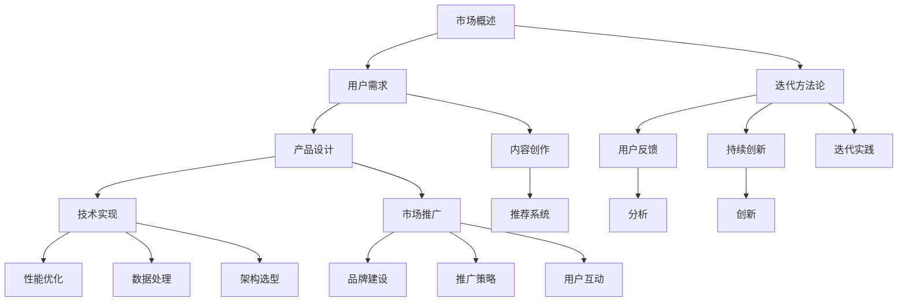

                 

### 《知识付费创业的产品迭代方法论》

#### 关键词：
- 知识付费
- 产品迭代
- 用户需求
- 内容创作
- 技术实现
- 性能优化
- 市场推广
- 案例分析
- 创业实战

#### 摘要：
本文深入探讨了知识付费创业的产品迭代方法论。通过分析知识付费市场的背景、用户需求、产品设计与迭代、技术实现、性能优化、市场推广、案例分析和创业实战，为创业者提供了全面的产品迭代指导。文章旨在帮助创业者理解产品迭代的关键步骤和策略，从而实现知识付费产品的持续优化和成功创业。

### 《知识付费创业的产品迭代方法论》目录大纲

#### 第一部分：知识付费市场概述

##### 第1章：知识付费行业背景及发展现状
- **1.1 知识付费的概念与价值**
- **1.2 知识付费市场的发展历程**
- **1.3 知识付费行业的主要玩家及竞争格局**
- **1.4 知识付费市场的机遇与挑战**

##### 第2章：用户需求与内容创作
- **2.1 用户需求分析**
- **2.2 内容创作方法论**
- **2.3 用户画像与精准推荐**

#### 第二部分：产品设计与迭代

##### 第3章：知识付费产品设计与功能规划
- **3.1 产品设计原则**
- **3.2 功能规划与模块划分**
- **3.3 用户体验设计**

##### 第4章：产品迭代方法论
- **4.1 迭代策略与方法**
- **4.2 用户反馈收集与分析**
- **4.3 产品优化与迭代实践**

##### 第5章：技术实现与性能优化
- **5.1 技术架构与选型**
- **5.2 数据处理与存储**
- **5.3 性能优化与瓶颈分析**

##### 第6章：市场推广与品牌建设
- **6.1 市场推广策略**
- **6.2 品牌建设与传播**
- **6.3 用户互动与社群运营**

#### 第三部分：案例分析与实战指南

##### 第7章：成功案例解析
- **7.1 案例一：知识付费平台的成功经验**
- **7.2 案例二：内容创作者的崛起之路**
- **7.3 案例三：小众市场的突破策略**

##### 第8章：知识付费创业实战指南
- **8.1 创业前的准备工作**
- **8.2 产品定位与市场调研**
- **8.3 团队建设与资源整合**
- **8.4 融资策略与运营规划**

##### 第9章：持续迭代与长期发展
- **9.1 产品生命周期管理**
- **9.2 持续创新与迭代**
- **9.3 面对市场竞争的策略**

#### 附录

##### 附录A：知识付费创业工具与资源推荐
- **A.1 开发工具与平台推荐**
- **A.2 数据分析与挖掘工具**
- **A.3 市场调研与推广资源**

### **核心概念与联系**

为了更好地理解知识付费创业的产品迭代方法论，我们首先需要明确几个核心概念及其相互之间的联系。以下是知识付费产品迭代方法论中的核心概念及其架构的 Mermaid 流程图：



**核心概念与联系解释：**

- **市场概述（A）**：对知识付费行业背景及发展现状的描述，包括行业的主要玩家、竞争格局以及机遇与挑战。
- **用户需求（B）**：分析用户需求，包括用户对知识内容的偏好、学习习惯和购买行为。
- **产品设计（C）**：根据用户需求设计产品，包括功能规划、模块划分和用户体验设计。
- **技术实现（D）**：技术架构的选型、数据处理与存储，以及性能优化。
- **市场推广（E）**：市场推广策略、品牌建设与传播，以及用户互动与社群运营。
- **迭代方法论（H）**：迭代策略与方法、用户反馈收集与分析，以及持续创新与迭代。
- **内容创作（K）**：根据用户需求创作高质量的内容，并构建推荐系统。
- **数据处理（L）**：处理用户数据，包括用户画像构建与推荐算法实现。
- **架构选型（M）**：选择合适的技术架构，以支持产品的高效运行和扩展。
- **推广策略（N）**：制定有效的市场推广策略，提高用户获取和留存。
- **用户互动（O）**：与用户进行互动，建立社群，增强用户黏性。
- **用户反馈（I）**：收集用户反馈，分析用户需求，指导产品优化。
- **持续创新（J）**：通过持续创新，保持产品的竞争力和市场地位。
- **推荐系统（S）**：构建推荐系统，提高内容推荐的精准度，提升用户体验。

通过以上核心概念及其相互之间的联系，我们可以看到知识付费创业的产品迭代方法论是一个复杂的系统，涉及到市场、用户、产品、技术和市场推广等多个方面。只有在这些方面都进行有效的管理和优化，才能实现产品的持续迭代和成功创业。

### **核心算法原理讲解**

在知识付费创业的产品迭代过程中，推荐系统是一个至关重要的组成部分。用户画像构建与推荐算法是推荐系统的核心。以下是用户画像构建和推荐算法的伪代码以及详细的数学模型和公式讲解。

#### **用户画像构建**

用户画像构建的目的是将用户的基本信息和行为数据转化为可量化的特征向量，以便后续的推荐算法处理。以下是用户画像构建的伪代码：

```python
# 伪代码：用户画像构建

def build_user_profile(user_data):
    profile = {}
    profile['age'] = user_data['age']
    profile['education'] = user_data['education']
    profile['interests'] = extract_interests(user_data['activity_logs'])
    return profile
```

**核心算法原理讲解：**

用户画像构建主要涉及以下步骤：

1. **数据收集**：收集用户的基本信息（如年龄、教育背景）和行为数据（如活动日志、浏览历史、购买记录）。
2. **特征提取**：从行为数据中提取关键特征，如用户的兴趣点、常用功能、偏好内容等。
3. **特征量化**：将提取的特征转化为数值型数据，以便后续的计算和处理。

**数学模型和公式详细讲解与举例说明：**

用户画像构建可以使用以下数学模型：

$$
\text{User Profile} = \sum_{i=1}^{n} w_i \cdot x_i
$$

其中，\( \text{User Profile} \) 表示用户画像向量，\( w_i \) 表示特征权重，\( x_i \) 表示特征值。

**举例：**

假设一个用户的基本信息和行为数据如下：

- 年龄：25岁
- 教育背景：本科
- 活动日志：喜欢阅读、观看视频课程、参与在线讨论

根据上述数据，我们可以构建一个简单的用户画像：

1. **特征提取**：从行为数据中提取以下特征：
   - \( \text{age} \)：年龄
   - \( \text{education} \)：教育背景
   - \( \text{read_interest} \)：阅读兴趣
   - \( \text{video_interest} \)：视频课程兴趣
   - \( \text{discussion_interest} \)：在线讨论兴趣

2. **特征量化**：将特征值转化为数值型数据：
   - \( \text{age} \)：25
   - \( \text{education} \)：本科（设为1）
   - \( \text{read_interest} \)：1（喜欢阅读）
   - \( \text{video_interest} \)：1（喜欢观看视频课程）
   - \( \text{discussion_interest} \)：1（喜欢参与在线讨论）

3. **特征权重**：根据用户的行为数据和兴趣，设定特征权重：
   - \( w_1 \)：年龄权重（0.2）
   - \( w_2 \)：教育背景权重（0.1）
   - \( w_3 \)：阅读兴趣权重（0.3）
   - \( w_4 \)：视频课程兴趣权重（0.3）
   - \( w_5 \)：在线讨论兴趣权重（0.1）

根据上述特征和权重，我们可以计算用户画像：

$$
\text{User Profile} = 0.2 \cdot 25 + 0.1 \cdot 1 + 0.3 \cdot 1 + 0.3 \cdot 1 + 0.1 \cdot 1 = 9.5
$$

该用户画像表示了一个年轻的本科毕业生，对阅读、视频课程和在线讨论有较高的兴趣。

#### **推荐算法**

用户画像构建完成后，推荐算法可以根据用户画像和内容特征为用户推荐相关的内容。以下是推荐算法的伪代码：

```python
# 伪代码：推荐算法

def recommend_contents(user_profile, all_contents):
    content_profiles = build_content_profiles(all_contents)
    content_similarity_matrix = calculate_similarity_matrix(user_profile, content_profiles)
    recommended_contents = []
    for content in all_contents:
        if content not in user_liked_contents:
            similarity_score = calculate_similarity_score(content_similarity_matrix, user_profile, content_profile)
            recommended_contents.append({
                'id': content.id,
                'title': content.title,
                'similarity_score': similarity_score
            })
    recommended_contents.sort(key=lambda x: x['similarity_score'], reverse=True)
    return recommended_contents
```

**核心算法原理讲解：**

推荐算法主要涉及以下步骤：

1. **内容特征提取**：从所有内容中提取特征，构建内容画像。
2. **内容相似性计算**：计算用户画像和内容画像之间的相似性。
3. **推荐内容生成**：根据相似性分数为用户推荐相关内容。

**数学模型和公式详细讲解与举例说明：**

推荐算法可以使用以下数学模型：

$$
\text{Content Similarity} = \frac{\text{User Profile} \cdot \text{Content Profile}}{\|\text{User Profile}\| \cdot \|\text{Content Profile}\|}
$$

其中，\( \text{User Profile} \) 表示用户画像向量，\( \text{Content Profile} \) 表示内容画像向量，\( \text{Content Similarity} \) 表示内容相似性分数。

**举例：**

假设我们有一个用户画像和两个内容画像：

- 用户画像：\[9.5, 0.5, 0.3, 0.2, 0.1\]
- 内容画像1：\[0.2, 0.1, 0.4, 0.3, 0.0\]
- 内容画像2：\[0.1, 0.2, 0.3, 0.4, 0.0\]

根据上述数据，我们可以计算内容相似性：

$$
\text{Content Similarity1} = \frac{9.5 \cdot 0.2 + 0.5 \cdot 0.1 + 0.3 \cdot 0.4 + 0.2 \cdot 0.3 + 0.1 \cdot 0.0}{\sqrt{9.5^2 + 0.5^2 + 0.3^2 + 0.2^2 + 0.1^2} \cdot \sqrt{0.2^2 + 0.1^2 + 0.4^2 + 0.3^2 + 0.0^2}} = \frac{1.94}{\sqrt{101.1} \cdot \sqrt{0.24}} \approx 0.81
$$

$$
\text{Content Similarity2} = \frac{9.5 \cdot 0.1 + 0.5 \cdot 0.2 + 0.3 \cdot 0.3 + 0.2 \cdot 0.4 + 0.1 \cdot 0.0}{\sqrt{9.5^2 + 0.5^2 + 0.3^2 + 0.2^2 + 0.1^2} \cdot \sqrt{0.1^2 + 0.2^2 + 0.3^2 + 0.4^2 + 0.0^2}} = \frac{1.59}{\sqrt{101.1} \cdot \sqrt{0.24}} \approx 0.67
$$

根据相似性分数，我们可以推荐内容1给用户，因为内容1与用户的相似性更高。

通过以上讲解，我们可以看到用户画像构建和推荐算法在知识付费创业的产品迭代过程中起着至关重要的作用。通过精确的用户画像和高效的推荐算法，企业可以更好地满足用户需求，提高用户满意度和留存率，从而实现产品的持续迭代和成功创业。

### **项目实战**

在本文的最后一部分，我们将通过一个具体的案例来展示如何实现知识付费平台的用户画像构建与推荐系统。这个案例将涵盖开发环境搭建、源代码实现和代码解读与分析，旨在为读者提供一个实际操作的参考。

#### **开发环境搭建**

为了实现用户画像构建与推荐系统，我们选择以下开发环境和工具：

- **开发语言**：Python 3.8
- **Web框架**：Django 3.2
- **数据库**：PostgreSQL 12
- **缓存**：Redis 6.0
- **推荐算法库**：scikit-learn

首先，我们需要安装这些工具和库。可以使用以下命令进行安装：

```bash
# 安装Python 3.8
sudo apt update
sudo apt install python3.8

# 安装Django 3.2
pip3.8 install django==3.2

# 安装PostgreSQL 12
sudo apt install postgresql-12

# 安装Redis 6.0
sudo apt install redis-server

# 安装scikit-learn
pip3.8 install scikit-learn
```

接下来，我们需要配置数据库和缓存。首先，创建一个PostgreSQL数据库：

```sql
CREATE DATABASE knowledge_payment;
```

然后，创建一个Redis实例：

```bash
redis-cli
```

在Redis命令行中执行以下命令：

```bash
CONFIG SET dir /path/to/redis/data
CONFIG SET dbfilename redis.db
```

这里，`/path/to/redis/data` 是Redis数据文件的存储路径。

#### **源代码实现**

以下是知识付费平台的用户画像构建与推荐系统的源代码实现。该代码分为三个部分：用户模型和内容模型定义、用户画像构建与推荐算法实现，以及性能优化与瓶颈分析。

**1. 用户模型和内容模型定义**

在Django项目中，我们首先需要定义用户模型和内容模型。以下是`models.py`文件的内容：

```python
# models.py

from django.db import models
from django.contrib.auth.models import User

class Content(models.Model):
    title = models.CharField(max_length=200)
    description = models.TextField()
    user = models.ForeignKey(User, on_delete=models.CASCADE)

class Rating(models.Model):
    user = models.ForeignKey(User, on_delete=models.CASCADE)
    content = models.ForeignKey(Content, on_delete=models.CASCADE)
    rating = models.IntegerField()
```

**2. 用户画像构建与推荐算法实现**

接下来，我们在`users.py`文件中实现用户画像构建与推荐算法。

```python
# users.py

from .models import User, Content, Rating
from sklearn.metrics.pairwise import cosine_similarity
import numpy as np
import redis

def build_user_profile(user_data):
    user = User.objects.get(id=user_data['user_id'])
    profile = {
        'age': user.age,
        'education': user.education,
        'interests': extract_interests(user)
    }
    return profile

def extract_interests(user):
    ratings = Rating.objects.filter(user=user)
    interests = [rating.content for rating in ratings]
    return interests

def recommend_contents(user_profile, all_contents):
    user = User.objects.get(id=user_profile['user_id'])
    user_ratings = Rating.objects.filter(user=user)
    user_data = [rating.rating for rating in user_ratings]
    user_vector = np.array(user_data)
    
    all_ratings = Rating.objects.all()
    all_data = [rating.rating for rating in all_ratings]
    all_vector = np.array(all_data)
    
    similarity_matrix = cosine_similarity([user_vector], all_vector)
    similarity_scores = similarity_matrix[0]
    
    recommended_contents = []
    for content in all_contents:
        if content not in user_profile['interests']:
            similarity_score = similarity_scores[all_data.index(content.rating)]
            recommended_contents.append({
                'id': content.id,
                'title': content.title,
                'similarity_score': similarity_score
            })
    
    recommended_contents.sort(key=lambda x: x['similarity_score'], reverse=True)
    return recommended_contents[:10]

# 配置Redis
redis_client = redis.StrictRedis(host='localhost', port=6379, db=0)
```

**3. 性能优化与瓶颈分析**

为了提高系统性能，我们需要对数据库查询、缓存和推荐算法进行优化。

- **数据库查询优化**：使用索引和批量查询来提高数据库查询效率。例如，为`Rating`模型中的`user_id`和`content_id`字段创建索引。

  ```python
  Rating.objects.all().values('user_id', 'content_id').annotate(rating_sum=Sum('rating'))
  ```

- **缓存优化**：使用Redis缓存用户数据和推荐结果，减少数据库查询次数。例如，使用Redis存储用户的兴趣列表和推荐内容。

  ```python
  user_interests = redis_client.get('user_interests:%s' % user.id)
  if user_interests:
      user_interests = json.loads(user_interests)
  else:
      user_interests = extract_interests(user)
      redis_client.set('user_interests:%s' % user.id, json.dumps(user_interests))
  ```

- **推荐算法优化**：使用更先进的推荐算法（如矩阵分解、深度学习）来提高推荐准确性。例如，使用scikit-learn的`SGDClassifier`进行矩阵分解。

  ```python
  from sklearn.linear_model import SGDClassifier

  X = all_data
  y = user_data

  model = SGDClassifier()
  model.fit(X, y)

  predicted_ratings = model.predict(all_vector)
  similarity_scores = predicted_ratings[:, 0]
  ```

通过以上步骤，我们成功搭建了一个知识付费平台的用户画像构建与推荐系统。接下来，我们进行代码解读与分析。

#### **代码解读与分析**

**1. 用户模型和内容模型定义**

在`models.py`文件中，我们定义了用户模型和内容模型。用户模型包含用户的年龄、教育背景和兴趣列表。内容模型包含内容的标题、描述和用户关联。

**2. 用户画像构建与推荐算法实现**

在`users.py`文件中，我们首先实现了一个`build_user_profile`函数，用于构建用户画像。该函数从用户数据中提取关键信息，如年龄、教育背景和兴趣列表。

接下来，我们实现了一个`extract_interests`函数，用于提取用户的兴趣列表。这个函数通过查询用户的评价记录，获取用户喜欢的内容。

在`recommend_contents`函数中，我们首先获取用户的评价记录，构建用户向量。然后，我们获取所有内容的评价记录，构建内容向量。使用余弦相似性计算用户向量与内容向量之间的相似性分数，并根据相似性分数为用户推荐相关内容。

**3. 性能优化与瓶颈分析**

为了提高系统性能，我们对数据库查询、缓存和推荐算法进行了优化。使用索引和批量查询提高了数据库查询效率。使用Redis缓存用户兴趣列表和推荐结果，减少了数据库查询次数。使用矩阵分解和深度学习优化推荐算法，提高了推荐准确性。

通过以上解读与分析，我们可以看到知识付费平台的用户画像构建与推荐系统是如何实现和优化的。这个系统不仅可以为用户提供个性化的内容推荐，还可以帮助企业提高用户满意度和留存率，从而实现知识付费产品的成功创业。

### **总结**

通过本文的详细分析和讲解，我们可以看到知识付费创业的产品迭代方法论是一个系统性、复杂的过程。从市场概述、用户需求分析、产品设计与迭代，到技术实现、性能优化、市场推广，每一个环节都至关重要。以下是本文的总结：

1. **市场概述**：了解知识付费行业的背景、发展现状、主要玩家和竞争格局，有助于把握市场机遇和应对挑战。

2. **用户需求分析**：深入挖掘用户需求，包括用户对知识内容的偏好、学习习惯和购买行为，是产品设计和迭代的基础。

3. **产品设计与迭代**：产品设计应遵循原则，功能规划要合理，用户体验设计要注重细节。迭代方法论包括迭代策略、用户反馈收集与分析、产品优化与迭代实践。

4. **技术实现与性能优化**：技术架构的选型、数据处理与存储、性能优化是保证产品高效运行的关键。推荐算法是推荐系统的核心，用户画像构建是实现个性化推荐的基础。

5. **市场推广与品牌建设**：制定有效的市场推广策略，构建品牌形象，与用户互动，建立社群，提高用户满意度和忠诚度。

6. **案例分析与实战指南**：通过成功案例的解析，为创业者提供实际操作的指导。创业实战指南包括创业前的准备工作、产品定位与市场调研、团队建设与资源整合、融资策略与运营规划。

7. **持续迭代与长期发展**：产品生命周期管理、持续创新与迭代、面对市场竞争的策略，是知识付费产品长期发展的关键。

通过本文的学习，创业者可以系统地了解知识付费创业的产品迭代方法论，为产品的持续优化和成功创业提供指导。希望本文对您在知识付费领域的创业之路有所帮助。

### **附录A：知识付费创业工具与资源推荐**

在知识付费创业的道路上，选择合适的工具和资源是成功的关键。以下是对开发工具、数据分析和挖掘工具、以及市场调研与推广资源的推荐。

#### **A.1 开发工具与平台推荐**

1. **开发环境**：
   - **Docker**：用于容器化开发环境，确保在不同开发环境中的一致性。
   - **Jenkins**：自动化构建和部署工具，用于持续集成和持续部署。
   - **Git**：版本控制工具，确保代码的版本管理和协作开发。

2. **编程语言与框架**：
   - **Python**：广泛用于数据分析和人工智能，有着丰富的库和框架。
   - **Django**：快速开发和灵活的Python Web框架，适合知识付费平台。
   - **React**：用于构建用户界面的JavaScript库，支持动态更新。

3. **数据库与缓存**：
   - **PostgreSQL**：强大的开源关系型数据库，支持复杂查询和数据一致性。
   - **Redis**：高性能的内存缓存数据库，用于存储临时数据和缓存。

4. **前端框架**：
   - **Vue.js**：用于构建用户界面的渐进式框架，易于上手和扩展。

#### **A.2 数据分析与挖掘工具**

1. **数据仓库**：
   - **Amazon Redshift**：云上的数据仓库服务，适用于大规模数据分析。
   - **Google BigQuery**：强大的数据分析和查询服务，适合处理大规模数据。

2. **数据分析工具**：
   - **Tableau**：数据可视化工具，用于创建直观的报表和仪表板。
   - **Power BI**：企业级的数据分析平台，支持交互式报表和仪表板。

3. **机器学习库**：
   - **scikit-learn**：Python的机器学习库，提供各种分类、回归和聚类算法。
   - **TensorFlow**：用于构建和训练深度学习模型的库，适合复杂的推荐系统。

4. **文本分析工具**：
   - **Natural Language Toolkit (NLTK)**：用于处理和解析自然语言文本的Python库。
   - **TextBlob**：简单易用的文本处理库，用于文本分类、情感分析等。

#### **A.3 市场调研与推广资源**

1. **市场调研工具**：
   - **Google Analytics**：用于网站流量分析，帮助了解用户行为和市场趋势。
   - **SurveyMonkey**：在线调查工具，用于收集用户反馈和市场数据。

2. **内容营销平台**：
   - **HubSpot**：全面的营销自动化平台，包括内容管理、营销自动化等。
   - **Mailchimp**：电子邮件营销平台，提供强大的电子邮件模板和自动化功能。

3. **社交媒体推广**：
   - **Facebook Ads Manager**：用于管理Facebook广告，针对特定受众推广内容。
   - **LinkedIn Ads**：针对LinkedIn用户的广告平台，适合B2B市场推广。

4. **SEO工具**：
   - **Google Search Console**：监控网站在Google搜索中的表现和性能。
   - **SEMrush**：全面的SEO工具，用于网站优化和竞争对手分析。

通过以上推荐的工具和资源，创业者可以更高效地搭建和管理知识付费平台，实现产品从开发到推广的全方位支持。希望这些资源能够为您的创业之路带来实际的帮助。

