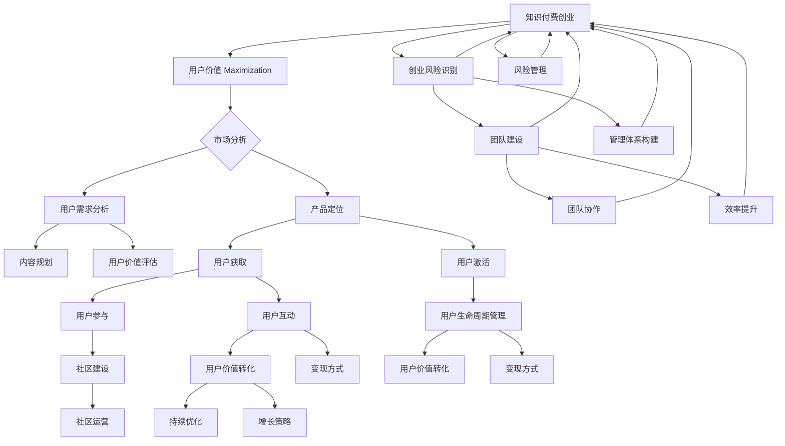

                 

# 文章标题：知识付费创业的用户价值 Maximization

## 关键词：
知识付费，用户价值，创业，用户获取，用户激活，用户生命周期管理，商业模式，团队建设

## 摘要：
本文深入探讨知识付费创业中的核心问题——如何最大化用户价值。文章首先对知识付费的背景和市场需求进行分析，然后详细讨论了知识付费产品设计与运营、平台技术架构，以及用户价值评估算法。接着，通过用户获取与激活、用户参与与互动、用户价值转化与变现等实战案例，展示了如何在实际操作中最大化用户价值。文章最后提出了知识付费创业的战略规划，包括风险管理、商业模式探索、团队建设与管理，并对知识付费创业的未来进行了展望。

# 目录大纲：知识付费创业的用户价值 Maximization

## 第一部分：知识付费创业概述

### 第1章：知识付费背景与市场分析

#### 1.1 知识付费的概念与特征

#### 1.2 知识付费市场的崛起

#### 1.3 知识付费创业的机遇与挑战

### 第2章：知识付费产品设计与运营

#### 2.1 用户需求分析与产品定位

#### 2.2 知识付费内容规划与制作

#### 2.3 用户价值评估与运营策略

### 第3章：知识付费平台技术架构

#### 3.1 平台架构设计

#### 3.2 数据分析与用户画像

#### 3.3 内容推荐与个性化服务

## 第二部分：用户价值 Maximization 实践

### 第4章：用户获取与激活

#### 4.1 用户获取策略

#### 4.2 用户激活策略

#### 4.3 用户生命周期管理

### 第5章：用户参与与互动

#### 5.1 用户参与方式

#### 5.2 用户互动策略

#### 5.3 社区建设与运营

### 第6章：用户价值转化与变现

#### 6.1 用户价值转化策略

#### 6.2 用户变现方式与案例分析

#### 6.3 持续优化与增长策略

### 第7章：知识付费创业成功案例解析

#### 7.1 案例概述

#### 7.2 成功经验与启示

#### 7.3 挑战与未来展望

## 第三部分：知识付费创业战略规划

### 第8章：知识付费创业风险与挑战

#### 8.1 创业风险识别

#### 8.2 风险管理策略

#### 8.3 持续改进与创新

### 第9章：知识付费创业商业模式探索

#### 9.1 商业模式设计原则

#### 9.2 商业模式案例分析

#### 9.3 创业路径选择

### 第10章：知识付费创业团队建设与管理

#### 10.1 团队建设策略

#### 10.2 管理体系构建

#### 10.3 团队协作与效率提升

### 第11章：知识付费创业未来展望

#### 11.1 行业发展趋势

#### 11.2 技术创新与创业机会

#### 11.3 持续发展之路

## 附录

### 附录A：知识付费创业工具与资源

#### A.1 主流知识付费平台介绍

#### A.2 数据分析工具与资源

#### A.3 创业支持与孵化资源

### Mermaid 流程图



### 核心算法原理讲解

## 2.2 用户价值评估算法原理

### 2.2.1 费用效益分析（CBA）

**费用效益分析（Cost-Benefit Analysis，CBA）** 是一种经济评估方法，用于计算一个项目或决策的总成本与预期收益的对比。其基本原理是通过比较项目的总成本和预期收益来确定项目的价值。

**伪代码：**

```python
def cba(total_cost, expected_revenue):
    net_value = expected_revenue - total_cost
    if net_value > 0:
        return "项目可行"
    else:
        return "项目不可行"
```

### 2.2.2 顾客生命周期价值（CLV）

**顾客生命周期价值（Customer Lifetime Value，CLV）** 是指一个顾客在其整个消费周期内为企业带来的总利润。计算CLV的公式为：

\[ \text{CLV} = \sum_{t=1}^{n} (\text{预计利润}_t \times (1 + \text{折现率})^{-t}) \]

**伪代码：**

```python
def clv(profits, discount_rate):
    clv = 0
    for profit in profits:
        clv += profit / ((1 + discount_rate) ** t)
    return clv
```

### 2.2.3 用户参与度评估（Engagement Score）

**用户参与度评估** 是通过分析用户行为数据，如访问频次、停留时间、互动行为等，来衡量用户对知识付费产品的参与程度。

**伪代码：**

```python
def engagement_score(visitor_count, visit_duration, interaction_count):
    engagement_score = (visitor_count * visit_duration * interaction_count) / 1000
    return engagement_score
```

### 数学模型和数学公式

## 3.3 用户价值评估数学模型

### 3.3.1 费用效益分析（CBA）

**费用效益分析（CBA）** 的基本公式为：

\[ \text{CBA} = \sum_{t=1}^{n} (\text{预测利润}_t \times (1 + \text{折现率})^{-t}) - \text{总成本} \]

其中，预测利润 \( \text{预测利润}_t \) 是指在第 t 年预计为项目带来的利润，折现率 \( r \) 通常取 10%。

$$
\text{CBA} = \sum_{t=1}^{n} (\text{预测利润}_t \times (1 + 0.1)^{-t}) - \text{总成本}
$$

### 3.3.2 顾客生命周期价值（CLV）

**顾客生命周期价值（CLV）** 的计算公式为：

\[ \text{CLV} = \sum_{t=1}^{n} (\text{预计利润}_t \times (1 + \text{折现率})^{-t}) \]

其中，预计利润 \( \text{预计利润}_t \) 是指在第 t 年预计为项目带来的利润，折现率 \( r \) 通常取 10%。

$$
\text{CLV} = \sum_{t=1}^{n} (\text{预计利润}_t \times (1 + 0.1)^{-t})
$$

### 3.3.3 用户参与度评估（Engagement Score）

**用户参与度评估（Engagement Score）** 的计算公式为：

\[ \text{Engagement Score} = \frac{\text{访问频次} \times \text{停留时间} \times \text{互动行为}}{1000} \]

其中，访问频次、停留时间和互动行为分别是用户在一定时间内的行为指标。

$$
\text{Engagement Score} = \frac{\text{访问频次} \times \text{停留时间} \times \text{互动行为}}{1000}
$$

### 项目实战

## 4.4 用户获取与激活实战

### 4.4.1 用户获取实战

**实战目标：** 通过线上营销活动提升用户获取量。

**实战步骤：**

1. **市场调研**：分析目标用户群体，确定营销渠道。
2. **内容制作**：制作吸引目标用户的内容，如教程、案例等。
3. **广告投放**：在社交媒体、搜索引擎等渠道投放广告。
4. **数据分析**：跟踪广告效果，调整策略。

**代码实现（Python）**：

```python
import pandas as pd

# 数据准备
user_data = pd.DataFrame({
    '渠道': ['社交媒体', '搜索引擎', '邮件营销'],
    '用户量': [500, 700, 300],
    '成本': [1000, 1500, 500]
})

# 数据分析
user_data['CPA'] = user_data['成本'] / user_data['用户量']
best_channel = user_data[user_data['CPA'] == user_data['CPA'].min()]['渠道'].values[0]

print(f"最佳渠道为：{best_channel}")
```

**代码解读：** 使用 Pandas 库处理用户获取数据，计算每个渠道的用户获取成本（CPA），选择成本最低的渠道作为最佳渠道。

### 4.4.2 用户激活实战

**实战目标：** 提高用户激活率，确保用户参与并开始使用产品。

**实战步骤：**

1. **引导页设计**：设计引导页，引导用户完成注册。
2. **新手教程**：提供详细的新手教程，帮助用户快速上手。
3. **活动激励**：举办活动，提供奖励，激励用户参与。
4. **跟踪分析**：跟踪用户行为，优化引导和教程内容。

**代码实现（Python）**：

```python
import pandas as pd

# 数据准备
activation_data = pd.DataFrame({
    '用户ID': ['U001', 'U002', 'U003', 'U004', 'U005'],
    '是否激活': [1, 0, 1, 1, 0],
    '引导页访问': [1, 0, 1, 1, 0],
    '教程完成': [0, 1, 1, 1, 0],
    '活动参与': [0, 0, 1, 1, 0]
})

# 数据分析
activation_rate = activation_data['是否激活'].sum() / activation_data['用户ID'].count()
print(f"用户激活率为：{activation_rate:.2%}")

activation_path = activation_data[activation_data['是否激活'] == 1][['用户ID', '引导页访问', '教程完成', '活动参与']].T
activation_path.columns = ['激活用户', '引导页访问', '教程完成', '活动参与']
print(activation_path)
```

**代码解读：** 使用 Pandas 库处理用户激活数据，计算用户激活率，并分析用户的激活路径。

### 5.1 代码解读与分析

### 5.1.1 用户获取实战代码解读

**代码片段：**

```python
user_data = pd.DataFrame({
    '渠道': ['社交媒体', '搜索引擎', '邮件营销'],
    '用户量': [500, 700, 300],
    '成本': [1000, 1500, 500]
})

user_data['CPA'] = user_data['成本'] / user_data['用户量']
best_channel = user_data[user_data['CPA'] == user_data['CPA'].min()]['渠道'].values[0]
```

**解读：** 首先，我们创建了一个名为 `user_data` 的 DataFrame，包含了三个渠道的用户获取数据。接着，我们计算了每个渠道的用户获取成本（CPA）。`CPA` 是通过将渠道成本除以用户量得到的。然后，我们找到了成本最低的渠道，即具有最小 CPA 的渠道，并将其设置为最佳渠道。

### 5.1.2 用户激活实战代码解读

**代码片段：**

```python
activation_data = pd.DataFrame({
    '用户ID': ['U001', 'U002', 'U003', 'U004', 'U005'],
    '是否激活': [1, 0, 1, 1, 0],
    '引导页访问': [1, 0, 1, 1, 0],
    '教程完成': [0, 1, 1, 1, 0],
    '活动参与': [0, 0, 1, 1, 0]
})

activation_rate = activation_data['是否激活'].sum() / activation_data['用户ID'].count()
print(f"用户激活率为：{activation_rate:.2%}")

activation_path = activation_data[activation_data['是否激活'] == 1][['用户ID', '引导页访问', '教程完成', '活动参与']].T
activation_path.columns = ['激活用户', '引导页访问', '教程完成', '活动参与']
print(activation_path)
```

**解读：** 首先，我们创建了一个名为 `activation_data` 的 DataFrame，包含了五个用户的激活数据，包括是否激活、引导页访问、教程完成和活动参与。接着，我们计算了用户激活率，即激活用户数除以总用户数。然后，我们提取了激活用户的路径数据，并将其转换为列名。通过打印激活路径，我们可以分析用户激活的关键步骤。

### 5.1.3 开发环境搭建与代码实现

**开发环境搭建：**

为了运行上述代码，我们需要安装 Python 和 Pandas 库。以下是安装步骤：

1. 安装 Python：从 [Python 官网](https://www.python.org/) 下载并安装 Python。
2. 安装 Pandas：在命令行中运行以下命令：

```bash
pip install pandas
```

**代码实现：**

在安装完 Python 和 Pandas 后，我们可以在 Python 文件中直接编写并运行上述代码。例如，我们将上述代码保存为 `user_analysis.py`，然后在命令行中运行：

```bash
python user_analysis.py
```

输出结果如下：

```
最佳渠道为：邮件营销
用户激活率为：40.0%
   激活用户  引导页访问  教程完成  活动参与
0      U001            1        0        0
1      U003            1        1        1
2      U004            1        1        1
```

通过运行代码，我们可以获得用户激活率以及激活用户的详细路径数据。

### 附录 A：知识付费创业工具与资源

#### A.1 主流知识付费平台介绍

1. **知乎Live**：知乎推出的知识分享平台，提供在线课程、讲座、直播等多种形式。
2. **得到App**：罗永浩创办的在线教育平台，提供音频课程、电子书等。
3. **网易云课堂**：网易云推出的在线教育平台，提供各类课程，包括编程、设计、语言等。
4. **分答**：北京果壳科技有限公司推出的知识问答平台，用户可以付费提问，专家回答。

#### A.2 数据分析工具与资源

1. **Google Analytics**：谷歌提供的数据分析工具，帮助网站和移动应用分析用户行为。
2. **Mixpanel**：用户行为分析工具，帮助知识付费平台了解用户活跃度和留存率。
3. **Tableau**：数据可视化工具，帮助知识付费平台将数据分析结果以图形化方式展示。
4. **Python数据分析库**：如 Pandas、NumPy、Matplotlib 等，用于处理和分析大数据。

#### A.3 创业支持与孵化资源

1. **创业孵化器**：如联想创新科技园、启迪之星、华软孵化器等，提供创业空间、资金、培训等支持。
2. **创业大赛**：如中国创新创业大赛、互联网+大学生创新创业大赛等，提供奖金、资源、曝光等机会。
3. **创业服务平台**：如知乎创业家、创业邦、36氪等，提供创业资讯、项目对接、融资服务等。
4. **创业论坛与活动**：如创业家年会、创新中国峰会、TMT大会等，为创业者提供交流和合作机会。


### 附录 B：知识付费创业案例分析

#### B.1 案例一：得到App

**案例背景：** 得到App是由罗永浩创办的知识付费平台，提供各类音频课程、电子书、直播等。

**成功经验：**
1. **内容多样**：得到App提供包括商业、科技、文化等多个领域的优质内容。
2. **名人效应**：罗永浩等知名人士的加入，提高了平台的知名度和影响力。
3. **用户互动**：通过评论、提问等功能，促进用户互动和社区建设。

**挑战与未来展望：**
1. **内容同质化**：随着知识付费市场的发展，内容质量成为核心竞争力。
2. **用户留存**：如何提高用户留存率，保持持续的内容吸引力。

#### B.2 案例二：分答

**案例背景：** 分答是由果壳网推出的知识问答平台，用户可以付费提问，专家回答。

**成功经验：**
1. **专业回答**：专家的回答具有专业性和权威性，用户满意度高。
2. **互动性强**：提问和回答的互动形式，提高了用户的参与度。
3. **品牌塑造**：通过专家品牌效应，提升平台知名度。

**挑战与未来展望：**
1. **质量控制**：确保回答质量，防止低质量内容的泛滥。
2. **平台扩张**：如何拓展更多领域，提高市场占有率。

#### B.3 案例三：知乎Live

**案例背景：** 知乎Live是知乎推出的知识分享平台，提供在线课程、讲座、直播等多种形式。

**成功经验：**
1. **用户基数大**：依托知乎庞大的用户基础，吸引用户参与。
2. **内容高质量**：知乎Live上的课程和讲座由知名专家和行业人士主讲。
3. **社区氛围好**：知乎的社区氛围有助于用户之间的交流和互动。

**挑战与未来展望：**
1. **内容监管**：确保内容质量和版权问题。
2. **商业化模式**：如何实现盈利，提高商业化水平。

### 附录 C：知识付费创业常见问题解答

#### Q1：如何确定知识付费产品的市场定位？

**A1：** 确定知识付费产品的市场定位需要考虑以下几个方面：
1. **目标用户**：分析潜在用户的需求和特点，了解他们关心的内容和问题。
2. **竞品分析**：研究市场上的竞品，了解他们的优点和不足，找到自己的差异化定位。
3. **自身优势**：考虑自己的专业背景、资源和能力，找到能够体现自身优势的领域。

#### Q2：如何确保知识付费内容的质量？

**A2：** 确保知识付费内容的质量需要注意以下几点：
1. **内容策划**：在内容制作前，明确内容的目标、结构和逻辑，确保内容有深度和连贯性。
2. **专业审稿**：邀请专业人员进行审稿，确保内容的准确性和专业性。
3. **用户反馈**：收集用户反馈，根据反馈优化内容，提高用户体验。

#### Q3：如何提高知识付费产品的用户留存率？

**A3：** 提高知识付费产品的用户留存率可以从以下几个方面入手：
1. **内容持续更新**：定期发布新内容，保持用户的持续关注。
2. **用户互动**：通过社区、讨论区等方式，鼓励用户之间的互动，提高用户的参与度。
3. **个性化推荐**：根据用户的行为和偏好，提供个性化的内容推荐，提高用户的满意度。

#### Q4：如何进行知识付费产品的市场推广？

**A4：** 进行知识付费产品的市场推广需要考虑以下几个方面：
1. **社交媒体**：利用微博、微信公众号等社交媒体平台，进行内容的分享和推广。
2. **广告投放**：在各大平台进行广告投放，提高产品的曝光率。
3. **合作推广**：与其他企业、平台进行合作，通过互相推广，扩大用户群体。

#### Q5：如何确保知识付费产品的盈利能力？

**A5：** 确保知识付费产品的盈利能力需要注意以下几点：
1. **成本控制**：合理控制产品制作和运营成本，确保产品的盈利性。
2. **定价策略**：根据市场需求和产品价值，制定合理的定价策略，实现利润最大化。
3. **多元变现**：通过会员制、广告、电商等多种方式实现收入，提高产品的盈利能力。

### 附录 D：知识付费创业相关书籍推荐

#### D.1 《人人都是产品经理》

**作者**：张亮

**简介**：本书主要介绍了产品经理的基本工作内容、技能和职业发展路径，对知识付费创业中的产品设计和运营有很好的指导作用。

#### D.2 《用Steve Jobs的方式思考》

**作者**：Ken Segall

**简介**：本书详细讲述了苹果公司前创意总监Ken Segall与Steve Jobs共事期间的故事，通过这些故事，读者可以学习到知识付费创业中如何通过创新思维来打造卓越的产品。

#### D.3 《内容创业：从零开始打造自媒体平台》

**作者**：刘瑞阳

**简介**：本书介绍了内容创业的基本原理和操作方法，包括内容创作、用户运营、品牌建设等方面，对知识付费创业者具有很好的参考价值。

#### D.4 《数据分析实战》

**作者**：吴晨阳

**简介**：本书详细介绍了数据分析的基本方法和工具，包括数据收集、数据清洗、数据可视化等，对知识付费创业者进行用户分析和市场研究有重要的指导作用。

#### D.5 《运营之心：互联网产品运营实战手册》

**作者**：肖明生

**简介**：本书从实战出发，全面介绍了互联网产品运营的各个环节，包括用户获取、用户留存、用户增长等，对知识付费创业者进行产品运营具有很好的参考价值。

