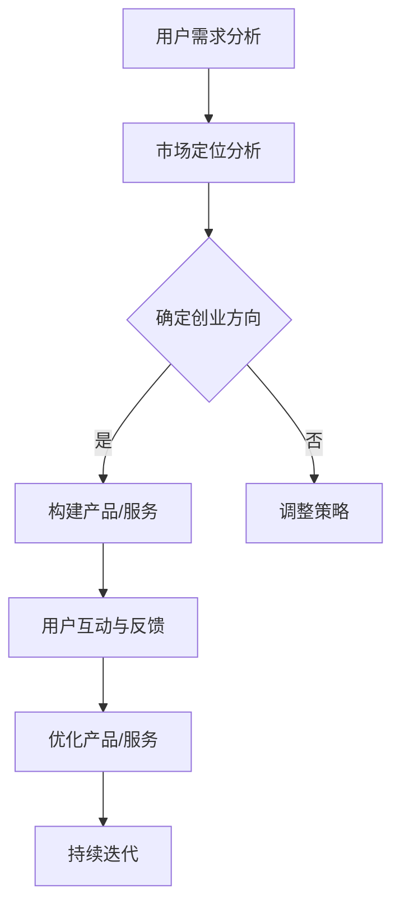
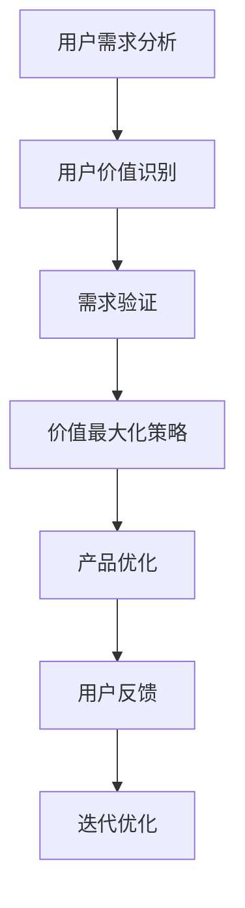
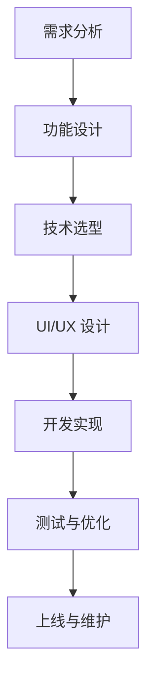
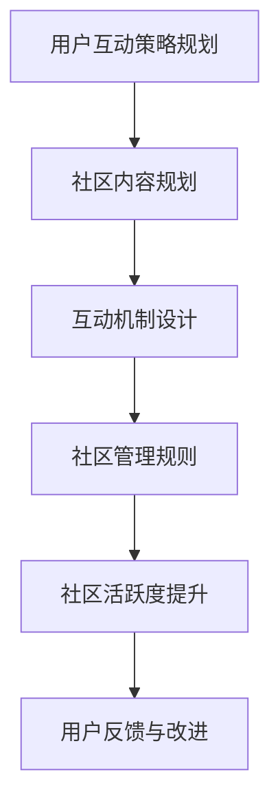
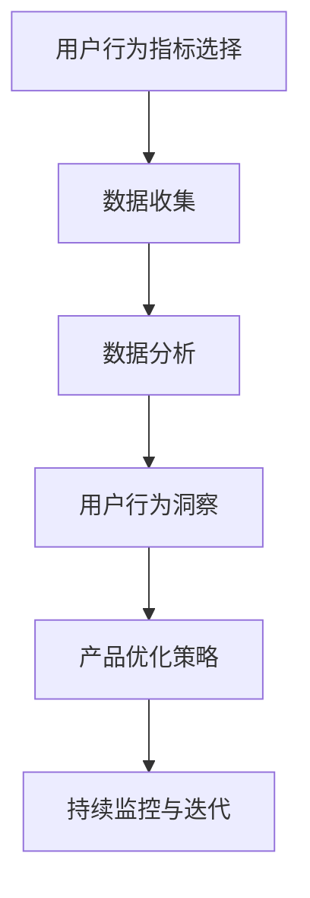
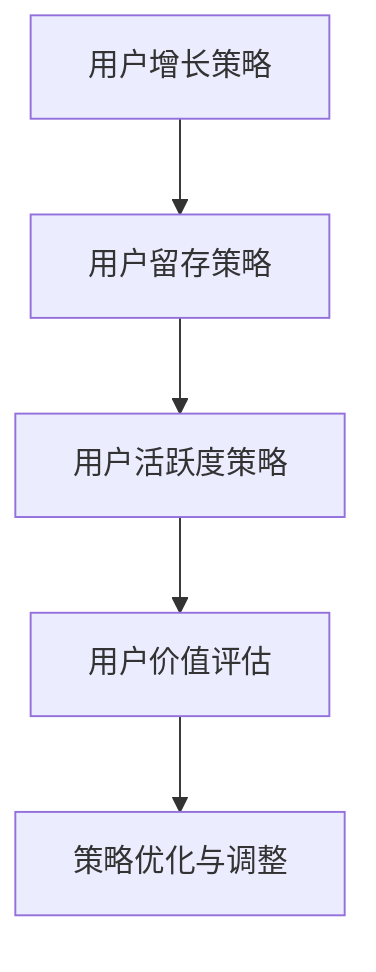
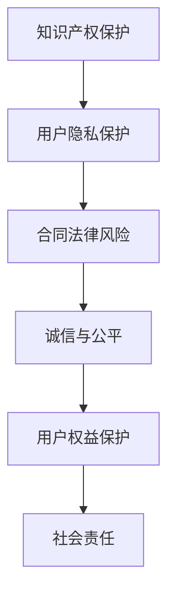

                 

# 知识付费创业的用户价值最大化

> 关键词：知识付费、用户价值、创业、数据分析、运营策略、社区建设

> 摘要：本文将探讨知识付费创业中的用户价值最大化问题，通过深入分析用户价值的构成、识别与最大化策略，以及知识付费产品的设计与开发、用户互动与社区建设等多个方面，旨在为创业者提供有价值的指导与启示。

## 第一部分：引言与概述

### 第1章：知识付费创业概述

#### 1.1 知识付费创业的背景与发展

**1.1.1 知识付费的定义**

知识付费是指用户为了获取特定的知识、技能或信息，向提供者支付一定费用的一种商业模式。这种模式在互联网时代得到了快速发展，主要表现在以下几个方面：

1. 线上教育平台的兴起，如 Coursera、Udemy、edX 等，提供了大量高质量的在线课程。
2. 知识分享平台的涌现，如知乎、分答、喜马拉雅等，为用户提供专家问答、音频课程等服务。
3. 专业咨询、培训机构的线上服务，为个人和企业提供定制化的知识服务。

**1.1.2 知识付费的发展历程**

知识付费的发展可以分为以下几个阶段：

1. 2005 年以前，主要是线下培训、讲座等形式。
2. 2005-2010 年，线上教育平台初步兴起，用户开始接受在线学习。
3. 2010-2015 年，知识分享平台崛起，用户需求逐渐多样化。
4. 2015 年至今，知识付费市场进入高速发展阶段，涵盖了多个领域和形式。

**1.1.3 知识付费创业的优势与挑战**

知识付费创业具有以下优势：

1. 市场潜力大：随着人们对知识、技能的需求不断增加，知识付费市场具有巨大的发展空间。
2. 门槛较低：相比其他行业，知识付费创业的门槛较低，创业者可以利用互联网平台快速起步。
3. 效率提升：通过线上服务，创业者可以高效地传播知识，降低时间和空间的限制。

然而，知识付费创业也面临一些挑战：

1. 内容同质化：市场上存在大量相似的知识产品，创业者需要打造差异化优势。
2. 用户忠诚度低：知识付费产品的生命周期相对较短，用户容易流失。
3. 法律和伦理问题：知识产权保护、用户隐私保护等法律问题需要妥善处理。

#### 1.2 知识付费创业的核心概念

**1.2.1 用户价值的定义与构成**

用户价值是指用户在消费知识付费产品时所获得的有用性、满意度、忠诚度等方面的感受。用户价值的构成包括以下几个要素：

1. 有用性：用户认为知识付费产品提供了有价值的信息和技能。
2. 满意度：用户对知识付费产品的整体评价和体验。
3. 忠诚度：用户对知识付费产品的持续使用和推荐意愿。

**1.2.2 用户需求的识别与满足**

用户需求的识别是知识付费创业的关键环节。创业者需要通过以下方法识别用户需求：

1. 用户访谈：直接与用户交流，了解他们的需求和痛点。
2. 用户调查：通过问卷调查等方式，收集用户反馈。
3. 用户行为数据分析：分析用户在平台上的行为，挖掘潜在需求。

满足用户需求的关键在于提供有价值、高质量的知识产品，同时注重用户体验和互动。

**1.2.3 用户互动与反馈机制**

用户互动与反馈机制是知识付费创业的重要组成部分。通过用户互动，创业者可以：

1. 增强用户粘性：提高用户在平台上的活跃度和参与度。
2. 收集用户反馈：了解用户对知识产品的评价和改进建议。
3. 优化产品和服务：根据用户反馈，不断调整和优化产品。

#### 1.3 知识付费创业的市场分析

**1.3.1 目标市场定位**

知识付费创业需要明确目标市场，根据用户特征和需求，进行市场细分。例如，可以针对职场人士、学生、创业者等不同群体，提供定制化的知识服务。

**1.3.2 竞争对手分析**

了解竞争对手是知识付费创业的重要环节。创业者需要分析竞争对手的产品、市场定位、用户评价等方面，找到自身的竞争优势。

**1.3.3 行业趋势与机会**

知识付费行业正处于快速发展阶段，创业者需要关注行业趋势和机会：

1. 新兴领域：如人工智能、区块链、虚拟现实等领域的知识付费需求日益增长。
2. 个性化推荐：通过数据分析，实现个性化推荐，提高用户满意度。
3. 线下场景：结合线下活动，提供线下知识付费服务。

#### 1.4 本书结构与目标

**1.4.1 目录结构概述**

本书分为八个部分，涵盖了知识付费创业的各个方面，包括用户价值最大化、产品设计、用户互动、数据分析、运营策略、法律与伦理、未来发展等。

**1.4.2 学习目标与收获**

通过学习本书，创业者可以：

1. 理解知识付费创业的核心概念和策略。
2. 掌握用户价值最大化的方法与技巧。
3. 学习知识付费产品的设计与开发流程。
4. 了解用户互动与社区建设的重要性。
5. 掌握数据分析在知识付费创业中的应用。
6. 制定有效的运营策略，实现用户价值最大化。

**1.4.3 适用读者与建议**

本书适用于：

1. 知识付费创业者：了解知识付费行业，掌握创业实战技巧。
2. 产品经理：学习知识付费产品的设计与开发方法。
3. 数据分析师：掌握数据分析在知识付费创业中的应用。
4. 市场营销人员：了解用户互动与运营策略，提高营销效果。

建议读者在学习过程中，结合实际案例和项目实践，深入理解每个章节的核心内容，以提升知识付费创业的综合能力。

### Mermaid 流程图：知识付费创业流程



### 第2章：用户价值的构成与识别

#### 2.1 用户价值的定义与构成

**2.1.1 用户价值的定义**

用户价值是指用户在使用知识付费产品时所获得的有用性、满意度、忠诚度等方面的感受。它是知识付费创业的核心目标，也是衡量产品成功与否的重要指标。

**2.1.2 用户价值的构成要素**

用户价值主要由以下三个要素构成：

1. **有用性**：用户认为知识付费产品提供了有价值的信息和技能。有用性是用户价值的基础，决定了用户是否愿意购买和使用产品。

2. **满意度**：用户对知识付费产品的整体评价和体验。满意度反映了用户在使用产品过程中的愉悦度和信任度，直接影响用户对产品的忠诚度。

3. **忠诚度**：用户对知识付费产品的持续使用和推荐意愿。忠诚度是用户价值的重要体现，用户忠诚度越高，产品的生命周期越长。

#### 2.2 识别用户需求的方法

**2.2.1 用户访谈**

用户访谈是一种直接获取用户需求的有效方法。通过面对面或在线访谈，创业者可以深入了解用户的需求、痛点和期望。以下是进行用户访谈的步骤：

1. 确定访谈目标：明确访谈的目的和需要了解的信息。
2. 设计访谈问题：围绕访谈目标，设计开放性、引导性和针对性强的访谈问题。
3. 进行访谈：与用户进行面对面或在线访谈，记录用户的回答和反馈。
4. 分析访谈结果：整理访谈数据，提取用户需求的关键点。

**2.2.2 用户调查**

用户调查是通过问卷调查等方式，收集用户反馈的一种方法。用户调查可以采用线上问卷、线下问卷、电话调查等形式。以下是进行用户调查的步骤：

1. 设计问卷：根据访谈结果，设计符合用户需求的问卷。
2. 发布问卷：通过平台、社交媒体等渠道发布问卷，鼓励用户参与。
3. 收集数据：收集用户的问卷回答，进行数据整理和分析。
4. 分析结果：分析用户反馈，提取用户需求的关键点。

**2.2.3 用户行为数据分析**

用户行为数据分析是通过分析用户在平台上的行为数据，挖掘用户需求的工具。以下是进行用户行为数据分析的步骤：

1. 数据收集：收集用户在平台上的浏览、购买、互动等行为数据。
2. 数据清洗：清洗数据，去除无效数据，保证数据质量。
3. 数据分析：运用统计分析、机器学习等方法，分析用户行为数据。
4. 结果解读：根据数据分析结果，提取用户需求的关键点。

#### 2.3 用户价值的最大化策略

**2.3.1 个性化推荐系统**

个性化推荐系统是一种基于用户行为数据，为用户提供个性化推荐的服务。通过个性化推荐，可以提高用户满意度，增加用户粘性。以下是构建个性化推荐系统的步骤：

1. 数据收集：收集用户的行为数据，包括浏览、购买、评价等。
2. 特征提取：将行为数据转换为特征向量，用于推荐算法。
3. 算法选择：选择合适的推荐算法，如协同过滤、基于内容的推荐等。
4. 推荐生成：根据用户特征和算法结果，生成个性化推荐。
5. 系统优化：根据用户反馈和推荐效果，不断优化推荐系统。

**2.3.2 社交互动与用户黏性**

社交互动是提高用户黏性的重要手段。通过社交互动，用户可以分享知识、交流经验，增强归属感和认同感。以下是构建社交互动机制的步骤：

1. 社区定位：明确社区的目标和定位，如知识分享、社交互动等。
2. 内容规划：制定社区内容规划，包括主题、话题、活动等。
3. 互动机制：设计互动机制，如评论、点赞、分享、问答等。
4. 社区管理：建立社区管理规则，维护社区秩序和氛围。
5. 用户激励：通过奖励、积分等手段，鼓励用户参与社交互动。

**2.3.3 用户反馈机制与迭代**

用户反馈机制是优化产品和服务的重要途径。通过用户反馈，创业者可以了解用户需求，发现产品问题，持续迭代优化。以下是构建用户反馈机制的步骤：

1. 反馈渠道：提供多种反馈渠道，如在线问卷、邮件、客服等。
2. 反馈收集：收集用户反馈，进行数据整理和分析。
3. 反馈处理：根据用户反馈，制定改进措施，及时回复用户。
4. 结果跟踪：跟踪反馈处理效果，评估改进措施的效果。
5. 持续迭代：根据反馈结果，持续优化产品和服务。

#### 2.4 案例分析：用户价值最大化实践

**案例1：Coursera的个性化推荐系统**

Coursera 是一家在线教育平台，通过个性化推荐系统，为用户提供个性化的课程推荐。以下是 Coursera 个性化推荐系统的实践：

1. 数据收集：Coursera 收集用户在平台上的浏览、购买、评价等行为数据。
2. 特征提取：将行为数据转换为特征向量，用于推荐算法。
3. 算法选择：Coursera 使用协同过滤算法，为用户推荐相似用户喜欢的课程。
4. 推荐生成：根据用户特征和算法结果，生成个性化推荐。
5. 系统优化：Coursera 根据用户反馈和推荐效果，不断优化推荐系统。

通过个性化推荐系统，Coursera 提高了用户满意度，增加了用户粘性，取得了良好的市场表现。

**案例2：知乎的社交互动机制**

知乎 是一家知识分享平台，通过社交互动机制，提高了用户黏性。以下是知乎社交互动机制的实践：

1. 社区定位：知乎定位为专业问答社区，鼓励用户分享知识和经验。
2. 内容规划：知乎定期举办主题讨论、直播等活动，激发用户参与。
3. 互动机制：知乎提供评论、点赞、分享、问答等互动功能。
4. 社区管理：知乎建立管理团队，维护社区秩序和氛围。
5. 用户激励：知乎通过积分、奖励等手段，鼓励用户参与社交互动。

通过社交互动机制，知乎吸引了大量用户参与，形成了良好的知识分享氛围。

### Mermaid 流程图：用户价值识别与最大化流程



### 第3章：知识付费产品的设计与开发

#### 3.1 知识付费产品的设计原则

**3.1.1 用户导向设计**

用户导向设计是一种以用户为中心的设计方法，旨在满足用户需求，提高用户体验。在知识付费产品的设计中，用户导向设计主要体现在以下几个方面：

1. **用户研究**：通过用户访谈、调查、行为数据分析等方法，深入了解用户需求、行为和偏好。
2. **用户体验**：在产品设计和开发过程中，注重用户体验，确保产品易于使用、操作流畅。
3. **用户反馈**：及时收集用户反馈，根据用户需求调整和优化产品。

**3.1.2 产品差异化策略**

产品差异化策略是通过独特的产品特性，区别于竞争对手，吸引用户的一种策略。在知识付费产品的设计中，差异化策略主要体现在以下几个方面：

1. **内容独特性**：提供独特、高质量的知识内容，满足用户对独特价值的追求。
2. **服务差异化**：提供个性化的服务，如定制化课程、专属讲师指导等，提升用户满意度。
3. **技术创新**：运用新技术，如人工智能、大数据等，提升产品功能和用户体验。

**3.1.3 用户体验优化**

用户体验优化是一种通过改进产品设计和功能，提高用户满意度和忠诚度的方法。在知识付费产品的设计中，用户体验优化主要体现在以下几个方面：

1. **界面设计**：简洁、美观、易于操作的用户界面，提高用户的使用体验。
2. **交互设计**：合理、流畅的交互流程，提高用户操作的便利性。
3. **功能优化**：根据用户需求，不断优化产品功能，提高产品的实用性和易用性。

#### 3.2 知识付费产品的开发流程

**3.2.1 需求分析**

需求分析是知识付费产品开发的第一步，旨在明确产品功能和特性。以下是进行需求分析的步骤：

1. **需求收集**：通过用户访谈、调查、竞品分析等方法，收集用户需求和产品需求。
2. **需求筛选**：根据用户需求和市场趋势，筛选出核心需求，明确产品功能。
3. **需求文档**：编写需求文档，详细描述产品功能和性能要求。

**3.2.2 功能设计**

功能设计是确定产品功能模块和交互逻辑的过程。以下是进行功能设计的步骤：

1. **需求分析**：根据需求文档，分析产品功能模块和交互逻辑。
2. **功能定义**：明确每个功能模块的定义、功能和性能要求。
3. **界面设计**：设计产品界面，包括页面布局、交互元素等。

**3.2.3 技术选型**

技术选型是选择适合产品开发的技术方案的过程。以下是进行技术选型的步骤：

1. **技术评估**：评估不同技术方案的优缺点，包括技术成熟度、性能、成本等。
2. **方案比较**：比较不同技术方案的优劣，选择最适合的技术方案。
3. **技术文档**：编写技术文档，详细描述技术选型方案和开发计划。

**3.2.4 UI/UX 设计**

UI/UX 设计是知识付费产品开发的关键环节，旨在提供优质的用户体验。以下是进行 UI/UX 设计的步骤：

1. **用户研究**：通过用户访谈、调查、行为数据分析等方法，了解用户需求和偏好。
2. **界面设计**：设计产品界面，包括布局、色彩、字体等。
3. **交互设计**：设计产品交互逻辑，确保操作流畅、易用。
4. **原型设计**：制作产品原型，进行用户体验测试和优化。

#### 3.3 开发环境与工具选择

**3.3.1 开发环境搭建**

开发环境搭建是知识付费产品开发的基础工作，包括以下内容：

1. **硬件配置**：选择合适的硬件设备，如服务器、存储设备等。
2. **操作系统**：选择适合的操作系统，如 Linux、Windows 等。
3. **开发工具**：选择适合的开发工具，如集成开发环境（IDE）、代码编辑器等。

**3.3.2 开发工具选择**

开发工具选择是知识付费产品开发的重要环节，包括以下内容：

1. **编程语言**：选择适合的编程语言，如 Python、Java、JavaScript 等。
2. **框架与库**：选择适合的框架与库，如 Django、Spring、React 等。
3. **数据库**：选择适合的数据库，如 MySQL、MongoDB、Redis 等。

**3.3.3 版本控制与文档管理**

版本控制与文档管理是知识付费产品开发的重要环节，包括以下内容：

1. **版本控制**：选择适合的版本控制工具，如 Git、SVN 等，确保代码版本管理的准确性。
2. **文档管理**：选择适合的文档管理工具，如 Confluence、GitLab 等，确保文档的统一管理和共享。

#### 3.4 实际案例解析：知识付费产品的开发实践

**案例1：网易云课堂的产品开发**

网易云课堂是网易公司推出的一款在线教育平台，为用户提供丰富的课程资源和学习工具。以下是网易云课堂的产品开发实践：

1. **需求分析**：通过用户访谈、调查、竞品分析等方法，了解用户需求和市场趋势。
2. **功能设计**：根据需求分析结果，设计课程发布、学习管理、考试评测等功能模块。
3. **技术选型**：选择 Python 作为主要开发语言，Django 作为 Web 框架，MySQL 作为数据库。
4. **UI/UX 设计**：设计简洁、美观、易用的用户界面，确保良好的用户体验。
5. **开发环境搭建**：搭建适合的开发环境，包括服务器、存储设备、开发工具等。
6. **版本控制与文档管理**：使用 Git 进行版本控制，使用 Confluence 进行文档管理，确保开发过程的规范和效率。

**案例2：得到 App 的产品开发**

得到 App 是一款知识付费平台，为用户提供高质量的内容和学习服务。以下是得到 App 的产品开发实践：

1. **需求分析**：通过用户访谈、调查、竞品分析等方法，了解用户需求和市场趋势。
2. **功能设计**：设计课程学习、笔记记录、讨论互动等功能模块。
3. **技术选型**：选择 React Native 作为移动端开发框架，Node.js 作为后端服务，MongoDB 作为数据库。
4. **UI/UX 设计**：设计简洁、美观、易用的用户界面，确保良好的用户体验。
5. **开发环境搭建**：搭建适合的开发环境，包括服务器、存储设备、开发工具等。
6. **版本控制与文档管理**：使用 Git 进行版本控制，使用 GitLab 进行文档管理，确保开发过程的规范和效率。

### Mermaid 流程图：知识付费产品的设计与开发流程



### 第4章：用户互动与社区建设

#### 4.1 用户互动的重要性

**4.1.1 用户互动的定义**

用户互动是指用户在知识付费平台上进行的交流、合作和互动行为。用户互动可以包括以下几种形式：

1. **评论与回复**：用户对知识内容、课程、问答等进行评价和评论，与其他用户进行互动。
2. **讨论与问答**：用户在论坛、讨论区、问答平台上发起话题、提问和回答，与他人交流经验。
3. **互动游戏**：通过游戏等形式，增强用户之间的互动和参与度。

**4.1.2 用户互动的优势**

用户互动在知识付费创业中具有重要意义，具体体现在以下几个方面：

1. **增强用户黏性**：用户互动可以增强用户对平台的忠诚度和参与度，提高用户留存率。
2. **提升用户体验**：用户互动可以满足用户对社交、交流和分享的需求，提高用户体验满意度。
3. **挖掘潜在需求**：用户互动可以帮助创业者了解用户需求，挖掘潜在的商业机会。
4. **传播知识**：用户互动可以促进知识的传播和共享，提高知识付费产品的价值。

#### 4.2 社区建设的策略

**4.2.1 社区定位与目标**

社区定位是社区建设的第一步，决定了社区的主题、目标和受众。在知识付费创业中，社区定位可以从以下几个方面进行：

1. **专业领域**：确定社区的专业领域，如编程、设计、创业等。
2. **用户群体**：确定社区的目标用户群体，如职场人士、学生、爱好者等。
3. **互动形式**：确定社区的主要互动形式，如问答、讨论、直播等。

社区目标主要包括：

1. **用户增长**：通过优质内容和互动机制，吸引更多用户加入社区。
2. **用户活跃**：提高用户在社区中的活跃度，促进知识分享和交流。
3. **用户留存**：提高用户在社区中的留存率，建立稳定的用户基础。

**4.2.2 社区内容规划**

社区内容规划是社区建设的关键环节，决定了社区的内容质量和发展方向。以下是进行社区内容规划的步骤：

1. **内容主题**：确定社区的主要主题和话题，如行业动态、技术分享、经验交流等。
2. **内容来源**：确定社区内容来源，包括用户原创、外部引入、平台自制等。
3. **内容发布**：制定内容发布计划，确保社区内容持续更新和丰富。

**4.2.3 社区互动机制**

社区互动机制是促进用户互动和社区发展的重要手段。以下是构建社区互动机制的步骤：

1. **互动规则**：制定社区互动规则，包括发言规范、行为准则等，确保社区秩序和氛围。
2. **互动工具**：提供多种互动工具，如评论、点赞、分享、问答等，方便用户进行互动。
3. **激励机制**：通过积分、奖励等手段，激励用户参与互动，提高互动积极性。

**4.2.4 社区管理与维护**

社区管理与维护是确保社区健康发展的关键环节。以下是进行社区管理与维护的步骤：

1. **社区管理员**：建立社区管理员团队，负责维护社区秩序、处理用户问题和违规行为。
2. **社区活动**：组织社区活动，如线上讲座、主题沙龙、比赛等，提高用户活跃度。
3. **社区反馈**：及时收集用户反馈，改进社区服务和互动机制，提高用户满意度。

#### 4.3 社区管理与维护

**4.3.1 社区管理员的角色**

社区管理员在社区管理中扮演着重要角色，主要包括以下职责：

1. **秩序维护**：确保社区秩序良好，处理违规行为，维护社区氛围。
2. **问题处理**：及时响应和处理用户问题和投诉，提供优质的客户服务。
3. **内容审核**：审核社区内容，确保内容符合社区规范，杜绝违规和低质量内容。
4. **活动组织**：策划和组织社区活动，提高用户活跃度和参与度。

**4.3.2 社区规则制定**

社区规则是规范用户行为和维护社区秩序的重要保障。以下是制定社区规则的步骤：

1. **规则内容**：根据社区特点和用户需求，制定具体的社区规则，包括发言规范、互动准则等。
2. **规则宣传**：通过公告、邮件、短信等方式，向用户宣传社区规则，提高用户知晓度。
3. **规则执行**：严格执行社区规则，处理违规行为，确保规则的有效性。

**4.3.3 社区活跃度提升策略**

提高社区活跃度是知识付费创业的重要目标。以下是提升社区活跃度的策略：

1. **内容激励**：提供优质内容，激发用户创作和分享，提高社区内容质量。
2. **互动激励**：通过积分、奖励等手段，激励用户参与互动，提高互动积极性。
3. **活动激励**：举办线上活动，如讲座、沙龙、比赛等，吸引用户参与，提高活跃度。
4. **用户关怀**：关注用户需求，提供个性化服务，提高用户满意度和忠诚度。

#### 4.4 案例分析：成功的用户互动与社区建设实践

**案例1：知乎的社区建设**

知乎是一家知识分享社区，通过成功的用户互动和社区建设，吸引了大量用户，形成了良好的知识分享氛围。以下是知乎的社区建设实践：

1. **社区定位**：知乎定位为专业问答社区，鼓励用户分享知识和经验。
2. **内容规划**：知乎提供丰富的内容主题，包括科技、生活、文化等，满足不同用户的需求。
3. **互动机制**：知乎提供评论、点赞、分享、问答等互动工具，方便用户进行互动。
4. **社区管理**：知乎建立管理员团队，维护社区秩序，处理用户问题和违规行为。
5. **活动激励**：知乎举办线上活动，如主题沙龙、讲座等，提高用户活跃度。

**案例2：得到 App 的社区建设**

得到 App 是一款知识付费平台，通过成功的用户互动和社区建设，提高了用户满意度和忠诚度。以下是得到 App 的社区建设实践：

1. **社区定位**：得到 App 定位为知识分享社区，鼓励用户交流和分享经验。
2. **内容规划**：得到 App 提供丰富的课程内容和互动话题，满足用户的学习需求。
3. **互动机制**：得到 App 提供评论、点赞、分享等互动工具，方便用户进行互动。
4. **社区管理**：得到 App 建立社区管理员团队，维护社区秩序，处理用户问题和违规行为。
5. **活动激励**：得到 App 举办线上活动，如主题讲座、互动比赛等，提高用户活跃度。

### Mermaid 流程图：用户互动与社区建设流程



### 第5章：数据分析与用户行为洞察

#### 5.1 数据分析在知识付费创业中的应用

**5.1.1 数据分析的定义与作用**

数据分析是指通过统计、挖掘、分析等技术，从大量数据中提取有价值的信息和知识的过程。在知识付费创业中，数据分析具有以下作用：

1. **用户需求分析**：通过分析用户行为数据，了解用户需求和偏好，为产品优化和内容创作提供依据。
2. **市场趋势分析**：通过分析市场数据，了解行业趋势和竞争态势，为市场定位和战略决策提供支持。
3. **运营效果分析**：通过分析运营数据，评估不同运营策略的效果，优化运营方案，提高运营效率。
4. **风险管理**：通过分析风险数据，识别潜在风险，制定风险管理策略，降低风险损失。

**5.1.2 数据分析的方法与工具**

数据分析的方法主要包括以下几种：

1. **描述性分析**：通过对数据进行汇总、统计和分析，了解数据的基本特征和分布情况。
2. **关联分析**：通过分析数据之间的关联关系，发现潜在的相关性，为决策提供参考。
3. **聚类分析**：通过对数据进行分类和聚类，发现数据的分布规律和特征，为用户细分和市场定位提供依据。
4. **预测分析**：通过建立预测模型，预测未来的发展趋势和趋势，为决策提供前瞻性支持。

数据分析的工具主要包括以下几种：

1. **SQL**：一种结构化查询语言，用于对关系型数据库进行数据查询和分析。
2. **Python**：一种广泛应用于数据分析和人工智能的编程语言，具有丰富的数据分析和挖掘库。
3. **R**：一种专门用于数据分析和统计的编程语言，具有强大的数据可视化和分析功能。
4. **Excel**：一种常用的电子表格工具，适用于简单数据的分析和处理。

#### 5.2 用户行为数据分析

**5.2.1 用户行为指标的选择**

用户行为指标是衡量用户在平台上的行为特征和活跃度的关键指标，主要包括以下几个方面：

1. **浏览量（Page Views）**：用户在平台上浏览的页面数量，反映了用户对平台内容的兴趣和关注程度。
2. **访问次数（Visits）**：用户在平台上的访问次数，反映了用户的活跃度和忠诚度。
3. **访问时长（Session Duration）**：用户在平台上的平均停留时间，反映了用户对平台内容的兴趣和参与度。
4. **跳出率（Bounce Rate）**：用户在访问平台后，没有进行任何操作就离开的比率，反映了平台内容的吸引力和易用性。
5. **转化率（Conversion Rate）**：用户在平台上完成特定目标操作的比率，如注册、购买等，反映了平台运营的效果。

**5.2.2 用户行为数据分析的步骤**

用户行为数据分析的一般步骤如下：

1. **数据收集**：通过日志、API 接口、数据爬取等方式，收集用户在平台上的行为数据。
2. **数据清洗**：对收集到的数据进行清洗和预处理，去除无效和异常数据，保证数据质量。
3. **数据存储**：将清洗后的数据存储到数据库中，方便后续的数据分析和查询。
4. **数据分析**：运用数据分析方法和工具，对用户行为数据进行统计和分析，提取有价值的信息和洞察。
5. **数据可视化**：通过数据可视化工具，将分析结果以图表、报表等形式呈现，帮助决策者直观地了解用户行为特征和趋势。

#### 5.3 用户行为洞察与产品优化

**5.3.1 用户行为洞察的方法**

用户行为洞察是指通过分析用户行为数据，深入理解用户行为特征和需求，为产品优化和运营决策提供依据。以下是进行用户行为洞察的方法：

1. **行为路径分析**：分析用户在平台上的行为路径，了解用户的使用流程和痛点，为产品优化提供参考。
2. **行为聚类分析**：将用户行为数据按照相似性进行聚类，发现不同用户群体的行为特征和需求差异，为市场细分和产品定位提供依据。
3. **行为预测分析**：建立行为预测模型，预测用户未来的行为趋势和需求，为运营决策和产品优化提供前瞻性支持。
4. **行为影响因素分析**：分析影响用户行为的关键因素，如用户属性、平台环境、内容质量等，为优化用户互动体验和提升用户价值提供指导。

**5.3.2 用户行为对产品优化的影响**

用户行为数据对产品优化具有重要影响，主要体现在以下几个方面：

1. **界面优化**：通过分析用户在界面上的行为数据，优化界面布局、交互设计和导航结构，提高用户使用体验。
2. **内容优化**：通过分析用户对内容的行为数据，优化内容质量、类型和分发策略，提高用户满意度和参与度。
3. **功能优化**：通过分析用户在平台上的行为数据，优化功能模块和交互逻辑，提升用户操作效率和满意度。
4. **运营优化**：通过分析用户行为数据，制定有效的运营策略，提高用户活跃度和留存率，实现用户价值最大化。

#### 5.4 实际案例解析：数据分析在知识付费创业中的应用

**案例1：网易云课堂的用户行为数据分析**

网易云课堂通过用户行为数据分析，优化了课程推荐和用户互动体验。以下是网易云课堂的用户行为数据分析实践：

1. **用户需求分析**：通过分析用户在平台上的浏览、搜索和购买行为，了解用户的学习需求和偏好，为课程推荐提供依据。
2. **用户行为路径分析**：分析用户在平台上的行为路径，发现用户在使用过程中的痛点，优化界面布局和导航结构，提高用户使用体验。
3. **用户活跃度分析**：通过分析用户在平台上的活跃行为数据，如评论、讨论、分享等，了解用户的参与度和互动积极性，制定有效的用户互动策略。
4. **用户转化率分析**：通过分析用户的购买行为数据，优化课程推荐和营销策略，提高用户转化率和满意度。

**案例2：得到 App 的用户行为数据分析**

得到 App 通过用户行为数据分析，优化了产品功能和用户体验。以下是得到 App 的用户行为数据分析实践：

1. **用户需求分析**：通过分析用户在平台上的浏览、搜索和购买行为，了解用户的学习需求和偏好，为课程推荐和内容创作提供依据。
2. **用户行为路径分析**：分析用户在平台上的行为路径，发现用户在使用过程中的痛点，优化界面布局和交互设计，提高用户使用体验。
3. **用户活跃度分析**：通过分析用户在平台上的活跃行为数据，如评论、讨论、分享等，了解用户的参与度和互动积极性，制定有效的用户互动策略。
4. **用户留存率分析**：通过分析用户的留存行为数据，优化产品功能和用户体验，提高用户留存率和满意度。

### Mermaid 流程图：用户行为数据分析流程



### 第6章：用户价值最大化的运营策略

#### 6.1 运营策略在知识付费创业中的重要性

**6.1.1 运营策略的定义**

运营策略是指企业在日常运营过程中，为实现业务目标而制定的行动计划和策略。在知识付费创业中，运营策略是指通过一系列运营活动，提高用户价值、促进用户增长、提升用户活跃度和忠诚度的策略。

**6.1.2 运营策略的作用**

运营策略在知识付费创业中具有重要作用，主要体现在以下几个方面：

1. **提高用户价值**：通过运营活动，提高用户满意度、忠诚度和参与度，实现用户价值最大化。
2. **促进用户增长**：通过有效的运营策略，吸引新用户、提高用户转化率和留存率，实现用户规模的快速增长。
3. **提升用户活跃度**：通过运营活动，激发用户在平台上的互动和参与，提高用户活跃度和粘性。
4. **优化用户体验**：通过运营活动，优化用户使用体验，提高用户满意度和忠诚度。
5. **降低运营成本**：通过精细化运营，提高运营效率，降低运营成本，提高企业的盈利能力。

#### 6.2 用户价值最大化的运营策略

**6.2.1 用户增长策略**

用户增长策略是指通过一系列运营活动，提高用户规模和用户活跃度的策略。以下是用户增长策略的主要手段：

1. **内容营销**：通过高质量的内容创作和推广，吸引目标用户，提高用户转化率。
2. **SEO 优化**：通过搜索引擎优化，提高平台在搜索引擎中的排名，吸引更多潜在用户。
3. **社交媒体营销**：利用社交媒体平台，进行品牌宣传和用户互动，提高用户活跃度和忠诚度。
4. **KOL 营销**：与意见领袖合作，通过他们的推荐和影响力，吸引更多用户关注和参与。
5. **用户邀请**：通过邀请机制，鼓励现有用户邀请新用户加入，实现用户增长。

**6.2.2 用户留存策略**

用户留存策略是指通过一系列运营活动，提高用户留存率和忠诚度的策略。以下是用户留存策略的主要手段：

1. **个性化推荐**：通过分析用户行为数据，为用户推荐个性化的内容和课程，提高用户满意度和留存率。
2. **互动活动**：举办互动活动，如问答、竞赛、讨论等，激发用户参与和互动，提高用户粘性。
3. **用户关怀**：通过短信、邮件、电话等方式，与用户保持沟通，了解用户需求和反馈，提供个性化服务。
4. **会员制度**：推出会员制度，为用户提供更多优惠和特权，提高用户忠诚度和留存率。
5. **用户反馈机制**：建立用户反馈机制，及时收集用户意见和建议，优化产品和服务，提高用户满意度。

**6.2.3 用户活跃度策略**

用户活跃度策略是指通过一系列运营活动，提高用户在平台上的活跃度和参与度的策略。以下是用户活跃度策略的主要手段：

1. **内容更新**：定期发布高质量的内容，保持平台的活跃度和新鲜感，吸引用户持续关注。
2. **互动激励**：通过积分、奖励、排名等方式，激励用户参与互动，提高用户活跃度。
3. **活动策划**：策划有趣的活动，如线上讲座、沙龙、比赛等，提高用户参与度和互动积极性。
4. **社群运营**：建立社群，如微信群、QQ 群等，加强用户之间的交流和互动，提高用户活跃度。
5. **用户调研**：定期进行用户调研，了解用户需求和期望，优化产品和服务，提高用户满意度。

#### 6.3 用户价值最大化的案例分析

**案例1：网易云课堂的用户增长和留存策略**

网易云课堂通过以下策略实现用户增长和留存：

1. **内容营销**：网易云课堂与国内外知名高校和机构合作，提供高质量的课程内容，吸引大量用户关注和购买。
2. **SEO 优化**：网易云课堂通过搜索引擎优化，提高课程在搜索引擎中的排名，吸引更多潜在用户。
3. **社交媒体营销**：网易云课堂在各大社交媒体平台进行宣传和推广，提高用户活跃度和忠诚度。
4. **KOL 营销**：与知名教育专家和 KOL 合作，通过他们的推荐和影响力，吸引更多用户加入。
5. **用户邀请**：通过邀请机制，鼓励现有用户邀请新用户加入，实现用户增长。

**案例2：得到 App 的用户活跃度和留存策略**

得到 App 通过以下策略实现用户活跃度和留存：

1. **个性化推荐**：得到 App 通过分析用户行为数据，为用户推荐个性化的内容和课程，提高用户满意度和留存率。
2. **互动活动**：得到 App 举办各种互动活动，如问答、竞赛、讨论等，激发用户参与和互动，提高用户粘性。
3. **用户关怀**：得到 App 通过短信、邮件、电话等方式，与用户保持沟通，了解用户需求和反馈，提供个性化服务。
4. **会员制度**：得到 App 推出会员制度，为用户提供更多优惠和特权，提高用户忠诚度和留存率。
5. **用户反馈机制**：得到 App 建立用户反馈机制，及时收集用户意见和建议，优化产品和服务，提高用户满意度。

#### 6.4 运营策略的优化与调整

**6.4.1 数据驱动**

数据驱动是优化运营策略的关键。通过数据收集、分析和监控，可以实时了解运营效果和用户反馈，为运营策略的优化提供依据。以下是数据驱动的步骤：

1. **数据收集**：通过日志、API 接口、数据爬取等方式，收集用户行为数据、运营数据等。
2. **数据清洗**：对收集到的数据进行清洗和预处理，去除无效和异常数据，保证数据质量。
3. **数据分析**：运用数据分析方法和工具，对运营数据进行分析和挖掘，提取有价值的信息和洞察。
4. **数据可视化**：通过数据可视化工具，将分析结果以图表、报表等形式呈现，帮助决策者直观地了解运营效果和用户行为。

**6.4.2 A/B 测试**

A/B 测试是一种常用的运营策略优化方法。通过将运营策略分成两个版本，分别对一部分用户进行测试，比较不同版本的运营效果，从而确定最优策略。以下是 A/B 测试的步骤：

1. **确定测试目标**：明确测试的目标，如提高用户转化率、提高用户留存率等。
2. **设计测试方案**：设计两个版本的运营策略，如不同界面布局、不同活动形式等。
3. **用户分组**：将用户随机分成两组，分别体验不同版本的运营策略。
4. **数据收集**：收集用户在不同版本下的行为数据和运营效果数据。
5. **结果分析**：比较两组用户的数据，分析不同版本下的运营效果，确定最优策略。

**6.4.3 持续优化**

运营策略的优化是一个持续的过程。通过数据驱动和 A/B 测试，可以不断调整和优化运营策略，提高运营效果。以下是持续优化的步骤：

1. **定期评估**：定期评估运营策略的效果，分析数据指标，了解用户反馈和需求。
2. **调整策略**：根据评估结果，调整和优化运营策略，如修改界面布局、调整活动形式等。
3. **测试验证**：通过 A/B 测试，验证调整后的运营策略的效果，确保策略的有效性。
4. **持续监控**：持续监控运营策略的效果，及时发现问题，进行优化和调整。

### Mermaid 流程图：用户价值最大化的运营策略



### 第7章：知识付费创业的法律与伦理问题

#### 7.1 知识付费创业中的法律问题

**7.1.1 知识产权保护**

知识产权保护是知识付费创业中至关重要的法律问题。知识产权包括著作权、专利权、商标权等，保护知识付费产品及其相关内容不被侵权和盗版。以下是知识产权保护的关键点：

1. **著作权保护**：知识付费产品中的课程内容、文字、图片、音频、视频等属于著作权保护范畴。创业者应确保所使用的课程内容具有著作权，或者获得合法授权。
2. **专利权保护**：对于涉及技术创新的知识付费产品，如在线课程中的独特算法、技术方案等，创业者可以考虑申请专利保护。
3. **商标权保护**：知识付费创业企业应注册商标，以保护品牌形象和商业利益。
4. **版权声明**：在知识付费产品的宣传、推广和使用过程中，应当明确知识产权归属，并提醒用户遵守相关法律法规。

**7.1.2 用户隐私保护**

用户隐私保护是知识付费创业中的另一个重要法律问题。用户在平台上提供个人信息，创业者有责任确保这些信息的安全和保密。以下是用户隐私保护的关键点：

1. **数据收集与使用**：创业者应明确告知用户所收集的个人信息类型、用途和保存期限，并取得用户同意。
2. **数据存储与安全**：采用加密技术保护用户数据，确保数据在存储和传输过程中的安全。
3. **用户权利保障**：用户有权访问、更正、删除其个人信息，创业者应提供便捷的途径和流程。
4. **隐私政策**：创业者应在平台上公开隐私政策，明确告知用户其个人信息的收集、使用和披露方式。

**7.1.3 合同法律风险**

合同法律风险是知识付费创业中常见的法律问题。创业者与用户、合作伙伴、供应商等之间的合同关系需要合法、合规，以保障双方的权益。以下是合同法律风险的关键点：

1. **合同条款设计**：合同条款应明确双方的权利、义务和责任，避免模糊和不明确的内容。
2. **合同签署流程**：确保合同签署的合法性和有效性，避免因签署程序不合法导致的合同无效。
3. **合同履行与监督**：确保合同的履行，监督双方按照合同约定执行，及时解决合同履行中的争议和问题。
4. **合同变更与解除**：对于合同变更或解除，应遵循法定程序和合同约定，避免因变更或解除导致的法律风险。

#### 7.2 知识付费创业中的伦理问题

**7.2.1 诚信与公平**

诚信与公平是知识付费创业中的核心伦理问题。创业者应秉持诚信原则，公平对待用户、合作伙伴和员工。以下是诚信与公平的关键点：

1. **真实宣传**：在宣传和推广知识付费产品时，应真实、准确地描述产品内容和效果，避免虚假宣传和误导用户。
2. **价格公正**：制定合理的价格策略，确保产品价格反映其真实价值，避免价格歧视和不公平竞争。
3. **公平竞争**：在市场竞争中，遵守公平竞争原则，不进行不正当竞争行为，如恶意诋毁、虚假宣传等。

**7.2.2 用户权益保护**

用户权益保护是知识付费创业中的另一个重要伦理问题。创业者应尊重用户的合法权益，提供优质的服务和保障。以下是用户权益保护的关键点：

1. **隐私保护**：尊重用户的隐私权利，采取有效措施保护用户个人信息的安全和保密。
2. **服务保障**：提供高质量的服务，确保用户能够顺利、高效地使用知识付费产品。
3. **用户反馈**：积极听取用户的意见和建议，及时回应用户的问题和投诉，维护用户的合法权益。

**7.2.3 社会责任**

知识付费创业企业在追求商业利益的同时，也应承担社会责任。以下是社会责任的关键点：

1. **知识传播**：通过知识付费产品，传播有益的知识和技能，为社会进步和发展做出贡献。
2. **环境保护**：在运营过程中，注重环境保护，采取节能减排措施，减少对环境的负面影响。
3. **公益活动**：参与公益活动，如捐赠课程、开展免费讲座等，助力社会公益事业。

#### 7.3 法律与伦理问题的应对策略

**7.3.1 法律合规措施**

为了应对知识付费创业中的法律问题，创业者可以采取以下法律合规措施：

1. **法律咨询**：聘请专业的法律顾问，提供法律咨询和指导，确保企业的经营活动合法、合规。
2. **合规培训**：对员工进行合规培训，提高员工的法律法规意识，避免因法律知识不足导致的违法行为。
3. **合同审查**：在签订合同前，对合同内容进行审查，确保合同的合法性和有效性。
4. **法律风险管理**：建立法律风险管理机制，及时发现和处理法律风险，降低法律风险对企业的影响。

**7.3.2 伦理决策框架**

为了应对知识付费创业中的伦理问题，创业者可以建立伦理决策框架，确保企业在追求商业利益的同时，遵循伦理原则。以下是伦理决策框架的步骤：

1. **确定伦理原则**：明确企业所遵循的伦理原则，如诚信、公平、社会责任等。
2. **评估伦理问题**：在决策过程中，识别和评估可能涉及的伦理问题，分析其对用户、合作伙伴和员工的影响。
3. **制定伦理策略**：根据伦理原则和评估结果，制定相应的伦理策略和行动计划。
4. **监督与改进**：定期监督伦理决策的实施情况，及时发现问题并进行改进。

**7.3.3 社会责任实践**

为了承担社会责任，知识付费创业企业可以采取以下社会责任实践：

1. **公益项目**：参与公益事业，捐赠课程、资金或资源，助力社会弱势群体。
2. **环保措施**：在运营过程中，采取节能减排、循环利用等措施，减少对环境的负面影响。
3. **员工关怀**：关注员工福利和职业发展，提供良好的工作环境和培训机会。
4. **社区参与**：积极参与社区活动，与社区居民建立良好关系，推动社区发展。

### Mermaid 流程图：知识付费创业的法律与伦理问题处理流程



### 第8章：知识付费创业的未来发展趋势

#### 8.1 知识付费行业的发展趋势

**8.1.1 行业市场规模与增长**

知识付费行业近年来呈现出快速增长的趋势。根据市场研究机构的预测，全球知识付费市场规模将继续扩大，预计在未来几年内保持高速增长。以下是影响知识付费市场规模增长的主要因素：

1. **技术进步**：随着人工智能、大数据、云计算等新技术的不断发展和应用，知识付费产品的内容和形式更加丰富，用户体验得到提升，促进了市场规模的扩大。
2. **用户需求**：随着人们对于知识、技能和信息的需求日益增长，知识付费成为满足这些需求的重要途径，推动了市场需求的增长。
3. **消费升级**：随着消费升级，用户越来越愿意为优质的知识和服务付费，为知识付费行业的发展提供了动力。

**8.1.2 新兴技术的影响**

新兴技术对知识付费行业的影响日益显著，主要体现在以下几个方面：

1. **人工智能**：人工智能技术可以帮助知识付费平台实现个性化推荐、智能问答、智能客服等功能，提升用户体验和服务质量。
2. **大数据**：大数据技术可以收集、分析和处理用户行为数据，帮助知识付费平台更好地了解用户需求，优化产品和服务。
3. **虚拟现实（VR）**：虚拟现实技术可以为知识付费产品提供更加沉浸式的学习体验，提高用户的参与度和满意度。
4. **区块链**：区块链技术可以为知识付费行业提供去中心化的交易平台，确保版权保护和交易透明，提高用户信任度。

**8.1.3 行业变革与机遇**

知识付费行业的变革和机遇主要表现在以下几个方面：

1. **多元化**：知识付费产品将更加多元化，涵盖更多领域和形式，满足不同用户的需求。
2. **专业化**：知识付费产品将更加专业化，提供更加深入、精细化的知识服务。
3. **全球化**：知识付费行业将实现全球化发展，跨国界的知识共享和交流将更加便捷。
4. **创新模式**：新的商业模式和运营模式将不断涌现，如知识众筹、知识电商等，为知识付费行业带来新的机遇。

#### 8.2 未来发展的策略与方向

**8.2.1 创新模式探索**

在知识付费行业快速发展的背景下，创业者需要积极探索新的商业模式，以满足不断变化的市场需求。以下是几种值得探索的创新模式：

1. **知识众筹**：通过众筹平台，提前收集用户资金，用于开发知识产品，降低创业风险。
2. **知识电商**：结合电商模式，将知识产品化，实现线上线下一体化运营。
3. **知识付费社区**：构建知识付费社区，提供知识分享、讨论、交流的平台，提高用户黏性和活跃度。
4. **知识变现**：通过知识付费平台，帮助专家、学者、讲师等实现知识变现，提高其收入。

**8.2.2 技术创新应用**

技术创新在知识付费行业中具有重要应用价值，以下是一些值得关注的创新技术：

1. **人工智能**：利用人工智能技术，实现个性化推荐、智能问答、智能客服等功能，提高用户体验和服务质量。
2. **大数据**：运用大数据技术，分析用户行为数据，优化产品和服务，实现精准营销。
3. **虚拟现实（VR）**：通过虚拟现实技术，提供沉浸式的学习体验，提高用户参与度和满意度。
4. **区块链**：利用区块链技术，确保知识版权保护，提高用户信任度。

**8.2.3 市场细分与专业化**

知识付费行业具有广泛的市场空间，创业者需要关注市场细分和专业化发展。以下是几种市场细分和专业化方向：

1. **行业细分**：针对特定行业，如医疗、金融、教育等，提供专业知识和服务。
2. **用户细分**：针对不同用户群体，如职场人士、学生、创业者等，提供定制化的知识服务。
3. **地域细分**：针对不同地区，提供本地化的知识和服务，满足当地用户的需求。
4. **内容细分**：针对不同内容领域，如文学、艺术、科技等，提供专业化、高质量的知识产品。

#### 8.3 知识付费创业者的未来展望

**8.3.1 职业发展机会**

随着知识付费行业的快速发展，知识付费创业者的职业发展机会将更加广阔。以下是几种职业发展机会：

1. **知识付费产品经理**：负责知识付费产品的设计、开发和推广，实现产品从概念到市场的全过程。
2. **知识付费运营专家**：负责知识付费平台的运营，包括用户增长、用户留存、用户活跃度等方面的策略制定和执行。
3. **知识付费讲师**：通过知识付费平台，分享自己的专业知识和经验，实现知识变现。
4. **知识付费顾问**：为企业和个人提供知识付费相关的咨询服务，包括市场分析、产品设计、运营策略等。

**8.3.2 创业挑战与应对**

知识付费创业者在创业过程中将面临一系列挑战，以下是几种常见的挑战及应对策略：

1. **内容同质化**：应对策略：打造差异化优势，提供独特的知识内容和服务，提高用户满意度。
2. **用户忠诚度低**：应对策略：建立用户互动和社区，提高用户黏性和忠诚度。
3. **市场竞争激烈**：应对策略：密切关注市场动态，调整产品和服务策略，抢占市场先机。
4. **法律和伦理问题**：应对策略：加强法律法规学习，建立合规管理体系，确保企业的合法性和可持续性。

**8.3.3 创业者素养与能力提升**

知识付费创业者的素养和能力是创业成功的关键。以下是几种提升创业者素养和能力的方法：

1. **学习与实践**：不断学习新知识、新技能，将理论知识应用于实际创业中。
2. **团队建设**：搭建高效团队，发挥团队成员的特长和优势，提高团队协作能力。
3. **用户思维**：站在用户的角度思考问题，了解用户需求，提供优质的产品和服务。
4. **创新意识**：保持创新意识，勇于尝试新事物，推动产品和服务创新。

### 附录

#### 附录A：知识付费创业工具与资源

**A.1 主流知识付费平台介绍**

以下是几个主流的知识付费平台及其特点：

1. **Udemy**：全球最大的在线学习平台之一，提供超过 50 万门课程，涵盖多种领域和技能。
2. **Coursera**：与全球知名大学合作，提供在线课程和专项课程，涵盖计算机科学、商业、医学等领域。
3. **LinkedIn Learning**：提供职业技能培训和职业发展指导，涵盖商业、技术、管理等领域。
4. **网易云课堂**：网易旗下的在线学习平台，提供大量课程资源，涵盖编程、设计、语言等领域。

**A.2 开发与运营工具推荐**

以下是几个知识付费创业常用的开发与运营工具：

1. **用户反馈收集工具**：如问卷星、腾讯问卷等，用于收集用户反馈和需求。
2. **数据分析工具**：如 Tableau、Power BI 等，用于数据分析和可视化。
3. **社交媒体营销工具**：如微信公众平台、微博、知乎等，用于品牌宣传和用户互动。
4. **社区建设工具**：如 Discuz!、Qcomsmall 等，用于搭建用户社区。

**A.3 知识付费创业相关书籍与文章推荐**

以下是几本关于知识付费创业的经典书籍和文章：

1. **《知识服务创业实战：如何打造一款爆款知识产品》**：详细介绍了知识付费产品的设计、开发和运营方法。
2. **《知识变现：如何通过内容创造实现财富自由》**：探讨了知识付费行业的发展趋势和变现途径。
3. **《运营之心：如何打造用户喜爱的知识付费产品》**：分享了知识付费产品的运营策略和技巧。
4. **《用户思维：打造爆款知识付费产品的秘密》**：从用户需求的角度出发，解析了知识付费产品的成功之道。

### 伪代码：用户价值识别与最大化策略

```python
# 伪代码：用户价值识别与最大化策略

# 输入：用户行为数据，市场环境数据
# 输出：用户价值最大化策略

# 步骤1：用户需求分析
user需求的识别 = 分析用户行为数据

# 步骤2：用户价值评估
用户价值 = 计算用户满意度、用户参与度、用户留存率等指标

# 步骤3：策略制定
最大化用户价值策略 = 设计个性化推荐系统、提升用户体验、优化社区互动机制

# 步骤4：策略实施与监控
实施策略 = 执行策略并收集用户反馈
监控用户价值 = 定期评估用户价值变化，调整策略

# 步骤5：持续迭代优化
优化策略 = 根据用户反馈与市场变化，持续调整优化策略
```

### 数学公式：用户价值计算公式

$$
用户价值 = 用户满意度 \times 用户参与度 \times 用户留存率
$$

### 数学公式：个性化推荐算法中的相似度计算

$$
相似度（User_i, User_j）= \frac{共同评分的项目数}{用户i和用户j各自评分的项目数之和}
$$

### 举例说明：用户价值最大化的实际案例

假设有两个用户 User1 和 User2，他们的行为数据如下：

User1的行为数据：
- 满意度得分：90
- 参与度得分：80
- 留存率得分：85

User2的行为数据：
- 满意度得分：85
- 参与度得分：90
- 留存率得分：80

使用上述用户价值计算公式，可以计算出两个用户的用户价值：

User1的用户价值 = 90 \* 80 \* 85 = 61200
User2的用户价值 = 85 \* 90 \* 80 = 61200

由此可见，User1和User2的用户价值相同。在此基础上，可以通过分析他们的具体行为数据，进一步优化用户互动体验和社区建设，以进一步提升他们的用户价值。

### 代码实际案例：知识付费平台的用户互动机制实现

```python
# 导入必要的库
import datetime
from typing import Dict, List

# 定义用户类
class User:
    def __init__(self, user_id: str, name: str):
        self.user_id = user_id
        self.name = name
        self.interactions = []  # 用户互动记录列表

    def add_interaction(self, interaction: Dict):
        """添加用户的互动记录"""
        self.interactions.append(interaction)
        self.interaction_count += 1

    def get_interaction_count(self) -> int:
        """获取用户的互动次数"""
        return len(self.interactions)

    def get_latest_interaction(self) -> Dict:
        """获取最新的互动记录"""
        if self.interactions:
            return self.interactions[-1]
        else:
            return None

# 定义互动记录类
class Interaction:
    def __init__(self, interaction_type: str, timestamp: datetime.datetime, content: str):
        self.interaction_type = interaction_type
        self.timestamp = timestamp
        self.content = content

# 实例化用户
user1 = User("user1", "Alice")
user2 = User("user2", "Bob")

# 模拟用户互动
user1.add_interaction(Interaction("comment", datetime.datetime.now(), "I love this course!"))
user2.add_interaction(Interaction("like", datetime.datetime.now(), "Great content!"))

# 打印用户的互动记录
print(f"{user1.name}'s interactions:")
for interaction in user1.interactions:
    print(f"- Type: {interaction.interaction_type}, Content: {interaction.content}, Time: {interaction.timestamp}")

print(f"{user2.name}'s interactions:")
for interaction in user2.interactions:
    print(f"- Type: {interaction.interaction_type}, Content: {interaction.content}, Time: {interaction.timestamp}")

# 打印最新的互动记录
print(f"{user1.name}'s latest interaction:")
print(f"- Type: {user1.get_latest_interaction().interaction_type}, Content: {user1.get_latest_interaction().content}, Time: {user1.get_latest_interaction().timestamp}")

print(f"{user2.name}'s latest interaction:")
print(f"- Type: {user2.get_latest_interaction().interaction_type}, Content: {user2.get_latest_interaction().content}, Time: {user2.get_latest_interaction().timestamp}")

# 代码解读与分析：用户互动机制代码解读

这段代码实现了用户互动机制的基本功能，包括用户的创建、互动记录的添加和获取。以下是代码的详细解读：

1. **用户类（User）的定义**：用户类包含用户ID、用户名和互动记录列表等属性。还提供了添加互动记录、获取互动次数和获取最新互动记录的方法。

2. **互动记录类（Interaction）的定义**：互动记录类定义了互动类型、时间戳和内容等属性。

3. **模拟用户互动**：通过实例化用户对象和添加互动记录，模拟了用户在知识付费平台上的互动。

4. **打印互动记录**：循环打印用户的所有互动记录，为用户提供了查看历史互动的途径。

5. **获取最新互动记录**：通过调用用户对象的`get_latest_interaction`方法，获取并打印最新的互动记录。

这段代码展示了如何通过类和方法实现用户互动的基本功能，对于开发一个知识付费平台来说，这是一个核心模块，它允许用户之间进行互动，并记录这些互动，为后续的数据分析和用户体验优化提供了基础。通过这种方式，平台可以更好地理解和满足用户需求，从而实现用户价值的最大化。

