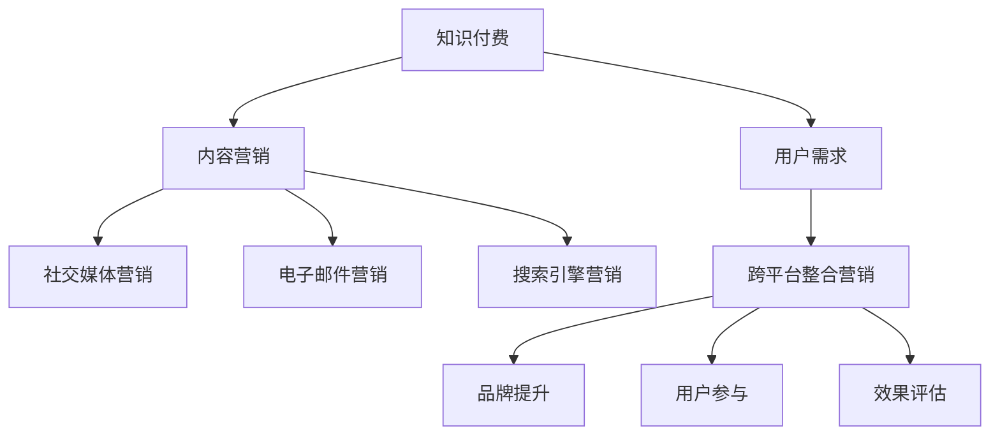

                 

### 《知识付费如何实现跨平台整合营销？》

#### 关键词：知识付费、跨平台整合营销、内容营销、社交媒体营销、电子邮件营销、搜索引擎营销

> 摘要：本文旨在探讨知识付费行业如何在竞争激烈的市场中实现跨平台整合营销。通过分析知识付费市场现状和跨平台整合营销的优势，文章详细阐述了内容营销、社交媒体营销、电子邮件营销和搜索引擎营销的策略，并提供实际案例解析和开发环境搭建的代码示例。文章旨在为知识付费平台提供系统、实用的营销策略，以实现持续增长和品牌影响力。

### 第一部分：知识付费概述

#### 第1章：知识付费市场现状及发展趋势

##### 1.1 知识付费的定义与分类

知识付费是指用户为了获取特定的知识和技能，通过支付费用来购买相关内容或服务。知识付费的形式多种多样，包括在线课程、电子书、专业知识分享、付费问答等。根据知识内容的不同，知识付费可以分为以下几类：

1. **技能培训类**：如编程、设计、语言学习等。
2. **知识分享类**：如讲座、研讨会、大师课等。
3. **娱乐类**：如有声书、综艺知识类节目等。
4. **咨询服务**：如一对一咨询、专家问诊等。

随着互联网技术的不断发展，知识付费市场呈现出以下特点：

1. **用户需求多样化**：随着社会分工的精细化，用户对知识和技能的需求越来越多样化。
2. **市场规模扩大**：知识付费已经成为互联网经济的重要组成部分，市场规模逐年扩大。
3. **内容质量提升**：知识付费平台越来越注重内容质量，高质量内容受到用户的青睐。

##### 1.2 知识付费市场现状

当前，知识付费市场主要呈现出以下趋势：

1. **在线教育崛起**：在线教育平台如网易云课堂、腾讯课堂等，已经成为知识付费市场的主力军。
2. **内容个性化**：知识付费平台通过算法和大数据技术，为用户提供个性化的学习推荐。
3. **多样化收入模式**：知识付费平台不仅通过直接销售课程获取收益，还通过广告、会员制等方式实现多元化的收入。

##### 1.3 知识付费发展趋势

未来，知识付费市场将呈现出以下发展趋势：

1. **内容质量更加重要**：随着用户对知识需求的提高，内容质量将成为核心竞争力。
2. **平台化趋势加强**：知识付费平台将整合更多的资源，打造更加完善的生态系统。
3. **技术创新推动**：人工智能、大数据等技术在知识付费领域的应用，将进一步提升用户体验。

#### 第2章：跨平台整合营销概述

##### 2.1 跨平台整合营销的概念

跨平台整合营销是指企业在不同的营销平台上进行内容传播，通过整合和优化不同平台之间的营销活动，实现用户覆盖的最大化和营销效果的提升。跨平台整合营销的核心思想是打破单一平台的局限，实现资源整合和协同效应。

##### 2.2 跨平台整合营销的优势

1. **拓宽用户覆盖面**：通过跨平台整合营销，企业可以在多个平台上进行推广，扩大用户覆盖范围。
2. **提升品牌知名度**：不同平台之间的内容互动和联合推广，可以有效提升品牌知名度。
3. **增强用户粘性**：通过跨平台整合营销，用户可以在多个平台上接触品牌内容，提高用户粘性。
4. **优化营销效果**：跨平台整合营销可以根据不同平台的特点，制定个性化的营销策略，提高营销效果。

##### 2.3 跨平台整合营销的策略

1. **内容协同**：在不同平台上发布相似或互补的内容，实现内容的协同传播。
2. **渠道整合**：整合多个营销渠道，如社交媒体、搜索引擎、电子邮件等，实现渠道之间的信息互通。
3. **用户互动**：通过线上活动、社群互动等方式，增强用户参与感和互动性。
4. **数据整合**：利用大数据技术，对用户行为和偏好进行分析，优化营销策略。

### 第二部分：跨平台整合营销策略

#### 第3章：内容营销策略

##### 3.1 内容营销的核心要素

内容营销的核心要素包括：

1. **目标定位**：明确目标受众，确定内容营销的方向。
2. **内容创作**：创作有价值、有吸引力的内容，满足用户需求。
3. **内容传播**：通过多种渠道传播内容，扩大内容影响力。
4. **效果评估**：对内容营销的效果进行跟踪和评估，优化营销策略。

##### 3.2 内容营销的实施步骤

1. **市场调研**：了解目标市场，收集用户需求和偏好。
2. **内容规划**：根据市场调研结果，制定内容创作计划。
3. **内容创作**：创作有价值、有吸引力的内容。
4. **内容传播**：通过多种渠道传播内容。
5. **效果评估**：对内容营销的效果进行跟踪和评估。

##### 3.3 成功案例分析

以某知名在线教育平台为例，该平台通过内容营销策略实现了用户增长和品牌提升。以下是该平台的内容营销成功案例：

1. **目标定位**：针对职场人士和大学生等目标受众，提供职业发展和学术学习相关的课程。
2. **内容创作**：制作高质量的课程视频、专业文章和案例分析，满足用户需求。
3. **内容传播**：通过微博、微信公众号、抖音等多个平台进行内容传播，提高内容曝光率。
4. **效果评估**：通过用户反馈和数据分析，优化内容创作和传播策略。

#### 第4章：社交媒体营销策略

##### 4.1 社交媒体营销的优势

社交媒体营销具有以下优势：

1. **高用户粘性**：用户在社交媒体上花费大量时间，企业可以更容易地触达目标受众。
2. **互动性强**：社交媒体平台提供了丰富的互动方式，企业可以与用户进行实时沟通。
3. **传播速度快**：社交媒体的病毒式传播特点，可以迅速提高品牌知名度。
4. **成本效益高**：相比其他营销方式，社交媒体营销的成本较低，但效果显著。

##### 4.2 社交媒体营销的渠道选择

选择社交媒体营销渠道时，需要考虑以下因素：

1. **目标受众**：了解目标受众的社交媒体使用习惯，选择受众集中的平台。
2. **平台特性**：不同社交媒体平台具有不同的特性，选择与营销目标相符的平台。
3. **竞争环境**：分析竞争对手的社交媒体营销策略，选择有优势的平台。

常见的社交媒体营销渠道包括：

1. **微博**：适合品牌宣传和事件营销。
2. **微信公众号**：适合内容营销和用户互动。
3. **抖音**：适合短视频营销和用户娱乐。
4. **Facebook**：适合全球市场推广。
5. **Instagram**：适合图片和视频营销。

##### 4.3 社交媒体营销的案例分析

以某知名知识付费平台为例，该平台通过社交媒体营销策略实现了用户增长和品牌提升。以下是该平台的社交媒体营销成功案例：

1. **目标定位**：针对大学生和职场新人等目标受众，提供职业发展和学术学习相关的课程。
2. **内容创作**：制作有趣、有启发性的短视频，分享学习心得和职业发展建议。
3. **内容传播**：通过抖音、微博、微信公众号等多个平台进行内容传播，提高内容曝光率。
4. **效果评估**：通过用户反馈和数据分析，优化内容创作和传播策略。

#### 第5章：电子邮件营销策略

##### 5.1 电子邮件营销的优势

电子邮件营销具有以下优势：

1. **低成本**：电子邮件营销的成本相对较低，适合中小企业。
2. **高精准度**：可以通过邮件列表精准定位目标受众。
3. **高互动性**：电子邮件提供了丰富的互动方式，如点击链接、回复邮件等。
4. **高回报率**：电子邮件营销的回报率通常高于其他营销方式。

##### 5.2 电子邮件营销的实施步骤

1. **邮件列表构建**：收集目标用户的邮件地址，建立邮件列表。
2. **邮件内容创作**：创作有价值、有吸引力的邮件内容，满足用户需求。
3. **邮件发送**：通过专业的邮件发送平台，将邮件发送给用户。
4. **效果评估**：对邮件营销的效果进行跟踪和评估，优化邮件内容。

##### 5.3 电子邮件营销的案例分析

以某知名在线教育平台为例，该平台通过电子邮件营销策略实现了用户增长和课程推广。以下是该平台的电子邮件营销成功案例：

1. **邮件列表构建**：通过官网注册、课程购买等方式，收集目标用户的邮件地址。
2. **邮件内容创作**：创作包含优惠信息、学习资源、课程推荐等内容的邮件。
3. **邮件发送**：定期向邮件列表发送邮件，提高用户活跃度。
4. **效果评估**：通过邮件打开率、点击率等数据，评估邮件营销效果，并优化邮件内容。

#### 第6章：搜索引擎营销策略

##### 6.1 搜索引擎营销的概念

搜索引擎营销（Search Engine Marketing，SEM）是指通过购买搜索引擎广告（如Google Ads、百度推广等），提高网站在搜索引擎结果页面（Search Engine Results Page，SERP）中的排名，从而增加网站流量和曝光度。

##### 6.2 搜索引擎营销的实施步骤

1. **关键词研究**：选择与业务相关的关键词，分析关键词的搜索量和竞争程度。
2. **广告投放**：根据关键词设定广告投放策略，包括出价、投放地域、投放时间等。
3. **广告创意**：制作有吸引力的广告创意，提高点击率。
4. **效果跟踪**：对广告效果进行跟踪和分析，优化广告投放策略。

##### 6.3 搜索引擎营销的案例分析

以某知名知识付费平台为例，该平台通过搜索引擎营销策略实现了用户增长和品牌提升。以下是该平台的搜索引擎营销成功案例：

1. **关键词研究**：选择与课程相关的关键词，如“在线课程”、“学习资源”等。
2. **广告投放**：在Google Ads和百度推广上投放广告，提高网站曝光度。
3. **广告创意**：制作包含课程优惠、学习资源等信息的广告，提高点击率。
4. **效果跟踪**：通过分析广告点击率、转化率等数据，优化广告投放策略。

#### 第7章：跨平台整合营销的优化与评估

##### 7.1 跨平台整合营销的优化策略

1. **内容优化**：根据用户反馈和数据分析，不断优化内容质量和形式。
2. **渠道优化**：分析不同渠道的投放效果，优化渠道选择和投放策略。
3. **技术优化**：利用大数据、人工智能等技术，提高跨平台整合营销的精准度和效果。

##### 7.2 跨平台整合营销的评估指标

1. **用户参与度**：包括用户点击率、回复率、转发率等指标。
2. **转化率**：包括注册率、购买率、课程完成率等指标。
3. **ROI**：营销投入与回报的比值，用于评估营销效果的财务指标。

##### 7.3 跨平台整合营销的案例分析

以某知名知识付费平台为例，该平台通过跨平台整合营销策略实现了用户增长和品牌提升。以下是该平台的跨平台整合营销成功案例：

1. **用户参与度**：通过内容优化和渠道优化，提高了用户点击率和回复率。
2. **转化率**：通过广告投放优化和用户体验优化，提高了注册率和购买率。
3. **ROI**：通过数据分析，实现了营销投入的合理配置，提高了整体营销ROI。

### 第三部分：实战案例分析

#### 第8章：知识付费平台跨平台整合营销实战

##### 8.1 平台背景介绍

某知名知识付费平台，提供包括编程、设计、语言学习等多领域的在线课程。平台拥有丰富的课程资源和庞大的用户群体，但如何在竞争激烈的市场中实现持续增长和品牌提升，成为亟待解决的问题。

##### 8.2 跨平台整合营销策略制定

1. **内容优化**：根据用户需求和偏好，调整课程内容，提高课程质量。
2. **渠道整合**：选择微博、微信公众号、抖音、Google Ads等多个平台，进行内容传播和广告投放。
3. **用户互动**：通过线上活动、社群互动等方式，增强用户参与感。
4. **技术支持**：利用大数据和人工智能技术，优化跨平台整合营销的精准度和效果。

##### 8.3 实施过程及效果评估

1. **内容优化**：平台对课程内容进行了全面升级，引入了更多实战案例和互动教学，用户满意度显著提高。
2. **渠道整合**：在微博、微信公众号、抖音等平台发布了大量课程推广内容，实现了多平台联动。
3. **用户互动**：通过线上讲座、问答活动等方式，增强了用户参与感。
4. **效果评估**：通过数据分析，用户点击率、转化率均有所提升，整体营销效果良好。

#### 第9章：知识付费内容营销案例解析

##### 9.1 案例背景

某知名编程学习平台，专注于为编程初学者提供高质量的学习资源。平台希望通过内容营销策略，提高用户参与度和课程转化率。

##### 9.2 内容营销策略制定

1. **目标定位**：针对编程初学者，提供入门教程、实战案例和编程技巧。
2. **内容创作**：制作系列教程视频、专业文章和代码示例，满足用户需求。
3. **内容传播**：通过微博、微信公众号、知乎等多个平台进行内容传播，提高内容曝光率。
4. **效果评估**：通过用户反馈和数据分析，优化内容创作和传播策略。

##### 9.3 案例分析及效果评估

1. **目标定位**：平台针对编程初学者，提供了符合其需求的内容，得到了用户的认可。
2. **内容创作**：平台制作的高质量教程视频和文章，受到了用户的好评，课程转化率显著提高。
3. **内容传播**：通过多平台传播，平台的内容得到了更广泛的传播，用户基数持续增长。
4. **效果评估**：通过用户反馈和数据分析，平台不断优化内容创作和传播策略，实现了用户参与度和课程转化率的提升。

#### 第10章：知识付费社交媒体营销案例解析

##### 10.1 案例背景

某知名语言学习平台，致力于为英语学习者提供全面的课程和服务。平台希望通过社交媒体营销策略，提高品牌知名度和用户参与度。

##### 10.2 社交媒体营销策略制定

1. **目标定位**：针对英语学习者，提供英语学习技巧、单词记忆方法和学习资源。
2. **内容创作**：制作有趣、有启发性的短视频、图片和文章，满足用户需求。
3. **内容传播**：通过微博、微信公众号、Instagram等多个平台进行内容传播，提高内容曝光率。
4. **效果评估**：通过用户反馈和数据分析，优化内容创作和传播策略。

##### 10.3 案例分析及效果评估

1. **目标定位**：平台针对英语学习者，提供了丰富的学习资源，得到了用户的认可。
2. **内容创作**：平台制作的短视频和文章，因其有趣、有用，受到了用户的好评，吸引了大量新用户。
3. **内容传播**：通过多平台传播，平台的内容得到了更广泛的传播，品牌知名度显著提高。
4. **效果评估**：通过用户反馈和数据分析，平台不断优化内容创作和传播策略，实现了用户参与度和品牌知名度的提升。

### 附录

#### 附录A：知识付费与跨平台整合营销相关资源

1. **行业报告**：《2021年中国知识付费行业报告》
2. **学术论文**：有关知识付费和跨平台整合营销的相关研究论文
3. **案例分析**：知名知识付费平台的营销案例解析
4. **技术工具**：用于数据分析、内容创作和营销工具的推荐
5. **学习资源**：有关知识付费和跨平台整合营销的在线课程和书籍推荐

### 核心概念与联系

#### 跨平台整合营销与知识付费的关系

**Mermaid流程图：**



### 核心算法原理讲解

#### 内容营销的核心算法

```python
# 伪代码：内容营销核心算法

def content_marketing():
    # 数据收集
    data = collect_data()

    # 数据清洗
    clean_data = data_cleaning(data)

    # 数据分析
    insights = data_analysis(clean_data)

    # 内容生成
    content = content_generation(insights)

    # 发布与推广
    publish_content(content)

    return content
```

#### 搜索引擎营销的转化率模型

$$
\text{转化率} = \frac{\text{转化次数}}{\text{总点击次数}}
$$

**举例说明**

假设某知识付费平台通过搜索引擎营销获得1000次点击，其中20次点击产生了付费转化，则该平台的搜索引擎营销转化率为：

$$
\text{转化率} = \frac{20}{1000} = 0.02
$$

### 项目实战：代码实际案例和详细解释说明

#### 开发环境搭建

1. 安装Python 3.x版本
2. 安装requests库：`pip install requests`
3. 安装用于处理JSON数据的库：`pip install json`

#### 社交媒体营销实战

```python
import json
import requests

# API接口地址
api_url = "https://api.socialmedia.com/marketing"

# 用户信息
user_info = {
    "user_id": "123456",
    "platform": "Instagram",
    "content": "Check out our latest course on #DataScience!",
    "hashtags": ["DataScience", "MachineLearning", "KnowledgePaid"]
}

# 发送POST请求，上传用户信息
response = requests.post(api_url, json=user_info)

# 解析响应结果
if response.status_code == 200:
    result = json.loads(response.text)
    print("Post published successfully:", result)
else:
    print("Failed to publish post:", response.status_code)
```

**代码解读与分析**

该代码示例通过调用社交媒体平台的API接口，将用户信息（用户ID、平台、内容和标签）发送到服务器进行发布。成功发布后，会返回响应结果，其中包含是否成功发布的信息。该代码示例展示了如何通过API接口实现社交媒体营销的功能，可以帮助开发者快速搭建社交媒体营销的开发环境。

### 作者信息

**作者：AI天才研究院/AI Genius Institute & 禅与计算机程序设计艺术 /Zen And The Art of Computer Programming**

