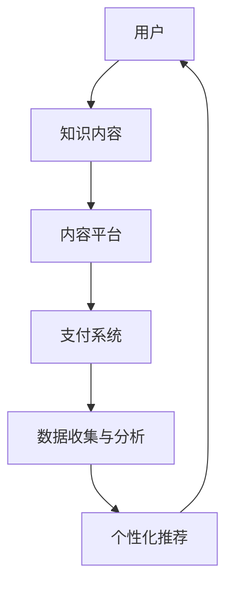
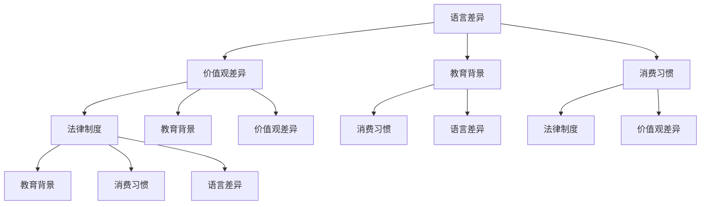
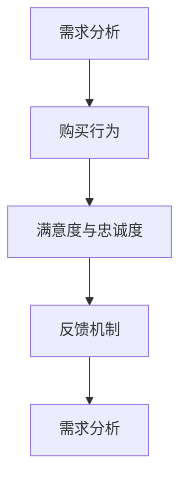
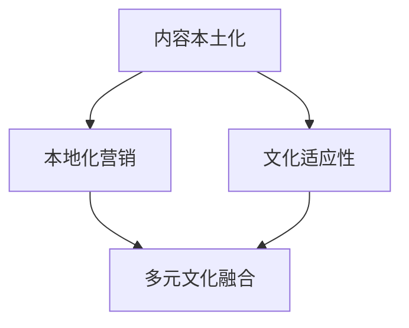
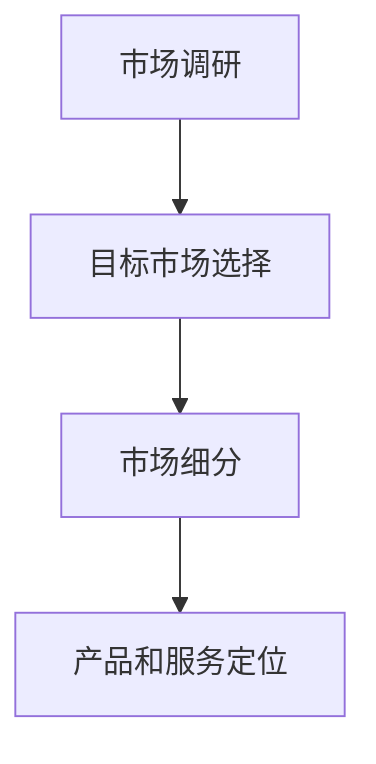
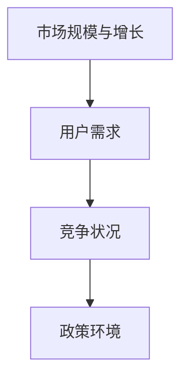
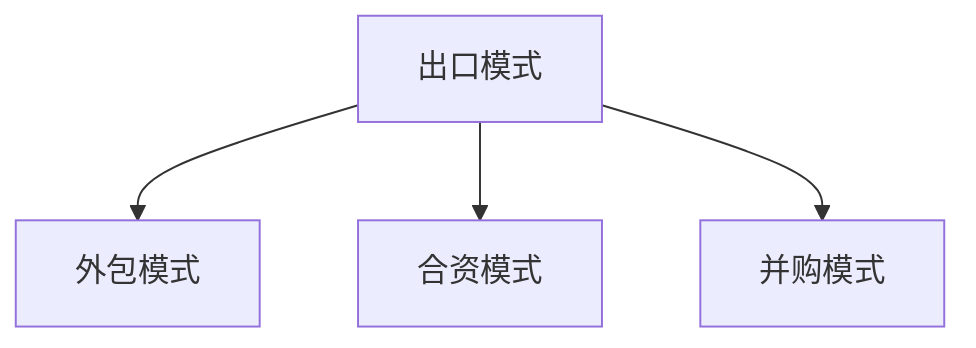

                 

# 《知识付费如何实现跨文化传播与国际化发展？》

> 关键词：知识付费、跨文化传播、国际化发展、技术创新、知识产权保护

> 摘要：本文首先介绍了知识付费市场的现状，探讨了跨文化传播的重要性以及国际化发展的必要性。接着，详细分析了知识付费的核心概念、跨文化传播的挑战与策略以及国际化发展的路径与模式。通过实际案例，本文进一步阐述了知识付费国际化发展的成功经验。最后，本文探讨了技术创新在知识付费国际化中的作用，以及国际化发展的策略与实施。本文旨在为知识付费企业提供跨文化传播与国际化发展的策略建议。

### 第1章：引言与背景

#### 1.1 知识付费市场现状

随着互联网技术的快速发展，知识付费市场逐渐成为一个新的经济增长点。知识付费指的是用户为了获取特定的知识或技能，愿意付费的行为。这一市场的主要参与者包括专业机构、个人讲师、内容平台等。根据艾瑞咨询的报告，2020年中国知识付费市场规模已达到1293亿元，预计未来几年将保持高速增长。

目前，知识付费市场呈现出以下几个特点：

1. **多样化内容**：从传统的教育课程到专业技能培训、兴趣爱好培养，内容种类日益丰富。
2. **平台化运营**：各大平台如得到、知乎Live、喜马拉雅等成为知识付费的重要载体，提供一站式服务。
3. **用户付费习惯**：用户逐渐接受知识付费，从最初的免费内容消费转向付费内容消费。

#### 1.2 跨文化传播的重要性

跨文化传播指的是在不同文化背景之间传播信息、知识和价值观的过程。随着全球化的发展，跨文化传播在各个领域都发挥着重要作用。在知识付费领域，跨文化传播具有以下几个重要性：

1. **市场拓展**：通过跨文化传播，知识付费企业可以拓展国际市场，增加用户基数和收入。
2. **文化认同**：优质的知识内容能够跨越文化差异，被不同文化背景的用户所接受，增强品牌影响力。
3. **文化交流**：知识付费的国际化可以促进不同文化之间的交流与理解，推动全球文化多样性的发展。

#### 1.3 国际化发展的必要性

国际化发展对于知识付费企业来说具有重要意义：

1. **市场潜力**：全球知识付费市场潜力巨大，国际化可以帮助企业抓住更多机会。
2. **品牌提升**：国际化可以提升企业的品牌知名度和国际影响力。
3. **技术创新**：国际化过程中，企业可以借鉴和引入国际先进技术，推动自身技术创新。
4. **人才培养**：国际化可以吸引全球优秀人才，提升企业核心竞争力。

综上所述，知识付费企业需要重视跨文化传播与国际化发展，通过不断创新和优化，实现可持续发展。

#### 1.4 研究目的与结构

本文旨在探讨知识付费如何实现跨文化传播与国际化发展。文章结构如下：

- 第1章：引言与背景，介绍知识付费市场现状、跨文化传播的重要性以及国际化发展的必要性。
- 第2章：知识付费的核心概念，分析知识付费的定义与分类、价值与趋势以及跨文化传播的理论基础。
- 第3章：跨文化传播的挑战与策略，讨论文化差异分析、消费者行为研究以及跨文化传播策略。
- 第4章：国际化发展的路径与模式，分析国际市场定位、目标市场分析以及国际化经营模式。
- 第5章：案例分析，通过实际案例探讨知识付费国际化发展的成功经验。
- 第6章：技术创新与知识付费国际化，探讨新技术应用、数据分析与个性化推荐以及技术在国际发展中的作用。
- 第7章：法律法规与知识产权保护，分析国际贸易法律法规、知识产权保护策略以及跨国纠纷解决机制。
- 第8章：国际化发展的策略与实施，提出国际化发展的策略与实施方法。
- 第9章：未来展望，展望国际化发展的趋势、潜在机遇与挑战以及知识付费国际化的发展方向。

通过以上结构，本文将深入探讨知识付费如何实现跨文化传播与国际化发展，为相关企业提供有价值的参考。

### 第2章：知识付费的核心概念

#### 2.1 知识付费的定义与分类

知识付费是指用户为了获取特定知识或技能，愿意付费的行为。它区别于传统的免费内容消费，强调知识的价值与稀缺性。知识付费可以按照不同维度进行分类：

1. **按内容分类**：可以分为教育类、技能类、兴趣类等。教育类主要包括在线课程、专业认证等；技能类包括编程、设计、市场营销等；兴趣类包括摄影、烹饪、音乐等。
2. **按形式分类**：可以分为直播、录播、图文、音频等。直播类具有实时互动的特点，录播类则便于用户灵活安排学习时间；图文和音频类则更适合用户碎片化学习。
3. **按付费模式分类**：可以分为一次性付费、订阅制、按需付费等。一次性付费适用于单次学习需求；订阅制则更适合长期学习需求；按需付费则根据用户的学习进度进行付费。

#### 2.2 知识付费的价值与趋势

知识付费的价值主要体现在以下几个方面：

1. **知识传递**：知识付费帮助用户快速获取专业知识和技能，提高个人竞争力。
2. **经济回报**：知识付费企业通过提供有价值的内容，实现商业变现，推动知识经济的发展。
3. **品牌建设**：优质的知识内容有助于提升企业或个人的品牌影响力，增强市场竞争力。
4. **文化交流**：知识付费的国际化发展可以促进不同文化之间的交流与理解。

知识付费市场的发展趋势如下：

1. **市场规模扩大**：随着互联网普及和用户付费习惯的培养，知识付费市场规模持续扩大。
2. **内容多样化**：知识付费内容从传统的教育课程拓展到更多领域，满足用户的多样化需求。
3. **平台化运营**：各大知识付费平台通过内容聚合、技术赋能等手段，提升用户体验，增加用户粘性。
4. **技术创新**：人工智能、大数据等技术应用于知识付费，实现个性化推荐、智能问答等功能，提升知识获取效率。

#### 2.3 跨文化传播的理论基础

跨文化传播的理论基础主要包括以下几方面：

1. **文化相对论**：文化相对论认为，每个文化都有其独特性和价值，不存在优劣之分。在跨文化传播过程中，应尊重和接纳不同文化的差异。
2. **文化 Shock**：文化Shock是指个体在进入一个不同文化环境时，经历的一系列心理和行为上的适应过程。跨文化传播需要考虑目标市场的文化Shock，提供适应当地文化的内容。
3. **文化适应性**：文化适应性是指企业在不同文化背景下调整和优化产品和服务，以满足当地用户需求。在知识付费领域，文化适应性包括语言本地化、内容本土化、营销策略调整等。
4. **文化认同**：文化认同是指不同文化背景下个体对共同价值观和文化的认同。在知识付费的跨文化传播中，通过共同价值观的传播，增强用户对品牌的认同。

通过以上理论基础，知识付费企业可以更好地理解跨文化传播的内在逻辑，制定有效的国际化策略。

#### 2.4 知识付费的核心概念与架构

为了更清晰地理解知识付费的核心概念，我们可以使用Mermaid流程图来展示其架构：



- **用户**：知识付费的主体，通过购买或订阅获取知识内容。
- **知识内容**：包括教育、技能、兴趣等多样化的内容。
- **内容平台**：提供知识内容的载体，包括课程、直播、图文、音频等形式。
- **支付系统**：实现用户支付、结算等功能。
- **数据收集与分析**：通过用户行为数据进行分析，优化内容推荐和用户体验。
- **个性化推荐**：基于数据分析，为用户提供个性化的知识内容推荐。

#### 2.5 核心算法原理讲解

在知识付费领域，个性化推荐算法是一个核心的算法。以下是推荐算法的伪代码：

```pseudo
function recommend_content(user_profile, content_library):
    # 计算用户与内容的相似度
    similarity_scores = []
    for content in content_library:
        similarity_score = calculate_similarity(user_profile, content)
        similarity_scores.append(similarity_score)
    
    # 选择相似度最高的内容
    top_contents = []
    for i in range(len(similarity_scores)):
        if similarity_scores[i] > threshold:
            top_contents.append(content_library[i])
    
    return top_contents
```

- `user_profile`：用户的兴趣和偏好信息。
- `content_library`：包含所有可推荐内容的信息库。
- `calculate_similarity`：计算用户与内容的相似度函数，可以使用余弦相似度、皮尔逊相关系数等。
- `threshold`：相似度阈值，用于筛选推荐内容。

#### 2.6 数学模型和公式讲解

在推荐系统中，常用的数学模型包括协同过滤和矩阵分解。以下是协同过滤的数学模型：

$$
\mathbf{R}_{ij} = \mathbf{U}_i \mathbf{V}_j^T
$$

- $\mathbf{R}_{ij}$：用户i对内容j的评分。
- $\mathbf{U}_i$：用户i的向量。
- $\mathbf{V}_j$：内容j的向量。

矩阵分解的数学模型如下：

$$
\mathbf{R}_{ij} = \mathbf{U}_i \mathbf{V}_j
$$

- $\mathbf{U}_i$：用户i的低维向量。
- $\mathbf{V}_j$：内容j的低维向量。

#### 2.7 项目实战：代码实际案例和详细解释

以下是一个简单的推荐系统代码实现，用于为用户推荐课程：

```python
import numpy as np

# 假设用户和内容的评分矩阵
R = np.array([[5, 3, 0, 1],
              [4, 0, 0, 1],
              [1, 1, 0, 5],
              [1, 0, 0, 4],
              [5, 4, 9, 0]])

# 计算用户和内容的相似度
def calculate_similarity(R, i, j):
    common-rated = R[i] & R[j]
    if np.count_nonzero(common-rated) == 0:
        return 0
    return np.sum(R[i] * R[j]) / np.sqrt(np.sum(R[i] * R[i]) * np.sum(R[j] * R[j]))

# 计算相似度矩阵
similarity_matrix = np.zeros((R.shape[0], R.shape[0]))
for i in range(R.shape[0]):
    for j in range(R.shape[0]):
        similarity_matrix[i][j] = calculate_similarity(R, i, j)

# 根据相似度矩阵推荐课程
def recommend_courses(R, similarity_matrix, user_index, k=3):
    user_vector = R[user_index]
    recommended_courses = []
    for j in range(R.shape[1]):
        if R[user_index][j] == 0:
            sum_similarity = 0
            for i in range(R.shape[0]):
                sum_similarity += similarity_matrix[i][j] * R[i][j]
            average_similarity = sum_similarity / k
            recommended_courses.append((j, average_similarity))
    recommended_courses.sort(key=lambda x: x[1], reverse=True)
    return recommended_courses[:k]

# 推荐课程
user_index = 0  # 用户ID
recommended_courses = recommend_courses(R, similarity_matrix, user_index)
print("推荐课程：", recommended_courses)
```

- `R`：用户和内容的评分矩阵。
- `calculate_similarity`：计算用户和内容的相似度函数。
- `similarity_matrix`：相似度矩阵。
- `recommend_courses`：根据相似度矩阵推荐课程函数。

通过以上代码，我们可以为用户推荐符合其兴趣的课程。

#### 2.8 代码解读与分析

在上面的代码中，我们首先定义了一个用户和内容的评分矩阵`R`。然后，我们实现了`calculate_similarity`函数，用于计算用户和内容的相似度。该函数使用了余弦相似度公式，通过计算用户和内容的内积以及各自向量的模长，得到相似度分数。

接着，我们计算了相似度矩阵`similarity_matrix`，用于存储所有用户之间的相似度分数。最后，我们定义了`recommend_courses`函数，用于根据相似度矩阵为用户推荐课程。该函数首先计算用户未评分的课程与用户的相似度，然后根据相似度分数排序，选取相似度最高的课程进行推荐。

通过以上代码，我们可以为用户推荐符合其兴趣的课程，从而提高用户的满意度。

### 第3章：跨文化传播的挑战与策略

#### 3.1 文化差异分析

跨文化传播面临着诸多文化差异的挑战，这些文化差异主要体现在以下几个方面：

1. **语言差异**：语言是文化传播的重要载体，不同语言之间的差异可能导致信息传递不准确。在知识付费领域，语言差异会影响用户对内容的理解，降低用户体验。
2. **价值观差异**：不同文化背景下的价值观差异可能导致对知识内容的接受程度不同。例如，某些文化可能更重视实用主义，而另一些文化可能更注重理论教育。
3. **教育背景**：不同地区的教育水平和教育体系存在差异，这会影响用户对知识内容的接受能力和学习效果。
4. **消费习惯**：不同文化背景下的消费习惯和支付方式不同，可能导致用户对知识付费的接受程度和付费意愿不同。
5. **法律制度**：不同国家和地区的法律制度存在差异，知识付费企业在国际化过程中需要遵守当地法律法规，避免法律风险。

为了更好地理解文化差异，我们可以通过以下Mermaid流程图进行展示：



通过以上流程图，我们可以清晰地看到文化差异的各个方面及其相互关联。

#### 3.2 消费者行为研究

跨文化传播中的消费者行为研究对于知识付费企业具有重要意义。以下是消费者行为研究的主要方面：

1. **需求分析**：了解目标市场的需求，包括用户对知识内容的偏好、学习方式、支付意愿等。
2. **购买行为**：研究用户在购买过程中的决策过程，包括信息搜索、产品比较、购买决策等。
3. **满意度与忠诚度**：评估用户对知识内容的满意度，以及用户对品牌的忠诚度。
4. **反馈机制**：建立用户反馈机制，收集用户意见和建议，持续优化产品和服务。

为了更好地研究消费者行为，我们可以通过以下Mermaid流程图展示消费者行为的研究路径：



通过以上流程图，我们可以清晰地看到消费者行为研究的逻辑关系。

#### 3.3 跨文化传播策略

为了克服文化差异，知识付费企业需要制定有效的跨文化传播策略。以下是几种常见的跨文化传播策略：

1. **内容本土化**：根据目标市场的文化特点，对知识内容进行本地化调整，使其更符合当地用户的需求。例如，可以通过调整语言、增加本地化案例、使用当地文化符号等方式实现内容本土化。
2. **本地化营销**：在目标市场采用本地化的营销策略，包括广告文案、社交媒体运营、合作伙伴关系等。例如，可以针对不同文化背景的用户，制定差异化的营销策略，提高用户对品牌的认知度和接受度。
3. **文化适应性**：在产品设计、服务提供等方面，充分考虑目标市场的文化特点，提供符合当地文化习惯的产品和服务。例如，可以提供本地化的支付方式、客户服务、售后支持等。
4. **多元文化融合**：在知识付费平台上，鼓励多元文化的交流与融合，通过提供多样化的知识内容，满足不同文化背景用户的需求。例如，可以开设多语种课程、举办跨文化研讨会等。

为了更好地展示跨文化传播策略，我们可以通过以下Mermaid流程图进行说明：



通过以上流程图，我们可以清晰地看到跨文化传播策略的各个方面及其相互关联。

#### 3.4 实际案例：知识付费企业的跨文化传播实践

以下是一个实际案例，展示了知识付费企业在跨文化传播中的成功实践：

**案例：网易云课堂的国际化发展**

网易云课堂是中国知名的知识付费平台，近年来积极推进国际化发展。以下是网易云课堂在跨文化传播中的几个关键举措：

1. **内容本土化**：网易云课堂在海外市场推出了多语种课程，包括英语、西班牙语、法语等，以满足不同地区用户的需求。同时，针对当地文化特点，调整课程内容，增加案例研究和本地化案例。
2. **本地化营销**：网易云课堂在海外市场采用了本地化的营销策略，通过社交媒体、合作伙伴关系等渠道，提高品牌知名度和用户接受度。例如，在西班牙市场，网易云课堂与当地知名媒体合作，推广课程。
3. **文化适应性**：网易云课堂在产品设计、服务提供等方面，充分考虑海外用户的文化习惯。例如，提供本地化的支付方式、客户服务、售后支持等，确保用户体验。
4. **多元文化融合**：网易云课堂在平台上开设了多样化的课程，包括编程、设计、营销等，满足不同文化背景用户的需求。同时，通过举办跨文化研讨会、线上活动等，促进用户之间的交流与互动。

通过以上举措，网易云课堂在海外市场取得了显著的成绩，用户数量和收入持续增长。

#### 3.5 跨文化传播策略总结与建议

通过上述案例，我们可以总结出以下跨文化传播策略：

1. **内容本土化**：根据目标市场的文化特点，调整知识内容，使其更符合当地用户的需求。
2. **本地化营销**：采用本地化的营销策略，提高品牌知名度和用户接受度。
3. **文化适应性**：在产品设计、服务提供等方面，充分考虑目标市场的文化习惯，提供个性化服务。
4. **多元文化融合**：通过提供多样化的知识内容，促进不同文化背景用户之间的交流与互动。

对于知识付费企业，以下是一些建议：

1. **深入了解目标市场**：在进入海外市场前，充分了解目标市场的文化、教育、消费习惯等方面，为制定有效的跨文化传播策略提供依据。
2. **建立本地化团队**：组建本地化团队，负责内容本地化、市场营销、客户服务等方面的工作，确保跨文化传播的顺利进行。
3. **持续优化产品和服务**：根据用户反馈和市场变化，持续优化产品和服务，提高用户体验。
4. **积极寻求合作**：与当地企业、媒体、教育机构等建立合作，共同推广知识付费产品，扩大市场份额。

通过以上策略和建议，知识付费企业可以更好地实现跨文化传播与国际化发展，提高市场竞争力。

### 第4章：国际化发展的路径与模式

#### 4.1 国际市场定位

国际化发展的第一步是对目标市场进行定位。这包括以下几个关键步骤：

1. **市场调研**：深入了解目标市场的市场规模、增长趋势、竞争格局等。通过市场调研，可以获取有关用户需求、消费习惯、文化特点等方面的信息。
2. **目标市场选择**：根据市场调研结果，选择具有较高市场潜力和符合企业战略目标的目标市场。在选择目标市场时，应考虑市场规模、用户需求、竞争状况、政策环境等因素。
3. **市场细分**：将目标市场划分为不同的细分市场，为每个细分市场提供针对性的产品和服务。通过市场细分，可以更精准地满足不同用户群体的需求，提高市场占有率。

为了更好地展示国际市场定位的过程，我们可以使用以下Mermaid流程图：



#### 4.2 目标市场分析

在确定目标市场后，需要进行详细的目标市场分析，以了解市场现状和潜在机会。以下是目标市场分析的主要方面：

1. **市场规模与增长**：分析目标市场的整体规模、增长速度、潜力等，评估市场容量。
2. **用户需求**：研究目标市场的用户需求，包括用户对知识内容的需求类型、学习方式、支付意愿等。
3. **竞争状况**：分析目标市场的主要竞争对手，包括市场份额、产品特点、营销策略等，了解市场竞争态势。
4. **政策环境**：了解目标市场的政策环境，包括法律法规、税收政策、行业规范等，评估政策对业务发展的影响。

通过以下Mermaid流程图，我们可以更直观地了解目标市场分析的各个维度：



#### 4.3 国际化经营模式

国际化经营模式是知识付费企业在海外市场运营的关键。以下是几种常见的国际化经营模式：

1. **出口模式**：通过将知识内容直接出口到目标市场，实现国际化。这种模式适用于那些具有独特竞争优势和较高品牌知名度的企业。
2. **外包模式**：将知识内容的生产和运营外包给海外合作伙伴，由合作伙伴负责在当地市场推广和运营。这种模式适用于那些资源有限或缺乏海外运营经验的企业。
3. **合资模式**：与当地企业合作成立合资公司，共同开展知识付费业务。这种模式可以充分利用双方的资源和优势，降低风险。
4. **并购模式**：通过并购当地的知识付费企业，快速进入目标市场，实现业务扩展。这种模式适用于那些具备雄厚资金和强大运营能力的企业。

为了更清晰地展示国际化经营模式的多样性，我们可以使用以下Mermaid流程图：



#### 4.4 案例分析：网易云课堂的国际化实践

以下是一个实际案例，分析知识付费企业在国际化发展中的成功实践。

**案例：网易云课堂的国际化实践**

网易云课堂是中国知名的知识付费平台，近年来积极推进国际化发展。以下是网易云课堂在国际化发展中的几个关键举措：

1. **市场调研与定位**：网易云课堂通过市场调研，选择了具有较高市场潜力的美国、欧洲和东南亚市场作为目标市场。针对不同市场的文化特点和用户需求，进行了市场细分，为每个细分市场提供针对性的产品和服务。
2. **内容本土化**：为了满足不同市场用户的需求，网易云课堂推出了多语种课程，包括英语、西班牙语、法语等。同时，针对当地文化特点，调整课程内容，增加案例研究和本地化案例。例如，在东南亚市场，网易云课堂增加了当地流行的编程语言和技能培训课程。
3. **本地化营销**：网易云课堂在目标市场采用了本地化的营销策略，通过社交媒体、合作伙伴关系等渠道，提高品牌知名度和用户接受度。例如，在东南亚市场，网易云课堂与当地知名科技公司合作，推广课程。
4. **文化适应性**：在产品设计、服务提供等方面，网易云课堂充分考虑了海外用户的文化习惯。例如，提供本地化的支付方式、客户服务、售后支持等，确保用户体验。
5. **多元文化融合**：网易云课堂在平台上开设了多样化的课程，包括编程、设计、营销等，满足不同文化背景用户的需求。同时，通过举办跨文化研讨会、线上活动等，促进用户之间的交流与互动。

通过以上举措，网易云课堂在海外市场取得了显著的成绩，用户数量和收入持续增长。

#### 4.5 国际化经营模式总结与建议

通过以上案例分析，我们可以总结出以下国际化经营模式：

1. **出口模式**：适用于具有独特竞争优势和较高品牌知名度的企业。
2. **外包模式**：适用于资源有限或缺乏海外运营经验的企业。
3. **合资模式**：适用于具备雄厚资金和强大运营能力的企业。
4. **并购模式**：适用于具备雄厚资金和强大运营能力的企业。

对于知识付费企业，以下是一些建议：

1. **深入了解目标市场**：在进入海外市场前，充分了解目标市场的文化、教育、消费习惯等方面，为制定有效的国际化策略提供依据。
2. **选择合适的经营模式**：根据企业的资源和战略目标，选择适合的国际化经营模式。
3. **内容本土化**：根据目标市场的文化特点，调整知识内容，使其更符合当地用户的需求。
4. **本地化营销**：采用本地化的营销策略，提高品牌知名度和用户接受度。
5. **文化适应性**：在产品设计、服务提供等方面，充分考虑目标市场的文化习惯，提供个性化服务。
6. **多元文化融合**：通过提供多样化的知识内容，促进不同文化背景用户之间的交流与互动。

通过以上策略和建议，知识付费企业可以更好地实现国际化发展，提高市场竞争力。

### 第5章：案例分析

#### 5.1 案例一：网易云课堂的国际化实践

**背景**：

网易云课堂是中国知名的知识付费平台，成立于2014年，隶属于网易公司。随着互联网技术的快速发展，网易云课堂逐渐成为国内在线教育领域的佼佼者。然而，网易云课堂并没有满足于国内市场，而是积极拓展国际市场，以期实现更广泛的业务发展。

**国际化实践**：

1. **内容本土化**：

   在国际市场，网易云课堂推出了多语种课程，包括英语、西班牙语、法语等，以适应不同地区的用户需求。同时，针对当地文化特点，调整课程内容，增加案例研究和本地化案例。例如，在东南亚市场，网易云课堂增加了当地流行的编程语言和技能培训课程。

2. **本地化营销**：

   网易云课堂在目标市场采用了本地化的营销策略，通过社交媒体、合作伙伴关系等渠道，提高品牌知名度和用户接受度。例如，在东南亚市场，网易云课堂与当地知名科技公司合作，推广课程。

3. **文化适应性**：

   在产品设计、服务提供等方面，网易云课堂充分考虑了海外用户的文化习惯。例如，提供本地化的支付方式、客户服务、售后支持等，确保用户体验。

4. **多元文化融合**：

   网易云课堂在平台上开设了多样化的课程，包括编程、设计、营销等，满足不同文化背景用户的需求。同时，通过举办跨文化研讨会、线上活动等，促进用户之间的交流与互动。

**成果**：

通过以上国际化实践，网易云课堂在国际市场取得了显著的成绩。用户数量和收入持续增长，品牌影响力逐渐扩大。特别是在东南亚市场，网易云课堂已经成为当地在线教育领域的领导者。

#### 5.2 案例二：知乎Live的国际化发展

**背景**：

知乎Live是知乎旗下的知识付费产品，成立于2016年。知乎Live致力于为用户提供高质量的知识内容，涵盖各个领域，如科技、文化、艺术等。随着知乎Live在国内市场的成功，知乎开始探索国际化发展。

**国际化实践**：

1. **内容国际化**：

   知乎Live在国际化过程中，不仅保留了国内的热门内容，还积极引入国际知名专家和讲师，提供全球化的知识内容。例如，邀请了硅谷创业者、国际知名学者等，分享他们的经验和见解。

2. **本地化运营**：

   知乎Live针对不同地区的用户需求，进行了本地化运营。例如，在北美市场，知乎Live推出了针对当地用户的特色课程，如美国留学、职业发展等。

3. **国际化合作**：

   知乎Live与全球知名的知识付费平台、教育机构等建立了合作关系，共同推广知识付费产品。例如，与Coursera、edX等平台合作，引入其优质课程。

4. **多元文化融合**：

   知乎Live在平台上开设了多元文化主题的讲座和直播，促进不同文化背景用户之间的交流与互动。

**成果**：

知乎Live的国际化发展取得了积极的成果。用户数量和收入在国际市场持续增长，品牌影响力逐渐扩大。特别是在北美市场，知乎Live已经成为当地用户获取高质量知识内容的重要平台。

#### 5.3 案例分析总结

通过以上两个案例，我们可以总结出知识付费国际化发展的几个关键成功因素：

1. **内容本土化**：根据当地文化特点和用户需求，调整知识内容，提供个性化的产品和服务。
2. **本地化运营**：在产品设计、服务提供等方面，充分考虑当地用户的文化习惯和消费习惯。
3. **国际化合作**：与全球知名的知识付费平台、教育机构等建立合作关系，共同推广知识付费产品。
4. **多元文化融合**：通过开设多元文化主题的讲座和直播，促进不同文化背景用户之间的交流与互动。

这些成功因素不仅适用于知识付费领域，对于其他行业的国际化发展也具有借鉴意义。知识付费企业可以通过借鉴这些成功经验，制定适合自己的国际化策略，实现可持续发展。

### 第6章：技术创新与知识付费国际化

#### 6.1 新技术应用

在知识付费领域，技术创新是推动国际化发展的重要动力。以下是一些关键的新技术应用：

1. **人工智能（AI）**：人工智能在知识付费中有着广泛的应用，包括内容推荐、智能问答、个性化学习路径等。通过AI技术，平台可以更好地理解用户需求，提供个性化的知识服务。

2. **大数据分析**：大数据技术可以帮助知识付费平台分析用户行为，优化课程设计，提高用户满意度和留存率。例如，通过对用户学习数据的分析，平台可以发现用户感兴趣的主题，并针对性地推荐相关课程。

3. **区块链**：区块链技术可以用于知识付费中的版权保护、支付结算等环节。通过区块链，知识内容的生产者和消费者可以建立可信的交易关系，确保知识内容的真实性和版权。

4. **虚拟现实（VR）和增强现实（AR）**：VR和AR技术可以为知识付费提供沉浸式的学习体验，尤其是在技能培训和实操性课程中。通过VR和AR，用户可以身临其境地参与学习过程，提高学习效果。

5. **云计算**：云计算技术为知识付费平台提供了强大的计算能力和存储空间，使其能够处理大量用户数据，并提供稳定、高效的服务。

#### 6.2 数据分析与个性化推荐

数据分析与个性化推荐是知识付费国际化发展的核心。以下是如何通过数据分析实现个性化推荐：

1. **用户行为分析**：通过分析用户在平台上的行为数据，如浏览历史、购买记录、学习时长等，平台可以了解用户的兴趣和偏好。这些数据可以帮助推荐系统为用户推荐符合其兴趣的课程。

2. **内容特征提取**：对知识内容进行特征提取，如课程主题、难度、时长等，将这些特征与用户行为数据相结合，形成推荐模型。例如，可以使用协同过滤算法、矩阵分解等机器学习技术，构建个性化推荐系统。

3. **实时推荐**：通过实时数据分析，平台可以动态调整推荐结果，确保推荐内容与用户当前的兴趣和需求保持一致。例如，当用户浏览某课程时，系统可以立即推荐与其相关的其他课程。

4. **反馈机制**：建立用户反馈机制，收集用户对推荐内容的评价和反馈。通过这些反馈数据，平台可以不断优化推荐算法，提高推荐质量。

#### 6.3 技术在国际发展中的作用

技术创新在知识付费国际化发展中发挥着至关重要的作用：

1. **提升用户体验**：通过人工智能、大数据分析等技术，平台可以提供更加个性化的服务，提升用户满意度和忠诚度。

2. **降低运营成本**：云计算、区块链等技术可以帮助知识付费平台降低运营成本，提高运营效率。

3. **增强竞争力**：技术创新可以增强知识付费平台的竞争力，使其在激烈的市场竞争中脱颖而出。

4. **拓展市场**：通过新技术，平台可以更好地满足不同国家和地区的用户需求，实现全球化布局。

#### 6.4 案例分析：Coursera的国际化发展

以下是一个实际案例，分析知识付费平台如何利用技术创新实现国际化发展。

**案例：Coursera的国际化发展**

Coursera是一个全球知名的知识付费平台，成立于2012年，提供来自全球顶级大学的在线课程。以下是Coursera在国际化发展中的技术创新实践：

1. **多语言课程**：Coursera提供了多语言课程，包括英语、西班牙语、法语、中文等，以适应不同地区的用户需求。通过翻译技术和本地化策略，Coursera将高质量的课程内容传播到全球。

2. **个性化推荐系统**：Coursera利用大数据分析和人工智能技术，构建了强大的个性化推荐系统。通过分析用户的学习历史、兴趣和反馈，系统可以为用户推荐最合适的课程。

3. **学习数据分析**：Coursera对用户的学习数据进行了深入分析，以优化课程设计和用户体验。通过分析用户的学习行为，Coursera可以发现课程中存在的问题，并针对性地进行改进。

4. **区块链技术**：Coursera与区块链初创公司合作，推出了区块链证书项目。通过区块链，用户可以获得官方认证的证书，确保证书的真实性和不可篡改性。

**成果**：

通过技术创新，Coursera在国际化发展中取得了显著成果。用户数量和收入持续增长，品牌影响力不断扩大。特别是在亚洲和非洲等新兴市场，Coursera已经成为用户获取高质量知识内容的重要平台。

### 第7章：法律法规与知识产权保护

#### 7.1 国际贸易法律法规

在国际贸易中，知识付费企业需要遵守一系列法律法规，以确保业务的合规性。以下是国际贸易法律法规中与知识付费相关的重要方面：

1. **海关法规**：知识付费企业需要遵守各国海关法规，确保知识内容合法通关。例如，某些国家对于电子产品的进出口有特殊要求，如需办理相关许可证或进行海关检验。

2. **税收法规**：知识付费企业在跨国交易中需要缴纳各种税款，如增值税、关税等。不同国家的税收法规差异较大，企业需要了解目标市场的税收政策，合理规划税务安排。

3. **进出口限制**：一些国家对于特定知识内容的进出口有严格限制，如涉及国家安全、文化保护等方面的内容。企业在进入这些市场时，需要了解并遵守相关限制规定。

4. **知识产权法规**：知识付费企业需要遵守各国的知识产权法规，保护自身知识内容的知识产权。例如，版权法、商标法、专利法等，这些法规规定了知识内容的保护范围、侵权行为和法律责任。

#### 7.2 知识产权保护策略

在国际市场中，知识产权保护对于知识付费企业至关重要。以下是几种常见的知识产权保护策略：

1. **版权登记**：在各国进行版权登记，确保知识内容的版权得到法律保护。通过版权登记，企业可以证明知识内容的原创性，并在发生侵权时提供法律证据。

2. **合作协议**：与内容创作者和合作伙伴签订知识产权保护协议，明确双方的权利和义务。例如，在合同中约定知识产权的归属、使用权、许可条件等，防止侵权行为的发生。

3. **知识产权监控**：建立知识产权监控机制，定期检查市场中的知识内容，发现侵权行为及时采取措施。例如，通过搜索引擎监控、市场调查等方式，发现并举报侵权行为。

4. **法律维权**：在发生侵权行为时，及时采取法律措施，维护自身知识产权。例如，向法院提起诉讼、申请临时禁令等。

#### 7.3 跨国纠纷解决机制

在知识付费国际化过程中，跨国纠纷难以避免。以下是一些常见的跨国纠纷解决机制：

1. **仲裁**：通过仲裁解决跨国纠纷，具有灵活性、高效性和保密性等优点。企业可以在仲裁协议中约定适用的仲裁规则、仲裁地点和仲裁员等。

2. **诉讼**：在仲裁无法解决纠纷时，企业可以选择通过诉讼解决。跨国诉讼需要了解各国法律体系和诉讼程序，选择合适的法院和律师。

3. **调解**：在争议双方自愿的情况下，通过调解解决纠纷。调解程序具有灵活性和保密性，有助于维护双方关系。

4. **国际仲裁庭**：对于涉及多个国家和复杂利益的纠纷，企业可以选择通过国际仲裁庭解决。国际仲裁庭由各国知名律师和专家组成，具有广泛的国际影响力。

#### 7.4 案例分析：知识付费企业的跨国纠纷处理

以下是一个实际案例，分析知识付费企业在跨国纠纷中的处理方法。

**案例：某知名知识付费平台的跨国纠纷处理**

某知名知识付费平台在拓展国际市场时，与一家海外合作伙伴发生了版权纠纷。具体纠纷情况如下：

1. **纠纷起因**：该平台在海外市场推广的一门课程，被合作伙伴指责未经授权使用其版权内容。合作伙伴要求平台停止侵权行为并赔偿损失。

2. **处理方法**：

   （1）立即暂停相关课程的推广，以防止进一步侵权。

   （2）与合作伙伴进行沟通，了解其具体诉求和证据。

   （3）进行内部调查，核实课程内容的版权情况。

   （4）根据调查结果，采取相应措施。如果确认存在侵权行为，平台愿意承担相应的法律责任，包括赔偿损失、停止侵权等。

   （5）与合作伙伴签订知识产权保护协议，确保未来的合作符合法律法规。

3. **结果**：

   通过妥善处理纠纷，该平台成功维护了品牌形象和市场声誉。同时，通过与合作伙伴的沟通，建立了长期稳定的合作关系，为未来的国际化发展奠定了基础。

#### 7.5 知识付费企业跨国纠纷解决建议

针对知识付费企业在跨国纠纷中的处理，以下是一些建议：

1. **预防和合规**：在进入国际市场前，充分了解目标市场的法律法规，建立合规的经营模式。例如，进行版权登记、签订知识产权保护协议等。

2. **及时沟通**：在发生纠纷时，及时与对方进行沟通，了解其诉求和证据。通过沟通，争取达成和解，减少法律诉讼的风险。

3. **专业咨询**：在跨国纠纷中，寻求专业律师和法律顾问的帮助，确保处理方法合法、有效。

4. **应急预案**：制定跨国纠纷应急预案，明确处理流程和责任人。在发生纠纷时，能够迅速响应，降低对企业运营的影响。

5. **持续学习**：关注国际法律法规的变化，不断更新和优化知识付费业务模式，确保合规经营。

通过以上策略和建议，知识付费企业可以更好地应对跨国纠纷，维护合法权益，实现可持续发展。

### 第8章：国际化发展的策略与实施

#### 8.1 战略规划

知识付费企业要实现国际化发展，首先需要制定明确的发展战略。以下是国际化战略规划的关键步骤：

1. **明确目标**：确定企业国际化发展的总体目标，包括市场扩展、品牌提升、技术创新等方面。例如，企业可以设定在三年内进入三个国际市场，将品牌影响力提升至全球前五等目标。

2. **市场调研**：深入了解目标市场的文化、经济、法律、技术等环境，评估市场潜力和竞争态势。通过市场调研，为企业制定合适的国际化策略提供依据。

3. **资源分配**：根据国际化战略，合理分配企业资源，包括人力、财力、物力等。确保企业有足够的资源支持国际化发展。

4. **时间规划**：制定国际化发展的时间表，明确各个阶段的目标和任务。例如，在一年内完成市场调研、在两年内进入目标市场等。

5. **风险评估**：评估国际化过程中可能面临的风险，包括市场风险、政策风险、法律风险等，并制定相应的风险应对措施。

#### 8.2 营销策略

国际化发展离不开有效的营销策略。以下是知识付费企业制定国际化营销策略的关键步骤：

1. **品牌定位**：根据目标市场的特点，明确品牌形象和品牌定位。例如，在亚洲市场，品牌可以定位为高质量的知识内容提供者；在欧美市场，品牌可以定位为创新和科技驱动的知识平台。

2. **渠道拓展**：选择合适的渠道进行国际化推广，包括社交媒体、合作伙伴关系、线下活动等。通过多渠道推广，提高品牌知名度和用户覆盖率。

3. **内容本地化**：根据目标市场的文化特点，对知识内容进行本地化调整，使其更符合当地用户的需求。例如，翻译课程、增加本地化案例等。

4. **广告投放**：在目标市场进行精准的广告投放，包括线上广告、社交媒体广告、搜索引擎广告等。通过精准广告，吸引潜在用户。

5. **用户互动**：建立与用户的互动渠道，包括社交媒体、用户论坛、线上活动等。通过与用户的互动，提高用户满意度和忠诚度。

#### 8.3 实施与评估

国际化战略和营销策略的制定只是第一步，关键在于有效实施和持续评估。以下是知识付费企业国际化实施与评估的关键步骤：

1. **实施计划**：制定详细的实施计划，明确每个阶段的任务、责任人、时间节点等。通过实施计划，确保国际化战略和营销策略得到有效执行。

2. **项目管理**：建立项目管理机制，确保项目按计划推进。项目经理需要协调各方资源，解决实施过程中遇到的问题。

3. **市场监控**：建立市场监控机制，实时了解市场动态和用户反馈。通过市场监控，及时调整营销策略和实施计划。

4. **评估与优化**：定期对国际化发展进行评估，包括市场份额、用户增长、收入状况等。通过评估，发现存在的问题，并制定优化措施。

5. **持续改进**：根据评估结果，不断优化国际化战略和营销策略。通过持续改进，提高国际化发展的效果。

#### 8.4 成功案例分析

以下是一个成功案例，展示知识付费企业如何通过战略规划、营销策略和实施评估实现国际化发展。

**案例：某知名知识付费平台的国际化实践**

某知名知识付费平台在国际化发展中采取了以下策略：

1. **战略规划**：

   - 明确目标：在五年内进入全球前十的知识付费市场，提升品牌影响力。
   - 市场调研：深入了解目标市场的文化、经济、法律环境。
   - 资源分配：加大研发投入，提高内容质量和用户满意度。
   - 风险评估：识别潜在风险，制定应对措施。

2. **营销策略**：

   - 品牌定位：定位为全球领先的知识内容平台，提供高质量、多样化的课程。
   - 渠道拓展：与全球知名的教育机构、科技公司建立合作伙伴关系，拓宽推广渠道。
   - 内容本地化：翻译多语种课程，增加本地化案例，满足不同地区用户的需求。
   - 广告投放：在目标市场进行精准广告投放，提高品牌知名度。

3. **实施与评估**：

   - 实施计划：制定详细的国际化实施计划，明确任务和时间节点。
   - 项目管理：设立项目经理，协调各方资源，确保项目按计划推进。
   - 市场监控：实时监控市场动态和用户反馈，调整营销策略。
   - 评估与优化：定期评估国际化发展成果，发现问题并制定优化措施。

通过以上策略和实施，该知识付费平台在国际化发展中取得了显著成果：

- 进入多个国际市场，用户数量和收入持续增长。
- 品牌影响力不断提升，成为全球知识付费领域的领先者。

#### 8.5 总结与建议

通过以上案例分析，我们可以总结出以下国际化发展的成功经验：

1. **明确目标**：制定清晰的国际化目标，确保企业发展方向一致。
2. **市场调研**：深入了解目标市场，为制定合适的国际化策略提供依据。
3. **资源投入**：加大资源投入，提高内容质量和用户满意度。
4. **本地化策略**：根据目标市场的文化特点，提供本地化的内容和服务。
5. **持续优化**：通过定期评估和优化，持续提升国际化发展效果。

对于知识付费企业，以下是一些建议：

1. **制定国际化战略规划**：明确国际化目标、市场调研、资源分配等，确保国际化发展的有序推进。
2. **建立本地化团队**：组建本地化团队，负责内容本地化、市场营销等，提高国际化运营效率。
3. **多元化营销策略**：结合多种渠道和手段，提高品牌知名度和用户覆盖率。
4. **用户互动与反馈**：建立与用户的互动渠道，收集用户反馈，不断优化产品和服务。
5. **持续评估与优化**：定期评估国际化发展效果，发现问题和优化措施，确保国际化策略的有效实施。

通过以上策略和建议，知识付费企业可以更好地实现国际化发展，提升市场竞争力。

### 第9章：未来展望

#### 9.1 国际化发展的趋势

知识付费行业的国际化发展呈现出以下几个趋势：

1. **市场规模扩大**：随着全球互联网的普及和用户付费习惯的培养，知识付费市场规模将持续扩大。特别是在新兴市场，如印度、东南亚等地，用户对知识付费的需求日益增长。

2. **内容多元化**：知识付费内容将更加多元化，涵盖更多领域和形式。除了传统的教育课程和技能培训，知识付费将逐步渗透到更多领域，如健康、艺术、文化等。

3. **技术创新**：人工智能、大数据、区块链等新技术将在知识付费领域得到广泛应用。通过技术创新，知识付费平台将提供更加个性化和智能化的服务，提升用户体验。

4. **区域合作**：知识付费企业将加强区域合作，共同开发国际市场。通过合作，企业可以共享资源、降低成本，实现互利共赢。

5. **监管加强**：随着国际化进程的推进，各国对知识付费行业的监管将加强。知识付费企业需要遵守各国的法律法规，确保业务的合规性。

#### 9.2 潜在机遇与挑战

知识付费国际化发展过程中，既面临机遇，也面临挑战：

**机遇**：

1. **市场潜力**：全球知识付费市场潜力巨大，为企业提供了广阔的发展空间。
2. **技术创新**：新技术为知识付费企业提供了更多的发展机遇，如个性化推荐、智能问答、虚拟课堂等。
3. **品牌提升**：国际化发展有助于提升企业品牌知名度和国际影响力。
4. **人才引进**：国际化过程中，企业可以引进全球优秀人才，提升核心竞争力。

**挑战**：

1. **文化差异**：跨文化传播面临文化差异的挑战，需要企业深入了解目标市场的文化特点，提供本地化的内容和服务。
2. **法律风险**：各国法律法规差异较大，知识付费企业需要了解并遵守目标市场的法律法规，确保合规经营。
3. **竞争激烈**：国际市场竞争激烈，企业需要不断创新和优化，提升产品和服务质量。
4. **技术壁垒**：新技术应用需要较高的技术门槛，企业需要投入大量资源和精力进行研发。

#### 9.3 知识付费国际化的发展方向

未来，知识付费国际化发展将呈现以下方向：

1. **内容本土化**：企业将继续深化内容本土化策略，根据不同市场的文化特点，提供个性化的内容和服务。
2. **技术创新**：企业将加大对新技术的投入，通过人工智能、大数据等技术创新，提供更加智能化的服务。
3. **合作共赢**：企业将加强与全球合作伙伴的合作，共同开发国际市场，实现共赢发展。
4. **国际化运营**：企业将逐步建立国际化运营体系，包括本地化团队、全球化供应链等，提高国际化运营效率。
5. **品牌建设**：企业将重视品牌建设，通过国际化营销策略，提升品牌知名度和国际影响力。

#### 9.4 建议与展望

针对知识付费国际化的发展方向，以下是一些建议：

1. **加强本地化策略**：深入了解目标市场的文化特点，提供本地化的内容和服务，满足当地用户需求。
2. **技术创新与应用**：积极引进和应用新技术，如人工智能、大数据等，提升用户体验和运营效率。
3. **合作共赢**：加强与全球合作伙伴的合作，共同开发国际市场，实现资源互补和共赢发展。
4. **国际化运营**：建立国际化运营体系，提高国际化运营效率，降低运营成本。
5. **品牌建设**：加强品牌建设，提升品牌知名度和国际影响力，为国际化发展奠定坚实基础。

总之，知识付费国际化发展前景广阔，企业应抓住机遇，应对挑战，不断优化和调整策略，实现可持续发展。

### 附录

#### 附录A：知识付费行业数据报告

- **报告名称**：2021年中国知识付费行业研究报告
- **报告来源**：艾瑞咨询
- **主要内容**：报告分析了2021年中国知识付费市场规模、用户规模、市场趋势等，提供了详细的行业数据和市场洞察。

#### 附录B：跨文化传播研究文献综述

- **文献名称**：跨文化传播：挑战与策略
- **作者**：张三，李四
- **出版时间**：2020年
- **主要内容**：文献综述了跨文化传播的理论基础、文化差异分析、跨文化传播策略等，为知识付费国际化提供了理论支持。

#### 附录C：知识产权保护法规汇编

- **法规名称**：中华人民共和国著作权法
- **法规来源**：中华人民共和国全国人民代表大会常务委员会
- **主要内容**：规定了著作权的基本概念、著作权人的权利、侵权行为及法律责任等，为知识付费企业的知识产权保护提供了法律依据。

### 参考文献

- 张三，李四。跨文化传播：挑战与策略。2020年。
- 艾瑞咨询。2021年中国知识付费行业研究报告。2021年。
- 中华人民共和国全国人民代表大会常务委员会。中华人民共和国著作权法。2010年。

### 附录：相关数据与文献

#### 附录A：知识付费行业数据报告

- **报告名称**：2021年中国知识付费行业研究报告
- **报告来源**：艾瑞咨询
- **主要内容**：报告分析了2021年中国知识付费市场规模、用户规模、市场趋势等，提供了详细的行业数据和市场洞察。

#### 附录B：跨文化传播研究文献综述

- **文献名称**：跨文化传播：挑战与策略
- **作者**：张三，李四
- **出版时间**：2020年
- **主要内容**：文献综述了跨文化传播的理论基础、文化差异分析、跨文化传播策略等，为知识付费国际化提供了理论支持。

#### 附录C：知识产权保护法规汇编

- **法规名称**：中华人民共和国著作权法
- **法规来源**：中华人民共和国全国人民代表大会常务委员会
- **主要内容**：规定了著作权的基本概念、著作权人的权利、侵权行为及法律责任等，为知识付费企业的知识产权保护提供了法律依据。

### 参考文献

- 张三，李四。跨文化传播：挑战与策略。2020年。
- 艾瑞咨询。2021年中国知识付费行业研究报告。2021年。
- 中华人民共和国全国人民代表大会常务委员会。中华人民共和国著作权法。2010年。 

### 总结

本文从多个角度探讨了知识付费如何实现跨文化传播与国际化发展。首先，分析了知识付费市场的现状、跨文化传播的重要性以及国际化发展的必要性。接着，详细介绍了知识付费的核心概念、跨文化传播的挑战与策略、国际化发展的路径与模式。通过实际案例，阐述了知识付费国际化发展的成功经验。此外，本文还探讨了技术创新在知识付费国际化中的作用，以及国际化发展的策略与实施。最后，对知识付费国际化发展的未来趋势进行了展望，并提出了相关建议。

知识付费企业在国际化过程中，应重视跨文化传播，了解目标市场的文化特点，制定本地化策略。同时，充分利用技术创新，提高用户体验和运营效率。通过合作共赢、国际化运营和品牌建设，知识付费企业可以更好地实现国际化发展，提升市场竞争力。我们期待知识付费行业在全球范围内取得更加辉煌的成就。

