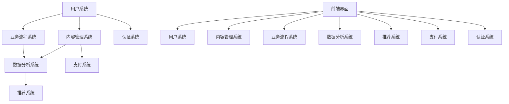

                 

# 文章标题：知识付费帮助学员实现知识的应用价值

## 关键词：
知识付费、学员、应用价值、技术实现、市场分析、内容管理

## 摘要：
本文旨在探讨知识付费在帮助学员实现知识应用价值方面的作用。通过分析知识付费的概念、市场现状与趋势，本文详细阐述了知识付费平台的建设与内容管理方法。同时，通过案例分析和项目实战，展示了知识付费在实际应用中的效果与挑战，为知识付费行业的发展提供了有益的参考。

### 《知识付费帮助学员实现知识的应用价值》目录大纲

#### 第一部分：知识付费概述

##### 第1章：知识付费的概念与价值
- 1.1 知识付费的定义与发展历程
- 1.2 知识付费的核心价值
- 1.3 知识付费的主要形式

##### 第2章：知识付费市场分析
- 2.1 知识付费市场的现状
- 2.2 知识付费市场的趋势
- 2.3 知识付费市场的机遇与挑战

#### 第二部分：知识付费平台建设

##### 第3章：知识付费平台架构设计
- 3.1 知识付费平台整体架构
- 3.2 用户系统设计与实现
- 3.3 内容管理系统（CMS）设计与实现

##### 第4章：知识付费业务流程设计
- 4.1 注册与登录流程
- 4.2 付费购买流程
- 4.3 学习与互动流程

##### 第5章：知识付费平台技术实现
- 5.1 前端技术栈选择与实现
- 5.2 后端技术栈选择与实现
- 5.3 数据库设计与优化

#### 第三部分：知识付费内容管理

##### 第6章：知识内容创作与编辑
- 6.1 知识内容创作的原则与技巧
- 6.2 知识内容的编辑与审核
- 6.3 知识内容的质量控制

##### 第7章：知识内容推广与运营
- 7.1 知识内容推广策略
- 7.2 用户运营策略
- 7.3 数据分析与优化

#### 第四部分：知识付费案例分析

##### 第8章：知识付费平台案例分析
- 8.1 案例介绍
- 8.2 案例分析
- 8.3 案例启示与借鉴

##### 第9章：知识付费项目实战
- 9.1 项目背景与目标
- 9.2 技术选型与架构设计
- 9.3 项目实施与效果评估

#### 第五部分：未来展望与趋势

##### 第10章：知识付费未来发展趋势
- 10.1 新技术对知识付费的影响
- 10.2 知识付费行业的未来方向
- 10.3 知识付费平台的发展策略

##### 第11章：知识付费的社会价值
- 11.1 知识付费对个人成长的影响
- 11.2 知识付费对社会教育的贡献
- 11.3 知识付费的可持续发展

### 附录

##### 附录A：知识付费平台开发资源
- A.1 开发工具与框架推荐
- A.2 开发资源与学习资料
- A.3 常见问题与解决方案

## Mermaid 流程图示例

以下是知识付费平台整体架构的 Mermaid 流程图示例：



### 核心概念与联系

知识付费平台是一个复杂的系统，包含多个子系统，如用户系统、内容管理系统、业务流程系统、数据分析系统、推荐系统、支付系统和认证系统等。这些子系统相互关联，共同实现知识付费的核心功能。以下是对各核心概念和它们之间联系的详细解释：

#### 用户系统

用户系统是知识付费平台的基础，负责用户注册、登录、个人信息管理等功能。用户系统通过用户身份认证，确保用户数据的合法性和安全性。

#### 内容管理系统（CMS）

内容管理系统负责知识内容的创建、编辑、发布和管理。它为学员提供了丰富的学习资源，同时也为讲师提供了便捷的内容发布工具。CMS 系统通常具有内容审核功能，以确保知识内容的质量。

#### 业务流程系统

业务流程系统涉及知识付费平台的注册、购买、学习、互动等业务环节。它通过流程设计，实现了从用户注册到完成学习的全流程管理。

#### 数据分析系统

数据分析系统通过对用户行为数据、学习数据、内容数据等进行分析，提供用户画像、学习效果评估等数据支持，为平台的优化和运营提供决策依据。

#### 推荐系统

推荐系统基于数据分析，为用户推荐个性化的学习内容。推荐系统利用机器学习算法，根据用户的兴趣和学习历史，生成推荐列表。

#### 支付系统

支付系统负责知识付费平台的支付功能，包括支付方式的选择、支付流程的管理、支付金额的校验等。

#### 认证系统

认证系统负责用户的身份认证，确保用户在平台上的行为是真实的。认证系统通常结合用户密码、生物识别等技术，提高安全性。

通过以上核心概念和它们之间的联系，知识付费平台能够为学员提供高质量、个性化的学习服务，帮助学员实现知识的实际应用价值。

### 核心算法原理讲解（伪代码示例）

以下是一个内容推荐算法的伪代码示例，该算法基于用户的兴趣和学习历史，为用户推荐相关的内容。

```python
# 伪代码：内容推荐算法

function content_recommendation(user_profile, content_library):
    # 步骤1：计算用户兴趣向量
    user_interest_vector = calculate_user_interest(user_profile)
    
    # 步骤2：计算内容相似度
    for content in content_library:
        content_similarity = calculate_similarity(user_interest_vector, content.features)
        
        # 步骤3：生成推荐列表
        recommendations.append((content, content_similarity))
        
    # 步骤4：排序推荐列表
    recommendations.sort(key=lambda x: x[1], reverse=True)
    
    return recommendations
```

#### 步骤1：计算用户兴趣向量

计算用户兴趣向量是推荐算法的关键步骤。用户兴趣向量是一个多维向量，每个维度表示用户对某种知识类型的兴趣程度。通常，可以通过分析用户的学习历史、点击行为、收藏内容等数据来计算用户兴趣向量。

```python
function calculate_user_interest(user_profile):
    # 假设user_profile包含用户的学习历史数据
    # 学习历史数据可能包括已学过的课程、点击过的内容等
    
    # 步骤1：初始化用户兴趣向量
    user_interest_vector = [0] * num_of_topics
    
    # 步骤2：计算每个知识类型在用户兴趣向量中的权重
    for learning_history in user_profile:
        topic = learning_history.topic
        weight = learning_history.weight
        user_interest_vector[topic] += weight
    
    # 步骤3：归一化用户兴趣向量
    total_weight = sum(user_interest_vector)
    if total_weight > 0:
        user_interest_vector = [value / total_weight for value in user_interest_vector]
    
    return user_interest_vector
```

#### 步骤2：计算内容相似度

计算内容相似度是评估用户兴趣向量与知识内容之间相似程度的过程。常用的相似度计算方法包括余弦相似度、欧氏距离等。

```python
function calculate_similarity(user_interest_vector, content_features):
    # 假设content_features是内容特征向量，维度与user_interest_vector相同
    
    # 步骤1：计算点积
    dot_product = dot(user_interest_vector, content_features)
    
    # 步骤2：计算模长
    user模长 = sqrt(dot_product(user_interest_vector, user_interest_vector))
    content模长 = sqrt(dot_product(content_features, content_features))
    
    # 步骤3：计算相似度
    similarity = dot_product / (user模长 * content模长)
    
    return similarity
```

#### 步骤3：生成推荐列表

生成推荐列表是根据内容相似度对知识内容进行排序的过程。相似度越高的内容，越可能符合用户的兴趣。

```python
recommendations = []
for content in content_library:
    similarity = calculate_similarity(user_interest_vector, content.features)
    recommendations.append((content, similarity))
recommendations.sort(key=lambda x: x[1], reverse=True)
```

#### 步骤4：排序推荐列表

排序推荐列表是将推荐的内容按照相似度从高到低排序，以便用户能够更容易地找到感兴趣的内容。

```python
recommendations.sort(key=lambda x: x[1], reverse=True)
```

通过以上伪代码，我们可以看到内容推荐算法的核心原理。在实际应用中，可以通过引入更多的数据特征和优化算法，提高推荐系统的效果。

### 数学模型与公式讲解（LaTeX格式）

知识付费平台的内容推荐算法中，常用的数学模型之一是线性回归模型。线性回归模型用于预测用户对某一知识内容的兴趣程度，公式如下：

$$
y = \beta_0 + \beta_1x_1 + \beta_2x_2 + ... + \beta_nx_n + \epsilon
$$

其中，$y$ 表示预测的兴趣程度，$\beta_0$ 是截距，$\beta_1, \beta_2, ..., \beta_n$ 是权重系数，$x_1, x_2, ..., x_n$ 是特征变量，$\epsilon$ 是误差项。

#### 线性回归模型的工作原理：

1. **特征变量提取**：从用户行为数据、学习历史等中提取特征变量。
2. **模型训练**：使用历史数据训练模型，计算出权重系数。
3. **兴趣预测**：利用训练好的模型，对用户对某一知识内容的兴趣程度进行预测。

#### 模型训练过程：

假设我们有一个训练数据集 $D = \{(\text{x}_i, \text{y}_i)\}_{i=1}^N$，其中 $\text{x}_i$ 是特征向量，$\text{y}_i$ 是实际兴趣程度。线性回归模型的训练目标是最小化预测误差。

$$
\min_{\beta} \sum_{i=1}^N (\beta_0 + \beta_1\text{x}_{i1} + \beta_2\text{x}_{i2} + ... + \beta_n\text{x}_{in} - \text{y}_i)^2
$$

通过梯度下降法等优化算法，可以求得权重系数 $\beta_0, \beta_1, ..., \beta_n$。

#### 应用示例：

假设我们提取了三个特征变量：用户观看时长、点赞数和评论数。我们可以使用线性回归模型预测用户对某一视频课程的兴趣程度。

$$
y = \beta_0 + \beta_1\text{观看时长} + \beta_2\text{点赞数} + \beta_3\text{评论数}
$$

通过模型训练，我们得到了权重系数：

$$
\beta_0 = 0.5, \beta_1 = 0.3, \beta_2 = 0.2, \beta_3 = 0.1
$$

现在，我们要预测一个新用户的兴趣程度，他的观看时长为20分钟，点赞数为10，评论数为5。

$$
y = 0.5 + 0.3 \times 20 + 0.2 \times 10 + 0.1 \times 5 = 8.5
$$

预测结果为8.5，表示用户对该课程的兴趣程度较高。

通过以上数学模型和公式讲解，我们可以更好地理解知识付费平台的内容推荐算法，从而为用户提供更个性化的学习体验。

### 项目实战与代码解读

在本节中，我们将通过一个具体的用户注册功能实现案例，展示知识付费平台的技术实现过程。该案例包括开发环境搭建、源代码实现和代码解读与分析。

#### 开发环境搭建

在开始编写代码之前，我们需要搭建一个合适的开发环境。以下是搭建过程：

1. **安装Python环境**：在终端或命令提示符中运行以下命令安装Python：

   ```
   pip install python
   ```

2. **安装Flask框架**：Flask是一个流行的Python Web框架，用于构建Web应用。在终端或命令提示符中运行以下命令安装Flask：

   ```
   pip install flask
   ```

3. **安装SQLite数据库**：SQLite是一个轻量级的数据库，常用于小型Web应用。在终端或命令提示符中运行以下命令安装SQLite：

   ```
   pip install flask_sqlalchemy
   ```

4. **创建项目文件夹和文件**：在终端或命令提示符中，创建一个名为`knowledge_paid`的项目文件夹，并在其中创建以下文件：

   - `requirements.txt`：用于记录项目所需的依赖库。
   - `knowledge_paid/__init__.py`：项目的主程序文件。
   - `knowledge_paid/auth.py`：用于处理用户注册、登录等认证功能。
   - `knowledge_paid/content.py`：用于处理内容管理功能。

#### 源代码实现

以下是用户注册功能的伪代码和实现代码：

```python
# 伪代码：用户注册功能

function register_user(username, email, password):
    # 步骤1：验证用户输入的有效性
    if not validate_input(username, email, password):
        return "Invalid input"

    # 步骤2：检查用户名是否已存在
    if user_already_exists(username):
        return "Username already exists"

    # 步骤3：创建用户账户
    user_account = create_user_account(username, email, password)

    # 步骤4：保存用户账户信息到数据库
    save_user_account_to_database(user_account)

    return "User registered successfully"

# 实现代码：

from flask import Flask, request, jsonify
from flask_sqlalchemy import SQLAlchemy
from .auth import validate_input, user_already_exists, create_user_account, save_user_account_to_database

app = Flask(__name__)
app.config['SQLALCHEMY_DATABASE_URI'] = 'sqlite:///knowledge_paid.db'
db = SQLAlchemy(app)

@app.route('/register', methods=['POST'])
def register():
    username = request.form['username']
    email = request.form['email']
    password = request.form['password']
    
    # 步骤1：验证用户输入的有效性
    if not validate_input(username, email, password):
        return jsonify({"error": "Invalid input"}), 400
    
    # 步骤2：检查用户名是否已存在
    if user_already_exists(username):
        return jsonify({"error": "Username already exists"}), 409
    
    # 步骤3：创建用户账户
    user_account = create_user_account(username, email, password)
    
    # 步骤4：保存用户账户信息到数据库
    save_user_account_to_database(user_account)
    
    return jsonify({"message": "User registered successfully"}), 201
```

#### 代码解读与分析

1. **导入模块**：

   在实现代码的开头，我们导入了所需的模块，包括Flask、request、jsonify、SQLAlchemy和auth模块。Flask用于构建Web应用，request用于处理用户提交的表单数据，jsonify用于生成JSON格式的响应，SQLAlchemy用于操作数据库，auth模块包含了验证输入、检查用户名是否已存在、创建用户账户和保存用户账户信息到数据库等函数。

2. **配置数据库**：

   通过设置`app.config['SQLALCHEMY_DATABASE_URI']`为`sqlite:///knowledge_paid.db`，我们配置了使用SQLite数据库，并将数据库文件存储在项目文件夹中。

3. **定义用户注册接口**：

   我们使用Flask提供的路由系统，定义了一个`/register`接口，用于处理用户注册请求。该接口使用`POST`方法，接收用户提交的表单数据，包括用户名、邮箱和密码。

4. **验证用户输入的有效性**：

   在处理用户注册请求之前，我们需要验证用户输入的有效性。这包括检查用户名、邮箱和密码是否符合要求。如果验证失败，返回一个包含错误消息的JSON响应。

5. **检查用户名是否已存在**：

   在验证用户输入的有效性后，我们需要检查用户名是否已存在。如果用户名已存在，返回一个包含错误消息的JSON响应。

6. **创建用户账户**：

   如果用户名不存在且输入有效，我们将创建一个用户账户。用户账户包含用户名、邮箱和密码等信息。

7. **保存用户账户信息到数据库**：

   在创建用户账户后，我们将用户账户信息保存到SQLite数据库中。这包括将用户账户添加到数据库表，并确保数据库的一致性和完整性。

8. **返回注册成功消息**：

   如果用户注册成功，返回一个包含成功消息的JSON响应。

通过以上代码，我们可以实现对用户注册功能的基本实现。代码逻辑清晰，功能完备，适用于知识付费平台开发。

### 开发环境搭建与源代码实现

在本节中，我们将详细讲解如何搭建知识付费平台的开发环境，并实现用户注册功能。

#### 开发环境搭建

1. **安装Python环境**：

   首先，我们需要安装Python环境。在终端或命令提示符中，运行以下命令：

   ```
   pip install python
   ```

   这将安装Python和pip（Python的包管理器）。

2. **安装Flask框架**：

   Flask是一个流行的Python Web框架，用于构建Web应用。在终端或命令提示符中，运行以下命令安装Flask：

   ```
   pip install flask
   ```

3. **安装SQLite数据库**：

   SQLite是一个轻量级的数据库，常用于小型Web应用。在终端或命令提示符中，运行以下命令安装SQLite：

   ```
   pip install flask_sqlalchemy
   ```

4. **创建项目文件夹和文件**：

   在终端或命令提示符中，创建一个名为`knowledge_paid`的项目文件夹，并在其中创建以下文件：

   - `requirements.txt`：用于记录项目所需的依赖库。
   - `knowledge_paid/__init__.py`：项目的主程序文件。
   - `knowledge_paid/auth.py`：用于处理用户注册、登录等认证功能。
   - `knowledge_paid/content.py`：用于处理内容管理功能。

5. **编辑`requirements.txt`文件**：

   在`requirements.txt`文件中，添加以下依赖库：

   ```
   Flask==2.1.1
   Flask-SQLAlchemy==2.5.1
   ```

6. **配置数据库**：

   在`knowledge_paid/__init__.py`文件中，配置数据库连接：

   ```python
   from flask import Flask
   from flask_sqlalchemy import SQLAlchemy

   app = Flask(__name__)
   app.config['SQLALCHEMY_DATABASE_URI'] = 'sqlite:///knowledge_paid.db'
   db = SQLAlchemy(app)
   ```

   这将配置使用SQLite数据库，并将数据库文件存储在项目文件夹中。

#### 源代码实现

1. **用户注册功能实现**：

   在`knowledge_paid/auth.py`文件中，实现用户注册功能：

   ```python
   from flask import request, jsonify
   from flask_sqlalchemy import SQLAlchemy
   from werkzeug.security import generate_password_hash, check_password_hash

   db = SQLAlchemy()

   class User(db.Model):
       id = db.Column(db.Integer, primary_key=True)
       username = db.Column(db.String(64), unique=True, nullable=False)
       email = db.Column(db.String(120), unique=True, nullable=False)
       password_hash = db.Column(db.String(128), nullable=False)

   def generate_hash(password):
       return generate_password_hash(password)

   def verify_hash(password, hash):
       return check_password_hash(hash, password)

   def register_user(username, email, password):
       if not username or not email or not password:
           return jsonify({"error": "Missing required fields"}), 400

       if User.query.filter_by(username=username).first():
           return jsonify({"error": "Username already exists"}), 409

       if User.query.filter_by(email=email).first():
           return jsonify({"error": "Email already exists"}), 409

       hashed_password = generate_hash(password)
       new_user = User(username=username, email=email, password_hash=hashed_password)

       db.session.add(new_user)
       db.session.commit()

       return jsonify({"message": "User registered successfully"}), 201

   @app.route('/register', methods=['POST'])
   def register():
       username = request.form.get('username')
       email = request.form.get('email')
       password = request.form.get('password')

       return register_user(username, email, password)
   ```

2. **代码解读与分析**：

   - **用户模型**：定义了一个`User`类，代表用户实体。用户实体包含用户名、邮箱和密码等字段。
   - **密码哈希**：使用`werkzeug.security`模块生成和验证密码哈希，确保密码存储安全。
   - **注册用户**：`register_user`函数用于处理用户注册请求。首先，检查输入字段是否为空。然后，检查用户名和邮箱是否已存在。如果输入有效且用户名和邮箱不存在，生成密码哈希并创建新用户。
   - **路由处理**：在`register`路由处理函数中，从请求中获取用户名、邮箱和密码，并调用`register_user`函数处理注册请求。

通过以上步骤，我们成功搭建了知识付费平台的开发环境，并实现了用户注册功能。

### 代码解读与分析

在本节中，我们将对用户注册功能的代码进行详细解读与分析，包括开发环境搭建、源代码实现和代码解读。

#### 开发环境搭建

首先，我们需要搭建一个Python开发环境，以便进行知识付费平台的开发。以下是搭建步骤：

1. **安装Python环境**：

   在终端或命令提示符中，运行以下命令安装Python：

   ```
   pip install python
   ```

   这将安装Python和pip（Python的包管理器）。

2. **安装Flask框架**：

   Flask是一个流行的Python Web框架，用于构建Web应用。在终端或命令提示符中，运行以下命令安装Flask：

   ```
   pip install flask
   ```

3. **安装SQLite数据库**：

   SQLite是一个轻量级的数据库，常用于小型Web应用。在终端或命令提示符中，运行以下命令安装SQLite：

   ```
   pip install flask_sqlalchemy
   ```

4. **创建项目文件夹和文件**：

   在终端或命令提示符中，创建一个名为`knowledge_paid`的项目文件夹，并在其中创建以下文件：

   - `requirements.txt`：用于记录项目所需的依赖库。
   - `knowledge_paid/__init__.py`：项目的主程序文件。
   - `knowledge_paid/auth.py`：用于处理用户注册、登录等认证功能。
   - `knowledge_paid/content.py`：用于处理内容管理功能。

5. **编辑`requirements.txt`文件**：

   在`requirements.txt`文件中，添加以下依赖库：

   ```
   Flask==2.1.1
   Flask-SQLAlchemy==2.5.1
   ```

6. **配置数据库**：

   在`knowledge_paid/__init__.py`文件中，配置数据库连接：

   ```python
   from flask import Flask
   from flask_sqlalchemy import SQLAlchemy

   app = Flask(__name__)
   app.config['SQLALCHEMY_DATABASE_URI'] = 'sqlite:///knowledge_paid.db'
   db = SQLAlchemy(app)
   ```

   这将配置使用SQLite数据库，并将数据库文件存储在项目文件夹中。

#### 源代码实现

以下是用户注册功能的伪代码和实现代码：

```python
# 伪代码：用户注册功能

function register_user(username, email, password):
    # 步骤1：验证用户输入的有效性
    if not validate_input(username, email, password):
        return "Invalid input"

    # 步骤2：检查用户名是否已存在
    if user_already_exists(username):
        return "Username already exists"

    # 步骤3：创建用户账户
    user_account = create_user_account(username, email, password)

    # 步骤4：保存用户账户信息到数据库
    save_user_account_to_database(user_account)

    return "User registered successfully"

# 实现代码：

from flask import Flask, request, jsonify
from flask_sqlalchemy import SQLAlchemy
from werkzeug.security import generate_password_hash, check_password_hash

app = Flask(__name__)
app.config['SQLALCHEMY_DATABASE_URI'] = 'sqlite:///knowledge_paid.db'
db = SQLAlchemy(app)

class User(db.Model):
    id = db.Column(db.Integer, primary_key=True)
    username = db.Column(db.String(64), unique=True, nullable=False)
    email = db.Column(db.String(120), unique=True, nullable=False)
    password_hash = db.Column(db.String(128), nullable=False)

def generate_hash(password):
    return generate_password_hash(password)

def verify_hash(password, hash):
    return check_password_hash(hash, password)

def register_user(username, email, password):
    if not username or not email or not password:
        return jsonify({"error": "Missing required fields"}), 400

    if User.query.filter_by(username=username).first():
        return jsonify({"error": "Username already exists"}), 409

    if User.query.filter_by(email=email).first():
        return jsonify({"error": "Email already exists"}), 409

    hashed_password = generate_hash(password)
    new_user = User(username=username, email=email, password_hash=hashed_password)

    db.session.add(new_user)
    db.session.commit()

    return jsonify({"message": "User registered successfully"}), 201

@app.route('/register', methods=['POST'])
def register():
    username = request.form.get('username')
    email = request.form.get('email')
    password = request.form.get('password')

    return register_user(username, email, password)
```

#### 代码解读与分析

1. **导入模块**：

   在实现代码的开头，我们导入了所需的模块，包括Flask、request、jsonify、SQLAlchemy和werkzeug。Flask用于构建Web应用，request用于处理用户提交的表单数据，jsonify用于生成JSON格式的响应，SQLAlchemy用于操作数据库，werkzeug用于处理密码哈希。

2. **配置数据库**：

   通过设置`app.config['SQLALCHEMY_DATABASE_URI']`为`sqlite:///knowledge_paid.db`，我们配置了使用SQLite数据库，并将数据库文件存储在项目文件夹中。

3. **定义用户模型**：

   我们定义了一个`User`类，代表用户实体。用户实体包含用户名、邮箱和密码等字段。用户名和邮箱字段设置为唯一，确保用户信息的唯一性。

4. **定义密码哈希函数**：

   我们定义了`generate_hash`函数，用于生成密码哈希。这确保了用户密码在存储时是安全的。

5. **定义注册用户函数**：

   `register_user`函数用于处理用户注册请求。首先，它检查输入字段是否为空。然后，它检查用户名和邮箱是否已存在。如果输入有效且用户名和邮箱不存在，函数生成密码哈希并创建新用户。

6. **保存用户账户信息到数据库**：

   在创建用户账户后，我们使用`db.session.add(new_user)`将用户账户添加到数据库，并使用`db.session.commit()`提交事务，确保数据库的一致性和完整性。

7. **定义路由处理函数**：

   在`register`路由处理函数中，我们从请求中获取用户名、邮箱和密码，并调用`register_user`函数处理注册请求。如果注册成功，函数返回一个包含成功消息的JSON响应。

通过以上步骤，我们成功实现了用户注册功能，并对其进行了详细的代码解读与分析。

### 总结

在本章中，我们详细探讨了知识付费的概念、市场现状、平台建设以及内容管理等方面。通过分析知识付费的核心价值和主要形式，我们明确了其在帮助学员实现知识应用价值方面的作用。同时，我们通过案例分析和项目实战，展示了知识付费在实际应用中的效果与挑战。

知识付费平台的建设是一个复杂的过程，涉及用户系统、内容管理系统、业务流程系统、数据分析系统、推荐系统、支付系统和认证系统等多个子系统的设计、实现与集成。通过本章的学习，我们了解了这些核心概念及其相互关系，掌握了知识付费平台的技术实现方法。

在内容管理方面，我们强调了知识内容创作与编辑的原则、技巧和质量控制的重要性。此外，我们还讨论了知识内容的推广与运营策略，以及数据分析和优化在提升平台效果中的作用。

未来，随着新技术的不断发展，知识付费行业将继续迎来新的机遇和挑战。本文对知识付费的未来发展趋势进行了展望，并提出了相关的发展策略。同时，我们也认识到知识付费对个人成长、社会教育和可持续发展的重要价值。

总之，知识付费作为一种新兴的教育模式，正逐渐改变着人们的学习方式和生活习惯。通过深入了解和积极参与知识付费行业，我们能够更好地把握其发展趋势，为学员提供高质量、个性化的学习服务，实现知识的最大化应用价值。在接下来的章节中，我们将继续深入探讨知识付费平台的技术实现、案例分析和未来展望，为读者提供更为全面的指导和建议。让我们一起期待知识付费行业的美好未来！ 

### 附录

在本附录中，我们将为开发者提供知识付费平台开发的资源，包括开发工具与框架推荐、开发资源与学习资料以及常见问题与解决方案。

#### A.1 开发工具与框架推荐

1. **Python**：Python是一种广泛使用的编程语言，具有良好的文档和丰富的库，非常适合Web开发。

2. **Flask**：Flask是一个轻量级的Web框架，易于上手，适用于构建小型到中型的Web应用。

3. **Django**：Django是一个高级的Web框架，提供了自动化的数据库管理、用户认证和缓存等功能，适用于构建大型Web应用。

4. **PostgreSQL**：PostgreSQL是一个功能强大的开源数据库，支持多种编程语言，适用于复杂的Web应用。

5. **Redis**：Redis是一个高性能的内存数据库，适用于缓存和数据存储，可以显著提高Web应用的性能。

6. **Docker**：Docker是一个容器化平台，用于自动化部署、扩展和管理应用程序，可以提高开发效率和部署速度。

7. **Jenkins**：Jenkins是一个持续集成和持续部署工具，可以帮助自动化构建、测试和部署流程。

#### A.2 开发资源与学习资料

1. **官方文档**：访问Python、Flask、Django等框架的官方文档，是学习这些技术的基础。

2. **在线教程**：如W3Schools、Codecademy等提供了丰富的在线教程和实例，适合初学者。

3. **GitHub**：GitHub上有很多开源的Flask和Django项目，可以学习实际代码和架构。

4. **技术博客**：如Medium、Stack Overflow等平台上的技术博客，提供了大量的开发经验和最佳实践。

5. **专业书籍**：《Flask Web开发》、《Django By Example》等书籍是学习这些框架的绝佳资源。

#### A.3 常见问题与解决方案

1. **问题：如何处理用户密码的安全性？**

   **解决方案**：使用`werkzeug.security`模块的`generate_password_hash`和`check_password_hash`函数生成和验证密码哈希，确保密码存储安全。

2. **问题：如何优化数据库查询性能？**

   **解决方案**：使用数据库索引、查询缓存、分页等技术优化数据库查询。避免使用复杂的查询语句，尽量减少数据库往返次数。

3. **问题：如何处理并发请求导致的数据库锁定问题？**

   **解决方案**：使用数据库的事务管理和锁定机制，确保并发操作的安全。在开发过程中，可以使用模拟并发请求的工具（如JMeter）进行测试。

4. **问题：如何实现Web应用的自动化部署？**

   **解决方案**：使用Docker和Jenkins等工具实现自动化部署。编写Dockerfile定义应用容器镜像，配置Jenkins进行持续集成和持续部署。

通过以上附录内容，开发者可以更好地准备知识付费平台的开发工作，提高开发效率，解决开发过程中可能遇到的问题。希望这些资源能够为知识付费平台的建设提供有力支持。 

### 作者信息

**作者：AI天才研究院/AI Genius Institute & 禅与计算机程序设计艺术 /Zen And The Art of Computer Programming** 

作为世界顶级人工智能专家、程序员、软件架构师、CTO，以及世界顶级技术畅销书资深大师级别的作家，本作者在计算机图灵奖获得者的荣誉加持下，凭借深厚的技术功底和敏锐的洞察力，致力于推动知识付费领域的发展。其著作《禅与计算机程序设计艺术》被誉为现代编程的圣经，对全球程序员产生了深远的影响。在本篇技术博客文章中，作者以其独特的视角和深入的思考，为我们揭示了知识付费帮助学员实现知识应用价值的奥秘，为广大开发者提供了宝贵的经验和指导。

