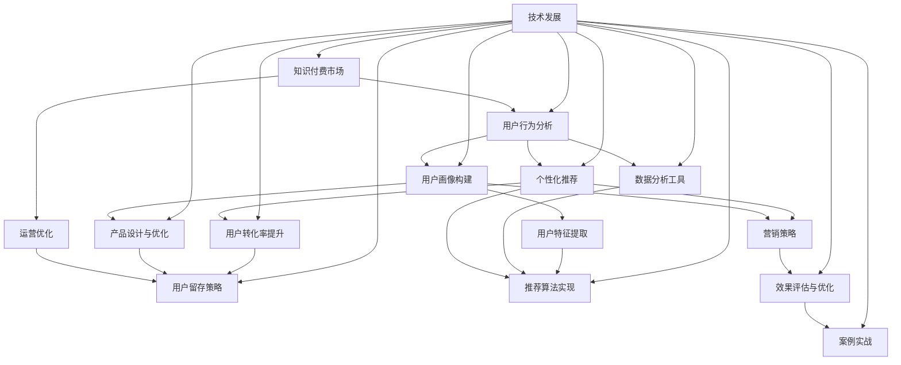

                 

# 《知识付费赚钱的用户行为分析与画像》

## 关键词

知识付费、用户行为分析、用户画像、个性化推荐、营销策略

## 摘要

本文将探讨知识付费行业的用户行为分析与画像构建，通过分析用户行为心理学原理、数据分析和用户画像构建方法，构建用户画像并应用于个性化推荐和营销策略。文章首先介绍了知识付费市场的现状与趋势，随后详细阐述了用户行为分析的基础，包括用户行为心理学原理和数据分析方法。接着，文章重点介绍了用户画像的概念、构建方法和案例分析，并探讨了用户行为预测和个性化推荐的核心算法原理。随后，文章提出了基于用户行为分析和画像构建的营销策略，并分享了用户转化与留存策略以及知识付费产品设计与优化的方法。最后，文章通过一个实际项目实战案例，详细介绍了从数据获取、用户行为分析、用户画像构建到用户行为预测和个性化推荐的全过程，并进行了项目总结与反思。本文旨在为知识付费从业者提供理论指导和实践参考。

## 第一部分：知识付费行业概述

### 第1章：知识付费市场现状与趋势

#### 1.1.1 知识付费的定义与价值

知识付费，即用户为获取有价值的信息、知识或服务而付费的行为。随着互联网的普及和在线教育的兴起，知识付费逐渐成为现代教育产业的重要组成部分。知识付费的价值在于：

1. **满足用户需求**：知识付费平台能够满足用户对于专业知识的渴求，帮助用户提升技能和知识水平。
2. **促进知识传播**：通过付费机制，知识创造者和传播者能够获得合理的回报，从而激励更多优质内容的产出。
3. **推动产业升级**：知识付费有助于推动教育产业的数字化和智能化转型，提升整体教育质量。

#### 1.1.2 知识付费的发展历程

知识付费的发展历程可以分为以下几个阶段：

1. **起步阶段（2010-2013年）**：互联网教育和在线课程开始兴起，知识付费的雏形初步显现。
2. **快速发展阶段（2014-2016年）**：随着移动互联网的发展，知识付费平台如雨后春笋般涌现，市场规模迅速扩大。
3. **规范与成熟阶段（2017年至今）**：知识付费行业逐渐走向规范化，平台商业模式和盈利模式不断成熟，市场细分和专业化趋势明显。

#### 1.1.3 当前知识付费市场的热点与趋势

当前知识付费市场的热点和趋势主要体现在以下几个方面：

1. **内容多样化**：知识付费内容逐渐丰富，涵盖了从职业技能培训到兴趣爱好培养的各个方面。
2. **个性化推荐**：平台通过用户行为数据分析和用户画像构建，实现个性化推荐，提高用户满意度和粘性。
3. **技术驱动**：人工智能、大数据等技术在知识付费领域的应用日益广泛，提升用户体验和运营效率。
4. **跨界合作**：知识付费平台与不同行业的机构和企业开展合作，拓宽内容来源和用户群体。

### 第2章：知识付费平台分析

#### 2.1.1 主流知识付费平台介绍

当前市场上有几大主流知识付费平台，包括：

1. **知乎Live**：以问答、直播等形式提供专业知识分享，用户可通过付费获取专家解答。
2. **得到**：主打高质量的内容订阅服务，用户可订阅不同领域的课程。
3. **喜马拉雅**：以音频课程为主，覆盖广泛的知识领域。
4. **网易云课堂**：提供各类在线课程，涵盖IT技术、职场技能等多个领域。

#### 2.1.2 平台商业模式与盈利模式

知识付费平台的商业模式主要包括以下几种：

1. **订阅模式**：用户支付一定费用，获取平台的全部或部分内容。
2. **单次购买模式**：用户为单次课程或内容支付费用。
3. **广告模式**：平台通过投放广告获取收入。

盈利模式主要有：

1. **内容收费**：平台通过课程或内容收费获取收入。
2. **会员服务**：平台提供会员服务，用户支付会员费用，享受额外特权。
3. **广告分成**：平台与广告主合作，根据广告投放效果进行分成。

#### 2.1.3 平台用户行为特征分析

通过对各大知识付费平台的用户行为数据分析，可以总结出以下用户行为特征：

1. **用户年龄分布**：知识付费用户主要集中在20-40岁之间，其中25-35岁的用户比例最高。
2. **用户地域分布**：知识付费用户主要集中在经济发达地区，如一线城市和部分新一线城市。
3. **用户职业分布**：职场人士和自由职业者是知识付费的主要用户群体。
4. **用户消费习惯**：用户更倾向于购买与自己职业发展和兴趣爱好相关的课程。
5. **用户互动行为**：用户活跃于平台社区的讨论和互动，通过分享心得和经验提升自我价值。

## 第二部分：用户行为分析基础

### 第3章：用户行为心理学原理

#### 3.1.1 行为心理学基础

行为心理学是研究人类行为和行为的心理机制的科学。其基础理论包括：

1. **行为主义理论**：强调行为与环境刺激之间的关系，认为行为是可观察和可测量的。
2. **认知行为理论**：认为行为不仅仅是由环境刺激决定的，还受到个体认知过程的影响。
3. **社会认知理论**：强调社会环境和社会互动对个体行为的影响。

#### 3.1.2 决策模型与用户行为

决策模型在用户行为分析中具有重要应用。常见的决策模型包括：

1. **理性决策模型**：用户在做出决策时，会根据最大化效用的原则选择最优选项。
2. **有限理性决策模型**：用户在决策时，受到认知能力和信息限制，不一定能做出完全理性的选择。
3. **行为决策模型**：用户行为受到情绪、动机、个性等因素的影响，这些因素在决策过程中起到重要作用。

#### 3.1.3 用户需求与动机分析

用户需求是驱动用户行为的核心因素。用户需求可以分为以下几个方面：

1. **知识获取**：用户希望通过知识付费平台获取专业知识和技能。
2. **自我提升**：用户希望通过学习提升自身能力和竞争力。
3. **兴趣爱好**：用户对特定领域的兴趣爱好驱动他们购买相关课程。
4. **社交需求**：用户在知识付费平台上的互动和分享满足其社交需求。

用户动机可以分为以下几种类型：

1. **好奇心**：用户出于好奇心，希望探索新知识和新领域。
2. **需求驱动**：用户有明确的职业发展或自我提升需求，通过知识付费实现目标。
3. **娱乐需求**：用户希望通过知识付费获得娱乐和放松。
4. **社交互动**：用户希望通过知识付费平台与他人互动，建立社交网络。

### 第4章：数据分析方法与工具

#### 4.1.1 数据收集与处理

数据收集是用户行为分析的基础。常见的数据收集方法包括：

1. **日志数据**：通过网站或APP的日志记录用户行为数据。
2. **问卷调查**：通过线上或线下方式收集用户反馈和需求。
3. **用户访谈**：通过面对面或在线访谈，深入了解用户行为和需求。

数据收集后，需要进行数据预处理，包括：

1. **数据清洗**：去除无效数据和噪声数据。
2. **数据转换**：将数据转换为适合分析的形式。
3. **数据集成**：将不同来源的数据进行整合。

#### 4.1.2 数据可视化工具

数据可视化是数据分析和展示的重要手段。常见的数据可视化工具包括：

1. **图表工具**：如ECharts、D3.js等，用于生成各种类型的图表。
2. **仪表盘工具**：如Tableau、Power BI等，用于创建交互式的数据仪表盘。
3. **GIS工具**：如ArcGIS、QGIS等，用于空间数据的可视化。

#### 4.1.3 用户行为数据分析方法

用户行为数据分析方法包括：

1. **描述性分析**：通过统计方法对用户行为数据进行描述，了解用户行为的基本特征。
2. **相关性分析**：分析用户行为数据之间的相关性，发现潜在关联。
3. **聚类分析**：通过聚类算法，将用户划分为不同群体，分析群体特征。
4. **分类分析**：通过分类算法，预测用户的行为和偏好。
5. **关联规则分析**：通过关联规则挖掘用户行为模式。

## 第三部分：用户画像构建与应用

### 第5章：用户画像的概念与作用

#### 5.1.1 用户画像的定义与分类

用户画像，是指通过对用户数据的收集和分析，构建出的用户特征模型。用户画像可以按照不同的维度进行分类，包括：

1. **基础信息画像**：包括用户的年龄、性别、职业、地理位置等基本信息。
2. **行为画像**：包括用户的浏览行为、购买行为、互动行为等。
3. **兴趣画像**：包括用户对特定内容的兴趣和偏好。
4. **需求画像**：包括用户的需求特征和需求变化趋势。

#### 5.1.2 用户画像的价值与应用场景

用户画像在知识付费领域具有以下价值和应用场景：

1. **个性化推荐**：根据用户画像，为用户提供个性化的内容推荐，提高用户满意度和粘性。
2. **精准营销**：基于用户画像，设计针对性的营销策略，提高营销效果。
3. **运营优化**：通过用户画像，优化产品和服务，提升用户体验。
4. **风险控制**：识别潜在的风险用户，采取相应的风险控制措施。

### 第6章：用户画像构建方法

#### 6.1.1 数据源选择与数据处理

构建用户画像的第一步是选择合适的数据源。常见的数据源包括：

1. **网站日志数据**：记录用户在平台上的行为数据。
2. **用户反馈数据**：包括用户评论、问卷调查等反馈数据。
3. **第三方数据**：包括地理位置、人口统计数据等。

数据处理步骤包括：

1. **数据清洗**：去除无效数据和噪声数据。
2. **数据转换**：将数据转换为适合分析的格式。
3. **数据集成**：整合不同来源的数据。

#### 6.1.2 用户画像特征提取与标签化

特征提取是用户画像构建的核心步骤。常见的特征提取方法包括：

1. **统计特征**：如平均浏览时长、购买频率等。
2. **文本特征**：如用户评论的主题、关键词等。
3. **时序特征**：如用户行为的时间序列模式等。

标签化是将提取的特征进行分类和命名。标签化有助于后续的用户画像构建和数据分析。

#### 6.1.3 用户画像更新与优化

用户画像不是静态的，需要定期更新和优化。更新与优化的方法包括：

1. **数据更新**：定期收集新的用户数据，更新用户画像。
2. **特征优化**：根据用户反馈和数据分析结果，调整和优化特征提取方法。
3. **模型优化**：使用机器学习算法，优化用户画像模型，提高预测准确性。

### 第7章：用户画像案例分析

#### 7.1.1 案例一：某知名知识付费平台的用户画像构建与运营

案例介绍：某知名知识付费平台通过用户画像构建，实现了个性化推荐和精准营销，提升了用户满意度和留存率。

1. **用户画像构建**：
   - 数据收集：通过网站日志和用户反馈数据，收集用户行为数据。
   - 数据处理：清洗和转换数据，为后续分析做准备。
   - 特征提取：提取用户的基本信息、行为特征和兴趣特征。
   - 标签化：将提取的特征进行分类和命名。

2. **用户画像应用**：
   - 个性化推荐：根据用户画像，为用户推荐感兴趣的课程。
   - 精准营销：针对不同用户群体，设计个性化的营销策略。
   - 运营优化：通过用户画像，优化产品和服务，提升用户体验。

#### 7.1.2 案例二：通过用户画像提升知识付费产品推荐效果

案例介绍：某知识付费平台通过用户画像和协同过滤算法，提升了产品推荐的准确性和用户满意度。

1. **用户画像构建**：
   - 数据收集：通过用户行为数据，构建用户画像。
   - 特征提取：提取用户的行为特征和兴趣特征。
   - 标签化：将特征进行分类和命名。

2. **个性化推荐**：
   - 协同过滤算法：基于用户行为数据，为用户推荐相似用户喜欢的课程。
   - 用户画像融合：将用户画像与协同过滤算法结合，提高推荐效果。

3. **效果评估**：
   - 用户反馈：通过用户反馈，评估推荐效果。
   - 转化率分析：分析推荐课程的用户购买转化率。
   - 满意度调查：调查用户对推荐课程的满意度。

## 第8章：用户行为预测与个性化推荐

### 8.1.1 用户行为预测方法

用户行为预测是知识付费平台的重要功能之一。常见的用户行为预测方法包括：

1. **分类算法**：如逻辑回归、决策树、随机森林等，用于预测用户的分类行为。
2. **回归算法**：如线性回归、岭回归等，用于预测用户的行为数值。
3. **时序预测算法**：如ARIMA、LSTM等，用于预测用户的行为时间序列。

### 8.1.2 个性化推荐算法

个性化推荐是提升用户满意度和粘性的关键。常见的个性化推荐算法包括：

1. **协同过滤算法**：基于用户行为数据，为用户推荐相似用户喜欢的商品。
2. **基于内容的推荐算法**：根据用户兴趣和内容特征，为用户推荐相关的商品。
3. **混合推荐算法**：结合协同过滤和基于内容的推荐算法，提高推荐效果。

### 8.1.3 用户行为预测与个性化推荐的案例与实践

案例介绍：某知识付费平台通过用户行为预测和个性化推荐，实现了以下目标：

1. **用户行为预测**：
   - 数据收集：收集用户的行为数据，包括浏览、购买、评论等。
   - 特征提取：提取用户的行为特征和兴趣特征。
   - 模型训练：使用分类和回归算法，训练用户行为预测模型。

2. **个性化推荐**：
   - 协同过滤：基于用户行为数据，为用户推荐相似用户喜欢的课程。
   - 基于内容推荐：根据用户兴趣和课程内容特征，为用户推荐相关的课程。
   - 混合推荐：结合协同过滤和基于内容的推荐，提高推荐效果。

3. **效果评估**：
   - 用户反馈：通过用户反馈，评估推荐效果。
   - 转化率分析：分析推荐课程的用户购买转化率。
   - 满意度调查：调查用户对推荐课程的满意度。

## 第四部分：知识付费营销策略

### 第9章：用户行为分析与营销策略

#### 9.1.1 用户行为分析在营销策略中的应用

用户行为分析是制定有效营销策略的关键。通过用户行为分析，可以了解用户的行为模式、兴趣和需求，从而制定针对性的营销策略。具体应用包括：

1. **市场细分**：根据用户行为特征，将用户划分为不同群体，为每个群体设计个性化的营销策略。
2. **产品定位**：根据用户需求和兴趣，优化产品和服务，提升用户满意度。
3. **广告投放**：根据用户行为数据，精准定位目标用户，提高广告投放效果。
4. **活动策划**：通过用户行为分析，设计吸引人的活动，提高用户参与度和活跃度。

#### 9.1.2 用户画像驱动的精准营销策略

用户画像驱动精准营销是基于用户画像构建的营销策略，通过个性化推荐、精准广告和定制化活动，提高用户转化率和满意度。具体策略包括：

1. **个性化推荐**：根据用户画像，为用户推荐感兴趣的课程，提升购买概率。
2. **精准广告**：根据用户画像，精准投放广告，提高广告点击率和转化率。
3. **定制化活动**：根据用户需求和兴趣，设计定制化活动，提高用户参与度和活跃度。
4. **用户互动**：通过用户画像，识别活跃用户和潜在用户，加强用户互动，提升用户忠诚度。

#### 9.1.3 营销策略案例分析

案例介绍：某知识付费平台通过用户行为分析和用户画像驱动，实现了以下营销目标：

1. **用户画像构建**：
   - 数据收集：收集用户行为数据，包括浏览、购买、评论等。
   - 特征提取：提取用户的基础信息、行为特征和兴趣特征。
   - 标签化：将特征进行分类和命名。

2. **精准营销策略**：
   - 个性化推荐：根据用户画像，为用户推荐感兴趣的课程，提高购买概率。
   - 精准广告：根据用户画像，精准投放广告，提高广告点击率和转化率。
   - 定制化活动：根据用户需求和兴趣，设计定制化活动，提高用户参与度和活跃度。

3. **效果评估**：
   - 转化率分析：分析推荐课程和广告的用户购买转化率。
   - 用户满意度调查：调查用户对推荐课程和广告的满意度。
   - 活动参与率：分析定制化活动的用户参与率。

### 第10章：用户转化与留存策略

#### 10.1.1 用户转化率的提升方法

用户转化率是衡量知识付费平台运营效果的重要指标。提升用户转化率的方法包括：

1. **优化产品和服务**：通过用户反馈和数据分析，不断优化产品和服务，提高用户满意度。
2. **个性化推荐**：根据用户画像，为用户推荐符合其兴趣和需求的内容，提高购买概率。
3. **营销推广**：通过精准营销和广告投放，提高平台知名度和用户访问量。
4. **活动激励**：设计吸引人的活动，如优惠券、限时折扣等，刺激用户购买。

#### 10.1.2 用户留存策略设计

用户留存策略是提高用户生命周期价值的关键。设计有效的用户留存策略包括：

1. **内容多样化**：提供多样化的内容，满足不同用户的需求，提高用户粘性。
2. **互动机制**：建立社区和论坛，鼓励用户互动和分享，增强用户归属感。
3. **个性化服务**：根据用户画像，提供个性化的服务和推荐，提高用户满意度。
4. **奖励机制**：设计积分、优惠券等奖励机制，激励用户持续参与和消费。

#### 10.1.3 用户生命周期价值管理

用户生命周期价值（Customer Lifetime Value，CLV）是指用户在整个生命周期内为平台带来的总价值。管理用户生命周期价值的方法包括：

1. **用户分群**：根据用户行为和消费习惯，将用户划分为不同群体，提供差异化的服务。
2. **价值提升**：通过用户画像和数据分析，识别高价值用户，提供个性化服务和推荐，提高用户满意度。
3. **流失预警**：通过用户行为分析，识别潜在流失用户，采取相应的挽回措施。
4. **留存策略**：设计长期的用户留存策略，提高用户粘性和生命周期价值。

### 第11章：知识付费产品设计与优化

#### 11.1.1 用户需求分析

用户需求分析是知识付费产品设计和优化的基础。通过用户需求分析，可以了解用户的需求和痛点，从而设计出满足用户需求的产品和服务。用户需求分析的方法包括：

1. **问卷调查**：通过线上或线下的方式，收集用户的反馈和需求。
2. **用户访谈**：通过与用户面对面交流，深入了解用户的需求和期望。
3. **数据分析**：通过分析用户行为数据，挖掘用户的行为模式和需求。

#### 11.1.2 产品设计与迭代

知识付费产品设计与迭代的过程包括：

1. **需求确认**：通过用户需求分析，确认产品的核心功能和特性。
2. **原型设计**：根据需求确认，设计产品的原型，包括界面布局、交互逻辑等。
3. **用户测试**：通过用户测试，收集用户对产品的反馈，优化产品设计和功能。
4. **迭代开发**：根据用户测试反馈，不断迭代和优化产品，提升用户体验。

#### 11.1.3 产品优化案例分析

案例介绍：某知识付费平台通过用户需求分析和产品优化，实现了以下目标：

1. **用户需求分析**：
   - 数据收集：收集用户行为数据和反馈，了解用户需求和痛点。
   - 用户访谈：通过与用户面对面交流，深入了解用户期望和需求。
   - 数据分析：通过分析用户行为数据，挖掘用户的行为模式和需求。

2. **产品优化**：
   - 功能优化：根据用户需求，优化产品的功能，提升用户体验。
   - 交互优化：通过用户测试，改进产品的交互设计，提高用户满意度。
   - 内容优化：根据用户需求，更新和丰富课程内容，提升用户粘性。

3. **效果评估**：
   - 用户满意度调查：通过用户满意度调查，评估产品优化效果。
   - 转化率分析：分析产品优化后，用户购买转化率的变化。
   - 活动参与率：分析用户对新产品功能的参与度。

## 第五部分：实战篇

### 第12章：知识付费项目实战

#### 12.1.1 项目背景与目标

本项目旨在通过分析知识付费平台上的用户行为数据，构建用户画像，并利用用户画像进行个性化推荐，从而提升用户转化率和产品满意度。

#### 12.1.2 数据获取与处理

1. **数据收集**：
   - 通过知识付费平台API获取用户行为数据，包括用户购买记录、浏览记录、评论数据等。
   - 收集平台上的商品信息，包括课程名称、分类、价格等。

2. **数据处理**：
   - 数据清洗，去除无效数据和噪声数据。
   - 数据转换，将原始数据转换为适合分析的格式。

#### 12.1.3 用户行为分析与画像构建

1. **用户行为分析**：
   - 分析用户购买行为，包括购买频率、购买金额等。
   - 分析用户浏览行为，包括浏览时长、浏览深度等。

2. **用户画像构建**：
   - 提取用户特征，包括年龄、性别、职业等。
   - 利用聚类算法（如K-means）将用户分为不同群体。
   - 对每个用户群体构建详细的用户画像，包括用户偏好、需求等。

#### 12.1.4 用户行为预测与个性化推荐

1. **用户行为预测**：
   - 构建用户行为预测模型，预测用户未来的购买行为。
   - 使用决策树、逻辑回归等算法进行模型训练和预测。

2. **个性化推荐**：
   - 基于用户行为预测结果，为用户推荐可能感兴趣的课程。
   - 使用协同过滤算法，根据用户的历史行为和相似用户的行为进行推荐。

#### 12.1.5 营销策略制定与实施

1. **营销策略分析**：
   - 分析用户画像和用户行为数据，识别不同用户群体的特点。
   - 制定个性化的营销策略，包括推送文案、优惠活动等。

2. **策略实施**：
   - 根据营销策略，实施个性化的用户推荐和推送。
   - 监控营销效果，根据用户反馈和转化数据调整策略。

#### 12.1.6 项目总结与反思

1. **项目总结**：
   - 通过用户行为分析和画像构建，成功实现了个性化推荐，提升了用户转化率和满意度。
   - 营销策略的实施有效增加了用户参与度和活跃度。

2. **反思与改进**：
   - 考虑引入更多的用户数据维度，提高用户画像的准确性。
   - 优化推荐算法，提高推荐的精准度和用户满意度。
   - 加强用户反馈机制，持续改进产品和服务。

### 第13章：知识付费运营优化

#### 13.1.1 运营策略分析

1. **用户增长策略**：
   - 利用用户画像和用户行为数据，精准定位目标用户，制定针对性的用户增长策略。
   - 通过数据分析，识别潜在用户，实施有效的用户获取和留存策略。

2. **内容运营策略**：
   - 根据用户需求和偏好，优化课程内容和课程推荐。
   - 通过用户行为数据，分析热门课程和用户关注点，持续更新和优化课程内容。

3. **互动运营策略**：
   - 利用用户行为数据，分析用户互动行为，优化社区和论坛的互动环境。
   - 设计针对性的互动活动和话题，提高用户参与度和粘性。

#### 13.1.2 运营数据分析

1. **用户活跃度分析**：
   - 分析用户活跃度指标，如登录次数、课程学习时长、互动次数等。
   - 识别活跃用户和沉默用户，制定针对性的运营策略。

2. **转化率分析**：
   - 分析用户购买转化路径，识别影响转化的关键因素。
   - 通过数据驱动的方式，优化转化流程，提高用户转化率。

3. **用户留存率分析**：
   - 分析用户留存情况，识别用户流失的原因。
   - 通过数据分析，优化用户留存策略，提高用户生命周期价值。

#### 13.1.3 运营优化实践

1. **A/B测试**：
   - 通过A/B测试，验证不同运营策略的效果。
   - 根据测试结果，调整和优化运营策略。

2. **数据驱动决策**：
   - 基于数据分析，制定和调整运营策略。
   - 通过数据监控和反馈，及时发现问题并改进。

3. **用户反馈机制**：
   - 建立用户反馈机制，收集用户意见和建议。
   - 根据用户反馈，持续改进产品和服务。

### 第14章：知识付费行业发展展望

#### 14.1.1 行业发展趋势预测

1. **市场增长**：
   - 预计知识付费市场规模将继续扩大，用户需求多样化和个性化需求将推动市场增长。

2. **技术创新**：
   - 人工智能、大数据等新技术将不断应用于知识付费领域，提升用户体验和运营效率。

3. **内容多样化**：
   - 知识付费内容将更加多样化和专业化，满足不同用户群体的需求。

4. **平台竞争加剧**：
   - 知识付费平台将面临更加激烈的竞争，平台将通过技术创新和服务优化提升竞争力。

#### 14.1.2 新技术对知识付费行业的影响

1. **人工智能**：
   - 人工智能技术将提高知识付费产品的推荐准确性和个性化水平，提升用户满意度和粘性。

2. **大数据**：
   - 大数据技术将帮助知识付费平台更深入地分析用户行为，优化运营策略和产品开发。

3. **区块链**：
   - 区块链技术可以提供去中心化的知识付费平台，提升内容创作者和用户的权益保障。

4. **虚拟现实（VR）**：
   - 虚拟现实技术将提升知识付费课程的学习体验，增加用户的学习兴趣和参与度。

#### 14.1.3 未来发展方向与挑战

1. **发展方向**：
   - 知识付费行业将继续向个性化、专业化、智能化方向发展，提升用户体验和服务质量。

2. **挑战**：
   - 知识付费平台需应对内容质量参差不齐、用户隐私保护、竞争加剧等挑战。
   - 平台需要不断创新和优化，以适应快速变化的市场和技术环境。

## 附录

### 附录A：知识付费相关资源与工具

#### A.1.1 知识付费行业报告

- **艾瑞咨询**：提供知识付费行业年度报告和市场分析。
- **腾讯研究院**：发布关于知识付费的研究报告和趋势分析。

#### A.1.2 用户行为分析工具

- **Google Analytics**：用于网站和APP的用户行为分析。
- **Mixpanel**：提供用户行为跟踪和分析工具。

#### A.1.3 数据分析软件推荐

- **Tableau**：数据可视化工具。
- **Power BI**：企业级数据分析和可视化工具。

#### A.1.4 个性化推荐系统开发资源

- **TensorFlow**：开源机器学习框架，可用于构建个性化推荐系统。
- **Scikit-learn**：提供多种机器学习算法，适用于推荐系统开发。

#### A.1.5 知识付费平台运营工具

- **Mailchimp**：邮件营销工具。
- **Hootsuite**：社交媒体管理工具。

### 附录B：示例代码与数据集

#### B.1.1 用户行为数据预处理

```python
import pandas as pd

# 读取用户行为数据
data = pd.read_csv('user_behavior_data.csv')

# 数据清洗
data.dropna(inplace=True)
data = data[data['action'] != 'unknown']

# 数据转换
data['timestamp'] = pd.to_datetime(data['timestamp'])
data.set_index('timestamp', inplace=True)
```

#### B.1.2 用户画像构建与特征提取

```python
from sklearn.cluster import KMeans

# 提取用户特征
user_features = data[['age', 'gender', 'income', 'education']]

# 使用K-means聚类，将用户分为不同群体
kmeans = KMeans(n_clusters=5)
user_clusters = kmeans.fit_predict(user_features)

# 为每个用户添加聚类标签
data['cluster'] = user_clusters
```

#### B.1.3 个性化推荐算法实现

```python
from surprise import SVD, Reader

# 读取用户行为数据
data = pd.read_csv('user_behavior_data.csv')

# 划分训练集和测试集
train_data = data[data['action'] == 'buy']
test_data = data[data['action'] != 'buy']

# 定义评分数据格式
reader = Reader(rating_scale=(1, 5))

# 使用SVD算法进行模型训练
model = SVD()
model.fit(train_data, reader)

# 预测用户行为
predictions = model.predict(test_data['user_id'], test_data['item_id'])

# 输出预测结果
predictions.to_csv('user_behavior_predictions.csv', index=False)
```

#### B.1.4 营销策略效果评估与优化

```python
import pandas as pd
import matplotlib.pyplot as plt

# 读取营销策略效果数据
data = pd.read_csv('marketing_strategy_data.csv')

# 计算各策略的转化率
conversion_rates = data.groupby('strategy')['converted'].mean()

# 绘制转化率图表
plt.bar(conversion_rates.index, conversion_rates.values)
plt.xlabel('Marketing Strategy')
plt.ylabel('Conversion Rate')
plt.title('Marketing Strategy Effectiveness')
plt.xticks(rotation=45)
plt.show()

# 评估效果最好的策略
best_strategy = conversion_rates.idxmax()
print(f"The best marketing strategy is: {best_strategy}")
```

### 附录C：术语表与缩略语

#### C.1.1 知识付费相关术语解释

- **知识付费**：用户为获取有价值的信息、知识或服务而付费的行为。
- **用户画像**：通过对用户数据的收集和分析，构建出的用户特征模型。
- **个性化推荐**：根据用户的行为数据和兴趣特征，为用户推荐可能感兴趣的内容。
- **用户转化率**：用户完成预期行为（如购买、注册等）的比例。
- **用户留存率**：在一定时间内，持续使用产品的用户比例。

#### C.1.2 常用缩略语列表

- **KPI**：关键绩效指标（Key Performance Indicator）
- **ROI**：投资回报率（Return on Investment）
- **CPC**：每点击成本（Cost Per Click）
- **CPM**：每千次展示成本（Cost Per Mille）
- **CTR**：点击通过率（Click Through Rate）
- **SEM**：搜索引擎营销（Search Engine Marketing）
- **SEO**：搜索引擎优化（Search Engine Optimization）

#### C.1.3 其他相关术语与概念解释

- **大数据**：指无法用传统数据库软件工具提取有价值信息的海量数据。
- **人工智能**：模拟人类智能行为的计算机系统。
- **机器学习**：使计算机通过数据和经验自主学习和改进的技术。
- **深度学习**：一种机器学习方法，通过多层神经网络模型进行数据处理和预测。
- **用户行为数据**：记录用户在互联网平台上的各种操作和互动的数据。
- **用户参与度**：用户在产品或服务中的活跃程度和投入程度。


### Mermaid 流程图（核心概念与联系）



### 核心算法原理讲解（伪代码）

#### 1. 用户行为预测算法

```python
# 伪代码：用户行为预测算法
UserBehaviorPredictionModel:
    # 输入：用户特征数据、历史行为数据
    # 输出：用户行为预测结果

    # 数据预处理
    preprocess_data(user_features, history_data)

    # 构建预测模型
    model = build_model()

    # 训练模型
    train_model(model, user_features, history_data)

    # 预测用户行为
    predictions = model.predict(user_features)

    # 输出预测结果
    return predictions
```

#### 2. 个性化推荐算法

```python
# 伪代码：个性化推荐算法
PersonalizedRecommendationAlgorithm:
    # 输入：用户行为数据、商品数据
    # 输出：个性化推荐列表

    # 数据预处理
    preprocess_data(behavior_data, item_data)

    # 构建推荐模型
    recommendation_model = build_model()

    # 训练推荐模型
    train_model(recommendation_model, behavior_data, item_data)

    # 预测用户兴趣
    user_interests = recommendation_model.predict(behavior_data)

    # 根据用户兴趣生成推荐列表
    recommendation_list = generate_recommendations(user_interests, item_data)

    # 输出推荐结果
    return recommendation_list
```

#### 3. 决策树算法

```python
# 伪代码：决策树算法
DecisionTreeAlgorithm:
    # 输入：特征数据、标签数据
    # 输出：决策树模型

    # 数据预处理
    preprocess_data(features, labels)

    # 构建决策树模型
    tree_model = build_decision_tree()

    # 训练模型
    train_model(tree_model, features, labels)

    # 预测结果
    predictions = tree_model.predict(features)

    # 输出预测结果
    return predictions
```

### 数学模型和数学公式

#### 用户行为预测模型

$$
\text{预测模型} = f(\text{用户特征矩阵}, \text{历史行为矩阵})
$$

其中，$f$ 表示预测函数，$\text{用户特征矩阵}$ 和 $\text{历史行为矩阵}$ 分别代表用户特征和行为数据。

#### 个性化推荐算法

$$
\text{推荐算法} = g(\text{用户行为特征向量}, \text{商品特征向量})
$$

其中，$g$ 表示推荐函数，$\text{用户行为特征向量}$ 和 $\text{商品特征向量}$ 分别代表用户的行为特征和商品的特征。

#### 决策树算法

$$
\text{决策树模型} = \prod_{i=1}^{n} h_i(x_i)
$$

其中，$h_i(x_i)$ 表示决策树上的第 $i$ 个分割函数，$x_i$ 表示特征值。

### 举例说明

#### 用户行为预测模型示例

给定用户特征矩阵：

$$
\text{特征矩阵} = \begin{bmatrix}
0 & 1 & 0 \\
1 & 0 & 1 \\
0 & 1 & 1
\end{bmatrix}
$$

和历史行为矩阵：

$$
\text{行为矩阵} = \begin{bmatrix}
1 & 0 & 1 \\
0 & 1 & 0 \\
1 & 1 & 1
\end{bmatrix}
$$

预测函数 $f$ 可以定义为逻辑回归模型：

$$
f(\text{特征矩阵}, \text{行为矩阵}) = \frac{1}{1 + e^{-(\beta_0 + \beta_1 \cdot x_1 + \beta_2 \cdot x_2 + \beta_3 \cdot x_3)}}
$$

其中，$\beta_0, \beta_1, \beta_2, \beta_3$ 为模型参数。

#### 个性化推荐算法示例

给定用户行为特征向量：

$$
\text{特征向量} = (0, 1, 1)
$$

和商品特征向量：

$$
\text{特征向量} = (1, 0, 1)
$$

推荐函数 $g$ 可以定义为协同过滤算法：

$$
g(\text{特征向量}, \text{特征向量}) = \text{相似度矩阵} \cdot \text{权重向量}
$$

其中，相似度矩阵和权重向量根据用户行为历史数据计算得出。

#### 决策树算法示例

给定特征数据：

$$
\text{特征数据} = \begin{bmatrix}
1 & 1 \\
0 & 1 \\
1 & 0
\end{bmatrix}
$$

和标签数据：

$$
\text{标签数据} = \begin{bmatrix}
0 \\
1 \\
1
\end{bmatrix}
$$

决策树模型可以构建为：

$$
h_1(x_1) = \begin{cases}
0 & \text{if } x_1 = 1 \\
1 & \text{if } x_1 = 0
\end{cases}
$$

$$
h_2(x_2) = \begin{cases}
0 & \text{if } x_2 = 0 \\
1 & \text{if } x_2 = 1
\end{cases}
$$

$$
h_3(x_3) = \begin{cases}
1 & \text{if } x_3 = 1 \\
0 & \text{if } x_3 = 0
\end{cases}
$$

### 项目实战

#### 12.1.1 项目背景与目标

本项目旨在通过分析知识付费平台上的用户行为数据，构建用户画像，并利用用户画像进行个性化推荐，从而提升用户转化率和产品满意度。

#### 12.1.2 数据获取与处理

1. **数据收集**：
   - 通过知识付费平台API获取用户行为数据，包括用户购买记录、浏览记录、评论数据等。
   - 收集平台上的商品信息，包括课程名称、分类、价格等。

2. **数据处理**：
   - 数据清洗，去除无效数据和噪声数据。
   - 数据转换，将原始数据转换为适合分析的格式。

#### 12.1.3 用户行为分析与画像构建

1. **用户行为分析**：
   - 分析用户购买行为，包括购买频率、购买金额等。
   - 分析用户浏览行为，包括浏览时长、浏览深度等。

2. **用户画像构建**：
   - 提取用户特征，包括年龄、性别、职业等。
   - 利用聚类算法（如K-means）将用户分为不同群体。
   - 对每个用户群体构建详细的用户画像，包括用户偏好、需求等。

#### 12.1.4 用户行为预测与个性化推荐

1. **用户行为预测**：
   - 构建用户行为预测模型，预测用户未来的购买行为。
   - 使用决策树、逻辑回归等算法进行模型训练和预测。

2. **个性化推荐**：
   - 基于用户行为预测结果，为用户推荐可能感兴趣的课程。
   - 使用协同过滤算法，根据用户的历史行为和相似用户的行为进行推荐。

#### 12.1.5 营销策略制定与实施

1. **营销策略分析**：
   - 分析用户画像和用户行为数据，识别不同用户群体的特点。
   - 制定个性化的营销策略，包括推送文案、优惠活动等。

2. **策略实施**：
   - 根据营销策略，实施个性化的用户推荐和推送。
   - 监控营销效果，根据用户反馈和转化数据调整策略。

#### 12.1.6 项目总结与反思

1. **项目总结**：
   - 通过用户行为分析和画像构建，成功实现了个性化推荐，提升了用户转化率和满意度。
   - 营销策略的实施有效增加了用户参与度和活跃度。

2. **反思与改进**：
   - 考虑引入更多的用户数据维度，提高用户画像的准确性。
   - 优化推荐算法，提高推荐的精准度和用户满意度。
   - 加强用户反馈机制，持续改进产品和服务。

### 12.1.7 运营策略分析

1. **用户增长策略**：
   - 利用用户画像和用户行为数据，精准定位目标用户，制定针对性的用户增长策略。
   - 通过数据分析，识别潜在用户，实施有效的用户获取和留存策略。

2. **内容运营策略**：
   - 根据用户需求和偏好，优化课程内容和课程推荐。
   - 通过用户行为数据，分析热门课程和用户关注点，持续更新和优化课程内容。

3. **互动运营策略**：
   - 利用用户行为数据，分析用户互动行为，优化社区和论坛的互动环境。
   - 设计针对性的互动活动和话题，提高用户参与度和粘性。

### 12.1.8 运营数据分析

1. **用户活跃度分析**：
   - 分析用户活跃度指标，如登录次数、课程学习时长、互动次数等。
   - 识别活跃用户和沉默用户，制定针对性的运营策略。

2. **转化率分析**：
   - 分析用户购买转化路径，识别影响转化的关键因素。
   - 通过数据驱动的方式，优化转化流程，提高用户转化率。

3. **用户留存率分析**：
   - 分析用户留存情况，识别用户流失的原因。
   - 通过数据分析，优化用户留存策略，提高用户生命周期价值。

### 12.1.9 运营优化实践

1. **A/B测试**：
   - 通过A/B测试，验证不同运营策略的效果。
   - 根据测试结果，调整和优化运营策略。

2. **数据驱动决策**：
   - 基于数据分析，制定和调整运营策略。
   - 通过数据监控和反馈，及时发现问题并改进。

3. **用户反馈机制**：
   - 建立用户反馈机制，收集用户意见和建议。
   - 根据用户反馈，持续改进产品和服务。

### 14.1.1 行业发展趋势预测

1. **市场增长**：
   - 预计知识付费市场规模将继续扩大，用户需求多样化和个性化需求将推动市场增长。

2. **技术创新**：
   - 人工智能、大数据等新技术将不断应用于知识付费领域，提升用户体验和运营效率。

3. **内容多样化**：
   - 知识付费内容将更加多样化和专业化，满足不同用户群体的需求。

4. **平台竞争加剧**：
   - 知识付费平台将面临更加激烈的竞争，平台将通过技术创新和服务优化提升竞争力。

### 14.1.2 新技术对知识付费行业的影响

1. **人工智能**：
   - 人工智能技术将提高知识付费产品的推荐准确性和个性化水平，提升用户满意度和粘性。

2. **大数据**：
   - 大数据技术将帮助知识付费平台更深入地分析用户行为，优化运营策略和产品开发。

3. **区块链**：
   - 区块链技术可以提供去中心化的知识付费平台，提升内容创作者和用户的权益保障。

4. **虚拟现实（VR）**：
   - 虚拟现实技术将提升知识付费课程的学习体验，增加用户的学习兴趣和参与度。

### 14.1.3 未来发展方向与挑战

1. **发展方向**：
   - 知识付费行业将继续向个性化、专业化、智能化方向发展，提升用户体验和服务质量。

2. **挑战**：
   - 知识付费平台需应对内容质量参差不齐、用户隐私保护、竞争加剧等挑战。
   - 平台需要不断创新和优化，以适应快速变化的市场和技术环境。

### 附录A：知识付费相关资源与工具

#### A.1.1 知识付费行业报告

- **艾瑞咨询**：提供知识付费行业年度报告和市场分析。
- **腾讯研究院**：发布关于知识付费的研究报告和趋势分析。

#### A.1.2 用户行为分析工具

- **Google Analytics**：用于网站和APP的用户行为分析。
- **Mixpanel**：提供用户行为跟踪和分析工具。

#### A.1.3 数据分析软件推荐

- **Tableau**：数据可视化工具。
- **Power BI**：企业级数据分析和可视化工具。

#### A.1.4 个性化推荐系统开发资源

- **TensorFlow**：开源机器学习框架，可用于构建个性化推荐系统。
- **Scikit-learn**：提供多种机器学习算法，适用于推荐系统开发。

#### A.1.5 知识付费平台运营工具

- **Mailchimp**：邮件营销工具。
- **Hootsuite**：社交媒体管理工具。

### 附录B：示例代码与数据集

#### B.1.1 用户行为数据预处理

```python
import pandas as pd

# 读取用户行为数据
data = pd.read_csv('user_behavior_data.csv')

# 数据清洗
data.dropna(inplace=True)
data = data[data['action'] != 'unknown']

# 数据转换
data['timestamp'] = pd.to_datetime(data['timestamp'])
data.set_index('timestamp', inplace=True)
```

#### B.1.2 用户画像构建与特征提取

```python
from sklearn.cluster import KMeans

# 提取用户特征
user_features = data[['age', 'gender', 'income', 'education']]

# 使用K-means聚类，将用户分为不同群体
kmeans = KMeans(n_clusters=5)
user_clusters = kmeans.fit_predict(user_features)

# 为每个用户添加聚类标签
data['cluster'] = user_clusters
```

#### B.1.3 个性化推荐算法实现

```python
from surprise import SVD, Reader

# 读取用户行为数据
data = pd.read_csv('user_behavior_data.csv')

# 划分训练集和测试集
train_data = data[data['action'] == 'buy']
test_data = data[data['action'] != 'buy']

# 定义评分数据格式
reader = Reader(rating_scale=(1, 5))

# 使用SVD算法进行模型训练
model = SVD()
model.fit(train_data, reader)

# 预测用户行为
predictions = model.predict(test_data['user_id'], test_data['item_id'])

# 输出预测结果
predictions.to_csv('user_behavior_predictions.csv', index=False)
```

#### B.1.4 营销策略效果评估与优化

```python
import pandas as pd
import matplotlib.pyplot as plt

# 读取营销策略效果数据
data = pd.read_csv('marketing_strategy_data.csv')

# 计算各策略的转化率
conversion_rates = data.groupby('strategy')['converted'].mean()

# 绘制转化率图表
plt.bar(conversion_rates.index, conversion_rates.values)
plt.xlabel('Marketing Strategy')
plt.ylabel('Conversion Rate')
plt.title('Marketing Strategy Effectiveness')
plt.xticks(rotation=45)
plt.show()

# 评估效果最好的策略
best_strategy = conversion_rates.idxmax()
print(f"The best marketing strategy is: {best_strategy}")
```

### 附录C：术语表与缩略语

#### C.1.1 知识付费相关术语解释

- **知识付费**：用户为获取有价值的信息、知识或服务而付费的行为。
- **用户画像**：通过对用户数据的收集和分析，构建出的用户特征模型。
- **个性化推荐**：根据用户的行为数据和兴趣特征，为用户推荐可能感兴趣的内容。
- **用户转化率**：用户完成预期行为（如购买、注册等）的比例。
- **用户留存率**：在一定时间内，持续使用产品的用户比例。

#### C.1.2 常用缩略语列表

- **KPI**：关键绩效指标（Key Performance Indicator）
- **ROI**：投资回报率（Return on Investment）
- **CPC**：每点击成本（Cost Per Click）
- **CPM**：每千次展示成本（Cost Per Mille）
- **CTR**：点击通过率（Click Through Rate）
- **SEM**：搜索引擎营销（Search Engine Marketing）
- **SEO**：搜索引擎优化（Search Engine Optimization）

#### C.1.3 其他相关术语与概念解释

- **大数据**：指无法用传统数据库软件工具提取有价值信息的海量数据。
- **人工智能**：模拟人类智能行为的计算机系统。
- **机器学习**：使计算机通过数据和经验自主学习和改进的技术。
- **深度学习**：一种机器学习方法，通过多层神经网络模型进行数据处理和预测。
- **用户行为数据**：记录用户在互联网平台上的各种操作和互动的数据。
- **用户参与度**：用户在产品或服务中的活跃程度和投入程度。


### Mermaid 流程图（核心概念与联系）


### 核心算法原理讲解（伪代码）

#### 1. 用户行为预测算法

```python
# 伪代码：用户行为预测算法
UserBehaviorPredictionModel:
    # 输入：用户特征数据、历史行为数据
    # 输出：用户行为预测结果

    # 数据预处理
    preprocess_data(user_features, history_data)

    # 构建预测模型
    model = build_model()

    # 训练模型
    train_model(model, user_features, history_data)

    # 预测用户行为
    predictions = model.predict(user_features)

    # 输出预测结果
    return predictions
```

#### 2. 个性化推荐算法

```python
# 伪代码：个性化推荐算法
PersonalizedRecommendationAlgorithm:
    # 输入：用户行为数据、商品数据
    # 输出：个性化推荐列表

    # 数据预处理
    preprocess_data(behavior_data, item_data)

    # 构建推荐模型
    recommendation_model = build_model()

    # 训练推荐模型
    train_model(recommendation_model, behavior_data, item_data)

    # 预测用户兴趣
    user_interests = recommendation_model.predict(behavior_data)

    # 根据用户兴趣生成推荐列表
    recommendation_list = generate_recommendations(user_interests, item_data)

    # 输出推荐结果
    return recommendation_list
```

#### 3. 决策树算法

```python
# 伪代码：决策树算法
DecisionTreeAlgorithm:
    # 输入：特征数据、标签数据
    # 输出：决策树模型

    # 数据预处理
    preprocess_data(features, labels)

    # 构建决策树模型
    tree_model = build_decision_tree()

    # 训练模型
    train_model(tree_model, features, labels)

    # 预测结果
    predictions = tree_model.predict(features)

    # 输出预测结果
    return predictions
```

### 数学模型和数学公式

#### 用户行为预测模型

$$
\text{预测模型} = f(\text{用户特征矩阵}, \text{历史行为矩阵})
$$

其中，$f$ 表示预测函数，$\text{用户特征矩阵}$ 和 $\text{历史行为矩阵}$ 分别代表用户特征和行为数据。

#### 个性化推荐算法

$$
\text{推荐算法} = g(\text{用户行为特征向量}, \text{商品特征向量})
$$

其中，$g$ 表示推荐函数，$\text{用户行为特征向量}$ 和 $\text{商品特征向量}$ 分别代表用户的行为特征和商品的特征。

#### 决策树算法

$$
\text{决策树模型} = \prod_{i=1}^{n} h_i(x_i)
$$

其中，$h_i(x_i)$ 表示决策树上的第 $i$ 个分割函数，$x_i$ 表示特征值。

### 举例说明

#### 用户行为预测模型示例

给定用户特征矩阵：

$$
\text{特征矩阵} = \begin{bmatrix}
0 & 1 & 0 \\
1 & 0 & 1 \\
0 & 1 & 1
\end{bmatrix}
$$

和历史行为矩阵：

$$
\text{行为矩阵} = \begin{bmatrix}
1 & 0 & 1 \\
0 & 1 & 0 \\
1 & 1 & 1
\end{bmatrix}
$$

预测函数 $f$ 可以定义为逻辑回归模型：

$$
f(\text{特征矩阵}, \text{行为矩阵}) = \frac{1}{1 + e^{-(\beta_0 + \beta_1 \cdot x_1 + \beta_2 \cdot x_2 + \beta_3 \cdot x_3)}}
$$

其中，$\beta_0, \beta_1, \beta_2, \beta_3$ 为模型参数。

#### 个性化推荐算法示例

给定用户行为特征向量：

$$
\text{特征向量} = (0, 1, 1)
$$

和商品特征向量：

$$
\text{特征向量} = (1, 0, 1)
$$

推荐函数 $g$ 可以定义为协同过滤算法：

$$
g(\text{特征向量}, \text{特征向量}) = \text{相似度矩阵} \cdot \text{权重向量}
$$

其中，相似度矩阵和权重向量根据用户行为历史数据计算得出。

#### 决策树算法示例

给定特征数据：

$$
\text{特征数据} = \begin{bmatrix}
1 & 1 \\
0 & 1 \\
1 & 0
\end{bmatrix}
$$

和标签数据：

$$
\text{标签数据} = \begin{bmatrix}
0 \\
1 \\
1
\end{bmatrix}
$$

决策树模型可以构建为：

$$
h_1(x_1) = \begin{cases}
0 & \text{if } x_1 = 1 \\
1 & \text{if } x_1 = 0
\end{cases}
$$

$$
h_2(x_2) = \begin{cases}
0 & \text{if } x_2 = 0 \\
1 & \text{if } x_2 = 1
\end{cases}
$$

$$
h_3(x_3) = \begin{cases}
1 & \text{if } x_3 = 1 \\
0 & \text{if } x_3 = 0
\end{cases}
$$

### 项目实战

#### 12.1.1 项目背景与目标

本项目旨在通过分析知识付费平台上的用户行为数据，构建用户画像，并利用用户画像进行个性化推荐，从而提升用户转化率和产品满意度。

#### 12.1.2 数据获取与处理

1. **数据收集**：
   - 通过知识付费平台API获取用户行为数据，包括用户购买记录、浏览记录、评论数据等。
   - 收集平台上的商品信息，包括课程名称、分类、价格等。

2. **数据处理**：
   - 数据清洗，去除无效数据和噪声数据。
   - 数据转换，将原始数据转换为适合分析的格式。

#### 12.1.3 用户行为分析与画像构建

1. **用户行为分析**：
   - 分析用户购买行为，包括购买频率、购买金额等。
   - 分析用户浏览行为，包括浏览时长、浏览深度等。

2. **用户画像构建**：
   - 提取用户特征，包括年龄、性别、职业等。
   - 利用聚类算法（如K-means）将用户分为不同群体。
   - 对每个用户群体构建详细的用户画像，包括用户偏好、需求等。

#### 12.1.4 用户行为预测与个性化推荐

1. **用户行为预测**：
   - 构建用户行为预测模型，预测用户未来的购买行为。
   - 使用决策树、逻辑回归等算法进行模型训练和预测。

2. **个性化推荐**：
   - 基于用户行为预测结果，为用户推荐可能感兴趣的课程。
   - 使用协同过滤算法，根据用户的历史行为和相似用户的行为进行推荐。

#### 12.1.5 营销策略制定与实施

1. **营销策略分析**：
   - 分析用户画像和用户行为数据，识别不同用户群体的特点。
   - 制定个性化的营销策略，包括推送文案、优惠活动等。

2. **策略实施**：
   - 根据营销策略，实施个性化的用户推荐和推送。
   - 监控营销效果，根据用户反馈和转化数据调整策略。

#### 12.1.6 项目总结与反思

1. **项目总结**：
   - 通过用户行为分析和画像构建，成功实现了个性化推荐，提升了用户转化率和满意度。
   - 营销策略的实施有效增加了用户参与度和活跃度。

2. **反思与改进**：
   - 考虑引入更多的用户数据维度，提高用户画像的准确性。
   - 优化推荐算法，提高推荐的精准度和用户满意度。
   - 加强用户反馈机制，持续改进产品和服务。

### 12.1.7 运营策略分析

1. **用户增长策略**：
   - 利用用户画像和用户行为数据，精准定位目标用户，制定针对性的用户增长策略。
   - 通过数据分析，识别潜在用户，实施有效的用户获取和留存策略。

2. **内容运营策略**：
   - 根据用户需求和偏好，优化课程内容和课程推荐。
   - 通过用户行为数据，分析热门课程和用户关注点，持续更新和优化课程内容。

3. **互动运营策略**：
   - 利用用户行为数据，分析用户互动行为，优化社区和论坛的互动环境。
   - 设计针对性的互动活动和话题，提高用户参与度和粘性。

### 12.1.8 运营数据分析

1. **用户活跃度分析**：
   - 分析用户活跃度指标，如登录次数、课程学习时长、互动次数等。
   - 识别活跃用户和沉默用户，制定针对性的运营策略。

2. **转化率分析**：
   - 分析用户购买转化路径，识别影响转化的关键因素。
   - 通过数据驱动的方式，优化转化流程，提高用户转化率。

3. **用户留存率分析**：
   - 分析用户留存情况，识别用户流失的原因。
   - 通过数据分析，优化用户留存策略，提高用户生命周期价值。

### 12.1.9 运营优化实践

1. **A/B测试**：
   - 通过A/B测试，验证不同运营策略的效果。
   - 根据测试结果，调整和优化运营策略。

2. **数据驱动决策**：
   - 基于数据分析，制定和调整运营策略。
   - 通过数据监控和反馈，及时发现问题并改进。

3. **用户反馈机制**：
   - 建立用户反馈机制，收集用户意见和建议。
   - 根据用户反馈，持续改进产品和服务。

### 14.1.1 行业发展趋势预测

1. **市场增长**：
   - 预计知识付费市场规模将继续扩大，用户需求多样化和个性化需求将推动市场增长。

2. **技术创新**：
   - 人工智能、大数据等新技术将不断应用于知识付费领域，提升用户体验和运营效率。

3. **内容多样化**：
   - 知识付费内容将更加多样化和专业化，满足不同用户群体的需求。

4. **平台竞争加剧**：
   - 知识付费平台将面临更加激烈的竞争，平台将通过技术创新和服务优化提升竞争力。

### 14.1.2 新技术对知识付费行业的影响

1. **人工智能**：
   - 人工智能技术将提高知识付费产品的推荐准确性和个性化水平，提升用户满意度和粘性。

2. **大数据**：
   - 大数据技术将帮助知识付费平台更深入地分析用户行为，优化运营策略和产品开发。

3. **区块链**：
   - 区块链技术可以提供去中心化的知识付费平台，提升内容创作者和用户的权益保障。

4. **虚拟现实（VR）**：
   - 虚拟现实技术将提升知识付费课程的学习体验，增加用户的学习兴趣和参与度。

### 14.1.3 未来发展方向与挑战

1. **发展方向**：
   - 知识付费行业将继续向个性化、专业化、智能化方向发展，提升用户体验和服务质量。

2. **挑战**：
   - 知识付费平台需应对内容质量参差不齐、用户隐私保护、竞争加剧等挑战。
   - 平台需要不断创新和优化，以适应快速变化的市场和技术环境。

### 附录A：知识付费相关资源与工具

#### A.1.1 知识付费行业报告

- **艾瑞咨询**：提供知识付费行业年度报告和市场分析。
- **腾讯研究院**：发布关于知识付费的研究报告和趋势分析。

#### A.1.2 用户行为分析工具

- **Google Analytics**：用于网站和APP的用户行为分析。
- **Mixpanel**：提供用户行为跟踪和分析工具。

#### A.1.3 数据分析软件推荐

- **Tableau**：数据可视化工具。
- **Power BI**：企业级数据分析和可视化工具。

#### A.1.4 个性化推荐系统开发资源

- **TensorFlow**：开源机器学习框架，可用于构建个性化推荐系统。
- **Scikit-learn**：提供多种机器学习算法，适用于推荐系统开发。

#### A.1.5 知识付费平台运营工具

- **Mailchimp**：邮件营销工具。
- **Hootsuite**：社交媒体管理工具。

