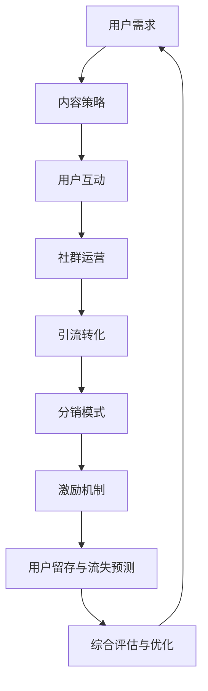

                 

## 文章标题：知识付费赚钱的用户裂变营销与分销模式设计

### 关键词：知识付费、用户裂变、分销模式、营销策略、内容策略、社群运营

#### 摘要：

在数字化时代，知识付费市场迅速崛起，成为新的经济增长点。本文以知识付费行业为背景，深入探讨了用户裂变营销与分销模式设计在知识付费赚钱中的关键作用。首先，对知识付费市场现状进行分析，包括发展历程、用户需求及行业前景。随后，详细阐述了用户裂变营销的原理与应用、分销模式设计的基础，并通过实际案例解析，提供可操作的实战策略。文章最后，对知识付费项目的综合评估与优化进行探讨，并附上相关的核心概念、算法原理讲解及项目实战案例。通过这篇文章，读者将全面了解知识付费赚钱的营销与分销策略，掌握如何设计和优化这些模式以实现盈利。

## 目录大纲：

### 第一部分：知识付费市场概述

**第1章：知识付费行业现状分析**  
- 1.1 知识付费市场的发展历程  
- 1.2 用户需求与消费行为变化  
- 1.3 行业发展趋势与前景预测

**第2章：用户裂变营销原理与应用**  
- 2.1 用户裂变营销的概念与作用  
- 2.2 用户裂变营销的流程与策略  
- 2.3 用户裂变营销的案例分析

**第3章：分销模式设计基础**  
- 3.1 分销模式的定义与类型  
- 3.2 分销渠道的选择与优化  
- 3.3 分销激励机制的设计

### 第二部分：用户裂变营销实战策略

**第4章：内容策略与用户互动**  
- 4.1 内容营销在用户裂变中的角色  
- 4.2 用户互动机制与案例分析  
- 4.3 用户参与感与社群建设

**第5章：社群运营与用户维系**  
- 5.1 社群运营的核心要素  
- 5.2 社群管理策略与工具  
- 5.3 社群营销案例分析

**第6章：引流与转化策略**  
- 6.1 引流渠道的多样化策略  
- 6.2 转化率提升的关键因素  
- 6.3 案例分析：引流与转化策略实践

### 第三部分：分销模式设计与优化

**第7章：分销模式选择与搭建**  
- 7.1 分销模式选择的原则  
- 7.2 分销渠道的搭建与维护  
- 7.3 分销渠道的绩效评估与优化

**第8章：分销激励机制设计**  
- 8.1 激励机制的作用与分类  
- 8.2 激励机制的设计原则与实践  
- 8.3 激励机制的案例解析

**第9章：案例研究：成功知识付费项目的分销模式**  
- 9.1 案例背景与目标  
- 9.2 分销模式的选择与实施  
- 9.3 项目成果与经验总结

### 第四部分：综合分析与优化

**第10章：知识付费项目的综合评估与优化**  
- 10.1 评估指标体系构建  
- 10.2 用户反馈与数据分析  
- 10.3 营销策略与分销模式的持续优化

**附录：知识付费项目工具与资源指南**  
- 10.1 常用工具介绍  
- 10.2 资源平台推荐  
- 10.3 行业报告与资讯来源

### 第五部分：核心概念与联系

**图1：知识付费用户裂变营销与分销模式的关系图**

### 第六部分：核心算法原理讲解

**第11章：用户行为分析算法原理**

### 第七部分：数学模型和数学公式

**第12章：用户留存与流失预测模型**

### 第八部分：项目实战

**第13章：知识付费项目案例实战**

**附录：源代码与数据集**

### 文章开始正文部分

---

### 第一部分：知识付费市场概述

#### 第1章：知识付费行业现状分析

##### 1.1 知识付费市场的发展历程

知识付费，作为近年来快速崛起的一个新兴行业，其发展历程可追溯至互联网普及初期。早期的知识付费主要以在线课程、专业书籍和电子文档等形式存在，用户通过购买数字内容来获取所需知识。随着移动互联网的发展和智能手机的普及，知识付费市场逐渐成熟，逐渐形成了以平台化、个性化、社区化为核心的商业模式。

2016年，知识付费市场迎来爆发期，以得到App、喜马拉雅、知乎等为代表的平台通过内容电商模式迅速崛起，吸引了大量用户和资本的关注。这些平台通过提供高质量的音频、视频课程、专业书籍、在线问答等形式，满足了用户在职场技能提升、兴趣爱好培养等方面的需求。

2018年以来，知识付费市场继续快速增长，用户规模不断扩大。根据相关数据显示，2020年中国知识付费市场规模已超过3000亿元，预计未来几年仍将保持高速增长态势。知识付费市场的蓬勃发展，不仅反映了用户对知识获取和自我提升的强烈需求，也揭示了知识经济时代下内容消费的新趋势。

##### 1.2 用户需求与消费行为变化

随着知识付费市场的不断壮大，用户的需求和消费行为也发生了显著变化。首先，用户需求日益多样化。传统的知识获取方式已无法满足现代用户对即时性、互动性和个性化内容的需求。用户越来越倾向于通过知识付费平台获取定制化、深入化的专业知识，以提升自身的职业素养和技能水平。

其次，消费行为逐渐成熟。早期的知识付费用户主要以年轻人和职场新人为主，但随着市场的发展，中老年用户和职业经理人的参与度也在不断提升。这些用户群体不仅对知识内容有更高的要求，还对付费模式有着更为理性的选择。他们更注重课程质量、讲师背景、用户评价等因素，而非单纯的低价策略。

此外，用户消费行为呈现出碎片化和高频次的特点。现代人的生活节奏加快，他们更倾向于利用碎片时间进行学习。因此，短小精悍、高效实用的内容形式，如微课、短视频、音频课程等，越来越受到用户的青睐。同时，用户对知识付费的购买频率也在提高，从初期的偶尔购买逐渐转向定期订阅和持续学习。

##### 1.3 行业发展趋势与前景预测

展望未来，知识付费市场仍将保持强劲的发展势头，呈现出以下几个发展趋势：

1. **个性化与智能化**：随着人工智能和大数据技术的发展，知识付费平台将能更精准地捕捉用户需求，提供个性化推荐和定制化服务。智能算法将帮助平台了解用户的学习习惯、兴趣爱好和职业发展需求，从而提供更符合用户期待的知识产品。

2. **内容多样化**：知识付费内容将不再局限于传统的课程和书籍，更多元化的知识形式，如直播、互动课程、线上研讨会等，将逐渐成为主流。这些新型内容形式不仅能够增强用户的参与感，还能提高知识的传播效果。

3. **跨界融合**：知识付费将与更多行业领域进行融合，如教育培训、电商、金融等。跨界合作将带来更广泛的市场空间和更多样化的商业模式。

4. **全球化扩展**：随着国内知识付费市场的成熟，知识付费平台将加速全球化布局，拓展国际市场。海外用户对优质知识内容的渴求，将为知识付费市场带来新的增长点。

综合来看，知识付费市场未来具有巨大的发展潜力。通过不断创新和优化，知识付费行业将更好地满足用户需求，推动知识经济的发展。

---

#### 第2章：用户裂变营销原理与应用

##### 2.1 用户裂变营销的概念与作用

用户裂变营销，是指通过已有的用户群体，利用社交网络、推荐机制等手段，激发用户的传播和分享意愿，从而实现用户数量的快速增长。其核心在于激发用户的主动参与，形成“一传十、十传百”的传播效应，达到病毒式营销的效果。

用户裂变营销的作用主要体现在以下几个方面：

1. **快速扩展用户群体**：通过用户的分享和推荐，能够迅速吸引大量新用户，降低获客成本。这对于初创公司或新产品推广尤为关键。

2. **增强用户粘性**：裂变营销通常伴随着一定的互动和奖励机制，能够增强用户的参与感和忠诚度，提高用户留存率。

3. **提升品牌知名度**：通过用户的口碑传播，能够迅速提高品牌的市场认知度和影响力。

4. **优化用户结构**：裂变营销能够吸引更多高质量的潜在用户，优化用户群体的质量。

##### 2.2 用户裂变营销的流程与策略

用户裂变营销的流程通常包括以下几个关键步骤：

1. **用户需求挖掘**：了解目标用户的需求和痛点，为裂变营销活动提供方向。

2. **裂变工具设计**：根据用户需求，设计适合的裂变工具，如邀请码、抽奖活动、优惠券等。

3. **裂变活动策划**：制定详细的裂变活动方案，包括活动主题、时间、参与规则、奖励机制等。

4. **用户激励**：通过奖励机制激发用户的参与和分享意愿，如赠送积分、优惠券、实物奖励等。

5. **传播渠道选择**：选择合适的传播渠道，如社交媒体、用户社区、邮件等，确保活动信息的有效传达。

6. **数据分析与优化**：对裂变活动的效果进行实时监控和分析，根据数据反馈进行优化调整。

以下是几种常见的用户裂变营销策略：

1. **拉新策略**：通过奖励机制鼓励现有用户邀请新用户注册和使用产品，如邀请码、推荐奖励等。

2. **留存策略**：通过运营活动和福利激励，提高用户的活跃度和留存率，如签到奖励、任务奖励等。

3. **互动策略**：通过社区互动、用户评论、问答等机制，增加用户参与度，形成用户之间的口碑传播。

4. **优惠策略**：通过限时优惠、优惠券等方式，吸引用户购买和推荐产品。

##### 2.3 用户裂变营销的案例分析

以下是一个用户裂变营销的成功案例：

**案例：得到App的裂变营销活动**

得到App作为一款知识付费平台，通过一系列裂变营销活动，成功吸引了大量用户。以下是得到App的裂变营销策略：

1. **拉新策略**：用户可以通过分享邀请码邀请好友注册，每邀请一位好友，双方都能获得一定额度的优惠券，从而鼓励用户主动分享。

2. **留存策略**：平台定期举办学习挑战、知识竞赛等活动，鼓励用户持续学习和互动，提高用户粘性。

3. **互动策略**：通过用户社区、问答功能，鼓励用户之间进行知识分享和讨论，形成良好的口碑效应。

4. **优惠策略**：平台在特定节日或活动期间，推出限时优惠活动，吸引用户购买课程。

通过这些策略，得到App实现了用户的快速增长，提高了用户活跃度和留存率，取得了显著的市场成效。

---

#### 第3章：分销模式设计基础

##### 3.1 分销模式的定义与类型

分销模式，是指企业通过特定的渠道和策略，将产品或服务推向市场并最终销售给终端消费者的过程。分销模式的设计在企业营销中起着至关重要的作用，它不仅决定了产品能否快速进入市场，还直接影响到企业的销售业绩和市场占有率。

根据分销渠道的不同，分销模式可以分为以下几种类型：

1. **直销模式**：企业直接向终端消费者销售产品或服务，不通过中间渠道。这种模式的优势在于能够更好地控制销售流程和用户体验，但成本较高，覆盖范围有限。

2. **代理模式**：企业通过代理商来销售产品，代理商在一定的区域或行业内代表企业进行销售。这种模式能够快速扩大市场覆盖范围，降低销售成本，但代理商的管理和激励问题需要特别关注。

3. **批发模式**：企业将产品批量销售给批发商或分销商，由批发商或分销商再进行二次销售。这种模式的优势在于能够快速形成销售网络，但对企业库存管理和市场控制能力有较高要求。

4. **混合模式**：企业同时采用多种分销渠道，以实现最佳的市场覆盖和销售效果。例如，既通过线上电商平台进行销售，又通过线下实体店进行推广。

##### 3.2 分销渠道的选择与优化

选择合适的分销渠道是企业成功实施分销模式的关键。以下是一些选择分销渠道时应考虑的因素：

1. **目标市场**：分销渠道的选择应与目标市场的特点和需求相匹配。例如，对于年轻用户群体，社交媒体和线上平台可能是更好的选择；而对于中老年用户，线下实体店和传统渠道可能更为有效。

2. **成本效益**：分销渠道的选择应考虑成本效益，包括渠道成本、运营成本、物流成本等。企业需要在渠道成本和销售收益之间找到平衡点。

3. **渠道能力**：渠道的选择还应考虑渠道的运营能力、市场覆盖范围、品牌影响力等因素。选择能力强、合作意愿高的渠道合作伙伴，能够更好地推动产品销售。

4. **法规政策**：企业在选择分销渠道时，还应考虑相关法规和政策的影响。例如，某些产品在特定区域可能受到销售限制或监管要求。

分销渠道的优化同样重要，以下是一些优化分销渠道的策略：

1. **渠道整合**：通过整合线上线下渠道，实现资源的共享和协同效应。例如，线上渠道可以通过数据分析和用户反馈，为线下渠道提供销售决策支持。

2. **渠道创新**：积极探索新兴渠道，如社交电商、直播带货等，以适应市场变化和用户需求。

3. **渠道赋能**：为渠道合作伙伴提供培训、营销支持、技术支持等，提升渠道运营能力和市场竞争力。

4. **绩效评估**：建立科学的渠道绩效评估体系，对渠道的销售额、用户反馈、市场占有率等指标进行定期评估，以持续优化分销策略。

##### 3.3 分销激励机制的设计

分销激励机制是激发渠道合作伙伴积极性和创造力的关键。以下是一些常见的分销激励机制：

1. **佣金激励**：根据销售额的一定比例给予渠道合作伙伴佣金，以激励其销售积极性。

2. **奖励计划**：设立销售奖励计划，对达到特定销售目标或完成特定任务的渠道合作伙伴给予物质或精神奖励。

3. **营销支持**：提供广告宣传、促销活动、市场调研等支持，帮助渠道合作伙伴提升销售业绩。

4. **培训与赋能**：定期为渠道合作伙伴提供产品知识、销售技巧、市场策略等方面的培训，提升其专业能力和市场竞争力。

5. **合作权益**：给予渠道合作伙伴一定的品牌合作权益，如品牌代言、市场宣传等，增强其市场影响力。

设计有效的分销激励机制，需要充分考虑渠道合作伙伴的需求和期望，建立长期稳定的合作关系，以实现双方共赢。

---

### 第二部分：用户裂变营销实战策略

#### 第4章：内容策略与用户互动

##### 4.1 内容营销在用户裂变中的角色

内容营销是用户裂变营销的重要组成部分，它通过创造和分享有价值的内容，吸引用户关注、吸引新用户并提高现有用户的参与度。在用户裂变营销中，内容营销的角色主要体现在以下几个方面：

1. **建立品牌信任**：高质量的内容能够向用户传递品牌的专业性和权威性，建立用户对品牌的信任感，为裂变营销打下基础。

2. **激发用户分享意愿**：有趣、有用或具有启发性的内容容易引起用户的共鸣，促使用户主动分享到社交网络，从而扩大传播范围。

3. **增强用户参与感**：通过互动性强的内容，如问答、评论、投票等，鼓励用户参与讨论，提高用户粘性。

4. **引导用户转化**：内容营销不仅要吸引新用户，还要促进新用户的转化。有针对性的内容能够引导用户进行注册、购买等行为。

##### 4.2 用户互动机制与案例分析

用户互动机制是激发用户参与和分享的关键。以下是一些常见的用户互动机制：

1. **评论与点赞**：用户对内容进行评论和点赞，可以增强内容的曝光度，促进用户之间的互动。

2. **问答与讨论区**：设立问答和讨论区，鼓励用户提出问题并进行讨论，不仅能够解决用户问题，还能增加用户粘性。

3. **投票与调查**：通过投票和调查收集用户意见，可以增加用户的参与感，同时为产品或服务优化提供依据。

4. **直播互动**：通过直播与用户实时互动，解答用户疑问，展示产品特点，提高用户购买意愿。

以下是一个用户互动机制的成功案例：

**案例：知乎的互动机制**

知乎作为一个知识分享平台，通过多种互动机制吸引了大量用户，并实现了用户裂变。以下是知乎的几个关键互动机制：

1. **评论与点赞**：用户对内容进行评论和点赞，可以增加内容的曝光度，鼓励更多用户参与讨论。

2. **问答与讨论区**：知乎的问答和讨论区功能非常活跃，用户可以在这里提出问题、回答问题，并进行深入讨论。

3. **直播互动**：知乎定期举办知识直播活动，邀请领域专家与用户进行实时互动，解答用户问题，提高用户参与度。

4. **投票与调查**：知乎经常发起投票和调查，收集用户意见，这不仅增加了用户的参与感，还为知乎的内容和功能优化提供了重要参考。

通过这些互动机制，知乎不仅吸引了大量用户，还提高了用户的活跃度和留存率，实现了用户的快速裂变。

##### 4.3 用户参与感与社群建设

用户参与感是用户裂变营销的核心，通过提高用户的参与感，可以增强用户的忠诚度和活跃度，从而推动用户裂变。以下是一些提高用户参与感的策略：

1. **用户参与设计**：邀请用户参与到产品或服务的开发过程中，如通过用户调研、反馈等方式，让用户感受到自己的意见和需求被重视。

2. **用户成就体系**：建立用户成就体系，如积分、等级等，激励用户持续参与和贡献内容。

3. **用户活动**：定期举办线上或线下的用户活动，如讲座、沙龙、比赛等，增强用户的归属感和参与感。

4. **用户自治**：鼓励用户自治，如建立用户社群、用户论坛等，让用户在社群中自主交流、互助成长。

社群建设是提高用户参与感的重要手段，以下是一些社群建设的策略：

1. **建立核心社群**：识别并邀请具有影响力和活跃度的用户加入核心社群，发挥其在社群中的引领作用。

2. **内容驱动**：通过高质量的内容，如文章、视频、直播等，吸引和留住用户。

3. **互动机制**：建立多样化的互动机制，如问答、评论、活动等，促进用户之间的交流和互动。

4. **品牌认同**：通过品牌故事、品牌文化等，增强用户对品牌的认同感和归属感。

通过提高用户参与感和进行有效的社群建设，可以激发用户的主动传播和分享意愿，实现用户的快速裂变。

---

#### 第5章：社群运营与用户维系

##### 5.1 社群运营的核心要素

社群运营是知识付费项目中至关重要的一环，它能够有效提升用户参与度和留存率，进而促进项目成功。以下为社群运营的核心要素：

1. **明确目标**：社群运营首先需要明确目标，包括社群定位、用户需求满足、内容输出等。明确目标有助于社群运营者有针对性地进行资源分配和策略制定。

2. **内容策略**：内容是社群运营的核心，优质的内容能够吸引用户参与和持续关注。内容策略需要涵盖内容形式、发布频率、更新周期等。

3. **用户互动**：用户互动是提升社群活跃度的关键，通过设立互动话题、举办线上活动、进行实时交流等方式，增强用户间的互动，提高用户粘性。

4. **社群管理**：社群管理包括用户管理、内容审核、社区氛围维护等。有效的社群管理能够确保社群健康、有序地运行。

5. **数据分析**：社群运营需要定期进行数据分析，了解用户行为、活跃度、参与度等，以便及时调整运营策略。

##### 5.2 社群管理策略与工具

社群管理策略的有效实施依赖于合适的工具和平台。以下是一些常见的社群管理策略与工具：

1. **制定社群规则**：制定明确的社群规则，如发言准则、行为规范等，有助于维护社群秩序，避免不必要的冲突。

2. **定期活动策划**：策划并举办多样化的线上和线下活动，如主题分享、讲座、互动游戏等，提升用户参与感。

3. **内容审核机制**：建立内容审核机制，确保社群内容的质量和合规性。可以使用人工审核和自动化工具相结合的方法。

4. **数据分析工具**：使用数据分析工具，如社群分析平台、用户行为跟踪系统等，对用户行为和社群活跃度进行实时监控和数据分析。

5. **互动激励**：设置互动激励机制，如积分系统、荣誉称号等，鼓励用户积极参与社群互动。

以下是几个实用的社群管理工具：

1. **微信群**：微信群是社群运营的基础工具，具有便捷的沟通和分享功能。

2. **知乎**：知乎可以作为一个问答平台，用于用户互动和内容分享。

3. **微信小程序**：微信小程序可以用于活动策划和用户激励，提升用户参与度。

4. **小鹅通**：小鹅通提供一站式的社群管理工具，包括内容发布、用户管理、数据分析等功能。

##### 5.3 社群营销案例分析

以下是一个成功的社群营销案例：

**案例：樊登读书会**

樊登读书会是一个以阅读为主题的知识付费社群，通过社群运营实现了用户规模和营收的快速增长。以下是樊登读书会的社群运营策略：

1. **内容策略**：樊登读书会每天发布樊登解读的书籍精华，通过音频、图文等多种形式，提供有价值的内容。

2. **用户互动**：通过微信群、QQ群等，建立多个用户互动渠道，定期举办线下活动，如读书会、讲座等。

3. **社群管理**：设立专门的社群管理团队，负责社群规则制定、内容审核、活动策划等。

4. **数据分析**：通过数据分析，了解用户行为和需求，不断优化运营策略。

通过这些策略，樊登读书会不仅吸引了大量用户，还提高了用户的活跃度和留存率，实现了社群营销的成功。

---

#### 第6章：引流与转化策略

##### 6.1 引流渠道的多样化策略

在知识付费市场中，引流策略是获取新用户的关键。有效的引流策略能够迅速扩大用户群体，提高品牌知名度。以下是一些多样化的引流渠道策略：

1. **社交媒体引流**：利用微博、微信、抖音、快手等社交媒体平台，通过发布高质量的内容、互动活动、短视频等形式，吸引用户关注和转发。

2. **搜索引擎优化（SEO）**：通过优化网站内容和结构，提高在搜索引擎中的排名，吸引有需求的用户通过搜索进入平台。

3. **内容营销**：创作高质量、有价值的原创内容，如博客文章、视频课程、电子书等，通过平台内外发布，吸引潜在用户。

4. **口碑营销**：通过用户推荐、好评反馈等口碑效应，引导用户主动传播和推荐，扩大品牌影响力。

5. **线上活动**：举办各类线上活动，如免费试听课程、知识竞赛、直播讲座等，通过活动吸引新用户参与。

6. **合作推广**：与其他平台、KOL、行业媒体等进行合作，通过联合营销活动，共同推广知识付费项目。

7. **线下活动**：举办线下活动，如讲座、研讨会、沙龙等，通过面对面交流，增强用户对品牌的认知和信任。

##### 6.2 转化率提升的关键因素

引流只是第一步，提升转化率是知识付费项目的关键。以下是一些关键因素：

1. **用户体验**：优化用户在平台上的浏览、购买体验，包括页面设计、导航流程、支付方式等，确保用户能够顺畅完成购买行为。

2. **内容质量**：提供高质量的知识内容，确保课程内容具有实用性和吸引力，提高用户满意度和购买意愿。

3. **促销活动**：通过限时优惠、优惠券、团购等活动，刺激用户购买，提高转化率。

4. **用户信任**：建立用户信任，可以通过展示用户好评、成功案例、讲师资质等方式，增加用户对产品的信任感。

5. **个性化推荐**：利用大数据和人工智能技术，为用户提供个性化推荐，提高用户匹配度，增加购买概率。

6. **客服支持**：提供及时、专业的客服支持，解决用户疑问和问题，提高用户满意度，促进转化。

7. **转化跟踪**：通过数据分析和转化跟踪，了解用户在购买过程中的行为路径和障碍，优化营销策略，提高转化率。

##### 6.3 案例分析：引流与转化策略实践

以下是一个成功的引流与转化策略案例：

**案例：喜马拉雅FM**

喜马拉雅FM作为中国领先的音频分享平台，通过一系列引流与转化策略，实现了用户规模和营收的快速增长。以下是喜马拉雅的引流与转化策略：

1. **引流策略**：
   - 社交媒体引流：通过微博、微信等平台发布优质内容，举办互动活动，吸引粉丝关注。
   - 内容营销：发布大量高质量、多样化的音频课程，吸引有需求的用户。
   - 合作推广：与知名机构、KOL合作，共同推广音频课程。
   - 口碑营销：通过用户好评和推荐，增加新用户的信任和参与。

2. **转化策略**：
   - 用户体验优化：优化平台界面和功能，确保用户能够便捷地找到所需内容，完成购买。
   - 内容质量保证：确保课程内容实用、有趣，提高用户满意度和复购率。
   - 促销活动：定期举办限时优惠、免费试听活动，刺激用户购买。
   - 用户信任建立：展示用户好评、成功案例，增加用户对平台和产品的信任。
   - 个性化推荐：利用大数据技术，为用户推荐个性化内容，提高用户匹配度和购买意愿。
   - 客服支持：提供24小时在线客服，解决用户疑问，提高用户满意度。

通过这些策略，喜马拉雅FM成功吸引了大量用户，提高了转化率，实现了持续增长。

---

### 第三部分：分销模式设计与优化

#### 第7章：分销模式选择与搭建

##### 7.1 分销模式选择的原则

在选择分销模式时，企业需要考虑多个因素，以下是一些关键原则：

1. **市场需求**：分销模式应与市场需求相匹配。例如，对于快速消费品，批发模式可能更为合适；而对于高端知识付费产品，直销模式可能更能满足用户需求。

2. **成本效益**：分销模式的选择应考虑成本效益，包括渠道成本、运营成本、物流成本等。企业需要在渠道成本和销售收益之间找到平衡点。

3. **渠道能力**：分销渠道的选择应考虑渠道的运营能力、市场覆盖范围、品牌影响力等因素。选择能力强、合作意愿高的渠道合作伙伴，能够更好地推动产品销售。

4. **法规政策**：分销渠道的选择还应考虑相关法规和政策的影响。例如，某些产品在特定区域可能受到销售限制或监管要求。

5. **目标市场**：分销模式的选择应与目标市场的特点和需求相匹配。例如，对于年轻用户群体，线上渠道和社交媒体可能更为有效；而对于中老年用户，线下实体店和传统渠道可能更为适合。

##### 7.2 分销渠道的搭建与维护

分销渠道的搭建和维护是确保分销模式有效运作的关键。以下是一些关键步骤和策略：

1. **渠道选择**：根据市场需求、成本效益、渠道能力等因素，选择合适的分销渠道。常见的分销渠道包括直销、代理商、批发商、电商等。

2. **渠道谈判**：与渠道合作伙伴进行谈判，确定合作关系、销售目标、佣金比例等关键条款。确保双方利益最大化。

3. **渠道培训**：为渠道合作伙伴提供产品知识、销售技巧、市场策略等方面的培训，提升其专业能力和市场竞争力。

4. **渠道支持**：提供营销支持、技术支持、物流支持等，帮助渠道合作伙伴提升销售业绩。

5. **渠道绩效评估**：建立科学的渠道绩效评估体系，对渠道的销售额、用户反馈、市场占有率等指标进行定期评估，以持续优化分销策略。

6. **渠道激励**：通过奖励计划、促销活动等方式，激励渠道合作伙伴积极销售产品。

7. **渠道关系维护**：建立长期稳定的合作关系，定期与渠道合作伙伴沟通，解决合作中的问题，增强合作信任。

##### 7.3 分销渠道的绩效评估与优化

分销渠道的绩效评估与优化是确保分销模式持续有效的重要环节。以下是一些关键指标和方法：

1. **销售额**：销售额是评估分销渠道绩效的最直接指标。通过分析不同渠道的销售额，可以了解渠道的业绩表现。

2. **市场份额**：市场份额反映了分销渠道在市场中的地位和竞争力。通过比较不同渠道的市场占有率，可以评估渠道的市场表现。

3. **用户反馈**：用户反馈是评估分销渠道的重要指标之一。通过收集用户对产品的评价和反馈，可以了解渠道服务的质量和用户满意度。

4. **渠道成本**：渠道成本是评估分销模式经济效益的重要指标。通过计算不同渠道的成本，可以评估渠道的成本效益。

5. **销售增长率**：销售增长率反映了分销渠道的发展潜力。通过比较不同渠道的销售增长率，可以评估渠道的发展趋势。

6. **优化策略**：根据绩效评估结果，制定优化策略，如调整渠道策略、优化产品和服务、提升渠道能力等，以提高分销渠道的绩效。

通过定期绩效评估和优化，企业可以持续优化分销模式，提高销售业绩和市场占有率。

---

#### 第8章：分销激励机制设计

##### 8.1 激励机制的作用与分类

分销激励机制是企业激励渠道合作伙伴、提高分销效率的重要手段。有效的分销激励机制可以激励渠道合作伙伴积极销售产品，提高市场占有率。以下是分销激励机制的作用和分类：

1. **激励作用**：
   - **提高销售积极性**：通过激励措施，激发渠道合作伙伴的销售积极性，提高销售业绩。
   - **增强忠诚度**：通过持续性的激励机制，增强渠道合作伙伴对企业的忠诚度，建立长期稳定的合作关系。
   - **提高服务质量**：通过激励机制，激励渠道合作伙伴提供更优质的服务，提升客户满意度。
   - **促进团队协作**：通过激励机制，激发团队协作精神，提高渠道团队的整体销售绩效。

2. **分类**：
   - **经济性激励**：包括佣金激励、奖金激励、返利激励等，直接与销售业绩挂钩，激励渠道合作伙伴努力提高销售额。
   - **非经济性激励**：包括荣誉激励、培训激励、资源支持等，通过提升渠道合作伙伴的能力和地位，激励其长期合作。
   - **长期激励**：包括股权激励、期权激励等，通过将渠道合作伙伴的长期利益与企业利益绑定，促进双方共同发展。
   - **短期激励**：包括促销激励、活动激励等，通过短期内的大幅激励，迅速提升渠道合作伙伴的销售业绩。

##### 8.2 激励机制的设计原则与实践

设计有效的分销激励机制，需要遵循以下原则：

1. **目标一致性**：激励机制的设计应与企业目标保持一致，确保激励措施能够推动企业销售目标的实现。

2. **公平公正**：激励机制的制定应公平公正，确保所有渠道合作伙伴都能公平地享受激励政策，增强合作信任。

3. **可持续性**：激励机制应具备可持续性，既能够短期激发渠道合作伙伴的积极性，又能够长期维持其合作意愿。

4. **灵活性**：激励机制的设计应具备灵活性，能够根据市场变化和企业战略调整，灵活调整激励措施。

以下是几种常见的激励机制设计：

1. **佣金激励**：根据渠道合作伙伴的销售业绩，按比例支付佣金。这种激励方式简单直观，能够直接激发销售积极性。

2. **奖金激励**：设立销售奖金，对达成销售目标的渠道合作伙伴进行奖励。奖金可以是一次性的，也可以是分阶段发放。

3. **返利激励**：根据渠道合作伙伴的累计销售额，给予一定比例的返利。返利可以用于购买产品、服务或兑换现金。

4. **荣誉激励**：通过评选“销售冠军”、“最佳合作伙伴”等荣誉，提升渠道合作伙伴的荣誉感和成就感。

5. **培训激励**：提供专业培训和学习机会，提升渠道合作伙伴的专业能力和销售技巧。

6. **资源支持**：提供营销资源、技术支持、市场推广等资源，帮助渠道合作伙伴提升销售业绩。

##### 8.3 激励机制的案例解析

以下是一个成功的分销激励机制案例：

**案例：京东的渠道激励机制**

京东作为中国领先的电商平台，通过一系列分销激励机制，有效激励了渠道合作伙伴，推动了销售业绩的增长。以下是京东的渠道激励机制：

1. **佣金激励**：根据不同产品的销售业绩，京东为渠道合作伙伴提供不同比例的佣金，最高可达30%。这种激励方式直接激发了渠道合作伙伴的销售积极性。

2. **奖金激励**：京东设立月度、季度、年度销售奖金，对达成销售目标的合作伙伴进行奖励。奖金不仅包括现金奖励，还有奖品和荣誉证书。

3. **返利激励**：京东为渠道合作伙伴提供累积返利政策，根据累计销售额的一定比例，给予返利。返利可以用于购买京东产品或兑换现金。

4. **荣誉激励**：京东定期评选“金牌渠道合作伙伴”、“最佳销售团队”等荣誉，提升合作伙伴的荣誉感和品牌认同。

5. **培训激励**：京东为渠道合作伙伴提供专业培训，包括产品知识、销售技巧、市场营销等，帮助合作伙伴提升专业能力和销售业绩。

6. **资源支持**：京东提供丰富的营销资源，包括广告支持、物流服务、技术支持等，帮助渠道合作伙伴提升销售能力。

通过这些激励措施，京东不仅提升了渠道合作伙伴的积极性，还增强了其忠诚度和合作意愿，实现了双赢。

---

#### 第9章：案例研究：成功知识付费项目的分销模式

##### 9.1 案例背景与目标

在本章节中，我们将深入分析一个成功知识付费项目——网易公开课的分销模式。网易公开课作为一家在线教育平台，通过创新的分销模式，实现了快速的市场扩展和用户增长。以下是其背景和目标：

**背景**：随着知识付费市场的兴起，用户对优质教育资源的需求日益增长。网易公开课凭借其丰富的课程资源和高品质的教学内容，迅速吸引了大量用户。为了进一步扩大市场份额，提高用户粘性，网易公开课决定采用分销模式，通过与各大电商平台、线下培训机构等合作伙伴合作，实现课程资源的广泛推广。

**目标**：网易公开课的分销模式旨在实现以下目标：
1. **增加用户数量**：通过多渠道的分销合作，扩大用户覆盖范围，吸引更多潜在用户。
2. **提升用户活跃度**：通过多样化的分销渠道和推广活动，提高用户的活跃度和留存率。
3. **提高营收**：通过渠道分销和合作推广，实现销售业绩的提升，增加平台营收。

##### 9.2 分销模式的选择与实施

为了实现上述目标，网易公开课采用了以下分销模式：

1. **电商渠道分销**：与各大电商平台（如淘宝、京东、拼多多等）合作，通过电商渠道销售课程。电商平台为网易公开课提供流量支持，帮助其拓展用户群体。

2. **线下培训机构合作**：与线下培训机构合作，将其课程资源引入平台，通过线下渠道推广。这种模式能够结合线上和线下资源，满足用户多样化的学习需求。

3. **KOL与网红合作**：与知名KOL和网红合作，通过其社交媒体渠道推广课程。KOL和网红具有庞大的粉丝基础，能够快速传播课程信息，吸引大量用户。

4. **内容合作**：与其他内容平台（如知乎、微博、抖音等）合作，发布课程内容，通过平台流量带动用户增长。

**实施过程**：
1. **渠道选择与谈判**：网易公开课团队通过市场调研和数据分析，筛选出具有合作潜力的电商平台、线下培训机构、KOL和内容平台。然后，与这些渠道合作伙伴进行谈判，确定合作条款，包括佣金比例、推广费用、内容发布规范等。

2. **内容定制与适配**：针对不同渠道的特点，网易公开课团队定制化课程内容和推广文案，确保内容与渠道用户需求相匹配。

3. **推广活动策划**：针对不同渠道的特点，策划相应的推广活动，如优惠券发放、限时抢购、用户互动等，激发用户购买兴趣。

4. **数据监控与反馈**：网易公开课团队通过数据监控和分析，实时跟踪各渠道的推广效果，根据数据反馈调整推广策略，优化渠道合作。

##### 9.3 项目成果与经验总结

通过实施分销模式，网易公开课取得了显著成果：

1. **用户数量增长**：通过多渠道的分销合作，网易公开课的注册用户数量实现了显著增长，从上线初期的数十万用户迅速增长至数百万用户。

2. **用户活跃度提升**：多样化的分销渠道和推广活动，提高了用户的活跃度和留存率，平台课程播放量和用户互动显著增加。

3. **营收提升**：通过渠道分销和合作推广，网易公开课的销售业绩大幅提升，营收实现了稳步增长。

4. **品牌影响力扩大**：通过多渠道的分销合作，网易公开课的品牌影响力得到显著提升，在行业内树立了良好的口碑。

**经验总结**：
1. **渠道选择多样化**：选择多样化的分销渠道，结合线上和线下资源，能够更好地满足用户需求，提高用户覆盖面。

2. **内容定制化**：针对不同渠道的特点，定制化课程内容和推广文案，确保内容与渠道用户需求相匹配。

3. **推广活动创新**：策划创新性的推广活动，如优惠券发放、限时抢购、用户互动等，能够有效激发用户购买兴趣。

4. **数据驱动**：通过数据监控和分析，实时跟踪各渠道的推广效果，根据数据反馈调整推广策略，优化渠道合作。

通过网易公开课的成功案例，我们可以看到，合理选择和实施分销模式，对于知识付费项目的成功至关重要。未来，随着市场的不断变化和用户需求的多样化，分销模式也需要不断创新和优化，以实现更好的市场表现。

---

#### 第10章：知识付费项目的综合评估与优化

##### 10.1 评估指标体系构建

为了全面评估知识付费项目的效果，构建一个科学、全面的评估指标体系是至关重要的。以下是一些关键的评估指标：

1. **用户满意度**：通过用户调查、反馈和评分等，衡量用户对知识付费产品的满意度。用户满意度是衡量项目成功与否的重要指标。

2. **用户留存率**：用户在一段时间后仍然活跃和使用产品的比例，反映项目的用户粘性。

3. **用户转化率**：将潜在用户转化为付费用户的比例，衡量项目的营销效果。

4. **收入和利润**：项目的总营收和利润情况，反映项目的经济效益。

5. **市场占有率**：项目在市场中的占有率，反映项目在竞争中的地位。

6. **渠道绩效**：各分销渠道的销售业绩、用户反馈和利润贡献等，衡量渠道合作的成效。

7. **内容质量**：课程内容的质量评估，包括知识点覆盖、教学效果、用户反馈等。

8. **品牌知名度**：项目在市场中的品牌认知度和影响力。

通过构建这些指标体系，企业可以全面、系统地评估知识付费项目的各个维度，为优化提供依据。

##### 10.2 用户反馈与数据分析

用户反馈和数据分析是知识付费项目评估与优化的关键环节。以下是一些具体的方法和步骤：

1. **用户反馈收集**：通过问卷调查、在线评论、用户访谈等方式，收集用户的反馈意见。问卷可以设计为定量和定性问题，以全面了解用户需求。

2. **数据分析**：利用大数据分析和用户行为追踪技术，分析用户的学习习惯、兴趣偏好和购买行为。这些数据可以用于优化课程内容、推广策略和用户服务。

3. **反馈与数据分析的结合**：将用户反馈与数据分析结果相结合，找出用户关注的问题和痛点，制定针对性的优化方案。

4. **定期评估**：建立定期评估机制，如每月、每季度进行一次评估，确保及时发现问题并进行优化。

##### 10.3 营销策略与分销模式的持续优化

基于评估指标和用户反馈，持续优化营销策略和分销模式是确保知识付费项目成功的关键。以下是一些具体的优化策略：

1. **内容优化**：根据用户反馈和数据分析结果，对课程内容进行优化，包括增加用户需求强烈的内容，改进教学方法和课程结构。

2. **营销策略调整**：根据用户行为数据和市场需求，调整营销策略，如优化广告投放、调整促销活动、改进内容推荐等。

3. **分销模式创新**：积极探索新的分销渠道和模式，如与更多电商平台、线下培训机构、KOL和网红合作，拓宽销售渠道。

4. **激励机制优化**：根据渠道绩效和用户反馈，调整分销激励机制，提高渠道合作伙伴的积极性和销售效率。

5. **用户体验提升**：优化用户在平台上的体验，包括页面设计、功能流程、支付方式等，确保用户能够顺畅地完成购买和使用。

6. **数据驱动的决策**：建立数据驱动决策机制，定期分析用户行为和项目绩效数据，基于数据做出科学的决策和调整。

通过持续的评估与优化，知识付费项目可以不断适应市场变化和用户需求，实现持续增长和优化。

---

#### 附录：知识付费项目工具与资源指南

##### 10.1 常用工具介绍

在知识付费项目中，使用合适的工具能够显著提高运营效率和效果。以下是一些常用的工具：

1. **数据分析工具**：如Google Analytics、Tableau、Excel等，用于分析用户行为、流量来源、转化率等数据。

2. **内容管理工具**：如WordPress、Drupal、Moodle等，用于创建、管理和发布课程内容。

3. **用户管理系统**：如Customer Relationship Management（CRM）系统，如Salesforce、Zoho CRM等，用于管理用户信息、跟踪用户行为和销售过程。

4. **社交媒体管理工具**：如Hootsuite、Buffer、Sprout Social等，用于管理社交媒体账号、发布内容和监测互动。

5. **在线教育平台**：如Moodle、Canvas、Khan Academy等，用于提供在线课程、学习管理和用户互动。

##### 10.2 资源平台推荐

以下是一些在知识付费领域常用的资源平台：

1. **行业报告**：如艾瑞咨询、亿欧智库、艾媒咨询等，提供最新的市场报告和行业分析。

2. **教育培训平台**：如网易云课堂、腾讯课堂、学而思网校等，提供丰富的在线课程资源和教学工具。

3. **社交媒体平台**：如微博、微信公众号、知乎、抖音等，用于推广课程、吸引潜在用户。

4. **行业社区**：如知乎专栏、分答、得到App等，提供用户交流和知识分享的社区平台。

5. **版权资源库**：如Getty Images、Shutterstock等，提供高质量的图片、视频等素材，用于课程内容和宣传材料制作。

##### 10.3 行业报告与资讯来源

为了紧跟知识付费行业的发展动态，以下是一些推荐的行业报告和资讯来源：

1. **艾瑞咨询**：提供详尽的市场报告和分析，涵盖知识付费、在线教育等多个领域。

2. **腾讯教育**：腾讯公司推出的教育行业资讯平台，提供最新的行业动态和深度报道。

3. **中国教育在线**：国家教育部官方网站，发布最新的教育政策、行业新闻和研究成果。

4. **36氪**：专注于科技创新和创业领域的资讯平台，包括知识付费领域的相关报道。

5. **亿欧智库**：提供各行业的深度报告和分析，包括知识付费和在线教育等领域。

通过使用这些工具和资源，知识付费项目的运营者可以更好地了解市场动态、优化运营策略，提高项目的成功率和市场竞争力。

---

### 第五部分：核心概念与联系

为了更好地理解知识付费赚钱的用户裂变营销与分销模式设计，以下是一个核心概念与联系的关系图：

**图1：知识付费用户裂变营销与分销模式的关系图**



### 第六部分：核心算法原理讲解

#### 第11章：用户行为分析算法原理

##### 11.1 用户行为数据收集

用户行为数据收集是用户行为分析的基础，其数据来源和类型主要包括：

1. **用户浏览数据**：包括用户的访问路径、停留时长、页面交互等行为数据。
2. **用户购买数据**：记录用户的购买行为，如购买时间、购买频次、购买金额等。
3. **用户互动数据**：包括用户在平台上的互动行为，如评论、点赞、分享等。

这些数据通常通过日志文件、数据库、API等方式进行收集和存储。

##### 11.2 用户行为建模

用户行为建模的目的是通过分析和理解用户行为数据，构建用户画像和行为预测模型。以下是用户行为建模的主要步骤：

1. **用户画像构建**：提取用户的基本信息（如年龄、性别、职业等）和特征（如兴趣爱好、购买偏好等），构建用户画像。
2. **用户行为模式分析**：分析用户在不同场景下的行为模式，如用户在学习平台上的行为模式、购买行为模式等。
3. **用户行为预测**：利用历史行为数据，通过机器学习算法预测用户的未来行为，如用户留存、流失、购买意愿等。

常用的用户行为预测算法包括：

1. **决策树**：通过树形结构对用户行为进行分类和预测。
2. **随机森林**：基于决策树的集成算法，提高预测准确性。
3. **K-最近邻（K-Nearest Neighbors, KNN）**：通过计算用户间的相似度，预测用户行为。
4. **逻辑回归**：通过建立逻辑函数模型，预测用户行为的概率。

##### 11.3 用户行为预测模型评估与优化

评估用户行为预测模型的性能和准确性是确保模型有效性的关键。以下是评估和优化模型的主要方法：

1. **评估指标**：常用的评估指标包括准确率、精确率、召回率、F1值等。
2. **交叉验证**：通过交叉验证方法，评估模型在训练集和测试集上的表现，避免过拟合。
3. **模型优化**：根据评估结果，调整模型参数、特征选择和算法选择，优化模型性能。
4. **持续更新**：定期更新用户行为数据，重新训练模型，确保模型适应不断变化的市场环境。

### 第七部分：数学模型和数学公式

#### 第12章：用户留存与流失预测模型

##### 12.1 留存预测模型

留存预测模型用于预测用户在一段时间后继续使用产品的概率。以下是留存预测模型的基本假设与定义：

**假设**：
- 用户在一段时间内的行为数据是独立的。
- 用户的行为特征和环境特征对留存概率有显著影响。

**定义**：
- 留存概率：用户在特定时间段内继续使用产品的概率。
- 用户特征（$U_t$）：包括用户的年龄、性别、职业、历史行为等。
- 环境特征（$V_t$）：包括时间、季节、市场活动等。

留存预测模型的数学表达式为：

$$
L(t) = f(U_t, V_t)
$$

**模型构建**：

1. **特征工程**：对用户特征和环境特征进行预处理，包括数据清洗、归一化和特征提取。
2. **模型选择**：选择合适的预测模型，如逻辑回归、决策树、随机森林等。
3. **模型训练**：使用历史数据训练模型，根据特征和标签（留存状态）构建预测模型。
4. **模型评估**：使用评估指标（如准确率、AUC等）评估模型性能。

##### 12.2 流失预测模型

流失预测模型用于预测用户在未来某个时间点流失的概率。以下是流失预测模型的基本假设与定义：

**假设**：
- 用户在一段时间内的行为数据是独立的。
- 用户的行为特征和环境特征对流失概率有显著影响。

**定义**：
- 流失概率：用户在特定时间段内停止使用产品的概率。
- 用户特征（$U_t$）：包括用户的年龄、性别、职业、历史行为等。
- 环境特征（$V_t$）：包括时间、季节、市场活动等。

流失预测模型的数学表达式为：

$$
F(t) = g(U_t, V_t)
$$

**模型构建**：

1. **特征工程**：对用户特征和环境特征进行预处理，包括数据清洗、归一化和特征提取。
2. **模型选择**：选择合适的预测模型，如逻辑回归、决策树、随机森林等。
3. **模型训练**：使用历史数据训练模型，根据特征和标签（流失状态）构建预测模型。
4. **模型评估**：使用评估指标（如准确率、AUC等）评估模型性能。

### 第八部分：项目实战

#### 第13章：知识付费项目案例实战

##### 13.1 项目背景与目标

在本章节中，我们将通过一个具体的知识付费项目案例，展示如何从项目背景出发，明确项目目标，并详细描述开发环境搭建、源代码实现和代码解读与分析的过程。

**项目背景**：

某初创公司致力于提供专业的在线编程课程，希望通过知识付费模式吸引并留住用户，提高市场占有率。项目目标包括：

1. **快速吸引新用户**：通过有效的营销策略和推广活动，提高平台的知名度，吸引大量新用户注册。
2. **提升用户留存率**：通过优质的课程内容和良好的用户服务，提高用户的学习体验，增强用户粘性。
3. **优化课程体系**：根据用户反馈和数据分析，不断优化课程内容，满足用户需求。

**项目目标**：

- 在前三个月内吸引至少10,000名新用户。
- 达到80%的用户留存率。
- 根据用户反馈，每月优化至少两门课程。

##### 13.2 开发环境搭建

为了实现项目目标，我们需要搭建一个稳定、高效的知识付费平台。以下是开发环境的搭建过程：

1. **选择技术栈**：
   - 前端：使用React框架，提供流畅的用户体验。
   - 后端：采用Node.js和Express框架，确保服务器的高性能和高并发处理能力。
   - 数据库：使用MongoDB，支持灵活的数据存储和高效的查询性能。
   - 部署环境：使用Docker和Kubernetes进行容器化部署，确保系统的可扩展性和稳定性。

2. **搭建开发环境**：
   - 安装Node.js、npm、MongoDB等必备软件。
   - 配置IDE（如Visual Studio Code），设置代码编辑和调试工具。
   - 搭建本地开发服务器，通过localhost访问平台。

3. **设置版本控制系统**：
   - 使用Git进行版本控制，确保代码的安全性和可追溯性。

##### 13.3 源代码实现与解析

以下是一个具体的源代码实现示例，用于用户注册功能的实现。我们将对代码进行详细解读，分析其功能实现和关键代码部分。

**用户注册功能**

```javascript
// 用户注册路由
app.post('/register', async (req, res) => {
  try {
    // 获取请求参数
    const { username, email, password } = req.body;

    // 验证用户输入
    if (!username || !email || !password) {
      return res.status(400).json({ message: '用户信息不完整' });
    }

    // 查询数据库，检查用户是否已存在
    const existingUser = await User.findOne({ $or: [{ username }, { email }] });
    if (existingUser) {
      return res.status(409).json({ message: '用户已存在' });
    }

    // 创建新用户
    const newUser = new User({
      username,
      email,
      password: await bcrypt.hash(password, 10),
    });

    // 保存用户信息到数据库
    await newUser.save();

    // 返回成功响应
    res.status(201).json({ message: '用户注册成功' });
  } catch (error) {
    console.error(error);
    res.status(500).json({ message: '服务器错误' });
  }
});
```

**代码解读与分析**：

1. **路由配置**：使用Express框架定义用户注册的HTTP POST路由，当用户发起注册请求时，会调用该路由处理程序。

2. **请求参数获取**：从请求体（req.body）中获取用户输入的用户名（username）、邮箱（email）和密码（password）。

3. **输入验证**：检查用户输入是否完整，如果缺少必要信息，返回400错误。

4. **数据库查询**：通过MongoDB查询用户是否存在，检查用户名和邮箱的唯一性。如果用户已存在，返回409错误。

5. **用户创建**：使用bcrypt库对用户密码进行加密处理，创建新的用户对象。

6. **用户保存**：将新用户信息保存到MongoDB数据库。

7. **返回响应**：成功注册后，返回201状态码和成功消息。

##### 13.4 代码解读与分析

以下是对上述代码的进一步解读和分析：

1. **错误处理**：使用try-catch语句捕获和处理可能的错误。如果发生错误，记录错误日志并返回500错误。

2. **安全性考虑**：对用户密码进行加密存储，防止明文密码泄露。

3. **性能优化**：使用async/await语法简化异步操作，提高代码可读性和执行效率。

4. **扩展性**：通过使用模块化和路由配置，方便后续的功能扩展和代码维护。

通过这个案例，我们展示了如何从项目背景出发，明确目标，并详细描述开发环境搭建、源代码实现和代码解读与分析的过程。这些步骤和技巧对于知识付费项目的成功实施具有实际指导意义。

---

#### 附录：源代码与数据集

在本附录中，我们将提供知识付费项目案例中的关键源代码和数据集，以便读者参考和实际应用。

##### 伪代码示例

以下是一个用户行为预测模型的伪代码示例，用于描述模型的基本架构和实现步骤。

```plaintext
# 伪代码：用户行为预测模型

# 输入：用户特征 U 和环境特征 V
# 输出：预测结果 prediction

function user_behavior_prediction(U, V):
    # 特征工程：提取用户和环境的特征
    U_processed = preprocess(U)
    V_processed = preprocess(V)

    # 构建模型：使用决策树算法
    model = DecisionTree()

    # 训练模型
    model.train(U_processed, V_processed)

    # 预测
    prediction = model.predict(U_processed)

    return prediction
```

##### 实际代码示例

以下是一个使用Python和scikit-learn库实现的用户留存预测模型的实际代码示例。该示例展示了如何进行数据加载、模型训练和预测过程。

```python
# 实际代码：用户留存预测（使用scikit-learn库）

from sklearn.tree import DecisionTreeClassifier
from sklearn.model_selection import train_test_split
from sklearn.metrics import accuracy_score

# 数据加载
X, y = load_data()

# 分割数据集
X_train, X_test, y_train, y_test = train_test_split(X, y, test_size=0.2, random_state=42)

# 构建模型
model = DecisionTreeClassifier()

# 训练模型
model.fit(X_train, y_train)

# 预测
predictions = model.predict(X_test)

# 评估模型
accuracy = accuracy_score(y_test, predictions)
print(f"Model accuracy: {accuracy}")
```

##### 代码解读与分析

以下是对上述代码的解读和分析：

- **数据加载**：使用load_data()函数加载用户行为数据集。该函数应返回两个数组：X（用户特征）和y（用户留存标签）。

- **数据分割**：使用train_test_split()函数将数据集分割为训练集和测试集。训练集用于模型训练，测试集用于模型评估。

- **模型构建**：创建一个决策树分类器对象model。决策树是一种常用的分类算法，适合处理用户留存等二分类问题。

- **模型训练**：使用fit()函数训练模型，输入训练集数据X_train和y_train。

- **模型预测**：使用predict()函数对测试集数据进行预测，生成预测结果predictions。

- **模型评估**：使用accuracy_score()函数计算模型在测试集上的准确率，评估模型性能。

通过提供这些伪代码和实际代码示例，读者可以更好地理解和应用用户行为分析算法，实现知识付费项目的数据驱动的决策和优化。

---

### 作者信息

作者：AI天才研究院/AI Genius Institute & 禅与计算机程序设计艺术 /Zen And The Art of Computer Programming

---

本文通过系统性地探讨知识付费赚钱的用户裂变营销与分销模式设计，旨在为知识付费项目运营者提供实用的策略和实战指导。文章首先分析了知识付费市场的现状和发展趋势，然后详细介绍了用户裂变营销的原理与应用、分销模式设计的基础，以及引流与转化策略。通过案例分析，读者可以更直观地了解成功项目的实践经验。文章最后对知识付费项目的综合评估与优化进行了深入探讨，并提供了一系列核心概念、算法原理讲解及项目实战案例。通过这篇文章，读者将能够全面掌握知识付费赚钱的营销与分销策略，实现项目的成功运营和持续优化。希望本文能为读者在知识付费领域的探索提供有价值的参考。

