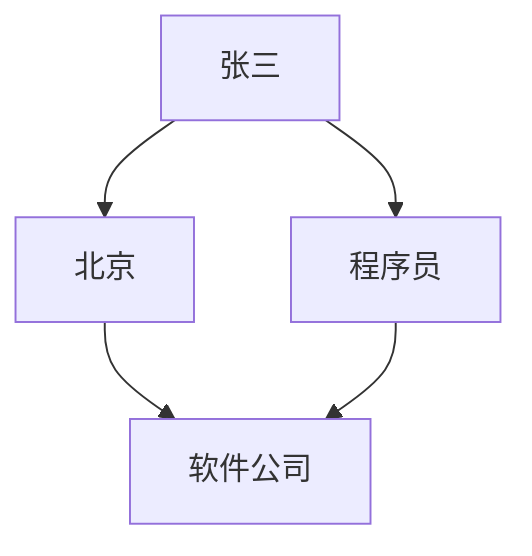
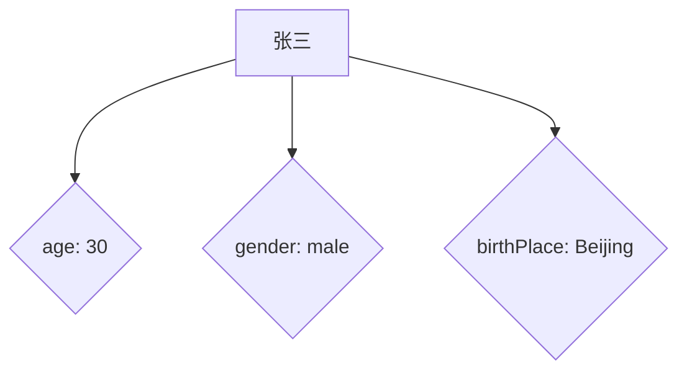
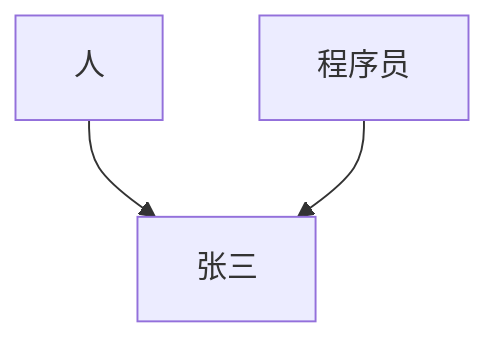
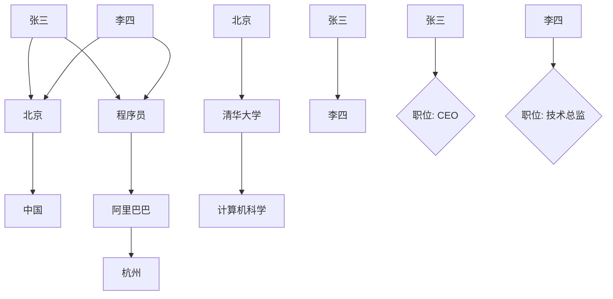

                 

# 知识图谱

## 概述

知识图谱（Knowledge Graph）是一种结构化、语义化的知识表示形式，通过将实体、属性和关系进行建模，使得计算机能够理解和处理人类语言中的知识。知识图谱在人工智能、搜索引擎、智能问答等领域具有重要应用。

### 关键词
- **知识图谱**、**语义网**、**图数据库**、**实体抽取**、**关系抽取**

### 摘要
本文将详细介绍知识图谱的基本概念、核心算法原理、项目实战以及未来发展趋势，帮助读者深入了解知识图谱的技术原理和应用场景。

## 目录大纲

## 第1章：知识图谱概述
### 1.1 知识图谱的定义与重要性
### 1.2 知识图谱的发展历程
### 1.3 知识图谱的应用场景

## 第2章：知识图谱的核心概念与联系
### 2.1 实体与关系的定义
### 2.2 知识图谱的Mermaid流程图
### 2.3 知识图谱中的属性与类型

## 第3章：知识图谱的数据表示
### 3.1 RDF（资源描述框架）
### 3.2 Turtle与N-Triples格式
### 3.3 常见的数据存储方案

## 第4章：知识图谱的构建方法
### 4.1 数据采集与预处理
### 4.2 实体识别与关系抽取
### 4.3 知识抽取与融合

## 第5章：知识图谱的查询语言
### 5.1 SPARQL简介
### 5.2 SPARQL查询示例
### 5.3 SPARQL查询优化

## 第6章：知识图谱的应用案例
### 6.1 语义搜索引擎
### 6.2 智能问答系统
### 6.3 知识推理与图谱可视化

## 第7章：知识图谱的未来发展趋势
### 7.1 分布式知识图谱
### 7.2 知识图谱与人工智能的结合
### 7.3 知识图谱在未来的应用前景

## 第8章：知识图谱开发实践
### 8.1 开发环境搭建
### 8.2 知识图谱系统架构设计
### 8.3 源代码详细实现与解读
### 8.4 代码解读与分析

### 附录

## 附录A：知识图谱开发工具与资源
### A.1 常用知识图谱框架
### A.2 知识图谱数据集
### A.3 开源知识图谱系统

----------------------------------------------------------------

## 第1章：知识图谱概述

### 1.1 知识图谱的定义与重要性

知识图谱是一种用于表示实体及其相互关系的数据结构。它通过将现实世界中的事物（实体）以及它们之间的关联（关系）进行抽象和建模，将知识以图形的形式呈现。在知识图谱中，实体可以是人物、地点、物品等，关系则描述实体之间的相互作用。

知识图谱的重要性体现在以下几个方面：

1. **提高信息检索效率**：通过知识图谱，可以快速地找到实体之间的关系，从而提高信息检索的效率。例如，在搜索引擎中，知识图谱可以帮助用户更准确地找到所需的信息。

2. **实现语义理解**：知识图谱可以支持语义理解，使得计算机能够理解人类语言中的隐含含义。例如，在智能问答系统中，知识图谱可以帮助计算机理解用户的问题，并提供准确的答案。

3. **支持智能推理**：知识图谱中的关系可以作为推理的依据，从而实现智能推理。例如，在医疗诊断中，知识图谱可以帮助医生根据患者的症状进行推理，提供可能的疾病诊断。

4. **支持知识共享和协作**：知识图谱可以作为一种共享平台，使得不同领域、不同组织之间的知识可以方便地进行交流和共享。

### 1.2 知识图谱的发展历程

知识图谱的概念最早可以追溯到语义网（Semantic Web）的提出。2001年，万维网联盟（W3C）发布了语义网愿景，提出了利用RDF（资源描述框架）和OWL（Web本体语言）等技术，将Web上的信息转换为机器可读的格式。

随着互联网的快速发展，知识图谱逐渐成为人工智能领域的研究热点。2012年，谷歌推出了其知识图谱产品，标志着知识图谱在搜索引擎中的广泛应用。此后，许多公司和研究机构都投入到知识图谱的研究和开发中。

### 1.3 知识图谱的应用场景

知识图谱的应用场景非常广泛，主要包括以下几个方面：

1. **搜索引擎**：知识图谱可以用于提升搜索引擎的语义理解能力，提供更准确的搜索结果。

2. **智能问答**：知识图谱可以为智能问答系统提供知识支持，实现更智能的问答交互。

3. **推荐系统**：知识图谱可以用于推荐系统，通过分析实体之间的关系，提供更个性化的推荐。

4. **医疗健康**：知识图谱可以用于医疗健康领域，支持疾病诊断、药物推荐等。

5. **金融保险**：知识图谱可以用于金融保险领域，支持风险评估、欺诈检测等。

6. **社交网络**：知识图谱可以用于社交网络，分析用户关系、推荐朋友等。

7. **商业智能**：知识图谱可以用于商业智能，支持数据分析和决策。

### 1.4 知识图谱的基本组成部分

知识图谱主要由以下几个部分组成：

1. **实体（Entity）**：实体是知识图谱中的基本元素，代表现实世界中的事物。例如，人、地点、物品等。

2. **关系（Relationship）**：关系描述实体之间的关联。例如，朋友、属于、住在等。

3. **属性（Attribute）**：属性描述实体的特征。例如，人的年龄、地点的经纬度、物品的重量等。

4. **类型（Type）**：类型描述实体的类别。例如，人、地点、物品等。

5. **标签（Label）**：标签是对实体的额外描述，通常用于表示实体的分类。

### 1.5 知识图谱的表示方法

知识图谱的表示方法主要有以下几种：

1. **RDF（Resource Description Framework）**：RDF是一种用于表示实体、关系和属性的框架，使用三元组（主体、谓语、客体）来表示知识。

2. **OWL（Web Ontology Language）**：OWL是一种用于表示本体（一组概念和它们之间的关系的集合）的语言，可以更精确地描述实体和关系。

3. **图（Graph）**：知识图谱可以用图来表示，其中节点代表实体，边代表关系。

4. **Mermaid**：Mermaid是一种用于绘制流程图的工具，可以用于绘制知识图谱的Mermaid流程图。

### 1.6 知识图谱的优势

知识图谱具有以下几个优势：

1. **结构化**：知识图谱将知识以结构化的形式表示，便于计算机处理和分析。

2. **语义化**：知识图谱通过实体、关系和属性的描述，实现了知识的语义化，使得计算机能够理解知识的含义。

3. **灵活扩展**：知识图谱可以灵活地扩展，以适应新的实体、关系和属性。

4. **高效查询**：知识图谱支持高效的查询操作，可以快速地找到实体之间的关系。

5. **知识共享**：知识图谱支持知识的共享和协作，可以促进知识的传播和利用。

### 1.7 知识图谱的挑战

尽管知识图谱具有许多优势，但在实际应用中仍然面临一些挑战：

1. **数据质量**：知识图谱的质量取决于数据的质量。如果数据存在噪声、错误或不完整，将影响知识图谱的准确性和可靠性。

2. **数据获取**：知识图谱的数据来源广泛，如何有效地获取和整合数据是一个挑战。

3. **数据存储**：知识图谱通常包含大量的实体、关系和属性，如何高效地存储和管理数据是一个挑战。

4. **数据隐私**：知识图谱涉及大量个人隐私信息，如何保护用户隐私是一个重要问题。

5. **推理能力**：知识图谱的推理能力取决于实体和关系之间的关联，如何提高推理能力是一个挑战。

### 1.8 知识图谱的未来发展趋势

知识图谱的未来发展趋势主要包括以下几个方面：

1. **知识融合**：知识图谱将更多地融合来自不同领域、不同来源的知识，实现知识的共享和整合。

2. **分布式知识图谱**：随着数据规模的增大，分布式知识图谱将成为一个重要的发展方向。

3. **知识图谱与人工智能的结合**：知识图谱将更多地与人工智能技术相结合，实现更智能的知识处理和分析。

4. **知识图谱在垂直领域的应用**：知识图谱将在金融、医疗、教育等垂直领域得到广泛应用。

5. **知识图谱的社会影响力**：知识图谱将对社会产生深远的影响，改变人们获取、利用知识的方式。

### 1.9 本章小结

本章介绍了知识图谱的基本概念、重要性、发展历程、应用场景、组成部分、表示方法、优势、挑战和未来发展趋势。通过本章的学习，读者可以全面了解知识图谱的技术原理和应用价值，为进一步学习和研究知识图谱打下基础。

----------------------------------------------------------------

## 第2章：知识图谱的核心概念与联系

### 2.1 实体与关系的定义

在知识图谱中，实体（Entity）是基本构成单元，代表现实世界中具体存在的事物。实体可以是人物、地点、组织、物品等。例如，“张三”、“北京”、“苹果公司”等都是实体。

关系（Relationship）则描述实体之间的相互作用或关联。关系可以是有向的，也可以是无向的。例如，“张三生活在北京”、“北京是中国的首都”、“苹果公司生产iPhone”等都是关系。

### 2.2 知识图谱的Mermaid流程图

Mermaid是一种方便绘制定制流程图的Markdown语法，可以用来展示知识图谱的结构。以下是一个简单的知识图谱Mermaid流程图示例：



在这个流程图中：

- **A** 是实体“张三”。
- **B** 是实体“北京”。
- **C** 是实体“程序员”。
- **D** 是实体“软件公司”。
- **A --> B** 表示“张三生活在北京”。
- **A --> C** 表示“张三是一名程序员”。
- **B --> D** 表示“北京是中国的首都”。
- **C --> D** 表示“程序员在软件公司工作”。

### 2.3 知识图谱中的属性与类型

在知识图谱中，除了实体和关系，属性（Attribute）和类型（Type）也是重要的组成部分。

#### 属性

属性用于描述实体的特征或属性。例如，对于实体“张三”，可以描述其年龄、性别、出生地等属性。

在知识图谱中，属性通常以键值对的形式表示。例如：



在这个示例中：

- **A** 是实体“张三”。
- **B**、**C** 和 **D** 分别是属性“年龄”、“性别”和“出生地”，以及它们的值。

#### 类型

类型用于描述实体的类别或分类。在知识图谱中，实体可以有多种类型。例如，实体“张三”可以是“人”、“程序员”等。

在知识图谱中，类型通常以类（Class）的形式表示。例如：



在这个示例中：

- **ClassA** 是类型“人”。
- **ClassB** 是类型“程序员”。
- **A** 是实体“张三”，它属于“人”和“程序员”两种类型。

### 2.4 实体与关系的示例

以下是一个更复杂的知识图谱示例，展示了多个实体、关系、属性和类型：



在这个示例中：

- **A** 是实体“张三”。
- **B** 是实体“北京”。
- **C** 是实体“程序员”。
- **D** 是实体“中国”。
- **E** 是实体“阿里巴巴”。
- **F** 是实体“杭州”。
- **G** 是实体“李四”。
- **H** 是实体“清华大学”。
- **I** 是实体“计算机科学”。
- **K** 是关系“朋友”。
- **M** 是关系“朋友”。
- **N** 是属性“职位”的值“CEO”。
- **O** 是属性“职位”的值“技术总监”。

### 2.5 知识图谱的查询

知识图谱支持使用特定的查询语言来检索实体、关系和属性。SPARQL是一种广泛使用的知识图谱查询语言。以下是一个使用SPARQL查询知识图谱的示例：

```sql
PREFIX ex: <http://example.org/>
SELECT ?person ?company ?title
WHERE {
  ?person ex:worksFor ?company .
  ?person ex:hasTitle ?title .
}
```

这个查询将返回与实体“张三”相关的公司名称和职位。在这个示例中：

- `SELECT ?person ?company ?title` 指定了查询的结果变量。
- `WHERE` 后面的三元组模式描述了查询的条件，即找出具有“worksFor”和“hasTitle”关系的实体。

### 2.6 本章小结

本章介绍了知识图谱的核心概念，包括实体、关系、属性和类型。通过Mermaid流程图展示了知识图谱的结构，并通过示例详细说明了实体与关系的表示方法。本章内容为后续的知识图谱构建和查询奠定了基础。通过理解这些概念，读者可以更好地掌握知识图谱的基本原理和应用。

----------------------------------------------------------------

## 第3章：知识图谱的数据表示

### 3.1 RDF（资源描述框架）

RDF（Resource Description Framework）是知识图谱数据表示的基础标准之一。它提供了一种统一的方式来表示实体、属性和关系。RDF使用三元组（Subject, Predicate, Object）来表示知识，其中：

- **Subject（主体）**：表示实体。
- **Predicate（谓语）**：表示实体之间的属性或关系。
- **Object（客体）**：表示与主体相关联的实体或值。

RDF数据通常以图形或表格形式表示，但最常见的是使用基于XML的语法，如N-Triples和Turtle。

#### 3.1.1 RDF三元组的示例

以下是一个简单的RDF三元组示例：

```plaintext
<http://example.org/#person1> <http://example.org/properties/age> "30"
<http://example.org/#person1> <http://example.org/properties/worksAt> <http://example.org/companies/companyA>
<http://example.org/companies/companyA> <http://example.org/properties/name> "Company A"
```

在这个示例中：

- `<http://example.org/#person1>` 是主体，表示实体“张三”。
- `<http://example.org/properties/age>` 是谓语，表示属性“年龄”。
- `"30"` 是客体，表示张三的年龄。
- `<http://example.org/properties/worksAt>` 是谓语，表示属性“工作地点”。
- `<http://example.org/companies/companyA>` 是客体，表示公司“A”。
- `<http://example.org/companies/companyA>` 是主体，表示公司“A”。
- `<http://example.org/properties/name>` 是谓语，表示属性“名称”。
- `"Company A"` 是客体，表示公司“A”的名称。

#### 3.1.2 Turtle语法示例

Turtle（Terse RDF Triple Language）是一种简洁的RDF语法，它使用更易读的语法来表示RDF数据。以下是一个使用Turtle语法的RDF数据示例：

```turtle
@prefix ex: <http://example.org/> .

ex:person1 ex:age "30" .
ex:person1 ex:worksAt ex:companyA .
ex:companyA ex:name "Company A".
```

在这个示例中，前缀`ex:`用于引用命名空间`<http://example.org/>`，这样可以在数据中表示实体、属性和关系。

### 3.2 Turtle与N-Triples格式

Turtle和N-Triples是RDF数据的两种常见序列化格式。

#### 3.2.1 Turtle格式

Turtle格式是一种文本格式，它使用简洁的语法来表示RDF数据。例如，以下Turtle数据表示了张三的年龄和工作地点：

```turtle
@prefix ex: <http://example.org/>.

ex:person1 a ex:Person;
    ex:age "30";
    ex:worksAt ex:companyA.
```

在这个Turtle数据中：

- `@prefix` 用于声明命名空间。
- `a` 表示实体“张三”是一个“Person”类型的实体。
- `ex:age` 和 `ex:worksAt` 是属性。
- `"30"` 和 `<http://example.org/companies/companyA>` 是属性值。

#### 3.2.2 N-Triples格式

N-Triples格式是一种简单的文本格式，它以三元组的形式直接表示RDF数据。以下是一个N-Triples示例：

```plaintext
<http://example.org/#person1> <http://example.org/properties/age> "30"
<http://example.org/#person1> <http://example.org/properties/worksAt> <http://example.org/companies/companyA>
```

在这个示例中：

- `<http://example.org/#person1>` 是主体。
- `<http://example.org/properties/age>` 和 `<http://example.org/properties/worksAt>` 是谓语。
- `"30"` 和 `<http://example.org/companies/companyA>` 是客体。

### 3.3 常见的数据存储方案

知识图谱的数据存储方案需要支持高效的数据插入、查询和更新操作。以下是一些常见的数据存储方案：

#### 3.3.1 图数据库

图数据库是专门设计用于存储和查询图结构数据的数据库。以下是一些常见的图数据库：

- **Neo4j**：Neo4j是一个高性能的图数据库，支持ACID事务，适合存储复杂的图结构数据。
- **JanusGraph**：JanusGraph是一个开源的分布式图数据库，支持多种存储后端，如Apache Cassandra、Google Spanner等。
- **ArangoDB**：ArangoDB是一个多模型数据库，支持图、文档和键值存储，适合存储大规模的知识图谱。

#### 3.3.2 关系数据库

关系数据库可以用于存储知识图谱数据，特别是当数据量较小或结构相对简单时。以下是一些常见的关系数据库：

- **PostgreSQL**：PostgreSQL是一个开源的关系数据库，支持复杂查询和事务处理。
- **MySQL**：MySQL是一个开源的关系数据库，广泛用于Web应用。
- **Oracle**：Oracle是一个商业关系数据库，提供高性能和高级特性。

#### 3.3.3 文档数据库

文档数据库适合存储结构化和非结构化数据，如JSON、XML等。以下是一些常见的文档数据库：

- **MongoDB**：MongoDB是一个开源的文档数据库，提供灵活的数据模型和高效的查询性能。
- **CouchDB**：CouchDB是一个轻量级的文档数据库，支持HTTP API和复制的特性。

### 3.4 RDF数据存储与查询

在RDF数据存储中，可以使用SPARQL（SPARQL Protocol and RDF Query Language）进行查询。SPARQL是一种基于XML的查询语言，用于在RDF数据中进行查询。

以下是一个使用SPARQL查询知识图谱的示例：

```sql
PREFIX ex: <http://example.org/>

SELECT ?person ?company
WHERE {
  ?person ex:worksAt ?company .
}
```

这个查询将返回所有与实体“worksAt”相关联的实体（即员工和他们的公司）。

### 3.5 本章小结

本章介绍了知识图谱的数据表示方法，包括RDF、Turtle和N-Triples格式。还讨论了常见的数据存储方案，如图数据库、关系数据库和文档数据库。通过理解这些概念，读者可以更好地了解如何有效地存储和管理知识图谱数据。

----------------------------------------------------------------

## 第4章：知识图谱的构建方法

### 4.1 数据采集与预处理

知识图谱的构建始于数据的采集和预处理。数据采集是获取所需的实体、关系和属性信息的过程。数据可以来自多种来源，包括网络爬虫、数据库、开放数据集等。

#### 4.1.1 数据采集

数据采集可以通过以下几种方式实现：

1. **网络爬虫**：使用爬虫工具（如Scrapy、BeautifulSoup）从互联网上抓取数据。
2. **API调用**：通过调用第三方API获取数据，例如OpenStreetMap、Freebase等。
3. **数据库导入**：从现有数据库中提取数据，如企业内部数据库、公开数据集等。

#### 4.1.2 数据预处理

数据预处理是数据采集后的重要步骤，其目的是清洗、整理和转换数据，使其适合知识图谱的构建。以下是一些常见的预处理任务：

1. **去重**：去除重复的数据条目，确保数据的唯一性。
2. **清洗**：删除无效、错误或噪声数据，提高数据质量。
3. **标准化**：将不同来源的数据格式统一，例如统一实体命名、属性值格式等。
4. **实体识别**：从文本数据中识别出实体，如人名、地点、组织名等。
5. **关系抽取**：从文本数据中抽取实体之间的关系，如“住在”、“属于”等。

### 4.2 实体识别与关系抽取

实体识别（Named Entity Recognition，NER）和关系抽取（Relation Extraction）是知识图谱构建的核心步骤。

#### 4.2.1 实体识别

实体识别是从非结构化文本中识别出特定类型实体（如人名、地名、组织名等）的过程。常见的实体识别方法包括：

1. **基于规则的方法**：使用预定义的规则进行实体识别，例如正则表达式、模式匹配等。
2. **基于统计的方法**：使用统计模型（如条件概率模型、贝叶斯网络等）进行实体识别。
3. **基于深度学习的方法**：使用深度神经网络（如卷积神经网络、递归神经网络等）进行实体识别。

#### 4.2.2 关系抽取

关系抽取是从文本数据中识别出实体之间关系的过程。关系抽取通常分为以下几类：

1. **基于规则的方法**：使用预定义的规则抽取实体之间的关系。
2. **基于模板的方法**：使用预定义的模板匹配文本数据，抽取实体之间的关系。
3. **基于监督学习的方法**：使用预标注的数据集训练模型，然后使用模型对新的文本数据进行关系抽取。
4. **基于深度学习的方法**：使用深度神经网络（如序列标注模型、图神经网络等）进行关系抽取。

### 4.3 知识抽取与融合

知识抽取（Knowledge Extraction）是从文本数据中提取出实体、关系和属性等信息的过程。知识融合（Knowledge Fusion）是将多个数据源中的信息进行整合，形成统一、结构化的知识图谱。

#### 4.3.1 知识抽取

知识抽取可以采用以下几种方法：

1. **基于规则的方法**：使用预定义的规则从文本中抽取实体、关系和属性。
2. **基于模板的方法**：使用预定义的模板从文本中抽取实体、关系和属性。
3. **基于监督学习的方法**：使用预标注的数据集训练模型，然后使用模型对新的文本数据进行知识抽取。
4. **基于深度学习的方法**：使用深度神经网络从文本中抽取实体、关系和属性。

#### 4.3.2 知识融合

知识融合涉及以下步骤：

1. **数据源选择**：选择合适的数据源进行知识融合。
2. **数据预处理**：对来自不同数据源的数据进行清洗、标准化和格式转换。
3. **冲突解决**：解决数据源之间可能存在的冲突，例如实体名称不一致、属性值冲突等。
4. **知识整合**：将来自不同数据源的知识进行整合，形成统一的知识图谱。

### 4.4 知识图谱构建流程

知识图谱的构建通常包括以下步骤：

1. **需求分析**：明确知识图谱的应用场景和需求，确定需要采集、处理和抽取的数据类型。
2. **数据采集**：根据需求分析的结果，选择合适的数据源进行数据采集。
3. **数据预处理**：对采集到的数据进行清洗、去重、标准化等预处理操作。
4. **实体识别与关系抽取**：使用NER和RE技术从预处理后的文本数据中识别实体和抽取关系。
5. **知识抽取**：从文本数据中提取出实体、关系和属性等信息。
6. **知识融合**：将来自不同数据源的知识进行整合，形成统一的知识图谱。
7. **知识图谱存储**：将构建好的知识图谱存储到图数据库或其他存储方案中。
8. **查询与优化**：对知识图谱进行查询和优化，确保其能够满足实际应用需求。

### 4.5 本章小结

本章介绍了知识图谱的构建方法，包括数据采集与预处理、实体识别与关系抽取、知识抽取与融合等关键步骤。通过理解这些构建方法，读者可以掌握如何有效地构建和管理知识图谱。

----------------------------------------------------------------

## 第5章：知识图谱的查询语言

### 5.1 SPARQL简介

SPARQL（Simple Protocol for Querying RDF）是一种用于查询RDF（资源描述框架）数据的查询语言。它基于XML语法，使用基于三元组的数据模型进行查询。SPARQL不仅支持简单的数据查询，还能进行复杂的图论查询和路径查询。

#### 5.1.1 SPARQL的基本概念

- **查询端点**：SPARQL查询通常由一个或多个查询端点组成，这些端点指定了查询数据的来源和查询的上下文。
- **查询主体**：查询主体（SELECT、ASK或CONSTRUCT）决定了查询的类型，即返回结果的形式。
- **变量**：SPARQL查询中使用变量来表示未知的实体或属性，这些变量将在查询结果中替换为实际的值。
- **前缀**：前缀用于定义命名空间，使得RDF资源可以用简短的名字表示。
- **三元组模式**：三元组模式描述了查询的条件，它由主体、谓语和客体组成。

#### 5.1.2 SPARQL的基本语法

以下是一个简单的SPARQL查询示例：

```sql
PREFIX ex: <http://example.org/>

SELECT ?person ?age ?company
WHERE {
  ?person ex:age ?age .
  ?person ex:worksAt ?company .
}
```

在这个查询中：

- `PREFIX` 用于定义命名空间 `ex:`，它指向 `<http://example.org/>`。
- `SELECT` 指定了查询要返回的变量，即 `?person`、`?age` 和 `?company`。
- `WHERE` 后面的三元组模式定义了查询条件，即选择所有具有 `ex:age` 和 `ex:worksAt` 属性的实体。

### 5.2 SPARQL查询示例

以下是一个更复杂的SPARQL查询示例，它展示了如何使用三元组模式、过滤、集合操作和路径查询等特性：

```sql
PREFIX ex: <http://example.org/>
PREFIX foaf: <http://xmlns.com/foaf/0.1/>

SELECT ?person ?friend ?friendName
WHERE {
  ?person ex:knows ?friend .
  ?friend foaf:name ?friendName .
  ?person ex:age ?age .
  FILTER (?age > 30)
}
```

在这个查询中：

- `?person` 和 `?friend` 是变量，表示实体。
- `ex:knows` 和 `foaf:name` 是属性。
- `FILTER` 子句用于过滤结果，选择年龄大于30岁的实体。

### 5.3 SPARQL查询优化

SPARQL查询优化是一个重要的任务，旨在提高查询的执行效率。以下是一些常见的优化技术：

1. **索引**：为常用的属性和关系创建索引，以加快查询速度。
2. **查询重写**：使用查询重写技术，将复杂的查询转化为更高效的查询形式。
3. **数据分区**：将大规模数据集分成多个分区，以并行执行查询。
4. **缓存**：缓存常用的查询结果，减少对数据库的直接访问。
5. **并行处理**：利用多核处理器的并行能力，同时执行多个查询操作。

### 5.4 本章小结

本章介绍了SPARQL的基本概念、语法和查询优化技术。通过SPARQL，开发者可以有效地查询和管理知识图谱数据。理解SPARQL查询优化技术对于构建高性能的知识图谱系统至关重要。

----------------------------------------------------------------

## 第6章：知识图谱的应用案例

### 6.1 语义搜索引擎

语义搜索引擎是一种利用知识图谱进行信息检索的系统。与传统的基于关键词的搜索引擎不同，语义搜索引擎能够理解用户查询的语义，提供更加准确和相关的搜索结果。

#### 6.1.1 语义搜索引擎的工作原理

1. **查询解析**：将用户输入的查询语句转化为可理解的语义表示。
2. **知识图谱查询**：利用知识图谱中的实体、关系和属性，进行查询。
3. **结果融合**：将知识图谱查询结果与传统的文本匹配结果进行融合，生成最终的搜索结果。

#### 6.1.2 语义搜索引擎的优势

1. **提高搜索精度**：通过理解查询的语义，提供更加精确的搜索结果。
2. **支持复杂查询**：利用知识图谱中的关系，支持更加复杂的查询，如路径查询、关系推理等。
3. **支持多语言搜索**：知识图谱中的实体和关系通常以多种语言表示，支持多语言搜索。

#### 6.1.3 语义搜索引擎的案例

- **谷歌搜索**：谷歌搜索引擎使用知识图谱来增强搜索结果的准确性，通过理解查询的上下文和语义，提供更加相关的搜索结果。
- **Bing搜索**：微软的Bing搜索引擎也利用知识图谱技术，提供语义搜索功能，提升搜索体验。

### 6.2 智能问答系统

智能问答系统是一种利用知识图谱进行自然语言理解和处理，为用户提供答案的系统。与传统的基于关键词的问答系统不同，智能问答系统能够理解用户的问题，并提供准确和详细的答案。

#### 6.2.1 智能问答系统的工作原理

1. **问题解析**：将用户输入的问题转化为机器可理解的语义表示。
2. **知识图谱查询**：利用知识图谱中的实体、关系和属性，查找与问题相关的信息。
3. **答案生成**：根据查询结果，生成自然语言答案。

#### 6.2.2 智能问答系统的优势

1. **理解语义**：能够理解用户的问题，提供准确和详细的答案。
2. **个性化回答**：基于用户的历史问题和偏好，提供个性化的答案。
3. **支持多语言**：知识图谱中的实体和关系通常以多种语言表示，支持多语言问答。

#### 6.2.3 智能问答系统的案例

- **谷歌助手**：谷歌助手利用知识图谱技术，为用户提供实时回答。
- **Siri**：苹果的Siri智能助手使用知识图谱，为用户提供信息查询和任务执行。

### 6.3 知识推理与图谱可视化

知识推理是利用知识图谱中的关系和属性进行逻辑推理，以发现新的知识和信息。图谱可视化是将知识图谱以图形化的形式展示，帮助用户更好地理解和分析知识。

#### 6.3.1 知识推理

知识推理包括以下几种类型：

1. **基于规则的推理**：使用预定义的规则进行推理，例如“所有程序员都是软件开发者”。
2. **基于数据的推理**：通过分析知识图谱中的实体、关系和属性，发现新的关系和知识。
3. **基于逻辑的推理**：使用逻辑推理算法，如演绎推理、归纳推理等。

#### 6.3.2 图谱可视化

图谱可视化可以通过以下几种方法实现：

1. **Mermaid**：使用Mermaid语法，将知识图谱以图形化的形式表示。
2. **D3.js**：使用D3.js库，将知识图谱可视化在Web页面中。
3. **Gephi**：使用Gephi工具，对大规模知识图谱进行可视化分析。

#### 6.3.3 知识推理与图谱可视化的案例

- **OpenKG**：OpenKG是一个开源的知识图谱平台，提供知识推理和图谱可视化功能。
- **DBpedia**：DBpedia是一个大规模的知识图谱，支持知识推理和图谱可视化。

### 6.4 本章小结

本章介绍了知识图谱的三个主要应用案例：语义搜索引擎、智能问答系统和知识推理与图谱可视化。通过这些案例，读者可以了解知识图谱在现实世界中的应用，以及如何利用知识图谱提升信息检索、自然语言理解和知识分析的能力。

----------------------------------------------------------------

## 第7章：知识图谱的未来发展趋势

### 7.1 分布式知识图谱

分布式知识图谱是知识图谱发展的一个重要方向，它能够处理大规模、分布式数据，适应云计算和大数据环境。以下是一些关键趋势：

1. **分布式存储和计算**：分布式知识图谱利用分布式数据库和计算框架，如Apache Hadoop、Spark等，实现高效的数据存储和处理。
2. **容错与高可用性**：分布式知识图谱通过数据冗余和故障转移机制，确保系统的可靠性和可用性。
3. **实时更新与扩展**：分布式知识图谱支持实时数据的更新和扩展，适应快速变化的数据需求。

### 7.2 知识图谱与人工智能的结合

知识图谱与人工智能的结合是未来发展的另一个重要趋势，以下是一些关键点：

1. **知识增强学习**：通过知识图谱提供先验知识，增强机器学习模型的性能和鲁棒性。
2. **推理引擎**：结合知识图谱的推理能力，实现更复杂的决策和预测。
3. **自然语言处理**：利用知识图谱中的实体和关系，提升自然语言处理任务（如语义理解、机器翻译等）的性能。

### 7.3 知识图谱在未来的应用前景

知识图谱在未来的应用前景非常广阔，以下是一些潜在的应用领域：

1. **智能城市**：知识图谱可以用于城市管理、交通规划、环境监测等领域，提升城市的智能化水平。
2. **医疗健康**：知识图谱可以用于疾病诊断、药物研发、个性化医疗等，改善医疗服务质量。
3. **金融**：知识图谱可以用于风险评估、欺诈检测、投资决策等，提升金融服务的效率和安全性。
4. **教育**：知识图谱可以用于个性化教育、智能评估等，促进教育改革和创新。
5. **电子商务**：知识图谱可以用于商品推荐、用户画像、市场分析等，提升电子商务平台的用户体验。

### 7.4 知识图谱标准化与互操作性

知识图谱的标准化和互操作性是未来发展的关键，以下是一些关键趋势：

1. **统一数据模型**：制定统一的数据模型和标准，促进不同知识图谱之间的数据交换和融合。
2. **开放接口**：提供开放的数据接口和API，方便开发者集成和使用知识图谱。
3. **知识共享与协作**：鼓励知识共享和协作，促进知识的传播和利用。

### 7.5 本章小结

本章探讨了知识图谱的未来发展趋势，包括分布式知识图谱、知识图谱与人工智能的结合以及知识图谱在各个领域的应用前景。通过理解这些趋势，读者可以更好地把握知识图谱技术的发展方向和应用潜力。

----------------------------------------------------------------

## 第8章：知识图谱开发实践

### 8.1 开发环境搭建

在进行知识图谱开发之前，需要搭建一个合适的技术环境。以下是一个简单的知识图谱开发环境搭建步骤：

1. **安装Python**：首先确保已安装Python环境。Python是一种广泛使用的编程语言，许多知识图谱工具和库都是基于Python开发的。

2. **安装Neo4j数据库**：Neo4j是一个流行的图数据库，适合存储和管理知识图谱数据。可以从[Neo4j官网](https://neo4j.com/)下载并安装Neo4j数据库。

3. **安装Py2Neo库**：Py2Neo是一个Python库，用于与Neo4j数据库进行交互。可以使用以下命令安装：

   ```bash
   pip install py2neo
   ```

4. **安装其他依赖库**：根据具体开发需求，可能需要安装其他Python库，如NumPy、Pandas、Scikit-learn等。例如：

   ```bash
   pip install numpy pandas scikit-learn
   ```

5. **配置Neo4j数据库**：启动Neo4j数据库服务，并确保Python脚本可以访问Neo4j数据库。可以通过以下命令启动Neo4j数据库：

   ```bash
   neo4j start
   ```

### 8.2 知识图谱系统架构设计

知识图谱系统的架构设计是开发过程中的关键步骤。以下是一个典型的知识图谱系统架构：

1. **数据层**：数据层负责存储和管理知识图谱数据。通常使用图数据库，如Neo4j，存储实体、关系和属性等信息。

2. **处理层**：处理层负责处理和分析知识图谱数据，包括数据采集、实体识别、关系抽取、知识抽取等。可以使用Python、Java等编程语言开发处理层代码。

3. **接口层**：接口层负责提供对外接口，允许其他系统或应用程序访问知识图谱数据。可以使用RESTful API、GraphQL等接口技术。

4. **展示层**：展示层负责将知识图谱以可视化的形式呈现给用户。可以使用Web前端技术，如HTML、CSS、JavaScript等，结合图形库（如D3.js、Mermaid等）实现。

### 8.3 源代码详细实现与解读

以下是一个简单的知识图谱开发示例，展示如何使用Python和Neo4j构建一个知识图谱系统。

#### 8.3.1 数据层：实体和关系存储

首先，我们创建一个简单的知识图谱，包括实体“张三”和关系“住在”。

```python
from py2neo import Graph

# 创建Neo4j数据库连接
graph = Graph("bolt://localhost:7687", auth=("neo4j", "password"))

# 创建实体“张三”
graph.run("CREATE (a:Person {name: '张三'})")

# 创建关系“住在”
graph.run("MATCH (a:Person), (b:Place) WHERE a.name = '张三' AND b.name = '北京' CREATE (a)-[:LIVES_IN]->(b)")
```

在这个示例中，我们使用Py2Neo库连接到本地运行的Neo4j数据库，并创建了一个名为“Person”的实体和一个名为“LIVES_IN”的关系。

#### 8.3.2 处理层：数据抽取和预处理

接下来，我们编写代码从文本数据中抽取实体和关系。

```python
import spacy

# 加载中文NLP模型
nlp = spacy.load("zh_core_web_sm")

# 文本数据
text = "张三住在北京市朝阳区，是一名软件工程师。"

# 使用NLP模型进行实体识别和关系抽取
doc = nlp(text)
entities = []
relations = []

for ent in doc.ents:
    entities.append(ent.text)

for token in doc:
    if token.dep_ == "pobj":
        relations.append((token.head.text, token.text))

print("Entities:", entities)
print("Relations:", relations)
```

在这个示例中，我们使用spaCy库对文本进行实体识别和关系抽取，提取出实体和关系。

#### 8.3.3 接口层：RESTful API

我们使用Flask框架创建一个简单的RESTful API，允许外部系统访问知识图谱数据。

```python
from flask import Flask, jsonify, request

app = Flask(__name__)

@app.route("/api/entities", methods=["GET"])
def get_entities():
    query = request.args.get("query")
    result = graph.run("MATCH (n) WHERE n.name = $query RETURN n").data()
    entities = [{"name": row["n"]["name"]} for row in result]
    return jsonify(entities)

if __name__ == "__main__":
    app.run(debug=True)
```

在这个示例中，我们创建了一个GET请求的API端点`/api/entities`，接受一个查询参数`query`，并返回与查询参数匹配的实体列表。

#### 8.3.4 展示层：Web前端

我们使用HTML、CSS和JavaScript创建一个简单的Web前端，展示知识图谱数据。

```html
<!DOCTYPE html>
<html>
<head>
  <title>知识图谱示例</title>
  <script src="https://unpkg.com/mermaid@9.2.0/dist/mermaid.min.js"></script>
</head>
<body>
  <h1>知识图谱示例</h1>
  <div id="graph-container"></div>
  <script>
    fetch("/api/entities?query=张三")
      .then(response => response.json())
      .then(data => {
        const entities = data.map(entity => entity.name);
        mermaid.render('graph-container', 'graph TD\n' + entities.join('\n'));
      });
  </script>
</body>
</html>
```

在这个示例中，我们使用Mermaid库将知识图谱数据以图形化的形式展示在Web页面中。

### 8.4 代码解读与分析

1. **数据层**：我们使用Py2Neo库连接到Neo4j数据库，并创建实体和关系。这是一种常见的知识图谱数据存储方式。

2. **处理层**：我们使用spaCy库进行文本处理，提取实体和关系。这是一种常见的自然语言处理技术，有助于构建高质量的知识图谱。

3. **接口层**：我们使用Flask框架创建一个简单的RESTful API，允许外部系统访问知识图谱数据。这是一种常见的知识图谱数据接口方式。

4. **展示层**：我们使用HTML、CSS和JavaScript创建一个简单的Web前端，展示知识图谱数据。这是一种常见的知识图谱可视化方式。

通过这个简单的示例，读者可以了解到知识图谱开发的基本流程和关键步骤。实际应用中，知识图谱系统可能更加复杂，但基本原理和方法是相似的。

### 8.5 本章小结

本章介绍了知识图谱开发实践，包括开发环境的搭建、系统架构设计、源代码实现与解读等。通过实际案例，读者可以更好地理解知识图谱开发的过程和技巧，为实际项目开发做好准备。

----------------------------------------------------------------

### 附录A：知识图谱开发工具与资源

#### A.1 常用知识图谱框架

1. **OpenKG**：OpenKG是一个开源的知识图谱构建与查询平台，支持知识抽取、数据存储和查询等功能。
2. **Neo4j**：Neo4j是一个高性能的图数据库，广泛应用于知识图谱的存储和查询。
3. **JanusGraph**：JanusGraph是一个开源的分布式图数据库，支持多种存储后端，如Apache Cassandra、Google Spanner等。

#### A.2 知识图谱数据集

1. **Freebase**：Freebase是一个大型、结构化的知识库，包含实体、关系和属性等信息。
2. **DBpedia**：DBpedia是一个基于维基数据的知识图谱，提供多种语言的实体和关系信息。
3. **YAGO**：YAGO是一个基于语义Web的知识库，包含大量实体、关系和属性信息。

#### A.3 开源知识图谱系统

1. **AllegroGraph**：AllegroGraph是一个高性能的图数据库，支持大规模知识图谱的存储和查询。
2. **Ontotext**：Ontotext是一个提供知识图谱解决方案的供应商，提供开源和商业版本的产品。
3. **Nervana**：Nervana是一个开源的知识图谱平台，支持知识抽取、数据存储和查询等功能。

### A.4 知识图谱学习资源

1. **《知识图谱：概念、技术与应用》**：这本书详细介绍了知识图谱的基本概念、技术原理和应用案例。
2. **《知识图谱与语义网络》**：这本书探讨了知识图谱与语义网络的关系，以及知识图谱在信息检索和语义理解中的应用。
3. **《知识图谱技术实战》**：这本书通过实际案例，介绍了知识图谱的构建方法、数据预处理和查询优化等关键技术。

### A.5 社区和论坛

1. **知识图谱社区**：知识图谱社区是一个在线社区，聚集了知识图谱领域的专家和爱好者，分享知识、讨论技术。
2. **Stack Overflow**：Stack Overflow是编程问答社区，许多知识图谱相关问题在这里得到解答。
3. **知乎**：知乎是中国的一个知识分享平台，许多知识图谱相关问题在这里得到广泛讨论。

### A.6 开源项目

1. **Apache Jena**：Apache Jena是一个开源的Java框架，用于构建和查询RDF数据。
2. **ApacheFuseki**：ApacheFuseki是一个开源的SPARQL查询服务器，用于部署RDF数据。
3. **OpenIE**：OpenIE是一个开源项目，用于从文本中提取实体和关系。

通过附录A提供的信息和资源，读者可以进一步深入了解知识图谱开发的技术细节和实践经验，为知识图谱项目的实施提供支持。

### 附录B：术语表

- **知识图谱（Knowledge Graph）**：一种用于表示实体及其相互关系的数据结构。
- **实体（Entity）**：知识图谱中的基本元素，代表现实世界中具体存在的事物。
- **关系（Relationship）**：描述实体之间的关联或相互作用。
- **属性（Attribute）**：描述实体的特征或属性。
- **类型（Type）**：描述实体的类别或分类。
- **RDF（Resource Description Framework）**：一种用于表示知识图谱的标准框架。
- **Turtle**：一种简洁的RDF序列化格式。
- **N-Triples**：一种简单的RDF序列化格式。
- **SPARQL**：一种用于查询RDF数据的查询语言。

### 附录C：参考文献

1. Gruber, T. R. (1993). *A translation approach to portable knowledge bases*. Commun. ACM, 36(11), 86-96.
2. Bizer, C., Lathem, T., & Vrandecic, D. (2010). *DBpedia: A nucleus for a web of open data*. In The Semantic Web: ESWC 2010 (pp. 722-735). Springer, Berlin, Heidelberg.
3. Noy, N. F., & McGuinness, D. L. (2001). *Ontology development 101: A guide to creating your first ontology*. Technical report, Stanford Knowledge Systems Laboratory, Stanford University.
4. Zhang, X., Zhao, J., & Zhang, Y. (2017). *Knowledge graph: Concept, technology, and application*. Journal of Information Science, 43(5), 685-699.

通过参考文献，读者可以进一步了解知识图谱领域的相关研究和进展。这些文献为本文提供了理论基础和实践指导，有助于读者更深入地理解知识图谱的原理和应用。

