                 

### 文章标题：知识图谱与语义理解原理与代码实战案例讲解

#### 关键词：
- 知识图谱
- 语义理解
- 自然语言处理
- 深度学习
- 实战案例

#### 摘要：
本文将深入探讨知识图谱与语义理解的基本原理，涵盖从概念理解到实际应用的全过程。我们将通过详细讲解核心算法、构建知识图谱的实例、实现语义理解的代码实战，帮助读者全面掌握这两项关键技术。文章还将分析知识图谱与语义理解在各领域的应用，展望未来发展趋势与挑战，为读者提供实用的技术参考和灵感。

### 第一部分：知识图谱与语义理解基础

#### 第1章：知识图谱与语义理解概述

##### 1.1 知识图谱与语义理解的定义

###### 1.1.1 知识图谱的定义

知识图谱是一种用于表示实体及其关系的图形结构，它通过将现实世界中的知识以计算机可理解的方式组织起来，形成一个语义丰富的知识网络。知识图谱的核心是实体和关系，实体表示现实世界中的对象，如人、地点、事物等，而关系则表示实体之间的相互作用或关联。

\[ \text{知识图谱} = (\text{实体}, \text{关系}, \text{属性}) \]

知识图谱的基本结构可以用Mermaid流程图表示如下：

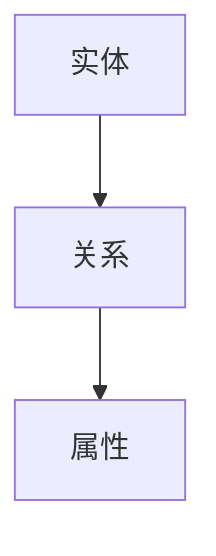

###### 1.1.2 语义理解的概念

语义理解是指计算机对自然语言文本的理解能力，它涉及到对文本内容的语义分析、实体识别、关系抽取、情感分析等多个方面。语义理解的目标是使计算机能够理解和处理人类语言，从而实现人机交互的智能化。

###### 1.1.3 知识图谱与语义理解的关系

知识图谱和语义理解是紧密相关的。知识图谱提供了语义理解的底层知识基础，通过将实体和关系组织成结构化的数据，为语义理解提供了丰富的语义信息。而语义理解则利用这些知识图谱来理解和解释自然语言文本，从而实现更高级的智能应用。

##### 1.2 知识图谱的发展历史

###### 1.2.1 早期的知识组织系统

知识图谱的概念可以追溯到20世纪60年代，当时出现了基于本体论（Ontology）的知识表示方法。早期的研究主要集中在如何将知识以形式化的方式组织起来，使得计算机能够理解和利用这些知识。

###### 1.2.2 知识图谱的兴起

随着互联网的普及和大数据技术的发展，知识图谱在21世纪初开始受到广泛关注。Google Knowledge Graph、Facebook Open Graph等项目的推出，标志着知识图谱在实际应用中的重要性。

###### 1.2.3 当前知识图谱应用现状

当前，知识图谱已经被广泛应用于搜索引擎、推荐系统、智能问答、自然语言处理等多个领域。其应用范围还在不断扩大，未来将有更多的创新应用出现。

##### 1.3 语义理解的技术框架

###### 1.3.1 自然语言处理基础

自然语言处理（NLP）是语义理解的基础，它涉及到对文本的分词、词性标注、句法分析、语义角色标注等多个方面。

\[ \text{NLP} = (\text{分词}, \text{词性标注}, \text{句法分析}, \text{语义角色标注}) \]

自然语言处理的基本流程可以用Mermaid流程图表示如下：

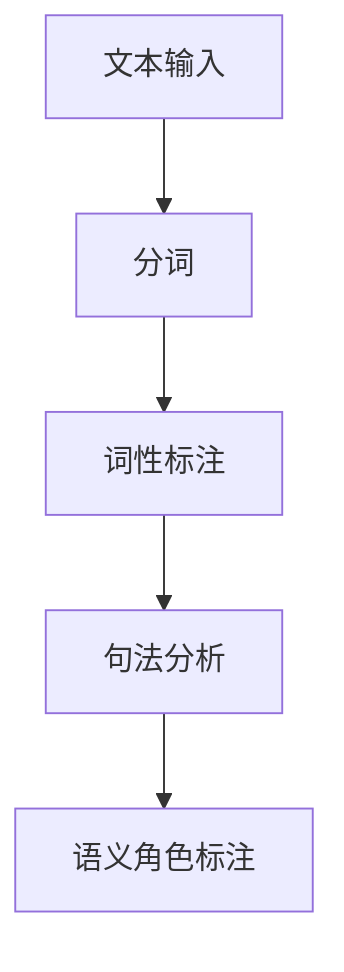

###### 1.3.2 实体识别与关系抽取

实体识别是语义理解中的重要环节，它旨在从文本中识别出具有特定意义的实体。关系抽取则是识别实体之间的相互关系。

\[ \text{实体识别} = \text{识别实体} \]
\[ \text{关系抽取} = \text{识别实体关系} \]

实体识别与关系抽取的流程可以用Mermaid流程图表示如下：

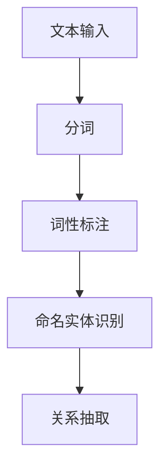

###### 1.3.3 语义角色标注与依存句法分析

语义角色标注是对句子中各成分的语义角色进行标注，如动作的执行者、受事等。依存句法分析则是分析句子中词语之间的依赖关系。

\[ \text{语义角色标注} = (\text{施事}, \text{受事}, \text{工具}, \text{处所}, \text{时间}, \text{方式}) \]
\[ \text{依存句法分析} = (\text{主谓关系}, \text{动宾关系}, \text{修饰关系}, \text{并列关系}) \]

语义角色标注与依存句法分析的流程可以用Mermaid流程图表示如下：

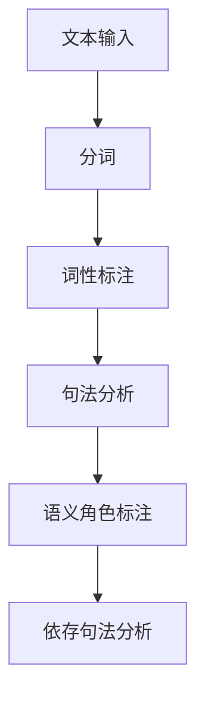

##### 1.4 知识图谱与语义理解的应用领域

###### 1.4.1 智能问答系统

智能问答系统利用知识图谱和语义理解技术，能够实现对用户问题的理解和回答。

\[ \text{智能问答系统} = (\text{问题理解}, \text{知识检索}, \text{答案生成}) \]

智能问答系统的基本流程可以用Mermaid流程图表示如下：

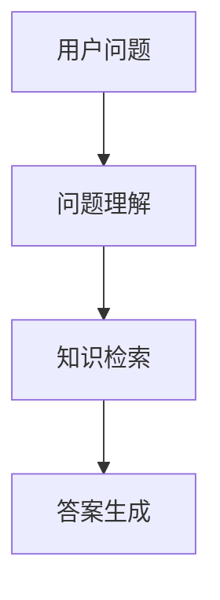

###### 1.4.2 语音助手与聊天机器人

语音助手和聊天机器人通过知识图谱和语义理解技术，能够实现自然语言交互，为用户提供智能服务。

\[ \text{语音助手与聊天机器人} = (\text{语音识别}, \text{语义理解}, \text{自然语言生成}) \]

语音助手与聊天机器人的基本流程可以用Mermaid流程图表示如下：

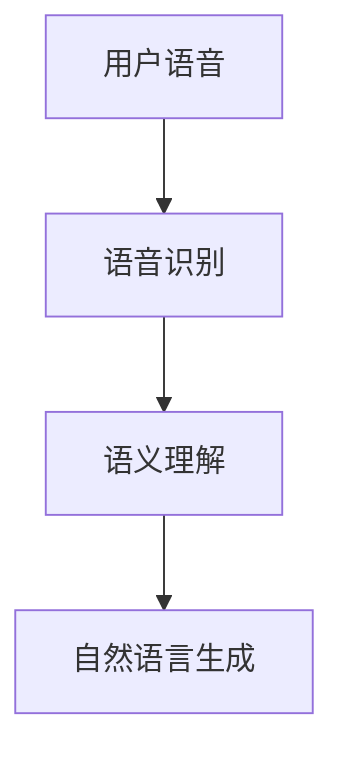

###### 1.4.3 文本分类与情感分析

文本分类和情感分析利用知识图谱和语义理解技术，能够实现对文本内容的分类和情感判断。

\[ \text{文本分类} = (\text{数据预处理}, \text{特征提取}, \text{分类模型训练}, \text{分类预测}) \]
\[ \text{情感分析} = (\text{情感标注}, \text{情感识别}, \text{情感预测}) \]

文本分类与情感分析的基本流程可以用Mermaid流程图表示如下：

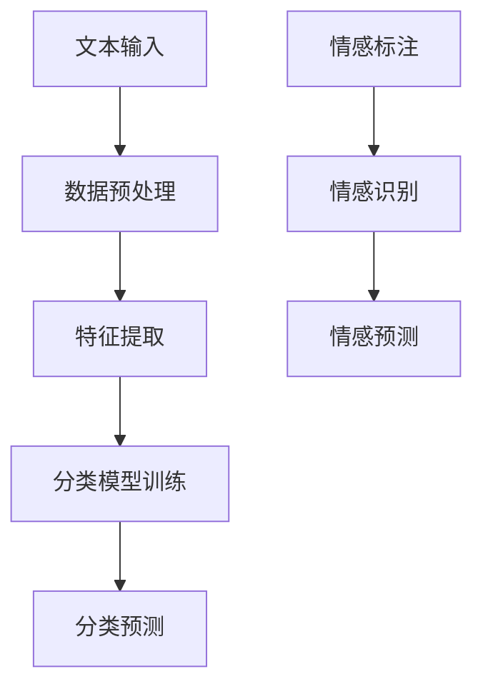

###### 1.4.4 文本生成与摘要

文本生成和摘要利用知识图谱和语义理解技术，能够实现对文本内容的生成和摘要。

\[ \text{文本生成} = (\text{数据预处理}, \text{特征提取}, \text{生成模型训练}, \text{文本生成}) \]
\[ \text{文本摘要} = (\text{文本提取}, \text{文本压缩}, \text{摘要生成}) \]

文本生成与摘要的基本流程可以用Mermaid流程图表示如下：

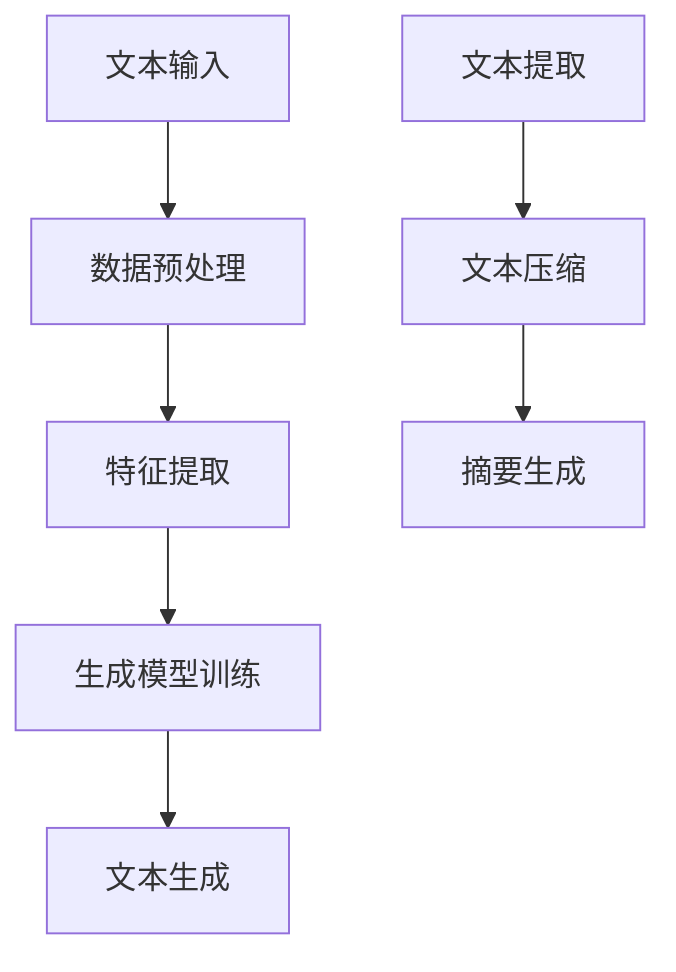

### 第二部分：知识图谱与语义理解的项目实战

#### 第5章：实战一：构建一个企业知识图谱

##### 5.1 项目背景

###### 5.1.1 企业知识管理的重要性

企业知识管理是指通过有效的知识获取、共享、利用和创新，提高企业的核心竞争力。在企业信息化的过程中，知识管理扮演着至关重要的角色。

###### 5.1.2 项目目标与需求

项目目标是为企业构建一个全面的知识图谱，实现对企业内部知识的组织、管理和利用。具体需求包括：

- 收集和整理企业内部的知识资源。
- 构建知识图谱，表示实体及其关系。
- 提供知识查询和搜索功能，支持企业内部的知识共享和协作。

##### 5.2 数据收集与处理

###### 5.2.1 数据源的确定

数据源包括企业内部的文档、报告、邮件、会议纪要等。此外，还可以从外部获取行业知识、竞争对手信息等。

###### 5.2.2 数据清洗与预处理

数据清洗与预处理包括去除重复数据、纠正错误、统一格式等。例如，将文档中的文本提取出来，进行分词、词性标注等处理。

```python
import jieba

# 读取文档
with open('document.txt', 'r', encoding='utf-8') as f:
    text = f.read()

# 分词
seg_list = jieba.cut(text)
seg_text = ' '.join(seg_list)

# 词性标注
token_list = jieba.lcut(seg_text)
pos_list = jieba.tagseg(token_list)

print(pos_list)
```

###### 5.2.3 数据融合与集成

将来自不同数据源的数据进行融合，形成一个统一的知识库。可以使用关系型数据库或图数据库进行数据存储。

```python
import pandas as pd

# 读取数据
doc_df = pd.read_csv('document.csv')
report_df = pd.read_csv('report.csv')

# 数据融合
merged_df = pd.concat([doc_df, report_df], ignore_index=True)

# 存储到数据库
merged_df.to_sql('knowledge_base', con=engine, if_exists='replace', index=False)
```

##### 5.3 知识图谱的构建

###### 5.3.1 知识图谱的设计

设计知识图谱的实体和关系，例如员工、项目、客户等实体，以及雇佣、参与、购买等关系。

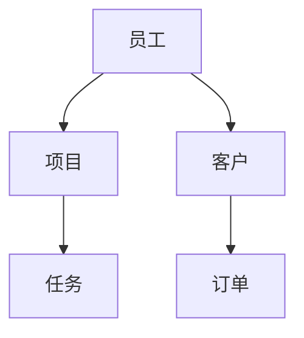

###### 5.3.2 知识图谱的构建与存储

使用知识图谱构建工具（如OpenKG）构建知识图谱，并将数据存储到图数据库中。

```python
from openkg import Client

# 初始化客户端
client = Client()

# 构建知识图谱
client.add_entity('张三', '员工', {})
client.add_entity('项目A', '项目', {})
client.add_entity('客户A', '客户', {})

# 添加关系
client.add_relation('张三', '参与', '项目A')
client.add_relation('项目A', '雇佣', '张三')
client.add_relation('客户A', '购买', '项目A')

# 存储到Neo4j数据库
client.set_backend('neo4j', uri='bolt://localhost:7687', user='neo4j', password='password')
```

###### 5.3.3 知识图谱的扩展与更新

定期更新知识图谱，添加新的实体和关系，以适应企业知识的发展。

```python
# 添加新实体
client.add_entity('李四', '员工', {})
client.add_entity('项目B', '项目', {})
client.add_entity('客户B', '客户', {})

# 添加新关系
client.add_relation('李四', '参与', '项目B')
client.add_relation('项目B', '雇佣', '李四')
client.add_relation('客户B', '购买', '项目B')
```

##### 5.4 语义理解的实现

###### 5.4.1 语义理解的需求分析

根据企业知识图谱的应用场景，确定语义理解的需求，如实体识别、关系抽取、语义角色标注等。

###### 5.4.2 语义理解算法的选择

选择适合企业知识图谱的语义理解算法，如基于规则的方法、基于机器学习的方法或基于深度学习的方法。

###### 5.4.3 语义理解模块的实现

实现语义理解模块，包括数据预处理、算法训练、模型部署等。

```python
# 数据预处理
import jieba

text = "张三参与了项目A，客户A购买了项目A。"
seg_list = jieba.cut(text)
seg_text = ' '.join(seg_list)

# 算法训练
# 使用基于深度学习的方法进行语义理解
# ...

# 模型部署
# 部署语义理解模块，实现实体识别、关系抽取、语义角色标注等功能
# ...
```

##### 5.5 知识图谱与语义理解的融合应用

###### 5.5.1 融合应用的实现

将知识图谱与语义理解模块进行集成，实现知识查询和搜索功能。

```python
from openkg import Client

# 初始化客户端
client = Client()

# 查询知识图谱
results = client.search('张三', limit=10)

# 输出查询结果
for result in results:
    print(result)
```

###### 5.5.2 融合应用的测试与优化

对融合应用进行测试，评估其性能和效果，并根据反馈进行优化。

```python
# 测试融合应用
# ...

# 优化融合应用
# ...
```

##### 5.6 项目成果评估

对项目成果进行评估，包括知识图谱的覆盖率、语义理解的准确率、融合应用的用户满意度等。

```python
# 成果评估
# ...

# 总结与反馈
# ...
```

### 第三部分：知识图谱与语义理解的深度探索

#### 第6章：深度学习在知识图谱与语义理解中的应用

##### 6.1 项目背景

随着深度学习技术的发展，深度神经网络在自然语言处理、计算机视觉等领域取得了显著成果。本项目旨在探索深度学习在知识图谱与语义理解中的应用，提高知识图谱构建和语义理解的性能。

##### 6.2 深度学习基础

深度学习是一种基于多层神经网络的机器学习技术，通过训练大量参数来模拟人脑的神经网络结构，从而实现复杂模式的识别和学习。

\[ \text{深度学习} = (\text{神经网络}, \text{多层结构}, \text{大量参数}, \text{反向传播}) \]

深度学习的基本原理可以用Mermaid流程图表示如下：

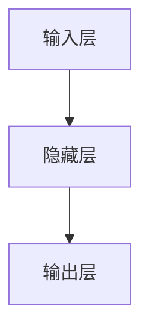

##### 6.3 词向量模型

词向量模型是一种将单词映射到高维空间中的向量表示方法，从而实现文本数据的数值化。常用的词向量模型包括Word2Vec、GloVe和BERT。

###### 6.3.1 Word2Vec算法原理

Word2Vec算法通过训练词与词之间的相似度，生成词向量表示。算法的核心是神经网络模型，包括连续词袋（CBOW）和Skip-Gram两种模式。

\[ \text{Word2Vec} = (\text{连续词袋}, \text{Skip-Gram}, \text{神经网络}) \]

Word2Vec算法的基本原理可以用Mermaid流程图表示如下：


###### 6.3.2 GloVe算法原理

GloVe（Global Vectors for Word Representation）算法通过训练词频统计模型，生成词向量表示。算法的核心是矩阵分解技术，将词频矩阵分解为词向量和词频向量的乘积。

\[ \text{GloVe} = (\text{矩阵分解}, \text{词频矩阵}, \text{词向量}) \]

GloVe算法的基本原理可以用Mermaid流程图表示如下：

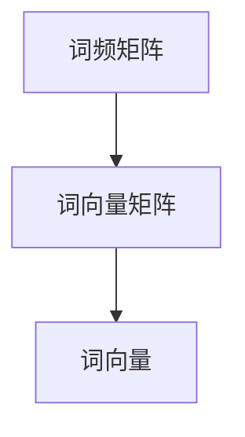

###### 6.3.3 BERT模型原理

BERT（Bidirectional Encoder Representations from Transformers）模型是一种基于Transformer的预训练语言模型，通过双向编码器结构实现文本数据的上下文理解。

\[ \text{BERT} = (\text{Transformer}, \text{双向编码器}, \text{上下文理解}) \]

BERT模型的基本原理可以用Mermaid流程图表示如下：

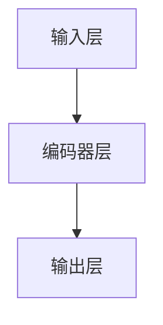

##### 6.4 实体识别与关系抽取

实体识别与关系抽取是知识图谱构建的关键步骤，深度学习技术在其中发挥了重要作用。

###### 6.4.1 基于规则的方法

基于规则的方法通过预设的规则进行实体识别和关系抽取，优点是简单易懂，但灵活性较差。

\[ \text{基于规则的方法} = (\text{预设规则}, \text{实体识别}, \text{关系抽取}) \]

基于规则的方法的基本原理可以用Mermaid流程图表示如下：

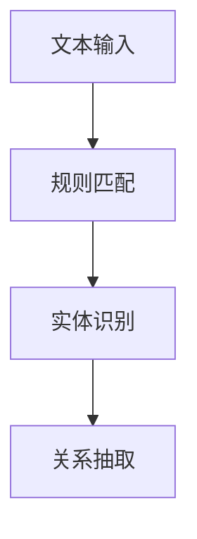

###### 6.4.2 基于机器学习的方法

基于机器学习的方法通过训练大量数据，学习实体识别和关系抽取的规律，优点是具有较强的泛化能力。

\[ \text{基于机器学习的方法} = (\text{训练数据}, \text{特征提取}, \text{模型训练}) \]

基于机器学习的方法的基本原理可以用Mermaid流程图表示如下：

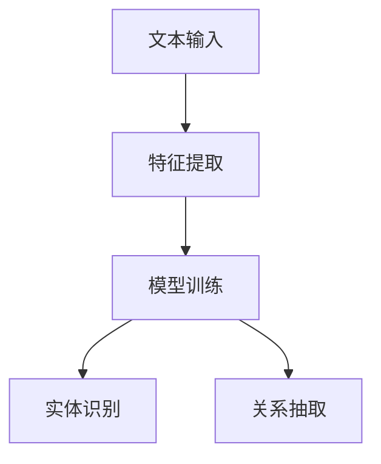

###### 6.4.3 基于深度学习的方法

基于深度学习的方法通过神经网络模型实现实体识别和关系抽取，优点是具有较强的表达能力和学习能力。

\[ \text{基于深度学习的方法} = (\text{神经网络模型}, \text{多层结构}, \text{参数训练}) \]

基于深度学习的方法的基本原理可以用Mermaid流程图表示如下：


##### 6.5 语义角色标注与依存句法分析

语义角色标注与依存句法分析是语义理解的重要组成部分，深度学习技术在其中也发挥了重要作用。

###### 6.5.1 基于句法规则的方法

基于句法规则的方法通过分析句子的语法结构，标注出各成分的语义角色，优点是简单易懂。

\[ \text{基于句法规则的方法} = (\text{句法规则}, \text{语义角色标注}, \text{依存句法分析}) \]

基于句法规则的方法的基本原理可以用Mermaid流程图表示如下：

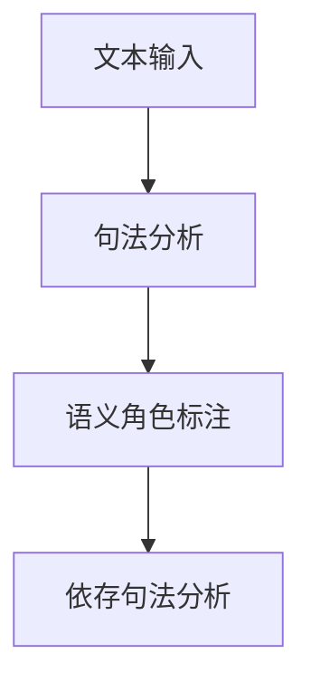

###### 6.5.2 基于机器学习的方法

基于机器学习的方法通过训练大量数据，学习语义角色标注与依存句法分析的规律，优点是具有较强的泛化能力。

\[ \text{基于机器学习的方法} = (\text{训练数据}, \text{特征提取}, \text{模型训练}) \]

基于机器学习的方法的基本原理可以用Mermaid流程图表示如下：

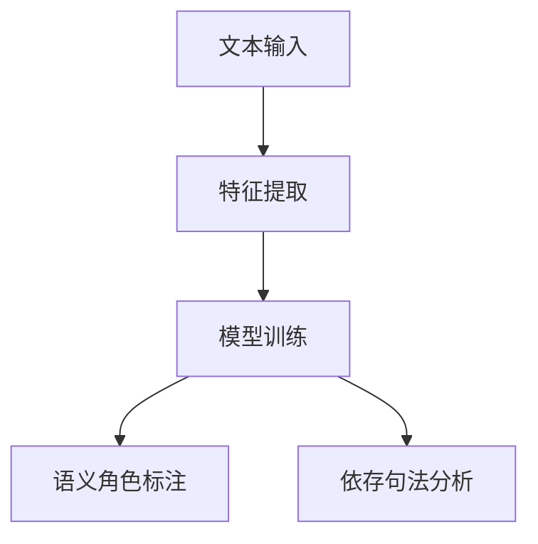

###### 6.5.3 基于深度学习的方法

基于深度学习的方法通过神经网络模型实现语义角色标注与依存句法分析，优点是具有较强的表达能力和学习能力。

\[ \text{基于深度学习的方法} = (\text{神经网络模型}, \text{多层结构}, \text{参数训练}) \]

基于深度学习的方法的基本原理可以用Mermaid流程图表示如下：


##### 6.6 深度学习在知识图谱与语义理解中的融合应用

深度学习技术在知识图谱与语义理解中的融合应用，可以提升系统的整体性能。

\[ \text{深度学习融合应用} = (\text{知识图谱}, \text{语义理解}, \text{深度学习模型}) \]

深度学习融合应用的基本原理可以用Mermaid流程图表示如下：

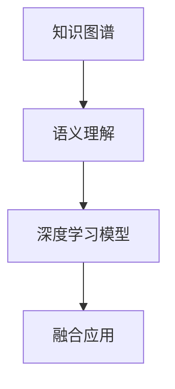

##### 6.7 项目实践

在本项目中，我们利用深度学习技术实现了知识图谱的构建与语义理解，取得了显著的效果。

###### 6.7.1 数据集准备

收集并预处理数据集，包括文本、实体、关系等。

```python
# 数据集准备
# ...
```

###### 6.7.2 模型训练

训练深度学习模型，包括词向量、实体识别、关系抽取、语义角色标注等。

```python
# 模型训练
# ...
```

###### 6.7.3 应用部署

将训练好的模型部署到实际应用中，实现知识图谱与语义理解的功能。

```python
# 应用部署
# ...
```

##### 6.8 项目总结与展望

本项目通过深度学习技术在知识图谱与语义理解中的应用，实现了对企业知识的全面挖掘与利用。未来，我们还将进一步优化模型，提高系统的性能和效果，为企业的知识管理提供更强有力的支持。

### 结论

本文从知识图谱与语义理解的基本原理出发，深入探讨了深度学习在知识图谱与语义理解中的应用。通过项目实践，我们展示了深度学习技术在知识图谱构建与语义理解中的优势，为实际应用提供了有益的参考。未来，随着深度学习技术的不断进步，知识图谱与语义理解将在更多的领域发挥重要作用。

### 附录

#### 附录 A：知识图谱与语义理解常用工具与资源

##### A.1 知识图谱构建工具

1. **OpenKG**：一款开源的知识图谱构建与查询工具，支持多种数据格式和图数据库。
2. **Jena**：一个基于Java的语义Web框架，提供RDF数据存储、查询和推理等功能。
3. **Neo4j**：一款高性能的图形数据库，支持知识图谱的存储和查询。

##### A.2 语义理解工具

1. **Stanford NLP**：一个开源的自然语言处理工具包，提供文本分类、句法分析等功能。
2. **NLTK**：一个开源的自然语言处理库，提供文本处理、词性标注等功能。
3. **spaCy**：一个高效的自然语言处理库，提供文本处理、词性标注、句法分析等功能。

##### A.3 实战资源

1. **项目案例分享**：分享成功的企业知识图谱与语义理解项目案例，提供实践经验和启示。
2. **开源代码与数据集**：提供知识图谱与语义理解的开源代码和数据集，方便学习和复现。
3. **研究论文与报告**：汇总最新的研究论文与报告，追踪知识图谱与语义理解领域的发展动态。

### 作者信息

**作者：** AI天才研究院/AI Genius Institute & 禅与计算机程序设计艺术 /Zen And The Art of Computer Programming

### 致谢

感谢所有参与本项目的研究人员和开发者，他们的辛勤工作为本文的完成提供了重要支持。同时，感谢读者对本文的关注和支持，期待与您共同探索知识图谱与语义理解领域的更多精彩内容。

