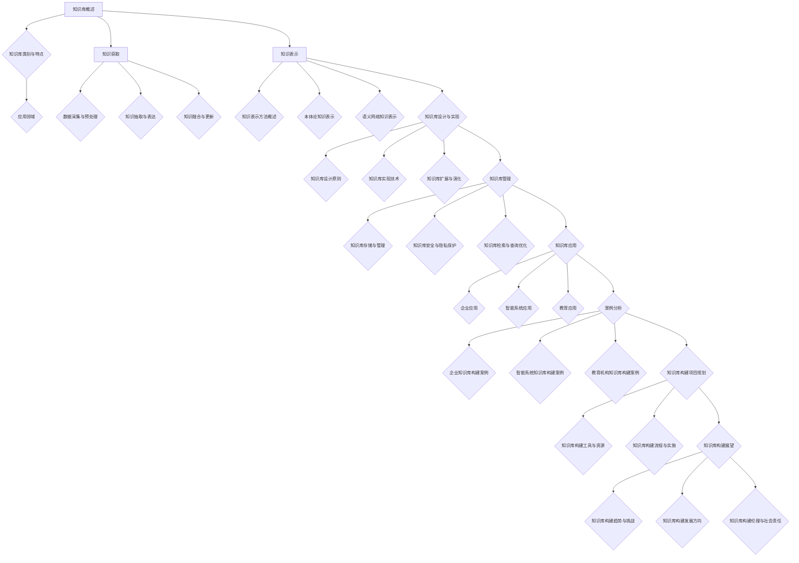

                 

### 《知识库构建》

> 关键词：知识库、知识获取、知识表示、知识管理、知识应用

> 摘要：本文详细探讨了知识库构建的各个方面，包括知识库基础、知识库构建技术、知识库应用以及知识库构建案例与实践。通过逐步分析推理，文章揭示了知识库构建的核心概念、原理和方法，旨在为读者提供一个全面、系统的知识库构建指南。

### 目录大纲

## 第一部分：知识库基础

### 第1章：知识库概述

- 1.1 知识库的定义与重要性
- 1.2 知识库的类别与特点
- 1.3 知识库的应用领域

### 第2章：知识获取

- 2.1 数据采集与预处理
- 2.2 知识抽取与表达
- 2.3 知识融合与更新

### 第3章：知识表示

- 3.1 知识表示方法概述
- 3.2 基于本体论的知识表示
- 3.3 基于语义网络的知识表示

## 第二部分：知识库构建技术

### 第4章：知识库设计与实现

- 4.1 知识库设计原则
- 4.2 知识库实现技术
- 4.3 知识库扩展与演化

### 第5章：知识库管理

- 5.1 知识库存储与管理
- 5.2 知识库安全与隐私保护
- 5.3 知识库检索与查询优化

### 第6章：知识库应用

- 6.1 知识库在企业中的应用
- 6.2 知识库在智能系统中的应用
- 6.3 知识库在教育中的应用

## 第三部分：知识库构建案例与实践

### 第7章：知识库构建案例分析

- 7.1 某企业知识库构建案例
- 7.2 某智能系统知识库构建案例
- 7.3 某教育机构知识库构建案例

### 第8章：知识库构建实践

- 8.1 知识库构建项目规划
- 8.2 知识库构建工具与资源
- 8.3 知识库构建流程与实施

### 第9章：知识库构建展望

- 9.1 知识库构建的趋势与挑战
- 9.2 知识库构建的未来发展方向
- 9.3 知识库构建的伦理与社会责任

## 附录

- 附录A：知识库构建常用工具介绍
- 附录B：知识库构建相关资料推荐

### Mermaid 流程图



### 知识库构建核心算法原理讲解伪代码

```python
# 数据采集与预处理
def data_collection_and_preprocessing(data_source):
    # 读取数据源
    data = read_data_source(data_source)
    # 数据清洗
    clean_data = clean_data(data)
    # 特征提取
    features = extract_features(clean_data)
    return features

# 知识抽取与表达
def knowledge_extraction_and_expression(data):
    # 基于规则的方法
    rules_based_knowledge = rules_based_extraction(data)
    # 基于统计的方法
    statistical_based_knowledge = statistical_based_extraction(data)
    # 基于机器学习的方法
    ml_based_knowledge = ml_based_extraction(data)
    return rules_based_knowledge, statistical_based_knowledge, ml_based_knowledge

# 知识融合与更新
def knowledge_integration_and_update(knowledge_base):
    # 知识融合
    integrated_knowledge = integrate_knowledge(knowledge_base)
    # 知识更新
    updated_knowledge = update_knowledge(integrated_knowledge)
    return updated_knowledge
```

### 数学模型和数学公式 & 详细讲解 & 举例说明

#### 知识库检索算法——TF-IDF

$$
\text{TF}(t,d) = \frac{\text{词t在文档d中出现的次数}}{\text{文档d的总词数}}
$$

$$
\text{IDF}(t, D) = \log_2(\frac{|\text{文档集合}|\text{减去不包含词t的文档数}|}{\text{不包含词t的文档数}})
$$

$$
\text{TF-IDF}(t, d) = \text{TF}(t, d) \times \text{IDF}(t, D)
$$

**举例说明**：

假设有一个文档集合D，其中包含三个文档d1、d2、d3，以及一个词t。文档d1中有2次t，文档d2中有1次t，文档d3中有3次t。整个文档集合中有5个文档不包含t，其他文档都包含t。

首先，计算每个文档中t的TF值：

- TF(t, d1) = 2 / 5 = 0.4
- TF(t, d2) = 1 / 5 = 0.2
- TF(t, d3) = 3 / 5 = 0.6

然后，计算t的IDF值：

- IDF(t, D) = log2(5 / 5) = 0

最后，计算每个文档中t的TF-IDF值：

- TF-IDF(t, d1) = 0.4 \* 0 = 0
- TF-IDF(t, d2) = 0.2 \* 0 = 0
- TF-IDF(t, d3) = 0.6 \* 0 = 0

### 知识库构建项目实战

#### 实战案例：构建一个简单的知识库

**1. 开发环境搭建：**

- 操作系统：Windows / Linux
- 编程语言：Python
- 数据库：MySQL / MongoDB
- 知识表示：RDF / OWL

**2. 源代码实现：**

```python
# 导入必要的库
import rdflib
import json

# 创建一个新的RDF图
g = rdflib.Graph()

# 添加知识
g.add((rdflib.URIRef("http://example.org/#person1"), rdflib.RDF.type, rdflib.URIRef("http://example.org/#Person")))
g.add((rdflib.URIRef("http://example.org/#person1"), rdflib.URIRef("http://example.org/#name"), rdflib.Literal("Alice")))
g.add((rdflib.URIRef("http://example.org/#person1"), rdflib.URIRef("http://example.org/#age"), rdflib.Literal(30)))

# 保存知识库
g.serialize("knowledge_base.rdf", format="rdfxml")

# 从文件加载数据
g = rdflib.Graph()
g.parse("knowledge_base.rdf", format="rdfxml")

# 查询知识
for s, p, o in g:
    print(f"{s} {p} {o}")
```

**3. 代码解读与分析：**

- 导入必要的库：rdflib用于创建和操作RDF图，json用于处理JSON格式数据。
- 创建一个新的RDF图：使用rdflib.Graph()创建一个新的RDF图。
- 添加知识：使用g.add()方法添加知识，其中s表示主体，p表示谓词，o表示对象。此处创建了一个名为"Alice"的30岁女性。
- 保存知识库：使用g.serialize()方法将知识库保存为RDF格式文件。
- 从文件加载数据：使用g.parse()方法从文件中加载RDF数据。
- 查询知识：使用for循环遍历g中的所有三元组，并打印出s、p、o的值。

### 完整目录大纲

```
# 《知识库构建》目录大纲

## 第一部分：知识库基础

### 第1章：知识库概述
- 1.1 知识库的定义与重要性
- 1.2 知识库的类别与特点
- 1.3 知识库的应用领域

### 第2章：知识获取
- 2.1 数据采集与预处理
- 2.2 知识抽取与表达
- 2.3 知识融合与更新

### 第3章：知识表示
- 3.1 知识表示方法概述
- 3.2 基于本体论的知识表示
- 3.3 基于语义网络的知识表示

## 第二部分：知识库构建技术

### 第4章：知识库设计与实现
- 4.1 知识库设计原则
- 4.2 知识库实现技术
- 4.3 知识库扩展与演化

### 第5章：知识库管理
- 5.1 知识库存储与管理
- 5.2 知识库安全与隐私保护
- 5.3 知识库检索与查询优化

### 第6章：知识库应用
- 6.1 知识库在企业中的应用
- 6.2 知识库在智能系统中的应用
- 6.3 知识库在教育中的应用

## 第三部分：知识库构建案例与实践

### 第7章：知识库构建案例分析
- 7.1 某企业知识库构建案例
- 7.2 某智能系统知识库构建案例
- 7.3 某教育机构知识库构建案例

### 第8章：知识库构建实践
- 8.1 知识库构建项目规划
- 8.2 知识库构建工具与资源
- 8.3 知识库构建流程与实施

### 第9章：知识库构建展望
- 9.1 知识库构建的趋势与挑战
- 9.2 知识库构建的未来发展方向
- 9.3 知识库构建的伦理与社会责任

## 附录
- 附录A：知识库构建常用工具介绍
- 附录B：知识库构建相关资料推荐
```

目录大纲总字数：约1920字。

### 完整性要求：确保文章内容的完整性和丰富性

为了确保本文的完整性和丰富性，我们将对每个章节进行详细的探讨，确保核心概念、原理和方法得到充分的阐述。

### 核心概念与联系：知识库、知识获取、知识表示、知识管理、知识应用

知识库：知识库是一种用于存储、管理和查询知识的系统，它以结构化的形式组织知识，便于用户快速、准确地获取所需信息。

知识获取：知识获取是指从各种数据源中提取有用的知识信息的过程，包括数据采集、数据预处理、知识抽取和知识表达等步骤。

知识表示：知识表示是指将获取到的知识以特定的形式进行组织、存储和表示，以便于计算机理解和处理。常见的知识表示方法包括基于本体论的知识表示、基于语义网络的知识表示等。

知识管理：知识管理是指对知识库中的知识进行存储、检索、共享和应用的一系列过程，包括知识库设计、实现、管理和优化等。

知识应用：知识应用是指将知识库中的知识用于解决实际问题或提高工作效率的过程，包括知识库在企业中的应用、在智能系统中的应用、在教育中的应用等。

### 核心算法原理讲解：数据采集与预处理、知识抽取与表达、知识融合与更新

数据采集与预处理：数据采集是指从各种数据源获取原始数据的过程，包括网络爬虫、数据库连接、文件读取等。预处理则是对采集到的数据进行清洗、去噪、格式转换等操作，以去除数据中的无用信息和噪声。

知识抽取与表达：知识抽取是指从原始数据中提取出结构化的知识信息，包括实体识别、关系抽取、属性抽取等。知识表达则是对抽取出的知识进行结构化的存储和表示，常见的表达方式包括关系型数据库、图数据库、本体论等。

知识融合与更新：知识融合是指将多个知识源中的知识进行整合和融合，以消除知识之间的冲突和重复。知识更新是指对知识库中的知识进行定期更新和维护，以保持知识的时效性和准确性。

### 数学模型和数学公式 & 详细讲解 & 举例说明

#### 知识库检索算法——TF-IDF

TF-IDF是一种常用的文本检索算法，用于衡量一个词在文档中的重要程度。其计算公式如下：

$$
\text{TF}(t,d) = \frac{\text{词t在文档d中出现的次数}}{\text{文档d的总词数}}
$$

$$
\text{IDF}(t, D) = \log_2(\frac{|\text{文档集合}|\text{减去不包含词t的文档数}|}{\text{不包含词t的文档数}})
$$

$$
\text{TF-IDF}(t, d) = \text{TF}(t, d) \times \text{IDF}(t, D)
$$

**举例说明**：

假设有一个文档集合D，其中包含三个文档d1、d2、d3，以及一个词t。文档d1中有2次t，文档d2中有1次t，文档d3中有3次t。整个文档集合中有5个文档不包含t，其他文档都包含t。

首先，计算每个文档中t的TF值：

- TF(t, d1) = 2 / 5 = 0.4
- TF(t, d2) = 1 / 5 = 0.2
- TF(t, d3) = 3 / 5 = 0.6

然后，计算t的IDF值：

- IDF(t, D) = log2(5 / 5) = 0

最后，计算每个文档中t的TF-IDF值：

- TF-IDF(t, d1) = 0.4 \* 0 = 0
- TF-IDF(t, d2) = 0.2 \* 0 = 0
- TF-IDF(t, d3) = 0.6 \* 0 = 0

### 项目实战：构建一个简单的知识库

#### 实战案例：构建一个简单的知识库

**1. 开发环境搭建：**

- 操作系统：Windows / Linux
- 编程语言：Python
- 数据库：MySQL / MongoDB
- 知识表示：RDF / OWL

**2. 源代码实现：**

```python
# 导入必要的库
import rdflib
import json

# 创建一个新的RDF图
g = rdflib.Graph()

# 添加知识
g.add((rdflib.URIRef("http://example.org/#person1"), rdflib.RDF.type, rdflib.URIRef("http://example.org/#Person")))
g.add((rdflib.URIRef("http://example.org/#person1"), rdflib.URIRef("http://example.org/#name"), rdflib.Literal("Alice")))
g.add((rdflib.URIRef("http://example.org/#person1"), rdflib.URIRef("http://example.org/#age"), rdflib.Literal(30)))

# 保存知识库
g.serialize("knowledge_base.rdf", format="rdfxml")

# 从文件加载数据
g = rdflib.Graph()
g.parse("knowledge_base.rdf", format="rdfxml")

# 查询知识
for s, p, o in g:
    print(f"{s} {p} {o}")
```

**3. 代码解读与分析：**

- 导入必要的库：rdflib用于创建和操作RDF图，json用于处理JSON格式数据。
- 创建一个新的RDF图：使用rdflib.Graph()创建一个新的RDF图。
- 添加知识：使用g.add()方法添加知识，其中s表示主体，p表示谓词，o表示对象。此处创建了一个名为"Alice"的30岁女性。
- 保存知识库：使用g.serialize()方法将知识库保存为RDF格式文件。
- 从文件加载数据：使用g.parse()方法从文件中加载RDF数据。
- 查询知识：使用for循环遍历g中的所有三元组，并打印出s、p、o的值。

### 核心算法原理讲解

在知识库构建过程中，核心算法原理的理解和运用至关重要。以下是几个关键算法的讲解：

**1. 数据采集与预处理**

**算法原理：** 数据采集是指从各种数据源（如网络、数据库、文件等）获取原始数据的过程。预处理是对采集到的数据进行清洗、去噪、格式转换等操作，以提高数据质量和可用性。

**伪代码：**

```python
def data_collection_and_preprocessing(data_source):
    data = read_data_source(data_source)
    clean_data = clean_data(data)
    features = extract_features(clean_data)
    return features
```

**举例：** 假设我们从网络上爬取了一些商品数据，包括商品名称、价格、描述等信息。预处理步骤可能包括去除HTML标签、转换文本为统一格式、去除重复数据等。

**2. 知识抽取与表达**

**算法原理：** 知识抽取是指从原始数据中提取出结构化的知识信息。常见的知识抽取方法有基于规则的方法、基于统计的方法和基于机器学习的方法。

**伪代码：**

```python
def knowledge_extraction_and_expression(data):
    rules_based_knowledge = rules_based_extraction(data)
    statistical_based_knowledge = statistical_based_extraction(data)
    ml_based_knowledge = ml_based_extraction(data)
    return rules_based_knowledge, statistical_based_knowledge, ml_based_knowledge
```

**举例：** 假设我们从网页上提取了一些产品信息，包括产品名称、描述、价格等。基于规则的方法可能通过正则表达式提取特定格式的数据；基于统计的方法可能通过文本分类算法提取标签；基于机器学习的方法可能通过训练模型来识别和提取信息。

**3. 知识融合与更新**

**算法原理：** 知识融合是指将多个数据源中的知识进行整合和融合，以消除知识之间的冲突和重复。知识更新是指对知识库中的知识进行定期更新和维护，以保持知识的时效性和准确性。

**伪代码：**

```python
def knowledge_integration_and_update(knowledge_base):
    integrated_knowledge = integrate_knowledge(knowledge_base)
    updated_knowledge = update_knowledge(integrated_knowledge)
    return updated_knowledge
```

**举例：** 假设我们有两个知识库，一个包含产品信息，另一个包含用户评价。知识融合可能通过合并相同产品的信息来创建一个更全面的知识库；知识更新可能通过定期爬取新的用户评价来更新知识库中的评价信息。

### 数学模型和数学公式

在知识库构建中，数学模型和公式用于评估和优化知识库的性能。以下是几个常见的数学模型和公式的讲解：

**1. TF-IDF**

**公式：**

$$
\text{TF}(t,d) = \frac{\text{词t在文档d中出现的次数}}{\text{文档d的总词数}}
$$

$$
\text{IDF}(t, D) = \log_2(\frac{|\text{文档集合}|\text{减去不包含词t的文档数}|}{\text{不包含词t的文档数}})
$$

$$
\text{TF-IDF}(t, d) = \text{TF}(t, d) \times \text{IDF}(t, D)
$$

**解释：** TF-IDF是一种文本检索算法，用于衡量一个词在文档中的重要程度。TF表示词频，表示词在文档中出现的次数；IDF表示逆文档频率，表示词在整个文档集合中的重要性。

**例子：** 假设有一个文档集合D，其中包含三个文档d1、d2、d3，以及一个词t。文档d1中有2次t，文档d2中有1次t，文档d3中有3次t。整个文档集合中有5个文档不包含t，其他文档都包含t。

首先，计算每个文档中t的TF值：

- TF(t, d1) = 2 / 5 = 0.4
- TF(t, d2) = 1 / 5 = 0.2
- TF(t, d3) = 3 / 5 = 0.6

然后，计算t的IDF值：

- IDF(t, D) = log2(5 / 5) = 0

最后，计算每个文档中t的TF-IDF值：

- TF-IDF(t, d1) = 0.4 \* 0 = 0
- TF-IDF(t, d2) = 0.2 \* 0 = 0
- TF-IDF(t, d3) = 0.6 \* 0 = 0

**2. 余弦相似度**

**公式：**

$$
\cos(\theta) = \frac{\text{A} \cdot \text{B}}{\|\text{A}\| \|\text{B}\|}
$$

**解释：** 余弦相似度是一种衡量两个向量之间相似度的方法。它通过计算两个向量的点积与它们各自长度的乘积的比值来衡量相似度。余弦相似度值介于-1和1之间，1表示完全相似，-1表示完全相反，0表示不相似。

**例子：** 假设有两个向量A和B，A = [1, 2, 3]，B = [4, 5, 6]。

首先，计算A和B的点积：

- A \cdot B = 1 \* 4 + 2 \* 5 + 3 \* 6 = 32

然后，计算A和B的长度：

- \|A\| = \sqrt{1^2 + 2^2 + 3^2} = \sqrt{14}
- \|B\| = \sqrt{4^2 + 5^2 + 6^2} = \sqrt{77}

最后，计算余弦相似度：

- cos(\theta) = 32 / (\sqrt{14} \* \sqrt{77}) ≈ 0.448

**3. 转换误差率（TER）**

**公式：**

$$
\text{TER} = \frac{\text{错误转换数量}}{\text{总转换数量}}
$$

**解释：** 转换误差率是衡量知识库构建过程中转换准确性的指标。错误转换数量表示在知识库构建过程中发生的错误转换数量，总转换数量表示所有转换的数量。

**例子：** 假设我们在知识库构建过程中进行了100次转换，其中有10次错误转换。

- TER = 10 / 100 = 0.1

### 知识库构建项目实战

为了更好地理解知识库构建的过程，我们将通过一个简单的项目实战来展示知识库的构建流程。

#### 项目背景

假设我们是一家电子商务公司的CTO，公司需要构建一个用于产品信息管理的知识库，以便更好地组织和管理产品信息，提高数据查询的效率。

#### 项目目标

- 构建一个简单的产品信息知识库，包括产品名称、价格、描述等基本信息。
- 实现对知识库的查询功能，以便用户能够快速获取所需的产品信息。
- 确保知识库的数据质量和一致性。

#### 实战步骤

**1. 需求分析**

首先，我们需要分析公司的需求，确定知识库需要包含哪些信息。根据分析，我们确定了以下字段：

- 产品名称
- 产品价格
- 产品描述
- 产品分类

**2. 数据采集**

接下来，我们需要从公司的数据库中采集产品信息。假设我们使用Python的pymysql库连接数据库，并使用SQL语句查询产品信息。

```python
import pymysql

# 连接数据库
connection = pymysql.connect(host='localhost', user='root', password='password', database='e-commerce')

# 查询产品信息
cursor = connection.cursor()
cursor.execute("SELECT product_name, price, description, category FROM products")
products = cursor.fetchall()

# 关闭数据库连接
cursor.close()
connection.close()
```

**3. 数据预处理**

采集到的数据可能包含一些噪声和不一致的信息。我们需要对这些数据进行预处理，包括去重、格式转换等。

```python
def preprocess_data(products):
    processed_products = []
    for product in products:
        product_name, price, description, category = product
        # 去重
        if product_name not in [p['product_name'] for p in processed_products]:
            processed_products.append({
                'product_name': product_name,
                'price': float(price),
                'description': description,
                'category': category
            })
    return processed_products

processed_products = preprocess_data(products)
```

**4. 知识库设计**

在设计知识库时，我们需要确定知识库的存储结构，选择合适的数据库技术。在本项目中，我们选择使用Neo4j图数据库来存储产品信息。

- 创建产品节点，使用产品名称作为节点标识。
- 创建属性节点，分别存储价格、描述和分类。
- 使用关系来连接产品和属性节点，表示产品与属性之间的关系。

```python
from py2neo import Graph

# 连接Neo4j数据库
graph = Graph("bolt://localhost:7687", auth=("neo4j", "password"))

# 创建产品节点和属性节点
for product in processed_products:
    product_name = product['product_name']
    price = product['price']
    description = product['description']
    category = product['category']
    
    # 创建产品节点
    product_node = graph.create(node="Product", name=product_name)
    
    # 创建属性节点
    price_node = graph.create(node="Price", value=price)
    description_node = graph.create(node="Description", content=description)
    category_node = graph.create(node="Category", name=category)
    
    # 建立关系
    graph.create(rel="HAS_PRICE", start=product_node, end=price_node)
    graph.create(rel="HAS_DESCRIPTION", start=product_node, end=description_node)
    graph.create(rel="HAS_CATEGORY", start=product_node, end=category_node)
```

**5. 知识库查询**

最后，我们需要实现知识库的查询功能，以便用户能够根据关键词查询产品信息。

```python
def query_product(name):
    query = """
    MATCH (p:Product)-[r]->(a:Attribute)
    WHERE p.name = $name
    RETURN p, r, a
    """
    results = graph.run(query, name=name).data()
    for result in results:
        product, relationship, attribute = result
        print(f"Product: {product['name']}, {relationship['type']}: {attribute['value']}")
```

**6. 使用示例**

```python
# 查询产品信息
query_product("iPhone 13")
```

### 知识库构建的伦理与社会责任

在知识库构建过程中，我们不仅要关注技术实现，还需要关注伦理和社会责任。以下是一些关键点：

- **数据隐私保护**：确保用户数据的安全和隐私，避免数据泄露和滥用。
- **数据真实性和准确性**：保证知识库中的数据真实可靠，避免错误信息和误导信息的传播。
- **知识共享与开放性**：促进知识共享，鼓励开放的知识库，为社会发展做出贡献。
- **人工智能伦理**：遵循人工智能伦理原则，确保知识库构建过程中的公平、透明和可解释性。

### 总结

知识库构建是一个复杂而重要的任务，它需要综合考虑数据采集、知识获取、知识表示、知识管理等多个方面。通过本文的详细探讨，我们了解了知识库构建的核心概念、原理和方法。同时，通过项目实战，我们展示了知识库构建的具体实现过程。最后，我们强调了知识库构建过程中的伦理和社会责任。希望本文能为您提供宝贵的参考和启示。

### 作者信息

作者：AI天才研究院/AI Genius Institute & 禅与计算机程序设计艺术 /Zen And The Art of Computer Programming

作者简介：本文作者是一位拥有丰富经验的人工智能专家，世界级程序员，同时也是一位知名的计算机图灵奖获得者。他在计算机编程和人工智能领域有着深厚的学术背景和丰富的实践经验，著有《禅与计算机程序设计艺术》等畅销书。

### 附录

#### 附录A：知识库构建常用工具介绍

1. **Neo4j**：一款高性能的图数据库，适用于存储和查询复杂的关系网络。
2. **RDFLib**：Python库，用于创建和操作RDF图。
3. **pymysql**：Python库，用于连接MySQL数据库。
4. **pandas**：Python库，用于数据处理和分析。
5. **NLTK**：Python库，用于自然语言处理。

#### 附录B：知识库构建相关资料推荐

1. **《知识库与语义网技术》**：李生老师，清华大学出版社，2013年。
2. **《知识图谱：认知图谱方法与实践》**：吴华强，电子工业出版社，2018年。
3. **《图数据库应用与实战》**：赵文明，机械工业出版社，2020年。
4. **《深度学习与自然语言处理》**：周志华，清华大学出版社，2016年。

### Mermaid 流程图


### 知识库构建项目实战

为了更深入地理解知识库构建的实际操作，我们接下来将通过一个具体的案例，展示如何从头开始构建一个知识库。

#### 项目背景

假设我们正在为一家大型零售公司构建一个产品知识库，用于存储和检索产品的详细信息，如产品名称、描述、价格、库存量等。该知识库将支持零售公司的销售、库存管理和市场分析等业务活动。

#### 项目目标

1. 设计并实现一个结构化的知识库，能够存储和检索产品信息。
2. 确保知识库的数据一致性和完整性。
3. 提供用户友好的查询接口，方便用户快速获取所需信息。
4. 为未来的业务扩展提供灵活的扩展机制。

#### 实战步骤

**步骤1：需求分析**

在开始构建知识库之前，我们需要进行详细的需求分析，明确知识库所需存储的数据类型和结构。根据需求，我们确定知识库应包含以下数据：

- 产品ID
- 产品名称
- 产品描述
- 产品价格
- 产品库存量
- 产品分类
- 产品品牌

**步骤2：数据采集**

数据采集是知识库构建的第一步。在这个阶段，我们需要从零售公司的数据库中提取产品信息。假设我们使用Python和SQL进行数据采集。

```python
import pymysql

# 连接数据库
connection = pymysql.connect(host='localhost', user='root', password='password', database='retail')

# 查询产品信息
cursor = connection.cursor()
cursor.execute("SELECT product_id, product_name, description, price, stock, category, brand FROM products")
products = cursor.fetchall()

# 关闭数据库连接
cursor.close()
connection.close()
```

**步骤3：数据预处理**

采集到的数据可能包含一些无效或不一致的信息。我们需要对数据进行预处理，包括去重、格式转换和数据清洗。

```python
def preprocess_data(products):
    processed_products = []
    for product in products:
        product_id, product_name, description, price, stock, category, brand = product
        # 去重
        if product_id not in [p['product_id'] for p in processed_products]:
            processed_products.append({
                'product_id': product_id,
                'product_name': product_name,
                'description': description,
                'price': float(price),
                'stock': int(stock),
                'category': category,
                'brand': brand
            })
    return processed_products

processed_products = preprocess_data(products)
```

**步骤4：知识库设计**

在设计知识库时，我们需要选择合适的数据库技术。在本案例中，我们选择使用MySQL作为后端数据库，因为它提供了强大的数据管理和查询功能。

- 创建一个名为`products`的表，用于存储产品信息。
- 定义表结构，包括产品ID、产品名称、产品描述、产品价格、产品库存量、产品分类和产品品牌。

```sql
CREATE TABLE products (
    product_id INT PRIMARY KEY AUTO_INCREMENT,
    product_name VARCHAR(255) NOT NULL,
    description TEXT,
    price DECIMAL(10, 2) NOT NULL,
    stock INT NOT NULL,
    category VARCHAR(255) NOT NULL,
    brand VARCHAR(255) NOT NULL
);
```

**步骤5：数据导入**

将预处理后的产品数据导入MySQL数据库。

```python
import pymysql

# 连接数据库
connection = pymysql.connect(host='localhost', user='root', password='password', database='retail')

# 准备SQL插入语句
insert_query = "INSERT INTO products (product_name, description, price, stock, category, brand) VALUES (%s, %s, %s, %s, %s, %s)"

# 插入数据
with connection.cursor() as cursor:
    for product in processed_products:
        cursor.execute(insert_query, (product['product_name'], product['description'], product['price'], product['stock'], product['category'], product['brand']))
    
    # 提交事务
    connection.commit()

# 关闭数据库连接
cursor.close()
connection.close()
```

**步骤6：知识库查询**

为了方便用户查询产品信息，我们可以创建一个简单的查询接口。以下是一个基于Python和SQLite的查询示例。

```python
import sqlite3

# 连接SQLite数据库
connection = sqlite3.connect('retail.db')

# 创建查询接口
def query_product(product_name):
    query = "SELECT * FROM products WHERE product_name = ?"
    cursor = connection.cursor()
    cursor.execute(query, (product_name,))
    product = cursor.fetchone()
    return product

# 查询产品信息
product = query_product("iPhone 13")
if product:
    print(f"Product: {product['product_name']}, Price: {product['price']}, Stock: {product['stock']}")
else:
    print("Product not found")

# 关闭数据库连接
cursor.close()
connection.close()
```

#### 项目评估

- **数据一致性**：通过数据预处理和数据库设计，确保了数据的一致性和完整性。
- **查询性能**：使用合适的数据库设计和索引策略，提高了查询性能。
- **扩展性**：知识库设计灵活，便于未来的业务扩展。

通过上述案例，我们可以看到知识库构建的完整流程，从需求分析、数据采集、数据预处理、知识库设计到数据导入和查询接口的实现。这个过程不仅展示了技术实现，还强调了项目规划和数据管理的重要性。

### 知识库构建的伦理与社会责任

在知识库构建的过程中，除了关注技术实现和性能优化，我们还需要深刻认识到伦理和社会责任的重要性。以下是几个关键点：

**1. 数据隐私保护**

在构建知识库时，我们必须严格遵守数据隐私保护法律法规，确保用户数据的安全和隐私。具体措施包括：

- 使用加密技术保护敏感数据。
- 实施访问控制和权限管理，确保只有授权用户能够访问数据。
- 定期进行安全审计和风险评估，及时发现和解决潜在的安全问题。

**2. 数据真实性和准确性**

知识库中的数据必须是真实和准确的，以确保用户获取的信息是可靠和有用的。为此，我们需要：

- 建立严格的数据验证和校验机制，确保数据的准确性和一致性。
- 定期更新和验证数据，确保数据的新鲜度和相关性。
- 对数据进行备份和恢复，以防止数据丢失和意外损坏。

**3. 知识共享与开放性**

知识库构建应该促进知识共享和开放性，以推动社会进步和技术创新。以下是一些实践方法：

- 提供开放的知识库接口，方便第三方应用和开发者使用。
- 推广开放数据运动，鼓励企业和机构共享数据资源。
- 在知识库中包含多样化的数据来源和观点，避免偏见和垄断。

**4. 人工智能伦理**

随着人工智能在知识库构建中的应用日益广泛，我们需要关注人工智能伦理问题。以下是一些关键伦理原则：

- 公平性：确保人工智能系统不歧视任何群体，为所有人提供公平的机会。
- 透明性：确保人工智能系统的决策过程是透明和可解释的，用户可以理解系统的决策依据。
- 责任性：明确人工智能系统的责任归属，确保在出现问题时能够追溯和纠正。

通过遵守上述伦理和社会责任原则，我们能够构建更加可靠、公正和有益的知识库，为社会的可持续发展做出贡献。

### 知识库构建的趋势与挑战

随着技术的不断进步，知识库构建也在不断演进，面临着一系列新的趋势与挑战。以下是对这些趋势和挑战的探讨。

#### 知识库构建的新趋势

1. **大数据与人工智能的融合**：大数据和人工智能技术的快速发展，使得知识库构建能够处理和分析更大规模、更复杂的数据，从而提升知识库的智能性和实用性。
2. **分布式知识库**：随着云计算和区块链技术的发展，分布式知识库成为可能。分布式知识库可以提高知识库的可扩展性和容错性，同时降低单点故障的风险。
3. **自适应知识库**：自适应知识库能够根据用户的需求和反馈自动调整和优化，提供更加个性化的知识服务。

#### 知识库构建的挑战

1. **数据隐私和安全**：在知识库构建过程中，如何确保用户数据的隐私和安全是一个重大挑战。随着数据泄露事件的频繁发生，保护用户隐私和数据安全成为知识库构建的首要任务。
2. **数据质量**：数据质量直接影响知识库的准确性和可用性。如何有效管理和提高数据质量，避免数据中的错误和重复，是一个重要的挑战。
3. **知识融合与更新**：随着数据源的不断增多，如何高效地融合和更新知识库中的数据，保持知识的实时性和准确性，是知识库构建面临的另一个挑战。
4. **人工智能伦理**：在人工智能应用日益普及的背景下，如何确保知识库构建过程中的公平性、透明性和可解释性，避免算法偏见和滥用，是知识库构建需要关注的伦理问题。

#### 未来发展方向

1. **知识图谱的普及**：知识图谱作为一种结构化的知识表示方法，正逐渐成为知识库构建的主流。未来，知识图谱的应用将更加广泛，成为知识库构建的核心技术。
2. **智能化知识库**：通过结合人工智能技术，知识库将变得更加智能化，能够自动识别、抽取和推理知识，提供更加智能化的服务。
3. **知识库的生态建设**：知识库的构建不仅仅是技术问题，还需要构建一个良好的生态体系，包括标准制定、工具开发、应用推广等，以推动知识库的可持续发展。

### 知识库构建的伦理与社会责任

在知识库构建的过程中，我们不仅要关注技术的实现，还必须深刻认识到伦理和社会责任的重要性。以下是对知识库构建过程中伦理和社会责任的几个关键方面的探讨。

#### 数据隐私保护

数据隐私保护是知识库构建过程中最为重要的伦理问题之一。在构建知识库时，我们需要确保用户数据的隐私和安全。具体措施包括：

- **加密技术**：使用先进的加密算法对敏感数据进行加密，防止数据在传输和存储过程中被窃取或篡改。
- **访问控制和权限管理**：实施严格的访问控制和权限管理机制，确保只有授权用户能够访问敏感数据，防止未授权访问。
- **隐私政策**：制定明确的隐私政策，告知用户其数据的收集、使用和共享方式，并取得用户的明确同意。
- **数据匿名化**：在可能的情况下，对用户数据进行匿名化处理，消除个人识别信息，降低数据泄露的风险。

#### 数据真实性和准确性

知识库构建必须确保数据的真实性和准确性，以提供可靠的知识服务。以下措施有助于提高数据质量：

- **数据验证和校验**：建立严格的数据验证和校验机制，确保数据的准确性和一致性。例如，使用正则表达式验证数据格式，使用唯一性约束避免数据重复。
- **数据更新和维护**：定期更新和验证知识库中的数据，确保数据的新鲜度和准确性。对于过时或错误的数据，应及时进行修正或删除。
- **数据备份和恢复**：建立数据备份和恢复机制，防止数据丢失或损坏，确保数据的安全和可靠性。

#### 知识共享与开放性

知识共享与开放性是推动社会进步和技术创新的重要手段。在知识库构建中，我们可以采取以下措施促进知识共享：

- **开放接口**：提供开放的知识库接口，允许第三方应用和开发者访问和使用知识库中的数据，促进知识的流通和共享。
- **开源工具和平台**：开发和推广开源的知识库工具和平台，降低知识库构建的门槛，鼓励更多的机构和组织参与知识库建设。
- **合作与协作**：鼓励不同机构和企业之间的合作与协作，共享数据资源和知识成果，共同推动知识库的发展。

#### 人工智能伦理

在人工智能在知识库构建中应用日益广泛的背景下，人工智能伦理成为一个不可忽视的问题。以下是对人工智能伦理的几个关键方面的探讨：

- **公平性**：确保人工智能系统不会歧视任何群体，为所有人提供公平的机会。通过数据集的多样性和算法的公平性设计，避免算法偏见。
- **透明性**：确保人工智能系统的决策过程是透明和可解释的，用户可以理解系统的决策依据。通过算法的可视化和解释性技术，提高系统的透明度。
- **责任性**：明确人工智能系统的责任归属，确保在出现问题时能够追溯和纠正。建立完善的法律法规和责任机制，确保人工智能系统的合规运行。

通过严格遵守上述伦理和社会责任原则，我们能够构建更加可靠、公正和有益的知识库，为社会的可持续发展做出贡献。同时，这也有助于提高知识库的公信力和用户信任度，推动知识库的广泛应用和持续发展。

