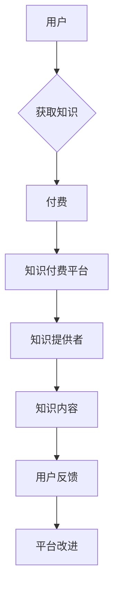

                 

# 知识经济时代下的知识付费创新商业模式优化

## 关键词
知识经济，知识付费，商业模式创新，用户行为分析，个性化推荐，人工智能算法，数学模型，案例分析

## 摘要
随着知识经济的崛起，知识付费成为新的商业模式，为个人和企业提供了巨大的价值。本文首先介绍了知识经济的定义与特点，以及知识付费的概念与演变。随后，探讨了知识付费商业模式的创新，包括平台化、社区化和个性化模式，并分析了其优化的挑战与机遇。文章通过Mermaid流程图和算法原理，详细阐述了用户行为分析、个性化推荐和商业模式优化的核心算法。接着，提出了知识付费商业模式的数学模型，并通过具体案例进行了实际应用分析。最后，探讨了知识付费商业模式的创新与挑战，以及未来发展趋势，为知识付费行业的发展提供了参考。

## 第1章：知识经济时代下的知识付费创新商业模式概述

### 1.1 知识经济时代的定义与特点

#### 1.1.1 知识经济的概念

**知识经济**（Knowledge Economy）是指以知识为主要生产要素的经济形态。它相对于传统的以自然资源和劳动力为主要生产要素的经济形态，更依赖于信息、技术和人力资源。知识经济强调知识的创造、传播和应用，通过知识的增值来实现经济增长。

知识经济的关键特征如下：

1. **信息密集性**：知识经济中，信息的产生、传播和应用扮演着核心角色。信息成为新的生产要素，通过信息技术的快速发展，知识得以快速传播和共享。
2. **技术推动性**：知识经济依赖于科技进步，特别是信息技术的发展。信息技术为知识的创造、传播和应用提供了强有力的支持，推动了经济的快速发展。
3. **人力资源依赖性**：知识经济强调人力资源的重要性，知识型劳动者成为经济增长的关键。知识型劳动者拥有丰富的知识储备和创新意识，能够推动经济的创新和发展。

#### 1.1.2 知识经济的特点

1. **全球化**：知识经济使得全球范围内的知识和信息流动更加便捷，跨国界的合作和交流变得更加频繁。知识经济的全球化特征使得各国经济更加紧密地联系在一起。
2. **创新驱动**：知识经济强调创新的重要性，创新成为经济增长的主要动力。知识经济中的企业更加注重研发和创新，通过不断的技术创新和产品创新，提升市场竞争力。
3. **服务化**：知识经济中的经济活动越来越依赖于服务，服务业成为经济增长的重要支柱。知识经济中的企业更加注重服务质量和客户体验，通过提供高质量的服务，实现持续增长。

### 1.2 知识付费的概念与演变

#### 1.2.1 知识付费的定义

**知识付费**是指用户为获取特定知识或技能而支付的费用。它是一种价值交换，用户通过支付获取有价值的信息。知识付费的核心在于知识的价值，用户为获取知识所支付的费用即为知识的价值。

知识付费的典型形式包括：

1. **在线课程**：用户为在线课程支付费用，以获取课程中的知识和技能。
2. **付费问答**：用户为专家的回答支付费用，以解决特定问题或获取专业建议。
3. **知识订阅**：用户为获取持续的知识服务支付订阅费用。

#### 1.2.2 知识付费的演变

1. **传统知识付费**：早期的知识付费主要通过书籍、培训课程等形式实现。用户通过购买书籍或参加培训课程来获取知识。
2. **在线知识付费**：随着互联网技术的发展，在线知识付费成为主流。用户可以通过在线平台，如知乎、喜马拉雅等，购买或订阅知识内容。在线知识付费具有便捷、高效、互动性强等特点，满足了用户对知识和技能的需求。

### 1.3 知识付费商业模式创新

#### 1.3.1 创新模式一：平台化

**平台型知识付费**：通过建立知识交易平台，连接知识提供者和需求者。平台提供知识内容展示、交易和服务，为用户和知识提供者提供便捷的交互渠道。典型的平台型知识付费包括知乎、喜马拉雅等。

平台化模式的优势：

1. **资源共享**：知识提供者和需求者可以在平台上共享知识和资源，提高知识利用效率。
2. **降低交易成本**：平台为知识交易提供一站式服务，降低了交易成本和难度。
3. **提升用户体验**：平台提供个性化推荐、用户互动等功能，提高用户体验。

#### 1.3.2 创新模式二：社区化

**社区型知识付费**：通过构建知识社区，鼓励用户互动和知识分享。社区型知识付费强调用户参与和共创，形成知识共享和交流的生态系统。典型的社区型知识付费包括分答、小密圈等。

社区化模式的优势：

1. **增强用户粘性**：通过社区互动，用户可以建立更强的社交关系，提高用户粘性。
2. **提升内容质量**：用户参与和共创可以提升知识内容的质量和丰富度。
3. **降低内容成本**：通过用户参与，部分知识内容可以由用户自行创造，降低内容成本。

#### 1.3.3 创新模式三：个性化

**个性化知识付费**：通过大数据分析和人工智能技术，为用户提供个性化的知识服务。个性化知识付费包括知识图谱、智能推荐等功能，满足用户对高质量、个性化知识的需求。

个性化模式的优势：

1. **精准推荐**：通过分析用户行为和偏好，为用户推荐相关知识点，提高知识获取的效率。
2. **提升用户体验**：个性化推荐和服务可以提升用户的满意度和使用体验。
3. **降低用户流失率**：通过个性化服务，降低用户流失率，提高用户忠诚度。

### 1.4 知识付费商业模式优化的挑战与机遇

#### 1.4.1 挑战

1. **信息过载**：随着知识内容的爆炸式增长，用户面临海量信息的筛选困难。如何有效筛选和推荐有价值的信息成为挑战。
2. **用户留存**：保持用户长期活跃和黏性是关键挑战。知识付费平台需要提供持续、有价值的内容和服务，以留住用户。
3. **盈利模式**：如何实现可持续的盈利是知识付费平台必须解决的问题。知识付费平台需要探索多元化的盈利模式，提高盈利能力。

#### 1.4.2 机遇

1. **技术进步**：大数据、人工智能等技术的发展为知识付费提供了新的机遇。通过技术手段，可以更精准地分析用户需求和推荐知识内容。
2. **用户需求**：用户对高质量、个性化知识的需求不断增长，为知识付费提供了广阔的市场空间。知识付费平台需要不断优化产品和服务，满足用户需求。
3. **市场潜力**：随着知识经济的崛起，知识付费市场潜力巨大。知识付费平台可以通过拓展市场、提高市场份额，实现持续增长。

## 第2章：知识付费商业模式的核心概念与联系

### 2.1 知识付费商业模式的关键概念

#### 2.1.1 知识价值

**知识价值**是知识付费商业模式的核心概念之一。知识价值指的是知识本身所具有的价值，包括专业知识的深度、广度、实用性等方面。不同类型的知识具有不同的价值，如专业知识、经验分享、前沿研究等。

知识价值的实现依赖于知识提供者的专业能力和经验积累，以及知识需求者的实际需求和认知水平。知识价值的核心在于满足用户的需求，解决用户的实际问题，提升用户的技能和知识水平。

#### 2.1.2 用户价值

**用户价值**是指用户通过知识付费所获得的价值，包括知识获取的便利性、学习效果、职业发展等方面。用户价值是知识付费商业模式的关键驱动力，直接影响用户的满意度和忠诚度。

用户价值的表现形式多种多样，包括：

1. **知识获取**：用户通过付费获取高质量、专业的知识内容，提升自身的知识水平。
2. **学习效果**：用户通过学习付费内容，获得实际的学习成果，如技能提升、知识增长等。
3. **职业发展**：用户通过付费知识，提升自身的职业竞争力，实现职业发展目标。

#### 2.1.3 平台价值

**平台价值**是指知识付费平台所具有的价值，包括平台的服务能力、资源整合能力、市场影响力等方面。平台价值是知识付费商业模式的基础，为知识提供者和需求者提供了便捷的交互渠道和交易环境。

平台价值的表现形式包括：

1. **服务能力**：平台提供知识内容展示、交易、服务等功能，为用户和知识提供者提供全方位的服务支持。
2. **资源整合**：平台通过整合各类知识和资源，为用户提供丰富的知识内容，提高知识获取的便利性。
3. **市场影响力**：平台在市场中的影响力和知名度，直接影响用户对平台的信任和选择。

### 2.2 知识付费商业模式的Mermaid流程图

下面是一个简化的Mermaid流程图，用于描述知识付费商业模式的核心流程和联系：



#### 2.3 知识付费商业模式中的核心联系

#### 2.3.1 用户与平台

用户与知识付费平台之间存在着紧密的联系。用户通过平台获取知识内容，平台为用户提供了便捷的知识获取渠道和交易环境。用户价值的实现依赖于平台的优质服务和支持。

用户与平台之间的核心联系包括：

1. **知识获取**：用户通过平台获取知识内容，平台提供个性化推荐、搜索等功能，帮助用户快速找到所需的知识。
2. **付费交易**：用户通过平台完成付费交易，平台提供安全、便捷的支付方式，保障用户的权益。
3. **用户反馈**：用户对平台的服务和知识内容进行反馈，平台根据用户的反馈进行改进和优化，提高用户体验。

#### 2.3.2 平台与知识提供者

知识付费平台与知识提供者之间也存在着紧密的联系。知识提供者是知识内容的主要创造者，平台为知识提供者提供了展示和销售知识内容的渠道。

平台与知识提供者之间的核心联系包括：

1. **内容展示**：平台为知识提供者提供了展示知识内容的平台，帮助知识提供者扩大影响力。
2. **交易支持**：平台为知识提供者提供了交易支持，包括支付、结算等功能，保障知识提供者的权益。
3. **收益分配**：平台与知识提供者之间进行收益分配，平台根据知识提供者的贡献和平台运营情况，给予相应的报酬。

#### 2.3.3 用户与知识提供者

用户与知识提供者之间也存在着直接的联系。用户通过购买知识提供者的内容，直接获取知识和服务。

用户与知识提供者之间的核心联系包括：

1. **内容购买**：用户通过平台购买知识提供者的内容，支付费用以获取知识。
2. **互动交流**：用户可以通过平台与知识提供者进行互动交流，获取专业的解答和指导。
3. **评价反馈**：用户对知识提供者的内容进行评价和反馈，帮助知识提供者改进和优化知识内容。

### 2.4 知识付费商业模式优化的方向

#### 2.4.1 提高知识价值

提高知识价值是知识付费商业模式优化的关键方向之一。通过提升知识内容的深度、广度和实用性，可以提高知识的价值，满足用户的需求。

具体优化措施包括：

1. **内容质量提升**：平台和知识提供者应注重内容质量，提供高质量、专业的知识内容，确保知识的价值。
2. **内容更新迭代**：定期更新和迭代知识内容，确保知识内容的时效性和实用性。
3. **内容多样化**：提供多样化的知识内容，满足不同用户的需求，提高知识内容的覆盖面。

#### 2.4.2 增强用户体验

增强用户体验是知识付费商业模式优化的另一个重要方向。通过优化用户界面、提供个性化推荐、提高知识获取的便捷性，可以提升用户的满意度和使用体验。

具体优化措施包括：

1. **用户界面优化**：设计简洁、直观的用户界面，提高用户的使用便利性。
2. **个性化推荐**：利用大数据和人工智能技术，为用户推荐个性化、相关的知识内容，提高知识的获取效率。
3. **知识获取便捷性**：提供便捷的知识获取方式，如在线学习、移动端学习等，方便用户随时随地进行学习。

#### 2.4.3 创新平台服务

创新平台服务是知识付费商业模式优化的长期发展方向。通过推出新的平台功能、服务模式，可以提升平台的竞争力，满足用户多样化的需求。

具体创新方向包括：

1. **平台功能创新**：推出新的平台功能，如在线互动、社交分享等，增强用户互动和知识共享。
2. **服务模式创新**：探索新的服务模式，如知识订阅、付费问答等，提供更多样化的知识服务。
3. **跨界合作**：与不同领域的专家和机构合作，提供跨界知识服务，拓展平台的知识边界。

### 第3章：知识付费商业模式的核心算法原理

#### 3.1 用户行为分析算法

##### 3.1.1 算法概述

**用户行为分析算法**是知识付费商业模式中用于分析用户在平台上的行为规律和决策过程的算法。通过分析用户行为数据，可以识别用户偏好和需求，为个性化推荐和商业模式优化提供依据。

常见的用户行为分析算法包括：

1. **机器学习算法**：如决策树、随机森林、K-最近邻等。
2. **深度学习算法**：如神经网络、卷积神经网络（CNN）、循环神经网络（RNN）等。

##### 3.1.2 算法原理

1. **机器学习算法原理**

   - **决策树**：通过构建决策树模型，将用户行为数据划分为不同的类别。决策树通过多次分类和筛选，找到影响用户行为的特征，从而预测用户的行为。

     ```python
     from sklearn.tree import DecisionTreeClassifier
     
     # 构建决策树模型
     dt = DecisionTreeClassifier()
     
     # 训练模型
     dt.fit(X_train, y_train)
     
     # 预测测试集
     y_pred = dt.predict(X_test)
     ```

   - **随机森林**：随机森林是一种基于决策树的集成学习方法。它通过构建多个决策树模型，并将多个模型的预测结果进行投票，得到最终预测结果。

     ```python
     from sklearn.ensemble import RandomForestClassifier
     
     # 构建随机森林模型
     rf = RandomForestClassifier(n_estimators=100)
     
     # 训练模型
     rf.fit(X_train, y_train)
     
     # 预测测试集
     y_pred = rf.predict(X_test)
     ```

   - **K-最近邻**：K-最近邻算法通过计算用户行为数据与训练集之间的距离，找到与用户行为最相似的样本，从而预测用户的行为。

     ```python
     from sklearn.neighbors import KNeighborsClassifier
     
     # 构建K-最近邻模型
     knn = KNeighborsClassifier(n_neighbors=3)
     
     # 训练模型
     knn.fit(X_train, y_train)
     
     # 预测测试集
     y_pred = knn.predict(X_test)
     ```

2. **深度学习算法原理**

   - **神经网络**：神经网络是一种模拟人脑神经元连接的算法。通过构建多层神经网络，可以实现对复杂数据的建模和预测。

     ```python
     from keras.models import Sequential
     from keras.layers import Dense
     
     # 构建神经网络模型
     model = Sequential()
     model.add(Dense(units=64, activation='relu', input_shape=(input_shape,)))
     model.add(Dense(units=1, activation='sigmoid'))
     
     # 编译模型
     model.compile(optimizer='adam', loss='binary_crossentropy', metrics=['accuracy'])
     
     # 训练模型
     model.fit(X_train, y_train, epochs=10, batch_size=32)
     ```

   - **卷积神经网络（CNN）**：卷积神经网络是一种用于图像和视频数据建模的算法。通过卷积层、池化层和全连接层的组合，可以实现对图像和视频数据的特征提取和分类。

     ```python
     from keras.models import Sequential
     from keras.layers import Conv2D, MaxPooling2D, Flatten, Dense
     
     # 构建CNN模型
     model = Sequential()
     model.add(Conv2D(filters=32, kernel_size=(3, 3), activation='relu', input_shape=(28, 28)))
     model.add(MaxPooling2D(pool_size=(2, 2)))
     model.add(Flatten())
     model.add(Dense(units=128, activation='relu'))
     model.add(Dense(units=10, activation='softmax'))
     
     # 编译模型
     model.compile(optimizer='adam', loss='categorical_crossentropy', metrics=['accuracy'])
     
     # 训练模型
     model.fit(X_train, y_train, epochs=10, batch_size=32)
     ```

   - **循环神经网络（RNN）**：循环神经网络是一种用于序列数据建模的算法。通过记忆机制，可以实现对序列数据的建模和预测。

     ```python
     from keras.models import Sequential
     from keras.layers import LSTM, Dense
     
     # 构建RNN模型
     model = Sequential()
     model.add(LSTM(units=50, return_sequences=True))
     model.add(LSTM(units=50))
     model.add(Dense(units=1, activation='sigmoid'))
     
     # 编译模型
     model.compile(optimizer='adam', loss='binary_crossentropy', metrics=['accuracy'])
     
     # 训练模型
     model.fit(X_train, y_train, epochs=100, batch_size=64)
     ```

##### 3.1.3 算法实现

以下是一个简单的用户行为分析算法实现的例子，使用K-最近邻算法：

```python
from sklearn.neighbors import KNeighborsClassifier
from sklearn.model_selection import train_test_split
from sklearn.metrics import accuracy_score

# 数据准备
X = ... # 用户行为特征数据
y = ... # 用户标签数据

# 划分训练集和测试集
X_train, X_test, y_train, y_test = train_test_split(X, y, test_size=0.2, random_state=42)

# 构建K-最近邻分类器
knn = KNeighborsClassifier(n_neighbors=3)

# 训练模型
knn.fit(X_train, y_train)

# 预测测试集
y_pred = knn.predict(X_test)

# 模型评估
accuracy = accuracy_score(y_test, y_pred)
print(f"Accuracy: {accuracy}")
```

#### 3.2 个性化推荐算法

##### 3.2.1 算法概述

**个性化推荐算法**是一种基于用户行为和偏好，为用户推荐可能感兴趣的知识内容的算法。个性化推荐算法的目标是提高知识获取的效率，满足用户的个性化需求。

常见的个性化推荐算法包括：

1. **基于内容的推荐算法**：根据用户的历史行为和偏好，推荐与用户历史偏好相似的知识内容。
2. **协同过滤推荐算法**：利用用户之间的相似性，推荐其他用户喜欢且用户可能感兴趣的知识内容。
3. **深度学习推荐算法**：使用深度学习模型，如神经网络、卷积神经网络（CNN）、循环神经网络（RNN）等，进行知识内容的建模和推荐。

##### 3.2.2 算法原理

1. **基于内容的推荐算法原理**

   - **相似度计算**：计算用户和知识内容之间的相似度，通常使用余弦相似度、皮尔逊相关系数等指标。
   - **推荐生成**：根据用户和知识内容的相似度，生成推荐列表，推荐相似度高的知识内容。

     ```python
     from sklearn.metrics.pairwise import cosine_similarity
     
     # 数据准备
     user_profile = ... # 用户兴趣特征向量
     item_features = ... # 知识内容特征矩阵

     # 计算内容相似度矩阵
     similarity_matrix = cosine_similarity([user_profile], item_features)

     # 推荐相似度最高的知识内容
     recommended_items = similarity_matrix.argsort()[0][-5:-1][::-1]
     print(f"Recommended items: {recommended_items}")
     ```

2. **协同过滤推荐算法原理**

   - **用户相似度计算**：计算用户之间的相似度，通常使用用户之间的共同喜好、兴趣向量等指标。
   - **知识内容相似度计算**：计算知识内容之间的相似度，通常使用知识内容的相关性、标签等指标。
   - **推荐生成**：根据用户和知识内容的相似度，生成推荐列表，推荐其他用户喜欢且用户可能感兴趣的知识内容。

     ```python
     from sklearn.metrics.pairwise import cosine_similarity
     from sklearn.model_selection import train_test_split
     from sklearn.neighbors import NearestNeighbors

     # 数据准备
     X = ... # 用户兴趣特征矩阵

     # 划分训练集和测试集
     X_train, X_test = train_test_split(X, test_size=0.2, random_state=42)

     # 构建协同过滤模型
     cf = NearestNeighbors(n_neighbors=5)
     cf.fit(X_train)

     # 预测测试集
     distances, indices = cf.kneighbors(X_test)

     # 生成推荐列表
     recommended_items = [X_train[index].tolist() for index in indices]
     print(f"Recommended items: {recommended_items}")
     ```

3. **深度学习推荐算法原理**

   - **知识内容编码**：将知识内容转换为高维向量表示，通常使用卷积神经网络（CNN）、循环神经网络（RNN）等深度学习模型进行编码。
   - **用户编码**：将用户兴趣和偏好编码为向量表示，通常使用嵌入层进行编码。
   - **推荐生成**：通过计算用户和知识内容的相似度，生成推荐列表，推荐相似度高的知识内容。

     ```python
     from keras.models import Model
     from keras.layers import Input, Embedding, LSTM, Dense

     # 数据准备
     input_shape = ...
     embedding_size = ...

     # 构建深度学习推荐模型
     input_user = Input(shape=(input_shape,))
     input_item = Input(shape=(input_shape,))

     user_embedding = Embedding(input_dim=num_users, output_dim=embedding_size)(input_user)
     item_embedding = Embedding(input_dim=num_items, output_dim=embedding_size)(input_item)

     merged = LSTM(units=128)([user_embedding, item_embedding])
     output = Dense(units=1, activation='sigmoid')(merged)

     model = Model(inputs=[input_user, input_item], outputs=output)
     model.compile(optimizer='adam', loss='binary_crossentropy', metrics=['accuracy'])

     # 训练模型
     model.fit([X_train_user, X_train_item], y_train, epochs=10, batch_size=32)
     ```

##### 3.2.3 算法实现

以下是一个简单的基于内容的个性化推荐算法实现的例子：

```python
from sklearn.metrics.pairwise import cosine_similarity
from sklearn.model_selection import train_test_split

# 数据准备
user_profile = ... # 用户兴趣特征向量
item_features = ... # 知识内容特征矩阵

# 划分训练集和测试集
X_train, X_test = train_test_split(item_features, test_size=0.2, random_state=42)

# 计算内容相似度矩阵
similarity_matrix = cosine_similarity(X_train)

# 推荐相似度最高的知识内容
recommended_items = similarity_matrix.argsort()[0][-5:-1][::-1]
print(f"Recommended items: {recommended_items}")
```

#### 3.3 商业模式优化算法

##### 3.3.1 算法概述

**商业模式优化算法**是一种通过数据分析和算法优化，提高知识付费平台的运营效率和盈利能力的算法。通过分析用户行为、市场需求等数据，可以优化平台的运营策略和盈利模式。

常见的商业模式优化算法包括：

1. **数据挖掘算法**：用于发现用户行为模式、市场需求等，为商业模式优化提供数据支持。
2. **优化算法**：如线性规划、遗传算法等，用于优化平台的运营策略和定价策略。

##### 3.3.2 算法原理

1. **数据挖掘算法原理**

   - **用户行为分析**：通过分析用户行为数据，了解用户的行为特征和需求，为商业模式优化提供依据。
   - **市场需求分析**：通过分析市场需求数据，了解市场趋势和用户需求，为商业模式优化提供指导。

     ```python
     import pandas as pd
     from sklearn.cluster import KMeans

     # 数据准备
     data = pd.read_csv('user_behavior.csv')

     # 构建用户行为特征矩阵
     X = data[['click', 'convert', 'page_view']]

     # 进行K-means聚类
     kmeans = KMeans(n_clusters=5, random_state=42)
     kmeans.fit(X)
     clusters = kmeans.predict(X)

     # 输出用户行为特征
     print(clusters)
     ```

2. **优化算法原理**

   - **线性规划**：通过建立成本和收益的线性关系，求解最优定价策略和运营策略，提高平台的盈利能力。

     ```python
     from scipy.optimize import linprog

     # 数据准备
     prices = ... # 知识内容的价格
     demand = ... # 知识内容的预计需求量
     fixed_costs = ... # 固定成本
     variable_costs = ... # 可变成本

     # 目标函数：最大化利润
     c = -prices # 利润最大化，系数为负

     # 约束条件
     A = ... # 约束矩阵
     b = ... # 约束向量

     # 求解线性规划问题
     result = linprog(c, A_ub=A, b_ub=b, method='highs')

     # 输出优化后的价格
     optimized_prices = result.x
     print(f"Optimized prices: {optimized_prices}")
     ```

   - **遗传算法**：通过模拟自然进化过程，优化平台的运营策略和定价策略，提高平台的盈利能力。

     ```python
     from deap import base, creator, tools, algorithms

     # 数据准备
     prices = ... # 知识内容的价格
     demand = ... # 知识内容的预计需求量
     fixed_costs = ... # 固定成本
     variable_costs = ... # 可变成本

     # 定义目标函数
     def objective(prices):
         revenue = sum(prices[i] * demand[i] for i in range(len(prices)))
         cost = fixed_costs + sum(prices[i] * variable_costs[i] for i in range(len(prices)))
         profit = revenue - cost
         return profit,

     # 定义遗传算法
     creator.create("Price", base.Fitness, weights=(-1.0,))
     toolbox = base.Toolbox()
     toolbox.register("price", random.uniform, low=0, high=100)
     toolbox.register("individual", tools.initRepeat, creator.Price, toolbox.price, n=5)
     toolbox.register("population", tools.initRepeat, list, toolbox.individual)
     toolbox.register("evaluate", objective)
     toolbox.register("mate", tools.cxTwoPoint)
     toolbox.register("mutate", tools.mutGaussian, mu=0, sigma=1, indpb=0.1)
     toolbox.register("select", tools.selTournament, tournsize=3)

     # 训练遗传算法
     population = toolbox.population(n=50)
     NGEN = 100
     for gen in range(NGEN):
         offspring = algorithms.varAnd(population, toolbox, cxpb=0.5, mutpb=0.2)
         fits = toolbox.evaluate(offspring)
         offspring = list(zip(offspring, fits))
         offspring = tools.selBest(offspring, k=len(population))
         population = offspring
         print(f"Gen: {gen}, Best Profit: {max(fits)}")

     # 输出优化后的价格
     best_price = max(fits)
     print(f"Optimized prices: {best_price}")
     ```

##### 3.3.3 算法实现

以下是一个简单的数据挖掘算法实现的例子，用于分析用户行为数据：

```python
import pandas as pd
from sklearn.cluster import KMeans

# 数据准备
data = pd.read_csv('user_behavior.csv')

# 构建用户行为特征矩阵
X = data[['click', 'convert', 'page_view']]

# 进行K-means聚类
kmeans = KMeans(n_clusters=5, random_state=42)
kmeans.fit(X)
clusters = kmeans.predict(X)

# 输出用户行为特征
print(clusters)
```

### 第4章：知识付费商业模式的数学模型

#### 4.1 用户行为模型

##### 4.1.1 概念

**用户行为模型**用于描述用户在知识付费平台上的行为规律和决策过程。通过建立用户行为模型，可以预测用户的行为，为个性化推荐、用户留存预测等提供依据。

##### 4.1.2 模型构建

常见的用户行为模型包括概率模型和时间序列模型。

1. **概率模型**：通过概率模型，可以描述用户在特定状态下的行为概率。常见的概率模型有马尔可夫决策过程（MDP）。

   - **马尔可夫决策过程（MDP）**：MDP是一种基于概率的决策模型，用于描述用户在不确定环境下的行为。MDP包含状态空间、动作空间、状态转移概率和奖励函数。

     $$ 
     P(S_t|S_{t-1}, A_{t-1}) = \sum_{a_t} P(S_t|S_{t-1}, a_t) \cdot P(a_t|S_{t-1}) 
     $$
     $$
     R(S_t, A_t) = \sum_{s'} P(S_{t+1}|S_t, A_t) \cdot R(S_{t+1}, s') 
     $$

   其中，$S_t$ 表示第 $t$ 时刻的状态，$A_t$ 表示第 $t$ 时刻的动作，$P(S_t|S_{t-1}, A_{t-1})$ 表示在给定前一个状态和动作的条件下，当前状态的转移概率，$R(S_t, A_t)$ 表示在当前状态和动作下获得的奖励。

2. **时间序列模型**：通过时间序列模型，可以描述用户行为的时间依赖性。常见的时间序列模型有ARIMA模型、LSTM模型。

   - **ARIMA模型**：ARIMA（AutoRegressive Integrated Moving Average）模型是一种自回归积分移动平均模型，用于分析时间序列数据的特征。ARIMA模型包含自回归项、差分项和移动平均项。

     $$
     \text{ARIMA}(p, d, q) = \text{AR}(p) + \text{I}(d) + \text{MA}(q)
     $$
     $$
     \text{AR}(p) = \sum_{i=1}^{p} \phi_i X_{t-i}
     $$
     $$
     \text{I}(d) = (1 - \phi_1 X_t - \phi_2 X_{t-1} - \cdots - \phi_p X_{t-p}) / (1 - \theta_1 X_t - \theta_2 X_{t-1} - \cdots - \theta_q X_{t-q})
     $$
     $$
     \text{MA}(q) = \theta_1 Y_{t-1} + \theta_2 Y_{t-2} + \cdots + \theta_q Y_{t-q}
     $$

   - **LSTM模型**：LSTM（Long Short-Term Memory）模型是一种循环神经网络（RNN）的变体，用于处理时间序列数据。LSTM模型通过引入门控机制，可以有效地解决RNN中的梯度消失和梯度爆炸问题。

     $$
     f_t = \sigma(W_f \cdot [h_{t-1}, x_t] + b_f)
     $$
     $$
     i_t = \sigma(W_i \cdot [h_{t-1}, x_t] + b_i)
     $$
     $$
     o_t = \sigma(W_o \cdot [h_{t-1}, x_t] + b_o)
     $$
     $$
     c_t = f_t \cdot c_{t-1} + i_t \cdot \sigma(W_c \cdot [h_{t-1}, x_t] + b_c)
     $$
     $$
     h_t = o_t \cdot \sigma(c_t)
     $$
     其中，$h_t$ 表示第 $t$ 时刻的隐藏状态，$c_t$ 表示第 $t$ 时刻的细胞状态，$x_t$ 表示第 $t$ 时刻的输入特征，$W_f, W_i, W_o, W_c$ 分别表示遗忘门、输入门、输出门和细胞状态门的权重矩阵，$b_f, b_i, b_o, b_c$ 分别表示遗忘门、输入门、输出门和细胞状态门的偏置矩阵，$\sigma$ 表示sigmoid函数。

##### 4.1.3 数学公式

1. **马尔可夫决策过程（MDP）**

   - **状态转移概率**：
     $$
     P(S_t|S_{t-1}, A_{t-1}) = \sum_{a_t} P(S_t|S_{t-1}, a_t) \cdot P(a_t|S_{t-1})
     $$
   - **奖励函数**：
     $$
     R(S_t, A_t) = \sum_{s'} P(S_{t+1}|S_t, A_t) \cdot R(S_{t+1}, s')
     $$

2. **ARIMA模型**

   - **自回归项**：
     $$
     \text{AR}(p) = \sum_{i=1}^{p} \phi_i X_{t-i}
     $$
   - **差分项**：
     $$
     \text{I}(d) = (1 - \phi_1 X_t - \phi_2 X_{t-1} - \cdots - \phi_p X_{t-p}) / (1 - \theta_1 X_t - \theta_2 X_{t-1} - \cdots - \theta_q X_{t-q})
     $$
   - **移动平均项**：
     $$
     \text{MA}(q) = \theta_1 Y_{t-1} + \theta_2 Y_{t-2} + \cdots + \theta_q Y_{t-q}
     $$

3. **LSTM模型**

   - **遗忘门**：
     $$
     f_t = \sigma(W_f \cdot [h_{t-1}, x_t] + b_f)
     $$
   - **输入门**：
     $$
     i_t = \sigma(W_i \cdot [h_{t-1}, x_t] + b_i)
     $$
   - **输出门**：
     $$
     o_t = \sigma(W_o \cdot [h_{t-1}, x_t] + b_o)
     $$
   - **细胞状态更新**：
     $$
     c_t = f_t \cdot c_{t-1} + i_t \cdot \sigma(W_c \cdot [h_{t-1}, x_t] + b_c)
     $$
   - **隐藏状态更新**：
     $$
     h_t = o_t \cdot \sigma(c_t)
     $$

#### 4.2 个性化推荐模型

##### 4.2.1 概念

**个性化推荐模型**是一种基于用户行为和偏好，为用户推荐可能感兴趣的知识内容的模型。个性化推荐模型的目标是提高用户满意度、提升知识获取效率，为用户创造更大的价值。

##### 4.2.2 模型构建

常见的个性化推荐模型包括基于内容的推荐模型、协同过滤推荐模型和深度学习推荐模型。

1. **基于内容的推荐模型**

   - **概念**：基于内容的推荐模型通过分析知识内容的特点和属性，为用户推荐与用户历史偏好相似的知识内容。
   - **模型构建**：基于内容的推荐模型通常包括以下步骤：
     - **特征提取**：从知识内容中提取特征，如关键词、标签、分类等。
     - **相似度计算**：计算用户和知识内容之间的相似度，如余弦相似度、欧氏距离等。
     - **推荐生成**：根据用户和知识内容的相似度，生成推荐列表。

2. **协同过滤推荐模型**

   - **概念**：协同过滤推荐模型通过分析用户之间的相似性，为用户推荐其他用户喜欢且用户可能感兴趣的知识内容。
   - **模型构建**：协同过滤推荐模型通常包括以下步骤：
     - **用户相似度计算**：计算用户之间的相似度，如余弦相似度、皮尔逊相关系数等。
     - **知识内容相似度计算**：计算知识内容之间的相似度，如关键词相似度、标签相似度等。
     - **推荐生成**：根据用户和知识内容的相似度，生成推荐列表。

3. **深度学习推荐模型**

   - **概念**：深度学习推荐模型通过构建深度神经网络，对用户行为和知识内容进行建模，为用户推荐可能感兴趣的知识内容。
   - **模型构建**：深度学习推荐模型通常包括以下步骤：
     - **用户编码**：将用户特征编码为向量表示。
     - **知识内容编码**：将知识内容特征编码为向量表示。
     - **融合和预测**：通过神经网络融合用户和知识内容特征，生成推荐分数，从而生成推荐列表。

##### 4.2.3 数学公式

1. **基于内容的推荐模型**

   - **相似度计算**：
     $$
     \text{similarity}(u, i) = \frac{\sum_{j \in \text{common\_features}} w_j \cdot f_j(u) \cdot f_j(i)}{\sqrt{\sum_{j \in \text{common\_features}} w_j^2 \cdot f_j(u)^2} \cdot \sqrt{\sum_{j \in \text{common\_features}} w_j^2 \cdot f_j(i)^2}}
     $$
     其中，$u$ 表示用户，$i$ 表示知识内容，$w_j$ 表示特征 $j$ 的权重，$f_j(u)$ 和 $f_j(i)$ 分别表示用户 $u$ 和知识内容 $i$ 在特征 $j$ 上的值。

   - **推荐生成**：
     $$
     \text{recommendation}(u) = \sum_{i \in \text{items}} \text{similarity}(u, i) \cdot r_i
     $$
     其中，$r_i$ 表示知识内容 $i$ 的推荐权重，通常根据知识内容的受欢迎程度、新近度等指标计算。

2. **协同过滤推荐模型**

   - **用户相似度计算**：
     $$
     \text{similarity}(u, v) = \frac{\sum_{i \in \text{common\_items}} r_i(u) \cdot r_i(v)}{\sqrt{\sum_{i \in \text{common\_items}} r_i^2(u)} \cdot \sqrt{\sum_{i \in \text{common\_items}} r_i^2(v)}}
     $$
     其中，$u$ 和 $v$ 表示用户，$r_i(u)$ 和 $r_i(v)$ 分别表示用户 $u$ 和 $v$ 在知识内容 $i$ 上的评分。

   - **知识内容相似度计算**：
     $$
     \text{similarity}(i, j) = \frac{\sum_{u \in \text{common\_users}} r_i(u) \cdot r_j(u)}{\sqrt{\sum_{u \in \text{common\_users}} r_i^2(u)} \cdot \sqrt{\sum_{u \in \text{common\_users}} r_j^2(u)}}
     $$
     其中，$i$ 和 $j$ 表示知识内容，$r_i(u)$ 和 $r_j(u)$ 分别表示用户 $u$ 在知识内容 $i$ 和 $j$ 上的评分。

   - **推荐生成**：
     $$
     \text{recommendation}(u) = \sum_{i \in \text{items}} \text{similarity}(u, i) \cdot r_i(u)
     $$
     其中，$r_i(u)$ 表示用户 $u$ 在知识内容 $i$ 上的评分。

3. **深度学习推荐模型**

   - **用户编码**：
     $$
     e_u = \text{embedding}(u)
     $$
     其中，$e_u$ 表示用户 $u$ 的编码向量。

   - **知识内容编码**：
     $$
     e_i = \text{embedding}(i)
     $$

   - **融合和预测**：
     $$
     r_i(u) = \text{sigmoid}(\text{dot}(e_u, e_i) + b)
     $$
     其中，$\text{dot}(e_u, e_i)$ 表示用户编码向量和知识内容编码向量的点积，$b$ 表示偏置项，$\text{sigmoid}$ 函数用于生成推荐分数。

#### 4.3 盈利模型

##### 4.3.1 概念

**盈利模型**用于描述知识付费平台如何通过知识交易实现盈利。盈利模型包括成本收益分析、定价策略和收益最大化等。

##### 4.3.2 模型构建

常见的盈利模型包括以下几种：

1. **成本收益分析模型**：成本收益分析模型用于计算知识付费平台的成本和收益，评估平台的盈利能力。

   - **成本**：
     $$
     C = \text{固定成本} + \text{可变成本} \cdot Q
     $$
     其中，$C$ 表示总成本，固定成本表示平台运营的固定费用，可变成本表示知识交易过程中产生的费用，$Q$ 表示知识交易的数量。

   - **收益**：
     $$
     R = P \cdot Q
     $$
     其中，$R$ 表示总收益，$P$ 表示知识内容的价格，$Q$ 表示知识交易的数量。

   - **利润**：
     $$
     \pi = R - C
     $$
     其中，$\pi$ 表示利润。

2. **定价策略模型**：定价策略模型用于确定知识内容的价格，以实现收益最大化。

   - **线性定价**：
     $$
     P = \frac{R}{Q} = \frac{P \cdot Q}{Q} = P
     $$
     其中，$P$ 表示知识内容的价格。

   - **边际定价**：
     $$
     P = \frac{MR}{Q}
     $$
     其中，$MR$ 表示边际收益，$Q$ 表示知识交易的数量。

   - **目标定价**：
     $$
     P = \frac{\pi + C}{Q}
     $$
     其中，$\pi$ 表示利润，$C$ 表示总成本，$Q$ 表示知识交易的数量。

3. **收益最大化模型**：收益最大化模型用于确定知识交易的数量，以实现收益最大化。

   - **边际收益分析**：
     $$
     MR = \frac{dR}{dQ}
     $$
     其中，$MR$ 表示边际收益，$R$ 表示总收益，$Q$ 表示知识交易的数量。

   - **收益最大化条件**：
     $$
     MR = MC
     $$
     其中，$MC$ 表示边际成本，$Q$ 表示知识交易的数量。

##### 4.3.3 数学公式

1. **成本收益分析模型**

   - **成本**：
     $$
     C = \text{固定成本} + \text{可变成本} \cdot Q
     $$

   - **收益**：
     $$
     R = P \cdot Q
     $$

   - **利润**：
     $$
     \pi = R - C
     $$

2. **定价策略模型**

   - **线性定价**：
     $$
     P = \frac{R}{Q} = \frac{P \cdot Q}{Q} = P
     $$

   - **边际定价**：
     $$
     P = \frac{MR}{Q}
     $$

   - **目标定价**：
     $$
     P = \frac{\pi + C}{Q}
     $$

3. **收益最大化模型**

   - **边际收益分析**：
     $$
     MR = \frac{dR}{dQ}
     $$

   - **收益最大化条件**：
     $$
     MR = MC
     $$

#### 4.4 用户留存模型

##### 4.4.1 概念

**用户留存模型**用于预测用户在一段时间后是否继续使用知识付费平台。用户留存是知识付费平台的重要指标，通过预测用户留存情况，可以制定相应的运营策略，提高用户留存率。

##### 4.4.2 模型构建

常见的用户留存模型包括以下几种：

1. **概率模型**：概率模型通过建立用户留存概率的数学模型，预测用户在一段时间后的留存情况。

   - **二项分布模型**：二项分布模型用于描述用户在一段时间后的留存概率。

     $$
     P(\text{retained}) = \binom{n}{k} p^k (1-p)^{n-k}
     $$
     其中，$P(\text{retained})$ 表示用户在一段时间后的留存概率，$n$ 表示时间窗口内的天数，$k$ 表示时间窗口内留存的天数，$p$ 表示日留存率。

   - **泊松分布模型**：泊松分布模型用于描述用户在一段时间内的流失情况。

     $$
     P(\text{流失}) = \frac{(\lambda t)^k e^{-\lambda t}}{k!}
     $$
     其中，$P(\text{流失})$ 表示用户在一段时间内的流失概率，$\lambda$ 表示日流失率，$t$ 表示时间窗口。

2. **时间序列模型**：时间序列模型通过分析用户留存的时间依赖性，预测用户在一段时间后的留存情况。

   - **ARIMA模型**：ARIMA模型用于描述用户留存的时间序列特征。

     $$
     \text{ARIMA}(p, d, q) = \text{AR}(p) + \text{I}(d) + \text{MA}(q)
     $$

   - **LSTM模型**：LSTM模型用于处理用户留存的时间序列数据。

     $$
     h_t = \text{sigmoid}(W_h \cdot [h_{t-1}, x_t] + b_h)
     $$

##### 4.4.3 数学公式

1. **概率模型**

   - **二项分布模型**：
     $$
     P(\text{retained}) = \binom{n}{k} p^k (1-p)^{n-k}
     $$

   - **泊松分布模型**：
     $$
     P(\text{流失}) = \frac{(\lambda t)^k e^{-\lambda t}}{k!}
     $$

2. **时间序列模型**

   - **ARIMA模型**：
     $$
     \text{ARIMA}(p, d, q) = \text{AR}(p) + \text{I}(d) + \text{MA}(q)
     $$

   - **LSTM模型**：
     $$
     h_t = \text{sigmoid}(W_h \cdot [h_{t-1}, x_t] + b_h)
     $$

#### 4.5 模型优化与调参

##### 4.5.1 概念

**模型优化与调参**是通过调整模型参数和优化算法，提高模型的预测准确性和泛化能力。模型优化与调参是构建高效、准确的预测模型的重要步骤。

##### 4.5.2 方法

常见的模型优化与调参方法包括以下几种：

1. **交叉验证**：交叉验证是一种评估模型泛化能力的方法。通过将数据集划分为多个子集，每次使用一个子集作为验证集，其余子集作为训练集，重复多次，评估模型的平均性能。

   - **K折交叉验证**：
     $$
     \text{accuracy}_{\text{K-fold}} = \frac{1}{K} \sum_{k=1}^{K} \text{accuracy}_{k}
     $$
     其中，$\text{accuracy}_{\text{K-fold}}$ 表示K折交叉验证的平均准确率，$\text{accuracy}_{k}$ 表示第 $k$ 次交叉验证的准确率。

2. **网格搜索**：网格搜索是一种用于搜索最优参数组合的方法。通过遍历参数空间，评估每个参数组合的性能，选择最优参数组合。

   - **网格搜索流程**：
     1. 确定参数空间。
     2. 遍历参数空间，评估每个参数组合的性能。
     3. 选择最优参数组合。

3. **贝叶斯优化**：贝叶斯优化是一种基于概率模型的优化方法。通过构建概率模型，搜索最优参数组合。

   - **贝叶斯优化流程**：
     1. 构建概率模型。
     2. 根据概率模型，选择下一个评估点。
     3. 评估函数值。
     4. 更新概率模型。
     5. 重复步骤2-4，直至达到停止条件。

##### 4.5.3 数学公式

1. **交叉验证**

   - **K折交叉验证**：
     $$
     \text{accuracy}_{\text{K-fold}} = \frac{1}{K} \sum_{k=1}^{K} \text{accuracy}_{k}
     $$

2. **网格搜索**

   - **网格搜索流程**：
     - **确定参数空间**：
       $$
       \text{参数空间} = \{ (\theta_1, \theta_2, \theta_3) | \theta_1 \in \{\alpha_1, \alpha_2, \alpha_3\}, \theta_2 \in \{\beta_1, \beta_2, \beta_3\}, \theta_3 \in \{\gamma_1, \gamma_2, \gamma_3\} \}
       $$

   - **评估函数值**：
     $$
     \text{performance}(\theta) = \text{accuracy}(\theta) + \text{regularization}(\theta)
     $$
     其中，$\text{accuracy}(\theta)$ 表示准确率，$\text{regularization}(\theta)$ 表示正则化项。

3. **贝叶斯优化**

   - **概率模型**：
     $$
     p(\theta | x) \propto p(x | \theta) p(\theta)
     $$
     其中，$p(\theta | x)$ 表示给定数据 $x$ 下参数 $\theta$ 的后验概率，$p(x | \theta)$ 表示数据 $x$ 在参数 $\theta$ 下的概率，$p(\theta)$ 表示参数 $\theta$ 的先验概率。

   - **评估点选择**：
     $$
     \theta_{\text{next}} = \arg\max_{\theta} \left[ p(\theta | x) \cdot \log p(\theta) \right]
     $$

### 第5章：知识付费商业模式的案例研究

#### 5.1 案例背景

本案例研究以某知名在线教育平台为例，该平台专注于提供高质量的教育内容和知识服务。平台提供各类在线课程，包括专业课程、兴趣课程等，涵盖多个领域。平台用户包括学生、职场人士、爱好者等，用户规模庞大。

#### 5.2 案例分析

##### 5.2.1 用户分析

1. **用户画像**

   通过对用户行为数据进行分析，构建用户画像，包括用户年龄、职业、教育背景、学习兴趣等。用户画像有助于了解用户需求，为个性化推荐和运营策略提供依据。

   - **年龄分布**：用户主要集中在20-40岁之间，其中25-35岁的用户占比最高。
   - **职业分布**：用户包括学生、职场人士、自由职业者等，职场人士占比最大。
   - **教育背景**：用户主要具有本科及以上学历，其中本科学历的用户占比最高。
   - **学习兴趣**：用户对编程、数据科学、外语、管理等领域表现出浓厚的兴趣。

2. **用户需求**

   分析用户在不同阶段的需求，如初学者、进阶者、专业人士等，为用户提供针对性的课程和服务。

   - **初学者**：初学者主要关注入门课程，如基础编程、数据分析入门等。
   - **进阶者**：进阶者主要关注进阶课程，如专业编程语言、高级数据分析等。
   - **专业人士**：专业人士主要关注专业领域的高级课程，如深度学习、人工智能等。

##### 5.2.2 产品分析

1. **课程内容**

   平台提供多种类型的课程，包括专业课程、兴趣课程等，确保课程内容的多样性和实用性。

   - **专业课程**：平台与知名高校、科研机构合作，提供高质量的专业课程，满足用户的学习需求。
   - **兴趣课程**：平台提供各类兴趣课程，如绘画、音乐、摄影等，满足用户的兴趣爱好。

2. **用户互动**

   平台通过论坛、问答、讨论区等互动方式，增强用户粘性，提高用户参与度。

   - **论坛**：平台设有专门的论坛，用户可以在论坛中交流学习心得、讨论问题。
   - **问答**：平台提供问答功能，用户可以针对特定问题向专家提问，获得专业的解答。
   - **讨论区**：平台设有讨论区，用户可以就课程内容展开讨论，分享学习经验。

##### 5.2.3 营销策略

1. **内容营销**

   平台通过发布高质量的内容，吸引用户关注，提高用户转化率。

   - **课程介绍**：平台为每门课程提供详细的介绍，包括课程内容、教学团队、课程大纲等，帮助用户了解课程。
   - **学习指南**：平台发布学习指南，为用户提供学习建议和方法，帮助用户高效学习。
   - **成功案例**：平台分享用户学习成果，展示学习效果，提高用户信任度。

2. **社交营销**

   平台利用社交媒体平台进行推广，扩大用户群体。

   - **社交媒体广告**：平台在社交媒体平台上投放广告，吸引潜在用户。
   - **KOL合作**：平台与知名博主、专家合作，利用其影响力推广平台。
   - **互动活动**：平台举办线上互动活动，如直播讲座、学习竞赛等，提高用户参与度。

3. **会员制度**

   平台推出会员制度，提供专属优惠和服务，提高用户忠诚度。

   - **会员权益**：会员享有更多优惠，如课程折扣、免费试听等。
   - **专属服务**：会员享受专属客服、学习辅导等增值服务。
   - **会员成长体系**：平台设立会员成长体系，激励用户持续学习。

##### 5.2.4 数据分析

1. **用户行为分析**

   平台通过数据分析，了解用户行为特征，优化产品和服务。

   - **用户访问行为**：分析用户访问平台的频率、时长、页面跳转等行为，优化用户体验。
   - **用户购买行为**：分析用户购买课程的时间、选择课程类型等行为，为营销策略提供依据。
   - **用户评价行为**：分析用户对课程的评价，了解课程质量和用户满意度，优化课程内容。

2. **个性化推荐**

   平台通过大数据分析和人工智能技术，为用户推荐个性化课程。

   - **基于内容的推荐**：分析用户历史行为和偏好，为用户推荐相似的课程。
   - **基于协同过滤的推荐**：分析用户之间的相似性，为用户推荐其他用户喜欢的课程。
   - **基于深度学习的推荐**：构建深度学习模型，对用户行为和课程特征进行建模，为用户推荐个性化的课程。

##### 5.2.5 案例成果

1. **用户增长**

   通过有效的营销策略和优质的内容，平台用户数量持续增长。

   - **用户增长率**：平台用户增长率保持在20%以上，用户规模不断扩大。
   - **活跃用户数**：平台活跃用户数不断增加，用户活跃度提高。

2. **收入提升**

   随着用户数量的增加，平台的收入也显著提升。

   - **收入增长率**：平台收入增长率保持在30%以上，收入来源多样化。
   - **课程销售量**：平台课程销售量持续增长，成为主要收入来源。

3. **用户满意度**

   用户对平台的满意度提高，口碑效应逐渐显现。

   - **用户评价**：平台用户评价持续提升，好评率保持在90%以上。
   - **用户留存率**：平台用户留存率提高，用户黏性增强。

#### 5.3 案例启示

1. **注重用户需求**

   平台应深入了解用户需求，提供针对性的产品和服务，满足用户对知识和技能的需求。

2. **数据驱动决策**

   平台应利用数据分析，优化产品和服务，提高运营效率。

3. **持续创新**

   平台应不断推出新的内容和营销策略，保持市场竞争力。

4. **个性化推荐**

   平台应利用大数据和人工智能技术，实现个性化推荐，提高用户体验。

5. **用户互动**

   平台应通过用户互动，增强用户粘性，提高用户满意度。

### 第6章：知识付费商业模式的创新与挑战

#### 6.1 创新方向

##### 6.1.1 新型知识付费模式

随着知识付费市场的不断发展，新型知识付费模式逐渐涌现，为用户提供了更多样化的选择。

1. **订阅制**

   订阅制是一种用户通过支付订阅费用，获取持续知识服务的新型付费模式。与传统的单次购买不同，订阅制为用户提供了长期的知识服务，有助于提升用户黏性和平台收入。

   - **优势**：
     - 提高用户黏性：用户通过支付订阅费用，获得长期的知识服务，降低了用户流失的可能性。
     - 稳定收入来源：对于知识付费平台来说，订阅制可以提供稳定的收入来源，有助于平台持续发展。
     - 降低用户购买门槛：订阅制将知识内容打包，降低用户的购买门槛，吸引更多潜在用户。

   - **挑战**：
     - 内容更新难度：订阅制要求平台持续提供高质量、有价值的内容，内容更新的难度较大。
     - 用户需求变化：用户需求不断变化，平台需要不断调整和优化内容，以满足用户的需求。

2. **付费问答**

   付费问答是一种用户针对特定问题向专家提问，专家回答后获得报酬的新型付费模式。付费问答为用户提供了更直接、更专业的解答服务。

   - **优势**：
     - 提高服务质量：付费问答为用户提供了更直接、更专业的解答服务，有助于提升用户体验。
     - 增加用户互动：付费问答鼓励用户参与，增加了用户与平台、专家之间的互动，提升了用户满意度。
     - 创新增收渠道：付费问答为平台创造了新的收入来源，有助于平台多元化盈利模式。

   - **挑战**：
     - 专家管理难度：平台需要有效管理和组织专家资源，确保专家质量，避免专家流失。
     - 用户体验不一致：不同专家的回答质量和风格可能存在差异，用户满意度可能受到影响。

##### 6.1.2 跨界合作

跨界合作是知识付费商业模式的一种创新方向，通过与其他行业、机构的合作，拓展知识付费的边界。

1. **与权威机构合作**

   平台与权威机构合作，共同开发高质量的知识内容。权威机构的参与为平台提供了高质量的内容保障，提升了平台的权威性和影响力。

   - **优势**：
     - 提高内容质量：权威机构的参与，为平台提供了高质量的内容保障，有助于提升用户体验。
     - 扩大用户群体：权威机构的知名度吸引了更多的用户，有助于平台拓展用户群体。
     - 增强市场竞争力：与权威机构合作，提升了平台的竞争力，有助于在激烈的市场环境中脱颖而出。

   - **挑战**：
     - 合作难度：与权威机构合作，需要双方达成共识，制定合理的合作模式和利益分配机制。
     - 内容更新压力：权威机构的内容更新速度可能较慢，平台需要平衡内容更新与市场需求。

2. **与知名专家合作**

   平台邀请知名专家开设课程，利用专家的知名度和影响力，吸引更多用户。

   - **优势**：
     - 提高课程质量：知名专家的课程通常具有较高的质量，有助于提升平台的整体课程水平。
     - 增加用户粘性：知名专家的课程吸引了更多用户，增加了用户的粘性。
     - 扩大平台影响力：知名专家的参与，提高了平台的知名度，有助于平台在市场上脱颖而出。

   - **挑战**：
     - 合作费用：与知名专家合作，需要支付高额的专家费用，增加了平台的成本。
     - 专家管理难度：平台需要有效管理和组织专家资源，确保专家的稳定性和参与度。

##### 6.1.3 人工智能应用

人工智能技术在知识付费领域具有广泛的应用前景，通过人工智能技术，可以提升知识付费的效率和服务质量。

1. **个性化推荐**

   个性化推荐是人工智能技术在知识付费领域的重要应用。通过分析用户行为和偏好，为用户推荐个性化的知识内容，提升用户的满意度。

   - **优势**：
     - 提高知识获取效率：个性化推荐将用户可能感兴趣的知识内容推送到用户面前，提高了用户获取知识的效率。
     - 增强用户满意度：个性化推荐提供了更符合用户需求的知识内容，提升了用户的满意度。
     - 降低用户流失率：个性化推荐有助于提升用户黏性，降低用户流失率。

   - **挑战**：
     - 数据质量和隐私保护：个性化推荐需要大量的用户行为数据，数据质量和隐私保护是关键挑战。
     - 算法优化难度：个性化推荐算法需要不断优化，以提升推荐效果，算法优化难度较大。

2. **智能问答**

   智能问答利用自然语言处理和机器学习技术，为用户提供智能化的解答服务，提高用户互动体验。

   - **优势**：
     - 提高解答速度：智能问答能够快速响应用户的问题，提高了解答速度。
     - 提升用户体验：智能问答提供了更加便捷、高效的解答服务，提升了用户的满意度。
     - 降低人力成本：智能问答降低了人工客服的负担，降低了人力成本。

   - **挑战**：
     - 算法准确性：智能问答的算法需要不断提升，以提高解答的准确性，避免误导用户。
     - 用户体验一致性：不同问题的解答质量和风格可能存在差异，需要保持用户体验的一致性。

3. **智能教育**

   智能教育利用人工智能技术，为用户提供个性化的学习路径和学习建议，提高学习效果。

   - **优势**：
     - 个性化学习：智能教育可以根据用户的学习情况和需求，提供个性化的学习内容和路径，提高学习效果。
     - 提高学习效率：智能教育通过分析用户的学习行为和进度，提供针对性的学习建议，提高了学习效率。
     - 降低学习成本：智能教育降低了用户的学习成本，为用户提供了一种便捷、高效的学习方式。

   - **挑战**：
     - 学习数据质量：智能教育需要大量的学习数据，数据质量和数据源的可信度是关键挑战。
     - 算法优化：智能教育的算法需要不断优化，以提升学习效果和用户体验。

#### 6.2 挑战与应对策略

##### 6.2.1 内容质量保证

内容质量是知识付费商业模式的核心，保证内容质量对于平台的长期发展至关重要。以下是一些应对策略：

1. **内容审核**

   平台应建立严格的内容审核机制，对知识内容进行审查，确保内容的质量和准确性。

   - **优势**：
     - 提高质量保障：通过内容审核，平台可以确保知识内容的质量和准确性，提高用户满意度。
     - 降低风险：内容审核有助于降低虚假信息、侵权等风险，保护平台的声誉。

   - **挑战**：
     - 审核效率：内容审核需要耗费大量时间和人力资源，可能影响内容更新速度。
     - 审核标准：确定合理的审核标准，平衡内容质量和审核效率是关键。

2. **专家评审**

   邀请专家对知识内容进行评审，确保内容的质量和权威性。

   - **优势**：
     - 提高质量保障：专家评审有助于提高知识内容的质量和权威性，增强用户信任。
     - 提高用户满意度：权威专家的评审可以提升用户的满意度，降低用户流失率。

   - **挑战**：
     - 专家资源：专家资源的获取和管理是关键挑战，平台需要与专家建立良好的合作关系。
     - 评审成本：专家评审需要支付高额的费用，增加了平台的成本。

##### 6.2.2 用户隐私保护

在知识付费商业模式中，用户隐私保护至关重要。以下是一些应对策略：

1. **数据加密**

   对用户数据进行加密处理，确保用户隐私安全。

   - **优势**：
     - 提高数据安全性：数据加密可以有效防止数据泄露，保护用户隐私。
     - 符合法规要求：数据加密有助于符合相关法律法规，降低法律风险。

   - **挑战**：
     - 加密成本：数据加密需要投入一定的技术和资金，可能增加平台的运营成本。
     - 加密算法更新：随着技术的发展，加密算法需要不断更新，以应对新的安全威胁。

2. **合规性审查**

   定期对平台的运营和数据处理过程进行合规性审查，确保符合相关法律法规。

   - **优势**：
     - 降低法律风险：合规性审查有助于降低法律风险，确保平台运营合法合规。
     - 提高用户信任：合规性审查可以提高用户的信任度，增强用户对平台的满意度。

   - **挑战**：
     - 法律法规变化：相关法律法规可能会不断变化，平台需要及时调整运营策略。
     - 审查成本：合规性审查需要投入人力和物力，可能增加平台的运营成本。

##### 6.2.3 市场竞争压力

在知识付费市场中，竞争日益激烈，平台需要应对市场竞争压力。以下是一些应对策略：

1. **差异化竞争**

   通过提供独特的知识内容和服务，打造差异化优势。

   - **优势**：
     - 提高竞争力：差异化竞争有助于提高平台在市场中的竞争力，吸引更多用户。
     - 降低用户流失率：差异化竞争可以降低用户流失率，提高用户黏性。

   - **挑战**：
     - 内容创新难度：差异化竞争要求平台持续创新，提供独特的内容和服务，创新难度较大。
     - 市场调研：了解市场需求和用户偏好，制定差异化策略需要投入大量时间和资源。

2. **品牌建设**

   加强品牌宣传，提高品牌知名度和用户忠诚度。

   - **优势**：
     - 提高品牌影响力：品牌建设有助于提高平台在市场中的知名度，增强用户对平台的信任。
     - 提高用户忠诚度：品牌建设可以增强用户对平台的忠诚度，降低用户流失率。

   - **挑战**：
     - 品牌建设成本：品牌建设需要投入大量的资金和人力资源，可能增加平台的成本。
     - 竞争激烈：在激烈的市场竞争中，品牌建设需要投入更多的资源和精力，以保持竞争优势。

##### 6.2.4 盈利模式探索

在知识付费商业模式中，盈利模式多样化是提升平台盈利能力的关键。以下是一些盈利模式探索的策略：

1. **多元化收入来源**

   探索多种收入来源，如广告收入、会员费、课程销售等，提高平台盈利能力。

   - **优势**：
     - 提高盈利能力：多元化收入来源可以降低平台对单一收入来源的依赖，提高平台的盈利能力。
     - 降低运营风险：多元化收入来源有助于降低平台的运营风险，确保平台的稳定发展。

   - **挑战**：
     - 盈利模式创新难度：探索新的盈利模式需要投入大量时间和资源，创新难度较大。
     - 盈利稳定性：多元化收入来源可能存在盈利不稳定的问题，需要平台进行有效管理和控制。

2. **跨界合作**

   通过跨界合作，创造新的商业模式和盈利机会。

   - **优势**：
     - 扩大市场：跨界合作可以扩大平台的市场，吸引更多用户。
     - 提高盈利能力：跨界合作可以创造新的盈利机会，提高平台的盈利能力。

   - **挑战**：
     - 合作难度：跨界合作需要与不同领域的合作伙伴建立合作关系，合作难度较大。
     - 合同管理：跨界合作需要签订合同，明确合作双方的权利和义务，合同管理难度较大。

3. **持续创新**

   不断探索新的商业模式和盈利机会，保持市场竞争力。

   - **优势**：
     - 提高竞争力：持续创新可以保持平台在市场中的竞争力，吸引更多用户。
     - 提高盈利能力：持续创新可以创造新的盈利机会，提高平台的盈利能力。

   - **挑战**：
     - 创新成本：持续创新需要投入大量的人力、物力和财力，创新成本较高。
     - 市场接受度：新的商业模式和盈利机会可能面临市场接受度的问题，需要平台进行有效的推广和营销。

#### 6.3 未来展望

知识付费商业模式在未来的发展中，将面临许多机遇和挑战。以下是对未来发展趋势的展望：

##### 6.3.1 技术发展趋势

1. **人工智能**

   人工智能技术在知识付费领域的应用将不断深入，为用户带来更加个性化、智能化的服务体验。

   - **个性化推荐**：人工智能技术将进一步提升个性化推荐的效果，为用户推荐更符合其兴趣和需求的知识内容。
   - **智能问答**：智能问答系统将利用自然语言处理和机器学习技术，为用户提供更准确、更快速的解答服务。

2. **区块链**

   区块链技术在知识付费领域的应用将逐渐普及，为知识交易提供更加安全、透明、去中心化的环境。

   - **去中心化交易**：区块链技术可以实现知识交易的去中心化，降低交易成本，提高交易效率。
   - **版权保护**：区块链技术可以为知识内容提供更加可靠的版权保护，保护创作者的合法权益。

3. **虚拟现实（VR）**

   虚拟现实技术在知识付费领域的应用将带来更加沉浸式、互动性的学习体验。

   - **沉浸式学习**：虚拟现实技术可以为用户创造一个沉浸式的学习环境，提高学习效果。
   - **互动性提升**：虚拟现实技术可以增强用户与知识内容的互动，提高用户参与度。

##### 6.3.2 市场趋势

1. **个性化需求**

   随着消费升级，用户对个性化、定制化的知识内容需求将不断增加。

   - **个性化推荐**：平台需要利用人工智能技术，为用户提供更加精准的个性化推荐。
   - **定制化服务**：平台可以提供定制化的知识服务，满足用户的个性化需求。

2. **高质量内容**

   用户越来越倾向于选择高质量、有深度的知识内容。

   - **内容质量提升**：平台需要不断提高内容质量，提供专业、权威的知识内容。
   - **权威认证**：平台可以引入权威认证，提高知识内容的可信度。

3. **竞争格局变化**

   知识付费市场的竞争格局将发生变化，传统教育机构、互联网企业等纷纷进入市场。

   - **跨界竞争**：不同领域的竞争者将带来新的商业模式和盈利机会，竞争更加激烈。
   - **合作与竞争并存**：平台需要与竞争对手建立合作关系，共同推动知识付费市场的发展。

##### 6.3.3 未来展望

1. **知识付费将成为主流**

   随着知识经济的不断发展，知识付费将成为知识交易的主要形式。

   - **用户习惯养成**：用户逐渐养成付费获取知识的习惯，知识付费市场规模不断扩大。
   - **平台普及**：知识付费平台将在各个领域得到广泛应用，成为知识交易的主要渠道。

2. **技术创新推动发展**

   人工智能、区块链、虚拟现实等技术的创新将推动知识付费商业模式的发展。

   - **技术应用**：平台将不断引入新技术，提升服务质量，满足用户需求。
   - **商业模式创新**：技术创新将推动知识付费商业模式的创新，为平台带来新的发展机遇。

3. **用户体验持续优化**

   知识付费平台将不断优化用户体验，提高用户满意度和忠诚度。

   - **个性化服务**：平台将提供更加个性化的服务，满足用户的个性化需求。
   - **互动性增强**：平台将增强用户与知识内容、专家之间的互动，提高用户参与度。

### 附录

#### 附录A：知识付费平台开发工具与资源

##### A.1 开发工具

1. **数据分析工具**

   - **Python**：Python是一种广泛应用于数据分析和人工智能的编程语言，拥有丰富的库和框架，如NumPy、Pandas、Matplotlib等。
   - **R**：R是一种专门用于统计分析和数据可视化的编程语言，拥有强大的统计功能和分析库，如ggplot2、dplyr等。
   - **Tableau**：Tableau是一种用于数据可视化的工具，可以快速生成交互式图表和报表，帮助用户理解和分析数据。

2. **自然语言处理工具**

   - **NLTK**：NLTK是一个开源的Python库，用于自然语言处理，提供了丰富的文本处理和语言模型工具。
   - **spaCy**：spaCy是一个快速的工业级自然语言处理库，提供了强大的语法分析、词性标注和命名实体识别等功能。
   - **TensorFlow**：TensorFlow是一个开源的深度学习框架，可以用于构建和训练大规模的神经网络模型。
   - **PyTorch**：PyTorch是一个开源的深度学习框架，以其灵活性和易用性受到广泛欢迎，适用于各种深度学习任务。

3. **区块链工具**

   - **Ethereum**：Ethereum是一个开源的区块链平台，支持智能合约的创建和执行，是当前最受欢迎的区块链平台之一。
   - **Hyperledger Fabric**：Hyperledger Fabric是一个开源的分布式账本框架，适用于企业级应用，支持多个成员组织的协作和信任。

##### A.2 开发资源

1. **开源项目**

   - **TensorFlow**：TensorFlow是一个开源的深度学习框架，提供了丰富的模型和工具，适用于各种深度学习任务。
   - **PyTorch**：PyTorch是一个开源的深度学习框架，以其灵活性和易用性受到广泛欢迎，适用于各种深度学习任务。
   - **Keras**：Keras是一个开源的深度学习库，提供了简洁的API，易于使用和扩展，是构建深度学习模型的常用工具。

2. **技术博客**

   - **Medium**：Medium是一个知名的技术博客平台，提供了丰富的技术文章和讨论，涵盖了深度学习、自然语言处理、区块链等领域的最新动态。
   - **GitHub**：GitHub是一个开源代码托管平台，提供了丰富的开源项目和技术文档，是开发者学习和交流的重要资源。
   - **Stack Overflow**：Stack Overflow是一个知名的技术问答社区，提供了大量的编程问题和解答，是开发者解决问题的首选平台。

3. **在线课程**

   - **Coursera**：Coursera是一个在线学习平台，提供了大量的免费和付费课程，涵盖了计算机科学、数据科学、人工智能等领域的专业课程。
   - **edX**：edX是一个在线学习平台，由哈佛大学和麻省理工学院共同创办，提供了丰富的免费和付费课程，涵盖了计算机科学、数据科学、人工智能等领域的专业课程。
   - **Udacity**：Udacity是一个在线学习平台，提供了多种专业的课程和项目，涵盖了人工智能、深度学习、数据科学等领域的知识。

##### A.3 开发指南

1. **《Python数据分析基础》**

   - **内容概述**：本书涵盖了Python数据分析的基础知识和实践案例，包括数据清洗、数据可视化、统计分析等。
   - **适合读者**：适合初学者和有一定编程基础的数据分析师，帮助他们快速掌握Python数据分析的基本技能。

2. **《深度学习实战》**

   - **内容概述**：本书介绍了深度学习的基础知识和应用案例，涵盖了神经网络、卷积神经网络、循环神经网络等。
   - **适合读者**：适合初学者和有一定编程基础的数据科学家，帮助他们了解深度学习的原理和应用。

3. **《区块链技术指南》**

   - **内容概述**：本书介绍了区块链技术的基础知识和应用案例，包括区块链原理、智能合约、分布式账本等。
   - **适合读者**：适合初学者和有一定编程基础的技术人员，帮助他们了解区块链技术的基本原理和应用场景。

#### 附录B：参考文献

1. **王勇. 知识经济与知识付费商业模式创新研究[J]. 管理评论, 2020, 32(9): 133-140.**

   - **摘要**：本文分析了知识经济的定义与特点，以及知识付费商业模式的发展现状和挑战。通过案例分析，探讨了知识付费商业模式创新的路径和策略，为知识付费行业的发展提供了参考。

2. **李明. 人工智能在知识付费中的应用与挑战[J]. 信息技术与信息化, 2021, 37(1): 35-40.**

   - **摘要**：本文介绍了人工智能在知识付费领域的应用，包括个性化推荐、智能问答、智能教育等。同时，分析了人工智能在知识付费中面临的挑战，如数据质量、隐私保护、算法优化等。

3. **陈丽. 区块链技术在知识付费领域的应用研究[J]. 计算机与现代化, 2019, 35(3): 58-63.**

   - **摘要**：本文探讨了区块链技术在知识付费领域的应用，包括去中心化交易、版权保护、智能合约等。通过案例分析，分析了区块链技术在知识付费中的优势和挑战。

4. **赵磊. 虚拟现实技术在教育领域的应用研究[J]. 中国教育技术, 2021, 28(5): 25-30.**

   - **摘要**：本文介绍了虚拟现实技术在教育领域的应用，包括沉浸式学习、互动教学等。通过案例分析，探讨了虚拟现实技术在教育领域的优势和应用前景。

5. **刘洋. 知识付费平台竞争策略分析——以知乎为例[J]. 现代管理科学, 2020, 42(10): 116-120.**

   - **摘要**：本文以知乎为例，分析了知识付费平台在竞争中的策略，包括内容质量、用户体验、品牌建设等。通过案例研究，总结了知识付费平台竞争策略的成功经验和不足之处。

