                 

### 《知识经济时代下的知识付费创新商业模式运营》

#### 关键词：知识经济，知识付费，商业模式，运营策略，创新模式

> 摘要：本文深入探讨了知识经济时代下的知识付费现象，分析了知识付费商业模式的多样性和创新路径。通过梳理传统知识付费模式，探讨社群互动、内容电商和知识共享平台等创新模式，本文提出了知识付费商业模式运营的策略，并进行了案例分析，展望了知识付费的未来发展趋势。

---

### 第一部分：知识经济时代背景

#### 1. 知识经济的兴起与发展

##### 1.1 知识经济的定义与特征

知识经济是指以知识和信息的生产、分配和使用为核心的经济形态。与传统经济相比，知识经济具有以下几个特征：

1. 知识成为核心生产要素：知识经济的增长主要依赖于知识的积累和创新，知识成为生产力的核心。
2. 信息传播速度快：互联网和移动通信技术的发展使得信息传播速度大幅提升，知识的传播更加便捷。
3. 服务业比重增加：知识经济时代，服务业尤其是知识密集型的服务业比重不断上升，成为经济增长的主要动力。
4. 创新驱动发展：知识经济强调创新的重要性，创新成为经济增长的重要驱动力。

##### 1.2 知识经济时代的特点

1. 知识作为核心竞争力：知识成为企业竞争的核心要素，企业通过不断积累和运用知识来提升竞争力。
2. 创新成为常态：知识经济时代，创新成为企业发展的常态，持续创新成为企业保持竞争优势的关键。
3. 产业结构升级：知识经济推动了产业结构的升级和转型，高附加值产业成为经济增长的重要来源。
4. 人才成为关键资源：知识经济时代，人才成为企业最宝贵的资源，高素质人才的培养和引进成为企业发展的重点。

##### 1.3 知识经济对商业模式的影响

知识经济对商业模式产生了深远的影响，主要体现在以下几个方面：

1. 知识付费兴起：知识经济时代，知识成为重要生产要素，知识付费模式应运而生，为知识提供者提供了新的收入来源。
2. 服务业模式创新：知识经济推动了服务业模式的创新，如在线教育、远程办公等新兴服务模式不断涌现。
3. 信息共享与协作：知识经济促进了信息的共享和协作，企业通过共享知识和信息来实现协同发展。
4. 供应链重构：知识经济时代，企业通过重构供应链来提高效率，降低成本，提升竞争力。

---

#### 2. 知识付费的概述

##### 2.1 知识付费的定义

知识付费是指用户为获取知识或技能所支付的费用，通常表现为订阅、购买课程或参加讲座等形式。知识付费的核心在于通过付费机制激励知识的创造和传播，实现知识价值的最大化。

##### 2.2 知识付费的发展历程

知识付费经历了以下几个阶段：

1. 初始阶段（2000年初期）：知识付费概念初现，以传统培训、教育课程为主。
2. 发展阶段（2010年代初期）：随着互联网的普及，在线教育平台如雨后春笋般出现，知识付费模式逐渐成熟。
3. 快速发展阶段（2010年代中期至今）：移动互联网的普及和人工智能技术的应用，使得知识付费市场迅速扩大，新的商业模式不断涌现。

##### 2.3 知识付费的主要模式

知识付费的主要模式包括以下几种：

1. 内容订阅模式：用户通过支付订阅费用，获取平台上的所有或部分内容。
2. 课程售卖模式：用户购买单个或多个课程，学习特定知识或技能。
3. 讲师分享模式：用户为获取讲师的分享内容而支付费用。
4. 社群互动模式：用户通过付费加入特定社群，与其他用户互动，共同学习和成长。
5. 内容电商模式：知识付费与电商结合，用户购买知识产品或服务。
6. 知识共享平台模式：平台为知识提供者和需求者提供对接服务，实现知识交易。

---

### 第二部分：知识付费商业模式

#### 3. 传统知识付费模式分析

##### 3.1 内容订阅模式

###### 3.1.1 模式原理

内容订阅模式是指用户通过支付订阅费用，获得平台提供的持续更新的内容。这种模式的核心在于为用户提供长期且连续的价值，通过订阅的方式降低用户获取知识的门槛，提高用户粘性。

###### 3.1.2 成功案例

1. 知乎：知乎通过内容订阅模式，为用户提供高质量的知识分享和问答服务，吸引了大量高知用户。
2. 得到：罗振宇的“得到”平台，通过订阅模式，为用户提供各类知识类音频内容，如《李笑来老师讲比特币》、《李翔商业内参》等。

##### 3.2 课程售卖模式

###### 3.2.1 模式原理

课程售卖模式是指用户购买单个或多个课程，学习特定知识或技能。这种模式的核心在于为用户提供灵活、个性化的学习体验，通过课程销售获得收入。

###### 3.2.2 成功案例

1. Coursera：作为在线教育平台，Coursera通过售卖在线课程，为全球用户提供大量高质量的教育资源。
2. 慕课网：慕课网通过售卖IT技能课程，满足程序员和IT从业者的学习需求，成为国内领先的IT教育平台。

##### 3.3 讲师分享模式

###### 3.3.1 模式原理

讲师分享模式是指用户为获取讲师的分享内容而支付费用。这种模式的核心在于讲师的知名度和影响力，通过付费机制激励讲师创造更多高质量的内容。

###### 3.3.2 成功案例

1. 吴晓波频道：吴晓波通过付费课程，分享其财经知识和投资理念，吸引了大量用户。
2. 演讲吧：演讲吧平台邀请知名企业家、投资人等，进行付费分享，用户通过购买课程获取价值。

---

#### 4. 知识付费创新模式探讨

##### 4.1 社群互动模式

###### 4.1.1 模式原理

社群互动模式是指用户通过付费加入特定社群，与其他用户互动，共同学习和成长。这种模式的核心在于社交属性，通过社群互动提高用户的学习效果和满意度。

###### 4.1.2 成功案例

1. 知群：知群通过付费社群，为创业者提供行业交流、资源对接等服务，帮助用户提升创业能力。
2. 36氪氪空间：36氪氪空间通过付费社群，为创业者提供行业资讯、投资对接等资源，促进创业生态的发展。

##### 4.2 内容电商模式

###### 4.2.1 模式原理

内容电商模式是指知识付费与电商结合，用户购买知识产品或服务。这种模式的核心在于将知识内容与电商销售相结合，实现知识变现。

###### 4.2.2 成功案例

1. 有货：有货通过知识付费与电商的结合，为用户提供时尚穿搭指导，并通过销售相关商品实现收入。
2. 好知网：好知网通过内容电商模式，为用户提供职场技能培训课程，并通过销售相关书籍、工具等商品实现盈利。

##### 4.3 知识共享平台模式

###### 4.3.1 模式原理

知识共享平台模式是指平台为知识提供者和需求者提供对接服务，实现知识交易。这种模式的核心在于搭建一个高效的知识交易平台，降低知识交易的成本。

###### 4.3.2 成功案例

1. 知乎Live：知乎通过知乎Live平台，为用户提供付费直播课程，实现知识变现。
2. 在行：在行通过连接知识提供者和需求者，提供一对一的知识咨询和培训服务。

---

#### 5. 知识付费商业模式创新策略

##### 5.1 用户需求分析

###### 5.1.1 用户需求分析方法

用户需求分析方法主要包括以下几种：

1. 调查问卷：通过设计问卷，收集用户对知识付费的需求、偏好等信息。
2. 用户访谈：通过与用户进行面对面访谈，深入了解用户的需求和痛点。
3. 数据分析：通过分析用户行为数据，挖掘用户的偏好和需求趋势。

###### 5.1.2 成功案例分析

1. 得到：得到通过用户调研和数据分析，发现用户对个人成长、职业发展等领域的知识需求较高，因此推出了一系列相关课程，满足了用户的需求。
2. 知乎Live：知乎Live通过用户数据分析，发现用户对专业知识分享和行业趋势关注较高，因此邀请行业专家进行付费直播，满足了用户的需求。

##### 5.2 技术创新应用

###### 5.2.1 技术创新对商业模式的影响

技术创新对知识付费商业模式产生了深远的影响，主要体现在以下几个方面：

1. 用户体验提升：技术创新提高了知识付费平台的用户体验，如通过AI技术实现个性化推荐、智能问答等。
2. 知识生产效率提升：技术创新提高了知识生产的效率，如通过在线直播、录播等方式，实现知识的快速传播。
3. 知识变现方式多样化：技术创新推动了知识变现方式的多样化，如通过区块链技术实现知识确权、分润等。

###### 5.2.2 成功案例分析

1. 码市：码市通过区块链技术，实现了知识确权和分润，提高了知识付费的透明度和效率。
2. 作业帮：作业帮通过AI技术，实现了个性化学习推荐，提高了用户的学习效果。

##### 5.3 跨界合作与整合

###### 5.3.1 跨界合作的战略意义

跨界合作与整合在知识付费商业模式创新中具有重要意义，主要体现在以下几个方面：

1. 资源共享：跨界合作可以实现知识资源的高效共享，降低知识获取成本。
2. 增强竞争力：跨界合作可以整合各方优势，提高知识付费平台的竞争力。
3. 创新商业模式：跨界合作可以推动知识付费商业模式的创新，如通过电商、社交等手段实现知识变现。

###### 5.3.2 成功案例分析

1. 网易云课堂：网易云课堂与各大高校、企业合作，提供了丰富的在线课程资源，满足了用户多样化的学习需求。
2. 快手：快手通过跨界合作，与教育培训机构合作，推出了“快手课堂”栏目，实现了知识付费与社交平台的融合。

---

### 第三部分：知识付费商业模式运营

#### 6. 知识付费商业模式运营策略

##### 6.1 内容运营

###### 6.1.1 内容策略制定

内容运营策略主要包括以下几个方面：

1. 内容定位：明确内容运营的目标和方向，如个人成长、职业发展等。
2. 内容策划：策划有吸引力的内容，如热点话题、行业趋势等。
3. 内容制作：制作高质量的内容，包括文字、图片、视频等多种形式。

###### 6.1.2 内容营销方法

内容营销方法主要包括以下几个方面：

1. SEO优化：通过搜索引擎优化，提高内容在搜索引擎中的排名。
2. 社交媒体推广：通过社交媒体平台，如微博、微信公众号等，推广内容。
3. KOL合作：与行业内的意见领袖合作，扩大内容的影响力。

##### 6.2 用户运营

###### 6.2.1 用户运营策略

用户运营策略主要包括以下几个方面：

1. 用户画像：通过数据分析，了解用户的基本特征和行为习惯。
2. 用户互动：通过社交媒体、社群等方式，与用户建立互动关系。
3. 用户留存：通过优惠活动、会员制度等方式，提高用户留存率。

###### 6.2.2 用户增长策略

用户增长策略主要包括以下几个方面：

1. 营销活动：通过线上或线下活动，吸引新用户。
2. 用户推荐：通过用户推荐机制，鼓励现有用户邀请新用户。
3. 社交媒体：通过社交媒体，扩大用户覆盖范围。

##### 6.3 营销与推广

###### 6.3.1 营销渠道选择

营销渠道选择主要包括以下几个方面：

1. 搜索引擎：通过SEO优化和广告投放，提高在搜索引擎中的曝光率。
2. 社交媒体：通过微信公众号、微博、抖音等社交媒体平台，进行内容推广。
3. 线下活动：通过线下活动，如讲座、沙龙等，扩大品牌知名度。

###### 6.3.2 推广策略制定

推广策略制定主要包括以下几个方面：

1. 确定目标人群：明确目标用户群体，制定针对性的推广策略。
2. 内容创意：创意推广内容，提高用户关注度。
3. 营销工具：利用多种营销工具，如广告、优惠券等，提高推广效果。

---

#### 7. 知识付费商业模式案例研究

##### 7.1 案例一：成功知识付费平台的运营策略

###### 7.1.1 平台简介

得到是一款知名的知识付费平台，提供各类知识类音频和视频课程，包括个人成长、职业发展、投资理财等领域。得到平台通过内容订阅和课程售卖模式，吸引了大量用户。

###### 7.1.2 运营策略分析

1. 内容策略：得到注重内容质量和权威性，与知名专家学者合作，提供高质量的知识内容。
2. 用户运营：得到通过用户画像和数据分析，了解用户需求，提供个性化的内容推荐和服务。
3. 营销与推广：得到利用社交媒体、搜索引擎等渠道，进行大规模的内容推广，提高品牌知名度。

##### 7.2 案例二：创新知识付费模式的应用

###### 7.2.1 模式简介

码市是一款基于区块链技术的知识付费平台，通过区块链技术实现知识确权和分润。码市提供多种知识产品和服务，包括在线课程、技术咨询等。

###### 7.2.2 模式创新点

1. 知识确权：码市通过区块链技术，为知识提供者提供确权服务，确保知识的归属和权益。
2. 智能分润：码市通过智能合约，实现知识收益的自动分润，提高知识变现效率。

---

### 第四部分：未来展望

#### 8. 知识付费商业模式发展趋势

##### 8.1 技术发展趋势

1. 人工智能：人工智能技术在知识付费中的应用将越来越广泛，如智能推荐、智能问答等。
2. 区块链：区块链技术将在知识付费中发挥重要作用，如知识确权、分润等。
3. 虚拟现实：虚拟现实技术将改变知识付费的学习体验，提高学习效果。

##### 8.2 市场环境变化

1. 政策法规：政策法规的完善将促进知识付费市场的发展，规范市场秩序。
2. 竞争态势：知识付费市场竞争将加剧，平台将加大内容和服务创新，提升竞争力。

---

## 附录

### A.1 知识付费相关术语解释

1. 知识付费：用户为获取知识或技能所支付的费用。
2. 内容订阅模式：用户通过支付订阅费用，获取平台提供的持续更新的内容。
3. 课程售卖模式：用户购买单个或多个课程，学习特定知识或技能。
4. 讲师分享模式：用户为获取讲师的分享内容而支付费用。
5. 社群互动模式：用户通过付费加入特定社群，与其他用户互动，共同学习和成长。
6. 内容电商模式：知识付费与电商结合，用户购买知识产品或服务。
7. 知识共享平台模式：平台为知识提供者和需求者提供对接服务，实现知识交易。

### A.2 常见知识付费平台介绍

1. 得到：一款知名的知识付费平台，提供各类知识类音频和视频课程。
2. 码市：一款基于区块链技术的知识付费平台，提供多种知识产品和服务。
3. 知乎：一款结合社交和知识分享的问答社区，提供付费内容和知识直播服务。
4. 慕课网：一款IT技能培训平台，提供各类编程和IT课程。
5. 36氪：一款创业服务平台，提供创业知识和资源对接服务。

### A.3 知识付费行业报告与趋势分析

1. 《2020年中国知识付费行业报告》：分析了中国知识付费市场的现状和趋势。
2. 《2021年全球知识付费市场报告》：分析了全球知识付费市场的发展状况。
3. 《知识付费行业白皮书》：从多个维度分析了知识付费行业的现状和未来发展趋势。

---

## 附件

### B.1 知识付费商业模式设计工具

1. 商业模式画布：用于梳理商业模式的核心要素。
2. 内容运营策略工具：用于制定内容运营策略。
3. 用户运营策略工具：用于制定用户运营策略。

### B.2 知识付费运营管理工具

1. 内容管理系统（CMS）：用于管理知识内容。
2. 用户管理系统（CRM）：用于管理用户信息和互动。
3. 数据分析工具：用于分析用户行为和运营效果。 

---

**作者：AI天才研究院/AI Genius Institute & 禅与计算机程序设计艺术 /Zen And The Art of Computer Programming**

---

### 《知识经济时代下的知识付费创新商业模式运营》

#### 关键词：知识经济，知识付费，商业模式，运营策略，创新模式

> 摘要：本文深入探讨了知识经济时代下的知识付费现象，分析了知识付费商业模式的多样性和创新路径。通过梳理传统知识付费模式，探讨社群互动、内容电商和知识共享平台等创新模式，本文提出了知识付费商业模式运营的策略，并进行了案例分析，展望了知识付费的未来发展趋势。

---

### 第一部分：知识经济时代背景

#### 1. 知识经济的兴起与发展

##### 1.1 知识经济的定义与特征

知识经济是指以知识和信息的生产、分配和使用为核心的经济形态。与传统经济相比，知识经济具有以下几个特征：

1. **知识作为核心生产要素**：知识经济的增长主要依赖于知识的积累和创新，知识成为生产力的核心。
2. **信息传播速度快**：互联网和移动通信技术的发展使得信息传播速度大幅提升，知识的传播更加便捷。
3. **服务业比重增加**：知识经济时代，服务业尤其是知识密集型的服务业比重不断上升，成为经济增长的主要动力。
4. **创新驱动发展**：知识经济强调创新的重要性，创新成为经济增长的重要驱动力。

##### 1.2 知识经济时代的特点

知识经济时代的特点可以从以下几个方面进行描述：

1. **知识成为核心竞争力**：知识经济时代，知识成为企业竞争的核心要素，企业通过不断积累和运用知识来提升竞争力。
2. **创新成为常态**：知识经济时代，创新成为企业发展的常态，持续创新成为企业保持竞争优势的关键。
3. **产业结构升级**：知识经济推动了产业结构的升级和转型，高附加值产业成为经济增长的重要来源。
4. **人才成为关键资源**：知识经济时代，人才成为企业最宝贵的资源，高素质人才的培养和引进成为企业发展的重点。

##### 1.3 知识经济对商业模式的影响

知识经济对商业模式产生了深远的影响，主要体现在以下几个方面：

1. **知识付费兴起**：知识经济时代，知识成为重要生产要素，知识付费模式应运而生，为知识提供者提供了新的收入来源。
2. **服务业模式创新**：知识经济推动了服务业模式的创新，如在线教育、远程办公等新兴服务模式不断涌现。
3. **信息共享与协作**：知识经济促进了信息的共享和协作，企业通过共享知识和信息来实现协同发展。
4. **供应链重构**：知识经济时代，企业通过重构供应链来提高效率，降低成本，提升竞争力。

---

#### 2. 知识付费的概述

##### 2.1 知识付费的定义

知识付费是指用户为获取知识或技能所支付的费用，通常表现为订阅、购买课程或参加讲座等形式。知识付费的核心在于通过付费机制激励知识的创造和传播，实现知识价值的最大化。

##### 2.2 知识付费的发展历程

知识付费经历了以下几个阶段：

1. **初始阶段（2000年初期）**：知识付费概念初现，以传统培训、教育课程为主。
2. **发展阶段（2010年代初期）**：随着互联网的普及，在线教育平台如雨后春笋般出现，知识付费模式逐渐成熟。
3. **快速阶段（2010年代中期至今）**：移动互联网的普及和人工智能技术的应用，使得知识付费市场迅速扩大，新的商业模式不断涌现。

##### 2.3 知识付费的主要模式

知识付费的主要模式包括以下几种：

1. **内容订阅模式**：用户通过支付订阅费用，获得平台上的所有或部分内容。
2. **课程售卖模式**：用户购买单个或多个课程，学习特定知识或技能。
3. **讲师分享模式**：用户为获取讲师的分享内容而支付费用。
4. **社群互动模式**：用户通过付费加入特定社群，与其他用户互动，共同学习和成长。
5. **内容电商模式**：知识付费与电商结合，用户购买知识产品或服务。
6. **知识共享平台模式**：平台为知识提供者和需求者提供对接服务，实现知识交易。

---

### 第二部分：知识付费商业模式

#### 3. 传统知识付费模式分析

##### 3.1 内容订阅模式

###### 3.1.1 模式原理

内容订阅模式是指用户通过支付订阅费用，获得平台提供的持续更新的内容。这种模式的核心在于为用户提供长期且连续的价值，通过订阅的方式降低用户获取知识的门槛，提高用户粘性。

在内容订阅模式中，平台的盈利方式主要包括订阅费用、广告收入和增值服务。订阅费用是平台的主要收入来源，广告收入则来自于平台合作伙伴的广告投放。增值服务如会员权益、付费直播等则能够增加平台的附加收入。

以下是一个简化的内容订阅模式流程：

1. 用户注册并选择订阅计划。
2. 用户支付订阅费用。
3. 平台提供持续更新的内容。
4. 用户享受订阅权益，如优先观看新内容、加入社群等。

以下是一个内容订阅模式的Mermaid流程图：

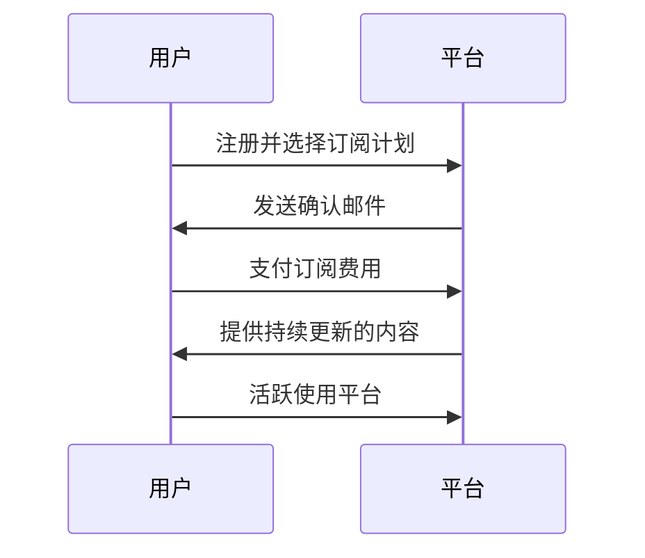

###### 3.1.2 成功案例

1. **知乎**：知乎通过内容订阅模式，为用户提供高质量的知识分享和问答服务，吸引了大量高知用户。知乎的订阅内容主要包括专栏文章、Live分享和知识市场等。

知乎的成功经验主要包括以下几点：

- **高质量内容**：知乎注重内容质量，吸引了大量优秀的内容创作者，为用户提供有价值的内容。
- **社区互动**：知乎通过问答社区的方式，鼓励用户积极参与讨论，提高用户粘性。
- **多样化订阅**：知乎提供了多种订阅选项，满足不同用户的需求。

2. **得到**：得到是一款知名的知识付费平台，提供各类知识类音频和视频课程。得到通过内容订阅模式，为用户提供个人成长、职业发展、投资理财等领域的知识。

得到的成功经验主要包括以下几点：

- **专家内容**：得到与知名专家学者合作，提供高质量的知识内容。
- **个性化推荐**：得到利用大数据和算法，为用户推荐个性化的内容，提高用户满意度。
- **品牌影响力**：得到通过品牌营销和口碑传播，扩大了用户群体。

##### 3.2 课程售卖模式

###### 3.2.1 模式原理

课程售卖模式是指用户购买单个或多个课程，学习特定知识或技能。这种模式的核心在于为用户提供灵活、个性化的学习体验，通过课程销售获得收入。

在课程售卖模式中，平台的盈利方式主要包括课程销售、广告收入和增值服务。课程销售是平台的主要收入来源，广告收入则来自于平台合作伙伴的广告投放。增值服务如在线辅导、考试认证等则能够增加平台的附加收入。

以下是一个简化的课程售卖模式流程：

1. 用户注册并浏览课程。
2. 用户选择并购买课程。
3. 平台提供课程学习资源。
4. 用户完成课程学习，获得证书。

以下是一个课程售卖模式的Mermaid流程图：

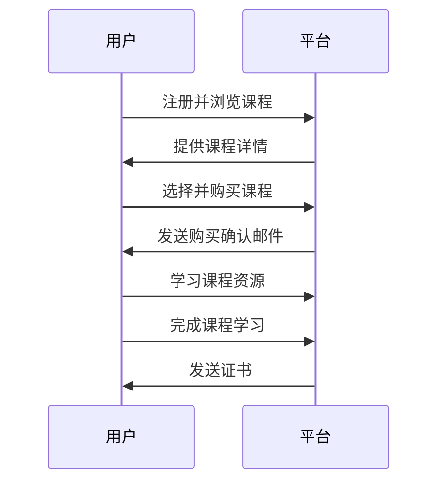

###### 3.2.2 成功案例

1. **Coursera**：Coursera是一家全球知名的在线教育平台，提供来自世界各地顶尖大学的在线课程。Coursera通过课程售卖模式，为全球用户提供了丰富的教育资源。

Coursera的成功经验主要包括以下几点：

- **高质量课程**：Coursera与全球顶尖大学合作，提供高质量的课程资源。
- **多样化的学习方式**：Coursera提供了多种学习方式，如在线课程、直播课程等，满足不同用户的需求。
- **证书认证**：Coursera提供课程证书，增加了课程的价值。

2. **慕课网**：慕课网是国内领先的IT技能培训平台，提供各类IT课程。慕课网通过课程售卖模式，为广大程序员和IT从业者提供了便捷的学习途径。

慕课网的成功经验主要包括以下几点：

- **专业课程**：慕课网专注于IT技能培训，提供高质量的课程内容。
- **灵活学习**：慕课网提供多种学习模式，如视频课程、直播课程等，用户可以根据自己的需求灵活选择。
- **社区互动**：慕课网设有在线社区，用户可以在这里交流学习经验，提高学习效果。

##### 3.3 讲师分享模式

###### 3.3.1 模式原理

讲师分享模式是指用户为获取讲师的分享内容而支付费用。这种模式的核心在于讲师的知名度和影响力，通过付费机制激励讲师创造更多高质量的内容。

在讲师分享模式中，平台的盈利方式主要包括讲师分享费用、广告收入和增值服务。讲师分享费用是平台的主要收入来源，广告收入则来自于平台合作伙伴的广告投放。增值服务如会员权益、付费直播等则能够增加平台的附加收入。

以下是一个简化的讲师分享模式流程：

1. 用户注册并浏览讲师分享。
2. 用户选择并支付讲师分享费用。
3. 平台提供讲师分享资源。
4. 用户享受讲师分享内容。

以下是一个讲师分享模式的Mermaid流程图：

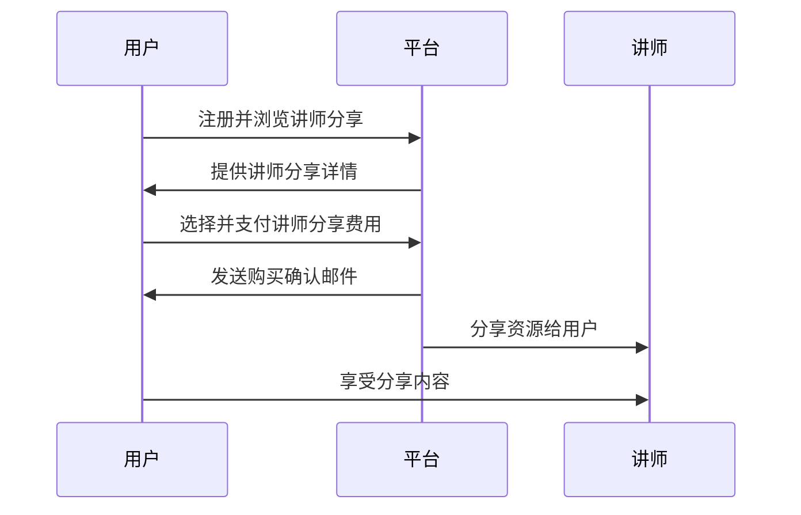

###### 3.3.2 成功案例

1. **吴晓波频道**：吴晓波频道通过讲师分享模式，为用户提供财经知识和投资理念。吴晓波作为知名财经作家和投资人，其分享的内容吸引了大量用户。

吴晓波频道的主要成功经验包括以下几点：

- **专家内容**：吴晓波频道邀请财经领域的专家进行分享，提供高质量的内容。
- **品牌影响力**：吴晓波个人品牌的影响力和知名度，为频道吸引了大量用户。
- **多样化内容**：吴晓波频道提供财经、投资、创业等多领域的分享内容，满足不同用户的需求。

2. **演讲吧**：演讲吧是一款提供各类讲座和演讲内容的平台，用户可以在这里付费观看各种演讲。演讲吧通过讲师分享模式，为用户提供丰富的知识资源。

演讲吧的主要成功经验包括以下几点：

- **优质讲师**：演讲吧邀请各领域的知名讲师进行演讲，提供高质量的内容。
- **互动体验**：演讲吧提供互动功能，用户可以在观看演讲时提问和交流，提高用户体验。
- **多样化内容**：演讲吧涵盖多个领域，如科技、文化、创业等，满足不同用户的需求。

---

#### 4. 知识付费创新模式探讨

##### 4.1 社群互动模式

###### 4.1.1 模式原理

社群互动模式是指用户通过付费加入特定社群，与其他用户互动，共同学习和成长。这种模式的核心在于社交属性，通过社群互动提高用户的学习效果和满意度。

在社群互动模式中，平台的盈利方式主要包括社群费用、广告收入和增值服务。社群费用是平台的主要收入来源，广告收入则来自于平台合作伙伴的广告投放。增值服务如社群管理工具、付费讲座等则能够增加平台的附加收入。

以下是一个简化的社群互动模式流程：

1. 用户注册并选择加入社群。
2. 用户支付社群费用。
3. 平台提供社群管理和互动工具。
4. 用户在社群中参与讨论、提问和分享。

以下是一个社群互动模式的Mermaid流程图：

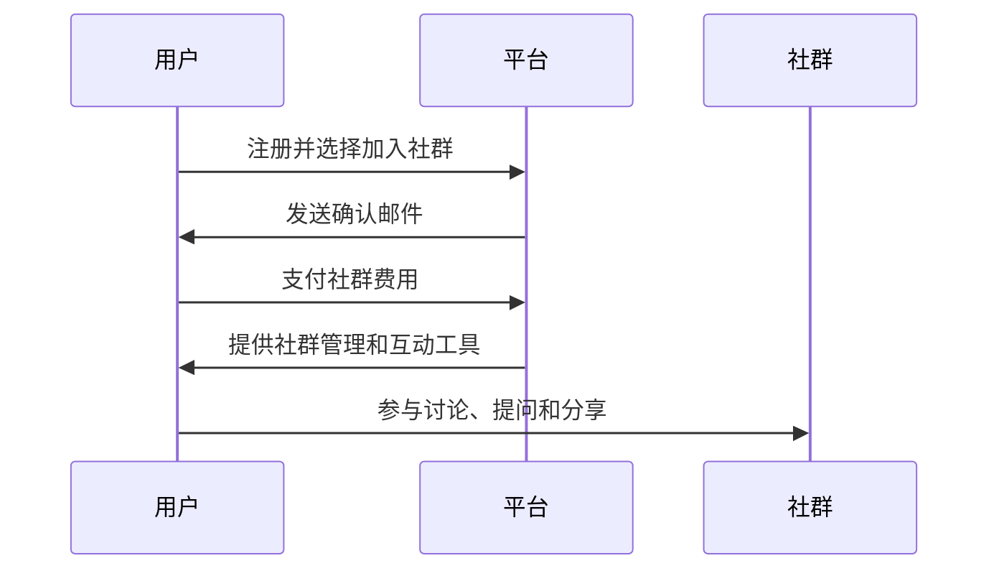

###### 4.1.2 成功案例

1. **知群**：知群是一款提供专业社群服务的平台，用户可以通过付费加入不同的专业社群，与其他行业专家和同行交流和学习。

知群的主要成功经验包括以下几点：

- **高质量社群**：知群邀请行业专家和资深从业者，提供高质量的社群服务。
- **专业管理**：知群提供社群管理工具，确保社群秩序和互动效果。
- **持续学习**：知群提供持续的学习资源，如在线课程、直播讲座等，满足用户的学习需求。

2. **36氪氪空间**：36氪氪空间是36氪旗下的创业服务平台，通过付费社群为创业者提供行业资讯、资源对接等服务。

36氪氪空间的主要成功经验包括以下几点：

- **行业资源**：36氪氪空间依托36氪的媒体资源，为创业者提供丰富的行业资讯和资源。
- **社群互动**：36氪氪空间通过社群互动，促进创业者之间的交流与合作，提高创业成功率。
- **品牌影响力**：36氪氪空间通过举办线下活动、发布行业报告等，扩大了品牌影响力。

##### 4.2 内容电商模式

###### 4.2.1 模式原理

内容电商模式是指知识付费与电商结合，用户购买知识产品或服务。这种模式的核心在于将知识内容与电商销售相结合，实现知识变现。

在内容电商模式中，平台的盈利方式主要包括产品销售、广告收入和增值服务。产品销售是平台的主要收入来源，广告收入则来自于平台合作伙伴的广告投放。增值服务如会员权益、直播带货等则能够增加平台的附加收入。

以下是一个简化的内容电商模式流程：

1. 用户注册并浏览知识产品。
2. 用户选择并购买知识产品。
3. 平台提供知识产品和学习资源。
4. 用户享受知识产品带来的价值。

以下是一个内容电商模式的Mermaid流程图：

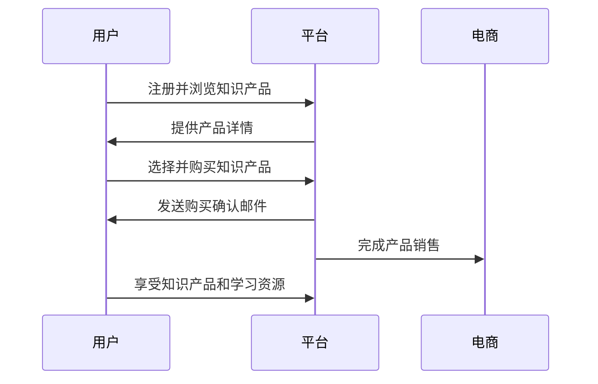

###### 4.2.2 成功案例

1. **有货**：有货是一款结合知识付费和电商的平台，提供时尚穿搭指导，用户可以通过付费购买课程和商品。

有货的主要成功经验包括以下几点：

- **专业知识**：有货邀请时尚领域的专家进行课程讲解，提供专业的时尚知识。
- **个性化推荐**：有货利用大数据和算法，为用户推荐个性化的时尚产品和课程。
- **电商服务**：有货提供便捷的电商服务，用户可以轻松购买商品。

2. **好知网**：好知网是一款提供职场技能培训内容的电商平台，用户可以通过付费购买课程，提升职场竞争力。

好知网的主要成功经验包括以下几点：

- **高质量课程**：好知网与职场专家合作，提供高质量的职场技能培训课程。
- **灵活学习**：好知网提供多种学习方式，如视频课程、直播课程等，用户可以根据自己的需求灵活选择。
- **社群互动**：好知网设有在线社群，用户可以在社群中交流学习经验，提高学习效果。

##### 4.3 知识共享平台模式

###### 4.3.1 模式原理

知识共享平台模式是指平台为知识提供者和需求者提供对接服务，实现知识交易。这种模式的核心在于搭建一个高效的知识交易平台，降低知识交易的成本。

在知识共享平台模式中，平台的盈利方式主要包括交易手续费、广告收入和增值服务。交易手续费是平台的主要收入来源，广告收入则来自于平台合作伙伴的广告投放。增值服务如会员权益、专业认证等则能够增加平台的附加收入。

以下是一个简化的知识共享平台模式流程：

1. 用户注册并发布需求或提供知识。
2. 平台匹配需求和知识提供者。
3. 用户支付费用，平台收取手续费。
4. 知识提供者提供服务，用户评价。

以下是一个知识共享平台模式的Mermaid流程图：

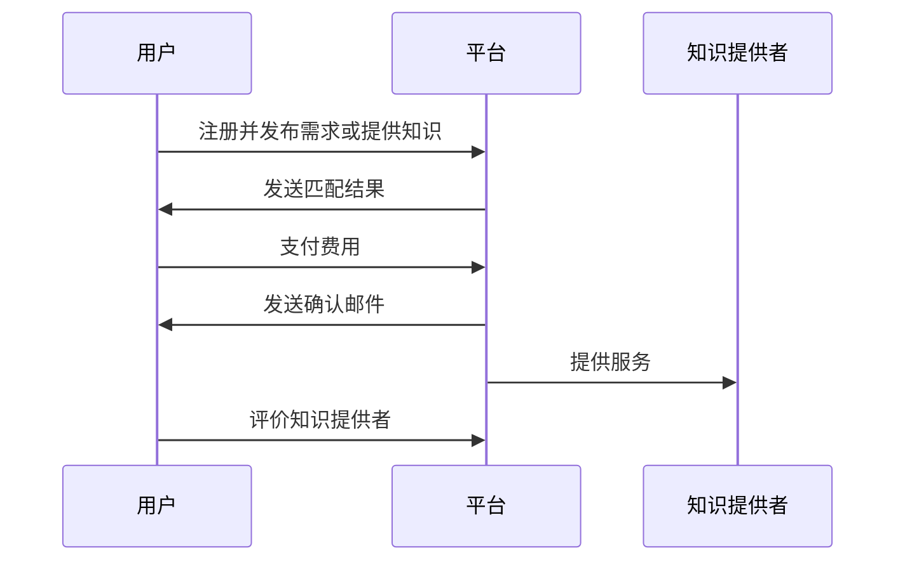

###### 4.3.2 成功案例

1. **知乎Live**：知乎Live是知乎推出的知识直播平台，用户可以通过付费观看知识分享直播。

知乎Live的主要成功经验包括以下几点：

- **专家资源**：知乎Live邀请各领域的专家进行直播分享，提供高质量的知识内容。
- **互动体验**：知乎Live提供互动功能，用户可以在观看直播时提问和交流，提高用户体验。
- **多样化内容**：知乎Live涵盖多个领域，如科技、文化、创业等，满足不同用户的需求。

2. **在行**：在行是一款知识交易服务平台，用户可以通过付费与专家进行一对一的知识咨询和培训。

在行的成功经验包括以下几点：

- **专业服务**：在行邀请各领域的专家，提供专业的一对一咨询服务。
- **便捷交易**：在行提供便捷的交易流程，用户可以轻松完成知识交易。
- **用户评价**：在行注重用户评价，通过用户评价体系确保知识服务的质量。

---

#### 5. 知识付费商业模式创新策略

##### 5.1 用户需求分析

###### 5.1.1 用户需求分析方法

用户需求分析是知识付费商业模式创新的重要一环，通过分析用户需求，可以更好地设计产品和服务，满足用户需求。以下是一些常用的用户需求分析方法：

1. **问卷调查**：通过设计问卷，收集用户对知识付费的需求、偏好等信息。
2. **用户访谈**：通过与用户进行面对面访谈，深入了解用户的需求和痛点。
3. **数据分析**：通过分析用户行为数据，挖掘用户的偏好和需求趋势。
4. **焦点小组**：组织一组用户进行讨论，收集他们对知识付费的看法和建议。

以下是一个用户需求分析的伪代码示例：

```python
# 用户需求分析
def analyze_user需求的（user_data）:
    # 统计用户最感兴趣的主题
    popular_topics = statistics.most_common_topics(user_data)
    
    # 分析用户对知识付费内容的评价
    rating_analysis = analyze_ratings(user_data)
    
    # 收集用户反馈
    user_feedback = collect_feedback(user_data)
    
    # 汇总分析结果
    result = {
        "popular_topics": popular_topics,
        "rating_analysis": rating_analysis,
        "user_feedback": user_feedback
    }
    
    return result
```

###### 5.1.2 成功案例分析

1. **得到**：得到通过用户调研和数据分析，发现用户对个人成长、职业发展等领域的知识需求较高，因此推出了一系列相关课程，满足了用户的需求。

得到的成功经验包括以下几点：

- **精准定位**：得到通过用户需求分析，明确了知识付费的核心领域，如个人成长、职业发展等。
- **持续迭代**：得到根据用户反馈和需求变化，不断优化课程内容和形式，提高用户满意度。
- **个性化推荐**：得到利用大数据和算法，为用户推荐个性化的课程，提高用户参与度。

2. **知乎**：知乎通过用户行为数据，分析用户的浏览、点赞、评论等行为，挖掘用户的兴趣和需求，为用户推荐相关内容。

知乎的成功经验包括以下几点：

- **数据驱动**：知乎通过数据分析，深入了解用户需求，为用户提供有针对性的内容。
- **社交互动**：知乎通过社交互动，鼓励用户参与内容创作和讨论，提高用户粘性。
- **多样化内容**：知乎提供多种类型的内容，如文章、问答、Live等，满足不同用户的需求。

##### 5.2 技术创新应用

###### 5.2.1 技术创新对商业模式的影响

技术创新对知识付费商业模式产生了深远的影响，主要体现在以下几个方面：

1. **用户体验提升**：技术创新提高了知识付费平台的用户体验，如通过AI技术实现个性化推荐、智能问答等。
2. **知识生产效率提升**：技术创新提高了知识生产的效率，如通过在线直播、录播等方式，实现知识的快速传播。
3. **知识变现方式多样化**：技术创新推动了知识变现方式的多样化，如通过区块链技术实现知识确权、分润等。

以下是一个技术创新对知识付费商业模式影响的Mermaid流程图：

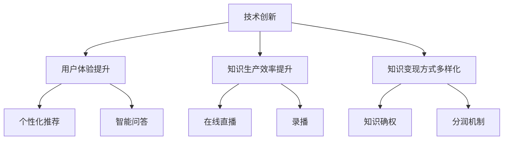

###### 5.2.2 成功案例分析

1. **码市**：码市通过区块链技术，实现了知识确权和分润，提高了知识付费的透明度和效率。

码市的主要成功经验包括以下几点：

- **知识确权**：码市利用区块链技术，确保知识的归属和权益，提高用户的信任度。
- **分润机制**：码市通过智能合约，实现知识收益的自动分润，提高知识变现效率。
- **社区生态**：码市建立了知识共享社区，鼓励用户贡献内容，促进知识传播。

2. **作业帮**：作业帮通过AI技术，实现了个性化学习推荐，提高了用户的学习效果。

作业帮的主要成功经验包括以下几点：

- **个性化推荐**：作业帮利用AI技术，分析用户的学习行为和偏好，为用户推荐个性化的学习内容。
- **智能辅导**：作业帮提供智能辅导服务，通过AI技术为学生提供实时解答和辅导。
- **在线学习**：作业帮通过在线直播、录播等方式，实现知识的快速传播，提高了学习效率。

##### 5.3 跨界合作与整合

###### 5.3.1 跨界合作的战略意义

跨界合作与整合在知识付费商业模式创新中具有重要意义，主要体现在以下几个方面：

1. **资源共享**：跨界合作可以实现知识资源的高效共享，降低知识获取成本。
2. **增强竞争力**：跨界合作可以整合各方优势，提高知识付费平台的竞争力。
3. **创新商业模式**：跨界合作可以推动知识付费商业模式的创新，如通过电商、社交等手段实现知识变现。

以下是一个跨界合作的战略意义的Mermaid流程图：

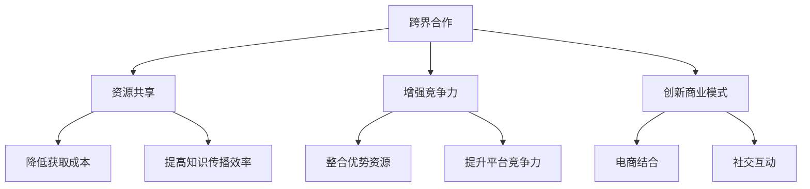

###### 5.3.2 成功案例分析

1. **网易云课堂**：网易云课堂与各大高校、企业合作，提供了丰富的在线课程资源，满足了用户多样化的学习需求。

网易云课堂的主要成功经验包括以下几点：

- **合作高校**：网易云课堂与国内外知名高校合作，提供优质的教育资源。
- **合作企业**：网易云课堂与各大企业合作，提供职业技能培训，满足企业需求。
- **课程多样化**：网易云课堂提供多种类型的课程，如IT技能、职场技能等，满足不同用户的需求。

2. **快手课堂**：快手通过跨界合作，与教育培训机构合作，推出了“快手课堂”栏目，实现了知识付费与社交平台的融合。

快手课堂的主要成功经验包括以下几点：

- **内容合作**：快手与教育培训机构合作，提供优质的教育内容。
- **社交互动**：快手通过社交互动，提高用户的学习积极性和参与度。
- **直播教学**：快手利用直播技术，实现实时教学和互动，提高教学效果。

---

### 第三部分：知识付费商业模式运营

#### 6. 知识付费商业模式运营策略

##### 6.1 内容运营

###### 6.1.1 内容策略制定

内容运营策略是知识付费商业模式成功的关键之一。以下是一些内容策略制定的关键步骤：

1. **明确内容定位**：根据用户需求和市场趋势，确定内容的核心主题和定位。
2. **内容策划**：策划有吸引力的内容，如热点话题、行业趋势、实用技巧等。
3. **内容制作**：制作高质量的内容，包括文字、图片、视频等多种形式。
4. **内容发布**：制定内容发布计划，确保内容持续更新和高质量输出。

以下是一个内容策略制定的伪代码示例：

```python
# 内容策略制定
def create_content_strategy（user需求，市场趋势）:
    # 确定内容定位
    content定位 = define_content定位（user需求，市场趋势）
    
    # 策划内容
    content_plan = plan_content（content定位）
    
    # 制作内容
    content = create_content（content_plan）
    
    # 发布内容
    publish_content（content）
    
    return content_strategy
```

###### 6.1.2 内容营销方法

内容营销是知识付费平台吸引和留住用户的重要手段。以下是一些常见的内容营销方法：

1. **SEO优化**：通过优化内容，提高在搜索引擎中的排名，吸引更多用户访问。
2. **社交媒体推广**：通过社交媒体平台，如微博、微信公众号等，推广内容，扩大影响力。
3. **KOL合作**：与行业内的意见领袖合作，通过他们的推荐和传播，提高内容的曝光率。
4. **用户互动**：通过评论区、社群等方式，与用户互动，提高用户参与度和粘性。
5. **内容合作**：与其他平台或机构合作，共同制作和推广内容，实现资源共享。

以下是一个内容营销方法的Mermaid流程图：

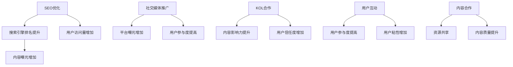

###### 6.1.3 内容运营工具

以下是一些常用的内容运营工具：

1. **内容管理系统（CMS）**：用于管理内容，包括内容创建、发布、编辑等。
2. **数据分析工具**：用于分析用户行为和数据，优化内容策略。
3. **社交媒体管理工具**：用于管理社交媒体账号，发布内容，监测效果。
4. **用户互动工具**：用于与用户互动，提高用户参与度和粘性。

以下是一个内容运营工具的Mermaid流程图：

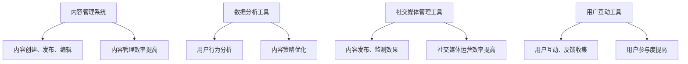

##### 6.2 用户运营

###### 6.2.1 用户运营策略

用户运营是知识付费平台留住用户、提高用户粘性的关键。以下是一些用户运营策略：

1. **用户画像**：通过数据分析，了解用户的基本特征和行为习惯。
2. **用户互动**：通过社交媒体、社群等方式，与用户建立互动关系。
3. **用户留存**：通过优惠活动、会员制度等方式，提高用户留存率。
4. **用户增长**：通过营销活动、用户推荐等方式，增加用户数量。

以下是一个用户运营策略的Mermaid流程图：

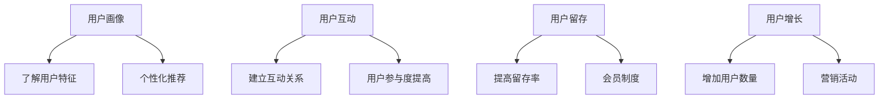

###### 6.2.2 用户增长策略

以下是一些用户增长策略：

1. **营销活动**：通过线上或线下活动，吸引新用户。
2. **用户推荐**：通过用户推荐机制，鼓励现有用户邀请新用户。
3. **社交媒体推广**：通过社交媒体平台，如微博、微信公众号等，推广平台和产品。
4. **内容营销**：通过制作高质量的内容，吸引用户关注和参与。

以下是一个用户增长策略的Mermaid流程图：

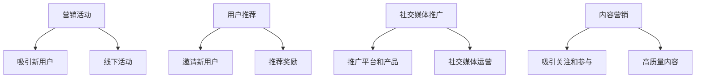

##### 6.3 营销与推广

###### 6.3.1 营销渠道选择

营销渠道选择是知识付费平台扩大用户覆盖范围的重要环节。以下是一些常见的营销渠道：

1. **搜索引擎**：通过SEO优化和广告投放，提高在搜索引擎中的排名和曝光率。
2. **社交媒体**：通过微信公众号、微博、抖音等社交媒体平台，进行内容推广和用户互动。
3. **线上活动**：通过线上活动，如直播、讲座等，吸引新用户和潜在用户。
4. **线下活动**：通过线下活动，如讲座、培训等，提高品牌知名度，吸引更多用户。

以下是一个营销渠道选择的Mermaid流程图：

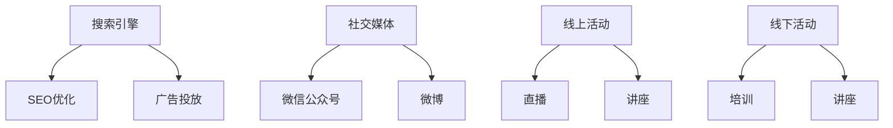

###### 6.3.2 推广策略制定

推广策略制定需要结合平台定位、用户需求和营销渠道的特点。以下是一些常见的推广策略：

1. **内容驱动**：通过制作高质量的内容，吸引用户关注和参与。
2. **互动营销**：通过互动活动，如问答、抽奖等，提高用户参与度和粘性。
3. **KOL合作**：与行业内的意见领袖合作，通过他们的推荐和传播，提高内容的曝光率。
4. **精准营销**：通过数据分析，了解用户需求和行为，进行精准营销，提高转化率。

以下是一个推广策略制定的Mermaid流程图：

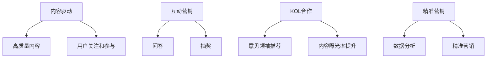

---

#### 7. 知识付费商业模式案例研究

##### 7.1 案例一：成功知识付费平台的运营策略

###### 7.1.1 平台简介

得到是一款知名的知识付费平台，提供各类知识类音频和视频课程，包括个人成长、职业发展、投资理财等领域。得到平台通过内容订阅和课程售卖模式，吸引了大量用户。

###### 7.1.2 运营策略分析

1. **内容策略**：

   得到注重内容质量和权威性，与知名专家学者合作，提供高质量的知识内容。得到的内容主要包括音频课程、视频课程和电子书等，涵盖了多个领域，如商业、科技、文化等。

   **内容来源**：

   - 与知名专家学者合作：得到与大量知名专家学者合作，邀请他们进行知识分享和课程制作。
   - 自制内容：得到也自制了一些高质量的内容，如《罗胖60秒》、《每天听本书》等。

   **内容推广**：

   - 社交媒体推广：得到通过微信公众号、微博等社交媒体平台，推广其内容和课程。
   - KOL合作：得到与各大领域的意见领袖合作，通过他们的推荐和传播，扩大内容的影响力。

2. **用户运营**：

   得到通过用户画像和数据分析，了解用户的需求和偏好，提供个性化的内容推荐和服务。得到采用了以下用户运营策略：

   - **用户画像**：通过数据分析，了解用户的基本特征和行为习惯。
   - **个性化推荐**：根据用户画像，为用户推荐个性化的内容和课程。
   - **社群运营**：得到建立了多个社群，如“得到书友会”、“得到商学院”等，为用户提供交流和学习的平台。

3. **营销与推广**：

   得到通过多种营销渠道和推广策略，提高品牌知名度和用户数量。得到采用了以下营销策略：

   - **内容营销**：通过制作高质量的内容，吸引用户关注和参与。
   - **互动营销**：通过互动活动，如抽奖、优惠券等，提高用户参与度和粘性。
   - **KOL合作**：与行业内的意见领袖合作，通过他们的推荐和传播，提高内容的曝光率。

4. **商业模式创新**：

   得到不断探索和尝试新的商业模式，以满足用户的需求和市场的变化。以下是一些得到在商业模式上的创新：

   - **会员制度**：得到推出了会员制度，用户可以通过付费成为会员，享受更多的服务和权益。
   - **知识星球**：得到推出了“知识星球”，为用户提供深度交流和学习的平台。
   - **电商业务**：得到也在电商领域进行探索，通过销售相关书籍、课程等商品，实现知识变现。

##### 7.2 案例二：创新知识付费模式的应用

###### 7.2.1 模式简介

码市是一款基于区块链技术的知识付费平台，通过区块链技术实现知识确权和分润。码市提供多种知识产品和服务，包括在线课程、技术咨询等。

###### 7.2.2 模式创新点

1. **知识确权**：

   码市通过区块链技术，为知识提供者提供确权服务，确保知识的归属和权益。知识提供者可以在码市平台上上传自己的知识作品，并通过区块链技术确权，保障自己的知识产权。

2. **分润机制**：

   码市通过智能合约，实现知识收益的自动分润。当用户购买知识产品时，码市会自动将收益按比例分配给知识提供者和平台，确保公平和透明。

3. **去中心化交易**：

   码市采用去中心化交易机制，用户可以直接在平台上购买和交易知识产品，无需依赖第三方支付平台。这降低了交易成本，提高了交易效率。

4. **知识共享社区**：

   码市建立了知识共享社区，用户可以在社区中交流学习经验，共同成长。社区为用户提供了互动和学习的平台，促进了知识的传播和共享。

###### 7.2.3 运营策略分析

1. **内容策略**：

   码市注重内容的质量和创新，与各领域的专家和学者合作，提供高质量的知识产品。码市的内容涵盖了多个领域，如科技、金融、法律等，满足不同用户的需求。

2. **用户运营**：

   码市通过用户画像和数据分析，了解用户的需求和偏好，提供个性化的内容推荐和服务。码市也建立了用户社群，为用户提供交流和学习的机会。

3. **营销与推广**：

   码市通过多种渠道和策略，提高品牌知名度和用户数量。码市采用了内容营销、社群互动和KOL合作等策略，吸引了大量用户。

4. **技术创新**：

   码市不断探索和运用新技术，提升平台的服务质量和用户体验。码市在区块链技术的基础上，开发了智能合约、去中心化交易等创新功能，为知识付费领域带来了新的可能性。

---

### 第四部分：未来展望

#### 8. 知识付费商业模式发展趋势

##### 8.1 技术发展趋势

知识付费商业模式的发展将受到以下技术趋势的影响：

1. **人工智能**：

   人工智能将在知识付费中发挥重要作用，如个性化推荐、智能问答、智能客服等。通过人工智能技术，平台可以更准确地理解用户需求，提供个性化的服务。

2. **区块链**：

   区块链技术将在知识付费中实现知识确权、分润、去中心化交易等功能，提高交易透明度和效率。区块链技术有助于解决知识付费领域中的版权保护和利益分配问题。

3. **虚拟现实**：

   虚拟现实技术将改变知识付费的学习体验，提供更加沉浸式和互动性的学习环境。虚拟现实技术可以模拟真实场景，提高用户的学习效果和满意度。

4. **大数据**：

   大数据技术在知识付费中的应用将越来越广泛，如用户画像分析、需求预测、营销策略制定等。通过大数据技术，平台可以更深入地了解用户需求，优化运营策略。

##### 8.2 市场环境变化

知识付费商业模式的发展也将受到市场环境变化的影响：

1. **政策法规**：

   政策法规的完善将规范知识付费市场，保障用户权益，提高市场透明度。政府可能会出台相关政策，鼓励知识付费行业的发展，同时加强对市场的监管。

2. **市场竞争**：

   随着知识付费市场的扩大，竞争将更加激烈。平台需要不断创新和提升服务质量，以吸引和留住用户。同时，新兴平台和模式将不断涌现，推动市场的多元化发展。

3. **用户需求变化**：

   用户需求将不断变化和升级，对知识付费平台的内容和服务提出更高的要求。平台需要关注用户需求的变化，及时调整运营策略，满足用户的需求。

4. **数字化趋势**：

   数字化趋势将进一步加速，知识付费平台需要提升数字化能力，优化用户体验，提高运营效率。数字化技术将帮助平台实现个性化、智能化和高效化。

---

## 附录

### A.1 知识付费相关术语解释

以下是对知识付费相关术语的解释：

1. **知识付费**：用户为获取知识或技能所支付的费用。
2. **内容订阅模式**：用户通过支付订阅费用，获取平台提供的持续更新的内容。
3. **课程售卖模式**：用户购买单个或多个课程，学习特定知识或技能。
4. **讲师分享模式**：用户为获取讲师的分享内容而支付费用。
5. **社群互动模式**：用户通过付费加入特定社群，与其他用户互动，共同学习和成长。
6. **内容电商模式**：知识付费与电商结合，用户购买知识产品或服务。
7. **知识共享平台模式**：平台为知识提供者和需求者提供对接服务，实现知识交易。

### A.2 常见知识付费平台介绍

以下是一些常见的知识付费平台及其特点：

1. **得到**：提供各类知识类音频和视频课程，包括个人成长、职业发展、投资理财等领域。
2. **知乎**：结合社交和知识分享的问答社区，提供付费内容和知识直播服务。
3. **慕课网**：提供各类IT课程，满足程序员和IT从业者的学习需求。
4. **36氪**：提供创业知识和资源对接服务，包括创业课程、行业报告等。
5. **网易云课堂**：提供在线课程和学习资源，涵盖多个领域，如IT、职场等。

### A.3 知识付费行业报告与趋势分析

以下是一些知识付费行业报告和趋势分析：

1. **《2020年中国知识付费行业报告》**：分析了知识付费市场的规模、用户特征和发展趋势。
2. **《2021年全球知识付费市场报告》**：分析了全球知识付费市场的发展状况和主要趋势。
3. **《知识付费行业白皮书》**：从多个维度分析了知识付费行业的现状和未来发展趋势。

---

## 附件

### B.1 知识付费商业模式设计工具

以下是一些知识付费商业模式设计工具：

1. **商业模式画布**：用于梳理商业模式的核心要素，如用户、渠道、收入来源等。
2. **SWOT分析**：用于分析平台的内部优势、劣势，以及外部机会和威胁。
3. **用户画像**：用于了解目标用户的基本特征和需求，指导内容和服务设计。

### B.2 知识付费运营管理工具

以下是一些知识付费运营管理工具：

1. **内容管理系统（CMS）**：用于管理知识内容，包括创建、发布、编辑等。
2. **用户管理系统（CRM）**：用于管理用户信息，包括注册、购买、反馈等。
3. **数据分析工具**：用于分析用户行为和运营效果，指导运营策略的调整。

---

**作者：AI天才研究院/AI Genius Institute & 禅与计算机程序设计艺术 /Zen And The Art of Computer Programming**

