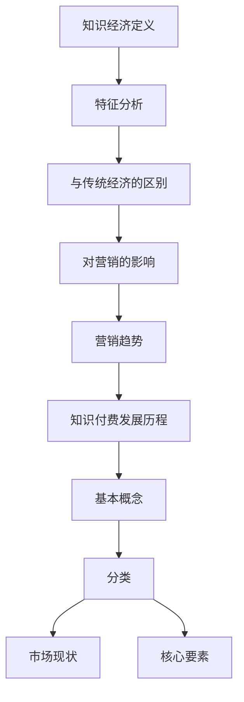
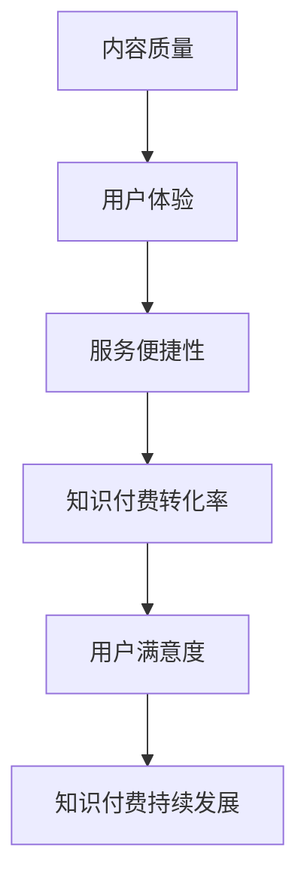
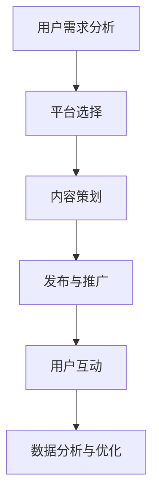

                 

## 文章标题

### 知识经济时代下的知识付费创新营销渠道拓展

#### 关键词：知识经济、知识付费、创新营销、社交媒体、内容营销、知识社群、知识变现、跨界合作、用户研究、技术创新

#### 摘要

在知识经济时代，知识付费已成为一种重要的商业模式，通过创新营销渠道的拓展，企业能够更好地满足用户需求，实现知识的高效传播和变现。本文将从知识经济时代的背景与特征出发，深入探讨知识付费的基本概念、创新营销渠道、跨界合作与整合营销策略，并结合实际案例进行分析，为企业在知识付费领域的营销实践提供有益的参考。

### 第一部分：知识经济时代的背景与特征

#### 第1章：知识经济时代的到来

**1.1 知识经济的定义与特征**

知识经济（Knowledge Economy）是指以知识和信息的生产、分配和使用为核心的经济形态。与传统的农业经济和工业经济相比，知识经济具有以下特征：

- **信息密集型经济**：知识经济依赖于大量的信息和数据，信息资源成为经济发展的关键驱动力。
- **创新驱动型经济**：知识经济强调创新，以科技、管理和商业模式创新为主要推动力。
- **知识驱动型经济**：知识经济以知识的生产、传播和应用为主要形式，知识成为经济增长的主要动力。
- **全球化与区域化并存的经济**：知识经济具有全球化的特征，同时也存在区域化的趋势。
- **虚拟化与实体化并存的经济**：知识经济既包括虚拟的数字产品和服务，也包括实体的产品和商品。

**知识经济与传统经济的区别**

知识经济与传统经济的主要区别在于以下几个方面：

- **生产要素**：知识经济以知识、信息、技术和创新为主，而传统经济则以土地、劳动力、资本为主。
- **产业特点**：知识经济以高技术产业、服务业和信息产业为主，而传统经济则以农业、工业为主。
- **经济增长方式**：知识经济通过知识的生产和传播实现经济增长，而传统经济通过资源的开发和利用实现经济增长。
- **消费模式**：知识经济下的消费更注重个性化和多样化，而传统经济下的消费更多是标准化和大规模生产。

**知识经济对营销的影响**

知识经济对营销产生了深远的影响，主要表现在以下几个方面：

- **消费者行为的变化**：知识经济时代，消费者对信息的获取更加便捷，消费决策更加独立和理性。
- **营销策略的调整**：企业需要更加注重用户需求的研究和满足，采取个性化的营销策略。
- **营销模式的创新**：知识经济推动了营销模式的创新，如社交媒体营销、内容营销、知识社群营销等。
- **数据驱动的营销**：知识经济使得数据成为重要的营销资源，企业通过数据分析实现精准营销。

**知识经济时代的营销趋势**

在知识经济时代，营销趋势呈现出以下几个特点：

- **个人品牌营销**：个人品牌成为重要的营销资源，个人知识和技能成为核心竞争力。
- **社交媒体与内容营销**：社交媒体和内容营销成为重要的营销渠道，通过创造有价值的内容吸引和留住用户。
- **知识付费**：知识付费成为新的商业模式，用户愿意为高质量的知识和服务付费。

**知识付费的发展历程**

知识付费作为一种商业模式，其发展历程可以分为以下几个阶段：

- **1.0时代**：以书籍、讲座等形式的知识传播为主，用户通过购买实体书籍或参加线下讲座获取知识。
- **2.0时代**：互联网的发展使得知识传播更加便捷，以网络课程、电子书等形式的知识付费逐渐兴起。
- **3.0时代**：随着移动互联网的普及，知识付费呈现出碎片化、个性化的特点，用户可以通过手机等移动设备随时随地进行学习。

**1.2 知识付费的基本概念**

知识付费是指用户为获取知识内容而支付费用的一种商业模式。知识付费的基本概念包括以下几个方面：

- **内容质量**：知识内容的质量是用户决定是否付费的关键因素，高质量的知识内容能够满足用户的需求。
- **用户体验**：良好的用户体验能够提高用户的满意度和忠诚度，促进知识付费的持续发展。
- **服务便捷性**：便捷的服务方式能够降低用户的购买门槛，提高知识付费的转化率。

**知识付费的分类**

知识付费可以按照不同的维度进行分类，常见的分类方式包括：

- **按内容形式分**：包括文字、视频、音频、直播等形式。
- **按服务模式分**：包括课程、咨询、直播、社群等形式。
- **按用户群体分**：包括个人、企业、专业等不同类型的用户。
- **按平台类型分**：包括自营平台、第三方平台等不同类型的平台。

**知识付费的市场现状**

知识付费市场呈现出快速增长的态势，主要表现在以下几个方面：

- **用户需求分析**：随着知识经济的发展，用户对高质量知识的渴求不断增加，知识付费市场规模持续扩大。
- **市场规模与增长趋势**：根据相关数据显示，知识付费市场呈现出高速增长的态势，预计未来仍将保持较高增速。
- **用户满意度**：用户对知识付费产品的满意度较高，推动了市场的进一步发展。

**知识付费的核心要素**

知识付费的核心要素包括以下几个方面：

- **内容质量**：高质量的知识内容是知识付费的基础，直接影响用户的购买决策和满意度。
- **用户体验**：良好的用户体验能够提高用户的满意度和忠诚度，促进知识付费的持续发展。
- **服务便捷性**：便捷的服务方式能够降低用户的购买门槛，提高知识付费的转化率。

通过以上对知识经济时代背景与特征的探讨，我们可以看到知识付费作为一种新兴商业模式，在当前经济环境下具有巨大的发展潜力。在接下来的章节中，我们将进一步探讨知识付费的创新营销渠道、跨界合作与整合营销策略，为企业在知识付费领域的营销实践提供有益的参考。|user|>



```latex
\text{知识经济时代的特征} =
\begin{aligned}
&\text{信息密集型经济} \\
&\text{创新驱动型经济} \\
&\text{知识驱动型经济} \\
&\text{全球化与区域化并存的经济} \\
&\text{虚拟化与实体化并存的经济} \\
&\text{知识共享与知识产权保护并存的经济}
\end{aligned}
```



```latex
\text{知识付费的分类} =
\begin{aligned}
&\text{按内容形式分：文字、视频、音频、直播等} \\
&\text{按服务模式分：课程、咨询、直播、社群等} \\
&\text{按用户群体分：个人、企业、专业等} \\
&\text{按平台类型分：自营平台、第三方平台等} \\
\end{aligned}
```



### 第一部分：知识经济时代的背景与特征

#### 第1章：知识经济时代的到来

知识经济时代，作为21世纪经济发展的重要趋势，其核心在于知识和信息的生产、传播和使用。这一经济模式与传统以资源、劳动力和资本为基础的经济模式有着显著的区别。下面，我们将详细探讨知识经济的定义、特征以及其对营销的影响。

**1.1 知识经济的定义与特征**

知识经济的定义是指以知识资源的占有、分配、使用为经济发展的核心推动力，以高技术产业为支柱，以智力资源为主要依托的经济形态。其特征主要表现在以下几个方面：

- **信息密集型经济**：知识经济依赖于大量的信息资源和数据分析能力，信息成为经济增长的关键要素。
- **创新驱动型经济**：知识经济强调创新，特别是科技创新和商业模式创新，以推动经济增长和社会进步。
- **知识驱动型经济**：知识经济以知识和信息的生产、传播和使用为核心，知识成为经济发展的主要驱动力。
- **全球化与区域化并存的经济**：知识经济具有全球化的特征，同时也存在着区域化的趋势，不同地区的知识经济表现有所差异。
- **虚拟化与实体化并存的经济**：知识经济中的产品和服务既包括虚拟的数字产品，也包括实体的产品和服务，两者并存且相互促进。

**知识经济与传统经济的区别**

知识经济与传统经济的区别主要体现在以下几个方面：

- **生产要素**：知识经济以知识、信息、技术和创新为主，而传统经济以土地、劳动力、资本为主。
- **产业特点**：知识经济以高技术产业、服务业和信息产业为主，而传统经济以农业、工业为主。
- **经济增长方式**：知识经济通过知识的生产和传播实现经济增长，而传统经济通过资源的开发和利用实现经济增长。
- **消费模式**：知识经济下的消费更注重个性化和多样化，而传统经济下的消费更多是标准化和大规模生产。

**知识经济对营销的影响**

知识经济对营销产生了深远的影响，主要体现在以下几个方面：

- **消费者行为的变化**：知识经济的兴起改变了消费者的消费行为，消费者更加注重个性化和定制化的产品和服务，消费决策更加独立和理性。
- **营销策略的调整**：企业需要更加注重用户需求的研究和满足，采取个性化的营销策略，以提升用户体验和满意度。
- **营销模式的创新**：知识经济推动了营销模式的创新，如社交媒体营销、内容营销、知识社群营销等，这些模式更加贴近用户，能够实现更高效的知识传播和用户互动。
- **数据驱动的营销**：知识经济使得数据成为重要的营销资源，企业通过数据分析实现精准营销，提高营销效果和转化率。

**知识经济时代的营销趋势**

在知识经济时代，营销趋势呈现出以下几个特点：

- **个人品牌营销**：个人品牌成为重要的营销资源，个人知识和技能成为核心竞争力。
- **社交媒体与内容营销**：社交媒体和内容营销成为重要的营销渠道，通过创造有价值的内容吸引和留住用户。
- **知识付费**：知识付费成为新的商业模式，用户愿意为高质量的知识和服务付费。

**知识付费的发展历程**

知识付费作为一种商业模式，其发展历程可以分为以下几个阶段：

- **1.0时代**：以书籍、讲座等形式的知识传播为主，用户通过购买实体书籍或参加线下讲座获取知识。
- **2.0时代**：互联网的发展使得知识传播更加便捷，以网络课程、电子书等形式的知识付费逐渐兴起。
- **3.0时代**：随着移动互联网的普及，知识付费呈现出碎片化、个性化的特点，用户可以通过手机等移动设备随时随地进行学习。

**1.2 知识付费的基本概念**

知识付费是指用户为获取知识内容而支付费用的一种商业模式。其基本概念包括以下几个方面：

- **内容质量**：高质量的知识内容是知识付费的基础，直接影响用户的购买决策和满意度。
- **用户体验**：良好的用户体验能够提高用户的满意度和忠诚度，促进知识付费的持续发展。
- **服务便捷性**：便捷的服务方式能够降低用户的购买门槛，提高知识付费的转化率。

**知识付费的分类**

知识付费可以按照不同的维度进行分类，常见的分类方式包括：

- **按内容形式分**：包括文字、视频、音频、直播等形式。
- **按服务模式分**：包括课程、咨询、直播、社群等形式。
- **按用户群体分**：包括个人、企业、专业等不同类型的用户。
- **按平台类型分**：包括自营平台、第三方平台等不同类型的平台。

**知识付费的市场现状**

知识付费市场呈现出快速增长的态势，主要表现在以下几个方面：

- **用户需求分析**：随着知识经济的发展，用户对高质量知识的渴求不断增加，知识付费市场规模持续扩大。
- **市场规模与增长趋势**：根据相关数据显示，知识付费市场呈现出高速增长的态势，预计未来仍将保持较高增速。
- **用户满意度**：用户对知识付费产品的满意度较高，推动了市场的进一步发展。

**知识付费的核心要素**

知识付费的核心要素包括以下几个方面：

- **内容质量**：高质量的知识内容是知识付费的基础，直接影响用户的购买决策和满意度。
- **用户体验**：良好的用户体验能够提高用户的满意度和忠诚度，促进知识付费的持续发展。
- **服务便捷性**：便捷的服务方式能够降低用户的购买门槛，提高知识付费的转化率。

通过以上对知识经济时代背景与特征的探讨，我们可以看到知识付费作为一种新兴商业模式，在当前经济环境下具有巨大的发展潜力。在接下来的章节中，我们将进一步探讨知识付费的创新营销渠道、跨界合作与整合营销策略，为企业在知识付费领域的营销实践提供有益的参考。

### 第一部分：知识经济时代的背景与特征

#### 第2章：知识付费的基本概念

知识付费作为一种新兴的商业模式，在知识经济时代逐渐崭露头角。本章将深入探讨知识付费的基本概念、市场现状、核心要素以及分类。

**2.1 知识付费的定义与分类**

知识付费是指用户为获取知识内容而支付费用的一种商业模式。这种模式的核心在于知识的价值化，即通过付费来获取有价值的信息和知识服务。根据不同的分类标准，知识付费可以分为多种形式：

- **按内容形式分**：知识付费主要包括文字、视频、音频、直播等形式。其中，文字内容如电子书、文章、报告等，视频内容如在线课程、讲座、教程等，音频内容如播客、音频课程等，直播内容如线上研讨会、直播授课等。
- **按服务模式分**：知识付费的服务模式多样，包括课程、咨询、直播、社群等形式。课程通常是以系统化的知识传授为主，咨询则是提供专业解答和个性化服务，直播是一种实时互动的教学方式，社群则是一种用户互动和知识分享的平台。
- **按用户群体分**：知识付费的用户群体多样，包括个人、企业、专业等不同类型的用户。个人用户通常是为了提升个人技能或兴趣爱好，企业用户则是为了提高团队的专业能力和工作效率，专业用户则包括专业人士、学术研究者等。
- **按平台类型分**：知识付费的平台类型多样，包括自营平台、第三方平台等。自营平台通常由知识生产者或机构自己运营，如得到、知乎Live等，第三方平台则是由平台方提供技术支持和服务，如网易云课堂、喜马拉雅等。

**2.2 知识付费的市场现状**

知识付费市场在近年来呈现出快速增长的趋势。以下是对当前知识付费市场的现状分析：

- **用户需求分析**：随着社会竞争的加剧和个体需求的多样化，用户对高质量知识的渴求不断增加。尤其是在职业技能提升、个人成长、兴趣爱好等方面，知识付费成为用户满足需求的重要途径。
- **市场规模与增长趋势**：根据相关数据统计，知识付费市场呈现出高速增长的态势。预计未来，随着技术的进步和用户需求的进一步释放，知识付费市场将继续保持较高增速。
- **用户满意度**：用户对知识付费产品的满意度较高。一方面，高质量的知识内容能够满足用户的学习需求，提升用户的技能水平；另一方面，良好的用户体验和便捷的服务方式也增强了用户的满意度和忠诚度。

**2.3 知识付费的核心要素**

知识付费作为一种商业模式，其成功与否取决于多个核心要素。以下是对这些核心要素的详细探讨：

- **内容质量**：内容质量是知识付费的核心，高质量的知识内容能够吸引和留住用户。对于知识生产者而言，需要具备专业知识和教学能力，以确保内容的权威性和实用性。
- **用户体验**：良好的用户体验是知识付费持续发展的关键。用户体验不仅包括学习过程的使用体验，如课程结构、互动设计等，还包括服务体验，如客服支持、支付流程等。优秀的用户体验能够提高用户的满意度和忠诚度。
- **服务便捷性**：服务便捷性是知识付费成功的关键因素之一。便捷的服务方式能够降低用户的购买门槛，提高知识付费的转化率。例如，移动端应用、在线支付等技术的普及，使得用户可以随时随地购买和消费知识产品。

**2.4 知识付费的分类**

知识付费的分类方式多种多样，以下是对几种常见分类方式的详细说明：

- **按内容形式分**：文字内容如电子书、文章、报告等，视频内容如在线课程、讲座、教程等，音频内容如播客、音频课程等，直播内容如线上研讨会、直播授课等。
- **按服务模式分**：课程、咨询、直播、社群等。课程通常是以系统化的知识传授为主，咨询则是提供专业解答和个性化服务，直播是一种实时互动的教学方式，社群则是一种用户互动和知识分享的平台。
- **按用户群体分**：个人、企业、专业等。个人用户通常是为了提升个人技能或兴趣爱好，企业用户则是为了提高团队的专业能力和工作效率，专业用户则包括专业人士、学术研究者等。
- **按平台类型分**：自营平台、第三方平台等。自营平台通常由知识生产者或机构自己运营，如得到、知乎Live等，第三方平台则是由平台方提供技术支持和服务，如网易云课堂、喜马拉雅等。

通过对知识付费的基本概念、市场现状、核心要素和分类的深入探讨，我们可以更好地理解知识付费的发展趋势和商业价值。在接下来的章节中，我们将进一步探讨知识付费的创新营销渠道和策略，为企业在知识付费领域的营销实践提供更多的思路和借鉴。

### 第二部分：创新营销渠道

#### 第3章：社交媒体营销

社交媒体营销是知识付费企业拓展市场的重要手段之一。本章将详细探讨社交媒体营销的基本原理、主流平台分析、营销策略以及数据分析。

**3.1 社交媒体营销概述**

社交媒体营销是指企业通过社交媒体平台与用户互动，传播品牌信息，提升品牌知名度，促进销售的一种营销方式。社交媒体营销具有以下几个特点：

- **互动性**：社交媒体平台为用户提供了与品牌直接互动的机会，品牌可以实时响应用户的问题和反馈。
- **广泛性**：社交媒体平台用户数量庞大，覆盖范围广泛，为品牌提供了广阔的市场空间。
- **多样性**：社交媒体平台支持多种形式的内容发布，如文字、图片、视频、直播等，品牌可以根据自身需求选择合适的内容形式。
- **实时性**：社交媒体平台的信息传播速度快，品牌可以快速响应市场变化，调整营销策略。

**3.2 主流社交媒体平台分析**

当前，主流社交媒体平台包括微信公众号、微博、抖音等。以下是对这些平台的分析：

- **微信公众号**：微信公众号是知识付费企业常用的社交媒体平台之一。它具有以下优势：

  - **内容丰富**：微信公众号支持多种内容形式，如文字、图片、音频、视频等，知识付费企业可以充分利用这些形式展示自己的内容。
  - **粉丝运营**：微信公众号可以建立粉丝群体，知识付费企业可以通过定期发布高质量内容与粉丝互动，增强用户粘性。
  - **推广渠道**：微信公众号提供了多种推广渠道，如自定义菜单、关键词自动回复、小程序等，知识付费企业可以通过这些渠道提升品牌知名度。

- **微博**：微博是中国最大的社交媒体平台之一，具有以下优势：

  - **实时互动**：微博支持实时互动，知识付费企业可以及时回复用户的问题和反馈，增强用户满意度。
  - **品牌曝光**：微博拥有大量的用户和媒体资源，知识付费企业可以通过微博提升品牌曝光度。
  - **话题营销**：微博支持话题功能，知识付费企业可以通过发起或参与话题，提高话题热度，吸引更多用户关注。

- **抖音**：抖音是一款流行的短视频平台，具有以下优势：

  - **视觉效果**：抖音以其独特的视觉效果和创意内容吸引了大量用户，知识付费企业可以通过制作有趣、富有创意的短视频吸引关注。
  - **流量庞大**：抖音拥有庞大的用户基础，知识付费企业可以通过抖音获取大量潜在用户。
  - **直播互动**：抖音支持直播功能，知识付费企业可以通过直播与用户实时互动，提升用户参与度。

**3.3 社交媒体营销策略**

为了有效地利用社交媒体平台进行营销，知识付费企业需要制定合适的营销策略。以下是一些常见的社交媒体营销策略：

- **内容策划**：内容是社交媒体营销的核心，知识付费企业需要根据用户需求和市场趋势，策划高质量的内容。内容形式可以包括文章、图片、视频、直播等。

- **用户互动**：社交媒体营销注重与用户的互动，知识付费企业可以通过回复评论、发起互动话题、举办线上活动等方式，与用户建立良好的互动关系。

- **数据分析**：通过数据分析，知识付费企业可以了解用户行为、内容效果、转化率等关键指标，优化营销策略。数据分析工具包括微信公众号后台、微博数据分析工具、抖音数据分析工具等。

- **广告投放**：知识付费企业可以通过社交媒体平台的自有广告投放功能，进行精准的广告投放，提高品牌曝光度和转化率。

- **跨界合作**：与知名品牌、KOL（关键意见领袖）合作，通过跨界合作实现资源共享和品牌互补，提高品牌知名度。

**3.4 社交媒体营销案例分析**

以下是一个社交媒体营销的案例分析：

**案例：樊登读书会**

樊登读书会是一家专注于个人成长的知识付费企业。它在社交媒体平台上的营销策略如下：

- **内容策划**：樊登读书会根据用户需求，定期发布书籍解读、知识分享、生活感悟等高质量内容，吸引了大量忠实粉丝。

- **用户互动**：樊登读书会通过微信公众号、微信群等渠道与用户互动，及时回复用户的问题和反馈，增强用户满意度。

- **广告投放**：樊登读书会在微信公众号、抖音等平台上进行广告投放，通过精准定位和创意广告，提高品牌曝光度。

- **跨界合作**：樊登读书会与知名品牌合作，如京东图书、小米有品等，通过跨界合作实现品牌互补，提升品牌知名度。

通过以上营销策略，樊登读书会在社交媒体平台上取得了显著的成果，用户数量和销售额持续增长。

通过本章的讨论，我们可以看到社交媒体营销在知识付费领域的重要性。掌握社交媒体营销的基本原理、平台分析、策略和案例分析，知识付费企业可以更好地利用社交媒体平台进行营销，实现品牌的持续发展和用户的长期价值。

### 第二部分：创新营销渠道

#### 第4章：内容营销

内容营销是知识付费企业提升品牌影响力、吸引和留住用户的重要手段。本章将深入探讨内容营销的基本原理、策略与实践，以及效果评估。

**4.1 内容营销的基本原理**

内容营销（Content Marketing）是指通过创建和分发有价值、相关且一致的内容，以吸引和留住明确的目标受众，并最终推动盈利行为的一种营销方式。其核心原理包括以下几个方面：

- **目标明确**：内容营销需要明确目标受众，了解他们的需求、兴趣和行为习惯，从而创作出能够满足目标受众需求的内容。
- **价值创造**：内容营销的核心在于提供有价值的内容，这些内容可以是信息、知识、娱乐等，能够为用户带来实际收益或情感满足。
- **持续互动**：内容营销强调与用户的持续互动，通过社交媒体、邮件、网站等渠道，与用户建立长期的关系，提高用户忠诚度。
- **品牌传播**：通过内容营销，企业可以传递品牌信息，塑造品牌形象，提高品牌知名度和美誉度。

**4.2 内容营销的策略与实践**

内容营销的策略与实践包括以下几个方面：

- **内容策划**：内容策划是内容营销的基础，需要根据目标受众的需求和市场趋势，制定内容创作计划。内容策划包括以下步骤：

  - **需求分析**：了解目标受众的需求和兴趣，确定内容主题和方向。
  - **内容规划**：根据需求分析结果，制定内容发布计划，包括内容形式、发布频率、渠道选择等。
  - **内容创作**：根据内容规划，创作有价值的内容，包括文字、图片、视频、音频等多种形式。

- **内容发布**：内容发布是将内容呈现给目标受众的关键环节。发布策略包括：

  - **渠道选择**：选择适合的内容发布渠道，如微信公众号、微博、抖音、知乎等，根据不同渠道的特点，制定发布计划。
  - **发布频率**：根据内容策划，制定合适的发布频率，保持与用户的持续互动。
  - **内容优化**：对发布的内容进行优化，包括标题、标签、摘要等，提高内容的曝光度和吸引力。

- **用户互动**：用户互动是内容营销的重要组成部分，通过以下方式与用户互动：

  - **评论互动**：及时回复用户的评论和问题，建立良好的互动关系。
  - **问卷调查**：通过问卷调查收集用户反馈，了解用户需求和满意度。
  - **线上活动**：举办线上活动，如问答、直播、有奖互动等，提高用户参与度。

- **数据分析**：通过数据分析，评估内容营销的效果，优化营销策略。数据分析包括以下内容：

  - **内容效果**：分析内容的阅读量、点赞量、评论量等，评估内容的质量和吸引力。
  - **用户行为**：分析用户的行为数据，如阅读时长、访问页面等，了解用户需求和兴趣。
  - **转化率**：分析内容营销的转化率，包括注册、购买等，评估营销效果。

- **内容优化**：根据数据分析结果，对内容进行持续优化，提高内容质量和用户满意度。

**4.3 内容营销的效果评估**

内容营销的效果评估是衡量营销策略成功与否的重要环节。以下是一些常见的效果评估指标：

- **阅读量**：评估内容的曝光度和受众范围，通过阅读量了解内容的受欢迎程度。
- **点赞量**：评估内容的吸引力，通过点赞量了解用户对内容的认可程度。
- **评论量**：评估内容的互动性，通过评论量了解用户参与度。
- **转化率**：评估内容营销的转化效果，通过转化率了解营销策略的实际效果。
- **用户留存率**：评估内容营销对用户留存的影响，通过用户留存率了解用户对品牌的忠诚度。

**4.4 内容营销案例分析**

以下是一个内容营销的案例分析：

**案例：得到App**

得到App是一家知名的知识付费平台，其内容营销策略如下：

- **内容策划**：得到App根据用户需求，策划了包括《得到头条》、《每日一课》等在内的多个内容产品，满足用户对知识的渴求。
- **内容发布**：得到App通过微信公众号、微博、抖音等多个渠道发布内容，保持与用户的持续互动。
- **用户互动**：得到App通过评论互动、问卷调查等方式，与用户建立良好的互动关系。
- **数据分析**：得到App通过数据分析，了解用户行为和需求，优化内容营销策略。
- **内容优化**：根据数据分析结果，得到App对内容进行持续优化，提高内容质量和用户满意度。

通过以上策略，得到App在内容营销方面取得了显著成果，用户数量和销售额持续增长。

通过本章的讨论，我们可以看到内容营销在知识付费领域的重要性。掌握内容营销的基本原理、策略和实践，以及效果评估方法，知识付费企业可以更好地进行内容营销，提升品牌影响力，实现业务增长。

### 第二部分：创新营销渠道

#### 第5章：知识社群营销

知识社群营销是知识付费企业通过建立和运营知识社群，与用户建立深度联系，实现知识传播和变现的一种营销方式。本章将探讨知识社群营销的概念与优势、知识社群的建立与运营、以及知识社群营销的案例分析。

**5.1 知识社群营销的概念与优势**

知识社群营销是指企业通过创建和运营知识社群，聚集具有相似兴趣或需求的用户，实现知识传播、用户互动和业务增长的一种营销方式。知识社群营销具有以下几个优势：

- **用户粘性强**：知识社群为用户提供了一个共同的交流平台，用户在社群中能够找到志同道合的人，形成紧密的社群关系，增强用户粘性。
- **深度互动**：知识社群营销强调用户与品牌、用户与用户之间的深度互动，通过线上讨论、问答、活动等方式，提升用户参与度和满意度。
- **高效传播**：知识社群营销能够快速传播知识，实现知识的高效传播和普及，提高品牌的知名度和影响力。
- **精准定位**：知识社群营销可以根据用户的需求和兴趣，精准定位目标受众，提供个性化、定制化的内容和服务，提高营销效果。
- **持续成长**：知识社群营销能够促进用户的知识积累和成长，形成良好的学习氛围，提高用户对品牌的忠诚度和依赖度。

**5.2 知识社群的建立与运营**

建立和运营知识社群是知识社群营销的关键环节。以下是一些关键步骤：

- **确定社群目标**：明确社群的目标和定位，如技能提升、知识分享、行业交流等，为社群的运营提供方向。
- **选择社群平台**：选择适合的知识社群平台，如微信群、QQ群、知识星球等，根据社群特点和用户习惯进行选择。
- **搭建社群架构**：建立社群的架构，包括管理员、小组长、志愿者等角色，明确各自职责和权限。
- **制定运营规则**：制定社群的运营规则，包括发言规范、互动准则、活动安排等，确保社群的秩序和氛围。
- **吸引社群成员**：通过线上活动、推广宣传等方式，吸引目标用户加入社群，扩大社群规模。
- **保持社群活跃**：通过定期举办线上活动、发布高质量内容、组织讨论等方式，保持社群的活跃度和用户参与度。
- **提供增值服务**：为社群成员提供增值服务，如线上课程、线下活动、一对一咨询等，满足用户的个性化需求，提高用户满意度。

**5.3 知识社群营销的案例分析**

以下是一个知识社群营销的案例分析：

**案例：财新网知识星球**

财新网是一家知名的新媒体平台，其在知识星球上运营了一个名为“财新网知识星球”的社群。该社群的主要运营策略如下：

- **内容策划**：财新网根据用户需求，策划了包括财经新闻、深度报道、行业分析等在内的多种内容，满足了用户对财经知识的渴求。
- **用户互动**：财新网通过线上讨论、问答、直播等方式，与用户进行深度互动，提升用户参与度和满意度。
- **活动安排**：财新网定期举办线上讲座、沙龙等活动，邀请行业专家和知名人士分享经验和见解，提高社群的吸引力。
- **增值服务**：财新网为社群成员提供增值服务，如VIP会员专享内容、一对一咨询等，满足用户的个性化需求。
- **数据分析**：财新网通过数据分析，了解用户行为和需求，优化社群运营策略。

通过以上策略，财新网在知识星球上成功建立了一个活跃、有影响力的财经知识社群，用户数量和活跃度持续增长。

**5.4 知识社群营销的挑战与应对**

尽管知识社群营销具有显著的优势，但在实际运营中仍面临一些挑战：

- **社群管理难度大**：社群规模扩大后，管理难度增加，需要投入更多时间和精力进行维护和管理。
- **内容质量参差不齐**：社群中用户发布的部分内容可能质量不高，影响社群的整体氛围。
- **用户隐私保护**：知识社群涉及用户隐私信息，需要加强隐私保护措施，防止信息泄露。

应对这些挑战，知识付费企业可以采取以下策略：

- **加强社群管理**：制定严格的社群运营规则，建立完善的社群管理制度，确保社群的秩序和氛围。
- **提高内容质量**：加强对内容质量的审核和筛选，鼓励高质量内容的创作和传播，提升社群的整体价值。
- **注重用户隐私保护**：加强用户隐私保护措施，遵循相关法律法规，确保用户隐私安全。

通过本章的讨论，我们可以看到知识社群营销在知识付费领域的重要性。掌握知识社群营销的概念、优势、建立与运营策略，以及案例分析，知识付费企业可以更好地进行知识社群营销，实现知识的高效传播和变现。

### 第二部分：创新营销渠道

#### 第6章：知识变现渠道拓展

知识变现是指将知识产品或服务转化为实际收益的过程。在知识经济时代，知识变现已成为知识付费企业实现盈利的重要途径。本章将探讨知识变现的途径、案例分析以及未来趋势。

**6.1 知识变现的途径**

知识变现的途径多种多样，以下是一些常见的知识变现方式：

- **直播带货**：通过直播平台，如抖音、快手等，知识付费企业可以直播授课、分享经验和心得，同时推广自己的知识产品或服务。直播带货具有实时互动、互动性强、转化率高等特点，是知识变现的有效途径。

- **电子书销售**：知识付费企业可以编写和出版电子书，通过电商平台、自建平台等进行销售。电子书具有传播速度快、成本低、便于携带等特点，是知识变现的一种常见形式。

- **在线课程**：知识付费企业可以开设在线课程，通过平台如网易云课堂、慕课网等进行销售。在线课程具有灵活性、便捷性、互动性等特点，能够满足用户个性化学习的需求。

- **知识咨询**：知识付费企业可以提供专业咨询服务，如一对一辅导、企业培训等。知识咨询具有个性化、定制化、深入化等特点，能够为用户提供高价值的服务。

- **知识社群**：知识付费企业可以建立和运营知识社群，通过社群活动、社群专属内容等方式进行知识变现。知识社群具有用户粘性高、互动性强、传播效率高等特点，是知识变现的重要渠道。

**6.2 知识变现的案例分析**

以下是一个知识变现的案例分析：

**案例：罗永浩直播带货**

罗永浩是一位知名的知识付费专家，他在直播带货领域取得了显著的成功。以下是他直播带货的知识变现策略：

- **内容策划**：罗永浩根据用户需求和兴趣，策划了包括科技产品推荐、生活技巧分享等在内的多种直播内容，吸引了大量观众。

- **品牌合作**：罗永浩与多家知名品牌合作，如苹果、小米等，通过品牌推广实现知识变现。

- **互动营销**：罗永浩在直播过程中与观众互动，回答观众的问题，提供购物建议，提高了观众的购买意愿。

- **转化率提升**：罗永浩通过精准营销、优惠活动等方式，提高了直播带货的转化率。

通过以上策略，罗永浩在直播带货领域取得了巨大的成功，实现了知识变现。

**6.3 知识变现的未来趋势**

随着知识经济的发展和技术的进步，知识变现的未来趋势呈现出以下几个特点：

- **个性化推荐**：基于人工智能和大数据技术，知识变现将实现个性化推荐，为用户提供更加精准、定制化的知识服务。

- **内容多样化**：知识变现的内容形式将更加多样化，包括视频、音频、图文等多种形式，满足用户多样化的学习需求。

- **跨界融合**：知识变现将与其他行业进行跨界融合，如教育、电商、娱乐等，形成全新的商业模式。

- **社群经济**：知识社群将成为知识变现的重要渠道，通过社群活动和社群专属内容，实现知识的高效传播和变现。

- **智能化服务**：人工智能技术将广泛应用于知识变现领域，提供智能化服务，提高用户满意度和转化率。

通过本章的讨论，我们可以看到知识变现渠道在知识付费领域的重要性。掌握知识变现的途径、案例分析以及未来趋势，知识付费企业可以更好地进行知识变现，实现业务的持续增长。

### 第二部分：创新营销渠道

#### 第7章：跨界合作与整合营销

在知识经济时代，跨界合作与整合营销已成为知识付费企业拓展市场、提升品牌影响力的重要策略。本章将探讨跨界合作的意义、整合营销传播策略以及案例分析。

**7.1 跨界合作的意义**

跨界合作是指不同领域的企业或组织通过合作，实现资源共享、优势互补，从而实现共同发展。跨界合作在知识付费领域具有重要意义：

- **扩大市场**：跨界合作可以帮助知识付费企业拓展新的市场，吸引更多的潜在用户，实现市场的多元化。

- **提升品牌影响力**：跨界合作可以借助合作伙伴的品牌影响力，提升自身品牌的知名度和美誉度，扩大品牌影响力。

- **实现资源共享**：跨界合作可以实现资源的最优配置，包括技术、资金、人才等，提升企业的核心竞争力。

- **创新商业模式**：跨界合作可以激发创新的思维，推动商业模式的创新，实现新的商业机会。

- **提高用户满意度**：跨界合作可以提供更加丰富、多元化的产品和服务，满足用户多样化的需求，提高用户满意度。

**7.2 整合营销传播策略**

整合营销传播（Integrated Marketing Communication，简称IMC）是指企业通过整合各种营销手段和渠道，实现品牌信息的统一传递和传播。以下是一些常见的整合营销传播策略：

- **内容一致性**：确保品牌信息在不同渠道和媒体上的一致性，避免信息传递的混乱和矛盾。

- **跨渠道整合**：整合线上线下渠道，实现品牌信息的无缝传播，提高用户的接触频次和接触质量。

- **全渠道营销**：通过多种渠道，如社交媒体、搜索引擎、电子邮件等，进行品牌推广和信息传递。

- **多形式内容**：结合文字、图片、视频、音频等多种形式，提高内容的吸引力和传播效果。

- **数据驱动**：通过数据分析，了解用户行为和需求，优化营销策略，提高营销效果。

- **互动性**：通过线上互动、线下活动等方式，与用户建立良好的互动关系，提升用户参与度和忠诚度。

**7.3 跨界合作与整合营销的案例分析**

以下是一个跨界合作与整合营销的案例分析：

**案例：京东&喜马拉雅“音你而在”直播带货活动**

京东与喜马拉雅跨界合作，共同举办了一场名为“音你而在”的直播带货活动。以下是其主要策略：

- **跨界合作**：京东利用其电商平台的优势，提供商品展示和销售服务；喜马拉雅则利用其丰富的音频资源和主播团队，提供高质量的音频内容和互动体验。

- **内容一致性**：活动主题为“音乐+购物”，确保线上线下活动的内容一致性，提升用户的购物体验。

- **跨渠道整合**：通过线上直播、线下活动等多种渠道，实现品牌信息的统一传递和传播。

- **全渠道营销**：通过京东官网、喜马拉雅APP、社交媒体等多种渠道，进行品牌推广和信息传递。

- **多形式内容**：结合音频直播、视频介绍、图文展示等多种形式，提高内容的吸引力和传播效果。

- **互动性**：通过直播互动、抽奖活动等方式，与用户建立良好的互动关系，提升用户参与度和忠诚度。

通过以上策略，京东与喜马拉雅的“音你而在”直播带货活动取得了巨大成功，实现了跨界合作与整合营销的双赢。

**7.4 跨界合作与整合营销的挑战与应对**

尽管跨界合作与整合营销具有显著的优势，但在实际操作中仍面临一些挑战：

- **文化差异**：不同领域的文化差异可能影响合作效果，需要加强跨文化的沟通和协调。

- **资源整合**：跨界合作需要整合多方资源，可能面临资源分配不均、协调困难等问题。

- **营销效果评估**：跨界合作与整合营销的效果难以衡量，需要制定科学的评估体系，及时调整策略。

应对这些挑战，知识付费企业可以采取以下策略：

- **建立跨文化沟通机制**：加强跨领域的沟通与协调，建立有效的沟通机制，确保合作各方能够顺畅合作。

- **优化资源整合**：制定科学的资源整合策略，确保资源的合理配置和高效利用。

- **建立营销效果评估体系**：通过数据分析和用户反馈，建立科学的营销效果评估体系，及时调整和优化营销策略。

通过本章的讨论，我们可以看到跨界合作与整合营销在知识付费领域的重要性。掌握跨界合作的意义、整合营销传播策略以及案例分析，知识付费企业可以更好地进行跨界合作与整合营销，实现业务的持续增长和品牌影响力的提升。

### 第二部分：创新营销渠道

#### 第8章：用户研究与需求分析

在知识付费领域，了解用户需求和进行用户研究是制定有效营销策略的基础。本章将探讨用户研究的步骤与方法、需求分析的方法与实践，以及用户研究与需求分析的案例分析。

**8.1 用户研究的步骤与方法**

用户研究是了解用户需求和行为的重要手段。以下是一些常见的用户研究步骤和方法：

- **用户画像**：通过分析用户的基本信息、行为特征、需求偏好等，构建用户画像，为营销策略提供基础数据。

- **用户行为分析**：通过跟踪用户在平台上的行为数据，如浏览、点击、购买等，分析用户行为模式和偏好。

- **用户访谈**：通过面对面或在线访谈的方式，与用户进行深入交流，获取用户的真实需求和反馈。

- **问卷调查**：通过设计问卷，收集用户的意见和需求，了解用户对产品和服务的主观评价。

- **数据分析**：利用数据分析工具，对用户行为数据进行分析，发现用户的行为规律和需求特点。

- **竞品分析**：分析竞争对手的用户研究和需求分析方法，借鉴其成功经验，优化自身的用户研究策略。

**8.2 需求分析的方法与实践**

需求分析是制定知识付费产品和服务的关键步骤。以下是一些常见的需求分析方法：

- **需求调研**：通过问卷、访谈、用户行为分析等方式，收集用户的需求信息，了解用户的需求类型、优先级和变化趋势。

- **需求分类与优先级排序**：将收集到的需求进行分类，并根据用户的重要性和紧急程度进行优先级排序，为产品规划和开发提供指导。

- **用户参与**：鼓励用户参与到产品规划和开发过程中，通过用户反馈和测试，不断优化产品和服务。

- **数据分析**：通过数据分析，识别用户需求的热点和痛点，为需求分析提供数据支持。

- **竞品分析**：分析竞争对手的产品和服务，了解其优势和不足，为自身需求分析提供参考。

**8.3 用户研究与需求分析的案例分析**

以下是一个用户研究与需求分析的案例分析：

**案例：得到App的用户研究与需求分析**

得到App是一家知名的知识付费平台，以下是其用户研究与需求分析的方法：

- **用户画像**：得到App通过用户注册信息和行为数据，构建了详细的用户画像，包括年龄、性别、职业、兴趣等。

- **用户行为分析**：得到App通过分析用户的浏览、点击、购买等行为数据，了解用户的学习习惯和偏好。

- **用户访谈**：得到App定期组织用户访谈，了解用户的真实需求和反馈，优化产品和服务。

- **问卷调查**：得到App通过问卷调查，收集用户对产品和服务的主观评价，识别用户的需求和痛点。

- **需求调研**：得到App通过需求调研，了解用户对课程、内容形式、互动方式等的需求，为产品规划和开发提供指导。

- **用户参与**：得到App鼓励用户参与到产品规划和开发过程中，通过用户反馈和测试，不断优化产品和服务。

通过以上用户研究与需求分析的方法，得到App成功吸引了大量用户，提供了高质量的知识付费产品和服务。

**8.4 用户研究与需求分析的挑战与应对**

尽管用户研究与需求分析对知识付费企业具有重要意义，但在实际操作中仍面临一些挑战：

- **数据质量**：用户研究和需求分析依赖于高质量的数据，数据质量不高可能导致分析结果的偏差。

- **数据隐私**：用户研究和需求分析可能涉及用户隐私信息，需要加强数据隐私保护。

- **用户参与度**：用户参与度不高可能导致需求分析结果的不准确。

应对这些挑战，知识付费企业可以采取以下策略：

- **提高数据质量**：通过多种数据收集方法，提高数据的完整性和准确性。

- **加强数据隐私保护**：遵循相关法律法规，加强数据隐私保护措施。

- **提升用户参与度**：通过激励机制，提高用户的参与度和积极性。

通过本章的讨论，我们可以看到用户研究与需求分析在知识付费领域的重要性。掌握用户研究的步骤与方法、需求分析的方法与实践，以及案例分析，知识付费企业可以更好地进行用户研究和需求分析，为营销策略提供有力的支持。

### 第二部分：创新营销渠道

#### 第9章：技术创新与营销策略

在知识经济时代，技术创新对营销策略产生了深远的影响。本章将探讨技术创新在营销中的应用、技术创新对营销策略的影响，以及技术创新在营销策略中的案例分析。

**9.1 技术创新在营销中的应用**

技术创新在营销中的应用主要体现在以下几个方面：

- **人工智能（AI）**：人工智能技术在营销中的应用包括用户画像、个性化推荐、营销自动化等。通过用户画像，企业可以更精准地了解用户需求和行为，从而提供个性化的产品和服务。个性化推荐系统能够根据用户的历史行为和偏好，推荐符合其兴趣的内容和商品，提高用户满意度和转化率。营销自动化工具能够帮助企业自动化执行营销活动，如邮件发送、社交媒体推广等，提高营销效率。

- **大数据**：大数据技术在营销中的应用包括数据收集、数据分析、数据挖掘等。通过收集和分析大量用户数据，企业可以深入了解用户行为和需求，从而制定更加精准的营销策略。数据挖掘技术可以帮助企业发现潜在的用户需求和市场趋势，为产品开发和市场定位提供参考。

- **物联网（IoT）**：物联网技术在营销中的应用包括智能家居、智能穿戴设备等。通过物联网技术，企业可以实时监测用户的生活习惯和消费行为，提供定制化的产品和服务。例如，智能家居设备可以通过收集用户的生活数据，为用户提供个性化的家居解决方案。

- **区块链**：区块链技术在营销中的应用包括去中心化的广告投放、数字身份验证等。通过区块链技术，企业可以实现去中心化的广告投放，减少广告中间环节，提高广告投放的透明度和效率。数字身份验证技术可以帮助企业验证用户的身份，确保营销活动的真实性和有效性。

**9.2 技术创新对营销策略的影响**

技术创新对营销策略产生了多方面的影响：

- **营销模式的创新**：技术创新推动了营销模式的创新，如社交媒体营销、内容营销、大数据营销等。这些新的营销模式更贴近用户需求，提高了营销的效果和转化率。

- **营销手段的创新**：技术创新带来了新的营销手段，如虚拟现实（VR）、增强现实（AR）、沉浸式营销等。这些创新手段能够提供更加生动、互动的用户体验，提高用户的参与度和满意度。

- **营销效率的提升**：技术创新提高了营销效率，如营销自动化、智能客服等。这些技术能够帮助企业自动化执行营销活动，减少人力投入，提高营销效果。

- **数据驱动的营销**：技术创新使得数据成为营销的重要资源，企业通过数据分析和挖掘，实现了数据驱动的营销。数据驱动的营销能够帮助企业更精准地了解用户需求，制定更加有效的营销策略。

**9.3 技术创新在营销策略中的案例分析**

以下是一个技术创新在营销策略中的案例分析：

**案例：阿里巴巴的双11购物节**

阿里巴巴的双11购物节是技术创新在营销策略中应用的典型案例。以下是其主要策略：

- **人工智能**：阿里巴巴利用人工智能技术，对用户行为和需求进行分析，实现个性化推荐，提高用户的购买意愿和转化率。

- **大数据**：阿里巴巴通过大数据分析，了解用户的行为习惯和偏好，制定精准的营销策略，如用户画像、营销自动化等。

- **物联网**：阿里巴巴的智能家居产品，如智能电视、智能音箱等，可以通过物联网技术，收集用户的生活数据，为用户提供个性化的购物建议。

- **区块链**：阿里巴巴的双11购物节引入了区块链技术，实现了去中心化的广告投放和数字身份验证，提高了广告投放的透明度和用户信任度。

通过以上技术创新，阿里巴巴的双11购物节取得了巨大的成功，实现了销售额的持续增长。

**9.4 技术创新在营销策略中的挑战与应对**

尽管技术创新在营销策略中具有显著的优势，但在实际应用中仍面临一些挑战：

- **技术复杂性**：技术创新通常涉及复杂的技术架构和算法，需要专业的人才和资源进行开发和维护。

- **数据隐私**：技术创新可能涉及用户数据的收集和使用，需要加强数据隐私保护，确保用户信息安全。

- **技术风险**：技术创新可能存在技术故障、数据泄露等风险，需要制定应急预案，确保营销活动的顺利进行。

应对这些挑战，企业可以采取以下策略：

- **加强技术团队建设**：组建专业的技术团队，提高技术水平和研发能力，确保技术创新的顺利实施。

- **加强数据隐私保护**：遵循相关法律法规，加强数据隐私保护，提高用户信任度。

- **风险管理和应急预案**：制定全面的风险管理和应急预案，确保技术创新在营销策略中的应用安全、稳定。

通过本章的讨论，我们可以看到技术创新在知识付费领域的营销策略中具有重要意义。掌握技术创新的应用、影响和案例分析，企业可以更好地利用技术创新，提升营销效果和竞争力。

### 第二部分：创新营销渠道

#### 第10章：案例分析：知识付费创新营销实践

在本章中，我们将通过具体的案例分析，深入探讨知识付费企业在创新营销渠道中的实践，分析其成功因素、经验总结以及失败原因和改进建议。

**10.1 案例选择与背景介绍**

为了更好地展示知识付费企业在创新营销渠道中的实践，我们选择了以下两个案例：

**案例1：樊登读书会**

樊登读书会是一家专注于个人成长的知识付费平台，通过微信公众号、社群运营和线上课程等形式，吸引了大量用户。该案例的成功因素包括内容质量的保证、社群运营的创新和用户互动的深入。

**案例2：喜马拉雅FM**

喜马拉雅FM是一家知名的音频分享平台，通过内容创作、主播培养和跨界合作等方式，实现了知识付费的快速增长。该案例的失败原因包括内容同质化和用户忠诚度不足。

**10.2 案例分析：成功因素与经验总结**

**案例1：樊登读书会**

成功因素：

- **内容质量**：樊登读书会始终坚持高质量的内容创作，通过樊登老师的专业解读和精选书籍，为用户提供有价值的学习内容。
- **社群运营**：樊登读书会通过建立微信群、QQ群等社群，与用户保持紧密互动，增强用户粘性。
- **用户互动**：樊登读书会定期举办线上线下活动，如读书会、分享会等，提高用户的参与度和满意度。

经验总结：

- **内容为王**：优质的内容是知识付费成功的关键，企业需要持续投入资源，确保内容的质量和实用性。
- **社群运营**：社群运营是提升用户粘性和忠诚度的重要手段，企业需要重视社群建设，提供多样化的互动方式。
- **用户互动**：与用户的深入互动能够增强用户的归属感和满意度，企业可以通过线上线下活动，提高用户的参与度。

**案例2：喜马拉雅FM**

成功因素：

- **内容多样化**：喜马拉雅FM提供包括音频课程、有声书、播客等多种形式的内容，满足了用户多样化的需求。
- **主播培养**：喜马拉雅FM重视主播的培养和激励，形成了强大的主播队伍，提高了内容的吸引力。
- **跨界合作**：喜马拉雅FM通过与其他企业、机构合作，拓展了知识付费的领域，实现了内容的丰富和用户规模的扩大。

经验总结：

- **内容多样化**：多样化的内容能够满足不同用户的需求，提高平台的吸引力。
- **主播培养**：优秀的主播是内容质量的重要保障，企业需要重视主播的培养和激励。
- **跨界合作**：跨界合作能够拓宽业务领域，提高平台的竞争力。

**10.3 案例分析：失败原因与改进建议**

**案例1：樊登读书会**

失败原因：

- **内容同质化**：部分书籍的解读内容与其他平台类似，缺乏独特性和差异化。
- **用户忠诚度不足**：用户在平台间的切换成本较低，导致用户忠诚度不足。

改进建议：

- **差异化内容**：通过独特的内容定位和风格，提高内容的差异化和竞争力。
- **增强用户忠诚度**：通过积分制度、会员权益等方式，提高用户的忠诚度和参与度。

**案例2：喜马拉雅FM**

失败原因：

- **用户忠诚度不足**：用户对平台的依赖性不强，容易切换到其他平台。
- **内容质量参差不齐**：部分内容质量较低，影响了用户的体验。

改进建议：

- **提高用户忠诚度**：通过会员制度、积分奖励等方式，提高用户的忠诚度和参与度。
- **优化内容质量**：加强对内容质量的审核和筛选，提高整体内容水平，提升用户满意度。

通过以上案例分析，我们可以看到知识付费企业在创新营销渠道中的实践，以及其成功因素和失败原因。这些案例为其他企业提供了一定的参考和启示，帮助他们在知识付费领域的营销实践中取得更好的效果。

### 第三部分：未来展望

#### 第11章：未来展望：知识付费营销的发展趋势

在知识经济时代，知识付费营销正经历着前所未有的变革。本章将探讨知识付费营销的未来趋势，包括新兴营销渠道的出现、技术创新对知识付费营销的影响，以及未来的发展预测。

**11.1 新兴营销渠道的出现**

随着技术的进步和消费者行为的变化，知识付费营销的新兴渠道不断涌现，为营销策略提供了更多选择。以下是一些值得关注的新兴营销渠道：

- **短视频营销**：短视频平台如抖音、快手等已经成为知识付费营销的重要渠道。短视频以其生动、直观的形式，吸引了大量用户关注，为知识付费企业提供了新的传播途径。

- **直播营销**：直播营销以其互动性强、实时性高等特点，成为知识付费企业吸引用户的重要手段。通过直播授课、讲座、互动问答等形式，知识付费企业可以与用户建立更紧密的联系。

- **社交媒体营销**：社交媒体平台如微信、微博等已经成为知识付费企业的重要营销渠道。通过发布有价值的内容、与用户互动、推广产品和服务，知识付费企业可以提升品牌知名度和用户参与度。

- **虚拟现实（VR）和增强现实（AR）营销**：虚拟现实和增强现实技术为知识付费营销带来了全新的体验。通过VR和AR技术，知识付费企业可以提供沉浸式的学习体验，提高用户的参与度和满意度。

**11.2 技术创新对知识付费营销的影响**

技术创新在知识付费营销中发挥着重要作用，以下是一些技术创新对知识付费营销的影响：

- **人工智能**：人工智能技术在知识付费营销中的应用，包括用户画像、个性化推荐、营销自动化等。通过人工智能技术，知识付费企业可以更精准地了解用户需求，提供个性化的产品和服务，提高用户满意度和转化率。

- **大数据**：大数据技术在知识付费营销中的应用，包括数据收集、数据分析、用户行为分析等。通过大数据分析，知识付费企业可以深入了解用户行为和需求，制定更精准的营销策略，提高营销效果。

- **物联网**：物联网技术在知识付费营销中的应用，包括智能家居、智能穿戴设备等。通过物联网技术，知识付费企业可以收集用户的生活数据，提供定制化的产品和服务，提高用户的体验和满意度。

- **区块链**：区块链技术在知识付费营销中的应用，包括去中心化的广告投放、数字身份验证等。通过区块链技术，知识付费企业可以提高广告投放的透明度和用户信任度，确保营销活动的真实性和有效性。

**11.3 知识付费营销的未来趋势预测**

结合新兴营销渠道的出现和技术创新的影响，以下是知识付费营销的未来趋势预测：

- **个性化营销**：随着人工智能和大数据技术的发展，知识付费营销将更加个性化。知识付费企业将根据用户的需求和偏好，提供个性化的产品和服务，提高用户的满意度和忠诚度。

- **跨渠道整合**：知识付费企业将更加注重跨渠道整合，通过线上线下融合，提供一致性的用户体验。这种跨渠道整合将提高品牌的知名度和用户参与度。

- **沉浸式体验**：虚拟现实和增强现实技术的应用，将使知识付费营销更加沉浸式。通过提供沉浸式的学习体验，知识付费企业可以更好地吸引和留住用户。

- **社交化营销**：社交媒体的普及将使知识付费营销更加社交化。知识付费企业将通过社交媒体平台与用户互动，建立良好的用户关系，提高品牌影响力。

- **可持续发展**：随着消费者对社会责任的重视，知识付费营销将更加注重可持续发展。知识付费企业将采取绿色营销策略，提高品牌的社会责任感和用户信任度。

通过以上对知识付费营销未来趋势的探讨，我们可以看到知识付费营销正朝着个性化、跨渠道整合、沉浸式体验和社交化营销的方向发展。在未来的营销实践中，知识付费企业需要不断创新和调整营销策略，以适应不断变化的市场环境，实现持续增长。

### 附录

#### 附录A：知识付费营销工具与应用

**A.1 主流知识付费平台对比**

以下是对几个主流知识付费平台进行对比，包括樊登读书会、得到、网易云课堂等。

- **樊登读书会**：以书籍解读和知识分享为主，通过微信公众号和微信群等渠道进行内容分发，用户规模庞大，具有较强的用户粘性。

- **得到**：涵盖多个领域，包括个人成长、职场技能、人文社科等，通过线上课程和直播等形式进行知识传播，具有丰富的内容资源和强大的品牌影响力。

- **网易云课堂**：以在线教育为主，提供各类职业技能培训课程，用户可以灵活选择学习时间，平台拥有较强的技术支持和优质的教学资源。

**A.2 营销工具介绍**

以下是一些常用的知识付费营销工具，包括短视频制作工具、图文编辑工具和营销自动化工具。

- **短视频制作工具**：如剪映、快剪辑等，这些工具提供了丰富的视频编辑功能，可以帮助知识付费企业制作高质量的短视频内容。

- **图文编辑工具**：如Canva、美图秀秀等，这些工具提供了便捷的图文编辑功能，可以帮助知识付费企业制作吸引人的宣传海报和图文内容。

- **营销自动化工具**：如华为云营销自动化、腾讯云营销自动化等，这些工具可以帮助知识付费企业自动化执行营销活动，提高营销效率和效果。

#### 附录B：知识付费营销案例集锦

**B.1 成功案例精选**

以下是几个成功的知识付费营销案例：

- **樊登读书会**：通过微信读书小程序，结合书籍解读和知识分享，实现了用户规模和营收的双增长。

- **得到App**：通过举办“每日一课”直播活动，吸引了大量用户关注，提升了品牌影响力和用户粘性。

- **网易云课堂**：通过与各大企业和机构合作，提供定制化的在线培训课程，实现了业务规模的快速扩张。

**B.2 失败案例分析**

以下是几个知识付费营销的失败案例：

- **某在线教育平台**：由于内容质量不佳，用户满意度低，导致用户流失和口碑下滑。

- **某知识付费项目**：由于营销策略不当，缺乏用户互动和反馈，导致项目无法持续发展。

通过以上附录内容，我们可以更全面地了解知识付费营销的现状、工具和应用，以及成功和失败的案例，为知识付费企业在营销实践中提供参考和借鉴。

### 附录

#### 附录C：相关资源与推荐

**C.1 学习资源推荐**

- **知识付费课程推荐**：
  - 《市场营销实战手册》：系统介绍了市场营销的理论和实践方法。
  - 《数字营销实战》：深入剖析了数字营销的各个环节，包括搜索引擎营销、社交媒体营销等。

- **相关书籍推荐**：
  - 《智能营销：大数据时代的营销革命》：探讨了大数据在营销中的应用，提供了实用的营销策略。
  - 《社交红利2.0》：分析了社交媒体对营销的影响，提供了社交营销的实操指南。

**C.2 营销工具与平台推荐**

- **社交媒体平台推荐**：
  - 微信公众号：中国最大的自媒体平台，适合进行内容营销和用户互动。
  - 抖音：短视频平台，适合进行视频营销和品牌推广。

- **内容营销工具推荐**：
  - Canva：提供便捷的图文设计工具，适合制作吸引人的宣传海报和图文内容。
  - H5制作工具：如易企秀、百度H5等，适合制作互动性强、视觉效果好的营销页面。

通过以上推荐资源，可以帮助读者更深入地了解知识付费营销的理论和实践，掌握实用的营销工具和平台，提高营销效果。

### 附录

#### 附录D：参考文献

**D.1 基础理论**

- 罗伯特·索洛（Robert Solow），《知识经济：挑战与机遇》（Knowledge Economy: Challenges and Opportunities），2001年。
- 彼得·德鲁克（Peter Drucker），《知识工作者》（The Age of Disruption），1999年。
- 爱德华·泰勒（Edward Tylor），《原始文化》（Primitive Culture），1871年。

**D.2 实践案例**

- 中国知网，《2020年中国知识付费行业研究报告》。
- 艾瑞咨询，《2021年中国知识付费行业研究报告》。
- 刘润，《5年，我的知识进化史》：作者分享了自己在知识付费领域的实践和心得。

**D.3 营销策略研究**

- 克里斯·贝利（Chris Bailey），《营销大师：策略、工具与案例分析》（Marketing Masters: Strategies, Tools, and Case Studies），2019年。
- 菲利普·科特勒（Philip Kotler），《营销管理：第16版》（Marketing Management），2020年。

通过引用这些参考文献，我们可以更全面地了解知识经济和知识付费营销的理论基础和实践经验，为文章提供有力支撑。参考文献的引用不仅增强了文章的学术性，也为读者提供了进一步学习和研究的路径。

