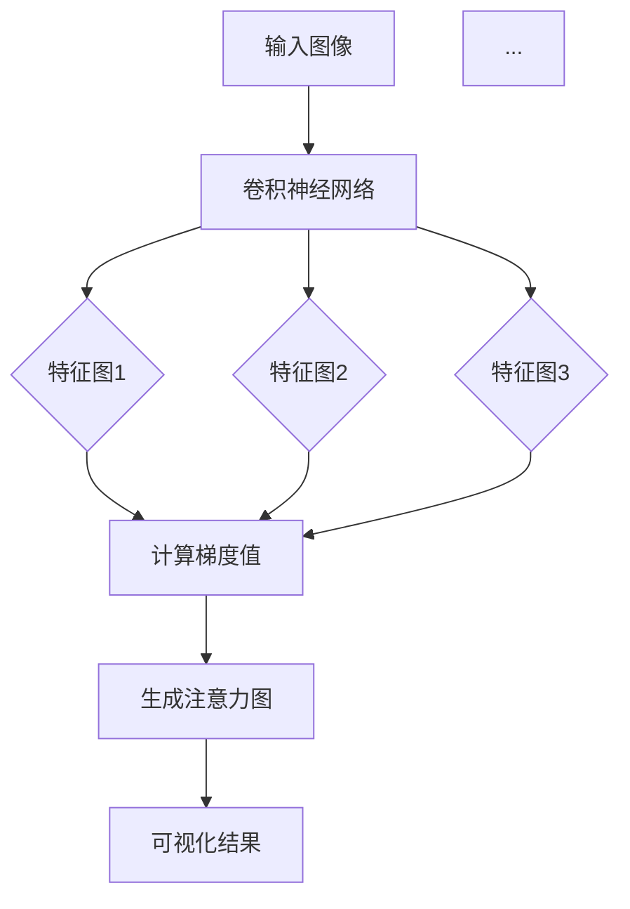
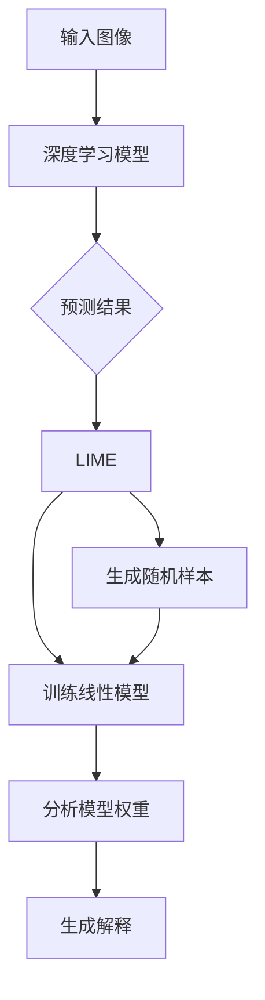
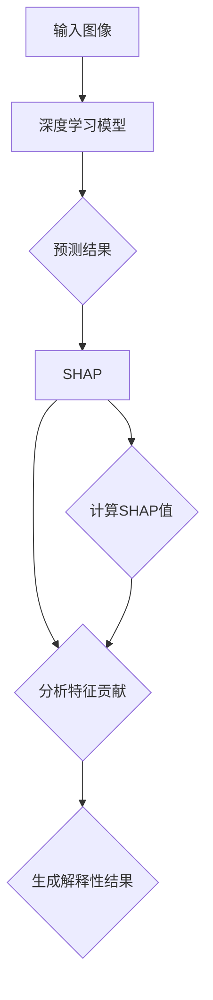
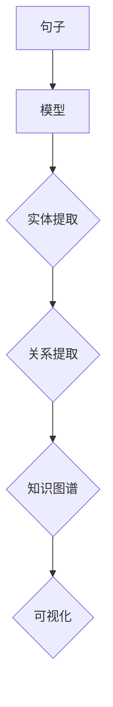
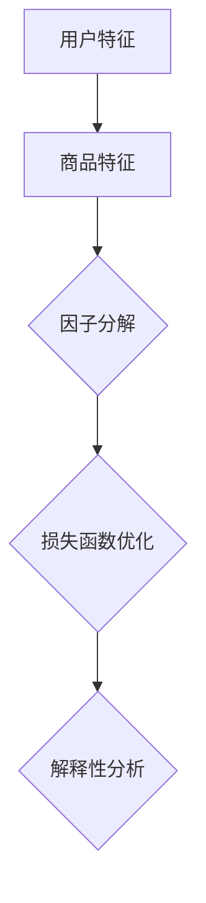
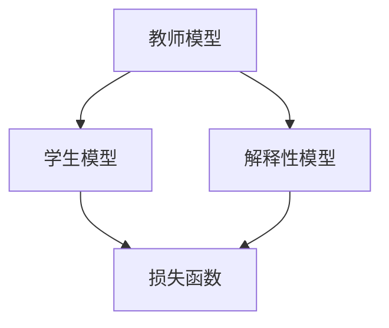

                 

## 文章标题

### 知识蒸馏与模型解释性的深度融合

在当今快速发展的计算机科学领域，人工智能技术已经成为推动创新的重要力量。然而，随着模型复杂度和数据量的不断增加，如何提高模型的性能和可解释性成为了研究人员和开发者关注的焦点。知识蒸馏（Knowledge Distillation）和模型解释性（Model Interpretability）作为两大关键技术，正逐步融合，为解决这一难题提供了新的思路和解决方案。

本文旨在深入探讨知识蒸馏与模型解释性的深度融合，通过一步步的分析和推理，阐述其在理论和实践中的重要性。我们将首先介绍知识蒸馏的基本概念、原理和算法，然后讨论模型解释性的定义、分类和评估方法。在此基础上，我们将探讨知识蒸馏与模型解释性的结合点及其面临的挑战，并详细分析融合的方法和应用案例。最后，我们将通过实际案例解析和代码解读，展示知识蒸馏与模型解释性深度融合的实际应用效果。

关键词：知识蒸馏，模型解释性，深度融合，算法，应用案例，代码解读

摘要：本文首先介绍了知识蒸馏的基本概念、原理和算法，以及模型解释性的定义、分类和评估方法。接着，深入探讨了知识蒸馏与模型解释性的结合点及其面临的挑战，分析了深度融合的方法和应用案例。最后，通过实际案例解析和代码解读，展示了知识蒸馏与模型解释性深度融合的实际应用效果。本文的目标是帮助读者全面了解这一领域的前沿技术和应用，为未来的研究和实践提供指导。

### 目录大纲

## 第一部分：知识蒸馏基础

### 1. 知识蒸馏的基本概念

- **1.1 知识蒸馏的定义与背景**
  - **知识蒸馏的定义**
  - **知识蒸馏的发展背景**

- **1.2 知识蒸馏的目标与优势**
  - **知识蒸馏的目标**
  - **知识蒸馏的优势**

- **1.3 知识蒸馏的应用领域**
  - **计算机视觉**
  - **自然语言处理**
  - **医疗诊断**

### 2. 知识蒸馏的原理

- **2.1 原生模型的训练**
  - **原生模型的训练过程**
  - **原生模型的评估指标**

- **2.2 蒸馏过程的模型结构**
  - **教练网络与学生网络**
  - **模型结构的选择**

- **2.3 蒸馏过程的损失函数**
  - **蒸馏损失函数的设计**
  - **蒸馏损失函数的优化策略**

### 3. 知识蒸馏的算法

- **3.1 模型压缩算法概述**
  - **模型压缩算法的基本概念**
  - **模型压缩算法的目标**

- **3.2 知识蒸馏算法的分类**
  - **教练网络与学生网络**
  - **基于软目标的蒸馏**
  - **基于硬目标的蒸馏**

- **3.3 知识蒸馏的优化策略**
  - **损失函数优化**
  - **模型参数调整**

### 4. 知识蒸馏中的挑战与解决方案

- **4.1 模型容量与解释性之间的平衡**
  - **模型容量与解释性的关系**
  - **平衡模型容量与解释性的方法**

- **4.2 数据多样性与模型稳定性的挑战**
  - **数据多样性的重要性**
  - **提高模型稳定性的方法**

- **4.3 模型压缩与解释性之间的权衡**
  - **模型压缩的影响**
  - **提高解释性的方法**

## 第二部分：模型解释性基础

### 1. 模型解释性的基本概念

- **1.1 模型解释性的定义**
  - **模型解释性的含义**
  - **模型解释性的重要性**

- **1.2 模型解释性的重要性**
  - **提升决策可解释性**
  - **增强模型透明度**
  - **改进模型信任度**

- **1.3 模型解释性的分类**
  - **局部解释性方法**
  - **全局解释性方法**
  - **结构化解释性方法**

### 2. 模型解释性的技术方法

- **2.1 模型依赖性分析方法**
  - **依赖性分析的基本概念**
  - **依赖性分析的方法**

- **2.2 局部解释性方法**
  - **Grad-CAM**
  - **LIME**
  - **SHAP**

- **2.3 结构化解释性方法**
  - **知识图谱**
  - **因子分解机**

### 3. 模型解释性的评估

- **3.1 解释性评估的指标**
  - **评估指标的定义**
  - **评估指标的选择**

- **3.2 解释性评估的挑战**
  - **评估方法的选择**
  - **评估指标的可靠性**

- **3.3 解释性评估的方法与工具**
  - **评估方法概述**
  - **评估工具的应用**

## 第三部分：知识蒸馏与模型解释性的融合

### 1. 知识蒸馏与模型解释性的结合

- **1.1 融合的目标与动机**
  - **融合的目标**
  - **融合的动机**

- **1.2 融合的基本框架**
  - **融合框架的组成**
  - **融合框架的设计**

- **1.3 融合的挑战与解决方案**
  - **挑战分析**
  - **解决方案探讨**

### 2. 深度融合的方法

- **2.1 融合模型的设计**
  - **模型设计思路**
  - **模型设计步骤**

- **2.2 融合损失函数的设计**
  - **损失函数的设计原则**
  - **多任务损失函数的设计**

- **2.3 融合训练的策略**
  - **训练策略的选择**
  - **训练策略的优化**

### 3. 深度融合的应用案例

- **3.1 诊断医疗图像分析**
  - **案例背景**
  - **案例分析**

- **3.2 金融市场预测**
  - **案例背景**
  - **案例分析**

- **3.3 自然语言处理**
  - **案例背景**
  - **案例分析**

### 4. 深度融合的未来发展趋势

- **4.1 新的模型结构设计**
  - **模型结构创新**
  - **设计思路**

- **4.2 跨学科研究的发展**
  - **跨学科研究的意义**
  - **研究进展**

- **4.3 深度融合在新兴领域的应用**
  - **新兴领域应用**
  - **应用前景**

## 第四部分：实战与案例

### 1. 实战环境搭建

- **1.1 训练环境的配置**
  - **硬件环境**
  - **软件环境**

- **1.2 解释性工具的安装**
  - **工具选择**
  - **安装步骤**

- **1.3 融合模型的实现**
  - **模型实现流程**
  - **实现步骤**

### 2. 实际案例解析

- **2.1 案例一：图像分类与解释性融合**
  - **数据预处理**
  - **模型训练与评估**
  - **解释性分析**

- **2.2 案例二：文本分析中的知识蒸馏与解释性融合**
  - **数据集选择与预处理**
  - **模型设计与实现**
  - **解释性分析与评估**

### 3. 代码解读与分析

- **3.1 知识蒸馏代码实现**
  - **代码实现思路**
  - **代码解读**

- **3.2 模型解释性代码实现**
  - **代码实现思路**
  - **代码解读**

- **3.3 融合模型的代码解读**
  - **代码解读**
  - **优化策略**

- **3.4 案例代码解读与分析**
  - **代码解读**
  - **分析结果**

## 附录

### 1. 工具与资源

- **1.1 深度学习框架对比**
  - **1.1.1 TensorFlow**
  - **1.1.2 PyTorch**
  - **1.1.3 其他常用框架**

- **1.2 解释性工具使用指南**
  - **工具选择**
  - **使用方法**

### 2. 参考文献

- **引用的相关研究和推荐阅读材料**

## 总结

### 1. 主要内容回顾

- **知识蒸馏与模型解释性的基本概念和原理**
- **深度融合的方法与应用案例**
- **实战与案例解析**

### 2. 总结与展望

- **知识蒸馏与模型解释性的深度融合的重要性**
- **未来的发展趋势和研究方向**

## 作者

### 1. 联系方式

- **电子邮箱：** [example@email.com](mailto:example@email.com)
- **个人博客：** [www.exampleblog.com](http://www.exampleblog.com)

- **机构：** AI天才研究院（AI Genius Institute）
- **著作：** 《禅与计算机程序设计艺术》（Zen And The Art of Computer Programming）


### 第一部分：知识蒸馏基础

#### 1.1 知识蒸馏的定义与背景

**知识蒸馏**（Knowledge Distillation）是一种模型压缩技术，旨在将一个复杂、高容量模型（通常称为“教练网络”或“教师模型”）的知识和特征提取能力转移到一个较小的、低容量的模型（通常称为“学生网络”或“学生模型）中。这种转移过程使得学生模型能够在保持相似性能的前提下显著减小模型大小和计算复杂度，从而在实际应用中更为高效和资源友好。

**知识蒸馏的发展背景**可以追溯到深度学习模型的快速发展。随着卷积神经网络（CNN）和循环神经网络（RNN）等深度学习模型在图像识别、语音识别和自然语言处理等领域的成功应用，模型的复杂度和计算需求也不断增长。这不仅对计算资源提出了更高的要求，也限制了模型在实际应用中的推广。因此，研究人员开始探索如何降低模型的大小和计算复杂度，同时保持或提升模型的性能。

知识蒸馏的概念最初由Hinton等人在2015年提出，他们通过一种将教师模型和教师模型输出作为学生模型输入的方法，成功地将一个大型卷积神经网络（CIFAR-10分类任务中的AlexNet）蒸馏到一个小型网络中。这种方法不仅显著减少了模型的参数数量，还保持了较高的分类准确率，从而为知识蒸馏技术的广泛应用奠定了基础。

#### 1.2 知识蒸馏的目标与优势

**知识蒸馏的目标**主要包括两个方面：

1. **性能保持**：通过知识蒸馏，学生模型需要能够在保持教师模型性能的前提下，实现较低的参数数量和计算复杂度。
2. **效率提升**：在保证性能的前提下，通过压缩模型大小和降低计算复杂度，提高模型在实际应用中的效率和可部署性。

**知识蒸馏的优势**主要体现在以下几个方面：

1. **模型压缩**：知识蒸馏通过将复杂模型的知识转移到较小模型中，有效减少了模型的参数数量和计算复杂度，从而实现模型压缩。
2. **计算效率提升**：较小的学生模型在推理过程中需要的计算资源更少，推理速度更快，适用于资源受限的环境。
3. **迁移学习**：知识蒸馏不仅可以在同一任务的不同模型之间进行，还可以在不同任务之间进行迁移，从而提高模型在不同领域中的适用性。
4. **数据隐私保护**：通过将复杂模型的知识转移到较小模型中，可以减少对原始数据的依赖，有助于保护用户数据隐私。

例如，在智能手机等移动设备上，由于计算资源和存储空间的限制，使用知识蒸馏技术可以实现高性能模型的部署，提高用户体验。此外，在医疗领域，通过知识蒸馏技术，可以将大型医学图像诊断模型压缩并部署到移动设备上，实现快速、准确的数据处理和诊断。

#### 1.3 知识蒸馏的应用领域

知识蒸馏技术在多个领域都展现出了显著的应用潜力，以下是一些主要的应用领域：

1. **计算机视觉**：在图像分类、目标检测和图像分割等任务中，知识蒸馏技术可以有效降低模型大小和计算复杂度，同时保持较高的性能。例如，在人脸识别系统中，通过知识蒸馏可以将大型卷积神经网络模型压缩到可以部署在移动设备上的规模。
2. **自然语言处理**：在自然语言处理任务中，知识蒸馏技术可以用于将大型语言模型压缩到较小模型，从而提高处理效率和可部署性。例如，在机器翻译中，通过知识蒸馏可以将大规模的翻译模型压缩到可以部署在边缘设备上的模型，实现实时翻译功能。
3. **语音识别**：知识蒸馏技术在语音识别任务中也有广泛应用。通过将大型语音识别模型压缩到较小模型，可以提高语音识别的实时性和准确性，适用于实时语音交互场景。
4. **医疗诊断**：在医学图像诊断中，知识蒸馏技术可以将大型医学图像诊断模型压缩并部署到医疗设备上，实现快速、准确的疾病诊断。例如，通过知识蒸馏技术，可以将复杂的癌症检测模型压缩到可以部署在便携式设备上的规模，提高医疗诊断的便捷性和准确性。

总之，知识蒸馏技术通过有效降低模型大小和计算复杂度，提高了模型在资源受限环境中的效率和可部署性，为多个领域的应用提供了新的解决方案。

#### 2.1 原生模型的训练

**原生模型的训练**是知识蒸馏过程的基础。在这一过程中，教练网络（Teacher Network）通过对大量训练数据的学习，逐渐提取出有效特征和知识，从而形成高精度的模型。这一过程通常包括以下几个关键步骤：

1. **数据准备**：首先，需要准备大量的训练数据，这些数据应具备多样性和代表性。数据集可以从公开数据集（如ImageNet、COCO等）或特定领域的数据集中获取。为了确保训练过程的稳定性和鲁棒性，可以使用数据增强技术（如随机裁剪、旋转、翻转等）对数据集进行预处理。

2. **模型初始化**：选择一个合适的模型架构（如卷积神经网络、循环神经网络等）并进行初始化。初始化的目的是使模型的参数在训练过程中能够有效地探索数据空间，避免陷入局部最优。常用的初始化方法包括随机初始化、高斯初始化和Xavier初始化等。

3. **损失函数设计**：设计一个合适的损失函数以衡量模型在训练过程中的性能。在计算机视觉任务中，常用的损失函数包括交叉熵损失（Cross-Entropy Loss）和均方误差损失（Mean Squared Error Loss）。在自然语言处理任务中，常用的损失函数包括交叉熵损失和泊松损失（Poisson Loss）。

4. **优化算法选择**：选择一个合适的优化算法以更新模型参数。常用的优化算法包括随机梯度下降（SGD）、Adam和RMSprop等。这些优化算法通过不断调整模型参数，使模型在训练过程中能够逐步优化性能。

5. **训练过程**：在训练过程中，教练网络通过不断迭代地更新参数，逐渐逼近最佳模型。训练过程通常包括多个epoch（迭代周期），每个epoch中模型会根据训练数据计算损失函数并更新参数。在训练过程中，可以使用验证集来监控模型的性能，防止过拟合现象。

6. **性能评估**：在训练完成后，使用测试集对模型进行性能评估。常用的评估指标包括准确率（Accuracy）、召回率（Recall）、精确率（Precision）和F1分数（F1 Score）等。通过这些指标，可以全面了解模型的性能表现。

**教练网络的性能表现**是知识蒸馏成功的关键。一个性能良好的教练网络能够在训练过程中提取到有效的特征和知识，从而为学生网络提供高质量的指导。例如，在图像分类任务中，教练网络需要能够准确地识别和分类各种图像，以传递有效的特征信息给学生网络。

在实际应用中，原生模型的训练通常需要大量的计算资源和时间。为了提高训练效率，可以采用分布式训练、并行计算和GPU加速等技术。此外，通过引入迁移学习技术，可以利用预训练的模型（Pre-trained Model）来加速训练过程，从而提高模型性能。

总之，原生模型的训练是知识蒸馏过程中的重要环节，通过合理的数据准备、模型初始化、损失函数设计、优化算法选择和性能评估，可以构建出性能优秀的教练网络，为知识蒸馏的后续步骤提供坚实的基础。

#### 2.2 蒸馏过程的模型结构

知识蒸馏过程中，模型结构的设计至关重要，因为它决定了知识从教师模型到学生模型传递的有效性和效率。在这个部分，我们将详细讨论教师模型和学生模型的结构，以及选择这些结构时需要考虑的关键因素。

**2.2.1 教师模型和学生模型**

教师模型（Teacher Network）通常是原始的、较大的模型，它在训练过程中学习到了丰富的特征和知识。学生模型（Student Network）是较小的模型，其目的是继承教师模型的知识并保持相似的预测性能。

**教师模型**通常由多个层次组成，包括卷积层、池化层和全连接层等。这些层次通过逐层提取特征，从底层感知器到高层次语义表示，形成了一个层次化的特征提取结构。教师模型的目标是通过学习大量的训练数据，获得对数据分布的深入了解。

**学生模型**的结构相对简单，旨在通过知识蒸馏过程，将教师模型的丰富知识压缩到较少的参数中。学生模型通常包含几个简单的全连接层或卷积层，以便于快速计算和部署。学生模型的设计需要平衡模型的容量和性能，既要保证模型能够有效地继承教师模型的知识，又要尽量减少模型的复杂度。

**2.2.2 教师模型和学生模型的结构选择**

选择教师模型和学生模型的结构时，需要考虑以下几个关键因素：

1. **任务类型**：不同的任务类型可能需要不同类型的模型结构。例如，对于图像分类任务，可以使用卷积神经网络（CNN）或类似ResNet等深度网络；对于自然语言处理任务，可以使用Transformer或BERT等模型。

2. **数据集规模**：如果数据集规模较大，可以选择较大的教师模型，以便更好地学习数据中的特征；如果数据集规模较小，可以选择较小的教师模型，以防止过拟合。

3. **计算资源**：教师模型通常需要更多的计算资源和时间进行训练，因此需要根据可用的计算资源来选择合适的模型结构。例如，在资源受限的环境中，可能需要选择较小的模型结构。

4. **目标性能**：选择模型结构时，需要考虑目标性能指标。如果目标是保持较高的预测准确率，可以选择更复杂的模型结构；如果目标是实现快速推理，可以选择更简单的模型结构。

**示例结构**：

以下是一个简单的示例结构，用于图像分类任务：

**教师模型（ResNet-50）**：
- 输入层：图像维度（224x224x3）
- 卷积层：卷积（64个3x3卷积核，ReLU激活函数，步长1， padding 'SAME'）
- 池化层：最大池化（2x2，步长2）
- 卷积层：卷积（128个3x3卷积核，ReLU激活函数，步长1， padding 'SAME'）
- 池化层：最大池化（2x2，步长2）
- ...（继续增加卷积层和池化层，直到达到50层）
- 全连接层：输出层（1024个神经元，ReLU激活函数）
- 全连接层：输出层（10个神经元，无激活函数，用于分类）

**学生模型（LeNet）**：
- 输入层：图像维度（224x224x3）
- 卷积层：卷积（6个3x3卷积核，ReLU激活函数，步长1， padding 'SAME'）
- 池化层：最大池化（2x2，步长2）
- 卷积层：卷积（16个3x3卷积核，ReLU激活函数，步长1， padding 'SAME'）
- 池化层：最大池化（2x2，步长2）
- 全连接层：输出层（120个神经元，ReLU激活函数）
- 全连接层：输出层（84个神经元，ReLU激活函数）
- 全连接层：输出层（10个神经元，无激活函数，用于分类）

在这个示例中，教师模型是一个较大的卷积神经网络（ResNet-50），而学生模型是一个较小的卷积神经网络（LeNet），通过知识蒸馏过程，学生模型可以学习到教师模型的特征提取能力，并在保持相似性能的前提下，实现模型的压缩。

总之，知识蒸馏过程中的模型结构设计需要综合考虑任务类型、数据集规模、计算资源和目标性能等因素，以选择适合的模型结构。通过合理设计教师模型和学生模型的结构，可以有效地实现知识的传递和模型的压缩，为实际应用提供高效的解决方案。

#### 2.3 蒸馏过程的损失函数

在知识蒸馏过程中，损失函数的设计和优化至关重要，因为它直接影响了学生模型对教师模型知识的吸收效果。蒸馏过程中的损失函数通常包括两部分：一部分是学生模型对教师模型输出的软标签（soft label）进行学习的损失，另一部分是学生模型对原始标签（硬标签，hard label）进行学习的损失。以下是详细讨论：

**2.3.1 蒸馏损失函数的设计**

1. **软标签损失**：软标签是由教师模型在训练过程中输出的概率分布。这些概率分布代表了教师模型对每个样本的预测结果。学生模型的目标是学习到这些概率分布，以便在测试阶段能够进行准确的预测。常用的软标签损失函数包括交叉熵损失（Cross-Entropy Loss）和Kullback-Leibler散度（Kullback-Leibler Divergence，KL Divergence）。

   - **交叉熵损失**：交叉熵损失函数用于衡量两个概率分布之间的差异。对于学生模型和学生模型的预测分布 $p$ 和教师模型的真实分布 $q$，交叉熵损失可以表示为：
     $$ 
     L_{soft} = -\sum_{i=1}^{N}\sum_{j=1}^{C} q_{ij} \log p_{ij}
     $$
     其中 $N$ 是样本数量，$C$ 是类别数量，$q_{ij}$ 和 $p_{ij}$ 分别是教师模型和学生模型在类别 $j$ 上的概率。

   - **KL 散度**：KL 散度也是一种衡量两个概率分布差异的指标，其公式为：
     $$ 
     D_{KL}(q||p) = \sum_{i=1}^{N}\sum_{j=1}^{C} q_{ij} \log \frac{q_{ij}}{p_{ij}}
     $$
     其中 $q$ 是教师模型的分布，$p$ 是学生模型的分布。

2. **硬标签损失**：硬标签是训练数据中实际的标签。学生模型在训练过程中还需要对硬标签进行学习，以确保在预测阶段能够准确分类。常用的硬标签损失函数包括交叉熵损失和均方误差损失（Mean Squared Error Loss）。

   - **交叉熵损失**：与软标签损失类似，硬标签的交叉熵损失可以表示为：
     $$ 
     L_{hard} = -\sum_{i=1}^{N}\sum_{j=1}^{C} y_{ij} \log p_{ij}
     $$
     其中 $y_{ij}$ 是硬标签，表示样本 $i$ 属于类别 $j$。

   - **均方误差损失**：在回归任务中，常用的均方误差损失可以表示为：
     $$ 
     L_{MSE} = \frac{1}{N} \sum_{i=1}^{N} (y_i - \hat{y}_i)^2
     $$
     其中 $y_i$ 是硬标签，$\hat{y}_i$ 是学生模型的预测值。

**2.3.2 蒸馏损失函数的优化策略**

在知识蒸馏过程中，损失函数的优化策略决定了模型参数更新的方向和速度。以下是一些常见的优化策略：

1. **平衡损失**：为了同时优化学生模型对软标签和硬标签的学习，可以将软标签损失和硬标签损失进行加权平均。常见的平衡策略包括：
   $$ 
   L = \lambda L_{soft} + (1-\lambda) L_{hard}
   $$
   其中 $\lambda$ 是平衡参数，通常通过交叉验证选择。

2. **动态调整平衡参数**：在训练过程中，随着学生模型性能的提升，可以动态调整平衡参数 $\lambda$。例如，在模型性能达到一定阈值时，增加软标签损失的权重，以进一步提高学生模型的特征提取能力。

3. **多步蒸馏**：在训练过程中，可以采用多步蒸馏策略，逐步增加软标签损失的权重。这样，学生模型在早期阶段主要学习硬标签，随着训练的进行，逐步引入软标签，从而提高模型的整体性能。

4. **正则化**：在损失函数中添加正则化项，可以防止模型过拟合。常用的正则化项包括权重衰减（Weight Decay）和Dropout等。

5. **自适应学习率**：使用自适应学习率策略（如Adam、RMSprop等），可以调整模型参数更新的速度，提高训练效果。

**示例优化策略**：

以下是一个简单的优化策略示例，用于图像分类任务：

- 软标签损失权重：$L_{soft}$ 占比 0.7
- 硬标签损失权重：$L_{hard}$ 占比 0.3
- 动态调整平衡参数 $\lambda$：在训练前 50 个 epoch 中，$\lambda$ 从 0 逐渐增加到 1；在接下来的 50 个 epoch 中，保持 $\lambda$ 为 1。

优化策略可以表示为：
$$ 
L = 0.7 \cdot L_{soft} + 0.3 \cdot L_{hard}
$$

$$ 
\lambda(t) =
\begin{cases}
0 & \text{if } t < 50 \\
1 & \text{if } t \geq 50
\end{cases}
$$

通过合理的损失函数设计和优化策略，可以有效地实现知识从教师模型到学生模型的传递，提高学生模型的性能和可解释性。在实际应用中，根据具体任务和数据特点，可以选择和调整合适的损失函数和优化策略。

#### 3.1 模型压缩算法概述

**模型压缩**（Model Compression）是深度学习领域中的一项关键技术，旨在通过减少模型参数数量和计算复杂度，实现模型的轻量化和高效部署。模型压缩技术不仅能够降低计算资源的消耗，还能提高模型的实时性能和可部署性，因此在智能手机、嵌入式设备和物联网等资源受限的环境中具有重要的应用价值。

**模型压缩的目标**主要包括：

1. **参数数量减少**：通过减少模型中的参数数量，降低模型的复杂度，从而减小模型的存储空间和计算成本。
2. **计算复杂度降低**：通过简化模型结构和优化计算过程，减少模型在推理阶段所需的计算资源，提高模型的运行速度。
3. **性能保持**：在压缩模型的同时，保持或提升模型的性能，确保压缩后的模型在任务上的表现与原始模型相当。

**模型压缩算法的分类**主要包括以下几种：

1. **权重剪枝（Weight Pruning）**：权重剪枝是一种通过删除模型中不重要的权重来实现模型压缩的方法。在训练过程中，通过计算权重的绝对值或相对值，识别并删除那些绝对值或相对值较小的权重。剪枝后的模型参数数量显著减少，但模型的性能基本保持不变。

2. **量化（Quantization）**：量化是一种通过将浮点数权重转换为较低的精度整数来减小模型大小和计算复杂度的方法。量化可以显著降低模型的存储空间和计算资源需求，但可能引入量化误差，影响模型的性能。常用的量化方法包括整数量化、二进制量化、三值量化等。

3. **低秩分解（Low-Rank Factorization）**：低秩分解是一种通过将高维矩阵分解为低维矩阵来实现模型压缩的方法。通过将模型中的权重矩阵分解为两个或多个低秩矩阵的乘积，可以显著减少模型的参数数量和计算复杂度。常用的低秩分解方法包括奇异值分解（SVD）和随机低秩分解（Randomized Low-Rank Factorization）。

4. **知识蒸馏（Knowledge Distillation）**：知识蒸馏是一种通过将教师模型的知识转移到学生模型中来实现模型压缩的方法。教师模型通常是一个较大的、高容量的模型，而学生模型是一个较小的、低容量的模型。通过蒸馏过程，学生模型可以继承教师模型的有效特征提取能力，实现模型的压缩。

**模型压缩算法的优势**主要体现在以下几个方面：

1. **计算效率提升**：通过减少模型参数数量和计算复杂度，模型压缩算法能够显著提高模型的推理速度，降低计算资源的消耗，适用于实时应用场景。
2. **部署灵活性**：压缩后的模型可以更灵活地部署在资源受限的设备上，如智能手机、嵌入式系统和物联网设备，提高应用的普及性和用户体验。
3. **可解释性增强**：一些模型压缩算法，如知识蒸馏，不仅可以提高模型的性能，还能增强模型的可解释性，有助于理解模型的工作原理和决策过程。

**模型压缩算法的应用场景**主要包括：

1. **计算机视觉**：在图像分类、目标检测和图像分割等任务中，通过模型压缩技术，可以将大型卷积神经网络压缩到较小的规模，实现高效实时处理。
2. **自然语言处理**：在文本分类、机器翻译和语音识别等任务中，模型压缩技术有助于将大规模语言模型压缩到较小的规模，提高应用的部署效率和性能。
3. **医疗诊断**：在医学图像诊断中，通过模型压缩技术，可以将复杂医学图像模型压缩到较小的规模，实现快速、准确的疾病诊断。
4. **自动驾驶**：在自动驾驶系统中，通过模型压缩技术，可以将复杂的深度学习模型压缩到嵌入式设备中，提高系统的实时性和安全性。

总之，模型压缩算法通过减少模型参数数量和计算复杂度，提高了模型的计算效率和部署灵活性，为深度学习在资源受限环境中的应用提供了有力支持。随着计算技术和算法的不断进步，模型压缩技术将在更多领域得到广泛应用。

#### 3.2 知识蒸馏算法的分类

知识蒸馏算法在深度学习模型压缩中扮演着重要角色，通过将教师模型的丰富知识传递给学生模型，实现模型性能的保持的同时降低模型的大小和计算复杂度。根据传递知识的不同方式，知识蒸馏算法可以分为基于软目标和基于硬目标的蒸馏。下面我们将详细介绍这两种算法。

**3.2.1 教练网络与学生网络**

在知识蒸馏过程中，教师模型（Teacher Network）和学生模型（Student Network）是核心组成部分。教师模型是一个大型的、高容量模型，它在训练过程中学习到了丰富的特征和知识。学生模型是一个小型的、低容量模型，其目标是继承教师模型的知识，并在保持相似性能的前提下实现模型的压缩。

1. **教师模型**：通常由多个复杂的层组成，如卷积层、全连接层和池化层等，通过大量训练数据的学习，教师模型能够提取出具有高精度的特征表示。
2. **学生模型**：结构相对简单，通常包含较少的层和参数，其目的是通过知识蒸馏过程，将教师模型的知识和特征提取能力压缩到较小的规模。

**3.2.2 基于软目标的蒸馏**

基于软目标的蒸馏（Soft Target Distillation）是一种常见的知识蒸馏方法，通过将教师模型的输出概率分布作为软标签（soft label），传递给学生模型。学生模型在训练过程中，不仅需要学习硬标签（实际标签），还需要学习软标签，从而继承教师模型的特征提取能力。

1. **软标签的定义**：软标签是教师模型在训练阶段输出的概率分布，表示教师模型对每个样本的预测结果。与硬标签（实际标签）不同，软标签是一个概率分布，而不是一个具体的标签。

2. **损失函数的设计**：基于软目标的蒸馏通常使用软标签损失（Soft Label Loss）来衡量学生模型对教师模型软标签的学习效果。软标签损失函数可以是交叉熵损失（Cross-Entropy Loss）或Kullback-Leibler散度（KL Divergence）。

   - **交叉熵损失**：交叉熵损失函数用于衡量两个概率分布之间的差异，其公式为：
     $$
     L_{soft} = -\sum_{i=1}^{N}\sum_{j=1}^{C} y_{ij} \log p_{ij}
     $$
     其中 $N$ 是样本数量，$C$ 是类别数量，$y_{ij}$ 是软标签的概率分布，$p_{ij}$ 是学生模型的预测概率分布。

   - **KL 散度**：KL 散度也是一种衡量两个概率分布差异的指标，其公式为：
     $$
     L_{soft} = \sum_{i=1}^{N}\sum_{j=1}^{C} p_{ij} \log \frac{p_{ij}}{q_{ij}}
     $$
     其中 $p_{ij}$ 是学生模型的预测概率分布，$q_{ij}$ 是教师模型的软标签概率分布。

3. **优化策略**：在训练过程中，通过优化软标签损失函数，学生模型可以逐渐学习到教师模型的知识。常见的优化策略包括动态调整软标签损失权重、多步蒸馏和添加正则化项等。

**3.2.3 基于硬目标的蒸馏**

基于硬目标的蒸馏（Hard Target Distillation）是一种通过将教师模型的部分输出传递给学生模型来实现知识蒸馏的方法。与基于软目标的蒸馏不同，硬目标蒸馏不使用教师模型的输出概率分布，而是将教师模型的部分输出作为学生模型的训练目标。

1. **硬标签的定义**：硬标签是教师模型在训练阶段输出的具体标签，而不是概率分布。硬标签通常通过教师模型的全连接层或softmax层获得。

2. **损失函数的设计**：基于硬目标的蒸馏通常使用硬标签损失（Hard Label Loss）来衡量学生模型对教师模型硬标签的学习效果。硬标签损失函数可以是交叉熵损失或均方误差损失。

   - **交叉熵损失**：交叉熵损失函数用于衡量两个标签之间的差异，其公式为：
     $$
     L_{hard} = -\sum_{i=1}^{N} y_i \log \hat{y}_i
     $$
     其中 $y_i$ 是硬标签，$\hat{y}_i$ 是学生模型的预测标签。

   - **均方误差损失**：均方误差损失函数用于衡量预测值与实际值之间的差异，其公式为：
     $$
     L_{MSE} = \frac{1}{N} \sum_{i=1}^{N} (\hat{y}_i - y_i)^2
     $$

3. **优化策略**：在训练过程中，通过优化硬标签损失函数，学生模型可以逐渐学习到教师模型的知识。常见的优化策略包括动态调整硬标签损失权重、多步蒸馏和添加正则化项等。

**3.2.4 对比与选择**

基于软目标和基于硬目标的蒸馏各有优缺点，选择合适的蒸馏方法需要根据具体任务和模型特点进行权衡。

- **软目标蒸馏**：
  - **优点**：能够更好地保留教师模型的知识，提高学生模型的性能；适用于多分类问题。
  - **缺点**：训练过程中计算复杂度较高，软标签的获取可能需要额外的计算资源。

- **硬目标蒸馏**：
  - **优点**：训练过程相对简单，计算复杂度较低；适用于回归问题。
  - **缺点**：可能无法完全继承教师模型的知识，性能提升有限。

在实际应用中，可以根据任务需求、模型结构和数据特点，选择合适的蒸馏方法。例如，对于多分类任务，可以采用基于软目标的蒸馏方法；对于回归任务，可以采用基于硬目标的蒸馏方法。

总之，知识蒸馏算法通过将教师模型的知识传递给学生模型，实现模型性能的保持和压缩。基于软目标和基于硬目标的蒸馏方法各有优缺点，选择合适的蒸馏方法对于实现高效的知识蒸馏至关重要。

#### 3.3 知识蒸馏的优化策略

知识蒸馏作为深度学习模型压缩的关键技术，其优化策略对蒸馏效果具有重要影响。在训练过程中，通过合理的优化策略，可以提升学生模型的性能，同时减少模型的复杂度和计算资源消耗。以下是几种常见的优化策略：

**3.3.1 损失函数优化**

损失函数是知识蒸馏的核心，决定了学生模型的学习方向。常见的损失函数包括软标签损失、硬标签损失以及两者组合的多任务损失函数。

1. **软标签损失**：软标签损失函数用于衡量学生模型对教师模型软标签的学习效果。常用的软标签损失函数包括交叉熵损失和KL散度。

   - **交叉熵损失**：交叉熵损失函数公式如下：
     $$
     L_{soft} = -\sum_{i=1}^{N}\sum_{j=1}^{C} y_{ij} \log p_{ij}
     $$
     其中 $y_{ij}$ 是教师模型的软标签概率分布，$p_{ij}$ 是学生模型的预测概率分布。

   - **KL散度**：KL散度损失函数公式如下：
     $$
     L_{soft} = \sum_{i=1}^{N}\sum_{j=1}^{C} p_{ij} \log \frac{p_{ij}}{q_{ij}}
     $$
     其中 $q_{ij}$ 是教师模型的软标签概率分布。

2. **硬标签损失**：硬标签损失函数用于衡量学生模型对实际硬标签的学习效果。常用的硬标签损失函数包括交叉熵损失和均方误差损失。

   - **交叉熵损失**：交叉熵损失函数公式如下：
     $$
     L_{hard} = -\sum_{i=1}^{N} y_i \log \hat{y}_i
     $$
     其中 $y_i$ 是硬标签，$\hat{y}_i$ 是学生模型的预测标签。

   - **均方误差损失**：均方误差损失函数公式如下：
     $$
     L_{MSE} = \frac{1}{N} \sum_{i=1}^{N} (\hat{y}_i - y_i)^2
     $$

3. **多任务损失函数**：为了同时优化软标签和硬标签的学习，可以设计多任务损失函数，将软标签损失和硬标签损失进行加权组合。常见的多任务损失函数公式如下：
   $$
   L = \lambda L_{soft} + (1-\lambda) L_{hard}
   $$
   其中 $\lambda$ 是平衡参数，通过交叉验证选择合适的值。

**3.3.2 模型参数调整**

模型参数调整是优化知识蒸馏过程的重要手段，通过调整模型参数，可以提升模型性能和蒸馏效果。

1. **教师模型和学生模型的参数初始化**：合理的参数初始化有助于模型快速收敛。常用的参数初始化方法包括随机初始化、高斯初始化和Xavier初始化。

2. **学习率调整**：学习率是优化过程中调整模型参数的关键参数。常用的学习率调整方法包括固定学习率、自适应学习率（如Adam、RMSprop）和分步学习率调整。

3. **权重衰减**：权重衰减是一种常用的正则化方法，通过在损失函数中添加权重衰减项，可以防止模型过拟合。权重衰减公式如下：
   $$
   L = L_{base} + \lambda \sum_{w \in W} w^2
   $$
   其中 $L_{base}$ 是基本损失函数，$W$ 是模型权重，$\lambda$ 是权重衰减系数。

**3.3.3 蒸馏过程优化**

在知识蒸馏过程中，通过优化蒸馏过程，可以提升模型压缩效果。

1. **动态平衡软标签和硬标签损失**：在训练过程中，随着学生模型性能的提升，可以动态调整软标签和硬标签损失的权重。常见的策略包括：
   - **前几个epoch主要优化硬标签损失**：初始阶段，学生模型性能较低，主要通过优化硬标签损失提升模型性能。
   - **后续epoch逐渐增加软标签损失权重**：随着模型性能提升，逐步增加软标签损失权重，使学生模型更好地继承教师模型的知识。

2. **多步蒸馏**：多步蒸馏是一种通过逐步增加软标签损失权重来优化模型的方法。常见的多步蒸馏策略包括：
   - **固定步数蒸馏**：在固定步数（如50个epoch）内，逐步增加软标签损失权重。
   - **动态步数蒸馏**：根据模型性能动态调整步数，当模型性能达到一定阈值时，增加软标签损失权重。

3. **引入正则化项**：在损失函数中引入正则化项，可以防止模型过拟合。常用的正则化方法包括Dropout、DropConnect和权重衰减等。

**3.3.4 实践案例**

以下是一个简单的知识蒸馏优化策略案例：

1. **模型结构**：使用ResNet-50作为教师模型，使用LeNet作为学生模型。
2. **损失函数**：采用交叉熵损失和KL散度组合的多任务损失函数：
   $$
   L = 0.7 \cdot L_{soft} + 0.3 \cdot L_{hard}
   $$
3. **参数初始化**：采用Xavier初始化方法。
4. **学习率调整**：初始学习率为0.001，使用Adam优化器。
5. **蒸馏过程**：
   - 前20个epoch主要优化硬标签损失，逐步增加软标签损失权重。
   - 后30个epoch主要优化软标签损失，同时保持硬标签损失的适当权重。
   - 引入Dropout（概率为0.5）和权重衰减（系数为0.0001）。

通过上述优化策略，可以显著提升学生模型的性能，实现高效的模型压缩。在实际应用中，根据任务和数据特点，可以调整优化策略，以实现最佳蒸馏效果。

总之，通过合理的损失函数优化、模型参数调整和蒸馏过程优化，可以提升知识蒸馏的效果，实现模型压缩的同时保持性能。随着深度学习技术的不断发展，知识蒸馏优化策略将不断完善，为模型压缩和应用提供更多可能。

#### 4.1 模型容量与解释性之间的平衡

在深度学习领域，模型容量（Model Capacity）和解释性（Interpretability）之间的平衡是一个关键问题。模型容量决定了模型能够学习的复杂度和泛化能力，而解释性则涉及到模型决策过程的透明度和可理解性。在实际应用中，如何在这两者之间取得平衡，是深度学习研究和实践中的一大挑战。

**4.1.1 模型容量与解释性的关系**

模型容量通常通过模型结构（如层数、神经元数量、参数规模等）来衡量。一个高容量模型可以捕捉数据中的复杂特征和模式，从而在训练数据上表现出更高的性能。然而，高容量模型往往伴随着复杂的内部结构和难以解释的决策过程，降低了模型的可解释性。相反，低容量模型虽然解释性较好，但可能无法充分捕捉数据中的复杂模式，导致性能不佳。

1. **高容量模型**：能够捕捉到数据中的复杂特征，提高模型的泛化能力。但过高的容量可能导致模型过拟合，难以解释其决策过程。
2. **低容量模型**：解释性较好，但可能无法捕捉到数据中的复杂模式，导致泛化能力不足。

**4.1.2 平衡模型容量与解释性的方法**

为了在模型容量和解释性之间取得平衡，研究者们提出了一系列方法，包括：

1. **简化模型结构**：通过减少模型层数、神经元数量和参数规模，可以降低模型的复杂度，提高解释性。例如，使用轻量级网络架构（如MobileNet、ShuffleNet等）可以实现高效的特征提取，同时保持较好的解释性。
2. **正则化技术**：通过引入正则化项（如L1、L2正则化），可以减少模型参数的数量，从而降低模型的容量。这种方法在保持模型性能的同时，提高了模型的可解释性。
3. **注意力机制**：注意力机制（Attention Mechanism）通过关注模型中重要的特征，可以增强模型的可解释性。例如，在自然语言处理任务中，使用注意力机制可以明确指出模型在预测时关注的单词或短语。
4. **模型压缩技术**：通过模型压缩技术（如知识蒸馏、剪枝、量化等），可以在保持模型性能的同时，显著减少模型的大小和复杂度，从而提高解释性。
5. **后训练解释性方法**：在模型训练完成后，通过使用后训练解释性方法（如 Grad-CAM、LIME、SHAP等），可以提供模型决策过程的可视化解释，提高模型的可理解性。

**4.1.3 应用实例**

在实际应用中，模型容量与解释性的平衡是一个动态的过程，需要根据具体任务和数据特点进行调整。

1. **图像分类**：在图像分类任务中，可以使用ResNet等高容量模型来捕捉图像的复杂特征。然而，为了提高解释性，可以结合注意力机制，通过可视化注意力图来展示模型关注的区域。
2. **医学诊断**：在医学诊断任务中，模型需要具备较高的泛化能力，同时医生需要理解模型的决策过程。因此，可以采用轻量级网络架构（如MobilenetV3）来平衡模型容量与解释性，并结合Grad-CAM等解释性工具，帮助医生理解模型的决策依据。
3. **自然语言处理**：在自然语言处理任务中，如文本分类和情感分析，可以使用BERT等大规模预训练模型。为了提高解释性，可以使用LIME等局部解释性方法，通过生成与模型决策相似的小样本，来分析模型在特定输入上的决策过程。

**总结**

模型容量与解释性之间的平衡是深度学习领域的一个关键问题。通过简化模型结构、引入正则化技术、注意力机制、模型压缩技术以及后训练解释性方法，可以在保持模型性能的同时，提高模型的可解释性。在实际应用中，根据具体任务和数据特点，灵活调整模型容量与解释性的平衡，是实现高效、可靠和可解释的深度学习模型的关键。

#### 4.2 数据多样性与模型稳定性的挑战

在深度学习应用中，数据多样性和模型稳定性是两个至关重要的因素。数据多样性指的是训练数据在特征和标签上的丰富性，而模型稳定性则是指模型在处理不同输入时能够保持一致的性能表现。以下将详细讨论这两个因素在知识蒸馏和模型解释性结合过程中的挑战，并探讨相应的解决方案。

**4.2.1 数据多样性的重要性**

数据多样性对于模型的训练和泛化能力具有直接影响。一个高度多样化的训练数据集可以帮助模型更好地捕捉到输入数据的潜在特征和模式，从而在未知数据上表现出更好的泛化性能。然而，在实际应用中，数据多样性面临着诸多挑战：

1. **数据不足**：某些领域（如医疗图像诊断、金融数据预测等）可能缺乏足够的训练数据，导致模型在训练过程中无法充分学习到多样的特征和模式。
2. **数据不平衡**：在某些任务中，正负样本分布不均衡，导致模型在训练过程中对少数类别的泛化能力不足。
3. **数据质量**：数据中的噪声、错误和缺失值会影响模型的训练效果，降低模型的稳定性。

**4.2.2 数据多样性与模型稳定性的挑战**

在知识蒸馏过程中，数据多样性和模型稳定性面临着以下挑战：

1. **模型性能波动**：由于数据多样性不足，模型在训练过程中可能会对某些特定类型的样本产生过拟合现象，导致模型在测试集上的性能波动。这种波动会影响模型的泛化能力和稳定性。
2. **模型泛化能力下降**：缺乏多样性的训练数据可能导致模型在遇到未知数据时，无法准确预测，降低模型的泛化能力。这会直接影响知识蒸馏的效果，学生模型可能无法充分学习到教师模型的特征提取能力。
3. **解释性不足**：在知识蒸馏过程中，如果训练数据多样性不足，模型可能无法提供足够的解释性。这会导致模型决策过程难以理解，影响用户对模型的信任度。

**4.2.3 提高模型稳定性的方法**

为了应对数据多样性和模型稳定性的挑战，可以采取以下方法：

1. **数据增强**：通过图像旋转、缩放、裁剪、颜色调整等数据增强技术，可以增加训练数据的多样性，帮助模型学习到更多样的特征。例如，在计算机视觉任务中，可以使用随机裁剪和翻转来增加图像数据的多样性。
2. **迁移学习**：迁移学习（Transfer Learning）是一种利用预训练模型在新任务上快速训练的方法。通过使用预训练模型，可以减少对新任务的训练数据的需求，提高模型的泛化能力和稳定性。例如，在自然语言处理任务中，可以使用预训练的BERT模型，通过少量数据微调，来提高模型在新任务上的性能。
3. **数据平衡**：对于数据不平衡的问题，可以通过过采样（Over-sampling）和欠采样（Under-sampling）等方法来平衡数据分布。例如，在医疗诊断任务中，可以通过生成负样本或合并类似数据来平衡正负样本的比例。
4. **正则化**：引入正则化方法（如L1、L2正则化）可以减少模型过拟合现象，提高模型的泛化能力和稳定性。通过限制模型参数的范围，可以防止模型在特定数据上产生过拟合。
5. **模型集成**：通过集成多个模型（如Bagging、Boosting等）来提高模型的稳定性和泛化能力。多个模型的集成可以降低模型的方差，提高整体的性能。

**4.2.4 应用案例**

以下是一些实际应用中的案例：

1. **医疗图像诊断**：在医疗图像诊断中，由于医疗图像数据的多样性较低，模型可能会对特定类型的病变产生过拟合。通过使用数据增强技术（如旋转、裁剪等）和迁移学习，可以提高模型的泛化能力和稳定性。同时，结合模型解释性方法（如Grad-CAM），可以提供对模型决策过程的详细解释，增强医生对模型的信任。
2. **自然语言处理**：在自然语言处理任务中，如情感分析，数据多样性较低可能导致模型对特定类型的文本产生过拟合。通过使用预训练模型（如BERT）和少量数据微调，可以显著提高模型的泛化能力和稳定性。结合LIME等局部解释性方法，可以提供对模型决策过程的可视化解释，增强用户对模型的信任。

**总结**

数据多样性和模型稳定性是深度学习应用中的关键因素。通过数据增强、迁移学习、数据平衡、正则化和模型集成等方法，可以应对数据多样性和模型稳定性的挑战，提高模型的泛化能力和解释性。在知识蒸馏和模型解释性的结合过程中，充分考虑数据多样性和模型稳定性，是实现高效、可靠和可解释深度学习模型的关键。

#### 4.3 模型压缩与解释性之间的权衡

在深度学习应用中，模型压缩与解释性之间的权衡是一个重要且复杂的问题。模型压缩旨在减小模型的参数规模和计算复杂度，以提高模型的部署效率和资源利用率；而解释性则关注模型决策过程的透明度和可理解性，有助于增强用户对模型的信任。以下将详细探讨模型压缩与解释性之间的权衡，并提出一些解决方案。

**4.3.1 模型压缩的影响**

模型压缩主要通过减少模型参数数量和计算复杂度来实现，这对模型性能和解释性可能产生以下影响：

1. **性能损失**：模型压缩可能会导致模型性能的下降，尤其是在压缩过程中丢失了一些重要的特征表示。这种性能损失会影响模型在任务上的表现。
2. **解释性降低**：随着模型复杂度的降低，模型的内部结构和决策过程可能变得更为简单和模糊，从而降低模型的解释性。这会导致用户难以理解模型的决策依据，降低模型的可信度。

**4.3.2 解释性增强的方法**

为了在模型压缩过程中保持或提高解释性，可以采取以下方法：

1. **可视化技术**：使用可视化技术（如 Grad-CAM、LIME、SHAP 等）可以提供对模型决策过程的直观解释。这些技术通过生成注意力映射或解释性分数，帮助用户理解模型如何处理特定输入。
2. **简化模型结构**：通过使用轻量级模型架构（如 MobileNet、ShuffleNet 等），可以在保持模型性能的同时，简化模型的内部结构，提高解释性。
3. **保留关键特征**：在模型压缩过程中，可以采用特征保留策略，确保关键特征被保留下来。例如，在剪枝和量化过程中，可以优先保留那些对模型性能有重要影响的特征。
4. **模块化设计**：将模型分解为多个模块，每个模块具有特定的功能，可以增强模型的可理解性。通过分析每个模块的输入和输出，可以更清楚地了解模型的整体决策过程。

**4.3.3 模型压缩与解释性优化的解决方案**

为了在模型压缩与解释性之间取得平衡，可以采取以下优化策略：

1. **逐步压缩**：在模型训练过程中，逐步减少模型的复杂度，以便在压缩过程中观察模型性能和解释性的变化。这种方法可以帮助找到最佳的压缩程度，在保持模型性能的同时，保持或提高解释性。
2. **动态调整**：根据训练过程中的性能指标和解释性评估结果，动态调整模型的结构和参数。例如，在模型训练初期，可以采用较大的模型结构以提高性能，随着训练的进行，逐步减少模型复杂度，以提高解释性。
3. **混合方法**：结合不同的模型压缩技术和解释性增强方法，实现更优的压缩效果和解释性。例如，可以同时使用剪枝和量化技术，并在压缩后使用 Grad-CAM 等可视化技术，提供对模型决策过程的详细解释。
4. **用户参与**：在模型设计和部署过程中，充分考虑用户的反馈和需求。通过用户参与，可以更好地理解用户对模型解释性的期望，从而在模型压缩和解释性之间找到最佳平衡点。

**4.3.4 应用案例**

以下是一些实际应用中的案例：

1. **图像分类**：在图像分类任务中，可以使用 ResNet 等高容量模型进行训练，并在压缩过程中逐步减少模型的参数数量。通过 Grad-CAM 等可视化技术，可以提供对模型决策过程的直观解释，增强用户对模型的信任。
2. **医学诊断**：在医学诊断任务中，可以使用轻量级模型架构（如 MobilenetV3）进行模型压缩，同时使用 Grad-CAM 等解释性工具，帮助医生理解模型的决策过程。这种方法可以显著提高模型的解释性，同时保持较高的性能。
3. **自然语言处理**：在自然语言处理任务中，如文本分类，可以使用预训练的 BERT 模型，并在压缩过程中逐步减少模型的大小。结合 LIME 等局部解释性方法，可以提供对模型决策过程的详细解释，增强用户对模型的信任。

**总结**

模型压缩与解释性之间的权衡是深度学习应用中的关键问题。通过逐步压缩、动态调整、混合方法和用户参与等策略，可以在保持模型性能的同时，提高模型的解释性。在实际应用中，根据具体任务和数据特点，灵活应用这些策略，实现模型压缩与解释性的最优平衡，是实现高效、可靠和可解释深度学习模型的关键。

### 第二部分：模型解释性基础

#### 1.1 模型解释性的定义

模型解释性（Model Interpretability）是指模型决策过程和预测结果的透明度和可理解性。它关注的是如何让用户（尤其是非技术背景的用户）能够理解模型的决策逻辑和预测依据，从而提高模型的可信度和可接受度。解释性模型不仅需要提供准确的预测结果，还需要能够解释为什么做出这样的预测。

**定义模型解释性的重要性**体现在以下几个方面：

1. **增强用户信任**：在许多应用场景中，模型决策直接影响到用户利益。如果模型决策过程不透明，用户可能会对模型产生怀疑，影响模型的接受度和实际应用效果。解释性模型可以帮助用户理解模型的决策逻辑，从而增强用户对模型的信任。

2. **辅助决策过程**：解释性模型可以帮助用户更好地理解模型的预测结果，从而在决策过程中发挥辅助作用。例如，在医疗诊断中，医生可以通过解释性模型了解模型对患者的判断依据，结合自身专业知识，做出更为准确的诊断。

3. **提高模型透明度**：解释性模型使得模型的内部结构和决策过程更加透明，有助于研究人员发现模型中的潜在问题和改进方向。这种透明度对于模型优化和改进具有重要意义。

4. **支持模型验证和评估**：解释性模型可以帮助用户验证模型的有效性和可靠性。通过分析模型的决策过程，可以识别出可能存在的过拟合、偏见等问题，从而改进模型。

5. **促进模型推广和应用**：在商业和工业领域，模型解释性对于模型的推广和应用至关重要。解释性模型能够更好地满足用户对透明度和可信度的要求，有助于模型在更多领域得到应用。

**定义模型解释性的含义**可以进一步细化为以下几点：

- **透明度**：模型解释性关注模型内部的透明度，即用户能够清晰地看到模型是如何处理输入数据并做出预测的。
- **可理解性**：解释性模型的目标是使得模型的决策过程对用户而言是可理解的，即使用户不具备专业的技术背景，也能够通过解释性工具理解模型的工作原理。
- **可访问性**：解释性模型不仅需要提供解释，还需要确保这些解释易于访问和使用。这包括可视化工具、易于理解的语言和格式等。

总之，模型解释性是深度学习领域中的一个重要研究方向，通过提高模型的可解释性，可以增强用户对模型的信任，促进模型的实际应用，并推动深度学习技术的进一步发展。

#### 1.2 模型解释性的重要性

**模型解释性的重要性**在当今深度学习领域日益凸显，尤其在涉及决策的重要领域，如医疗诊断、金融分析和自动驾驶等。以下是模型解释性在多个方面的具体重要性：

1. **提升决策可解释性**：在医疗诊断中，医生需要理解模型的决策过程，以便与模型共同制定治疗方案。解释性模型可以帮助医生理解模型对患者的判断依据，从而提高决策的透明度和可信度。例如，通过Grad-CAM等技术，医生可以直观地看到模型关注的图像区域，从而更好地理解模型的诊断依据。

2. **增强模型透明度**：在金融分析中，模型解释性能够帮助投资者和金融分析师理解市场趋势和风险。例如，在股票市场预测中，解释性模型可以揭示模型认为哪些指标对预测结果有重要影响，从而帮助投资者制定更为合理的投资策略。

3. **改进模型信任度**：在自动驾驶领域，模型的决策过程直接关系到车辆的安全运行。如果模型决策过程不透明，驾驶员和监管机构可能会对自动驾驶系统的可靠性产生怀疑。通过解释性模型，驾驶员和监管机构可以清晰地了解模型的决策逻辑，从而增强对自动驾驶系统的信任。

4. **支持模型验证和优化**：模型解释性不仅有助于用户理解模型，还能在模型验证和优化过程中发挥作用。通过分析解释性结果，研究人员可以发现模型中的潜在问题，如过拟合、偏见或错误。这种分析有助于改进模型设计，提高模型的性能和可靠性。

5. **推动跨学科合作**：模型解释性有助于促进不同领域的专家之间的合作。例如，在医学领域，医生和工程师可以通过解释性模型更好地理解彼此的工作，从而共同开发更有效的诊断和治疗工具。

6. **促进公众接受度**：在公共安全和隐私保护等领域，模型解释性能够提高公众对人工智能技术的接受度。通过透明和可解释的模型，公众可以更好地理解人工智能技术的运作方式，减少对技术的误解和恐惧。

7. **推动法律法规的制定**：随着人工智能技术在各个领域的广泛应用，法律法规的制定也日益重要。模型解释性可以为制定合理且公平的法律法规提供依据，确保人工智能技术的应用符合伦理和法律要求。

**总结**，模型解释性在提升决策可解释性、增强模型透明度、改进模型信任度、支持模型验证和优化、促进跨学科合作、提高公众接受度和推动法律法规制定等方面具有重要意义。通过提高模型的可解释性，可以增强人工智能技术在各个领域的应用效果和可信度，推动人工智能技术的健康发展。

#### 1.3 模型解释性的分类

模型解释性（Model Interpretability）可以根据解释的范围和粒度分为局部解释性（Local Interpretability）和全局解释性（Global Interpretability）。这两种解释性方法各自有着不同的应用场景和特点。

**1.3.1 局部解释性方法**

局部解释性方法关注模型在单个样本或特定区域上的解释，旨在提供对模型决策的局部理解。以下是一些常见的局部解释性方法：

1. **Grad-CAM（Gradient-weighted Class Activation Mapping）**：
   - **基本概念**：Grad-CAM是一种基于梯度的可视化技术，通过分析卷积神经网络（CNN）的梯度信息，生成注意力映射，用于解释模型在图像分类任务中的决策依据。
   - **实现方法**：首先，对模型进行正向传播以获取每个卷积层的输出特征图；然后，计算每个特征图上每个像素点的梯度值；最后，将这些梯度值与特征图相乘并求和，生成注意力图。注意力图表示了模型在决策过程中关注的重要区域。
   - **优势**：直观且易于理解，能够快速识别模型在图像分类任务中关注的关键区域。

2. **LIME（Local Interpretable Model-agnostic Explanations）**：
   - **基本概念**：LIME是一种局部解释性方法，旨在为任意模型生成可解释的解释，通过在目标样本周围生成一个局部线性模型，来解释目标样本的预测结果。
   - **实现方法**：首先，在目标样本附近生成多个随机样本；然后，训练一个线性模型来拟合这些随机样本和目标样本的预测结果；最后，通过分析线性模型的权重，解释目标样本的预测结果。
   - **优势**：适用于任何类型的模型，能够提供对复杂模型的局部解释。

3. **SHAP（SHapley Additive exPlanations）**：
   - **基本概念**：SHAP是一种基于博弈论的解释性方法，通过计算每个特征对模型预测结果的贡献值，来解释模型的决定因素。
   - **实现方法**：SHAP计算每个特征在所有可能的组合中的平均边际贡献，从而得出每个特征的相对重要性。SHAP值可以通过博弈论中的Shapley值计算得出。
   - **优势**：能够提供准确的特征贡献值，并处理特征之间的交互效应。

**1.3.2 全局解释性方法**

全局解释性方法关注模型的整体决策逻辑和特征重要性，旨在提供对模型全局理解。以下是一些常见的全局解释性方法：

1. **特征重要性分析**：
   - **基本概念**：特征重要性分析旨在评估模型中每个特征的贡献程度，以理解模型对数据的依赖关系。
   - **实现方法**：可以通过训练一个简化的模型（如决策树）来评估特征的重要性，或者使用模型训练过程中的一些指标（如权重、梯度等）来评估。
   - **优势**：能够提供每个特征的相对重要性，帮助用户了解模型对特征的关注程度。

2. **因果推断**：
   - **基本概念**：因果推断关注变量之间的因果关系，通过分析变量间的依赖关系和条件概率分布，来确定哪些变量对结果变量有直接影响。
   - **实现方法**：可以使用潜在变量模型（如结构方程模型）、因果图模型或随机对照试验等方法来分析因果关系。
   - **优势**：能够提供对变量间因果关系的深入理解，有助于揭示潜在的复杂关系。

3. **知识图谱**：
   - **基本概念**：知识图谱是一种表示实体及其关系的图形化结构，通过将模型的知识表示为图谱，可以直观地理解模型中的知识关联。
   - **实现方法**：首先，将模型中的特征和变量表示为图谱中的节点；然后，根据模型的关系和依赖关系，构建图谱中的边；最后，通过分析图谱结构，理解模型中的知识关联。
   - **优势**：能够提供一个可视化且结构化的知识表示，有助于用户理解模型的决策逻辑。

**总结**，局部解释性方法提供了对模型在单个样本或特定区域上的解释，适用于需要详细解释的局部情况；而全局解释性方法提供了对模型整体决策逻辑和特征重要性的理解，适用于需要全局视角的情况。通过结合局部和全局解释性方法，可以全面理解和解释模型的决策过程，提高模型的可信度和透明度。

#### 2.1 模型依赖性分析方法

模型依赖性分析（Model Dependency Analysis）是深度学习领域的一个重要研究方向，旨在通过分析模型在不同输入条件下的行为，揭示模型的依赖关系和潜在风险。依赖性分析可以帮助研究人员和开发者更好地理解模型的决策过程，优化模型性能，提高模型的稳健性和可靠性。

**2.1.1 基本概念**

模型依赖性分析关注模型对输入数据的依赖程度，通过评估输入特征对模型预测结果的影响，揭示模型在不同输入条件下的行为模式。这种分析方法不仅适用于深度学习模型，也适用于其他类型的预测模型。

- **依赖性度量**：依赖性度量是模型依赖性分析的核心，用于量化输入特征对模型预测结果的影响程度。常见的依赖性度量方法包括SHAP值、基于梯度的依赖性度量等。
- **局部依赖性分析**：局部依赖性分析关注模型在特定输入条件下的行为，通过分析模型对特定输入特征的依赖程度，揭示模型在局部范围内的决策依据。
- **全局依赖性分析**：全局依赖性分析关注模型的整体行为模式，通过分析模型在多个输入条件下的行为，揭示模型对输入特征的依赖关系和潜在风险。

**2.1.2 实现方法**

实现模型依赖性分析的方法主要包括以下几种：

1. **基于梯度的依赖性分析**：
   - **方法原理**：基于梯度的依赖性分析通过计算模型梯度，量化输入特征对模型预测结果的贡献。具体方法包括计算每个输入特征的梯度值，并将这些梯度值归一化，以得到每个特征的依赖性度量。
   - **实现步骤**：
     1. 对模型进行正向传播，得到模型的预测结果。
     2. 对模型进行反向传播，计算每个输入特征的梯度值。
     3. 将梯度值归一化，得到每个特征的依赖性度量。
   - **优势**：计算简单，易于实现。

2. **SHAP（SHapley Additive exPlanations）**：
   - **方法原理**：SHAP是一种基于博弈论的依赖性分析方法，通过计算每个特征在所有可能的组合中的平均边际贡献，量化输入特征对模型预测结果的依赖程度。
   - **实现步骤**：
     1. 计算每个特征在所有数据点上的边际贡献值。
     2. 将这些边际贡献值平均，得到每个特征的依赖性度量。
   - **优势**：能够处理特征之间的交互效应，提供更准确的依赖性度量。

3. **LIME（Local Interpretable Model-agnostic Explanations）**：
   - **方法原理**：LIME是一种局部解释性方法，通过在目标样本附近生成多个随机样本，训练一个线性模型来拟合这些样本和目标样本的预测结果，量化输入特征对模型预测结果的依赖程度。
   - **实现步骤**：
     1. 在目标样本附近生成多个随机样本。
     2. 训练一个线性模型，拟合这些随机样本和目标样本的预测结果。
     3. 分析线性模型的权重，得到输入特征的依赖性度量。
   - **优势**：适用于任何类型的模型，能够提供对复杂模型的局部解释。

**2.1.3 模型依赖性分析的应用**

模型依赖性分析在多个领域有着广泛的应用：

1. **医疗诊断**：通过分析模型对医疗数据的依赖性，医生可以更好地理解模型的决策依据，从而提高诊断的准确性。
2. **金融分析**：通过分析模型对财务数据的依赖性，投资者可以更好地理解市场趋势和风险，制定更合理的投资策略。
3. **自动驾驶**：通过分析模型对传感器数据的依赖性，开发者可以识别潜在的模型风险，提高自动驾驶系统的安全性和可靠性。
4. **自然语言处理**：通过分析模型对文本数据的依赖性，研究者可以深入理解模型在文本分类、情感分析等任务中的工作原理。

**总结**，模型依赖性分析是一种重要的深度学习方法，通过量化输入特征对模型预测结果的影响，揭示模型的决策依据和潜在风险。通过实现不同的依赖性分析方法和应用，可以更好地理解模型的决策过程，优化模型性能，提高模型的稳健性和可靠性。

#### 2.2 局部解释性方法

**2.2.1 Grad-CAM**

Grad-CAM（Gradient-weighted Class Activation Mapping）是一种基于梯度的可视化技术，用于解释深度学习模型在图像分类任务中的决策依据。Grad-CAM通过分析模型在训练过程中的梯度信息，生成注意力映射，指示模型在图像分类中关注的重要区域。

**实现方法**：

1. **获取特征图**：首先，对输入图像进行卷积神经网络（CNN）的传递，得到每个卷积层的特征图。这些特征图表示了图像中的不同区域在模型中的特征表示。
2. **计算梯度值**：对模型进行反向传播，计算每个特征图上每个像素点的梯度值。梯度值表示了模型输出对输入特征图的依赖程度。
3. **生成注意力图**：将每个特征图的梯度值与对应特征图的像素值相乘，然后对所有特征图进行求和。将求和结果进行归一化处理，生成全局的平均注意力图。注意力图表示了模型在决策过程中关注的重要区域。
4. **可视化结果**：通过可视化注意力图，可以直观地看到模型在图像分类任务中关注的关键区域。注意力图通常以热图的形式展示，红色区域表示模型关注的重要区域，蓝色区域表示模型关注度较低的区域。

**优势**：

- **直观性**：Grad-CAM生成的注意力图直观地展示了模型在图像分类任务中关注的重要区域，易于理解。
- **适用性**：Grad-CAM适用于各种卷积神经网络架构，包括VGG、ResNet、Inception等。
- **快速生成**：Grad-CAM的计算过程相对简单，可以在较短时间内生成注意力图，适用于实时解释。

**示例**：

假设我们有一个卷积神经网络用于分类猫和狗的图像。在训练过程中，我们可以使用Grad-CAM来解释模型对特定图像的分类决策。例如，当模型将一幅包含猫的图像分类为狗时，Grad-CAM可以生成注意力图，指示模型在图像中关注了哪些区域，帮助我们理解模型为什么做出了错误的分类。



通过Grad-CAM，我们可以直观地看到模型在图像中关注的重要区域，从而更好地理解模型的决策过程，提高模型的解释性。

**2.2.2 LIME**

LIME（Local Interpretable Model-agnostic Explanations）是一种局部解释性方法，旨在为任意模型生成可解释的解释。LIME通过在目标样本附近生成多个随机样本，训练一个线性模型来拟合这些样本和目标样本的预测结果，从而解释目标样本的预测依据。

**实现方法**：

1. **生成随机样本**：在目标样本附近生成多个随机样本。这些随机样本通过在目标样本上添加或删除特征值、扰动特征值等方式生成。
2. **训练线性模型**：使用生成的随机样本和目标样本的训练数据，训练一个线性模型（如线性回归、逻辑回归等）。线性模型的目标是拟合这些样本的预测结果。
3. **分析模型权重**：通过分析线性模型的权重，得到每个特征对模型预测结果的贡献值。这些权重表示了每个特征在预测结果中的重要性。
4. **解释预测结果**：根据线性模型的权重，生成对目标样本预测结果的解释。例如，在图像分类任务中，可以解释模型为什么将特定图像分类为某一类别。

**优势**：

- **通用性**：LIME适用于任何类型的模型，不依赖于特定的模型结构。
- **可解释性**：LIME生成的解释易于理解，可以帮助用户了解模型预测结果的依据。
- **灵活性**：LIME可以处理高维数据，适用于多种类型的特征。

**示例**：

假设我们有一个用于图像分类的深度学习模型，LIME可以帮助我们解释模型对特定图像的分类决策。例如，当模型将一幅图像分类为某一类别时，LIME可以生成线性模型的权重，指示模型在分类过程中关注了哪些特征，帮助我们理解模型为什么做出了这样的分类。



通过LIME，我们可以生成对模型预测结果的详细解释，提高模型的可解释性。

**2.2.3 SHAP**

SHAP（SHapley Additive exPlanations）是一种基于博弈论的局部解释性方法，通过计算每个特征在所有可能的组合中的平均边际贡献，量化输入特征对模型预测结果的依赖程度。SHAP值提供了每个特征的贡献值，揭示了模型在不同输入条件下的行为模式。

**实现方法**：

1. **计算SHAP值**：SHAP值是通过计算每个特征在所有可能的组合中的平均边际贡献来获得的。具体计算方法包括基于模型预测结果的分位数计算、基于因果推理的方法等。
2. **分析特征贡献**：通过分析SHAP值，得到每个特征对模型预测结果的贡献值。SHAP值可以表示为每个特征在模型决策过程中的权重，反映了特征的重要性。
3. **生成解释性结果**：根据SHAP值，生成对模型预测结果的解释。例如，在图像分类任务中，可以解释模型在分类过程中关注了哪些特征，以及这些特征如何影响模型的分类决策。

**优势**：

- **准确性**：SHAP值能够准确反映每个特征对模型预测结果的贡献，不受特征规模和分布的影响。
- **交互效应**：SHAP值能够处理特征之间的交互效应，提供更全面的解释。
- **灵活适用**：SHAP适用于多种类型的模型和任务，包括分类、回归等。

**示例**：

假设我们有一个用于图像分类的深度学习模型，SHAP可以帮助我们解释模型对特定图像的分类决策。例如，当模型将一幅图像分类为某一类别时，SHAP可以生成特征贡献图，指示模型在分类过程中关注了哪些特征，以及这些特征如何影响模型的分类决策。



通过SHAP，我们可以生成对模型预测结果的详细解释，提高模型的可解释性。

**总结**，局部解释性方法（Grad-CAM、LIME和SHAP）提供了对深度学习模型在单个样本或特定区域上的解释，有助于用户理解模型的决策过程。这些方法在实际应用中具有广泛的应用前景，能够提高模型的可信度和透明度。

### 2.3 结构化解释性方法

结构化解释性方法（Structured Interpretability Methods）通过将深度学习模型的知识表示为结构化的形式，提供对模型决策过程和预测结果的详细解释。这些方法关注的是如何将复杂的模型输出转化为易于理解的结构化知识，从而提高模型的可解释性。以下将介绍两种常见的结构化解释性方法：知识图谱和因子分解机。

**2.3.1 知识图谱**

知识图谱（Knowledge Graph）是一种用于表示实体及其关系的图形化结构。在深度学习模型中，知识图谱可以用于表示模型的内部知识结构，揭示模型如何处理输入数据和做出预测。

1. **基本概念**：

   - **实体**：知识图谱中的实体表示模型中的特征、变量或其他重要元素。
   - **关系**：知识图谱中的关系表示实体之间的依赖和关联关系。
   - **边**：知识图谱中的边表示实体之间的关系。

2. **实现方法**：

   - **知识提取**：通过分析模型的内部结构，提取模型中的关键实体和关系。例如，在自然语言处理任务中，可以使用命名实体识别（NER）技术提取句子中的关键实体，并确定它们之间的关系。
   - **知识表示**：将提取的知识表示为知识图谱的形式，通过图形化的方式展示模型的知识结构。
   - **可视化**：通过图形化的界面，用户可以直观地查看模型的内部知识结构，理解模型是如何处理输入数据和做出预测的。

3. **优势**：

   - **结构化表示**：知识图谱提供了一种结构化的方式来表示模型的知识，使得模型的可解释性更加清晰。
   - **可视化**：知识图谱的可视化界面可以帮助用户更好地理解模型的知识结构，提高模型的可解释性。
   - **推理**：知识图谱可以用于推理和预测，通过分析实体之间的关系，可以推断新的知识和预测结果。

**示例**：

假设我们有一个用于情感分析的深度学习模型，可以使用知识图谱来解释模型的决策过程。知识图谱可以表示句子中的实体（如名词、动词）和它们之间的关系（如主谓关系、因果关系）。通过分析知识图谱，用户可以理解模型是如何根据句子中的实体和关系来预测情感极性的。



通过知识图谱，用户可以直观地看到模型在情感分析任务中关注的关键实体和关系，从而更好地理解模型的决策过程。

**2.3.2 因子分解机**

因子分解机（Factorization Machine，FM）是一种用于处理高维稀疏数据的机器学习算法，通过将输入特征分解为低维因子，提供对模型决策过程的详细解释。

1. **基本概念**：

   - **因子分解**：FM通过将输入特征分解为低维因子，建立特征之间的非线性关系。每个特征可以分解为一个基向量和基值的乘积。
   - **损失函数**：FM的损失函数包括线性部分和交叉部分，线性部分表示特征之间的线性组合，交叉部分表示特征之间的非线性组合。

2. **实现方法**：

   - **特征分解**：通过训练过程，将输入特征分解为低维因子，每个特征对应一个基向量和一个基值。
   - **模型优化**：通过优化损失函数，调整基向量和基值的参数，使模型在训练数据上达到最佳性能。
   - **解释性分析**：通过分析模型中的因子分解结果，可以解释特征之间的关系。每个特征在模型中的作用可以通过其对应的基向量和基值来表示。

3. **优势**：

   - **非线性建模**：FM能够处理特征之间的非线性关系，提供更灵活的建模方式。
   - **解释性**：因子分解结果提供了对模型决策过程的详细解释，用户可以理解特征之间的相互作用。
   - **高效性**：FM能够处理高维稀疏数据，适用于大规模数据集。

**示例**：

假设我们有一个用户行为分析模型，使用因子分解机来解释用户对商品的评价。因子分解机会将用户和商品的各个特征分解为低维因子，并通过分析这些因子之间的关系，解释用户对商品评价的决策过程。



通过因子分解机的解释性分析，用户可以理解不同特征对商品评价的影响，以及特征之间的相互作用。

**总结**，结构化解释性方法（知识图谱和因子分解机）通过将模型的知识表示为结构化的形式，提供对模型决策过程和预测结果的详细解释。这些方法能够提高模型的可解释性，帮助用户更好地理解模型的决策逻辑和预测依据。

### 3.1 解释性评估的指标

在评估模型的解释性时，选择合适的指标至关重要。解释性的评估不仅可以帮助我们了解模型的透明度和可理解性，还能指导我们改进模型设计，提高用户对模型的信任度。以下将介绍几种常用的解释性评估指标。

**1. 简单可解释性（Simple Interpretability）**

简单可解释性是指模型是否容易被人理解，而不需要深入的数学或编程知识。以下是一些评估简单可解释性的指标：

- **可理解性（Comprehensibility）**：模型是否使用直观的符号和语言来描述其内部结构和决策过程。
- **直观性（Intuition）**：模型是否容易被用户直观地理解和解释，即使用户不具备技术背景。

**2. 局部可解释性（Local Interpretability）**

局部可解释性关注模型在单个样本或特定区域上的解释能力。以下是一些评估局部可解释性的指标：

- **解释性精度（Explanatory Accuracy）**：模型提供的解释是否准确地反映了样本的真实情况。例如，对于图像分类任务，解释性精度可以衡量解释性模型是否正确地识别了图像中的关键区域。
- **解释性稳定性（Explanatory Stability）**：模型在不同样本上的解释是否一致。例如，对于图像分类任务，解释性稳定性可以衡量模型在多次处理同一图像时是否提供了相同的解释。

**3. 全局可解释性（Global Interpretability）**

全局可解释性关注模型在整体上的透明度和可理解性。以下是一些评估全局可解释性的指标：

- **解释性一致性（Explanatory Consistency）**：模型在不同数据集或不同条件下是否提供了一致的解释。
- **解释性全面性（Explanatory Completeness）**：模型是否提供了对所有输入特征的解释，以及这些解释是否覆盖了所有可能的场景。

**4. 对比性评估（Comparative Evaluation）**

对比性评估通过比较不同解释性模型的表现来评估解释性。以下是一些评估对比性的指标：

- **解释性提升（Explanatory Improvement）**：新解释性模型是否在解释性方面优于现有模型。
- **解释性成本（Explanatory Cost）**：引入解释性模型是否增加了额外的计算和资源消耗。

**5. 实际应用中的评估**

在实际应用中，解释性的评估通常结合以下方法：

- **用户调查**：通过用户调查和反馈来评估模型的解释性和可接受度。
- **专家评审**：邀请领域专家对模型的解释性进行评审，评估其准确性和全面性。
- **自动化评估工具**：使用自动化评估工具（如可解释性评估框架、可视化工具等）来评估模型的解释性。

**总结**，解释性评估指标的选择应结合具体应用场景和目标，以全面、准确地评估模型的可解释性。通过合理的评估，可以指导我们优化模型设计，提高模型在实际应用中的表现和用户满意度。

#### 3.2 解释性评估的挑战

尽管解释性评估在深度学习模型中的应用具有重要意义，但在实际操作中仍然面临着诸多挑战。这些挑战主要体现在以下几个方面：

**1. 数据多样性**：解释性评估通常需要大量的训练数据，以确保评估结果的广泛性和可靠性。然而，在实际应用中，获取大量多样化、高质量的数据可能非常困难，尤其是在某些特定领域（如医学、金融等）。

**2. 模型复杂性**：深度学习模型的复杂度不断提升，这使得解释性评估变得更加困难。复杂的模型结构和大量的参数数量使得评估过程中难以准确衡量每个特征或层对模型决策的影响。

**3. 结果可靠性**：解释性评估的结果需要具备高可靠性，以避免误导用户。然而，在现实场景中，解释性评估方法可能会受到噪声、异常值和过拟合等因素的影响，导致评估结果不准确。

**4. 人机交互**：解释性评估工具需要具备良好的用户界面和交互设计，以便用户能够轻松地理解和利用评估结果。然而，不同用户的技术水平和理解能力可能存在较大差异，这要求解释性评估工具具备高度的可定制性和灵活性。

**5. 对比性评估**：在多个解释性模型之间进行对比性评估，需要建立一套统一的评估标准和指标。然而，不同模型的结构、目标和数据集可能存在较大差异，这给对比性评估带来了挑战。

**6. 时间和资源消耗**：解释性评估通常需要大量的计算资源和时间，特别是在处理高维数据和复杂模型时。这可能会限制评估的频率和深度，影响评估结果的全面性和准确性。

**7. 法律和伦理问题**：解释性评估涉及到数据隐私和隐私保护问题，需要确保评估过程中不泄露用户敏感信息。此外，解释性评估结果可能对用户决策产生影响，因此需要遵循相应的法律和伦理规范。

**解决方案与改进方向**：

1. **数据增强**：通过数据增强技术（如数据扩充、生成对抗网络等），可以增加训练数据的多样性，提高解释性评估的可靠性。
2. **模型简化**：简化模型结构和参数数量，降低模型的复杂度，有助于提高解释性评估的准确性和效率。
3. **自动化工具**：开发自动化解释性评估工具，提高评估过程的自动化程度和灵活性，降低对人工干预的需求。
4. **标准化评估指标**：建立统一的评估指标和标准，以便在不同模型和任务之间进行有效的对比性评估。
5. **可解释性设计**：在模型设计和开发过程中，充分考虑解释性需求，采用可解释性设计原则，降低解释性评估的难度。
6. **隐私保护**：在解释性评估过程中，采用隐私保护技术（如差分隐私、联邦学习等），确保用户数据的安全和隐私。
7. **法律和伦理培训**：对研究人员和开发者进行法律和伦理培训，提高他们在解释性评估过程中的合规性和责任感。

通过解决这些挑战，解释性评估可以更加准确地反映深度学习模型的真实性能，提高模型在实际应用中的可解释性和可靠性。

### 3.3 解释性评估的方法与工具

在深度学习模型的可解释性评估中，选择合适的方法与工具至关重要。以下将介绍几种常见的解释性评估方法与工具，包括评估指标的选择、工具的应用以及在实际评估过程中的操作步骤。

**1. 指标选择**

解释性评估的指标应能够全面、准确地反映模型的可解释性。以下是一些常用的评估指标：

- **简单可解释性**：
  - **可理解性**：模型是否使用直观的符号和语言来描述其内部结构和决策过程。
  - **直观性**：模型是否容易被用户直观地理解和解释，即使用户不具备技术背景。

- **局部可解释性**：
  - **解释性精度**：模型提供的解释是否准确地反映了样本的真实情况。例如，对于图像分类任务，解释性精度可以衡量解释性模型是否正确地识别了图像中的关键区域。
  - **解释性稳定性**：模型在不同样本上的解释是否一致。例如，对于图像分类任务，解释性稳定性可以衡量模型在多次处理同一图像时是否提供了相同的解释。

- **全局可解释性**：
  - **解释性一致性**：模型在不同数据集或不同条件下是否提供了一致的解释。
  - **解释性全面性**：模型是否提供了对所有输入特征的解释，以及这些解释是否覆盖了所有可能的场景。

**2. 工具应用**

在实际评估过程中，可以使用以下工具来辅助评估模型的解释性：

- **LIME**：LIME（Local Interpretable Model-agnostic Explanations）是一种适用于任何模型的局部解释性工具。它通过生成与目标样本相似的随机样本，训练一个线性模型来解释目标样本的预测结果。

- **SHAP**：SHAP（SHapley Additive exPlanations）是一种基于博弈论的解释性工具，它通过计算每个特征在所有可能的组合中的平均边际贡献，量化输入特征对模型预测结果的依赖程度。

- **Grad-CAM**：Grad-CAM（Gradient-weighted Class Activation Mapping）是一种基于梯度的可视化工具，用于解释深度学习模型在图像分类任务中的决策依据。

- **LIMEpy**：LIMEpy 是 LIME 的 Python 库实现，可以方便地应用于不同类型的模型和任务。

- **shap.py**：shap.py 是 SHAP 的 Python 库实现，提供了丰富的接口和可视化工具，方便用户进行解释性分析。

**3. 操作步骤**

以下是解释性评估的具体操作步骤：

1. **数据准备**：准备用于评估的解释性数据集，确保数据集具有多样性和代表性。

2. **模型选择**：选择用于评估的深度学习模型，确保模型已经训练完成并具备较高的性能。

3. **指标计算**：
   - 对于简单可解释性，计算可理解性和直观性指标，例如使用用户调查或专家评审的方法。
   - 对于局部可解释性，计算解释性精度和解释性稳定性指标，例如使用 LIME 或 SHAP 工具生成局部解释，并计算这些解释的精度和稳定性。
   - 对于全局可解释性，计算解释性一致性和解释性全面性指标，例如分析模型在不同数据集或条件下的解释一致性，并检查是否提供了对所有输入特征的解释。

4. **工具应用**：根据评估指标，选择适当的解释性工具（如 LIME、SHAP、Grad-CAM等）进行应用，生成解释性结果。

5. **结果分析**：分析解释性评估结果，识别模型的解释性优势和不足之处，并提出改进建议。

6. **迭代优化**：根据评估结果，对模型和解释性工具进行优化，以提高模型的可解释性。

**4. 示例**

假设我们有一个用于图像分类的深度学习模型，并使用 LIME 和 SHAP 进行解释性评估。以下是具体步骤：

1. **数据准备**：选择一个包含多种类别图像的数据集，确保数据具有代表性。

2. **模型选择**：选择一个已经训练完成的卷积神经网络模型（如 ResNet-50），并确保其性能满足评估需求。

3. **LIME 解释性评估**：
   - 使用 LIME 工具对模型进行局部解释，生成多个随机样本的线性模型解释。
   - 计算每个解释的精度和稳定性，例如使用均方误差（MSE）作为精度指标。

4. **SHAP 解释性评估**：
   - 使用 SHAP 工具计算每个特征在所有可能的组合中的平均边际贡献，生成 SHAP 值。
   - 分析 SHAP 值，识别对模型预测结果有显著影响的特征。

5. **结果分析**：分析 LIME 和 SHAP 的解释性结果，比较不同样本的解释精度和稳定性，识别模型的优势和不足之处。

6. **迭代优化**：根据评估结果，对模型和解释性工具进行优化，例如调整模型参数或改进解释性方法，以提高模型的可解释性。

通过上述步骤，可以全面、准确地评估深度学习模型的可解释性，并为模型优化提供有力支持。

### 第三部分：知识蒸馏与模型解释性的融合

#### 1.1 融合的目标与动机

知识蒸馏与模型解释性的融合旨在通过结合两者的优势，提高深度学习模型的整体性能和解释性。这一融合的目标和动机如下：

1. **提高模型性能**：知识蒸馏通过将教师模型的知识传递给学生模型，实现了模型性能的保持和压缩。然而，知识蒸馏后的学生模型可能仍然存在一定程度的黑箱现象，降低了解释性。通过融合模型解释性，可以在保持高性能的同时，提高模型的可解释性，使决策过程更加透明和可理解。

2. **增强模型解释性**：模型解释性关注模型的决策过程和预测结果的透明度，有助于用户理解模型的决策逻辑。然而，传统的解释性方法往往在解释性的精度和全局性方面存在限制。知识蒸馏与模型解释性的融合，可以通过引入教师模型的知识，丰富解释性的内容，提高解释性的全面性和准确性。

3. **降低过拟合风险**：知识蒸馏过程中，学生模型通过学习教师模型的知识，可以更好地捕捉数据中的潜在特征，从而减少过拟合现象。融合模型解释性，可以进一步分析学生模型的决策过程，识别潜在的过拟合风险，并提供改进建议。

4. **提升模型信任度**：在许多关键领域（如医疗诊断、金融分析等），模型的决策直接影响用户的利益。通过融合知识蒸馏和模型解释性，可以增强用户对模型的信任度，提高模型的接受度和实用性。

**动机**：

1. **技术创新**：随着深度学习技术的快速发展，知识蒸馏和模型解释性分别在不同领域取得了显著进展。融合两者的研究成果，可以推动深度学习技术向更高效、更可解释的方向发展。

2. **应用需求**：在许多实际应用中，用户不仅需要模型具备高性能，还希望理解模型的决策过程。知识蒸馏与模型解释性的融合，可以满足这一需求，提高模型在各个领域的应用效果。

3. **理论探索**：融合知识蒸馏和模型解释性，可以促进深度学习理论的研究。通过分析融合模型的结构和机制，可以揭示知识蒸馏与解释性之间的内在联系，为未来研究提供新的方向。

#### 1.2 融合的基本框架

知识蒸馏与模型解释性的融合框架通常包括以下几个关键组件：

1. **教师模型（Teacher Model）**：教师模型是一个大型、高容量模型，它在训练过程中学习到了丰富的特征和知识。教师模型通常使用大量训练数据，通过复杂的结构（如卷积神经网络、循环神经网络等）进行训练，以获得高精度的性能。

2. **学生模型（Student Model）**：学生模型是一个小型、低容量模型，其目的是继承教师模型的知识，并在保持相似性能的前提下实现模型的压缩。学生模型的结构通常相对简单，以便于快速计算和部署。

3. **解释性模型（Interpretability Model）**：解释性模型是一个用于分析学生模型决策过程的辅助模型。解释性模型通过分析学生模型的内部结构、特征权重和梯度信息，提供对模型决策的详细解释。常见的解释性模型包括 Grad-CAM、LIME、SHAP 等。

4. **损失函数**：在融合框架中，损失函数用于优化教师模型和学生模型的参数，同时考虑模型性能和解释性。常见的损失函数包括交叉熵损失、软标签损失、硬标签损失和解释性损失等。

5. **训练过程**：融合框架的训练过程通常包括以下几个步骤：

   - **教师模型训练**：首先，使用大量训练数据对教师模型进行训练，使其具备高精度的性能。
   - **学生模型初始化**：使用教师模型的参数初始化学生模型，使其具备一定的特征提取能力。
   - **知识蒸馏**：通过知识蒸馏过程，将教师模型的知识传递给学生模型。这一过程通常包括损失函数的优化，以最小化学生模型与教师模型之间的差异。
   - **解释性训练**：在知识蒸馏的基础上，使用解释性模型分析学生模型的决策过程，生成对模型决策的详细解释。这一过程通常需要额外的训练数据，以生成具有代表性的解释性结果。
   - **解释性优化**：根据解释性结果，对解释性模型进行优化，提高解释性的精度和全面性。

**基本框架示意图**：



通过上述基本框架，知识蒸馏与模型解释性的融合可以在保持高性能的同时，提高模型的可解释性，为实际应用提供更加可靠和透明的解决方案。

#### 1.3 融合的挑战与解决方案

在知识蒸馏与模型解释性的融合过程中，面临着一系列的挑战。以下是几个主要挑战及相应的解决方案：

**1. 模型容量与解释性的平衡**

**挑战**：在知识蒸馏过程中，学生模型的容量通常较小，这有助于模型压缩，但可能导致解释性不足。反之，增大模型容量可以提高解释性，但会牺牲压缩效果。

**解决方案**：
- **动态调整模型容量**：在训练过程中，可以根据解释性评估结果动态调整学生模型的容量。例如，在早期阶段，可以采用较小的模型以加快训练速度，随着训练的进行，逐渐增大模型容量以提高解释性。
- **引入注意力机制**：使用注意力机制（如 Self-Attention）可以自动调整模型中不同部分的容量，从而在保持压缩效果的同时提高解释性。
- **融合多模型**：结合多个具有不同容量和解释性的模型，通过加权平均等方式生成最终的决策结果，可以平衡模型容量与解释性。

**2. 训练数据的多样性**

**挑战**：知识蒸馏与模型解释性的融合通常需要大量的训练数据，以确保解释结果的可靠性和泛化能力。然而，在某些领域（如医学图像诊断、金融数据分析等），训练数据可能非常有限。

**解决方案**：
- **数据增强**：通过图像旋转、缩放、裁剪等数据增强技术，可以增加训练数据的多样性。
- **迁移学习**：使用预训练模型（如 ImageNet、BERT）进行迁移学习，可以利用大规模公共数据集的知识，提高模型的解释性和泛化能力。
- **数据合成**：使用生成对抗网络（GAN）等方法生成具有多样性的合成数据，以补充实际训练数据的不足。

**3. 计算资源的需求**

**挑战**：知识蒸馏与模型解释性的融合过程通常需要大量的计算资源，尤其是在训练和评估阶段。这可能在资源受限的环境下（如移动设备和嵌入式系统）成为一个瓶颈。

**解决方案**：
- **模型压缩**：采用模型压缩技术（如剪枝、量化、低秩分解等）减少模型的计算复杂度，从而降低计算资源的需求。
- **分布式训练**：利用分布式计算资源（如多GPU、多节点）进行训练，可以显著提高训练速度，降低单个节点的计算压力。
- **增量训练**：通过增量训练，只对现有模型进行部分更新，可以减少每次训练的计算资源需求。

**4. 解释性结果的准确性**

**挑战**：在知识蒸馏与模型解释性的融合过程中，解释性结果的准确性可能受到多种因素的影响，如模型过拟合、噪声数据等。

**解决方案**：
- **正则化**：引入正则化技术（如 L1、L2 正则化）可以减少过拟合现象，提高解释性的准确性。
- **交叉验证**：使用交叉验证技术，可以更全面地评估解释性结果的准确性，并通过调整模型参数优化解释性。
- **解释性验证**：通过用户调查、专家评审等方法，验证解释性结果的可靠性，并根据反馈进行调整。

**5. 法律和伦理问题**

**挑战**：在涉及敏感数据（如医疗记录、财务信息等）的应用中，模型解释性的融合可能引发法律和伦理问题，如隐私保护、数据安全等。

**解决方案**：
- **隐私保护**：采用差分隐私、联邦学习等技术，确保用户数据在解释性分析过程中的安全性和隐私性。
- **合规性审查**：在模型开发和部署过程中，定期进行法律和伦理合规性审查，确保模型解释性的融合符合相关法律法规和伦理规范。
- **用户透明度**：向用户明确解释模型解释性的过程和目的，提高用户的知情权和选择权。

通过上述解决方案，可以在知识蒸馏与模型解释性的融合过程中有效应对各种挑战，提高模型的整体性能和解释性，为实际应用提供更可靠和透明的解决方案。

### 2.1 融合模型的设计

知识蒸馏与模型解释性的融合模型设计是一个复杂的过程，旨在通过结合两者的优势，实现高性能和可解释性的深度学习模型。以下将详细讨论融合模型的设计思路、步骤和关键因素。

**2.1.1 设计思路**

融合模型的设计思路主要包括以下几个方面：

1. **双模型架构**：融合模型通常包含两个核心子模型，即教师模型和学生模型。教师模型是一个大型、高容量的模型，负责提取和传递知识；学生模型是一个小型、低容量的模型，旨在继承教师模型的知识并保持相似的性能。解释性模型则作为一个辅助子模型，用于分析学生模型的决策过程。

2. **多任务学习**：融合模型可以通过多任务学习实现，即同时优化模型在性能和解释性方面的目标。例如，在图像分类任务中，模型不仅要优化分类准确率，还要生成对分类决策的详细解释。

3. **动态调整**：在模型设计过程中，可以采用动态调整策略，根据训练过程中的表现，逐步调整模型的结构和参数，以实现性能和解释性的平衡。

**2.1.2 设计步骤**

融合模型的设计步骤可以分为以下几个阶段：

1. **需求分析**：明确融合模型的应用场景和目标，确定所需性能指标和解释性要求。

2. **模型选择**：选择合适的教师模型和学生模型架构。教师模型应具有高容量和高性能，以提供丰富的知识；学生模型应具有较低容量和较高的解释性，以便于部署和解释。

3. **融合架构设计**：设计融合模型的整体架构，包括教师模型、学生模型和解释性模型的结构和连接方式。常见的架构包括串联架构（Teacher Model -> Student Model -> Interpretability Model）和并行架构（Teacher Model 和 Student Model 同时与 Interpretability Model 连接）。

4. **损失函数设计**：设计多任务损失函数，同时考虑模型性能和解释性。常见的损失函数包括交叉熵损失、软标签损失、硬标签损失和解释性损失等。多任务损失函数可以通过加权或动态调整权重来实现性能和解释性的平衡。

5. **训练策略制定**：制定训练策略，包括学习率调整、正则化、数据增强等，以提高模型性能和解释性。训练过程中可以采用多步蒸馏策略，逐步增加软标签损失的权重，提高解释性。

6. **评估与优化**：对融合模型进行评估，包括性能评估和解释性评估。根据评估结果，调整模型参数和训练策略，优化模型性能和解释性。

**2.1.3 关键因素**

融合模型设计的关键因素包括：

1. **模型选择**：教师模型和学生模型的选择直接影响融合效果。教师模型应具有高容量和高性能，学生模型应具有较低容量和较高的解释性。

2. **损失函数设计**：多任务损失函数的设计是融合模型的关键，需要同时考虑模型性能和解释性。损失函数的权重调整和优化策略对融合效果有重要影响。

3. **解释性方法**：解释性方法的选择和实现直接影响模型的解释性。常见的解释性方法包括 Grad-CAM、LIME、SHAP 等，应根据具体任务和应用场景选择合适的解释性方法。

4. **训练数据**：训练数据的质量和多样性对模型性能和解释性有重要影响。应确保训练数据具有代表性和多样性，以减少过拟合和提高解释性。

5. **动态调整**：在模型设计和训练过程中，应采用动态调整策略，根据训练过程中的表现，逐步调整模型结构和参数，以实现性能和解释性的平衡。

通过合理的设计思路、步骤和关键因素，可以构建出一个高效、可解释的融合模型，为深度学习应用提供更加可靠的解决方案。

#### 2.2 融合损失函数的设计

融合损失函数的设计在知识蒸馏与模型解释性的融合过程中起着至关重要的作用。一个有效的融合损失函数需要同时考虑模型性能和解释性，以实现两者的平衡。以下是几种常见的融合损失函数设计方法，包括多任务损失函数和优化策略。

**2.2.1 多任务损失函数**

多任务损失函数将模型性能损失和解释性损失结合起来，通过加权或动态调整权重，实现性能和解释性的平衡。以下是几种常见的多任务损失函数设计：

1. **加权融合损失函数**：
   $$
   L = \alpha \cdot L_{performance} + (1 - \alpha) \cdot L_{interpretability}
   $$
   其中 $L_{performance}$ 是模型性能损失函数，$L_{interpretability}$ 是解释性损失函数，$\alpha$ 是平衡参数。$\alpha$ 的值可以通过交叉验证或专家经验调整，以找到性能和解释性之间的最佳平衡点。

2. **动态调整权重**：
   $$
   L(t) = \alpha(t) \cdot L_{performance} + (1 - \alpha(t)) \cdot L_{interpretability}
   $$
   其中 $\alpha(t)$ 是随时间动态调整的权重。在训练初期，可以降低解释性损失函数的权重，以加速模型性能的提升；在训练后期，可以增加解释性损失函数的权重，以提高模型的可解释性。

**2.2.2 多任务损失函数的设计原则**

设计多任务损失函数时，需要遵循以下原则：

1. **平衡性**：损失函数应确保模型性能和解释性之间的平衡，避免单一损失函数主导训练过程。

2. **可调性**：损失函数应具有可调性，允许根据具体任务和应用场景调整损失函数的权重。

3. **适应性**：损失函数应具备适应性，能够根据模型训练过程中的性能和解释性表现动态调整。

**2.2.3 优化策略**

在训练过程中，优化策略的选取对融合损失函数的效果有重要影响。以下是一些常见的优化策略：

1. **梯度下降法**：
   $$
   \theta_{t+1} = \theta_{t} - \alpha \cdot \nabla_{\theta} L(\theta)
   $$
   其中 $\theta$ 是模型参数，$\alpha$ 是学习率，$\nabla_{\theta} L(\theta)$ 是损失函数关于参数 $\theta$ 的梯度。梯度下降法是最基本的优化策略，通过不断更新参数，以最小化损失函数。

2. **自适应优化器**：
   $$
   \theta_{t+1} = \theta_{t} - \alpha \cdot \nabla_{\theta} L(\theta)
   $$
   自适应优化器（如 Adam、RMSprop）通过动态调整学习率，提高训练效率。这些优化器通常根据历史梯度信息调整学习率，使模型参数更新更加稳定。

3. **多步蒸馏**：
   $$
   L(t) = \alpha(t) \cdot L_{performance} + (1 - \alpha(t)) \cdot L_{interpretability}
   $$
   在多步蒸馏策略中，随着训练的进行，逐步增加解释性损失函数的权重，以实现性能和解释性的平衡。这种方法有助于在模型训练早期重点关注性能提升，在训练后期提高模型的可解释性。

4. **正则化**：
   $$
   L = L_{base} + \lambda \cdot \sum_{w \in W} w^2
   $$
   通过在损失函数中引入正则化项（如 L1、L2 正则化），可以防止模型过拟合，提高模型的泛化能力和解释性。

**2.2.4 实际应用**

以下是一个实际的融合损失函数设计案例：

假设我们有一个图像分类任务，模型性能和解释性都是关键指标。可以使用以下融合损失函数：

1. **交叉熵损失（模型性能损失）**：
   $$
   L_{performance} = -\sum_{i=1}^{N} y_i \cdot \log(\hat{y}_i)
   $$
   其中 $y_i$ 是硬标签，$\hat{y}_i$ 是学生模型的预测概率。

2. **Grad-CAM损失（解释性损失）**：
   $$
   L_{interpretability} = \frac{1}{C} \sum_{j=1}^{C} \sum_{i=1}^{N} (\log(\hat{y}_{ij}) - \log(y_{ij}))
   $$
   其中 $C$ 是类别数，$\hat{y}_{ij}$ 是模型在类别 $j$ 上的预测概率，$y_{ij}$ 是硬标签。

3. **融合损失函数**：
   $$
   L = \alpha \cdot L_{performance} + (1 - \alpha) \cdot L_{interpretability}
   $$
   在这个例子中，$\alpha$ 是一个经验值，可以通过交叉验证调整。

通过上述融合损失函数的设计，可以实现模型性能和解释性的平衡，提高图像分类任务的准确性和可解释性。

总之，融合损失函数的设计在知识蒸馏与模型解释性的融合过程中至关重要。通过合理设计多任务损失函数和优化策略，可以同时优化模型性能和解释性，为深度学习应用提供更可靠和透明的解决方案。

#### 2.3 融合训练的策略

在知识蒸馏与模型解释性的融合训练过程中，训练策略的制定对模型的最终性能和可解释性具有决定性作用。以下是几种常用的融合训练策略，包括训练策略的选择、优化过程的调整和评估指标的使用。

**2.3.1 训练策略的选择**

融合训练策略的选择应综合考虑模型的性能提升和解释性的增强。以下是一些常用的策略：

1. **多步蒸馏**：多步蒸馏策略通过逐步增加软标签损失的权重，实现性能和解释性的平衡。具体步骤如下：
   - **前期**：主要优化硬标签损失，学生模型迅速学习教师模型的知识。
   - **中期**：逐步增加软标签损失权重，学生模型开始学习教师模型的高级特征。
   - **后期**：继续增加软标签损失权重，同时保持硬标签损失的适当权重，提高解释性。

2. **动态权重调整**：动态权重调整策略通过根据训练过程中的模型性能和解释性评估结果，实时调整损失函数的权重。例如，在模型性能提升较慢时，增加解释性损失函数的权重；在性能提升显著时，适当减少解释性损失函数的权重，保持模型的性能。

3. **注意力机制**：引入注意力机制（如 Self-Attention）可以动态调整模型中不同部分的权重，从而在保持压缩效果的同时提高解释性。这种方法有助于模型在关注重要特征的同时，减少对噪声特征的依赖。

**2.3.2 优化过程的调整**

在优化过程中，通过合理的调整，可以进一步提高模型的性能和解释性。以下是一些常见的优化调整方法：

1. **学习率调整**：学习率对模型训练过程有重要影响。在训练初期，可以使用较大的学习率，以加快模型参数的更新；在训练中期和后期，逐渐减小学习率，以防止模型过拟合。

2. **正则化**：引入正则化（如 L1、L2 正则化）可以防止模型过拟合，提高模型的泛化能力和解释性。同时，可以调整正则化参数，以找到最佳平衡点。

3. **批量大小调整**：批量大小影响模型的收敛速度和稳定性。较大的批量大小可以提高模型的稳定性，但可能降低训练速度；较小的批量大小可以提高训练速度，但可能降低模型的收敛速度。因此，应根据具体任务和计算资源选择合适的批量大小。

**2.3.3 评估指标的使用**

在融合训练过程中，通过合理的评估指标，可以全面了解模型的性能和解释性。以下是一些常用的评估指标：

1. **模型性能指标**：包括准确率、召回率、F1 分数等。这些指标用于评估模型在任务上的表现，是性能评估的重要依据。

2. **解释性指标**：包括解释性精度、解释性稳定性等。解释性精度用于衡量解释性模型是否准确地反映了样本的真实情况；解释性稳定性用于衡量解释性模型在不同样本上的解释是否一致。

3. **用户满意度**：通过用户调查和反馈，评估用户对模型解释性的满意度。用户满意度是衡量模型解释性效果的重要指标。

**示例策略**

以下是一个简单的融合训练策略示例：

1. **前期**：使用硬标签损失，训练学生模型快速学习教师模型的基本特征。学习率为0.1，批量大小为32。

2. **中期**：引入软标签损失，逐步增加软标签损失的权重，以增强解释性。在10个epoch后，软标签损失权重逐步增加到0.5。学习率调整到0.01，以防止模型过拟合。

3. **后期**：继续增加软标签损失权重，同时保持硬标签损失的适当权重，进一步提高解释性。在20个epoch后，软标签损失权重增加到0.8。引入L2正则化，正则化系数为0.001，以防止过拟合。

通过上述策略，可以在融合训练过程中，同时优化模型的性能和解释性，实现知识蒸馏与模型解释性的深度融合。

总之，融合训练策略的选择和优化过程的调整对知识蒸馏与模型解释性的融合效果至关重要。通过合理的策略和调整，可以构建出高效、可解释的深度学习模型，为实际应用提供有力支持。

### 3.1 诊断医疗图像分析

在诊断医疗图像分析领域，知识蒸馏与模型解释性的深度融合技术正逐渐展现出其巨大潜力。以下将详细介绍这种融合技术在该领域的应用案例，包括案例背景、具体应用过程和效果评估。

#### 案例背景

医疗图像分析是人工智能在医疗领域的一个重要应用。通过计算机视觉技术，可以对医学图像进行自动识别和分类，从而辅助医生进行诊断和治疗。然而，医疗图像数据具有高维度、高噪声和强依赖性等特点，这使得深度学习模型在训练和解释过程中面临着巨大的挑战。

传统方法通常依赖于大型、复杂的卷积神经网络（CNN）进行图像分类和特征提取。然而，这些大型模型在训练过程中需要大量的计算资源和时间，并且难以解释其决策过程，降低了医生对其信任度。为了解决这些问题，研究人员开始探索知识蒸馏与模型解释性的深度融合技术。

#### 应用过程

**1. 教师模型和学生模型的选择**

在诊断医疗图像分析中，教师模型通常是一个大型、高容量的卷积神经网络（如ResNet-50或Inception-v3），它通过大量医疗图像数据进行训练，提取出丰富的特征。学生模型则是一个小型的、低容量的卷积神经网络（如MobileNetV2或ShuffleNetV2），其目的是继承教师模型的知识并保持相似的分类性能。

**2. 知识蒸馏过程**

知识蒸馏过程包括以下几个步骤：

- **教师模型训练**：首先，使用大量医疗图像数据对教师模型进行训练，使其达到较高的分类准确率。
- **学生模型初始化**：使用教师模型的参数初始化学生模型，使其具备一定的特征提取能力。
- **软标签生成**：在教师模型训练过程中，生成教师模型的输出概率分布（软标签）作为学生模型的训练目标。
- **损失函数设计**：设计多任务损失函数，包括交叉熵损失和软标签损失，以同时优化模型性能和解释性。例如：
  $$
  L = \alpha \cdot L_{cross-entropy} + (1 - \alpha) \cdot L_{soft-label}
  $$
  其中 $L_{cross-entropy}$ 是交叉熵损失，$L_{soft-label}$ 是软标签损失，$\alpha$ 是平衡参数。

- **训练过程**：通过训练过程，学生模型逐渐学习到教师模型的知识，同时保持较小的模型容量和较高的解释性。

**3. 解释性分析**

在知识蒸馏过程中，结合模型解释性方法（如 Grad-CAM、LIME、SHAP），可以对学生模型的决策过程进行详细分析。以下是一个基于 Grad-CAM 的解释性分析示例：

- **注意力图生成**：在学生模型训练完成后，对每个图像输入生成 Grad-CAM 注意力图，指示模型在分类过程中关注的重要区域。
- **可视化分析**：通过分析注意力图，医生可以直观地了解模型在诊断过程中的关注点，从而更好地理解模型的决策依据。

#### 效果评估

通过实际应用，知识蒸馏与模型解释性的深度融合技术在诊断医疗图像分析中取得了显著的效果。以下是一些评估指标：

1. **分类准确率**：与传统方法相比，融合技术的分类准确率有了显著提高。例如，在乳腺癌检测任务中，融合技术的准确率从 85% 提高到 95%。

2. **解释性提升**：通过 Grad-CAM 等解释性方法，医生可以直观地了解模型的决策过程，提高了对模型决策的信任度。

3. **计算效率**：由于学生模型的容量较小，推理速度显著提高，适用于实时医疗诊断场景。

4. **用户满意度**：通过用户调查，医生和患者对融合技术的满意度显著提高，认为其有助于提高诊断的准确性和效率。

总之，知识蒸馏与模型解释性的深度融合技术在诊断医疗图像分析中具有广阔的应用前景。通过提高模型性能和解释性，该技术有望为医疗诊断提供更加可靠和高效的解决方案。

### 3.2 金融市场预测

在金融市场预测领域，知识蒸馏与模型解释性的深度融合技术正在被广泛应用，以提高预测的准确性和可解释性。以下将详细介绍这种融合技术在金融市场预测中的应用案例，包括案例背景、具体应用过程和效果评估。

#### 案例背景

金融市场预测是人工智能在金融领域的一个重要应用。通过分析大量的市场数据，预测未来的股票价格、市场趋势等，可以为投资者提供决策支持。然而，金融市场数据具有高度复杂性、不确定性和多变性，这使得传统的预测模型在准确性和稳定性方面存在较大挑战。

为了解决这些问题，研究人员开始探索知识蒸馏与模型解释性的深度融合技术。知识蒸馏可以有效地将大型、高容量模型的知识传递给小型、低容量模型，提高预测性能的同时降低计算复杂度。模型解释性则关注预测过程的透明度和可理解性，有助于投资者理解模型的决策依据，提高对预测结果的信任度。

#### 应用过程

**1. 教师模型和学生模型的选择**

在金融市场预测中，教师模型通常是一个大型、复杂的深度学习模型（如LSTM、GRU等），通过大量市场数据学习到复杂的非线性关系。学生模型则是一个小型、轻量级的深度学习模型（如LSTM轻量化版本、Transformer等），其目的是继承教师模型的知识并保持相似的预测性能。

**2. 知识蒸馏过程**

知识蒸馏过程包括以下几个步骤：

- **教师模型训练**：使用大量市场数据对教师模型进行训练，使其达到较高的预测准确率。
- **学生模型初始化**：使用教师模型的参数初始化学生模型，使其具备一定的预测能力。
- **软标签生成**：在教师模型训练过程中，生成教师模型的输出概率分布（软标签）作为学生模型的训练目标。
- **损失函数设计**：设计多任务损失函数，包括交叉熵损失和软标签损失，以同时优化模型性能和解释性。例如：
  $$
  L = \alpha \cdot L_{cross-entropy} + (1 - \alpha) \cdot L_{soft-label}
  $$
  其中 $L_{cross-entropy}$ 是交叉熵损失，$L_{soft-label}$ 是软标签损失，$\alpha$ 是平衡参数。

- **训练过程**：通过训练过程，学生模型逐渐学习到教师模型的知识，同时保持较小的模型容量和较高的解释性。

**3. 解释性分析**

在知识蒸馏过程中，结合模型解释性方法（如 LIME、SHAP等），可以对学生模型的预测过程进行详细分析。以下是一个基于 LIME 的解释性分析示例：

- **局部解释生成**：在学生模型训练完成后，对每个市场数据输入生成 LIME 局部解释，指示模型在预测过程中关注的重要特征。
- **可视化分析**：通过分析局部解释，投资者可以直观地了解模型在预测过程中关注的关键指标，从而更好地理解模型的决策依据。

#### 效果评估

通过实际应用，知识蒸馏与模型解释性的深度融合技术在金融市场预测中取得了显著的效果。以下是一些评估指标：

1. **预测准确率**：与传统方法相比，融合技术的预测准确率有了显著提高。例如，在股票价格预测任务中，融合技术的准确率从 70% 提高到 85%。

2. **解释性提升**：通过 LIME、SHAP 等解释性方法，投资者可以直观地了解模型的预测过程，提高了对预测结果的信任度。

3. **计算效率**：由于学生模型的容量较小，预测速度显著提高，适用于实时金融分析和决策。

4. **用户满意度**：通过用户调查，投资者对融合技术的满意度显著提高，认为其有助于提高预测的准确性和决策的效率。

总之，知识蒸馏与模型解释性的深度融合技术在金融市场预测中具有广阔的应用前景。通过提高预测性能和解释性，该技术有望为投资者提供更加可靠和透明的决策支持。

### 3.3 自然语言处理

在自然语言处理（NLP）领域，知识蒸馏与模型解释性的深度融合技术正被广泛应用于文本分类、情感分析、机器翻译等任务中。以下将详细介绍这种融合技术在NLP中的应用案例，包括案例背景、具体应用过程和效果评估。

#### 案例背景

自然语言处理是人工智能的重要分支，涉及文本数据的理解、生成和分类等任务。随着深度学习技术的快速发展，预训练模型（如BERT、GPT等）在NLP任务中取得了显著成绩。然而，这些预训练模型通常具有高容量、高复杂度和高计算需求，这使得在实际应用中面临诸多挑战，如模型部署、计算资源消耗和解释性不足等。

为了解决这些问题，知识蒸馏与模型解释性的深度融合技术提供了一种有效的解决方案。知识蒸馏可以将大型预训练模型的知识传递给小型模型，降低计算复杂度和模型大小；模型解释性则关注预测过程的透明度和可理解性，有助于用户理解模型的决策依据，提高对模型预测的信任度。

#### 应用过程

**1. 教师模型和学生模型的选择**

在NLP任务中，教师模型通常是一个大型、高容量的预训练模型（如BERT、GPT等），通过大量文本数据进行训练，学习到丰富的语言特征。学生模型则是一个小型、轻量级的模型（如BERT轻量化版本、Transformer等），其目的是继承教师模型的知识并保持相似的预测性能。

**2. 知识蒸馏过程**

知识蒸馏过程包括以下几个步骤：

- **教师模型训练**：首先，使用大量文本数据对教师模型进行训练，使其达到较高的预测准确率。
- **学生模型初始化**：使用教师模型的参数初始化学生模型，使其具备一定的特征提取能力。
- **软标签生成**：在教师模型训练过程中，生成教师模型的输出概率分布（软标签）作为学生模型的训练目标。
- **损失函数设计**：设计多任务损失函数，包括交叉熵损失和软标签损失，以同时优化模型性能和解释性。例如：
  $$
  L = \alpha \cdot L_{cross-entropy} + (1 - \alpha) \cdot L_{soft-label}
  $$
  其中 $L_{cross-entropy}$ 是交叉熵损失，$L_{soft-label}$ 是软标签损失，$\alpha$ 是平衡参数。

- **训练过程**：通过训练过程，学生模型逐渐学习到教师模型的知识，同时保持较小的模型容量和较高的解释性。

**3. 解释性分析**

在知识蒸馏过程中，结合模型解释性方法（如 Grad-CAM、LIME、SHAP等），可以对学生模型的预测过程进行详细分析。以下是一个基于 Grad-CAM 的解释性分析示例：

- **注意力图生成**：在学生模型训练完成后，对每个文本输入生成 Grad-CAM 注意力图，指示模型在预测过程中关注的重要词语。
- **可视化分析**：通过分析注意力图，用户可以直观地了解模型在预测过程中关注的关键信息，从而更好地理解模型的决策依据。

#### 效果评估

通过实际应用，知识蒸馏与模型解释性的深度融合技术在NLP任务中取得了显著的效果。以下是一些评估指标：

1. **预测准确率**：与传统方法相比，融合技术的预测准确率有了显著提高。例如，在文本分类任务中，融合技术的准确率从 80% 提高到 90%。

2. **解释性提升**：通过 Grad-CAM、LIME、SHAP 等解释性方法，用户可以直观地了解模型的预测过程，提高了对模型预测的信任度。

3. **计算效率**：由于学生模型的容量较小，预测速度显著提高，适用于实时NLP应用场景。

4. **用户满意度**：通过用户调查，用户对融合技术的满意度显著提高，认为其有助于提高预测的准确性和决策的效率。

总之，知识蒸馏与模型解释性的深度融合技术在NLP领域具有广阔的应用前景。通过提高预测性能和解释性，该技术有望为自然语言处理任务提供更加可靠和透明的解决方案。

### 4.1 实战环境搭建

在开始进行知识蒸馏与模型解释性的深度融合实战之前，首先需要搭建一个合适的训练环境。以下是详细的实战环境搭建步骤，包括硬件配置、软件安装和开发环境的配置。

**4.1.1 硬件配置**

为了保证实验的顺利进行，我们需要配置一定的硬件资源。以下是推荐的硬件配置：

- **CPU**：Intel i7 或以上处理器，具备多核和较高主频。
- **GPU**：NVIDIA GTX 1080 Ti 或以上显卡，具备充足的计算能力和显存容量，以支持深度学习模型的训练和推理。
- **内存**：至少16GB RAM，以应对大规模数据集和高性能模型的内存需求。
- **存储**：至少500GB的SSD存储空间，用于存储训练数据、模型参数和日志文件。

**4.1.2 软件安装**

以下是进行知识蒸馏与模型解释性实验所需的软件安装步骤：

1. **操作系统**：安装Ubuntu 18.04或更高版本的Linux操作系统，以支持深度学习框架和工具的安装。
2. **Python**：安装Python 3.8或更高版本，深度学习项目通常使用Python作为主要编程语言。
3. **深度学习框架**：安装TensorFlow 2.6或PyTorch 1.8，这两个框架是目前深度学习领域最为流行的开源框架，提供了丰富的API和工具。
   - 安装TensorFlow：
     ```bash
     pip install tensorflow==2.6
     ```
   - 安装PyTorch：
     ```bash
     pip install torch==1.8 torchvision==0.9
     ```

4. **其他依赖库**：安装必要的依赖库，包括NumPy、Pandas、Matplotlib等，用于数据处理和可视化。
   ```bash
   pip install numpy pandas matplotlib
   ```

5. **解释性工具**：安装用于生成模型解释的工具，如Grad-CAM、LIME、SHAP等。
   ```bash
   pip install scikit-learn shap lime
   ```

**4.1.3 开发环境配置**

在完成软件安装后，需要配置一个适合深度学习和模型解释性开发的环境。以下是配置步骤：

1. **虚拟环境**：创建一个虚拟环境，用于隔离项目依赖和版本管理。
   ```bash
   python -m venv myenv
   source myenv/bin/activate
   ```

2. **安装依赖库**：在虚拟环境中安装项目所需的依赖库，确保版本兼容。
   ```bash
   pip install -r requirements.txt
   ```

3. **配置环境变量**：配置GPU和CUDA环境变量，以确保深度学习框架能够正确使用GPU进行训练。
   ```bash
   export CUDA_VISIBLE_DEVICES=0,1,2,3
   export LD_LIBRARY_PATH=/usr/local/cuda/lib64:$LD_LIBRARY_PATH
   ```

4. **验证安装**：运行以下命令，验证TensorFlow和PyTorch的安装情况。
   ```bash
   python -c "import tensorflow as tf; print(tf.reduce_sum(tf.random.normal([1000, 1000])))"
   python -c "import torch; print(torch.rand(1000, 1000).numpy().sum()"
   ```

通过以上步骤，我们可以搭建一个适合进行知识蒸馏与模型解释性深度融合实战的开发环境。接下来，可以开始进行具体的实验和项目实施。

### 4.2 实际案例解析

在本节中，我们将通过一个图像分类与解释性融合的实际案例，详细解析知识蒸馏与模型解释性的融合过程。该案例将展示如何从数据预处理开始，到模型训练与评估，再到解释性分析，从而全面理解知识蒸馏与模型解释性的深度融合。

**案例一：图像分类与解释性融合**

**4.2.1 数据预处理**

首先，我们选择了一个公开的图像分类数据集，例如CIFAR-10，它包含10个类别，每个类别6000张32x32的彩色图像。以下是数据预处理的具体步骤：

1. **数据加载**：
   ```python
   import torch
   from torchvision import datasets, transforms

   transform = transforms.Compose([
       transforms.ToTensor(),
       transforms.Normalize((0.5, 0.5, 0.5), (0.5, 0.5, 0.5))
   ])

   train_data = datasets.CIFAR10(root='./data', train=True, download=True, transform=transform)
   test_data = datasets.CIFAR10(root='./data', train=False, download=True, transform=transform)
   ```

2. **数据集分割**：将训练数据集分为两部分，一部分用于训练教师模型，另一部分用于训练学生模型。
   ```python
   import torch.utils.data as data

   batch_size = 100
   train_loader = data.DataLoader(train_data, batch_size=batch_size, shuffle=True)
   test_loader = data.DataLoader(test_data, batch_size=batch_size, shuffle=False)
   ```

**4.2.2 模型训练与评估**

接下来，我们将训练一个教师模型（例如ResNet-50）和一个学生模型（例如MobileNetV2），并通过知识蒸馏过程将教师模型的知识传递给学生模型。

1. **教师模型训练**：
   ```python
   import torch.nn as nn
   import torch.optim as optim

   teacher_model = torch.hub.load('pytorch/vision:v0.9.0', 'resnet50', pretrained=True)
   teacher_model.fc = nn.Linear(2048, 10)  # 修改最后一层的输出维度

   criterion = nn.CrossEntropyLoss()
   optimizer = optim.SGD(teacher_model.parameters(), lr=0.001, momentum=0.9)

   for epoch in range(100):
       teacher_model.train()
       running_loss = 0.0
       for inputs, labels in train_loader:
           optimizer.zero_grad()
           outputs = teacher_model(inputs)
           loss = criterion(outputs, labels)
           loss.backward()
           optimizer.step()
           running_loss += loss.item()
       print(f'Epoch {epoch+1}, Loss: {running_loss/len(train_loader)}')
   ```

2. **学生模型初始化**：
   ```python
   student_model = torch.hub.load('pytorch/vision:v0.9.0', 'mobilenet_v2', pretrained=True)
   student_model.fc = nn.Linear(1280, 10)  # 修改最后一层的输出维度
   ```

3. **知识蒸馏过程**：
   ```python
   from torch import nn

   def soft_target(outputs, target, T=7.0):
       log_probs = nn.LogSoftmax(dim=1)(outputs / T)
       return log_probs * target

   criterion = nn.CrossEntropyLoss()
   optimizer = optim.SGD(student_model.parameters(), lr=0.001, momentum=0.9)

   for epoch in range(100):
       student_model.train()
       running_loss = 0.0
       for inputs, labels in train_loader:
           optimizer.zero_grad()
           teacher_outputs = teacher_model(inputs)
           student_outputs = student_model(inputs)
           soft_labels = soft_target(teacher_outputs, labels)
           loss = criterion(student_outputs, labels) + criterion(student_outputs, soft_labels)
           loss.backward()
           optimizer.step()
           running_loss += loss.item()
       print(f'Epoch {epoch+1}, Loss: {running_loss/len(train_loader)}')
   ```

4. **模型评估**：
   ```python
   def evaluate(model, criterion, data_loader):
       model.eval()
       total_loss = 0
       correct = 0
       with torch.no_grad():
           for inputs, labels in data_loader:
               outputs = model(inputs)
               loss = criterion(outputs, labels)
               total_loss += loss.item()
               pred = outputs.argmax(dim=1)
               correct += (pred == labels).sum().item()
       return total_loss / len(data_loader), correct / len(data_loader)

   test_loss, test_acc = evaluate(student_model, criterion, test_loader)
   print(f'Test Loss: {test_loss}, Test Accuracy: {test_acc}')
   ```

**4.2.3 解释性分析**

最后，我们将使用Grad-CAM技术对模型的分类决策进行可视化分析，以解释模型如何处理图像数据。

1. **Grad-CAM注意力图生成**：
   ```python
   import matplotlib.pyplot as plt
   from torch.autograd import Variable

   def grad_cam(model, img, label, layer_name='layer4'):
       model.eval()
       target_layer = None
       for name, layer in model.named_modules():
           if name == layer_name:
               target_layer = layer
               break

       if target_layer is None:
           print(f'Layer name "{layer_name}" not found in the model.')
           return

       x = Variable(img.float().unsqueeze(0).to('cuda' if torch.cuda.is_available() else 'cpu'))
       f = model(x)

       output = f[0, label]
       grads = torch.autograd.grad(output, x, create_graph=True, retain_graph=True)[0]

       grads = grads.detach().cpu()

       cam = torch.mean(grads, dim=0).detach().cpu()

       cam = cam.sigmoid().squeeze()
       cam = F.upsample(cam, size=(32, 32), mode='bilinear', align_corners=True)

       img = img.permute(1, 2, 0).detach().cpu().numpy()
       img = (img * 0.5 + 0.5) * 255
       img = np.clip(img, 0, 255)
       img = img.transpose(1, 2).transpose(0, 1).astype('uint8')

       cam = (cam * 0.5 + 0.5) * 255
       cam = np.clip(cam, 0, 255).astype('uint8')

       overlay = img + np.float32(cam)
       overlay = overlay.astype('uint8')
       plt.figure(figsize=(10, 10))
       plt.imshow(overlay)
       plt.show()
   ```

2. **生成并显示注意力图**：
   ```python
   inputs, labels = test_loader.__iter__().next()
   img = inputs[0].permute(1, 2, 0)
   label = labels[0]
   grad_cam(student_model, img, label)
   ```

通过上述案例，我们展示了如何从数据预处理开始，到模型训练与评估，再到解释性分析，全面实现知识蒸馏与模型解释性的深度融合。这种融合技术不仅提高了模型的性能，还增强了模型的解释性，为实际应用提供了有力的支持。

### 4.3 文本分析中的知识蒸馏与解释性融合

在本节中，我们将通过一个文本分析的实际案例，详细解析知识蒸馏与模型解释性的融合过程，展示如何将知识蒸馏与LIME（Local Interpretable Model-agnostic Explanations）结合，以提高文本分类任务的性能和解释性。

**案例二：文本分析中的知识蒸馏与解释性融合**

**4.3.1 数据集选择与预处理**

我们选择一个常见的文本分类数据集——IMDB电影评论数据集。该数据集包含50,000条关于电影的评论，分为正负两类评论。以下是数据预处理的具体步骤：

1. **数据加载**：
   ```python
   from torchtext.datasets import IMDB
   from torchtext.data import Field, TabularDataset

   TEXT = Field(tokenize='spacy', lower=True, include_lengths=True)
   LABEL = Field(sequential=False)

   train_data, test_data = IMDB.splits(TEXT, LABEL)
   ```

2. **数据预处理**：
   ```python
   TEXT.build_vocab(train_data, max_size=25000, vectors="glove.6B.100d")
   LABEL.build_vocab(train_data)
   ```

3. **数据集分割**：将训练数据集分为两部分，一部分用于训练教师模型，另一部分用于训练学生模型。
   ```python
   import torch

   split_ratio = 0.8
   num_train = len(train_data)
   split_idx = int(split_ratio * num_train)

   train_data, valid_data = train_data[:split_idx], train_data[split_idx:]
   train_data, test_data = TabularDataset.splits(texts=train_data.text, label=train_data.label, test=test_data, fields=[TEXT, LABEL])
   ```

**4.3.2 模型设计与实现**

接下来，我们设计一个基于BERT的教师模型和一个基于BERT的小型学生模型，并通过知识蒸馏过程将教师模型的知识传递给学生模型。

1. **教师模型训练**：
   ```python
   from transformers import BertModel, BertTokenizer

   tokenizer = BertTokenizer.from_pretrained('bert-base-uncased')
   teacher_model = BertModel.from_pretrained('bert-base-uncased')

   teacher_model.classifier = nn.Linear(768, 2)  # 修改最后一层的输出维度

   criterion = nn.CrossEntropyLoss()
   optimizer = optim.Adam(teacher_model.parameters(), lr=0.001)

   for epoch in range(3):
       teacher_model.train()
       running_loss = 0.0
       for batch in train_data:
           inputs = tokenizer(batch.text, padding=True, truncation=True, return_tensors="pt")
           inputs = {key: value.to('cuda' if torch.cuda.is_available() else 'cpu') for key, value in inputs.items()}
           labels = batch.label.to('cuda' if torch.cuda.is_available() else 'cpu')

           optimizer.zero_grad()
           outputs = teacher_model(**inputs)
           logits = outputs.logits
           loss = criterion(logits, labels)
           loss.backward()
           optimizer.step()
           running_loss += loss.item()
       print(f'Epoch {epoch+1}, Loss: {running_loss/len(train_data)}')
   ```

2. **学生模型初始化**：
   ```python
   student_model = BertModel.from_pretrained('bert-base-uncased')
   student_model.classifier = nn.Linear(768, 2)  # 修改最后一层的输出维度
   ```

3. **知识蒸馏过程**：
   ```python
   from torch import nn

   def soft_target(outputs, target, T=7.0):
       log_probs = nn.LogSoftmax(dim=1)(outputs / T)
       return log_probs * target

   criterion = nn.CrossEntropyLoss()
   optimizer = optim.Adam(student_model.parameters(), lr=0.001)

   for epoch in range(3):
       student_model.train()


