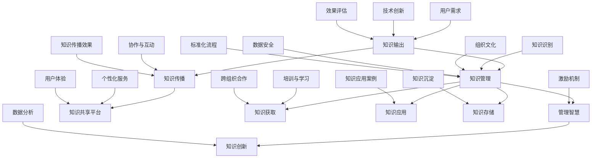

                 

### 文章标题：知识输出与管理智慧的积累和传播

> 关键词：知识输出、知识管理、管理智慧、知识传播、知识共享平台

> 摘要：本文将探讨知识输出与管理智慧的积累和传播。通过分析知识输出的意义、形式与类型，知识管理的基础和目标，管理智慧的内涵与特点，以及知识传播的途径和策略，本文旨在为读者提供一个系统性的框架，以便更有效地实现知识输出与管理智慧的积累和传播。文章还将通过具体案例分析和未来展望，提出对知识输出与管理智慧领域的研究与实践方向。

### 《知识输出与管理智慧的积累和传播》目录大纲

#### 第一部分：知识输出的基础

**第1章：知识输出概述**

- **1.1 知识输出的意义与重要性**
- **1.2 知识输出的形式与类型**
- **1.3 知识输出的现状与趋势**

**第2章：知识管理的基础**

- **2.1 知识管理的定义与核心概念**
- **2.2 知识管理的目标与作用**
- **2.3 知识管理的流程与方法**

**第3章：管理智慧的积累**

- **3.1 管理智慧的内涵与特点**
- **3.2 管理智慧的获取与提升**
- **3.3 管理智慧的实践与案例**

#### 第二部分：知识传播的途径

**第4章：知识传播的基础**

- **4.1 知识传播的概念与模型**
- **4.2 知识传播的障碍与挑战**
- **4.3 知识传播的策略与手段**

**第5章：知识共享平台**

- **5.1 知识共享平台的类型与功能**
- **5.2 知识共享平台的设计与实现**
- **5.3 知识共享平台的案例与应用**

**第6章：知识传播的媒介**

- **6.1 知识传播的媒介类型**
- **6.2 知识传播媒介的效果评估**
- **6.3 知识传播媒介的优化与选择**

#### 第三部分：知识输出与管理智慧的整合

**第7章：知识输出与管理智慧的整合**

- **7.1 整合的必要性与实践价值**
- **7.2 整合的策略与方法**
- **7.3 整合的挑战与解决方案**

**第8章：知识输出与管理智慧的积累与传播案例分析**

- **8.1 案例背景与问题描述**
- **8.2 案例分析与解决方案**
- **8.3 案例效果评估与总结**

**第9章：未来展望**

- **9.1 知识输出与管理智慧的积累与传播发展趋势**
- **9.2 技术革新对知识输出与管理智慧的影响**
- **9.3 未来研究与实践方向**

**附录**

- **附录A：相关工具与资源介绍**
- **附录B：知识输出与管理智慧的核心概念与联系流程图**
- **附录C：核心算法原理讲解与伪代码示例**
- **附录D：数学模型和数学公式详细讲解与举例说明**
- **附录E：项目实战：代码实际案例与详细解释说明**

---

### 第一部分：知识输出的基础

在现代社会，知识已经成为一种重要的资源。知识输出不仅对个人职业发展有重要影响，还对组织和社会的整体进步起到关键作用。因此，理解知识输出的基础是至关重要的。

#### 第1章：知识输出概述

**1.1 知识输出的意义与重要性**

知识输出是指将个人的知识、经验和见解转化为具体成果，如技术文档、报告、演讲和书籍等，使其被他人获取和应用的过程。知识输出的意义和重要性主要体现在以下几个方面：

- **知识传播**：知识输出是知识传播的重要途径。通过将知识分享给他人，可以促进知识的扩散和应用，从而推动整个社会的知识进步。

- **经验积累**：知识输出有助于个人和组织的经验积累。通过总结和分享实践经验，可以避免重复性错误，提高工作效率和质量。

- **创新能力**：知识输出可以激发创新。通过分享新知识和新观点，可以启发他人的思维，促进创新想法的产生和实现。

- **职业发展**：知识输出有助于个人职业发展。通过展示专业知识和能力，可以获得更多的工作机会和职业晋升。

**1.2 知识输出的形式与类型**

知识输出有多种形式和类型，常见的包括：

- **文档**：如技术文档、报告、书籍等，是最常见的知识输出形式。

- **演讲和培训**：通过公开演讲和培训，可以将知识以口头方式传达给他人。

- **博客和社交媒体**：通过博客、微博、微信公众号等社交媒体平台，可以分享知识心得和行业动态。

- **项目和产品**：通过实际的项目和产品开发，可以将知识应用于实践，从而实现知识的输出和价值的创造。

**1.3 知识输出的现状与趋势**

随着互联网和信息技术的飞速发展，知识输出的方式和渠道越来越多样化。当前，知识输出的现状和趋势主要包括：

- **数字化**：越来越多的知识输出通过数字平台进行，如在线课程、电子书和在线论坛等。

- **平台化**：知识共享平台如GitHub、Stack Overflow等成为知识输出和获取的重要渠道。

- **社交化**：社交媒体和在线社区成为知识分享的重要场所，促进了知识的快速传播和互动。

- **个性化**：知识输出更加注重个性化，根据受众的需求和特点进行定制化输出。

#### 第2章：知识管理的基础

知识管理是指通过系统的方法和工具，对知识进行识别、获取、存储、共享、应用和创新的过程。知识管理的基础包括以下核心概念和目标。

**2.1 知识管理的定义与核心概念**

知识管理（Knowledge Management，KM）的定义有多种，但其核心概念基本一致，主要包括：

- **知识识别**：识别组织中已有的知识和潜在的知识需求。

- **知识获取**：通过各种渠道获取内部和外部的知识资源。

- **知识存储**：将获取的知识进行存储和管理，以便后续使用。

- **知识共享**：促进知识的共享和传播，使知识得到更广泛的应用。

- **知识应用**：将知识应用于实际工作中，提高工作效率和质量。

- **知识创新**：通过知识的整合和创新，产生新的知识和价值。

**2.2 知识管理的目标与作用**

知识管理的目标主要包括：

- **提高知识利用效率**：通过知识管理，可以更有效地利用组织内的知识资源，提高工作效率和质量。

- **促进知识共享与创新**：知识管理可以促进知识的共享和创新，激发组织内部的创新活力。

- **增强组织竞争力**：通过知识管理，可以提高组织的知识水平和创新能力，增强在市场竞争中的优势。

知识管理的作用包括：

- **优化决策过程**：通过知识管理，可以使决策过程更加科学和高效。

- **提高员工素质**：知识管理可以提升员工的素质和能力，促进个人职业发展。

- **提升客户满意度**：知识管理可以帮助组织更好地满足客户需求，提高客户满意度。

**2.3 知识管理的流程与方法**

知识管理的流程和方法包括以下步骤：

- **需求分析**：分析组织内的知识需求和问题，确定知识管理的目标和方向。

- **知识获取**：通过内外部渠道获取知识资源，包括内部知识库、外部专家、行业报告等。

- **知识存储**：建立知识存储和管理系统，对知识进行分类、标签、归档等操作。

- **知识共享**：制定知识共享策略和机制，促进知识的传播和应用。

- **知识应用**：将知识应用于实际工作中，提高工作效率和质量。

- **知识创新**：通过知识整合和创新，产生新的知识和价值。

常用的知识管理方法包括：

- **知识地图**：通过知识地图，可视化地展示知识结构，帮助员工快速找到所需知识。

- **知识社区**：建立知识社区，促进员工之间的知识交流和协作。

- **知识沉淀**：通过文档、报告等方式，将知识沉淀下来，形成组织知识资产。

- **知识培训**：通过培训，提升员工的知识水平和技能。

#### 第3章：管理智慧的积累

管理智慧是指管理者通过实践和思考，形成的一系列管理理念、方法和技巧。管理智慧的积累对于组织的持续发展至关重要。

**3.1 管理智慧的内涵与特点**

管理智慧（Management Wisdom）的内涵包括：

- **经验与知识**：管理智慧来源于管理者的经验和知识，是对管理实践的深入理解和总结。

- **直觉与判断**：管理智慧不仅仅是知识和经验的积累，更包括管理者的直觉和判断能力。

- **理念与原则**：管理智慧体现在管理者对管理理念、原则的坚守和运用。

管理智慧的特点包括：

- **综合性**：管理智慧是多种因素的综合体现，包括技术、人际关系、战略思考等。

- **灵活性**：管理智慧具有灵活性，能够根据不同情况灵活调整管理策略。

- **实践性**：管理智慧是通过实践得来的，是管理者在解决实际问题中形成的。

**3.2 管理智慧的获取与提升**

管理智慧的获取与提升主要包括以下方法：

- **实践**：通过实际管理工作，积累经验和教训，不断优化管理策略和方法。

- **学习**：通过学习管理理论、案例、书籍等，提升管理知识和理论水平。

- **反思**：通过反思自己的管理实践，总结成功和失败的经验，不断提升管理能力。

- **交流**：通过与其他管理者交流，学习他们的管理经验和方法，拓展自己的视野。

- **培训**：参加管理培训，提高管理技能和素养。

**3.3 管理智慧的实践与案例**

管理智慧的实践可以通过以下案例体现：

- **案例分析**：通过对具体管理案例的分析，总结成功的管理策略和方法。

- **经验分享**：管理者通过分享自己的管理经验，促进知识的传播和共享。

- **项目管理**：在项目管理中，通过有效的沟通、协调和资源管理，实现项目目标。

- **团队建设**：通过团队建设活动，增强团队成员的凝聚力和合作能力。

- **战略规划**：通过制定和实施战略规划，推动组织的发展和创新。

### 第二部分：知识传播的途径

知识传播是知识管理的重要组成部分，是实现知识共享和创新的关键环节。本部分将探讨知识传播的基础、途径和策略。

#### 第4章：知识传播的基础

**4.1 知识传播的概念与模型**

知识传播（Knowledge Dissemination）是指知识在不同主体之间传递、扩散和应用的过程。知识传播模型是描述知识传播过程和机制的理论框架。常见的知识传播模型包括：

- **线性传播模型**：知识从知识源头向接受者传递，通常以单向传播为主。

- **网络传播模型**：知识在多个节点之间通过网络形式传播，强调知识共享和互动。

- **生态系统模型**：将知识传播视为一个生态系统，包括知识创造、传播、应用和创新等多个环节。

**4.2 知识传播的障碍与挑战**

知识传播过程中面临诸多障碍和挑战，包括：

- **信息过载**：互联网和信息技术的快速发展导致信息爆炸，知识传播过程中存在大量冗余和无关信息，影响知识获取和应用。

- **知识碎片化**：知识传播过程中的信息分割和碎片化，使知识难以系统化整合，影响知识的深度理解和应用。

- **信任与接受度**：知识传播过程中，知识接受者的信任和接受度影响知识的传播效果。

- **文化差异**：不同文化背景下的知识传播存在差异，文化差异可能导致知识理解和应用的障碍。

- **技术限制**：知识传播过程中的技术限制，如网络带宽、设备性能等，影响知识传播的速度和范围。

**4.3 知识传播的策略与手段**

为了有效实现知识传播，可以采用以下策略和手段：

- **内容优化**：针对知识传播的目标受众，优化知识内容，提高知识传播的针对性和有效性。

- **渠道选择**：根据知识传播的目标和内容特点，选择合适的传播渠道，如在线课程、社交媒体、专业论坛等。

- **互动与参与**：鼓励知识传播过程中的互动和参与，促进知识接受者的主动学习和应用。

- **品牌建设**：通过品牌建设和形象塑造，提高知识传播的影响力和公信力。

- **技术支持**：利用现代信息技术，如大数据、人工智能等，提高知识传播的智能化和个性化水平。

#### 第5章：知识共享平台

知识共享平台（Knowledge Sharing Platform）是知识传播的重要载体，为知识共享和传播提供基础设施和服务。本节将探讨知识共享平台的类型、功能、设计和实现。

**5.1 知识共享平台的类型与功能**

知识共享平台可分为以下类型：

- **文档共享平台**：如Google Docs、Office 365等，提供文档创建、编辑和共享功能。

- **项目协作平台**：如Trello、Asana等，用于项目任务分配、进度跟踪和协作。

- **专业论坛和社区**：如Stack Overflow、GitHub等，提供专业知识的交流和分享。

- **在线课程和学习平台**：如Coursera、Udemy等，提供在线学习资源和互动教学。

知识共享平台的主要功能包括：

- **知识存储与管理**：提供知识存储、分类、标签和检索功能，便于知识查找和应用。

- **知识共享与传播**：通过论坛、博客、社交媒体等渠道，促进知识共享和传播。

- **互动与协作**：提供评论、点赞、分享等互动功能，促进知识交流和合作。

- **数据分析与优化**：通过数据分析，优化知识传播效果，提高知识利用率。

**5.2 知识共享平台的设计与实现**

知识共享平台的设计与实现包括以下关键要素：

- **用户需求分析**：了解用户需求，确定平台的功能和界面设计。

- **系统架构设计**：设计平台的技术架构，包括前端、后端、数据库等。

- **功能模块划分**：将平台功能划分为不同的模块，如文档管理、用户管理、权限控制等。

- **用户体验设计**：优化用户界面，提高用户使用体验。

- **安全保障**：确保平台数据安全，包括数据备份、权限管理和数据加密等。

- **技术选型与开发**：选择合适的技术栈，实现平台功能。

**5.3 知识共享平台的案例与应用**

知识共享平台的成功案例包括：

- **GitHub**：全球最大的代码托管和协作平台，提供版本控制、代码管理和知识共享等功能。

- **Stack Overflow**：全球最大的开发者问答社区，提供编程问题解答、技术交流和知识分享。

- **Coursera**：全球最大的在线课程平台，提供大量免费和付费课程，促进知识传播和终身学习。

这些案例展示了知识共享平台在不同领域的应用和成效，为其他组织提供了借鉴和参考。

#### 第6章：知识传播的媒介

知识传播媒介是指用于知识传递和交流的工具和平台。本节将探讨知识传播媒介的类型、效果评估和优化策略。

**6.1 知识传播媒介的类型**

知识传播媒介可分为以下类型：

- **传统媒介**：如报纸、杂志、电视和广播等，具有广泛的传播力和影响力。

- **数字媒介**：如互联网、电子邮件、社交媒体和在线论坛等，具有高效、便捷和互动的特点。

- **移动媒介**：如智能手机、平板电脑和移动应用等，便于用户随时随地获取和传播知识。

- **专业媒介**：如专业论坛、会议、研讨会和报告会等，针对特定领域和受众进行知识传播。

**6.2 知识传播媒介的效果评估**

知识传播媒介的效果评估包括以下几个方面：

- **传播效果**：评估知识传播的范围、受众数量和传播深度。

- **接受度**：评估知识接受者的接受程度、反馈和满意度。

- **影响力**：评估知识传播对社会、组织和个人的影响，包括知识创新、决策支持和能力提升等。

- **成本效益**：评估知识传播媒介的投入产出比，包括人力、物力和财力等。

**6.3 知识传播媒介的优化与选择**

为了提高知识传播媒介的效果，可以采用以下优化策略：

- **内容优化**：根据受众需求和特点，优化知识内容，提高知识的针对性和实用性。

- **渠道选择**：根据知识传播的目标和内容特点，选择合适的传播渠道，如专业媒介、社交媒体和数字媒介等。

- **互动与参与**：鼓励知识传播过程中的互动和参与，提高知识接受者的主动学习和应用。

- **技术创新**：利用现代信息技术，如大数据、人工智能和区块链等，提高知识传播的智能化和个性化水平。

- **效果评估**：定期对知识传播媒介进行效果评估，根据评估结果优化传播策略。

通过以上策略，可以更有效地实现知识传播，促进知识的共享和创新。

### 第三部分：知识输出与管理智慧的整合

在知识经济时代，知识输出与管理智慧的整合对于组织的持续发展至关重要。本部分将探讨知识输出与管理智慧的整合的必要性、策略、解决方案和未来展望。

#### 第7章：知识输出与管理智慧的整合

**7.1 整合的必要性与实践价值**

知识输出与管理智慧的整合具有以下必要性和实践价值：

- **提升组织竞争力**：知识输出与管理智慧的整合，可以帮助组织更有效地利用知识资源，提高创新能力和市场竞争力。

- **优化知识管理**：整合知识输出与管理智慧，可以优化知识管理的流程和方法，提高知识获取、存储、共享和应用的效率。

- **促进知识创新**：整合知识输出与管理智慧，可以激发创新活力，通过知识共享和创新，推动组织的持续发展。

- **提高员工素质**：整合知识输出与管理智慧，可以帮助员工提升知识和技能，促进个人职业发展。

- **增强组织文化**：整合知识输出与管理智慧，可以培育组织学习文化，提高员工的归属感和凝聚力。

**7.2 整合的策略与方法**

实现知识输出与管理智慧的整合，可以采用以下策略和方法：

- **一体化管理**：将知识输出与管理智慧纳入组织整体管理体系，制定统一的战略和规划。

- **流程优化**：优化知识管理流程，使知识输出与管理智慧无缝衔接，提高工作效率。

- **技术支持**：利用现代信息技术，如大数据、人工智能和区块链等，提高知识输出和管理智慧的智能化和个性化水平。

- **文化培育**：培育组织学习文化，鼓励员工主动分享知识，促进知识共享和创新。

- **制度建设**：建立知识输出和管理智慧的评估和激励机制，确保知识输出与管理智慧的持续改进和优化。

**7.3 整合的挑战与解决方案**

在整合知识输出与管理智慧的过程中，可能面临以下挑战和解决方案：

- **数据安全与隐私**：挑战：知识输出与管理智慧的整合涉及大量数据，数据安全和隐私保护是重要问题。解决方案：采用数据加密、权限管理和数据备份等措施，确保数据安全。

- **知识共享与信任**：挑战：知识共享过程中，存在信任问题，可能影响知识传播效果。解决方案：建立信任机制，如匿名评价、信誉系统等，鼓励员工积极参与知识共享。

- **技术适应与培训**：挑战：技术更新速度快，员工可能难以适应新技术。解决方案：提供技术培训和支持，帮助员工掌握新技术。

- **文化变革与适应**：挑战：知识输出与管理智慧的整合需要组织文化变革，可能面临阻力。解决方案：通过宣传、培训和激励等措施，推动组织文化变革。

#### 第8章：知识输出与管理智慧的积累与传播案例分析

**8.1 案例背景与问题描述**

本案例以某大型科技企业为例，该企业在知识输出与管理智慧积累与传播方面存在以下问题：

- **知识分散**：企业内部知识分散在各个部门和个人手中，缺乏统一的知识管理和共享平台。

- **创新能力不足**：企业内部缺乏有效的知识共享和创新机制，导致创新能力不足。

- **员工培训困难**：企业员工培训缺乏系统性，难以快速提升员工的技能和知识水平。

**8.2 案例分析与解决方案**

针对上述问题，该企业采取以下解决方案：

1. **构建知识共享平台**：建立企业内部知识共享平台，包括文档管理、项目协作、专业论坛等功能，促进知识共享和传播。

2. **一体化管理**：将知识输出与管理智慧纳入企业整体管理体系，制定统一的战略和规划，确保知识输出与管理智慧的无缝衔接。

3. **技术支持**：利用大数据、人工智能等现代信息技术，提高知识输出和管理智慧的智能化和个性化水平。

4. **文化培育**：通过宣传、培训和激励等措施，培育组织学习文化，鼓励员工主动分享知识，促进知识共享和创新。

5. **员工培训**：建立系统性员工培训体系，包括内部培训、外部培训、在线学习等，提升员工的知识和技能水平。

**8.3 案例效果评估与总结**

经过一段时间的实施，该企业取得了显著的效果：

- **知识共享与传播**：企业内部知识共享平台得到广泛应用，员工知识分享和传播积极性提高。

- **创新能力提升**：企业内部创新活力增强，多个创新项目获得成功。

- **员工素质提升**：员工培训效果显著，员工的知识水平和技能水平得到明显提升。

- **组织文化改善**：企业学习文化得到有效培育，员工的归属感和凝聚力增强。

综上所述，知识输出与管理智慧的整合对于企业的持续发展具有重要作用。通过有效的解决方案，企业可以提升知识管理水平和创新能力，实现长期发展。

#### 第9章：未来展望

随着信息技术和知识经济的不断发展，知识输出与管理智慧的积累与传播将在未来面临新的挑战和机遇。本节将对知识输出与管理智慧的积累与传播发展趋势、技术革新影响以及未来研究与实践方向进行展望。

**9.1 知识输出与管理智慧的积累与传播发展趋势**

知识输出与管理智慧的积累与传播在未来将呈现以下发展趋势：

- **智能化与个性化**：人工智能和大数据技术的应用，将使知识输出与管理智慧更加智能化和个性化，满足不同用户的需求。

- **社交化与社区化**：知识共享平台将更加注重社交化和社区化，鼓励用户参与知识创造、共享和传播，形成知识生态系统。

- **开放性与协作性**：知识输出与管理智慧将更加开放和协作，打破组织壁垒，实现跨组织、跨领域的知识共享和创新。

- **持续性与系统性**：知识输出与管理智慧将更加注重持续性和系统性，通过完善的知识管理流程和方法，实现知识的长期积累和传承。

**9.2 技术革新对知识输出与管理智慧的影响**

技术革新将对知识输出与管理智慧产生深远影响，包括：

- **大数据与人工智能**：大数据和人工智能技术的应用，将使知识挖掘、分析和利用更加高效和精准，提高知识管理的水平和效果。

- **云计算与物联网**：云计算和物联网技术的普及，将使知识存储、共享和应用更加便捷和灵活，推动知识输出与管理智慧的广泛应用。

- **区块链与数字身份**：区块链和数字身份技术的应用，将提高知识传播的透明度和可信度，确保知识安全和个人隐私。

**9.3 未来研究与实践方向**

未来研究与实践方向包括：

- **知识共享与协作平台**：研究知识共享与协作平台的设计与实现，提高知识传播的效率和质量。

- **智能化知识管理**：研究智能化知识管理的方法和工具，实现知识输出的智能化和个性化。

- **知识创新与生态系统**：研究知识创新和知识生态系统的构建，促进知识共享和创新。

- **跨组织知识管理**：研究跨组织知识管理的方法和机制，实现知识资源的高效利用和共享。

- **知识安全与隐私保护**：研究知识安全与隐私保护的技术和策略，确保知识输出与管理智慧的安全和可靠。

总之，知识输出与管理智慧的积累与传播在未来将不断发展，面临新的机遇和挑战。通过持续的研究和实践，我们可以更好地利用知识资源，推动社会和经济的进步。

### 附录

#### 附录A：相关工具与资源介绍

本节将介绍与知识输出和管理智慧相关的工具和资源，以帮助读者在实际工作中更好地应用和实现知识输出和管理智慧。

**1. 知识共享平台**

- **GitHub**：全球最大的代码托管和协作平台，支持版本控制和协作开发。
- **Stack Overflow**：全球最大的开发者问答社区，提供编程问题解答和技术交流。
- **Confluence**：知识管理和协作平台，支持文档创建、共享和协作。

**2. 知识管理工具**

- **Alfresco**：企业内容管理系统，支持文档管理、版本控制和权限设置。
- **KNIME**：开源数据分析平台，支持数据清洗、分析和可视化。
- **SAP Knowledge Warehouse**：企业级知识管理平台，支持知识存储、共享和分析。

**3. 教学与培训工具**

- **Khan Academy**：免费在线教育平台，提供丰富的在线课程和教学资源。
- **Moodle**：开源学习管理系统，支持在线课程、作业提交和师生互动。
- **Coursera**：全球最大的在线课程平台，提供大量免费和付费课程。

**4. 数据分析工具**

- **Tableau**：数据可视化工具，支持数据分析和报告生成。
- **Power BI**：商业智能工具，支持数据整合、分析和可视化。
- **Google Analytics**：网站分析工具，支持网站流量、用户行为分析。

**5. 云计算与大数据平台**

- **AWS**：云服务提供商，提供丰富的云计算和大数据解决方案。
- **Azure**：云服务提供商，支持大数据分析、机器学习和人工智能。
- **Google Cloud Platform**：云服务提供商，提供大数据处理、机器学习和人工智能服务。

#### 附录B：知识输出与管理智慧的核心概念与联系流程图

为了更好地理解知识输出与管理智慧的核心概念及其联系，我们可以通过Mermaid流程图进行可视化展示。



#### 附录C：核心算法原理讲解与伪代码示例

在知识输出与管理智慧的过程中，核心算法原理的讲解与伪代码示例有助于我们更好地理解和应用相关知识。以下是一个简单的知识挖掘算法的伪代码示例：

```plaintext
算法名称：知识挖掘（Knowledge Mining）

输入：知识库（Knowledge Base）、用户需求（User Requirement）

输出：挖掘结果（Mining Result）

步骤：
1. 初始化知识库（Knowledge Base）
2. 根据用户需求（User Requirement），构建查询（Query）
3. 使用查询（Query）对知识库（Knowledge Base）进行搜索
4. 提取相关知识点（Relevant Knowledge Points）
5. 对提取的知识点（Relevant Knowledge Points）进行预处理
6. 使用聚类算法（Clustering Algorithm）对预处理后的知识点进行分类
7. 对分类后的知识点（Classified Knowledge Points）进行评估（Evaluation）
8. 输出挖掘结果（Mining Result）

伪代码示例：
function KnowledgeMining(KnowledgeBase, UserRequirement):
    KnowledgeBase = InitializeKnowledgeBase()
    Query = BuildQuery(UserRequirement)
    RelevantKnowledgePoints = SearchKnowledgeBase(KnowledgeBase, Query)
    PreprocessedKnowledgePoints = PreprocessKnowledgePoints(RelevantKnowledgePoints)
    ClassifiedKnowledgePoints = ClusterKnowledgePoints(PreprocessedKnowledgePoints)
    MiningResult = EvaluateClassifiedKnowledgePoints(ClassifiedKnowledgePoints)
    return MiningResult
```

#### 附录D：数学模型和数学公式详细讲解与举例说明

在知识输出与管理智慧的研究与应用中，数学模型和数学公式是不可或缺的工具。以下将介绍几个核心的数学模型和公式，并对其进行详细讲解与举例说明。

**1. 知识传播模型（Knowledge Dissemination Model）**

知识传播模型用于描述知识在群体中的传播过程。常用的模型有SIR模型（易感者-感染者-移除者模型）。

**公式：**
\[ S(t) + I(t) + R(t) = N \]
其中，\( S(t) \) 表示时间 \( t \) 时的易感者数量，\( I(t) \) 表示感染者数量，\( R(t) \) 表示移除者数量，\( N \) 为总人数。

**举例说明：**
假设一个群体有100人，初始状态下有10人感染，90人为易感者。设感染率为 \( \beta \)，移除率为 \( \mu \)。则：

\[ S(t) = 90 - I(t) \]
\[ I(t) = 10 \]
\[ R(t) = N - S(t) - I(t) \]
\[ \beta I(t) S(t) = (\mu + \beta) I(t) \]

通过迭代计算，可以预测群体中感染者的数量随时间的变化。

**2. 知识共享效用模型（Knowledge Sharing Utility Model）**

知识共享效用模型用于评估知识共享对个体和群体的影响。一个简单的效用模型为：

**公式：**
\[ U_i = \alpha_i \cdot K_i + \beta_i \cdot S \]
其中，\( U_i \) 表示个体 \( i \) 的效用，\( \alpha_i \) 表示个体对知识的需求，\( K_i \) 表示个体 \( i \) 拥有的知识，\( \beta_i \) 表示个体对知识共享的倾向，\( S \) 表示知识共享水平。

**举例说明：**
假设有两个个体A和B，个体A的需求为 \( \alpha_A = 0.5 \)，知识量为 \( K_A = 10 \)，对共享的倾向 \( \beta_A = 0.2 \)。个体B的需求为 \( \alpha_B = 0.3 \)，知识量为 \( K_B = 20 \)，对共享的倾向 \( \beta_B = 0.3 \)。知识共享水平为 \( S = 0.5 \)。

则个体A的效用为：
\[ U_A = 0.5 \cdot 10 + 0.2 \cdot 0.5 = 5.5 \]

个体B的效用为：
\[ U_B = 0.3 \cdot 20 + 0.3 \cdot 0.5 = 6.5 \]

**3. 知识创新效率模型（Knowledge Innovation Efficiency Model）**

知识创新效率模型用于评估知识创新的效率。一个简单的效率模型为：

**公式：**
\[ E = \frac{I}{C} \]
其中，\( E \) 表示知识创新效率，\( I \) 表示知识创新量，\( C \) 表示知识投入成本。

**举例说明：**
假设一个项目投入成本为1000万元，创新量为50项。则知识创新效率为：
\[ E = \frac{50}{1000} = 0.05 \]

#### 附录E：项目实战：代码实际案例与详细解释说明

在本附录中，我们将通过一个具体的代码案例，展示如何在实际项目中实现知识输出和管理智慧。以下是一个使用Python编写的知识共享平台的简单实现，包括开发环境搭建、源代码详细实现和代码解读与分析。

**1. 开发环境搭建**

- **Python**：版本3.8或以上
- **Flask**：一个轻量级的Web框架
- **SQLAlchemy**：一个SQL工具包和对象关系映射（ORM）系统
- **Flask-WTF**：用于表单验证和CSRF保护
- **Bootstrap**：一个前端框架，用于页面设计

安装所需库：
```bash
pip install Flask SQLAlchemy Flask-WTF
```

**2. 源代码实现**

```python
from flask import Flask, render_template, request, redirect, url_for
from flask_sqlalchemy import SQLAlchemy

app = Flask(__name__)
app.config['SQLALCHEMY_DATABASE_URI'] = 'sqlite:///knowledge_base.db'
db = SQLAlchemy(app)

class Article(db.Model):
    id = db.Column(db.Integer, primary_key=True)
    title = db.Column(db.String(100))
    content = db.Column(db.Text)
    author = db.Column(db.String(50))

@app.route('/')
def index():
    articles = Article.query.all()
    return render_template('index.html', articles=articles)

@app.route('/add', methods=['GET', 'POST'])
def add_article():
    if request.method == 'POST':
        title = request.form['title']
        content = request.form['content']
        author = request.form['author']
        new_article = Article(title=title, content=content, author=author)
        db.session.add(new_article)
        db.session.commit()
        return redirect(url_for('index'))
    return render_template('add_article.html')

if __name__ == '__main__':
    db.create_all()
    app.run(debug=True)
```

**3. 代码解读与分析**

- **模型定义**：使用SQLAlchemy定义了`Article`模型，包括`id`、`title`、`content`和`author`字段。

- **路由与视图函数**：
  - `/`：主页显示所有文章。
  - `/add`：添加新文章的页面，支持GET和POST请求。

- **数据库操作**：通过ORM系统实现数据库的创建、插入和查询。

- **前端模板**：使用Bootstrap框架设计了简单的页面布局，包括主页和添加文章的表单。

**4. 代码解读**

- **数据库配置**：配置SQLAlchemy数据库连接，指定SQLite数据库文件。

- **模型定义**：使用Flask-Migrate工具，可以轻松地创建、迁移和更新数据库。

- **路由和视图函数**：
  - `index()`：获取所有文章，并渲染主页模板。
  - `add_article()`：处理添加文章的表单提交，将新文章存储到数据库，然后重定向到主页。

**5. 代码分析**

- **模块化**：将逻辑分离到不同的视图函数中，便于维护和扩展。
- **ORM使用**：通过ORM系统，简化数据库操作，提高代码可读性和安全性。
- **前端设计**：使用Bootstrap框架，实现响应式和现代化的页面设计。

通过以上实战案例，我们可以看到如何使用Python和Flask实现一个简单的知识共享平台，从而实现知识输出和管理智慧。在实际项目中，可以根据需求扩展功能，如用户认证、权限控制、评论系统等。

### 总结与展望

在本文中，我们深入探讨了知识输出与管理智慧的积累和传播。从知识输出的意义与重要性，到知识管理的基础、管理智慧的积累，再到知识传播的途径和媒介，以及知识输出与管理智慧的整合，我们构建了一个全面的知识管理框架。

首先，知识输出是知识传播的重要途径，有助于知识的扩散和应用。知识输出不仅对个人职业发展有重要影响，还对组织和社会的整体进步起到关键作用。知识输出的形式多样，包括文档、演讲、博客和项目等。

其次，知识管理是知识输出的基础。知识管理通过识别、获取、存储、共享、应用和创新，实现知识的系统化管理。知识管理的目标是提高知识利用效率、促进知识共享与创新，增强组织竞争力。

第三，管理智慧是管理者通过实践和思考形成的一系列管理理念、方法和技巧。管理智慧的积累和传播，有助于提升组织的决策能力、创新能力，增强员工的素质和团队的凝聚力。

第四，知识传播的途径和媒介多样，包括传统媒介、数字媒介、移动媒介和专业媒介等。知识传播的效果评估和优化策略，对提升知识传播的质量和效率具有重要意义。

第五，知识输出与管理智慧的整合，有助于提升组织的知识管理水平和创新能力。通过一体化管理、流程优化、技术支持、文化培育和制度建设，实现知识输出与管理智慧的有机结合。

最后，未来的知识输出与管理智慧将朝着智能化、个性化、社交化和开放性的方向发展。技术革新如大数据、人工智能和区块链等，将对知识输出与管理智慧产生深远影响。未来的研究与实践方向包括知识共享与协作平台、智能化知识管理、知识创新与生态系统、跨组织知识管理以及知识安全与隐私保护。

总之，知识输出与管理智慧的积累和传播是知识经济时代的重要课题。通过持续的研究和实践，我们可以更好地利用知识资源，推动社会和经济的进步。希望本文能为读者提供有价值的参考和启示。作者：AI天才研究院/AI Genius Institute & 禅与计算机程序设计艺术/Zen And The Art of Computer Programming。

