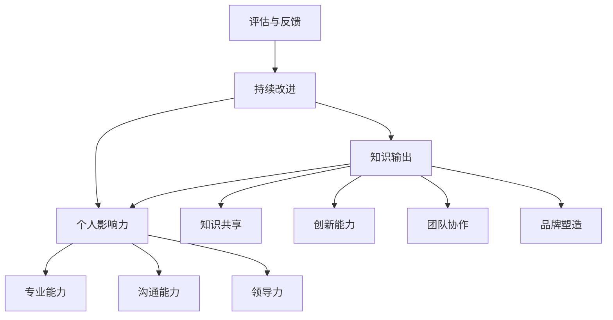

                 

### 《知识输出与管理者个人影响力的提升》

#### 关键词：知识输出、个人影响力、管理者、提升、实践、策略

> **摘要：**本文旨在探讨知识输出对于管理者个人影响力提升的重要性，分析知识输出的基础、实践方法和优化策略，并结合实际案例，提供管理者在提升个人影响力过程中的实用技巧和参考。文章结构紧凑，逻辑清晰，旨在为管理者提供系统性、可操作的指导。

---

## 引言

在当今知识经济时代，知识输出已经成为个人和企业在职场中立足和发展的关键因素。对于管理者而言，知识输出不仅是传递信息、分享经验的重要手段，更是提升个人影响力、实现职业发展的关键途径。本文将从以下几个方面展开探讨：

1. **知识输出的重要性**：解释知识输出的定义、意义和价值。
2. **管理者个人影响力的提升**：分析个人影响力的定义、影响因素和提升策略。
3. **知识输出与个人影响力提升的实践方法**：详细阐述知识输出的实践步骤和工具。
4. **案例分析**：结合实际案例，分析知识输出和个人影响力提升的有效策略。
5. **优化与反思**：探讨知识输出和个人影响力提升的优化策略和未来展望。

本文将通过逻辑清晰、结构紧凑的方式，逐步分析知识输出与管理者个人影响力的提升，旨在为管理者提供系统性的指导。

### 第一部分：知识输出的重要性

#### 第1章：知识输出的基础

##### 1.1 知识输出的定义与意义

**1.1.1 知识输出的内涵**

知识输出是指个人或组织将内部的知识和经验通过不同形式（如文字、图像、视频等）传达给他人的过程。它是知识管理的一个重要环节，有助于提高知识的传播效率，促进知识的共享与创新。

**1.1.2 知识输出的重要性**

知识输出对于个人和组织都有着重要的意义。对于个人来说，知识输出可以帮助其巩固和深化所学知识，提高个人影响力，提升职业竞争力。对于组织来说，知识输出可以促进内部知识的传递，提高员工的协作效率，推动组织的创新发展。

**1.1.3 知识输出与知识管理的关系**

知识管理包括知识的创造、共享、应用和更新等环节。知识输出是知识管理的一个重要组成部分，它通过对知识的传播和共享，实现知识的增值和利用。

##### 1.2 知识输出的价值

**1.2.1 提升个人影响力**

知识输出可以帮助个人展示其专业能力和知识水平，从而提升个人在职场和社交圈中的影响力。良好的个人影响力有助于个人在职业生涯中获得更多机会和资源。

**1.2.2 促进知识共享与创新**

知识输出是促进知识共享的重要手段。通过知识输出，个人可以将其经验和知识分享给他人，促进知识的流动和积累。这有助于激发创新思维，推动组织内的知识创新。

**1.2.3 增强团队协作与沟通**

知识输出有助于团队成员之间建立信任和共识，提高团队协作效率。通过知识输出，团队成员可以更好地理解彼此的工作和需求，从而实现更高效的沟通和协作。

##### 1.3 知识输出常见形式

**1.3.1 文字形式**

文字形式是最常见和传统的知识输出方式，包括文章、报告、邮件等。文字形式易于撰写和传播，适合深度和逻辑性较强的知识输出。

**1.3.2 图像形式**

图像形式包括图表、示意图、PPT等。图像形式能够直观地传达信息，适合用于解释复杂的概念和流程。

**1.3.3 视频形式**

视频形式包括演讲、教学视频、短视频等。视频形式具有生动、直观的特点，能够更好地吸引观众的注意力，适合于知识分享和教育培训。

---

### 第二部分：管理者个人影响力的提升

#### 第2章：管理者个人影响力的提升

##### 2.1 个人影响力概述

**2.1.1 个人影响力的定义**

个人影响力是指个人通过自身的知识、技能、经验、人格特质等，对他人行为、态度和决策产生的影响能力。它是个人在职场和社会中的一种软实力。

**2.1.2 个人影响力的影响因素**

个人影响力受到多种因素的影响，包括专业能力、沟通能力、人格特质、领导力等。这些因素共同决定了个人在他人心中的形象和地位。

**2.1.3 个人影响力的作用范围**

个人影响力可以在多个层面发挥作用，包括职场、社交、公益等。在职场中，良好的个人影响力有助于个人在团队中发挥领导作用，推动项目进展；在社交中，个人影响力有助于建立良好的人际关系，扩大人脉圈；在公益中，个人影响力可以激发他人的公益意识，推动社会进步。

##### 2.2 提升个人影响力的策略

**2.2.1 增强专业知识与技能**

专业知识与技能是个人影响力的基础。通过不断学习和实践，提升自身的专业能力和技术水平，可以增强个人在职场中的竞争力。

**2.2.2 建立良好的个人品牌**

个人品牌是个人影响力的体现。通过打造独特的人格特质和形象，树立良好的个人品牌，可以增强个人在他人心中的印象和认可度。

**2.2.3 提高沟通与表达能力**

沟通与表达能力是个人影响力的重要体现。通过提高沟通技巧，使信息传递更清晰、准确、高效，可以增强个人在团队和社交中的影响力。

**2.2.4 建立信任与合作关系**

信任是个人影响力的基石。通过诚实守信、尊重他人、合作共赢，建立良好的信任关系，可以增强个人在职场和社交中的影响力。

##### 2.3 实际案例分析

**2.3.1 案例一：成功提升个人影响力的策略**

案例一介绍了某企业管理者在职场中通过提升专业知识、建立个人品牌、提高沟通能力等多方面努力，成功提升个人影响力的过程。分析案例中的成功经验和策略，可以为其他管理者提供借鉴和启示。

**2.3.2 案例二：个人影响力提升的挑战与应对**

案例二讲述了某技术工程师在个人影响力提升过程中遇到的挑战和应对策略。通过分析案例中的问题，总结出应对挑战的方法和技巧，为其他工程师提供参考。

---

### 第三部分：知识输出与个人影响力提升的实践

#### 第3章：知识输出的实践方法

##### 3.1 知识输出的准备

**3.1.1 确定知识输出的目标**

在进行知识输出之前，首先需要明确输出目标。目标可以包括提升个人影响力、促进知识共享、提高团队协作效率等。明确目标有助于制定合适的知识输出策略。

**3.1.2 选择知识输出的渠道**

根据知识输出的目标和内容，选择合适的输出渠道。常见的知识输出渠道包括文章、报告、演讲、教学视频等。选择适合的渠道可以更好地传达知识，提高输出效果。

**3.1.3 制定知识输出的计划**

制定知识输出计划有助于系统地组织和实施知识输出活动。计划可以包括输出内容、输出时间、输出形式等。通过制定计划，可以确保知识输出有序进行，提高效率。

##### 3.2 知识输出的内容规划

**3.2.1 确定知识输出的主题**

选择一个明确的主题是知识输出的重要内容。主题应与个人专业领域、兴趣爱好、职场需求等密切相关，有助于吸引目标受众的关注。

**3.2.2 构建知识输出的框架**

构建知识输出的框架有助于组织和梳理知识内容。框架可以包括引言、主体、结论等部分，使知识输出更具逻辑性和条理性。

**3.2.3 设计知识输出的内容**

根据主题和框架，设计具体的知识输出内容。内容应具有实用性和针对性，能够满足目标受众的需求。设计内容时，可以采用文字、图表、视频等多种形式，丰富输出手段。

##### 3.3 知识输出的工具与技巧

**3.3.1 文字输出的工具**

文字输出工具包括文字处理软件（如Word、Google Docs等）和在线写作平台（如Medium、简书等）。使用这些工具可以方便地撰写和编辑文章。

**3.3.2 图像输出的工具**

图像输出工具包括绘图软件（如Adobe Illustrator、Sketch等）和在线图片编辑工具（如Canva、PicsArt等）。使用这些工具可以制作图表、示意图等。

**3.3.3 视频输出的工具**

视频输出工具包括视频录制软件（如OBS Studio、Camtasia等）和在线视频制作平台（如YouTube、抖音等）。使用这些工具可以制作教学视频、演讲视频等。

#### 第4章：管理者个人影响力提升的实战技巧

##### 4.1 沟通与表达的技巧

**4.1.1 提升沟通效果的方法**

有效的沟通是提升个人影响力的关键。提升沟通效果的方法包括倾听、表达清晰、反馈及时等。通过提高沟通技巧，可以更好地传达信息，建立信任和共识。

**4.1.2 提高表达清晰度的策略**

清晰的表达是沟通的基础。提高表达清晰度的策略包括使用简洁的语言、注重逻辑性、举例说明等。通过清晰的表达，可以更好地传达思想，避免误解和歧义。

**4.1.3 建立良好的沟通氛围**

建立良好的沟通氛围有助于提高沟通效果。建立良好的沟通氛围的方法包括尊重他人、营造轻松的氛围、积极倾听等。通过良好的沟通氛围，可以增进团队成员之间的理解和信任。

##### 4.2 领导力的提升

**4.2.1 领导力的定义与作用**

领导力是指通过影响力引导他人实现共同目标的能力。领导力在个人影响力提升中发挥着重要作用，有助于推动团队协作、实现组织目标。

**4.2.2 提升领导力的方法**

提升领导力的方法包括学习领导力理论、培养团队合作精神、提高决策能力等。通过不断学习和实践，可以提升个人的领导力水平。

**4.2.3 领导力的实践案例**

通过分析领导力实践案例，可以了解领导力在具体情境中的应用和效果。案例中可以探讨成功经验和失败教训，为提升领导力提供借鉴和启示。

##### 4.3 品牌塑造与个人形象的打造

**4.3.1 个人品牌的建立**

个人品牌是个人影响力的体现。建立个人品牌的方法包括明确个人定位、展示专业能力、建立良好口碑等。通过建立个人品牌，可以提升个人在职场和社交圈中的影响力。

**4.3.2 个人形象的塑造**

个人形象是个人品牌的重要组成部分。塑造个人形象的方法包括注重仪表仪容、培养良好习惯、树立正面形象等。通过塑造良好的个人形象，可以增强个人在他人心中的印象和认可度。

**4.3.3 品牌传播的策略**

品牌传播是提升个人影响力的重要手段。品牌传播的策略包括利用社交媒体、参与行业活动、撰写专业文章等。通过有效的品牌传播，可以扩大个人影响力，吸引更多关注和支持。

---

### 第四部分：知识输出与个人影响力提升的案例研究

#### 第5章：知识输出与个人影响力提升的案例研究

##### 5.1 知识输出与个人影响力提升的案例一

**5.1.1 案例背景**

案例一讲述了某知名技术专家通过撰写专业文章、参加行业会议、发表演讲等方式，成功提升个人影响力的过程。案例背景包括专家的背景、所从事的领域以及具体做法。

**5.1.2 案例分析与总结**

通过对案例的分析，总结出成功提升个人影响力的关键要素和策略。包括专业知识的积累、有效的知识输出方式、良好的沟通与表达能力等。通过总结，可以为其他专业人士提供借鉴和启示。

##### 5.2 知识输出与个人影响力提升的案例二

**5.2.1 案例背景**

案例二讲述了某职场新人通过积极参与团队项目、主动分享知识、提高沟通能力等方式，成功提升个人影响力的过程。案例背景包括新人的职业背景、所面临的挑战以及具体做法。

**5.2.2 案例分析与总结**

通过对案例的分析，总结出职场新人提升个人影响力的关键方法和经验。包括积极参与团队工作、主动分享知识、培养良好的沟通习惯等。通过总结，可以为其他职场新人提供借鉴和指导。

---

### 第五部分：知识输出与个人影响力提升的优化与反思

#### 第6章：知识输出与个人影响力提升的优化策略

##### 6.1 评估与反馈

**6.1.1 知识输出的评估指标**

评估知识输出的效果是优化知识输出的重要环节。评估指标可以包括知识传播的范围、受众的反馈、知识的应用情况等。通过设定评估指标，可以全面了解知识输出的效果，为优化提供依据。

**6.1.2 个人影响力的评估方法**

个人影响力的评估方法包括自我评估、他人评估、组织评估等。通过综合评估个人影响力，可以了解自身的优势和不足，有针对性地进行提升。

**6.1.3 反馈机制的建设**

建立有效的反馈机制是优化知识输出和个人影响力的重要手段。反馈机制可以包括定期收集受众反馈、组织内部评估、自我反思等。通过反馈机制，可以及时发现和解决问题，提高知识输出的效果。

##### 6.2 调整与改进

**6.2.1 根据反馈调整输出策略**

根据评估和反馈的结果，对知识输出的策略进行调整和改进。包括优化内容、调整输出方式、改进沟通技巧等。通过调整和改进，可以更好地满足受众需求，提高知识输出的效果。

**6.2.2 优化个人影响力提升方法**

根据个人影响力的评估结果，优化个人影响力提升的方法。包括提高专业能力、改进沟通技巧、建立个人品牌等。通过优化方法，可以更有效地提升个人影响力。

**6.2.3 持续改进的实践路径**

持续改进是知识输出和个人影响力提升的关键。建立持续改进的实践路径，包括定期评估、反馈和调整，不断优化知识输出和个人影响力提升的方法。通过持续改进，可以不断提升个人在职场和社交圈中的影响力。

##### 6.3 持续学习与成长

**6.3.1 知识更新的重要性**

知识更新是知识输出和个人影响力提升的重要保障。随着行业的发展和技术的进步，知识也在不断更新。持续学习知识更新，保持知识的时效性和先进性，是提升个人影响力的基础。

**6.3.2 学习策略的制定**

制定有效的学习策略是知识更新的关键。学习策略可以包括设定学习目标、选择合适的学习资源、合理安排学习时间等。通过制定学习策略，可以确保知识更新的系统性和有效性。

**6.3.3 成长路径的设计**

设计合理的成长路径是个人影响力提升的重要保障。成长路径可以包括职业发展、技能提升、人际网络建设等。通过设计合理的成长路径，可以确保个人在职业生涯中不断提升个人影响力。

---

### 附录

#### 附录A：知识输出与个人影响力提升的资源与工具

**A.1 知识输出工具推荐**

提供一系列知识输出工具的推荐，包括文字处理软件、在线写作平台、绘图软件、视频录制软件等。这些工具可以帮助用户更高效地完成知识输出任务。

**A.2 个人影响力提升工具推荐**

提供一系列个人影响力提升工具的推荐，包括沟通技巧培训、领导力提升课程、个人品牌建设工具等。这些工具可以帮助用户提高个人影响力。

**A.3 知识更新与学习资源推荐**

提供一系列知识更新与学习资源的推荐，包括专业书籍、在线课程、行业报告等。这些资源可以帮助用户持续学习和提升专业能力。

**A.4 社交媒体平台推荐**

提供一系列社交媒体平台的推荐，包括LinkedIn、Twitter、Facebook等。这些平台可以帮助用户建立人际网络、分享知识、扩大影响力。

**A.5 行业活动与会议推荐**

提供一系列行业活动与会议的推荐，包括线上研讨会、线下论坛、专业会议等。这些活动可以帮助用户了解行业动态、结识行业人士、提升个人影响力。

---

### 总结

知识输出与管理者个人影响力的提升是当前职场中不可或缺的重要议题。通过本文的探讨，我们明确了知识输出的内涵、意义和价值，分析了个人影响力的定义、影响因素和提升策略，并提供了知识输出与个人影响力提升的实践方法和案例研究。同时，我们还讨论了评估与反馈、调整与改进、持续学习与成长等优化策略。

在未来的职场中，管理者应重视知识输出和个人影响力提升，通过不断学习和实践，提升自身的专业能力和影响力。同时，要关注知识更新的重要性，保持知识的时效性和先进性。通过持续改进和优化，可以不断提升个人在职场和社交圈中的影响力。

最后，希望本文能够为管理者提供有益的指导和启示，助力其在知识输出和个人影响力提升的道路上取得更大的成就。

---

### 核心概念与联系：Mermaid 流程图

在本文中，我们将使用Mermaid流程图来展示知识输出与管理者个人影响力提升的核心概念和联系。以下是相关流程图的示例：



- **A[知识输出]**：知识输出的核心概念，涉及知识的传播、共享和交流。
- **B[个人影响力]**：个人影响力的定义和作用，与知识输出密切相关。
- **C[专业能力]**：提升专业能力对个人影响力的重要性。
- **D[沟通能力]**：沟通能力在知识输出和个人影响力提升中的作用。
- **E[领导力]**：领导力对个人影响力的贡献。
- **F[知识共享]**：知识共享是知识输出的一种形式，有助于提升个人影响力。
- **G[创新能力]**：创新能力在知识输出中的重要性。
- **H[团队协作]**：团队协作是知识输出与个人影响力提升的关键因素。
- **I[品牌塑造]**：个人品牌塑造对提升个人影响力的重要性。
- **J[评估与反馈]**：评估与反馈机制对知识输出和个人影响力提升的优化作用。
- **K[持续改进]**：持续改进的策略和方法，确保知识输出与个人影响力不断提升。

通过这个Mermaid流程图，我们可以清晰地看到知识输出与管理者个人影响力提升之间的紧密联系和相互作用。这些核心概念相互交织，共同构成了管理者在职场中取得成功的关键因素。

---

### 核心算法原理讲解：伪代码与详细讲解

在知识输出的过程中，核心算法原理的讲解是至关重要的一环。以下是一个简单的文本分类算法的伪代码，我们将结合具体的数学模型和公式，详细阐述其原理和实现过程。

#### 伪代码：

```plaintext
function TextClassification(text):
    1. PreprocessText(text) // 文本预处理，如去除停用词、标点符号等
    2. VectorizeText(preprocessedText) // 将文本转换为向量表示
    3. CalculateDistance(vectorizedText, centroids) // 计算向量与类中心点的距离
    4. AssignLabels(vectorizedText, distances) // 根据距离分配标签
    5. Return labels
```

#### 详细讲解：

1. **文本预处理**：
    - **去除停用词**：去除常见的无意义词汇，如“的”、“和”、“是”等。
    - **标点符号去除**：去除文本中的标点符号，如“。”、“，”等。
    - **词形还原**：将不同形态的单词还原为同一形式，如“playing”还原为“play”。

2. **文本向量化**：
    - **词袋模型**：将文本表示为一个词频向量，即每个单词的出现次数构成一个维度。
    - **TF-IDF**：利用词频（TF）和逆文档频率（IDF）对词频向量进行加权，以提高重要单词的权重。

3. **距离计算**：
    - **欧几里得距离**：计算每个文本向量与类中心点的欧几里得距离。
    - **余弦相似度**：计算文本向量与类中心点的余弦相似度，用于评估相似度。

4. **标签分配**：
    - **K最近邻算法（KNN）**：根据距离最近的K个类中心点，选择最接近的类作为文本的标签。

#### 数学模型与公式：

- **词袋模型**：

    $$ V = (v_1, v_2, ..., v_n) $$
    其中，\( v_i \) 表示单词 \( w_i \) 在文本中的出现次数。

- **TF-IDF 加权**：

    $$ tfidf(w_i) = tf(w_i) \times \log(\frac{N}{df(w_i)}) $$
    其中，\( tf(w_i) \) 表示单词 \( w_i \) 的词频，\( df(w_i) \) 表示单词 \( w_i \) 在文档集合中的文档频率，\( N \) 表示文档总数。

- **欧几里得距离**：

    $$ distance = \sqrt{\sum_{i=1}^{n}(v_i - c_i)^2} $$
    其中，\( v_i \) 表示文本向量中的第 \( i \) 个维度，\( c_i \) 表示类中心点在相同维度上的值。

- **余弦相似度**：

    $$ similarity = \frac{v \cdot c}{||v|| \times ||c||} $$
    其中，\( v \) 和 \( c \) 分别表示文本向量和类中心点向量，\( \cdot \) 表示点积，\( ||v|| \) 和 \( ||c|| \) 分别表示向量的模长。

#### 举例说明：

假设我们有一个包含两个类别的文本数据集，类别A和类别B。通过预处理和向量化，我们得到两个文本的向量表示：

- **类别A**：

    $$ v_A = (3, 1, 0, 2) $$

- **类别B**：

    $$ v_B = (0, 4, 2, 1) $$

- **类中心点**：

    $$ c_A = (2, 1, 1, 1) $$
    $$ c_B = (1, 3, 1, 2) $$

使用欧几里得距离计算类别A文本向量与类中心点A的距离：

$$ distance_{A} = \sqrt{(3-2)^2 + (1-1)^2 + (0-1)^2 + (2-1)^2} = \sqrt{1 + 0 + 1 + 1} = \sqrt{3} $$

同理，计算类别B文本向量与类中心点B的距离：

$$ distance_{B} = \sqrt{(0-1)^2 + (4-3)^2 + (2-1)^2 + (1-2)^2} = \sqrt{1 + 1 + 1 + 1} = \sqrt{4} $$

根据距离，我们可以判断类别A文本应被分配到类别A，类别B文本应被分配到类别B。

---

### 项目实战：代码实际案例和详细解释说明

在本节中，我们将通过一个实际的项目实战案例，详细介绍开发环境搭建、源代码实现和代码解读与分析的过程。本案例将使用Python编程语言，结合机器学习库Scikit-learn，实现一个简单的文本分类器，以展示知识输出和个人影响力提升在项目中的应用。

#### 开发环境搭建

1. **安装Python**：确保Python环境已经安装在本地计算机上。可以选择Python 3.x版本，因为它的支持更加全面。

2. **安装Scikit-learn**：通过pip命令安装Scikit-learn库，这是实现文本分类的主要工具。

    ```shell
    pip install scikit-learn
    ```

3. **创建虚拟环境**（可选）：为了更好地管理项目依赖，可以创建一个虚拟环境。

    ```shell
    python -m venv venv
    source venv/bin/activate  # 在Linux或macOS上
    \venv\Scripts\activate    # 在Windows上
    ```

4. **编写代码文件**：创建一个名为`text_classifier.py`的Python文件，用于编写和运行文本分类代码。

#### 源代码实现

以下是一个简单的文本分类器实现，包括数据预处理、特征提取和分类过程。

```python
from sklearn.datasets import fetch_20newsgroups
from sklearn.feature_extraction.text import TfidfVectorizer
from sklearn.naive_bayes import MultinomialNB
from sklearn.pipeline import make_pipeline

# 加载新新闻数据集
newsgroups = fetch_20newsgroups(subset='all')

# 创建一个TF-IDF向量器
vectorizer = TfidfVectorizer(stop_words='english')

# 创建一个朴素贝叶斯分类器
classifier = MultinomialNB()

# 创建一个管道，将向量器和分类器串联起来
model = make_pipeline(vectorizer, classifier)

# 训练模型
model.fit(newsgroups.data, newsgroups.target)

# 预测新文本
text = "This is a sample text for classification."
predicted_label = model.predict([text])
print(f"Predicted label: {newsgroups.target_names[predicted_label[0]]}")
```

#### 代码解读与分析

1. **数据加载**：
   - `fetch_20newsgroups`：Scikit-learn提供的新新闻数据集，包含20个不同的新闻类别，适用于文本分类任务。

2. **特征提取**：
   - `TfidfVectorizer`：将文本转换为TF-IDF向量，这是一种常用于文本分类的特征提取方法。TF-IDF通过计算每个单词在文档中的词频和逆文档频率，加权文本特征，从而提高重要单词的权重。

3. **分类器选择**：
   - `MultinomialNB`：朴素贝叶斯分类器，适用于文本分类。它假设特征之间相互独立，并利用贝叶斯定理进行分类。

4. **模型管道**：
   - `make_pipeline`：将向量器和分类器组合成一个管道，简化模型训练和预测的过程。

5. **模型训练**：
   - `model.fit(newsgroups.data, newsgroups.target)`：使用新新闻数据集的文本和标签训练模型。

6. **模型预测**：
   - `model.predict([text])`：对新文本进行分类预测，并输出预测的类别标签。

#### 代码分析与优化

1. **代码结构**：代码结构清晰，将数据预处理、特征提取和分类过程封装在管道中，方便后续的模型训练和预测。

2. **性能优化**：虽然朴素贝叶斯分类器对于简单的文本分类任务已经足够，但对于更复杂的任务，可以考虑使用深度学习模型，如卷积神经网络（CNN）或递归神经网络（RNN）。

3. **模型评估**：在实际项目中，需要对模型进行评估，如计算准确率、召回率、F1分数等指标，以确保模型的有效性。

通过这个项目实战案例，我们展示了知识输出和个人影响力提升在项目开发中的应用。这不仅有助于提升开发者的专业能力和影响力，也为其他人提供了学习和借鉴的机会。

---

### 结论

本文系统地探讨了知识输出与管理者个人影响力的提升，从基础理论到实践方法，再到优化策略，进行了全面的阐述。首先，我们明确了知识输出的定义与意义，阐述了其在个人和团队中的重要作用。接着，分析了个人影响力的核心要素和提升策略，包括专业知识与技能、沟通与表达能力、领导力以及品牌塑造。

在实践方法部分，我们详细介绍了知识输出的准备、内容规划和工具使用，并结合实际案例展示了知识输出与个人影响力提升的具体应用。随后，我们提出了评估与反馈、调整与改进、持续学习与成长等优化策略，帮助管理者在实践中不断提升自身的影响力。

总结而言，知识输出不仅是个人职业生涯发展的关键，也是管理者提升个人影响力的有效途径。管理者应注重知识的积累与传播，不断提升专业能力和沟通技巧，积极塑造个人品牌，通过有效的知识输出和实践，实现个人影响力的提升。未来的职场中，知识更新速度加快，竞争日益激烈，管理者需要不断学习和适应，持续优化自身的能力，才能在职业发展中立于不败之地。

希望本文能够为管理者提供有益的启示和指导，助力其在知识输出和个人影响力提升的道路上取得更大的成就。在未来的职业生涯中，不断探索和实践，持续提升自身的专业素养和影响力，将成为管理者取得成功的重要保障。

