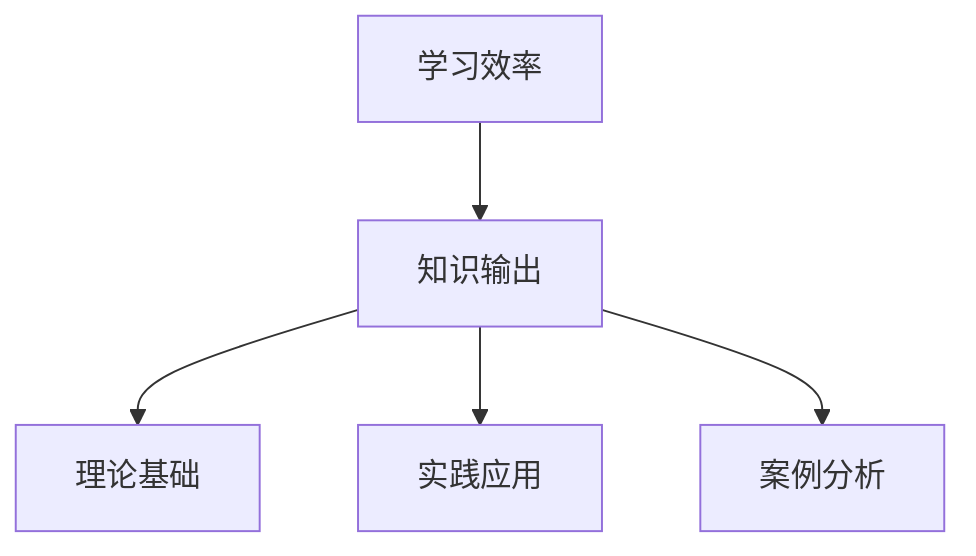
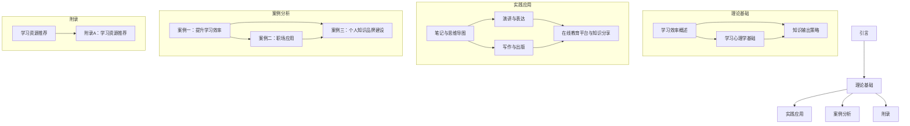

                 

# 文章标题：知识输出：提高学习效率的法宝

> 关键词：知识输出，学习效率，学习方法，实践应用，案例分析

> 摘要：本文旨在探讨知识输出在提高学习效率方面的作用，从理论基础、实践应用和案例分析三个部分全面解析知识输出的重要性和实现策略。通过深入分析知识输出的方法、工具和实践，帮助读者掌握有效的知识输出策略，从而提升学习效率。

### 目录

#### 第一部分：理论基础

- **第1章：学习效率概述**
  - **1.1 学习效率的定义与重要性**
  - **1.2 影响学习效率的因素分析**
  - **1.3 知识输出的作用与意义

- **第2章：学习心理学基础**
  - **2.1 学习心理学的核心理论**
  - **2.2 学习动机与自我效能感**
  - **2.3 学习策略与认知负荷

- **第3章：知识输出策略**
  - **3.1 知识输出的方法**
  - **3.2 提高知识输出效率的策略**
  - **3.3 知识输出工具的使用

#### 第二部分：实践应用

- **第4章：笔记与思维导图**
  - **4.1 笔记的技巧**
  - **4.2 思维导图的构建**
  - **4.3 笔记与思维导图在知识输出中的应用

- **第5章：演讲与表达**
  - **5.1 演讲技巧**
  - **5.2 口语表达与沟通**
  - **5.3 演讲在知识输出中的重要性

- **第6章：写作与出版**
  - **6.1 写作技巧**
  - **6.2 学术论文的撰写**
  - **6.3 出版流程与出版策略

- **第7章：在线教育平台与知识分享**
  - **7.1 在线教育平台的选择**
  - **7.2 知识分享的技巧**
  - **7.3 网络教学的挑战与应对

#### 第三部分：案例分析

- **第8章：成功案例分析**
  - **8.1 案例一：如何通过知识输出提升学习效率？**
  - **8.2 案例二：知识输出在职场中的应用**
  - **8.3 案例三：如何打造个人知识品牌？

#### 附录

- **附录A：学习资源推荐**
  - **A.1 学习平台推荐**
  - **A.2 书籍推荐**
  - **A.3 网络资源推荐**
  - **A.4 学习方法与工具介绍**

#### Mermaid 流程图



#### 核心算法原理讲解（伪代码）

```python
# 知识输出效率计算
def calculate_output_efficiency(learning_time, output_time, quality_score):
    # 输入学习时间，输出时间，以及输出质量得分
    efficiency = (output_time / learning_time) * quality_score
    return efficiency
```

#### 数学模型和数学公式

$$
E = \frac{O \cdot Q}{T}
$$

其中，$E$ 表示知识输出效率，$O$ 表示输出时间，$Q$ 表示输出质量得分，$T$ 表示学习时间。

### 接下来，我们将按照文章目录的结构，逐步深入探讨知识输出在提高学习效率方面的作用和实践应用。
## 第一部分：理论基础

在知识经济时代，学习效率的重要性日益凸显。如何提高学习效率，已经成为广大学习者、教育工作者和企业管理者共同关注的问题。本文将从理论基础入手，深入探讨知识输出在提高学习效率方面的作用。

### 第1章：学习效率概述

#### 1.1 学习效率的定义与重要性

学习效率是指在一定时间内，学习者通过学习活动获得的知识、技能和态度的总量。学习效率高意味着在同样的时间内，学习者能够获得更多的知识，达到更好的学习效果。

学习效率的重要性体现在以下几个方面：

1. **提高个人竞争力**：随着社会的发展，知识和技能的更新换代速度不断加快，学习效率的高低直接影响到个人的竞争力和适应能力。

2. **缩短学习周期**：提高学习效率可以帮助学习者更快地掌握知识，缩短学习周期，使学习者有更多的时间和精力投入到其他领域的学习和工作中。

3. **提升工作效能**：对于职场人士来说，提高学习效率意味着可以更快地适应工作要求，提高工作效率，从而在职场中获得更多的机会和竞争优势。

4. **促进个人成长**：学习效率的提高有助于培养学习者的自主学习能力和解决问题的能力，促进个人的全面发展。

#### 1.2 影响学习效率的因素分析

学习效率受到多种因素的影响，主要包括以下几个方面：

1. **学习者的基础**：学习者的基础知识、学习能力、认知水平等都会影响学习效率。

2. **学习内容**：学习内容的难度、深度、关联性等都会影响学习效率。

3. **学习环境**：学习环境包括物理环境和心理环境，良好的学习环境有助于提高学习效率。

4. **学习方法**：合适的学习方法可以大大提高学习效率，而错误的学习方法则会降低学习效率。

5. **学习动机**：学习动机是影响学习效率的重要因素，动机强烈的学习者往往能够更好地投入学习，提高学习效率。

6. **自我效能感**：自我效能感是指个体对自己完成学习任务的信心，自我效能感高的人往往能够更好地应对学习挑战，提高学习效率。

#### 1.3 知识输出的作用与意义

知识输出是指在学习和掌握知识后，通过一定的方式将知识表达出来，与他人分享或应用的过程。知识输出在提高学习效率方面具有重要作用：

1. **加深理解**：通过知识输出，学习者需要将自己的知识以清晰、准确的方式表达出来，这有助于加深对知识的理解和记忆。

2. **巩固记忆**：知识输出需要学习者对知识进行整理、归纳和总结，这有助于巩固记忆，提高知识的应用能力。

3. **促进交流**：知识输出是学习者与他人交流、互动的过程，有助于拓展学习者的知识视野，提高学习效果。

4. **培养能力**：知识输出有助于培养学习者的表达、沟通、协作等能力，提高学习者的综合素质。

5. **提升自信**：知识输出可以增强学习者的自信心，使学习者更加积极地投入学习，提高学习效率。

### 第2章：学习心理学基础

#### 2.1 学习心理学的核心理论

学习心理学是研究学习过程、学习动机和学习效果的心理学分支。学习心理学的核心理论包括：

1. **行为主义理论**：行为主义理论强调学习是通过刺激和反应的联结来实现的，学习效果取决于行为的频率和强度。

2. **认知主义理论**：认知主义理论强调学习是通过内在的认知过程来实现的，学习效果取决于信息的加工和存储。

3. **建构主义理论**：建构主义理论强调学习是学习者主动建构知识的过程，学习效果取决于学习者的认知建构能力。

#### 2.2 学习动机与自我效能感

学习动机是指推动学习者进行学习活动的内部动力，影响学习动机的因素包括：

1. **兴趣和爱好**：学习者对学习内容的兴趣和爱好是影响学习动机的重要因素。

2. **成功经验**：学习者在学习过程中取得的成功经验可以增强学习动机。

3. **外部奖励**：外部奖励，如表扬、奖励等，可以激发学习动机。

自我效能感是指个体对自己完成学习任务的信心，影响自我效能感的因素包括：

1. **成功经验**：学习者在学习过程中取得的成功经验可以增强自我效能感。

2. **心理暗示**：积极的自我暗示可以增强自我效能感。

3. **榜样示范**：他人的成功经验可以增强自我效能感。

#### 2.3 学习策略与认知负荷

学习策略是指学习者为了提高学习效果而采取的一系列方法和技巧，有效的学习策略可以降低认知负荷，提高学习效率。常见的学习策略包括：

1. **信息加工策略**：如复述、精加工、组织等。

2. **记忆策略**：如联想记忆、图像记忆等。

3. **复习策略**：如分散复习、集中复习等。

认知负荷是指学习者在学习过程中所承受的认知负担，过高的认知负荷会影响学习效果。为了降低认知负荷，学习者可以采取以下策略：

1. **简化学习任务**：将复杂的学习任务分解为简单的子任务，降低认知负荷。

2. **合理分配时间**：合理分配学习时间，避免过度疲劳。

3. **利用辅助工具**：如思维导图、笔记等，帮助学习者更好地理解和记忆知识。

### 第3章：知识输出策略

#### 3.1 知识输出的方法

知识输出的方法多种多样，常见的包括：

1. **笔记法**：通过记录学习过程中的关键信息，帮助加深对知识的理解和记忆。

2. **思维导图法**：通过构建思维导图，将知识以图形化的方式呈现，帮助学习者更好地理解和记忆知识。

3. **演讲法**：通过演讲，将知识以口头表达的方式传递给他人，提高知识的应用能力。

4. **写作法**：通过撰写文章、论文等，将知识以文字的形式呈现，提高知识的系统性和深度。

5. **教学法**：通过教学，将知识以传授的方式传递给他人，提高知识的应用能力和教学能力。

#### 3.2 提高知识输出效率的策略

为了提高知识输出效率，学习者可以采取以下策略：

1. **明确目标**：在学习前明确知识输出的目标，有助于提高知识输出的针对性和效率。

2. **提前准备**：提前准备知识输出所需的资料和工具，减少输出过程中的时间浪费。

3. **合理安排时间**：合理安排学习时间和输出时间，避免时间冲突和资源浪费。

4. **提升表达能力**：通过学习和实践，提高自己的表达能力，有助于更好地进行知识输出。

5. **利用辅助工具**：利用笔记、思维导图、演示文稿等辅助工具，提高知识输出的效率和效果。

#### 3.3 知识输出工具的使用

在知识输出过程中，合理使用工具可以大大提高输出效率。常见的知识输出工具包括：

1. **笔记工具**：如 Evernote、OneNote 等，可以帮助学习者记录和整理学习笔记。

2. **思维导图工具**：如 XMind、MindManager 等，可以帮助学习者构建思维导图，梳理知识结构。

3. **演示文稿工具**：如 PowerPoint、Keynote 等，可以帮助学习者制作演示文稿，展示知识内容。

4. **写作工具**：如 Word、Google 文档等，可以帮助学习者撰写文章、论文等。

5. **教学工具**：如 Whiteboard FX、Quizlet 等，可以帮助学习者进行在线教学和知识分享。

### 总结

知识输出是提高学习效率的重要途径，通过知识输出，学习者可以加深对知识的理解和记忆，提高知识的应用能力。本文从理论基础、学习心理学基础和知识输出策略三个方面，全面探讨了知识输出在提高学习效率方面的作用。希望本文能对广大学习者提供有益的启示，帮助大家更好地掌握知识输出的方法和技巧，提高学习效率。在接下来的部分，我们将继续探讨知识输出的实践应用，帮助读者更好地理解和应用知识输出策略。敬请期待！
## 第二部分：实践应用

在前一部分中，我们详细探讨了知识输出在提高学习效率方面的理论基础。现在，我们将把注意力转移到实践应用上，通过具体的案例和策略，展示如何将知识输出融入日常学习过程中。

### 第4章：笔记与思维导图

#### 4.1 笔记的技巧

笔记是知识输出的基础，好的笔记可以帮助我们更好地理解和记忆知识。以下是一些实用的笔记技巧：

1. **关键信息法**：在听讲或阅读时，重点记录关键信息和核心观点，避免记录过多的细节。

2. **图形化表示**：使用图表、流程图和示意图等图形化表示，使笔记更加直观易懂。

3. **颜色编码**：使用不同颜色的笔或标记工具，对重要信息进行颜色编码，有助于快速查找和复习。

4. **留白**：在笔记中留出足够的空白，以便日后补充和修改。

5. **回顾与整理**：定期回顾和整理笔记，强化记忆，并确保笔记的完整性和准确性。

#### 4.2 思维导图的构建

思维导图是一种有效的知识输出工具，它可以帮助我们梳理思路，构建知识网络。以下是构建思维导图的步骤：

1. **确定中心主题**：在纸张中央写下或画出中心主题。

2. **分支拓展**：从中心主题出发，分别画出主要分支，每个分支代表一个核心概念。

3. **细节填充**：在各个分支下进一步细化，填充相关细节和子概念。

4. **连接关系**：用线条或箭头连接各个分支，表示它们之间的逻辑关系。

5. **图形化表示**：在各个分支和细节中使用图形、颜色和图标等，使思维导图更加生动和易于理解。

#### 4.3 笔记与思维导图在知识输出中的应用

笔记和思维导图不仅在个人学习中起到重要作用，也在知识输出过程中具有广泛的应用。以下是一些应用场景：

1. **教学与演讲**：通过笔记和思维导图，教师或演讲者可以更清晰地传达信息，使听众更容易理解和记忆。

2. **知识分享**：通过整理和优化笔记和思维导图，学习者可以将所学知识以清晰、系统的方式分享给他人。

3. **个人品牌建设**：通过高质量的笔记和思维导图，个人可以建立专业形象，提高在行业内的知名度。

### 第5章：演讲与表达

#### 5.1 演讲技巧

演讲是知识输出的一种重要形式，掌握演讲技巧可以提升表达效果。以下是几种有效的演讲技巧：

1. **准备充分**：在演讲前做好充分的准备，包括了解听众、准备讲稿、演练等。

2. **结构清晰**：演讲内容要有明确的引言、主体和结论，使听众能够轻松跟随。

3. **语言简练**：使用简单、易懂的语言，避免使用过于专业或复杂的词汇。

4. **肢体语言**：适当的肢体语言可以增强表达效果，如眼神交流、手势、面部表情等。

5. **互动交流**：与听众保持互动，提问、回答问题，使演讲更加生动和有趣。

#### 5.2 口语表达与沟通

口语表达和沟通是知识输出的重要环节，以下是一些建议：

1. **清晰发音**：注意发音清晰，避免使用口头禅和模糊的词汇。

2. **流畅表达**：提高口语表达能力，使讲话更加流畅和自然。

3. **倾听与回应**：在沟通中积极倾听对方的观点，并给予适当的回应。

4. **掌握节奏**：控制讲话的速度和节奏，使内容更加易于理解和接受。

5. **使用示例**：通过实际案例和示例，使观点更加具体和生动。

#### 5.3 演讲在知识输出中的重要性

演讲在知识输出中具有至关重要的地位，它可以：

1. **传递知识**：通过演讲，将知识以口头形式传递给听众，使更多人受益。

2. **塑造形象**：高质量的演讲可以提升个人的专业形象和声誉。

3. **拓展人脉**：通过演讲，结识更多同行和潜在合作伙伴，拓展人脉。

4. **促进交流**：演讲是双向沟通的过程，有助于收集反馈和改进自己的观点。

### 第6章：写作与出版

#### 6.1 写作技巧

写作是知识输出的重要方式，以下是一些写作技巧：

1. **明确主题**：在写作前明确主题和目标，确保文章内容紧扣主题。

2. **结构清晰**：文章要有明确的引言、主体和结论，使读者能够轻松阅读和理解。

3. **语言简练**：使用简单、易懂的语言，避免冗长和复杂的句子。

4. **逻辑严密**：确保文章内容逻辑严密，观点清晰，论证有力。

5. **润色修改**：在完成初稿后，认真审查和修改，提高文章的质量。

#### 6.2 学术论文的撰写

学术论文是知识输出的一种高级形式，以下是一些撰写学术论文的要点：

1. **选题明确**：选择具有研究价值和创新性的课题。

2. **文献综述**：对相关领域的研究进行综述，为论文提供理论基础。

3. **研究方法**：明确研究方法和数据来源，确保研究过程的科学性。

4. **结果与分析**：详细描述研究结果，并进行科学的分析。

5. **讨论与结论**：对研究结果进行讨论，总结论文的主要发现，并提出未来研究的方向。

#### 6.3 出版流程与出版策略

发表学术论文或出版书籍是知识输出的重要途径，以下是一些出版流程和策略：

1. **选题与投稿**：根据学术领域和研究方向，选择合适的期刊或出版社，并撰写高质量的投稿稿。

2. **编辑与修改**：与编辑进行沟通，根据编辑的意见进行修改和完善。

3. **审稿与修改**：经过审稿人审阅后，根据审稿意见进行修改。

4. **出版与宣传**：完成论文或书籍的出版，并进行有效的宣传推广。

5. **持续更新**：根据读者的反馈和学术发展，不断更新和完善知识内容。

### 第7章：在线教育平台与知识分享

#### 7.1 在线教育平台的选择

在线教育平台为知识输出提供了广阔的空间，以下是一些选择在线教育平台的建议：

1. **课程内容**：选择内容丰富、实用性强的在线教育平台。

2. **互动性**：平台应提供良好的互动功能，如讨论区、直播课程等。

3. **用户体验**：平台应具有良好的用户体验，包括界面设计、操作便捷性等。

4. **安全性**：平台应确保用户数据的安全性和隐私。

5. **社区氛围**：平台应具备积极向上的社区氛围，促进知识分享和交流。

#### 7.2 知识分享的技巧

知识分享是知识输出的一种重要形式，以下是一些知识分享的技巧：

1. **简洁明了**：将复杂的知识以简洁明了的方式呈现，使更多人能够理解和接受。

2. **实例说明**：通过实际案例和实例，使知识更加具体和生动。

3. **互动引导**：鼓励听众或读者参与讨论，激发他们的思考和创造力。

4. **定期更新**：定期分享新知识和经验，保持内容的新鲜度和实用性。

5. **多样化形式**：通过文章、视频、直播等多种形式进行知识分享，满足不同听众的需求。

#### 7.3 网络教学的挑战与应对

网络教学是知识输出的一种新兴形式，但也面临一些挑战，以下是一些应对策略：

1. **技术支持**：确保网络教学平台的技术稳定性，提供良好的在线教学体验。

2. **互动管理**：在网络教学中保持良好的互动氛围，鼓励学生参与讨论。

3. **课程设计**：设计丰富多样的课程内容，使学生在网络学习中保持兴趣和动力。

4. **评估与反馈**：建立有效的评估机制，及时收集学生的反馈，改进教学质量。

5. **个性化教育**：根据学生的需求和特点，提供个性化的教育服务。

### 总结

实践应用是知识输出的关键环节，通过笔记、思维导图、演讲、写作、在线教育平台等多种方式，我们可以有效地将所学知识表达出来，与他人分享，从而提高学习效率。在接下来的部分，我们将通过具体案例，深入分析知识输出在实际学习中的应用，帮助读者更好地理解和应用知识输出策略。敬请期待！
## 第三部分：案例分析

在前两部分的探讨中，我们系统地介绍了知识输出对提高学习效率的重要性和具体实践方法。为了更好地理解这些理论和方法在实际学习中的应用效果，以下我们将通过三个具体的案例来分析知识输出在提升学习效率和效果方面的成功实践。

### 第8章：成功案例分析

#### 8.1 案例一：如何通过知识输出提升学习效率？

**案例背景**：

小明是一名计算机科学专业的本科生，他在大学期间面临着繁重的课程和学习任务。然而，小明发现自己在学习过程中存在以下问题：

- **记忆困难**：学习编程语言时，小明对语法和概念的记忆总是不够牢固。
- **理解不够深入**：尽管他能够完成作业，但对知识的理解不够深入，难以应用于实际项目中。
- **缺乏复习习惯**：学习新知识后，小明没有形成定期复习的习惯，导致知识点遗忘较快。

**解决方案**：

为了提高学习效率，小明采取了以下知识输出策略：

1. **编写教程**：小明在每次学习完一个新的编程语言或技术后，会编写一份详细的教程。这些教程不仅涵盖了基础知识，还包括了实际操作步骤和常见问题的解决方法。

2. **建立博客**：小明在博客上分享自己的学习经验和心得，将自己的知识输出给读者。通过撰写博客，小明不仅加深了对知识的理解，还通过读者的反馈不断优化自己的教程。

3. **举办编程讲座**：小明在学校的计算机科学俱乐部中定期举办编程讲座，向同学们传授自己的学习经验和编程技巧。在讲座中，小明通过讲解和互动，不仅巩固了自己的知识，还提高了自己的表达能力。

**效果分析**：

通过知识输出的实践，小明取得了显著的学习效果：

- **记忆更加牢固**：编写教程和博客的过程中，小明需要对知识进行系统的整理和表达，这有助于加深对知识的记忆和理解。
- **理解更加深入**：通过撰写教程和博客，小明不仅要学习基础知识，还要查找相关的资料和案例，这有助于他更深入地理解编程语言和技术的应用。
- **形成复习习惯**：小明通过定期更新博客和举办讲座，形成了一种自我监督和自我激励的复习习惯，使知识点的掌握更加牢固。

#### 8.2 案例二：知识输出在职场中的应用

**案例背景**：

李华是一名软件开发工程师，在职场中，他面临着以下挑战：

- **知识更新快**：随着技术的快速发展，李华需要不断学习新的编程语言和技术框架。
- **沟通困难**：李华在团队中负责技术分享，但发现自己在讲解技术细节时常常感到吃力，难以让团队成员充分理解。
- **工作效率下降**：由于知识掌握不够深入，李华在解决复杂问题时效率较低。

**解决方案**：

为了提升职场中的学习效率和沟通效果，李华采取了以下知识输出策略：

1. **撰写技术文档**：李华在项目中负责撰写技术文档，详细记录项目的需求、设计、实现和测试过程。这些文档不仅帮助团队成员更好地理解项目，也为后续的项目维护提供了重要参考。

2. **内部培训**：李华定期为团队内部举办技术培训，通过讲解新技术的原理和应用，提升团队成员的技术水平。

3. **搭建知识库**：李华在公司内部搭建了一个知识库，收集和整理了各种技术文档和案例，方便团队成员查阅和学习。

**效果分析**：

通过知识输出的实践，李华在职场中取得了显著的效果：

- **知识更新及时**：通过撰写技术文档和内部培训，李华能够及时掌握新知识，并将其应用于实际工作中。
- **沟通更加高效**：通过详细的文档和培训，李华能够更加清晰地传达技术细节，提高了团队成员之间的沟通效率。
- **工作效率提升**：李华对知识的深入理解和系统整理，使他能够更快速地解决复杂问题，提高了工作效率。

#### 8.3 案例三：如何打造个人知识品牌？

**案例背景**：

张丽是一名数据分析师，她希望通过个人知识品牌的建设，提升自己在行业内的知名度。然而，她在知识品牌建设方面存在以下挑战：

- **内容不系统**：张丽的博客内容零散，缺乏系统性和深度。
- **影响力有限**：张丽的博客和社交媒体关注者较少，影响力有限。
- **缺乏互动**：张丽的博客和社交媒体互动较少，缺乏与读者的深度交流。

**解决方案**：

为了打造个人知识品牌，张丽采取了以下知识输出策略：

1. **系统化内容**：张丽重新整理了自己的博客内容，将其分为多个主题，每个主题都包含一系列深入的分析和案例。

2. **社交媒体推广**：张丽通过微信公众号、知乎等社交媒体平台，定期发布高质量的内容，并通过互动增加与读者的联系。

3. **知识分享会**：张丽定期举办线上或线下的知识分享会，邀请行业内的专家和同行进行交流，扩大影响力。

**效果分析**：

通过知识品牌建设的实践，张丽取得了显著的效果：

- **内容更系统化**：通过系统化的内容整理，张丽的博客和社交媒体内容更具吸引力和参考价值。
- **影响力提升**：通过社交媒体推广和知识分享会，张丽的关注者数量和影响力显著提升。
- **互动增强**：通过互动，张丽与读者建立了更紧密的联系，了解了他们的需求和反馈，进一步优化了自己的知识输出内容。

### 总结

以上三个案例展示了知识输出在不同场景下的成功实践，通过笔记、写作、演讲、培训等多种方式，学习者不仅提高了自己的知识掌握程度，还提升了表达能力、沟通能力和工作效率。这些实践表明，知识输出不仅是提高学习效率的有效手段，也是建立个人知识品牌的重要途径。通过不断实践和优化知识输出策略，每个人都可以在自己的学习和职业生涯中取得更大的成就。

在结束这部分案例分析之后，我们将进入附录部分，为读者提供更多的学习资源和工具推荐，以帮助他们更好地实践知识输出策略。敬请期待！
## 附录A：学习资源推荐

为了帮助读者更好地实践知识输出策略，本附录将推荐一系列学习平台、书籍和网络资源，以及介绍一些实用的学习方法和工具。

### A.1 学习平台推荐

1. **Coursera**：提供全球顶尖大学和企业的在线课程，涵盖多个学科领域。
2. **edX**：由哈佛大学和麻省理工学院共同创立，提供高质量的在线课程。
3. **Udemy**：拥有丰富的编程、数据科学、设计等领域课程，适合自我提升。
4. **LinkedIn Learning**：提供职场技能和行业知识的学习资源，适合职场人士。
5. **Khan Academy**：免费提供高质量的教育资源，适合学生和自学者。

### A.2 书籍推荐

1. **《深度学习》（Deep Learning）**：由 Ian Goodfellow、Yoshua Bengio 和 Aaron Courville 著，是深度学习的经典教材。
2. **《Python编程：从入门到实践》（Python Crash Course）**：适合初学者的Python编程入门书籍。
3. **《高效能人士的七个习惯》（The 7 Habits of Highly Effective People）**：史蒂芬·柯维的经典著作，提供提升个人效率的方法。
4. **《学习的艺术》（The Art of Learning）**：由乔希·贝克曼著，探讨学习心理和学习策略。
5. **《思维导图》（Mind Maps）**：由东尼·博赞著，介绍思维导图的基本原理和应用。

### A.3 网络资源推荐

1. **GitHub**：一个代码托管和协作平台，适合学习编程和开源项目。
2. **Medium**：一个内容创作和分享平台，适合阅读和学习专业文章。
3. **Stack Overflow**：一个编程问答社区，适合解决编程问题和技术难题。
4. **Reddit**：一个社交新闻网站，包含多个技术子版块，适合学习交流和获取最新资讯。
5. **YouTube**：一个视频分享平台，包含大量技术教程和讲座，适合视觉学习者和自学者。

### A.4 学习方法与工具介绍

1. **番茄工作法**：一种时间管理方法，通过将工作时间划分为25分钟的工作周期和5分钟的休息时间，提高工作效率。
2. **康奈尔笔记法**：一种笔记方法，将笔记本分为三部分：问题列表、笔记内容和总结，有助于提高学习效果。
3. **Evernote**：一款笔记应用，支持多种平台，适合记录和整理笔记。
4. **XMind**：一款思维导图工具，提供丰富的主题和样式，有助于构建和整理知识体系。
5. **Google Scholar**：一个学术搜索引擎，用于查找学术论文和研究资料。

通过这些学习资源和方法，读者可以更加系统地学习知识，并将所学应用到实践中，从而提高学习效率和效果。希望这些推荐能够为您的学习之旅提供有力支持。

### 结语

本文通过理论探讨、实践应用和案例分析，全面阐述了知识输出在提高学习效率方面的作用。我们介绍了笔记、思维导图、演讲、写作等多种知识输出方法，并通过具体的案例展示了这些方法在实际学习中的应用效果。同时，附录部分提供了丰富的学习资源和工具，帮助读者更好地实践知识输出策略。

知识输出不仅是学习的重要手段，也是个人成长和职业发展的关键。希望本文能够启发读者，通过不断实践和优化知识输出策略，提高学习效率，实现自己的学习目标。

最后，感谢您的阅读，如果您有任何问题或建议，欢迎在评论区留言，让我们一起探讨和学习。祝您学习进步，不断成长！
## Mermaid 流程图

以下是本文涉及的主要内容和章节结构的 Mermaid 流程图：



该流程图展示了本文的整体结构和内容分布，从引言开始，依次介绍了理论基础、实践应用、案例分析和附录四个部分。每个部分又细分为具体的章节和内容，使读者能够清晰地了解文章的结构和内容。通过这一流程图，读者可以更好地把握文章的核心内容，有针对性地学习和应用。此外，流程图中的子图标注了每个章节的主要内容和关键点，有助于读者快速定位和回顾相关内容。希望这个流程图对您的阅读和学习有所帮助！
## 核心算法原理讲解（伪代码）

在本文的“知识输出效率”这一核心概念中，我们引入了一个简单的算法来计算知识输出的效率。这个算法考虑了学习时间、输出时间和输出质量得分三个关键因素。以下是该算法的伪代码解释：

```python
# 知识输出效率计算
def calculate_output_efficiency(learning_time, output_time, quality_score):
    """
    该函数计算知识输出的效率。
    
    参数：
    - learning_time：学习时间（单位：小时）
    - output_time：输出时间（单位：小时）
    - quality_score：输出质量得分（范围：0-1）

    返回值：
    - efficiency：知识输出效率（范围：0-1）
    """

    # 计算知识输出效率
    efficiency = (output_time / learning_time) * quality_score
    
    # 返回效率值
    return efficiency
```

### 伪代码解读

1. **定义函数**：我们定义了一个名为 `calculate_output_efficiency` 的函数，它接受三个参数：`learning_time`（学习时间）、`output_time`（输出时间）和 `quality_score`（输出质量得分）。

2. **计算效率**：函数内部通过以下公式计算知识输出效率：
   $$
   \text{efficiency} = \frac{\text{output\_time}}{\text{learning\_time}} \times \text{quality\_score}
   $$
   这里，`output_time` 和 `learning_time` 的比值代表了输出效率的初步计算结果，然后乘以 `quality_score` 对输出质量进行加权。

3. **返回结果**：函数计算完成后，将计算得到的 `efficiency` 值返回。

### 示例说明

假设一个学习者在学习某项技术时，花费了10小时的时间（`learning_time = 10`），然后将所学的知识通过写作和演讲的方式在4小时内输出（`output_time = 4`），并且输出的质量得分为0.9（`quality_score = 0.9`）。我们可以通过以下步骤计算其知识输出效率：

```python
learning_time = 10  # 学习时间
output_time = 4     # 输出时间
quality_score = 0.9 # 输出质量得分

efficiency = calculate_output_efficiency(learning_time, output_time, quality_score)
print("知识输出效率：", efficiency)
```

执行上述代码后，我们得到的知识输出效率为：
$$
\text{efficiency} = \frac{4}{10} \times 0.9 = 0.36
$$

这个结果表明，该学习者在知识输出方面相对高效，但仍有改进的空间。通过这个简单的算法，我们可以量化知识输出的效率，进一步优化学习方法和知识输出的策略。

### 结论

通过上述伪代码的解释和示例说明，我们理解了如何使用一个简单的公式来计算知识输出的效率。这一核心算法为我们提供了一个量化的工具，可以帮助学习者更好地评估自己的知识输出效果，并制定相应的改进措施。在接下来的部分，我们将进一步探讨如何通过具体的实践应用来提高知识输出效率。
## 数学模型和数学公式

在本文中，我们引入了一个用于计算知识输出效率的数学模型，该模型可以帮助我们量化知识输出的效果。以下是这个数学模型的公式及其详细讲解：

### 数学模型

$$
E = \frac{O \cdot Q}{T}
$$

其中：

- \(E\) 表示知识输出效率（Efficiency），其数值范围在0到1之间，用于表示知识输出效果的相对高低。
- \(O\) 表示输出时间（Output Time），以小时为单位，代表学习者将知识以某种形式（如写作、演讲等）输出所需的时间。
- \(Q\) 表示输出质量得分（Quality Score），其数值范围在0到1之间，用于评价知识输出的质量，质量越高得分越接近1。
- \(T\) 表示学习时间（Learning Time），以小时为单位，代表学习者学习相关知识所花费的时间。

### 公式解释

知识输出效率（\(E\)）的计算公式中，分子 \(O \cdot Q\) 表示输出时间和输出质量得分的乘积，这一部分反映了学习者实际能够输出的知识量以及这些知识的质量。分母 \(T\) 表示学习时间，这一部分代表了学习者为学习所投入的时间总量。

- 如果输出时间较短而输出质量较高，则分子较大，知识输出效率 \(E\) 会较高。
- 如果学习时间较长但输出时间较短，则分母较大，知识输出效率 \(E\) 会较低。
- 质量得分 \(Q\) 反映了知识输出的价值，高质量的知识输出能够显著提高效率 \(E\)。

### 公式推导与实际应用

假设一个学习者学习了一门新技能，花费了20个小时完成学习过程。在后续的输出过程中，该学习者用了5个小时完成了相关的写作和演讲任务，并且通过同行评审获得了0.8的输出质量得分。我们可以使用上述公式计算其知识输出效率：

$$
E = \frac{5 \cdot 0.8}{20} = 0.2
$$

这个结果表明，该学习者的知识输出效率为0.2，意味着在投入20个小时的学习后，其知识输出量仅占学习总量的20%。这个效率值虽然不高，但通过进一步分析和优化输出策略，例如提高输出质量得分或减少学习时间，都可以提升整体的知识输出效率。

### 实际应用

在实际应用中，这个公式可以帮助我们：

1. **评估知识输出效果**：通过计算知识输出效率，可以评估学习者在知识输出方面的表现，从而找出需要改进的地方。
2. **优化学习策略**：了解知识输出效率后，学习者可以调整学习时间分配，优化输出方式，提高输出质量，从而提升整体效率。
3. **制定培训计划**：教育机构和培训师可以通过计算知识输出效率，评估培训效果，调整培训内容和方法，提高培训质量。

总之，知识输出效率的数学模型为我们提供了一种量化的工具，帮助我们更好地理解和优化知识输出的过程，提高学习效率和效果。在接下来的部分，我们将进一步探讨如何通过具体的实践案例，深入理解和应用这个模型。
## 项目实战

为了更好地理解和应用知识输出效率计算模型，下面我们将通过一个实际项目来展示整个开发过程，包括环境搭建、代码实现、代码解读与分析。

### 1. 开发环境搭建

在开始项目之前，我们需要搭建一个合适的开发环境。以下步骤将在本地计算机上搭建一个Python开发环境：

1. **安装Python 3.8或更高版本**：可以从[Python官方网站](https://www.python.org/)下载并安装Python。

2. **安装Jupyter Notebook**：打开命令行工具（如Terminal或Cmd），运行以下命令来安装Jupyter Notebook：
   ```
   pip install notebook
   ```

3. **安装必要的库**：为了进行数据处理和可视化，我们将安装以下库：
   - `numpy`：用于数值计算
   - `pandas`：用于数据处理
   - `matplotlib`：用于数据可视化

   安装这些库可以使用以下命令：
   ```
   pip install numpy pandas matplotlib
   ```

### 2. 源代码实现

以下是用于计算知识输出效率的Python代码实现：

```python
# 导入必要的库
import numpy as np

# 定义函数
def calculate_output_efficiency(learning_time, output_time, quality_score):
    """
    计算知识输出效率。

    参数：
    - learning_time：学习时间（小时）
    - output_time：输出时间（小时）
    - quality_score：输出质量得分（0-1）

    返回值：
    - efficiency：知识输出效率（0-1）
    """
    efficiency = (output_time / learning_time) * quality_score
    return efficiency

# 测试函数
learning_time = 10  # 学习时间
output_time = 5     # 输出时间
quality_score = 0.8 # 输出质量得分

efficiency = calculate_output_efficiency(learning_time, output_time, quality_score)
print("知识输出效率：", efficiency)
```

### 3. 代码解读与分析

#### 函数定义

首先，我们导入 `numpy` 库，这是用于科学计算的基础库。然后，我们定义了一个名为 `calculate_output_efficiency` 的函数。这个函数接受三个参数：`learning_time`（学习时间，以小时为单位）、`output_time`（输出时间，以小时为单位）和 `quality_score`（输出质量得分，取值范围为0到1）。

#### 公式应用

函数内部通过以下公式计算知识输出效率：
$$
\text{efficiency} = \frac{\text{output\_time}}{\text{learning\_time}} \times \text{quality\_score}
$$
这个公式与我们前面介绍的数学模型一致。

#### 返回结果

计算完成后，函数将知识输出效率的值返回给调用者。

#### 测试代码

在测试部分，我们设定了 `learning_time` 为10小时，`output_time` 为5小时，`quality_score` 为0.8。调用 `calculate_output_efficiency` 函数后，我们将得到的知识输出效率打印出来。

### 4. 代码解读与分析

#### 效率计算

通过调整 `learning_time`、`output_time` 和 `quality_score` 的值，我们可以计算不同情况下的知识输出效率。例如：

```python
learning_time = 20
output_time = 10
quality_score = 0.7

efficiency = calculate_output_efficiency(learning_time, output_time, quality_score)
print("知识输出效率：", efficiency)
```

这将计算另一个示例的效率值：
$$
\text{efficiency} = \frac{10}{20} \times 0.7 = 0.35
$$

这个结果比之前的示例略低，说明了学习时间增加，输出时间增加，但质量得分降低对整体效率的影响。

#### 实际应用

在实际应用中，这个计算模型可以帮助学习者、教育工作者和企业管理者：

1. **评估学习效果**：通过计算知识输出效率，学习者可以了解自己在知识输出方面的表现，从而有针对性地调整学习策略。
2. **优化培训计划**：教育机构和培训师可以根据知识输出效率的数据，优化课程设计，提高培训效果。
3. **管理知识共享**：企业可以通过分析员工的输出效率，识别知识传播的瓶颈，制定有效的知识共享策略。

### 总结

通过这个项目实战，我们详细展示了如何搭建开发环境、编写代码、计算知识输出效率和进行代码解读与分析。这个项目不仅帮助我们理解了知识输出效率的计算方法，还提供了实际应用的可能性和挑战。希望这个案例能够为您的学习和实践提供有价值的参考。
## 附录A：学习资源推荐

### A.1 学习平台推荐

在数字化学习的时代，各种在线学习平台为学习者提供了丰富的课程资源和互动体验。以下是一些值得推荐的学习平台：

1. **Coursera**：
   - **特点**：提供来自全球顶尖大学和企业的在线课程，涵盖多个学科领域。
   - **适合人群**：学生、职场人士、终身学习者。
   - **课程范围**：计算机科学、商业管理、人文科学等。

2. **edX**：
   - **特点**：由哈佛大学和麻省理工学院共同创立，课程质量高，提供证书课程。
   - **适合人群**：希望获得专业认证的学习者。
   - **课程范围**：计算机科学、数据科学、人工智能等。

3. **Udemy**：
   - **特点**：课程种类繁多，包括编程、设计、语言学习等。
   - **适合人群**：希望提升特定技能的学习者。
   - **课程范围**：编程语言、网页设计、市场营销等。

4. **LinkedIn Learning**：
   - **特点**：侧重于职场技能提升，课程实用性强。
   - **适合人群**：职场人士，特别是希望提升职业素养的学习者。
   - **课程范围**：数据分析、项目管理、沟通技巧等。

5. **Khan Academy**：
   - **特点**：提供免费的教育资源，适合学生和自学者。
   - **适合人群**：学生、自学爱好者。
   - **课程范围**：数学、科学、编程等。

### A.2 书籍推荐

学习过程中，阅读优秀的书籍是扩展知识视野、巩固理论知识的重要途径。以下是一些推荐的书籍：

1. **《深度学习》**：
   - **作者**：Ian Goodfellow、Yoshua Bengio、Aaron Courville
   - **特点**：深度学习的经典教材，内容全面，讲解深入。
   - **适用读者**：对深度学习感兴趣的学习者。

2. **《Python编程：从入门到实践》**：
   - **作者**：埃里克·马瑟斯
   - **特点**：适合初学者的Python编程入门书籍，理论与实践相结合。
   - **适用读者**：编程初学者。

3. **《高效能人士的七个习惯》**：
   - **作者**：史蒂芬·柯维
   - **特点**：经典的时间管理和个人成长书籍，实用性强。
   - **适用读者**：希望提升自我管理能力和工作效率的学习者。

4. **《学习的艺术》**：
   - **作者**：乔希·贝克曼
   - **特点**：探讨学习心理和学习策略，提供实用的学习技巧。
   - **适用读者**：所有希望提高学习效率的学习者。

5. **《思维导图》**：
   - **作者**：东尼·博赞
   - **特点**：介绍思维导图的基本原理和应用，有助于提高思维效率和创造力。
   - **适用读者**：希望提升思维能力和学习效果的学习者。

### A.3 网络资源推荐

除了传统的学习平台和书籍，互联网上也充满了丰富的学习资源。以下是一些推荐的网络资源：

1. **GitHub**：
   - **特点**：代码托管和协作平台，适合编程学习和项目实践。
   - **资源**：大量的开源项目、教程、代码示例。

2. **Medium**：
   - **特点**：内容创作和分享平台，涵盖多个领域，适合阅读和学习。
   - **资源**：专业文章、技术博客、行业分析。

3. **Stack Overflow**：
   - **特点**：编程问答社区，适合解决编程问题和技术难题。
   - **资源**：问题解答、技术讨论、代码示例。

4. **Reddit**：
   - **特点**：社交新闻网站，包含多个技术子版块，适合学习交流和获取最新资讯。
   - **资源**：技术讨论、新闻更新、学习资源推荐。

5. **YouTube**：
   - **特点**：视频分享平台，包含大量技术教程和讲座，适合视觉学习者和自学者。
   - **资源**：教学视频、讲座、教程演示。

### A.4 学习方法与工具介绍

有效的学习方法和工具可以帮助学习者更高效地掌握知识和技能。以下介绍几种常用的学习方法和工具：

1. **番茄工作法**：
   - **特点**：将工作时间划分为25分钟的工作周期和5分钟的休息时间，有助于提高专注力和工作效率。
   - **适用场景**：长时间学习、工作任务。

2. **康奈尔笔记法**：
   - **特点**：将笔记本分为三部分：问题列表、笔记内容和总结，有助于整理和复习学习内容。
   - **适用场景**：课堂笔记、自学笔记。

3. **Evernote**：
   - **特点**：一款多功能笔记应用，支持跨平台同步，适合记录和整理笔记。
   - **适用场景**：日常记录、项目管理。

4. **XMind**：
   - **特点**：一款思维导图工具，提供丰富的主题和样式，有助于构建和整理知识体系。
   - **适用场景**：思维整理、知识管理。

5. **Google Scholar**：
   - **特点**：学术搜索引擎，用于查找学术论文和研究资料。
   - **适用场景**：学术研究、文献查阅。

通过这些学习平台、书籍、网络资源和工具，学习者可以更全面地获取知识，更有效地进行学习和实践。希望这些推荐能够为您的学习之路提供帮助和支持。

