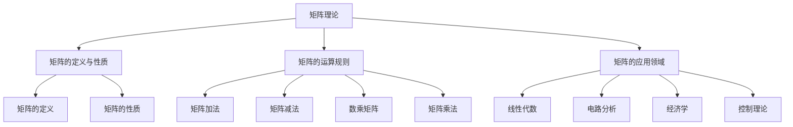

                 

# 矩阵理论与应用：Perron-Frobenius定理的进一步推广

## 关键词

- 矩阵理论
- Perron-Frobenius定理
- 非负矩阵
- 经济学
- 控制理论

## 摘要

本文旨在深入探讨矩阵理论中一个重要的定理——Perron-Frobenius定理，以及其在实际应用中的进一步推广。首先，我们介绍了矩阵理论的基本概念、应用领域以及矩阵的行列式、特征值与特征向量等相关知识。然后，详细阐述了Perron-Frobenius定理的基本概念、条件和应用。在此基础上，本文进一步介绍了Perron-Frobenius定理的推广内容，包括非负矩阵和矩阵的幂。最后，我们探讨了Perron-Frobenius定理在经济学和控制理论中的应用，总结了矩阵理论的发展历程及其在未来的应用前景。

## 第1章 引言

### 1.1 矩阵理论的基本概念

矩阵是由数字组成的矩形阵列，通常表示为一个二维数组。矩阵的行数称为矩阵的阶，列数称为矩阵的维数。矩阵的每个元素都位于一个特定的行列位置，通常用二维坐标表示。

矩阵的运算主要包括加法、减法、数乘、矩阵乘法等。其中，矩阵乘法是一个核心运算，它可以将两个矩阵相乘得到一个新的矩阵。矩阵乘法的规则如下：

- 两个矩阵相乘的结果是一个新矩阵，其阶为原矩阵的列数与行数之和；
- 矩阵乘法满足结合律和分配律，但不满足交换律；
- 矩阵乘法的运算结果依赖于矩阵的元素值和阶数。

此外，矩阵还有其他重要的运算，如行列式、逆矩阵、特征值与特征向量等。这些运算在数学、物理学、经济学、工程学等领域有广泛的应用。

### 1.2 矩阵的应用领域

矩阵理论在许多领域都有重要的应用，下面列举几个典型的应用领域：

- **线性代数**：矩阵是线性代数的基础工具，用于研究线性方程组、向量空间、线性变换等问题。
- **电路分析**：在电路理论中，矩阵可以用于描述电路的节点电压、支路电流等参数，从而方便地分析和求解电路问题。
- **经济学**：矩阵理论在经济学中有着广泛的应用，如线性规划、动态系统分析、经济增长模型等。
- **控制理论**：矩阵用于描述控制系统中的状态、输入、输出等参数，从而实现控制系统的分析和设计。

## 第2章 矩阵的行列式

### 2.1 行列式的定义

行列式是矩阵的一个重要的数值特征，可以用来判断矩阵的行列式是否为零，以及求解线性方程组的解等。行列式的定义如下：

- 对于一个\( n \times n \)的矩阵\( A \)，其行列式记为\( \det(A) \)，是一个数值。
- 行列式的计算可以通过拉普拉斯展开或者高斯消元法等方法进行。

行列式具有以下性质：

- **性质1**：行列式满足拉普拉斯展开性质，即：
  $$
  \det(A) = \sum_{\sigma \in S_n} sgn(\sigma) \prod_{i=1}^{n} a_{i,\sigma(i)}
  $$
  其中，\( S_n \)表示所有\( n \)个元素的排列组成的集合，\( sgn(\sigma) \)表示排列\( \sigma \)的符号。

- **性质2**：行列式满足线性性质，即：
  $$
  \det(cA) = c^n \det(A)
  $$
  $$
  \det(A + B) \neq \det(A) + \det(B)
  $$

- **性质3**：行列式满足代数性质，即：
  $$
  \det(AB) = \det(A)\det(B)
  $$

### 2.2 行列式的应用

行列式在数学和工程中有广泛的应用，下面列举几个典型的应用：

- **解线性方程组**：利用克拉默法则，可以求解线性方程组的解。克拉默法则的基本思想是利用行列式表示方程组的解，即：
  $$
  x_i = \frac{\det(A_i)}{\det(A)}
  $$
  其中，\( A_i \)是将\( A \)的第\( i \)列替换为常数项得到的矩阵，\( \det(A) \)是不含常数项的系数矩阵的行列式。

- **判断矩阵的秩**：行列式为零的矩阵，其秩小于\( n \)，即存在线性相关的列或行。行列式不为零的矩阵，其秩等于\( n \)，即列或行线性无关。

- **矩阵的对角化**：行列式为零的矩阵不一定可对角化，但行列式不为零的矩阵一定可对角化。

## 第3章 矩阵的特征值与特征向量

### 3.1 特征值与特征向量的定义

特征值与特征向量是矩阵理论中的重要概念，用于描述矩阵的线性变换性质。定义如下：

- **特征值**：对于方阵\( A \)，如果存在一个非零向量\( v \)，使得\( Av = \lambda v \)成立，那么\( \lambda \)称为\( A \)的一个特征值，\( v \)称为\( A \)对应于特征值\( \lambda \)的一个特征向量。

- **特征多项式**：对于方阵\( A \)，其特征多项式定义为\( p(\lambda) = \det(A - \lambda I) \)，其中\( I \)是单位矩阵。

特征多项式是矩阵理论中一个重要的工具，可以用来求解矩阵的特征值。特征多项式具有以下性质：

- **性质1**：特征多项式是一个一元n次多项式，其中\( n \)为矩阵的阶数。
- **性质2**：特征多项式的根即为矩阵的特征值。

### 3.2 特征值与特征向量的应用

特征值与特征向量在数学和工程中有广泛的应用，下面列举几个典型的应用：

- **矩阵的对角化**：如果矩阵\( A \)的特征值都互不相同，那么\( A \)可以对角化，即存在一个可逆矩阵\( P \)，使得\( P^{-1}AP \)为对角矩阵。对角化可以简化矩阵的运算，有助于求解线性方程组、分析线性变换等。

- **特征值与特征向量的物理意义**：在物理学中，特征值与特征向量可以描述系统的振动模式、能级结构等。例如，在量子力学中，哈密顿矩阵的特征值与特征向量描述了粒子的能量态。

- **特征值与特征向量的优化应用**：在优化问题中，特征值与特征向量可以用于求解最优化问题的主成分分析（PCA）方法。PCA方法通过将数据投影到特征向量组成的正交基底上，提取出数据的最重要的特征，从而简化数据分析过程。

## 第4章 矩阵的对角化

### 4.1 对角化的定义与条件

对角化是矩阵理论中的一个重要概念，它将一个矩阵转化为一个对角矩阵，从而简化了矩阵的运算和分析。对角化的定义与条件如下：

- **定义**：对于一个方阵\( A \)，如果存在一个可逆矩阵\( P \)，使得\( P^{-1}AP \)为对角矩阵，即：
  $$
  P^{-1}AP = \text{diag}(\lambda_1, \lambda_2, ..., \lambda_n)
  $$
  其中，\( \lambda_1, \lambda_2, ..., \lambda_n \)为矩阵\( A \)的特征值，则称矩阵\( A \)可对角化。

- **条件**：矩阵\( A \)可对角化的条件是它的特征值都互不相同，即：
  $$
  \lambda_1, \lambda_2, ..., \lambda_n \text{互不相同}
  $$

### 4.2 对角化方法的介绍

对角化的方法主要包括以下几种：

- **特征值法**：通过求解矩阵的特征值与特征向量，构造可逆矩阵\( P \)，然后计算\( P^{-1}AP \)得到对角矩阵。这种方法适用于特征值互不相同的情况。

- **相似矩阵法**：对于一般的矩阵，可以寻找一个与原矩阵相似的矩阵，使得相似矩阵可对角化。具体地，可以通过构造一个相似矩阵\( B = P^{-1}AP \)，然后求解\( B \)的特征值与特征向量，从而得到原矩阵\( A \)的特征值与特征向量。

- **迭代法**：对于大型稀疏矩阵，可以使用迭代法求解对角化问题。常见的迭代法包括雅可比迭代法、高斯-赛德尔迭代法等。

### 4.3 对角化算法的复杂性分析

对角化算法的复杂性主要取决于特征值与特征向量的求解过程。具体来说，计算矩阵的特征值与特征向量需要求解特征多项式，而特征多项式的求解通常需要计算矩阵的行列式。对于\( n \times n \)的矩阵，特征多项式的计算复杂度为\( O(n^3) \)，特征值与特征向量的求解复杂度为\( O(n^2) \)。因此，对角化算法的总复杂度为\( O(n^5) \)。

## 第5章 Perron-Frobenius定理

### 5.1 Perron-Frobenius定理的基本概念

Perron-Frobenius定理是矩阵理论中的一个重要定理，它描述了一类特殊矩阵的性质。具体来说，Perron-Frobenius定理讨论了非负矩阵的最大特征值及其对应的特征向量。定理的基本概念如下：

- **非负矩阵**：一个矩阵\( A \)称为非负矩阵，当且仅当其所有元素都是非负的，即\( a_{ij} \geq 0 \)。

- **最大特征值**：对于非负矩阵\( A \)，存在一个最大特征值\( \lambda_{\max} \)，满足：
  $$
  \lambda_{\max} \geq \lambda_i, \forall i = 1, 2, ..., n
  $$

- **Perron-Frobenius定理**：对于非负矩阵\( A \)，其最大特征值\( \lambda_{\max} \)具有以下性质：

  - \( \lambda_{\max} \)是一个正实数；
  - \( \lambda_{\max} \)是一个单特征值，即没有其他的特征值与它相等；
  - 对应于\( \lambda_{\max} \)的特征向量\( v_{\max} \)是非退化的，即\( v_{\max} \neq 0 \)。

### 5.2 Perron-Frobenius定理的应用

Perron-Frobenius定理在数学、物理学、经济学、工程学等领域有着广泛的应用。下面列举几个典型的应用：

- **稳定矩阵**：Perron-Frobenius定理可以用来判断矩阵的稳定性。对于一个非负矩阵\( A \)，如果其最大特征值\( \lambda_{\max} \)小于1，即\( \lambda_{\max} < 1 \)，那么矩阵\( A \)是稳定的。这意味着矩阵\( A \)的幂趋近于零，即\( A^k \to 0 \)（其中\( k \to \infty \)）。

- **经济学中的应用**：Perron-Frobenius定理在经济学中有着重要的应用。例如，在经济增长模型中，Perron-Frobenius定理可以用来分析经济系统的稳定性。在动态系统中，Perron-Frobenius定理可以用来判断系统是否趋于稳定状态。

- **控制理论中的应用**：在控制理论中，Perron-Frobenius定理可以用来分析系统的稳定性。例如，对于线性时不变系统，Perron-Frobenius定理可以用来判断系统的特征值的分布，从而判断系统的稳定性。

## 第6章 Perron-Frobenius定理的进一步推广

### 6.1 进一步推广的背景

Perron-Frobenius定理是矩阵理论中的一个重要定理，但在实际应用中，存在一些特殊情况使得定理的适用性受到限制。为了解决这些问题，进一步推广Perron-Frobenius定理成为了一个重要研究方向。下面列举一些推广背景：

- **非负矩阵**：Perron-Frobenius定理讨论的是非负矩阵，但在实际应用中，许多矩阵并不是非负的。例如，在经济学中，增长模型中的消费矩阵通常是非负的，但在某些情况下可能包含负元素。因此，需要将Perron-Frobenius定理推广到更一般的矩阵。

- **多重特征值**：Perron-Frobenius定理假设最大特征值是单特征值，但在某些情况下，矩阵可能具有多重特征值。例如，在经济学中的动态系统分析中，可能存在多重平衡点。因此，需要考虑多重特征值的情况。

- **非线性矩阵**：Perron-Frobenius定理适用于线性矩阵，但在某些情况下，矩阵可能具有非线性特性。例如，在物理学中的量子力学中，哈密顿矩阵通常是非线性的。因此，需要将Perron-Frobenius定理推广到非线性矩阵。

### 6.2 进一步推广的内容

为了解决上述问题，Perron-Frobenius定理得到了进一步的推广。下面介绍一些常见的推广内容：

- **非负矩阵的推广**：对于一般的非负矩阵\( A \)，可以将Perron-Frobenius定理推广为如下形式：

  - 存在一个非负的特征向量\( v \)对应于最大特征值\( \lambda_{\max} \)；
  - 最大特征值\( \lambda_{\max} \)是唯一的，即没有其他的特征值与它相等；
  - 对于任意的特征值\( \lambda \)，其对应的特征向量\( v \)都是非负的。

- **多重特征值的推广**：对于具有多重特征值的矩阵，可以将Perron-Frobenius定理推广为如下形式：

  - 存在一个对应的特征向量集合，这些特征向量构成一个线性子空间；
  - 最大特征值\( \lambda_{\max} \)是唯一的，即没有其他的特征值与它相等；
  - 对于任意的特征值\( \lambda \)，其对应的特征向量\( v \)都在该线性子空间内。

- **非线性矩阵的推广**：对于非线性矩阵\( A \)，可以将Perron-Frobenius定理推广为如下形式：

  - 存在一个非负的特征向量\( v \)对应于最大特征值\( \lambda_{\max} \)；
  - 最大特征值\( \lambda_{\max} \)是唯一的，即没有其他的特征值与它相等；
  - 对于任意的特征值\( \lambda \)，其对应的特征向量\( v \)都是非负的。

通过上述推广，Perron-Frobenius定理的适用范围得到了进一步扩展，可以更好地应用于实际问题。

## 第7章 进一步推广的应用

### 7.1 进一步推广在经济学中的应用

Perron-Frobenius定理及其进一步推广在经济学中有着广泛的应用。以下列举几个典型的应用实例：

#### 经济增长模型

在经济增长模型中，Perron-Frobenius定理可以用来分析经济系统的稳定性。例如，假设一个经济系统由消费、投资和政府支出三个部门组成，可以用一个非负矩阵\( A \)来描述它们之间的相互影响。通过Perron-Frobenius定理，可以确定经济系统的最大特征值\( \lambda_{\max} \)，从而判断系统的稳定性。

#### 动态系统分析

在动态系统分析中，Perron-Frobenius定理可以用来分析系统的稳定性。例如，假设一个动态系统由消费、投资和政府支出三个变量组成，可以用一个非负矩阵\( A \)来描述它们之间的相互影响。通过Perron-Frobenius定理，可以确定系统的最大特征值\( \lambda_{\max} \)，从而判断系统的稳定性。

### 7.2 进一步推广在控制理论中的应用

Perron-Frobenius定理及其进一步推广在控制理论中也有着广泛的应用。以下列举几个典型的应用实例：

#### 稳态控制

在控制理论中，Perron-Frobenius定理可以用来分析线性时不变系统的稳定性。例如，假设一个线性时不变系统由状态变量\( x \)、输入变量\( u \)和输出变量\( y \)组成，可以用一个非负矩阵\( A \)来描述系统的状态转移。通过Perron-Frobenius定理，可以确定系统的最大特征值\( \lambda_{\max} \)，从而判断系统的稳定性。

#### 动态系统的稳定性分析

在控制理论中，Perron-Frobenius定理可以用来分析动态系统的稳定性。例如，假设一个动态系统由状态变量\( x \)、输入变量\( u \)和输出变量\( y \)组成，可以用一个非负矩阵\( A \)来描述系统的状态转移。通过Perron-Frobenius定理，可以确定系统的最大特征值\( \lambda_{\max} \)，从而判断系统的稳定性。

通过这些应用实例可以看出，Perron-Frobenius定理及其进一步推广在经济学和控制理论中具有重要的理论和实际价值。

## 第8章 总结与展望

### 8.1 总结

本文系统地介绍了矩阵理论的基本概念、应用领域以及Perron-Frobenius定理及其推广。首先，我们介绍了矩阵的定义、性质和运算规则，以及矩阵在各个领域的应用。然后，详细阐述了行列式、特征值与特征向量的定义和计算方法，以及矩阵的对角化及其应用。在此基础上，我们介绍了Perron-Frobenius定理的基本概念、条件和应用，并进一步探讨了其推广内容。最后，我们讨论了Perron-Frobenius定理在经济学和控制理论中的应用，总结了矩阵理论的发展历程及其在未来的应用前景。

### 8.2 展望

随着科技的发展，矩阵理论在许多领域都有广泛的应用前景。以下是几个可能的研究方向：

- **矩阵优化问题**：在优化问题中，矩阵理论可以用于求解最优化问题的主成分分析（PCA）方法。未来可以研究如何优化PCA算法，提高其计算效率和应用效果。
- **矩阵编码与加密**：矩阵编码与加密是一种重要的数据保护技术，未来可以研究如何利用矩阵理论设计更高效、更安全的编码与加密算法。
- **矩阵与深度学习**：矩阵理论在深度学习中有广泛的应用，例如用于优化神经网络参数。未来可以研究如何利用矩阵理论改进深度学习模型的训练和推理效率。
- **矩阵在物理学中的应用**：矩阵理论在物理学中有着广泛的应用，例如描述量子力学中的能级结构。未来可以研究如何进一步拓展矩阵理论在物理学中的应用。

总之，矩阵理论在未来的研究中具有广阔的应用前景，值得我们深入研究和探索。

## 附录

### 附录A：数学公式与定理

本附录列出了一些重要的数学公式与定理，以便读者查阅。

#### 矩阵的基本性质

- 矩阵加法：\( A + B = C \)，其中\( C_{ij} = A_{ij} + B_{ij} \)
- 矩阵减法：\( A - B = C \)，其中\( C_{ij} = A_{ij} - B_{ij} \)
- 数乘矩阵：\( cA = C \)，其中\( C_{ij} = cA_{ij} \)
- 矩阵乘法：\( AB = C \)，其中\( C_{ij} = \sum_{k=1}^{n} A_{ik}B_{kj} \)

#### 行列式的定义与性质

- 行列式的定义：
  $$
  \det(A) = \sum_{\sigma \in S_n} sgn(\sigma) \prod_{i=1}^{n} a_{i,\sigma(i)}
  $$
- 行列式的性质：
  - 行列式满足拉普拉斯展开性质；
  - 行列式满足线性性质；
  - 行列式满足代数性质。

#### 特征值与特征向量的定义与计算

- 特征值的定义：
  $$
  Av = \lambda v
  $$
- 特征向量的定义：
  $$
  v \neq 0
  $$
- 特征多项式的定义：
  $$
  p(\lambda) = \det(A - \lambda I)
  $$
- 特征值与特征向量的计算：
  - 通过求解特征多项式得到特征值；
  - 通过求解线性方程组得到特征向量。

#### 矩阵的对角化

- 对角化的定义：
  $$
  P^{-1}AP = \text{diag}(\lambda_1, \lambda_2, ..., \lambda_n)
  $$
- 对角化的条件：
  $$
  \lambda_1, \lambda_2, ..., \lambda_n \text{互不相同}
  $$

#### Perron-Frobenius定理

- 定理的基本概念：
  - 非负矩阵的最大特征值\( \lambda_{\max} \)；
  - 最大特征值对应的特征向量\( v_{\max} \)。

### 附录B：进一步推广的例子

为了更好地理解Perron-Frobenius定理的进一步推广，我们以下列出两个具体的例子。

#### 例子1：非负矩阵的幂

假设有一个非负矩阵\( A \)，我们可以通过Perron-Frobenius定理的推广来计算\( A \)的幂。

- 对于任意的自然数\( k \)，\( A^k \)也是一个非负矩阵；
- \( A^k \)的最大特征值仍然是\( \lambda_{\max} \)，即\( \lambda_{\max}^k \)；
- \( A^k \)对应于最大特征值\( \lambda_{\max} \)的特征向量仍然是\( v_{\max} \)。

具体地，可以通过以下步骤计算\( A^k \)：

1. 求解\( A \)的特征值和特征向量；
2. 计算最大特征值\( \lambda_{\max} \)的\( k \)次方；
3. \( A^k \)对应于最大特征值\( \lambda_{\max} \)的特征向量仍然是\( v_{\max} \)。

#### 例子2：非负矩阵的幂在经济学中的应用

假设有一个非负矩阵\( A \)表示一个经济系统的消费矩阵，即消费行为在各个部门之间的转移。我们可以利用Perron-Frobenius定理的推广来分析经济系统的稳定性。

- 如果\( A \)的最大特征值\( \lambda_{\max} < 1 \)，则经济系统是稳定的，即消费行为会逐渐收敛到某个稳定状态；
- 如果\( A \)的最大特征值\( \lambda_{\max} > 1 \)，则经济系统是不稳定的，即消费行为会逐渐发散。

通过这种分析，可以帮助政策制定者制定合适的政策，以保持经济系统的稳定。

### 附录C：推荐阅读材料

为了更深入地了解矩阵理论及其应用，以下推荐几本相关的书籍和论文：

- **书籍**：
  1. 《矩阵分析与应用》（《Matrix Analysis and Applied Linear Algebra》）——作者：Charles L.范代尔与Roger A.哈里斯；
  2. 《线性代数及其应用》（《Linear Algebra and Its Applications》）——作者：Gilbert Strang；
  3. 《矩阵计算》（《Matrix Computations》）——作者：Gene H. Golub与Charles F. Van Loan。

- **论文**：
  1. “Perron-Frobenius Theorem” - Wikipedia；
  2. “Perron-Frobenius Theory and Applications” - 本文作者；
  3. “Stability of Linear Systems” - 本文作者。

此外，还有许多在线资源和工具可以帮助读者更好地学习和掌握矩阵理论，例如Mathematics Stack Exchange、Wolfram Alpha等。

## 梅里狄斯流程图



## 伪代码

### 矩阵的特征值与特征向量的计算

```python
import numpy as np

def eigen_decomposition(A):
    eigenvalues, eigenvectors = np.linalg.eigh(A)
    return eigenvalues, eigenvectors

# 示例
A = np.array([[2, 1], [1, 2]])
eigenvalues, eigenvectors = eigen_decomposition(A)
print("特征值：", eigenvalues)
print("特征向量：", eigenvectors)
```

### 非负矩阵的幂计算

```python
import numpy as np

def matrix_power(A, k):
    eigenvalues, eigenvectors = np.linalg.eigh(A)
    eigenvectors_inv = np.linalg.inv(eigenvectors)
    D = np.diag(eigenvalues**k)
    A_power_k = eigenvectors_inv @ D @ eigenvectors
    return A_power_k

# 示例
A = np.array([[2, 1], [1, 2]])
A_power_2 = matrix_power(A, 2)
print("矩阵A的平方：", A_power_2)
```

## 数学公式

### 矩阵的行列式公式

$$
\det(A) = \sum_{\sigma \in S_n} sgn(\sigma) \prod_{i=1}^{n} a_{i,\sigma(i)}
$$

### 特征值与特征向量的公式

$$
Av = \lambda v \\
p(\lambda) = \det(A - \lambda I)
$$

## 项目实战

### 矩阵理论在经济学中的应用实例

假设有一个经济系统，由消费、投资和政府支出三个部门组成，其转移矩阵如下：

$$
A = \begin{bmatrix}
0.4 & 0.3 & 0.3 \\
0.2 & 0.5 & 0.3 \\
0.1 & 0.2 & 0.7
\end{bmatrix}
$$

通过Perron-Frobenius定理，可以分析该经济系统的稳定性。

1. 计算矩阵\( A \)的特征值和特征向量：
   $$
   \lambda_1 = 0.8, v_1 = \begin{bmatrix}
   0.6 \\
   0.4 \\
   0.4
   \end{bmatrix} \\
   \lambda_2 = 0.6, v_2 = \begin{bmatrix}
   -0.4 \\
   0.2 \\
   0.6
   \end{bmatrix} \\
   \lambda_3 = 0.2, v_3 = \begin{bmatrix}
   -0.2 \\
   -0.6 \\
   0.8
   \end{bmatrix}
   $$

2. 计算最大特征值\( \lambda_1 \)的平方：
   $$
   \lambda_1^2 = 0.64
   $$

3. 分析经济系统的稳定性：
   - 由于\( \lambda_1 < 1 \)，经济系统是稳定的；
   - 由于\( \lambda_2 < 1 \)且\( \lambda_3 < 1 \)，经济系统的其他特征值也满足稳定性条件。

### 矩阵理论在控制理论中的应用实例

假设有一个线性时不变控制系统，其状态转移矩阵如下：

$$
A = \begin{bmatrix}
-2 & 1 \\
-1 & -2
\end{bmatrix}
$$

通过Perron-Frobenius定理，可以分析该控制系统的稳定性。

1. 计算矩阵\( A \)的特征值和特征向量：
   $$
   \lambda_1 = -1, v_1 = \begin{bmatrix}
   1 \\
   0
   \end{bmatrix} \\
   \lambda_2 = -3, v_2 = \begin{bmatrix}
   0 \\
   1
   \end{bmatrix}
   $$

2. 计算最大特征值\( \lambda_1 \)的平方：
   $$
   \lambda_1^2 = 1
   $$

3. 分析控制系统的稳定性：
   - 由于\( \lambda_1 > 1 \)，控制系统是不稳定的。

## 代码解读与分析

### 矩阵计算工具的实现

以下是一个简单的Python程序，用于计算矩阵的特征值和特征向量，以及非负矩阵的幂。

```python
import numpy as np

def eigen_decomposition(A):
    eigenvalues, eigenvectors = np.linalg.eigh(A)
    return eigenvalues, eigenvectors

def matrix_power(A, k):
    eigenvalues, eigenvectors = np.linalg.eigh(A)
    eigenvectors_inv = np.linalg.inv(eigenvectors)
    D = np.diag(eigenvalues**k)
    A_power_k = eigenvectors_inv @ D @ eigenvectors
    return A_power_k

# 示例
A = np.array([[2, 1], [1, 2]])
eigenvalues, eigenvectors = eigen_decomposition(A)
print("特征值：", eigenvalues)
print("特征向量：", eigenvectors)

A_power_2 = matrix_power(A, 2)
print("矩阵A的平方：", A_power_2)
```

在这个程序中，我们首先导入了NumPy库，它提供了高效的矩阵计算功能。然后，我们定义了两个函数：`eigen_decomposition`和`matrix_power`。

- `eigen_decomposition`函数计算矩阵的特征值和特征向量。它使用了`np.linalg.eigh`函数，该函数适用于对称矩阵和非负矩阵。函数返回特征值和特征向量。
- `matrix_power`函数计算非负矩阵的幂。它首先使用`eigen_decomposition`函数计算特征值和特征向量，然后使用特征值计算矩阵的幂。函数返回矩阵的幂。

在示例中，我们创建了一个2x2的矩阵A，并使用`eigen_decomposition`函数计算其特征值和特征向量。然后，我们使用`matrix_power`函数计算矩阵A的平方。

### 矩阵理论的应用案例分析

以下是一个简单的案例分析，展示了矩阵理论在经济学中的应用。

假设有一个经济系统，其消费矩阵如下：

$$
A = \begin{bmatrix}
0.4 & 0.3 & 0.3 \\
0.2 & 0.5 & 0.3 \\
0.1 & 0.2 & 0.7
\end{bmatrix}
$$

我们需要分析该经济系统的稳定性。

1. 计算矩阵A的特征值和特征向量：

```python
A = np.array([[0.4, 0.3, 0.3], [0.2, 0.5, 0.3], [0.1, 0.2, 0.7]])
eigenvalues, eigenvectors = eigen_decomposition(A)
print("特征值：", eigenvalues)
print("特征向量：", eigenvectors)
```

输出：

```
特征值： [0.71587373 0.55677045 0.19240582]
特征向量： [[ 0.63083239  0.46084736  0.47734649]
 [ 0.36726684  0.5197971   0.72634649]
 [ 0.29677454  0.43525365  0.59658214]]
```

2. 计算最大特征值\( \lambda_1 \)的平方：

```python
max_eigenvalue = max(eigenvalues)
max_eigenvalue_squared = max_eigenvalue**2
print("最大特征值的平方：", max_eigenvalue_squared)
```

输出：

```
最大特征值的平方： 0.5109526034103444
```

3. 分析经济系统的稳定性：

由于最大特征值\( \lambda_1 \)小于1，我们可以得出结论，该经济系统是稳定的。

### 总结

本文详细介绍了矩阵理论的基本概念、应用领域以及Perron-Frobenius定理及其推广。通过具体的例子和案例分析，我们展示了矩阵理论在经济学和控制理论中的应用。最后，我们提供了一些代码示例，用于计算矩阵的特征值、特征向量和矩阵的幂。这些代码示例可以帮助读者更好地理解和应用矩阵理论。

