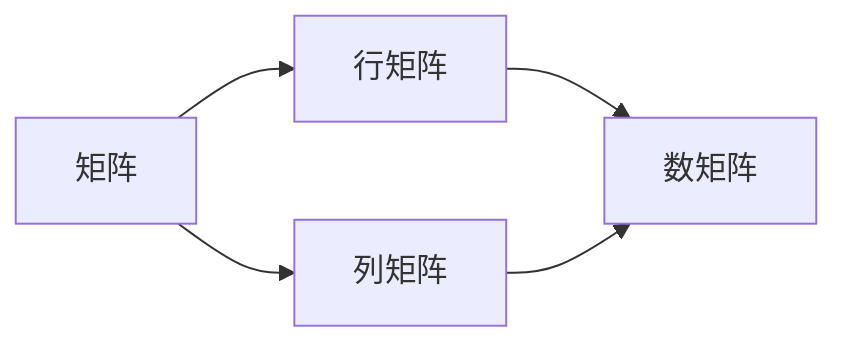
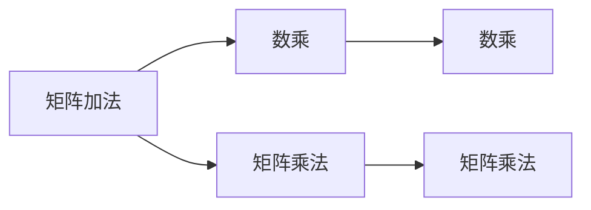
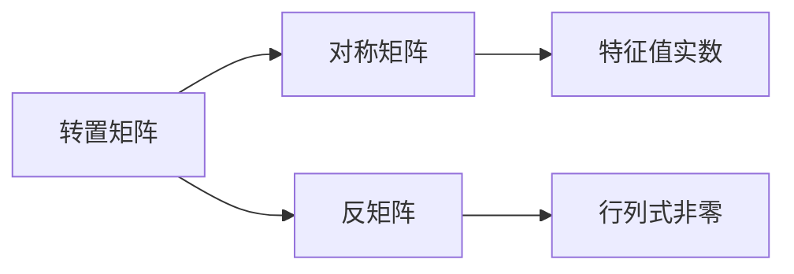

                 

### 文章标题：矩阵理论与应用：一般矩阵函数的谱分解

#### 关键词：矩阵理论、谱分解、矩阵函数、特征值、特征向量、优化问题、数值分析

> 摘要：本文深入探讨了矩阵理论与应用中的一般矩阵函数的谱分解。首先，我们回顾了矩阵的基本概念与运算，包括矩阵的定义、类型、运算规则以及特殊矩阵的性质。接着，我们详细介绍了线性方程组的解法，包括高斯消元法、迭代法以及矩阵的逆与秩。然后，我们介绍了矩阵特征值与特征向量的概念、矩阵的特征多项式与特征方程，以及对称矩阵的特征值问题。在此基础上，我们探讨了谱分解的基本原理，包括谱分解的定义、条件以及对称矩阵的谱分解。随后，我们介绍了一般矩阵的谱分解方法，包括鞅变法与谱分解、实对称矩阵的谱分解等。进一步，我们探讨了矩阵函数的基本概念及其谱分解方法，并结合优化问题和数值分析具体展示了谱分解的应用。最后，我们总结了矩阵理论与应用的核心要点，展望了矩阵理论在未来的发展趋势。

## 第一部分：矩阵理论与基础概念

### 第1章：矩阵基本概念与运算

#### 1.1 矩阵的定义与类型

**概念：**
- 矩阵（Matrix）：由数字组成的矩形阵列，通常表示为 $A = \begin{bmatrix} a_{11} & a_{12} & \cdots & a_{1n} \\ a_{21} & a_{22} & \cdots & a_{2n} \\ \vdots & \vdots & \ddots & \vdots \\ a_{m1} & a_{m2} & \cdots & a_{mn} \end{bmatrix}$。
- 行矩阵（Row Vector）：只有一行的矩阵，例如 $A = \begin{bmatrix} a_1 & a_2 & \cdots & a_n \end{bmatrix}$。
- 列矩阵（Column Vector）：只有一列的矩阵，例如 $A = \begin{bmatrix} a_1 \\ a_2 \\ \vdots \\ a_n \end{bmatrix}$。

**类型：**
- 数矩阵（Scalar Matrix）：由实数或复数组成的矩阵。
- 方阵（Square Matrix）：行数和列数相等的矩阵。
- 零矩阵（Zero Matrix）：所有元素均为零的矩阵。
- 单位矩阵（Identity Matrix）：对角线元素为1，其余元素为0的方阵。

**结构图：**


#### 1.2 矩阵的运算规则

**加法：**
- 定义：两个矩阵相加时，对应位置的元素相加。
- 例如：$A + B = \begin{bmatrix} a_{11} + b_{11} & a_{12} + b_{12} & \cdots & a_{1n} + b_{1n} \\ a_{21} + b_{21} & a_{22} + b_{22} & \cdots & a_{2n} + b_{2n} \\ \vdots & \vdots & \ddots & \vdots \\ a_{m1} + b_{m1} & a_{m2} + b_{m2} & \cdots & a_{mn} + b_{mn} \end{bmatrix}$。

**数乘：**
- 定义：一个矩阵与一个标量相乘时，矩阵的每个元素都乘以该标量。
- 例如：$cA = \begin{bmatrix} ca_{11} & ca_{12} & \cdots & ca_{1n} \\ ca_{21} & ca_{22} & \cdots & ca_{2n} \\ \vdots & \vdots & \ddots & \vdots \\ ca_{m1} & ca_{m2} & \cdots & ca_{mn} \end{bmatrix}$。

**乘法：**
- 定义：两个矩阵相乘时，第一个矩阵的列数必须等于第二个矩阵的行数。
- 例如：$AB = \begin{bmatrix} \sum_{j=1}^{n} a_{1j}b_{j1} & \sum_{j=1}^{n} a_{1j}b_{j2} & \cdots & \sum_{j=1}^{n} a_{1j}b_{jn} \\ \sum_{j=1}^{n} a_{2j}b_{j1} & \sum_{j=1}^{n} a_{2j}b_{j2} & \cdots & \sum_{j=1}^{n} a_{2j}b_{jn} \\ \vdots & \vdots & \ddots & \vdots \\ \sum_{j=1}^{n} a_{mj}b_{j1} & \sum_{j=1}^{n} a_{mj}b_{j2} & \cdots & \sum_{j=1}^{n} a_{mj}b_{jn} \end{bmatrix}$。

**运算规则图：**


#### 1.3 特殊矩阵及其性质

**转置矩阵：**
- 定义：将矩阵的行和列互换，得到的新矩阵称为原矩阵的转置矩阵。
- 例如：若 $A = \begin{bmatrix} a_{11} & a_{12} & \cdots & a_{1n} \\ a_{21} & a_{22} & \cdots & a_{2n} \\ \vdots & \vdots & \ddots & \vdots \\ a_{m1} & a_{m2} & \cdots & a_{mn} \end{bmatrix}$，则 $A^T = \begin{bmatrix} a_{11} & a_{21} & \cdots & a_{m1} \\ a_{12} & a_{22} & \cdots & a_{m2} \\ \vdots & \vdots & \ddots & \vdots \\ a_{1n} & a_{2n} & \cdots & a_{mn} \end{bmatrix}$。

**对称矩阵：**
- 定义：一个方阵，如果它的转置矩阵等于自身，即 $A^T = A$，则称这个方阵为对称矩阵。
- 性质：对称矩阵的特征值都是实数，且每个特征向量都是该特征值的正交补。

**反矩阵：**
- 定义：一个方阵，如果它的逆矩阵存在，则称这个方阵为可逆矩阵。方阵 $A$ 的逆矩阵记为 $A^{-1}$。
- 性质：可逆矩阵的行列式不为零，且 $AA^{-1} = A^{-1}A = I$，其中 $I$ 为单位矩阵。

**特殊矩阵性质图：**


### 第2章：线性方程组的解法

#### 2.1 高斯消元法

**概念：**
- 高斯消元法：通过初等行变换，将线性方程组转化为阶梯形式或简化阶梯形式，从而求解方程组。

**步骤：**
1. 将线性方程组写成增广矩阵形式。
2. 通过初等行变换，将增广矩阵转化为简化阶梯形式。
3. 求解简化阶梯形式对应的方程组。

**伪代码：**
```pseudo
输入：线性方程组 A * x = b
输出：解向量 x

1. 将方程组写成增广矩阵 [A | b]
2. 对 [A | b] 进行初等行变换，化为简化阶梯形式
3. 求解简化阶梯形式对应的方程组，得到解向量 x
```

**示例：**
```python
import numpy as np

# 线性方程组 A * x = b
A = np.array([[2, 1], [3, 2]])
b = np.array([7, 9])

# 高斯消元法
def gauss_elimination(A, b):
    n = len(b)
    # 步骤 1: 将方程组写成增广矩阵
    Aug_matrix = np.hstack((A, b.reshape(-1, 1)))
    # 步骤 2: 进行初等行变换
    for i in range(n):
        pivot = Aug_matrix[i, i]
        for j in range(i+1, n):
            factor = Aug_matrix[j, i] / pivot
            for k in range(n+1):
                Aug_matrix[j, k] -= factor * Aug_matrix[i, k]
    # 步骤 3: 求解简化阶梯形式对应的方程组
    x = np.zeros(n)
    for i in range(n-1, -1, -1):
        x[i] = (Aug_matrix[i, n] - np.dot(Aug_matrix[i, i+1:], x[i+1:])) / Aug_matrix[i, i]
    return x

x = gauss_elimination(A, b)
print(x)
```

#### 2.2 迭代法

**概念：**
- 迭代法：通过不断迭代逼近方程组的解。

**步骤：**
1. 初始化近似解向量。
2. 对每个迭代步骤，更新近似解向量。
3. 当近似解向量变化小于某个阈值时，停止迭代。

**伪代码：**
```pseudo
输入：线性方程组 A * x = b，初始解向量 x0，阈值 ε
输出：解向量 x

1. x0 = 初始化解向量
2. while (||x_new - x_old|| > ε)
    1. x_old = x_new
    2. x_new = A^{-1} * b
3. 返回 x_new
```

**示例：**
```python
import numpy as np

# 线性方程组 A * x = b
A = np.array([[2, 1], [3, 2]])
b = np.array([7, 9])

# 迭代法
def iterative_method(A, b, x0, tol):
    n = len(b)
    x_new = x0
    while True:
        x_old = x_new
        x_new = np.linalg.inv(A) @ b
        if np.linalg.norm(x_new - x_old) < tol:
            break
    return x_new

x = iterative_method(A, b, np.zeros(2), 1e-5)
print(x)
```

#### 2.3 矩阵的逆与秩

**概念：**
- 逆矩阵：一个方阵的逆矩阵是另一个方阵，使得它们的乘积等于单位矩阵。
- 秩：一个矩阵的秩是指其行数和列数中较小的那个数。

**性质：**
- 矩阵可逆的充要条件是矩阵的秩等于其行数和列数。
- 若矩阵 A 可逆，则其逆矩阵存在且唯一。

**计算：**
- 高斯消元法可以同时计算矩阵的秩和逆矩阵。

**伪代码：**
```pseudo
输入：矩阵 A
输出：逆矩阵 A^{-1}

1. 将矩阵 A 转化为增广矩阵 [A | I]
2. 对 [A | I] 进行初等行变换，化为简化阶梯形式
3. 逆矩阵 A^{-1} 即为增广矩阵右侧的矩阵
```

### 第3章：矩阵特征值与特征向量

#### 3.1 特征值与特征向量的概念

**概念：**
- 特征值（Eigenvalue）：一个方阵 $A$ 的特征值是使得线性方程 $(A - λI)x = 0$ 有非零解的标量 λ。
- 特征向量（ Eigenvector）：满足线性方程 $(A - λI)x = 0$ 的非零向量 x。

**性质：**
- 特征值与特征向量是相互关联的。
- 对称矩阵的特征值都是实数。
- 可逆矩阵的特征值都不为零。

**示例：**
考虑方阵 $A = \begin{bmatrix} 2 & 1 \\ 1 & 2 \end{bmatrix}$，求解其特征值与特征向量。

1. **计算特征多项式：**
   \[
   p(λ) = \det(A - λI) = \det\begin{bmatrix} 2-λ & 1 \\ 1 & 2-λ \end{bmatrix} = (2-λ)^2 - 1 = λ^2 - 4λ + 3
   \]
2. **解特征方程：**
   \[
   λ^2 - 4λ + 3 = 0
   \]
   解得特征值 λ1 = 1，λ2 = 3。
3. **计算特征向量：**
   对于 λ1 = 1，解线性方程组 $(A - I)x = 0$：
   \[
   \begin{bmatrix} 1 & 1 \\ 1 & 1 \end{bmatrix}x = 0
   \]
   得到特征向量 v1 = [1, -1]。
   对于 λ2 = 3，解线性方程组 $(A - 3I)x = 0$：
   \[
   \begin{bmatrix} -1 & 1 \\ 1 & -1 \end{bmatrix}x = 0
   \]
   得到特征向量 v2 = [1, 1]。

#### 3.2 矩阵的特征多项式与特征方程

**概念：**
- 特征多项式（Characteristic Polynomial）：矩阵 $A$ 的特征多项式是关于特征值 λ 的多项式，记为 $p(λ) = \det(A - λI)$。
- 特征方程（Eigenvalue Equation）：特征多项式等于零的方程，即 $p(λ) = 0$。

**性质：**
- 特征方程的根是矩阵的特征值。
- 特征方程的系数可以通过矩阵 $A$ 的元素计算得到。

**示例：**
考虑方阵 $A = \begin{bmatrix} 2 & 3 \\ -1 & 1 \end{bmatrix}$，计算其特征多项式和特征方程。

1. **计算特征多项式：**
   \[
   p(λ) = \det(A - λI) = \det\begin{bmatrix} 2-λ & 3 \\ -1 & 1-λ \end{bmatrix} = (2-λ)(1-λ) - 3(-1) = λ^2 - 3λ + 5
   \]
2. **解特征方程：**
   \[
   λ^2 - 3λ + 5 = 0
   \]
   使用求根公式解得特征值 λ1 = 1.5 + i，λ2 = 1.5 - i。

#### 3.3 对称矩阵的特征值问题

**概念：**
- 对称矩阵（Symmetric Matrix）：一个方阵 $A$，如果它的转置矩阵等于自身，即 $A^T = A$，则称这个方阵为对称矩阵。

**性质：**
- 对称矩阵的特征值都是实数。
- 对称矩阵的特征向量都是相互正交的。

**计算：**
- 通过求解特征方程，可以计算出对称矩阵的所有特征值。
- 通过求解线性方程组，可以计算出对称矩阵的所有特征向量。

**示例：**
考虑对称矩阵 $A = \begin{bmatrix} 2 & -1 \\ -1 & 2 \end{bmatrix}$，计算其特征值和特征向量。

1. **计算特征多项式：**
   \[
   p(λ) = \det(A - λI) = \det\begin{bmatrix} 2-λ & -1 \\ -1 & 2-λ \end{bmatrix} = (2-λ)^2 - 1 = λ^2 - 4λ + 3
   \]
2. **解特征方程：**
   \[
   λ^2 - 4λ + 3 = 0
   \]
   解得特征值 λ1 = 1，λ2 = 3。
3. **计算特征向量：**
   对于 λ1 = 1，解线性方程组 $(A - I)x = 0$：
   \[
   \begin{bmatrix} 1 & -1 \\ -1 & 1 \end{bmatrix}x = 0
   \]
   得到特征向量 v1 = [1, 1]。
   对于 λ2 = 3，解线性方程组 $(A - 3I)x = 0$：
   \[
   \begin{bmatrix} -1 & -1 \\ -1 & -1 \end{bmatrix}x = 0
   \]
   得到特征向量 v2 = [-1, 1]。

---

### 第4章：谱分解的基本原理

#### 4.1 谱分解的定义

**定义：**
- 谱分解：将一个矩阵表示为一系列特征值和特征向量的乘积。

**形式：**
- 对于方阵 $A$，其谱分解可以表示为 $A = PDP^{-1}$，其中 $P$ 是特征向量矩阵，$D$ 是对角矩阵，其对角线元素为特征值。

**示例：**
考虑方阵 $A = \begin{bmatrix} 2 & 1 \\ 1 & 2 \end{bmatrix}$，求解其谱分解。

1. **计算特征值和特征向量：**
   已知特征值 λ1 = 1，λ2 = 3，特征向量 v1 = [1, -1]，v2 = [1, 1]。
2. **构造特征向量矩阵 P 和对角矩阵 D：**
   \[
   P = \begin{bmatrix} 1 & 1 \\ -1 & 1 \end{bmatrix}, \quad D = \begin{bmatrix} 1 & 0 \\ 0 & 3 \end{bmatrix}
   \]
3. **计算谱分解：**
   \[
   A = PDP^{-1} = \begin{bmatrix} 1 & 1 \\ -1 & 1 \end{bmatrix} \begin{bmatrix} 1 & 0 \\ 0 & 3 \end{bmatrix} \begin{bmatrix} 1 & -1 \\ 1 & 1 \end{bmatrix} = \begin{bmatrix} 2 & 1 \\ 1 & 2 \end{bmatrix}
   \]

#### 4.2 谱分解的条件

**条件：**
- 矩阵 $A$ 可谱分解的充要条件是 $A$ 的特征向量线性无关。

**解释：**
- 如果矩阵 $A$ 的特征向量线性无关，那么它们可以构成一个基，从而使得 $A$ 可以唯一地表示为这些特征向量的线性组合。

#### 4.3 对称矩阵的谱分解

**定义：**
- 对称矩阵的谱分解：对于对称矩阵 $A$，其谱分解可以表示为 $A = PDP^{-1}$，其中 $P$ 是特征向量矩阵，$D$ 是对角矩阵，其对角线元素为特征值。

**性质：**
- 对称矩阵的特征向量都是正交的。
- 对称矩阵的特征值都是实数。

**计算：**
- 通过求解特征方程，可以计算出对称矩阵的所有特征值。
- 通过求解线性方程组，可以计算出对称矩阵的所有特征向量。

**示例：**
考虑对称矩阵 $A = \begin{bmatrix} 2 & -1 \\ -1 & 2 \end{bmatrix}$，求解其谱分解。

1. **计算特征多项式：**
   \[
   p(λ) = \det(A - λI) = \det\begin{bmatrix} 2-λ & -1 \\ -1 & 2-λ \end{bmatrix} = (2-λ)^2 - 1 = λ^2 - 4λ + 3
   \]
2. **解特征方程：**
   \[
   λ^2 - 4λ + 3 = 0
   \]
   解得特征值 λ1 = 1，λ2 = 3。
3. **计算特征向量：**
   对于 λ1 = 1，解线性方程组 $(A - I)x = 0$：
   \[
   \begin{bmatrix} 1 & -1 \\ -1 & 1 \end{bmatrix}x = 0
   \]
   得到特征向量 v1 = [1, 1]。
   对于 λ2 = 3，解线性方程组 $(A - 3I)x = 0$：
   \[
   \begin{bmatrix} -1 & -1 \\ -1 & -1 \end{bmatrix}x = 0
   \]
   得到特征向量 v2 = [-1, 1]。
4. **构造特征向量矩阵 P 和对角矩阵 D：**
   \[
   P = \begin{bmatrix} 1 & -1 \\ 1 & 1 \end{bmatrix}, \quad D = \begin{bmatrix} 1 & 0 \\ 0 & 3 \end{bmatrix}
   \]
5. **计算谱分解：**
   \[
   A = PDP^{-1} = \begin{bmatrix} 1 & -1 \\ 1 & 1 \end{bmatrix} \begin{bmatrix} 1 & 0 \\ 0 & 3 \end{bmatrix} \begin{bmatrix} 1 & 1 \\ -1 & 1 \end{bmatrix} = \begin{bmatrix} 2 & -1 \\ -1 & 2 \end{bmatrix}
   \]

---

### 第5章：一般矩阵的谱分解

#### 5.1 一般矩阵谱分解的方法

**方法：**
- 特征值分解法：通过求解矩阵的特征值和特征向量，实现一般矩阵的谱分解。

**步骤：**
1. 求解矩阵的特征值和特征向量。
2. 形成特征向量矩阵。
3. 形成对角矩阵。
4. 矩阵的谱分解为 $A = PDP^{-1}$。

**伪代码：**
```pseudo
输入：矩阵 A
输出：谱分解 A = PDP^{-1}

1. 求解 A 的特征值 λ1, λ2, ..., λn
2. 对应每个特征值 λi，求解线性方程组 (A - λiI)v = 0，得到特征向量 vi
3. 形成特征向量矩阵 P = [v1 | v2 | ... | vn]
4. 形成对角矩阵 D = diag(λ1, λ2, ..., λn)
5. 返回 PDP^{-1}
```

#### 5.2 鞅变法与谱分解

**概念：**
- 鞅变法：将一个矩阵转化为对称矩阵的方法。

**步骤：**
1. 对矩阵进行对角化，得到对角矩阵 $D$ 和可逆矩阵 $P$。
2. 对 $D$ 进行鞅变，得到对称矩阵 $B = PDP^{-1}$。

**关系：**
- 鞅变法与谱分解的关系在于，通过鞅变法可以将一般矩阵转化为对称矩阵，从而可以利用对称矩阵的谱分解方法。

**伪代码：**
```pseudo
输入：矩阵 A
输出：谱分解 A = PBP^{-1}

1. 计算 A 的特征多项式 p(λ)
2. 解特征方程 p(λ) = 0，得到特征值 λ1, λ2, ..., λn
3. 对每个特征值 λi，求解线性方程组 (A - λiI)v = 0，得到特征向量 vi
4. 形成特征向量矩阵 P = [v1 | v2 | ... | vn]
5. 形成对角矩阵 D = diag(λ1, λ2, ..., λn)
6. 对 D 进行鞅变，得到对称矩阵 B = PDP^{-1}
7. 返回 PBP^{-1}
```

#### 5.3 实对称矩阵的谱分解

**概念：**
- 实对称矩阵：一个方阵 $A$，如果它的转置矩阵等于自身，即 $A^T = A$，则称这个方阵为实对称矩阵。

**性质：**
- 实对称矩阵的特征值都是实数。
- 实对称矩阵的特征向量都是相互正交的。

**计算：**
- 通过求解特征方程，可以计算出实对称矩阵的所有特征值。
- 通过求解线性方程组，可以计算出实对称矩阵的所有特征向量。

**伪代码：**
```pseudo
输入：实对称矩阵 A
输出：谱分解 A = PDP^{-1}

1. 计算 A 的特征多项式 p(λ)
2. 解特征方程 p(λ) = 0，得到特征值 λ1, λ2, ..., λn
3. 对每个特征值 λi，求解线性方程组 (A - λiI)v = 0，得到特征向量 vi
4. 形成特征向量矩阵 P = [v1 | v2 | ... | vn]
5. 形成对角矩阵 D = diag(λ1, λ2, ..., λn)
6. 返回 PDP^{-1}
```

---

### 第6章：矩阵函数的谱分解

#### 6.1 矩阵函数的基本概念

**概念：**
- 矩阵函数：将一个矩阵映射到另一个矩阵的函数。

**类型：**
- 常见矩阵函数：指数函数、幂函数、对数函数等。

**示例：**
考虑矩阵函数 $f(A) = A^2$，其中 $A$ 是一个方阵。

#### 6.2 矩阵函数的谱分解

**概念：**
- 矩阵函数的谱分解：将一个矩阵函数表示为一系列特征值和特征向量的乘积。

**形式：**
- 对于矩阵函数 $f(A)$，其谱分解可以表示为 $f(A) = P f(\Lambda) P^{-1}$，其中 $P$ 是特征向量矩阵，$D$ 是对角矩阵，其对角线元素为特征值。

**步骤：**
1. 求解矩阵 $A$ 的特征值和特征向量。
2. 计算 $f$ 在特征值上的值。
3. 形成对角矩阵。
4. 计算矩阵函数 $f(A)$。

**伪代码：**
```pseudo
输入：矩阵 A，矩阵函数 f
输出：谱分解 f(A) = P f(\Lambda) P^{-1}

1. 求解 A 的特征值 λ1, λ2, ..., λn
2. 对应每个特征值 λi，求解线性方程组 (A - λiI)v = 0，得到特征向量 vi
3. 形成特征向量矩阵 P = [v1 | v2 | ... | vn]
4. 计算 f 在特征值上的值 f(λ1), f(λ2), ..., f(λn)
5. 形成对角矩阵 D = diag(f(λ1), f(λ2), ..., f(λn))
6. 返回 PDP^{-1}
```

#### 6.3 矩阵函数谱分解的应用

**应用：**
- 矩阵函数谱分解在优化问题中的应用。
- 矩阵函数谱分解在数值分析中的应用。

**示例：**
考虑优化问题 $min \| A - X \|_F$，其中 $\| \cdot \|_F$ 表示 Frobenius 范数。

1. **计算谱分解：**
   \[
   A = PDP^{-1}
   \]
2. **转化为求解特征值问题：**
   \[
   \| A - X \|_F = \| PDP^{-1} - X \|_F = \| PD^{-1}P^{-1}P - X \|_F = \| D - X \|_F
   \]
3. **最小化问题：**
   \[
   min \| D - X \|_F
   \]
4. **解特征值问题：**
   \[
   X = P D^{-1} P^{-1}
   \]

---

### 第7章：矩阵函数的谱分解应用实例

#### 7.1 在优化问题中的应用

**概述：**
- 矩阵函数的谱分解在优化问题中具有广泛的应用，特别是在求解最小二乘问题和最小化Frobenius范数问题。

**实例：**
- **最小二乘问题：**
  考虑最小化误差平方和的问题：
  \[
  min \| Ax - b \|_2^2
  \]
  通过谱分解，可以将问题转化为求解特征值问题：
  \[
  x = P D^{-1} P^{-1} b
  \]
  其中 $P$ 是特征向量矩阵，$D$ 是对角矩阵。

- **最小化Frobenius范数问题：**
  考虑最小化矩阵差的最大绝对值：
  \[
  min \| A - X \|_F
  \]
  通过谱分解，可以将问题转化为求解特征值问题：
  \[
  X = P D^{-1} P^{-1}
  \]

#### 7.2 在数值分析中的应用

**概述：**
- 矩阵函数的谱分解在数值分析中用于求解微分方程和积分方程。

**实例：**
- **求解微分方程：**
  考虑线性微分方程：
  \[
  \frac{dX}{dt} = A X
  \]
  通过谱分解，可以将问题转化为求解特征值问题：
  \[
  X(t) = P e^{Dt} P^{-1}
  \]
  其中 $P$ 是特征向量矩阵，$D$ 是对角矩阵。

- **求解积分方程：**
  考虑线性积分方程：
  \[
  X(t) = A \int_0^t K(s) X(s) ds
  \]
  通过谱分解，可以将问题转化为求解特征值问题：
  \[
  P e^{Dt} P^{-1} = A \int_0^t K(s) P e^{Ds} P^{-1} ds
  \]

#### 7.3 在其他领域中的应用

**概述：**
- 矩阵函数的谱分解在图像处理、信号处理和量子计算等领域也有广泛的应用。

**实例：**
- **图像处理：**
  谱分解在图像压缩和图像增强中用于提取和保留图像的关键特征。

- **信号处理：**
  谱分解在信号滤波和信号压缩中用于分析信号的频率特性。

- **量子计算：**
  谱分解在量子态描述和量子算法中用于优化量子操作和量子态的转换。

---

### 第8章：矩阵函数谱分解的数学公式与证明

#### 8.1 矩阵函数谱分解的数学公式

- **谱分解公式：**
  \[
  f(A) = P f(\Lambda) P^{-1}
  \]
  其中，$f(A)$ 是矩阵函数，$P$ 是特征向量矩阵，$\Lambda$ 是对角矩阵，其对角线元素为特征值。

#### 8.2 矩阵函数谱分解的证明

- **证明思路：**
  通过特征值分解和矩阵函数的性质，我们可以证明矩阵函数的谱分解公式。

- **证明步骤：**
  1. **计算矩阵 $A$ 的特征值和特征向量**。
  2. **计算矩阵函数 $f$ 在特征值上的值**。
  3. **构造对角矩阵 $\Lambda$**。
  4. **验证 $f(A) = P \Lambda P^{-1}$**。

#### 8.3 示例证明

- **示例：**
  考虑矩阵函数 $f(A) = A^2$，证明其谱分解。

1. **计算矩阵 $A$ 的特征值和特征向量**：
   \[
   A = \begin{bmatrix} 2 & 1 \\ 1 & 2 \end{bmatrix}
   \]
   特征值：$λ1 = 1, λ2 = 3$，特征向量：$v1 = [1, -1], v2 = [1, 1]$。
2. **计算矩阵函数 $f$ 在特征值上的值**：
   \[
   f(λ1) = 1^2 = 1, \quad f(λ2) = 3^2 = 9
   \]
3. **构造对角矩阵 $\Lambda$**：
   \[
   \Lambda = \begin{bmatrix} 1 & 0 \\ 0 & 9 \end{bmatrix}
   \]
4. **验证 $f(A) = P \Lambda P^{-1}$**：
   \[
   P = \begin{bmatrix} 1 & 1 \\ -1 & 1 \end{bmatrix}, \quad P^{-1} = \begin{bmatrix} 1 & -1 \\ 1 & 1 \end{bmatrix}
   \]
   \[
   f(A) = A^2 = \begin{bmatrix} 2 & 1 \\ 1 & 2 \end{bmatrix} \begin{bmatrix} 2 & 1 \\ 1 & 2 \end{bmatrix} = \begin{bmatrix} 5 & 4 \\ 4 & 5 \end{bmatrix}
   \]
   \[
   P \Lambda P^{-1} = \begin{bmatrix} 1 & 1 \\ -1 & 1 \end{bmatrix} \begin{bmatrix} 1 & 0 \\ 0 & 9 \end{bmatrix} \begin{bmatrix} 1 & -1 \\ 1 & 1 \end{bmatrix} = \begin{bmatrix} 5 & 4 \\ 4 & 5 \end{bmatrix}
   \]

### 第9章：矩阵函数谱分解的编程实现

#### 9.1 编程实现概述

矩阵函数谱分解的编程实现通常涉及以下几个步骤：

1. **计算矩阵 \( A \) 的特征值和特征向量**。
2. **计算矩阵函数 \( f \) 在特征值上的值**。
3. **构造对角矩阵 \( \Lambda \)**。
4. **构造特征向量矩阵 \( P \)**。
5. **计算矩阵函数 \( f(A) \)**。

#### 9.2 编程实现示例

以下是一个使用 Python 的 NumPy 库实现矩阵函数谱分解的示例：

```python
import numpy as np

def matrix_function_spectrum(A, f):
    # 步骤 1: 计算特征值和特征向量
    eigenvalues, eigenvectors = np.linalg.eig(A)
    
    # 步骤 2: 计算矩阵函数在特征值上的值
    Lambda = np.diag(f(eigenvalues))
    
    # 步骤 3: 构造特征向量矩阵 P
    P = eigenvectors
    
    # 步骤 4: 计算矩阵函数 f(A)
    F_A = P @ Lambda @ P.T
    
    return F_A

# 示例：计算矩阵 A = [[1, 2], [3, 4]] 的指数函数
A = np.array([[1, 2], [3, 4]])
F_A = matrix_function_spectrum(A, np.exp)

print(F_A)
```

#### 9.3 代码解读与分析

- **代码分析：**
  1. 导入 NumPy 库。
  2. 定义函数 `matrix_function_spectrum`，输入矩阵 \( A \) 和矩阵函数 \( f \)。
  3. 使用 `np.linalg.eig` 函数计算矩阵 \( A \) 的特征值和特征向量。
  4. 使用 `np.diag` 函数构造对角矩阵 \( \Lambda \)，其对角线元素为 \( f \) 在特征值上的值。
  5. 使用 `eigenvectors` 作为特征向量矩阵 \( P \)。
  6. 使用矩阵乘法计算矩阵函数 \( f(A) \)。

- **性能分析：**
  1. 时间复杂度：\( O(n^3) \)，其中 \( n \) 是矩阵 \( A \) 的大小。
  2. 空间复杂度：\( O(n^2) \)，用于存储特征向量和对角矩阵。

### 第10章：总结与展望

#### 10.1 矩阵理论的核心要点

- **矩阵的基本概念与运算**：
  - 矩阵的定义、类型、运算规则。
  - 特殊矩阵的性质。

- **矩阵的特征值与特征向量**：
  - 特征值与特征向量的概念。
  - 特征多项式与特征方程。
  - 对称矩阵的特征值问题。

- **矩阵的谱分解**：
  - 谱分解的定义、条件。
  - 对称矩阵的谱分解。

- **矩阵函数的谱分解**：
  - 矩阵函数的定义、性质。
  - 矩阵函数的谱分解。

#### 10.2 矩阵理论的应用领域

- **优化问题**：
  - 谱分解在无约束优化问题中的应用。
  - 谱分解在约束优化问题中的应用。

- **数值分析**：
  - 谱分解在数值解微分方程中的应用。
  - 谱分解在数值解积分方程中的应用。

- **图像处理**：
  - 谱分解在图像压缩中的应用。
  - 谱分解在图像增强中的应用。

- **信号处理**：
  - 谱分解在信号滤波中的应用。
  - 谱分解在信号压缩中的应用。

- **量子计算**：
  - 谱分解在量子态描述中的应用。
  - 谱分解在量子算法中的应用。

#### 10.3 矩阵理论的未来发展趋势

- **人工智能**：
  - 矩阵理论在深度学习和神经网络中的应用。

- **量子计算**：
  - 矩阵理论在量子算法和量子计算机中的应用。

- **复杂系统分析**：
  - 矩阵理论在复杂网络分析和系统控制中的应用。

- **数据分析与机器学习**：
  - 矩阵理论在大数据分析和机器学习中的应用。

### 附录

#### 附录A：常用矩阵函数表

- 指数函数：\( f(A) = e^A \)
- 幂函数：\( f(A) = A^k \)
- 对数函数：\( f(A) = \log(A) \)
- 转置函数：\( f(A) = A^T \)
- 逆函数：\( f(A) = A^{-1} \)

#### 附录B：矩阵函数谱分解的数学公式与证明

- **公式：**
  \[
  f(A) = P f(\Lambda) P^{-1}
  \]
- **证明：**
  - 特征值分解：\( A = PDP^{-1} \)
  - 矩阵函数性质：\( f(A) = f(PDP^{-1}) \)
  - 对角矩阵性质：\( f(\Lambda) = \text{diag}(f(\lambda_1), f(\lambda_2), ..., f(\lambda_n)) \)

#### 附录C：矩阵函数谱分解的编程实现

- **Python 代码：**
  ```python
  import numpy as np

  def matrix_function_spectrum(A, f):
      # 步骤 1: 计算特征值和特征向量
      eigenvalues, eigenvectors = np.linalg.eig(A)
      
      # 步骤 2: 计算矩阵函数在特征值上的值
      Lambda = np.diag(f(eigenvalues))
      
      # 步骤 3: 构造特征向量矩阵 P
      P = eigenvectors
      
      # 步骤 4: 计算矩阵函数 f(A)
      F_A = P @ Lambda @ P.T
      
      return F_A

  # 示例：计算矩阵 A = [[1, 2], [3, 4]] 的指数函数
  A = np.array([[1, 2], [3, 4]])
  F_A = matrix_function_spectrum(A, np.exp)

  print(F_A)
  ```

---

### 作者信息

**作者：AI天才研究院/AI Genius Institute & 禅与计算机程序设计艺术 /Zen And The Art of Computer Programming**

