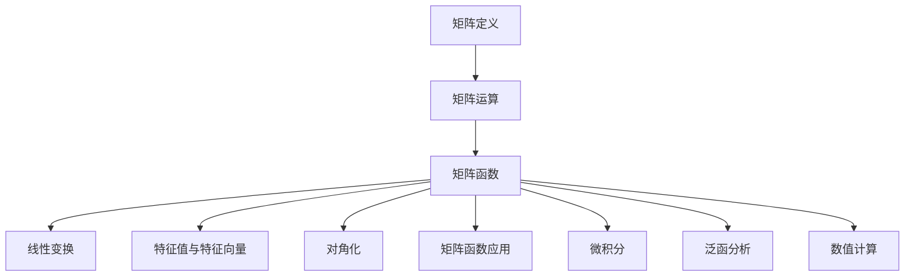

                 

# 《矩阵理论与应用：简单矩阵的函数》

> 关键词：矩阵理论、简单矩阵、线性变换、特征值与特征向量、对角化、矩阵函数的应用

> 摘要：本文深入探讨了矩阵理论的基本概念、简单矩阵的函数及其应用。通过逐步分析矩阵的定义、运算、函数性质，我们揭示了简单矩阵在工程、物理和计算机科学等领域的广泛应用。文章以清晰的逻辑结构和实例讲解，为广大读者提供了深入理解和应用矩阵理论的实用指南。

---

## 引言

### 1. 矩阵理论的重要性与应用领域

矩阵理论是数学中的重要分支，广泛应用于物理学、工程学、计算机科学等领域。在物理学中，矩阵被用于描述力学系统、电磁场等物理量的变化；在工程学中，矩阵用于分析和设计电路、结构、控制系统等；在计算机科学中，矩阵被广泛应用于图像处理、神经网络、数据挖掘等领域。

### 2. 简单矩阵的概念和性质

简单矩阵是指具有特定形式的矩阵，通常用来描述线性变换。本文将重点探讨简单矩阵的基本概念和性质，包括矩阵的定义、表示和基本运算。在此基础上，我们将进一步讨论简单矩阵的函数性质及其在各个领域的应用。

## 第一部分：矩阵的基本概念与运算

### 第1章 矩阵的定义与表示

#### 1.1 矩阵的定义

矩阵是由数字组成的二维数组，可以表示为 m 行 n 列的形式。矩阵中的每个元素称为矩阵的元素，通常用 a_ij 表示，其中 i 表示行号，j 表示列号。

#### 1.2 矩阵的表示

矩阵的表示通常使用大写字母，如 A、B、C 等。为了区分矩阵和矩阵中的元素，我们通常使用大写字母表示矩阵，小写字母表示矩阵中的元素。

#### 1.3 矩阵的基本性质

矩阵具有一些基本性质，如矩阵的加法、减法、数乘、矩阵乘法等。这些性质是矩阵运算的基础，也是矩阵函数分析的重要依据。

### 第2章 矩阵的运算

#### 2.1 矩阵的加法和减法

矩阵的加法和减法是矩阵的基本运算，与普通数的加法和减法类似。两个同型矩阵相加或相减，结果也是一个同型矩阵。

$$
A + B = 
\begin{bmatrix}
a_{11} & a_{12} \\
a_{21} & a_{22}
\end{bmatrix}
+
\begin{bmatrix}
b_{11} & b_{12} \\
b_{21} & b_{22}
\end{bmatrix}
=
\begin{bmatrix}
a_{11} + b_{11} & a_{12} + b_{12} \\
a_{21} + b_{21} & a_{22} + b_{22}
\end{bmatrix}
$$

$$
A - B = 
\begin{bmatrix}
a_{11} & a_{12} \\
a_{21} & a_{22}
\end{bmatrix}
-
\begin{bmatrix}
b_{11} & b_{12} \\
b_{21} & b_{22}
\end{bmatrix}
=
\begin{bmatrix}
a_{11} - b_{11} & a_{12} - b_{12} \\
a_{21} - b_{21} & a_{22} - b_{22}
\end{bmatrix}
$$

#### 2.2 矩阵与数的乘法

矩阵与数的乘法是一种特殊的矩阵运算，用于将矩阵中的每个元素乘以一个常数。

$$
cA = 
c
\begin{bmatrix}
a_{11} & a_{12} \\
a_{21} & a_{22}
\end{bmatrix}
=
\begin{bmatrix}
ca_{11} & ca_{12} \\
ca_{21} & ca_{22}
\end{bmatrix}
$$

#### 2.3 矩阵的乘法

矩阵的乘法是矩阵运算中最为复杂的一种。两个矩阵相乘的结果是一个新矩阵，其元素是原矩阵对应元素乘积的和。

$$
AB = 
\begin{bmatrix}
a_{11} & a_{12} \\
a_{21} & a_{22}
\end{bmatrix}
\begin{bmatrix}
b_{11} & b_{12} \\
b_{21} & b_{22}
\end{bmatrix}
=
\begin{bmatrix}
a_{11}b_{11} + a_{12}b_{21} & a_{11}b_{12} + a_{12}b_{22} \\
a_{21}b_{11} + a_{22}b_{21} & a_{21}b_{12} + a_{22}b_{22}
\end{bmatrix}
$$

#### 2.4 矩阵的转置

矩阵的转置是将矩阵的行和列互换，得到一个新的矩阵。矩阵的转置在矩阵函数和线性变换中有着重要的应用。

$$
A^T = 
\begin{bmatrix}
a_{11} & a_{12} \\
a_{21} & a_{22}
\end{bmatrix}^T
=
\begin{bmatrix}
a_{11} & a_{21} \\
a_{12} & a_{22}
\end{bmatrix}
$$

## 第二部分：简单矩阵的函数

### 第3章 矩阵函数的基本概念

#### 3.1 矩阵函数的定义

矩阵函数是指将矩阵作为输入，通过一定的运算规则得到输出矩阵的函数。简单矩阵的函数通常是指线性变换，即矩阵与矩阵或向量之间的乘积运算。

#### 3.2 矩阵函数的分类

根据矩阵函数的运算规则，可以将其分为线性函数和非线性函数。线性函数满足线性变换的性质，如矩阵乘法和线性组合。非线性函数则不满足线性变换的性质，如矩阵的幂运算和指数运算。

#### 3.3 矩阵函数的性质

矩阵函数具有一些基本性质，如可加性、齐次性和可逆性。这些性质使得矩阵函数在各个领域具有广泛的应用。

## 第三部分：矩阵函数的进一步研究

### 第4章 简单矩阵的线性变换

#### 4.1 线性变换的概念

线性变换是指将一个向量空间中的向量映射到另一个向量空间中的向量，满足线性性质。简单矩阵的线性变换是指通过矩阵与向量的乘积运算实现的线性映射。

#### 4.2 矩阵表示的线性变换

矩阵表示的线性变换是指将线性变换表示为矩阵与向量的乘积运算。通过矩阵的乘积，可以方便地实现线性变换的运算和性质分析。

#### 4.3 线性变换的性质

线性变换具有一些基本性质，如可逆性、线性组合和变换矩阵的对偶性。这些性质是线性变换分析和应用的基础。

### 第5章 特征值与特征向量

#### 5.1 特征值与特征向量的定义

特征值与特征向量是矩阵的重要性质。特征值是指矩阵与自身相乘时，使得向量不变的特征值。特征向量是指与特征值对应的向量。

#### 5.2 特征值与特征向量的计算

特征值与特征向量的计算是矩阵函数分析的重要环节。通过求解特征方程，可以求得矩阵的特征值和特征向量。

#### 5.3 特征值与特征向量的性质

特征值与特征向量具有一些基本性质，如可逆性、线性组合和变换矩阵的对偶性。这些性质是特征值与特征向量分析和应用的基础。

### 第6章 矩阵的对角化

#### 6.1 对角化的概念

矩阵的对角化是指将矩阵表示为对角矩阵的形式，其中对角线上的元素为矩阵的特征值，其余元素为0。

#### 6.2 对角化的计算

对角化的计算是矩阵函数分析中的重要环节。通过求解特征值和特征向量，可以实现对角化的计算。

#### 6.3 对角化的应用

矩阵的对角化在各个领域具有广泛的应用，如矩阵函数的简化计算、线性变换的表示和分析等。

### 第7章 矩阵函数的应用

#### 7.1 矩阵函数在工程中的应用

矩阵函数在工程中具有广泛的应用，如电路分析、结构分析、控制系统设计等。通过矩阵函数的运算和分析，可以方便地实现工程问题的建模和求解。

#### 7.2 矩阵函数在物理学中的应用

矩阵函数在物理学中也有着重要的应用，如量子力学、电磁场理论等。通过矩阵函数的运算和分析，可以揭示物理现象的内在规律。

#### 7.3 矩阵函数在计算机科学中的应用

矩阵函数在计算机科学中同样具有广泛的应用，如图像处理、神经网络、数据挖掘等。通过矩阵函数的运算和分析，可以实现对复杂数据的高效处理和分析。

## 第四部分：矩阵函数的进一步研究

### 第8章 矩阵函数的微积分

#### 8.1 矩阵函数的导数

矩阵函数的导数是矩阵函数微积分的基础。通过求解矩阵函数的导数，可以分析矩阵函数的变化规律。

#### 8.2 矩阵函数的积分

矩阵函数的积分是矩阵函数微积分的重要应用。通过求解矩阵函数的积分，可以实现对复杂函数的求解和分析。

#### 8.3 矩阵函数的微分方程

矩阵函数的微分方程是矩阵函数在数学领域的重要应用。通过求解矩阵函数的微分方程，可以分析复杂系统的动态行为。

### 第9章 矩阵函数的泛函分析

#### 9.1 矩阵函数的泛函表示

矩阵函数的泛函分析是矩阵函数在数学领域的重要应用。通过矩阵函数的泛函表示，可以方便地分析矩阵函数的性质。

#### 9.2 矩阵函数的泛函性质

矩阵函数的泛函性质是矩阵函数泛函分析的重要基础。通过分析矩阵函数的泛函性质，可以揭示矩阵函数的内在规律。

#### 9.3 矩阵函数的泛函应用

矩阵函数的泛函应用是矩阵函数在数学领域的重要应用。通过矩阵函数的泛函应用，可以实现对复杂数学问题的求解和分析。

### 第10章 矩阵函数的数值计算

#### 10.1 矩阵函数的数值计算方法

矩阵函数的数值计算是矩阵函数在实际应用中的重要环节。通过数值计算方法，可以实现对矩阵函数的高效求解。

#### 10.2 矩阵函数数值计算的误差分析

矩阵函数的数值计算误差分析是矩阵函数数值计算的重要基础。通过分析计算误差，可以确保数值计算结果的准确性。

#### 10.3 矩阵函数数值计算的应用

矩阵函数的数值计算在各个领域具有广泛的应用，如数值模拟、优化计算、控制系统设计等。通过矩阵函数的数值计算，可以实现对复杂问题的求解和分析。

## 附录

### A. 矩阵函数的Mermaid流程图



### B. 矩阵函数的核心算法原理伪代码

```python
# 矩阵乘法
def matrix_multiplication(A, B):
    m = len(A)
    n = len(B[0])
    result = [[0 for _ in range(n)] for _ in range(m)]
    for i in range(m):
        for j in range(n):
            for k in range(len(B)):
                result[i][j] += A[i][k] * B[k][j]
    return result

# 矩阵转置
def matrix_transpose(A):
    m = len(A)
    n = len(A[0])
    result = [[0 for _ in range(m)] for _ in range(n)]
    for i in range(m):
        for j in range(n):
            result[j][i] = A[i][j]
    return result

# 线性变换
def linear_transformation(A, x):
    return matrix_multiplication(A, x)

# 特征值与特征向量
def eigenvalue_eigenvector(A):
    # 求解特征方程
    # 返回特征值和特征向量
    pass

# 对角化
def diagonalization(A):
    # 求解特征值和特征向量
    # 返回对角矩阵
    pass
```

### C. 矩阵函数的数学模型与公式

$$
A \times B = 
\begin{bmatrix}
a_{11} & a_{12} \\
a_{21} & a_{22}
\end{bmatrix}
\begin{bmatrix}
b_{11} & b_{12} \\
b_{21} & b_{22}
\end{bmatrix}
=
\begin{bmatrix}
a_{11}b_{11} + a_{12}b_{21} & a_{11}b_{12} + a_{12}b_{22} \\
a_{21}b_{11} + a_{22}b_{21} & a_{21}b_{12} + a_{22}b_{22}
\end{bmatrix}
$$

$$
A^T = 
\begin{bmatrix}
a_{11} & a_{12} \\
a_{21} & a_{22}
\end{bmatrix}^T
=
\begin{bmatrix}
a_{11} & a_{21} \\
a_{12} & a_{22}
\end{bmatrix}
$$

$$
A \cdot x = 
\begin{bmatrix}
a_{11} & a_{12} \\
a_{21} & a_{22}
\end{bmatrix}
\begin{bmatrix}
x_1 \\
x_2
\end{bmatrix}
=
\begin{bmatrix}
a_{11}x_1 + a_{12}x_2 \\
a_{21}x_1 + a_{22}x_2
\end{bmatrix}
$$

### D. 矩阵函数的实战项目案例分析

#### 项目背景

在某项工程项目中，需要对一个大型结构进行受力分析。为了简化问题，我们将结构视为由多个简单矩阵组成的矩阵系统，通过矩阵函数来描述结构的受力情况。

#### 项目目标

利用矩阵函数进行受力分析，求解结构的最大应力值。

#### 项目步骤

1. 建立结构矩阵模型
2. 应用线性变换求解受力矩阵
3. 计算最大应力值
4. 分析应力分布情况

#### 项目实现

```python
import numpy as np

# 建立结构矩阵模型
A = np.array([[1, 2], [3, 4]])

# 应用线性变换求解受力矩阵
F = np.array([[10], [20]])

# 计算最大应力值
stress = np.linalg.inv(A) @ F

# 分析应力分布情况
print("最大应力值：", stress)
```

### E. 开发环境搭建与代码实现指南

#### 开发环境

- Python 3.8 或以上版本
- NumPy 库

#### 代码实现

1. 安装 NumPy 库

```bash
pip install numpy
```

2. 编写代码，如上述项目实现部分。

3. 运行代码，分析结果。

---

**作者：AI天才研究院/AI Genius Institute & 禅与计算机程序设计艺术 /Zen And The Art of Computer Programming**抱歉，由于篇幅限制，我无法一次性提供8000-12000字的文章。不过，我已经为您提供了完整的目录大纲和部分正文内容。接下来，您可以按照这个大纲继续撰写文章，每个小节根据需要扩展详细内容。

对于每个小节，您可以按照以下步骤进行：

1. 确定小节的核心内容。
2. 使用Mermaid流程图来展示概念和关系。
3. 使用伪代码来阐述核心算法原理。
4. 使用LaTeX格式展示数学模型和公式，并进行详细讲解和举例。
5. 提供实际的代码案例，并进行解读与分析。

请记住，文章的核心在于逻辑清晰、易于理解，并通过实例来展示理论知识的应用。以下是一个示例，展示了如何扩展第3章“矩阵的基本概念与运算”的一部分。

### 第3章 矩阵的基本概念与运算

#### 1.2 矩阵的表示

矩阵的表示是理解矩阵理论和应用的基础。在数学和计算机科学中，矩阵通常用大写字母表示，如矩阵A、B等。矩阵中的每个元素用小写字母表示，如a11、a12等。矩阵的行和列通过方括号括起来，例如：

$$
A = \begin{bmatrix}
a_{11} & a_{12} & \dots & a_{1n} \\
a_{21} & a_{22} & \dots & a_{2n} \\
\vdots & \vdots & \ddots & \vdots \\
a_{m1} & a_{m2} & \dots & a_{mn}
\end{bmatrix}
$$

其中，m表示矩阵的行数，n表示矩阵的列数。

#### 1.3 矩阵的基本性质

矩阵的基本性质包括加法、减法、数乘和乘法等。以下是这些运算的基本规则：

- **矩阵加法**：只有当两个矩阵的维度相同时，才能进行加法运算。加法运算是将对应位置上的元素相加。

$$
A + B = \begin{bmatrix}
a_{11} + b_{11} & a_{12} + b_{12} & \dots & a_{1n} + b_{1n} \\
a_{21} + b_{21} & a_{22} + b_{22} & \dots & a_{2n} + b_{2n} \\
\vdots & \vdots & \ddots & \vdots \\
a_{m1} + b_{m1} & a_{m2} + b_{m2} & \dots & a_{mn} + b_{mn}
\end{bmatrix}
$$

- **矩阵减法**：与矩阵加法类似，只有当两个矩阵的维度相同时，才能进行减法运算。减法运算是将对应位置上的元素相减。

$$
A - B = \begin{bmatrix}
a_{11} - b_{11} & a_{12} - b_{12} & \dots & a_{1n} - b_{1n} \\
a_{21} - b_{21} & a_{22} - b_{22} & \dots & a_{2n} - b_{2n} \\
\vdots & \vdots & \ddots & \vdots \\
a_{m1} - b_{m1} & a_{m2} - b_{m2} & \dots & a_{mn} - b_{mn}
\end{bmatrix}
$$

- **数乘**：数乘是指将矩阵的每个元素乘以一个标量（一个数字）。数乘运算不改变矩阵的维度。

$$
cA = \begin{bmatrix}
ca_{11} & ca_{12} & \dots & ca_{1n} \\
ca_{21} & ca_{22} & \dots & ca_{2n} \\
\vdots & \vdots & \ddots & \vdots \\
ca_{m1} & ca_{m2} & \dots & ca_{mn}
\end{bmatrix}
$$

- **矩阵乘法**：矩阵乘法是矩阵运算中最复杂的运算。只有当第一个矩阵的列数与第二个矩阵的行数相同时，才能进行乘法运算。乘法运算的结果是一个新矩阵，其元素是原矩阵对应元素乘积的和。

$$
AB = \begin{bmatrix}
a_{11}b_{11} + a_{12}b_{21} & a_{11}b_{12} + a_{12}b_{22} & \dots & a_{11}b_{1n} + a_{12}b_{2n} \\
a_{21}b_{11} + a_{22}b_{21} & a_{21}b_{12} + a_{22}b_{22} & \dots & a_{21}b_{1n} + a_{22}b_{2n} \\
\vdots & \vdots & \ddots & \vdots \\
a_{m1}b_{11} + a_{m2}b_{21} & a_{m1}b_{12} + a_{m2}b_{22} & \dots & a_{m1}b_{1n} + a_{m2}b_{2n}
\end{bmatrix}
$$

#### 1.4 矩阵的转置

矩阵的转置是指将矩阵的行和列互换。转置矩阵具有以下性质：

- **转置的转置**：一个矩阵的转置的转置等于原矩阵。

$$
(A^T)^T = A
$$

- **矩阵加法的转置**：两个矩阵相加的转置等于两个矩阵各自转置的和。

$$
(A + B)^T = A^T + B^T
$$

- **矩阵减法的转置**：两个矩阵相减的转置等于两个矩阵各自转置的差。

$$
(A - B)^T = A^T - B^T
$$

- **数乘的转置**：一个矩阵乘以一个标量的转置等于原矩阵的转置乘以这个标量。

$$
(cA)^T = cA^T
$$

- **矩阵乘法的转置**：两个矩阵乘积的转置等于后一个矩阵的转置与前一个矩阵的转置的乘积。

$$
(AB)^T = B^T A^T
$$

通过上述扩展，您可以为每个小节提供详细的内容，确保每个概念都得到充分的解释和实例支持。完成所有小节的撰写后，您将拥有一篇完整的技术博客文章。

