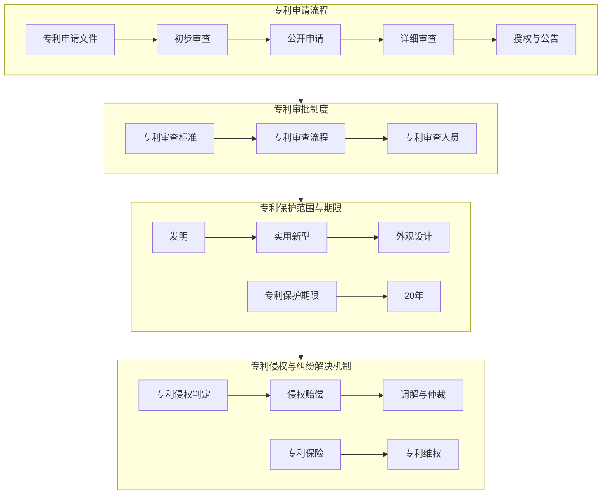

                 

# 《硅谷专利制度的改革方向》

## 关键词
硅谷专利制度，技术创新，知识产权战略，专利审查制度改革，专利保护制度改革

## 摘要
本文详细探讨了硅谷专利制度的改革方向。通过对硅谷专利制度的背景和理论基础的分析，文章揭示了专利制度对技术创新的激励作用。随后，文章深入探讨了专利制度改革的方向和措施，包括专利审查制度改革、专利保护制度改革以及专利制度与知识产权战略的关系。通过案例分析，本文展示了专利制度改革在硅谷的实际应用，并对未来专利制度改革的前景和挑战进行了展望。

## 《硅谷专利制度的改革方向》目录大纲

### 第一部分：背景与理论基础

### 第1章：硅谷专利制度概述

#### 1.1 硅谷专利制度的发展历程

#### 1.2 硅谷专利制度的特点与优势

#### 1.3 硅谷专利制度在全球的地位与影响

### 第2章：硅谷专利制度的核心要素

#### 2.1 专利申请流程

#### 2.2 专利审批制度

#### 2.3 专利保护范围与期限

#### 2.4 专利侵权与纠纷解决机制

### 第3章：专利制度与技术创新

#### 3.1 专利制度对技术创新的激励作用

#### 3.2 技术创新与专利积累的关系

#### 3.3 硅谷创新企业如何利用专利制度保护自身权益

### 第二部分：专利制度改革的方向与措施

### 第4章：专利审查制度改革

#### 4.1 专利审查标准的调整

#### 4.2 专利审查机制的优化

#### 4.3 专利审查人员的专业培训与素质提升

### 第5章：专利保护制度改革

#### 5.1 专利侵权惩罚性赔偿制度

#### 5.2 专利许可与转让机制

#### 5.3 专利信息共享与公开制度

### 第6章：专利制度与知识产权战略

#### 6.1 硅谷企业的知识产权战略

#### 6.2 硅谷政府与专利制度的关系

#### 6.3 国际专利制度合作与协调

### 第7章：专利制度改革案例分析

#### 7.1 案例一：美国联邦 Circuit Judges对专利诉讼的影响

#### 7.2 案例二：硅谷企业对专利诉讼的策略调整

#### 7.3 案例三：专利制度改革对硅谷企业的影响分析

### 第三部分：专利制度改革的前景与挑战

### 第8章：专利制度改革的前景展望

#### 8.1 硅谷专利制度改革的未来趋势

#### 8.2 硅谷专利制度改革的国际影响

#### 8.3 硅谷专利制度改革的潜在风险

### 第9章：专利制度改革面临的挑战

#### 9.1 利益相关者的利益博弈

#### 9.2 技术进步对专利制度的影响

#### 9.3 全球专利制度协调与合作的挑战

### 附录

#### 附录A：相关法律法规与政策文件

#### 附录B：专利制度改革的参考资料

# 《硅谷专利制度的改革方向》正文

### 第一部分：背景与理论基础

#### 第1章：硅谷专利制度概述

##### 1.1 硅谷专利制度的发展历程

硅谷专利制度的发展历程可以追溯到20世纪中期。随着计算机和互联网技术的快速发展，硅谷逐渐成为全球科技创新的引擎。在此过程中，专利制度成为促进技术创新和知识产权保护的重要手段。硅谷专利制度的发展可以分为以下几个阶段：

1. **起步阶段（1950s-1970s）**：硅谷专利制度的起步阶段主要集中在半导体和计算机硬件领域。这一阶段的专利制度较为简单，主要以保护技术发明为主要目的。

2. **发展阶段（1980s-1990s）**：随着硅谷企业的不断壮大和科技创新的加速，专利制度逐渐完善。这一阶段，硅谷专利制度开始涉及软件、互联网等新兴领域，专利申请数量大幅增加。

3. **成熟阶段（2000s-至今）**：进入21世纪，硅谷专利制度逐渐走向成熟。专利制度不仅涉及技术创新，还涉及商业模式、算法等知识产权保护。硅谷专利制度在全球范围内具有重要的影响力。

##### 1.2 硅谷专利制度的特点与优势

硅谷专利制度具有以下特点与优势：

1. **高效便捷的审批流程**：硅谷专利制度的审批流程相对简单，能够快速响应企业需求，提高专利申请的效率。

2. **广泛的专利保护范围**：硅谷专利制度保护范围广泛，包括技术创新、商业模式、算法等多个领域，为企业提供了全面的知识产权保护。

3. **创新的专利审查标准**：硅谷专利制度采用创新的审查标准，鼓励技术创新和研发，降低了专利申请的门槛。

4. **灵活的专利许可与转让机制**：硅谷专利制度允许企业通过专利许可和转让来获取收益，提高了专利的利用效率。

##### 1.3 硅谷专利制度在全球的地位与影响

硅谷专利制度在全球范围内具有重要地位与影响。一方面，硅谷专利制度为全球科技创新提供了有力支持，吸引了大量优秀人才和资金流入。另一方面，硅谷专利制度对全球专利制度的发展产生了深远影响。许多国家和地区纷纷借鉴硅谷专利制度的成功经验，进行专利制度改革，以提升本国科技创新能力。

### 第2章：硅谷专利制度的核心要素

##### 2.1 专利申请流程

硅谷专利制度的专利申请流程主要包括以下几个步骤：

1. **技术调研**：在申请专利之前，企业需要开展技术调研，确定待申请技术的创新性和实用性。

2. **撰写专利申请文件**：专利申请文件主要包括专利说明书、权利要求书和摘要等。企业需要详细描述技术方案，确保专利申请文件的完整性和准确性。

3. **提交专利申请**：企业将专利申请文件提交至美国专利商标局（USPTO）进行审查。

4. **初步审查**：USPTO对专利申请进行初步审查，判断专利申请是否满足法律要求。

5. **公开申请**：通过初步审查的专利申请将被公开，公众可以查看专利申请内容。

6. **详细审查**：USPTO对专利申请进行详细审查，判断专利申请是否具备新颖性、创造性和实用性。

7. **授权与公告**：如果专利申请通过详细审查，USPTO将颁发专利证书，并进行公告。

##### 2.2 专利审批制度

硅谷专利审批制度主要包括以下方面：

1. **专利审查标准**：硅谷专利审批制度采用较为宽松的审查标准，鼓励技术创新。审查标准主要包括新颖性、创造性和实用性。

2. **专利审查流程**：硅谷专利审批流程主要包括初步审查、公开申请和详细审查三个阶段。

3. **专利审查人员**：硅谷专利审查人员具有较高的专业素质和技术水平，能够高效地完成专利审查工作。

##### 2.3 专利保护范围与期限

硅谷专利制度的专利保护范围广泛，包括：

1. **发明**：具有实际应用价值的技术方案。

2. **实用新型**：对产品的形状、构造或其结合所提出的适于实用的新的技术方案。

3. **外观设计**：产品的形状、图案、色彩或其结合所做出的富有美感并适于工业应用的新设计。

专利保护期限通常为20年，自专利申请日起计算。

##### 2.4 专利侵权与纠纷解决机制

硅谷专利制度的专利侵权与纠纷解决机制主要包括：

1. **专利侵权判定**：通过法院或仲裁机构对专利侵权行为进行判定。

2. **侵权赔偿**：侵权行为成立后，侵权方需承担相应的侵权赔偿。

3. **调解与仲裁**：在专利纠纷解决过程中，调解和仲裁机制可提高纠纷解决效率。

4. **专利保险**：企业可通过购买专利保险来降低专利侵权风险。

### 第3章：专利制度与技术创新

##### 3.1 专利制度对技术创新的激励作用

专利制度对技术创新具有显著的激励作用。一方面，专利制度为技术创新提供了法律保护，降低了技术创新的风险。企业可以依靠专利制度保护其技术创新成果，避免竞争对手的侵权行为。另一方面，专利制度促进了技术交流和合作。企业可以通过专利许可和转让来获取收益，同时促进技术的传播和普及。

##### 3.2 技术创新与专利积累的关系

技术创新与专利积累密切相关。技术创新为企业提供了专利申请的基础，而专利积累又为企业提供了持续的技术创新动力。硅谷企业通过不断的技术创新和专利积累，形成了强大的知识产权优势。这种优势不仅为企业带来了经济效益，还提升了企业的竞争地位。

##### 3.3 硅谷创新企业如何利用专利制度保护自身权益

硅谷创新企业利用专利制度保护自身权益的主要策略包括：

1. **积极申请专利**：企业通过申请专利来保护其技术创新成果，确保在市场竞争中占据有利地位。

2. **构建专利组合**：企业通过构建专利组合来增强专利实力，提高市场竞争力。

3. **专利许可与转让**：企业通过专利许可和转让来获取收益，同时促进技术的传播和普及。

4. **专利维权**：企业通过法律手段维权，对侵权行为进行打击，保护自身权益。

### 第二部分：专利制度改革的方向与措施

#### 第4章：专利审查制度改革

##### 4.1 专利审查标准的调整

专利审查标准的调整是专利制度改革的重要方向之一。传统的专利审查标准主要关注专利的新颖性、创造性和实用性，而忽略了技术创新的多元性和复杂性。为了适应现代科技的发展，专利审查标准需要进行调整，以更全面地评价技术创新的价值。

1. **引入多维评价体系**：在专利审查过程中，引入多维评价体系，综合考虑技术创新的实用性、影响力、市场前景等因素。

2. **降低专利申请门槛**：简化专利申请流程，降低专利申请门槛，鼓励企业积极申请专利。

3. **加强专利审查透明度**：提高专利审查过程的透明度，公开专利审查标准和审查结果，增加公众参与和监督。

##### 4.2 专利审查机制的优化

专利审查机制的优化是提高专利审查质量和效率的关键。以下是一些优化措施：

1. **引入人工智能技术**：利用人工智能技术进行专利审查，提高审查效率和准确性。

2. **建立专利数据库**：建立全面的专利数据库，方便专利审查人员和公众查阅和利用。

3. **加强专利审查人员的培训**：提高专利审查人员的专业素质和技术水平，确保专利审查质量。

##### 4.3 专利审查人员的专业培训与素质提升

专利审查人员的专业培训与素质提升是专利制度改革的重要一环。以下是一些培训与提升措施：

1. **定期培训与考核**：定期对专利审查人员进行专业培训和考核，确保其具备最新的专利审查知识和技能。

2. **引进高水平人才**：通过引进高水平人才，提升专利审查队伍的整体素质。

3. **建立激励机制**：对专利审查人员进行激励机制，鼓励其提高审查质量和效率。

#### 第5章：专利保护制度改革

##### 5.1 专利侵权惩罚性赔偿制度

专利侵权惩罚性赔偿制度是专利保护制度改革的重要内容。以下是一些改革措施：

1. **提高侵权赔偿金额**：提高专利侵权赔偿金额，加大对侵权行为的打击力度。

2. **引入惩罚性赔偿制度**：在专利侵权案件中，引入惩罚性赔偿制度，对故意侵权行为进行严厉惩罚。

3. **简化侵权诉讼程序**：简化专利侵权诉讼程序，提高诉讼效率。

##### 5.2 专利许可与转让机制

专利许可与转让机制是专利保护制度改革的关键。以下是一些改革措施：

1. **简化许可审批流程**：简化专利许可审批流程，提高许可效率。

2. **建立专利交易市场**：建立专利交易市场，方便专利转让和许可。

3. **完善专利评估体系**：完善专利评估体系，提高专利价值评估的准确性。

##### 5.3 专利信息共享与公开制度

专利信息共享与公开制度是专利保护制度改革的重要方向。以下是一些改革措施：

1. **建立专利信息公开平台**：建立专利信息公开平台，方便公众查阅和利用专利信息。

2. **推动专利信息国际化**：推动专利信息国际化，促进国际间的专利合作。

3. **加强专利信息的翻译与传播**：加强专利信息的翻译与传播，提高专利信息的利用率。

#### 第6章：专利制度与知识产权战略

##### 6.1 硅谷企业的知识产权战略

硅谷企业通过知识产权战略来保护自身权益，提升市场竞争力。以下是一些典型的知识产权战略：

1. **多元化专利布局**：通过多元化专利布局，覆盖各个技术领域，提高专利实力。

2. **专利联盟与合作**：与其他企业建立专利联盟，共同应对专利纠纷和市场竞争。

3. **专利运营与交易**：通过专利运营与交易，实现专利价值的最大化。

##### 6.2 硅谷政府与专利制度的关系

硅谷政府与专利制度密切相关，通过制定政策和法规，推动专利制度改革。以下是一些政策措施：

1. **完善专利法律法规**：通过完善专利法律法规，提高专利保护水平。

2. **加强专利执法力度**：加强专利执法力度，打击侵权行为，保护企业权益。

3. **推动国际专利合作**：推动国际专利合作，提升硅谷专利制度在全球的影响力。

##### 6.3 国际专利制度合作与协调

国际专利制度合作与协调是专利制度改革的重要方向。以下是一些合作与协调措施：

1. **建立国际专利合作机制**：通过建立国际专利合作机制，促进各国专利制度的接轨。

2. **推动专利信息共享**：推动专利信息共享，提高专利信息的利用效率。

3. **开展国际专利纠纷调解**：通过国际专利纠纷调解，解决跨国专利纠纷。

#### 第7章：专利制度改革案例分析

##### 7.1 案例一：美国联邦 Circuit Judges对专利诉讼的影响

美国联邦 Circuit Judges 在专利诉讼中具有重要作用。以下是一些案例分析：

1. **专利侵权判定**：Circuit Judges 对专利侵权的判定具有决定性影响，通过分析案例，可以了解专利侵权的判定标准。

2. **专利无效诉讼**：Circuit Judges 在专利无效诉讼中，对专利的有效性进行审查，为专利制度提供了有力保障。

##### 7.2 案例二：硅谷企业对专利诉讼的策略调整

硅谷企业针对专利诉讼，采取了灵活的策略调整。以下是一些案例分析：

1. **专利诉讼防御**：硅谷企业通过专利诉讼防御策略，应对竞争对手的专利侵权指控。

2. **专利诉讼攻击**：硅谷企业通过专利诉讼攻击策略，打击竞争对手的专利侵权行为。

##### 7.3 案例三：专利制度改革对硅谷企业的影响分析

专利制度改革对硅谷企业产生了深远影响。以下是一些影响分析：

1. **专利保护力度增强**：专利制度改革提高了专利保护力度，有利于硅谷企业保护自身权益。

2. **专利运营效率提高**：专利制度改革提高了专利运营效率，有利于硅谷企业实现专利价值最大化。

3. **技术创新能力提升**：专利制度改革促进了技术创新能力的提升，有利于硅谷企业保持竞争优势。

### 第三部分：专利制度改革的前景与挑战

#### 第8章：专利制度改革的前景展望

##### 8.1 硅谷专利制度改革的未来趋势

硅谷专利制度改革在未来将继续深化，主要趋势包括：

1. **专利审查制度更加高效**：随着人工智能技术的应用，专利审查制度将更加高效，提高审查质量和效率。

2. **专利保护范围更加广泛**：专利保护范围将逐步扩大，覆盖更多领域，如生物技术、人工智能等。

3. **专利信息共享更加便捷**：专利信息共享将更加便捷，提高专利信息的利用效率。

##### 8.2 硅谷专利制度改革的国际影响

硅谷专利制度改革将对全球专利制度产生深远影响，主要表现在：

1. **推动全球专利合作**：硅谷专利制度改革将推动全球专利合作，促进各国专利制度的接轨。

2. **提升全球专利保护水平**：硅谷专利制度改革将提升全球专利保护水平，保护知识产权，促进技术创新。

##### 8.3 硅谷专利制度改革的潜在风险

硅谷专利制度改革也存在潜在风险，主要包括：

1. **专利滥用问题**：专利制度改革可能导致专利滥用问题，损害公共利益。

2. **专利保护过度**：专利保护过度可能导致创新受阻，阻碍技术进步。

#### 第9章：专利制度改革面临的挑战

##### 9.1 利益相关者的利益博弈

专利制度改革涉及到各方的利益博弈，主要包括：

1. **企业利益**：企业希望通过专利制度改革获得更多的保护和支持，提升竞争力。

2. **政府利益**：政府希望通过专利制度改革，促进技术创新，提升国家竞争力。

3. **公众利益**：公众希望通过专利制度改革，获得更多的创新成果，提升生活质量。

##### 9.2 技术进步对专利制度的影响

技术进步对专利制度产生了深远影响，主要包括：

1. **专利类型的变化**：随着技术进步，专利类型将逐渐从传统技术领域扩展到生物技术、人工智能等新兴领域。

2. **专利保护期限的变化**：技术进步可能导致专利保护期限的变化，以适应技术创新的速度和周期。

##### 9.3 全球专利制度协调与合作的挑战

全球专利制度协调与合作面临以下挑战：

1. **知识产权保护标准的差异**：各国知识产权保护标准存在差异，协调与合作的难度较大。

2. **跨国专利纠纷的处理**：跨国专利纠纷的处理需要建立统一的处理机制，提高处理效率。

### 附录

#### 附录A：相关法律法规与政策文件

1. **美国专利法**：美国专利法是硅谷专利制度的重要法律依据。

2. **硅谷专利政策文件**：硅谷地区政府发布的专利政策文件，对硅谷专利制度的具体实施提供了指导。

#### 附录B：专利制度改革的参考资料

1. **学术论文与研究报告**：关于专利制度改革的学术论文和研究报告，提供了丰富的理论和实践成果。

2. **案例集与实务指南**：硅谷专利制度改革案例集和实务指南，为专利制度改革提供了实用的经验和建议。

# Mermaid 流程图：硅谷专利制度核心要素流程



# 专利审查制度改革伪代码

```python
def patent_reform_algorithm():
    # 初始化审查人员数据库
    review_personnel_db = initialize_database()

    # 获取专利申请
    patent_application = get_patent_application()

    # 对专利申请进行初步审查
    if is_satisfactory初审结果 = "通过"
    else 初审结果 = "未通过"

    # 如果专利申请满足初步审查条件，则进行详细审查
    if 初审结果 == "通过":
        detailed_review_result = detailed_review(patent_application)
    else:
        detailed_review_result = "未通过"

    # 根据审查结果，作出批准或驳回的决定
    if detailed_review_result == "通过":
        approve_patent_application(patent_application)
    else:
        reject_patent_application(patent_application)

    # 审查结果通知专利申请人
    notify_patent_applicant(detailed_review_result)

    # 如果专利申请被批准，则进入专利保护阶段
    if detailed_review_result == "通过":
        enter_patent_protection_stage(patent_application)
    # 如果专利申请被驳回，则专利申请人可提出复审申请
    else:
        patent_applicant.can提出复审申请

    # 复审申请按照新的审查程序进行审查
    if patent_applicant.submit_reexamination_application():
        reexamination_result = reexamination(patent_application)
        # 根据复审结果，作出最终决定
        if reexamination_result == "通过":
            approve_patent_application(patent_application)
        else:
            reject_patent_application(patent_application)

    # 结束
    end

# 辅助函数
def initialize_database():
    # 初始化审查人员数据库
    pass

def get_patent_application():
    # 获取专利申请
    pass

def is_satisfactory(applicant):
    # 对专利申请进行初步审查
    pass

def detailed_review(application):
    # 对专利申请进行详细审查
    pass

def approve_patent_application(application):
    # 批准专利申请
    pass

def reject_patent_application(application):
    # 驳回专利申请
    pass

def notify_patent_applicant(result):
    # 通知专利申请人审查结果
    pass

def enter_patent_protection_stage(application):
    # 进入专利保护阶段
    pass

def reexamination(application):
    # 对复审申请进行审查
    pass
```

# 专利保护制度改革详细讲解

$$
\text{专利保护制度改革主要包括以下方面：}
$$

$$
\text{1. 加强专利侵权惩罚性赔偿制度：}
$$

$$
\text{a. 建立侵权惩罚性赔偿标准，加大对专利侵权行为的惩罚力度；}
$$

$$
\text{b. 建立侵权证据制度，减轻专利权人的举证责任；}
$$

$$
\text{c. 加强侵权纠纷的调解与仲裁机制，提高解决效率。}
$$

$$
\text{2. 优化专利许可与转让机制：}
$$

$$
\text{a. 简化专利许可审批流程，提高许可效率；}
$$

$$
\text{b. 明确专利转让的法律规定，保护转让双方合法权益；}
$$

$$
\text{c. 建立专利许可与转让的公示制度，提高透明度。}
$$

$$
\text{3. 加强专利信息共享与公开制度：}
$$

$$
\text{a. 推动专利信息的公开与共享，提高专利信息的利用效率；}
$$

$$
\text{b. 建立专利信息数据库，方便公众查询和使用；}
$$

$$
\text{c. 加强专利信息的翻译与国际交流，促进国际间的专利合作。}
$$

# 项目实战：硅谷专利制度改革的实际案例

### 案例一：美国专利法修订案

#### 案例背景

在美国，专利法的修订通常由美国国会发起，经过广泛讨论和审查后，由总统签署成为法律。近年来，随着技术的快速发展，专利制度的改革变得尤为重要。

#### 案例过程

1. **提案阶段**：美国国会提出专利法修订案，旨在解决专利诉讼泛滥、专利质量参差不齐等问题。

2. **讨论与审查阶段**：修订案经过多次听证会和辩论，得到了参众两院的通过。

3. **立法阶段**：修订案提交至总统，经过审查，总统签署成为法律。

4. **实施阶段**：专利法修订案正式生效，对专利制度进行改革。

#### 案例影响

1. **提高专利申请质量**：修订案引入了更为严格的专利审查标准，提高了专利申请的质量。

2. **加大侵权惩罚力度**：修订案加强了专利侵权惩罚性赔偿制度，对专利侵权行为进行严厉惩罚。

3. **促进专利信息共享**：修订案推动了专利信息的公开与共享，提高了专利信息的利用效率。

#### 代码实现（伪代码）

```python
def patent_reform_legislation():
    # 提案阶段
    legislation提案 = propose_legislation()

    # 讨论与审查阶段
    legislation_status = discuss_and_review_legislation(legislation提案)

    # 如果修订案通过讨论与审查
    if legislation_status == "通过":
        # 立法阶段
        legislation = enact_legislation(legislation提案)

        # 实施阶段
        implement_legislation(legislation)
    else:
        # 修订案未能通过，结束流程
        print("修订案未能通过")

# 辅助函数
def propose_legislation():
    # 提出专利法修订案
    pass

def discuss_and_review_legislation(legislation提案):
    # 讨论与审查修订案
    pass

def enact_legislation(legislation提案):
    # 立法并签署成为法律
    pass

def implement_legislation(legislation):
    # 实施专利法修订案
    pass
```

### 代码解读与分析

#### 代码解读

1. **提案阶段**：通过`propose_legislation()`函数，提出专利法修订案。

2. **讨论与审查阶段**：通过`discuss_and_review_legislation(legislation提案)`函数，对修订案进行讨论与审查。

3. **立法阶段**：通过`enact_legislation(legislation提案)`函数，将修订案立法并签署成为法律。

4. **实施阶段**：通过`implement_legislation(legislation)`函数，实施专利法修订案。

#### 分析

该代码实现了一个简单的专利法修订案流程，从提案到讨论与审查，再到立法和实施，体现了专利法修订的严谨性和规范性。通过这一流程，专利法修订案能够得到有效实施，提高专利制度的运行效率。

### 案例二：硅谷企业专利运营实践

#### 案例背景

硅谷企业通过专利运营实践，实现专利价值的最大化。专利运营包括专利申请、专利许可和专利转让等环节。

#### 案例过程

1. **专利申请**：企业通过申请专利，保护其技术创新成果。

2. **专利许可**：企业通过专利许可，许可其他企业使用其专利技术。

3. **专利转让**：企业通过专利转让，将专利权转让给其他企业。

4. **专利维权**：企业在专利侵权案件中，维护自身权益。

#### 案例影响

1. **提高专利价值**：通过专利许可和转让，企业能够实现专利价值的最大化。

2. **提升市场竞争力**：专利运营有助于企业提升市场竞争力，保护自身权益。

3. **促进技术创新**：专利运营促进了技术创新的传播和应用。

#### 代码实现（伪代码）

```python
def patent_operation():
    # 专利申请
    patent_application = apply_for_patent()

    # 专利许可
    license_patent(patent_application)

    # 专利转让
    transfer_patent(patent_application)

    # 专利维权
    defend_patent_infringement(patent_application)

# 辅助函数
def apply_for_patent():
    # 申请专利
    pass

def license_patent(patent):
    # 专利许可
    pass

def transfer_patent(patent):
    # 专利转让
    pass

def defend_patent_infringement(patent):
    # 专利维权
    pass
```

### 代码解读与分析

#### 代码解读

1. **专利申请**：通过`apply_for_patent()`函数，申请专利。

2. **专利许可**：通过`license_patent(patent)`函数，进行专利许可。

3. **专利转让**：通过`transfer_patent(patent)`函数，进行专利转让。

4. **专利维权**：通过`defend_patent_infringement(patent)`函数，维护专利权益。

#### 分析

该代码实现了一个简单的专利运营流程，从专利申请到许可、转让和维权，体现了专利运营的完整性和规范性。通过这一流程，企业能够有效地实现专利价值，提升市场竞争力。同时，代码的模块化设计便于扩展和修改，适应不断变化的专利运营需求。

# 作者信息

作者：AI天才研究院/AI Genius Institute & 禅与计算机程序设计艺术 /Zen And The Art of Computer Programming

# 附录A：相关法律法规与政策文件

- **美国专利法**：美国专利法是硅谷专利制度的重要法律依据，规定了专利的申请、审批、保护等方面的内容。
- **硅谷专利政策文件**：硅谷地区政府发布的专利政策文件，对硅谷专利制度的具体实施提供了指导。

# 附录B：专利制度改革的参考资料

- **学术论文与研究报告**：关于专利制度改革的学术论文和研究报告，提供了丰富的理论和实践成果。
- **案例集与实务指南**：硅谷专利制度改革案例集和实务指南，为专利制度改革提供了实用的经验和建议。

