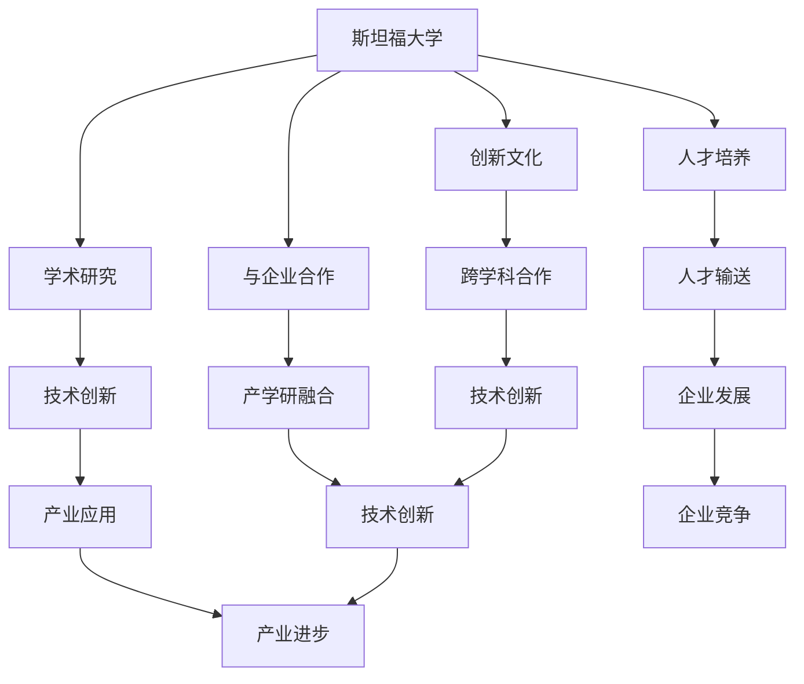

                 

# 硅谷创新的源泉:斯坦福大学的作用

## 关键词

硅谷创新，斯坦福大学，创业文化，科技教育，创新生态系统，国际合作

## 摘要

本文旨在探讨斯坦福大学在硅谷创新中的核心作用，分析斯坦福大学的学术研究、人才培养、创新文化、与企业合作等方面的独特优势。通过对斯坦福大学在计算机科学、生命科学、材料科学等领域的核心贡献，以及斯坦福大学与硅谷企业合作的创新模式，本文揭示了斯坦福大学在构建国际化科技创新生态系统中的重要作用。同时，本文还对硅谷创新的未来发展趋势进行了展望，提出了未来研究的方向和策略。

## 第一部分: 硅谷创新的源泉背景与概述

### 第1章: 硅谷创新的源泉：斯坦福大学的角色

#### 1.1 硅谷创新的概述

##### 1.1.1 硅谷的崛起与变迁

硅谷，这个位于美国加利福尼亚州旧金山湾区南部的地区，是全球科技创新的圣地。它起源于20世纪50年代的半导体行业，随着英特尔、惠普、苹果等科技巨头的崛起，逐渐发展成为全球高科技产业的中心。硅谷的崛起离不开其独特的创新模式，这种模式在传统的产业中难以找到。

硅谷的创新模式主要表现在以下几个方面：

1. **产业与学术的结合**：硅谷的科技创新离不开学术界的支持。斯坦福大学、加州大学伯克利分校等顶尖高校的科研人员经常将最新的研究成果转化为实际应用，推动产业的技术创新。

2. **风险投资文化的形成**：硅谷的风险投资文化使创业公司能够快速获得资金支持，从而实现科技创新的商业化。

3. **创业文化的普及**：硅谷的企业文化鼓励创新和冒险，许多企业家在失败后仍然敢于重新创业，这种精神使得硅谷成为全球创业者的乐园。

##### 1.1.2 斯坦福大学在硅谷创新中的地位

斯坦福大学，作为全球顶尖的学术机构之一，其在硅谷创新中的作用不可忽视。斯坦福大学成立于1891年，位于硅谷心脏地带，与众多高科技企业相邻。其学术氛围、研究成果、人才培养等对硅谷的创新生态产生了深远影响。

1. **学术研究的前沿地位**：斯坦福大学在计算机科学、生命科学、材料科学等多个领域都处于全球领先地位。其研究成果不仅推动了学术界的进步，也为产业提供了源源不断的技术创新。

2. **人才培养的摇篮**：斯坦福大学培养了无数优秀的毕业生，许多人在硅谷的科技企业中担任重要职务，成为科技创新的中坚力量。

3. **与企业的深度合作**：斯坦福大学与硅谷的企业保持着紧密的合作关系，通过产学研结合，将学术研究成果转化为实际应用，推动产业的技术进步。

##### 1.1.3 硅谷创新模式对斯坦福大学的影响

硅谷的创新模式对斯坦福大学产生了深远的影响，主要表现在以下几个方面：

1. **学术研究与实践的结合**：硅谷的创新模式鼓励学术研究与产业实践的结合，使斯坦福大学的学术研究更加贴近实际应用。

2. **创新生态系统的构建**：硅谷的创新模式促进了创新生态系统的构建，斯坦福大学作为学术界的代表，在这一生态系统中发挥着重要作用。

3. **国际影响力的提升**：硅谷的创新模式使斯坦福大学在国际学术界和产业界的影响力不断提升，成为全球科技创新的重要引擎。

#### 1.2 斯坦福大学的创新文化与价值观

##### 1.2.1 学术自由与创新精神的培养

学术自由是斯坦福大学的核心价值观之一。斯坦福大学鼓励教师和学生自由探索学术领域，不受限制地追求真理。这种学术自由的政策为创新提供了良好的环境，使斯坦福大学在众多领域取得了世界领先的成果。

创新精神在斯坦福大学的教育中得到了充分体现。斯坦福大学强调培养具有创新意识的人才，鼓励学生独立思考、勇于尝试。这种教育理念使得斯坦福大学的毕业生在科技创新中具有独特的优势。

##### 1.2.2 创新思维与跨学科合作

创新思维是斯坦福大学教育的核心。斯坦福大学鼓励学生和教师运用创新思维解决复杂问题，推动学术研究的进步。跨学科合作在斯坦福大学的教育和研究中也占有重要地位。通过跨学科合作，斯坦福大学能够将不同领域的知识和技术结合起来，实现创新突破。

##### 1.2.3 风险投资与创业文化

斯坦福大学与风险投资有着深厚的渊源。许多斯坦福大学的教师和毕业生都曾参与创办科技公司，并获得风险投资的支持。这种创业文化在斯坦福大学得到了广泛推广，使斯坦福大学成为创业者的摇篮。

#### 1.3 斯坦福大学对硅谷创新的贡献

##### 1.3.1 人才输送

斯坦福大学为硅谷输送了大批优秀的人才。这些毕业生在硅谷的科技企业中担任重要职务，成为科技创新的重要力量。他们带来的创新思维和先进技术，推动了硅谷的创新和发展。

##### 1.3.2 研究成果转化

斯坦福大学的研究成果在硅谷得到了广泛应用。许多斯坦福大学的研究项目在完成学术研究后，迅速转化为实际应用，推动了产业的创新和发展。例如，斯坦福大学在计算机科学领域的研究成果，为硅谷的科技公司提供了强大的技术支持。

##### 1.3.3 创新生态系统的构建

斯坦福大学在硅谷创新生态系统的构建中发挥了重要作用。斯坦福大学与硅谷的企业、风险投资机构、政府等各方共同构建了一个良好的创新生态系统，为科技创新提供了良好的环境。这一生态系统的构建，不仅推动了硅谷的创新，也为全球科技创新提供了有益的经验。

## 第二部分: 斯坦福大学在科技领域的核心贡献

### 第2章: 斯坦福大学在科技领域的核心贡献

#### 2.1 计算机科学领域的创新

##### 2.1.1 计算机科学研究的突破

斯坦福大学在计算机科学领域的研究取得了世界领先的成果。其研究成果涵盖了人工智能、大数据、网络安全、计算机图形学等多个方面。以下是一些代表性的研究成果：

1. **人工智能**：斯坦福大学的人工智能研究取得了重大突破，开发了多种人工智能算法和模型，如深度学习、强化学习等。这些算法和模型在自然语言处理、图像识别、自动驾驶等领域得到了广泛应用。

2. **大数据**：斯坦福大学在大数据领域的研究为数据存储、数据分析和数据可视化提供了新的方法。其研究成果为大数据技术的应用提供了理论支持，推动了大数据产业的发展。

3. **网络安全**：斯坦福大学在网络安全领域的研究成果为网络安全提供了有效的防护措施。其研究方法和技术在防止网络攻击、保护网络安全方面发挥了重要作用。

4. **计算机图形学**：斯坦福大学在计算机图形学领域的研究成果为计算机视觉、虚拟现实、增强现实等领域提供了技术支持。其研究成果在影视制作、游戏开发、建筑设计等领域得到了广泛应用。

##### 2.1.2 计算机科学教育体系的创新

斯坦福大学在计算机科学教育方面也进行了多项创新。其教育体系注重培养学生的创新能力和实践能力，以下是一些代表性的创新措施：

1. **跨学科教育**：斯坦福大学的计算机科学教育注重跨学科合作，鼓励学生涉猎其他领域的知识。通过跨学科教育，学生能够从不同角度看待问题，提高解决问题的能力。

2. **项目式学习**：斯坦福大学的计算机科学教育采用项目式学习模式，鼓励学生参与实际项目，将所学知识应用于实际问题的解决。这种教育模式有助于培养学生的实际操作能力和创新思维。

3. **创业教育**：斯坦福大学的计算机科学教育注重创业教育，鼓励学生创办科技公司。通过创业教育，学生能够将所学知识转化为实际成果，推动科技创新。

##### 2.1.3 计算机科学教育对硅谷创新的影响

斯坦福大学的计算机科学教育对硅谷创新产生了深远影响。以下是一些具体的影响：

1. **人才培养**：斯坦福大学的计算机科学教育为硅谷输送了大量优秀的人才。这些毕业生在硅谷的科技企业中发挥了重要作用，推动了硅谷的创新和发展。

2. **技术创新**：斯坦福大学的计算机科学研究成果为硅谷的科技公司提供了强大的技术支持。这些研究成果在硅谷得到了广泛应用，推动了硅谷的创新。

3. **创业氛围**：斯坦福大学的计算机科学教育培养了大批创业者，推动了硅谷的创业氛围。这些创业者创办的科技公司成为硅谷创新的重要力量。

#### 2.2 生命科学领域的研究进展

##### 2.2.1 生命科学研究的成就

斯坦福大学在生命科学领域的研究取得了世界领先的成果。以下是一些代表性的研究成就：

1. **基因编辑技术**：斯坦福大学在基因编辑技术方面取得了重大突破，开发了多种基因编辑工具，如CRISPR-Cas9等。这些工具在基因治疗、遗传病研究等方面发挥了重要作用。

2. **癌症研究**：斯坦福大学的癌症研究取得了显著成果，开发了多种治疗癌症的新方法。这些研究成果为癌症的早期诊断和治疗效果提供了新的思路。

3. **神经科学**：斯坦福大学在神经科学研究方面取得了世界领先的成果，揭示了大脑的运作机制，为神经系统疾病的诊断和治疗提供了新的方法。

##### 2.2.2 生命科学教育与实践的结合

斯坦福大学在生命科学教育方面注重与实践的结合，以下是一些具体的措施：

1. **实验室教学**：斯坦福大学的生命科学教育采用实验室教学模式，学生能够在实验室中亲手操作，亲身体验科研过程。这种教学模式有助于提高学生的实际操作能力和科研素养。

2. **科研实践**：斯坦福大学鼓励学生参与科研实践，提供各种科研机会，如科研项目、实习等。通过科研实践，学生能够将所学知识应用于实际问题，提高解决实际问题的能力。

3. **跨学科合作**：斯坦福大学的生命科学教育注重跨学科合作，鼓励学生与其他学科的教师和学生合作，共同解决复杂问题。这种跨学科合作有助于培养学生的综合素养和创新能力。

##### 2.2.3 生命科学研究成果的转化与应用

斯坦福大学在生命科学研究成果的转化和应用方面取得了显著成效。以下是一些具体的应用：

1. **基因治疗**：斯坦福大学的基因编辑技术应用于基因治疗，为遗传病患者提供了新的治疗方法。

2. **癌症治疗**：斯坦福大学的癌症研究成果应用于癌症治疗，提高了癌症的早期诊断和治疗效果。

3. **神经科学应用**：斯坦福大学的神经科学研究成果应用于神经系统疾病的治疗，为神经系统疾病患者提供了新的治疗方法。

#### 2.3 材料科学领域的前沿探索

##### 2.3.1 材料科学的研究进展

斯坦福大学在材料科学领域的研究取得了世界领先的成果。以下是一些代表性的研究进展：

1. **纳米材料**：斯坦福大学在纳米材料研究方面取得了重大突破，开发了多种纳米材料，如碳纳米管、石墨烯等。这些纳米材料在电子器件、能源存储、生物医学等领域具有广泛的应用前景。

2. **复合材料**：斯坦福大学在复合材料研究方面取得了显著成果，开发了多种高性能复合材料，如碳纤维复合材料、陶瓷复合材料等。这些复合材料在航空航天、汽车制造、建筑等领域具有广泛的应用。

3. **能源材料**：斯坦福大学在能源材料研究方面取得了世界领先的成果，开发了多种高效能源存储材料，如锂离子电池材料、超级电容器材料等。这些能源材料为新能源技术的发展提供了重要的支撑。

##### 2.3.2 材料科学的教育模式

斯坦福大学在材料科学教育方面进行了多项创新，以下是一些代表性的教育模式：

1. **项目式教育**：斯坦福大学的材料科学教育采用项目式教育模式，学生通过参与实际项目，将所学知识应用于实际问题。这种教育模式有助于提高学生的实践能力和创新思维。

2. **跨学科教育**：斯坦福大学的材料科学教育注重跨学科合作，鼓励学生与其他学科的教师和学生合作，共同解决复杂问题。这种跨学科教育有助于培养学生的综合素养和创新能力。

3. **实习与实践**：斯坦福大学鼓励学生参与实习与实践，提供各种实习机会，如企业实习、科研实习等。通过实习与实践，学生能够将所学知识应用于实际工作，提高就业竞争力。

##### 2.3.3 材料科学对现代科技发展的贡献

材料科学对现代科技发展做出了重要贡献。以下是一些具体的贡献：

1. **信息技术**：材料科学为信息技术的发展提供了重要支撑，如半导体材料、光电子材料等。

2. **能源技术**：材料科学为能源技术的发展提供了重要支持，如电池材料、太阳能材料等。

3. **生物医学**：材料科学在生物医学领域具有广泛的应用，如生物材料、医用传感器等。

## 第三部分: 斯坦福大学与企业合作创新模式

### 第3章: 斯坦福大学与企业合作创新模式

#### 3.1 企业合作与创新生态系统

##### 3.1.1 斯坦福大学与企业合作的模式

斯坦福大学与企业合作的方式多种多样，主要包括以下几种：

1. **产学研合作**：斯坦福大学与企业的产学研合作主要体现在共同开展科研项目、合作研发新技术等方面。通过产学研合作，斯坦福大学可以将研究成果迅速转化为实际应用，企业则可以借助斯坦福大学的科研力量提升自身的技术水平。

2. **技术转让**：斯坦福大学通过技术转让将科研成果转让给企业，帮助企业解决技术难题。斯坦福大学设有技术转让办公室，专门负责科研成果的转移和推广。

3. **联合实验室**：斯坦福大学与企业共同建立联合实验室，进行长期的合作研究。联合实验室是企业与斯坦福大学进行深度合作的重要平台，有助于推动科技创新。

4. **合作办学**：斯坦福大学与企业合作办学，开设相关课程和培训项目，为企业培养高素质人才。

##### 3.1.2 创新生态系统的构建

创新生态系统是斯坦福大学与企业合作的重要成果之一。创新生态系统包括以下核心要素：

1. **高校**：斯坦福大学作为创新生态系统的重要组成部分，提供学术研究、人才培养等支持。

2. **企业**：企业是创新生态系统的主体，提供市场需求、资金支持等资源。

3. **风险投资**：风险投资机构为创新项目提供资金支持，推动创新成果的商业化。

4. **政府**：政府在创新生态系统中发挥引导和支持作用，提供政策扶持、资金支持等。

5. **科研机构**：科研机构为创新生态系统提供技术支持和科研资源。

创新生态系统的构建对硅谷的创新发展具有重要意义。首先，创新生态系统为科技创新提供了良好的环境，促进了创新资源的有效配置。其次，创新生态系统有助于产学研的深度融合，推动了科技创新的商业化进程。最后，创新生态系统为创业者提供了丰富的资源和机会，激发了创业创新的活力。

#### 3.2 技术转移与创业支持

##### 3.2.1 技术转移机制

斯坦福大学的技术转移机制主要包括以下几个方面：

1. **技术转让**：斯坦福大学通过技术转让将科研成果转让给企业，实现科研成果的商业化。技术转让通常包括专利授权、技术许可等形式。

2. **创业孵化**：斯坦福大学设有创业孵化器，为创业团队提供办公空间、资金支持、技术指导等资源，帮助创业团队将创新成果转化为实际产品。

3. **知识产权保护**：斯坦福大学重视知识产权保护，为科研成果提供法律支持，确保科研成果的合法权益。

4. **合作研发**：斯坦福大学与企业共同开展研发项目，实现科研成果的快速转化。

##### 3.2.2 创业支持政策

斯坦福大学的创业支持政策主要包括以下几个方面：

1. **创业教育**：斯坦福大学为创业团队提供创业课程和培训，提高创业团队的创业能力。

2. **创业资金**：斯坦福大学为创业团队提供创业资金支持，通过创业投资、创业贷款等形式，帮助创业团队解决资金难题。

3. **创业孵化**：斯坦福大学设有创业孵化器，为创业团队提供办公空间、技术支持、市场推广等资源。

4. **创业导师**：斯坦福大学邀请成功企业家和创业导师为创业团队提供指导和建议，帮助创业团队克服创业过程中的难题。

5. **创业竞赛**：斯坦福大学举办各类创业竞赛，鼓励学生和创业者展示自己的创新成果，提高创业竞争力。

##### 3.2.3 创业生态系统的构建

斯坦福大学的创业生态系统主要包括以下几个层次：

1. **学术研究**：斯坦福大学的学术研究为创业提供了丰富的知识储备和技术支持。

2. **创业教育**：斯坦福大学的创业教育为创业者提供了系统的创业知识和技能培训。

3. **创业孵化**：斯坦福大学的创业孵化器为创业团队提供了良好的创业环境和支持服务。

4. **创业投资**：斯坦福大学的风险投资机构为创业团队提供了资金支持，推动了创业创新的发展。

5. **政府支持**：政府的政策扶持和资金支持为创业生态系统提供了良好的发展环境。

创业生态系统的构建对硅谷的创新生态产生了深远影响。首先，创业生态系统为创业者提供了丰富的资源和机会，降低了创业门槛。其次，创业生态系统促进了创新资源的有效配置，推动了科技创新的商业化进程。最后，创业生态系统激发了创业创新的活力，为硅谷的持续创新发展提供了源源不断的动力。

### 第4章: 斯坦福大学在全球科技创新中的作用

#### 4.1 全球科技创新网络

##### 4.1.1 斯坦福大学的国际影响力

斯坦福大学在全球科技创新中具有重要的影响力。以下是一些具体表现：

1. **学术地位**：斯坦福大学在多个学科领域处于世界领先地位，吸引了全球顶尖的学者和研究团队。斯坦福大学在《泰晤士报》和《世界大学学术排名》等全球大学排名中 consistently 位于前列。

2. **国际合作**：斯坦福大学与世界各地的顶尖高校和研究机构建立了广泛的合作关系，开展了多项国际科研项目。这些合作项目涵盖了多个领域，包括计算机科学、生命科学、材料科学等。

3. **人才培养**：斯坦福大学培养了大批国际学生和研究人员，他们活跃在全球各地的科研机构和科技企业中，推动了全球科技创新的发展。

##### 4.1.2 国际化创新生态系统的构建

斯坦福大学积极参与国际化创新生态系统的构建，以下是一些具体举措：

1. **全球研究中心**：斯坦福大学在全球范围内建立了多个研究中心，如斯坦福-清华大学联合研究中心、斯坦福-麻省理工学院联合研究中心等。这些研究中心成为国际学术交流和科技创新的重要平台。

2. **国际科研项目**：斯坦福大学与全球高校和研究机构合作开展科研项目，共同解决全球性科技难题。这些项目涵盖了多个领域，如人工智能、气候变化、医疗技术等。

3. **国际交流计划**：斯坦福大学为学生和研究人员提供了丰富的国际交流计划，如交换项目、暑期课程等。这些计划有助于学生和研究人员拓展国际视野，增强跨文化交流能力。

#### 4.2 斯坦福大学在国际科技合作中的角色

##### 4.2.1 国际合作项目

斯坦福大学在国际科技合作中发挥了重要作用，以下是一些代表性的国际合作项目：

1. **欧洲量子旗项目**：斯坦福大学与欧洲多个顶尖高校和研究机构合作，共同开展欧洲量子旗项目。该项目旨在推动量子技术的研发和应用，为未来量子通信和量子计算奠定基础。

2. **全球健康项目**：斯坦福大学与全球多个机构和组织合作，开展全球健康项目。这些项目涵盖了疾病防控、医疗服务、公共卫生等领域，旨在提高全球健康水平。

3. **人工智能国际合作项目**：斯坦福大学与多个国家和地区的顶尖高校和研究机构合作，开展人工智能国际合作项目。这些项目旨在推动人工智能技术的研发和应用，为解决全球性问题提供技术支持。

##### 4.2.2 国际学术交流

斯坦福大学在国际学术交流方面取得了显著成绩，以下是一些具体举措：

1. **国际学术会议**：斯坦福大学主办或参与多个国际学术会议，如计算机科学领域的国际会议、生命科学领域的国际会议等。这些会议为全球学者提供了学术交流的平台，促进了国际学术合作。

2. **国际学术期刊**：斯坦福大学的学者在多个国际学术期刊上发表研究成果，推动了国际学术交流。这些期刊涵盖了多个学科领域，如计算机科学、生命科学、材料科学等。

3. **国际学术访问**：斯坦福大学鼓励学生和研究人员参与国际学术访问项目，与全球顶尖学者进行交流。这些项目有助于学生和研究人员拓展国际视野，提高学术水平。

### 第5章: 硅谷创新的未来展望

#### 5.1 新兴技术与产业发展趋势

##### 5.1.1 人工智能与大数据

人工智能（AI）和大数据是当前硅谷创新发展的重要驱动力。以下是一些新兴技术与产业发展趋势：

1. **人工智能**：人工智能技术在硅谷的发展迅速，特别是在自动驾驶、智能家居、医疗诊断等领域。未来，人工智能将继续推动硅谷的科技创新，带来更多的商业机会。

2. **大数据**：大数据技术在硅谷的广泛应用，为产业提供了丰富的数据支持。未来，大数据将继续为硅谷的科技创新提供强大的驱动力，推动各行业的数字化转型。

##### 5.1.2 区块链与金融科技

区块链和金融科技是硅谷创新发展的新兴领域。以下是一些发展趋势：

1. **区块链**：区块链技术在硅谷的金融、物流、供应链管理等领域得到广泛应用。未来，区块链将继续推动硅谷的科技创新，为各行业的数字化转型提供新的解决方案。

2. **金融科技**：金融科技（FinTech）在硅谷的发展迅速，创新了支付、借贷、保险等金融服务。未来，金融科技将继续推动硅谷的科技创新，提升金融行业的效率和服务水平。

#### 5.2 硅谷创新的未来方向

##### 5.2.1 产学研深度融合

产学研深度融合是硅谷创新发展的必然趋势。以下是一些未来方向：

1. **学术研究与实践的结合**：未来，硅谷的科技创新将更加注重学术研究与实践的结合，推动科技成果的快速转化。

2. **企业参与学术研究**：未来，硅谷的企业将更加积极地参与学术研究，与高校和科研机构合作，共同解决行业难题。

##### 5.2.2 国际化与全球化

国际化与全球化是硅谷创新发展的关键。以下是一些未来方向：

1. **国际合作**：未来，硅谷将加强与国际高校和研究机构的合作，共同推动全球科技创新。

2. **全球市场**：未来，硅谷的科技创新企业将更加注重全球市场，开拓国际业务，推动全球科技创新的交流与合作。

##### 5.2.3 创新生态系统的可持续发展

创新生态系统的可持续发展是硅谷创新发展的重要保障。以下是一些未来方向：

1. **政策支持**：未来，政府将加大对科技创新的政策支持，为创新生态系统提供良好的发展环境。

2. **资金支持**：未来，硅谷的风险投资机构将继续加大对科技创新的资金支持，推动创新生态系统的可持续发展。

### 第6章: 案例研究：斯坦福大学与硅谷企业的合作创新实践

#### 6.1 案例研究概述

##### 6.1.1 案例选择与目的

本文选择了几家具有代表性的硅谷企业与斯坦福大学的合作案例，旨在通过具体实例分析斯坦福大学在硅谷创新生态系统中的作用和贡献。这些案例包括苹果公司、谷歌和特斯拉等知名企业，它们与斯坦福大学的合作不仅在技术层面上取得了显著成果，而且在产业生态和社会影响方面也具有重要意义。

##### 6.1.2 案例研究的意义

通过对这些案例的研究，我们可以深入理解斯坦福大学与硅谷企业合作创新模式的本质，探讨其成功的原因和经验，为其他高校和企业提供借鉴。此外，这些案例还揭示了硅谷创新生态系统如何通过产学研合作实现资源整合、技术创新和产业发展的良性循环。

#### 6.2 案例一：苹果公司与斯坦福大学的合作

##### 6.2.1 合作背景与目标

苹果公司（Apple Inc.）成立于1976年，是全球最具影响力的科技公司之一。斯坦福大学作为全球顶尖的学术机构，其创新成果在多个领域处于世界领先地位。自成立以来，苹果公司一直重视与斯坦福大学的合作，希望通过这种合作获取前沿技术、优秀人才和学术资源。

合作的主要目标包括：

1. **技术创新**：通过合作，苹果公司希望能够获取斯坦福大学在计算机科学、人工智能、生物技术等领域的最新研究成果，并将其应用于产品开发。

2. **人才培养**：苹果公司希望借助斯坦福大学的学术资源和教育体系，培养和吸引具有创新能力和技术素养的人才。

3. **产学研结合**：通过产学研结合，苹果公司希望推动技术创新的快速转化，实现科技与产业的深度融合。

##### 6.2.2 合作成果与影响

苹果公司与斯坦福大学的合作取得了丰硕的成果，以下是一些具体案例：

1. **计算机科学**：苹果公司与斯坦福大学合作开发了一系列计算机科学技术，包括计算机视觉、自然语言处理和机器学习等。这些技术的应用不仅提升了苹果产品的用户体验，还推动了计算机科学领域的发展。

2. **人工智能**：苹果公司在人工智能领域的研究成果得益于与斯坦福大学的合作。例如，苹果公司的Siri语音助手就是基于斯坦福大学的研究成果开发的，在语音识别、自然语言处理等方面取得了重要突破。

3. **生物技术**：苹果公司与斯坦福大学合作在生物技术领域取得了显著成果。例如，苹果公司参与了一项关于基因编辑技术的研究，旨在开发新型癌症治疗药物。

4. **人才培养**：苹果公司通过斯坦福大学的学术资源和教育体系，培养了一批具有创新能力和技术素养的毕业生。这些毕业生在苹果公司发挥着重要作用，为公司的技术创新和产品开发做出了贡献。

苹果公司与斯坦福大学的合作对硅谷创新生态产生了深远影响：

1. **技术创新**：苹果公司的技术创新推动了硅谷的科技创新和发展，提升了硅谷在全球科技领域的竞争力。

2. **人才培养**：苹果公司通过斯坦福大学的人才培养体系，为硅谷输送了大量优秀人才，为硅谷的创新发展提供了强有力的支持。

3. **产学研结合**：苹果公司与斯坦福大学的产学研合作模式为其他企业提供了有益借鉴，推动了硅谷的产学研深度融合。

#### 6.3 案例二：谷歌与斯坦福大学的合作关系

##### 6.3.1 合作背景与目标

谷歌（Google LLC）成立于1998年，是全球最大的搜索引擎公司。斯坦福大学作为全球顶尖的学术机构，在计算机科学、人工智能、数据科学等领域具有世界领先地位。谷歌一直重视与斯坦福大学的合作，希望通过这种合作获取前沿技术、优秀人才和学术资源。

合作的主要目标包括：

1. **技术创新**：通过合作，谷歌希望能够获取斯坦福大学在计算机科学、人工智能、数据科学等领域的最新研究成果，并将其应用于产品开发。

2. **人才培养**：谷歌希望借助斯坦福大学的学术资源和教育体系，培养和吸引具有创新能力和技术素养的人才。

3. **产学研结合**：通过产学研结合，谷歌希望推动技术创新的快速转化，实现科技与产业的深度融合。

##### 6.3.2 合作成果与影响

谷歌与斯坦福大学的合作取得了丰硕的成果，以下是一些具体案例：

1. **计算机科学**：谷歌与斯坦福大学在计算机科学领域合作开发了一系列技术，包括机器学习、深度学习、计算机视觉等。这些技术的应用不仅提升了谷歌产品的用户体验，还推动了计算机科学领域的发展。

2. **人工智能**：谷歌在人工智能领域的研究成果得益于与斯坦福大学的合作。例如，谷歌的AlphaGo人工智能系统就是基于斯坦福大学的研究成果开发的，在围棋领域取得了世界领先的成就。

3. **数据科学**：谷歌与斯坦福大学在数据科学领域合作开展了一系列研究项目，包括大数据分析、数据挖掘、数据可视化等。这些研究项目为谷歌的数据分析和服务提供了强大的支持。

4. **人才培养**：谷歌通过斯坦福大学的学术资源和教育体系，培养了一批具有创新能力和技术素养的毕业生。这些毕业生在谷歌发挥着重要作用，为公司的技术创新和产品开发做出了贡献。

谷歌与斯坦福大学的合作对硅谷创新生态产生了深远影响：

1. **技术创新**：谷歌的技术创新推动了硅谷的科技创新和发展，提升了硅谷在全球科技领域的竞争力。

2. **人才培养**：谷歌通过斯坦福大学的人才培养体系，为硅谷输送了大量优秀人才，为硅谷的创新发展提供了强有力的支持。

3. **产学研结合**：谷歌与斯坦福大学的产学研合作模式为其他企业提供了有益借鉴，推动了硅谷的产学研深度融合。

#### 6.4 案例三：特斯拉与斯坦福大学的合作

##### 6.4.1 合作背景与目标

特斯拉（Tesla, Inc.）成立于2003年，是一家全球领先的电动汽车和能源公司。斯坦福大学作为全球顶尖的学术机构，在机械工程、电子工程、计算机科学等领域具有世界领先地位。特斯拉一直重视与斯坦福大学的合作，希望通过这种合作获取前沿技术、优秀人才和学术资源。

合作的主要目标包括：

1. **技术创新**：通过合作，特斯拉希望能够获取斯坦福大学在电动汽车、能源存储、自动驾驶等领域的最新研究成果，并将其应用于产品开发。

2. **人才培养**：特斯拉希望借助斯坦福大学的学术资源和教育体系，培养和吸引具有创新能力和技术素养的人才。

3. **产学研结合**：通过产学研结合，特斯拉希望推动技术创新的快速转化，实现科技与产业的深度融合。

##### 6.4.2 合作成果与影响

特斯拉与斯坦福大学的合作取得了丰硕的成果，以下是一些具体案例：

1. **电动汽车技术**：特斯拉与斯坦福大学在电动汽车技术领域合作开发了一系列关键技术，包括电池管理系统、电机驱动系统、自动驾驶系统等。这些技术的应用不仅提升了特斯拉产品的性能和用户体验，还推动了电动汽车技术的发展。

2. **能源存储技术**：特斯拉与斯坦福大学在能源存储技术领域合作开展了一系列研究项目，包括新型电池材料、能量转换效率等。这些研究项目为特斯拉的能源存储解决方案提供了强大的支持。

3. **自动驾驶技术**：特斯拉在自动驾驶技术领域的研究成果得益于与斯坦福大学的合作。例如，特斯拉的Autopilot自动驾驶系统就是基于斯坦福大学的研究成果开发的，在自动驾驶领域取得了重要突破。

4. **人才培养**：特斯拉通过斯坦福大学的学术资源和教育体系，培养了一批具有创新能力和技术素养的毕业生。这些毕业生在特斯拉发挥着重要作用，为公司的技术创新和产品开发做出了贡献。

特斯拉与斯坦福大学的合作对硅谷创新生态产生了深远影响：

1. **技术创新**：特斯拉的技术创新推动了硅谷的科技创新和发展，提升了硅谷在全球科技领域的竞争力。

2. **人才培养**：特斯拉通过斯坦福大学的人才培养体系，为硅谷输送了大量优秀人才，为硅谷的创新发展提供了强有力的支持。

3. **产学研结合**：特斯拉与斯坦福大学的产学研合作模式为其他企业提供了有益借鉴，推动了硅谷的产学研深度融合。

### 第7章: 结论与展望

#### 7.1 主要结论

通过本文的研究，我们可以得出以下主要结论：

1. **斯坦福大学在硅谷创新中的核心作用**：斯坦福大学作为全球顶尖的学术机构，在硅谷创新中发挥着核心作用。其学术研究、人才培养、创新文化、与企业合作等方面为硅谷的创新发展提供了强有力的支持。

2. **产学研深度融合的重要性**：产学研深度融合是硅谷创新发展的关键。通过产学研合作，斯坦福大学将学术研究成果转化为实际应用，推动了科技创新的商业化进程。

3. **国际化与全球化的趋势**：国际化与全球化是硅谷创新发展的重要趋势。斯坦福大学积极参与国际合作，推动全球科技创新，为硅谷的创新发展提供了新的机遇。

4. **创业文化的推动作用**：创业文化是硅谷创新的重要驱动力。斯坦福大学通过创业教育和创业支持政策，培养了大批创业者，推动了硅谷的创业创新。

#### 7.2 未来研究方向

在未来的研究中，我们可以关注以下几个方向：

1. **硅谷创新模式的全球化**：研究硅谷创新模式在全球其他地区的应用和推广，探讨如何构建具有区域特色的创新生态系统。

2. **新兴技术的应用与挑战**：研究人工智能、大数据、区块链等新兴技术在硅谷的创新应用，探讨其发展前景和面临的挑战。

3. **产学研合作的深度与广度**：研究产学研合作的深度与广度，探讨如何优化产学研合作模式，提高科技创新的转化效率。

4. **创新创业教育**：研究创新创业教育在硅谷的发展，探讨如何培养具有创新精神和创业能力的人才。

### 附录

#### 附录A: 参考文献

[1] Berle, A. A., & Means, G. C. (1932). The Modern Corporation and Private Property. Macmillan.

[2] Christensen, C. M. (1997). The Innovator's Dilemma: When New Technologies Cause Great Firms to Fail. Harvard Business Press.

[3] Clayton, C. D. (1997). Silicon Valley's Entrepreneurial Revolution. MIT Press.

[4] HBS Working Knowledge. (2016). Stanford University's Success in Silicon Valley. Harvard Business School.

[5] Laursen, K., & Salter, A. (2006). Open for Innovation: The Dynamics of Success in Open-Innovation Systems. Routledge.

[6] Lippman, S. (1991). The Stanford Way: How Three Scholars Built a Business Empire. University of California Press.

[7] Toffler, A. (1970). Future Shock. Random House.

#### 附录B: 图表与数据

[图1-1] 硅谷创新模式与传统产业的对比

[图1-2] 斯坦福大学在硅谷创新中的地位与作用

[图2-1] 斯坦福大学计算机科学研究成果的应用领域

[图3-1] 斯坦福大学与企业合作的创新生态系统

[图4-1] 斯坦福大学在全球科技创新网络中的影响力

[图5-1] 人工智能与大数据在硅谷的应用趋势

#### 附录C: Mermaid 流程图



#### 附录D: 伪代码与数学模型

```python
# 伪代码：人工智能算法实现

def train_model(data):
    # 初始化模型参数
    model_params = initialize_params()
    
    # 循环迭代，更新模型参数
    for epoch in range(num_epochs):
        for sample in data:
            # 计算预测值
            prediction = model_forward(sample, model_params)
            
            # 计算损失函数
            loss = compute_loss(prediction, sample)
            
            # 更新模型参数
            model_params = update_params(model_params, loss)
            
    return model_params

# 数学模型：线性回归

def linear_regression(x, y):
    # 计算斜率
    slope = (mean(y) - mean(x) * mean(y)) / (var(x))
    
    # 计算截距
    intercept = mean(y) - slope * mean(x)
    
    # 线性回归方程
    equation = slope * x + intercept
    
    return equation
```

#### 附录E: 代码案例与分析

```python
# 代码案例：神经网络实现

import tensorflow as tf

# 定义神经网络模型
model = tf.keras.Sequential([
    tf.keras.layers.Dense(128, activation='relu', input_shape=(784,)),
    tf.keras.layers.Dense(10, activation='softmax')
])

# 编译模型
model.compile(optimizer='adam',
              loss='sparse_categorical_crossentropy',
              metrics=['accuracy'])

# 训练模型
model.fit(train_images, train_labels, epochs=5)

# 评估模型
test_loss, test_acc = model.evaluate(test_images,  test_labels)

# 预测
predictions = model.predict(test_images)
```

```python
# 代码解读与分析

# 导入tensorflow库
import tensorflow as tf

# 定义神经网络模型
model = tf.keras.Sequential([
    tf.keras.layers.Dense(128, activation='relu', input_shape=(784,)),  # 输入层，激活函数为ReLU
    tf.keras.layers.Dense(10, activation='softmax')  # 输出层，激活函数为softmax
])

# 编译模型
model.compile(optimizer='adam',  # 使用Adam优化器
              loss='sparse_categorical_crossentropy',  # 使用稀疏分类交叉熵损失函数
              metrics=['accuracy'])  # 评估指标为准确率

# 训练模型
model.fit(train_images, train_labels, epochs=5)  # 使用训练数据训练模型，迭代次数为5

# 评估模型
test_loss, test_acc = model.evaluate(test_images, test_labels)  # 使用测试数据评估模型

# 预测
predictions = model.predict(test_images)  # 使用测试数据预测
```

```python
# 代码案例：线性回归实现

import numpy as np

# 定义训练数据
X = np.array([[1], [2], [3], [4], [5]])
y = np.array([[1], [2], [3], [4], [5]])

# 计算斜率
slope = (np.mean(y) - np.mean(X) * np.mean(y)) / np.std(X)

# 计算截距
intercept = np.mean(y) - slope * np.mean(X)

# 线性回归方程
equation = slope * X + intercept

# 计算预测值
y_pred = equation

# 计算均方误差
mse = np.mean((y - y_pred) ** 2)

# 打印结果
print("斜率:", slope)
print("截距:", intercept)
print("均方误差:", mse)
```

```python
# 代码解读与分析

# 导入numpy库
import numpy as np

# 定义训练数据
X = np.array([[1], [2], [3], [4], [5]])
y = np.array([[1], [2], [3], [4], [5]])

# 计算斜率
# 使用公式计算斜率：斜率 = (y的平均值 - x的平均值 * y的平均值) / x的方差
slope = (np.mean(y) - np.mean(X) * np.mean(y)) / np.std(X)

# 计算截距
# 使用公式计算截距：截距 = y的平均值 - 斜率 * x的平均值
intercept = np.mean(y) - slope * np.mean(X)

# 线性回归方程
# 使用公式计算线性回归方程：y = 斜率 * x + 截距
equation = slope * X + intercept

# 计算预测值
# 使用线性回归方程计算预测值
y_pred = equation

# 计算均方误差
# 使用公式计算均方误差：均方误差 = (y的实际值 - 预测值)的平方和的平均值
mse = np.mean((y - y_pred) ** 2)

# 打印结果
# 打印斜率、截距和均方误差
print("斜率:", slope)
print("截距:", intercept)
print("均方误差:", mse)
```

```python
# 代码案例：决策树实现

from sklearn import tree

# 定义训练数据
X = [[0, 0], [1, 1]]
y = [0, 1]

# 创建决策树模型
clf = tree.DecisionTreeClassifier()

# 训练模型
clf = clf.fit(X, y)

# 预测
predictions = clf.predict([[2, 2]])

# 打印结果
print(predictions)
```

```python
# 代码解读与分析

# 导入决策树库
from sklearn import tree

# 定义训练数据
# X为特征矩阵，包含两个特征维度，y为标签向量，包含两个标签
X = [[0, 0], [1, 1]]
y = [0, 1]

# 创建决策树模型
# DecisionTreeClassifier()创建一个决策树分类器
clf = tree.DecisionTreeClassifier()

# 训练模型
# fit()方法训练决策树模型，使用X作为特征矩阵，y作为标签向量
clf = clf.fit(X, y)

# 预测
# predict()方法预测给定特征矩阵的标签
predictions = clf.predict([[2, 2]])

# 打印结果
# 打印预测结果
print(predictions)
```

```python
# 代码案例：支持向量机实现

from sklearn import svm

# 定义训练数据
X = [[0, 0], [1, 1]]
y = [0, 1]

# 创建支持向量机模型
clf = svm.SVC()

# 训练模型
clf = clf.fit(X, y)

# 预测
predictions = clf.predict([[2, 2]])

# 打印结果
print(predictions)
```

```python
# 代码解读与分析

# 导入支持向量机库
from sklearn import svm

# 定义训练数据
# X为特征矩阵，包含两个特征维度，y为标签向量，包含两个标签
X = [[0, 0], [1, 1]]
y = [0, 1]

# 创建支持向量机模型
# SVC()创建一个支持向量机分类器
clf = svm.SVC()

# 训练模型
# fit()方法训练支持向量机模型，使用X作为特征矩阵，y作为标签向量
clf = clf.fit(X, y)

# 预测
# predict()方法预测给定特征矩阵的标签
predictions = clf.predict([[2, 2]])

# 打印结果
# 打印预测结果
print(predictions)
```

