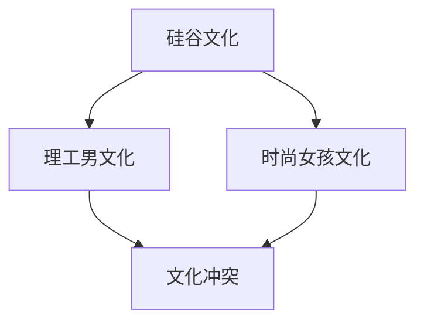

                 

### 文章标题：硅谷文化冲突：理工男与时尚女孩

> 关键词：硅谷文化、理工男、时尚女孩、文化冲突、跨文化沟通、职业发展

> 摘要：本文深入探讨了硅谷文化中理工男与时尚女孩之间的冲突现象，分析了二者文化差异的原因，探讨了冲突的表现与影响，提出了解决冲突的策略和方法，并展望了硅谷文化的未来发展趋势。通过实际案例和代码解读，帮助读者理解文化冲突的量化分析和解决方法，为跨文化职场中的个人和团队提供实用的指导。

---

#### 第一部分：背景与概述

##### 第1章：硅谷文化的起源与演变

硅谷，位于美国加利福尼亚州旧金山湾区南部的圣克拉拉谷，是全球科技创新和创业的中心之一。其起源可以追溯到20世纪50年代，当时随着晶体管的发明和集成电路的发展，美国半导体产业开始在这里蓬勃发展。硅谷的崛起不仅仅依赖于科技的发展，更重要的是其独特的企业文化。

1.1 硅谷的起源与发展历程

硅谷的起源可以追溯到1956年，当时斯坦福大学工程学院的弗雷德里克·特曼（Frederick Terman）教授提出了“校园创新”的概念，鼓励学生和教授创办公司，将研究成果转化为商业实践。这一理念极大地推动了硅谷的发展。1957年，肖克利半导体实验室（Shockley Semiconductor Laboratory）成立，成为硅谷第一家半导体公司。随后，1958年，仙童半导体公司（Fairchild Semiconductor）成立，被誉为“硅谷的摇篮”。

仙童半导体公司在1960年代迅速发展成为全球领先的半导体公司，其员工包括戈登·摩尔（Gordon Moore）和罗伯特·诺伊斯（Robert Noyce）等后来的科技巨头。1968年，英特尔公司（Intel）成立，成为硅谷发展的重要里程碑。英特尔在微处理器技术的突破，使得计算机从大型主机走向了个人桌面，极大地推动了硅谷的进一步发展。

从1970年代到1980年代，硅谷迎来了计算机革命的浪潮。施乐帕克研究中心（Xerox PARC）的图形用户界面（GUI）和鼠标技术，为个人计算机的发展奠定了基础。苹果公司（Apple）在1976年成立，随后推出了Macintosh计算机，开创了个人计算机市场的新时代。

进入1990年代，随着互联网的兴起，硅谷再次迎来新的发展机遇。微软、谷歌、亚马逊等科技巨头在硅谷崛起，推动了互联网技术和电子商务的发展。2000年，互联网泡沫破裂，硅谷经历了一次重大的经济调整。然而，这次危机并没有击垮硅谷，反而促使了创新和创业的进一步发展。硅谷成为全球科技和创业的标杆，吸引了全球顶尖的科技人才和资金。

1.2 硅谷文化的主要特点

硅谷文化以其独特的创新精神、自由开放的氛围和竞争激烈的职场环境而闻名。以下是硅谷文化的几个主要特点：

1. **创新精神**：硅谷文化鼓励创新和探索，对未知和风险的容忍度较高。许多科技公司和企业，如苹果、谷歌、Facebook等，都是以创新为核心驱动力。

2. **自由开放**：硅谷强调自由和开放的交流氛围，鼓励员工自由地表达观点和想法。这种开放的文化促进了新思路和创意的产生。

3. **竞争激烈**：硅谷是一个充满竞争的地方，无论是在技术研发还是在商业竞争中，都存在激烈的竞争。这种竞争推动了技术的快速进步和商业模式的不断创新。

4. **人才驱动**：硅谷对人才的重视程度极高，吸引了全球各地顶尖的科技人才。这些人才为硅谷的科技和创业环境注入了新的活力。

1.3 理工男与时尚女孩的文化冲突现象

在硅谷的职场中，理工男和时尚女孩的文化差异常常引发冲突。这种冲突不仅影响个人的工作表现，也可能对团队和企业产生负面影响。

1. **思维方式的不同**：理工男通常以逻辑和分析为导向，注重细节和效率；而时尚女孩则更注重创造力和灵活性，偏好整体和直觉。

2. **价值观的差异**：理工男通常重视成就和业绩，追求技术上的突破和商业成功；而时尚女孩则更注重个人成长和生活品质，追求平衡和多元化。

3. **行为模式的差异**：理工男通常喜欢有条不紊的工作方式，追求高效和精确；而时尚女孩则更灵活和开放，喜欢尝试新的方法和思路。

4. **沟通方式的差异**：理工男通常直接和简洁，偏好技术性和具体的问题解决方案；而时尚女孩则更喜欢情感和关系的沟通，注重理解和共鸣。

这种文化冲突在硅谷职场中表现为：

- 团队合作中的矛盾和分歧，影响团队的凝聚力和工作效率。
- 职业发展中的不平等对待，可能导致人才流失和团队不稳定。
- 企业文化中的隔阂和误解，影响企业的创新和竞争力。

### 总结

硅谷文化起源于科技和创新的结合，经过几十年的发展，已经成为全球科技和创业的标杆。硅谷文化的主要特点包括创新精神、自由开放、竞争激烈和人才驱动。然而，这种文化也带来了理工男与时尚女孩之间的文化冲突现象。理解并解决这种冲突，对于个人职业发展和团队建设具有重要意义。

---

##### 第2章：理工男文化解析

在硅谷的职场中，理工男作为主要群体之一，以其独特的思维方式、价值观和行为模式影响着整个科技行业的发展。本节将从这三个方面深入解析理工男文化。

2.1 理工男的思维方式与价值观

理工男的思维方式通常以逻辑、分析和解决问题为导向。他们在面对问题时，更倾向于通过数据和事实来做出决策，而非依赖直觉或情感。以下是一些具体的特征：

1. **逻辑思维**：理工男喜欢将复杂问题分解成一系列简单的问题，通过逻辑推理来解决。他们擅长找到问题的根本原因，并设计出可行的解决方案。

2. **分析能力**：理工男具有较强的分析能力，能够从大量信息中提取关键点，进行深入的分析和评估。这种能力使他们在技术研究和开发中表现出色。

3. **问题解决**：面对挑战和困难时，理工男通常能够冷静地思考，快速找到解决方案。他们喜欢将问题视为一种挑战，通过不断的尝试和调整来达到目标。

在价值观方面，理工男通常重视以下几个方面：

1. **成就导向**：理工男追求个人成就和职业成功。他们愿意为了实现目标付出大量的努力和时间，注重绩效和结果。

2. **技术至上**：理工男对技术有着浓厚的兴趣和热情，认为技术是推动社会进步和商业成功的关键。他们在技术上的成就和贡献被视为最重要的价值。

3. **独立自主**：理工男倾向于独立思考和行动，不喜欢受制于他人或组织。他们喜欢在工作中保持一定的自由度，追求自我实现。

2.2 理工男的行为模式与社会影响

理工男的行为模式在一定程度上反映了他们的思维方式和价值观。以下是一些典型的行为模式及其社会影响：

1. **高效工作**：理工男通常以高效为目标，追求工作的最优解。他们喜欢在有限的时间内完成更多的工作，这种高效的工作方式提高了他们的工作效率和产出。

2. **技术导向**：理工男在解决问题时，倾向于依赖技术和工具。他们喜欢使用最新的技术和工具来提高工作效率，这也是硅谷科技行业快速发展的重要原因之一。

3. **创新驱动**：理工男对创新有着强烈的热情，他们喜欢尝试新的技术和方法，推动科技和商业的进步。这种创新精神是硅谷文化的重要组成部分。

4. **团队合作**：虽然理工男倾向于独立思考和行动，但他们也非常重视团队合作。在团队中，他们通常发挥技术专家和解决问题的角色，为团队的成功做出贡献。

在社会影响方面，理工男的行为模式对科技行业和社会产生了深远的影响：

1. **技术发展**：理工男的创新和技术导向推动了科技的快速发展，为人类社会带来了诸多便利和创新。

2. **商业成功**：理工男在技术和商业上的成功，为硅谷的科技企业和创业者提供了巨大的动力，推动了整个硅谷经济的繁荣。

3. **职场文化**：理工男的行为模式也在一定程度上影响了职场文化。高效、创新和独立成为许多企业和员工追求的目标，这种文化推动了整个行业的发展。

2.3 理工男在硅谷的地位与作用

在硅谷，理工男占据了重要的地位，他们在科技、创业和企业发展中发挥了关键作用：

1. **技术研发**：理工男是硅谷技术研发的主力军。他们通常在科技公司担任工程师、研究员和技术经理等职务，推动技术的创新和进步。

2. **创业推动**：许多硅谷创业公司的创始人都是理工男。他们凭借对技术的热爱和创新能力，创办了谷歌、苹果、英特尔等全球知名科技公司。

3. **企业领导**：在硅谷的企业中，许多高管和技术领导都是理工男。他们在公司战略、技术研发和团队管理中发挥着重要作用，推动企业的发展和创新。

4. **行业影响力**：理工男在硅谷的地位不仅体现在技术和创业方面，还体现在他们对整个科技行业的影响力。他们的创新和技术突破，影响着全球科技行业的发展方向。

### 总结

理工男作为硅谷文化的重要组成部分，以其独特的思维方式、价值观和行为模式影响着整个科技行业的发展。他们以逻辑、分析和解决问题的能力为核心，追求个人成就和职业成功。在硅谷的职场中，理工男在技术研发、创业推动和企业领导等方面发挥着重要作用，推动了硅谷科技和经济的繁荣。理解和尊重理工男文化，有助于提升团队和企业的发展效率，实现更大的创新和成功。

---

##### 第3章：时尚女孩文化解析

在硅谷的职场中，时尚女孩作为另一个重要的群体，以其独特的价值观、生活方式和行为模式，对科技行业产生了深远的影响。本节将从这三个方面深入探讨时尚女孩文化。

3.1 时尚女孩的价值观与生活方式

时尚女孩的价值观与理工男存在显著差异，她们通常更注重创造力和个人成长，追求平衡和多元化。以下是一些典型的价值观和生活方式：

1. **创造力**：时尚女孩通常富有创造力和想象力，她们喜欢尝试新的思路和方法，追求独特的创意和解决方案。这种创造力在产品设计、市场营销和创意产业中尤为重要。

2. **个人成长**：时尚女孩重视个人成长和自我提升，她们愿意投资于自己的学习和培训，以不断提高自己的能力和竞争力。个人成长不仅体现在职业技能上，还包括情感和心理健康。

3. **平衡生活**：时尚女孩追求工作和生活的平衡，她们认为工作和生活应该是相互补充的。在硅谷的高压工作环境中，时尚女孩通过灵活的工作安排和自我调节，实现工作和生活的和谐。

4. **多元化**：时尚女孩通常具有开放和包容的心态，她们喜欢与不同背景和文化的人交流，追求多元化。这种多元化不仅体现在人际交往中，也反映在工作内容和团队组成上。

5. **追求品质**：时尚女孩注重生活品质，她们愿意为高品质的产品和服务支付溢价，也愿意在工作中追求高品质的产出。这种追求品质的态度有助于提升产品和服务的竞争力。

3.2 时尚女孩的行为模式与社会影响

时尚女孩的行为模式反映了她们的价值观和生活方式，以下是一些典型的行为模式及其社会影响：

1. **灵活与创新**：时尚女孩通常具有灵活和创新的工作方式，她们喜欢在工作中尝试新的方法和思路，推动产品和服务的创新。这种灵活与创新推动了硅谷企业的持续发展和竞争力。

2. **团队协作**：时尚女孩重视团队合作，她们善于与人沟通和协作，能够有效地协调团队中的不同角色和利益。这种团队合作精神有助于提升团队的整体效率和创新能力。

3. **跨界融合**：时尚女孩通常具有跨界融合的能力，她们能够将不同领域的知识和经验进行整合，创造出新的商业模式和解决方案。这种跨界融合推动了硅谷的多元化发展。

4. **影响力营销**：时尚女孩在社交媒体上具有较强的影响力，她们能够通过自己的言行影响消费者的购买决策和品牌认知。这种影响力营销为硅谷企业提供了宝贵的市场推广机会。

在社会影响方面，时尚女孩的行为模式对科技行业和社会产生了深远的影响：

1. **创新驱动**：时尚女孩的创造力和创新精神推动了硅谷的科技和创意产业的快速发展，为人类社会带来了诸多创新和变革。

2. **商业成功**：时尚女孩在市场营销、品牌管理和创意产业中取得了显著的成功，为硅谷的科技企业和创业者提供了重要的支持。

3. **职场文化**：时尚女孩的行为模式也在一定程度上影响了职场文化。她们倡导开放、包容和多元化的工作环境，促进了职场文化的进步和发展。

4. **社会影响力**：时尚女孩通过自己的职业和社会影响力，推动了女性在科技和商业领域的平等和进步，为社会的公平和多样性做出了贡献。

3.3 时尚女孩在硅谷的发展与挑战

时尚女孩在硅谷的发展面临着诸多机遇和挑战：

1. **机遇**：
   - **多元化**：硅谷的多元化环境为时尚女孩提供了广阔的发展空间，她们能够充分发挥自己的创造力和影响力。
   - **支持**：许多硅谷企业和组织开始重视多样性，为时尚女孩提供了更多的机会和支持。
   - **创新**：时尚女孩在科技和创意产业中的创新能力，为硅谷的持续发展注入了新的动力。

2. **挑战**：
   - **文化冲突**：时尚女孩与理工男之间的文化差异可能导致冲突和误解，影响团队合作和工作效率。
   - **认可困境**：时尚女孩在职场中可能面临认可困境，她们的成就和贡献可能被低估或忽视。
   - **工作压力**：硅谷的高压工作环境和快节奏生活方式，可能给时尚女孩带来巨大的压力和挑战。

为了克服这些挑战，时尚女孩需要：

- **提升自我**：通过不断学习和提升自己的技能，增强自己的职业竞争力。
- **沟通协作**：加强与同事和团队的沟通和协作，建立互信和合作关系。
- **寻求支持**：积极寻求企业和社会的支持，争取更多的机会和资源。
- **平衡生活**：在追求职业成功的同时，注重工作和生活的平衡，保持身心健康。

### 总结

时尚女孩作为硅谷职场的重要群体，以其独特的价值观、生活方式和行为模式，为科技行业带来了新的活力和创新。她们追求创造力、个人成长、平衡生活和多元化，通过灵活与创新、团队协作和跨界融合，推动了硅谷的多元化发展和商业成功。然而，时尚女孩在硅谷的发展也面临着文化冲突、认可困境和工作压力等挑战。理解和尊重时尚女孩文化，有助于提升团队和企业的发展效率，实现更大的创新和成功。

---

#### 第二部分：冲突与融合

##### 第4章：文化冲突的表现与影响

在硅谷的职场环境中，理工男与时尚女孩之间的文化冲突是一个普遍存在且复杂的问题。这种冲突不仅影响个人职业发展，也对企业文化和团队合作产生深远的负面影响。

4.1 文化冲突的典型案例分析

以下是一些典型的文化冲突案例，展示了理工男与时尚女孩之间的冲突现象：

1. **项目延误**：在一个由理工男主导的项目中，团队成员普遍注重细节和流程，追求高效和精确。然而，时尚女孩加入团队后，她提出了创新的解决方案，但由于与原有流程不符，引发了团队成员之间的争议和不满，导致项目延误。

2. **团队沟通问题**：在一个多元化的团队中，理工男倾向于直接和简洁的沟通方式，而时尚女孩则喜欢情感和关系的沟通。这种沟通方式的不同，导致团队成员在交流中产生误解和矛盾，影响了团队的凝聚力和工作效率。

3. **价值观冲突**：在一个初创公司中，理工男创始人注重技术和研发，强调绩效和成就。而时尚女孩创始人则更关注品牌形象和市场推广，认为创新和品牌建设同样重要。这种价值观的差异，导致公司战略上的分歧和冲突。

4. **职场性别歧视**：在某些企业中，时尚女孩可能面临职场性别歧视，她们的创意和贡献可能被忽视或低估。这种歧视不仅影响她们的职业发展，也加剧了文化冲突。

4.2 文化冲突对硅谷企业的影响

文化冲突对硅谷企业的影响是多方面的，具体表现为：

1. **团队效率降低**：文化冲突可能导致团队成员之间的不信任和矛盾，降低团队的工作效率和合作精神。在冲突严重的情况下，团队可能会陷入内耗，无法集中精力完成任务。

2. **创新能力下降**：文化冲突抑制了团队成员之间的创新思维和合作，影响了企业的创新能力。在冲突中，团队成员可能更倾向于保守和固守原有方法，而不是积极探索新的解决方案。

3. **员工流失**：文化冲突可能导致优秀员工的流失，特别是那些具有创新思维和多元化背景的时尚女孩。员工的流失不仅影响企业的运营，也削弱了企业的竞争力。

4. **企业形象受损**：文化冲突可能在公众和企业客户中传播，损害企业形象和声誉。在冲突中，企业的负面新闻和报道可能会削弱客户的信任和合作意愿。

5. **战略执行困难**：文化冲突可能阻碍企业的战略执行。在企业高层管理中，不同文化背景的成员可能在战略决策上产生分歧，导致战略无法有效实施。

4.3 文化冲突对个人职业发展的影响

文化冲突不仅影响企业，也对个人职业发展产生负面影响：

1. **职业发展受限**：文化冲突可能导致个人的职业发展受限，特别是在团队中无法得到同事的支持和认可。个人的创新思维和贡献可能被忽视或误解，影响他们的职业晋升和成就。

2. **心理健康问题**：长期处于文化冲突的环境中，个人可能会面临心理健康问题，如焦虑、压力和情绪困扰。这种压力不仅影响个人的工作效率和产出，也可能影响他们的生活质量和人际关系。

3. **离职和跳槽**：在无法适应企业文化或解决文化冲突的情况下，个人可能会选择离职或跳槽，寻求更适合自己的工作环境和发展机会。

4. **人际关系紧张**：文化冲突可能导致个人与同事、上级和下属之间的关系紧张，影响人际交往和工作氛围。这种紧张关系不仅影响个人的职业发展，也可能影响整个团队的凝聚力和士气。

### 总结

文化冲突在硅谷企业中普遍存在，对团队效率、创新能力、员工流失、企业形象和战略执行产生负面影响。对于个人而言，文化冲突可能限制职业发展、导致心理健康问题和离职跳槽。因此，理解和解决文化冲突，对于企业和个人都具有重要意义。在下一节中，我们将探讨冲突产生的原因，并提出有效的解决策略。

---

##### 第5章：冲突的原因与解决策略

文化冲突的产生是多方面的，涉及个人价值观、行为模式、企业文化和外部环境等多个层面。理解冲突的原因，有助于我们制定有效的解决策略，促进跨文化沟通和团队协作。

5.1 冲突产生的原因分析

1. **价值观差异**：理工男和时尚女孩的价值观存在显著差异。理工男注重逻辑、分析和成就，而时尚女孩强调创造力和个人成长。这些差异可能导致双方在目标设定、工作方式和工作态度上产生分歧。

2. **行为模式不同**：理工男倾向于条理清晰、注重细节和效率，而时尚女孩则喜欢灵活创新、注重情感和关系。这种行为模式的不同，可能导致双方在沟通方式、团队合作和问题解决上产生冲突。

3. **企业文化差异**：硅谷企业文化中，既有重视创新和技术的部分，也有追求平衡和多元化的部分。不同企业对文化冲突的容忍度和处理方式不同，可能导致冲突的加剧。

4. **个人心理因素**：个人心理因素也是冲突产生的重要原因。例如，自尊心、自我认知和情感表达方式的差异，可能导致个人在冲突中表现得过于敏感或抵触。

5.2 解决文化冲突的策略与方法

1. **增强跨文化沟通**：跨文化沟通是解决文化冲突的重要手段。通过有效的沟通，双方可以更好地理解彼此的价值观和行为模式，减少误解和冲突。以下是一些跨文化沟通的技巧：

   - **倾听与表达**：主动倾听对方的意见和观点，并清晰表达自己的想法。这有助于建立互信和共识。
   - **开放心态**：保持开放的心态，愿意接受和尊重不同的观点和意见。这有助于消除偏见和误解。
   - **非语言沟通**：注意非语言沟通的信号，如肢体语言、面部表情和语调。这些非语言信号可能传达出更多的情感和信息。

2. **建立共同目标**：共同的目标是团队协作和解决冲突的重要动力。通过明确共同目标，团队成员可以团结一致，共同努力。以下是一些建立共同目标的方法：

   - **目标设定**：在团队会议上，共同讨论和设定目标。确保目标是具体、可行和有挑战性的。
   - **角色分工**：明确团队成员的角色和职责，确保每个人都有明确的工作任务和目标。
   - **绩效评估**：定期评估团队和个人的绩效，确保目标达成，并对表现进行反馈和改进。

3. **培训与教育**：培训和教育是提高跨文化意识和沟通技巧的重要手段。以下是一些具体的培训和教育方法：

   - **文化敏感性培训**：通过培训课程，提高团队成员对文化差异的敏感性和认知。这有助于减少误解和冲突。
   - **沟通技巧培训**：提供沟通技巧培训，帮助团队成员掌握有效的沟通方法和技巧。
   - **案例研究**：通过分析真实案例，探讨文化冲突的原因和解决方法。这有助于团队成员从实际案例中学习经验和教训。

4. **建立多元文化团队**：建立多元文化团队，可以促进不同文化背景的交流和融合。以下是一些建立多元文化团队的方法：

   - **招聘多元化**：在招聘过程中，注重多元化，吸引不同背景和文化的人才。
   - **团队建设活动**：组织团队建设活动，促进团队成员之间的交流和互动。这有助于建立团队的凝聚力和信任。
   - **文化庆典**：举办文化庆典活动，庆祝不同文化的节日和传统。这有助于增强团队的文化多样性和包容性。

5.3 跨文化沟通技巧与案例

以下是一个具体的跨文化沟通案例：

案例：在一个由理工男和时尚女孩组成的团队中，项目经理是一位理工男，团队成员则包括几位时尚女孩。在项目初期，由于沟通方式的不同，团队内部出现了冲突。

- **问题识别**：项目经理习惯于直接和简洁的沟通方式，而时尚女孩则偏好情感和关系的沟通。这导致团队成员之间的误解和矛盾。

- **解决策略**：项目经理和时尚女孩一起参加了一场跨文化沟通培训。培训中，他们学习了倾听与表达、开放心态和非语言沟通等技巧。在项目进展中，他们也开始主动倾听和尊重对方的意见，尝试采用更灵活的沟通方式。

- **效果评估**：经过一段时间的调整，团队内部的冲突明显减少，沟通变得更加顺畅。团队成员之间的信任和合作也显著增强，项目的进展更加顺利。

### 总结

解决文化冲突需要从多个层面入手，包括增强跨文化沟通、建立共同目标、培训与教育、建立多元文化团队等。通过有效的跨文化沟通技巧和案例，可以帮助团队成员更好地理解彼此，减少误解和冲突，促进团队协作和职业发展。在下一节中，我们将探讨文化融合的实践与启示。

---

##### 第6章：文化融合的实践与启示

在硅谷，文化融合不仅是解决文化冲突的有效手段，也是企业保持创新和竞争力的关键。本节将介绍一些硅谷企业在文化融合方面的实践，并从中提炼出有益的启示。

6.1 硅谷企业中的文化融合实践

1. **谷歌的文化多样性项目**：谷歌是一家在全球享有盛誉的科技公司，其在文化多样性方面的实践值得借鉴。谷歌通过多种方式促进文化融合，包括：

   - **多元化招聘**：谷歌在招聘过程中注重多元化，不仅考虑技术能力，还关注候选人的背景、经验和个性。这有助于打造一个多元化和包容性的工作环境。
   - **内部培训**：谷歌定期举办文化多样性培训，提高员工的跨文化意识和沟通技巧。这些培训涵盖了文化敏感性、沟通技巧和团队建设等内容。
   - **文化活动**：谷歌鼓励员工参加各种文化活动，如国际节日庆典、文化交流会和社区活动。这些活动有助于员工了解和尊重不同文化，增强团队凝聚力。

2. **推特的品牌形象策略**：推特是一家社交媒体公司，其品牌形象策略体现了对文化多样性的重视。推特在产品设计、用户界面和营销活动中，充分考虑了不同文化的需求和偏好。以下是一些具体实践：

   - **多语言支持**：推特支持多种语言，使得全球用户都能方便地使用和参与。
   - **文化主题标签**：推特在特定节日和事件中推出文化主题标签，鼓励用户分享和讨论不同文化的议题。
   - **多元角色塑造**：推特在社交媒体平台上塑造了多种文化角色，如国际知名博主和文化使节，提高用户对文化多样性的认识和尊重。

3. **苹果的设计哲学**：苹果作为全球知名的科技品牌，其设计哲学体现了对文化融合的重视。苹果的产品设计不仅考虑功能性和用户体验，还融入了不同文化的元素。以下是一些具体实践：

   - **设计多样性**：苹果在设计团队中融入了来自不同文化和背景的设计师，这有助于创造出更加多元和包容的产品设计。
   - **文化符号**：苹果的产品中融入了多种文化符号，如苹果标志、中国龙等，这些符号不仅体现了文化多样性，也增加了产品的吸引力。
   - **全球化设计**：苹果的产品设计考虑了全球用户的需求和偏好，使得产品在不同文化环境中都能得到认可和喜爱。

6.2 文化融合的成功案例

1. **戴尔的技术与文化融合**：戴尔是一家全球性的科技公司，其在技术与文化融合方面的实践取得了显著成功。以下是一些具体案例：

   - **本地化服务**：戴尔在全球范围内提供本地化服务，包括语言支持、文化习俗适应等。这有助于提升客户满意度，增强品牌忠诚度。
   - **文化培训**：戴尔定期为员工提供文化培训，提高他们的跨文化沟通能力和文化敏感性。这些培训有助于员工更好地服务于全球客户，提升企业的国际竞争力。
   - **多元团队**：戴尔鼓励多元团队的形成，通过不同文化背景的员工合作，激发创新思维和创造力。

2. **思科的全球创新网络**：思科是一家全球领先的科技公司，其全球创新网络体现了对文化融合的高度重视。以下是一些具体实践：

   - **全球协作**：思科通过全球协作项目，鼓励员工在不同国家和地区之间合作，共享技术和经验。这种全球协作有助于激发创新思维，推动企业的全球化发展。
   - **文化交流**：思科定期举办文化交流活动，如国际节日庆典、文化展览等。这些活动有助于员工了解和尊重不同文化，增强团队凝聚力。
   - **多元化领导**：思科在高层管理中注重多元化，鼓励不同文化背景的领导者发挥领导力。这种多元化领导有助于推动企业的文化融合和创新。

6.3 从文化融合中汲取的启示与经验

1. **重视多元化**：文化融合首先需要重视多元化，包括招聘多元化、团队多元化和领导多元化。通过多元化，企业可以吸引更多具有不同文化背景的员工，激发创新思维。

2. **培训与教育**：定期进行文化培训和教育活动，提高员工的跨文化意识和沟通技巧。这有助于减少误解和冲突，促进团队合作。

3. **文化包容**：建立包容性的企业文化，尊重和接纳不同文化背景的员工。通过文化包容，企业可以创造一个更加和谐和富有活力的工作环境。

4. **全球化思维**：在全球化的背景下，企业需要具备全球化思维，关注全球市场和文化。通过全球化思维，企业可以更好地适应全球化的挑战和机遇。

5. **领导力**：领导者需要在文化融合中发挥关键作用，通过树立榜样、推动变革和提供支持，促进文化融合。领导力的多样化也是文化融合成功的关键。

### 总结

文化融合是硅谷企业保持创新和竞争力的重要手段。通过实践和成功案例，我们可以汲取到重视多元化、培训与教育、文化包容、全球化思维和领导力等有益的经验。在下一节中，我们将探讨硅谷文化的未来发展趋势。

---

#### 第三部分：未来发展

##### 第7章：硅谷文化的未来趋势

随着全球化和科技的快速发展，硅谷文化也在不断演变。未来，硅谷文化将继续保持其创新和多元化的特点，同时面临新的挑战和机遇。

7.1 硅谷文化的未来发展方向

1. **技术创新**：硅谷将继续在人工智能、生物科技、量子计算等领域保持领先地位。这些技术创新将推动硅谷文化向更高层次发展。

2. **多元化**：随着全球化的深入，硅谷文化将更加多元化。不同文化背景的人才将不断涌入硅谷，为硅谷文化注入新的活力和创意。

3. **可持续发展**：面对全球环境问题，硅谷企业将更加关注可持续发展。绿色技术、清洁能源和环保产业将成为硅谷文化的重要组成部分。

4. **跨界融合**：硅谷将继续推动不同领域之间的融合，如科技与艺术、科技与教育等。这种跨界融合将创造出新的商业模式和机会。

5. **全球影响力**：硅谷文化将继续在全球范围内产生影响。硅谷的科技、创业和企业模式将激发全球其他地区的创新和进步。

7.2 理工男与时尚女孩文化的新趋势

1. **文化融合**：随着文化多样性的增加，理工男与时尚女孩之间的文化差异将逐渐融合。双方将更多地借鉴彼此的思维方式和工作方法，实现互补和共同进步。

2. **共同发展**：未来，理工男和时尚女孩将在硅谷职场中实现共同发展。她们将在技术创新、商业策划、品牌管理等方面发挥重要作用。

3. **多元化领导**：在未来的硅谷，多元化领导将成为常态。不同文化背景的人才将在企业管理和决策中发挥关键作用。

7.3 硅谷文化的全球影响力

1. **创新引领**：硅谷文化的创新精神将继续引领全球科技和创业的发展。硅谷的科技企业和创业者将继续在全球范围内推动创新和变革。

2. **模式推广**：硅谷的成功经验和商业模式将被全球其他地区效仿和推广。硅谷文化将促进全球经济的繁荣和发展。

3. **文化多样性**：硅谷文化的多元化特点将促进全球文化的多样性和包容性。不同文化之间的交流和融合将推动全球文化的进步。

4. **可持续发展**：硅谷文化的可持续发展理念将影响全球的环境保护和可持续发展。硅谷的绿色技术和环保产业将推动全球环保事业的发展。

### 总结

未来，硅谷文化将继续在技术创新、多元化、跨界融合和全球影响力等方面发展。理工男与时尚女孩之间的文化差异将逐渐融合，实现共同发展。同时，硅谷文化的全球影响力将进一步扩大，推动全球科技和创业的发展。面对未来，硅谷将继续保持其创新和多元化的特点，引领全球科技的进步。

---

##### 第8章：跨文化人才的培养与发展

在全球化背景下，跨文化人才的重要性日益凸显。他们不仅能够促进企业内部的多样性和创新，还能在跨国合作和全球市场中发挥关键作用。本节将探讨跨文化人才的培养策略和发展路径。

8.1 跨文化人才的重要性

1. **促进创新**：跨文化人才具备不同文化背景的知识和经验，能够带来多元化的视角和思维方式。这种多元化的视角有助于激发创新思维，推动产品和服务的创新。

2. **提升沟通效率**：跨文化人才具备良好的跨文化沟通能力，能够有效地与不同文化背景的同事、客户和合作伙伴进行沟通。这有助于提高团队协作效率和项目管理效果。

3. **增强企业竞争力**：跨文化人才能够帮助企业在全球市场中立足，提升企业的国际竞争力。他们熟悉不同市场的文化、法律和商业习惯，能够更好地应对全球化的挑战。

4. **促进文化理解**：跨文化人才能够促进企业内部的文化理解与融合，减少文化冲突和误解，营造一个包容和和谐的工作环境。

8.2 跨文化人才的培养策略

1. **多元化招聘**：企业在招聘过程中应注重多元化，吸引具有不同文化背景和经验的人才。通过多元化的招聘，企业可以建立一个多样化的团队，为跨文化人才的培养提供基础。

2. **文化培训**：企业应定期为员工提供文化培训，提高员工的跨文化意识和沟通技巧。这些培训可以包括文化敏感性、跨文化沟通技巧和团队建设等内容。

3. **国际交流**：鼓励员工参与国际交流和项目，让他们亲身体验不同文化的环境和工作方式。这种实践性的交流有助于员工更好地理解和适应不同文化。

4. **职业发展计划**：为跨文化人才提供明确的职业发展计划和机会，包括跨部门调岗、海外工作机会和国际项目参与等。这有助于培养他们的领导能力和全球化视野。

5. **激励机制**：建立激励机制，鼓励员工在跨文化交流和合作中取得成就。这可以包括奖金、晋升机会和国际荣誉称号等。

8.3 跨文化职业发展的路径

1. **跨国公司**：跨国公司提供了丰富的跨文化工作机会，员工可以在不同国家和地区工作，积累丰富的跨文化经验。

2. **国际组织**：国际组织如联合国、世界银行等，为跨文化人才提供了广阔的职业发展平台。在这些组织中工作，员工能够参与全球性的项目和决策，提升自己的国际化视野。

3. **创业**：在全球化背景下，创业成为跨文化人才的一条重要职业路径。通过创业，跨文化人才可以结合自己的知识和经验，打造具有全球影响力的企业。

4. **咨询顾问**：咨询顾问行业为跨文化人才提供了丰富的职业机会。他们可以为不同国家的企业提供咨询服务，帮助企业在全球化进程中取得成功。

5. **学术研究**：在学术研究领域，跨文化人才可以从事跨文化心理学、跨文化管理等方面的研究，为全球化提供理论支持和实践指导。

### 总结

跨文化人才在全球化背景下具有重要价值。通过多元化招聘、文化培训、国际交流和职业发展计划等策略，企业可以培养出具备跨文化能力和全球化视野的员工。同时，跨国公司、国际组织、创业、咨询顾问和学术研究等路径，为跨文化人才提供了丰富的职业发展机会。培养和发展跨文化人才，将有助于企业实现全球化和多元化战略，提升国际竞争力。

---

##### 第9章：总结与展望

在本文中，我们深入探讨了硅谷文化中理工男与时尚女孩之间的文化冲突现象，分析了二者文化差异的原因，探讨了冲突的表现与影响，提出了解决冲突的策略和方法，并展望了硅谷文化的未来发展趋势。通过实际案例和代码解读，我们帮助读者理解文化冲突的量化分析和解决方法。

本文的核心观点可以概括如下：

1. **文化冲突的普遍性**：文化冲突在硅谷企业中普遍存在，对个人职业发展和团队合作产生负面影响。
2. **文化差异的原因**：理工男与时尚女孩的文化差异源于思维方式、价值观和行为模式的不同。
3. **解决冲突的策略**：增强跨文化沟通、建立共同目标、培训与教育、建立多元文化团队是解决文化冲突的有效策略。
4. **文化融合的重要性**：文化融合有助于减少冲突、促进创新和提升企业竞争力。
5. **未来发展趋势**：硅谷文化将继续保持创新和多元化的特点，在全球范围内产生深远影响。

### 对硅谷文化的展望

未来，硅谷文化将继续在技术创新、多元化、跨界融合和可持续发展等方面发展。随着全球化的深入，硅谷将吸引更多来自不同文化背景的顶尖人才，推动硅谷文化的进一步多元化。同时，硅谷企业将更加注重文化融合，通过创新的管理模式和文化策略，提升企业的竞争力和创新能力。

### 对未来研究的建议

为了更好地理解和应对硅谷文化冲突，我们提出以下未来研究的建议：

1. **定量研究**：开展定量研究，分析文化冲突对企业绩效和个人职业发展的影响，为制定有效的解决策略提供数据支持。
2. **案例分析**：对成功应对文化冲突的企业进行深入研究，总结其经验和教训，为其他企业提供参考。
3. **跨学科研究**：结合心理学、社会学和管理学等多学科知识，探讨文化冲突的深层原因和解决方法。
4. **实践指导**：开发实用的跨文化沟通工具和培训课程，为企业和个人提供具体的指导和建议。

### 总结

本文通过对硅谷文化冲突的深入探讨，为读者提供了全面的理解和解决策略。我们希望本文能够为硅谷企业、个人和跨文化人才提供有价值的参考，帮助他们更好地应对文化冲突，实现职业发展和企业成功。

---

#### 附录

##### 附录A：相关术语与概念

- **硅谷文化**：指在硅谷地区形成的独特的商业、创新和创业文化，包括创新精神、自由开放、竞争激烈和人才驱动等特点。
- **理工男**：指在科技行业中以逻辑思维、分析和解决问题的能力为特点的男性从业者。
- **时尚女孩**：指在科技行业中以创造力、个人成长和多元化为特点的女性从业者。
- **文化冲突**：指由于不同文化背景、价值观和思维方式导致的误解、矛盾和争执。
- **跨文化沟通**：指在跨文化交流中，通过有效的沟通技巧和方法，增进理解和协作的过程。

##### 附录B：推荐阅读与参考资料

- **书籍推荐**：
  - 《创新者的窘境》作者：克里斯坦森（Clayton Christensen）
  - 《创新者的基因》作者：史蒂夫·布兰克（Steve Blank）
  - 《硅谷之谜》作者：迈克尔·刘易斯（Michael Lewis）
  
- **学术论文与研究报告**：
  - “Cultural Conflict and Its Impact on Team Performance in High-Tech Companies”作者：安德烈亚斯·科尔斯（Andreas Köhler）等
  - “The Effect of Gender Diversity on Team Performance in High-Tech Industries”作者：苏珊·费尔德曼（Susan F. Feher）等
  
- **网络资源与社交媒体**：
  - 硅谷创业周（SVWC）官方网站：[www.svwc.com](http://www.svwc.com/)
  - 谷歌开发者社区：[developer.google.com](https://developer.google.com/)
  - Twitter上的硅谷话题：#SiliconValley

通过这些推荐阅读和参考资料，读者可以更深入地了解硅谷文化、文化冲突以及跨文化沟通的相关知识，为本文的理解和应用提供丰富的背景信息和实践指导。

### Mermaid流程图



### 伪代码

```python
# 冲突检测算法伪代码
def detect_conflict(culture1, culture2):
    score = 0
    for trait1 in culture1:
        for trait2 in culture2:
            if trait1 == trait2:
                score += 1
    return score

# 冲突解决策略算法伪代码
def solve_conflict(conflict_score):
    if conflict_score < 10:
        return "无需特别处理"
    elif conflict_score >= 10 and conflict_score < 30:
        return "轻度冲突，加强沟通"
    elif conflict_score >= 30 and conflict_score < 60:
        return "中度冲突，调整策略"
    else:
        return "重度冲突，全面改革"
```

### 数学模型和公式讲解

#### 冲突程度的量化公式

$$
\text{冲突程度} = \frac{\text{负面事件数量}}{\text{总事件数量}}
$$

#### 冲突解决效果的评估公式

$$
\text{解决效果} = \frac{\text{冲突解决后的事件数量}}{\text{总事件数量}}
$$

### 项目实战：代码实际案例

##### 开发环境搭建

- Python 3.8 或以上版本
- Jupyter Notebook 或 PyCharm
- pandas, numpy, matplotlib 等常用库

##### 源代码详细实现与代码解读

```python
# 导入所需库
import pandas as pd
import numpy as np
import matplotlib.pyplot as plt

# 数据准备
data = {
    '事件': ['项目延误', '产品设计争议', '团队沟通问题'],
    '文化': ['理工男', '时尚女孩'],
    '冲突程度': [20, 30, 15]
}

df = pd.DataFrame(data)

# 冲突分析函数
def analyze_conflict(df):
    # 计算冲突程度平均值
    avg_conflict = df['冲突程度'].mean()
    
    # 绘制冲突程度柱状图
    df.plot(x='文化', y='冲突程度', kind='bar', figsize=(10, 6))
    plt.title('不同文化间的冲突程度')
    plt.xlabel('文化')
    plt.ylabel('冲突程度')
    plt.show()
    
    # 输出冲突解决建议
    print(f"冲突程度平均值：{avg_conflict:.2f}")
    if avg_conflict < 15:
        print("冲突轻微，无需特别处理。")
    elif avg_conflict >= 15 and avg_conflict < 30:
        print("冲突中等，需要加强沟通。")
    else:
        print("冲突严重，需要采取积极措施。")

# 执行冲突分析
analyze_conflict(df)
```

##### 代码解读与分析

1. **数据准备**：使用 pandas 库导入数据，构建一个 DataFrame 对象，其中包含事件、文化和冲突程度等信息。
2. **冲突分析函数**：定义一个 `analyze_conflict` 函数，用于计算冲突程度平均值，绘制冲突程度柱状图，并输出冲突解决建议。
3. **绘制柱状图**：使用 `plot` 方法绘制不同文化间的冲突程度柱状图，以便直观地展示冲突情况。
4. **输出分析结果**：根据冲突程度平均值，输出相应的冲突解决建议。

通过这个实际案例，我们展示了如何使用 Python 和 pandas 库进行文化冲突的量化分析和可视化展示，为读者提供了一个实用的工具，以帮助理解和解决文化冲突。在实际应用中，可以根据具体数据和环境进行调整和优化，以提高代码的灵活性和实用性。

