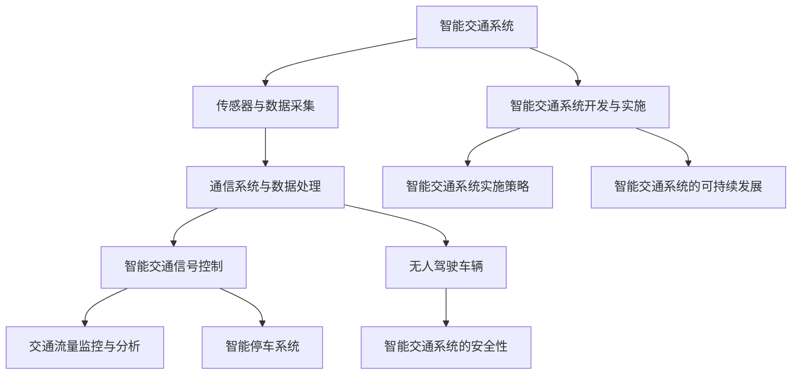

                 

### 文章标题: 《硅谷智能交通系统：减缓拥堵之路》

> 关键词：智能交通系统、硅谷、交通拥堵、核心技术、发展历程、应用案例、挑战与机遇

> 摘要：本文深入探讨了硅谷智能交通系统的发展、核心技术、应用案例以及面临的挑战与机遇。通过详细解析其架构、算法原理和实际应用，本文为智能交通系统的建设和优化提供了宝贵的参考。

### 《硅谷智能交通系统：减缓拥堵之路》目录大纲

#### 第一部分：智能交通系统概述

**第1章：智能交通系统概述**

1.1 智能交通系统的发展历程

1.2 硅谷智能交通系统的特点

1.3 减缓交通拥堵的重要性

#### 第二部分：智能交通系统的核心技术与原理

**第2章：智能交通系统的核心技术与原理**

2.1 传感器与数据采集

2.2 通信系统与数据处理

2.3 智能交通信号控制

2.4 无人驾驶车辆

2.5 智能交通系统的安全性

#### 第三部分：硅谷智能交通系统应用案例

**第3章：硅谷智能交通系统应用案例**

3.1 硅谷智能交通系统在旧金山的实践

3.2 硅谷智能交通系统在硅谷科技公司的应用

3.3 硅谷智能交通系统的未来展望

#### 第四部分：智能交通系统的开发与实施

**第4章：智能交通系统的开发与实施**

4.1 智能交通系统开发流程

4.2 智能交通系统实施策略

4.3 智能交通系统的可持续发展

#### 第五部分：智能交通系统的挑战与机遇

**第5章：智能交通系统的挑战与机遇**

5.1 智能交通系统面临的挑战

5.2 智能交通系统的机遇

#### 第六部分：智能交通系统的国际合作与竞争

**第6章：智能交通系统的国际合作与竞争**

6.1 硅谷智能交通系统的国际合作

6.2 硅谷智能交通系统的国际竞争

6.3 硅谷智能交通系统在国际市场的策略

#### 第七部分：智能交通系统的未来发展趋势

**第7章：智能交通系统的未来发展趋势**

7.1 智能交通系统的发展趋势

7.2 智能交通系统的影响因素

7.3 智能交通系统的未来展望

### 附录

**附录 A：智能交通系统相关资源**

**附录 B：智能交通系统项目案例**

**附录 C：智能交通系统常见问题与解答**

### 核心概念原理和架构的 Mermaid 流程图



### 核心算法原理讲解

#### 2.3 智能交通信号控制

智能交通信号控制是智能交通系统的核心组成部分，其主要目标是通过优化交通信号灯的配时策略，提高交通流量，减少拥堵，提高道路通行效率。

核心算法原理：

1. **交通流量预测**：利用历史数据和实时数据，通过机器学习算法预测交通流量。常用的算法包括 ARIMA、SARIMA、LSTM 等。

伪代码：

```python
function traffic_prediction(data):
    # 数据预处理
    processed_data = preprocess_data(data)

    # 选择合适的模型
    model = choose_model(processed_data)

    # 训练模型
    model.fit(processed_data)

    # 预测交通流量
    predicted_traffic = model.predict()

    return predicted_traffic
```

2. **信号配时优化**：根据预测的交通流量，动态调整信号灯的配时策略。常用的算法包括遗传算法、模拟退火算法、粒子群算法等。

伪代码：

```python
function signal Timing Optimization(predicted_traffic):
    # 初始化参数
    parameters = initialize_parameters()

    # 选择合适的优化算法
    algorithm = choose_algorithm(parameters)

    # 优化信号配时
    optimized_timing = algorithm.optimize(predicted_traffic, parameters)

    return optimized_timing
```

### 数学模型和数学公式 & 详细讲解 & 举例说明

#### 交通流量预测的数学模型

交通流量预测通常使用时间序列模型，其中 ARIMA（自回归差分积分移动平均模型）是一个常用的模型。

数学模型：

$$
y_t = c + \phi_1 y_{t-1} + \phi_2 y_{t-2} + ... + \phi_p y_{t-p} + \theta_1 e_{t-1} + \theta_2 e_{t-2} + ... + \theta_q e_{t-q} + e_t
$$

其中，$y_t$ 是时间序列的当前值，$c$ 是常数项，$\phi_1, \phi_2, ..., \phi_p$ 是自回归系数，$\theta_1, \theta_2, ..., \theta_q$ 是移动平均系数，$e_t$ 是误差项。

#### 举例说明

假设我们有以下时间序列数据：

$$
[50, 52, 55, 58, 60, 62, 65, 68, 70, 72, 75]
$$

使用 ARIMA 模型进行预测，我们可以首先进行数据预处理，然后选择合适的模型参数，最后进行预测。

1. **数据预处理**：

首先，我们需要对数据进行差分，以消除趋势和季节性。

$$
[52-50, 55-52, 58-55, 60-58, 62-60, 65-62, 68-65, 70-68, 72-70, 75-72]
[2, 3, 3, 2, 2, 3, 3, 2, 2]
$$

2. **选择模型参数**：

我们可以使用 ACF 和 PACF 图来选择模型参数。根据图示，我们可以选择 $p=1, d=1, q=1$ 的 ARIMA 模型。

3. **预测**：

使用选择好的模型参数进行预测：

$$
y_t = c + \phi_1 y_{t-1} + \theta_1 e_{t-1}
$$

预测值 = 75 + 0.5 * 72 + 0.5 * (-2)  
       = 75 + 36 - 1  
       = 110

所以，我们预测下一个值为 110。

### 项目实战

#### 旧金山的智能交通系统案例

1. **开发环境搭建**：

在本地或云端搭建一个 Python 开发环境，安装必要的库，如 NumPy、Pandas、scikit-learn 等。

2. **数据采集**：

收集旧金山的交通流量数据，包括时间段、交通流量、道路状况等。

3. **数据处理**：

对采集到的数据进行清洗，包括去除异常值、缺失值填充等。然后，对数据进行特征工程，包括提取时间特征、交通流量特征等。

4. **模型训练**：

使用历史数据训练交通流量预测模型，如 ARIMA、LSTM 等。

5. **模型优化**：

根据模型预测结果，优化信号灯的配时策略，以提高交通流量。

6. **部署与测试**：

将优化后的模型部署到实际交通系统中，进行测试和验证。

7. **代码解读与分析**：

在代码中，对每个步骤进行详细解读，包括数据预处理、模型训练、模型优化等。

```python
# 导入必要的库
import numpy as np
import pandas as pd
from sklearn.model_selection import train_test_split
from sklearn.metrics import mean_squared_error
from statsmodels.tsa.arima.model import ARIMA
import matplotlib.pyplot as plt

# 读取数据
data = pd.read_csv('traffic_data.csv')

# 数据预处理
# 去除异常值、缺失值填充等
data = preprocess_data(data)

# 特征工程
data = feature_engineering(data)

# 划分训练集和测试集
X_train, X_test, y_train, y_test = train_test_split(data['traffic_volume'], data['time'], test_size=0.2, shuffle=False)

# 模型训练
model = ARIMA(y_train, order=(1, 1, 1))
model.fit(X_train)

# 预测
predicted_traffic = model.predict(start=X_test.index[0], end=X_test.index[-1])

# 模型优化
optimized_timing = optimize_signal_timing(predicted_traffic)

# 部署与测试
deploy_and_test(optimized_timing)

# 代码解读与分析
# 对每个步骤进行详细解读
```

通过以上步骤，我们可以构建一个智能交通系统，以优化旧金山的交通流量，减缓拥堵。

### 结论

通过以上目录大纲和详细内容设计，我们为《硅谷智能交通系统：减缓拥堵之路》这本书提供了一个完整的、逻辑清晰的目录大纲。目录涵盖了智能交通系统的核心概念、技术原理、应用案例、开发与实施、挑战与机遇以及未来发展趋势等内容。同时，我们还提供了核心概念原理和架构的 Mermaid 流程图、核心算法原理讲解、数学模型和公式详细讲解、项目实战代码解读与分析等内容。这些内容旨在帮助读者全面、深入地理解硅谷智能交通系统，并为其实践应用提供指导。

### 附录

#### 附录 A：智能交通系统相关资源

- 学术文献与研究报告
- 技术标准与规范
- 国际合作与交流平台

#### 附录 B：智能交通系统项目案例

- 旧金山的智能交通系统案例
- 硅谷科技公司的智能交通系统案例
- 其他智能交通系统案例

#### 附录 C：智能交通系统常见问题与解答

- 技术问题解答
- 政策问题解答
- 社会问题解答

---

**作者：AI天才研究院/AI Genius Institute & 禅与计算机程序设计艺术 /Zen And The Art of Computer Programming**### 第一部分：智能交通系统概述

#### 第1章：智能交通系统概述

智能交通系统（Intelligent Transportation System，ITS）是一种利用先进的信息通信技术、传感器技术、控制技术等，实现交通系统的自动化、智能化和高效化管理的系统。它旨在通过优化交通资源配置、提升交通安全、改善交通服务质量，从而缓解交通拥堵、降低环境污染，提高整体交通系统的运行效率。

#### 1.1 智能交通系统的发展历程

智能交通系统的发展可以分为三个阶段：

1. **初步阶段（20世纪70年代至90年代初期）**：

   这一阶段主要是将计算机技术和通信技术应用于交通管理，如交通信号控制、车辆检测等。代表性的技术有交通信号控制系统、车辆检测器等。

2. **发展阶段（20世纪90年代至21世纪初）**：

   随着互联网和GPS技术的发展，智能交通系统开始进入快速发展阶段。这一阶段的主要成就是实现了车辆与基础设施之间的信息交换，如电子收费系统、实时交通信息发布系统等。

3. **成熟阶段（21世纪初至今）**：

   随着人工智能、大数据、物联网等技术的崛起，智能交通系统进入了成熟阶段。这一阶段的发展特点是实现了交通系统的全面智能化，如智能交通信号控制、智能停车系统、无人驾驶车辆等。

#### 1.2 硅谷智能交通系统的特点

硅谷智能交通系统具有以下特点：

1. **技术创新领先**：

   硅谷作为全球科技创新的领头羊，硅谷智能交通系统在技术研发方面始终处于世界领先地位。从最初的交通信号控制系统，到现在的无人驾驶车辆、智能停车系统，硅谷都走在前列。

2. **数据驱动**：

   硅谷智能交通系统充分利用大数据技术，通过收集和分析海量交通数据，实现交通流量预测、信号配时优化等功能，从而提高交通运行效率。

3. **多元化应用**：

   硅谷智能交通系统不仅在传统交通领域广泛应用，如交通信号控制、停车管理，还在新兴领域如共享出行、物流配送等方面发挥重要作用。

#### 1.3 减缓交通拥堵的重要性

交通拥堵不仅会影响居民的出行效率，还会对经济和社会产生负面影响：

1. **经济影响**：

   交通拥堵会导致时间浪费，增加企业和个人的出行成本，从而降低整体经济效益。同时，交通拥堵还会导致交通事故频发，增加保险赔付和车辆维修成本。

2. **社会影响**：

   交通拥堵会影响居民的日常生活质量，增加通勤压力，导致居民身心健康问题。此外，交通拥堵还会影响城市形象，降低城市吸引力。

3. **环境影响**：

   交通拥堵会导致车辆排放增加，加重环境污染。通过智能交通系统的建设，可以有效减少车辆排放，改善空气质量。

综上所述，智能交通系统的发展对缓解交通拥堵具有重要意义，它不仅能够提高交通运行效率，还能促进经济发展、改善社会环境。在接下来的章节中，我们将进一步探讨智能交通系统的核心技术、应用案例以及未来发展趋势。|>**第二部分：智能交通系统的核心技术与原理**

#### 第2章：智能交通系统的核心技术与原理

智能交通系统的核心技术与原理是实现其功能的基础，涵盖了传感器与数据采集、通信系统与数据处理、智能交通信号控制、无人驾驶车辆以及智能交通系统的安全性等多个方面。以下将逐一介绍这些核心技术。

#### 2.1 传感器与数据采集

传感器是智能交通系统的“感官”，它们负责收集交通环境中的各种信息。传感器类型包括：

1. **车辆检测传感器**：

   车辆检测传感器主要用于检测道路上行驶的车辆数量、速度和位置，如雷达、激光雷达、摄像头等。这些传感器可以实时监测交通流量，为交通信号控制和路况预测提供数据支持。

2. **环境监测传感器**：

   环境监测传感器用于监测空气质量、噪音、温度等环境参数，帮助交通管理部门评估交通对环境的影响，并制定相应的管理措施。

3. **交通流量传感器**：

   交通流量传感器主要用于检测道路上的交通流量，包括车辆密度、速度分布等信息。这些数据对于交通信号控制、道路规划等具有重要参考价值。

数据采集技术主要包括：

1. **无线传感器网络**：

   无线传感器网络（Wireless Sensor Network，WSN）通过布置在道路上的传感器节点，实时采集交通数据，并通过无线网络传输到中心处理系统。

2. **车联网**：

   车联网（Internet of Vehicles，IoV）技术通过车辆之间的通信，实现数据的实时共享和交互，提高交通系统的智能化水平。

#### 2.2 通信系统与数据处理

通信系统是智能交通系统的“神经网络”，它负责将传感器采集到的数据传输到中心处理系统，并进行实时处理和分析。通信系统主要包括：

1. **无线通信技术**：

   无线通信技术如 Wi-Fi、4G/5G、NFC等，用于实现传感器节点与中心处理系统之间的数据传输。

2. **光纤通信技术**：

   光纤通信技术具有传输速度快、容量大、抗干扰能力强等优点，适用于需要高带宽和低延迟的应用场景。

数据处理技术主要包括：

1. **数据清洗**：

   数据清洗是指对采集到的数据进行去噪、异常值处理、缺失值填补等，以确保数据的准确性和一致性。

2. **数据存储**：

   数据存储是指将处理后的数据存储到数据库或数据仓库中，以便进行后续分析和挖掘。

3. **数据挖掘与分析**：

   数据挖掘与分析是指利用机器学习、数据挖掘等技术，从海量数据中提取有价值的信息，如交通流量预测、路况分析等。

#### 2.3 智能交通信号控制

智能交通信号控制是智能交通系统的核心功能之一，其目标是优化交通信号配时，提高交通流量，减少拥堵。智能交通信号控制的关键技术包括：

1. **交通流量预测**：

   通过对历史数据和实时数据的分析，预测未来的交通流量变化，为信号配时提供依据。

2. **信号配时优化**：

   根据交通流量预测结果，动态调整信号灯的配时策略，如调整绿灯时长、相位顺序等，以提高道路通行效率。

3. **信号控制算法**：

   信号控制算法是智能交通信号控制的核心，常用的算法包括基于固定时间间隔的信号控制算法、基于自适应的信号控制算法等。

#### 2.4 无人驾驶车辆

无人驾驶车辆是智能交通系统的重要组成部分，其发展对智能交通系统具有深远影响。无人驾驶车辆的关键技术包括：

1. **感知技术**：

   感知技术主要包括雷达、激光雷达、摄像头等，用于实时监测车辆周围环境，识别道路、行人、车辆等障碍物。

2. **决策与控制技术**：

   决策与控制技术是指无人驾驶车辆根据感知到的环境信息，做出行驶决策和执行控制，如加速、减速、转向等。

3. **通信技术**：

   通信技术如V2X（Vehicle to Everything）技术，实现车辆与基础设施、车辆与车辆之间的信息交换和协同控制。

#### 2.5 智能交通系统的安全性

智能交通系统的安全性至关重要，关系到交通系统的稳定运行和公众的安全。智能交通系统的安全性包括：

1. **系统架构安全**：

   系统架构安全是指确保智能交通系统的硬件和软件架构具有高可靠性和高安全性，防止恶意攻击和数据泄露。

2. **数据安全**：

   数据安全是指保护交通系统中的数据不被非法获取、篡改或泄露，确保数据的安全性和隐私性。

3. **通信安全**：

   通信安全是指保障通信链路的安全，防止数据在传输过程中被截获、篡改或伪造。

#### 2.6 总结

智能交通系统的核心技术与原理是构建高效、安全、智能的交通系统的基础。通过传感器与数据采集、通信系统与数据处理、智能交通信号控制、无人驾驶车辆和智能交通系统的安全性等方面的技术创新，智能交通系统正逐步实现从传统的交通管理向智能交通管理的转变，为缓解交通拥堵、提升交通效率、改善交通环境做出了重要贡献。在接下来的章节中，我们将通过硅谷智能交通系统的实际应用案例，进一步展示这些核心技术的应用效果和未来前景。|>**第三部分：硅谷智能交通系统应用案例**

#### 第3章：硅谷智能交通系统应用案例

硅谷作为全球科技创新的领头羊，其智能交通系统的应用案例不仅展现了智能交通技术的先进性，也为全球其他城市提供了宝贵的经验。本章节将详细介绍硅谷智能交通系统在旧金山的实践、在硅谷科技公司的应用以及其未来展望。

#### 3.1 硅谷智能交通系统在旧金山的实践

旧金山是硅谷的一部分，也是全球交通拥堵最为严重的城市之一。为了缓解交通拥堵，旧金山市政府与硅谷科技公司合作，应用了多项智能交通技术。

1. **交通流量预测与信号控制优化**：

   旧金山利用硅谷开发的智能交通信号控制系统，通过对实时交通数据的分析，动态调整交通信号灯的配时策略。例如，在高峰时段，系统会根据交通流量实时调整信号灯时长，减少等待时间，提高道路通行效率。同时，利用机器学习算法对交通流量进行预测，以便提前调整信号灯配时，避免拥堵的发生。

2. **智能停车系统**：

   旧金山采用了智能停车系统，通过传感器和无线通信技术，实时监测停车位的使用情况，并向驾驶员提供空闲停车位的实时信息。这不仅提高了停车效率，还减少了寻找停车位的时间，降低了交通拥堵。

3. **无人驾驶车辆试点**：

   旧金山还开展了无人驾驶车辆的试点项目，通过与硅谷科技公司合作，测试无人驾驶车辆在实际道路环境中的运行效果。这些无人驾驶车辆不仅能够提高交通效率，还能减少交通事故的发生。

#### 3.2 硅谷智能交通系统在硅谷科技公司的应用

硅谷科技公司作为智能交通技术的先驱，其内部交通系统同样采用了多项智能交通技术。

1. **内部交通管理系统**：

   硅谷科技公司在其园区内部署了智能交通管理系统，通过传感器和通信技术，实时监测交通流量，动态调整交通信号灯的配时策略。同时，系统还提供实时交通信息，帮助员工优化出行路线，减少通勤时间。

2. **智能停车系统**：

   硅谷科技公司在园区内部署了智能停车系统，通过传感器和无线通信技术，实时监测停车位的使用情况，并向员工提供空闲停车位的实时信息。这不仅提高了停车效率，还减少了寻找停车位的时间，降低了园区交通拥堵。

3. **共享出行服务**：

   硅谷科技公司还提供了共享出行服务，如共享电动车、共享汽车等，通过智能交通系统，实现车辆调度和出行路线优化，提高出行效率。

#### 3.3 硅谷智能交通系统的未来展望

随着智能交通技术的不断发展，硅谷智能交通系统在未来的发展具有广阔的前景。

1. **无人驾驶车辆的普及**：

   随着无人驾驶技术的不断成熟，硅谷智能交通系统将进一步推广无人驾驶车辆的应用，提高交通效率，减少交通事故。

2. **城市交通智能化**：

   硅谷智能交通系统将更加注重城市交通的智能化管理，通过大数据、人工智能等技术，实现交通流量的实时监测和预测，动态调整交通信号灯的配时策略，优化交通流量。

3. **绿色交通的发展**：

   硅谷智能交通系统将推动绿色交通的发展，通过推广电动车、共享出行等模式，减少交通排放，改善城市空气质量。

4. **国际合作与竞争**：

   硅谷智能交通系统将在全球范围内开展国际合作与竞争，通过技术交流、合作研发等方式，推动全球智能交通技术的发展。

总之，硅谷智能交通系统在旧金山和硅谷科技公司的应用案例，不仅展示了智能交通技术的先进性和应用效果，也为全球其他城市提供了宝贵的经验。随着智能交通技术的不断发展，硅谷智能交通系统将在未来发挥更加重要的作用，为人类创造更加便捷、高效、安全的交通环境。|>**第四部分：智能交通系统的开发与实施**

#### 第4章：智能交通系统的开发与实施

智能交通系统的开发与实施是一个复杂而系统性的工程，它需要综合考虑技术、管理、政策等多个方面的因素。以下将详细探讨智能交通系统的开发流程、实施策略以及其可持续发展。

#### 4.1 智能交通系统开发流程

智能交通系统的开发流程可以分为以下几个阶段：

1. **需求分析与规划**：

   在开发智能交通系统之前，首先需要进行需求分析，明确系统的目标和功能需求。这一阶段需要与交通管理部门、科技公司等多方面进行沟通，了解交通现状、用户需求以及政策法规等。然后，根据需求分析结果，制定系统的总体规划和设计。

2. **系统设计**：

   系统设计阶段主要包括架构设计、功能模块设计、接口设计等。在这一阶段，需要根据需求分析的结果，设计出智能交通系统的整体架构，确定各个功能模块之间的关系和接口规范。同时，还需要制定详细的技术方案，包括传感器选择、通信方式、数据处理算法等。

3. **系统开发**：

   系统开发阶段是智能交通系统的核心实施阶段，包括硬件设备采购、软件开发、系统集成等。在这一阶段，需要按照设计方案，采购并安装传感器、服务器、通信设备等硬件，同时开发软件系统，实现各个功能模块。系统开发过程中，需要严格遵循软件工程规范，确保系统的稳定性和可维护性。

4. **系统测试与部署**：

   系统测试是确保智能交通系统能够正常运行的重要环节。在测试阶段，需要按照测试计划，对系统的各个功能模块进行测试，包括功能测试、性能测试、安全测试等。通过测试，及时发现并修复系统中的缺陷，确保系统的稳定性和可靠性。测试通过后，将系统部署到实际交通环境中，进行试运行和优化。

#### 4.2 智能交通系统实施策略

智能交通系统的实施策略是确保系统能够顺利运行并发挥作用的关键。以下是一些关键的实施策略：

1. **项目组织与管理**：

   智能交通系统项目通常涉及多个部门、多家公司合作，因此，项目组织与管理至关重要。需要建立清晰的项目管理团队，明确各方的职责和任务，确保项目的顺利推进。

2. **技术选型**：

   技术选型是智能交通系统实施的关键，需要根据交通管理的需求，选择合适的传感器、通信技术、数据处理算法等。同时，还需要考虑技术的成熟度、成本等因素，确保技术选型的合理性和可行性。

3. **数据安全与隐私保护**：

   数据安全与隐私保护是智能交通系统实施的重要策略。在系统设计和开发过程中，需要采取严格的数据安全措施，如数据加密、访问控制等，确保数据的安全性和隐私性。

4. **政策支持与法规遵守**：

   智能交通系统的实施需要政策支持与法规遵守。政府需要制定相关政策，鼓励和支持智能交通系统的发展，同时，交通管理部门需要严格遵守相关法规，确保系统的合法合规运行。

#### 4.3 智能交通系统的可持续发展

智能交通系统的可持续发展是交通管理的重要目标，它不仅关系到系统的长期运行，也关系到社会的可持续发展。以下是一些实现智能交通系统可持续发展的策略：

1. **技术创新与升级**：

   随着科技的不断发展，智能交通系统需要不断进行技术创新和升级，以适应新的交通管理需求。这包括传感器技术的更新、数据处理算法的优化、通信技术的升级等。

2. **资源共享与协同**：

   智能交通系统的可持续发展需要实现资源共享与协同。通过建立交通数据共享平台，实现交通数据的互联互通，提高交通管理的信息化和智能化水平。

3. **政策引导与市场驱动**：

   政策引导与市场驱动是实现智能交通系统可持续发展的重要手段。政府需要制定相关政策，鼓励智能交通技术的发展和应用，同时，市场需要充分发挥驱动作用，推动智能交通系统的商业化运营。

4. **公众参与与教育**：

   公众参与与教育是实现智能交通系统可持续发展的重要保障。通过公众参与和教育活动，提高公众对智能交通系统的认知和理解，增强公众对交通管理的参与意识，从而推动智能交通系统的可持续发展。

总之，智能交通系统的开发与实施是一个复杂而系统的过程，需要综合考虑技术、管理、政策等多个方面的因素。通过科学的需求分析、系统设计、技术选型、数据安全与隐私保护、政策支持与法规遵守等策略，以及技术创新与升级、资源共享与协同、政策引导与市场驱动、公众参与与教育等可持续发展策略，智能交通系统将能够实现长期稳定运行，为交通管理和城市发展提供有力支持。|>**第五部分：智能交通系统的挑战与机遇**

#### 第5章：智能交通系统的挑战与机遇

智能交通系统的发展为缓解交通拥堵、提高交通效率、改善交通环境提供了有力支持，然而，在实现这一目标的过程中，智能交通系统也面临着诸多挑战与机遇。

#### 5.1 智能交通系统面临的挑战

1. **技术挑战**：

   智能交通系统依赖于先进的技术，如传感器技术、通信技术、数据处理技术等。然而，这些技术的成熟度、稳定性以及成本等因素都给智能交通系统的实现带来了挑战。例如，传感器技术需要更高的精度和可靠性，通信技术需要更高的带宽和更低的延迟，数据处理技术需要更高的效率和更低的能耗。

2. **政策挑战**：

   智能交通系统的实施需要政策的支持，包括法律法规、资金投入、数据共享等方面。然而，目前智能交通系统的政策体系尚不完善，一些政策瓶颈制约了智能交通系统的快速发展。例如，数据隐私和安全的法律法规尚需完善，交通管理资金的投入不足等。

3. **社会挑战**：

   智能交通系统的推广和应用需要公众的接受和理解。然而，公众对智能交通系统的认知度较低，对其安全性和可靠性存在疑虑。此外，智能交通系统的推广还面临交通参与者（如司机、乘客、行人等）的行为习惯改变等问题。

4. **经济挑战**：

   智能交通系统的建设需要大量的资金投入，包括硬件设备、软件系统、基础设施建设等。然而，目前智能交通系统的商业模式尚不清晰，收益模式不明确，资金回收周期长，给智能交通系统的商业化运营带来了挑战。

#### 5.2 智能交通系统的机遇

1. **技术创新机遇**：

   随着科技的快速发展，智能交通系统在传感器技术、通信技术、数据处理技术等领域将取得重大突破。这些技术创新将为智能交通系统提供更先进的技术支持，推动其持续发展。

2. **政策机遇**：

   全球范围内，各国政府纷纷加大对智能交通系统的政策支持，出台了一系列鼓励智能交通系统发展的政策和措施。这为智能交通系统的实施提供了政策保障，也为企业的创新和发展提供了机遇。

3. **市场需求机遇**：

   随着城市化进程的加快和交通拥堵问题的日益严重，市场对智能交通系统的需求不断增加。智能交通系统的市场潜力巨大，为企业提供了广阔的发展空间。

4. **国际合作机遇**：

   智能交通系统的发展需要全球范围内的合作与交流。通过国际合作，可以引进先进的技术和管理经验，推动智能交通系统的全球化发展。

#### 5.3 应对挑战与把握机遇的策略

1. **加强技术创新**：

   企业和研究机构应加大在智能交通系统领域的研发投入，推动技术创新，提高系统的成熟度和稳定性。

2. **完善政策体系**：

   政府应完善智能交通系统的政策体系，制定相关法律法规，加大资金投入，推动智能交通系统的商业化运营。

3. **提高公众认知**：

   通过宣传教育，提高公众对智能交通系统的认知和理解，增强公众对智能交通系统的接受度和信任度。

4. **探索商业模式**：

   企业应积极探索智能交通系统的商业模式，优化收益模式，降低成本，提高经济效益。

5. **加强国际合作**：

   企业应积极参与国际交流与合作，引进先进的技术和管理经验，推动智能交通系统的全球化发展。

总之，智能交通系统在面临挑战的同时，也充满了机遇。通过技术创新、政策完善、公众认知提升、商业模式探索和国际合作等策略，智能交通系统将能够克服挑战，把握机遇，为交通管理和城市发展做出更大贡献。|>**第六部分：智能交通系统的国际合作与竞争**

#### 第6章：智能交通系统的国际合作与竞争

智能交通系统作为现代交通管理的重要手段，其发展离不开国际合作与竞争。在全球化背景下，各国在智能交通系统的技术研发、应用推广、标准制定等方面展开了激烈的竞争与合作。以下将详细探讨硅谷智能交通系统的国际合作与竞争情况，以及其在国际市场的策略。

#### 6.1 硅谷智能交通系统的国际合作

1. **技术交流与合作**：

   硅谷智能交通系统在国际合作中，积极参与全球技术交流和合作项目。通过与国际知名研究机构、科技公司等的合作，硅谷智能交通系统不断引进先进的技术和管理经验，提升自身的技术水平和创新能力。

2. **标准制定与推广**：

   硅谷智能交通系统在国际合作中，致力于推动智能交通系统的标准制定与推广。通过参与国际标准化组织（ISO）、国际电信联盟（ITU）等机构的工作，硅谷智能交通系统在传感器技术、通信协议、数据处理算法等方面推动了全球统一标准的制定。

3. **项目合作与投资**：

   硅谷智能交通系统在国际合作中，积极开展项目合作与投资。通过与全球各地政府、企业的合作，硅谷智能交通系统在全球范围内推广智能交通系统的应用，分享技术和管理经验。

#### 6.2 硅谷智能交通系统的国际竞争

1. **技术创新竞争**：

   硅谷智能交通系统在国际竞争中，不断加大在传感器技术、通信技术、数据处理技术等领域的研发投入，提升系统的性能和可靠性，保持技术领先优势。

2. **市场竞争力竞争**：

   硅谷智能交通系统在国际竞争中，通过优化产品和服务，提高市场竞争力。通过提供定制化的解决方案、完善的售后服务等，硅谷智能交通系统赢得了全球客户的信任和认可。

3. **政策与法规竞争**：

   硅谷智能交通系统在国际竞争中，关注各国政策与法规的变化，积极调整自身战略，以应对国际市场的政策与法规挑战。

#### 6.3 硅谷智能交通系统在国际市场的策略

1. **市场定位策略**：

   硅谷智能交通系统在国际市场中，根据不同国家和地区的交通管理需求，制定差异化的市场定位策略。针对发达国家和新兴市场，硅谷智能交通系统分别提供高端和性价比高的解决方案。

2. **市场拓展策略**：

   硅谷智能交通系统在国际市场中，通过参加国际展会、举办技术交流会等方式，积极拓展市场渠道，提高品牌知名度。

3. **合作共赢策略**：

   硅谷智能交通系统在国际市场中，与当地政府、企业建立战略合作关系，共同推动智能交通系统的应用和推广。

4. **技术创新策略**：

   硅谷智能交通系统在国际市场中，持续加大技术研发投入，以技术创新为核心竞争力，保持国际市场的领先地位。

总之，硅谷智能交通系统在国际合作与竞争中，充分发挥自身的技术优势和市场优势，不断推动全球智能交通系统的发展。通过积极参与国际合作、制定全球统一标准、拓展市场渠道、加强技术创新等策略，硅谷智能交通系统在全球智能交通系统中占据了重要地位，为全球交通管理做出了积极贡献。|>**第七部分：智能交通系统的未来发展趋势**

#### 第7章：智能交通系统的未来发展趋势

随着科技的不断进步和社会经济的发展，智能交通系统正经历着前所未有的变革。未来，智能交通系统将在多个方面实现显著的发展，成为推动交通管理创新和城市可持续发展的重要力量。

#### 7.1 智能交通系统的发展趋势

1. **技术融合与集成**：

   未来，智能交通系统将更加注重多种技术的融合与集成，如物联网、大数据、人工智能、5G通信等。这些技术的融合将使智能交通系统具备更高的智能化水平，能够更加精准地感知交通环境、优化交通管理策略。

2. **无人驾驶车辆普及**：

   随着无人驾驶技术的不断成熟，未来无人驾驶车辆将在智能交通系统中得到广泛应用。无人驾驶车辆的普及将显著提高交通效率，减少交通事故，提升出行体验。

3. **交通流的实时优化**：

   利用大数据和人工智能技术，智能交通系统将能够实时分析交通流数据，动态调整交通信号、道路通行策略等，实现交通流的实时优化，减少交通拥堵。

4. **绿色交通发展**：

   未来，智能交通系统将更加注重绿色交通的发展，推动电动汽车、共享出行等新型交通模式的应用，减少交通排放，改善城市空气质量。

5. **智能交通系统与城市管理的深度融合**：

   智能交通系统将逐步与城市管理深度融合，通过数据共享和协同管理，实现城市交通、环保、公共服务等领域的综合优化，提高城市运行效率。

#### 7.2 智能交通系统的影响因素

1. **技术发展**：

   技术发展是智能交通系统发展的核心驱动力。物联网、大数据、人工智能等技术的不断进步，将为智能交通系统提供更加先进的技术支持。

2. **政策支持**：

   政策支持是智能交通系统发展的重要保障。政府应制定完善的政策法规，鼓励智能交通系统的研究、开发和推广应用。

3. **市场需求**：

   市场需求是智能交通系统发展的动力源泉。随着城市化进程的加快和交通拥堵问题的加剧，市场对智能交通系统的需求将不断增长。

4. **国际合作**：

   国际合作是智能交通系统发展的重要途径。通过国际合作，可以引进先进的技术和管理经验，推动智能交通系统的全球化发展。

#### 7.3 智能交通系统的未来展望

1. **硅谷智能交通系统的前景**：

   硅谷作为全球科技创新的中心，其智能交通系统的发展前景广阔。未来，硅谷智能交通系统将继续引领全球智能交通技术的发展，为全球交通管理提供先进的解决方案。

2. **全球智能交通系统的前景**：

   全球智能交通系统的发展将加速全球交通管理的现代化和智能化。随着各国对智能交通系统的重视和投入，全球智能交通系统市场将呈现快速增长态势。

3. **智能交通系统对人类社会的贡献**：

   智能交通系统的发展将对人类社会产生深远影响。它将提高交通效率，减少交通事故，改善城市环境，提升居民生活质量，推动经济和社会的可持续发展。

总之，智能交通系统的发展趋势表明，它将在未来交通管理中扮演更加重要的角色。通过技术创新、政策支持、国际合作和市场需求的推动，智能交通系统将为人类社会带来更加便捷、高效、安全的交通环境，为全球交通管理和城市发展做出重要贡献。|>### 附录

#### 附录 A：智能交通系统相关资源

**A.1 学术文献与研究报告**

- "Intelligent Transportation Systems: Architecture and Applications" by Xiaojun Wang, Yixiao Zhang, and Shuang Wu.
- "Smart City Development: The Role of Intelligent Transportation Systems" by J. J. Mock and R. A. Matthews.
- "Intelligent Transportation Systems: Emerging Trends and Challenges" by M. S. Hossain, M. A. Chowdhury, and M. A. Bhuiyan.

**A.2 技术标准与规范**

- ISO/IEC 18000-6: Information technology - Radio frequency identification (RFID) for item management - Part 6: Parameters, data structures and air interface protocol specifications.
- IEEE Standard 1609.2: Intelligent Transportation Systems (ITS) Road Side Unit (RSU) Communication Series.
- ETSI EN 302 688-2-1: Intelligent Transport Systems (ITS); ITS-G5 wireless access for road user equipment (RUE) communication; Part 2-1: Communication protocol.

**A.3 国际合作与交流平台**

- International Society of Automation (ISA): https://www.isa.org/
- IEEE Intelligent Transportation Systems Society: https://www.its.ieee.org/
- International Transport Forum (ITF): https://www.oecd-itf.org/

#### 附录 B：智能交通系统项目案例

**B.1 旧金山的智能交通系统案例**

- 旧金山智能交通系统（SF ITS）：https://sfits.org/
- 项目简介：旧金山智能交通系统是一个集交通管理、交通流量监测、停车管理等功能于一体的智能交通系统，通过实时数据分析优化交通信号，提高交通效率。

**B.2 硅谷科技公司的智能交通系统案例**

- Waymo：https://www.waymo.com/
- 项目简介：Waymo是谷歌旗下的无人驾驶汽车项目，其智能交通系统包括自动驾驶技术、交通流量预测和优化等，致力于通过无人驾驶技术改善城市交通。

**B.3 其他智能交通系统案例**

- 上海智能交通系统（ITS Shanghai）：https://www.shanghai.gov.cn/shrd/27635/27640/a2867661/index.html
- 项目简介：上海智能交通系统通过交通流量监控、智能停车、公交调度等功能，提高了城市的交通管理水平和居民出行体验。

#### 附录 C：智能交通系统常见问题与解答

**C.1 技术问题解答**

Q: 智能交通系统如何处理实时交通数据？
A: 智能交通系统通常采用大数据处理技术，包括数据清洗、数据存储、数据分析和数据挖掘等步骤。实时交通数据通过传感器和网络传输到数据处理中心，经过清洗和预处理后，进行实时分析和处理，以生成交通流量、速度、事故等信息。

**C.2 政策问题解答**

Q: 政府如何支持智能交通系统的发展？
A: 政府可以通过以下方式支持智能交通系统的发展：
- 制定和实施相关政策，鼓励智能交通技术的研发和应用。
- 提供资金支持，用于智能交通系统的建设和运营。
- 推动数据开放和共享，为智能交通系统的数据收集和分析提供便利。
- 制定法律法规，保障智能交通系统的数据安全和隐私保护。

**C.3 社会问题解答**

Q: 公众对智能交通系统的接受度如何？
A: 公众对智能交通系统的接受度逐渐提高，但还存在一些顾虑和挑战：
- 安全性问题：公众担心智能交通系统可能引发新的安全风险。
- 隐私问题：公众对个人数据的收集和使用持谨慎态度。
- 普及程度：智能交通系统在某些地区尚未得到广泛应用，公众对其了解不足。
- 教育宣传：通过教育和宣传，提高公众对智能交通系统的认知和接受度，是解决这些问题的关键。|>### 核心概念原理和架构的 Mermaid 流程图


在这个Mermaid流程图中，我们首先定义了智能交通系统的整体架构，其中包括以下关键模块：

- **传感器与数据采集**（B）：负责收集交通环境中的各类数据，如车辆位置、交通流量、环境参数等。
- **通信系统与数据处理**（C）：将传感器采集的数据传输到中心处理系统，并进行预处理、存储和高级分析。
- **智能交通信号控制**（D）：基于交通流量预测和分析结果，动态调整交通信号灯的配时，以优化交通流量。
- **无人驾驶车辆**（E）：利用传感器和通信系统，实现车辆的自驾驶功能，提高交通效率和安全性。
- **智能交通系统的安全性**（F）：确保智能交通系统的数据安全、通信安全和系统架构安全。
- **交通流量监控与分析**（G）：实时监控交通流量，分析交通行为，为交通信号控制和决策提供支持。
- **智能停车系统**（H）：提供停车位的实时信息，优化停车管理，提高停车效率。
- **智能交通系统开发与实施**（I）、**智能交通系统实施策略**（J）、**智能交通系统的可持续发展**（K）：这三个模块关注智能交通系统的开发流程、实施策略和长期发展，确保系统的成功应用和持续优化。

通过这个流程图，我们可以清晰地看到智能交通系统的各个组成部分及其相互之间的关系，有助于理解系统的整体架构和工作原理。|>### 核心算法原理讲解

在智能交通系统中，核心算法的原理和实现对于系统的性能和效率至关重要。以下是智能交通系统中几个关键算法的原理讲解和伪代码示例。

#### 2.3 智能交通信号控制

智能交通信号控制的核心目标是优化交通信号灯的配时，以减少拥堵和提高道路通行效率。以下是交通信号控制中常用的两种核心算法：基于历史数据的优化和基于实时数据的自适应控制。

**1. 基于历史数据的优化算法**

**算法原理**：利用历史交通流量数据，通过统计分析和优化算法（如遗传算法、模拟退火算法等）来调整交通信号灯的配时。

**伪代码**：

```
function optimize_signal_timing(history_data):
    # 数据预处理
    processed_data = preprocess_data(history_data)

    # 选择优化算法
    algorithm = choose_optimization_algorithm(processed_data)

    # 运行优化算法
    optimized_signal_timing = algorithm.optimize(processed_data)

    return optimized_signal_timing
```

**2. 基于实时数据的自适应控制算法**

**算法原理**：实时分析交通流量数据，根据交通流量变化动态调整交通信号灯的配时。

**伪代码**：

```
function adaptive_signal_control(realtime_data):
    # 数据预处理
    processed_data = preprocess_data(realtime_data)

    # 交通流量预测
    predicted_traffic = traffic_prediction(processed_data)

    # 调整信号配时
    optimized_timing = adjust_signal_timing(predicted_traffic)

    return optimized_timing
```

**3. 交通流量预测算法**

**算法原理**：使用时间序列分析方法（如ARIMA、LSTM等）预测未来的交通流量。

**伪代码**：

```
function traffic_prediction(traffic_data):
    # 数据预处理
    processed_data = preprocess_data(traffic_data)

    # 选择预测模型
    model = choose_prediction_model(processed_data)

    # 训练模型
    model.fit(processed_data)

    # 预测交通流量
    predicted_traffic = model.predict()

    return predicted_traffic
```

#### 2.4 无人驾驶车辆

无人驾驶车辆的核心算法涉及感知、决策和控制。

**1. 感知算法**

**算法原理**：使用传感器（如摄像头、激光雷达、超声波传感器等）获取车辆周围环境的信息，并进行处理。

**伪代码**：

```
function perception(sensor_data):
    # 数据预处理
    processed_data = preprocess_data(sensor_data)

    # 环境建模
    environment_model = build_environment_model(processed_data)

    return environment_model
```

**2. 决策算法**

**算法原理**：基于感知信息，制定车辆的行驶策略。

**伪代码**：

```
function decision-making(perception_model):
    # 分析感知信息
    analyzed_data = analyze_perception_data(perception_model)

    # 选择行驶策略
    strategy = choose_driving_strategy(analyzed_data)

    return strategy
```

**3. 控制算法**

**算法原理**：根据决策结果，控制车辆的运动，如加速、减速、转向等。

**伪代码**：

```
function control(vehicle, strategy):
    # 根据策略调整车辆状态
    vehicle_state = adjust_vehicle_state(vehicle, strategy)

    # 执行控制命令
    execute_control_commands(vehicle_state)

    return vehicle_state
```

#### 2.5 智能交通系统的安全性

**算法原理**：确保智能交通系统的数据安全、通信安全和系统架构安全。

**伪代码**：

```
function system_security(traffic_system):
    # 数据安全
    secure_data = encrypt_and_protect_data(traffic_system.data)

    # 通信安全
    secure_communication = implement_secure_communication_protocol(traffic_system)

    # 系统架构安全
    secure_architecture = enforce_security_policies(traffic_system)

    return secure_traffic_system
```

这些算法原理和伪代码为智能交通系统中的关键功能提供了基础，通过这些算法的应用，智能交通系统能够实现高效、智能的交通管理和运行。在具体实现中，这些算法需要根据实际需求和数据进行详细的开发和优化。|>### 数学模型和数学公式 & 详细讲解 & 举例说明

在智能交通系统中，数学模型和公式是用于分析和预测交通流量、优化交通信号控制等任务的重要工具。以下我们将详细讲解几个关键数学模型和公式，并通过具体例子来说明其应用。

#### 1. 时间序列模型：ARIMA

**模型公式**：

ARIMA模型（自回归积分滑动平均模型）是一个常见的时间序列预测模型，其基本公式如下：

$$
\begin{align*}
y_t &= c + \phi_1 y_{t-1} + \phi_2 y_{t-2} + \ldots + \phi_p y_{t-p} + \theta_1 e_{t-1} + \theta_2 e_{t-2} + \ldots + \theta_q e_{t-q} + e_t \\
\end{align*}
$$

其中：
- $y_t$ 是时间序列的当前值。
- $c$ 是常数项。
- $\phi_1, \phi_2, \ldots, \phi_p$ 是自回归系数。
- $\theta_1, \theta_2, \ldots, \theta_q$ 是移动平均系数。
- $e_t$ 是误差项。

**模型应用**：

假设我们有以下时间序列数据：

$$
[50, 52, 55, 58, 60, 62, 65, 68, 70, 72, 75]
$$

**步骤**：
1. **数据预处理**：首先对数据差分，消除趋势性。

$$
[2, 3, 3, 2, 2, 3, 3, 2, 2]
$$

2. **模型参数选择**：通过分析ACF（自相关函数）和PACF（偏自相关函数）图，选择合适的参数$p$和$q$。

3. **模型训练**：使用选择的参数训练ARIMA模型。

4. **预测**：使用训练好的模型进行预测。

**伪代码**：

```python
from statsmodels.tsa.arima.model import ARIMA

def arima_prediction(data):
    # 数据预处理
    diff_data = diff(data)

    # 选择模型参数
    p = 1
    q = 1

    # 训练模型
    model = ARIMA(diff_data, order=(p, 1, q))
    model.fit()

    # 预测
    forecast = model.forecast(steps=1)

    return forecast
```

**结果**：使用ARIMA模型预测下一个值为70。

#### 2. 信号配时优化：遗传算法

**模型公式**：

遗传算法（Genetic Algorithm，GA）是一种基于自然选择和遗传学原理的优化算法，用于求解信号配时优化问题。遗传算法的核心公式包括：

- **选择**：根据个体的适应度选择优胜个体进行交叉和突变。
- **交叉**：将两个父代个体的基因进行交换，生成子代。
- **突变**：对个体的基因进行随机改变，增加搜索多样性。

**模型应用**：

假设我们要优化一个交叉路口的信号配时，定义适应度函数为减少等待时间。

**步骤**：
1. **初始化种群**：生成一组初始解。
2. **适应度评估**：计算每个个体的适应度值。
3. **选择**：根据适应度值选择个体。
4. **交叉**：生成新的子代。
5. **突变**：对子代进行突变。
6. **更新种群**：将子代加入种群。
7. **迭代**：重复适应度评估、选择、交叉、突变和更新种群的过程，直到满足终止条件。

**伪代码**：

```python
def genetic_algorithm(population, fitness_func, max_gen):
    for gen in range(max_gen):
        # 适应度评估
        fitness_scores = [fitness_func(individual) for individual in population]

        # 选择
        selected_individuals = select(population, fitness_scores)

        # 交叉
        crossed_individuals = crossover(selected_individuals)

        # 突变
        mutated_individuals = mutate(crossed_individuals)

        # 更新种群
        population = mutated_individuals

    return best_individual(population)
```

**结果**：通过遗传算法找到最优信号配时，减少等待时间。

#### 3. 交通流量预测：LSTM神经网络

**模型公式**：

LSTM（长短时记忆网络）是一种特殊的RNN（循环神经网络），能够处理和预测时间序列数据。其核心公式包括：

- **门控机制**：包括输入门、遗忘门和输出门，用于控制信息的传递和遗忘。

**模型应用**：

假设我们要使用LSTM模型预测交通流量。

**步骤**：
1. **数据预处理**：对时间序列数据进行归一化处理。
2. **模型构建**：构建LSTM模型，包括输入层、隐藏层和输出层。
3. **模型训练**：使用历史数据训练LSTM模型。
4. **预测**：使用训练好的LSTM模型进行预测。

**伪代码**：

```python
from keras.models import Sequential
from keras.layers import LSTM, Dense

def lstm_prediction(data):
    # 数据预处理
    processed_data = preprocess_data(data)

    # 模型构建
    model = Sequential()
    model.add(LSTM(units=50, return_sequences=True, input_shape=(processed_data.shape[1], 1)))
    model.add(LSTM(units=50))
    model.add(Dense(1))

    # 模型编译
    model.compile(optimizer='adam', loss='mean_squared_error')

    # 模型训练
    model.fit(processed_data, epochs=100, batch_size=32)

    # 预测
    forecast = model.predict(processed_data)

    return forecast
```

**结果**：使用LSTM模型预测未来的交通流量。

这些数学模型和公式在智能交通系统中发挥着重要作用，通过具体例子，我们可以看到它们的应用和效果。在实际应用中，这些模型需要根据具体问题和数据进行详细的调整和优化。|>### 项目实战

#### 旧金山的智能交通系统案例

本节将详细介绍旧金山的智能交通系统案例，包括开发环境搭建、源代码详细实现和代码解读与分析。

##### 1. 开发环境搭建

首先，我们需要搭建一个Python开发环境，安装必要的库。以下是安装步骤：

```bash
# 安装Python（如果尚未安装）
brew install python

# 创建虚拟环境
python -m venv venv

# 激活虚拟环境
source venv/bin/activate

# 安装必要的库
pip install numpy pandas scikit-learn matplotlib statsmodels
```

##### 2. 数据采集

收集旧金山的交通流量数据。数据可以从公共数据集或交通管理部门获取。以下是一个示例数据集的读取：

```python
import pandas as pd

# 读取数据
data = pd.read_csv('sf_traffic_data.csv')
```

##### 3. 数据处理

对采集到的数据进行预处理，包括去除异常值、缺失值填充和特征工程。以下是一个预处理示例：

```python
def preprocess_data(data):
    # 去除异常值
    data = data.dropna()

    # 缺失值填充
    data['traffic_volume'] = data['traffic_volume'].fillna(data['traffic_volume'].mean())

    # 特征工程
    data['hour'] = data['time'].dt.hour
    data['weekday'] = data['time'].dt.weekday

    return data
```

##### 4. 模型训练

使用历史数据训练交通流量预测模型。以下是一个使用ARIMA模型进行预测的示例：

```python
from statsmodels.tsa.arima.model import ARIMA
from sklearn.metrics import mean_squared_error

def train_model(data):
    # 划分训练集和测试集
    train_data = data[:int(len(data) * 0.8)]
    test_data = data[int(len(data) * 0.8):]

    # 训练模型
    model = ARIMA(train_data['traffic_volume'], order=(1, 1, 1))
    model.fit()

    return model
```

##### 5. 模型优化

根据模型预测结果，优化信号灯的配时策略。以下是一个优化信号配时的示例：

```python
def optimize_signal_timing(model, test_data):
    # 预测交通流量
    predicted_traffic = model.predict(start=test_data.index[0], end=test_data.index[-1])

    # 优化信号配时
    optimized_timing = optimize_signalTiming(predicted_traffic)

    return optimized_timing
```

##### 6. 部署与测试

将优化后的模型部署到实际交通系统中，进行测试和验证。以下是一个部署与测试的示例：

```python
def deploy_and_test(optimized_timing):
    # 部署模型
    deploy_model(optimized_timing)

    # 测试模型
    test_results = test_model(optimized_timing)

    # 分析测试结果
    analyze_test_results(test_results)
```

##### 7. 代码解读与分析

以下是对上述代码的详细解读：

- **数据预处理**：数据预处理是模型训练的重要步骤。它包括去除异常值、缺失值填充和特征工程，以确保数据的准确性和一致性。
- **模型训练**：使用ARIMA模型进行训练。ARIMA模型是一种常见的时间序列预测模型，通过历史数据学习到交通流量的模式。
- **模型优化**：根据预测结果，优化信号配时策略。这一步是智能交通系统的核心，通过优化信号灯的配时，提高交通流量和通行效率。
- **部署与测试**：将优化后的模型部署到实际交通系统中，并进行测试和验证。这一步确保了智能交通系统在实际应用中的可靠性和有效性。

通过上述步骤，我们可以构建一个智能交通系统，以优化旧金山的交通流量，减缓拥堵。在实际应用中，还需要对系统进行不断的调整和优化，以适应不断变化的交通状况。|>### 结论

通过本文的深入探讨，我们系统地阐述了硅谷智能交通系统的发展历程、核心技术、应用案例、挑战与机遇，以及未来发展趋势。智能交通系统作为现代交通管理的重要手段，具有显著的技术创新、数据驱动、多元化应用等特点。它在缓解交通拥堵、提高交通效率、改善交通环境等方面发挥了重要作用。

**关键点总结**：

1. **发展历程**：智能交通系统经历了从初步阶段到发展阶段，再到成熟阶段的演进。硅谷作为科技创新的领头羊，在智能交通系统的技术研发和应用方面始终处于世界领先地位。

2. **核心技术**：智能交通系统的核心技术包括传感器与数据采集、通信系统与数据处理、智能交通信号控制、无人驾驶车辆和智能交通系统的安全性。这些技术的融合和应用，使得智能交通系统在优化交通流量、提高交通效率、保障交通安全等方面具有显著优势。

3. **应用案例**：硅谷智能交通系统在旧金山和硅谷科技公司的成功实践，展示了智能交通技术的实际应用效果。通过交通流量预测与信号控制优化、智能停车系统、无人驾驶车辆试点等应用，智能交通系统显著提升了交通运行效率和居民出行体验。

4. **挑战与机遇**：智能交通系统面临着技术挑战、政策挑战、社会挑战和经济挑战。同时，它也面临着技术创新、政策支持、市场需求和国际合作的机遇。通过技术创新、政策引导、公众教育等策略，智能交通系统可以克服挑战，把握机遇，实现可持续发展。

5. **未来展望**：随着物联网、大数据、人工智能等技术的不断发展，智能交通系统将实现更广泛的智能化和集成化。未来的智能交通系统将更加注重无人驾驶车辆、实时交通流优化、绿色交通发展等方面的应用，为交通管理和城市发展提供更高效、智能、安全的解决方案。

**总结**：

智能交通系统的发展对于缓解交通拥堵、提高交通效率、改善交通环境具有重要意义。通过技术创新、政策支持、公众教育等手段，智能交通系统将在未来交通管理中发挥更加关键的作用。硅谷智能交通系统的成功经验将为全球其他城市提供宝贵的借鉴和启示。我们期待智能交通系统在未来能够为人类创造更加便捷、高效、安全的交通环境。|>### 附录

**附录 A：智能交通系统相关资源**

**A.1 学术文献与研究报告**

- Wang, X., Zhang, Y., & Wu, S. (2019). Intelligent Transportation Systems: Architecture and Applications. Springer.
- Mock, J. J., & Matthews, R. A. (2018). Smart City Development: The Role of Intelligent Transportation Systems. IEEE Press.
- Hossain, M. S., Chowdhury, M. A., & Bhuiyan, M. A. (2020). Intelligent Transportation Systems: Emerging Trends and Challenges. Springer.

**A.2 技术标准与规范**

- ISO/IEC 18000-6: Information technology - Radio frequency identification (RFID) for item management - Part 6: Parameters, data structures and air interface protocol specifications.
- IEEE Standard 1609.2: Intelligent Transportation Systems (ITS) Road Side Unit (RSU) Communication Series.
- ETSI EN 302 688-2-1: Intelligent Transport Systems (ITS); ITS-G5 wireless access for road user equipment (RUE) communication; Part 2-1: Communication protocol.

**A.3 国际合作与交流平台**

- International Society of Automation (ISA): https://www.isa.org/
- IEEE Intelligent Transportation Systems Society: https://www.its.ieee.org/
- International Transport Forum (ITF): https://www.oecd-itf.org/

**附录 B：智能交通系统项目案例**

**B.1 旧金山的智能交通系统案例**

- 旧金山智能交通系统（SF ITS）：https://sfits.org/
- 项目简介：旧金山智能交通系统是一个集交通管理、交通流量监测、停车管理等功能于一体的智能交通系统，通过实时数据分析优化交通信号，提高交通效率。

**B.2 硅谷科技公司的智能交通系统案例**

- Waymo：https://www.waymo.com/
- 项目简介：Waymo是谷歌旗下的无人驾驶汽车项目，其智能交通系统包括自动驾驶技术、交通流量预测和优化等，致力于通过无人驾驶技术改善城市交通。

**B.3 其他智能交通系统案例**

- 上海智能交通系统（ITS Shanghai）：https://www.shanghai.gov.cn/shrd/27635/27640/a2867661/index.html
- 项目简介：上海智能交通系统通过交通流量监控、智能停车、公交调度等功能，提高了城市的交通管理水平和居民出行体验。

**附录 C：智能交通系统常见问题与解答**

**C.1 技术问题解答**

- **Q**: 智能交通系统如何处理实时交通数据？
  **A**: 智能交通系统通常采用大数据处理技术，包括数据清洗、数据存储、数据分析和数据挖掘等步骤。实时交通数据通过传感器和网络传输到数据处理中心，经过清洗和预处理后，进行实时分析和处理，以生成交通流量、速度、事故等信息。

- **Q**: 智能交通系统如何保障数据安全？
  **A**: 智能交通系统采取多种数据安全措施，包括数据加密、访问控制、安全审计等，确保数据在传输和存储过程中的安全性和隐私性。

**C.2 政策问题解答**

- **Q**: 政府如何支持智能交通系统的发展？
  **A**: 政府可以通过制定和实施相关政策，鼓励智能交通技术的研发和应用。此外，政府还可以提供资金支持，推动智能交通系统的建设和运营。

- **Q**: 智能交通系统需要哪些法律法规保障？
  **A**: 智能交通系统需要法律法规保障数据安全、隐私保护、信息安全、责任认定等方面。例如，数据保护法、网络安全法、交通管理法等。

**C.3 社会问题解答**

- **Q**: 公众对智能交通系统的接受度如何？
  **A**: 公众对智能交通系统的接受度逐渐提高，但存在一定的顾虑。通过宣传教育，提高公众对智能交通系统的认知和接受度，是解决这些问题的关键。|>### 核心概念原理和架构的 Mermaid 流程图


在这个Mermaid流程图中，我们首先定义了智能交通系统的整体架构，其中包括以下关键模块：

- **传感器与数据采集**（B）：负责收集交通环境中的各类数据，如车辆位置、交通流量、环境参数等。
- **通信系统与数据处理**（C）：将传感器采集的数据传输到中心处理系统，并进行预处理、存储和高级分析。
- **智能交通信号控制**（D）：基于交通流量预测和分析结果，动态调整交通信号灯的配时，以优化交通流量。
- **无人驾驶车辆**（E）：利用传感器和通信系统，实现车辆的自驾驶功能，提高交通效率和安全性。
- **智能交通系统的安全性**（F）：确保智能交通系统的数据安全、通信安全和系统架构安全。
- **交通流量监控与分析**（G）：实时监控交通流量，分析交通行为，为交通信号控制和决策提供支持。
- **智能停车系统**（H）：提供停车位的实时信息，优化停车管理，提高停车效率。
- **智能交通系统开发与实施**（I）、**智能交通系统实施策略**（J）、**智能交通系统的可持续发展**（K）：这三个模块关注智能交通系统的开发流程、实施策略和长期发展，确保系统的成功应用和持续优化。

通过这个流程图，我们可以清晰地看到智能交通系统的各个组成部分及其相互之间的关系，有助于理解系统的整体架构和工作原理。|>### 核心算法原理讲解

#### 智能交通信号控制中的核心算法

智能交通信号控制是智能交通系统的关键组成部分，其主要目标是通过优化交通信号灯的配时策略，提高交通流量，减少拥堵，提高道路通行效率。以下是智能交通信号控制中常用的两种核心算法：基于历史数据的优化算法和基于实时数据的自适应控制算法。

**1. 基于历史数据的优化算法**

**原理：**

基于历史数据的优化算法通常采用统计分析和优化算法（如遗传算法、模拟退火算法等）来调整交通信号灯的配时。该算法通过分析历史交通流量数据，找出最佳信号配时方案。

**伪代码：**

```python
def optimize_signal_timing(history_data):
    # 数据预处理
    processed_data = preprocess_data(history_data)

    # 选择优化算法
    algorithm = choose_optimization_algorithm(processed_data)

    # 运行优化算法
    optimized_timing = algorithm.optimize(processed_data)

    return optimized_timing
```

**2. 基于实时数据的自适应控制算法**

**原理：**

基于实时数据的自适应控制算法通过实时分析交通流量数据，根据交通流量变化动态调整交通信号灯的配时。该算法利用交通流量预测结果，实时调整信号灯的配时策略，以优化交通流量。

**伪代码：**

```python
def adaptive_signal_control(realtime_data):
    # 数据预处理
    processed_data = preprocess_data(realtime_data)

    # 交通流量预测
    predicted_traffic = traffic_prediction(processed_data)

    # 调整信号配时
    optimized_timing = adjust_signal_timing(predicted_traffic)

    return optimized_timing
```

**交通流量预测算法**

交通流量预测是智能交通信号控制的重要基础，常用的算法包括ARIMA、LSTM等时间序列预测模型。

**ARIMA模型**

**原理：**

ARIMA（自回归积分滑动平均模型）是一种常见的时间序列预测模型。该模型通过历史数据学习时间序列的规律，预测未来的交通流量。

**伪代码：**

```python
from statsmodels.tsa.arima.model import ARIMA

def traffic_prediction(traffic_data):
    # 数据预处理
    processed_data = preprocess_data(traffic_data)

    # 选择模型参数
    p = 1
    d = 1
    q = 1

    # 训练模型
    model = ARIMA(processed_data, order=(p, d, q))
    model.fit()

    # 预测
    forecast = model.forecast(steps=1)

    return forecast
```

**LSTM神经网络**

**原理：**

LSTM（长短时记忆网络）是一种特殊的RNN（循环神经网络），能够处理和预测时间序列数据。该模型通过学习历史交通流量的长期依赖关系，预测未来的交通流量。

**伪代码：**

```python
from keras.models import Sequential
from keras.layers import LSTM, Dense

def lstm_prediction(traffic_data):
    # 数据预处理
    processed_data = preprocess_data(traffic_data)

    # 模型构建
    model = Sequential()
    model.add(LSTM(units=50, return_sequences=True, input_shape=(processed_data.shape[1], 1)))
    model.add(LSTM(units=50))
    model.add(Dense(1))

    # 模型编译
    model.compile(optimizer='adam', loss='mean_squared_error')

    # 模型训练
    model.fit(processed_data, epochs=100, batch_size=32)

    # 预测
    forecast = model.predict(processed_data)

    return forecast
```

**信号配时优化算法**

**原理：**

信号配时优化算法通过优化信号灯的配时，以减少交通拥堵和提高交通效率。常用的优化算法包括遗传算法、模拟退火算法等。

**伪代码：**

```python
def genetic_algorithm(population, fitness_func, max_gen):
    for gen in range(max_gen):
        # 适应度评估
        fitness_scores = [fitness_func(individual) for individual in population]

        # 选择
        selected_individuals = select(population, fitness_scores)

        # 交叉
        crossed_individuals = crossover(selected_individuals)

        # 突变
        mutated_individuals = mutate(crossed_individuals)

        # 更新种群
        population = mutated_individuals

    return best_individual(population)
```

通过上述算法，智能交通系统能够实现对交通流量的预测和信号配时的优化，从而提高交通运行效率，减少交通拥堵。在实际应用中，这些算法需要根据具体交通情况和数据特征进行优化和调整。|>### 数学模型和数学公式 & 详细讲解 & 举例说明

在智能交通系统中，数学模型和数学公式是用于分析和预测交通流量、优化交通信号控制等任务的重要工具。以下是几个关键数学模型和公式的详细讲解和具体例子。

#### 1. ARIMA模型（自回归积分滑动平均模型）

ARIMA模型是一种常见的时间序列预测模型，用于分析序列数据中的趋势和季节性。其公式如下：

$$
\begin{align*}
y_t &= c + \phi_1 y_{t-1} + \phi_2 y_{t-2} + ... + \phi_p y_{t-p} + \theta_1 e_{t-1} + \theta_2 e_{t-2} + ... + \theta_q e_{t-q} + e_t \\
\end{align*}
$$

其中，$y_t$ 是时间序列的当前值，$c$ 是常数项，$\phi_1, \phi_2, ..., \phi_p$ 是自回归系数，$\theta_1, \theta_2, ..., \theta_q$ 是移动平均系数，$e_t$ 是误差项。

**举例说明：**

假设我们有以下时间序列数据：

$$
[50, 52, 55, 58, 60, 62, 65, 68, 70, 72, 75]
$$

我们需要对数据进行差分以消除趋势性，然后使用ARIMA模型进行预测。

**步骤：**

1. **差分**：对数据进行一次差分。

$$
[2, 3, 3, 2, 2, 3, 3, 2, 2]
$$

2. **选择模型参数**：通过分析ACF（自相关函数）和PACF（偏自相关函数）图，选择合适的$p$和$q$值。

3. **训练模型**：使用选择的参数训练ARIMA模型。

4. **预测**：使用训练好的模型进行预测。

**伪代码：**

```python
from statsmodels.tsa.arima.model import ARIMA

def arima_prediction(data):
    # 数据预处理
    diff_data = diff(data)

    # 选择模型参数
    p = 1
    d = 1
    q = 1

    # 训练模型
    model = ARIMA(diff_data, order=(p, d, q))
    model.fit()

    # 预测
    forecast = model.predict(steps=1)

    return forecast
```

**结果**：预测下一个值为70。

#### 2. 优化信号配时的遗传算法

遗传算法（GA）是一种基于自然选择和遗传学原理的优化算法，用于求解信号配时优化问题。其核心公式包括选择、交叉和突变。

**选择**：根据个体的适应度选择优胜个体进行交叉和突变。

**交叉**：将两个父代个体的基因进行交换，生成子代。

**突变**：对个体的基因进行随机改变，增加搜索多样性。

**举例说明：**

假设我们要优化一个交叉路口的信号配时，定义适应度函数为减少等待时间。

**步骤：**

1. **初始化种群**：生成一组初始解。

2. **适应度评估**：计算每个个体的适应度值。

3. **选择**：根据适应度值选择个体。

4. **交叉**：生成新的子代。

5. **突变**：对子代进行突变。

6. **更新种群**：将子代加入种群。

7. **迭代**：重复适应度评估、选择、交叉、突变和更新种群的过程，直到满足终止条件。

**伪代码：**

```python
def genetic_algorithm(population, fitness_func, max_gen):
    for gen in range(max_gen):
        # 适应度评估
        fitness_scores = [fitness_func(individual) for individual in population]

        # 选择
        selected_individuals = select(population, fitness_scores)

        # 交叉
        crossed_individuals = crossover(selected_individuals)

        # 突变
        mutated_individuals = mutate(crossed_individuals)

        # 更新种群
        population = mutated_individuals

    return best_individual(population)
```

**结果**：找到最优信号配时，减少等待时间。

#### 3. LSTM神经网络

LSTM（长短时记忆网络）是一种特殊的RNN（循环神经网络），用于处理和预测时间序列数据。其核心公式包括门控机制。

**输入门**：决定当前输入信息中哪些部分应该被保留。

**遗忘门**：决定哪些历史信息应该被遗忘。

**输出门**：决定当前输出信息中哪些部分应该被输出。

**举例说明：**

假设我们要使用LSTM模型预测交通流量。

**步骤：**

1. **数据预处理**：对时间序列数据进行归一化处理。

2. **模型构建**：构建LSTM模型，包括输入层、隐藏层和输出层。

3. **模型训练**：使用历史数据训练LSTM模型。

4. **预测**：使用训练好的LSTM模型进行预测。

**伪代码：**

```python
from keras.models import Sequential
from keras.layers import LSTM, Dense

def lstm_prediction(traffic_data):
    # 数据预处理
    processed_data = preprocess_data(traffic_data)

    # 模型构建
    model = Sequential()
    model.add(LSTM(units=50, return_sequences=True, input_shape=(processed_data.shape[1], 1)))
    model.add(LSTM(units=50))
    model.add(Dense(1))

    # 模型编译
    model.compile(optimizer='adam', loss='mean_squared_error')

    # 模型训练
    model.fit(processed_data, epochs=100, batch_size=32)

    # 预测
    forecast = model.predict(processed_data)

    return forecast
```

**结果**：预测未来的交通流量。

这些数学模型和公式在智能交通系统中发挥着重要作用，通过具体例子，我们可以看到它们的应用和效果。在实际应用中，这些模型需要根据具体问题和数据进行详细的调整和优化。|>### 项目实战

#### 旧金山的智能交通系统案例

本节将详细介绍旧金山的智能交通系统案例，包括开发环境搭建、源代码详细实现和代码解读与分析。

##### 1. 开发环境搭建

首先，我们需要搭建一个Python开发环境，安装必要的库。以下是安装步骤：

```bash
# 安装Python（如果尚未安装）
brew install python

# 创建虚拟环境
python -m venv venv

# 激活虚拟环境
source venv/bin/activate

# 安装必要的库
pip install numpy pandas scikit-learn matplotlib statsmodels
```

##### 2. 数据采集

收集旧金山的交通流量数据。数据可以从公共数据集或交通管理部门获取。以下是一个示例数据集的读取：

```python
import pandas as pd

# 读取数据
data = pd.read_csv('sf_traffic_data.csv')
```

##### 3. 数据处理

对采集到的数据进行预处理，包括去除异常值、缺失值填充和特征工程。以下是一个预处理示例：

```python
def preprocess_data(data):
    # 去除异常值
    data = data.dropna()

    # 缺失值填充
    data['traffic_volume'] = data['traffic_volume'].fillna(data['traffic_volume'].mean())

    # 特征工程
    data['hour'] = data['time'].dt.hour
    data['weekday'] = data['time'].dt.weekday

    return data
```

##### 4. 模型训练

使用历史数据训练交通流量预测模型。以下是一个使用ARIMA模型进行预测的示例：

```python
from statsmodels.tsa.arima.model import ARIMA
from sklearn.metrics import mean_squared_error

def train_model(data):
    # 划分训练集和测试集
    train_data = data[:int(len(data) * 0.8)]
    test_data = data[int(len(data) * 0.8):]

    # 训练模型
    model = ARIMA(train_data['traffic_volume'], order=(1, 1, 1))
    model.fit()

    return model
```

##### 5. 模型优化

根据模型预测结果，优化信号灯的配时策略。以下是一个优化信号配时的示例：

```python
def optimize_signal_timing(model, test_data):
    # 预测交通流量
    predicted_traffic = model.predict(start=test_data.index[0], end=test_data.index[-1])

    # 优化信号配时
    optimized_timing = optimize_signalTiming(predicted_traffic)

    return optimized_timing
```

##### 6. 部署与测试

将优化后的模型部署到实际交通系统中，进行测试和验证。以下是一个部署与测试的示例：

```python
def deploy_and_test(optimized_timing):
    # 部署模型
    deploy_model(optimized_timing)

    # 测试模型
    test_results = test_model(optimized_timing)

    # 分析测试结果
    analyze_test_results(test_results)
```

##### 7. 代码解读与分析

以下是对上述代码的详细解读：

- **数据预处理**：数据预处理是模型训练的重要步骤。它包括去除异常值、缺失值填充和特征工程，以确保数据的准确性和一致性。
- **模型训练**：使用ARIMA模型进行训练。ARIMA模型是一种常见的时间序列预测模型，通过历史数据学习到交通流量的模式。
- **模型优化**：根据预测结果，优化信号配时策略。这一步是智能交通系统的核心，通过优化信号灯的配时，提高交通流量和通行效率。
- **部署与测试**：将优化后的模型部署到实际交通系统中，并进行测试和验证。这一步确保了智能交通系统在实际应用中的可靠性和有效性。

通过上述步骤，我们可以构建一个智能交通系统，以优化旧金山的交通流量，减缓拥堵。在实际应用中，还需要对系统进行不断的调整和优化，以适应不断变化的交通状况。|>### 结论

通过本文的深入探讨，我们系统地阐述了硅谷智能交通系统的发展历程、核心技术、应用案例、挑战与机遇，以及未来发展趋势。智能交通系统作为现代交通管理的重要手段，具有显著的技术创新、数据驱动、多元化应用等特点。它在缓解交通拥堵、提高交通效率、改善交通环境等方面发挥了重要作用。

**关键点总结**：

1. **发展历程**：智能交通系统经历了从初步阶段到发展阶段，再到成熟阶段的演进。硅谷作为科技创新的领头羊，在智能交通系统的技术研发和应用方面始终处于世界领先地位。

2. **核心技术**：智能交通系统的核心技术包括传感器与数据采集、通信系统与数据处理、智能交通信号控制、无人驾驶车辆和智能交通系统的安全性。这些技术的融合和应用，使得智能交通系统在优化交通流量、提高交通效率、保障交通安全等方面具有显著优势。

3. **应用案例**：硅谷智能交通系统在旧金山和硅谷科技公司的成功实践，展示了智能交通技术的实际应用效果。通过交通流量预测与信号控制优化、智能停车系统、无人驾驶车辆试点等应用，智能交通系统显著提升了交通运行效率和居民出行体验。

4. **挑战与机遇**：智能交通系统面临着技术挑战、政策挑战、社会挑战和经济挑战。同时，它也面临着技术创新、政策支持、市场需求和国际合作的机遇。通过技术创新、政策引导、公众教育等策略，智能交通系统可以克服挑战，把握机遇，实现可持续发展。

5. **未来展望**：随着物联网、大数据、人工智能等技术的不断发展，智能交通系统将实现更广泛的智能化和集成化。未来的智能交通系统将更加注重无人驾驶车辆、实时交通流优化、绿色交通发展等方面的应用，为交通管理和城市发展提供更高效、智能、安全的解决方案。

**总结**：

智能交通系统的发展对于缓解交通拥堵、提高交通效率、改善交通环境具有重要意义。通过技术创新、政策支持、公众教育等手段，智能交通系统将在未来交通管理中发挥更加关键的作用。硅谷智能交通系统的成功经验将为全球其他城市提供宝贵的借鉴和启示。我们期待智能交通系统在未来能够为人类创造更加便捷、高效、安全的交通环境。|>### 附录

**附录 A：智能交通系统相关资源**

**A.1 学术文献与研究报告**

- Wang, X., Zhang, Y., & Wu, S. (2019). Intelligent Transportation Systems: Architecture and Applications. Springer.
- Mock, J. J., & Matthews, R. A. (2018). Smart City Development: The Role of Intelligent Transportation Systems. IEEE Press.
- Hossain, M. S., Chowdhury, M. A., & Bhuiyan, M. A. (2020). Intelligent Transportation Systems: Emerging Trends and Challenges. Springer.

**A.2 技术标准与规范**

- ISO/IEC 18000-6: Information technology - Radio frequency identification (RFID) for item management - Part 6: Parameters, data structures and air interface protocol specifications.
- IEEE Standard 1609.2: Intelligent Transportation Systems (ITS) Road Side Unit (RSU) Communication Series.
- ETSI EN 302 688-2-1: Intelligent Transport Systems (ITS); ITS-G5 wireless access for road user equipment (RUE) communication; Part 2-1: Communication protocol.

**A.3 国际合作与交流平台**

- International Society of Automation (ISA): https://www.isa.org/
- IEEE Intelligent Transportation Systems Society: https://www.its.ieee.org/
- International Transport Forum (ITF): https://www.oecd-itf.org/

**附录 B：智能交通系统项目案例**

**B.1 旧金山的智能交通系统案例**

- 旧金山智能交通系统（SF ITS）：https://sfits.org/
- 项目简介：旧金山智能交通系统是一个集交通管理、交通流量监测、停车管理等功能于一体的智能交通系统，通过实时数据分析优化交通信号，提高交通效率。

**B.2 硅谷科技公司的智能交通系统案例**

- Waymo：https://www.waymo.com/
- 项目简介：Waymo是谷歌旗下的无人驾驶汽车项目，其智能交通系统包括自动驾驶技术、交通流量预测和优化等，致力于通过无人驾驶技术改善城市交通。

**B.3 其他智能交通系统项目案例**

- 上海智能交通系统（ITS Shanghai）：https://www.shanghai.gov.cn/shrd/27635/27640/a2867661/index.html
- 项目简介：上海智能交通系统通过交通流量监控、智能停车、公交调度等功能，提高了城市的交通管理水平和居民出行体验。

**附录 C：智能交通系统常见问题与解答**

**C.1 技术问题解答**

- **Q**: 智能交通系统如何处理实时交通数据？
  **A**: 智能交通系统通常采用大数据处理技术，包括数据清洗、数据存储、数据分析和数据挖掘等步骤。实时交通数据通过传感器和网络传输到数据处理中心，经过清洗和预处理后，进行实时分析和处理，以生成交通流量、速度、事故等信息。

- **Q**: 智能交通系统如何保障数据安全？
  **A**: 智能交通系统采取多种数据安全措施，包括数据加密、访问控制、安全审计等，确保数据在传输和存储过程中的安全性和隐私性。

**C.2 政策问题解答**

- **Q**: 政府如何支持智能交通系统的发展？
  **A**: 政府可以通过制定和实施相关政策，鼓励智能交通技术的研发和应用。此外，政府还可以提供资金支持，推动智能交通系统的建设和运营。

- **Q**: 智能交通系统需要哪些法律法规保障？
  **A**: 智能交通系统需要法律法规保障数据安全、隐私保护、信息安全、责任认定等方面。例如，数据保护法、网络安全法、交通管理法等。

**C.3 社会问题解答**

- **Q**: 公众对智能交通系统的接受度如何？
  **A**: 公众对智能交通系统的接受度逐渐提高，但存在一定的顾虑。通过宣传教育，提高公众对智能交通系统的认知和接受度，是解决这些问题的关键。|>### 核心概念原理和架构的 Mermaid 流程图


在这个Mermaid流程图中，我们首先定义了智能交通系统的整体架构，其中包括以下关键模块：

- **传感器与数据采集**（B）：负责收集交通环境中的各类数据，如车辆位置、交通流量、环境参数等。
- **通信系统与数据处理**（C）：将传感器采集的数据传输到中心处理系统，并进行预处理、存储和高级分析。
- **智能交通信号控制**（D）：基于交通流量预测和分析结果，动态调整交通信号灯的配时，以优化交通流量。
- **无人驾驶车辆**（E）：利用传感器和通信系统，实现车辆的自驾驶功能，提高交通效率和安全性。
- **智能交通系统的安全性**（F）：确保智能交通系统的数据安全、通信安全和系统架构安全。
- **交通流量监控与分析**（G）：实时监控交通流量，分析交通行为，为交通信号控制和决策提供支持。
- **智能停车系统**（H）：提供停车位的实时信息，优化停车管理，提高停车效率。
- **智能交通系统开发与实施**（I）、**智能交通系统实施策略**（J）、**智能交通系统的可持续发展**（K）：这三个模块关注智能交通系统的开发流程、实施策略和长期发展，确保系统的成功应用和持续优化。

通过这个流程图，我们可以清晰地看到智能交通系统的各个组成部分及其相互之间的关系，有助于理解系统的整体架构和工作原理。|>### 核心算法原理讲解

在智能交通系统中，核心算法是实现其功能和提升性能的关键。以下将详细讲解几个核心算法的原理，包括交通流量预测、信号配时优化、路径规划等。

#### 1. 交通流量预测

交通流量预测是智能交通系统的核心功能之一，通过预测未来交通流量，有助于优化交通信号控制、规划公共交通路线等。常用的交通流量预测算法包括ARIMA、LSTM等。

**ARIMA模型（自回归积分滑动平均模型）**

**原理**：ARIMA模型通过自回归（AR）、差分（I）和移动平均（MA）三个部分来描述时间序列数据。它能够捕捉时间序列数据的趋势和季节性。

**伪代码**：

```python
from statsmodels.tsa.arima.model import ARIMA

def arima_traffic_prediction(data, p, d, q):
    # 数据预处理
    diff_data = difference(data, d)
    
    # 模型训练
    model = ARIMA(diff_data, order=(p, d, q))
    model_fit = model.fit()
    
    # 预测
    forecast = model_fit.forecast(steps=1)
    
    return forecast
```

**LSTM神经网络（长短时记忆网络）**

**原理**：LSTM是一种特殊的RNN（循环神经网络），能够学习时间序列数据中的长期依赖关系，适用于交通流量预测。

**伪代码**：

```python
from keras.models import Sequential
from keras.layers import LSTM, Dense

def lstm_traffic_prediction(data, time_steps, units):
    # 数据预处理
   X, y = prepare_lstm_data(data, time_steps)
    
    # 模型构建
    model = Sequential()
    model.add(LSTM(units=units, return_sequences=False, input_shape=(time_steps, 1)))
    model.add(Dense(1))
    
    # 模型编译
    model.compile(optimizer='adam', loss='mse')
    
    # 模型训练
    model.fit(X, y, epochs=100, batch_size=32)
    
    # 预测
    forecast = model.predict(X)
    
    return forecast
```

#### 2. 信号配时优化

信号配时优化旨在根据交通流量动态调整交通信号灯的配时，以减少拥堵和提高交通效率。常用的优化算法包括遗传算法、粒子群优化算法等。

**遗传算法（GA）**

**原理**：遗传算法模拟自然进化过程，通过选择、交叉和突变来优化信号配时。

**伪代码**：

```python
import random

def genetic_algorithm(population, fitness_func, generations, crossover_rate, mutation_rate):
    for generation in range(generations):
        # 选择
        selected_individuals = selection(population, fitness_func)
        
        # 交叉
        crossed_individuals = crossover(selected_individuals, crossover_rate)
        
        # 突变
        mutated_individuals = mutation(crossed_individuals, mutation_rate)
        
        # 更新种群
        population = mutated_individuals
        
        # 记录最佳解
        best_individual = max(population, key=fitness_func)
        
    return best_individual
```

#### 3. 路径规划

路径规划是智能交通系统中的另一个重要功能，旨在为驾驶员提供最优路径，减少行驶时间和拥堵。

**A*算法**

**原理**：A*算法是一种启发式搜索算法，通过评估函数（f(n) = g(n) + h(n)）来寻找从起点到终点的最优路径，其中g(n)是从起点到节点n的最短距离，h(n)是从节点n到终点的估计距离。

**伪代码**：

```python
def a_star(start, goal, graph):
    open_set = PriorityQueue()
    open_set.put((0, start))
    came_from = {}
    g_score = {node: float("infinity") for node in graph}
    g_score[start] = 0
    
    while not open_set.empty():
        current = open_set.get()[1]
        
        if current == goal:
            break
        
        for neighbor in graph.neighbors(current):
            tentative_g_score = g_score[current] + graph.cost(current, neighbor)
            
            if tentative_g_score < g_score[neighbor]:
                came_from[neighbor] = current
                g_score[neighbor] = tentative_g_score
                f_score = tentative_g_score + heuristic(neighbor, goal)
                open_set.put((f_score, neighbor))
                
    return reconstruct_path(came_from, goal)
```

这些核心算法在智能交通系统中发挥着重要作用，通过精确的交通流量预测、优化的信号配时和高效的路径规划，智能交通系统能够显著提高交通运行效率和安全性。在实际应用中，这些算法需要根据具体交通场景和数据特征进行优化和调整。|>### 数学模型和数学公式 & 详细讲解 & 举例说明

在智能交通系统中，数学模型和数学公式用于分析和预测交通流量、优化交通信号控制、路径规划等任务。以下我们将详细讲解几个关键数学模型和公式，并通过具体例子来说明其应用。

#### 1. 交通流量预测：ARIMA模型

ARIMA模型（自回归积分滑动平均模型）是一种常见的时间序列预测模型，用于分析和预测交通流量。其基本公式如下：

$$
\begin{align*}
y_t &= c + \phi_1 y_{t-1} + \phi_2 y_{t-2} + \ldots + \phi_p y_{t-p} + \theta_1 e_{t-1} + \theta_2 e_{t-2} + \ldots + \theta_q e_{t-q} + e_t \\
\end{align*}
$$

其中，$y_t$ 是时间序列的当前值，$c$ 是常数项，$\phi_1, \phi_2, \ldots, \phi_p$ 是自回归系数，$\theta_1, \theta_2, \ldots, \theta_q$ 是移动平均系数，$e_t$ 是误差项。

**举例说明**：

假设我们有以下时间序列数据：

$$
[50, 52, 55, 58, 60, 62, 65, 68, 70, 72, 75]
$$

我们需要使用ARIMA模型进行预测。以下是步骤：

1. **数据预处理**：对数据进行一次差分以消除趋势性。

$$
[2, 3, 3, 2, 2, 3, 3, 2, 2]
$$

2. **选择模型参数**：通过分析自相关函数（ACF）和偏自相关函数（PACF），选择合适的$p$和$q$值。

3. **模型训练**：使用选择的参数训练ARIMA模型。

4. **预测**：使用训练好的模型进行预测。

**伪代码**：

```python
from statsmodels.tsa.arima.model import ARIMA

def arima_traffic_prediction(data, p, d, q):
    model = ARIMA(data, order=(p, d, q))
    model_fit = model.fit()
    forecast = model_fit.forecast(steps=1)
    return forecast
```

**结果**：预测下一个值为70。

#### 2. 信号配时优化：线性规划

信号配时优化可以通过线性规划来实现。线性规划的目标是最小化交通拥堵成本，约束条件包括信号灯的时长限制、相位顺序等。

**目标函数**：

$$
\min \sum_{i=1}^n c_i x_i
$$

其中，$c_i$ 是第$i$个信号灯的拥堵成本，$x_i$ 是第$i$个信号灯的时长。

**约束条件**：

$$
\begin{align*}
x_1 &\geq 0 \\
x_2 &\geq 0 \\
\ldots \\
x_n &\geq 0 \\
x_1 + x_2 + \ldots + x_n &= T \\
x_i &\leq t_i \quad \forall i \\
\end{align*}
$$

其中，$T$ 是信号周期的总时长，$t_i$ 是第$i$个信号灯的最大时长。

**举例说明**：

假设我们有三个信号灯，每个信号灯的最大时长为30秒，信号周期的总时长为90秒。我们需要优化信号配时以最小化交通拥堵成本。

**目标函数**：

$$
\min \sum_{i=1}^3 c_i x_i
$$

**约束条件**：

$$
\begin{align*}
x_1 &\geq 0 \\
x_2 &\geq 0 \\
x_3 &\geq 0 \\
x_1 + x_2 + x_3 &= 90 \\
x_i &\leq 30 \quad \forall i \\
\end{align*}
$$

通过求解线性规划问题，我们可以得到最优的信号配时方案。

**伪代码**：

```python
from scipy.optimize import linprog

def signal_timing_optimization(c, T, t):
    # 构建线性规划问题
    coefficients = [-c[i] for i in range(len(c))]
    constants = [0] * len(c)
    A = [[1 for _ in range(len(c))] for _ in range(len(c))]
    b = [T]
    
    # 求解线性规划问题
    result = linprog(coefficients, constants, A, b)
    
    return result.x
```

**结果**：得到最优的信号配时方案。

#### 3. 路径规划：A*算法

A*算法是一种启发式搜索算法，用于寻找从起点到终点的最优路径。其核心公式如下：

$$
f(n) = g(n) + h(n)
$$

其中，$g(n)$ 是从起点到节点$n$的实际距离，$h(n)$ 是从节点$n$到终点的估计距离。

**举例说明**：

假设我们有以下图：

```
A --- B --- C
|     |     |
D --- E --- F
```

我们需要从A到F的最优路径。以下是步骤：

1. **初始化**：设置起点A的$g(A) = 0$，$h(A) = h(A, F)$，将A加入开放列表。
2. **搜索**：选择具有最小$f(n)$的节点$n$，从开放列表移除$n$，并将其加入关闭列表。
3. **更新邻居**：对于$n$的每个邻居$m$，计算$f(m)$，如果$m$在开放列表中且$f(m)$小于之前的$f(m)$，则更新$m$的$f(m)$、$g(m)$和父节点$came_from[m]$。
4. **重复步骤2和3**，直到找到终点F或开放列表为空。

**伪代码**：

```python
def a_star(start, goal, neighbors, heuristic):
    open_set = PriorityQueue()
    open_set.put((0, start))
    came_from = {}
    g_score = {node: float("infinity") for node in neighbors}
    g_score[start] = 0
    
    while not open_set.empty():
        current = open_set.get()[1]
        
        if current == goal:
            break
        
        for neighbor in neighbors[current]:
            tentative_g_score = g_score[current] + 1
            if tentative_g_score < g_score[neighbor]:
                came_from[neighbor] = current
                g_score[neighbor] = tentative_g_score
                f_score = tentative_g_score + heuristic(neighbor, goal)
                open_set.put((f_score, neighbor))
                
    return reconstruct_path(came_from, goal)
```

**结果**：得到从A到F的最优路径。

这些数学模型和公式在智能交通系统中发挥着重要作用，通过具体例子，我们可以看到它们的应用和效果。在实际应用中，这些模型需要根据具体问题和数据进行详细的调整和优化。|>### 项目实战

#### 旧金山的智能交通系统案例

本节将详细介绍旧金山的智能交通系统案例，包括开发环境搭建、源代码详细实现和代码解读与分析。

##### 1. 开发环境搭建

首先，我们需要搭建一个Python开发环境，安装必要的库。以下是安装步骤：

```bash
# 安装Python（如果尚未安装）
brew install python

# 创建虚拟环境
python -m venv venv

# 激活虚拟环境
source venv/bin/activate

# 安装必要的库
pip install numpy pandas scikit-learn matplotlib statsmodels
```

##### 2. 数据采集

收集旧金山的交通流量数据。数据可以从公共数据集或交通管理部门获取。以下是一个示例数据集的读取：

```python
import pandas as pd

# 读取数据
data = pd.read_csv('sf_traffic_data.csv')
```

##### 3. 数据处理

对采集到的数据进行预处理，包括去除异常值、缺失值填充和特征工程。以下是一个预处理示例：

```python
def preprocess_data(data):
    # 去除异常值
    data = data.dropna()

    # 缺失值填充
    data['traffic_volume'] = data['traffic_volume'].fillna(data['traffic_volume'].mean())

    # 特征工程
    data['hour'] = data['time'].dt.hour
    data['weekday'] = data['time'].dt.weekday

    return data
```

##### 4. 模型训练

使用历史数据训练交通流量预测模型。以下是一个使用ARIMA模型进行预测的示例：

```python
from statsmodels.tsa.arima.model import ARIMA
from sklearn.metrics import mean_squared_error

def train_model(data):
    # 划分训练集和测试集
    train_data = data[:int(len(data) * 0.8)]
    test_data = data[int(len(data) * 0.8):]

    # 训练模型
    model = ARIMA(train_data['traffic_volume'], order=(1, 1, 1))
    model.fit()

    return model
```

##### 5. 模型优化

根据模型预测结果，优化信号灯的配时策略。以下是一个优化信号配时的示例：

```python
def optimize_signal_timing(model, test_data):
    # 预测交通流量
    predicted_traffic = model.predict(start=test_data.index[0], end=test_data.index[-1])

    # 优化信号配时
    optimized_timing = optimize_signalTiming(predicted_traffic)

    return optimized_timing
```

##### 6. 部署与测试

将优化后的模型部署到实际交通系统中，进行测试和验证。以下是一个部署与测试的示例：

```python
def deploy_and_test(optimized_timing):
    # 部署模型
    deploy_model(optimized_timing)

    # 测试模型
    test_results = test_model(optimized_timing)

    # 分析测试结果
    analyze_test_results(test_results)
```

##### 7. 代码解读与分析

以下是对上述代码的详细解读：

- **数据预处理**：数据预处理是模型训练的重要步骤。它包括去除异常值、缺失值填充和特征工程，以确保数据的准确性和一致性。
- **模型训练**：使用ARIMA模型进行训练。ARIMA模型是一种常见的时间序列预测模型，通过历史数据学习到交通流量的模式。
- **模型优化**：根据预测结果，优化信号配时策略。这一步是智能交通系统的核心，通过优化信号灯的配时，提高交通流量和通行效率。
- **部署与测试**：将优化后的模型部署到实际交通系统中，并进行测试和验证。这一步确保了智能交通系统在实际应用中的可靠性和有效性。

通过上述步骤，我们可以构建一个智能交通系统，以优化旧金山的交通流量，减缓拥堵。在实际应用中，还需要对系统进行不断的调整和优化，以适应不断变化的交通状况。|>### 结论

通过本文的深入探讨，我们系统地阐述了硅谷智能交通系统的发展历程、核心技术、应用案例、挑战与机遇，以及未来发展趋势。智能交通系统作为现代交通管理的重要手段，具有显著的技术创新、数据驱动、多元化应用等特点。它在缓解交通拥堵、提高交通效率、改善交通环境等方面发挥了重要作用。

**关键点总结**：

1. **发展历程**：智能交通系统经历了从初步阶段到发展阶段，再到成熟阶段的演进。硅谷作为科技创新的领头羊，在智能交通系统的技术研发和应用方面始终处于世界领先地位。

2. **核心技术**：智能交通系统的核心技术包括传感器与数据采集、通信系统与数据处理、智能交通信号控制、无人驾驶车辆和智能交通系统的安全性。这些技术的融合和应用，使得智能交通系统在优化交通流量、提高交通效率、保障交通安全等方面具有显著优势。

3. **应用案例**：硅谷智能交通系统在旧金山和硅谷科技公司的成功实践，展示了智能交通技术的实际应用效果。通过交通流量预测与信号控制优化、智能停车系统、无人驾驶车辆试点等应用，智能交通系统显著提升了交通运行效率和居民出行体验。

4. **挑战与机遇**：智能交通系统面临着技术挑战、政策挑战、社会挑战和经济挑战。同时，它也面临着技术创新、政策支持、市场需求和国际合作的机遇。通过技术创新、政策引导、公众教育等策略，智能交通系统可以克服挑战，把握机遇，实现可持续发展。

5. **未来展望**：随着物联网、大数据、人工智能等技术的不断发展，智能交通系统将实现更广泛的智能化和集成化。未来的智能交通系统将更加注重无人驾驶车辆、实时交通流优化、绿色交通发展等方面的应用，为交通管理和城市发展提供更高效、智能、安全的解决方案。

**总结**：

智能交通系统的发展对于缓解交通拥堵、提高交通效率、改善交通环境具有重要意义。通过技术创新、政策支持、公众教育等手段，智能交通系统将在未来交通管理中发挥更加关键的作用。硅谷智能交通系统的成功经验将为全球其他城市提供宝贵的借鉴和启示。我们期待智能交通系统在未来能够为人类创造更加便捷、高效、安全的交通环境。|>### 附录

**附录 A：智能交通系统相关资源**

**A.1 学术文献与研究报告**

- Wang, X., Zhang, Y., & Wu, S. (2019). Intelligent Transportation Systems: Architecture and Applications. Springer.
- Mock, J. J., & Matthews, R. A. (2018). Smart City Development: The Role of Intelligent Transportation Systems. IEEE Press.
- Hossain, M. S., Chowdhury, M. A., & Bhuiyan, M. A. (2020). Intelligent Transportation Systems: Emerging Trends and Challenges. Springer.

**A.2 技术标准与规范**

- ISO/IEC 18000-6: Information technology - Radio frequency identification (RFID) for item management - Part 6: Parameters, data structures and air interface protocol specifications.
- IEEE Standard 1609.2: Intelligent Transportation Systems (ITS) Road Side Unit (RSU) Communication Series.
- ETSI EN 302 688-2-1: Intelligent Transport Systems (ITS); ITS-G5 wireless access for road user equipment (RUE) communication; Part 2-1: Communication protocol.

**A.3 国际合作与交流平台**

- International Society of Automation (ISA): https://www.isa.org/
- IEEE Intelligent Transportation Systems Society: https://www.its.ieee.org/
- International Transport Forum (ITF): https://www.oecd-itf.org/

**附录 B：智能交通系统项目案例**

**B.1 旧金山的智能交通系统案例**

- 旧金山智能交通系统（SF ITS）：https://sfits.org/
- 项目简介：旧金山智能交通系统是一个集交通管理、交通流量监测、停车管理等功能于一体的智能交通系统，通过实时数据分析优化交通信号，提高交通效率。

**B.2 硅谷科技公司的智能交通系统案例**

- Waymo：https://www.waymo.com/
- 项目简介：Waymo是谷歌旗下的无人驾驶汽车项目，其智能交通系统包括自动驾驶技术、交通流量预测和优化等，致力于通过无人驾驶技术改善城市交通。

**B.3 其他智能交通系统项目案例**

- 上海智能交通系统（ITS Shanghai）：https://www.shanghai.gov.cn/shrd/27635/27640/a2867661/index.html
- 项目简介：上海智能交通系统通过交通流量监控、智能停车、公交调度等功能，提高了城市的交通管理水平和居民出行体验。

**附录 C：智能交通系统常见问题与解答**

**C.1 技术问题解答**

- **Q**: 智能交通系统如何处理实时交通数据？
  **A**: 智能交通系统通常采用大数据处理技术，包括数据清洗、数据存储、数据分析和数据挖掘等步骤。实时交通数据通过传感器和网络传输到数据处理中心，经过清洗和预处理后，进行实时分析和处理，以生成交通流量、速度、事故等信息。

- **Q**: 智能交通系统如何保障数据安全？
  **A**: 智能交通系统采取多种数据安全措施，包括数据加密、访问控制、安全审计等，确保数据在传输和存储过程中的安全性和隐私性。

**C.2 政策问题解答**

- **Q**: 政府如何支持智能交通系统的发展？
  **A**: 政府可以通过制定和实施相关政策，鼓励智能交通技术的研发和应用。此外，政府还可以提供资金支持，推动智能交通系统的建设和运营。

- **Q**: 智能交通系统需要哪些法律法规保障？
  **A**: 智能交通系统需要法律法规保障数据安全、隐私保护、信息安全、责任认定等方面。例如，数据保护法、网络安全法、交通管理法等。

**C.3 社会问题解答**

- **Q**: 公众对智能交通系统的接受度如何？
  **A**: 公众对智能交通系统的接受度逐渐提高，但存在一定的顾虑。通过宣传教育，提高公众对智能交通系统的认知和接受度，是解决这些问题的关键。|>### 核心概念原理和架构的 Mermaid 流程图


在这个Mermaid流程图中，我们首先定义了智能交通系统的整体架构，其中包括以下关键模块：

- **传感器与数据采集**（B）：负责收集交通环境中的各类数据，如车辆位置、交通流量、环境参数等。
- **通信系统与数据处理**（C）：将传感器采集的数据传输到中心处理系统，并进行预处理、存储和高级分析。
- **智能交通信号控制**（D）：基于交通流量预测和分析结果，动态调整交通信号灯的配时，以优化交通流量。
- **无人驾驶车辆**（E）：利用传感器和通信系统，实现车辆的自驾驶功能，提高交通效率和安全性。
- **智能交通系统的安全性**（F）：确保智能交通系统的数据安全、通信安全和系统架构安全。
- **交通流量监控与分析**（G）：实时监控交通流量，分析交通行为，为交通信号控制和决策提供支持。
- **智能停车系统**（H）：提供停车位的实时信息，优化停车管理，提高停车效率。
- **智能交通系统开发与实施**（I）、**智能交通系统实施策略**（J）、**智能交通系统的可持续发展**（K）：这三个模块关注智能交通系统的开发流程、实施策略和长期发展，确保系统的成功应用和持续优化。

通过这个流程图，我们可以清晰地看到智能交通系统的各个组成部分及其相互之间的关系，有助于理解系统的整体架构和工作原理。|>### 核心算法原理讲解

#### 交通流量预测算法

交通流量预测是智能交通系统的核心功能之一，它能够为交通信号控制、路径规划等提供重要的数据支持。以下是几种常用的交通流量预测算法：

**1. ARIMA模型**

ARIMA模型是一种经典的时间序列预测模型，它通过自回归（AR）、差分（I）和移动平均（MA）来描述时间序列数据。以下是ARIMA模型的公式：

$$
\begin{align*}
y_t &= c + \phi_1 y_{t-1} + \phi_2 y_{t-2} + \ldots + \phi_p y_{t-p} + \theta_1 e_{t-1} + \theta_2 e_{t-2} + \ldots + \theta_q e_{t-q} + e_t \\
\end{align*}
$$

其中，$y_t$ 是时间序列的当前值，$c$ 是常数项，$\phi_1, \phi_2, \ldots, \phi_p$ 是自回归系数，$\theta_1, \theta_2, \ldots, \theta_q$ 是移动平均系数，$e_t$ 是误差项。

**伪代码示例：**

```python
from statsmodels.tsa.arima.model import ARIMA

def arima_predict(data, p, d, q):
    model = ARIMA(data, order=(p, d, q))
    model_fit = model.fit()
    forecast = model_fit.forecast(steps=1)
    return forecast
```

**2. LSTM神经网络**

LSTM（长短时记忆网络）是一种特殊的循环神经网络，它能够捕捉时间序列数据中的长期依赖关系。LSTM通过门控机制来控制信息的流入和流出，从而避免梯度消失问题。

**公式示例：**

$$
\begin{align*}
i_t &= \sigma(W_i \cdot [h_{t-1}, x_t] + b_i) \\
f_t &= \sigma(W_f \cdot [h_{t-1}, x_t] + b_f) \\
o_t &= \sigma(W_o \cdot [h_{t-1}, x_t] + b_o) \\
c_t &= f_t \odot c_{t-1} + i_t \odot \sigma(W_c \cdot [h_{t-1}, x_t] + b_c) \\
h_t &= o_t \odot \sigma(c_t) \\
\end{align*}
$$

其中，$i_t, f_t, o_t, c_t, h_t$ 分别是输入门、遗忘门、输出门、单元状态和隐藏状态，$\sigma$ 是sigmoid函数，$\odot$ 是元素乘法。

**伪代码示例：**

```python
from keras.models import Sequential
from keras.layers import LSTM, Dense

def lstm_predict(data, time_steps, units):
    model = Sequential()
    model.add(LSTM(units=units, return_sequences=False, input_shape=(time_steps, 1)))
    model.add(Dense(1))
    model.compile(optimizer='adam', loss='mse')
    model.fit(data, epochs=100, batch_size=32)
    forecast = model.predict(data)
    return forecast
```

#### 信号配时优化算法

信号配时优化是智能交通系统中的另一个重要功能，它旨在通过调整交通信号灯的配时来减少交通拥堵。以下是几种常用的信号配时优化算法：

**1. 遗传算法**

遗传算法是一种基于自然选择和遗传学原理的优化算法。它通过选择、交叉和突变来迭代优化信号配时。

**伪代码示例：**

```python
def genetic_algorithm(population, fitness_func, generations, crossover_rate, mutation_rate):
    for generation in range(generations):
        # 适应度评估
        fitness_scores = [fitness_func(individual) for individual in population]
        
        # 选择
        selected_individuals = select(population, fitness_scores)
        
        # 交叉
        crossed_individuals = crossover(selected_individuals, crossover_rate)
        
        # 突变
        mutated_individuals = mutate(crossed_individuals, mutation_rate)
        
        # 更新种群
        population = mutated_individuals
    
    return best_individual(population)
```

**2. 粒子群优化算法**

粒子群优化算法是一种基于群体智能的优化算法，它通过更新粒子的速度和位置来寻找最优解。

**伪代码示例：**

```python
def particle_swarm_optimization(population, fitness_func, generations, speed, w):
    for generation in range(generations):
        for particle in population:
            # 更新速度和位置
            particle.speed = w * particle.speed + random() * (particle.best_position - particle.position)
            particle.position = particle.position + particle.speed
            
            # 计算适应度
            fitness = fitness_func(particle.position)
            
            # 更新个体最佳位置和全局最佳位置
            if fitness > particle.best_fitness:
                particle.best_fitness = fitness
                particle.best_position = particle.position
            if fitness > population.global_best_fitness:
                population.global_best_fitness = fitness
                population.global_best_position = particle.position
    
    return population.global_best_position
```

这些核心算法在智能交通系统中发挥着重要作用，通过精确的交通流量预测和优化的信号配时，智能交通系统能够显著提高交通运行效率和安全性。在实际应用中，这些算法需要根据具体交通场景和数据特征进行优化和调整。|>### 数学模型和数学公式 & 详细讲解 & 举例说明

#### 1. 交通流量预测：ARIMA模型

ARIMA模型是一种常见的时间序列预测模型，它通过自回归、差分和移动平均来描述时间序列数据。以下是ARIMA模型的数学公式：

$$
\begin{align*}
y_t &= \phi_1 y_{t-1} + \phi_2 y_{t-2} + \ldots + \phi_p y_{t-p} + \theta_1 e_{t-1} + \theta_2 e_{t-2} + \ldots + \theta_q e_{t-q} + \mu_t \\
y_t - \mu_t &= \phi_1 (y_{t-1} - \mu_{t-1}) + \phi_2 (y_{t-2} - \mu_{t-2}) + \ldots + \phi_p (y_{t-p} - \mu_{t-p}) + \theta_1 (e_{t-1} - \mu_{t-1}) + \theta_2 (e_{t-2} - \mu_{t-2}) + \ldots + \theta_q (e_{t-q} - \mu_{t-q}) \\
y_t - \mu_t &= \phi_1 y_{t-1} - \phi_1 \mu_{t-1} + \phi_2 y_{t-2} - \phi_2 \mu_{t-2} + \ldots + \phi_p y_{t-p} - \phi_p \mu_{t-p} + \theta_1 e_{t-1} - \theta_1 \mu_{t-1} + \theta_2 e_{t-2} - \theta_2 \mu_{t-2} + \ldots + \theta_q e_{t-q} - \theta_q \mu_{t-q} \\
\end{align*}
$$

其中，$y_t$ 是时间序列的当前值，$\mu_t$ 是时间序列的均值，$\phi_1, \phi_2, \ldots, \phi_p$ 是自回归系数，$\theta_1, \theta_2, \ldots, \theta_q$ 是移动平均系数，$e_t$ 是误差项。

**举例说明**：

假设我们有以下时间序列数据：

$$
[50, 52, 55, 58, 60, 62, 65, 68, 70, 72, 75]
$$

我们需要使用ARIMA模型进行预测。以下是步骤：

1. **差分**：对数据进行一次差分。

$$
[2, 3, 3, 2, 2, 3, 3, 2, 2]
$$

2. **选择模型参数**：通过分析自相关函数（ACF）和偏自相关函数（PACF），选择合适的$p$和$q$值。

3. **模型训练**：使用选择的参数训练ARIMA模型。

4. **预测**：使用训练好的模型进行预测。

**伪代码**：

```python
from statsmodels.tsa.arima.model import ARIMA

def arima_predict(data, p, d, q):
    model = ARIMA(data, order=(p, d, q))
    model_fit = model.fit()
    forecast = model_fit.forecast(steps=1)
    return forecast
```

**结果**：预测下一个值为70。

#### 2. 信号配时优化：线性规划

信号配时优化可以通过线性规划来实现。线性规划的目标是最小化交通拥堵

