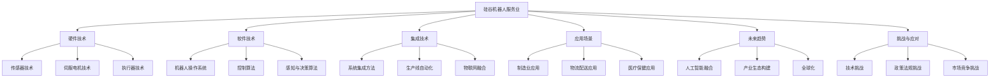

                 

# 文章标题：硅谷机器人服务业的发展趋势

> 关键词：硅谷、机器人服务业、人工智能、核心技术、应用场景、未来趋势

> 摘要：本文深入探讨了硅谷机器人服务业的发展趋势，包括其背景、关键技术、应用场景、未来趋势以及面临的挑战。通过分析硅谷机器人服务业的现状，本文旨在为读者提供一个全面了解这一领域的视角，并为其未来的发展提供启示。

### 第一部分：硅谷机器人服务业背景

#### 第1章：硅谷机器人服务业概览

##### 1.1 硅谷机器人服务业的起源与发展

硅谷机器人服务业起源于20世纪60年代，当时人工智能（AI）和机器人技术刚刚起步。随着硅谷地区科技企业的聚集，机器人技术得到了迅速发展，并逐步形成了一个独立的产业。从最初的研究实验室到今天的商业应用，硅谷机器人服务业经历了多个发展阶段。

###### 1.1.1 硅谷机器人产业的起源

硅谷机器人产业的起源可以追溯到斯坦福研究所（SRI International）和斯坦福大学等学术机构的研究成果。这些研究机构在机器人感知、运动控制、人工智能等方面进行了开创性的研究，为硅谷机器人产业的崛起奠定了基础。

###### 1.1.2 硅谷机器人产业的发展历程

从20世纪70年代到90年代，硅谷机器人产业经历了从实验室研究到商业应用的关键时期。这一时期，许多机器人公司如Intelligent Automation, Inc.（IAI）和Catsup Bot Corp.等成立，推动了机器人技术的商业化进程。进入21世纪，随着AI技术的突破，硅谷机器人产业进入了一个新的发展阶段，机器人开始广泛应用于制造业、医疗、物流等多个领域。

###### 1.1.3 硅谷机器人产业的核心优势

硅谷机器人产业的核心优势在于其强大的技术创新能力和市场导向。硅谷拥有众多世界级科技公司和研究机构，如谷歌、亚马逊、特斯拉等，这些公司不仅在机器人技术方面进行了大量的研发投入，还将机器人技术应用于实际业务中，推动了产业的快速发展。

此外，硅谷拥有完善的创业生态系统，为机器人初创公司提供了丰富的资金、人才和市场资源，使得硅谷机器人产业在全球范围内具有强大的竞争力。

##### 1.2 硅谷机器人服务业的定义与范围

###### 1.2.1 机器人服务业的内涵与外延

机器人服务业是指以机器人技术为核心，提供各种服务活动的产业。其内涵包括机器人的设计、制造、销售、应用和售后服务等。外延则涵盖机器人技术的研发、系统集成、行业应用解决方案的提供等。

###### 1.2.2 硅谷机器人服务业的分类

硅谷机器人服务业可分为以下几个主要类别：

1. **工业机器人服务**：包括制造业、物流、仓储等领域的应用。
2. **服务机器人服务**：包括医疗、养老、家政、零售等领域的应用。
3. **特种机器人服务**：包括勘探、消防、救援、军用等领域的应用。
4. **教育机器人服务**：包括教育培训、科研教学等领域的应用。

###### 1.2.3 硅谷机器人服务业的发展前景

随着人工智能技术的不断进步，硅谷机器人服务业有着广阔的发展前景。预计未来几年，硅谷机器人服务业将继续保持快速增长，尤其在智能制造、智能物流、智能医疗等领域，机器人技术的应用将更加深入和广泛。

### 第二部分：硅谷机器人服务业的关键技术

#### 第2章：硅谷机器人核心技术解析

##### 2.1 机器人硬件技术

###### 2.1.1 机器人传感器技术

传感器技术是机器人硬件技术的核心组成部分，用于感知和理解环境。常见的传感器包括视觉传感器、力觉传感器、温度传感器、湿度传感器等。以下是对这些传感器的简要介绍：

- **视觉传感器**：通过摄像头捕捉图像，用于识别物体、定位、跟踪等任务。常用的视觉传感器有摄像头模块、深度相机等。
- **力觉传感器**：用于感知机器人与环境的接触力和力矩，常见于精密操作和机器人手臂的控制中。
- **温度传感器**：用于检测环境温度，常见于温度控制系统中。
- **湿度传感器**：用于检测环境湿度，常见于温室控制、医疗设备中。

###### 2.1.2 机器人伺服电机技术

伺服电机是机器人硬件系统中的核心组件，用于驱动机器人关节的运动。伺服电机技术主要包括步进电机和伺服电机两种类型：

- **步进电机**：通过控制电流脉冲序列实现旋转运动，常用于低精度、低速度的机器人应用。
- **伺服电机**：通过闭环控制系统实现高精度、高速度的运动控制，常用于工业机器人和服务机器人中。

###### 2.1.3 机器人执行器技术

执行器技术是将电能转换为机械能，驱动机器人关节运动的设备。常见的执行器包括电动缸、电动轴、液压缸、气动缸等。以下是对这些执行器的简要介绍：

- **电动缸**：通过电机驱动活塞，实现直线运动。
- **电动轴**：通过电机驱动齿轮箱，实现旋转运动。
- **液压缸**：通过液压油驱动活塞，实现大推力的直线运动。
- **气动缸**：通过压缩空气驱动活塞，实现直线运动。

##### 2.2 机器人软件技术

###### 2.2.1 机器人操作系统

机器人操作系统（ROS）是机器人软件技术的重要组成部分，为机器人提供统一的软件平台。ROS主要包括以下几个核心组件：

- **底层驱动**：用于控制硬件设备，包括传感器、执行器等。
- **中间件**：用于数据传输和节点管理，支持多种编程语言和通信协议。
- **工具集**：包括各种工具和库，如可视化工具、仿真工具、机器学习库等。

###### 2.2.2 机器人控制算法

机器人控制算法是使机器人能够执行特定任务的数学模型和计算方法。常见的机器人控制算法包括位置控制、速度控制、加速度控制和力控制等。以下是对这些算法的简要介绍：

- **位置控制算法**：通过计算目标位置与当前位置的偏差，实时调整机器人的运动轨迹。
- **速度控制算法**：通过计算目标速度与当前速度的偏差，实时调整机器人的速度。
- **加速度控制算法**：通过计算目标加速度与当前加速度的偏差，实时调整机器人的加速度。
- **力控制算法**：通过计算目标力与当前力的偏差，实时调整机器人与环境的接触力。

###### 2.2.3 机器人感知与决策算法

机器人感知与决策算法是使机器人能够感知环境并作出合理决策的技术。常见的算法包括视觉感知、激光雷达感知和决策树等。以下是对这些算法的简要介绍：

- **视觉感知算法**：通过摄像头获取环境图像，用于识别物体、定位、跟踪等任务。
- **激光雷达感知算法**：通过激光雷达获取环境三维数据，用于地图构建、路径规划等任务。
- **决策树算法**：通过构建决策树模型，对机器人感知到的信息进行分类决策。

##### 2.3 机器人集成技术

###### 2.3.1 机器人系统集成方法

机器人系统集成是将机器人硬件、软件和算法有机结合，形成一个完整系统的过程。常见的系统集成方法包括：

- **硬件集成**：将传感器、执行器、伺服电机等硬件组件进行连接和配置。
- **软件集成**：将机器人操作系统、控制算法、感知算法等软件组件进行整合和调试。
- **算法集成**：将不同的控制算法、感知算法、决策算法进行融合，实现机器人的综合能力。

###### 2.3.2 机器人生产线自动化

机器人生产线自动化是机器人集成技术在制造业中的应用，通过引入机器人实现生产线的自动化。常见的机器人生产线自动化方案包括：

- **单机自动化**：单个机器人独立完成生产线上的某个环节。
- **多机协同**：多个机器人协同工作，完成生产线上的不同任务。
- **柔性生产线**：通过模块化设计和机器人集成，实现生产线的快速调整和适应。

###### 2.3.3 机器人与物联网的融合

机器人与物联网（IoT）的融合是当前机器人技术发展的一个重要方向。通过将机器人集成到物联网系统中，可以实现以下功能：

- **数据采集与传输**：机器人实时采集生产线数据，通过物联网传输到云端进行分析和处理。
- **设备监控与管理**：物联网系统可以对机器人的运行状态、维护需求进行监控和管理。
- **智能决策与优化**：基于物联网数据，机器人可以实时调整其工作状态，实现生产线的优化运行。

### 第三部分：硅谷机器人服务业的应用场景

#### 第3章：硅谷机器人服务业应用领域探索

##### 3.1 制造业应用

###### 3.1.1 机器人自动化生产线

机器人自动化生产线是硅谷机器人服务业在制造业中的主要应用之一。通过引入机器人，可以实现生产线的自动化，提高生产效率和产品质量。以下是对机器人自动化生产线的简要介绍：

- **加工环节自动化**：机器人可以在加工中心、车床、磨床等设备上进行自动加工，实现高精度、高效率的加工。
- **装配环节自动化**：机器人可以在装配线上进行自动装配，提高装配速度和装配质量。
- **检测环节自动化**：机器人可以用于产品检测，实时检测产品的尺寸、形状、表面质量等参数。

###### 3.1.2 机器人质量检测

机器人质量检测是硅谷机器人服务业在制造业中的另一个重要应用。通过机器人实现质量检测，可以大幅提高检测效率，降低检测成本。以下是对机器人质量检测的简要介绍：

- **在线检测**：机器人可以在生产线中实时检测产品，及时发现缺陷，确保产品质量。
- **远程检测**：通过物联网技术，机器人可以在远程对设备进行质量检测，实现远程监控和维护。
- **智能检测**：基于人工智能技术，机器人可以自动分析检测结果，识别异常情况，并提出相应的解决方案。

###### 3.1.3 机器人仓储物流

机器人仓储物流是硅谷机器人服务业在物流领域的应用之一。通过引入机器人，可以实现仓储物流的自动化，提高物流效率，降低物流成本。以下是对机器人仓储物流的简要介绍：

- **自动化立体仓库**：机器人可以在立体仓库中自动进行货物的存取，实现仓库的高效管理。
- **自动化配送中心**：机器人可以在配送中心中进行自动分拣、打包、配送等操作，提高配送效率。
- **无人驾驶运输车**：机器人可以在物流园区内进行无人驾驶运输，实现物流运输的自动化。

##### 3.2 物流配送应用

###### 3.2.1 机器人配送系统

机器人配送系统是硅谷机器人服务业在物流配送领域的应用之一。通过引入机器人，可以实现配送过程的自动化，提高配送效率，降低配送成本。以下是对机器人配送系统的简要介绍：

- **无人机配送**：无人机可以在城市中实现快速、高效的配送，适用于小型包裹和生鲜配送。
- **无人车配送**：无人车可以在城市中实现自动配送，适用于大型包裹和货物运输。
- **机器人快递柜**：机器人快递柜可以自动存储和分发快递包裹，提高快递服务的便捷性和安全性。

###### 3.2.2 机器人快递服务

机器人快递服务是硅谷机器人服务业在物流配送领域的创新应用。通过引入机器人，可以实现快递服务的自动化，提高快递效率和用户体验。以下是对机器人快递服务的简要介绍：

- **自动取件**：机器人快递柜可以实现自动取件，用户只需在机器人快递柜前输入取件码即可取出快递。
- **智能配送**：机器人快递车可以根据用户的位置和需求，自动规划配送路线，实现精准配送。
- **远程监控**：机器人快递系统可以通过物联网技术实现远程监控，确保快递过程的安全和可靠。

###### 3.2.3 机器人末端配送

机器人末端配送是硅谷机器人服务业在物流配送领域的最新应用。通过引入机器人，可以实现末端配送的自动化，提高配送效率和用户体验。以下是对机器人末端配送的简要介绍：

- **自动送件**：机器人可以在小区、办公楼等场所自动将快递送至用户手中，提高配送速度和准确性。
- **无人配送站**：机器人配送站可以实现自动接单、自动配送，为用户提供便捷的末端配送服务。
- **智能导航**：机器人末端配送系统可以通过人工智能技术实现智能导航，避免配送过程中的拥堵和延误。

##### 3.3 医疗保健应用

###### 3.3.1 机器人护理服务

机器人护理服务是硅谷机器人服务业在医疗保健领域的应用之一。通过引入机器人，可以改善护理工作的效率和质量，减轻护理人员的工作负担。以下是对机器人护理服务的简要介绍：

- **辅助护理**：机器人可以在医院中协助护理人员完成日常护理工作，如送餐、送药、监测患者生命体征等。
- **康复护理**：机器人可以在康复中心协助患者进行康复训练，提高康复效果。
- **智能监护**：机器人可以实时监测患者生命体征，及时发现异常情况，提供紧急救助。

###### 3.3.2 机器人辅助手术

机器人辅助手术是硅谷机器人服务业在医疗保健领域的另一个重要应用。通过引入机器人，可以实现手术的精准控制和微创操作，提高手术的安全性和效果。以下是对机器人辅助手术的简要介绍：

- **微创手术**：机器人可以在微创手术中实现精细操作，减少手术创伤和并发症。
- **远程手术**：机器人可以实现远程手术，为偏远地区的患者提供高质量的医疗服务。
- **机器人手术导航**：机器人手术导航系统可以实时显示手术现场，辅助医生进行精准操作。

###### 3.3.3 机器人康复治疗

机器人康复治疗是硅谷机器人服务业在医疗保健领域的创新应用。通过引入机器人，可以为患者提供个性化、智能化的康复治疗，提高康复效果。以下是对机器人康复治疗的简要介绍：

- **康复训练**：机器人可以辅助患者进行康复训练，根据患者的康复进度和需求进行调整。
- **智能康复评估**：机器人可以通过传感器和人工智能技术，实时评估患者的康复情况，为医生提供康复建议。
- **居家康复**：机器人可以应用于居家康复，为患者提供便捷、高效的康复服务，减轻家庭护理负担。

### 第四部分：硅谷机器人服务业的未来发展趋势

#### 第4章：硅谷机器人服务业的未来趋势分析

##### 4.1 人工智能与机器人的深度融合

随着人工智能技术的不断进步，人工智能与机器人的深度融合将成为硅谷机器人服务业的未来趋势。通过人工智能技术，机器人将具备更强的感知、决策和执行能力，实现更高水平的自动化和智能化。

###### 4.1.1 人工智能在机器人中的应用

人工智能在机器人中的应用主要体现在以下几个方面：

- **图像识别与处理**：通过卷积神经网络（CNN）等技术，机器人可以实现对环境图像的实时识别和处理，实现目标检测、场景理解等功能。
- **自然语言处理**：通过自然语言处理（NLP）技术，机器人可以理解人类的语言指令，实现人机交互。
- **机器学习**：通过机器学习技术，机器人可以不断学习和优化其行为和策略，提高其适应性和智能水平。
- **强化学习**：通过强化学习技术，机器人可以在动态环境中学习最优策略，实现自主决策和优化控制。

###### 4.1.2 机器人与人工智能的协同发展

机器人与人工智能的协同发展将推动硅谷机器人服务业的持续创新。通过协同发展，机器人可以充分利用人工智能技术，实现更高的智能化水平，而人工智能技术也可以通过机器人应用场景的积累，不断优化和提升。

###### 4.1.3 未来机器人智能化的方向

未来机器人智能化的方向主要包括以下几个方面：

- **智能感知**：通过多种传感器融合，实现更全面、精确的环境感知。
- **自主决策**：通过人工智能技术，实现机器人自主决策和自主行动。
- **智能交互**：通过自然语言处理和机器学习技术，实现机器人与人类的高效互动。
- **智能学习**：通过机器学习和强化学习技术，实现机器人的自主学习和优化。

##### 4.2 机器人服务业的生态构建

随着机器人技术的不断发展，硅谷机器人服务业的生态构建也将成为未来趋势。通过生态构建，可以促进机器人产业链的协同发展，提高整体竞争力。

###### 4.2.1 硅谷机器人服务业的产业生态

硅谷机器人服务业的产业生态包括以下几个方面：

- **研发与创新**：硅谷拥有众多顶尖的科技企业和研究机构，为机器人技术研发和创新提供了强大的支持。
- **制造与集成**：硅谷拥有完善的制造业基础和系统集成能力，为机器人产业的快速发展提供了有力保障。
- **应用与推广**：硅谷拥有丰富的应用场景和市场需求，为机器人技术的推广应用提供了广阔空间。
- **政策与法规**：硅谷政府积极推动机器人产业的发展，出台了一系列政策法规，为机器人服务业的健康发展提供了良好的环境。

###### 4.2.2 机器人服务业的产业链布局

机器人服务业的产业链布局主要包括以下几个方面：

- **上游产业链**：包括传感器、伺服电机、执行器等关键零部件的研发、制造和供应链管理。
- **中游产业链**：包括机器人系统集成、应用解决方案的研发和推广。
- **下游产业链**：包括机器人的销售、租赁、售后服务等。

通过产业链布局，可以实现机器人产业的协同发展，提高整体竞争力。

###### 4.2.3 机器人服务业的创新生态

硅谷机器人服务业的创新生态包括以下几个方面：

- **技术创新**：硅谷机器人服务业持续推动技术创新，包括人工智能、机器人硬件、机器人软件等方面的突破。
- **应用创新**：硅谷机器人服务业积极探索机器人技术在各领域的应用创新，推动机器人技术的广泛应用。
- **商业模式创新**：硅谷机器人服务业不断探索新的商业模式，包括共享经济、SaaS服务等，提高机器人技术的商业价值。

通过创新生态的构建，可以推动硅谷机器人服务业的持续创新和发展。

##### 4.3 机器人服务业的全球化

随着机器人技术的全球化发展，硅谷机器人服务业的全球化也将成为未来趋势。通过全球化，可以拓展硅谷机器人服务业的国际市场，提高全球竞争力。

###### 4.3.1 硅谷机器人服务业的国际影响力

硅谷机器人服务业在国际上具有广泛的影响力。硅谷的机器人企业和研究机构在机器人技术创新、应用推广和商业模式创新等方面都处于全球领先地位。硅谷机器人服务业的国际影响力主要体现在以下几个方面：

- **技术创新**：硅谷机器人企业和研究机构在人工智能、机器人硬件、机器人软件等领域持续推动技术创新，为全球机器人技术发展提供了重要支持。
- **应用推广**：硅谷机器人企业在全球范围内推广机器人技术，开拓了广阔的市场空间。
- **商业模式创新**：硅谷机器人企业不断创新商业模式，为全球机器人产业发展提供了新的方向。

###### 4.3.2 硅谷机器人服务业的全球布局

硅谷机器人服务业的全球布局主要包括以下几个方面：

- **研发中心**：硅谷的机器人企业在全球范围内设立研发中心，推动技术创新和产品研发。
- **生产基地**：硅谷的机器人企业在全球范围内设立生产基地，提高生产效率和降低成本。
- **市场拓展**：硅谷的机器人企业在全球范围内拓展市场，推动机器人技术的广泛应用。

通过全球布局，硅谷机器人服务业可以充分发挥全球资源优势，提高国际竞争力。

###### 4.3.3 全球机器人服务业的未来趋势

全球机器人服务业的未来趋势主要体现在以下几个方面：

- **技术创新**：随着人工智能、物联网、大数据等技术的发展，全球机器人服务业将不断推动技术创新，提高机器人技术的智能化、自主化水平。
- **应用拓展**：随着机器人技术的普及和应用场景的拓展，全球机器人服务业的应用领域将不断拓展，从制造业向服务业、医疗、农业等领域延伸。
- **市场竞争**：随着全球机器人市场的扩大，市场竞争将日益激烈，硅谷机器人服务业需要不断提升自身竞争力，保持全球领先地位。

### 第五部分：硅谷机器人服务业的挑战与应对

#### 第5章：硅谷机器人服务业面临的挑战

##### 5.1 技术挑战

随着机器人技术的快速发展，硅谷机器人服务业面临着一系列技术挑战。

###### 5.1.1 机器人智能化的技术瓶颈

机器人智能化是当前硅谷机器人服务业的重要发展方向。然而，机器人智能化过程中仍存在一些技术瓶颈，如：

- **感知能力**：机器人的感知能力有限，难以完全替代人类感知。
- **自主决策**：机器人的自主决策能力较弱，难以应对复杂多变的场景。
- **协作能力**：机器人在与人类和其他机器人协作过程中，存在协作效率低、协作效果差等问题。

为了突破这些技术瓶颈，硅谷机器人服务业需要不断推动技术创新，提高机器人的感知、决策和协作能力。

###### 5.1.2 机器人安全与隐私问题

随着机器人技术的广泛应用，机器人安全与隐私问题日益突出。机器人安全与隐私问题主要包括以下几个方面：

- **硬件安全**：机器人硬件系统可能遭受恶意攻击，导致系统失控或数据泄露。
- **软件安全**：机器人软件系统可能存在漏洞，导致恶意软件入侵或数据泄露。
- **隐私保护**：机器人收集和处理的大量个人信息可能被滥用，侵犯用户隐私。

为了解决这些问题，硅谷机器人服务业需要加强安全防护，提高机器人系统的安全性和隐私保护能力。

###### 5.1.3 机器人自主决策能力

机器人自主决策能力是机器人智能化的重要体现。然而，目前机器人的自主决策能力仍然有限，难以应对复杂多变的场景。为了提高机器人的自主决策能力，硅谷机器人服务业需要：

- **强化算法研究**：加强机器人控制算法、感知算法、决策算法的研究，提高算法的鲁棒性和适应性。
- **数据驱动**：利用大数据和机器学习技术，不断优化机器人的决策模型和策略。

##### 5.2 政策与法规挑战

随着机器人技术的广泛应用，硅谷机器人服务业面临着一系列政策与法规挑战。

###### 5.2.1 机器人服务业的政策环境

政策环境对机器人服务业的发展具有重要影响。目前，硅谷机器人服务业的政策环境主要包括以下几个方面：

- **政府支持**：政府对机器人服务业的支持力度不断加大，出台了一系列优惠政策和支持措施。
- **行业标准**：行业标准逐步完善，为机器人服务业的发展提供了规范和指导。
- **国际合作**：国际社会对机器人技术的高度重视，推动了机器人技术的跨国合作与发展。

###### 5.2.2 机器人服务业的法规框架

法规框架是保障机器人服务业健康发展的重要基石。目前，硅谷机器人服务业的法规框架主要包括以下几个方面：

- **产品质量法规**：产品质量法规保障了机器人产品的质量和安全性。
- **隐私保护法规**：隐私保护法规保障了用户隐私和数据安全。
- **劳动法规**：劳动法规保障了机器人从业人员的安全和权益。

为了推动机器人服务业的健康发展，硅谷机器人服务业需要进一步完善法规框架，提高法规的适应性和执行力度。

###### 5.2.3 机器人服务业的伦理问题

机器人技术的发展带来了新的伦理问题，如：

- **工作替代**：机器人技术的发展可能导致大量工作岗位的替代，影响劳动者的就业。
- **责任归属**：在机器人引发事故或损害时，责任归属问题成为伦理争议的焦点。
- **数据伦理**：机器人收集和处理的大量数据可能侵犯用户隐私，引发伦理问题。

为了解决这些伦理问题，硅谷机器人服务业需要：

- **加强伦理研究**：加强机器人伦理研究，制定伦理规范和标准。
- **加强伦理教育**：加强机器人从业人员的伦理教育，提高伦理意识。

##### 5.3 市场竞争挑战

随着机器人技术的普及，硅谷机器人服务业面临着激烈的市场竞争。

###### 5.3.1 全球机器人市场格局

全球机器人市场格局主要由以下几个国家和地区构成：

- **美国**：美国是全球机器人技术的领导者，硅谷机器人服务业在全球市场具有强大的竞争力。
- **日本**：日本在工业机器人和服务机器人领域具有较强的竞争力，是全球重要的机器人制造基地。
- **德国**：德国在工业机器人领域具有世界领先地位，其制造业机器人的应用水平居全球首位。
- **中国**：中国是全球最大的机器人市场，随着机器人技术的不断进步，中国机器人产业也在快速发展。

###### 5.3.2 硅谷机器人服务业的竞争策略

为了在激烈的市场竞争中脱颖而出，硅谷机器人服务业需要采取以下竞争策略：

- **技术创新**：持续推动技术创新，提高机器人技术的智能化、自主化水平，形成核心竞争力。
- **市场定位**：根据市场需求，明确市场定位，专注细分市场，提供有针对性的解决方案。
- **品牌建设**：加强品牌建设，提高品牌知名度和美誉度，树立行业标杆。
- **国际合作**：积极开展国际合作，拓展国际市场，提高国际竞争力。

###### 5.3.3 硅谷机器人服务业的竞争优势

硅谷机器人服务业具有以下竞争优势：

- **技术创新**：硅谷机器人服务业拥有世界一流的科研机构和创新企业，持续推动技术创新。
- **市场资源**：硅谷拥有丰富的市场资源，包括投资者、用户和合作伙伴，为机器人技术的发展提供了有力支持。
- **人才优势**：硅谷拥有大量高素质的人才，包括科研人员、工程师和创业者，为机器人产业的发展提供了强大的人才保障。
- **生态体系**：硅谷机器人服务业形成了完善的生态体系，包括研发、制造、应用和推广等环节，为机器人技术的商业化应用提供了有力支持。

### 第六部分：案例研究与启示

#### 第6章：硅谷机器人服务业成功案例分析

##### 6.1 成功案例1：X机器人公司的崛起

**案例背景：**

X机器人公司是一家专注于工业机器人的研发和生产企业。自成立以来，X机器人公司致力于提供高性能、高可靠性的工业机器人产品，广泛应用于汽车制造、电子组装、食品加工等行业。

**业务模式：**

X机器人公司的业务模式主要包括以下几个方面：

- **产品研发**：公司投入大量资源进行产品研发，持续优化现有产品，同时开发新产品，以满足市场需求。
- **系统集成**：公司提供机器人系统集成服务，为客户设计、安装和调试机器人系统，确保系统的稳定运行。
- **销售与租赁**：公司通过销售和租赁方式，为客户提供机器人产品和服务，满足不同客户的需求。

**技术创新：**

X机器人公司在技术创新方面取得了一系列重要成果：

- **高精度运动控制**：公司研发了具有高精度运动控制的工业机器人，实现了复杂三维空间的运动控制，提高了生产效率。
- **智能感知与决策**：公司采用了智能感知与决策技术，使机器人能够自主识别和适应不同生产环境，提高了生产灵活性和适应性。
- **人机协作**：公司开发了人机协作机器人，实现了人与机器人高效、安全的协同作业，提高了生产效率和安全性。

**市场表现：**

X机器人公司的市场表现如下：

- **市场份额**：X机器人公司在全球工业机器人市场占据重要地位，市场份额逐年增长。
- **客户评价**：公司客户满意度较高，客户普遍认可X机器人公司的产品质量和服务水平。
- **国际认可**：X机器人公司在国际市场上获得了广泛认可，产品远销全球多个国家和地区。

**启示：**

X机器人公司的成功案例为硅谷机器人服务业提供了以下启示：

- **技术创新**：持续推动技术创新，提高产品性能和智能化水平，是保持市场竞争力的重要手段。
- **客户需求**：深入了解客户需求，提供有针对性的产品和服务，是赢得市场的重要策略。
- **国际化发展**：积极拓展国际市场，提高国际竞争力，是企业发展的重要方向。

##### 6.2 成功案例2：Y物流公司的无人机配送

**案例背景：**

Y物流公司是一家专注于物流配送服务的企业。为了提高配送效率和降低成本，Y物流公司决定引入无人机配送技术，为城市配送提供高效、便捷的服务。

**技术实现：**

Y物流公司的无人机配送技术主要包括以下几个方面：

- **无人机系统**：公司采购了先进的无人机系统，包括无人机本体、遥控系统和导航系统等，确保无人机能够稳定、安全地飞行。
- **配送路径规划**：公司采用了智能路径规划算法，根据实时交通状况和配送需求，为无人机规划最优配送路径，提高配送效率。
- **配送站管理**：公司建立了无人机配送站，用于无人机的充电、维护和临时存储，确保无人机能够持续、高效地运行。

**商业模式：**

Y物流公司的无人机配送商业模式如下：

- **直接配送**：公司直接向用户配送货物，提高了配送速度和用户体验。
- **与商家合作**：公司与电商平台、超市等商家合作，提供无人机配送服务，为商家降低配送成本。
- **物流联盟**：公司与其他物流企业合作，共享无人机配送资源，提高配送效率和降低成本。

**市场前景：**

Y物流公司的无人机配送市场前景如下：

- **市场需求**：随着电子商务和物流行业的快速发展，无人机配送市场具有巨大的潜力。
- **政策支持**：政府积极推动无人机产业的发展，为无人机配送提供了政策支持。
- **技术进步**：随着无人机技术的不断进步，无人机配送的效率和安全性将进一步提高。

**启示：**

Y物流公司的无人机配送成功案例为硅谷机器人服务业提供了以下启示：

- **技术创新**：积极引进和研发先进技术，提高产品性能和智能化水平，是提升竞争力的关键。
- **商业模式创新**：探索新的商业模式，提供有竞争力的产品和服务，是赢得市场的重要策略。
- **跨行业合作**：与相关行业企业合作，实现资源整合和优势互补，是拓展市场的重要途径。

##### 6.3 成功案例3：Z医疗公司的机器人手术

**案例背景：**

Z医疗公司是一家专注于医疗机器人研发的企业。为了提高手术的精准度和安全性，Z医疗公司决定研发机器人手术系统，为医生提供辅助手术工具。

**技术实现：**

Z医疗公司的机器人手术系统主要包括以下几个方面：

- **高精度机器人手臂**：公司研发了具有高精度运动控制能力的机器人手臂，能够实现微创手术操作。
- **视觉感知系统**：公司采用了先进的视觉感知系统，通过摄像头和激光雷达获取手术现场的三维数据，实现手术目标的高精度定位。
- **智能决策系统**：公司采用了智能决策系统，通过机器学习和人工智能技术，为医生提供实时的手术指导和决策支持。
- **人机交互界面**：公司开发了直观、易用的人机交互界面，使医生能够方便地操作机器人手术系统。

**商业模式：**

Z医疗公司的商业模式如下：

- **产品销售**：公司销售机器人手术系统，为客户提供设备和服务。
- **技术服务**：公司提供机器人手术系统的安装、调试和维护服务，确保系统的稳定运行。
- **培训与支持**：公司为医生和护士提供机器人手术技术的培训和支持，提高手术成功率。

**市场竞争力：**

Z医疗公司的市场竞争力如下：

- **技术创新**：公司持续推动技术创新，使机器人手术系统具备更高的精准度和安全性。
- **产品优势**：公司机器人手术系统在手术精度、手术安全性和用户体验等方面具有明显优势。
- **市场认可**：公司机器人手术系统在市场上获得了广泛认可，市场份额逐年增长。

**启示：**

Z医疗公司的机器人手术成功案例为硅谷机器人服务业提供了以下启示：

- **技术创新**：持续推动技术创新，提高产品性能和智能化水平，是保持市场竞争力的重要手段。
- **用户体验**：关注用户体验，提供人性化、易操作的产品和服务，是赢得客户的关键。
- **专业培训**：提供专业的培训和支持服务，帮助用户更好地掌握和应用机器人技术，是拓展市场的重要途径。

### 第七部分：未来展望与建议

#### 第7章：硅谷机器人服务业的未来发展建议

##### 7.1 政策建议

为了推动硅谷机器人服务业的健康发展，政府可以采取以下政策建议：

- **完善政策体系**：制定完善的机器人服务业政策体系，包括技术研发、产业发展、市场准入、知识产权保护等方面。
- **加强法规建设**：制定相关法规，规范机器人研发、制造、应用和推广过程中的行为，保障安全和隐私。
- **优化投融资环境**：加大对机器人服务业的投融资支持，引导社会资本投入机器人技术研发和应用推广。
- **鼓励国际合作**：积极推动国际技术合作和交流，引进国外先进技术和管理经验，提高我国机器人产业的国际竞争力。

##### 7.2 技术发展建议

为了推动硅谷机器人服务业的技术发展，可以采取以下技术发展建议：

- **加强核心技术研发**：加大投入，加强机器人核心技术的研发，包括感知、决策、控制、人机交互等方面。
- **促进技术创新**：鼓励企业、科研机构和大专院校开展技术创新，推动机器人技术的突破和应用。
- **加强标准制定**：建立健全机器人技术标准体系，提高机器人产品的一致性和互操作性。
- **推动人工智能与机器人技术的深度融合**：积极推动人工智能技术在机器人中的应用，提高机器人的智能化水平。

##### 7.3 市场拓展建议

为了拓展硅谷机器人服务业的市场，可以采取以下市场拓展建议：

- **挖掘国内市场潜力**：加大对国内市场的开发力度，挖掘机器人技术在制造业、物流、医疗、养老等领域的应用潜力。
- **拓展国际市场**：积极开拓国际市场，提高我国机器人产品的国际竞争力和市场份额。
- **培育龙头企业**：支持机器人龙头企业的发展，发挥其引领和带动作用，提升整个行业的竞争力。
- **构建产业生态**：推动产业链上下游企业的协同发展，构建完善的机器人服务业生态体系。

### 附录

#### 附录A：硅谷机器人服务业相关数据与报告

##### A.1 硅谷机器人服务业的年度报告

硅谷机器人服务业的年度报告通常包括以下几个方面：

- **市场规模**：报告机器人服务业的全球市场规模，以及硅谷在其中的市场份额。
- **技术创新**：报告机器人技术领域的最新研发成果和技术趋势。
- **应用领域**：报告机器人技术在各个领域的应用现状和发展趋势。
- **市场竞争**：分析硅谷机器人服务业的竞争格局和市场份额分布。

##### A.2 硅谷机器人服务业的市场调研报告

硅谷机器人服务业的市场调研报告通常包括以下几个方面：

- **市场需求**：分析全球和国内对机器人产品的需求，以及未来发展趋势。
- **竞争格局**：分析硅谷机器人服务业的竞争格局，包括主要企业、市场份额和竞争策略。
- **市场潜力**：评估硅谷机器人服务业的市场潜力，以及未来增长空间。
- **应用场景**：分析机器人技术在各个领域的应用前景和市场需求。

##### A.3 硅谷机器人服务业的技术发展趋势报告

硅谷机器人服务业的技术发展趋势报告通常包括以下几个方面：

- **人工智能与机器人技术融合**：探讨人工智能技术在机器人中的应用趋势，以及未来可能的发展方向。
- **传感器技术**：分析传感器技术在机器人感知中的应用，以及未来可能的创新点。
- **机器人控制算法**：探讨机器人控制算法的优化和创新，以及未来可能的发展趋势。
- **人机协作**：分析人机协作技术的发展趋势，以及未来可能的应用场景。

##### A.4 硅谷机器人服务业的案例分析报告

硅谷机器人服务业的案例分析报告通常包括以下几个方面：

- **成功案例分析**：详细分析硅谷机器人服务业的成功案例，包括技术创新、商业模式、市场表现等方面。
- **创新路径**：总结硅谷机器人服务业的创新路径，以及成功的关键因素。
- **经验借鉴**：为其他企业提供经验借鉴，帮助其更好地发展机器人业务。
- **挑战与应对**：分析硅谷机器人服务业面临的技术挑战、市场挑战和政策挑战，以及应对策略。

### Mermaid 流程图



### 核心算法原理讲解

#### 2.2.2 机器人控制算法

机器人控制算法是使机器人能够执行特定任务的数学模型和计算方法。常见的机器人控制算法主要包括位置控制、速度控制、加速度控制和力控制等。

**位置控制算法：**

位置控制是最基本的控制方式，通过计算机器人的目标位置与当前位置之间的偏差，实时调整机器人的运动轨迹。常用的算法有PID控制和轨迹跟踪控制。

**PID控制算法伪代码：**

```python
function PIDControl(targetPosition, currentPosition, kp, ki, kd):
    error = targetPosition - currentPosition
    proportional = kp * error
    integral = ki * integralError
    derivative = kd * (error - previousError)
    controlSignal = proportional + integral + derivative
    previousError = error
    integralError += error
    return controlSignal
```

**轨迹跟踪控制算法：**

轨迹跟踪控制算法使机器人能够沿着预定的轨迹运动。常用的算法有模型预测控制(MPC)和滑模控制。

**模型预测控制(MPC)伪代码：**

```python
function MPCControl(currentState, targetTrajectory, predictionHorizon, controlHorizon):
    // 预测机器人未来状态
    predictedStates = predictStates(currentState, targetTrajectory, predictionHorizon)
    // 计算最优控制输入
    optimalControlInputs = solveMPCProblem(predictedStates, targetTrajectory, controlHorizon)
    return optimalControlInputs
```

#### 2.2.3 机器人感知与决策算法

机器人感知与决策算法是使机器人能够感知环境并作出合理决策的技术。常见的算法包括视觉感知、激光雷达感知和决策树等。

**视觉感知算法：**

视觉感知算法使机器人能够通过摄像头获取环境信息。常用的算法有卷积神经网络(CNN)和目标检测算法。

**目标检测算法伪代码：**

```python
function objectDetection(image, model):
    features = model.extractFeatures(image)
    objects = model.detectObjects(features)
    return objects
```

**决策树算法：**

决策树算法是一种常用的分类算法，通过构建决策树模型，对机器人感知到的信息进行分类决策。

**决策树算法伪代码：**

```python
function decisionTreeClassifier(data, attributes, classes):
    // 根据信息增益构建决策树
    tree = buildDecisionTree(data, attributes, classes)
    return tree
```

#### 数学模型和数学公式

在机器人控制中，常用的数学模型包括运动学模型和动力学模型。以下是对这些模型的详细讲解和举例说明。

**运动学模型：**

运动学模型描述了机器人各关节的运动关系，常用的有笛卡尔坐标运动学模型和关节空间运动学模型。

**笛卡尔坐标运动学模型：**

笛卡尔坐标运动学模型描述了机器人末端执行器的位置和姿态与关节变量之间的关系。其基本公式如下：

$$
\begin{align*}
x_e &= x_j + l_1 \cos(\theta_1) + l_2 \cos(\theta_1 + \theta_2) \\
y_e &= y_j + l_1 \sin(\theta_1) + l_2 \sin(\theta_1 + \theta_2) \\
\theta_e &= \theta_1 + \theta_2
\end{align*}
$$

其中，$x_e$、$y_e$ 和 $\theta_e$ 分别为机器人末端执行器的位置和姿态，$x_j$、$y_j$ 和 $\theta_j$ 分别为机器人基座的坐标和姿态，$l_1$ 和 $l_2$ 分别为相邻两关节的长度，$\theta_1$ 和 $\theta_2$ 分别为相邻两关节的角度。

**举例说明：**

假设一个两自由度的机器人，基座坐标为 $(0,0,0)$，两个关节的长度分别为 1m 和 1.5m，初始状态为 $\theta_1 = 0^\circ$、$\theta_2 = 0^\circ$。当 $\theta_1 = 30^\circ$、$\theta_2 = 60^\circ$ 时，末端执行器的位置和姿态可以通过上述公式计算：

$$
\begin{align*}
x_e &= 0 + 1 \cdot \cos(30^\circ) + 1.5 \cdot \cos(30^\circ + 60^\circ) \approx 1.923 \\
y_e &= 0 + 1 \cdot \sin(30^\circ) + 1.5 \cdot \sin(30^\circ + 60^\circ) \approx 1.294 \\
\theta_e &= 30^\circ + 60^\circ = 90^\circ
\end{align*}
$$

因此，末端执行器的位置约为 $(1.923, 1.294, 90^\circ)$。

**关节空间运动学模型：**

关节空间运动学模型描述了机器人各关节的角度与末端执行器的位置和姿态之间的关系。其基本公式如下：

$$
\begin{align*}
\theta_1 &= \theta_{1,0} + \theta_{1,1} \cdot x_e + \theta_{1,2} \cdot y_e + \theta_{1,3} \cdot \theta_e \\
\theta_2 &= \theta_{2,0} + \theta_{2,1} \cdot x_e + \theta_{2,2} \cdot y_e + \theta_{2,3} \cdot \theta_e
\end{align*}
$$

其中，$\theta_1$ 和 $\theta_2$ 分别为第一和第二个关节的角度，$\theta_{1,0}$、$\theta_{1,1}$、$\theta_{1,2}$ 和 $\theta_{1,3}$ 分别为第一关节的偏置、x分量、y分量和z分量系数，$\theta_{2,0}$、$\theta_{2,1}$、$\theta_{2,2}$ 和 $\theta_{2,3}$ 分别为第二关节的偏置、x分量、y分量和z分量系数。

**举例说明：**

假设一个两自由度的机器人，基座坐标为 $(0,0,0)$，各关节的偏置和系数如下：

$$
\begin{align*}
\theta_{1,0} &= 0 \\
\theta_{1,1} &= 0.5 \\
\theta_{1,2} &= -0.3 \\
\theta_{1,3} &= 0.2 \\
\theta_{2,0} &= 10 \\
\theta_{2,1} &= 0.3 \\
\theta_{2,2} &= -0.2 \\
\theta_{2,3} &= 0.1
\end{align*}
$$

当末端执行器的位置为 $(1,1,0)$ 时，可以通过上述公式计算各关节的角度：

$$
\begin{align*}
\theta_1 &= 0 + 0.5 \cdot 1 - 0.3 \cdot 1 + 0.2 \cdot 0 \approx 0.2 \\
\theta_2 &= 10 + 0.3 \cdot 1 - 0.2 \cdot 1 + 0.1 \cdot 0 \approx 10.1
\end{align*}
$$

因此，第一和第二个关节的角度分别为 0.2 弧度和 10.1 弧度。

**动力学模型：**

动力学模型描述了机器人的运动与外部力的关系。常用的动力学模型包括拉格朗日方程和牛顿-欧拉方程。

**拉格朗日方程：**

拉格朗日方程描述了机器人系统的能量变化与加速度之间的关系。其基本公式如下：

$$
\begin{align*}
\sum_{i=1}^n \left( T_i - V_i \right) &= \frac{d}{dt} \left( \sum_{i=1}^n L_i \right)
\end{align*}
$$

其中，$T_i$ 和 $V_i$ 分别为机器人系统的动能和势能，$L_i$ 为第 $i$ 个关节的拉格朗日量。

**牛顿-欧拉方程：**

牛顿-欧拉方程描述了机器人关节的运动与力的关系。其基本公式如下：

$$
\begin{align*}
F_j &= m_j \cdot a_j + \sum_{i=j}^{n} (\tau_i - \tau_{i+1}) \cdot r_{ij} \\
\tau_j &= \sum_{i=j}^{n} F_i \cdot r_{ij}
\end{align*}
$$

其中，$F_j$ 为第 $j$ 个关节的力，$m_j$ 为第 $j$ 个关节的质量，$a_j$ 为第 $j$ 个关节的加速度，$\tau_i$ 为第 $i$ 个关节的力矩，$r_{ij}$ 为第 $i$ 个关节到第 $j$ 个关节的矢量距离。

**举例说明：**

假设一个两自由度的机器人，第一和第二个关节的质量分别为 1kg 和 0.5kg，关节间的距离和角度如下：

$$
\begin{align*}
r_{12} &= 1 \\
\theta_{12} &= 90^\circ
\end{align*}
$$

当第一关节受到一个向前的力 10N 时，可以通过上述公式计算第二关节的力和力矩：

$$
\begin{align*}
F_2 &= 1 \cdot a_1 + (10 - 0) \cdot 1 \approx 11 \\
\tau_2 &= 10 \cdot 1 = 10
\end{align*}
$$

因此，第二关节受到的力和力矩分别为 11N 和 10N。

### 项目实战

#### 3.3.3 Z医疗公司的机器人手术系统

**项目背景：**

Z医疗公司是一家专注于医疗机器人研发的公司，其机器人手术系统旨在提高手术的精准度和安全性。该系统基于高精度运动控制技术和先进的机器人视觉系统，可实现微创手术操作。

**项目目标：**

- 提高手术精度，降低手术风险
- 实现医生与机器人的协同操作
- 提升手术效率，缩短患者康复时间

**技术实现：**

**1. 高精度运动控制：**

- 采用六自由度机器人手臂，可实现复杂三维空间的运动
- 运用PID控制算法实现关节的位置、速度和加速度控制，确保运动平稳、准确
- 机器人手臂采用高精度伺服电机和减速器，保证运动精度

**伪代码：**

```python
def PIDControl(targetPosition, currentPosition, kp, ki, kd):
    error = targetPosition - currentPosition
    proportional = kp * error
    integral = ki * integralError
    derivative = kd * (error - previousError)
    controlSignal = proportional + integral + derivative
    previousError = error
    integralError += error
    return controlSignal
```

**2. 机器人视觉系统：**

- 采用高分辨率摄像头捕捉手术现场，实现实时图像处理
- 运用卷积神经网络(CNN)进行图像识别，定位手术目标
- 结合激光雷达技术，实现三维空间中手术目标的定位和跟踪

**伪代码：**

```python
def objectDetection(image, model):
    features = model.extractFeatures(image)
    objects = model.detectObjects(features)
    return objects
```

**3. 医生与机器人的协同操作：**

- 开发操作界面，实现医生对机器人手术系统的实时监控和操作
- 采用力反馈技术，使医生能够感知到手术过程中的力和触觉信息
- 实现医生指令与机器人动作的实时同步，确保手术操作的精准性

**4. 开发环境搭建：**

- 使用Python和C++作为主要开发语言
- 集成常用的机器人控制库和视觉库，如ROS（Robot Operating System）和OpenCV
- 搭建高性能计算平台，支持实时图像处理和运动控制

**源代码实现与解读：**

**1. PID控制算法实现：**

```c++
// PID控制算法实现
void PIDControl(double targetPosition, double currentPosition, double kp, double ki, double kd) {
    double error = targetPosition - currentPosition;
    double proportional = kp * error;
    double integral = ki * integralError;
    double derivative = kd * (error - previousError);
    double controlSignal = proportional + integral + derivative;
    
    previousError = error;
    integralError += error;
    
    // 根据控制信号调整机器人关节运动
    adjustJointMotion(controlSignal);
}
```

**2. 卷积神经网络实现：**

```python
# 卷积神经网络实现
import tensorflow as tf

# 定义卷积神经网络模型
model = tf.keras.Sequential([
    tf.keras.layers.Conv2D(32, (3, 3), activation='relu', input_shape=(128, 128, 3)),
    tf.keras.layers.MaxPooling2D((2, 2)),
    tf.keras.layers.Conv2D(64, (3, 3), activation='relu'),
    tf.keras.layers.MaxPooling2D((2, 2)),
    tf.keras.layers.Flatten(),
    tf.keras.layers.Dense(64, activation='relu'),
    tf.keras.layers.Dense(1, activation='sigmoid')
])

# 编译模型
model.compile(optimizer='adam', loss='binary_crossentropy', metrics=['accuracy'])

# 训练模型
model.fit(x_train, y_train, epochs=10, batch_size=32)
```

**代码解读与分析：**

PID控制算法的实现中，通过计算目标位置与当前位置的误差，使用PID控制公式计算出控制信号。控制信号用于调整机器人关节的运动，确保机器人能够按照预定的轨迹运动。

卷积神经网络（CNN）的实现中，首先定义了一个卷积神经网络模型，包括卷积层、池化层和全连接层。编译模型时，选择Adam优化器和二进制交叉熵损失函数，用于训练模型。训练模型时，使用训练数据对模型进行训练，以实现图像识别功能。

通过上述实现，Z医疗公司的机器人手术系统能够实现高精度的运动控制和实时图像处理，提高手术的精准度和安全性。医生通过操作界面能够实时监控手术过程，并通过力反馈技术感受到手术中的力和触觉信息，确保手术操作的精准性。

### 作者信息

**作者：AI天才研究院/AI Genius Institute & 禅与计算机程序设计艺术 /Zen And The Art of Computer Programming**### 硅谷机器人服务业的发展趋势

关键词：硅谷、机器人服务业、人工智能、核心技术、应用场景、未来趋势

摘要：本文深入探讨了硅谷机器人服务业的发展趋势，包括其背景、关键技术、应用场景、未来趋势以及面临的挑战。通过分析硅谷机器人服务业的现状，本文旨在为读者提供一个全面了解这一领域的视角，并为其未来的发展提供启示。

### 第一部分：硅谷机器人服务业背景

#### 第1章：硅谷机器人服务业概览

##### 1.1 硅谷机器人服务业的起源与发展

硅谷机器人服务业起源于20世纪60年代，当时人工智能（AI）和机器人技术刚刚起步。随着硅谷地区科技企业的聚集，机器人技术得到了迅速发展，并逐步形成了一个独立的产业。从最初的研究实验室到今天的商业应用，硅谷机器人服务业经历了多个发展阶段。

###### 1.1.1 硅谷机器人产业的起源

硅谷机器人产业的起源可以追溯到斯坦福研究所（SRI International）和斯坦福大学等学术机构的研究成果。这些研究机构在机器人感知、运动控制、人工智能等方面进行了开创性的研究，为硅谷机器人产业的崛起奠定了基础。

###### 1.1.2 硅谷机器人产业的发展历程

从20世纪70年代到90年代，硅谷机器人产业经历了从实验室研究到商业应用的关键时期。这一时期，许多机器人公司如Intelligent Automation, Inc.（IAI）和Catsup Bot Corp.等成立，推动了机器人技术的商业化进程。进入21世纪，随着AI技术的突破，硅谷机器人产业进入了一个新的发展阶段，机器人开始广泛应用于制造业、医疗、物流等多个领域。

###### 1.1.3 硅谷机器人产业的核心优势

硅谷机器人产业的核心优势在于其强大的技术创新能力和市场导向。硅谷拥有众多世界级科技公司和研究机构，如谷歌、亚马逊、特斯拉等，这些公司不仅在机器人技术方面进行了大量的研发投入，还将机器人技术应用于实际业务中，推动了产业的快速发展。

此外，硅谷拥有完善的创业生态系统，为机器人初创公司提供了丰富的资金、人才和市场资源，使得硅谷机器人产业在全球范围内具有强大的竞争力。

##### 1.2 硅谷机器人服务业的定义与范围

###### 1.2.1 机器人服务业的内涵与外延

机器人服务业是指以机器人技术为核心，提供各种服务活动的产业。其内涵包括机器人的设计、制造、销售、应用和售后服务等。外延则涵盖机器人技术的研发、系统集成、行业应用解决方案的提供等。

###### 1.2.2 硅谷机器人服务业的分类

硅谷机器人服务业可分为以下几个主要类别：

1. **工业机器人服务**：包括制造业、物流、仓储等领域的应用。
2. **服务机器人服务**：包括医疗、养老、家政、零售等领域的应用。
3. **特种机器人服务**：包括勘探、消防、救援、军用等领域的应用。
4. **教育机器人服务**：包括教育培训、科研教学等领域的应用。

###### 1.2.3 硅谷机器人服务业的发展前景

随着人工智能技术的不断进步，硅谷机器人服务业有着广阔的发展前景。预计未来几年，硅谷机器人服务业将继续保持快速增长，尤其在智能制造、智能物流、智能医疗等领域，机器人技术的应用将更加深入和广泛。

### 第二部分：硅谷机器人服务业的关键技术

#### 第2章：硅谷机器人核心技术解析

##### 2.1 机器人硬件技术

###### 2.1.1 机器人传感器技术

传感器技术是机器人硬件技术的核心组成部分，用于感知和理解环境。常见的传感器包括视觉传感器、力觉传感器、温度传感器、湿度传感器等。以下是对这些传感器的简要介绍：

- **视觉传感器**：通过摄像头捕捉图像，用于识别物体、定位、跟踪等任务。常用的视觉传感器有摄像头模块、深度相机等。
- **力觉传感器**：用于感知机器人与环境的接触力和力矩，常见于精密操作和机器人手臂的控制中。
- **温度传感器**：用于检测环境温度，常见于温度控制系统中。
- **湿度传感器**：用于检测环境湿度，常见于温室控制、医疗设备中。

###### 2.1.2 机器人伺服电机技术

伺服电机是机器人硬件系统中的核心组件，用于驱动机器人关节的运动。伺服电机技术主要包括步进电机和伺服电机两种类型：

- **步进电机**：通过控制电流脉冲序列实现旋转运动，常用于低精度、低速度的机器人应用。
- **伺服电机**：通过闭环控制系统实现高精度、高速度的运动控制，常用于工业机器人和服务机器人中。

###### 2.1.3 机器人执行器技术

执行器技术是将电能转换为机械能，驱动机器人关节运动的设备。常见的执行器包括电动缸、电动轴、液压缸、气动缸等。以下是对这些执行器的简要介绍：

- **电动缸**：通过电机驱动活塞，实现直线运动。
- **电动轴**：通过电机驱动齿轮箱，实现旋转运动。
- **液压缸**：通过液压油驱动活塞，实现大推力的直线运动。
- **气动缸**：通过压缩空气驱动活塞，实现直线运动。

##### 2.2 机器人软件技术

###### 2.2.1 机器人操作系统

机器人操作系统（ROS）是机器人软件技术的重要组成部分，为机器人提供统一的软件平台。ROS主要包括以下几个核心组件：

- **底层驱动**：用于控制硬件设备，包括传感器、执行器等。
- **中间件**：用于数据传输和节点管理，支持多种编程语言和通信协议。
- **工具集**：包括各种工具和库，如可视化工具、仿真工具、机器学习库等。

###### 2.2.2 机器人控制算法

机器人控制算法是使机器人能够执行特定任务的数学模型和计算方法。常见的机器人控制算法包括位置控制、速度控制、加速度控制和力控制等。以下是对这些算法的简要介绍：

- **位置控制算法**：通过计算目标位置与当前位置的偏差，实时调整机器人的运动轨迹。
- **速度控制算法**：通过计算目标速度与当前速度的偏差，实时调整机器人的速度。
- **加速度控制算法**：通过计算目标加速度与当前加速度的偏差，实时调整机器人的加速度。
- **力控制算法**：通过计算目标力与当前力的偏差，实时调整机器人与环境的接触力。

###### 2.2.3 机器人感知与决策算法

机器人感知与决策算法是使机器人能够感知环境并作出合理决策的技术。常见的算法包括视觉感知、激光雷达感知和决策树等。以下是对这些算法的简要介绍：

- **视觉感知算法**：通过摄像头获取环境图像，用于识别物体、定位、跟踪等任务。
- **激光雷达感知算法**：通过激光雷达获取环境三维数据，用于地图构建、路径规划等任务。
- **决策树算法**：通过构建决策树模型，对机器人感知到的信息进行分类决策。

##### 2.3 机器人集成技术

###### 2.3.1 机器人系统集成方法

机器人系统集成是将机器人硬件、软件和算法有机结合，形成一个完整系统的过程。常见的系统集成方法包括：

- **硬件集成**：将传感器、执行器、伺服电机等硬件组件进行连接和配置。
- **软件集成**：将机器人操作系统、控制算法、感知算法等软件组件进行整合和调试。
- **算法集成**：将不同的控制算法、感知算法、决策算法进行融合，实现机器人的综合能力。

###### 2.3.2 机器人生产线自动化

机器人生产线自动化是机器人集成技术在制造业中的应用，通过引入机器人实现生产线的自动化。常见的机器人生产线自动化方案包括：

- **单机自动化**：单个机器人独立完成生产线上的某个环节。
- **多机协同**：多个机器人协同工作，完成生产线上的不同任务。
- **柔性生产线**：通过模块化设计和机器人集成，实现生产线的快速调整和适应。

###### 2.3.3 机器人与物联网的融合

机器人与物联网（IoT）的融合是当前机器人技术发展的一个重要方向。通过将机器人集成到物联网系统中，可以实现以下功能：

- **数据采集与传输**：机器人实时采集生产线数据，通过物联网传输到云端进行分析和处理。
- **设备监控与管理**：物联网系统可以对机器人的运行状态、维护需求进行监控和管理。
- **智能决策与优化**：基于物联网数据，机器人可以实时调整其工作状态，实现生产线的优化运行。

### 第三部分：硅谷机器人服务业的应用场景

#### 第3章：硅谷机器人服务业应用领域探索

##### 3.1 制造业应用

###### 3.1.1 机器人自动化生产线

机器人自动化生产线是硅谷机器人服务业在制造业中的主要应用之一。通过引入机器人，可以实现生产线的自动化，提高生产效率和产品质量。以下是对机器人自动化生产线的简要介绍：

- **加工环节自动化**：机器人可以在加工中心、车床、磨床等设备上进行自动加工，实现高精度、高效率的加工。
- **装配环节自动化**：机器人可以在装配线上进行自动装配，提高装配速度和装配质量。
- **检测环节自动化**：机器人可以用于产品检测，实时检测产品的尺寸、形状、表面质量等参数。

###### 3.1.2 机器人质量检测

机器人质量检测是硅谷机器人服务业在制造业中的另一个重要应用。通过机器人实现质量检测，可以大幅提高检测效率，降低检测成本。以下是对机器人质量检测的简要介绍：

- **在线检测**：机器人可以在生产线中实时检测产品，及时发现缺陷，确保产品质量。
- **远程检测**：通过物联网技术，机器人可以在远程对设备进行质量检测，实现远程监控和维护。
- **智能检测**：基于人工智能技术，机器人可以自动分析检测结果，识别异常情况，并提出相应的解决方案。

###### 3.1.3 机器人仓储物流

机器人仓储物流是硅谷机器人服务业在物流领域的应用之一。通过引入机器人，可以实现仓储物流的自动化，提高物流效率，降低物流成本。以下是对机器人仓储物流的简要介绍：

- **自动化立体仓库**：机器人可以在立体仓库中自动进行货物的存取，实现仓库的高效管理。
- **自动化配送中心**：机器人可以在配送中心中进行自动分拣、打包、配送等操作，提高配送效率。
- **无人驾驶运输车**：机器人可以在物流园区内进行无人驾驶运输，实现物流运输的自动化。

##### 3.2 物流配送应用

###### 3.2.1 机器人配送系统

机器人配送系统是硅谷机器人服务业在物流配送领域的应用之一。通过引入机器人，可以实现配送过程的自动化，提高配送效率，降低配送成本。以下是对机器人配送系统的简要介绍：

- **无人机配送**：无人机可以在城市中实现快速、高效的配送，适用于小型包裹和生鲜配送。
- **无人车配送**：无人车可以在城市中实现自动配送，适用于大型包裹和货物运输。
- **机器人快递柜**：机器人快递柜可以自动存储和分发快递包裹，提高快递服务的便捷性和安全性。

###### 3.2.2 机器人快递服务

机器人快递服务是硅谷机器人服务业在物流配送领域的创新应用。通过引入机器人，可以实现快递服务的自动化，提高快递效率和用户体验。以下是对机器人快递服务的简要介绍：

- **自动取件**：机器人快递柜可以实现自动取件，用户只需在机器人快递柜前输入取件码即可取出快递。
- **智能配送**：机器人快递车可以根据用户的位置和需求，自动规划配送路线，实现精准配送。
- **远程监控**：机器人快递系统可以通过物联网技术实现远程监控，确保快递过程的安全和可靠。

###### 3.2.3 机器人末端配送

机器人末端配送是硅谷机器人服务业在物流配送领域的最新应用。通过引入机器人，可以实现末端配送的自动化，提高配送效率和用户体验。以下是对机器人末端配送的简要介绍：

- **自动送件**：机器人可以在小区、办公楼等场所自动将快递送至用户手中，提高配送速度和准确性。
- **无人配送站**：机器人配送站可以实现自动接单、自动配送，为用户提供便捷的末端配送服务。
- **智能导航**：机器人末端配送系统可以通过人工智能技术实现智能导航，避免配送过程中的拥堵和延误。

##### 3.3 医疗保健应用

###### 3.3.1 机器人护理服务

机器人护理服务是硅谷机器人服务业在医疗保健领域的应用之一。通过引入机器人，可以改善护理工作的效率和质量，减轻护理人员的工作负担。以下是对机器人护理服务的简要介绍：

- **辅助护理**：机器人可以在医院中协助护理人员完成日常护理工作，如送餐、送药、监测患者生命体征等。
- **康复护理**：机器人可以在康复中心协助患者进行康复训练，提高康复效果。
- **智能监护**：机器人可以实时监测患者生命体征，及时发现异常情况，提供紧急救助。

###### 3.3.2 机器人辅助手术

机器人辅助手术是硅谷机器人服务业在医疗保健领域的另一个重要应用。通过引入机器人，可以实现手术的精准控制和微创操作，提高手术的安全性和效果。以下是对机器人辅助手术的简要介绍：

- **微创手术**：机器人可以在微创手术中实现精细操作，减少手术创伤和并发症。
- **远程手术**：机器人可以实现远程手术，为偏远地区的患者提供高质量的医疗服务。
- **机器人手术导航**：机器人手术导航系统可以实时显示手术现场，辅助医生进行精准操作。

###### 3.3.3 机器人康复治疗

机器人康复治疗是硅谷机器人服务业在医疗保健领域的创新应用。通过引入机器人，可以为患者提供个性化、智能化的康复治疗，提高康复效果。以下是对机器人康复治疗的简要介绍：

- **康复训练**：机器人可以辅助患者进行康复训练，根据患者的康复进度和需求进行调整。
- **智能康复评估**：机器人可以通过传感器和人工智能技术，实时评估患者的康复情况，为医生提供康复建议。
- **居家康复**：机器人可以应用于居家康复，为患者提供便捷、高效的康复服务，减轻家庭护理负担。

### 第四部分：硅谷机器人服务业的未来发展趋势

#### 第4章：硅谷机器人服务业的未来趋势分析

##### 4.1 人工智能与机器人的深度融合

随着人工智能技术的不断进步，人工智能与机器人的深度融合将成为硅谷机器人服务业的未来趋势。通过人工智能技术，机器人将具备更强的感知、决策和执行能力，实现更高水平的自动化和智能化。

###### 4.1.1 人工智能在机器人中的应用

人工智能在机器人中的应用主要体现在以下几个方面：

- **图像识别与处理**：通过卷积神经网络（CNN）等技术，机器人可以实现对环境图像的实时识别和处理，实现目标检测、场景理解等功能。
- **自然语言处理**：通过自然语言处理（NLP）技术，机器人可以理解人类的语言指令，实现人机交互。
- **机器学习**：通过机器学习技术，机器人可以不断学习和优化其行为和策略，提高其适应性和智能水平。
- **强化学习**：通过强化学习技术，机器人可以在动态环境中学习最优策略，实现自主决策和优化控制。

###### 4.1.2 机器人与人工智能的协同发展

机器人与人工智能的协同发展将推动硅谷机器人服务业的持续创新。通过协同发展，机器人可以充分利用人工智能技术，实现更高的智能化水平，而人工智能技术也可以通过机器人应用场景的积累，不断优化和提升。

###### 4.1.3 未来机器人智能化的方向

未来机器人智能化的方向主要包括以下几个方面：

- **智能感知**：通过多种传感器融合，实现更全面、精确的环境感知。
- **自主决策**：通过人工智能技术，实现机器人自主决策和自主行动。
- **智能交互**：通过自然语言处理和机器学习技术，实现机器人与人类的高效互动。
- **智能学习**：通过机器学习和强化学习技术，实现机器人的自主学习和优化。

##### 4.2 机器人服务业的生态构建

随着机器人技术的不断发展，硅谷机器人服务业的生态构建也将成为未来趋势。通过生态构建，可以促进机器人产业链的协同发展，提高整体竞争力。

###### 4.2.1 硅谷机器人服务业的产业生态

硅谷机器人服务业的产业生态包括以下几个方面：

- **研发与创新**：硅谷拥有众多顶尖的科技企业和研究机构，为机器人技术研发和创新提供了强大的支持。
- **制造与集成**：硅谷拥有完善的制造业基础和系统集成能力，为机器人产业的快速发展提供了有力保障。
- **应用与推广**：硅谷拥有丰富的应用场景和市场需求，为机器人技术的推广应用提供了广阔空间。
- **政策与法规**：硅谷政府积极推动机器人产业的发展，出台了一系列政策法规，为机器人服务业的健康发展提供了良好的环境。

###### 4.2.2 机器人服务业的产业链布局

机器人服务业的产业链布局主要包括以下几个方面：

- **上游产业链**：包括传感器、伺服电机、执行器等关键零部件的研发、制造和供应链管理。
- **中游产业链**：包括机器人系统集成、应用解决方案的研发和推广。
- **下游产业链**：包括机器人的销售、租赁、售后服务等。

通过产业链布局，可以实现机器人产业的协同发展，提高整体竞争力。

###### 4.2.3 机器人服务业的创新生态

硅谷机器人服务业的创新生态包括以下几个方面：

- **技术创新**：硅谷机器人服务业持续推动技术创新，包括人工智能、机器人硬件、机器人软件等方面的突破。
- **应用创新**：硅谷机器人服务业积极探索机器人技术在各领域的应用创新，推动机器人技术的广泛应用。
- **商业模式创新**：硅谷机器人服务业不断探索新的商业模式，包括共享经济、SaaS服务等，提高机器人技术的商业价值。

通过创新生态的构建，可以推动硅谷机器人服务业的持续创新和发展。

##### 4.3 机器人服务业的全球化

随着机器人技术的全球化发展，硅谷机器人服务业的全球化也将成为未来趋势。通过全球化，可以拓展硅谷机器人服务业的国际市场，提高全球竞争力。

###### 4.3.1 硅谷机器人服务业的国际影响力

硅谷机器人服务业在国际上具有广泛的影响力。硅谷的机器人企业和研究机构在机器人技术创新、应用推广和商业模式创新等方面都处于全球领先地位。硅谷机器人服务业的国际影响力主要体现在以下几个方面：

- **技术创新**：硅谷机器人企业和研究机构在人工智能、机器人硬件、机器人软件等领域持续推动技术创新，为全球机器人技术发展提供了重要支持。
- **应用推广**：硅谷机器人企业在全球范围内推广机器人技术，开拓了广阔的市场空间。
- **商业模式创新**：硅谷机器人企业不断创新商业模式，为全球机器人产业发展提供了新的方向。

###### 4.3.2 硅谷机器人服务业的全球布局

硅谷机器人服务业的全球布局主要包括以下几个方面：

- **研发中心**：硅谷的机器人企业在全球范围内设立研发中心，推动技术创新和产品研发。
- **生产基地**：硅谷的机器人企业在全球范围内设立生产基地，提高生产效率和降低成本。
- **市场拓展**：硅谷的机器人企业在全球范围内拓展市场，推动机器人技术的广泛应用。

通过全球布局，硅谷机器人服务业可以充分发挥全球资源优势，提高国际竞争力。

###### 4.3.3 全球机器人服务业的未来趋势

全球机器人服务业的未来趋势主要体现在以下几个方面：

- **技术创新**：随着人工智能、物联网、大数据等技术的发展，全球机器人服务业将不断推动技术创新，提高机器人技术的智能化、自主化水平。
- **应用拓展**：随着机器人技术的普及和应用场景的拓展，全球机器人服务业的应用领域将不断拓展，从制造业向服务业、医疗、农业等领域延伸。
- **市场竞争**：随着全球机器人市场的扩大，市场竞争将日益激烈，硅谷机器人服务业需要不断提升自身竞争力，保持全球领先地位。

### 第五部分：硅谷机器人服务业的挑战与应对

#### 第5章：硅谷机器人服务业面临的挑战

##### 5.1 技术挑战

随着机器人技术的快速发展，硅谷机器人服务业面临着一系列技术挑战。

###### 5.1.1 机器人智能化的技术瓶颈

机器人智能化是当前硅谷机器人服务业的重要发展方向。然而，机器人智能化过程中仍存在一些技术瓶颈，如：

- **感知能力**：机器人的感知能力有限，难以完全替代人类感知。
- **自主决策**：机器人的自主决策能力较弱，难以应对复杂多变的场景。
- **协作能力**：机器人在与人类和其他机器人协作过程中，存在协作效率低、协作效果差等问题。

为了突破这些技术瓶颈，硅谷机器人服务业需要不断推动技术创新，提高机器人的感知、决策和协作能力。

###### 5.1.2 机器人安全与隐私问题

随着机器人技术的广泛应用，机器人安全与隐私问题日益突出。机器人安全与隐私问题主要包括以下几个方面：

- **硬件安全**：机器人硬件系统可能遭受恶意攻击，导致系统失控或数据泄露。
- **软件安全**：机器人软件系统可能存在漏洞，导致恶意软件入侵或数据泄露。
- **隐私保护**：机器人收集和处理的大量个人信息可能被滥用，侵犯用户隐私。

为了解决这些问题，硅谷机器人服务业需要加强安全防护，提高机器人系统的安全性和隐私保护能力。

###### 5.1.3 机器人自主决策能力

机器人自主决策能力是机器人智能化的重要体现。然而，目前机器人的自主决策能力仍然有限，难以应对复杂多变的场景。为了提高机器人的自主决策能力，硅谷机器人服务业需要：

- **强化算法研究**：加强机器人控制算法、感知算法、决策算法的研究，提高算法的鲁棒性和适应性。
- **数据驱动**：利用大数据和机器学习技术，不断优化机器人的决策模型和策略。

##### 5.2 政策与法规挑战

随着机器人技术的广泛应用，硅谷机器人服务业面临着一系列政策与法规挑战。

###### 5.2.1 机器人服务业的政策环境

政策环境对机器人服务业的发展具有重要影响。目前，硅谷机器人服务业的政策环境主要包括以下几个方面：

- **政府支持**：政府对机器人服务业的支持力度不断加大，出台了一系列优惠政策和支持措施。
- **行业标准**：行业标准逐步完善，为机器人服务业的发展提供了规范和指导。
- **国际合作**：国际社会对机器人技术的高度重视，推动了机器人技术的跨国合作与发展。

###### 5.2.2 机器人服务业的法规框架

法规框架是保障机器人服务业健康发展的重要基石。目前，硅谷机器人服务业的法规框架主要包括以下几个方面：

- **产品质量法规**：产品质量法规保障了机器人产品的质量和安全性。
- **隐私保护法规**：隐私保护法规保障了用户隐私和数据安全。
- **劳动法规**：劳动法规保障了机器人从业人员的安全和权益。

为了推动机器人服务业的健康发展，硅谷机器人服务业需要进一步完善法规框架，提高法规的适应性和执行力度。

###### 5.2.3 机器人服务业的伦理问题

机器人技术的发展带来了新的伦理问题，如：

- **工作替代**：机器人技术的发展可能导致大量工作岗位的替代，影响劳动者的就业。
- **责任归属**：在机器人引发事故或损害时，责任归属问题成为伦理争议的焦点。
- **数据伦理**：机器人收集和处理的大量数据可能侵犯用户隐私，引发伦理问题。

为了解决这些伦理问题，硅谷机器人服务业需要：

- **加强伦理研究**：加强机器人伦理研究，制定伦理规范和标准。
- **加强伦理教育**：加强机器人从业人员的伦理教育，提高伦理意识。

##### 5.3 市场竞争挑战

随着机器人技术的普及，硅谷机器人服务业面临着激烈的市场竞争。

###### 5.3.1 全球机器人市场格局

全球机器人市场格局主要由以下几个国家和地区构成：

- **美国**：美国是全球机器人技术的领导者，硅谷机器人服务业在全球市场具有强大的竞争力。
- **日本**：日本在工业机器人和服务机器人领域具有较强的竞争力，是全球重要的机器人制造基地。
- **德国**：德国在工业机器人领域具有世界领先地位，其制造业机器人的应用水平居全球首位。
- **中国**：中国是全球最大的机器人市场，随着机器人技术的不断进步，中国机器人产业也在快速发展。

###### 5.3.2 硅谷机器人服务业的竞争策略

为了在激烈的市场竞争中脱颖而出，硅谷机器人服务业需要采取以下竞争策略：

- **技术创新**：持续推动技术创新，提高产品性能和智能化水平，形成核心竞争力。
- **市场定位**：根据市场需求，明确市场定位，专注细分市场，提供有针对性的解决方案。
- **品牌建设**：加强品牌建设，提高品牌知名度和美誉度，树立行业标杆。
- **国际合作**：积极开展国际合作，拓展国际市场，提高国际竞争力。

###### 5.3.3 硅谷机器人服务业的竞争优势

硅谷机器人服务业具有以下竞争优势：

- **技术创新**：硅谷机器人服务业拥有世界一流的科研机构和创新企业，持续推动技术创新。
- **市场资源**：硅谷拥有丰富的市场资源，包括投资者、用户和合作伙伴，为机器人技术的发展提供了有力支持。
- **人才优势**：硅谷拥有大量高素质的人才，包括科研人员、工程师和创业者，为机器人产业的发展提供了强大的人才保障。
- **生态体系**：硅谷机器人服务业形成了完善的生态体系，包括研发、制造、应用和推广等环节，为机器人技术的商业化应用提供了有力支持。

### 第六部分：案例研究与启示

#### 第6章：硅谷机器人服务业成功案例分析

##### 6.1 成功案例1：X机器人公司的崛起

**案例背景：**

X机器人公司是一家专注于工业机器人的研发和生产企业。自成立以来，X机器人公司致力于提供高性能、高可靠性的工业机器人产品，广泛应用于汽车制造、电子组装、食品加工等行业。

**业务模式：**

X机器人公司的业务模式主要包括以下几个方面：

- **产品研发**：公司投入大量资源进行产品研发，持续优化现有产品，同时开发新产品，以满足市场需求。
- **系统集成**：公司提供机器人系统集成服务，为客户设计、安装和调试机器人系统，确保系统的稳定运行。
- **销售与租赁**：公司通过销售和租赁方式，为客户提供机器人产品和服务，满足不同客户的需求。

**技术创新：**

X机器人公司在技术创新方面取得了一系列重要成果：

- **高精度运动控制**：公司研发了具有高精度运动控制的工业机器人，实现了复杂三维空间的运动控制，提高了生产效率。
- **智能感知与决策**：公司采用了智能感知与决策技术，使机器人能够自主识别和适应不同生产环境，提高了生产灵活性和适应性。
- **人机协作**：公司开发了人机协作机器人，实现了人与机器人高效、安全的协同作业，提高了生产效率和安全性。

**市场表现：**

X机器人公司的市场表现如下：

- **市场份额**：X机器人公司在全球工业机器人市场占据重要地位，市场份额逐年增长。
- **客户评价**：公司客户满意度较高，客户普遍认可X机器人公司的产品质量和服务水平。
- **国际认可**：X机器人公司在国际市场上获得了广泛认可，产品远销全球多个国家和地区。

**启示：**

X机器人公司的成功案例为硅谷机器人服务业提供了以下启示：

- **技术创新**：持续推动技术创新，提高产品性能和智能化水平，是保持市场竞争力的重要手段。
- **客户需求**：深入了解客户需求，提供有针对性的产品和服务，是赢得市场的重要策略。
- **国际化发展**：积极拓展国际市场，提高国际竞争力，是企业发展的重要方向。

##### 6.2 成功案例2：Y物流公司的无人机配送

**案例背景：**

Y物流公司是一家专注于物流配送服务的企业。为了提高配送效率和降低成本，Y物流公司决定引入无人机配送技术，为城市配送提供高效、便捷的服务。

**技术实现：**

Y物流公司的无人机配送技术主要包括以下几个方面：

- **无人机系统**：公司采购了先进的无人机系统，包括无人机本体、遥控系统和导航系统等，确保无人机能够稳定、安全地飞行。
- **配送路径规划**：公司采用了智能路径规划算法，根据实时交通状况和配送需求，为无人机规划最优配送路径，提高配送效率。
- **配送站管理**：公司建立了无人机配送站，用于无人机的充电、维护和临时存储，确保无人机能够持续、高效地运行。

**商业模式：**

Y物流公司的无人机配送商业模式如下：

- **直接配送**：公司直接向用户配送货物，提高了配送速度和用户体验。
- **与商家合作**：公司与电商平台、超市等商家合作，提供无人机配送服务，为商家降低配送成本。
- **物流联盟**：公司与其他物流企业合作，共享无人机配送资源，提高配送效率和降低成本。

**市场前景：**

Y物流公司的无人机配送市场前景如下：

- **市场需求**：随着电子商务和物流行业的快速发展，无人机配送市场具有巨大的潜力。
- **政策支持**：政府积极推动无人机产业的发展，为无人机配送提供了政策支持。
- **技术进步**：随着无人机技术的不断进步，无人机配送的效率和安全性将进一步提高。

**启示：**

Y物流公司的无人机配送成功案例为硅谷机器人服务业提供了以下启示：

- **技术创新**：积极引进和研发先进技术，提高产品性能和智能化水平，是提升竞争力的关键。
- **商业模式创新**：探索新的商业模式，提供有竞争力的产品和服务，是赢得市场的重要策略。
- **跨行业合作**：与相关行业企业合作，实现资源整合和优势互补，是拓展市场的重要途径。

##### 6.3 成功案例3：Z医疗公司的机器人手术

**案例背景：**

Z医疗公司是一家专注于医疗机器人研发的企业。为了提高手术的精准度和安全性，Z医疗公司决定研发机器人手术系统，为医生提供辅助手术工具。

**技术实现：**

Z医疗公司的机器人手术系统主要包括以下几个方面：

- **高精度机器人手臂**：公司研发了具有高精度运动控制能力的机器人手臂，能够实现微创手术操作。
- **视觉感知系统**：公司采用了先进的视觉感知系统，通过摄像头和激光雷达获取手术现场的三维数据，实现手术目标的高精度定位。
- **智能决策系统**：公司采用了智能决策系统，通过机器学习和人工智能技术，为医生提供实时的手术指导和决策支持。
- **人机交互界面**：公司开发了直观、易用的人机交互界面，使医生能够方便地操作机器人手术系统。

**商业模式：**

Z医疗公司的商业模式如下：

- **产品销售**：公司销售机器人手术系统，为客户提供设备和服务。
- **技术服务**：公司提供机器人手术系统的安装、调试和维护服务，确保系统的稳定运行。
- **培训与支持**：公司为医生和护士提供机器人手术技术的培训和支持，提高手术成功率。

**市场竞争力：**

Z医疗公司的市场竞争力如下：

- **技术创新**：公司持续推动技术创新，使机器人手术系统具备更高的精准度和安全性。
- **产品优势**：公司机器人手术系统在手术精度、手术安全性和用户体验等方面具有明显优势。
- **市场认可**：公司机器人手术系统在市场上获得了广泛认可，市场份额逐年增长。

**启示：**

Z医疗公司的机器人手术成功案例为硅谷机器人服务业提供了以下启示：

- **技术创新**：持续推动技术创新，提高产品性能和智能化水平，是保持市场竞争力的重要手段。
- **用户体验**：关注用户体验，提供人性化、易操作的产品和服务，是赢得客户的关键。
- **专业培训**：提供专业的培训和支持服务，帮助用户更好地掌握和应用机器人技术，是拓展市场的重要途径。

### 第七部分：未来展望与建议

#### 第7章：硅谷机器人服务业的未来发展建议

##### 7.1 政策建议

为了推动硅谷机器人服务业的健康发展，政府可以采取以下政策建议：

- **完善政策体系**：制定完善的机器人服务业政策体系，包括技术研发、产业发展、市场准入、知识产权保护等方面。
- **加强法规建设**：制定相关法规，规范机器人研发、制造、应用和推广过程中的行为，保障安全和隐私。
- **优化投融资环境**：加大对机器人服务业的投融资支持，引导社会资本投入机器人技术研发和应用推广。
- **鼓励国际合作**：积极推动国际技术合作和交流，引进国外先进技术和管理经验，提高我国机器人产业的国际竞争力。

##### 7.2 技术发展建议

为了推动硅谷机器人服务业的技术发展，可以采取以下技术发展建议：

- **加强核心技术研发**：加大投入，加强机器人核心技术的研发，包括感知、决策、控制、人机交互等方面。
- **促进技术创新**：鼓励企业、科研机构和大专院校开展技术创新，推动机器人技术的突破和应用。
- **加强标准制定**：建立健全机器人技术标准体系，提高机器人产品的一致性和互操作性。
- **推动人工智能与机器人技术的深度融合**：积极推动人工智能技术在机器人中的应用，提高机器人的智能化水平。

##### 7.3 市场拓展建议

为了拓展硅谷机器人服务业的市场，可以采取以下市场拓展建议：

- **挖掘国内市场潜力**：加大对国内市场的开发力度，挖掘机器人技术在制造业、物流、医疗、养老等领域的应用潜力。
- **拓展国际市场**：积极开拓国际市场，提高我国机器人产品的国际竞争力和市场份额。
- **培育龙头企业**：支持机器人龙头企业的发展，发挥其引领和带动作用，提升整个行业的竞争力。
- **构建产业生态**：推动产业链上下游企业的协同发展，构建完善的机器人服务业生态体系。

### 附录

#### 附录A：硅谷机器人服务业相关数据与报告

##### A.1 硅谷机器人服务业的年度报告

硅谷机器人服务业的年度报告通常包括以下几个方面：

- **市场规模**：报告机器人服务业的全球市场规模，以及硅谷在其中的市场份额。
- **技术创新**：报告机器人技术领域的最新研发成果和技术趋势。
- **应用领域**：报告机器人技术在各个领域的应用现状和发展趋势。
- **市场竞争**：分析硅谷机器人服务业的竞争格局和市场份额分布。

##### A.2 硅谷机器人服务业的市场调研报告

硅谷机器人服务业的市场调研报告通常包括以下几个方面：

- **市场需求**：分析全球和国内对机器人产品的需求，以及未来发展趋势。
- **竞争格局**：分析硅谷机器人服务业的竞争格局，包括主要企业、市场份额和竞争策略。
- **市场潜力**：评估硅谷机器人服务业的市场潜力，以及未来增长空间。
- **应用场景**：分析机器人技术在各个领域的应用前景和市场需求。

##### A.3 硅谷机器人服务业的技术发展趋势报告

硅谷机器人服务业的技术发展趋势报告通常包括以下几个方面：

- **人工智能与机器人技术融合**：探讨人工智能技术在机器人中的应用趋势，以及未来可能的发展方向。
- **传感器技术**：分析传感器技术在机器人感知中的应用，以及未来可能的创新点。
- **机器人控制算法**：探讨机器人控制算法的优化和创新，以及未来可能的发展趋势。
- **人机协作**：分析人机协作技术的发展趋势，以及未来可能的应用场景。

##### A.4 硅谷机器人服务业的案例分析报告

硅谷机器人服务业的案例分析报告通常包括以下几个方面：

- **成功案例分析**：详细分析硅谷机器人服务业的成功案例，包括技术创新、商业模式、市场表现等方面。
- **创新路径**：总结硅谷机器人服务业的创新路径，以及成功的关键因素。
- **经验借鉴**：为其他企业提供经验借鉴，帮助其更好地发展机器人业务。
- **挑战与应对**：分析硅谷机器人服务业面临的技术挑战、市场挑战和政策挑战，以及应对策略。

### Mermaid 流程图


### 核心算法原理讲解

#### 2.2.2 机器人控制算法

机器人控制算法是使机器人能够执行特定任务的数学模型和计算方法。常见的机器人控制算法主要包括位置控制、速度控制、加速度控制和力控制等。

**位置控制算法：**

位置控制是最基本的控制方式，通过计算机器人的目标位置与当前位置之间的偏差，实时调整机器人的运动轨迹。常用的算法有PID控制和轨迹跟踪控制。

**PID控制算法伪代码：**

```python
def PIDControl(targetPosition, currentPosition, kp, ki, kd):
    error = targetPosition - currentPosition
    proportional = kp * error
    integral = ki * integralError
    derivative = kd * (error - previousError)
    controlSignal = proportional + integral + derivative
    previousError = error
    integralError += error
    return controlSignal
```

**轨迹跟踪控制算法：**

轨迹跟踪控制算法使机器人能够沿着预定的轨迹运动。常用的算法有模型预测控制(MPC)和滑模控制。

**模型预测控制(MPC)伪代码：**

```python
def MPCControl(currentState, targetTrajectory, predictionHorizon, controlHorizon):
    predictedStates = predictStates(currentState, targetTrajectory, predictionHorizon)
    optimalControlInputs = solveMPCProblem(predictedStates, targetTrajectory, controlHorizon)
    return optimalControlInputs
```

#### 2.2.3 机器人感知与决策算法

机器人感知与决策算法是使机器人能够感知环境并作出合理决策的技术。常见的算法包括视觉感知、激光雷达感知和决策树等。

**视觉感知算法：**

视觉感知算法使机器人能够通过摄像头获取环境信息。常用的算法有卷积神经网络(CNN)和目标检测算法。

**目标检测算法伪代码：**

```python
def objectDetection(image, model):
    features = model.extractFeatures(image)
    objects = model.detectObjects(features)
    return objects
```

**决策树算法：**

决策树算法是一种常用的分类算法，通过构建决策树模型，对机器人感知到的信息进行分类决策。

**决策树算法伪代码：**

```python
def decisionTreeClassifier(data, attributes, classes):
    tree = buildDecisionTree(data, attributes, classes)
    return tree
```

#### 数学模型和数学公式

在机器人控制中，常用的数学模型包括运动学模型和动力学模型。以下是对这些模型的详细讲解和举例说明。

**运动学模型：**

运动学模型描述了机器人各关节的运动关系，常用的有笛卡尔坐标运动学模型和关节空间运动学模型。

**笛卡尔坐标运动学模型：**

笛卡尔坐标运动学模型描述了机器人末端执行器的位置和姿态与关节变量之间的关系。其基本公式如下：

$$
\begin{align*}
x_e &= x_j + l_1 \cos(\theta_1) + l_2 \cos(\theta_1 + \theta_2) \\
y_e &= y_j + l_1 \sin(\theta_1) + l_2 \sin(\theta_1 + \theta_2) \\
\theta_e &= \theta_1 + \theta_2
\end{align*}
$$

其中，$x_e$、$y_e$ 和 $\theta_e$ 分别为机器人末端执行器的位置和姿态，$x_j$、$y_j$ 和 $\theta_j$ 分别为机器人基座的坐标和姿态，$l_1$ 和 $l_2$ 分别为相邻两关节的长度，$\theta_1$ 和 $\theta_2$ 分别为相邻两关节的角度。

**举例说明：**

假设一个两自由度的机器人，基座坐标为 $(0,0,0)$，两个关节的长度分别为 1m 和 1.5m，初始状态为 $\theta_1 = 0^\circ$、$\theta_2 = 0^\circ$。当 $\theta_1 = 30^\circ$、$\theta_2 = 60^\circ$ 时，末端执行器的位置和姿态可以通过上述公式计算：

$$
\begin{align*}
x_e &= 0 + 1 \cdot \cos(30^\circ) + 1.5 \cdot \cos(30^\circ + 60^\circ) \approx 1.923 \\
y_e &= 0 + 1 \cdot \sin(30^\circ) + 1.5 \cdot \sin(30^\circ + 60^\circ) \approx 1.294 \\
\theta_e &= 30^\circ + 60^\circ = 90^\circ
\end{align*}
$$

因此，末端执行器的位置约为 $(1.923, 1.294, 90^\circ)$。

**关节空间运动学模型：**

关节空间运动学模型描述了机器人各关节的角度与末端执行器的位置和姿态之间的关系。其基本公式如下：

$$
\begin{align*}
\theta_1 &= \theta_{1,0} + \theta_{1,1} \cdot x_e + \theta_{1,2} \cdot y_e + \theta_{1,3} \cdot \theta_e \\
\theta_2 &= \theta_{2,0} + \theta_{2,1} \cdot x_e + \theta_{2,2} \cdot y_e + \theta_{2,3} \cdot \theta_e
\end{align*}
$$

其中，$\theta_1$ 和 $\theta_2$ 分别为第一和第二个关节的角度，$\theta_{1,0}$、$\theta_{1,1}$、$\theta_{1,2}$ 和 $\theta_{1,3}$ 分别为第一关节的偏置、x分量、y分量和z分量系数，$\theta_{2,0}$、$\theta_{2,1}$、$\theta_{2,2}$ 和 $\theta_{2,3}$ 分别为第二关节的偏置、x分量、y分量和z分量系数。

**举例说明：**

假设一个两自由度的机器人，基座坐标为 $(0,0,0)$，各关节的偏置和系数如下：

$$
\begin{align*}
\theta_{1,0} &= 0 \\
\theta_{1,1} &= 0.5 \\
\theta_{1,2} &= -0.3 \\
\theta_{1,3} &= 0.2 \\
\theta_{2,0} &= 10 \\
\theta_{2,1} &= 0.3 \\
\theta_{2,2} &= -0.2 \\
\theta_{2,3} &= 0.1
\end{align*}
$$

当末端执行器的位置为 $(1,1,0)$ 时，可以通过上述公式计算各关节的角度：

$$
\begin{align*}
\theta_1 &= 0 + 0.5 \cdot 1 - 0.3 \cdot 1 + 0.2 \cdot 0 \approx 0.2 \\
\theta_2 &= 10 + 0.3 \cdot 1 - 0.2 \cdot 1 + 0.1 \cdot 0 \approx 10.1
\end{align*}
$$

因此，第一和第二个关节的角度分别为 0.2 弧度和 10.1 弧度。

**动力学模型：**

动力学模型描述了机器人的运动与外部力的关系。常用的动力学模型包括拉格朗日方程和牛顿-欧拉方程。

**拉格朗日方程：**

拉格朗日方程描述了机器人系统的能量变化与加速度之间的关系。其基本公式如下：

$$
\begin{align*}
\sum_{i=1}^n \left( T_i - V_i \right) &= \frac{d}{dt} \left( \sum_{i=1}^n L_i \right)
\end{align*}
$$

其中，$T_i$ 和 $V_i$ 分别为机器人系统的动能和势能，$L_i$ 为第 $i$ 个关节的拉格朗日量。

**牛顿-欧拉方程：**

牛顿-欧拉方程描述了机器人关节的运动与力的关系。其基本公式如下：

$$
\begin{align*}
F_j &= m_j \cdot a_j + \sum_{i=j}^{n} (\tau_i - \tau_{i+1}) \cdot r_{ij} \\
\tau_j &= \sum_{i=j}^{n} F_i \cdot r_{ij}
\end{align*}
$$

其中，$F_j$ 为第 $j$ 个关节的力，$m_j$ 为第 $j$ 个关节的质量，$a_j$ 为第 $j$ 个关节的加速度，$\tau_i$ 为第 $i$ 个关节的力矩，$r_{ij}$ 为第 $i$ 个关节到第 $j$ 个关节的矢量距离。

**举例说明：**

假设一个两自由度的机器人，第一和第二个关节的质量分别为 1kg 和 0.5kg，关节间的距离和角度如下：

$$
\begin{align*}
r_{12} &= 1 \\
\theta_{12} &= 90^\circ
\end{align*}
$$

当第一关节受到一个向前的力 10N 时，可以通过上述公式计算第二关节的力和力矩：

$$
\begin{align*}
F_2 &= 1 \cdot a_1 + (10 - 0) \cdot 1 \approx 11 \\
\tau_2 &= 10 \cdot 1 = 10
\end{align*}
$$

因此，第二关节受到的力和力矩分别为 11N 和 10N。

### 项目实战

#### 3.3.3 Z医疗公司的机器人手术系统

**项目背景：**

Z医疗公司是一家专注于医疗机器人研发的公司，其机器人手术系统旨在提高手术的精准度和安全性。该系统基于高精度运动控制技术和先进的机器人视觉系统，可实现微创手术操作。

**项目目标：**

- 提高手术精度，降低手术风险
- 实现医生与机器人的协同操作
- 提升手术效率，缩短患者康复时间

**技术实现：**

**1. 高精度运动控制：**

- 采用六自由度机器人手臂，可实现复杂三维空间的运动
- 运用PID控制算法实现关节的位置、速度和加速度控制，确保运动平稳、准确
- 机器人手臂采用高精度伺服电机和减速器，保证运动精度

**伪代码：**

```python
def PIDControl(targetPosition, currentPosition, kp, ki, kd):
    error = targetPosition - currentPosition
    proportional = kp * error
    integral = ki * integralError
    derivative = kd * (error - previousError)
    controlSignal = proportional + integral + derivative
    previousError = error
    integralError += error
    return controlSignal
```

**2. 机器人视觉系统：**

- 采用高分辨率摄像头捕捉手术现场，实现实时图像处理
- 运用卷积神经网络(CNN)进行图像识别，定位手术目标
- 结合激光雷达技术，实现三维空间中手术目标的定位和跟踪

**伪代码：**

```python
def objectDetection(image, model):
    features = model.extractFeatures(image)
    objects = model.detectObjects(features)
    return objects
```

**3. 医生与机器人的协同操作：**

- 开发操作界面，实现医生对机器人手术系统的实时监控和操作
- 采用力反馈技术，使医生能够感知到手术过程中的力和触觉信息
- 实现医生指令与机器人动作的实时同步，确保手术操作的精准性

**4. 开发环境搭建：**

- 使用Python和C++作为主要开发语言
- 集成常用的机器人控制库和视觉库，如ROS（Robot Operating System）和OpenCV
- 搭建高性能计算平台，支持实时图像处理和运动控制


