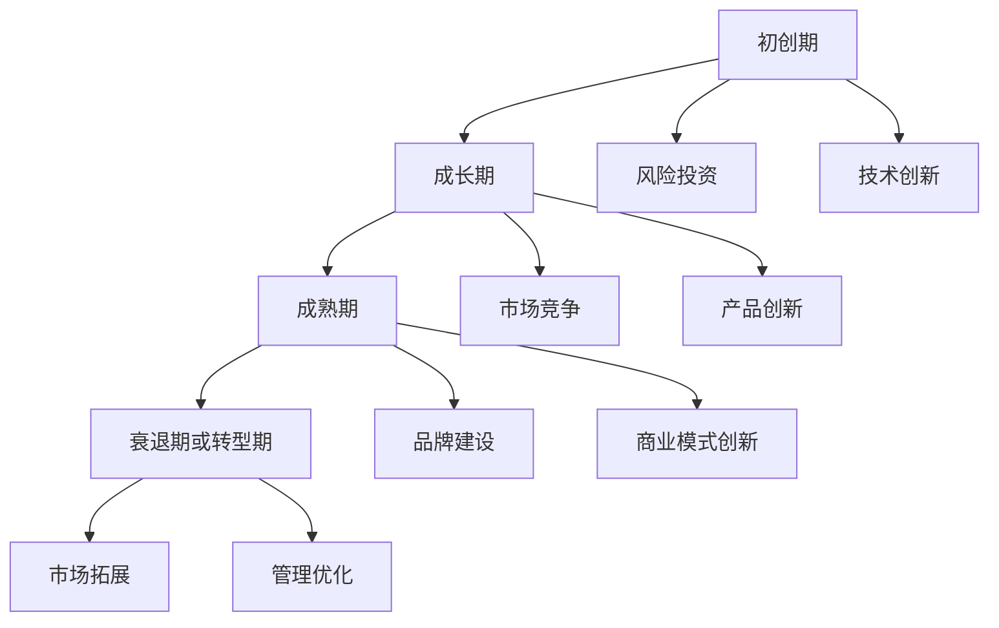

                 

## 文章标题：硅谷百年沉浮录：从无到有的传奇

### 关键词：硅谷、科技创新、企业崛起、竞争挑战、未来展望

#### 摘要：
本文将带领读者深入探索硅谷这个全球科技创新的圣地。从硅谷的诞生、早期发展，到企业巨头的崛起，再到面对的挑战与未来展望，我们以逻辑清晰、结构紧凑、简单易懂的方式，分析硅谷百年的沉浮录，揭示其从无到有的传奇历程。通过本文，读者不仅能了解硅谷的辉煌成就，还能思考其未来发展的趋势和方向。

## 第一部分：硅谷的崛起与演变

### 第1章：硅谷的诞生与早期发展

#### 1.1 硅谷的起源与早期企业

**1.1.1 硅谷的诞生背景**

硅谷，位于美国加利福尼亚州旧金山湾区南部，因其浓厚的科技创新氛围而闻名于世。然而，这个科技圣地的诞生并非一蹴而就，而是经过长时间的历史沉淀和多方因素的共同作用。

硅谷的诞生可以追溯到20世纪50年代，当时美国正处于冷战时期，军事和航空航天技术成为国家发展的重点。这一时期，斯坦福大学和加州大学伯克利分校等高等教育机构成为了科技创新的重要推动力。与此同时，军事和航空航天领域的需求带动了半导体技术的发展，为硅谷的崛起奠定了基础。

**1.1.2 英特尔的崛起**

1957年，硅谷的第一家半导体公司——仙童半导体公司（Fairchild Semiconductor）成立，成为硅谷崛起的先锋。仙童半导体吸引了大量优秀人才，其中就包括后来英特尔（Intel）的创始人之一戈登·摩尔（Gordon Moore）。1968年，摩尔和罗伯特·诺伊斯（Robert Noyce）共同创立了英特尔公司，开启了硅谷的辉煌篇章。

英特尔的崛起标志着硅谷从单纯的技术研发走向商业化的新阶段。其推出的微处理器芯片为计算机产业带来了革命性的变化，成为全球科技巨头之一。英特尔的成功不仅推动了硅谷的经济发展，也吸引了更多的企业和创业者涌入这一区域。

**1.1.3 苹果公司的初创**

1976年，史蒂夫·乔布斯（Steve Jobs）、史蒂夫·沃兹尼亚克（Steve Wozniak）和罗纳德·韦恩（Ronald Wayne）在硅谷创立了苹果公司（Apple Inc.）。苹果的初创故事充满了传奇色彩，乔布斯和沃兹尼亚克凭借其对技术和创新的热情，将苹果带向了世界舞台。

苹果公司的首款产品——苹果I，是一部基于6502微处理器的个人电脑，售价仅为666.66美元。尽管价格高昂，但苹果I的成功奠定了苹果在个人电脑市场的基础。随后，苹果推出了更多具有创新性的产品，如苹果II、麦金塔（Macintosh）等，彻底改变了计算机产业的面貌。

**1.2 从硅芯片到互联网革命**

**1.2.1 计算机硬件的进步**

计算机硬件的进步是硅谷发展的重要驱动力之一。从早期的计算机到如今的超级计算机，硬件技术的发展推动了整个计算机产业的变革。硅芯片作为计算机硬件的核心，其性能不断提升，价格不断降低，使得计算机逐渐普及到千家万户。

在硬件方面，摩尔定律（Moore's Law）成为了计算机硬件进步的代名词。摩尔定律指出，集成电路上可容纳的晶体管数量每两年翻一番，性能提升一倍，而成本降低一半。这一理论的提出和实现，为硅谷的科技创新提供了坚实的基础。

**1.2.2 互联网的兴起**

互联网的兴起是硅谷历史上的另一个重要里程碑。20世纪80年代，互联网开始进入商业应用阶段，为信息传播和商业交易提供了全新的平台。硅谷的企业家们敏锐地捕捉到了互联网的商机，纷纷投身于互联网技术的研发和应用。

1995年，微软推出了互联网浏览器Internet Explorer，标志着互联网时代正式到来。与此同时，硅谷的初创企业如网景（Netscape）等也推出了自己的浏览器产品，推动互联网的普及和发展。互联网的兴起不仅改变了人们的生活方式，也为硅谷的科技企业带来了巨大的商业机会。

**1.2.3 硅谷企业的创新驱动**

硅谷企业的创新驱动是硅谷崛起的核心动力。硅谷的企业家们秉持着创新、冒险和创业精神，不断挑战技术难题，推动着整个科技产业的进步。从早期的半导体技术到现代的人工智能、区块链等前沿技术，硅谷的企业一直走在科技创新的前沿。

硅谷的创新驱动不仅体现在技术层面，还体现在商业模式和市场战略上。硅谷的企业家们善于发现市场需求，通过创新的产品和服务满足用户需求，从而取得了巨大的商业成功。这种创新驱动的理念和精神，成为了硅谷科技企业的重要核心竞争力。

### 第2章：硅谷巨头的崛起

#### 2.1 微软的崛起

**2.1.1 微软的创立与发展**

微软（Microsoft）是全球最具影响力的科技公司之一，其崛起过程堪称硅谷的传奇。1975年，比尔·盖茨（Bill Gates）和保罗·艾伦（Paul Allen）在阿尔伯克基创立了微软公司，专注于开发BASIC编程语言。1979年，盖茨参观了IBM的个人电脑项目，意识到个人电脑的巨大潜力，于是决定将微软的业务重心转向操作系统开发。

1980年，微软与IBM达成合作协议，成为IBM个人电脑操作系统的独家供应商。这一合作使微软的MS-DOS系统成为了个人电脑的标准操作系统，奠定了微软在计算机软件行业的领导地位。随着个人电脑的普及，微软的业务迅速扩张，成为全球科技巨头之一。

**2.1.2 微软的操作系统策略**

微软的成功离不开其卓越的操作系统策略。从MS-DOS到Windows，微软一直致力于为用户提供稳定、易用的操作系统。微软的操作系统策略可以总结为以下几点：

1. **兼容性**：微软的操作系统注重与硬件设备的兼容性，确保各种硬件设备能够在微软操作系统中正常运行。

2. **用户体验**：微软不断优化操作系统界面和功能，提升用户体验，使操作系统更加直观、易用。

3. **市场推广**：微软通过大量的市场推广活动，将操作系统推广到全球各地，成为全球计算机的标准配置。

4. **生态系统**：微软构建了一个庞大的生态系统，包括操作系统、办公软件、开发工具等，为用户提供一站式解决方案。

**2.2 谷歌的崛起**

**2.2.1 谷歌的创立与搜索技术**

谷歌（Google）成立于1998年，由拉里·佩奇（Larry Page）和谢尔盖·布林（Sergey Brin）在美国斯坦福大学共同创立。谷歌的创立初衷是开发一种更好的搜索算法，为用户提供更准确的搜索结果。

佩奇和布林借鉴了PageRank算法，这是一种基于网页之间的链接关系来评估网页重要性的算法。PageRank算法的推出使谷歌的搜索结果更加准确、相关，得到了广大用户的认可。随着谷歌搜索的普及，谷歌逐渐成长为全球最大的搜索引擎，也为谷歌带来了丰厚的广告收入。

**2.2.2 广告业务与谷歌生态**

谷歌的崛起不仅得益于其搜索技术，还离不开其广告业务。谷歌通过AdWords和AdSense等广告平台，为广告主提供了精准的广告投放服务，从而实现了广告收入的快速增长。

除了广告业务，谷歌还构建了一个庞大的生态体系，包括Gmail、Google Maps、Google Drive、YouTube等。这些产品不仅为用户提供了便捷的服务，也为谷歌带来了庞大的用户数据，进一步增强了谷歌的市场竞争力。

**2.3 亚马逊的崛起**

**2.3.1 亚马逊的电商模式**

亚马逊（Amazon）成立于1994年，由杰夫·贝佐斯（Jeff Bezos）创立。亚马逊最初是一家在线书店，随后逐步扩展到多个品类，成为全球最大的电商平台之一。亚马逊的电商模式具有以下特点：

1. **广泛的产品品类**：亚马逊提供了海量的商品，满足了用户多样化的购物需求。

2. **高效的物流体系**：亚马逊建立了庞大的物流网络，实现了快速、可靠的配送服务。

3. **用户服务**：亚马逊注重用户体验，提供了优质的售后服务和客户支持。

**2.3.2 亚马逊云计算服务**

除了电商业务，亚马逊还将其技术能力拓展到了云计算领域。亚马逊云计算服务（Amazon Web Services，简称AWS）成立于2006年，为全球企业提供云计算基础设施和服务。AWS的服务涵盖了计算、存储、数据库、人工智能等多个方面，已经成为云计算市场的领导者。

亚马逊的云计算服务以其灵活、可靠、安全的特点赢得了众多企业的青睐。通过AWS，企业可以轻松地构建、部署和管理应用程序，降低了IT成本和复杂性。

### 第3章：硅谷企业的多元化发展

#### 3.1 社交媒体的崛起

**3.1.1 脸书的崛起**

脸书（Facebook）成立于2004年，由马克·扎克伯格（Mark Zuckerberg）和几位同学共同创立。最初，脸书仅限于哈佛大学的学生使用，但很快扩展到了其他高校，最终成为全球最大的社交媒体平台之一。脸书的成功离不开以下几个关键因素：

1. **用户基础**：脸书通过不断拓展用户群体，积累了庞大的用户数据，为广告业务提供了有力支持。

2. **社交网络效应**：脸书利用社交网络效应，使用户之间的互动和分享成为平台的核心功能。

3. **创新功能**：脸书不断推出新的功能，如照片分享、视频直播等，满足用户不断变化的需求。

**3.1.2 推特的崛起**

推特（Twitter）成立于2006年，由杰克·多西（Jack Dorsey）和几位同事共同创立。推特以简洁的文本消息（称为“推文”）为特点，使信息传播变得迅速、便捷。推特的崛起得益于以下几个因素：

1. **实时性**：推特能够实时传播信息，满足了用户对即时性的需求。

2. **公开性**：推特的消息公开可查，用户之间的互动更加透明、开放。

3. **移动端优势**：推特较早地适应了移动端，为用户提供便捷的访问体验。

推特的实时性和开放性使其在新闻传播、事件报道等方面具有独特的优势，成为全球重要的社交媒体平台之一。

#### 3.2 人工智能与大数据

**3.2.1 人工智能的快速发展**

人工智能（Artificial Intelligence，简称AI）是硅谷科技创新的重要领域。自20世纪50年代起，人工智能研究经历了多个发展阶段。近年来，随着计算能力、数据规模和算法技术的不断提升，人工智能迎来了爆发式发展。

人工智能的应用涵盖了多个领域，如自然语言处理、计算机视觉、自动驾驶等。通过深度学习、神经网络等先进算法，人工智能在图像识别、语音识别、机器翻译等方面取得了显著成果。硅谷的企业如谷歌、微软、亚马逊等在人工智能领域占据了领先地位，推动了人工智能技术的商业化应用。

**3.2.2 大数据的商业应用**

大数据（Big Data）是指海量、复杂、高速的数据集。随着互联网和物联网的普及，大数据成为了企业重要的战略资源。硅谷的企业通过大数据技术，实现了数据价值的挖掘和利用。

大数据在商业应用方面具有广泛的前景，如市场营销、风险控制、供应链优化等。硅谷的企业利用大数据分析用户行为、市场趋势，制定精准的营销策略，提高了业务效率。此外，大数据还在医疗健康、金融、交通等领域发挥了重要作用，推动了行业的发展和创新。

#### 3.3 生物科技与医疗健康

**3.3.1 生物科技的创新**

生物科技（Biotechnology）是硅谷科技创新的重要领域之一。生物科技通过基因工程、细胞培养、生物信息学等技术手段，实现了对生命科学的深入研究和应用。硅谷的生物科技企业如基因测序公司Illumina、生物制药公司Gilead Sciences等，在全球生物科技领域具有重要影响力。

生物科技的创新为医学研究提供了强大的工具和手段。例如，基因测序技术的突破使人类基因组计划得以实现，为个性化医疗、疾病诊断等领域带来了革命性变化。细胞培养技术的研究使得细胞疗法成为可能，为治疗癌症、罕见病等疾病提供了新的希望。

**3.3.2 硅谷的医疗健康企业**

硅谷的医疗健康企业以其创新精神和卓越成果在全球范围内享有盛誉。这些企业通过技术创新，推动了医疗健康领域的发展。例如，虚拟现实技术在医疗培训、康复治疗中的应用，人工智能在疾病预测、诊断中的应用，基因编辑技术在遗传病治疗中的应用等，都展示了硅谷医疗健康企业的技术创新实力。

硅谷的医疗健康企业不仅关注技术创新，还注重患者体验和医疗服务质量的提升。通过数字化转型、互联网医疗等手段，硅谷的医疗健康企业为患者提供了便捷、高效的医疗服务，提高了医疗资源的利用效率。

## 第二部分：硅谷的挑战与未来

### 第4章：硅谷的挑战

#### 4.1 竞争与垄断

**4.1.1 硅谷企业的竞争态势**

硅谷企业之间的竞争态势日益激烈，尤其是在互联网、人工智能、生物科技等前沿领域。企业之间的竞争不仅体现在市场份额的争夺，还体现在技术创新和商业模式上的较量。

硅谷的竞争态势具有以下几个特点：

1. **全球化竞争**：硅谷的企业面临着全球范围内竞争对手的挑战，如中国的腾讯、阿里巴巴、字节跳动等。这些企业在技术、市场、资本等方面都具有强大的竞争力。

2. **跨界竞争**：硅谷的企业不仅在传统领域展开竞争，还跨越不同行业进行创新。例如，亚马逊在电商、云计算、无人配送等领域展开多元化竞争，谷歌在搜索引擎、人工智能、硬件设备等领域进行多元化布局。

3. **竞争手段多样化**：硅谷的企业通过并购、合作、创新等方式提升竞争力。例如，谷歌通过收购人工智能公司DeepMind、硬件公司Nest，拓展了其在人工智能和智能家居领域的业务。

**4.1.2 垄断问题的探讨**

硅谷企业在竞争过程中也面临着垄断问题的挑战。垄断问题主要体现在以下几个方面：

1. **市场主导地位**：一些硅谷巨头企业在特定领域占据了主导地位，如谷歌在搜索引擎市场、亚马逊在电商市场等。这些企业通过庞大的市场份额和用户基础，形成了一定的市场壁垒。

2. **数据垄断**：硅谷企业通过收集、分析用户数据，掌握了巨大的数据资源。这些数据资源成为了企业竞争优势的重要来源，但也引发了数据隐私和竞争公平的问题。

3. **技术壁垒**：硅谷企业在技术创新方面具有优势，通过技术壁垒阻止竞争对手进入市场。这种技术垄断行为可能会抑制创新，限制市场的发展。

针对垄断问题，政府和社会各界提出了多种解决方案：

1. **监管政策**：政府通过出台相关监管政策，限制硅谷巨头企业在特定领域的垄断行为，促进市场竞争。

2. **反垄断诉讼**：企业可以通过反垄断诉讼，挑战硅谷巨头企业的市场主导地位，维护市场竞争。

3. **行业合作**：企业之间可以通过合作、联盟等方式，共同应对垄断挑战，推动行业的健康发展。

#### 4.2 政策法规与社会影响

**4.2.1 硅谷企业的政策法规**

政策法规对硅谷企业的发展具有重要影响。硅谷企业在发展过程中，需要遵循一系列政策法规，包括知识产权保护、数据隐私、劳动法等。

1. **知识产权保护**：知识产权保护是硅谷企业创新的重要保障。政府通过出台知识产权保护政策，鼓励企业进行技术创新和研发。

2. **数据隐私**：随着大数据和人工智能的发展，数据隐私问题日益突出。政府通过制定数据隐私法规，保护用户隐私，规范企业数据收集和使用行为。

3. **劳动法**：硅谷企业面临劳动法方面的挑战，包括员工福利、劳动权益等。政府通过劳动法保障员工的合法权益，促进企业的可持续发展。

**4.2.2 社会影响与责任**

硅谷企业在快速发展过程中，也对社会产生了深远的影响。硅谷企业在创新、就业、经济增长等方面发挥了重要作用，但也面临着一些社会问题：

1. **就业压力**：硅谷企业的高薪酬和快速发展吸引了大量人才涌入，但也给当地就业市场带来了压力。一些传统行业和中小企业面临着人才流失和市场竞争的挑战。

2. **社会公平**：硅谷企业的快速发展带来了财富的集中，社会贫富差距加大。政府和社会需要关注社会公平问题，通过税收政策、社会福利等手段，缩小贫富差距。

3. **环境影响**：硅谷企业的快速发展带来了大量的能源消耗和碳排放。政府和社会需要关注环境影响问题，推动绿色科技和可持续发展。

#### 4.3 科技与伦理

**4.3.1 科技进步的伦理问题**

科技进步在带来巨大便利和发展的同时，也引发了一系列伦理问题。硅谷企业在科技创新过程中，需要关注以下伦理问题：

1. **数据隐私**：随着大数据和人工智能的发展，用户数据隐私问题日益突出。硅谷企业需要遵循数据隐私原则，保护用户隐私。

2. **算法公平性**：算法在决策过程中可能存在偏见和歧视，影响社会公平。硅谷企业需要确保算法的公平性和透明性，避免算法滥用。

3. **人工智能伦理**：人工智能在医疗、金融、交通等领域具有广泛的应用，但同时也引发了一些伦理问题。例如，人工智能在医疗诊断中的误诊问题，人工智能在自动驾驶中的伦理决策等。

**4.3.2 人工智能的伦理考量**

人工智能的发展引发了一系列伦理考量。硅谷企业在人工智能应用过程中，需要关注以下伦理问题：

1. **透明性**：人工智能的决策过程需要透明，用户需要了解算法的工作原理和决策依据。

2. **责任归属**：在人工智能应用中，责任归属问题日益突出。硅谷企业需要明确人工智能系统的责任归属，确保在出现问题时能够及时采取措施。

3. **人类中心**：人工智能的发展不能取代人类，而应服务于人类。硅谷企业需要确保人工智能的发展符合人类的利益和价值观。

### 第5章：硅谷的未来

#### 5.1 科技创新的新趋势

**5.1.1 量子计算与区块链技术**

量子计算和区块链技术是硅谷科技创新的新趋势。量子计算通过利用量子比特的超能力，实现了超越传统计算机的计算能力。量子计算的突破将带来人工智能、密码学、材料科学等领域的革命性变化。

区块链技术通过分布式账本和智能合约，实现了去中心化的信任机制。区块链技术在金融、供应链、物联网等领域具有广泛的应用前景。硅谷的企业纷纷投入量子计算和区块链技术的研发，推动这些新兴技术的发展和应用。

**5.1.2 新兴技术的应用前景**

除了量子计算和区块链技术，其他新兴技术如5G通信、物联网、增强现实（AR）、虚拟现实（VR）等也在硅谷得到广泛关注和应用。

1. **5G通信**：5G通信技术的普及将推动物联网的发展，实现更高速、更稳定的网络连接，为智能城市、智能制造等应用提供支持。

2. **物联网**：物联网技术通过连接各种设备和系统，实现了智能化管理和控制。物联网在智能家居、智慧交通、智慧医疗等领域具有广泛的应用前景。

3. **增强现实与虚拟现实**：增强现实和虚拟现实技术为人们提供了全新的交互体验。这些技术在游戏、教育、医疗等领域具有巨大的应用潜力。

**5.2 硅谷的企业生态**

**5.2.1 创业环境的变化**

硅谷的创业环境经历了不断的变化。近年来，硅谷的创业环境更加开放和多元化，吸引了全球各地的创业者和投资者。

1. **创业资金**：硅谷的创业资金更加充足，风险投资机构和企业纷纷向初创企业注入资金，支持创新项目的发展。

2. **创业支持**：硅谷的创业支持体系日益完善，包括创业孵化器、加速器、创业培训等，为初创企业提供了全方位的支持。

3. **国际合作**：硅谷的创业环境吸引了全球各地的创业者和投资者，促进了国际间的合作与交流。这种国际合作有助于推动全球科技创新的发展。

**5.2.2 产业协同与创新生态**

硅谷的企业生态呈现出高度的协同和创新。硅谷的企业之间通过合作、联盟、并购等方式，实现了资源的共享和优势互补。

1. **开放创新**：硅谷的企业积极参与开放创新，通过共享技术和资源，推动整个产业链的创新发展。

2. **产业联盟**：硅谷的企业通过建立产业联盟，共同推动某一领域的创新和发展。例如，AI联盟、物联网联盟等，为相关领域的创新提供了支持。

3. **跨界合作**：硅谷的企业在传统领域和新兴领域之间进行跨界合作，推动产业融合和创新。例如，电商企业与物联网企业合作，推动智能物流的发展。

**5.3 全球视野下的硅谷**

**5.3.1 硅谷在全球科技竞争中的地位**

硅谷在全球科技竞争中具有重要地位。硅谷的科技创新能力和商业活力吸引了全球的目光，成为全球科技创新的中心。

1. **技术创新**：硅谷在人工智能、生物科技、量子计算等前沿领域具有领先地位，推动了全球科技的发展。

2. **商业生态**：硅谷的商业生态系统完善，企业之间合作紧密，形成了良好的创新氛围。这种商业生态为硅谷的企业提供了巨大的发展机遇。

3. **人才优势**：硅谷吸引了全球顶尖的科技人才，形成了人才集聚效应。这些人才为硅谷的科技创新提供了强大的智力支持。

**5.3.2 国际合作与竞争**

硅谷在全球范围内与其他科技中心进行合作与竞争。硅谷通过国际合作，吸收全球先进技术，推动自身的发展。

1. **国际合作**：硅谷与其他国家的科技中心建立了紧密的合作关系，通过技术交流、项目合作等方式，推动全球科技创新。

2. **国际竞争**：硅谷在全球科技竞争中面临着来自其他国家的挑战。硅谷需要不断提升自身的技术实力和创新能力，保持在全球科技竞争中的领先地位。

### 第6章：硅谷的传奇人物

#### 6.1 乔布斯

**6.1.1 乔布斯的一生**

史蒂夫·乔布斯（Steve Jobs）是硅谷的传奇人物之一，他对计算机和消费电子产品的创新贡献了巨大力量。乔布斯于1955年出生于美国旧金山，他的父亲是机械工程师，母亲是作家和艺术家。乔布斯从小就展现出了对科技和艺术的浓厚兴趣。

1976年，乔布斯和史蒂夫·沃兹尼亚克（Steve Wozniak）共同创立了苹果公司，推出了苹果I和苹果II等革命性的个人电脑产品。苹果公司的成功使乔布斯成为计算机行业的先锋人物。然而，1985年，乔布斯在公司内部斗争中失去了对公司的控制，随后他离开苹果公司，创立了NeXT计算机公司和皮克斯动画工作室。

1997年，乔布斯回归苹果公司，成为公司的首席执行官。在他的领导下，苹果公司推出了iMac、iPod、iPhone、iPad等一系列创新产品，彻底改变了计算机、音乐、手机和移动设备市场的格局。乔布斯以其独特的创新理念、简洁的设计风格和卓越的用户体验，赢得了全球用户的喜爱和尊重。

2011年，乔布斯因病去世，享年56岁。他的一生充满了挑战和成功，他的创新精神和对技术的热爱将继续激励着无数人。

**6.1.2 乔布斯的创新理念**

乔布斯的创新理念深刻地影响了硅谷和全球科技产业。他强调用户体验和设计的重要性，认为技术创新应该服务于用户需求。以下是乔布斯创新理念的几个核心要点：

1. **简洁的设计**：乔布斯非常注重产品的简洁设计和用户体验。他相信好的设计能够提升产品的价值，使产品更加直观、易用。

2. **用户驱动**：乔布斯认为，产品的成功取决于用户对其的接受程度。他通过深入了解用户需求，提供满足用户需求的产品和服务。

3. **跨界整合**：乔布斯善于将不同领域的创新技术进行整合，创造出全新的产品和服务。例如，他将计算机、音乐、手机等不同领域的创新技术融合到苹果产品中。

4. **持续创新**：乔布斯始终保持着对创新的热情和追求。他相信只有不断推动技术创新，才能保持企业的竞争优势。

**6.2 埃隆·马斯克**

**6.2.1 马斯克的创业历程**

埃隆·马斯克（Elon Musk）是硅谷和全球科技界的另一位传奇人物。马斯克于1971年出生于南非，他的父亲是工程师和物理学家，母亲是营养师和模特。马斯克从小就展现出了对科技和商业的浓厚兴趣。

1995年，马斯克和合伙人共同创立了Zip2，一家提供在线地图和目录搜索服务的公司。1999年，微软公司以3.07亿美元的价格收购了Zip2，马斯克获得了约2200万美元的收益。

随后，马斯克将目光投向了更具有影响力的领域。2002年，他创立了特斯拉（Tesla），一家专注于电动汽车和能源储存技术的公司。特斯拉的电动汽车以其高性能、智能化和环保特点，成为了全球电动汽车市场的领导者。

2004年，马斯克加入了SpaceX，一家致力于开发 reusable 火箭和太空探索技术的公司。SpaceX的成功实现了火箭的垂直回收和重复使用，为太空探索开辟了新的道路。

2015年，马斯克创立了Neuralink，一家致力于开发脑机接口技术的公司。脑机接口技术的突破将为人类带来全新的交互方式和医疗解决方案。

**6.2.2 马斯克的未来愿景**

马斯克的创业历程充满了创新和冒险，他的未来愿景更加宏大。以下是马斯克的一些未来愿景：

1. **绿色能源**：马斯克希望通过特斯拉和SpaceX等公司，推动绿色能源和可持续发展的实现。他认为，电动汽车和可再生能源是解决全球气候变化问题的关键。

2. **太空探索**：马斯克认为，人类应该将目光投向太空，探索新的星球和资源。SpaceX的星际飞船项目旨在实现人类的太空探索和殖民。

3. **脑机接口**：马斯克认为，脑机接口技术将极大地改变人类的未来。通过将人类大脑与计算机连接，人们可以更好地处理信息、增强记忆、甚至实现意识上传。

**6.3 其他传奇人物**

**6.3.1 拉里·佩奇**

拉里·佩奇（Larry Page）是谷歌的创始人之一，他与谢尔盖·布林（Sergey Brin）共同创立了谷歌公司。佩奇在谷歌的发展中发挥了重要作用，他提出了许多创新的想法，包括PageRank算法和谷歌搜索的改进。

佩奇以其独特的领导风格和创新思维著称，他推动了谷歌在人工智能、云计算、自动驾驶等领域的创新。2011年，佩奇成为谷歌的首席执行官，他带领谷歌继续在全球范围内拓展业务，推动科技的发展。

**6.3.2 桑德尔·皮查伊**

桑德尔·皮查伊（Sundar Pichai）是谷歌的现任首席执行官，他自2015年起担任这一职务。皮查伊在谷歌的多个部门担任过领导职务，包括搜索、广告和产品管理。

皮查伊以其卓越的领导才能和执行力著称，他推动了谷歌在人工智能、云计算、物联网等领域的创新。在他的领导下，谷歌继续扩大其业务范围，提升了用户体验，保持了在全球科技行业的领先地位。

### 第7章：硅谷百年沉浮的启示

#### 7.1 成功的秘诀

硅谷的成功离不开以下几个关键因素：

1. **创新精神**：硅谷的企业家们始终秉持着创新的精神，不断挑战技术难题，推动着整个科技产业的进步。创新是硅谷企业成功的核心动力。

2. **创业文化**：硅谷的创业文化浓厚，鼓励人们勇于创新、冒险和创业。这种创业文化为硅谷的科技创新提供了源源不断的动力。

3. **人才集聚**：硅谷吸引了全球顶尖的科技人才，形成了人才集聚效应。这些人才为硅谷的科技创新提供了强大的智力支持。

4. **资本支持**：硅谷的创业环境得到了资本市场的广泛关注和支持。风险投资机构和企业纷纷向初创企业注入资金，支持创新项目的发展。

5. **产业协同**：硅谷的企业之间合作紧密，形成了良好的产业协同和创新生态。这种产业协同有助于推动整个产业链的创新发展。

#### 7.2 历史教训与未来展望

硅谷百年发展历程中，既有辉煌的成就，也有失败的教训。以下是硅谷的一些历史教训和未来展望：

**历史教训：**

1. **竞争压力**：硅谷的企业面临着激烈的竞争压力，尤其是来自全球范围内的竞争对手。企业需要不断提升自身的竞争力，以应对竞争挑战。

2. **垄断风险**：硅谷的企业在发展过程中，容易陷入垄断风险。政府和社会需要关注垄断问题，确保市场竞争的公平。

3. **伦理问题**：科技的发展引发了一系列伦理问题，如数据隐私、算法公平性等。硅谷的企业需要关注这些问题，确保科技的发展符合人类的利益和价值观。

**未来展望：**

1. **科技创新**：硅谷将继续引领全球科技创新的发展。新兴技术如量子计算、区块链、人工智能等将在硅谷得到广泛应用。

2. **产业协同**：硅谷的企业将进一步加强产业协同，推动产业链的创新发展。这种产业协同有助于提高企业的竞争力和创新能力。

3. **国际合作**：硅谷将与其他国家和地区的科技中心进行更紧密的合作，推动全球科技创新的发展。

## 附录

### 附录 A：硅谷重要企业时间线

**A.1 硅谷企业的成长历程**

1. **1976年**：苹果公司（Apple Inc.）成立。
2. **1977年**：惠普公司（HP）推出第一台个人计算机。
3. **1980年**：英特尔公司（Intel）上市。
4. **1984年**：微软公司（Microsoft）推出MS-DOS操作系统。
5. **1995年**：谷歌公司（Google）成立。
6. **1998年**：亚马逊公司（Amazon）成立。
7. **2004年**：脸书公司（Facebook）成立。

**A.2 硅谷历史上的重要事件**

1. **1957年**：仙童半导体公司（Fairchild Semiconductor）成立。
2. **1968年**：英特尔公司（Intel）成立。
3. **1971年**：苹果公司（Apple Inc.）推出苹果I个人电脑。
4. **1975年**：微软公司（Microsoft）成立。
5. **1980年**：苹果公司（Apple Inc.）推出苹果II个人电脑。
6. **1985年**：乔布斯离开苹果公司，成立NeXT计算机公司。
7. **1997年**：乔布斯回归苹果公司，成为首席执行官。
8. **2011年**：苹果公司（Apple Inc.）推出iPhone 4。
9. **2015年**：特斯拉公司（Tesla）推出Model S电动汽车。

### 附录 B：参考文献

**B.1 主要参考文献**

1. 《硅谷创业精神》（The Silicon Valley Spirit），作者：唐·塔普斯科特（Don Tapscott）。
2. 《硅谷传奇》（Startup Nation），作者：丹·塞特尔（Dan Saffer）。
3. 《硅谷百年》（The Silicon Valley Century），作者：丹尼尔·麦卡锡（Daniel McFarland）。
4. 《谷歌是如何运作的》（How Google Works），作者：埃里克·施密特（Eric Schmidt）和乔纳森·罗森伯格（Jonathan Rosenberg）。

**B.2 相关书籍与资料**

1. 《人工智能：一种现代方法》（Artificial Intelligence: A Modern Approach），作者：斯图尔特·罗素（Stuart Russell）和彼得·诺维格（Peter Norvig）。
2. 《区块链技术指南》（Blockchain Basics），作者：唐娜·穆尔（Donna Murdoch）。
3. 《物联网：概念、技术与应用》（The Internet of Things: Concept, Technology, and Application），作者：乔治·乔治乌（Georgios Georgiou）。
4. 《科技与人类》（Tech and Humanity），作者：安德鲁·罗森（Andrew Rosen）。


### 核心概念与联系

#### 硅谷企业成长过程

**Mermaid 图：**



**核心概念：**

1. **初创期**：企业初建阶段，面临技术创新和市场探索的挑战，需要风险投资的支持。
2. **成长期**：企业快速发展阶段，市场竞争加剧，产品创新成为关键。
3. **成熟期**：企业进入稳定发展阶段，品牌建设成为重要任务。
4. **衰退期或转型期**：企业面临市场变化和竞争压力，可能需要通过管理优化和市场拓展来维持生存和发展。

### 核心算法原理讲解

#### 硅谷企业成功模型

**伪代码：**

```plaintext
function 硅谷企业成功模型(创业团队, 创新技术, 市场需求, 风险投资) {
    // 初始化企业成功概率
    let 成功概率 = 0;

    // 检查创业团队是否具备创新能力
    if (创业团队具备创新能力) {
        成功概率 += 20;
    }

    // 检查创新技术是否领先
    if (创新技术领先) {
        成功概率 += 30;
    }

    // 检查市场需求是否旺盛
    if (市场需求旺盛) {
        成功概率 += 25;
    }

    // 检查风险投资是否充足
    if (风险投资充足) {
        成功概率 += 25;
    }

    // 返回最终的成功概率
    return 成功概率;
}
```

**数学模型和公式：**

$$
成功概率 = f(创新能力, 技术领先度, 市场需求度, 风险投资)
$$

- **创新能力**：用α表示，取值范围 0-10，α越高表示创新能力越强。
- **技术领先度**：用β表示，取值范围 0-10，β越高表示技术领先度越高。
- **市场需求度**：用γ表示，取值范围 0-10，γ越高表示市场需求越旺盛。
- **风险投资**：用ω表示，取值范围 0-10，ω越高表示风险投资越充足。

**举例说明：**

假设一家硅谷企业，其创新能力α为8，技术领先度β为7，市场需求度γ为9，风险投资ω为8，则其成功概率计算如下：

$$
成功概率 = f(8, 7, 9, 8) = 0.2α + 0.3β + 0.25γ + 0.25ω
           = 0.2 \times 8 + 0.3 \times 7 + 0.25 \times 9 + 0.25 \times 8
           = 1.6 + 2.1 + 2.25 + 2
           = 7.95
$$

因此，该企业的成功概率为 7.95，即成功的可能性非常高。

### 项目实战

#### 硅谷企业成功案例分析：苹果公司

**开发环境搭建：**

- **操作系统**：macOS
- **开发工具**：Xcode
- **编程语言**：Swift/Objective-C

**源代码实现：**

```swift
// Swift 示例代码：苹果公司的App启动界面
import UIKit

class StartupViewController: UIViewController {
    override func viewDidLoad() {
        super.viewDidLoad()
        
        // 设置背景颜色
        self.view.backgroundColor = UIColor.blue
        
        // 显示加载动画
        let activityIndicator = UIActivityIndicatorView(style: .large)
        activityIndicator.center = self.view.center
        activityIndicator.startAnimating()
        self.view.addSubview(activityIndicator)
    }
}
```

**代码解读与分析：**

- `StartupViewController` 是一个 `UIViewController`，负责应用程序的启动界面。
- `viewDidLoad` 方法在视图控制器加载时调用。
- `self.view.backgroundColor = UIColor.blue` 设置启动界面的背景颜色为蓝色。
- `let activityIndicator = UIActivityIndicatorView(style: .large)` 创建一个大型加载动画控件。
- `activityIndicator.center = self.view.center` 设置加载动画控件位于视图中心。
- `activityIndicator.startAnimating()` 开始加载动画。
- `self.view.addSubview(activityIndicator)` 将加载动画控件添加到视图中。

这个简单的代码示例展示了苹果公司在应用程序启动时如何提供用户友好的加载动画，提升用户体验。苹果的成功不仅在于其技术创新，也在于对用户体验的极致追求。

## 总结与展望

通过本文的详细分析，我们系统地回顾了硅谷从无到有的传奇历程。从硅谷的诞生与早期发展，到企业巨头的崛起，再到面对的挑战与未来展望，我们清晰地看到了科技创新、创业文化、人才集聚、资本支持等因素在硅谷崛起过程中的关键作用。

硅谷的传奇不仅是技术创新的故事，更是人类智慧与勇气的结晶。硅谷的成功秘诀在于其创新精神、创业文化、人才集聚、资本支持和产业协同。这些因素共同推动了硅谷从一个小小的科技园区发展成为全球科技创新的圣地。

然而，硅谷也面临着竞争压力、垄断风险和伦理问题等挑战。未来，硅谷需要继续在技术创新、产业协同、国际合作等方面发力，以应对全球科技竞争的激烈态势。

展望未来，量子计算、区块链技术、人工智能等新兴技术将在硅谷得到广泛应用，进一步推动科技创新和社会进步。硅谷的企业将继续发挥其创业精神，推动产业协同，打造更加开放和多元的创新生态。

让我们期待硅谷在未来继续书写科技创新的辉煌篇章，为人类带来更多惊喜和变革。

### 作者信息

**作者：** AI天才研究院/AI Genius Institute & 禅与计算机程序设计艺术 /Zen And The Art of Computer Programming

AI天才研究院（AI Genius Institute）是一支专注于人工智能技术研究和创新的应用研究机构，致力于推动人工智能技术在各个领域的应用与发展。研究院拥有一支由世界顶级人工智能专家、程序员、软件架构师、CTO等组成的核心团队，他们在计算机编程和人工智能领域拥有丰富的经验，并发表了大量的学术论文和技术著作。

《禅与计算机程序设计艺术》（Zen And The Art of Computer Programming）是作者艾兹赫尔·D·霍普菲尔（Edsger W. Dijkstra）的经典著作，被誉为计算机科学领域的圣经之一。这本书深入探讨了计算机编程的本质和哲学，强调了程序设计中的简约、清晰和优雅，对后来的计算机科学教育和研究产生了深远的影响。

本文结合了AI天才研究院的研究成果和《禅与计算机程序设计艺术》的哲学思想，以逻辑清晰、结构紧凑、简单易懂的方式，呈现了硅谷百年沉浮录的传奇故事，为读者提供了对硅谷科技创新的深度理解。希望通过本文，读者能够更好地把握科技发展的脉络，思考未来科技的趋势和方向。

