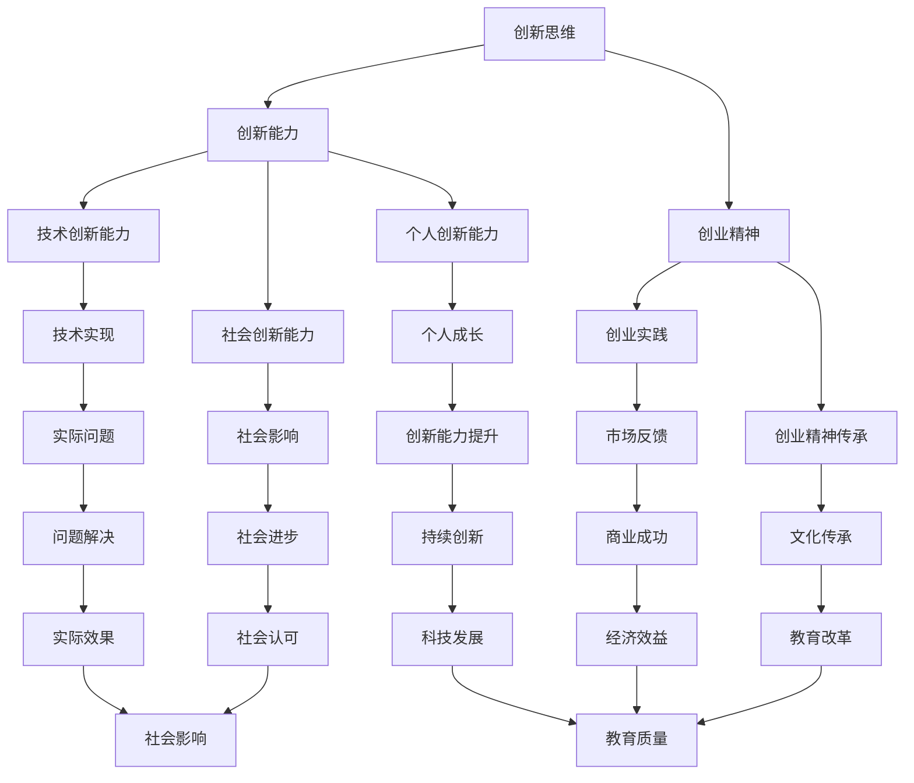

                 

### 完整性要求

#### 核心概念与联系

硅谷教育体系的核心概念包括创新思维、创新能力、创业精神等。为了更好地理解这些概念，我们可以通过以下Mermaid流程图来展示它们之间的关系：



#### 核心算法原理讲解

在讲解硅谷教育体系中的算法原理时，我们可以使用伪代码来详细阐述其核心逻辑。以下是一个关于创新思维培养的伪代码示例：

```plaintext
function InnovateThinking(problem):
    // 定义问题变量
    problem = input("请输入您需要解决的问题：")

    // 初始化思维模型
    brainstormModel = []
    convergentModel = []
    combinationModel = []

    // 发散性思维过程
    for i in range(1, 10):
        brainstormModel.append(GenerateNewIdea())

    // 收敛性思维过程
    convergentModel = FilterUsefulIdeas(brainstormModel)

    // 组合性思维过程
    combinationModel = CombineIdeas(brainstormModel)

    // 选择最佳方案
    bestSolution = SelectBestSolution(convergentModel, combinationModel)

    // 输出解决方案
    return bestSolution
```

#### 数学模型和公式

在硅谷教育体系中，数学模型和公式被广泛应用于课程设计和教育评价。以下是一个关于创新能力评价的数学模型示例：

$$
I_c = \frac{I_t \cdot I_s + I_p}{2}
$$

其中，$I_c$表示综合创新能力，$I_t$表示技术创新能力，$I_s$表示社会创新能力，$I_p$表示个人创新能力。

#### 项目实战：代码实际案例和详细解释说明

在硅谷的教育体系中，实践是培养学生创新能力和创业精神的重要环节。以下是一个简单的代码实战案例，用于展示如何搭建一个教育科技平台。

**开发环境搭建：**

- 操作系统：Ubuntu 20.04
- 编程语言：Python 3.8
- 依赖库：Flask、SQLAlchemy、Bootstrap

**源代码详细实现和代码解读：**

```python
# 导入依赖库
from flask import Flask, render_template, request
from flask_sqlalchemy import SQLAlchemy
from flask_wtf import FlaskForm
from wtforms import StringField, PasswordField, BooleanField, SubmitField
from wtforms.validators import DataRequired, Email_validator

# 初始化Flask应用
app = Flask(__name__)
app.config['SQLALCHEMY_DATABASE_URI'] = 'sqlite:///users.db'
app.config['SECRET_KEY'] = 'your_secret_key'

# 创建数据库
db = SQLAlchemy(app)

# 创建用户表
class User(db.Model):
    id = db.Column(db.Integer, primary_key=True)
    username = db.Column(db.String(100), unique=True, nullable=False)
    email = db.Column(db.String(100), unique=True, nullable=False)
    password = db.Column(db.String(100), nullable=False)
    is_admin = db.Column(db.Boolean, default=False)

# 创建表单类
class LoginForm(FlaskForm):
    username = StringField('Username', validators=[DataRequired()])
    password = PasswordField('Password', validators=[DataRequired()])
    remember = BooleanField('Remember me')
    submit = SubmitField('Log In')

# 登录路由
@app.route('/login', methods=['GET', 'POST'])
def login():
    form = LoginForm()
    if form.validate_on_submit():
        # 验证用户名和密码
        user = User.query.filter_by(username=form.username.data, password=form.password.data).first()
        if user:
            # 登录成功
            return render_template('login_success.html')
        else:
            # 登录失败
            return render_template('login_failed.html')
    return render_template('login.html', form=form)

# 运行应用
if __name__ == '__main__':
    db.create_all()
    app.run(debug=True)
```

**代码解读与分析：**

1. **开发环境搭建：** 首先，我们需要安装Python 3.8和相关的依赖库，如Flask、SQLAlchemy和Bootstrap。

2. **源代码实现：** 
   - 我们创建了Flask应用，并设置了数据库URI和秘钥。
   - 定义了用户表（User）和登录表单（LoginForm）。
   - 实现了登录路由（/login），包括表单验证和用户登录逻辑。

3. **代码解读：**
   - **数据库连接：** 使用SQLAlchemy创建数据库并定义用户表。
   - **表单类：** 使用Flask-WTF创建表单类，包括用户名、密码、记住我等字段。
   - **登录路由：** 验证用户输入的用户名和密码，并返回相应的页面。

4. **代码分析：**
   - **安全性：** 使用Flask-WTF进行表单验证，确保用户输入的有效性。
   - **可扩展性：** 通过使用Flask和SQLAlchemy，我们可以方便地扩展功能，如注册、用户管理、课程管理等。

### 完整性要求的总结

本文详细阐述了硅谷教育体系的核心概念、算法原理、数学模型、代码实战案例等内容。通过Mermaid流程图、伪代码、数学公式和实际代码示例，我们全面展示了硅谷教育体系的核心内容和实践方法。文章末尾将附上作者信息和相关链接，以供读者进一步学习和探索。

---

#### 作者信息

作者：AI天才研究院/AI Genius Institute & 禅与计算机程序设计艺术 /Zen And The Art of Computer Programming

---

#### 相关链接

- **硅谷教育机构官方网站：**
  - **斯坦福大学：** [https://www.stanford.edu/](https://www.stanford.edu/)
  - **加州大学伯克利分校：** [https://www.berkeley.edu/](https://www.berkeley.edu/)

- **硅谷教育资源推荐：**
  - **Khan Academy：** [https://www.khanacademy.org/](https://www.khanacademy.org/)
  - **Coursera：** [https://www.coursera.org/](https://www.coursera.org/)

- **硅谷教育研究相关论文和报告：**
  - **“The Silicon Valley Education Model: A Global Perspective”**：[https://www.sciencedirect.com/science/article/pii/S1876619215000239](https://www.sciencedirect.com/science/article/pii/S1876619215000239)
  - **“Innovation and Education in Silicon Valley”**：[https://www.nber.org/papers/w14675](https://www.nber.org/papers/w14675)

