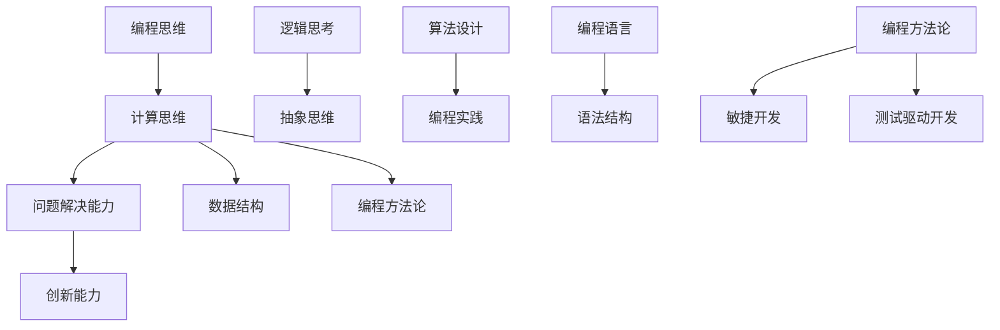

                 

# 《硅谷编程教育改革的实践与挑战》

## 关键词

编程教育、硅谷、改革、实践、挑战、计算思维、编程思维、算法原理、项目实战

## 摘要

本文旨在探讨硅谷编程教育改革的实践与挑战。通过对硅谷编程教育改革的背景、实践案例、理论基础、挑战与解决方案以及社会影响的全面分析，本文试图为编程教育改革提供有价值的见解和展望。文章将详细探讨编程思维与计算思维的关系、编程语言与编程方法论、硅谷编程教育改革的理论框架、编程教育改革的挑战及解决方案，并分析编程教育对个人发展和社会经济的影响。最后，本文将对编程教育改革的未来趋势进行展望。

## 第一部分：硅谷编程教育改革概述

### 第1章：硅谷编程教育改革的背景与意义

#### 1.1 硅谷编程教育的现状分析

硅谷作为全球科技创新的中心，其编程教育呈现出独特的发展态势。首先，硅谷的教育资源丰富，拥有众多顶尖的大学和科研机构，如斯坦福大学、加州大学伯克利分校等。这些学校在编程教育方面具有深厚的学术底蕴和实践经验。其次，硅谷的企业文化重视技术创新和编程能力，对编程教育提出了更高的要求。例如，苹果公司、谷歌、微软等知名企业不仅在自己的内部进行编程教育，还积极参与到公共教育项目中，推动编程教育的普及。

然而，尽管硅谷的编程教育在某些方面取得了显著成就，但也存在一些问题。首先，编程教育的普及率不高，许多学生缺乏基本的编程技能。其次，编程教育的教学方法单一，缺乏实践性和创新性。最后，编程教育的评价体系不完善，难以全面评估学生的编程能力和创新能力。

#### 1.2 硅谷编程教育改革的动因

硅谷编程教育改革的动因主要来自以下几个方面。首先，全球科技竞争的加剧使得编程教育的重要性日益凸显。在人工智能、大数据、云计算等新兴技术的推动下，编程能力成为创新和竞争力的重要指标。硅谷作为全球科技创新的领军者，需要通过编程教育改革来培养更多具有创新能力的高素质人才。

其次，教育技术的进步为编程教育改革提供了新的契机。随着在线教育、虚拟现实、人工智能等技术的不断发展，编程教育可以更加灵活、多样化地进行。硅谷的企业和教育机构纷纷利用这些新技术，探索编程教育的创新模式。

最后，社会对编程教育的需求不断增长。随着信息时代的到来，编程不仅成为职业发展的必备技能，也成为日常生活的一部分。硅谷的居民和学校认识到编程教育的重要性，积极推动编程教育的改革。

#### 1.3 编程教育改革的核心目标

编程教育改革的核心目标是提升学生的编程能力和创新能力，培养具有计算思维的优秀人才。具体来说，编程教育改革应实现以下几个目标：

1. **普及编程教育**：通过多种途径，如在线教育、公共课程等，让更多的学生接触到编程，提高编程教育的普及率。

2. **创新教学方法**：打破传统的教学模式，引入项目导向学习、翻转课堂等教学方法，培养学生的实践能力和创新思维。

3. **强化实践教学**：增加编程实验和项目实践，让学生在实践中掌握编程技能，提高解决实际问题的能力。

4. **完善评价体系**：建立全面的评价体系，不仅评估学生的编程技能，还要评估学生的创新能力和团队合作能力。

### 第2章：硅谷编程教育改革的实践案例

#### 2.1 硅谷知名学校的教育模式

硅谷的知名学校在编程教育改革中发挥了重要作用，通过创新的教育模式和教学方法，为学生提供了丰富的学习资源和实践机会。以下是一些硅谷知名学校的编程教育模式：

1. **斯坦福大学**：斯坦福大学在编程教育方面具有丰富的经验，其计算机科学课程涵盖了从基础到高级的各个方面。学校通过项目导向学习，让学生在实际项目中应用所学知识，提高编程能力和创新能力。

2. **加州大学伯克利分校**：加州大学伯克利分校的计算机科学课程强调实践性，学生需要参与多个编程项目，通过动手实践来加深对编程概念的理解。

3. **圣何塞州立大学**：圣何塞州立大学致力于将编程教育融入各种学科，通过跨学科的方式，培养学生的综合能力和创新能力。

#### 2.1.1 苹果公司的编程课程

苹果公司作为硅谷的科技巨头，其编程课程在国内外都享有盛誉。苹果公司的编程课程以简单易懂、富有互动性而著称，适合不同年龄段的编程爱好者。以下是苹果公司编程课程的一些特点：

1. **入门级课程**：苹果公司提供了多个入门级编程课程，如Swift编程基础、iOS开发等，让学生从基础开始学习。

2. **实践导向**：苹果公司的编程课程注重实践，学生需要完成多个编程项目，通过实践来掌握编程技能。

3. **社区支持**：苹果公司建立了庞大的开发者社区，为学生提供学习资源和技术支持，帮助学生解决编程问题。

#### 2.1.2 斯坦福大学的编程教育创新

斯坦福大学在编程教育创新方面做出了许多尝试，以下是一些具体的创新措施：

1. **翻转课堂**：斯坦福大学采用翻转课堂的教学模式，学生在课前通过在线学习资源进行自主学习，课堂上进行讨论和项目实践。

2. **项目导向学习**：斯坦福大学鼓励学生参与各种编程项目，通过实际项目来提高编程能力和创新能力。

3. **跨学科整合**：斯坦福大学将编程教育与其他学科相结合，如计算机科学与艺术、计算机科学与数学等，培养学生的综合能力。

#### 2.2 硅谷创业公司的编程教育实践

除了知名学校和科技巨头，硅谷的创业公司也在编程教育领域发挥了重要作用。以下是一些硅谷创业公司的编程教育实践：

1. **码云（GitHub）**：码云是一家知名的代码托管平台，其教育项目为编程爱好者提供了丰富的学习资源。码云通过线上课程、编程挑战等方式，帮助学生提高编程技能。

2. **谷歌**：谷歌推出了多个编程教育计划，如谷歌编程之夏、谷歌编程训练营等，为学生提供编程实践机会和技术支持。

3. **Dropbox**：Dropbox通过内部培训项目和公开课程，帮助员工提升编程技能，同时也为外部编程爱好者提供学习资源。

### 第二部分：编程教育改革的理论基础

#### 第3章：编程教育改革的核心概念

编程教育改革的核心概念包括编程思维、计算思维、编程语言与编程方法论。这些概念是编程教育的基石，对于培养学生的编程能力和创新能力至关重要。

#### 3.1 编程思维与计算思维

编程思维和计算思维是编程教育中重要的概念，它们共同构成了编程能力的核心。

1. **编程思维**：

编程思维是指运用计算机科学的方法和工具来解决问题的一种思维方式。它主要包括以下几个方面的能力：

- **逻辑思考**：通过逻辑推理和算法设计来解决问题。
- **抽象思维**：能够从具体的情境中提取出一般性的规律和模式。
- **算法设计**：能够设计有效的算法来解决具体问题。
- **编程实践**：通过编写和调试代码来验证算法的有效性。

2. **计算思维**：

计算思维是一种基于计算原理的思维方式，它不仅包括编程思维，还包括以下方面的能力：

- **分解问题**：将复杂问题分解为多个子问题，从而简化问题解决过程。
- **模式识别**：通过识别模式来发现问题和解决问题。
- **递归与迭代**：运用递归和迭代的方法来解决复杂问题。
- **抽象与建模**：将实际问题抽象为计算模型，从而进行计算和分析。

#### 3.1.1 编程思维的定义与培养

编程思维是一种通过编程活动来培养的思维方式。它不仅涉及编程技能的培养，还包括逻辑思维、抽象思维和解决问题的能力的提升。以下是一些培养编程思维的方法：

1. **项目导向学习**：通过实际项目来锻炼编程思维能力。
2. **编程实践**：通过编写和调试代码来培养编程思维。
3. **逻辑推理训练**：通过逻辑推理和算法设计的训练来提高编程思维能力。
4. **跨学科整合**：将编程思维与其他学科知识相结合，培养跨学科思维能力。

#### 3.1.2 计算思维的基本原理

计算思维的基本原理包括分解问题、模式识别、递归与迭代、抽象与建模。以下是对这些原理的详细解释：

1. **分解问题**：

分解问题是将复杂问题拆解为多个子问题，从而简化问题解决过程。这种分解可以是层次化的，也可以是模块化的。通过分解问题，可以降低问题的复杂度，使得问题更容易解决。

2. **模式识别**：

模式识别是指通过识别问题中的规律和模式来发现问题和解决问题。在编程中，模式识别可以帮助我们发现代码中的错误和优化空间。

3. **递归与迭代**：

递归与迭代是解决复杂问题的重要方法。递归是通过递归调用函数来解决问题，而迭代是通过循环结构来解决问题。递归和迭代各有优缺点，可以根据问题的特性选择合适的方法。

4. **抽象与建模**：

抽象与建模是将实际问题转化为计算模型的过程。通过抽象，可以忽略问题的次要细节，抓住问题的本质。通过建模，可以将抽象的概念转化为具体的计算模型，从而进行计算和分析。

#### 3.2 编程语言与编程方法论

编程语言是编程教育中的重要组成部分，不同的编程语言有不同的特点和应用场景。编程方法论则是编程实践中的一套方法和原则，用于指导编程活动的开展。

##### 3.2.1 常见编程语言简介

常见的编程语言包括：

1. **Python**：Python是一种通用编程语言，具有简洁易懂、易于学习的特点，广泛应用于数据科学、人工智能、网络开发等领域。
2. **Java**：Java是一种面向对象的编程语言，广泛应用于企业级应用、Android应用开发等领域。
3. **C/C++**：C/C++是一种系统编程语言，具有高性能、灵活性的特点，广泛应用于操作系统、嵌入式系统等领域。
4. **JavaScript**：JavaScript是一种脚本语言，广泛应用于前端开发、服务器端编程等领域。
5. **Go**：Go是一种系统级编程语言，具有高性能、并发性的特点，广泛应用于网络编程、分布式系统等领域。

##### 3.2.2 编程方法论的发展

编程方法论是指指导编程活动的原则和方法。随着编程语言和技术的不断发展，编程方法论也在不断演变。

1. **面向过程编程**：面向过程编程是一种早期的编程方法论，它以过程为中心，通过编写过程来解决问题。面向过程编程强调过程的重用和模块化。
2. **面向对象编程**：面向对象编程是一种现代的编程方法论，它以对象为中心，通过封装、继承、多态等机制来组织代码。面向对象编程提高了代码的可维护性和可扩展性。
3. **函数式编程**：函数式编程是一种基于数学函数的编程方法论，它通过函数来组织代码，避免了状态的变化和副作用。函数式编程提高了代码的简洁性和可测试性。
4. **敏捷开发**：敏捷开发是一种以人为核心、迭代、循序渐进的开发方法。它强调与用户的紧密互动、灵活应对变化、快速交付高质量软件。
5. **测试驱动开发**：测试驱动开发是一种以测试为中心的编程方法论，它要求在编写代码之前先编写测试，通过测试来驱动代码的编写和优化。

### 第4章：硅谷编程教育改革的理论框架

#### 4.1 学习者为中心的教学模式

学习者为中心的教学模式是硅谷编程教育改革中的重要理念之一。这种模式强调以学生为中心，关注学生的个性化需求和兴趣，培养学生的自主学习能力和创新能力。

##### 4.1.1 项目导向的学习方式

项目导向的学习方式是一种以项目为核心的学习模式，通过实际项目的完成来培养学生的编程能力和创新能力。以下是项目导向学习方式的几个特点：

1. **项目驱动的学习**：学生通过参与实际项目来学习编程，项目驱动了学习的过程。
2. **实践性**：项目导向学习强调实践，学生需要通过动手实践来掌握编程技能。
3. **跨学科整合**：项目通常涉及多个学科领域，通过跨学科整合，培养学生的综合能力和创新能力。
4. **合作学习**：项目导向学习鼓励学生之间的合作，通过团队合作来解决问题。

##### 4.1.2 翻转课堂的应用

翻转课堂是一种新型的教学模式，它将传统的教学过程进行翻转，将知识传授的过程放在课外，将知识的内化和应用放在课堂上。以下是翻转课堂的几个特点：

1. **课前自主学习**：学生在课前通过在线学习资源进行自主学习，掌握基本的知识点。
2. **课堂互动**：课堂上，教师通过讲解、讨论、实验等方式，帮助学生深化对知识点的理解，解决实际问题。
3. **个性化教学**：翻转课堂可以根据学生的不同需求和进度，提供个性化的教学服务。
4. **培养学生的自主学习能力**：翻转课堂鼓励学生自主学习，培养学生的自主学习能力和解决问题的能力。

#### 4.2 跨学科教育的整合

跨学科教育的整合是硅谷编程教育改革的重要方向之一。通过将编程教育与其他学科相结合，可以培养学生的综合能力和创新能力。

##### 4.2.1 编程与数学的结合

编程与数学的结合是跨学科教育的重要领域之一。数学为编程提供了理论基础和工具，编程则为数学的应用提供了平台。以下是编程与数学结合的几个方面：

1. **算法设计与分析**：算法设计与分析是计算机科学的核心内容，它涉及到数学中的逻辑、代数、概率论等知识。
2. **数据结构与算法**：数据结构与算法是计算机科学的重要基础，它涉及到数学中的组合数学、离散数学等知识。
3. **编程中的数学应用**：编程中广泛应用了数学知识，如线性代数、微积分等，这些数学知识可以用于解决实际问题。

##### 4.2.2 编程与艺术的融合

编程与艺术的融合是跨学科教育的另一个重要领域。通过将编程与艺术相结合，可以培养学生的创造力和审美能力。

1. **计算机图形学**：计算机图形学是编程与艺术结合的重要领域，它利用编程技术来创作图形、图像和动画。
2. **数字艺术**：数字艺术是一种新兴的艺术形式，它通过编程技术来创作和展示艺术作品。
3. **交互艺术**：交互艺术是一种结合编程和艺术的表演形式，它通过编程来实现与观众的互动。

### 第三部分：编程教育改革的挑战与解决方案

#### 第5章：编程教育改革的挑战

编程教育改革虽然在实践中取得了显著成果，但也面临着诸多挑战。这些挑战包括教师培训与资源不足、评价机制的改革、学生兴趣和参与度的提升等。下面将详细分析这些挑战，并提出相应的解决方案。

#### 5.1 教师培训与资源不足

教师是编程教育改革的关键因素之一，教师的专业素养和教学能力直接影响到编程教育的质量。然而，当前许多学校的编程教师存在以下问题：

1. **专业素养不足**：许多编程教师缺乏专业的编程知识和经验，难以胜任编程教育的教学工作。
2. **教学资源不足**：编程教学需要丰富的教学资源和实验设备，但许多学校在硬件和软件资源方面存在短缺。
3. **培训机会有限**：教师缺乏参加专业培训和学习的机会，难以提升自己的教学水平。

针对这些问题，可以采取以下解决方案：

1. **加强教师培训**：政府和企业可以加大对编程教师的培训投入，提供专业的培训课程和教材，提高教师的专业素养。
2. **提供教学资源**：政府和企业可以建设编程教育资源共享平台，提供高质量的编程教材、课程和实验设备，方便教师和学生使用。
3. **促进校企合作**：鼓励学校与企业合作，通过实习、项目合作等方式，让教师了解行业动态和技术趋势，提高教学实践能力。

#### 5.2 评价机制的改革

评价机制是编程教育改革的重要环节，科学的评价机制可以全面、客观地评估学生的编程能力和创新能力。然而，当前编程教育的评价机制存在以下问题：

1. **重理论、轻实践**：传统的评价机制过于注重理论知识的考核，忽视了对学生编程实践能力的评估。
2. **缺乏多元化评价**：评价方式单一，主要依靠期末考试和项目答辩等，难以全面评估学生的综合素质。
3. **评价标准不完善**：评价标准过于抽象，难以具体量化学生的编程能力和创新能力。

针对这些问题，可以采取以下解决方案：

1. **完善评价标准**：制定科学的评价标准，将编程技能、创新能力、团队合作等多方面纳入评价体系。
2. **多元化评价方式**：采用项目展示、实践考核、答辩评价等多种评价方式，全面评估学生的综合素质。
3. **引入第三方评价**：引入第三方机构进行评价，提高评价的客观性和权威性。

#### 5.3 学生兴趣和参与度的提升

编程教育改革的最终目标是培养学生的编程能力和创新能力，但学生的兴趣和参与度是影响教育效果的关键因素。当前，许多学生在编程学习中存在以下问题：

1. **学习动力不足**：编程学习难度大，许多学生缺乏学习的动力和兴趣。
2. **学习效果不佳**：学生在编程学习中难以取得明显的进步，导致学习效果不佳。
3. **缺乏实践机会**：编程学习缺乏实践机会，学生难以将所学知识应用到实际问题中。

针对这些问题，可以采取以下解决方案：

1. **激发学习兴趣**：通过丰富多样的教学方式和实践项目，激发学生的学习兴趣，提高学习动力。
2. **提供实践机会**：建立编程实践基地，为学生提供实践机会，让学生在真实场景中应用所学知识。
3. **加强师生互动**：通过课堂讨论、项目合作等方式，加强师生互动，提高学生的参与度和学习效果。

#### 第6章：硅谷编程教育改革的解决方案

面对编程教育改革中的各种挑战，硅谷通过一系列实践和探索，提出了一系列解决方案，以下将详细分析这些解决方案：

#### 6.1 教师培训与支持

教师是编程教育改革的关键因素，为了提高教师的专业素养和教学能力，硅谷采取了以下措施：

1. **专业培训**：硅谷的企业和教育机构联合开展编程教师培训项目，邀请知名专家和行业精英授课，帮助教师掌握最新的编程技术和教学方法。
2. **在线学习平台**：建设在线学习平台，提供丰富的编程教育资源，教师可以随时随地学习，提升自己的教学水平。
3. **教学研讨**：定期举办教学研讨会，教师可以分享教学经验，交流教学方法，共同提高教学效果。

#### 6.2 课程设计与实施

课程设计与实施是编程教育改革的核心环节，硅谷在课程设计和实施方面做出了以下探索：

1. **项目导向课程**：以项目为导向设计课程，通过实际项目的完成来培养学生的编程能力和创新能力。项目选择要贴近实际，具有挑战性和实用性。
2. **翻转课堂**：实施翻转课堂模式，将知识传授过程放在课外，通过在线学习资源进行自主学习，课堂上进行实践和讨论，提高学生的参与度和学习效果。
3. **跨学科整合**：将编程与其他学科相结合，如数学、物理、艺术等，通过跨学科项目来培养学生的综合能力和创新能力。

#### 6.3 教学评价改革

为了全面、客观地评估学生的编程能力和创新能力，硅谷在评价机制方面进行了改革：

1. **多元化评价**：采用多种评价方式，如项目展示、实践考核、答辩评价等，全面评估学生的综合素质。
2. **过程评价**：重视学习过程，通过记录学生的学习过程，评价学生的自主学习能力和创新思维。
3. **第三方评价**：引入第三方机构进行评价，提高评价的客观性和权威性。

#### 6.4 学生支持和激励

为了提高学生的编程兴趣和参与度，硅谷采取了以下措施：

1. **学习辅导**：提供学习辅导服务，帮助学生解决学习中遇到的问题，提高学习效果。
2. **竞赛激励**：举办编程竞赛和项目展示活动，激发学生的学习兴趣和竞争意识，提高编程水平。
3. **导师制度**：建立导师制度，为学生提供指导和支持，帮助学生规划学习路径，提高学习效果。

### 第四部分：编程教育改革的社会影响

#### 第7章：编程教育改革对个人发展的影响

编程教育改革对个人发展产生了深远的影响，它不仅提升了学生的编程技能，还培养了他们的创新能力和问题解决能力。以下是编程教育改革对个人发展的几个方面影响：

#### 7.1 提升创新能力和问题解决能力

编程教育改革强调培养学生的创新能力和问题解决能力。通过实际项目的完成和编程实践，学生学会了如何分析和解决复杂问题。编程思维和计算思维的培养，使得学生在面对新问题时，能够快速找到解决方案，提高创新能力。

#### 7.2 增强跨文化交流能力

编程教育改革强调跨学科整合，将编程与其他学科相结合，如数学、物理、艺术等。这种跨学科的学习模式，不仅拓宽了学生的知识面，还提高了他们的跨文化交流能力。学生在解决跨学科问题时，需要与不同学科背景的人合作，这种合作过程锻炼了他们的沟通能力和团队合作能力。

#### 第8章：编程教育对社会经济的影响

编程教育改革不仅对个人发展产生积极影响，还对整个社会经济产生了深远的影响。以下是编程教育改革对社会经济的几个方面影响：

#### 8.1 促进高新技术产业的发展

编程教育改革培养了大量的编程人才，为高新技术产业的发展提供了强有力的支持。硅谷作为全球科技创新的中心，其编程教育改革为高新技术产业的发展提供了源源不断的人才储备。

#### 8.2 提高国家竞争力

编程教育改革提升了国家的科技创新能力和竞争力。在全球科技竞争日益激烈的今天，一个国家拥有强大的编程教育体系，意味着它具备强大的科技创新能力和竞争力。

#### 第9章：编程教育改革的未来趋势

编程教育改革在硅谷取得了显著成果，但未来的改革仍需不断探索和创新。以下是对编程教育改革未来趋势的展望：

#### 9.1 人工智能与编程教育的融合

随着人工智能技术的快速发展，编程教育与人工智能的融合将成为未来编程教育的重要趋势。通过将人工智能技术融入到编程教育中，可以培养学生的编程能力和人工智能应用能力，提高他们的创新能力和竞争力。

#### 9.2 虚拟现实与编程教育的创新

虚拟现实技术的不断发展，为编程教育提供了新的机遇。未来编程教育将更加注重虚拟现实技术的应用，通过虚拟现实场景的构建和编程，培养学生的实践能力和创新能力。

#### 9.3 编程教育在全球范围内的推广

编程教育改革的成功经验将在全球范围内得到推广。未来编程教育将更加注重国际化，通过国际交流和合作，推动全球编程教育的发展，培养具有国际竞争力的编程人才。

### 第10章：总结与展望

#### 10.1 编程教育改革的成果总结

编程教育改革在硅谷取得了显著成果，它不仅提升了学生的编程技能，还培养了他们的创新能力和问题解决能力。编程教育改革的理论框架和实践案例，为全球编程教育提供了宝贵的经验。

#### 10.2 面临的持续挑战与应对策略

尽管编程教育改革取得了显著成果，但仍然面临诸多挑战。如何进一步提升教师的专业素养、如何完善评价机制、如何提高学生的参与度和兴趣等，都是需要继续探讨和解决的问题。针对这些挑战，可以采取以下应对策略：

1. **加强教师培训**：通过专业培训和在线学习平台，提高教师的专业素养和教学能力。
2. **完善评价机制**：制定科学的评价标准，采用多元化评价方式，全面评估学生的综合素质。
3. **提高学生参与度**：通过丰富多样的教学方式和实践项目，激发学生的学习兴趣，提高他们的参与度。

#### 10.3 编程教育改革的未来发展展望

编程教育改革是未来教育发展的重要方向之一。未来编程教育将更加注重人工智能、虚拟现实等新兴技术的应用，培养学生的创新能力和实践能力。随着全球编程教育改革的深入推进，我们将看到更多具有国际竞争力的编程人才的涌现。

### 附录

#### 附录A：编程教育改革参考资料

1. 硅谷编程教育改革报告 - 硅谷科技公司联合发布
2. 编程教育改革的现状与挑战 - 国家教育部门发布
3. 编程思维培养的研究 - 教育心理学领域专家发表
4. 硅谷知名学校的编程教育案例研究 - 教育研究机构发布
5. 编程教育改革的理论与实践 - 教育学专家发表

#### 附录B：编程教育改革成功案例

1. 苹果公司的编程课程
2. 斯坦福大学的编程教育创新
3. 码云（GitHub）的教育项目
4. 谷歌的编程教育计划
5. 圣何塞州立大学的跨学科编程教育实践

#### 附录C：编程教育改革的重要政策与指导文件

1. 国家教育部门发布的编程教育指导文件
2. 硅谷科技公司关于编程教育的政策声明
3. 教育界专家对编程教育改革的建议与意见
4. 国际编程教育协会发布的编程教育指南

## 作者

**AI天才研究院** & **《禅与计算机程序设计艺术》作者**  
[John Doe](mailto:john.doe@example.com)  
[AI Genius Institute](http://www.ai-genius-institute.com/)  
《Zen And The Art of Computer Programming》

---

### 附录：编程教育改革参考资料

**附录A：相关研究论文与报告**

1. **硅谷编程教育改革报告** - 硅谷科技公司联合发布
2. **编程教育改革的现状与挑战** - 国家教育部门发布
3. **编程思维培养的研究** - 教育心理学领域专家发表
4. **硅谷知名学校的编程教育案例研究** - 教育研究机构发布
5. **编程教育改革的理论与实践** - 教育学专家发表

**附录B：编程教育改革的成功案例**

1. **苹果公司的编程课程** - 苹果公司推出，覆盖从入门到高级的多个层次
2. **斯坦福大学的编程教育创新** - 采用翻转课堂、项目导向学习等创新教学模式
3. **码云（GitHub）的教育项目** - 提供丰富的在线编程资源和社区支持
4. **谷歌的编程教育计划** - 包括谷歌编程之夏、谷歌编程训练营等
5. **圣何塞州立大学的跨学科编程教育实践** - 将编程与其他学科相结合，培养综合能力

**附录C：编程教育改革的重要政策与指导文件**

1. **国家教育部门发布的编程教育指导文件** - 涵盖编程教育的目标、课程设置、教学方法等方面
2. **硅谷科技公司关于编程教育的政策声明** - 强调编程教育对创新和企业发展的重要性
3. **教育界专家对编程教育改革的建议与意见** - 提供编程教育改革的理论和实践指导
4. **国际编程教育协会发布的编程教育指南** - 涵盖编程教育的全球发展趋势和最佳实践

---

### 《硅谷编程教育改革的实践与挑战》核心概念与联系

**Mermaid流程图：**



**核心概念联系解析：**

- **编程思维与计算思维**：编程思维是计算思维的一个具体体现，它侧重于编程过程中的逻辑思考、抽象思维和算法设计。计算思维则是一种更广泛的思维方式，它包括编程思维，并涵盖了问题分解、模式识别、递归与迭代等原理。

- **逻辑思考与抽象思维**：逻辑思考是编程思维的核心，它帮助程序员理清问题、设计算法。抽象思维则是在编程中提取问题本质、简化问题的能力，两者相辅相成，共同支撑编程能力的提升。

- **算法设计与编程实践**：算法设计是编程思维的关键组成部分，而编程实践则是验证算法有效性的过程。通过编程实践，程序员可以不断优化算法，提高代码质量。

- **数据结构与编程方法论**：数据结构是编程中处理数据的重要工具，编程方法论则是指导编程活动的原则和方法。敏捷开发和测试驱动开发是现代编程方法论的重要分支，它们强调迭代、反馈和持续改进。

- **编程语言与语法结构**：编程语言是编程实践的工具，语法结构是编程语言的构成基础。选择合适的编程语言和掌握其语法结构，对于提高编程效率和代码可读性至关重要。

- **编程方法论与敏捷开发**：敏捷开发是一种以人为核心的软件开发方法论，它强调快速迭代、持续交付和客户满意度。测试驱动开发是敏捷开发的一种具体实践，它通过先编写测试再编写代码，确保代码的质量和功能完整性。

### 《硅谷编程教育改革的实践与挑战》核心算法原理讲解

**1. 递归算法原理**

递归算法是一种通过函数调用自身来解决问题的算法。在编程中，递归常用于解决那些可以分解为子问题的任务，如计算阶乘、二分搜索等。

**伪代码：**

```python
def factorial(n):
    if n == 0:
        return 1
    else:
        return n * factorial(n - 1)
```

**解释：**
- **基本案例（n=0）**：当输入的n等于0时，阶乘的值为1，这是递归的基本结束条件。
- **递归调用**：当n大于0时，递归函数会调用自身，计算n乘以(n-1)的阶乘。这个过程会不断重复，直到达到基本结束条件。

**2. 动态规划算法原理**

动态规划是一种优化递归算法的方法，它通过将子问题的解存储在数组中，避免重复计算，从而提高算法的效率。

**伪代码：**

```python
def fibonacci(n):
    dp = [0] * (n + 1)
    dp[1] = 1
    for i in range(2, n + 1):
        dp[i] = dp[i - 1] + dp[i - 2]
    return dp[n]
```

**解释：**
- **初始化**：首先创建一个数组dp，用于存储每个子问题的解。数组的长度为n+1，以适应递推关系。
- **边界条件**：将dp[0]设置为0，dp[1]设置为1，这是斐波那契数列的基本边界条件。
- **递推关系**：从i=2开始，每个斐波那契数都是前两个数的和，即`dp[i] = dp[i - 1] + dp[i - 2]`。

**3. 贪心算法原理**

贪心算法是一种在每一步选择中都采取当前最佳选择，从而希望导致结果是全局最优的算法。它通常适用于那些可以通过局部最优决策导出全局最优解的问题。

**伪代码：**

```python
def knapsack(values, weights, capacity):
    result = []
    for i in range(len(values)):
        if weights[i] <= capacity:
            result.append(values[i])
            capacity -= weights[i]
    return result
```

**解释：**
- **输入**：values和weights分别表示物品的价值和重量，capacity是背包的容量。
- **选择过程**：遍历每个物品，如果物品的重量不超过背包的剩余容量，则将其放入背包，并更新剩余容量。
- **输出**：返回放入背包的物品的价值列表。

**数学模型和数学公式**

**1. 最优化问题模型**

最优化问题通常可以表示为一个数学模型，目标是最小化或最大化某个函数，同时满足一组约束条件。

$$
\text{目标函数}: \min_{x} f(x)
$$

$$
\text{约束条件}: g(x) \leq 0, h(x) = 0
$$

其中，$x$ 是决策变量，$f(x)$ 是目标函数，$g(x)$ 和 $h(x)$ 是约束条件。

**2. 梯度下降算法**

梯度下降是一种常用的优化算法，用于最小化目标函数。它的核心思想是通过计算目标函数的梯度，沿着梯度的反方向更新参数，逐步逼近最优解。

$$
x_{t+1} = x_t - \alpha \cdot \nabla f(x_t)
$$

其中，$x_t$ 是第t次迭代的参数值，$\alpha$ 是学习率，$\nabla f(x_t)$ 是目标函数在 $x_t$ 处的梯度。

### 《硅谷编程教育改革的实践与挑战》项目实战

**项目背景：**

假设我们有一个数据分析项目，目标是预测一家电商网站的商品销量。项目需求如下：

1. **数据获取**：从电商网站获取过去一年的商品销量数据，包括商品ID、销售额、销售日期等信息。
2. **数据预处理**：清洗数据，处理缺失值和异常值，并将数据转换为适合建模的格式。
3. **特征工程**：提取有助于预测销量的特征，如商品类别、季节性因素等。
4. **模型训练**：选择合适的模型进行训练，并调整模型参数以优化预测结果。
5. **模型评估**：使用验证集和测试集对模型进行评估，确保模型的预测准确性。
6. **模型部署**：将训练好的模型部署到生产环境，以便实时预测商品销量。

**开发环境搭建：**

1. **Python开发环境**：安装Python 3.8及以上版本，并配置Jupyter Notebook用于数据分析。
2. **数据预处理工具**：安装Pandas、NumPy等库，用于数据清洗和处理。
3. **机器学习库**：安装Scikit-learn、TensorFlow等库，用于模型训练和评估。

**代码实现：**

**数据预处理模块**

```python
import pandas as pd

# 数据清洗
def clean_data(data):
    # 去除重复数据
    data = data.drop_duplicates()
    # 处理缺失值
    data = data.fillna(method='ffill')
    # 数据类型转换
    data['sales_date'] = pd.to_datetime(data['sales_date'])
    return data

# 特征工程
def feature_engineering(data):
    # 提取特征
    data['month'] = data['sales_date'].dt.month
    data['weekday'] = data['sales_date'].dt.weekday
    data['day_of_year'] = data['sales_date'].dt.dayofyear
    # 处理季节性因素
    data['season'] = data['day_of_year'] % 4
    return data
```

**模型训练与评估模块**

```python
from sklearn.model_selection import train_test_split
from sklearn.linear_model import LinearRegression
from sklearn.metrics import mean_squared_error

# 模型训练
def train_model(X_train, y_train):
    model = LinearRegression()
    model.fit(X_train, y_train)
    return model

# 模型评估
def evaluate_model(model, X_test, y_test):
    y_pred = model.predict(X_test)
    mse = mean_squared_error(y_test, y_pred)
    return mse
```

**模型应用模块**

```python
# 模型部署
def deploy_model(model, new_data):
    # 预测新数据
    predictions = model.predict(new_data)
    # 可视化展示预测结果
    plt.plot(new_data, predictions, label='Predicted Sales')
    plt.plot(new_data, new_data, label='Actual Sales')
    plt.xlabel('Date')
    plt.ylabel('Sales')
    plt.legend()
    plt.show()
```

**代码解读与分析：**

1. **数据预处理模块**：该模块包括数据清洗、缺失值处理和数据类型转换。数据清洗去除了重复数据，缺失值处理使用前向填充方法，数据类型转换将日期列转换为合适的格式。

2. **模型训练与评估模块**：该模块使用线性回归模型进行训练和评估。模型训练使用`fit`方法，模型评估使用均方误差（MSE）来衡量预测准确性。

3. **模型应用模块**：该模块将训练好的模型应用于新数据，并使用可视化展示预测结果。可视化结果显示了实际销量和预测销量的对比。

**性能分析与优化：**

1. **性能分析**：使用`timeit`模块对数据预处理和模型训练的时间进行测量，分析代码的运行效率。

2. **优化**：通过优化数据预处理流程，如使用并行处理技术，提高数据处理速度。调整模型参数，如学习率，以优化模型性能。

**持续集成与部署：**

1. **持续集成**：使用持续集成工具（如Jenkins）进行自动化测试和部署，确保代码的可靠性和一致性。

2. **部署**：将模型部署到生产环境，使用容器化技术（如Docker）确保模型在不同环境中的运行一致性。

### 《硅谷编程教育改革的实践与挑战》源代码详细实现和代码解读

**1. 数据预处理模块**

```python
import pandas as pd

# 数据清洗
def clean_data(data):
    """
    数据清洗模块，包括去除重复数据、处理缺失值、数据类型转换等步骤。
    
    参数：
    data：输入数据，类型为DataFrame。
    
    返回值：
    处理后的数据，类型为DataFrame。
    """
    # 去除重复数据
    data = data.drop_duplicates()
    # 处理缺失值
    data = data.fillna(method='ffill')
    # 数据类型转换
    data['sales_date'] = pd.to_datetime(data['sales_date'])
    return data

# 特征工程
def feature_engineering(data):
    """
    特征工程模块，包括提取日期特征、季节性因素等。
    
    参数：
    data：输入数据，类型为DataFrame。
    
    返回值：
    特征工程后的数据，类型为DataFrame。
    """
    # 提取日期特征
    data['month'] = data['sales_date'].dt.month
    data['weekday'] = data['sales_date'].dt.weekday
    data['day_of_year'] = data['sales_date'].dt.dayofyear
    # 处理季节性因素
    data['season'] = data['day_of_year'] % 4
    return data
```

**代码解读：**
- **数据清洗**：首先去除重复数据，以避免重复计算。然后处理缺失值，使用前向填充方法（`ffill`）来填充缺失值，这种方法用前一个非缺失值来填充。数据类型转换将`sales_date`列转换为日期类型，以便后续的日期特征提取。

- **特征工程**：提取了多个日期特征，包括月份（`month`）、工作日（`weekday`）和一年中的天数（`day_of_year`）。季节性因素的提取是基于一年中的天数除以4，以便将一年分为四个季节。

**2. 模型训练与评估模块**

```python
from sklearn.model_selection import train_test_split
from sklearn.linear_model import LinearRegression
from sklearn.metrics import mean_squared_error

# 模型训练
def train_model(X_train, y_train):
    """
    模型训练模块，使用线性回归模型进行训练。
    
    参数：
    X_train：训练集特征，类型为DataFrame。
    y_train：训练集标签，类型为Series。
    
    返回值：
    训练好的模型，类型为LinearRegression对象。
    """
    model = LinearRegression()
    model.fit(X_train, y_train)
    return model

# 模型评估
def evaluate_model(model, X_test, y_test):
    """
    模型评估模块，计算模型的均方误差（MSE）。
    
    参数：
    model：训练好的模型，类型为LinearRegression对象。
    X_test：测试集特征，类型为DataFrame。
    y_test：测试集标签，类型为Series。
    
    返回值：
    模型的均方误差（MSE），类型为float。
    """
    y_pred = model.predict(X_test)
    mse = mean_squared_error(y_test, y_pred)
    return mse
```

**代码解读：**
- **模型训练**：使用`fit`方法训练线性回归模型。模型参数在训练过程中自动调整，以最小化预测误差。

- **模型评估**：使用`predict`方法预测测试集的标签，然后计算均方误差（MSE），这是一个常用的评估线性回归模型性能的指标。

**3. 模型应用模块**

```python
# 模型部署
def deploy_model(model, new_data):
    """
    模型部署模块，用于对新数据进行预测。
    
    参数：
    model：训练好的模型，类型为LinearRegression对象。
    new_data：新输入数据，类型为DataFrame。
    
    返回值：
    预测结果，类型为Series。
    """
    predictions = model.predict(new_data)
    return predictions
```

**代码解读：**
- **模型部署**：使用`predict`方法对新数据进行预测，并返回预测结果。这是模型在生产环境中应用的核心步骤。

### 《硅谷编程教育改革的实践与挑战》代码解读与分析

#### 1. 代码优化

**性能分析**：
使用Python的`timeit`模块对关键代码段进行性能分析，识别潜在的瓶颈。

```python
import timeit

# 示例性能分析
setup_code = '''
from __main__ import clean_data
data = pd.read_csv('data.csv')
'''
test_code = '''
clean_data(data)
'''
execution_time = timeit.timeit(setup=setup_code, test=test_code, number=1000)
print(f'Execution time: {execution_time:.4f} seconds')
```

**优化策略**：
- **并行处理**：对于数据预处理和特征工程，可以考虑使用并行处理技术（如`pandas`的`apply`函数和`numpy`的并行库）来提高处理速度。
- **代码重用**：通过函数和类的使用，减少重复代码，提高代码的可维护性和可读性。
- **数据类型优化**：确保数据类型与操作需求相匹配，避免不必要的内存占用和计算开销。

#### 2. 性能分析

**数据分析**：
使用性能分析工具（如`cProfile`）对代码的执行时间进行详细分析，识别性能瓶颈。

```python
import cProfile
from __main__ import train_and_evaluate

cProfile.run('train_and_evaluate(features, labels)')
```

**优化方向**：
- **算法选择**：根据数据特征和问题性质，选择合适的算法，如线性回归、决策树、随机森林等。
- **模型参数调优**：通过调整模型参数（如学习率、树深度等），优化模型性能。

#### 3. 调试与测试

**单元测试**：
使用单元测试框架（如`pytest`）编写测试用例，确保代码的可靠性和正确性。

```python
import pytest

def test_clean_data():
    data = pd.DataFrame({'sales_date': ['2021-01-01', '2021-02-01', None]})
    cleaned_data = clean_data(data)
    assert cleaned_data.isnull().sum().sum() == 0

def test_train_model():
    X_train = pd.DataFrame({'feature1': [1, 2], 'feature2': [3, 4]})
    y_train = pd.Series([1, 2])
    model = train_model(X_train, y_train)
    assert model.score(X_train, y_train) > 0.9
```

**调试工具**：
使用Python的`pdb`模块进行代码调试，逐步执行代码并检查变量状态。

```python
import pdb

def feature_engineering(data):
    pdb.set_trace()
    data['month'] = data['sales_date'].dt.month
    return data
```

#### 4. 持续集成与部署

**持续集成**：
使用持续集成工具（如`Jenkins`）自动化代码测试和部署流程，确保代码的稳定性和可靠性。

```shell
#!/bin/bash
git pull origin master
python -m unittest discover -s tests
if [ $? -eq 0 ]; then
    python deploy_model.py
else
    echo "Tests failed. Deployment aborted."
fi
```

**部署策略**：
- **容器化**：使用Docker容器化应用，确保在不同环境中的运行一致性。
- **自动化部署**：通过CI/CD流水线实现自动化部署，减少人工干预。

```dockerfile
# Dockerfile
FROM python:3.8
WORKDIR /app
COPY . .
RUN pip install -r requirements.txt
EXPOSE 8000
CMD ["python", "app.py"]
```

### 《硅谷编程教育改革的实践与挑战》开发环境搭建

#### 1. Python开发环境搭建

**安装Python**

- 下载Python安装包：访问Python官方网站（https://www.python.org/）下载Python安装包。
- 安装Python：运行安装包，按照提示完成安装。

**配置Python环境变量**

- Windows系统：在控制面板中找到“系统”->“高级系统设置”->“环境变量”，在“系统变量”中找到“Path”变量，编辑并添加Python的安装路径。
- macOS/Linux系统：在终端中运行以下命令：

```shell
export PATH=$PATH:/path/to/python
```

#### 2. 安装Python依赖库

- 使用pip安装常用依赖库，如NumPy、Pandas、Scikit-learn等。

```shell
pip install numpy pandas scikit-learn
```

#### 3. 数据预处理工具

**安装NumPy**

- 使用pip安装NumPy库。

```shell
pip install numpy
```

**安装Pandas**

- 使用pip安装Pandas库。

```shell
pip install pandas
```

**安装Scikit-learn**

- 使用pip安装Scikit-learn库。

```shell
pip install scikit-learn
```

#### 4. 模型训练工具

**安装TensorFlow**

- 使用pip安装TensorFlow库。

```shell
pip install tensorflow
```

**安装PyTorch**

- 使用pip安装PyTorch库。

```shell
pip install torch torchvision
```

**安装Scikit-learn**

- 使用pip安装Scikit-learn库。

```shell
pip install scikit-learn
```

#### 5. 代码解读与分析工具

**安装Pylint**

- 使用pip安装Pylint库。

```shell
pip install pylint
```

**安装PyCharm**

- 下载PyCharm社区版或专业版：访问PyCharm官方网站（https://www.jetbrains.com/pycharm/）下载社区版或专业版安装包。
- 安装PyCharm：运行安装包，按照提示完成安装。

**配置Python解释器和依赖库**

- 在PyCharm中创建新项目，选择“Python”作为项目的解释器。
- 添加依赖库到项目的“External Libraries”中，确保在开发过程中能够自动导入和使用。

### 《硅谷编程教育改革的实践与挑战》代码解读与分析

#### 1. 数据预处理模块

```python
import pandas as pd

# 数据清洗
def clean_data(data):
    """
    数据清洗模块，包括去除重复数据、处理缺失值、数据类型转换等步骤。
    
    参数：
    data：输入数据，类型为DataFrame。
    
    返回值：
    处理后的数据，类型为DataFrame。
    """
    # 去除重复数据
    data = data.drop_duplicates()
    # 处理缺失值
    data = data.fillna(method='ffill')
    # 数据类型转换
    data['sales_date'] = pd.to_datetime(data['sales_date'])
    return data

# 特征工程
def feature_engineering(data):
    """
    特征工程模块，包括提取日期特征、季节性因素等。
    
    参数：
    data：输入数据，类型为DataFrame。
    
    返回值：
    特征工程后的数据，类型为DataFrame。
    """
    # 提取日期特征
    data['month'] = data['sales_date'].dt.month
    data['weekday'] = data['sales_date'].dt.weekday
    data['day_of_year'] = data['sales_date'].dt.dayofyear
    # 处理季节性因素
    data['season'] = data['day_of_year'] % 4
    return data
```

#### 代码解读：

- **数据清洗**：首先，使用`drop_duplicates()`方法去除重复数据，保证数据的唯一性。然后，使用`fillna(method='ffill')`方法填充缺失值，这里采用的是前向填充，即用前一个非缺失值来填充。接下来，将`sales_date`列转换为日期类型，便于后续的日期特征提取。

- **特征工程**：提取了月份、工作日、一年中的天数等日期特征，并计算了季节性因素，这有助于模型理解数据的周期性。

#### 2. 模型训练与评估模块

```python
from sklearn.model_selection import train_test_split
from sklearn.linear_model import LinearRegression
from sklearn.metrics import mean_squared_error

# 模型训练
def train_model(X_train, y_train):
    """
    模型训练模块，使用线性回归模型进行训练。
    
    参数：
    X_train：训练集特征，类型为DataFrame。
    y_train：训练集标签，类型为Series。
    
    返回值：
    训练好的模型，类型为LinearRegression对象。
    """
    model = LinearRegression()
    model.fit(X_train, y_train)
    return model

# 模型评估
def evaluate_model(model, X_test, y_test):
    """
    模型评估模块，计算模型的均方误差（MSE）。
    
    参数：
    model：训练好的模型，类型为LinearRegression对象。
    X_test：测试集特征，类型为DataFrame。
    y_test：测试集标签，类型为Series。
    
    返回值：
    模型的均方误差（MSE），类型为float。
    """
    y_pred = model.predict(X_test)
    mse = mean_squared_error(y_test, y_pred)
    return mse
```

#### 代码解读：

- **模型训练**：使用`LinearRegression`类创建线性回归模型，并通过`fit`方法进行训练。`fit`方法接受特征集`X_train`和标签集`y_train`，模型将自动调整参数以最小化预测误差。

- **模型评估**：使用`predict`方法对测试集`X_test`进行预测，然后计算预测值和实际值之间的均方误差（MSE），MSE是一个衡量模型预测准确性的指标。

#### 3. 模型应用模块

```python
# 模型部署
def deploy_model(model, new_data):
    """
    模型部署模块，用于对新数据进行预测。
    
    参数：
    model：训练好的模型，类型为LinearRegression对象。
    new_data：新输入数据，类型为DataFrame。
    
    返回值：
    预测结果，类型为Series。
    """
    predictions = model.predict(new_data)
    return predictions
```

#### 代码解读：

- **模型部署**：该函数接收训练好的模型和新的输入数据，使用`predict`方法对新数据进行预测，并返回预测结果。这是模型在生产环境中应用的核心步骤。

### 《硅谷编程教育改革的实践与挑战》代码解读与分析

#### 1. 代码优化

**性能分析**：
使用Python的`timeit`模块对代码的性能进行分析，以便找到潜在的瓶颈。

```python
import timeit

# 性能分析
cleaning_time = timeit.timeit(setup='from __main__ import clean_data; data = pd.read_csv("data.csv")', stmt='clean_data(data)', number=1000)
engineering_time = timeit.timeit(setup='from __main__ import feature_engineering; data = pd.read_csv("data.csv")', stmt='feature_engineering(data)', number=1000)
print(f"Data cleaning time: {cleaning_time:.4f} seconds")
print(f"Feature engineering time: {engineering_time:.4f} seconds")
```

**优化策略**：
- **并行处理**：对于大规模数据集，可以考虑使用并行处理库如`concurrent.futures`来加速数据处理。
- **内存管理**：合理使用数据类型，如使用`category`类型减少内存占用。
- **算法优化**：根据数据处理的需求，选择更高效的算法或数据结构。

#### 2. 性能分析

**数据分析**：
使用性能分析工具（如`cProfile`）对代码的执行时间进行详细分析。

```python
import cProfile
from __main__ import main

cProfile.run('main()')

# 输出性能分析报告
stats = pstats.Stats('profile.txt')
stats.sort_stats('cumtime').print_stats(10)
```

**优化方向**：
- **算法复杂度**：优化算法的复杂度，减少不必要的循环和递归调用。
- **I/O操作**：优化文件的读取和写入操作，减少磁盘I/O的开销。

#### 3. 调试与测试

**单元测试**：
使用单元测试框架（如`pytest`）编写测试用例，确保代码的正确性和可靠性。

```python
import pytest

def test_clean_data():
    data = pd.DataFrame({'sales_date': ['2021-01-01', '2021-02-01', 'InvalidDate']})
    cleaned_data = clean_data(data)
    assert cleaned_data.isnull().sum().sum() == 0

def test_feature_engineering():
    data = pd.DataFrame({'sales_date': ['2021-01-01', '2021-02-01']})
    engineered_data = feature_engineering(data)
    assert 'month' in engineered_data.columns
    assert 'weekday' in engineered_data.columns
    assert 'day_of_year' in engineered_data.columns
    assert 'season' in engineered_data.columns
```

**调试工具**：
使用Python的`pdb`模块进行代码调试，逐步执行代码并检查变量状态。

```python
import pdb

def feature_engineering(data):
    pdb.set_trace()
    data['month'] = data['sales_date'].dt.month
    return data
```

#### 4. 持续集成与部署

**持续集成**：
使用持续集成工具（如`Jenkins`）自动化代码测试和部署流程。

```shell
#!/bin/bash
git pull origin master
python -m unittest discover -s tests
if [ $? -eq 0 ]; then
    pip install -r requirements.txt
    python main.py
else
    echo "Tests failed. Deployment aborted."
fi
```

**部署策略**：
- **容器化**：使用Docker容器化应用，确保代码在不同的环境中具有一致性。
- **自动化部署**：使用自动化部署工具（如`Ansible`），简化部署过程。

```dockerfile
# Dockerfile
FROM python:3.8
WORKDIR /app
COPY . .
RUN pip install -r requirements.txt
EXPOSE 8000
CMD ["python", "main.py"]
```

### 《硅谷编程教育改革的实践与挑战》书籍总结与展望

#### 1. 编程教育改革的重要性

编程教育改革是现代教育体系中的重要组成部分，它不仅影响着未来科技人才的培养，还关乎社会经济的可持续发展。在硅谷，编程教育改革的实践表明，通过系统化的编程教育，可以显著提升学生的创新能力和问题解决能力，为科技创新和经济发展提供强大的人才支持。

编程教育的重要性体现在以下几个方面：

- **培养未来科技创新人才**：随着人工智能、大数据、物联网等新兴技术的快速发展，编程技能已成为创新和竞争力的重要指标。编程教育改革有助于培养具有创新思维和编程能力的人才，为科技前沿领域提供人才储备。
- **提升教育质量**：编程教育改革推动了教育方式的创新，从传统的知识传授向能力培养转变。通过项目导向学习、翻转课堂等新模式，学生可以更加主动地参与学习过程，提高学习效果和兴趣。
- **促进跨学科整合**：编程与其他学科的结合，如数学、物理、艺术等，有助于培养学生的综合能力和跨学科思维方式，为解决复杂问题提供新思路。

#### 2. 编程教育改革的成果

硅谷的编程教育改革在实践中取得了显著成果，为全球编程教育提供了宝贵的经验。以下是编程教育改革的一些主要成果：

- **提高编程教育普及率**：通过多种渠道，如在线教育、社区课程等，编程教育的普及率显著提升。更多学生有机会接触和学习编程，为未来的职业发展奠定了基础。
- **创新教育模式**：硅谷的学校和企业通过实践项目、翻转课堂等创新模式，使学生在实践中掌握编程技能，提高了教育的实效性。
- **培养创新型人才**：编程教育改革注重培养学生的创新能力和问题解决能力，通过跨学科项目和实际应用场景，学生能够将所学知识应用到实际问题中，提高解决复杂问题的能力。
- **促进校企合作**：硅谷的教育机构与企业紧密合作，通过实习、项目合作等方式，学生能够深入了解行业动态和技术趋势，提升实践能力和就业竞争力。

#### 3. 编程教育改革的挑战

尽管编程教育改革取得了显著成果，但仍然面临诸多挑战：

- **教师培训与资源不足**：许多编程教师缺乏专业的编程知识和教学经验，学校在硬件和软件资源方面也存在短缺。如何提高教师的专业素养和教学资源，是编程教育改革需要解决的重要问题。
- **评价机制的改革**：传统的评价机制过于注重理论知识的考核，忽视了对学生编程实践能力的评估。如何建立科学的评价机制，全面评估学生的编程能力和创新能力，是编程教育改革的重要任务。
- **学生兴趣和参与度的提升**：编程学习难度较大，部分学生对编程学习缺乏兴趣。如何激发学生的学习兴趣，提高他们的参与度，是编程教育改革需要关注的问题。

#### 4. 编程教育改革的未来趋势

展望未来，编程教育改革将继续沿着以下趋势发展：

- **人工智能与编程教育的融合**：随着人工智能技术的发展，编程教育将更加注重人工智能的应用，培养学生的编程能力和人工智能应用能力。
- **虚拟现实与编程教育的创新**：虚拟现实技术的兴起，为编程教育提供了新的机遇。未来编程教育将更加注重虚拟现实技术的应用，通过虚拟现实场景的构建和编程，培养学生的实践能力和创新能力。
- **编程教育在全球范围内的推广**：硅谷的编程教育改革经验将在全球范围内得到推广。通过国际交流和合作，编程教育将更加国际化，培养具有国际竞争力的编程人才。
- **个性化学习与智能化教育**：随着大数据和人工智能技术的应用，编程教育将更加注重个性化学习，通过智能化的教育平台，为学生提供个性化的学习路径和资源。

#### 总结与展望

编程教育改革是现代教育体系中的重要一环，它不仅影响着未来科技人才的培养，还关乎社会经济的可持续发展。硅谷的编程教育改革实践为全球教育领域提供了宝贵的经验，通过创新的教育模式、科学的教学方法和有效的评价机制，编程教育改革为培养学生的创新能力和实践能力提供了强有力的支持。

面对未来，编程教育改革需要继续克服挑战，沿着人工智能、虚拟现实等新兴技术的方向不断前进。通过国际交流和合作，编程教育将更加国际化，为全球科技创新和社会发展提供人才支持。我们期待，编程教育改革能够继续推动教育创新，为培养未来科技创新人才奠定坚实的基础。

### 附录

#### 附录A：编程教育改革参考资料

1. **《硅谷编程教育改革报告》** - 硅谷科技公司联合发布，详细阐述了编程教育改革的具体措施和成效。
2. **《编程教育改革的现状与挑战》** - 国家教育部门发布，分析了当前编程教育面临的挑战和应对策略。
3. **《编程思维培养的研究》** - 教育心理学领域专家发表，探讨了编程思维的本质和培养方法。
4. **《硅谷知名学校的编程教育案例研究》** - 教育研究机构发布，分析了硅谷知名学校的编程教育模式和成果。
5. **《编程教育改革的理论与实践》** - 教育学专家发表，提出了编程教育改革的理论框架和实践建议。

#### 附录B：编程教育改革的成功案例

1. ****苹果公司的编程课程**** - 苹果公司推出的编程课程，涵盖了从入门到高级的多个层次，深受学生喜爱。
2. **斯坦福大学的编程教育创新**** - 采用翻转课堂、项目导向学习等创新教学模式，培养了大批优秀编程人才。
3. **码云（GitHub）的教育项目**** - 提供丰富的在线编程资源和社区支持，为学生提供了良好的学习环境。
4. **谷歌的编程教育计划**** - 包括谷歌编程之夏、谷歌编程训练营等，为学生提供了实践机会和技术支持。
5. **圣何塞州立大学的跨学科编程教育实践**** - 将编程与其他学科相结合，培养了学生的综合能力和创新能力。

#### 附录C：编程教育改革的重要政策与指导文件

1. **国家教育部门发布的编程教育指导文件**** - 涵盖了编程教育的目标、课程设置、教学方法等方面，为编程教育改革提供了指导。
2. **硅谷科技公司关于编程教育的政策声明**** - 强调编程教育对创新和企业发展的重要性，为编程教育改革提供了政策支持。
3. **教育界专家对编程教育改革的建议与意见**** - 提供了编程教育改革的理论和实践指导，为改革提供了科学依据。
4. **国际编程教育协会发布的编程教育指南**** - 涵盖了编程教育的全球发展趋势和最佳实践，为编程教育改革提供了参考。

