                 

# 硬件限制对大模型发展的影响

> 关键词：硬件限制、AI大模型、计算资源、硬件加速技术、模型压缩、分布式训练、能效优化、应用实例、未来展望

> 摘要：本文深入探讨了硬件限制对AI大模型发展的影响。首先概述了硬件限制对AI大模型发展的总体影响，然后详细分析了硬件限制对深度学习算法、机器学习模型训练效率以及神经网络结构设计的具体影响。接着，本文提出了在硬件限制下的AI大模型优化策略，包括模型压缩技术、并行与分布式训练、能效优化策略等。随后，通过几个具体的应用实例，展示了硬件限制下的AI大模型在实际项目中的应用情况。最后，本文展望了未来硬件技术对AI大模型发展的影响，讨论了量子计算、神经形态硬件等新一代硬件技术的前景与挑战。通过对这些内容的逐步分析，本文旨在为读者提供对硬件限制与AI大模型发展的全面理解。

## 第一部分：硬件限制对大模型发展的影响概述

### 第1章：硬件限制与AI大模型发展概述

#### 1.1 硬件限制对AI大模型发展的影响

随着人工智能技术的快速发展，AI大模型（如大型语言模型、视觉模型等）的应用场景日益广泛。然而，这些模型的训练和部署对计算资源有着极高的需求，从而使得硬件限制成为制约AI大模型发展的关键因素。

**1.1.1 硬件资源稀缺性与AI大模型的需求**

AI大模型的训练通常需要大量的计算资源，其中包括GPU（图形处理器）、TPU（张量处理器）等高性能硬件设备。这些硬件资源在市场上相对稀缺，且价格昂贵，导致许多研究者和企业面临资源不足的问题。

**1.1.2 硬件资源限制对AI大模型发展的影响**

硬件资源稀缺性直接影响了AI大模型的训练效率和性能。以下是一些具体影响：

1. **训练时间延长**：由于硬件资源有限，AI大模型的训练时间会显著延长，导致研发周期变长。

2. **训练数据限制**：硬件资源限制可能限制了可以用于训练的数据量，从而影响模型的效果。

3. **模型大小限制**：硬件资源的内存限制可能要求研究人员采用较小的模型，这会影响模型的复杂度和性能。

4. **部署成本增加**：硬件资源的高成本可能导致AI大模型的部署成本增加，限制了其商业应用。

**1.1.3 联系与流程图**

为了更直观地展示硬件资源需求与硬件限制对AI大模型发展的影响，我们可以使用Mermaid绘制以下流程图：

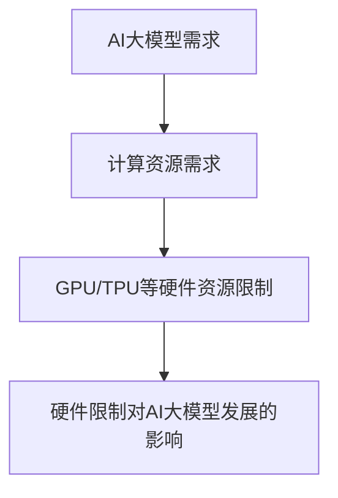

#### 1.2 硬件加速技术在AI大模型中的应用

为了缓解硬件限制带来的问题，研究人员开发了多种硬件加速技术，这些技术能够显著提高AI大模型的训练和推理效率。

**1.2.1 硬件加速技术概述**

常见的硬件加速技术包括GPU加速、TPU加速以及其他一些专用硬件加速器。以下是一些具体的硬件加速技术：

1. **GPU加速**：GPU具有高度并行处理能力，适用于大规模矩阵运算和深度学习模型的训练。
2. **TPU加速**：TPU是专门为深度学习设计的硬件加速器，具有高吞吐量和低延迟。
3. **其他硬件加速器**：如FPGA、ASIC等，它们可以根据特定的计算需求进行定制化设计。

**1.2.2 硬件加速技术与AI大模型的联系**

为了更直观地展示硬件加速技术如何与AI大模型联系，我们可以使用Mermaid绘制以下流程图：

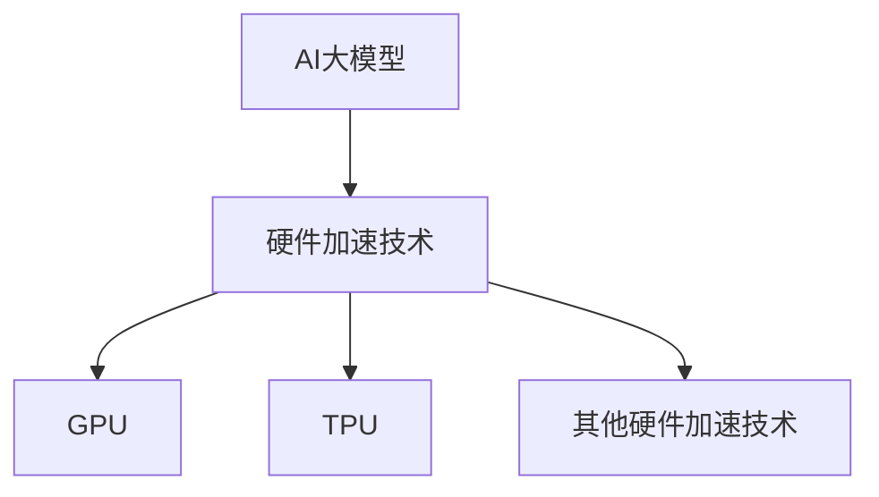

#### 1.3 硬件限制与AI大模型的未来发展方向

未来硬件技术的发展将为AI大模型带来新的机遇和挑战。以下是一些未来硬件趋势及其对AI大模型的影响：

**1.3.1 未来硬件趋势对AI大模型发展的影响**

1. **量子计算**：量子计算具有超强的计算能力，有望显著提高AI大模型的训练效率和性能。
2. **神经形态硬件**：神经形态硬件模仿人脑的计算方式，具有低功耗和高效率的特点，可能成为AI大模型的重要硬件基础。
3. **其他硬件趋势**：如集成光路计算、新型存储技术等，也可能对AI大模型的发展产生深远影响。

**1.3.3 联系与流程图**

为了更直观地展示未来硬件趋势与AI大模型的联系，我们可以使用Mermaid绘制以下流程图：

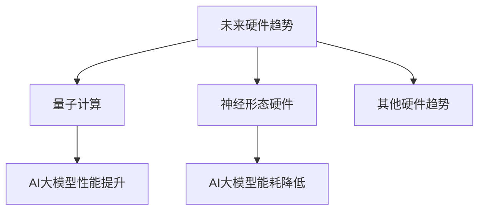

### 第二部分：硬件限制对AI大模型关键技术的影响

#### 第2章：硬件限制对AI大模型核心技术的具体影响

在本章中，我们将详细探讨硬件限制如何影响AI大模型的关键技术，包括深度学习算法、机器学习模型训练效率以及神经网络结构设计。

#### 2.1 硬件限制对深度学习算法的影响

深度学习算法是AI大模型的核心技术之一。然而，深度学习算法对硬件资源有着高度依赖性，特别是GPU和TPU等高性能计算设备。

**2.1.1 深度学习算法的硬件依赖性**

深度学习算法中的许多操作，如矩阵乘法、卷积运算等，可以通过GPU进行高度并行处理，从而大大提高计算效率。GPU具有大量的计算单元和高速内存，能够同时处理多个任务，非常适合深度学习算法。

**2.1.2 硬件限制对深度学习算法的影响**

硬件限制对深度学习算法的影响主要体现在以下几个方面：

1. **计算资源限制**：硬件资源的限制可能导致算法无法在预定时间内完成训练，从而延长研发周期。
2. **内存占用限制**：深度学习模型通常需要大量的内存来存储中间结果和模型参数，硬件内存限制可能导致模型需要采用特殊的优化策略，如参数压缩、模型剪枝等。
3. **性能瓶颈**：在某些情况下，硬件性能可能成为算法性能的瓶颈，特别是当算法需要进行大量复杂运算时。

**2.1.3 联系与流程图**

为了更直观地展示深度学习算法与硬件资源的关系，我们可以使用Mermaid绘制以下流程图：

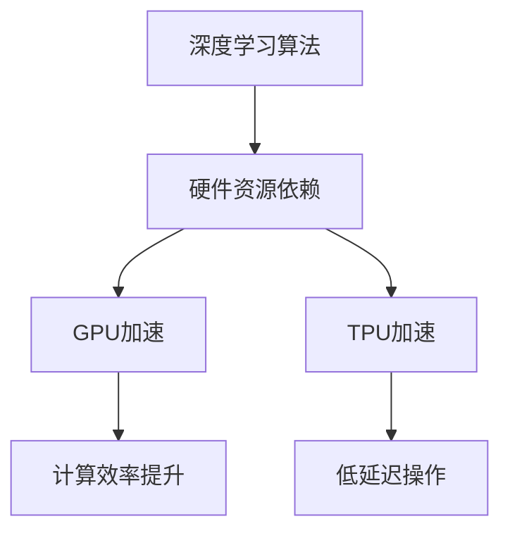

**2.1.4 核心算法原理讲解**

下面，我们使用伪代码详细阐述深度学习算法的基本原理：

```python
# 深度学习算法伪代码示例
initialize_parameters()
for each epoch do
    for each batch do
        compute_forward_pass(batch)
        compute_loss(batch)
        compute_backward_pass(batch)
        update_parameters()
    end for
end for
```

#### 2.2 硬件限制对机器学习模型训练效率的影响

机器学习模型的训练效率是评估模型性能的重要指标。硬件限制直接影响模型的训练效率，特别是在大规模数据集和复杂模型训练过程中。

**2.2.1 训练效率与硬件资源的关系**

硬件资源的充足与否直接影响模型训练的效率和速度。以下是一些关键因素：

1. **计算能力**：硬件的计算能力决定了模型训练的并行度，即可以在多长时间内完成一次迭代。
2. **存储容量**：硬件的存储容量决定了可以存储的数据量和中间结果，从而影响模型的训练速度。
3. **内存带宽**：内存带宽决定了数据传输速度，影响模型的计算效率。

**2.2.2 硬件限制对训练效率的影响**

硬件限制对机器学习模型训练效率的影响主要体现在以下几个方面：

1. **训练时间延长**：硬件资源不足可能导致模型训练时间显著延长，从而影响研发周期。
2. **内存溢出**：在训练过程中，模型参数和数据可能会超过硬件内存限制，导致训练失败或内存溢出。
3. **计算精度降低**：硬件性能不足可能导致计算精度降低，影响模型效果。

**2.2.3 数学模型与公式**

为了更直观地展示硬件资源与训练效率的关系，我们可以使用以下数学模型和公式：

$$
\text{training\_time} = \frac{\text{data\_size} \times \text{model\_complexity}}{\text{hardware\_resource}}
$$

其中，\( \text{training\_time} \) 表示模型训练时间，\( \text{data\_size} \) 表示数据集大小，\( \text{model\_complexity} \) 表示模型复杂度，\( \text{hardware\_resource} \) 表示硬件资源。

**2.2.4 联系与流程图**

为了更直观地展示硬件资源与机器学习模型训练效率的关系，我们可以使用Mermaid绘制以下流程图：

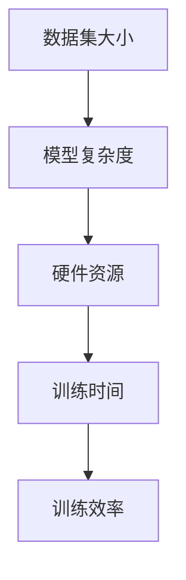

#### 2.3 硬件限制对神经网络结构设计的指导

神经网络结构设计是AI大模型开发的重要环节。硬件限制对神经网络结构的选择和设计有着重要的影响。

**2.3.1 硬件限制对神经网络结构选择的影响**

硬件限制直接影响神经网络结构的选择，特别是在模型大小、层深和参数数量等方面。以下是一些关键因素：

1. **模型大小**：硬件内存限制要求研究人员选择较小的模型，从而减少内存占用。
2. **层深**：较深的神经网络可能需要更多的计算资源，硬件限制可能要求研究人员选择较浅的网络结构。
3. **参数数量**：大量的参数可能导致内存溢出，硬件限制要求研究人员采用参数较少的模型。

**2.3.2 举例说明**

例如，在图像识别任务中，由于GPU内存限制，研究人员可能需要采用分层结构来减少模型大小，并采用模型剪枝技术来优化模型。

**2.3.3 联系与流程图**

为了更直观地展示硬件限制对神经网络结构设计的指导，我们可以使用Mermaid绘制以下流程图：

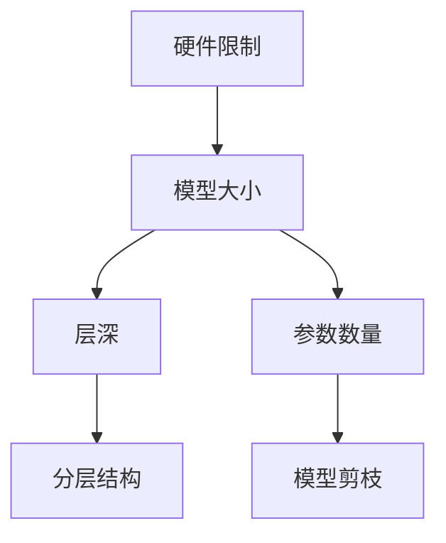

### 第三部分：硬件限制下的AI大模型优化策略

#### 第3章：硬件限制下的AI大模型优化策略

在硬件限制下，为了提高AI大模型的训练效率和性能，研究人员提出了多种优化策略。以下将详细介绍几种常见的优化策略，包括模型压缩技术、并行与分布式训练、能效优化策略等。

#### 3.1 模型压缩技术

模型压缩技术是应对硬件限制的有效手段之一，其主要目标是通过减少模型大小来降低硬件资源的消耗。

**3.1.1 模型压缩技术概述**

模型压缩技术主要包括以下几种方法：

1. **量化**：将模型中的浮点数参数转换为较低精度的整数，从而减少模型大小。
2. **剪枝**：去除模型中不重要的权重或神经元，从而减少模型参数数量。
3. **蒸馏**：将一个较大的模型（教师模型）的知识传递给一个较小的模型（学生模型），从而在保持性能的同时减少模型大小。

**3.1.2 具体方法**

下面，我们使用伪代码详细阐述模型压缩技术：

```python
# 量化技术伪代码示例
quantize_weights(model, precision)
quantize_inputs(model, precision)
```

**3.1.3 联系与流程图**

为了更直观地展示模型压缩技术的应用，我们可以使用Mermaid绘制以下流程图：

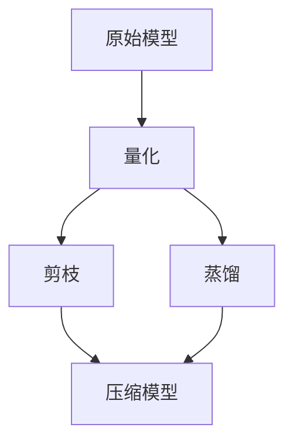

#### 3.2 并行与分布式训练

并行与分布式训练是提高AI大模型训练效率的重要方法，其核心思想是通过将训练任务分配到多个计算节点上，从而利用多个硬件资源同时进行训练。

**3.2.1 并行与分布式训练的优势**

并行与分布式训练具有以下优势：

1. **加速训练速度**：通过并行计算，可以显著减少模型训练时间。
2. **提高训练效率**：分布式训练可以充分利用多个计算节点的资源，提高训练效率。
3. **降低硬件成本**：通过分布式训练，可以减少对单个高性能硬件设备的依赖，从而降低硬件成本。

**3.2.2 联系与流程图**

为了更直观地展示并行与分布式训练的过程，我们可以使用Mermaid绘制以下流程图：

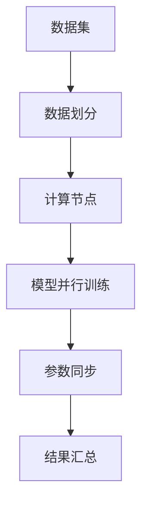

#### 3.3 能效优化策略

能效优化策略旨在通过优化算法和硬件配置，降低AI大模型的能耗，提高能效比。

**3.3.1 能效优化的方法与挑战**

能效优化的方法主要包括：

1. **模型优化**：通过优化模型结构、参数和算法，降低计算复杂度和能耗。
2. **硬件优化**：选择合适的硬件设备和优化硬件配置，以提高能效。
3. **功耗管理**：通过调整硬件设备的功耗策略，降低能耗。

能效优化面临的挑战主要包括：

1. **计算精度**：降低能耗可能会牺牲计算精度，需要在能耗和精度之间找到平衡点。
2. **硬件兼容性**：不同硬件设备的功耗管理策略不同，需要保证优化方案适用于多种硬件平台。
3. **优化成本**：优化方案的开发和实施可能需要较高的成本，需要在成本和效益之间进行权衡。

**3.3.2 具体案例**

例如，通过优化模型结构和选择合适的硬件设备，可以显著降低AI大模型的能耗。以下是一个具体的能效优化案例：

```python
# 能效优化伪代码示例
optimize_model_structure(model)
select_optimized_hardware()
adjust_power_management策略()
```

**3.3.3 联系与流程图**

为了更直观地展示能效优化策略的应用，我们可以使用Mermaid绘制以下流程图：

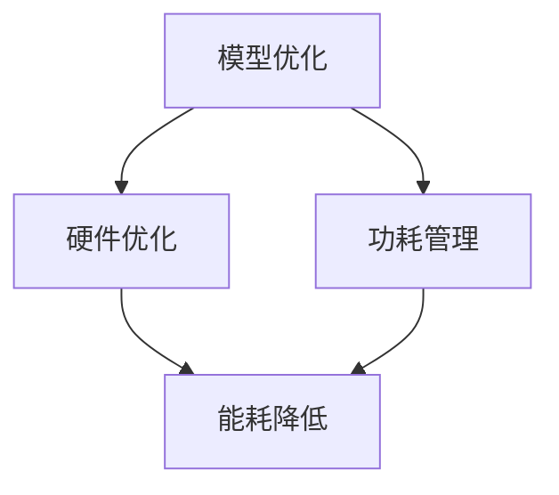

### 第四部分：硬件限制下的AI大模型应用实例

#### 第4章：硬件限制下的AI大模型应用案例

在本章中，我们将通过几个具体的应用实例，展示硬件限制下的AI大模型在实际项目中的应用情况。

#### 4.1 案例研究：自动驾驶中的AI大模型

自动驾驶技术是AI大模型应用的重要领域之一。AI大模型在自动驾驶系统中扮演着关键角色，如图像识别、环境感知和路径规划等。

**4.1.1 自动驾驶系统中的AI大模型应用**

在自动驾驶系统中，AI大模型主要用于处理大量的实时图像数据，从而实现车道线检测、障碍物识别和行人检测等功能。以下是一个具体的案例：

- **案例**：某自动驾驶公司开发了一种基于深度学习算法的自动驾驶系统，其中使用了大量AI大模型进行图像识别和物体检测。
- **挑战**：由于自动驾驶系统需要处理高分辨率的图像数据，对硬件性能有很高的要求。此外，系统需要在低延迟和高准确度之间找到平衡点。

**4.1.2 硬件限制与解决方案**

为了应对硬件限制，该公司采取了以下措施：

1. **硬件加速**：使用GPU和TPU等高性能硬件加速器，提高图像处理速度和准确性。
2. **模型压缩**：通过模型压缩技术，减少AI大模型的大小，降低硬件资源消耗。
3. **分布式训练**：将模型训练任务分布在多个计算节点上，提高训练效率。

**4.1.3 联系与流程图**

为了更直观地展示硬件限制与自动驾驶系统中的AI大模型应用，我们可以使用Mermaid绘制以下流程图：

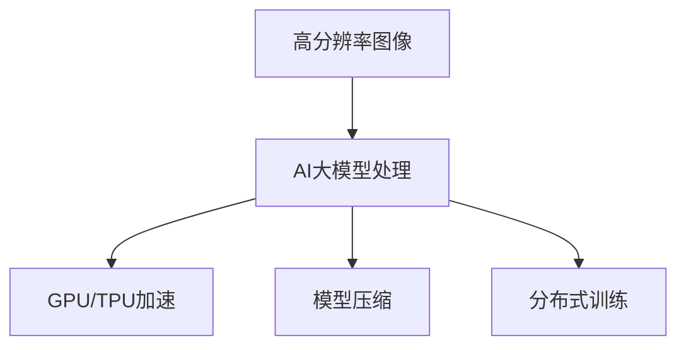

#### 4.2 案例研究：医疗图像分析中的AI大模型

医疗图像分析是AI大模型应用的另一个重要领域。AI大模型在医疗图像分析中可以辅助医生进行诊断和治疗方案制定。

**4.2.1 医疗图像分析中的AI大模型应用**

在医疗图像分析中，AI大模型主要用于图像识别和病灶检测。以下是一个具体的案例：

- **案例**：某医院使用AI大模型对CT扫描图像进行自动诊断，从而帮助医生快速识别肺炎病灶。
- **挑战**：由于医疗图像数据量大、精度要求高，对硬件性能有很高的要求。此外，医疗图像处理需要实时性和准确性。

**4.2.2 硬件限制与解决方案**

为了应对硬件限制，该医院采取了以下措施：

1. **硬件加速**：使用GPU和TPU等高性能硬件加速器，提高图像处理速度和准确性。
2. **模型压缩**：通过模型压缩技术，减少AI大模型的大小，降低硬件资源消耗。
3. **分布式训练**：将模型训练任务分布在多个计算节点上，提高训练效率。

**4.2.3 联系与流程图**

为了更直观地展示硬件限制与医疗图像分析中的AI大模型应用，我们可以使用Mermaid绘制以下流程图：

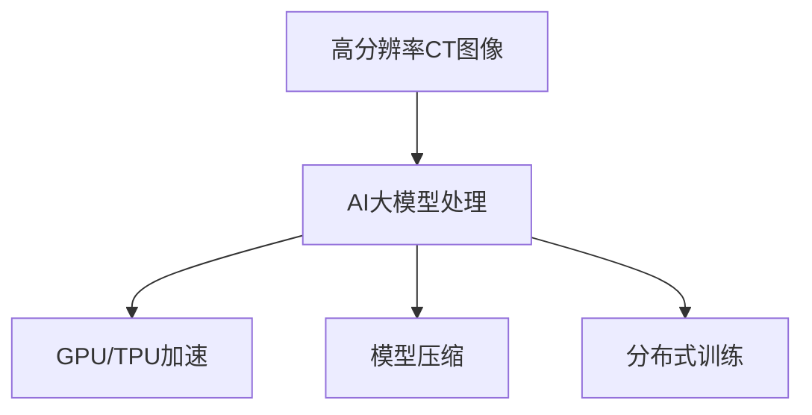

#### 4.3 案例研究：金融风控中的AI大模型

金融风控是AI大模型应用的另一个重要领域。AI大模型在金融风控中可以用于风险评估、欺诈检测和信用评估等。

**4.3.1 金融风控中的AI大模型应用**

在金融风控中，AI大模型主要用于处理大量的金融交易数据，从而识别潜在风险。以下是一个具体的案例：

- **案例**：某银行使用AI大模型对交易数据进行实时分析，从而识别欺诈交易并采取措施。
- **挑战**：由于金融交易数据量大、更新速度快，对硬件性能和实时性有很高的要求。此外，金融风控需要高准确度和低误报率。

**4.3.2 硬件限制与解决方案**

为了应对硬件限制，该银行采取了以下措施：

1. **硬件加速**：使用GPU和TPU等高性能硬件加速器，提高交易数据处理速度和准确性。
2. **模型压缩**：通过模型压缩技术，减少AI大模型的大小，降低硬件资源消耗。
3. **分布式训练**：将模型训练任务分布在多个计算节点上，提高训练效率。

**4.3.3 联系与流程图**

为了更直观地展示硬件限制与金融风控中的AI大模型应用，我们可以使用Mermaid绘制以下流程图：


### 第五部分：未来展望

#### 第5章：未来硬件技术对AI大模型发展的影响

在未来，随着硬件技术的不断发展，AI大模型将迎来新的机遇和挑战。以下将讨论量子计算、神经形态硬件等新一代硬件技术对AI大模型发展的影响。

#### 5.1 量子计算与AI大模型

量子计算是一种具有量子并行性的计算模型，其计算能力远远超过传统计算机。量子计算在AI大模型中的应用具有巨大的潜力。

**5.1.1 量子计算对AI大模型的影响**

1. **加速模型训练**：量子计算可以在极短时间内完成大规模矩阵运算，从而加速AI大模型的训练。
2. **优化模型设计**：量子计算可以用于优化AI大模型的参数和结构，从而提高模型性能。
3. **新型算法开发**：量子计算可以催生新型算法，如量子神经网络、量子深度学习等，为AI大模型的发展提供新思路。

**5.1.2 联系与流程图**

为了更直观地展示量子计算与AI大模型的联系，我们可以使用Mermaid绘制以下流程图：

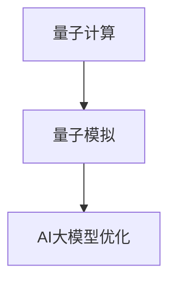

#### 5.2 神经形态硬件与AI大模型

神经形态硬件是一种模仿人脑计算方式的硬件，其具有低功耗和高效率的特点，对于AI大模型的发展具有重要影响。

**5.2.1 神经形态硬件对AI大模型的影响**

1. **低功耗计算**：神经形态硬件可以显著降低AI大模型的能耗，提高能效比。
2. **高效数据处理**：神经形态硬件可以高效地处理大量数据，提高AI大模型的训练和推理速度。
3. **新型神经网络设计**：神经形态硬件可以支持新型神经网络设计，如仿生神经网络、脉冲神经网络等，为AI大模型的发展提供新思路。

**5.2.2 联系与流程图**

为了更直观地展示神经形态硬件与AI大模型的联系，我们可以使用Mermaid绘制以下流程图：

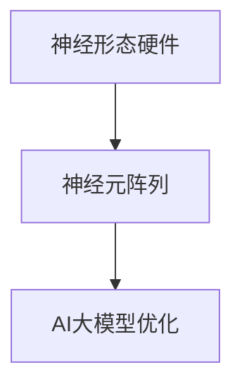

#### 5.3 新一代硬件技术的趋势与挑战

在未来，随着新一代硬件技术的不断发展，AI大模型将面临新的趋势和挑战。

**5.3.1 新一代硬件技术的趋势**

1. **集成光路计算**：集成光路计算具有高带宽、低延迟的特点，有望成为AI大模型计算的重要基础。
2. **新型存储技术**：新型存储技术，如3D NAND闪存、新型存储器等，将提高AI大模型的存储效率和容量。
3. **能效优化**：随着硬件技术的发展，能效优化将成为AI大模型发展的关键方向。

**5.3.2 新一代硬件技术的挑战**

1. **硬件兼容性**：新一代硬件技术需要与现有的软件生态系统兼容，从而保证AI大模型的应用。
2. **成本控制**：新一代硬件技术的研发和部署成本较高，需要有效控制成本，使其在经济上可行。
3. **技术突破**：新一代硬件技术需要不断突破技术瓶颈，以满足AI大模型的需求。

**5.3.3 联系与流程图**

为了更直观地展示新一代硬件技术发展趋势与AI大模型的联系，我们可以使用Mermaid绘制以下流程图：

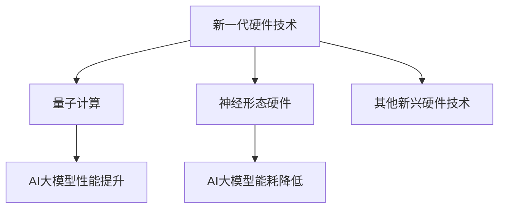

### 附录

#### 附录A：硬件限制下AI大模型开发资源

在硬件限制下，为了高效开发AI大模型，研究人员可以利用以下开发资源：

**A.1 硬件限制下AI大模型开发工具**

1. **NVIDIA CUDA**：NVIDIA CUDA是一种并行计算平台和编程模型，适用于GPU加速。
2. **AMD ROCm**：AMD ROCm是AMD推出的开放计算语言和开发工具包，适用于GPU和APU加速。
3. **TensorFlow GPU支持**：TensorFlow提供了GPU加速功能，适用于深度学习模型的训练和推理。
4. **PyTorch CUDA支持**：PyTorch提供了CUDA支持，适用于GPU加速。

**A.2 硬件限制下AI大模型优化技巧**

1. **GPU内存管理技巧**：通过合理管理GPU内存，可以优化模型训练性能。
2. **数据并行与模型并行策略**：通过并行训练策略，可以充分利用硬件资源，提高训练效率。
3. **量化与剪枝技术**：通过量化与剪枝技术，可以减少模型大小，降低硬件资源消耗。
4. **自动混合精度训练**：自动混合精度训练可以平衡计算精度和训练速度，提高模型性能。

**A.3 硬件限制下AI大模型开源项目**

1. **TensorFlow Model Optimization Toolkit**：TensorFlow Model Optimization Toolkit提供了模型压缩和优化工具，适用于硬件限制下的AI大模型开发。
2. **PyTorch Mobile**：PyTorch Mobile是一个用于移动设备上部署AI大模型的框架。
3. **ONNX Runtime**：ONNX Runtime是一个跨平台的AI推理引擎，支持多种硬件平台和编程语言。

### 作者信息

作者：AI天才研究院/AI Genius Institute & 禅与计算机程序设计艺术 /Zen And The Art of Computer Programming

