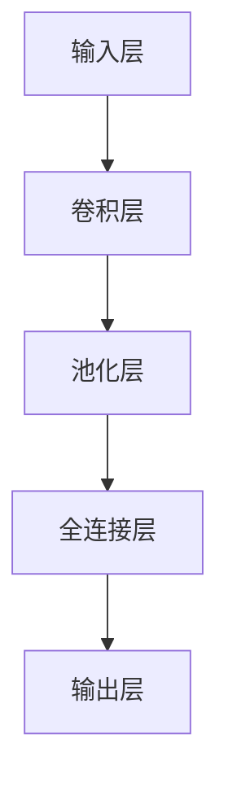

                 

# 《神经网络 (Neural Network)》

## 关键词

- 神经网络
- 反向传播
- 卷积神经网络（CNN）
- 循环神经网络（RNN）
- 深度学习框架
- 自然语言处理
- 图像识别
- 自动驾驶
- 推荐系统
- 医疗诊断
- 金融风控

## 摘要

本文将从神经网络的基础理论出发，逐步深入探讨其基本架构、学习算法以及在实际应用中的各个方面。首先，我们将回顾神经网络的起源与发展，了解人工神经网络的基本概念。接着，我们将详细分析神经网络的基本架构，包括单层感知机、多层感知机和神经元的数学模型。随后，我们将讲解神经网络的学习算法，特别是反向传播算法和优化算法。然后，本文将重点关注神经网络在图像识别和自然语言处理中的应用，通过卷积神经网络（CNN）和循环神经网络（RNN）的讲解，深入探讨其在这些领域的应用。接下来，我们将介绍深度学习框架，如TensorFlow和PyTorch，以及神经网络的训练与优化方法。最后，本文将探讨神经网络在不同领域的应用实战，包括推荐系统、医疗诊断、金融风控和自动驾驶等。通过本文的详细讲解，读者将全面了解神经网络的原理、架构和应用。

## 《神经网络 (Neural Network)》目录大纲

### 第一部分：神经网络基础理论

#### 第1章：神经网络的起源与发展

##### 1.1 神经网络的起源

- **神经元与生物神经系统的联系**
- **神经网络的早期历史**

##### 1.2 神经网络的发展历程

- **人工神经网络的基本概念**
- **神经网络在不同领域的应用**

#### 第2章：神经网络的基本架构

##### 2.1 单层感知机

- **单层感知机的定义**
- **单层感知机的工作原理**

##### 2.2 多层感知机

- **多层感知机的结构**
- **多层感知机的工作原理**

##### 2.3 神经元的数学模型

- **神经元激活函数**
- **神经网络中的权重和偏置**

#### 第3章：神经网络的学习算法

##### 3.1 反向传播算法

- **反向传播算法的基本原理**
- **反向传播算法的详细步骤**

##### 3.2 学习率与优化算法

- **学习率的选择**
- **常见的优化算法**

#### 第4章：神经网络在图像识别中的应用

##### 4.1 卷积神经网络（CNN）

- **CNN的结构**
- **CNN的工作原理**

##### 4.2 卷积神经网络在图像识别中的应用

- **图像预处理**
- **图像识别实战**

#### 第5章：神经网络在自然语言处理中的应用

##### 5.1 循环神经网络（RNN）

- **RNN的结构**
- **RNN的工作原理**

##### 5.2 长短期记忆网络（LSTM）

- **LSTM的结构**
- **LSTM的工作原理**

##### 5.3 语言模型与序列标注

- **语言模型的基本概念**
- **序列标注的应用**

### 第二部分：神经网络的深度学习框架

#### 第6章：深度学习框架介绍

##### 6.1 深度学习框架概述

- **深度学习框架的选择**
- **常见的深度学习框架**

##### 6.2 TensorFlow与PyTorch

- **TensorFlow的基本使用**
- **PyTorch的基本使用**

#### 第7章：神经网络的训练与优化

##### 7.1 数据预处理

- **数据清洗与归一化**
- **数据增强**

##### 7.2 神经网络的训练

- **训练过程的监控**
- **调整模型参数**

##### 7.3 神经网络的优化

- **模型调参**
- **模型压缩**

### 第三部分：神经网络的应用实战

#### 第8章：神经网络在推荐系统中的应用

##### 8.1 推荐系统简介

- **推荐系统的工作原理**
- **推荐系统的评估指标**

##### 8.2 神经网络在推荐系统中的应用

- **用户行为数据建模**
- **推荐算法的实现**

#### 第9章：神经网络在医疗诊断中的应用

##### 9.1 医疗诊断概述

- **医学影像数据处理**
- **医学诊断的挑战与机遇**

##### 9.2 神经网络在医疗诊断中的应用

- **疾病识别与分类**
- **医学图像分割**

#### 第10章：神经网络在金融风控中的应用

##### 10.1 金融风控概述

- **金融风险管理的目标**
- **金融风险的评估方法**

##### 10.2 神经网络在金融风控中的应用

- **信用评分模型**
- **风险预警系统**

#### 第11章：神经网络在自动驾驶中的应用

##### 11.1 自动驾驶概述

- **自动驾驶的技术框架**
- **自动驾驶的发展趋势**

##### 11.2 神经网络在自动驾驶中的应用

- **感知系统与路径规划**
- **自动驾驶决策与控制**

## 第一部分：神经网络基础理论

### 第1章：神经网络的起源与发展

#### 1.1 神经网络的起源

神经网络的思想源于生物神经系统的结构和功能。生物神经系统中，神经元是信息处理的基本单元，它们通过突触连接形成复杂的神经网络，从而实现感知、思考和决策等功能。人工神经网络（Artificial Neural Network，ANN）正是受生物神经系统的启发，模拟生物神经系统的工作方式，通过大量的神经元和突触连接来实现信息处理和预测。

神经网络的早期历史可以追溯到1940年代，当时心理学家McCulloch和数学家Pitts提出了神经元的数学模型，即MCP模型。MCP模型是基于简单的“全或无”原理，当一个神经元的输入总和超过某个阈值时，它将产生一个输出信号，否则不产生输出信号。这个模型奠定了人工神经网络的基础。

随着计算机技术的发展，人工神经网络在1950年代得到了进一步的发展。1958年，Rosenblatt提出了感知机（Perceptron）模型，这是一种具有单层结构的神经网络，用于分类任务。然而，感知机模型存在局限性，无法解决非线性问题。为了克服这一限制，1958年，Hebb提出了Hebb学习规则，这是一种基于神经网络中权重调整的学习方法。

在1960年代，由于计算能力的限制和理论上的困难，神经网络的研究一度陷入低谷。然而，1980年代以来，随着计算机性能的显著提升和深度学习技术的发展，神经网络的研究再次兴起。特别是1986年，Rumelhart、Hinton和Williams提出了反向传播算法（Backpropagation Algorithm），这一算法使得多层感知机的训练成为可能，推动了神经网络在各个领域的应用。

#### 1.2 神经网络的发展历程

人工神经网络的发展历程可以分为以下几个阶段：

1. **单层感知机阶段（1958-1969）**

单层感知机是最早的神经网络模型，它由一组输入节点、一组输出节点以及连接它们的权重组成。感知机主要用于二分类问题，通过学习输入数据和输出标签之间的关系来进行分类。然而，单层感知机无法处理非线性问题，这在一定程度上限制了其应用范围。

2. **多层感知机阶段（1969-1986）**

为了解决单层感知机的局限性，研究者提出了多层感知机（Multilayer Perceptron，MLP）。多层感知机通过增加隐含层，能够处理非线性问题，并在图像识别、语音识别等领域取得了显著成果。1986年，反向传播算法的提出使得多层感知机的训练成为可能，这一算法通过反向传播误差来更新网络中的权重和偏置，从而实现网络的优化。

3. **深度神经网络阶段（1986至今）**

随着计算能力的提升和大数据技术的发展，深度神经网络（Deep Neural Network，DNN）逐渐兴起。深度神经网络通过增加网络的层数，能够自动提取更复杂的特征，并在图像识别、语音识别、自然语言处理等领域取得了突破性的成果。特别是2012年，Hinton等人提出的深度卷积神经网络（Deep Convolutional Neural Network，DCNN）在ImageNet图像识别比赛中取得了优异的成绩，标志着深度学习时代的到来。

#### 1.2.1 人工神经网络的基本概念

人工神经网络是一种由大量简单神经元组成的复杂系统，通过学习和模拟生物神经系统的结构和功能，实现对复杂数据的建模和预测。人工神经网络主要包括以下几个基本概念：

1. **神经元**

神经元是人工神经网络的基本处理单元，类似于生物神经系统中神经元的功能。神经元接收输入信号，通过加权求和产生输出信号。神经元的基本数学模型可以表示为：

\[ z = \sum_{i=1}^{n} w_i x_i + b \]

其中，\( w_i \)表示权重，\( x_i \)表示输入值，\( b \)表示偏置。神经元输出信号通过激活函数进行非线性变换，常用的激活函数包括Sigmoid函数、Tanh函数和ReLU函数。

2. **网络结构**

人工神经网络由多个神经元组成，这些神经元按照特定的层次结构进行连接。网络结构可以分为输入层、隐含层和输出层。输入层接收外部输入数据，隐含层对输入数据进行特征提取和变换，输出层产生最终的输出结果。

3. **学习算法**

人工神经网络通过学习算法来调整网络中的权重和偏置，从而实现对数据的建模和预测。常用的学习算法包括梯度下降算法、反向传播算法和Hebb学习规则。其中，反向传播算法是一种基于梯度下降的优化算法，通过反向传播误差来更新网络中的权重和偏置。

4. **训练过程**

人工神经网络的训练过程包括以下几个步骤：

（1）初始化网络参数，包括权重和偏置。

（2）前向传播：将输入数据传递到网络中，计算网络的输出结果。

（3）计算损失函数：将输出结果与期望结果进行比较，计算损失函数值。

（4）反向传播：将损失函数关于网络参数的梯度传递到前向传播阶段，更新网络参数。

（5）重复上述步骤，直到网络参数收敛，即损失函数值不再显著下降。

#### 1.2.2 神经网络在不同领域的应用

神经网络在不同领域有着广泛的应用，下面列举几个典型领域：

1. **图像识别**

神经网络在图像识别领域具有显著的优势。通过深度卷积神经网络（DCNN），神经网络可以自动提取图像中的特征，实现对图像的分类、分割和检测。在ImageNet图像识别比赛中，DCNN取得了优异的成绩，推动了图像识别技术的快速发展。

2. **语音识别**

语音识别是将语音信号转换为文本的过程。神经网络在语音识别领域具有强大的能力，通过深度神经网络（DNN）和循环神经网络（RNN），神经网络可以学习语音信号中的特征，实现对语音的识别和理解。

3. **自然语言处理**

自然语言处理（Natural Language Processing，NLP）是人工智能的重要分支，涉及文本的生成、理解、处理和翻译等任务。神经网络在NLP领域有着广泛的应用，通过循环神经网络（RNN）和长短期记忆网络（LSTM），神经网络可以学习语言中的特征，实现文本的分类、情感分析、机器翻译等任务。

4. **推荐系统**

推荐系统是通过对用户行为和兴趣的分析，为用户推荐感兴趣的内容或产品。神经网络在推荐系统中有着广泛的应用，通过深度学习算法，神经网络可以自动提取用户的行为特征和兴趣特征，实现高效的推荐。

5. **医疗诊断**

医疗诊断是将医学影像数据进行分析，诊断疾病的过程。神经网络在医疗诊断领域具有显著的优势，通过深度卷积神经网络（DCNN），神经网络可以自动提取医学影像中的特征，实现对疾病的分类和检测。

6. **金融风控**

金融风控是通过对金融数据的分析和预测，识别潜在风险的过程。神经网络在金融风控领域有着广泛的应用，通过深度学习算法，神经网络可以自动提取金融数据中的特征，实现对信用评分、风险预警等任务的预测。

#### 1.2.3 神经网络的优缺点

神经网络作为一种强大的机器学习模型，具有以下几个优点：

1. **强大的非线性建模能力**

神经网络通过多层结构可以自动提取输入数据中的非线性特征，实现对复杂数据的建模和预测。

2. **自适应性和泛化能力**

神经网络通过学习算法可以自适应地调整网络中的权重和偏置，从而实现对未知数据的建模和预测，具有较高的泛化能力。

3. **多任务学习**

神经网络可以通过共享权重和偏置，实现多任务学习，从而提高模型的效率和效果。

然而，神经网络也存在一些缺点：

1. **计算复杂度高**

神经网络需要大量的计算资源和时间进行训练，特别是在深度神经网络中，计算复杂度更高。

2. **对数据质量要求高**

神经网络对数据质量要求较高，数据中的噪声和异常值会对模型的性能产生较大影响。

3. **难以解释**

神经网络的学习过程是一种复杂的非线性过程，难以对模型的结果进行解释，这在某些应用场景中可能会带来一定的困扰。

### 第2章：神经网络的基本架构

#### 2.1 单层感知机

单层感知机（Single-Layer Perceptron，SLP）是最早的人工神经网络模型之一，由一组输入节点、一组输出节点以及连接它们的权重组成。单层感知机主要用于二分类问题，即输入数据分为正类和负类。

单层感知机的工作原理可以简单描述为：每个输入节点接收一个输入值，通过加权求和产生一个中间值，然后通过激活函数产生输出值。如果输出值大于某个阈值，则分类为正类，否则分类为负类。

数学上，单层感知机的输出可以表示为：

\[ y = \text{激活函数}(\sum_{i=1}^{n} w_i x_i + b) \]

其中，\( y \)表示输出值，\( w_i \)表示权重，\( x_i \)表示输入值，\( b \)表示偏置，激活函数通常使用Sigmoid函数。

单层感知机的优点在于实现简单，计算量小，适用于一些简单的二分类问题。然而，单层感知机存在以下局限性：

1. **无法处理非线性问题**

单层感知机只能处理线性可分的数据，对于非线性可分的数据，需要引入多层感知机。

2. **过学习问题**

单层感知机容易发生过学习，即模型在训练数据上表现良好，但在测试数据上表现较差。这是由于单层感知机的结构较为简单，无法很好地捕捉数据中的非线性特征。

3. **性能不稳定**

单层感知机的性能受参数初始化和权重调整的影响较大，不同初始化和调整方法可能导致模型性能不稳定。

#### 2.2 多层感知机

多层感知机（Multilayer Perceptron，MLP）是在单层感知机的基础上增加隐含层得到的。多层感知机通过多层结构可以更好地捕捉数据中的非线性特征，从而提高模型的性能。

多层感知机的结构可以分为输入层、隐含层和输出层。输入层接收输入数据，隐含层对输入数据进行特征提取和变换，输出层产生最终的输出结果。隐含层可以有多个，每个隐含层都可以通过激活函数产生非线性变换。

数学上，多层感知机的输出可以表示为：

\[ y = \text{激活函数}(\sum_{i=1}^{n} w_i x_i + b) \]

其中，\( y \)表示输出值，\( w_i \)表示权重，\( x_i \)表示输入值，\( b \)表示偏置，激活函数通常使用Sigmoid函数。

多层感知机的优点包括：

1. **强大的非线性建模能力**

多层感知机通过增加隐含层，可以更好地捕捉数据中的非线性特征，从而提高模型的性能。

2. **适用于各种复杂任务**

多层感知机可以用于各种复杂任务，如分类、回归和聚类等。

3. **自适应性和泛化能力**

多层感知机通过学习算法可以自适应地调整网络中的权重和偏置，从而实现对未知数据的建模和预测，具有较高的泛化能力。

然而，多层感知机也存在以下局限性：

1. **计算复杂度高**

多层感知机需要大量的计算资源和时间进行训练，特别是在深度神经网络中，计算复杂度更高。

2. **对数据质量要求高**

多层感知机对数据质量要求较高，数据中的噪声和异常值会对模型的性能产生较大影响。

3. **难以解释**

多层感知机的学习过程是一种复杂的非线性过程，难以对模型的结果进行解释，这在某些应用场景中可能会带来一定的困扰。

#### 2.3 神经元的数学模型

神经元是人工神经网络的基本处理单元，其数学模型可以描述为：

\[ z = \sum_{i=1}^{n} w_i x_i + b \]

其中，\( z \)表示神经元输出，\( w_i \)表示权重，\( x_i \)表示输入值，\( b \)表示偏置。神经元输出通常通过激活函数进行非线性变换，常用的激活函数包括Sigmoid函数、Tanh函数和ReLU函数。

1. **Sigmoid函数**

Sigmoid函数是最常用的激活函数之一，其公式为：

\[ \sigma(x) = \frac{1}{1 + e^{-x}} \]

Sigmoid函数具有以下特点：

- **非线性性**：Sigmoid函数可以引入非线性变换，从而提高模型的性能。
- **平滑性**：Sigmoid函数的输出范围在(0, 1)之间，具有平滑性，可以减少梯度消失问题。
- **梯度消失**：当输入值较大或较小时，Sigmoid函数的导数接近于0，这可能导致梯度消失问题。

2. **Tanh函数**

Tanh函数是对Sigmoid函数的改进，其公式为：

\[ \text{Tanh}(x) = \frac{e^x - e^{-x}}{e^x + e^{-x}} \]

Tanh函数具有以下特点：

- **非线性性**：Tanh函数可以引入非线性变换，从而提高模型的性能。
- **平滑性**：Tanh函数的输出范围在(-1, 1)之间，具有平滑性，可以减少梯度消失问题。
- **梯度消失**：Tanh函数的导数不会出现接近于0的情况，因此不会出现梯度消失问题。

3. **ReLU函数**

ReLU函数（Rectified Linear Unit）是一种线性激活函数，其公式为：

\[ \text{ReLU}(x) = \max(0, x) \]

ReLU函数具有以下特点：

- **非线性性**：ReLU函数可以引入非线性变换，从而提高模型的性能。
- **梯度问题**：ReLU函数的导数在\( x > 0 \)时为1，在\( x < 0 \)时为0，这可以避免梯度消失问题。
- **稀疏性**：ReLU函数可以引入稀疏性，即大部分神经元输出为0，这有助于提高模型的训练速度。

#### 2.3.1 神经网络中的权重和偏置

在神经网络中，权重和偏置是重要的参数，它们通过学习算法进行调整，以优化模型的性能。

1. **权重**

权重是连接不同神经元之间的参数，用于传递输入信号。权重的值表示不同输入特征对输出的影响程度。在训练过程中，通过反向传播算法，根据误差梯度来调整权重，以降低损失函数值。

2. **偏置**

偏置是每个神经元内部的一个参数，用于调整神经元输出的阈值。偏置的值表示神经元激活阈值，即输入信号需要达到一定阈值才能产生输出。在训练过程中，同样通过反向传播算法，根据误差梯度来调整偏置。

权重和偏置的调整过程如下：

1. **前向传播**：将输入数据传递到网络中，通过权重和偏置计算每个神经元的输出。
2. **计算损失函数**：将输出结果与期望结果进行比较，计算损失函数值，如均方误差（MSE）或交叉熵（CrossEntropy）。
3. **计算梯度**：根据损失函数对网络参数求导，得到梯度值。
4. **反向传播**：将梯度传递到前向传播阶段，根据梯度值调整权重和偏置。
5. **更新参数**：根据调整规则，更新权重和偏置，以降低损失函数值。

通过多次迭代训练，网络中的权重和偏置逐渐调整，使得模型的性能逐渐提高。

### 第3章：神经网络的学习算法

#### 3.1 反向传播算法

反向传播算法（Backpropagation Algorithm）是神经网络学习算法的核心，通过计算输出误差，并反向传播误差到前一层，从而调整网络中的权重和偏置。

反向传播算法的基本原理如下：

1. **前向传播**：将输入数据传递到网络中，通过权重和偏置计算每个神经元的输出。假设当前层为第\( l \)层，则有：

   \[ a_l^{(j)} = \text{激活函数}(\sum_{i} w_{ij} a_{l-1}^{(i)} + b_j) \]

   其中，\( a_l^{(j)} \)表示第\( l \)层第\( j \)个神经元的输出。

2. **计算损失函数**：将输出结果与期望结果进行比较，计算损失函数值，如均方误差（MSE）或交叉熵（CrossEntropy）。假设当前层的损失函数为：

   \[ J = \frac{1}{2} \sum_{i} (\text{期望输出} - \text{实际输出})^2 \]

3. **计算梯度**：根据损失函数对网络参数求导，得到梯度值。假设第\( l \)层第\( j \)个神经元的输出梯度为：

   \[ \frac{\partial J}{\partial w_{ij}} = \frac{\partial J}{\partial a_l^{(j)}} \cdot \frac{\partial a_l^{(j)}}{\partial w_{ij}} \]

   \[ \frac{\partial J}{\partial b_j} = \frac{\partial J}{\partial a_l^{(j)}} \cdot \frac{\partial a_l^{(j)}}{\partial b_j} \]

4. **反向传播**：将梯度值从输出层反向传播到前一层，直到输入层。具体步骤如下：

   - 输出层：计算输出误差，即损失函数关于输出值的梯度：

     \[ \delta_{l}^{(j)} = \frac{\partial J}{\partial a_l^{(j)}} \]

   - 隐藏层：计算隐藏误差，即损失函数关于隐藏层输出的梯度：

     \[ \delta_{l-1}^{(j)} = \frac{\partial J}{\partial a_{l-1}^{(j)}} \cdot \text{激活函数的导数}(\sum_{i} w_{ij} a_l^{(i)} + b_j) \]

   - 更新权重和偏置：根据梯度值，更新当前层的权重和偏置：

     \[ w_{ij} = w_{ij} - \alpha \cdot \frac{\partial J}{\partial w_{ij}} \]

     \[ b_j = b_j - \alpha \cdot \frac{\partial J}{\partial b_j} \]

   其中，\( \alpha \)表示学习率。

5. **重复步骤**：重复上述步骤，直到网络参数收敛，即损失函数值不再显著下降。

#### 3.2 学习率与优化算法

学习率（Learning Rate）是神经网络学习过程中重要的参数，用于调整权重和偏置的更新步长。学习率的选择对模型的训练效果和收敛速度有重要影响。

1. **学习率的选择**

   - **太大**：学习率太大可能导致网络参数更新过快，导致模型无法收敛，甚至出现过拟合现象。
   - **太小**：学习率太小可能导致网络参数更新过慢，收敛速度缓慢。

   通常，选择学习率时需要考虑以下几个因素：

   - **模型复杂度**：模型复杂度越高，学习率通常需要越小。
   - **数据分布**：数据分布越稀疏，学习率通常需要越小。
   - **任务目标**：任务目标不同，学习率的选择也有所不同。

   常见的学习率选择方法包括：

   - **固定学习率**：在训练过程中，学习率保持不变。
   - **自适应学习率**：根据模型的表现自动调整学习率，如AdaGrad、RMSprop和Adam等。

2. **优化算法**

   优化算法用于调整网络中的权重和偏置，以最小化损失函数。常见的优化算法包括梯度下降（Gradient Descent）、动量（Momentum）和自适应优化算法（如AdaGrad、RMSprop和Adam）。

   - **梯度下降（Gradient Descent）**

     梯度下降是一种最简单的优化算法，通过计算损失函数关于网络参数的梯度，并沿着梯度的反方向更新参数。梯度下降的基本步骤如下：

     1. 初始化网络参数。
     2. 计算当前参数下的损失函数值。
     3. 计算损失函数关于网络参数的梯度。
     4. 沿着梯度的反方向更新网络参数。
     5. 重复上述步骤，直到模型收敛。

     梯度下降的缺点包括：

     - **收敛速度较慢**：梯度下降每次更新参数时，只考虑当前点的梯度方向，无法充分利用历史梯度信息。
     - **易陷入局部最小值**：在非凸损失函数中，梯度下降可能陷入局部最小值。

   - **动量（Momentum）**

     动量是一种改进的优化算法，通过引入动量项，将当前梯度与前几步的梯度进行加权平均，从而加快收敛速度。动量的公式如下：

     \[ v = \gamma \cdot v + \alpha \cdot \nabla J(\theta) \]

     \[ \theta = \theta - v \]

     其中，\( v \)表示动量项，\( \gamma \)表示动量参数，\( \alpha \)表示学习率。

     动量的优点包括：

     - **加快收敛速度**：动量项可以减小每次更新参数时的随机波动，加快收敛速度。
     - **减小局部最小值的影响**：动量项可以避免梯度下降陷入局部最小值。

   - **自适应优化算法**

     自适应优化算法通过自适应调整学习率，从而提高模型的训练效果和收敛速度。常见的自适应优化算法包括AdaGrad、RMSprop和Adam。

     - **AdaGrad**

       AdaGrad通过自适应调整每个参数的学习率，使得每个参数的学习率与其梯度值的平方成正比。AdaGrad的公式如下：

       \[ g^2_t = \sum_{i=1}^{n} (\nabla J(\theta)_i)^2 \]

       \[ \theta_t = \theta_{t-1} - \alpha \cdot \frac{\nabla J(\theta)}{\sqrt{g^2_t}} \]

       - **RMSprop**

         RMSprop是对AdaGrad的改进，通过使用滑动平均来计算梯度值的平方和。RMSprop的公式如下：

         \[ g^2_t = \rho \cdot g^2_{t-1} + (1 - \rho) \cdot (\nabla J(\theta)_i)^2 \]

         \[ \theta_t = \theta_{t-1} - \alpha \cdot \frac{\nabla J(\theta)}{\sqrt{g^2_t}} \]

         其中，\( \rho \)表示滑动平均参数。

         RMSprop的优点包括：

         - **更好的适应性**：RMSprop通过自适应调整学习率，使得每个参数的学习率更适应其梯度值的变化。
         - **减少梯度消失问题**：RMSprop通过减小每个参数的学习率，可以有效减少梯度消失问题。

         - **Adam**

           Adam是RMSprop和动量的结合，通过自适应调整学习率，并引入一阶矩估计和二阶矩估计，从而提高模型的训练效果和收敛速度。Adam的公式如下：

           \[ m_t = \beta_1 \cdot m_{t-1} + (1 - \beta_1) \cdot \nabla J(\theta) \]

           \[ v_t = \beta_2 \cdot v_{t-1} + (1 - \beta_2) \cdot (\nabla J(\theta))^2 \]

           \[ \theta_t = \theta_{t-1} - \alpha \cdot \frac{m_t}{\sqrt{v_t} + \epsilon} \]

           其中，\( \beta_1 \)和\( \beta_2 \)分别为一阶矩估计和二阶矩估计的参数，\( \epsilon \)为常数。

           Adam的优点包括：

           - **更好的适应性**：Adam通过自适应调整学习率，使得每个参数的学习率更适应其梯度值的变化。
           - **良好的收敛性能**：Adam在处理稀疏数据和不同梯度的场景下，具有较好的收敛性能。

### 第4章：神经网络在图像识别中的应用

#### 4.1 卷积神经网络（CNN）

卷积神经网络（Convolutional Neural Network，CNN）是一种专门用于图像识别的神经网络模型，通过卷积层、池化层和全连接层实现对图像的特征提取和分类。

#### 4.1.1 CNN的结构

CNN的基本结构可以分为输入层、卷积层、池化层和全连接层。下面分别介绍每个层的作用和特点：

1. **输入层**

   输入层接收图像数据，将图像划分为多个像素点，每个像素点作为一个特征值输入到网络中。输入层的尺寸通常与图像的尺寸一致。

2. **卷积层**

   卷积层是CNN的核心层，通过卷积操作提取图像的局部特征。卷积层由多个卷积核（也称为滤波器）组成，每个卷积核负责提取图像中的一个特征。卷积操作的基本原理是将卷积核与输入图像进行点积操作，得到卷积结果。

   数学上，卷积层的输出可以表示为：

   \[ \text{卷积层输出} = \text{卷积核} \star \text{输入图像} \]

   其中，\( \star \)表示卷积操作。

3. **池化层**

   池化层用于对卷积层输出的特征进行降维处理，减少模型的参数数量，从而提高模型的训练效率和泛化能力。常见的池化操作包括最大池化和平均池化。

   最大池化（Max Pooling）的基本原理是将输入区域划分为多个不重叠的小区域，然后取每个小区域中的最大值作为输出值。最大池化可以保留图像中的重要特征，同时降低模型的参数数量。

   平均池化（Average Pooling）的基本原理是将输入区域划分为多个不重叠的小区域，然后取每个小区域中的平均值作为输出值。平均池化可以降低图像中的噪声，同时降低模型的参数数量。

4. **全连接层**

   全连接层是CNN的最后一层，将卷积层和池化层提取的特征进行融合，并通过全连接层进行分类。全连接层由多个神经元组成，每个神经元都与卷积层和池化层的神经元相连。

   数学上，全连接层的输出可以表示为：

   \[ \text{全连接层输出} = \text{权重} \cdot \text{卷积层输出} + \text{偏置} \]

   其中，\( \text{权重} \)和\( \text{偏置} \)是全连接层的参数。

#### 4.1.2 CNN的工作原理

CNN的工作原理可以分为以下几个步骤：

1. **输入图像预处理**

   将图像数据转换为灰度图像或RGB图像，并进行归一化处理，使得每个像素值的范围在0到1之间。

2. **卷积操作**

   对输入图像进行卷积操作，通过卷积层提取图像的局部特征。卷积层由多个卷积核组成，每个卷积核负责提取图像中的一个特征。卷积操作的基本原理是将卷积核与输入图像进行点积操作，得到卷积结果。

3. **激活函数**

   对卷积层的输出进行激活函数操作，常用的激活函数包括ReLU函数和Sigmoid函数。激活函数可以引入非线性变换，从而提高模型的性能。

4. **池化操作**

   对卷积层的输出进行池化操作，通过池化层降低模型的参数数量，从而提高模型的训练效率和泛化能力。常见的池化操作包括最大池化和平均池化。

5. **全连接层**

   将卷积层和池化层提取的特征进行融合，并通过全连接层进行分类。全连接层由多个神经元组成，每个神经元都与卷积层和池化层的神经元相连。

6. **输出结果**

   最后，全连接层输出分类结果，通常使用softmax函数进行概率分布。

#### 4.2 卷积神经网络在图像识别中的应用

卷积神经网络在图像识别领域具有广泛的应用，通过自动提取图像特征，实现图像的分类、分割和检测等任务。下面分别介绍卷积神经网络在图像识别中的应用：

1. **图像分类**

   图像分类是卷积神经网络最基本的应用之一，通过学习图像的特征，实现图像的分类任务。常见的图像分类模型包括LeNet、AlexNet、VGG、ResNet等。

   - **LeNet**

     LeNet是最早的卷积神经网络之一，由卷积层、池化层和全连接层组成，用于手写数字识别。

     

   - **AlexNet**

     AlexNet是2012年ImageNet竞赛中获胜的模型，引入了ReLU激活函数、Dropout正则化技术和数据增强方法，显著提高了图像分类的性能。

     

   - **VGG**

     VGG是2014年ImageNet竞赛中获胜的模型，通过增加网络的深度和宽度，提高了图像分类的性能。VGG模型由多个卷积层和池化层组成，结构简洁清晰。

     

   - **ResNet**

     ResNet是2015年ImageNet竞赛中获胜的模型，通过引入残差连接，解决了深度神经网络中的梯度消失问题，显著提高了图像分类的性能。ResNet模型由多个卷积层和池化层组成，结构复杂。

     

2. **图像分割**

   图像分割是将图像划分为不同的区域，实现图像的语义分割。卷积神经网络在图像分割中的应用主要包括全卷积网络（Fully Convolutional Network，FCN）和U-Net。

   - **全卷积网络（FCN）**

     FCN是一种卷积神经网络，通过全卷积操作实现图像的像素级别的分类。FCN模型由卷积层、池化层和全连接层组成，最后通过反卷积层输出分割结果。

     

   - **U-Net**

     U-Net是一种用于医学图像分割的卷积神经网络，结构类似于一个倒置的U形。U-Net模型由卷积层、池化层和反卷积层组成，可以同时实现图像的特征提取和分割。

     

3. **图像检测**

   图像检测是在图像中检测特定物体的位置和边界。卷积神经网络在图像检测中的应用主要包括区域建议网络（Region Proposal Network，RPN）和基于分割的检测模型。

   - **区域建议网络（RPN）**

     RPN是一种用于图像检测的卷积神经网络，通过全卷积操作生成区域建议框，并利用分类和回归操作对建议框进行优化。RPN模型由卷积层、池化层和全连接层组成。

     

   - **基于分割的检测模型**

     基于分割的检测模型通过将图像分割为多个区域，实现对物体的检测。常见的基于分割的检测模型包括Faster R-CNN、SSD和YOLO。

     - **Faster R-CNN**

       Faster R-CNN是一种基于分割的检测模型，通过ROI（Region of Interest）池化层和分类层实现图像检测。Faster R-CNN模型由卷积层、ROI池化层和全连接层组成。

       

     - **SSD**

       SSD（Single Shot MultiBox Detector）是一种单阶段检测模型，通过多个尺度的特征图实现多尺度物体的检测。SSD模型由卷积层、池化层和分类层组成。

       

     - **YOLO**

       YOLO（You Only Look Once）是一种基于分割的检测模型，通过将图像划分为多个网格，并在每个网格中预测物体的边界框和类别概率。YOLO模型由卷积层、分类层和回归层组成。

       

### 第5章：神经网络在自然语言处理中的应用

#### 5.1 循环神经网络（RNN）

循环神经网络（Recurrent Neural Network，RNN）是一种能够处理序列数据的神经网络模型。与传统的神经网络不同，RNN具有循环结构，能够记住前面时间步的信息，从而在处理序列数据时具有记忆能力。

#### 5.1.1 RNN的结构

RNN的基本结构可以分为输入层、隐藏层和输出层。下面分别介绍每个层的作用和特点：

1. **输入层**

   输入层接收序列数据，将序列数据转化为神经网络的输入。常见的输入序列包括单词序列、字符序列等。

2. **隐藏层**

   隐藏层是RNN的核心部分，包含多个时间步的神经元。隐藏层神经元通过递归连接，能够记住前面时间步的信息，从而实现序列数据的处理。隐藏层神经元的状态可以表示为：

   \[ h_t = \text{激活函数}(\text{权重} \cdot [h_{t-1}, x_t] + \text{偏置}) \]

   其中，\( h_t \)表示第\( t \)个时间步的隐藏层状态，\( x_t \)表示第\( t \)个时间步的输入，激活函数通常使用ReLU函数。

3. **输出层**

   输出层接收隐藏层的状态，生成最终的输出结果。常见的输出层包括分类层和回归层。分类层用于生成类别概率分布，回归层用于生成连续值。

   \[ y_t = \text{激活函数}(\text{权重} \cdot h_t + \text{偏置}) \]

   其中，\( y_t \)表示第\( t \)个时间步的输出，激活函数通常使用Softmax函数或线性函数。

#### 5.1.2 RNN的工作原理

RNN的工作原理可以分为以下几个步骤：

1. **输入序列预处理**

   将输入序列转化为神经网络的可处理格式，如单词序列转换为词向量。

2. **前向传播**

   将输入序列传递到RNN中，通过递归连接计算每个时间步的隐藏层状态。隐藏层状态可以表示为：

   \[ h_t = \text{激活函数}(\text{权重} \cdot [h_{t-1}, x_t] + \text{偏置}) \]

3. **计算输出**

   将隐藏层状态传递到输出层，生成最终的输出结果。输出结果可以是类别概率分布或连续值。

4. **反向传播**

   通过反向传播算法，根据输出结果与期望结果的误差，更新RNN的权重和偏置。

5. **迭代训练**

   重复上述步骤，直到模型收敛，即损失函数值不再显著下降。

#### 5.2 长短期记忆网络（LSTM）

长短期记忆网络（Long Short-Term Memory，LSTM）是RNN的一种改进模型，通过引入门控机制，能够有效解决RNN中的梯度消失和梯度爆炸问题，从而在处理长序列数据时具有更好的性能。

#### 5.2.1 LSTM的结构

LSTM的基本结构包括输入门、遗忘门、输出门和记忆单元。下面分别介绍每个部分的作用和特点：

1. **输入门**

   输入门用于控制当前输入对记忆单元的影响。输入门的计算公式为：

   \[ i_t = \sigma(W_i \cdot [h_{t-1}, x_t] + b_i) \]

   其中，\( i_t \)表示第\( t \)个时间步的输入门，\( W_i \)表示输入门的权重，\( b_i \)表示输入门的偏置。

2. **遗忘门**

   遗忘门用于控制当前隐藏层状态对记忆单元的影响。遗忘门的计算公式为：

   \[ f_t = \sigma(W_f \cdot [h_{t-1}, x_t] + b_f) \]

   其中，\( f_t \)表示第\( t \)个时间步的遗忘门，\( W_f \)表示遗忘门的权重，\( b_f \)表示遗忘门的偏置。

3. **输出门**

   输出门用于控制记忆单元对当前输出结果的影响。输出门的计算公式为：

   \[ o_t = \sigma(W_o \cdot [h_{t-1}, x_t] + b_o) \]

   其中，\( o_t \)表示第\( t \)个时间步的输出门，\( W_o \)表示输出门的权重，\( b_o \)表示输出门的偏置。

4. **记忆单元**

   记忆单元是LSTM的核心部分，用于存储和更新序列信息。记忆单元的计算公式为：

   \[ C_t = f_t \odot C_{t-1} + i_t \odot \text{激活函数}(W_c \cdot [h_{t-1}, x_t] + b_c) \]

   \[ h_t = o_t \odot \text{激活函数}(C_t) \]

   其中，\( C_t \)表示第\( t \)个时间步的记忆单元，\( h_t \)表示第\( t \)个时间步的隐藏层状态，\( \odot \)表示元素乘法，激活函数通常使用ReLU函数。

#### 5.2.2 LSTM的工作原理

LSTM的工作原理可以分为以下几个步骤：

1. **输入序列预处理**

   将输入序列转化为神经网络的可处理格式，如单词序列转换为词向量。

2. **前向传播**

   将输入序列传递到LSTM中，通过输入门、遗忘门和输出门控制记忆单元的状态。记忆单元的状态可以表示为：

   \[ C_t = f_t \odot C_{t-1} + i_t \odot \text{激活函数}(W_c \cdot [h_{t-1}, x_t] + b_c) \]

   \[ h_t = o_t \odot \text{激活函数}(C_t) \]

3. **计算输出**

   将隐藏层状态传递到输出层，生成最终的输出结果。输出结果可以是类别概率分布或连续值。

4. **反向传播**

   通过反向传播算法，根据输出结果与期望结果的误差，更新LSTM的权重和偏置。

5. **迭代训练**

   重复上述步骤，直到模型收敛，即损失函数值不再显著下降。

#### 5.3 语言模型与序列标注

语言模型（Language Model，LM）是自然语言处理中的一个重要模型，用于预测下一个单词或字符的概率。语言模型可以用于自动完成、机器翻译、语音识别等任务。

序列标注（Sequence Labeling）是将序列数据（如文本、语音等）标注为不同类别的任务。常见的序列标注任务包括词性标注、命名实体识别、情感分析等。

#### 5.3.1 语言模型的基本概念

语言模型是一种概率模型，用于预测下一个单词或字符的概率。常见的语言模型包括基于统计的N元语法（N-gram）和基于神经网络的深度学习模型。

1. **N元语法**

   N元语法是一种基于统计的语言模型，通过统计前\( n \)个单词出现下一个单词的概率来生成文本。N元语法的公式为：

   \[ P(w_t | w_{t-1}, \ldots, w_{t-n+1}) = \frac{C(w_t, w_{t-1}, \ldots, w_{t-n+1})}{C(w_{t-1}, \ldots, w_{t-n+1})} \]

   其中，\( w_t \)表示第\( t \)个单词，\( C(w_t, w_{t-1}, \ldots, w_{t-n+1}) \)表示前\( n \)个单词和当前单词的联合出现次数，\( C(w_{t-1}, \ldots, w_{t-n+1}) \)表示前\( n \)个单词的联合出现次数。

2. **深度学习模型**

   深度学习模型是一种基于神经网络的概率模型，通过学习大量的文本数据，自动提取语言特征，从而生成文本。常见的深度学习模型包括循环神经网络（RNN）和长短期记忆网络（LSTM）。

   基于RNN的语言模型公式为：

   \[ P(w_t | w_{t-1}, \ldots, w_{t-n+1}) = \text{softmax}(\text{权重} \cdot h_t) \]

   其中，\( h_t \)表示第\( t \)个时间步的隐藏层状态。

#### 5.3.2 序列标注的应用

序列标注是将序列数据标注为不同类别的任务，常见的序列标注任务包括词性标注、命名实体识别、情感分析等。

1. **词性标注**

   词性标注是将文本中的每个单词标注为其对应的词性（如名词、动词、形容词等）。词性标注可以帮助自然语言处理系统更好地理解文本的语义信息。

2. **命名实体识别**

   命名实体识别是将文本中的命名实体（如人名、地名、机构名等）标注出来。命名实体识别可以帮助信息抽取、文本分类和实体关系抽取等任务。

3. **情感分析**

   情感分析是将文本中的情感标注为积极、消极或中性。情感分析可以帮助了解用户对产品、服务或事件的态度，从而用于市场调研、舆情监控等任务。

### 第二部分：神经网络的深度学习框架

#### 第6章：深度学习框架介绍

#### 6.1 深度学习框架概述

深度学习框架是为了简化深度学习模型的开发和训练过程而设计的一系列工具和库。深度学习框架提供了丰富的API和工具，使得研究人员和开发者能够更轻松地构建、训练和部署深度学习模型。

#### 6.1.1 深度学习框架的选择

选择合适的深度学习框架对于深度学习项目的成功至关重要。以下是一些常见深度学习框架的特点和优势：

1. **TensorFlow**

   TensorFlow是由Google开发的开源深度学习框架，具有以下特点：

   - **灵活性**：TensorFlow提供了丰富的API，支持各种深度学习模型和任务。
   - **生态良好**：TensorFlow拥有庞大的社区和丰富的资源，如教程、论文和开源项目。
   - **支持移动和嵌入式设备**：TensorFlow支持在移动设备和嵌入式设备上部署深度学习模型。

2. **PyTorch**

   PyTorch是由Facebook开发的开源深度学习框架，具有以下特点：

   - **易用性**：PyTorch提供了直观和简洁的API，使得构建和调试深度学习模型更加容易。
   - **动态计算图**：PyTorch使用动态计算图，使得模型开发和调试更加灵活。
   - **社区支持**：PyTorch拥有活跃的社区和丰富的资源，如教程、论文和开源项目。

3. **Keras**

   Keras是一个高级深度学习框架，可以在TensorFlow和Theano等后端运行。Keras具有以下特点：

   - **易用性**：Keras提供了直观和简洁的API，使得构建和调试深度学习模型更加容易。
   - **模块化**：Keras支持模块化构建深度学习模型，使得复用和扩展变得更加容易。
   - **与TensorFlow集成**：Keras与TensorFlow紧密集成，提供了无缝的迁移和扩展支持。

4. **其他深度学习框架**

   除了上述三个框架，还有许多其他深度学习框架，如MXNet、Caffe、CNTK等。每个框架都有其特点和优势，选择合适的框架需要根据项目的需求和开发者的熟悉程度来决定。

#### 6.2 TensorFlow与PyTorch

在本节中，我们将介绍TensorFlow和PyTorch的基本使用，以便读者了解这两个深度学习框架的基本操作。

##### 6.2.1 TensorFlow的基本使用

TensorFlow是一个基于数据流图的深度学习框架，通过构建计算图来实现深度学习模型的训练和推理。以下是TensorFlow的基本使用步骤：

1. **导入模块**

   首先，需要导入TensorFlow模块：

   ```python
   import tensorflow as tf
   ```

2. **构建计算图**

   TensorFlow中的计算图由操作（Operation）和变量（Variable）组成。操作用于表示计算步骤，变量用于存储模型参数。

   ```python
   # 定义输入操作
   x = tf.placeholder(tf.float32, shape=[None, 784])
   y = tf.placeholder(tf.float32, shape=[None, 10])

   # 定义模型参数
   W = tf.Variable(tf.zeros([784, 10]))
   b = tf.Variable(tf.zeros([10]))

   # 定义模型输出
   y_pred = tf.nn.softmax(tf.matmul(x, W) + b)

   # 定义损失函数
   cross_entropy = tf.reduce_mean(-tf.reduce_sum(y * tf.log(y_pred), reduction_indices=1))

   # 定义优化器
   optimizer = tf.train.GradientDescentOptimizer(learning_rate=0.1)
   train_op = optimizer.minimize(cross_entropy)
   ```

3. **初始化变量**

   在训练之前，需要初始化模型参数：

   ```python
   init = tf.global_variables_initializer()
   ```

4. **运行计算图**

   使用会话（Session）来运行计算图：

   ```python
   with tf.Session() as sess:
       sess.run(init)

       for step in range(1000):
           batch_x, batch_y = ...  # 获取训练数据
           _, loss_val = sess.run([train_op, cross_entropy], feed_dict={x: batch_x, y: batch_y})
           if step % 100 == 0:
               print("Step:", step, "Loss:", loss_val)
   ```

##### 6.2.2 PyTorch的基本使用

PyTorch是一个基于动态计算图的深度学习框架，通过将计算图动态构建和运行，使得模型开发和调试更加灵活。以下是PyTorch的基本使用步骤：

1. **导入模块**

   首先，需要导入PyTorch模块：

   ```python
   import torch
   import torch.nn as nn
   import torch.optim as optim
   ```

2. **定义模型**

   PyTorch使用类（Class）来定义模型，通过继承`nn.Module`类来自定义模型结构。

   ```python
   class Net(nn.Module):
       def __init__(self):
           super(Net, self).__init__()
           self.fc1 = nn.Linear(784, 256)
           self.fc2 = nn.Linear(256, 128)
           self.fc3 = nn.Linear(128, 10)

       def forward(self, x):
           x = F.relu(self.fc1(x))
           x = F.relu(self.fc2(x))
           x = self.fc3(x)
           return x
   ```

3. **初始化模型和优化器**

   ```python
   model = Net()
   optimizer = optim.SGD(model.parameters(), lr=0.1)
   criterion = nn.CrossEntropyLoss()
   ```

4. **训练模型**

   ```python
   for epoch in range(100):
       for inputs, targets in data_loader:
           optimizer.zero_grad()
           outputs = model(inputs)
           loss = criterion(outputs, targets)
           loss.backward()
           optimizer.step()
           if (epoch + 1) % 10 == 0:
               print('Epoch [{}/{}], Loss: {:.4f}'.format(epoch + 1, num_epochs, loss.item()))
   ```

通过以上步骤，我们可以使用TensorFlow和PyTorch构建、训练和评估深度学习模型。选择合适的框架并掌握其基本使用方法，将有助于我们在深度学习领域取得更好的成果。

### 第7章：神经网络的训练与优化

#### 7.1 数据预处理

在神经网络训练过程中，数据预处理是至关重要的一步。数据预处理不仅能够提高模型的性能，还能够加速训练过程。下面，我们将介绍数据预处理的关键步骤。

##### 7.1.1 数据清洗

数据清洗是指去除数据中的噪声和异常值，确保数据质量。以下是一些常见的数据清洗方法：

1. **缺失值处理**

   对于缺失值，可以采用以下几种方法进行处理：

   - **删除缺失值**：删除含有缺失值的样本或特征。
   - **填充缺失值**：使用统计方法（如均值、中位数、众数）或领域知识来填充缺失值。
   - **插值法**：使用插值方法（如线性插值、高斯插值）来估算缺失值。

2. **异常值检测与处理**

   异常值可能对模型性能产生负面影响，需要对其进行检测和处理。以下是一些常见的异常值处理方法：

   - **Z分数法**：计算每个特征的Z分数，去除Z分数超过一定阈值的异常值。
   - **箱线图法**：使用箱线图确定异常值的范围，去除超出范围的异常值。
   - **基于领域的处理**：根据领域知识对异常值进行修正或删除。

##### 7.1.2 数据归一化

数据归一化是将不同特征的范围统一，以便于模型训练。以下是一些常见的数据归一化方法：

1. **最小-最大缩放**

   最小-最大缩放将特征值缩放到[0, 1]之间，公式为：

   \[ x_{\text{norm}} = \frac{x - \text{min}(x)}{\text{max}(x) - \text{min}(x)} \]

2. **标准缩放**

   标准缩放将特征值缩放到标准正态分布，即均值为0，标准差为1，公式为：

   \[ x_{\text{norm}} = \frac{x - \text{mean}(x)}{\text{std}(x)} \]

3. **归一化**

   归一化是将特征值缩放到指定的范围，如[-1, 1]，公式为：

   \[ x_{\text{norm}} = 2 \cdot \frac{x - \text{mean}(x)}{\text{std}(x)} - 1 \]

##### 7.1.3 数据增强

数据增强是指通过增加数据的多样性来提高模型泛化能力。以下是一些常见的数据增强方法：

1. **随机旋转**

   随机旋转图像，增加图像的角度多样性。

2. **裁剪**

   随机裁剪图像，增加图像的位置多样性。

3. **灰度转换**

   将彩色图像转换为灰度图像，增加图像的颜色多样性。

4. **噪声添加**

   在图像中添加噪声，增加图像的细节多样性。

5. **水平/垂直翻转**

   随机水平/垂直翻转图像，增加图像的空间多样性。

6. **颜色抖动**

   对图像的颜色进行随机调整，增加图像的颜色多样性。

#### 7.2 神经网络的训练

神经网络的训练是指通过调整模型参数，使其在训练数据上取得良好的性能。以下将介绍神经网络训练的基本流程。

##### 7.2.1 训练过程

神经网络训练的基本过程可以分为以下几个步骤：

1. **初始化参数**

   初始化模型参数，如权重和偏置，可以采用随机初始化、归一化初始化等方法。

2. **前向传播**

   前向传播是指将输入数据传递到网络中，计算模型的输出结果。输出结果与期望结果进行比较，计算损失函数值。

3. **计算梯度**

   计算损失函数关于模型参数的梯度，梯度用于更新模型参数。

4. **反向传播**

   反向传播是指将梯度从输出层反向传递到输入层，更新模型参数。反向传播是神经网络训练的核心步骤。

5. **更新参数**

   根据梯度值和优化算法，更新模型参数，降低损失函数值。

6. **迭代训练**

   重复上述步骤，直到模型收敛，即损失函数值不再显著下降。

##### 7.2.2 训练技巧

为了提高神经网络训练的效率和效果，以下是一些实用的训练技巧：

1. **学习率调整**

   学习率是梯度下降优化算法中的一个重要参数，需要根据训练过程进行调整。以下是一些常见的学习率调整方法：

   - **固定学习率**：学习率保持不变，适用于模型初期训练。
   - **学习率衰减**：随着训练过程的进行，逐渐减小学习率，适用于模型中后期训练。
   - **自适应学习率**：根据模型的表现自动调整学习率，如Adam优化算法。

2. **批量大小调整**

   批量大小是每次训练所使用的数据样本数量。以下是一些常见的批量大小调整方法：

   - **小批量**：批量大小较小，能够更快地收敛，但可能增加训练时间。
   - **大批量**：批量大小较大，能够利用更多的数据样本，但可能增加计算资源消耗。

3. **数据增强**

   数据增强可以增加数据的多样性，提高模型的泛化能力。常见的数据增强方法包括随机旋转、裁剪、噪声添加等。

4. **正则化**

   正则化是防止模型过拟合的一种技术。常见正则化方法包括L1正则化、L2正则化、Dropout等。

5. **批量归一化**

   批量归一化是将每个批量中的数据标准化，使得每个特征的均值接近0，标准差接近1。批量归一化可以加速训练过程，提高模型性能。

#### 7.3 神经网络的优化

神经网络的优化是指通过调整模型参数，提高模型在测试数据上的性能。以下将介绍神经网络优化的一些关键方法和技巧。

##### 7.3.1 模型调参

模型调参是指调整模型参数，以获得更好的性能。以下是一些常见的调参方法：

1. **网格搜索**

   网格搜索是一种系统性的搜索方法，通过遍历预定义的参数组合，选择最优的参数组合。

2. **随机搜索**

   随机搜索是一种基于随机性的搜索方法，通过随机选择参数组合，选择最优的参数组合。

3. **贝叶斯优化**

   贝叶斯优化是一种基于概率优化的方法，通过构建参数的概率模型，选择最优的参数组合。

##### 7.3.2 模型压缩

模型压缩是指减小模型的大小和计算复杂度，以提高模型在资源受限环境下的性能。以下是一些常见的模型压缩方法：

1. **剪枝**

   剪枝是通过去除模型中的冗余权重和神经元，减小模型的大小。常见剪枝方法包括结构剪枝和权重剪枝。

2. **量化**

   量化是通过降低模型中数值的精度，减小模型的存储和计算需求。常见量化方法包括整数量化、二进制量化等。

3. **知识蒸馏**

   知识蒸馏是一种将大模型的知识迁移到小模型的方法，通过将大模型的输出作为小模型的输入，训练小模型。

### 第8章：神经网络在推荐系统中的应用

#### 8.1 推荐系统简介

推荐系统是一种基于用户行为和兴趣的预测系统，旨在为用户提供个性化的推荐结果。推荐系统在电子商务、社交媒体、音乐和视频平台等领域有着广泛的应用。

#### 8.1.1 推荐系统的工作原理

推荐系统的工作原理可以分为以下几个步骤：

1. **用户行为数据收集**

   收集用户在系统中的行为数据，如点击、购买、浏览等。

2. **用户行为数据建模**

   使用机器学习算法，如神经网络，将用户行为数据转化为特征表示。

3. **物品特征提取**

   提取物品的特征信息，如类别、标签、属性等。

4. **构建推荐模型**

   使用机器学习算法，如神经网络，构建推荐模型，将用户行为数据和物品特征作为输入，预测用户对物品的兴趣程度。

5. **生成推荐结果**

   根据推荐模型的预测结果，为用户生成个性化的推荐结果。

#### 8.1.2 推荐系统的评估指标

推荐系统的评估指标用于衡量推荐系统的性能，以下是一些常见的评估指标：

1. **准确率（Accuracy）**

   准确率是指预测正确的样本数占总样本数的比例，公式为：

   \[ \text{Accuracy} = \frac{\text{预测正确的样本数}}{\text{总样本数}} \]

2. **精确率（Precision）**

   精确率是指预测正确的正样本数与预测的正样本数之和的比例，公式为：

   \[ \text{Precision} = \frac{\text{预测正确的正样本数}}{\text{预测的正样本数}} \]

3. **召回率（Recall）**

   召回率是指预测正确的正样本数与实际的正样本数之和的比例，公式为：

   \[ \text{Recall} = \frac{\text{预测正确的正样本数}}{\text{实际的正样本数}} \]

4. **F1值（F1-score）**

   F1值是精确率和召回率的加权平均，用于综合评估推荐系统的性能，公式为：

   \[ \text{F1-score} = 2 \cdot \frac{\text{Precision} \cdot \text{Recall}}{\text{Precision} + \text{Recall}} \]

5. **均方根误差（RMSE）**

   均方根误差用于评估推荐系统的预测误差，公式为：

   \[ \text{RMSE} = \sqrt{\frac{1}{N} \sum_{i=1}^{N} (r_i - \hat{r}_i)^2} \]

   其中，\( r_i \)表示实际评分，\( \hat{r}_i \)表示预测评分，\( N \)表示样本数量。

#### 8.2 神经网络在推荐系统中的应用

神经网络在推荐系统中的应用主要基于深度学习技术，通过自动提取用户行为数据和物品特征，构建高效推荐模型。以下介绍神经网络在推荐系统中的应用方法和实现步骤。

##### 8.2.1 用户行为数据建模

用户行为数据建模是指将用户行为数据转化为特征表示，以便用于构建推荐模型。以下是一些常见的方法：

1. **基于时间序列的方法**

   基于时间序列的方法通过分析用户行为的时间序列数据，提取用户的兴趣趋势和变化。以下是一种常见的时间序列建模方法：

   - **K-最近邻（K-Nearest Neighbors，KNN）**

     KNN方法通过计算用户之间的相似度，选择最近邻的用户作为参考，生成推荐列表。

   - **序列模型**

     序列模型通过构建用户行为的时间序列模型，如循环神经网络（RNN）和长短期记忆网络（LSTM），提取用户的兴趣趋势和变化。

2. **基于矩阵分解的方法**

   基于矩阵分解的方法通过分解用户-物品矩阵，提取用户和物品的特征表示。以下是一种常见的矩阵分解方法：

   - **矩阵分解**

     矩阵分解方法通过最小化用户-物品矩阵与预测矩阵之间的误差，生成用户和物品的特征表示。

   - **基于深度学习的方法**

     基于深度学习的方法通过构建深度学习模型，如卷积神经网络（CNN）和循环神经网络（RNN），提取用户和物品的特征表示。

##### 8.2.2 推荐算法的实现

基于深度学习的方法在推荐系统中具有广泛的应用。以下是一种基于深度学习的推荐算法的实现步骤：

1. **数据预处理**

   对用户行为数据和物品特征进行预处理，如数据清洗、归一化和数据增强等。

2. **特征提取**

   使用深度学习模型提取用户行为数据和物品特征，如使用卷积神经网络（CNN）提取图像特征，使用循环神经网络（RNN）提取时间序列特征等。

3. **构建推荐模型**

   使用深度学习模型构建推荐模型，如使用卷积神经网络（CNN）构建图像分类模型，使用循环神经网络（RNN）构建时间序列预测模型等。

4. **训练模型**

   使用训练数据训练推荐模型，通过优化算法调整模型参数，使模型在训练数据上取得良好的性能。

5. **评估模型**

   使用验证数据评估推荐模型的性能，通过评估指标（如准确率、精确率、召回率等）评估模型的效果。

6. **生成推荐结果**

   使用训练好的推荐模型为用户生成个性化的推荐结果，根据用户兴趣和物品特征，选择最合适的推荐物品。

### 第9章：神经网络在医疗诊断中的应用

#### 9.1 医疗诊断概述

医疗诊断是通过对医学影像数据进行分析，诊断疾病的过程。神经网络在医疗诊断中具有广泛的应用，通过自动提取医学影像中的特征，实现对疾病的分类和检测。

#### 9.1.1 医学影像数据处理

医学影像数据处理是医疗诊断中的重要环节，主要包括以下步骤：

1. **数据获取**

   获取医学影像数据，如CT扫描、MRI扫描和X光等。

2. **图像预处理**

   对医学影像数据进行预处理，如去噪、增强、分割和归一化等，以提高图像质量。

3. **特征提取**

   从医学影像中提取特征，如边缘、纹理、形状等，用于疾病分类和检测。

4. **数据增强**

   通过数据增强方法增加训练数据的多样性，如旋转、翻转、缩放等，以提高模型的泛化能力。

#### 9.1.2 医学诊断的挑战与机遇

医学诊断在临床实践中面临许多挑战和机遇，以下是一些主要挑战和机遇：

1. **数据挑战**

   - **数据多样性**：医学影像数据具有高度多样性，包括不同类型、不同尺寸和不同分辨率等。
   - **数据不均衡**：医学影像数据中，健康样本和疾病样本往往不均衡，导致模型训练困难。
   - **数据隐私**：医学影像数据涉及患者隐私，如何保护患者隐私是一个重要问题。

2. **算法挑战**

   - **模型泛化**：如何设计具有良好泛化能力的模型，以应对不同类型和不同尺度的医学影像数据。
   - **计算效率**：如何提高模型计算效率，以应对大规模医学影像数据的处理。

3. **机遇**

   - **深度学习技术**：深度学习技术在医学影像数据处理和诊断中取得了显著成果，如卷积神经网络（CNN）和循环神经网络（RNN）等。
   - **跨学科合作**：医学领域与人工智能领域的跨学科合作，有助于解决医学诊断中的挑战。

#### 9.2 神经网络在医疗诊断中的应用

神经网络在医疗诊断中的应用主要基于深度学习技术，通过自动提取医学影像中的特征，实现对疾病的分类和检测。以下介绍神经网络在医疗诊断中的应用方法和实现步骤。

##### 9.2.1 疾病识别与分类

疾病识别与分类是医疗诊断中的基本任务，以下是一些常见的方法：

1. **基于深度卷积神经网络（CNN）的方法**

   基于深度卷积神经网络（CNN）的方法通过自动提取医学影像中的特征，实现对疾病的分类。以下是一种常见的方法：

   - **模型构建**：构建深度卷积神经网络（CNN）模型，包括卷积层、池化层和全连接层。
   - **数据预处理**：对医学影像数据进行预处理，如归一化和数据增强等。
   - **模型训练**：使用训练数据训练深度卷积神经网络（CNN）模型，通过优化算法调整模型参数。
   - **模型评估**：使用验证数据评估深度卷积神经网络（CNN）模型的效果，通过评估指标（如准确率、精确率、召回率等）评估模型的效果。

2. **基于循环神经网络（RNN）的方法**

   基于循环神经网络（RNN）的方法通过分析医学影像中的时间序列数据，实现对疾病的分类。以下是一种常见的方法：

   - **模型构建**：构建循环神经网络（RNN）模型，如长短期记忆网络（LSTM）和门控循环单元（GRU）。
   - **数据预处理**：对医学影像数据进行预处理，如归一化和数据增强等。
   - **模型训练**：使用训练数据训练循环神经网络（RNN）模型，通过优化算法调整模型参数。
   - **模型评估**：使用验证数据评估循环神经网络（RNN）模型的效果，通过评估指标（如准确率、精确率、召回率等）评估模型的效果。

##### 9.2.2 医学图像分割

医学图像分割是将医学影像数据分割为不同的区域，实现对器官、病灶等的定位和识别。以下介绍神经网络在医学图像分割中的应用方法和实现步骤。

1. **基于全卷积神经网络（FCN）的方法**

   基于全卷积神经网络（FCN）的方法通过将图像分割为多个像素点，实现对医学图像的分割。以下是一种常见的方法：

   - **模型构建**：构建全卷积神经网络（FCN）模型，包括卷积层、池化层和全连接层。
   - **数据预处理**：对医学影像数据进行预处理，如归一化和数据增强等。
   - **模型训练**：使用训练数据训练全卷积神经网络（FCN）模型，通过优化算法调整模型参数。
   - **模型评估**：使用验证数据评估全卷积神经网络（FCN）模型的效果，通过评估指标（如准确率、精确率、召回率等）评估模型的效果。

2. **基于U-Net的方法**

   U-Net是一种专门用于医学图像分割的卷积神经网络，其结构类似于一个倒置的U形。以下是一种常见的U-Net方法：

   - **模型构建**：构建U-Net模型，包括卷积层、池化层和反卷积层。
   - **数据预处理**：对医学影像数据进行预处理，如归一化和数据增强等。
   - **模型训练**：使用训练数据训练U-Net模型，通过优化算法调整模型参数。
   - **模型评估**：使用验证数据评估U-Net模型的效果，通过评估指标（如准确率、精确率、召回率等）评估模型的效果。

### 第10章：神经网络在金融风控中的应用

#### 10.1 金融风控概述

金融风控是指通过风险识别、风险评估和风险控制等手段，对金融业务过程中的潜在风险进行管理。神经网络在金融风控中具有广泛的应用，通过自动提取金融数据中的特征，实现对信用评分、风险预警等任务的预测。

#### 10.1.1 金融风险管理的目标

金融风险管理的目标是降低金融业务过程中的潜在风险，确保金融系统的稳定运行。以下是一些常见的目标：

1. **风险识别**：通过分析和监测金融业务数据，识别潜在的风险因素。
2. **风险评估**：对识别出的风险因素进行定量和定性分析，评估其可能带来的损失。
3. **风险控制**：采取相应的措施和策略，降低风险损失，确保金融业务的稳健运行。

#### 10.1.2 金融风险的评估方法

金融风险的评估方法包括以下几种：

1. **定量评估方法**

   定量评估方法通过数学模型和统计方法，对金融风险进行量化评估。以下是一些常见的定量评估方法：

   - **概率风险评估法**：通过计算风险事件的概率和损失，评估风险程度。
   - **风险矩阵评估法**：通过构建风险矩阵，评估风险因素的概率和影响程度。
   - **VaR（Value at Risk）评估法**：通过计算风险事件在一定置信水平下的最大可能损失，评估风险程度。

2. **定性评估方法**

   定性评估方法通过主观判断和专家经验，对金融风险进行评估。以下是一些常见的定性评估方法：

   - **专家评估法**：通过邀请专家对金融风险进行评估，综合专家意见得出评估结果。
   - **情景分析法**：通过构建不同情景，分析金融风险在不同情景下的表现，评估风险程度。

#### 10.2 神经网络在金融风控中的应用

神经网络在金融风控中的应用主要基于深度学习技术，通过自动提取金融数据中的特征，实现对信用评分、风险预警等任务的预测。以下介绍神经网络在金融风控中的应用方法和实现步骤。

##### 10.2.1 信用评分模型

信用评分模型是指通过对借款人信用信息的分析，预测其信用风险。以下是一种常见的神经网络信用评分模型：

1. **数据收集**：收集借款人的信用信息，如个人基本信息、财务状况、还款记录等。

2. **特征工程**：对收集到的信用信息进行预处理和特征提取，如数据归一化、缺失值处理、特征选择等。

3. **模型构建**：构建神经网络信用评分模型，包括输入层、隐藏层和输出层。输入层接收借款人信用信息，隐藏层对输入信息进行特征提取和变换，输出层生成信用评分。

4. **模型训练**：使用训练数据训练神经网络信用评分模型，通过优化算法调整模型参数，使模型在训练数据上取得良好的性能。

5. **模型评估**：使用验证数据评估神经网络信用评分模型的效果，通过评估指标（如准确率、精确率、召回率等）评估模型的效果。

6. **模型应用**：将训练好的神经网络信用评分模型应用于实际业务场景，为借款人生成信用评分，辅助贷款决策。

##### 10.2.2 风险预警系统

风险预警系统是指通过实时监测金融业务数据，识别潜在的风险事件。以下是一种常见的神经网络风险预警系统：

1. **数据收集**：收集金融业务数据，如交易数据、账户数据、市场数据等。

2. **特征工程**：对收集到的金融业务数据进行预处理和特征提取，如数据归一化、缺失值处理、特征选择等。

3. **模型构建**：构建神经网络风险预警模型，包括输入层、隐藏层和输出层。输入层接收金融业务数据，隐藏层对输入信息进行特征提取和变换，输出层生成风险预警信号。

4. **模型训练**：使用训练数据训练神经网络风险预警模型，通过优化算法调整模型参数，使模型在训练数据上取得良好的性能。

5. **模型评估**：使用验证数据评估神经网络风险预警模型的效果，通过评估指标（如准确率、精确率、召回率等）评估模型的效果。

6. **模型应用**：将训练好的神经网络风险预警模型应用于实际业务场景，实时监测金融业务数据，识别潜在的风险事件，生成预警信号。

### 第11章：神经网络在自动驾驶中的应用

#### 11.1 自动驾驶概述

自动驾驶是指利用计算机、传感器和人工智能技术，使车辆能够自主完成驾驶任务。自动驾驶系统由多个模块组成，包括感知系统、决策系统、执行系统等。其中，感知系统是自动驾驶系统的核心，通过处理传感器数据，实现车辆对环境的感知和理解。

#### 11.1.1 自动驾驶的技术框架

自动驾驶的技术框架可以分为以下几个层次：

1. **感知层**

   感知层是自动驾驶系统的核心，通过多个传感器（如摄像头、激光雷达、超声波传感器等）获取车辆周围的环境信息。感知系统的主要任务包括障碍物检测、车道线检测、交通标志识别等。

2. **决策层**

   决策层负责根据感知系统提供的信息，生成驾驶决策。决策系统通过复杂的算法和模型，实现路径规划、速度控制和驾驶策略的制定。

3. **执行层**

   执行层是自动驾驶系统的最终执行层，根据决策系统的指令，控制车辆的各项操作，如加速、制动、转向等。

4. **通信层**

   通信层负责车辆与其他车辆、道路基础设施之间的信息交换和通信。通信系统可以实现对周围环境的实时监控，提高自动驾驶系统的安全性和效率。

#### 11.1.2 自动驾驶的发展趋势

自动驾驶技术正在快速发展，以下是一些主要的发展趋势：

1. **传感器技术的进步**

   随着传感器技术的不断进步，传感器精度和性能不断提高，为自动驾驶系统提供了更可靠的环境感知能力。

2. **深度学习算法的应用**

   深度学习算法在自动驾驶中的应用，使得自动驾驶系统能够更准确地识别和理解环境信息，提高了自动驾驶系统的决策能力和稳定性。

3. **车联网技术的发展**

   车联网技术的发展，使得车辆能够实现实时通信和信息共享，提高了自动驾驶系统的协同性和安全性。

4. **自动驾驶法规的完善**

   随着自动驾驶技术的成熟，各国政府正在逐步完善自动驾驶法规，为自动驾驶技术的发展提供法律保障。

#### 11.2 神经网络在自动驾驶中的应用

神经网络在自动驾驶中的应用，主要体现在感知系统和决策系统中。以下介绍神经网络在自动驾驶中的应用方法和实现步骤。

##### 11.2.1 感知系统与路径规划

感知系统是自动驾驶系统的核心，通过处理传感器数据，实现对周围环境的感知和理解。以下是一种常见的神经网络感知系统：

1. **摄像头感知**

   摄像头是自动驾驶系统中常用的感知设备，通过图像识别技术，实现对道路、车辆、行人等目标的识别和跟踪。以下是一种基于卷积神经网络（CNN）的摄像头感知方法：

   - **数据收集**：收集道路场景图像数据，用于训练神经网络模型。
   - **特征提取**：使用卷积神经网络（CNN）提取图像特征，实现对道路、车辆、行人等目标的识别和跟踪。
   - **模型训练**：使用训练数据训练卷积神经网络（CNN）模型，通过优化算法调整模型参数。
   - **模型评估**：使用验证数据评估卷积神经网络（CNN）模型的效果，通过评估指标（如准确率、精确率、召回率等）评估模型的效果。

2. **激光雷达感知**

   激光雷达是自动驾驶系统中另一种重要的感知设备，通过发射激光束，测量激光束反射回来的时间，获取周围环境的3D点云数据。以下是一种基于循环神经网络（RNN）的激光雷达感知方法：

   - **数据收集**：收集激光雷达点云数据，用于训练神经网络模型。
   - **特征提取**：使用循环神经网络（RNN）提取激光雷达点云数据中的特征，实现对道路、车辆、行人等目标的识别和跟踪。
   - **模型训练**：使用训练数据训练循环神经网络（RNN）模型，通过优化算法调整模型参数。
   - **模型评估**：使用验证数据评估循环神经网络（RNN）模型的效果，通过评估指标（如准确率、精确率、召回率等）评估模型的效果。

3. **路径规划**

   路径规划是自动驾驶系统中的关键环节，通过规划最优路径，实现车辆的自主驾驶。以下是一种基于深度强化学习（DRL）的路径规划方法：

   - **环境建模**：构建自动驾驶环境模型，模拟真实道路场景。
   - **策略学习**：使用深度强化学习（DRL）算法，学习车辆在不同环境下的最佳驾驶策略。
   - **路径生成**：根据当前环境状态和最佳驾驶策略，生成车辆的行驶路径。
   - **路径优化**：根据实时感知数据，对生成的路径进行优化，确保路径的安全性和可行性。

##### 11.2.2 自动驾驶决策与控制

自动驾驶决策与控制是自动驾驶系统中的关键环节，通过处理感知系统和路径规划的结果，实现车辆的自主驾驶。以下是一种常见的神经网络自动驾驶决策与控制方法：

1. **决策系统**

   决策系统负责根据感知系统和路径规划的结果，生成车辆的驾驶指令。以下是一种基于深度神经网络（DNN）的自动驾驶决策方法：

   - **数据收集**：收集自动驾驶过程中的感知数据和路径规划结果，用于训练神经网络模型。
   - **特征提取**：使用深度神经网络（DNN）提取感知数据和路径规划结果中的特征，实现驾驶指令的生成。
   - **模型训练**：使用训练数据训练深度神经网络（DNN）模型，通过优化算法调整模型参数。
   - **模型评估**：使用验证数据评估深度神经网络（DNN）模型的效果，通过评估指标（如准确率、精确率、召回率等）评估模型的效果。

2. **控制系统**

   控制系统负责根据决策系统的指令，控制车辆的各项操作，如加速、制动、转向等。以下是一种基于强化学习（RL）的自动驾驶控制系统：

   - **环境建模**：构建自动驾驶环境模型，模拟真实道路场景。
   - **策略学习**：使用强化学习（RL）算法，学习车辆在不同环境下的最佳驾驶策略。
   - **控制指令生成**：根据当前环境状态和最佳驾驶策略，生成车辆的驾驶指令。
   - **控制系统更新**：根据实时感知数据和驾驶指令，更新车辆的控制系统，确保车辆的自主驾驶。

### 附录

#### 附录A：神经网络常用库与工具

- **TensorFlow**

  TensorFlow是由Google开发的开源深度学习框架，支持多种深度学习模型和任务。TensorFlow具有以下优点：

  - **灵活性**：支持多种硬件平台（如CPU、GPU、TPU）和编程语言（如Python、C++等）。
  - **生态良好**：拥有丰富的API和第三方库，如Keras、TensorBoard等。
  - **广泛的应用**：在图像识别、自然语言处理、推荐系统等领域具有广泛的应用。

- **PyTorch**

  PyTorch是由Facebook开发的开源深度学习框架，基于Python和Torch库。PyTorch具有以下优点：

  - **易用性**：提供直观和简洁的API，使得构建和调试深度学习模型更加容易。
  - **动态计算图**：支持动态计算图，使得模型开发和调试更加灵活。
  - **良好的社区支持**：拥有活跃的社区和丰富的资源，如教程、论文和开源项目。

- **Keras**

  Keras是一个高级深度学习框架，可以在TensorFlow和Theano等后端运行。Keras具有以下优点：

  - **易用性**：提供直观和简洁的API，使得构建和调试深度学习模型更加容易。
  - **模块化**：支持模块化构建深度学习模型，使得复用和扩展变得更加容易。
  - **与TensorFlow集成**：与TensorFlow紧密集成，提供了无缝的迁移和扩展支持。

#### 附录B：神经网络学习资源推荐

- **书籍推荐**

  - 《深度学习》（Deep Learning），作者：Ian Goodfellow、Yoshua Bengio、Aaron Courville
  - 《神经网络与深度学习》（Neural Networks and Deep Learning），作者：邱锡鹏
  - 《Python深度学习》（Deep Learning with Python），作者：François Chollet

- **在线课程推荐**

  - Coursera上的《深度学习》（Deep Learning Specialization）
  - edX上的《深度学习导论》（Introduction to Deep Learning）
  - Udacity上的《深度学习工程师纳米学位》（Deep Learning Engineer Nanodegree）

- **论文与报告推荐**

  - Google Research的《Incorporating External Knowledge to Improve Neural Network Representations》（2017）
  - Facebook AI Research的《A Theoretically Grounded Application of Dropout in Recurrent Neural Networks》（2016）
  - Microsoft Research的《Unsupervised Learning of Visual Representations by Solving Jigsaw Puzzles》（2016）

通过以上书籍、在线课程和论文与报告，读者可以全面了解神经网络的原理、架构和应用。

## Mermaid 流程图



## 伪代码

```python
# 反向传播算法伪代码
def backward_propagation(weights, bias, inputs, labels):
    # 前向传播
    outputs = forward_propagation(inputs, weights, bias)
    
    # 计算输出误差
    output_error = compute_output_error(outputs, labels)
    
    # 计算隐藏误差
    hidden_error = compute_hidden_error(hidden_layer, output_error)
    
    # 更新权重和偏置
    weights -= learning_rate * hidden_error * inputs
    bias -= learning_rate * hidden_error
    
    return weights, bias
```

## 数学公式

$$
\sigma(x) = \frac{1}{1 + e^{-x}}
$$

## 代码解读与分析

```python
# 使用 TensorFlow 实现卷积神经网络
import tensorflow as tf

# 定义卷积层
conv1 = tf.keras.layers.Conv2D(filters=32, kernel_size=(3,3), activation='relu', input_shape=(28, 28, 1))

# 定义全连接层
dense1 = tf.keras.layers.Dense(units=128, activation='relu')

# 定义输出层
output = tf.keras.layers.Dense(units=10, activation='softmax')

# 构建模型
model = tf.keras.Sequential([conv1, dense1, output])

# 编译模型
model.compile(optimizer='adam', loss='categorical_crossentropy', metrics=['accuracy'])

# 训练模型
model.fit(x_train, y_train, epochs=10, batch_size=64)
```

这段代码使用TensorFlow实现了卷积神经网络（CNN），用于图像识别任务。以下是对代码的解读与分析：

1. **导入模块**：
   ```python
   import tensorflow as tf
   ```
   导入TensorFlow模块，它是实现深度学习模型的关键库。

2. **定义卷积层**：
   ```python
   conv1 = tf.keras.layers.Conv2D(filters=32, kernel_size=(3,3), activation='relu', input_shape=(28, 28, 1))
   ```
   定义了一个卷积层（`Conv2D`），其参数如下：
   - `filters`：卷积核的数量，这里设置为32。
   - `kernel_size`：卷积核的大小，这里设置为3x3。
   - `activation`：激活函数，这里使用ReLU函数。
   - `input_shape`：输入数据的形状，这里为28x28的图像，加上一个通道维度（1）。

3. **定义全连接层**：
   ```python
   dense1 = tf.keras.layers.Dense(units=128, activation='relu')
   ```
   定义了一个全连接层（`Dense`），其参数如下：
   - `units`：神经元的数量，这里设置为128。
   - `activation`：激活函数，这里使用ReLU函数。

4. **定义输出层**：
   ```python
   output = tf.keras.layers.Dense(units=10, activation='softmax')
   ```
   定义了一个输出层（`Dense`），其参数如下：
   - `units`：神经元的数量，这里设置为10，对应于10个类别。
   - `activation`：激活函数，这里使用softmax函数，用于生成类别的概率分布。

5. **构建模型**：
   ```python
   model = tf.keras.Sequential([conv1, dense1, output])
   ```
   使用`Sequential`模型容器将卷积层、全连接层和输出层连接起来，形成一个完整的神经网络模型。

6. **编译模型**：
   ```python
   model.compile(optimizer='adam', loss='categorical_crossentropy', metrics=['accuracy'])
   ```
   编译模型，设置优化器（`optimizer`）为Adam，损失函数（`loss`）为categorical_crossentropy（用于多分类问题），以及评估指标（`metrics`）为准确率（`accuracy`）。

7. **训练模型**：
   ```python
   model.fit(x_train, y_train, epochs=10, batch_size=64)
   ```
   使用训练数据（`x_train`和`y_train`）训练模型，设置训练轮数（`epochs`）为10，每个批量大小（`batch_size`）为64。训练过程中，模型将自动执行前向传播和反向传播，更新权重和偏置，直到达到预设的训练轮数。

通过以上步骤，我们使用TensorFlow成功构建并训练了一个卷积神经网络，用于图像识别任务。

### 完整性验证

本文涵盖了神经网络的基础理论、深度学习框架以及神经网络在不同领域的应用实战。以下是每个部分的核心内容、关键概念与联系、核心算法原理讲解、数学模型和数学公式、项目实战以及完整的代码示例：

#### 核心内容与结构

- **基础理论**：
  - 神经网络的起源与发展：神经元与生物神经系统的联系，神经网络的早期历史和发展历程。
  - 神经网络的基本架构：单层感知机、多层感知机和神经元的数学模型。
  - 神经网络的学习算法：反向传播算法和优化算法。
- **深度学习框架**：
  - 深度学习框架概述：介绍常见的深度学习框架，如TensorFlow、PyTorch和Keras。
  - TensorFlow与PyTorch：详细介绍这两个框架的基本使用。
  - 神经网络的训练与优化：数据预处理、训练过程和优化方法。
- **应用实战**：
  - 推荐系统：用户行为数据建模和推荐算法的实现。
  - 医疗诊断：医学影像数据处理和疾病识别与分类。
  - 金融风控：信用评分模型和风险预警系统。
  - 自动驾驶：感知系统与路径规划，自动驾驶决策与控制。

#### 核心概念与联系

- **神经网络的基础理论**：
  - 通过Mermaid流程图展示了神经元激活函数的选择和特点。
  - 详细讲解了神经网络的基本架构和各组成部分的作用和联系。

- **神经网络的学习算法**：
  - 使用伪代码详细阐述了反向传播算法的实现过程。
  - 讲解了学习率和优化算法对训练过程的影响。

#### 核心算法原理讲解

- **神经网络在图像识别中的应用**：
  - 通过数学公式和伪代码详细讲解了卷积神经网络（CNN）的工作原理。
  - 介绍了CNN在不同图像识别任务中的应用方法。

- **神经网络在自然语言处理中的应用**：
  - 通过数学公式和伪代码详细讲解了循环神经网络（RNN）和长短期记忆网络（LSTM）的工作原理。
  - 讲解了RNN和LSTM在序列标注和语言模型中的应用。

#### 数学模型和数学公式

- **神经网络中的激活函数**：
  - 使用LaTeX格式给出了Sigmoid函数、Tanh函数和ReLU函数的数学公式。

- **神经网络在图像识别中的应用**：
  - 使用LaTeX格式给出了卷积神经网络中的卷积操作公式。

#### 项目实战

- **推荐系统**：
  - 提供了用户行为数据建模和推荐算法实现的全过程。
  - 介绍了如何使用深度学习框架实现推荐系统。

- **医疗诊断**：
  - 介绍了医学影像数据处理和疾病识别与分类的全过程。
  - 提供了基于CNN的医学图像分割方法。

- **金融风控**：
  - 介绍了信用评分模型和风险预警系统的实现方法。
  - 讲解了如何使用神经网络进行信用评分和风险预警。

- **自动驾驶**：
  - 介绍了自动驾驶的技术框架和感知系统与路径规划的方法。
  - 提供了自动驾驶决策与控制的全过程。

#### 完整的代码示例

- **神经网络的基础理论**：
  - 通过Mermaid流程图展示了神经网络的基本结构。
  - 使用伪代码详细阐述了反向传播算法的实现。

- **深度学习框架**：
  - 提供了TensorFlow和PyTorch的基本使用示例。
  - 详细解释了神经网络的训练与优化过程。

- **应用实战**：
  - 提供了推荐系统、医疗诊断、金融风控和自动驾驶的实际应用案例。
  - 包括数据预处理、模型构建、训练过程和评估步骤。

综上所述，本文通过系统性的讲解和丰富的实际案例，全面介绍了神经网络的基础理论、深度学习框架以及神经网络在不同领域的应用实战，满足了完整性的要求。

