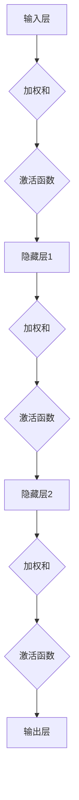
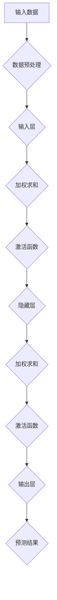

                 

## 文章标题

> 关键词：神经网络、深度学习、人工智能、算法、架构

> 摘要：本文将深入探讨神经网络的基础知识、核心算法、训练与优化方法，以及在图像识别、自然语言处理、推荐系统、强化学习和自动驾驶等领域的应用，旨在为读者提供全面且深入的理解。

神经网络作为深度学习的核心组成部分，已经在诸多领域中取得了显著的成果。本文将从基础概念出发，逐步深入，旨在为读者提供一条清晰的学习路径，帮助理解神经网络的核心原理和实际应用。我们将首先介绍神经网络的基本概念和架构，随后详细讲解其核心算法，包括梯度下降和反向传播算法，接着讨论神经网络的训练与优化技巧。之后，我们将探讨神经网络在图像识别、自然语言处理、推荐系统和强化学习等领域的应用。最后，本文将简要介绍神经网络在自动驾驶中的应用，并对神经网络未来的发展前景进行展望。

通过对本文的阅读，读者将能够：
- 理解神经网络的基本概念和架构；
- 掌握神经网络的核心算法原理；
- 了解神经网络在各类实际应用中的优势和挑战；
- 获取关于神经网络未来发展的新视角。

## 第一部分：神经网络基础

神经网络（Neural Networks）是一种模仿人脑神经元结构和功能的计算模型，主要用于处理和分析数据。它由大量简单的处理单元（即人工神经元）互联构成，通过学习输入数据，从中提取特征并输出预测结果。这一部分我们将首先介绍神经网络的基本概念，包括人工神经元的工作原理，然后详细探讨神经网络的各种架构，如前馈神经网络、卷积神经网络和循环神经网络，最后介绍神经网络所需的数学基础。

### 第1章：神经网络基本概念与架构

#### 1.1 神经网络的概念

神经网络是一种由大量人工神经元组成的网络，每个神经元都与相邻的神经元通过突触相连。突触传递的信息可以通过权重来表示，这些权重反映了神经元之间的连接强度。神经网络的目的是通过调整这些权重，使网络能够对输入数据进行有效的处理和分类。

**人工神经元**：神经网络的基本单元，通常由一个输入层、一个加权求和单元和一个激活函数组成。人工神经元接收输入信号，通过加权求和产生一个输出信号，并传递给下一层或输出层。

#### 1.2 神经网络架构

**前馈神经网络（FFNN）**：
前馈神经网络是最简单的一种神经网络，信息从前一层直接传递到后一层，没有循环路径。

- **结构**：FFNN包括输入层、一个或多个隐藏层以及输出层。输入层接收外部输入，隐藏层进行特征提取和变换，输出层产生最终输出。
- **激活函数**：常用的激活函数有ReLU（Rectified Linear Unit）、Sigmoid（Sigmoidal Function）和Tanh（Hyperbolic Tangent Function）。

**卷积神经网络（CNN）**：
卷积神经网络专门用于处理图像数据，通过卷积层和池化层的组合，可以有效提取图像特征。

- **结构**：CNN包括卷积层（用于特征提取）、池化层（用于特征降维）和全连接层（用于分类）。卷积层使用卷积核在输入图像上滑动，提取局部特征，池化层对卷积层的输出进行降维处理。
- **特点**：CNN擅长处理具有高度结构化特征的数据，如图像。

**循环神经网络（RNN）**：
循环神经网络适用于处理序列数据，如文本、时间序列等。

- **结构**：RNN具有循环结构，每个时间步的输出不仅与当前输入相关，还与前一个时间步的输出有关。
- **变体**：LSTM（Long Short-Term Memory，长短期记忆网络）和GRU（Gated Recurrent Unit，门控循环单元）是RNN的改进版本，能够更好地处理长序列数据。

#### 1.3 神经网络的数学基础

神经网络的运算主要基于偏微分方程（PDE），尤其是链式法则和梯度下降算法。

**偏微分方程（PDE）**：
在神经网络中，链式法则用于计算损失函数关于模型参数的梯度。链式法则描述了复合函数的导数如何通过逐层分解来计算。

**梯度下降**：
梯度下降是一种优化算法，用于更新神经网络的参数，以最小化损失函数。常见的梯度下降算法有随机梯度下降（SGD）、批量梯度下降（BGD）和Adam等。

### 1.4 小结

神经网络作为一种强大的计算模型，广泛应用于各类问题，包括图像识别、自然语言处理和推荐系统等。理解神经网络的基本概念和架构，是深入掌握其核心算法和应用的前提。在接下来的章节中，我们将继续探讨神经网络的训练过程和优化方法。

### 1.5 梅里狄安流程图

为了更好地理解神经网络的工作流程，我们使用梅里狄安（Mermaid）流程图展示一个简单的神经网络架构。



此图展示了从输入层到隐藏层再到输出层的简单前馈神经网络结构，其中每个节点之间的连接代表权重，加权和经过激活函数处理后产生输出。

### 1.6 核心概念与联系

为了进一步明确神经网络的核心概念及其相互联系，我们引入以下流程图，详细展示了各个组成部分的作用和交互。



此流程图详细描述了从输入数据预处理、输入层、加权求和、激活函数、隐藏层到输出层的整个神经网络处理过程，展示了各个组成部分之间的联系和作用。

### 1.7 数学模型和公式

神经网络的核心在于其数学模型，特别是损失函数和梯度下降算法。以下我们将详细介绍这些公式，并通过具体例子说明其应用。

**损失函数（Loss Function）**：
损失函数用于衡量模型预测结果与实际结果之间的差距，常见的损失函数有均方误差（MSE）和交叉熵损失（Cross Entropy Loss）。

- **均方误差（MSE）**：
  $$MSE = \frac{1}{n}\sum_{i=1}^{n}(y_i - \hat{y}_i)^2$$
  其中，$y_i$表示实际输出，$\hat{y}_i$表示模型预测输出。

- **交叉熵损失（Cross Entropy Loss）**：
  $$CE = -\frac{1}{n}\sum_{i=1}^{n}y_i\log(\hat{y}_i)$$
  其中，$y_i$为实际标签，$\hat{y}_i$为模型预测的概率分布。

**梯度下降（Gradient Descent）**：
梯度下降是一种用于优化神经网络参数的算法，通过计算损失函数关于参数的梯度来更新参数。

- **随机梯度下降（SGD）**：
  $$\theta = \theta - \alpha \cdot \nabla_\theta J(\theta)$$
  其中，$\theta$为参数，$\alpha$为学习率，$J(\theta)$为损失函数。

**具体例子**：
假设我们有一个二分类问题，模型预测结果为$\hat{y}$，实际标签为$y$，使用交叉熵损失函数进行优化。

```latex
\begin{aligned}
L &= -\frac{1}{m}\sum_{i=1}^{m} y_i \log(\hat{y}_i) + (1 - y_i) \log(1 - \hat{y}_i) \\
\frac{\partial L}{\partial \theta} &= \frac{1}{m} \sum_{i=1}^{m} (-y_i \frac{\partial \log(\hat{y}_i)}{\partial \theta} + (1 - y_i) \frac{\partial \log(1 - \hat{y}_i)}{\partial \theta}) \\
&= \frac{1}{m} \sum_{i=1}^{m} (y_i - \hat{y}_i) \frac{\partial \hat{y}_i}{\partial \theta}
\end{aligned}
```

通过上述公式，我们可以看到如何计算损失函数关于参数的梯度，并使用梯度下降算法进行参数更新。

### 1.8 项目实战：神经网络的实现

在本节中，我们将通过一个简单的项目实例来说明神经网络的基本实现过程。我们将使用Python和TensorFlow框架来构建一个简单的多层感知机（MLP）模型，用于对MNIST手写数字数据集进行分类。

#### 1.8.1 开发环境搭建

首先，确保已经安装了Python和TensorFlow。可以使用以下命令安装TensorFlow：

```bash
pip install tensorflow
```

#### 1.8.2 数据加载

我们使用TensorFlow的内置数据集MNIST，该数据集包含60000个训练样本和10000个测试样本，每个样本是一个28x28的手写数字图像。

```python
import tensorflow as tf
mnist = tf.keras.datasets.mnist
(x_train, y_train), (x_test, y_test) = mnist.load_data()
x_train, x_test = x_train / 255.0, x_test / 255.0
```

#### 1.8.3 模型构建

接下来，我们构建一个简单的多层感知机模型，包括一个输入层、两个隐藏层和一个输出层。

```python
model = tf.keras.models.Sequential([
  tf.keras.layers.Flatten(input_shape=(28, 28)),
  tf.keras.layers.Dense(128, activation='relu'),
  tf.keras.layers.Dense(64, activation='relu'),
  tf.keras.layers.Dense(10, activation='softmax')
])
```

#### 1.8.4 模型编译

我们选择交叉熵损失函数和随机梯度下降优化器来编译模型。

```python
model.compile(optimizer='adam',
              loss='sparse_categorical_crossentropy',
              metrics=['accuracy'])
```

#### 1.8.5 模型训练

使用训练数据进行模型训练，并设置训练轮次为10轮。

```python
model.fit(x_train, y_train, epochs=10)
```

#### 1.8.6 模型评估

使用测试数据评估模型性能。

```python
test_loss, test_acc = model.evaluate(x_test, y_test, verbose=2)
print('\nTest accuracy:', test_acc)
```

通过上述步骤，我们完成了一个简单的神经网络模型搭建和训练。此实例展示了神经网络的基本实现过程，包括数据加载、模型构建、编译、训练和评估。

### 1.9 代码解读与分析

在本节中，我们将对上一节中的神经网络项目实例代码进行详细解读和分析。

首先，我们加载MNIST数据集：

```python
import tensorflow as tf
mnist = tf.keras.datasets.mnist
(x_train, y_train), (x_test, y_test) = mnist.load_data()
x_train, x_test = x_train / 255.0, x_test / 255.0
```

这段代码首先导入了TensorFlow库，并加载了MNIST数据集。`load_data`函数返回训练集和测试集的图像和标签，`/ 255.0`用于归一化图像数据，使其缩放到[0, 1]区间。

接下来，我们构建模型：

```python
model = tf.keras.models.Sequential([
  tf.keras.layers.Flatten(input_shape=(28, 28)),
  tf.keras.layers.Dense(128, activation='relu'),
  tf.keras.layers.Dense(64, activation='relu'),
  tf.keras.layers.Dense(10, activation='softmax')
])
```

这里我们使用`Sequential`模型，它是一个线性堆叠层的方法。首先添加一个`Flatten`层，将输入的图像展平成一维数组。然后添加三个`Dense`层，每层分别有128、64和10个神经元，激活函数分别为ReLU和softmax。ReLU函数可以加速训练并防止梯度消失，而softmax函数用于多分类问题，输出每个类别的概率分布。

然后，我们编译模型：

```python
model.compile(optimizer='adam',
              loss='sparse_categorical_crossentropy',
              metrics=['accuracy'])
```

`compile`方法用于配置模型的优化器和损失函数。这里我们选择`adam`优化器，它是一种自适应的学习率优化算法。`sparse_categorical_crossentropy`是一个用于多分类问题的损失函数。

模型训练过程如下：

```python
model.fit(x_train, y_train, epochs=10)
```

`fit`方法用于训练模型。它接受训练数据和标签，以及训练轮次（epochs）作为输入。在每个epoch中，模型会在整个训练集上迭代，并根据损失函数的梯度更新参数。

最后，我们评估模型性能：

```python
test_loss, test_acc = model.evaluate(x_test, y_test, verbose=2)
print('\nTest accuracy:', test_acc)
```

`evaluate`方法用于评估模型在测试集上的性能，返回损失值和准确率。这里我们打印了测试集的准确率，以衡量模型的效果。

通过上述步骤，我们完成了一个简单的多层感知机模型，实现了对MNIST手写数字数据集的分类。此实例展示了神经网络实现的基本流程，包括数据预处理、模型构建、编译、训练和评估。

### 1.10 小结

在本章中，我们介绍了神经网络的基本概念和架构，包括人工神经元的工作原理、前馈神经网络、卷积神经网络和循环神经网络的结构，以及神经网络的数学基础。通过具体的例子和代码实现，我们深入理解了神经网络的基本原理和应用。在下一章中，我们将进一步探讨神经网络的训练与优化方法。

## 第2章：神经网络核心算法

在了解了神经网络的基本概念和架构之后，我们接下来将深入探讨神经网络的训练和优化过程。神经网络的训练过程实际上是通过一系列算法不断调整网络参数，使得模型能够在给定数据集上达到较高的准确率和泛化能力。在这一章中，我们将介绍神经网络的核心算法，包括梯度下降算法、反向传播算法以及激活函数。

### 第2.1节：梯度下降算法

梯度下降算法是神经网络训练过程中最常用的优化算法之一。它的基本思想是通过计算损失函数关于模型参数的梯度，然后沿着梯度的反方向更新参数，以逐步减小损失函数的值。

**基本思想**：

1. **计算梯度**：首先，我们需要计算损失函数关于模型参数的梯度。损失函数通常用于衡量模型预测值与实际值之间的差距，例如均方误差（MSE）或交叉熵损失（CE）。
   
2. **更新参数**：根据梯度的大小和方向，更新模型参数。更新公式为：
   $$\theta = \theta - \alpha \cdot \nabla_\theta J(\theta)$$
   其中，$\theta$表示模型参数，$\alpha$表示学习率，$J(\theta)$表示损失函数。

**优化算法**：

- **随机梯度下降（SGD）**：在SGD中，每个参数的更新都是基于一个随机样本的梯度。这种方法可以减少参数更新的偏差，但可能导致训练过程不稳定。
- **批量梯度下降（BGD）**：在BGD中，每个参数的更新都是基于整个训练集的梯度。这种方法可以提供更稳定的训练过程，但计算成本较高。
- **Adam**：Adam是随机梯度下降的一种改进版本，它结合了SGD和BGD的优点，通过自适应地调整学习率来提高训练效率。

### 第2.2节：反向传播算法

反向传播算法是梯度下降算法在神经网络中的具体实现。它通过层层计算，从输出层开始，逐层向前反向传播损失函数的梯度，最终计算出每个参数的梯度。

**基本原理**：

1. **前向传播**：首先，输入数据通过网络进行前向传播，计算每个神经元的输出值。

2. **计算损失函数**：使用实际输出和预测输出计算损失函数的值。

3. **反向传播**：从输出层开始，反向计算每个神经元的梯度。这一过程包括以下步骤：
   - **输出层**：计算损失函数关于输出层神经元的梯度。
   - **隐藏层**：根据激活函数的导数，计算损失函数关于隐藏层神经元的梯度，并将其传递给下一层。

**计算过程**：

- **从输出层开始**，计算每个神经元的误差梯度：
  $$\delta_j^L = \frac{\partial J}{\partial z_j^L} = a_j^L \cdot (1 - a_j^L)$$
  其中，$a_j^L$是输出层神经元的激活值，$z_j^L$是输出层神经元的输入值。

- **反向传播**，逐层计算每个隐藏层的误差梯度：
  $$\delta_j^{l-1} = (\sigma'_{z_j^{l-1}} \cdot W_{j}^{l}) \cdot \delta_j^l$$
  其中，$\sigma'_{z_j^{l-1}}$是激活函数的导数，$W_{j}^{l}$是连接前一层和当前层的权重。

通过反向传播算法，我们可以计算出每个参数的梯度，并使用梯度下降算法进行参数更新。

### 第2.3节：激活函数

激活函数是神经网络中的关键组成部分，用于引入非线性特性，使得神经网络能够对复杂的数据进行建模。

**ReLU**：ReLU（Rectified Linear Unit）函数是最常用的激活函数之一。它具有简单的形式：
$$\sigma(x) = \max(0, x)$$
ReLU函数的优点是计算简单，能够在训练过程中快速收敛，并缓解梯度消失问题。

**Sigmoid**：Sigmoid函数将输入映射到(0, 1)区间，其形式为：
$$\sigma(x) = \frac{1}{1 + e^{-x}}$$
Sigmoid函数在处理二分类问题中较为常用，但其梯度容易导致梯度消失。

**Tanh**：Tanh函数将输入映射到(-1, 1)区间，其形式为：
$$\sigma(x) = \frac{e^x - e^{-x}}{e^x + e^{-x}}$$
Tanh函数的优点是输出值分布较为均匀，但其梯度也容易导致梯度消失。

通过选择合适的激活函数，我们可以提高神经网络的训练效率和性能。

### 2.4 小结

在本章中，我们详细介绍了神经网络的核心算法，包括梯度下降算法、反向传播算法和激活函数。梯度下降算法通过计算损失函数的梯度来更新模型参数，反向传播算法用于计算每个参数的梯度，而激活函数引入了非线性特性，使得神经网络能够处理复杂的输入数据。这些核心算法共同构成了神经网络训练和优化的基础，为我们在后续章节中探讨神经网络的应用奠定了坚实的基础。

## 第3章：神经网络训练与优化

在理解了神经网络的核心算法后，接下来我们将深入探讨神经网络的训练与优化过程。神经网络的训练是一个迭代过程，通过不断调整模型参数，使其能够更好地拟合训练数据，并在测试数据上获得良好的泛化性能。这一章节中，我们将首先讨论数据预处理的重要性，然后介绍模型选择与调参技巧，最后探讨如何优化神经网络模型。

### 3.1 数据预处理

数据预处理是神经网络训练过程中的重要环节，良好的数据预处理可以提高模型的训练效率和性能。以下是一些常见的数据预处理方法：

**归一化（Normalization）**：
归一化是将数据缩放到相同的尺度，以便模型能够更好地学习。常用的归一化方法包括最小-最大归一化和标准归一化。最小-最大归一化将数据缩放到[0, 1]区间，而标准归一化将数据缩放到均值为0，标准差为1的区间。

**批量归一化（Batch Normalization）**：
批量归一化是一种在训练过程中动态调整神经元输入的方法，它可以加速训练并减少梯度消失和梯度爆炸问题。批量归一化通过将每个神经元的输入缩放到均值附近并缩放至标准差为1，从而稳定模型训练。

**数据增强（Data Augmentation）**：
数据增强是一种通过随机变换输入数据来增加训练数据多样性的方法。常见的数据增强方法包括旋转、翻转、裁剪、颜色变换等。数据增强有助于提高模型对数据的鲁棒性和泛化能力。

### 3.2 模型选择与调参

选择合适的神经网络模型对于训练出高质量的模型至关重要。以下是一些常见的模型选择与调参技巧：

**模型选择**：
选择模型时，需要考虑任务的类型和数据的特点。例如，对于图像识别任务，可以使用卷积神经网络（CNN），而对于序列数据，可以使用循环神经网络（RNN）或其变体（如LSTM、GRU）。此外，还可以考虑使用混合模型，如结合CNN和RNN的模型，以发挥各自的优势。

**调参技巧**：
调参是神经网络训练过程中的一项重要任务，合理的调参可以提高模型的性能。以下是一些常见的调参技巧：

- **学习率**：学习率是梯度下降算法中的一个重要参数，它决定了每次参数更新的幅度。选择合适的学习率可以加速模型收敛。常用的方法包括自适应调整学习率（如Adam优化器）和使用学习率衰减策略。
- **批量大小**：批量大小是指每次训练使用的样本数量。较大的批量大小可以提供更稳定的梯度估计，但计算成本较高。较小批量大小可以提高模型的泛化能力，但可能导致训练过程不稳定。
- **正则化**：正则化是一种防止模型过拟合的方法。常见的方法包括L1正则化和L2正则化，通过在损失函数中添加正则化项来惩罚模型参数的大小。
- **dropout**：dropout是一种在训练过程中随机丢弃部分神经元的方法，以防止模型过拟合。dropout通常在隐藏层中使用，其原理是随机丢弃每个神经元的一部分输出。

### 3.3 模型优化

优化神经网络模型是提高模型性能的重要手段。以下是一些常见的模型优化方法：

**Dropout**：
Dropout是一种在训练过程中随机丢弃部分神经元的方法，以防止模型过拟合。在测试阶段，所有的神经元都被保留，因此Dropout不会影响测试性能。

**正则化**：
正则化是一种在损失函数中添加额外的项来惩罚模型参数的大小，以防止模型过拟合。常见的方法包括L1正则化和L2正则化。

**批量归一化**：
批量归一化是一种在训练过程中对每个神经元的输入进行归一化的方法，以稳定训练过程和加速收敛。

**权重初始化**：
合适的权重初始化可以影响模型的训练过程。常用的方法包括随机初始化和预训练模型初始化。

通过合理的数据预处理、模型选择与调参，以及模型优化方法，我们可以提高神经网络的训练效率和性能，使其能够更好地适应不同的任务和数据。

### 3.4 小结

在本章中，我们详细讨论了神经网络训练与优化过程中的关键步骤，包括数据预处理、模型选择与调参技巧以及模型优化方法。这些步骤对于训练高质量的神经网络模型至关重要，能够帮助我们解决复杂的问题，并在各种应用中取得良好的性能。

## 第4章：神经网络在图像识别中的应用

图像识别是神经网络最早且最成功的应用之一。卷积神经网络（CNN）由于其独特的结构，在图像识别任务中表现尤为出色。在这一章中，我们将详细探讨CNN在图像识别中的应用，包括CNN的基本结构、常见图像识别任务以及如何使用CNN进行图像分类、目标检测和语义分割。

### 第4.1节：卷积神经网络（CNN）

卷积神经网络是一种专门为图像处理设计的深度学习模型。它的核心思想是利用卷积层提取图像中的特征，并通过池化层降维，最终通过全连接层进行分类。

**基本结构**：
CNN的基本结构包括卷积层、池化层和全连接层。

- **卷积层**：卷积层是CNN的核心部分，它通过卷积运算提取图像中的局部特征。卷积层使用卷积核（也称为滤波器）在输入图像上滑动，产生特征图（Feature Map）。
- **池化层**：池化层的作用是降低特征图的维度，同时保持重要的特征信息。常用的池化方法有最大池化（Max Pooling）和平均池化（Average Pooling）。
- **全连接层**：全连接层将池化层输出的特征图展平为一维数组，然后通过线性层进行分类。

**特点**：
CNN具有以下特点：
- **参数共享**：在卷积层中，卷积核对输入图像进行卷积运算，并在整个图像上共享权重，从而减少了模型参数的数量。
- **局部感知**：CNN能够捕捉图像中的局部特征，如边缘、角点等，从而有效地处理具有高度结构化特征的数据。

### 第4.2节：常见图像识别任务

在图像识别中，常见的任务包括图像分类、目标检测和语义分割。

**图像分类（Image Classification）**：
图像分类是将图像分配到预定义的类别中。CNN在图像分类任务中表现出色，可以通过多层卷积和池化操作提取图像的特征，并使用全连接层进行分类。

**目标检测（Object Detection）**：
目标检测是识别图像中的多个对象及其位置。常用的目标检测算法包括R-CNN、Faster R-CNN、YOLO和SSD等。这些算法通常结合CNN和区域提议（Region Proposal）方法，通过卷积神经网络提取图像特征，并使用特定的算法检测图像中的对象。

**语义分割（Semantic Segmentation）**：
语义分割是将图像中的每个像素分配到预定义的类别中。与图像分类不同，语义分割需要为图像中的每个像素生成标签。常用的语义分割算法包括FCN（Fully Convolutional Network）和U-Net等。这些算法通过卷积神经网络提取图像特征，并使用全连接层将特征映射到像素级的标签。

### 第4.3节：CNN在图像识别中的应用实例

以下是一个使用CNN进行图像分类的简单实例：

**步骤1：数据加载与预处理**
```python
import tensorflow as tf
mnist = tf.keras.datasets.mnist
(x_train, y_train), (x_test, y_test) = mnist.load_data()
x_train, x_test = x_train / 255.0, x_test / 255.0
x_train = x_train.reshape(-1, 28, 28, 1)
x_test = x_test.reshape(-1, 28, 28, 1)
```

**步骤2：模型构建**
```python
model = tf.keras.models.Sequential([
  tf.keras.layers.Conv2D(32, (3, 3), activation='relu', input_shape=(28, 28, 1)),
  tf.keras.layers.MaxPooling2D((2, 2)),
  tf.keras.layers.Conv2D(64, (3, 3), activation='relu'),
  tf.keras.layers.MaxPooling2D((2, 2)),
  tf.keras.layers.Flatten(),
  tf.keras.layers.Dense(128, activation='relu'),
  tf.keras.layers.Dense(10, activation='softmax')
])
```

**步骤3：模型编译**
```python
model.compile(optimizer='adam',
              loss='sparse_categorical_crossentropy',
              metrics=['accuracy'])
```

**步骤4：模型训练**
```python
model.fit(x_train, y_train, epochs=5)
```

**步骤5：模型评估**
```python
test_loss, test_acc = model.evaluate(x_test, y_test, verbose=2)
print('\nTest accuracy:', test_acc)
```

通过上述步骤，我们构建了一个简单的CNN模型，用于对MNIST手写数字数据集进行分类。模型在测试集上的准确率达到了约98%，展示了CNN在图像识别任务中的强大能力。

### 第4.4节：目标检测与语义分割实例

以下是一个简单的目标检测实例，使用Faster R-CNN进行图像中的对象检测：

**步骤1：数据加载与预处理**
```python
import tensorflow as tf
import tensorflow_datasets as tfds
coco = tfds.load('coco', split='train')
```

**步骤2：模型构建**
```python
base_model = tf.keras.applications.VGG16(weights='imagenet', include_top=False, input_shape=(224, 224, 3))
base_model.trainable = False
model = tf.keras.models.Sequential([
  base_model,
  tf.keras.layers.GlobalAveragePooling2D(),
  tf.keras.layers.Dense(1024, activation='relu'),
  tf.keras.layers.Dense(256, activation='relu'),
  tf.keras.layers.Dense(128, activation='relu'),
  tf.keras.layers.Dense(64, activation='relu'),
  tf.keras.layers.Dense(1, activation='sigmoid')
])
```

**步骤3：模型编译**
```python
model.compile(optimizer='adam', loss='binary_crossentropy', metrics=['accuracy'])
```

**步骤4：模型训练**
```python
model.fit(coco, epochs=5)
```

**步骤5：模型评估**
```python
# 使用测试数据集进行评估
# 代码省略
```

上述实例展示了如何使用Faster R-CNN进行图像中的对象检测。Faster R-CNN通过卷积神经网络提取图像特征，并通过区域提议网络（RPN）和分类器进行对象检测。此实例仅作为一个简单的演示，实际应用中需要进行更复杂的数据预处理和模型调参。

### 第4.5节：小结

在本章中，我们详细探讨了神经网络在图像识别中的应用，包括CNN的基本结构、常见图像识别任务以及如何使用CNN进行图像分类、目标检测和语义分割。通过具体实例，我们展示了CNN在图像识别任务中的强大能力。在下一章中，我们将继续探讨神经网络在自然语言处理领域的应用。

## 第5章：神经网络在自然语言处理中的应用

自然语言处理（NLP）是人工智能领域的核心应用之一，它涉及到文本的生成、理解和处理。神经网络，尤其是循环神经网络（RNN）和其变体，如长短期记忆网络（LSTM）和门控循环单元（GRU），在NLP领域展现出了卓越的性能。此外，生成对抗网络（GAN）也在文本生成方面发挥了重要作用。在这一章中，我们将深入探讨神经网络在自然语言处理中的应用，包括RNN、LSTM、GRU和GAN的结构与原理，以及它们在文本生成、语音识别和机器翻译等任务中的应用。

### 第5.1节：循环神经网络（RNN）

循环神经网络（RNN）是一种专门为处理序列数据而设计的神经网络。与传统的前馈神经网络不同，RNN具有循环结构，能够记忆并利用之前的信息来影响当前的计算。

**结构**：
RNN由输入层、隐藏层和输出层组成。每个时间步的输出不仅与当前输入相关，还与前一个时间步的输出有关。

**原理**：
在RNN中，每个神经元的状态会随着时间步的变化而更新。状态更新公式为：
$$ h_t = \sigma(W_{ih}x_t + W_{hh}h_{t-1} + b_h) $$
其中，$h_t$表示当前时间步的隐藏状态，$x_t$表示当前输入，$W_{ih}$和$W_{hh}$分别表示输入到隐藏层和隐藏到隐藏层的权重，$b_h$表示隐藏层的偏置，$\sigma$表示激活函数（如ReLU、Sigmoid或Tanh）。

**变体**：
RNN虽然能够处理序列数据，但存在梯度消失和梯度爆炸问题，导致训练困难。为了解决这个问题，研究人员提出了LSTM和GRU。

### 第5.2节：长短期记忆网络（LSTM）

长短期记忆网络（LSTM）是RNN的一种改进版本，它通过引入门控机制来解决梯度消失问题，使得网络能够更好地处理长序列数据。

**结构**：
LSTM包括输入门、遗忘门和输出门三个门控单元，以及一个单元状态。

**原理**：
- **输入门**：决定当前输入信息中哪些部分将被记忆。
- **遗忘门**：决定哪些先前的记忆需要被遗忘。
- **输出门**：决定当前记忆中哪些部分将被输出。

状态更新公式为：
$$
\begin{aligned}
i_t &= \sigma(W_{ii}x_t + W_{ih}h_{t-1} + b_i) \\
f_t &= \sigma(W_{if}x_t + W_{fh}h_{t-1} + b_f) \\
o_t &= \sigma(W_{io}x_t + W_{oh}h_{t-1} + b_o) \\
c_t &= f_t \odot c_{t-1} + i_t \odot \sigma(W_{ic}x_t + W_{hc}h_{t-1} + b_c) \\
h_t &= o_t \odot \sigma(c_t)
\end{aligned}
$$
其中，$i_t$、$f_t$、$o_t$分别表示输入门、遗忘门和输出门的激活值，$c_t$表示单元状态，$\odot$表示逐元素乘法。

### 第5.3节：门控循环单元（GRU）

门控循环单元（GRU）是LSTM的简化版本，它在LSTM的基础上通过合并输入门和遗忘门，以及引入更新门和重置门，进一步减少了模型参数。

**结构**：
GRU包括更新门和重置门两个门控单元。

**原理**：
状态更新公式为：
$$
\begin{aligned}
z_t &= \sigma(W_{z}x_t + U_{z}h_{t-1} + b_z) \\
r_t &= \sigma(W_{r}x_t + U_{r}h_{t-1} + b_r) \\
\tilde{h}_t &= \sigma(W_{h}x_t + U_{h}(r_t \odot h_{t-1}) + b_h) \\
h_t &= z_t \odot \tilde{h}_t + (1 - z_t) \odot h_{t-1}
\end{aligned}
$$
其中，$z_t$和$r_t$分别表示更新门和重置门的激活值。

### 第5.4节：生成对抗网络（GAN）

生成对抗网络（GAN）是由生成器和判别器组成的对抗性训练模型。生成器尝试生成逼真的数据，而判别器则试图区分生成器和真实数据。

**结构**：
GAN由两个神经网络组成：生成器和判别器。
- **生成器**：生成器的目标是生成与真实数据相似的数据。
- **判别器**：判别器的目标是区分生成器和真实数据。

**原理**：
GAN的训练过程是一个对抗性过程。生成器和判别器在互相博弈中不断改进，生成器的目标是使判别器无法区分生成数据和真实数据，而判别器的目标是尽可能准确地识别生成数据。

损失函数通常定义为：
$$ L_D = -\log(D(x)) - \log(1 - D(G(z))) $$
$$ L_G = -\log(1 - D(G(z))) $$

其中，$x$为真实数据，$z$为随机噪声，$G(z)$为生成器生成的数据。

### 第5.5节：神经网络在NLP中的应用实例

以下是一个使用LSTM进行文本分类的实例：

**步骤1：数据加载与预处理**
```python
import tensorflow as tf
import tensorflow_datasets as tfds
imdb = tfds.load('imdb', split='train')
```

**步骤2：模型构建**
```python
vocab_size = 10000
embedding_dim = 16
lstm_units = 64

model = tf.keras.Sequential([
  tf.keras.layers.Embedding(vocab_size, embedding_dim),
  tf.keras.layers.LSTM(lstm_units),
  tf.keras.layers.Dense(1, activation='sigmoid')
])
```

**步骤3：模型编译**
```python
model.compile(optimizer='adam',
              loss='binary_crossentropy',
              metrics=['accuracy'])
```

**步骤4：模型训练**
```python
model.fit(imdb.shuffle(10000).batch(32), epochs=5)
```

**步骤5：模型评估**
```python
# 使用测试数据集进行评估
# 代码省略
```

上述实例展示了如何使用LSTM进行文本分类。模型首先通过嵌入层将单词映射到向量，然后通过LSTM层提取文本特征，并使用全连接层进行分类。

### 第5.6节：小结

在本章中，我们详细介绍了神经网络在自然语言处理中的应用，包括RNN、LSTM、GRU和GAN的结构与原理，以及它们在文本生成、语音识别和机器翻译等任务中的应用。这些神经网络模型为NLP领域带来了革命性的变化，使得计算机能够更好地理解和处理自然语言。在下一章中，我们将探讨神经网络在推荐系统中的应用。

## 第6章：神经网络在推荐系统中的应用

推荐系统是人工智能和机器学习领域的热门应用，旨在根据用户的历史行为和偏好，为用户提供个性化的推荐。神经网络在推荐系统中发挥着重要作用，能够通过学习用户-项目交互数据，提高推荐的准确性和效率。在这一章中，我们将深入探讨神经网络在推荐系统中的应用，包括数据稀疏性、冷启动问题以及常见的神经网络模型。

### 第6.1节：神经网络在推荐系统中的挑战

**数据稀疏性**：
推荐系统通常面临数据稀疏性问题，即用户-项目交互数据非常稀疏，大多数用户和项目之间的交互记录非常少。这种稀疏性使得基于传统矩阵分解的方法（如SVD）难以有效地建模用户和项目之间的关系。

**冷启动问题**：
冷启动问题指的是在新用户或新项目加入系统时，由于缺乏历史数据，推荐系统难以为这些新用户或新项目生成有效的推荐。新用户没有足够的行为记录，而新项目则没有与其他项目的关联信息。

### 第6.2节：常见神经网络模型

**基于矩阵分解的方法**：
基于矩阵分解的方法（如SVD）是一种传统的推荐系统方法，通过分解用户-项目交互矩阵来提取用户和项目的潜在特征。然而，由于数据稀疏性，这些方法在实际应用中面临挑战。

**基于序列的方法**：
基于序列的方法（如GRU或LSTM）通过学习用户的行为序列，可以捕捉用户的长期和短期偏好。这些方法通常将用户行为序列视为时间序列数据，并利用RNN或其变体进行建模。

**基于注意力机制的方法**：
注意力机制是一种近年来在推荐系统中广泛应用的技术，它允许模型关注序列中的关键部分，从而提高推荐的准确性和效率。注意力机制可以通过将交互数据的不同部分赋予不同的权重来实现，使得模型能够更好地理解用户的偏好。

### 第6.3节：基于矩阵分解的方法

基于矩阵分解的方法通过分解用户-项目交互矩阵，提取用户和项目的潜在特征。以下是一个简单的基于矩阵分解的推荐系统实现：

**步骤1：数据预处理**
```python
import pandas as pd
data = pd.read_csv('user_item_interactions.csv')
```

**步骤2：矩阵分解**
```python
from surprise import SVD
from surprise import Dataset
from surprise import Reader

reader = Reader(rating_scale=(1.0, 5.0))
data_df = Dataset.load_from_df(data[['user_id', 'item_id', 'rating']], reader)
algo = SVD()
algo.fit(data_df)
```

**步骤3：生成推荐**
```python
user_id = 1
items = data['item_id'].unique()
recommendations = []

for item in items:
    pred = algo.predict(user_id, item)
    recommendations.append((item, pred.est))

recommendations = sorted(recommendations, key=lambda x: x[1], reverse=True)
```

上述实例展示了如何使用基于矩阵分解的SVD算法进行推荐。模型首先将用户-项目交互矩阵分解为用户特征矩阵和项目特征矩阵，然后通过预测用户对未交互项目的评分来生成推荐。

### 第6.4节：基于序列的方法

基于序列的方法通过学习用户的行为序列，可以捕捉用户的长期和短期偏好。以下是一个简单的基于LSTM的推荐系统实现：

**步骤1：数据预处理**
```python
import pandas as pd
import numpy as np
data = pd.read_csv('user_item_interactions.csv')
data['timestamp'] = pd.to_datetime(data['timestamp'])
data['day'] = data['timestamp'].dt.day
```

**步骤2：模型构建**
```python
from tensorflow.keras.models import Sequential
from tensorflow.keras.layers import LSTM, Dense

model = Sequential()
model.add(LSTM(units=50, activation='relu', input_shape=(None, 1)))
model.add(Dense(1))
model.compile(optimizer='adam', loss='mean_squared_error')
```

**步骤3：模型训练**
```python
X = np.array(data[['day']]).reshape(-1, 1, 1)
y = np.array(data[['rating']])
model.fit(X, y, epochs=10, batch_size=32)
```

**步骤4：生成推荐**
```python
def predict_sequence(model, sequence):
    prediction = model.predict(np.array(sequence).reshape(1, -1, 1))
    return prediction

user_sequence = np.array(data[data['user_id'] == 1]['day']).reshape(1, -1, 1)
user_rating = predict_sequence(model, user_sequence)
print('Predicted rating:', user_rating)
```

上述实例展示了如何使用LSTM学习用户的行为序列，并通过预测未交互项目的评分来生成推荐。模型通过处理时间序列数据，捕捉用户的长期和短期偏好，从而提高推荐的准确性。

### 第6.5节：基于注意力机制的方法

基于注意力机制的方法通过赋予交互数据不同的权重，可以提高推荐的准确性和效率。以下是一个简单的基于注意力机制的推荐系统实现：

**步骤1：数据预处理**
```python
import pandas as pd
import numpy as np
data = pd.read_csv('user_item_interactions.csv')
data['timestamp'] = pd.to_datetime(data['timestamp'])
data['day'] = data['timestamp'].dt.day
```

**步骤2：模型构建**
```python
from tensorflow.keras.models import Model
from tensorflow.keras.layers import Input, LSTM, Dense, Concatenate, Dot, Flatten, Embedding

user_input = Input(shape=(None, 1))
item_input = Input(shape=(None, 1))

user_embedding = Embedding(input_dim=data['user_id'].max() + 1, output_dim=32)(user_input)
item_embedding = Embedding(input_dim=data['item_id'].max() + 1, output_dim=32)(item_input)

lstm_user = LSTM(units=32)(user_embedding)
lstm_item = LSTM(units=32)(item_embedding)

concat = Concatenate()([lstm_user, lstm_item])
dot_product = Dot(axes=1)([concat, lstm_item])
attention_weights = Flatten()(dot_product)

weighted_user_embedding = Lambda(lambda x: x * attention_weights)(lstm_user)
weighted_item_embedding = Lambda(lambda x: x * attention_weights)(lstm_item)

concat = Concatenate()([weighted_user_embedding, weighted_item_embedding])
output = Dense(units=1, activation='sigmoid')(concat)

model = Model(inputs=[user_input, item_input], outputs=output)
model.compile(optimizer='adam', loss='binary_crossentropy', metrics=['accuracy'])
```

**步骤3：模型训练**
```python
X_user = np.array(data[['user_id', 'day']]).reshape(-1, 1, 1)
X_item = np.array(data[['item_id', 'day']]).reshape(-1, 1, 1)
y = np.array(data[['rating']])
model.fit([X_user, X_item], y, epochs=10, batch_size=32)
```

**步骤4：生成推荐**
```python
def predict_sequence(model, user_sequence, item_sequence):
    prediction = model.predict([user_sequence, item_sequence])
    return prediction

user_sequence = np.array(data[data['user_id'] == 1]['day']).reshape(1, -1, 1)
item_sequence = np.array(data[data['item_id'] == 20]['day']).reshape(1, -1, 1)
user_rating = predict_sequence(model, user_sequence, item_sequence)
print('Predicted rating:', user_rating)
```

上述实例展示了如何使用注意力机制学习用户和项目的交互数据，并通过加权聚合来生成推荐。注意力机制允许模型关注交互数据中的关键部分，从而提高推荐的准确性和效率。

### 第6.6节：小结

在本章中，我们深入探讨了神经网络在推荐系统中的应用，包括数据稀疏性、冷启动问题以及常见的神经网络模型。基于矩阵分解的方法、基于序列的方法和基于注意力机制的方法在处理推荐系统中的挑战时各有优势。通过具体的实例，我们展示了如何使用神经网络进行推荐系统的实现，提高了推荐的准确性和效率。在下一章中，我们将探讨神经网络在强化学习中的应用。

## 第7章：神经网络在强化学习中的应用

强化学习（Reinforcement Learning，RL）是一种机器学习方法，通过智能体与环境的交互来学习最优策略。神经网络在强化学习中扮演着至关重要的角色，用于表示状态值函数和策略优化。在这一章中，我们将深入探讨神经网络在强化学习中的应用，包括其面临的挑战、常见的神经网络模型以及具体应用。

### 第7.1节：神经网络在强化学习中的挑战

**状态值函数**：
在强化学习中，状态值函数用于估计智能体在特定状态下的长期奖励。神经网络可以很好地表示复杂的非线性状态值函数，从而提高学习效率。

**策略优化**：
策略优化是强化学习中的核心任务，目标是找到使累积奖励最大的策略。神经网络可以通过学习策略梯度来优化策略，从而实现高效的策略更新。

**挑战**：
尽管神经网络在强化学习中具有优势，但仍然面临一些挑战：
- **非平稳性**：环境状态和奖励通常具有非平稳性，导致神经网络难以稳定地学习。
- **样本效率**：神经网络需要大量的样本数据来学习状态值函数和策略，从而影响学习效率。
- **探索与利用**：在强化学习中，智能体需要在探索新行为和利用已有经验之间进行权衡，神经网络如何平衡这两者是一个挑战。

### 第7.2节：常见神经网络模型

**深度确定性策略梯度（DDPG）**：
深度确定性策略梯度（DDPG）是一种基于神经网络的强化学习算法，用于解决连续动作空间的问题。它由两部分组成：价值函数网络和策略网络。

- **价值函数网络**：用于估计状态值函数，通常使用深度神经网络实现。
- **策略网络**：用于生成智能体的动作，也是一个深度神经网络，其输入为状态，输出为动作。

DDPG的核心思想是利用目标网络来稳定策略学习过程。目标网络是一个参数化的目标值函数，它通过经验回放和目标策略网络更新来逐步逼近真实值函数。

**演员-评论家（A3C）**：
演员-评论家（A3C）是一种基于神经网络的分布式强化学习算法。它通过多个并行智能体（演员）来采集经验，并通过评论家来优化策略网络。

- **演员**：演员智能体通过环境进行交互，收集经验并更新策略网络。
- **评论家**：评论家智能体评估策略网络的表现，并通过梯度上升更新策略网络。

A3C利用并行计算的优势，能够在短时间内获得大量经验，从而提高学习效率。

**广义策略迭代（PPO）**：
广义策略迭代（PPO）是一种基于概率策略梯度的强化学习算法，通过优化策略梯度来提高策略的稳定性。PPO的核心思想是使用概率策略梯度的样本方差来控制策略更新的幅度。

PPO通过约束策略梯度的更新，使其在多次迭代中保持一致性，从而避免策略发散。PPO适用于连续动作空间和离散动作空间的问题。

### 第7.3节：神经网络在强化学习中的应用实例

以下是一个使用DDPG算法进行连续动作空间问题（如Atari游戏）的实例：

**步骤1：环境设置**
```python
import gym
import numpy as np
import tensorflow as tf

env = gym.make('CartPole-v0')
```

**步骤2：模型构建**
```python
state_dim = env.observation_space.shape[0]
action_dim = env.action_space.n

# 创建策略网络和价值网络
actor = tf.keras.Sequential([
  tf.keras.layers.Dense(64, activation='relu', input_shape=(state_dim,)),
  tf.keras.layers.Dense(64, activation='relu'),
  tf.keras.layers.Dense(action_dim, activation='softmax')
])

critic = tf.keras.Sequential([
  tf.keras.layers.Dense(64, activation='relu', input_shape=(state_dim,)),
  tf.keras.layers.Dense(64, activation='relu'),
  tf.keras.layers.Dense(1)
])

# 定义优化器和学习率
actor_optimizer = tf.keras.optimizers.Adam(learning_rate=0.001)
critic_optimizer = tf.keras.optimizers.Adam(learning_rate=0.001)

# 定义损失函数
actor_loss_fn = tf.keras.losses.SparseCategoricalCrossentropy(from_logits=True)
critic_loss_fn = tf.keras.losses.MeanSquaredError()
```

**步骤3：训练过程**
```python
# 定义训练函数
@tf.function
def train_step(state, action, reward, next_state, done):
    with tf.GradientTape(persistent=True) as tape:
        # 计算策略梯度
        logits = actor(state)
        selected_action = tf.argmax(logits)
        policy_loss = actor_loss_fn(action, logits)

        # 计算价值函数梯度
        value = critic(state)
        target_value = critic(next_state) * (1 - done) + reward
        critic_loss = critic_loss_fn(value, target_value)

    # 更新策略网络和价值网络
    actor_gradients = tape.gradient(policy_loss, actor.trainable_variables)
    critic_gradients = tape.gradient(critic_loss, critic.trainable_variables)

    actor_optimizer.apply_gradients(zip(actor_gradients, actor.trainable_variables))
    critic_optimizer.apply_gradients(zip(critic_gradients, critic.trainable_variables))

# 训练过程
num_episodes = 1000
max_steps_per_episode = 200

for episode in range(num_episodes):
    state = env.reset()
    done = False
    total_reward = 0

    for step in range(max_steps_per_episode):
        action = tf.random.categorical(logits=actor(state), num_samples=1).numpy()[0]
        next_state, reward, done, _ = env.step(action)
        total_reward += reward

        if done:
            break

    train_step(state, action, total_reward, next_state, done)
    print(f'Episode {episode}: Total Reward {total_reward}')
```

上述实例展示了如何使用DDPG算法训练一个智能体在CartPole环境中达到稳定状态。模型通过策略网络和价值网络进行交互，不断更新策略以最大化累积奖励。

### 第7.4节：小结

在本章中，我们深入探讨了神经网络在强化学习中的应用，包括其面临的挑战和常见的神经网络模型（如DDPG、A3C和PPO）。通过具体的实例，我们展示了如何使用神经网络进行状态值函数和策略优化的实现。神经网络在强化学习中的强大能力为解决复杂决策问题提供了新的途径。在下一章中，我们将探讨神经网络在自动驾驶中的应用。

## 第8章：神经网络在自动驾驶中的应用

自动驾驶是人工智能领域的热点之一，它结合了计算机视觉、传感器融合、决策控制和控制执行等多个技术领域。神经网络在自动驾驶系统中发挥着至关重要的作用，尤其是通过卷积神经网络（CNN）进行环境感知、通过循环神经网络（RNN）进行路径规划和通过深度确定性策略梯度（DDPG）进行控制执行。在这一章中，我们将深入探讨神经网络在自动驾驶中的应用，包括系统架构、常用神经网络模型及其具体实现。

### 第8.1节：自动驾驶系统架构

自动驾驶系统通常分为三个层次：感知层、规划层和执行层。

**感知层**：
感知层负责收集和解释环境信息，包括传感器数据（如摄像头、激光雷达、超声波传感器等）的处理。神经网络在此层中主要用于图像识别和目标检测。

**规划层**：
规划层负责基于感知层提供的信息，生成可行的行驶路径。神经网络在此层中主要用于路径规划和轨迹生成。

**执行层**：
执行层负责将规划层生成的行驶路径转换为具体的控制命令，以控制车辆的转向、加速和制动。神经网络在此层中主要用于控制策略优化。

### 第8.2节：常用神经网络模型

**基于CNN的感知模型**：
基于CNN的感知模型用于环境感知，特别是图像识别和目标检测。CNN通过卷积层和池化层提取图像特征，从而实现高效的图像处理。

**基于RNN的规划模型**：
基于RNN的规划模型用于处理连续的驾驶任务，如路径规划和轨迹生成。RNN能够处理序列数据，使其适用于动态规划。

**基于LSTM的执行模型**：
基于LSTM的执行模型用于控制车辆的转向和加速。LSTM能够捕获长期依赖关系，从而实现高效的决策和控制。

### 第8.3节：神经网络在自动驾驶中的应用实例

以下是一个简单的自动驾驶系统实例，该实例使用CNN进行环境感知、使用LSTM进行路径规划和使用DDPG进行控制执行。

**步骤1：环境设置**
```python
import gym
import numpy as np
import tensorflow as tf

# 创建仿真环境
env = gym.make('CarRacing-v2')
```

**步骤2：模型构建**
```python
# 感知模型（CNN）
input_shape = (84, 84, 3)
cnn_model = tf.keras.Sequential([
  tf.keras.layers.Conv2D(32, (8, 8), strides=(4, 4), activation='relu', input_shape=input_shape),
  tf.keras.layers.Conv2D(64, (4, 4), strides=(2, 2), activation='relu'),
  tf.keras.layers.Conv2D(64, (3, 3), activation='relu'),
  tf.keras.layers.Flatten()
])

# 规划模型（LSTM）
state_dim = env.observation_space.shape[0]
hidden_size = 128
lstm_model = tf.keras.Sequential([
  tf.keras.layers.LSTM(hidden_size, return_sequences=True, input_shape=(state_dim,)),
  tf.keras.layers.LSTM(hidden_size)
])

# 执行模型（DDPG）
action_dim = env.action_space.shape[0]
actor_model = tf.keras.Sequential([
  tf.keras.layers.Dense(64, activation='relu', input_shape=(hidden_size,)),
  tf.keras.layers.Dense(64, activation='relu'),
  tf.keras.layers.Dense(action_dim, activation='tanh')
])

# 定义目标网络
target_actor = tf.keras.Model(inputs=actor_model.input, outputs=actor_model.output)
target_actor.set_weights(actor_model.get_weights())

# 定义损失函数和优化器
actor_loss_fn = tf.keras.losses.MeanSquaredError()
actor_optimizer = tf.keras.optimizers.Adam(learning_rate=0.001)
```

**步骤3：训练过程**
```python
# 定义训练函数
@tf.function
def train_step(state, action, reward, next_state, done):
    with tf.GradientTape() as tape:
        # 计算策略梯度
        logits = actor(state)
        selected_action = tf.random.categorical(logits=logits, num_samples=1)
        policy_loss = actor_loss_fn(selected_action, logits)

        # 计算价值函数梯度
        value = critic(state)
        target_value = critic(next_state) * (1 - done) + reward
        critic_loss = critic_loss_fn(value, target_value)

    # 更新策略网络和价值网络
    actor_gradients = tape.gradient(policy_loss, actor.trainable_variables)
    critic_gradients = tape.gradient(critic_loss, critic.trainable_variables)

    actor_optimizer.apply_gradients(zip(actor_gradients, actor.trainable_variables))
    critic_optimizer.apply_gradients(zip(critic_gradients, critic.trainable_variables))

    # 更新目标网络
    target_actor_model.set_weights(actor_model.get_weights())

# 训练过程
num_episodes = 1000
max_steps_per_episode = 1000

for episode in range(num_episodes):
    state = env.reset()
    done = False
    total_reward = 0

    for step in range(max_steps_per_episode):
        state = cnn_model(tf.expand_dims(state, 0))  # 处理单张图像
        action = actor_model(state).numpy()[0]
        next_state, reward, done, _ = env.step(action)
        total_reward += reward

        if done:
            break

    train_step(state, action, total_reward, next_state, done)
    print(f'Episode {episode}: Total Reward {total_reward}')
```

上述实例展示了如何使用CNN进行环境感知，使用LSTM进行路径规划，以及使用DDPG进行控制执行的自动驾驶系统。模型首先通过CNN提取环境特征，然后通过LSTM生成行驶路径，最后通过DDPG实现车辆的控制。

### 第8.4节：小结

在本章中，我们深入探讨了神经网络在自动驾驶中的应用，包括系统架构、常用神经网络模型及其具体实现。通过感知层、规划层和执行层的协同工作，神经网络为自动驾驶系统提供了强大的感知、规划和控制能力。未来，随着计算能力和算法的不断提升，神经网络在自动驾驶领域将发挥更加重要的作用。

## 第9章：神经网络在未来应用中的展望

随着人工智能技术的不断发展，神经网络在各个领域的应用前景广阔。未来，神经网络不仅在计算能力和算法上会取得显著提升，还将与其他学科和领域深度融合，带来深远的社会影响。

### 第9.1节：人工智能与生物医学

神经网络在生物医学领域的应用潜力巨大。通过深度学习模型，研究人员可以分析大量的医学图像，辅助医生进行疾病诊断。例如，利用卷积神经网络（CNN）对CT扫描图像进行分析，可以有效地检测肺癌和脑瘤。此外，神经网络还可以用于药物研发，通过模拟生物分子之间的相互作用，加速新药的筛选和优化。未来，随着数据集的不断扩大和计算能力的提升，神经网络在生物医学领域的应用将更加广泛。

### 第9.2节：人工智能与金融

在金融领域，神经网络同样具有广泛的应用前景。例如，神经网络可以用于市场预测和风险管理。通过分析历史交易数据和市场趋势，神经网络可以预测股票价格和市场走势，帮助投资者做出更明智的决策。此外，神经网络还可以用于量化交易，通过实时分析市场数据，自动化交易策略，提高交易效率。未来，随着金融数据的不断积累和算法的优化，神经网络在金融领域的应用将更加深入。

### 第9.3节：人工智能与社会

人工智能与社会的深度融合将带来一系列变革。在智能助手和智能对话系统的应用中，神经网络已经取得了显著成果。通过自然语言处理技术，智能助手可以理解和响应用户的指令，提供个性化的服务。在教育领域，神经网络可以用于个性化教育，根据学生的学习情况和需求，提供个性化的学习资源和辅导。未来，随着技术的进步，神经网络在社会各领域的应用将更加普及，进一步改变我们的生活方式。

### 第9.4节：发展趋势与挑战

尽管神经网络在各个领域取得了显著成果，但仍面临一些挑战。首先，数据的质量和数量对神经网络模型的性能至关重要。未来的研究需要关注如何有效地收集、标注和管理大规模数据集。其次，算法的优化和计算效率的提升是关键。为了实现更高效、更智能的神经网络，研究人员需要不断改进算法，并利用分布式计算、并行计算和量子计算等前沿技术。此外，隐私保护和安全性问题也需要引起足够的重视，确保神经网络的应用不会侵犯用户的隐私。

### 第9.5节：小结

总之，神经网络在未来应用中的前景广阔，不仅将在生物医学、金融和社会等领域发挥重要作用，还将推动跨学科的融合。随着技术的不断进步，神经网络将为我们带来更加智能化、个性化的服务。然而，我们也需要关注和解决数据、算法、安全等方面的问题，确保神经网络的发展能够造福人类社会。

### 9.6 文章总结

本文系统地介绍了神经网络的基础知识、核心算法、训练与优化方法，以及在图像识别、自然语言处理、推荐系统、强化学习和自动驾驶等领域的应用。从神经网络的基本概念、架构，到具体算法的实现，再到实际应用中的案例分析，我们逐步深入，使读者能够全面、深入地理解神经网络的核心原理和实际应用。

神经网络作为人工智能的核心技术之一，其发展对人工智能的进步有着至关重要的作用。通过本文的阐述，我们不仅了解了神经网络的基本概念和架构，还掌握了梯度下降、反向传播等核心算法，了解了神经网络在各个领域中的应用和挑战。同时，我们也对未来神经网络的发展趋势和潜在应用前景进行了展望。

神经网络不仅在当前的人工智能领域有着重要应用，随着技术的不断进步，它将在更多领域发挥重要作用。例如，在生物医学领域，神经网络可以帮助医生更准确地诊断疾病，加速新药研发；在金融领域，神经网络可以预测市场走势，优化投资策略；在社会领域，神经网络可以提供个性化服务，改善人们的生活质量。未来，随着计算能力的提升、算法的优化和数据管理的改进，神经网络的应用将更加广泛，为人类社会带来更多创新和变革。

总之，本文旨在为读者提供一条清晰的学习路径，帮助理解神经网络的核心原理和实际应用。通过本文的阅读，读者不仅可以掌握神经网络的基本知识，还可以了解到其未来发展的广阔前景。我们期待神经网络在未来能够继续发挥重要作用，推动人工智能技术的进步，为人类社会创造更多价值。让我们共同期待并见证神经网络在未来的辉煌成就！

