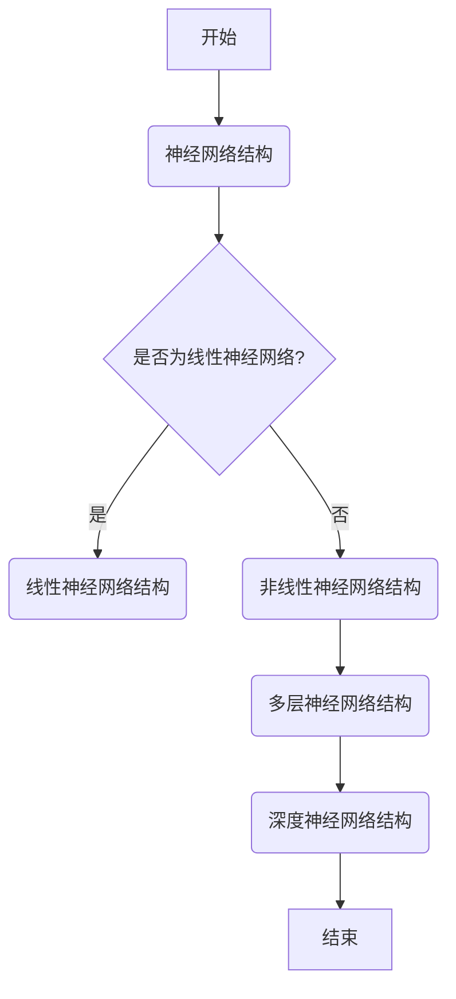

                 

### 文章标题

《神经网络与深度强化学习：一切皆是映射》

### 关键词

神经网络，深度强化学习，映射，计算机科学，人工智能，机器学习，算法，模型，技术博客

### 摘要

本文深入探讨了神经网络与深度强化学习这两个在人工智能领域中至关重要的概念。通过详细分析它们的基本原理、核心算法和实际应用，揭示了“一切皆是映射”的理念。文章从历史背景出发，介绍了神经网络的发展历程，阐述了深度强化学习的定义与优势。接着，文章围绕神经网络的基础知识展开，包括神经元模型、神经网络结构、前向传播与反向传播算法以及激活函数。随后，文章介绍了深度学习算法，如卷积神经网络、循环神经网络和注意力机制，并探讨了生成对抗网络的应用。深度强化学习部分则详细阐述了强化学习的原理、深度 Q 网络和策略梯度方法，以及探索与利用平衡策略。文章进一步探讨了深度强化学习在游戏人工智能、自动驾驶和机器人控制等领域的应用，并分析了神经网络与深度强化学习的结合及其未来趋势。最后，文章提供了相关的学习资源、Mermaid 流程图和伪代码示例，以便读者更好地理解和应用所学内容。

### 《神经网络与深度强化学习：一切皆是映射》目录大纲

#### 第1章 绪论

##### 1.1 神经网络的发展历程

- **神经网络的历史背景**
- **神经网络在计算机科学和人工智能中的地位**

##### 1.2 深度强化学习的基本概念

- **强化学习的定义与分类**
- **深度强化学习的优势与挑战**

##### 1.3 本书结构安排

- **各章节主要内容与联系**

#### 第2章 神经网络基础

##### 2.1 神经元模型

- **神经元的工作原理**
- **神经元模型的数学表示**

##### 2.2 神经网络结构

- **线性神经网络**
- **非线性神经网络**
- **神经网络层次结构**

##### 2.3 前向传播与反向传播

- **前向传播算法**
- **反向传播算法**

##### 2.4 激活函数

- **激活函数的类型**
- **常见激活函数的分析与应用**

#### 第3章 深度学习算法

##### 3.1 卷积神经网络

- **卷积神经网络的基本结构**
- **卷积神经网络在图像处理中的应用**

##### 3.2 循环神经网络

- **循环神经网络的基本结构**
- **循环神经网络在序列数据处理中的应用**

##### 3.3 注意力机制

- **注意力机制的原理**
- **注意力机制在深度学习中的应用**

##### 3.4 生成对抗网络

- **生成对抗网络的基本结构**
- **生成对抗网络在图像生成与分类中的应用**

#### 第4章 深度强化学习基础

##### 4.1 强化学习原理

- **强化学习的定义**
- **强化学习的奖励机制**

##### 4.2 深度 Q 网络

- **深度 Q 网络的基本原理**
- **深度 Q 网络的优化算法**

##### 4.3 Policy Gradient方法

- **Policy Gradient方法的原理**
- **Policy Gradient方法的优化算法**

##### 4.4 威尔逊探索与利用平衡

- **探索与利用的概念**
- **威尔逊探索与利用平衡策略**

#### 第5章 深度强化学习应用

##### 5.1 游戏人工智能

- **深度强化学习在游戏人工智能中的应用**
- **游戏人工智能的挑战与解决方案**

##### 5.2 自动驾驶

- **自动驾驶系统的工作原理**
- **深度强化学习在自动驾驶中的应用**

##### 5.3 机器人控制

- **机器人控制的基本原理**
- **深度强化学习在机器人控制中的应用**

#### 第6章 神经网络与深度强化学习的结合

##### 6.1 深度强化学习在神经网络中的应用

- **深度强化学习在神经网络训练中的应用**
- **深度强化学习在神经网络优化中的应用**

##### 6.2 神经网络在深度强化学习中的应用

- **神经网络在状态表示中的应用**
- **神经网络在动作空间表示中的应用**

##### 6.3 结合案例分析

- **深度强化学习与神经网络的经典案例**
- **深度强化学习与神经网络在复杂环境中的应用**

#### 第7章 神经网络与深度强化学习的未来趋势

##### 7.1 神经架构搜索

- **神经架构搜索的基本原理**
- **神经架构搜索在神经网络设计中的应用**

##### 7.2 联邦学习

- **联邦学习的原理**
- **联邦学习在神经网络与深度强化学习中的应用**

##### 7.3 未来发展趋势展望

- **神经网络与深度强化学习在人工智能领域的未来发展**

### 第1章 绪论

#### 1.1 神经网络的发展历程

**神经网络的历史背景**

神经网络作为一种模拟人脑信息处理方式的计算模型，其历史可以追溯到20世纪40年代。最初的灵感来源于生物神经系统的结构和功能，这一概念由心理学家McCulloch和数学家Pitts在1943年提出了第一个简单的神经网络模型，即“MC-P模型”。这个模型奠定了神经网络的基础，尽管它在当时的计算能力和理论基础上仍然十分有限。

随后的几十年，神经网络的研究经历了几次起伏。在20世纪50年代和60年代，神经网络受到了广泛关注，但由于计算能力的限制和缺乏有效的学习算法，神经网络的研究陷入低潮。直到20世纪80年代，由于反向传播算法（BP算法）的提出，神经网络的研究重新焕发了生机。

**神经网络在计算机科学和人工智能中的地位**

神经网络在计算机科学和人工智能领域中的地位日益重要。作为一种强大的机器学习模型，神经网络在图像识别、语音识别、自然语言处理等领域取得了显著的成就。特别是深度神经网络的兴起，使得复杂任务的处理变得更加高效和准确。

在计算机视觉领域，神经网络通过卷积神经网络（CNN）实现了图像分类、目标检测和图像生成等多项任务。在语音识别领域，深度神经网络通过循环神经网络（RNN）和长短期记忆网络（LSTM）等模型实现了高精度的语音识别和合成。在自然语言处理领域，神经网络在机器翻译、情感分析、文本生成等方面展现出了强大的能力。

**深度强化学习的基本概念**

深度强化学习（Deep Reinforcement Learning，DRL）是结合了深度学习和强化学习的一种机器学习方法。它通过模拟人类决策过程，使机器能够通过试错和奖励机制来学习复杂任务。

**强化学习的定义与分类**

强化学习是一种通过与环境交互来学习最优行为策略的机器学习方法。与监督学习和无监督学习不同，强化学习侧重于决策过程。在强化学习中，智能体（agent）通过执行动作（action）来获取奖励（reward）并学习最优策略（policy）。

强化学习可以分为以下几类：

1. **基于模型的强化学习**：智能体拥有对环境的完整模型，可以预测环境的状态转移概率和奖励。

2. **基于价值的强化学习**：智能体通过学习状态价值函数（state-value function）和动作价值函数（action-value function）来选择最佳动作。

3. **基于策略的强化学习**：智能体通过学习策略函数（policy function）来直接选择最佳动作。

**深度强化学习的优势与挑战**

深度强化学习通过引入深度神经网络来处理高维状态和动作空间，具有以下优势：

1. **处理高维数据**：深度神经网络能够处理高维状态和动作空间，使得强化学习在复杂环境中具有更强的表现。

2. **自适应能力**：深度强化学习能够通过学习环境模型来适应不同的任务和环境。

3. **增强学习效果**：深度神经网络能够学习到更加复杂的特征和模式，从而提高学习效果和决策能力。

然而，深度强化学习也面临一些挑战：

1. **样本效率问题**：深度强化学习需要大量的样本来训练模型，这使得训练过程非常耗时。

2. **探索与利用的平衡**：智能体需要在探索未知状态和利用已有知识之间找到平衡，这需要设计高效的策略。

3. **收敛性问题**：深度强化学习模型可能会收敛到次优解，特别是在复杂环境中。

**本书结构安排**

本书结构安排如下：

1. **第1章 绪论**：介绍神经网络和深度强化学习的基本概念和背景。

2. **第2章 神经网络基础**：详细讨论神经元模型、神经网络结构、前向传播与反向传播算法以及激活函数。

3. **第3章 深度学习算法**：介绍卷积神经网络、循环神经网络、注意力机制和生成对抗网络。

4. **第4章 深度强化学习基础**：阐述强化学习的原理、深度 Q 网络和策略梯度方法，以及探索与利用平衡策略。

5. **第5章 深度强化学习应用**：探讨深度强化学习在游戏人工智能、自动驾驶和机器人控制等领域的应用。

6. **第6章 神经网络与深度强化学习的结合**：分析神经网络与深度强化学习的结合及其在复杂环境中的应用。

7. **第7章 神经网络与深度强化学习的未来趋势**：展望神经网络与深度强化学习在人工智能领域的未来发展。

通过本书的详细阐述，读者将能够全面了解神经网络和深度强化学习的核心概念、算法原理及其在实际应用中的重要作用。

### 第2章 神经网络基础

神经网络是模拟人脑结构和功能的信息处理系统，其核心组成单元是神经元。本章将深入探讨神经元模型、神经网络结构、前向传播与反向传播算法以及激活函数。

#### 2.1 神经元模型

神经元是神经网络的基本单元，其工作原理类似于人脑中的神经元。一个简单的神经元模型通常包括以下几个部分：

1. **输入层**：神经元接受来自外部或其他神经元的信息。
2. **权重**：每个输入信息都与一个权重相关联，权重决定了输入信息对神经元输出的影响程度。
3. **偏置**：偏置是一个常数，用于调整神经元的输出。
4. **激活函数**：激活函数用于将神经元的输入映射到一个输出值。

神经元的工作原理可以描述为：每个神经元接收多个输入信号，将这些信号与权重相乘后求和，然后加上偏置，最后通过激活函数得到输出值。激活函数的选择决定了神经元的非线性特性，常见的激活函数包括sigmoid函数、ReLU函数和Tanh函数。

数学上，一个简单神经元模型的输出可以表示为：

\[ z = \sum_{i=1}^{n} w_i x_i + b \]
\[ a = \sigma(z) \]

其中，\( x_i \) 表示第 \( i \) 个输入，\( w_i \) 表示第 \( i \) 个输入的权重，\( b \) 表示偏置，\( z \) 表示输入求和后的值，\( a \) 表示神经元的输出，\( \sigma \) 表示激活函数。

#### 2.2 神经网络结构

神经网络根据层次结构的不同可以分为前馈神经网络、循环神经网络和卷积神经网络。本章主要介绍前馈神经网络，它是最基本和最常用的神经网络类型。

**线性神经网络（Linear Neural Network，LNN）**

线性神经网络是最简单的神经网络类型，它由线性层和激活函数组成。线性层通过线性变换将输入映射到输出，而激活函数则引入了非线性的特性。

线性神经网络的结构可以表示为：

\[ z_l = \sum_{i=1}^{n} w_{li} x_i + b_l \]
\[ a_l = \sigma(z_l) \]

其中，\( z_l \) 表示第 \( l \) 层的输入求和值，\( a_l \) 表示第 \( l \) 层的输出，\( \sigma \) 表示激活函数。

**非线性神经网络（Nonlinear Neural Network，NNN）**

非线性神经网络在输入层和隐藏层之间引入了非线性变换，从而能够处理更复杂的非线性问题。非线性神经网络的结构如下：

\[ z_h = \sum_{i=1}^{n} w_{hi} x_i + b_h \]
\[ a_h = \sigma(z_h) \]

\[ z_o = \sum_{i=1}^{n} w_{oi} a_h + b_o \]
\[ a_o = \sigma(z_o) \]

其中，\( z_h \) 表示隐藏层的输入求和值，\( a_h \) 表示隐藏层的输出，\( z_o \) 表示输出层的输入求和值，\( a_o \) 表示输出层的输出。

**神经网络层次结构**

神经网络可以根据层次结构的不同分为单层神经网络、多层神经网络和深度神经网络。单层神经网络只有一个隐藏层，多层神经网络有两个或更多隐藏层，而深度神经网络有多个隐藏层。

**前向传播算法**

前向传播算法是指从输入层开始，将输入信息逐层传递到输出层的算法。在每层中，输入信息与权重相乘后求和，再加上偏置，最后通过激活函数得到输出值。前向传播算法的伪代码如下：

```
for each layer l from 1 to L:
    z_l = weighted_sum_of_inputs + bias
    a_l = activation_function(z_l)
end for
```

其中，\( L \) 表示网络的总层数。

**反向传播算法**

反向传播算法是一种用于训练神经网络的算法，它通过计算输出误差来更新网络的权重和偏置。反向传播算法的核心思想是将输出误差反向传播到每一层，并利用梯度下降法更新权重和偏置。

反向传播算法的伪代码如下：

```
for each layer l from L to 1:
    delta_l = (derivative_of_activation_function(a_l) * derivative_of_loss_function(a_l, y))
    weight_update_l = learning_rate * delta_l * a_{l-1}
    bias_update_l = learning_rate * delta_l
    weights[l] = weights[l] - weight_update_l
    biases[l] = biases[l] - bias_update_l
end for
```

其中，\( y \) 表示实际输出，\( \delta_l \) 表示第 \( l \) 层的误差，\( \alpha \) 表示学习率。

#### 2.3 激活函数

激活函数是神经网络中的关键组成部分，它引入了非线性的特性，使得神经网络能够处理复杂的问题。常见的激活函数包括sigmoid函数、ReLU函数和Tanh函数。

**sigmoid函数**

sigmoid函数是一种常见的激活函数，其形式为：

\[ \sigma(x) = \frac{1}{1 + e^{-x}} \]

sigmoid函数的输出值介于0和1之间，具有平滑的S型曲线。

**ReLU函数**

ReLU函数是一种流行的激活函数，其形式为：

\[ \text{ReLU}(x) = \max(0, x) \]

ReLU函数在0处具有陡峭的梯度，能够加速网络的训练。

**Tanh函数**

Tanh函数是一种类似于sigmoid函数的激活函数，其形式为：

\[ \text{Tanh}(x) = \frac{e^x - e^{-x}}{e^x + e^{-x}} \]

Tanh函数的输出值介于-1和1之间，具有平滑的S型曲线。

**激活函数的类型**

除了上述常见的激活函数外，还有其他类型的激活函数，如Softmax函数、Sigmoid Cross Entropy函数和Hyperbolic Tangent函数等。

**常见激活函数的分析与应用**

1. **sigmoid函数**：常用于二分类问题，能够将输入映射到0和1之间，但训练速度较慢。

2. **ReLU函数**：常用于深度神经网络，能够加速训练，并在训练过程中避免梯度消失和梯度爆炸问题。

3. **Tanh函数**：常用于处理负数输入，能够将输入映射到-1和1之间，适用于多分类问题。

通过本章的讨论，读者将能够深入理解神经网络的基础知识，包括神经元模型、神经网络结构、前向传播与反向传播算法以及激活函数。这些知识将为后续章节中的深度学习算法和深度强化学习打下坚实的基础。

### 第3章 深度学习算法

深度学习算法是神经网络的一种扩展，通过增加网络的层数来提高模型的表达能力。本章将介绍几种重要的深度学习算法，包括卷积神经网络（CNN）、循环神经网络（RNN）、注意力机制以及生成对抗网络（GAN）。

#### 3.1 卷积神经网络（CNN）

卷积神经网络（Convolutional Neural Network，CNN）是一种专门用于处理图像数据的深度学习算法。其核心思想是通过卷积操作提取图像中的特征，然后通过池化操作降低数据的维度。

**卷积神经网络的基本结构**

卷积神经网络由输入层、多个卷积层、池化层和全连接层组成。卷积层通过卷积操作提取图像特征，池化层用于降低数据维度并减少过拟合，全连接层用于分类和预测。

卷积神经网络的结构可以表示为：

\[ \text{Input} \rightarrow \text{Conv} \rightarrow \text{ReLU} \rightarrow \text{Pooling} \rightarrow \text{Fully Connected} \]

**卷积神经网络在图像处理中的应用**

卷积神经网络在图像处理领域有广泛的应用，包括图像分类、目标检测、图像分割和图像生成等。

1. **图像分类**：卷积神经网络可以用于对图像进行分类，例如将图像分类为猫或狗。通过训练大量的图像数据，卷积神经网络可以学习到图像中的特征，并准确分类新的图像。

2. **目标检测**：卷积神经网络可以用于检测图像中的目标对象。通过在图像中定位目标对象的位置和类别，卷积神经网络可以实现对复杂场景的实时监控和目标跟踪。

3. **图像分割**：卷积神经网络可以用于将图像分割成不同的区域。通过将图像中的每个像素点分类为前景或背景，卷积神经网络可以实现图像的精细分割。

4. **图像生成**：卷积神经网络可以用于生成新的图像。通过训练大量的图像数据，卷积神经网络可以学习到图像的特征，并生成与训练数据相似的图像。

#### 3.2 循环神经网络（RNN）

循环神经网络（Recurrent Neural Network，RNN）是一种用于处理序列数据的深度学习算法。与传统的神经网络不同，RNN具有时间动态性，可以处理输入序列的时序信息。

**循环神经网络的基本结构**

循环神经网络由输入层、隐藏层和输出层组成。隐藏层包含了循环连接，使得信息可以沿着时间轴传递。

循环神经网络的结构可以表示为：

\[ \text{Input} \rightarrow \text{Hidden} \rightarrow \text{Output} \]

**循环神经网络在序列数据处理中的应用**

循环神经网络在序列数据处理领域有广泛的应用，包括时间序列预测、语言建模和语音识别等。

1. **时间序列预测**：循环神经网络可以用于预测时间序列的未来值。通过学习历史时间序列数据，循环神经网络可以捕捉时间序列的动态变化，并准确预测未来的趋势。

2. **语言建模**：循环神经网络可以用于建模语言数据，例如文本和语音。通过学习大量的语言数据，循环神经网络可以生成新的文本或语音，并保持语言的自然性和连贯性。

3. **语音识别**：循环神经网络可以用于将语音信号转换为文本。通过学习语音信号和文本之间的映射关系，循环神经网络可以准确地识别和理解语音。

#### 3.3 注意力机制

注意力机制（Attention Mechanism）是一种用于提高模型在处理序列数据时对重要信息关注度的深度学习算法。通过引入注意力机制，模型可以动态地调整对输入序列中不同部分的关注程度，从而提高模型的性能。

**注意力机制的原理**

注意力机制通过计算注意力得分来动态调整对输入序列中不同部分的关注程度。注意力得分通常通过一个加权求和的方式计算，每个输入序列的元素都会得到一个权重，权重的大小反映了该元素的重要程度。

注意力机制可以表示为：

\[ \text{Attention}(\text{Input}) = \text{Score}(\text{Input}) \cdot \text{Query} \]

其中，\( \text{Score}(\text{Input}) \) 表示注意力得分函数，\( \text{Query} \) 表示查询向量。

**注意力机制在深度学习中的应用**

注意力机制在深度学习中有广泛的应用，包括机器翻译、文本摘要和图像分类等。

1. **机器翻译**：注意力机制可以用于将源语言的每个词与目标语言的每个词进行关联，从而提高翻译的准确性。

2. **文本摘要**：注意力机制可以用于从大量的文本数据中提取关键信息，生成简洁的摘要。

3. **图像分类**：注意力机制可以用于识别图像中的重要区域，从而提高图像分类的准确性。

#### 3.4 生成对抗网络（GAN）

生成对抗网络（Generative Adversarial Network，GAN）是一种由生成器和判别器组成的深度学习算法。生成器尝试生成与真实数据相似的数据，而判别器则判断生成数据是否真实。通过生成器和判别器的对抗训练，GAN可以学习到真实数据的分布，并生成高质量的数据。

**生成对抗网络的基本结构**

生成对抗网络由生成器和判别器组成，两者相互对抗。生成器的目标是生成类似于真实数据的数据，而判别器的目标是准确区分生成数据和真实数据。

生成对抗网络的结构可以表示为：

\[ \text{Generator} \stackrel{\theta_G}{\rightarrow} \text{Data} \stackrel{\theta_D}{\leftarrow} \text{Discriminator} \]

**生成对抗网络在图像生成与分类中的应用**

生成对抗网络在图像生成与分类领域有广泛的应用。

1. **图像生成**：生成器通过学习真实图像的分布，生成高质量的图像。GAN可以生成逼真的图像，并在图像生成任务中表现出色。

2. **图像分类**：判别器可以用于训练分类模型，通过区分真实图像和生成图像，提高分类模型的准确性。

3. **数据增强**：生成对抗网络可以用于生成新的数据样本，从而增加训练数据的多样性，提高模型的泛化能力。

通过本章的讨论，读者将能够了解卷积神经网络、循环神经网络、注意力机制和生成对抗网络的基本原理和应用。这些深度学习算法在图像处理、序列数据处理和图像生成等任务中具有广泛的应用，为人工智能领域的发展做出了重要贡献。

### 第4章 深度强化学习基础

深度强化学习（Deep Reinforcement Learning，DRL）是结合了深度学习和强化学习的一种先进技术，通过模拟人类决策过程，使机器能够在复杂的动态环境中进行自主学习和决策。本章将详细阐述强化学习的基本原理，特别是深度 Q 网络（Deep Q-Network，DQN）和策略梯度方法（Policy Gradient Methods），并探讨探索与利用平衡策略。

#### 4.1 强化学习原理

强化学习（Reinforcement Learning，RL）是一种通过与环境交互来学习最优行为策略的机器学习方法。在强化学习中，智能体（Agent）通过执行动作（Action）来获取奖励（Reward）并学习最优策略（Policy）。与监督学习和无监督学习不同，强化学习侧重于决策过程。

**强化学习的定义**

强化学习可以定义为一个决策过程，其中智能体在环境中采取动作，通过获取奖励来学习最大化长期奖励。

**强化学习的奖励机制**

奖励机制是强化学习中的核心部分，用于指导智能体的行为。奖励可以是正的或负的，正奖励鼓励智能体采取某种动作，而负奖励则抑制智能体采取某种动作。奖励机制的设计对于智能体的学习效果至关重要。

**智能体、环境和奖励的关系**

在强化学习中，智能体、环境和奖励之间相互作用。智能体通过感知环境状态，选择最优动作，然后根据动作的结果获取奖励，并通过这个反馈过程不断调整策略。

**强化学习的目标**

强化学习的目标是找到一种策略，使得智能体在长期执行动作时能够最大化累积奖励。

**强化学习的分类**

强化学习可以分为基于模型的强化学习和无模型强化学习。

1. **基于模型的强化学习**：智能体拥有对环境的完整模型，可以预测环境的状态转移概率和奖励。
2. **无模型强化学习**：智能体没有对环境的完整模型，只能通过实际交互来学习环境。

#### 4.2 深度 Q 网络（DQN）

深度 Q 网络（Deep Q-Network，DQN）是一种基于深度学习的强化学习算法，它通过使用深度神经网络来近似 Q 函数，从而实现智能体的决策。Q 函数是一个状态-动作值函数，它表示在特定状态下执行特定动作的期望奖励。

**深度 Q 网络的基本原理**

深度 Q 网络的核心思想是使用深度神经网络来学习 Q 函数，然后根据 Q 函数的值来选择最优动作。具体来说，DQN 通过以下步骤进行训练：

1. **初始化 Q 网络**：初始化深度神经网络，用于近似 Q 函数。
2. **选择动作**：使用 ε-贪心策略选择动作，其中 ε 是一个较小的常数，用于控制探索与利用的平衡。
3. **执行动作**：在环境中执行选择的动作，并获取状态转移和奖励。
4. **更新 Q 网络**：根据收到的奖励和新的状态，使用经验回放和目标网络来更新 Q 网络。

**深度 Q 网络的优化算法**

深度 Q 网络的优化算法主要包括以下几种：

1. **经验回放**：经验回放（Experience Replay）是一种常用的策略，用于避免训练数据偏差。通过将历史经验数据存储在经验池中，然后随机从经验池中抽取样本进行训练，从而减少数据的关联性。
2. **目标网络**：目标网络（Target Network）是一种用于稳定训练的方法。它通过定期更新 Q 网络的副本，使得训练过程更加稳定。

**DQN的伪代码**

```python
# 初始化 Q 网络
Initialize Q-network

# 对于每个 episode
for episode in 1 to max_episodes do
    # 初始化状态 s
    s = initialize_state()

    # 在环境中执行动作
    while not done do
        # 使用 ε-贪心策略选择动作 a
        a = epsilon_greedy_action(s, Q(s, a))

        # 执行动作，获取奖励 r 和下一个状态 s'
        s', r, done = environment.step(a)

        # 存储经验
        Experience Replay Buffer.append((s, a, r, s'))

        # 更新状态
        s = s'

    end
end

# 使用经验数据进行训练
for episode in 1 to max_episodes do
    # 从经验回放池中随机抽取一批经验
    batch = Experience Replay Buffer.sample(batch_size)

    # 计算目标 Q 值
    target_Q = r + gamma * max(Q(s', a'))

    # 计算梯度
    gradient = (target_Q - Q(s, a)) * derivative_of_loss_function(Q(s, a))

    # 更新 Q 网络
    Q(s, a) = Q(s, a) - learning_rate * gradient
end
```

#### 4.3 Policy Gradient方法

策略梯度方法（Policy Gradient Methods）是一种基于策略的强化学习方法，它通过直接优化策略来最大化累积奖励。策略梯度方法的核心思想是更新策略参数，使得智能体在选择动作时能够获得更高的奖励。

**Policy Gradient方法的原理**

策略梯度方法的基本原理是通过计算策略的梯度来更新策略参数。策略梯度公式可以表示为：

\[ \nabla_{\theta} J(\theta) = \nabla_{\theta} \sum_{t=0}^{T} \gamma^t r_t = \sum_{t=0}^{T} \nabla_{\theta} \log \pi_{\theta}(a_t|s_t) r_t \]

其中，\( \theta \) 是策略参数，\( J(\theta) \) 是策略的回报，\( \pi_{\theta}(a_t|s_t) \) 是策略概率，\( r_t \) 是第 \( t \) 个时间步的奖励，\( \gamma \) 是折扣因子。

**Policy Gradient方法的优化算法**

策略梯度方法通常使用梯度上升法来更新策略参数。具体来说，策略梯度方法通过以下步骤进行训练：

1. **初始化策略参数**：初始化策略参数。
2. **执行动作**：根据当前策略选择动作。
3. **计算梯度**：计算策略的梯度。
4. **更新策略参数**：使用梯度上升法更新策略参数。

**策略梯度方法的伪代码**

```python
# 初始化策略参数
Initialize policy parameters

# 对于每个 episode
for episode in 1 to max_episodes do
    # 初始化状态 s
    s = initialize_state()

    # 在环境中执行动作
    while not done do
        # 执行动作，获取奖励 r 和下一个状态 s'
        a = policy(s, parameters)
        s', r, done = environment.step(a)

        # 计算策略梯度
        gradient = compute_gradient(a, r, s, s', parameters)

        # 更新策略参数
        parameters = parameters + learning_rate * gradient

        # 更新状态
        s = s'
    end
end
```

#### 4.4 威尔逊探索与利用平衡

探索与利用平衡（Exploration vs. Exploitation Balance）是强化学习中一个关键问题。探索是指智能体在未知的未知环境中尝试新动作以获取更多信息，而利用是指智能体利用已有知识来最大化累积奖励。

**探索与利用的概念**

1. **探索（Exploration）**：探索是智能体在未知的未知环境中尝试新动作的行为，以获取更多的信息。探索有助于智能体发现更好的策略。
2. **利用（Exploitation）**：利用是智能体利用已有的知识来选择最佳动作的行为，以最大化累积奖励。

**威尔逊探索与利用平衡策略**

威尔逊探索与利用平衡策略（Wilson探索与利用平衡策略）是一种经典的平衡策略，通过调整 ε 值来控制探索与利用的平衡。

威尔逊探索与利用平衡策略的伪代码如下：

```python
# 初始化 ε 和 ε 减小率
epsilon = 1.0
epsilon_decay = 0.99

# 对于每个 episode
for episode in 1 to max_episodes do
    # 初始化状态 s
    s = initialize_state()

    # 在环境中执行动作
    while not done do
        # 如果随机选择，进行探索
        if random() < epsilon:
            a = random_action()
        # 否则进行利用
        else:
            a = best_action(s)

        # 执行动作，获取奖励 r 和下一个状态 s'
        s', r, done = environment.step(a)

        # 更新 ε 值
        epsilon = epsilon * epsilon_decay

        # 更新状态
        s = s'
    end
end
```

通过本章的讨论，读者将能够深入理解深度强化学习的基础概念，包括强化学习的原理、深度 Q 网络和策略梯度方法，以及探索与利用平衡策略。这些知识为深入研究和应用深度强化学习提供了坚实的基础。

### 第5章 深度强化学习应用

深度强化学习（Deep Reinforcement Learning，DRL）通过模拟人类决策过程，使机器能够在复杂的动态环境中进行自主学习和决策。本章将探讨深度强化学习在游戏人工智能、自动驾驶和机器人控制等领域的应用，并分析其中的挑战和解决方案。

#### 5.1 游戏人工智能

游戏人工智能（Game AI）是深度强化学习的典型应用之一。通过深度强化学习，智能体可以自主学习和掌握复杂的游戏策略，从而在游戏中实现超越人类玩家的高水平表现。

**深度强化学习在游戏人工智能中的应用**

1. **围棋**：围棋是一种古老的棋类游戏，具有高度复杂的策略和决策。通过深度强化学习，特别是深度 Q 网络（DQN）和策略梯度方法，智能体可以在短时间内学会复杂的围棋策略，并在对弈中取得优异成绩。AlphaGo 是深度强化学习在围棋领域的一个重要里程碑。

2. **Atari 游戏**：Atari 游戏是经典的电子游戏，具有丰富的视觉输入和复杂的决策过程。通过深度强化学习，智能体可以在不依赖人工设计的策略的情况下，自主学习和掌握游戏的玩法，并在多种 Atar 游戏中实现高分表现。

3. **现代游戏**：现代游戏，如《星际争霸II》、《Dota 2》等，具有更加复杂的游戏机制和决策过程。通过深度强化学习，智能体可以学习到高水平的游戏策略，并在游戏中实现与人类玩家的对抗。

**游戏人工智能的挑战与解决方案**

1. **样本效率问题**：游戏人工智能的一个主要挑战是样本效率问题。游戏环境的复杂性和多样性导致智能体需要大量的样本来学习游戏策略。为了提高样本效率，可以采用经验回放（Experience Replay）和优先经验回放（Prioritized Experience Replay）等方法，以充分利用历史经验数据。

2. **计算资源消耗**：深度强化学习需要大量的计算资源，特别是在训练深度神经网络时。为了解决计算资源消耗的问题，可以采用分布式训练（Distributed Training）和模型压缩（Model Compression）等方法，以加速训练过程。

3. **探索与利用的平衡**：在游戏人工智能中，智能体需要在探索未知策略和利用已有策略之间找到平衡。为了实现探索与利用的平衡，可以采用ε-贪心策略（ε-Greedy Policy）和温度策略（Temperature-Based Policy）等方法。

#### 5.2 自动驾驶

自动驾驶是另一个深度强化学习的应用领域。通过深度强化学习，智能体可以自主学习和掌握自动驾驶的策略，从而在复杂的交通环境中实现安全、高效的自动驾驶。

**自动驾驶系统的工作原理**

1. **感知系统**：自动驾驶系统首先通过感知系统获取周围环境的图像、雷达和激光雷达数据，以识别道路、车辆、行人等交通元素。

2. **决策系统**：基于感知系统收集的数据，自动驾驶系统通过深度强化学习模型生成最优的控制策略，包括转向、加速和制动等操作。

3. **执行系统**：自动驾驶系统根据决策系统生成的控制策略，控制车辆执行相应的操作。

**深度强化学习在自动驾驶中的应用**

1. **路径规划**：深度强化学习可以用于路径规划，通过学习环境中的交通规则和道路结构，生成最优的行驶路径。

2. **行为预测**：深度强化学习可以用于预测其他车辆、行人的行为，从而在复杂的交通环境中实现安全驾驶。

3. **控制策略**：深度强化学习可以用于生成自动驾驶的控制策略，包括转向、加速和制动等操作。

**自动驾驶中的挑战与解决方案**

1. **环境复杂性**：自动驾驶系统需要应对复杂的交通环境，包括不同类型的道路、交通信号和天气条件等。为了解决环境复杂性，可以采用多模态感知（Multimodal Perception）和联邦学习（Federated Learning）等方法，以提高系统的鲁棒性和适应性。

2. **安全性**：自动驾驶系统的安全性至关重要。为了确保系统的安全性，可以采用安全性分析（Safety Analysis）和测试验证（Test Verification）等方法，以检测和消除潜在的安全隐患。

3. **实时性**：自动驾驶系统需要在实时环境中进行决策和操作，这对系统的响应速度和计算效率提出了高要求。为了实现实时性，可以采用模型压缩（Model Compression）和并行计算（Parallel Computation）等方法，以提高系统的处理速度。

#### 5.3 机器人控制

机器人控制是深度强化学习的另一个重要应用领域。通过深度强化学习，机器人可以自主学习和掌握复杂的行为任务，从而在工业制造、医疗护理和家政服务等领域发挥重要作用。

**机器人控制的基本原理**

1. **感知系统**：机器人通过感知系统获取周围环境的图像、激光雷达和力传感器数据，以识别物体、空间和障碍物等。

2. **决策系统**：基于感知系统收集的数据，机器人通过深度强化学习模型生成最优的控制策略，包括移动、抓取和装配等操作。

3. **执行系统**：机器人根据决策系统生成的控制策略，执行相应的操作。

**深度强化学习在机器人控制中的应用**

1. **路径规划**：深度强化学习可以用于路径规划，通过学习环境中的路径结构和障碍物，生成最优的移动路径。

2. **行为学习**：深度强化学习可以用于学习复杂的行为任务，如抓取、装配和搬运等。

3. **任务规划**：深度强化学习可以用于任务规划，通过学习不同任务的需求和执行策略，生成最优的任务规划方案。

**机器人控制中的挑战与解决方案**

1. **环境不确定性**：机器人控制中的环境通常是不确定的，包括动态的障碍物和变化的工作环境等。为了解决环境不确定性，可以采用自适应控制（Adaptive Control）和强化学习与模型预测控制（Reinforcement Learning with Model Predictive Control）等方法，以提高系统的鲁棒性和适应性。

2. **数据获取与处理**：机器人控制需要大量的数据来训练深度强化学习模型。为了解决数据获取与处理的问题，可以采用数据增强（Data Augmentation）和迁移学习（Transfer Learning）等方法，以提高模型的泛化能力和数据处理效率。

3. **实时控制**：机器人控制需要实时响应环境变化，对控制系统的实时性和稳定性提出了高要求。为了实现实时控制，可以采用实时操作系统（Real-Time Operating System）和模型压缩（Model Compression）等方法，以提高系统的响应速度和控制精度。

通过本章的讨论，读者将能够深入理解深度强化学习在游戏人工智能、自动驾驶和机器人控制等领域的应用，并了解其中的挑战和解决方案。这些应用案例展示了深度强化学习在复杂动态环境中的强大能力，为人工智能技术的发展和应用提供了新的思路和方法。

### 第6章 神经网络与深度强化学习的结合

神经网络与深度强化学习的结合是人工智能领域中的一个重要研究方向。这种结合不仅能够充分发挥两种技术的优势，还能够解决一些单独使用神经网络或深度强化学习时遇到的问题。本章将探讨神经网络在深度强化学习中的应用，以及深度强化学习在神经网络优化中的作用，并分析一些经典案例。

#### 6.1 深度强化学习在神经网络中的应用

深度强化学习在神经网络中的应用主要体现在以下几个方面：

**深度强化学习在神经网络训练中的应用**

深度强化学习可以用于优化神经网络的训练过程。通过使用深度强化学习算法，智能体可以自动调整神经网络的参数，从而提高训练效果。具体来说，深度强化学习可以用于以下任务：

1. **超参数优化**：深度强化学习可以用于自动调整神经网络的学习率、批量大小等超参数，从而提高训练效率和模型性能。

2. **架构搜索**：深度强化学习可以用于搜索最优的神经网络架构。通过学习大量的神经网络架构，智能体可以找到适合特定任务的最佳架构。

3. **模型压缩**：深度强化学习可以用于压缩神经网络模型，从而减小模型的存储空间和计算开销。通过学习如何剪枝和量化神经网络，智能体可以生成更加紧凑的模型。

**深度强化学习在神经网络优化中的应用**

深度强化学习不仅可以用于优化神经网络的训练过程，还可以用于优化神经网络的性能。通过学习如何优化神经网络的行为，智能体可以生成更加高效和准确的模型。具体来说，深度强化学习可以用于以下任务：

1. **动态调整学习策略**：深度强化学习可以用于动态调整神经网络的学习策略，从而在训练过程中自适应地调整学习速率和探索程度。

2. **状态表示学习**：深度强化学习可以用于学习神经网络的状态表示，从而提高模型对复杂环境的理解能力。

3. **动作表示学习**：深度强化学习可以用于学习神经网络的动作表示，从而提高模型在复杂环境中的决策能力。

#### 6.2 神经网络在深度强化学习中的应用

神经网络在深度强化学习中的应用主要体现在以下几个方面：

**神经网络在状态表示中的应用**

神经网络可以用于表示深度强化学习中的状态。通过使用神经网络，智能体可以自动学习状态的特征表示，从而提高对环境的理解能力。具体来说，神经网络可以用于以下任务：

1. **特征提取**：神经网络可以用于提取状态的特征，从而将高维状态映射到低维空间。这种特征提取有助于简化问题，提高模型的计算效率。

2. **状态压缩**：神经网络可以用于压缩状态，从而减少模型所需的存储空间和计算资源。

3. **状态增强**：神经网络可以用于增强状态，从而提高模型对环境变化的敏感度。

**神经网络在动作空间表示中的应用**

神经网络可以用于表示深度强化学习中的动作。通过使用神经网络，智能体可以自动学习动作的特征表示，从而提高对环境的响应能力。具体来说，神经网络可以用于以下任务：

1. **动作分类**：神经网络可以用于将动作分类，从而提高模型对动作的识别能力。

2. **动作规划**：神经网络可以用于生成动作规划，从而帮助智能体在复杂环境中做出决策。

3. **动作增强**：神经网络可以用于增强动作，从而提高模型在特定任务中的表现。

#### 6.3 结合案例分析

**案例一：智能交通信号控制系统**

智能交通信号控制系统是神经网络与深度强化学习结合的一个经典案例。在这个案例中，神经网络用于表示交通信号的状态和动作，而深度强化学习用于优化交通信号的控制策略。

具体来说，神经网络通过学习交通信号灯的状态和动作，提取关键特征，并生成交通信号控制策略。深度强化学习则通过模拟环境，优化神经网络生成的控制策略，从而提高交通信号的控制效率和安全性。

**案例二：自动驾驶车辆控制**

自动驾驶车辆控制是另一个神经网络与深度强化学习结合的经典案例。在这个案例中，神经网络用于表示车辆的状态和动作，而深度强化学习用于优化车辆的控制策略。

具体来说，神经网络通过学习车辆的状态和动作，提取关键特征，并生成自动驾驶控制策略。深度强化学习则通过模拟环境，优化神经网络生成的控制策略，从而提高自动驾驶车辆的稳定性和安全性。

**案例三：机器人路径规划**

机器人路径规划是神经网络与深度强化学习结合的另一个经典案例。在这个案例中，神经网络用于表示机器人的状态和动作，而深度强化学习用于优化机器人的路径规划策略。

具体来说，神经网络通过学习机器人的状态和动作，提取关键特征，并生成机器人路径规划策略。深度强化学习则通过模拟环境，优化神经网络生成的路径规划策略，从而提高机器人在复杂环境中的路径规划效率和安全性。

通过这些案例，我们可以看到神经网络与深度强化学习的结合在复杂动态环境中的应用价值。这种结合不仅能够提高智能体的学习能力和决策能力，还能够解决一些单独使用神经网络或深度强化学习时遇到的问题。未来，随着技术的不断发展和应用的不断拓展，神经网络与深度强化学习的结合将发挥更加重要的作用。

### 第7章 神经网络与深度强化学习的未来趋势

随着技术的不断进步和应用场景的日益丰富，神经网络与深度强化学习在人工智能领域的发展前景广阔。本章将探讨神经网络与深度强化学习的未来趋势，包括神经架构搜索和联邦学习等方面。

#### 7.1 神经架构搜索

神经架构搜索（Neural Architecture Search，NAS）是一种自动搜索神经网络结构的方法。通过使用强化学习或其他优化算法，NAS可以自动发现最优的网络结构，从而提高模型的性能。

**神经架构搜索的基本原理**

神经架构搜索的基本原理是通过训练一个搜索算法，使其能够自动发现最优的网络结构。具体来说，NAS可以分为以下几个步骤：

1. **架构编码**：将神经网络的不同部分（如层、单元、连接等）编码成一组参数，形成一个搜索空间。

2. **搜索算法**：使用强化学习或其他优化算法，如遗传算法、梯度上升法等，对搜索空间进行搜索。

3. **性能评估**：在训练集上评估搜索到的网络结构的性能，选择最优的网络结构进行训练。

**神经架构搜索在神经网络设计中的应用**

神经架构搜索在神经网络设计中的应用主要体现在以下几个方面：

1. **自动设计网络结构**：NAS可以自动设计复杂的神经网络结构，从而提高模型的性能。

2. **优化网络参数**：NAS可以优化网络中的连接权重、激活函数等参数，从而提高模型的泛化能力和计算效率。

3. **减少模型复杂性**：NAS可以自动发现简单而有效的网络结构，从而减少模型的复杂性，提高模型的计算效率。

**未来发展趋势**

随着深度学习模型的规模和复杂性的不断增加，神经架构搜索将在未来的神经网络设计中发挥重要作用。未来，NAS可能会与生成对抗网络（GAN）、元学习（Meta-Learning）等技术相结合，进一步提升模型的设计效率和性能。

#### 7.2 联邦学习

联邦学习（Federated Learning）是一种分布式机器学习方法，它允许多个参与者（如移动设备、服务器等）共同训练一个共享模型，而不需要交换他们的数据。联邦学习在保护隐私和数据安全的同时，提高了模型的训练效率和适应性。

**联邦学习的原理**

联邦学习的基本原理是通过聚合多个参与者的本地模型更新，逐步优化全局模型。具体来说，联邦学习可以分为以下几个步骤：

1. **本地训练**：每个参与者在自己的设备上训练本地模型。

2. **模型更新**：每个参与者将本地模型的更新发送到中心服务器。

3. **全局聚合**：中心服务器聚合所有参与者的模型更新，生成全局模型。

4. **本地更新**：每个参与者使用全局模型更新本地模型。

**联邦学习在神经网络与深度强化学习中的应用**

联邦学习在神经网络与深度强化学习中的应用主要体现在以下几个方面：

1. **隐私保护**：联邦学习可以保护参与者的数据隐私，避免数据泄露。

2. **数据分布不均**：联邦学习可以处理数据分布不均的问题，通过聚合多个参与者的数据，提高模型的泛化能力。

3. **设备计算资源有限**：联邦学习可以充分利用参与者的计算资源，提高模型训练的效率。

**未来发展趋势**

随着物联网（IoT）和移动设备的发展，联邦学习将在未来的神经网络与深度强化学习应用中发挥重要作用。未来，联邦学习可能会与区块链、差分隐私等新兴技术相结合，进一步提升隐私保护和数据安全性。

#### 7.3 未来发展趋势展望

神经网络与深度强化学习在人工智能领域的未来发展将呈现以下趋势：

1. **模型规模与复杂性的增加**：随着计算能力的提升，神经网络与深度强化学习模型的规模和复杂性将不断增加，以应对更复杂、更动态的环境。

2. **跨领域的应用拓展**：神经网络与深度强化学习将在更多领域得到应用，如医疗、金融、工业等，推动人工智能技术的全面发展。

3. **硬件与软件的优化**：为了支持更大规模、更复杂模型的训练和应用，硬件（如GPU、TPU）和软件（如深度学习框架）将进行优化和升级。

4. **伦理与法规的规范化**：随着人工智能技术的发展，伦理和法规问题将日益突出，神经网络与深度强化学习的应用将需要遵守更严格的规范和标准。

5. **开放合作与生态建设**：为了推动神经网络与深度强化学习的创新和应用，学术界和产业界将加强合作，共同构建开放、共享的生态系统。

通过本章的讨论，读者可以了解到神经网络与深度强化学习的未来发展趋势，以及这些技术在人工智能领域中的广阔应用前景。随着技术的不断进步，神经网络与深度强化学习将在未来的人工智能发展中扮演更加重要的角色。

### 附录

#### 附录 A: 神经网络与深度强化学习资源

**学习资源推荐**

1. **在线课程**：
   - **《深度学习》**：吴恩达在Coursera上的深度学习课程，涵盖了神经网络的基础知识。
   - **《强化学习》**：David Silver在YouTube上的强化学习课程，详细讲解了强化学习的基本概念和算法。

2. **书籍**：
   - **《深度学习》**：Goodfellow、Bengio和Courville合著，是深度学习的经典教材。
   - **《强化学习》**：Richard S. Sutton和Barto著，是强化学习的权威教材。

3. **在线教程**：
   - **TensorFlow官方文档**：提供了丰富的深度学习教程和实践案例。
   - **PyTorch官方文档**：提供了详细的循环神经网络和生成对抗网络的教程。

**常用的神经网络与深度强化学习工具**

1. **TensorFlow**：谷歌开源的深度学习框架，适用于构建和训练各种神经网络模型。

2. **PyTorch**：Facebook开源的深度学习框架，提供了灵活的动态计算图和丰富的API。

3. **Keras**：Python深度学习库，可以方便地搭建和训练神经网络模型。

4. **OpenAI Gym**：开源的强化学习环境库，提供了多种经典的强化学习任务和环境。

5. **ML5.js**：一个基于TensorFlow.js的JavaScript库，允许开发者在线构建和训练神经网络模型。

#### 附录 B: Mermaid 流程图与伪代码示例

**Mermaid 流程图示例**



**伪代码示例**

```python
# 深度 Q 网络算法伪代码

# 初始化 Q(s, a)
Initialize Q(s, a)

# 对于每个 episode
for episode in 1 to max_episodes do
    # 初始化状态 s
    s = initialize_state()

    # 在环境中执行动作
    while not done do
        # 使用 ε-贪心策略选择动作 a
        a = epsilon_greedy_action(s, Q(s, a))

        # 执行动作，获取奖励 r 和下一个状态 s'
        s', r, done = environment.step(a)

        # 更新 Q(s, a)
        Q(s, a) = Q(s, a) + alpha * (r + gamma * max(Q(s', a')) - Q(s, a))

        # 更新状态
        s = s'
    end
end
```

#### 附录 C: 数学模型与公式

**神经网络损失函数**

$$
L(\theta) = -\frac{1}{m}\sum_{i=1}^{m}y^{(i)}\log(a^{(L)}_{i}),
$$

其中，$y^{(i)}$ 是第 $i$ 个样本的标签，$a^{(L)}_{i}$ 是输出层的激活值。

**深度 Q 网络目标函数**

$$
J(\theta) = \frac{1}{N}\sum_{i=1}^{N}(y^{(i)} - Q(s^{(i)}, a^{(i)})^2),
$$

其中，$s^{(i)}$ 是状态，$a^{(i)}$ 是动作，$y^{(i)}$ 是实际的回报值。

**政策梯度目标函数**

$$
J(\theta) = \frac{1}{N}\sum_{i=1}^{N}\pi(a^{(i)}|s^{(i)}, \theta)\log(\pi(a^{(i)}|s^{(i)}, \theta)),
$$

其中，$\pi(a^{(i)}|s^{(i)}, \theta)$ 是给定状态 $s^{(i)}$ 下的策略概率。

