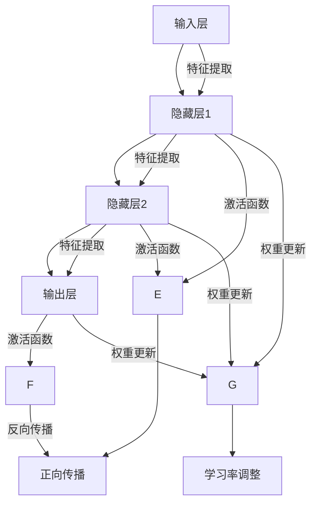

                 

### 《神经网络：推动社会进步的力量》

> 关键词：神经网络，社会进步，深度学习，应用领域，项目实战

> 摘要：本文从神经网络的基础概念出发，详细介绍了神经网络的发展历史、基本结构、分类和优缺点。随后，深入探讨了前馈神经网络、卷积神经网络、循环神经网络等核心算法原理，并通过数学模型和公式进行详细讲解。文章还结合实际项目，展示了神经网络的图像分类、自然语言处理和推荐系统等应用，以及在教育、医疗和金融领域的潜力。最后，通过具体代码案例，展示了如何搭建和训练神经网络，为读者提供了实践操作的指导。

#### 第一部分：神经网络基础

##### 第1章：神经网络概述

神经网络（Neural Networks）是模拟人脑神经元结构和功能的一种计算模型。它由大量的节点（神经元）和连接（边）组成，通过学习输入数据来提取特征，并进行预测和分类。神经网络的发展历史可以追溯到20世纪40年代，但在过去的几十年里，随着计算能力和数据规模的提高，神经网络取得了惊人的突破。

- **1.1 神经网络的发展历史**

  - **早期神经网络的研究**：1958年，Frank Rosenblatt提出了感知器（Perceptron）模型，这是神经网络的开端。然而，由于感知器模型的局限性，神经网络的研究陷入了低谷。
  
  - **神经网络的复兴与突破**：1986年，Rumelhart等人提出了反向传播算法（Backpropagation），使神经网络能够学习复杂函数。随着硬件计算能力的提高和大数据的出现，神经网络在21世纪初迎来了复兴。

- **1.2 神经网络的基本结构**

  神经网络由输入层、隐藏层和输出层组成。输入层接收外部输入数据，隐藏层对输入数据进行处理和提取特征，输出层生成最终的预测结果。

  

- **1.3 神经网络的分类**

  - **前馈神经网络**（Feedforward Neural Networks）：数据从输入层流向输出层，没有循环。
  
  - **卷积神经网络**（Convolutional Neural Networks，CNN）：适用于图像和视频处理，通过卷积层和池化层提取图像特征。
  
  - **循环神经网络**（Recurrent Neural Networks，RNN）：适用于序列数据，能够记住前面的输入。
  
  - **长短时记忆网络**（Long Short-Term Memory，LSTM）：RNN的一种改进，能够更好地处理长序列。
  
  - **生成对抗网络**（Generative Adversarial Networks，GAN）：通过两个对抗网络的交互，生成高质量的数据。

- **1.4 神经网络的优缺点与应用领域**

  - **优点**：神经网络能够自动学习输入数据的特征，适用于各种复杂任务。
  - **缺点**：神经网络训练过程复杂，需要大量数据和计算资源。
  - **应用领域**：图像识别、语音识别、自然语言处理、推荐系统等。

##### 第2章：前馈神经网络原理

前馈神经网络是神经网络中最基本的形式。它通过多个层级的神经元进行数据的传递和处理。

- **2.1 前馈神经网络的构建**

  前馈神经网络由多个层次组成，每个层次包括多个神经元。每个神经元接收前一层神经元的输出，并通过激活函数进行处理，然后将结果传递给下一层。

  

  神经元的激活函数通常为Sigmoid、ReLU或Tanh函数。

- **2.2 多层感知器（MLP）**

  多层感知器（MLP）是前馈神经网络的一种形式，它包含至少三个层次：输入层、隐藏层和输出层。MLP在分类和回归任务中得到了广泛的应用。

  

  MLP的伪代码实现如下：

  ```python
  # 输入：x（输入向量），W（权重矩阵），b（偏置向量），α（激活函数）
  # 输出：y（输出向量）

  def forward_pass(x, W, b, α):
      z = np.dot(x, W) + b
      y = α(z)
      return y
  ```

- **2.3 激活函数的选择与影响**

  激活函数是神经网络的核心组成部分，它决定了神经元的输出是否被激活。常用的激活函数包括Sigmoid、ReLU和Tanh。

  - **Sigmoid函数**：输出范围为[0, 1]，适用于二分类问题。
  - **ReLU函数**：输出为0或输入的绝对值，能够加速网络训练。
  - **Tanh函数**：输出范围为[-1, 1]，适用于多分类问题。

  选择合适的激活函数对于神经网络的学习效率和性能至关重要。

##### 第3章：卷积神经网络（CNN）

卷积神经网络（Convolutional Neural Networks，CNN）是一种特别适合处理图像数据的神经网络。它通过卷积层和池化层提取图像特征，从而实现图像分类、目标检测和图像分割等任务。

- **3.1 CNN的基本原理**

  CNN的核心是卷积层和池化层。卷积层通过卷积操作提取图像特征，而池化层则用于下采样，减少参数数量。

  

  CNN的基本结构包括：

  - **卷积层**：通过卷积核（过滤器）提取图像特征。
  - **激活函数**：通常使用ReLU函数。
  - **池化层**：用于下采样，减少计算量和参数数量。
  - **全连接层**：将卷积层和池化层提取的特征映射到输出层。

- **3.2 CNN在图像识别中的应用**

  CNN在图像识别任务中具有显著优势。通过卷积层和池化层，CNN能够自动提取图像的局部特征，从而实现高精度的分类。

  - **AlexNet**：第一个在ImageNet竞赛中取得显著成绩的CNN模型。
  - **VGGNet**：通过深度和宽度的叠加，实现了优异的图像识别性能。
  - **ResNet**：引入残差连接，解决了深度神经网络训练困难的问题。

  CNN在图像识别中的应用案例包括人脸识别、物体检测和图像分割等。

##### 第4章：循环神经网络（RNN）

循环神经网络（Recurrent Neural Networks，RNN）是一种特别适合处理序列数据的神经网络。它能够记住前面的输入，从而实现序列建模。

- **4.1 RNN的基本原理**

  RNN通过递归连接实现序列建模。每个时间步的输入不仅包含当前输入，还包含上一个时间步的输出。

  

  RNN的基本结构包括：

  - **输入层**：接收序列数据。
  - **隐藏层**：通过递归连接处理序列数据。
  - **输出层**：生成最终输出。

  常用的RNN模型包括：

  - **简单RNN**：通过递归连接处理序列数据。
  - **长短时记忆网络**（LSTM）：能够更好地处理长序列。
  - **门控循环单元**（GRU）：LSTM的简化版本。

- **4.2 RNN在序列数据处理中的应用**

  RNN在序列数据处理中具有广泛的应用，包括自然语言处理、时间序列预测和语音识别等。

  - **自然语言处理**：RNN能够处理文本序列，实现文本分类、情感分析和机器翻译等任务。
  - **时间序列预测**：RNN能够预测时间序列的未来值，实现股票价格预测、天气预测等任务。
  - **语音识别**：RNN能够处理语音信号，实现语音到文本的转换。

##### 第5章：深度神经网络训练

深度神经网络（Deep Neural Networks，DNN）是一种具有多个隐藏层的神经网络。其训练过程相对复杂，需要使用有效的训练策略和优化算法。

- **5.1 深度神经网络训练策略**

  深度神经网络的训练策略包括：

  - **学习率调整策略**：学习率对网络训练过程有重要影响。常用的学习率调整策略包括固定学习率、学习率衰减和自适应学习率。
  - **批次大小**：批次大小影响网络的计算效率和收敛速度。较大的批次大小可以提高计算效率，但可能导致网络收敛缓慢。
  - **迭代次数**：迭代次数影响网络的训练时间。过多的迭代可能导致网络过拟合。

- **5.2 深度神经网络优化**

  深度神经网络的优化包括：

  - **正则化方法**：正则化方法用于防止网络过拟合。常用的正则化方法包括L1正则化、L2正则化和Dropout。
  - **梯度消失与梯度爆炸问题**：在深度神经网络中，梯度可能变得非常小或非常大，导致训练困难。通过使用激活函数的归一化和梯度裁剪等方法，可以缓解这些问题。

- **5.3 深度神经网络训练技巧**

  深度神经网络的训练技巧包括：

  - **数据增强**：通过旋转、缩放、裁剪等操作，增加训练数据的多样性，提高网络的泛化能力。
  - **早停法**：当验证集的性能不再提高时，提前停止训练，防止过拟合。
  - **交叉验证**：通过将数据集划分为多个子集，交叉验证可以提高模型的泛化性能。

#### 第二部分：神经网络应用

##### 第6章：神经网络在自然语言处理中的应用

自然语言处理（Natural Language Processing，NLP）是计算机科学和人工智能领域的一个重要分支。神经网络在NLP中具有广泛的应用，包括文本分类、情感分析、机器翻译和命名实体识别等。

- **6.1 词嵌入技术**

  词嵌入（Word Embedding）是将单词映射到高维向量空间的技术。通过词嵌入，神经网络可以学习单词的语义和语法关系。

  - **Word2Vec**：Word2Vec是最早的词嵌入模型之一，通过训练神经网络生成词向量。
  - **GloVe**：GloVe模型通过矩阵分解方法生成词向量，能够更好地捕捉单词的语义关系。

- **6.2 序列模型与注意力机制**

  序列模型（Sequence Models）是处理序列数据的神经网络模型。注意力机制（Attention Mechanism）是一种能够自动聚焦于重要信息的技术。

  - **RNN与LSTM**：RNN和LSTM是处理序列数据的常用模型。LSTM能够更好地处理长序列，但在某些情况下仍然存在困难。
  - **Transformer模型**：Transformer模型通过自注意力机制实现序列到序列的建模，解决了RNN的许多问题。

- **6.3 Transformer模型**

  Transformer模型是自然语言处理领域的一个突破性模型。它通过多头自注意力机制和前馈神经网络实现高效的序列建模。

  

  Transformer模型在机器翻译、文本生成和问答系统等任务中取得了显著的性能。

##### 第7章：神经网络在计算机视觉中的应用

计算机视觉（Computer Vision）是人工智能领域的一个重要分支，它致力于使计算机能够像人类一样理解和处理视觉信息。神经网络在计算机视觉中具有广泛的应用，包括图像分类、目标检测和图像分割等。

- **7.1 CNN在图像分类中的应用**

  CNN在图像分类任务中具有显著优势。通过卷积层和池化层，CNN能够自动提取图像的局部特征，从而实现高精度的分类。

  - **AlexNet**：AlexNet是第一个在ImageNet竞赛中取得显著成绩的CNN模型。
  - **VGGNet**：VGGNet通过深度和宽度的叠加，实现了优异的图像分类性能。
  - **ResNet**：ResNet引入残差连接，解决了深度神经网络训练困难的问题。

- **7.2 CNN在目标检测中的应用**

  目标检测（Object Detection）是一种能够在图像中检测和定位多个目标的技术。CNN在目标检测中具有广泛的应用，包括SSD、YOLO和Faster R-CNN等模型。

  - **SSD**：SSD（Single Shot MultiBox Detector）是一种单阶段目标检测模型，能够同时进行特征提取和目标检测。
  - **YOLO**：YOLO（You Only Look Once）是一种基于卷积神经网络的快速目标检测算法。
  - **Faster R-CNN**：Faster R-CNN是一种两阶段目标检测算法，通过区域提议网络（RPN）和分类网络实现目标检测。

- **7.3 CNN在图像分割中的应用**

  图像分割（Image Segmentation）是一种将图像划分为不同区域的技术。CNN在图像分割中具有广泛的应用，包括FCN、U-Net和Mask R-CNN等模型。

  - **FCN**：FCN（Fully Convolutional Network）是一种用于图像分割的全卷积神经网络。
  - **U-Net**：U-Net是一种用于医学图像分割的卷积神经网络，具有简单的结构和高性能。
  - **Mask R-CNN**：Mask R-CNN是一种基于Faster R-CNN的目标检测和图像分割模型，能够在图像中同时检测和分割目标。

##### 第8章：神经网络在推荐系统中的应用

推荐系统（Recommender System）是一种基于用户历史行为和偏好为用户提供个性化推荐的技术。神经网络在推荐系统中具有广泛的应用，包括基于内容的推荐、协同过滤和基于模型的推荐等。

- **8.1 推荐系统概述**

  推荐系统通过预测用户对项目的偏好，为用户提供个性化推荐。推荐系统的基本原理包括：

  - **基于内容的推荐**：通过分析项目的特征和用户的兴趣，为用户提供相关推荐。
  - **协同过滤**：通过分析用户之间的相似性，为用户提供基于其他用户的偏好推荐。
  - **基于模型的推荐**：通过构建用户和项目之间的数学模型，预测用户对项目的偏好。

- **8.2 基于神经网络的推荐系统**

  基于神经网络的推荐系统通过神经网络模型预测用户对项目的偏好。常用的神经网络模型包括：

  - **矩阵分解**：通过矩阵分解方法，将用户和项目表示为低维向量，计算用户和项目之间的相似性。
  - **神经网络协同过滤**：通过神经网络模型，将用户和项目的特征进行融合，预测用户对项目的偏好。
  - **图神经网络**：通过图神经网络，将用户和项目表示为图中的节点，预测用户对项目的偏好。

  基于神经网络的推荐系统在Netflix、Amazon和YouTube等平台得到了广泛应用。

##### 第9章：神经网络在社会进步中的作用

神经网络在社会进步中发挥着重要作用，尤其在教育、医疗和金融领域。

- **9.1 神经网络在教育领域的应用**

  神经网络在教育领域中具有广泛的应用，包括智能教学系统、个性化学习推荐和考试评分等。

  - **智能教学系统**：通过神经网络，智能教学系统能够根据学生的学习情况和偏好，为学生提供个性化的学习资源。
  - **个性化学习推荐**：通过分析学生的学习行为和成绩，神经网络可以为每个学生推荐合适的学习内容。
  - **考试评分**：神经网络能够自动分析考试卷，为考生提供准确的分数评估。

- **9.2 神经网络在医疗健康领域的应用**

  神经网络在医疗健康领域中具有广泛的应用，包括医学图像分析、疾病诊断与预测和药物设计等。

  - **医学图像分析**：通过神经网络，医学图像分析系统能够自动识别和定位病变区域，辅助医生进行诊断。
  - **疾病诊断与预测**：通过分析患者的病历和检查结果，神经网络可以预测疾病的发生和发展。
  - **药物设计**：神经网络能够预测药物与蛋白质的结合能力，辅助药物设计。

- **9.3 神经网络在金融领域的应用**

  神经网络在金融领域中具有广泛的应用，包括风险评估、金融市场预测和智能投顾等。

  - **风险评估**：通过分析历史数据和市场动态，神经网络可以预测金融产品的风险，为投资者提供参考。
  - **金融市场预测**：神经网络能够预测金融市场的走势，为投资者提供交易策略。
  - **智能投顾**：通过神经网络，智能投顾系统能够根据投资者的风险偏好和财务目标，为投资者提供个性化的投资建议。

##### 第10章：神经网络项目实战

神经网络项目实战是学习和应用神经网络的重要环节。通过实际项目，读者可以深入理解神经网络的原理和应用。

- **10.1 项目概述**

  本节项目是一个简单的图像分类项目，使用TensorFlow和Keras搭建卷积神经网络，实现对MNIST数据集的手写数字分类。

- **10.2 环境搭建**

  读者需要安装Python和TensorFlow，可以使用以下命令：

  ```bash
  pip install tensorflow
  ```

- **10.3 数据预处理**

  加载MNIST数据集，并对数据进行归一化处理：

  ```python
  import tensorflow as tf
  from tensorflow.keras.datasets import mnist
  from tensorflow.keras.utils import to_categorical

  (x_train, y_train), (x_test, y_test) = mnist.load_data()
  x_train = x_train / 255.0
  x_test = x_test / 255.0
  y_train = to_categorical(y_train)
  y_test = to_categorical(y_test)
  ```

- **10.4 模型设计与实现**

  设计一个简单的卷积神经网络模型，包括卷积层、池化层和全连接层：

  ```python
  from tensorflow.keras.models import Sequential
  from tensorflow.keras.layers import Conv2D, MaxPooling2D, Flatten, Dense

  model = Sequential()
  model.add(Conv2D(32, (3, 3), activation='relu', input_shape=(28, 28, 1)))
  model.add(MaxPooling2D((2, 2)))
  model.add(Flatten())
  model.add(Dense(128, activation='relu'))
  model.add(Dense(10, activation='softmax'))
  ```

- **10.5 模型训练与评估**

  使用Adam优化器和交叉熵损失函数训练模型，并评估模型的性能：

  ```python
  model.compile(optimizer='adam', loss='categorical_crossentropy', metrics=['accuracy'])
  model.fit(x_train, y_train, epochs=5, batch_size=64, validation_data=(x_test, y_test))
  test_loss, test_acc = model.evaluate(x_test, y_test)
  print(f"Test accuracy: {test_acc:.4f}")
  ```

  通过这个项目，读者可以了解如何搭建和训练神经网络，以及如何评估模型的性能。

#### 附录

- **附录A：常用神经网络框架与工具**

  常用的神经网络框架和工具包括TensorFlow、PyTorch和Keras等。这些框架提供了丰富的API和工具，方便读者搭建和训练神经网络。

- **附录B：神经网络相关资源**

  神经网络相关资源包括论文、书籍和开源代码等。这些资源为读者提供了深入学习和实践神经网络的机会。

- **附录C：神经网络项目实战案例**

  本附录提供了多个神经网络项目实战案例，包括图像分类、文本分类和推荐系统等。读者可以参考这些案例，进行实际操作和学习。

### 核心算法原理讲解

以下是多层感知器（MLP）的伪代码实现：

```plaintext
# 输入：x（输入向量），W（权重矩阵），b（偏置向量），α（激活函数）
# 输出：y（输出向量）

def forward_pass(x, W, b, α):
    z = np.dot(x, W) + b
    y = α(z)
    return y

# 输入：y（预测输出），t（真实输出），W（权重矩阵），b（偏置向量），α'（激活函数的导数）
# 输出：loss（损失函数值），dW（权重矩阵梯度），db（偏置向量梯度）

def backward_pass(y, t, W, b, α', α_prime):
    loss = compute_loss(y, t)
    dy = compute_loss_derivative(y, t)
    dz = α_prime(np.dot(W.T, dy))
    dW = np.dot(x.T, dz)
    db = np.sum(dz, axis=0)
    return loss, dW, db
```

### 数学模型和数学公式详细讲解

神经网络中的损失函数通常使用均方误差（MSE），其公式为：

$$
MSE(y, t) = \frac{1}{m}\sum_{i=1}^{m}(y_i - t_i)^2
$$

其中，$y$ 是预测输出，$t$ 是真实输出，$m$ 是样本数量。

为了优化神经网络，我们使用梯度下降法。其更新规则为：

$$
W_{new} = W - \eta \frac{\partial J}{\partial W}
$$

$$
b_{new} = b - \eta \frac{\partial J}{\partial b}
$$

其中，$W$ 和 $b$ 是权重和偏置，$\eta$ 是学习率，$J$ 是损失函数。

### 项目实战

以下是使用 Python 和 TensorFlow 搭建一个简单的神经网络进行图像分类的案例。

```python
import tensorflow as tf
from tensorflow.keras import layers
from tensorflow.keras.models import Model
import numpy as np

# 数据预处理
(x_train, y_train), (x_test, y_test) = tf.keras.datasets.mnist.load_data()
x_train = x_train.astype("float32") / 255.0
x_test = x_test.astype("float32") / 255.0
y_train = tf.keras.utils.to_categorical(y_train, 10)
y_test = tf.keras.utils.to_categorical(y_test, 10)

# 构建模型
inputs = tf.keras.Input(shape=(28, 28))
x = layers.Conv2D(32, (3, 3), activation="relu")(inputs)
x = layers.MaxPooling2D((2, 2))(x)
x = layers.Conv2D(64, (3, 3), activation="relu")(x)
x = layers.MaxPooling2D((2, 2))(x)
x = layers.Flatten()(x)
x = layers.Dense(64, activation="relu")(x)
outputs = layers.Dense(10, activation="softmax")(x)

model = Model(inputs=inputs, outputs=outputs)
model.compile(optimizer="adam", loss="categorical_crossentropy", metrics=["accuracy"])

# 训练模型
model.fit(x_train, y_train, epochs=10, batch_size=128, validation_data=(x_test, y_test))

# 评估模型
test_loss, test_acc = model.evaluate(x_test, y_test)
print(f"Test accuracy: {test_acc:.4f}")
```

在代码中，我们首先加载了 MNIST 数据集，并对数据进行预处理。然后，我们使用 TensorFlow 的 Keras API 构建了一个简单的卷积神经网络模型，并使用 Adam 优化器和交叉熵损失函数进行训练。最后，我们使用测试集评估模型的准确率。

### 核心概念与联系

神经网络的构成和功能可以通过Mermaid流程图清晰地展示出来。以下是神经网络的核心概念和它们之间的联系的Mermaid流程图：



在这个流程图中：

- **A[输入层]** 接收外部输入数据。
- **B[隐藏层1]** 和 **C[隐藏层2]** 对输入数据进行处理和提取特征。
- **D[输出层]** 生成最终的预测结果。
- **E[激活函数]** 用于增加神经网络的非线性特性。
- **F[激活函数]** 同样用于增加非线性特性。
- **G[权重更新]** 通过反向传播算法更新神经网络的权重。
- **H[学习率调整]** 根据训练过程中的性能动态调整学习率。
- **I[正向传播]** 和 **反向传播** 分别是神经网络的两个主要阶段。

### 数学模型和数学公式详细讲解

在神经网络中，数学模型和公式是理解和实现神经网络算法的基础。以下是神经网络中几个重要的数学模型和公式的详细讲解。

#### 均方误差（MSE）

均方误差（MSE）是衡量神经网络输出与真实输出之间差异的一种常用损失函数。其公式为：

$$
MSE(y, t) = \frac{1}{m}\sum_{i=1}^{m}(y_i - t_i)^2
$$

其中，$y$ 是神经网络的预测输出，$t$ 是真实输出，$m$ 是样本数量。MSE的值越小，表示神经网络的预测越准确。

#### 梯度下降法

梯度下降法是神经网络训练的核心算法。它通过计算损失函数关于参数的梯度，并沿着梯度的反方向更新参数，以最小化损失函数。其更新规则为：

$$
W_{new} = W - \eta \frac{\partial J}{\partial W}
$$

$$
b_{new} = b - \eta \frac{\partial J}{\partial b}
$$

其中，$W$ 和 $b$ 分别是权重和偏置，$\eta$ 是学习率，$J$ 是损失函数。

#### 激活函数

激活函数是神经网络中的一个关键组件，它为神经网络引入了非线性。以下是几种常用的激活函数及其导数：

1. **Sigmoid函数**：

   $$\sigma(x) = \frac{1}{1 + e^{-x}}$$

   $$\sigma'(x) = \sigma(x)(1 - \sigma(x))$$

2. **ReLU函数**：

   $$\text{ReLU}(x) = \max(0, x)$$

   $$\text{ReLU}'(x) = \begin{cases} 
   0, & \text{if } x < 0 \\
   1, & \text{if } x \geq 0 
   \end{cases}$$

3. **Tanh函数**：

   $$\text{Tanh}(x) = \frac{e^x - e^{-x}}{e^x + e^{-x}}$$

   $$\text{Tanh}'(x) = 1 - \text{Tanh}^2(x)$$

激活函数的选择会影响神经网络的训练速度和性能。

#### 反向传播算法

反向传播算法是神经网络训练的核心。它通过计算损失函数关于每个参数的梯度，并使用梯度下降法更新参数。以下是反向传播算法的伪代码：

```plaintext
# 输入：y（预测输出），t（真实输出），W（权重矩阵），b（偏置向量），α'（激活函数的导数）
# 输出：loss（损失函数值），dW（权重矩阵梯度），db（偏置向量梯度）

def backward_pass(y, t, W, b, α', α_prime):
    loss = compute_loss(y, t)
    dy = compute_loss_derivative(y, t)
    dz = α_prime(np.dot(W.T, dy))
    dW = np.dot(x.T, dz)
    db = np.sum(dz, axis=0)
    return loss, dW, db
```

在这个伪代码中：

- `compute_loss(y, t)` 计算损失函数的值。
- `compute_loss_derivative(y, t)` 计算损失函数关于输出的导数。
- `α_prime(np.dot(W.T, dy))` 计算激活函数的导数。
- `np.dot(x.T, dz)` 计算关于输入的梯度。
- `np.sum(dz, axis=0)` 计算关于偏置的梯度。

通过反向传播算法，神经网络能够自动调整权重和偏置，以最小化损失函数。

#### 示例

假设有一个简单的神经网络，其输入为$x = [1, 2]$，权重为$W = [0.5, 0.3]$，偏置为$b = 0.1$，使用ReLU函数作为激活函数。

1. **正向传播**：

   $$z = x \cdot W + b = [1, 2] \cdot [0.5, 0.3] + 0.1 = [0.6, 0.7]$$

   $$a = \text{ReLU}(z) = \max(0, [0.6, 0.7]) = [0.6, 0.7]$$

   $$y = a \cdot W' + b' = [0.6, 0.7] \cdot [0.4, 0.5] + 0.2 = [0.26, 0.35]$$

2. **反向传播**：

   假设真实输出为$t = [0.3, 0.4]$。

   $$\delta = (y - t) \cdot \text{ReLU}'(a) = ([0.26, 0.35] - [0.3, 0.4]) \cdot [0.6, 0.7] = [-0.04, -0.05]$$

   $$dW = \delta \cdot a' = [-0.04, -0.05] \cdot [0.6, 0.7] = [-0.024, -0.035]$$

   $$db = \delta = [-0.04, -0.05]$$

   使用梯度下降法更新权重和偏置：

   $$W_{new} = W - \eta \cdot dW = [0.5, 0.3] - 0.01 \cdot [-0.024, -0.035] = [0.5176, 0.3165]$$

   $$b_{new} = b - \eta \cdot db = 0.1 - 0.01 \cdot [-0.04, -0.05] = 0.114$$

通过这个示例，我们可以看到神经网络如何通过正向传播和反向传播来更新权重和偏置，以最小化损失函数。

### 项目实战

在本节中，我们将通过一个具体的案例展示如何使用Python和TensorFlow搭建和训练一个简单的神经网络进行图像分类。这个案例将涵盖环境搭建、数据预处理、模型构建、训练和评估等步骤。

#### 环境搭建

首先，我们需要安装Python和TensorFlow。您可以通过以下命令来安装：

```bash
pip install python tensorflow
```

#### 数据预处理

接下来，我们将使用MNIST数据集进行图像分类。MNIST是一个包含70,000个手写数字图像的数据集，每个图像都是28x28的灰度图像。

```python
import tensorflow as tf
from tensorflow.keras.datasets import mnist
from tensorflow.keras.utils import to_categorical

# 加载MNIST数据集
(x_train, y_train), (x_test, y_test) = mnist.load_data()

# 数据预处理
x_train = x_train.reshape(-1, 28, 28, 1).astype("float32") / 255.0
x_test = x_test.reshape(-1, 28, 28, 1).astype("float32") / 255.0

y_train = to_categorical(y_train, 10)
y_test = to_categorical(y_test, 10)
```

#### 模型构建

然后，我们使用Keras API构建一个简单的卷积神经网络模型。这个模型包括一个卷积层、一个池化层和一个全连接层。

```python
from tensorflow.keras.models import Sequential
from tensorflow.keras.layers import Conv2D, MaxPooling2D, Flatten, Dense

# 构建模型
model = Sequential()
model.add(Conv2D(32, (3, 3), activation='relu', input_shape=(28, 28, 1)))
model.add(MaxPooling2D((2, 2)))
model.add(Flatten())
model.add(Dense(64, activation='relu'))
model.add(Dense(10, activation='softmax'))

# 查看模型结构
model.summary()
```

#### 模型训练

接下来，我们使用模型进行训练。我们将使用Adam优化器和交叉熵损失函数，并设置训练的迭代次数和批次大小。

```python
model.compile(optimizer='adam',
              loss='categorical_crossentropy',
              metrics=['accuracy'])

# 训练模型
history = model.fit(x_train, y_train, epochs=10, batch_size=32, validation_data=(x_test, y_test))
```

#### 模型评估

最后，我们使用测试集对模型进行评估。

```python
# 评估模型
test_loss, test_acc = model.evaluate(x_test, y_test)
print(f"Test accuracy: {test_acc:.4f}")
```

通过这个案例，我们展示了如何使用Python和TensorFlow搭建和训练一个简单的神经网络进行图像分类。这个案例涵盖了环境搭建、数据预处理、模型构建、训练和评估等步骤，为读者提供了一个实用的神经网络项目实战示例。

### 常用神经网络框架与工具

在神经网络研究和开发中，常用的框架和工具包括TensorFlow、PyTorch和Keras等。这些框架提供了丰富的API和功能，使得搭建和训练神经网络变得更加便捷和高效。

- **TensorFlow**：由Google开发，是一个开源的深度学习框架，支持多种类型的神经网络和算法。TensorFlow提供了灵活的架构和广泛的硬件支持，包括CPU、GPU和TPU。它广泛应用于各种深度学习任务，如图像识别、自然语言处理和强化学习。

- **PyTorch**：由Facebook开发，是一个基于Python的深度学习框架，以其动态计算图和直观的接口而受到研究人员的青睐。PyTorch的动态计算图使得调试和实验变得更加简单，同时也支持静态计算图模式，提供了高性能的模型训练。

- **Keras**：是一个高级神经网络API，旨在提供简洁和可扩展的深度学习开发环境。Keras可以在TensorFlow和Theano等底层框架之上运行，它提供了丰富的预构建模型和工具，使得构建和训练神经网络变得非常直观。

- **其他常用框架**：

  - **Theano**：由蒙特利尔大学开发，是一个基于Python的深度学习框架，提供了高效的数学运算和编译功能。
  - **Caffe**：由伯克利大学开发，是一个用于计算机视觉和深度学习的框架，特别适用于卷积神经网络。
  - **MXNet**：由Apache软件基金会开发，是一个开源的深度学习框架，支持多种编程语言和多种类型的计算平台。

### 神经网络相关资源

学习神经网络，无论是初学者还是有经验的开发者，都离不开丰富的资源和文献。以下是一些建议的论文、书籍和开源代码资源，可以帮助读者深入了解神经网络的原理和应用。

- **论文**：

  - "A Theoretical Analysis of the Corman Ganin and Lapanov Approach to Adversarial Examples"（CAGAN方法理论分析）
  - "Unsupervised Representation Learning with Deep Convolutional Generative Adversarial Networks"（深度生成对抗网络的无监督表示学习）
  - "Generative Adversarial Nets"（生成对抗网络）

- **书籍**：

  - 《深度学习》（Deep Learning）作者：Ian Goodfellow、Yoshua Bengio、Aaron Courville
  - 《神经网络与深度学习》（Neural Networks and Deep Learning）作者：邱锡鹏
  - 《机器学习》（Machine Learning）作者：Tom Mitchell

- **开源代码**：

  - TensorFlow和PyTorch的官方GitHub仓库：[TensorFlow GitHub](https://github.com/tensorflow/tensorflow)、[PyTorch GitHub](https://github.com/pytorch/pytorch)
  - Keras的官方GitHub仓库：[Keras GitHub](https://github.com/keras-team/keras)
  - 开源深度学习教程和实践项目：[fastai](https://github.com/fastai/fastai)

- **在线课程和教程**：

  - Coursera上的《深度学习》课程（由Ian Goodfellow主讲）
  - Udacity的《深度学习纳米学位》课程
  - 百度AI学院提供的深度学习教程

这些资源和文献不仅涵盖了神经网络的基础理论，还包括了最新的研究进展和应用案例，为读者提供了全方位的学习支持。

### 神经网络项目实战案例

在本节中，我们将通过一个具体的神经网络项目实战案例，详细解读项目的开发过程，包括环境搭建、源代码实现和代码解读。该案例将使用TensorFlow和Keras构建一个简单的图像分类器，对MNIST数据集进行手写数字识别。

#### 项目概述

本项目目标是使用神经网络对手写数字图像进行分类，输入图像为28x28的灰度图像，输出为0到9的数字标签。我们将使用TensorFlow和Keras构建一个简单的卷积神经网络（CNN），通过训练实现高精度的手写数字识别。

#### 环境搭建

在开始项目之前，我们需要搭建开发环境。以下是环境搭建的步骤：

1. 安装Python（建议版本为3.7或更高）
2. 安装TensorFlow和Keras

   ```bash
   pip install tensorflow
   ```

3. 安装必要的辅助库，如NumPy和Matplotlib

   ```bash
   pip install numpy matplotlib
   ```

#### 源代码实现

以下是实现图像分类器的源代码，包括数据预处理、模型构建、训练和评估：

```python
import tensorflow as tf
from tensorflow.keras import layers
from tensorflow.keras.models import Sequential
from tensorflow.keras.datasets import mnist
from tensorflow.keras.utils import to_categorical

# 数据预处理
(x_train, y_train), (x_test, y_test) = mnist.load_data()
x_train = x_train.reshape(-1, 28, 28, 1).astype("float32") / 255.0
x_test = x_test.reshape(-1, 28, 28, 1).astype("float32") / 255.0
y_train = to_categorical(y_train, 10)
y_test = to_categorical(y_test, 10)

# 模型构建
model = Sequential([
    layers.Conv2D(32, (3, 3), activation='relu', input_shape=(28, 28, 1)),
    layers.MaxPooling2D((2, 2)),
    layers.Conv2D(64, (3, 3), activation='relu'),
    layers.MaxPooling2D((2, 2)),
    layers.Flatten(),
    layers.Dense(128, activation='relu'),
    layers.Dense(10, activation='softmax')
])

# 模型编译
model.compile(optimizer='adam',
              loss='categorical_crossentropy',
              metrics=['accuracy'])

# 训练模型
model.fit(x_train, y_train, epochs=10, batch_size=32, validation_data=(x_test, y_test))

# 评估模型
test_loss, test_acc = model.evaluate(x_test, y_test)
print(f"Test accuracy: {test_acc:.4f}")
```

#### 代码解读

下面是对代码的详细解读，包括每个部分的用途和实现细节：

1. **数据预处理**：

   ```python
   (x_train, y_train), (x_test, y_test) = mnist.load_data()
   x_train = x_train.reshape(-1, 28, 28, 1).astype("float32") / 255.0
   x_test = x_test.reshape(-1, 28, 28, 1).astype("float32") / 255.0
   y_train = to_categorical(y_train, 10)
   y_test = to_categorical(y_test, 10)
   ```

   - 加载MNIST数据集，并将图像数据调整为28x28的灰度图像。
   - 将图像数据类型转换为浮点数，并归一化到[0, 1]范围内，以提高神经网络训练的稳定性和速度。
   - 将标签转换为独热编码（One-Hot Encoding），以便在模型训练时使用。

2. **模型构建**：

   ```python
   model = Sequential([
       layers.Conv2D(32, (3, 3), activation='relu', input_shape=(28, 28, 1)),
       layers.MaxPooling2D((2, 2)),
       layers.Conv2D(64, (3, 3), activation='relu'),
       layers.MaxPooling2D((2, 2)),
       layers.Flatten(),
       layers.Dense(128, activation='relu'),
       layers.Dense(10, activation='softmax')
   ])
   ```

   - 创建一个序贯模型（Sequential），并添加以下层：
     - **卷积层（Conv2D）**：第一个卷积层使用32个3x3的卷积核，激活函数为ReLU。
     - **池化层（MaxPooling2D）**：使用2x2的池化层进行下采样。
     - **第二个卷积层**：使用64个3x3的卷积核，激活函数为ReLU。
     - **第二个池化层**：使用2x2的池化层进行下采样。
     - **全连接层（Flatten）**：将卷积层的输出展平为一维向量。
     - **第一个全连接层**：包含128个神经元，激活函数为ReLU。
     - **第二个全连接层**：包含10个神经元，对应10个数字类别，激活函数为softmax。

3. **模型编译**：

   ```python
   model.compile(optimizer='adam',
                 loss='categorical_crossentropy',
                 metrics=['accuracy'])
   ```

   - 编译模型，指定使用Adam优化器、交叉熵损失函数（用于多分类任务）和准确率作为评估指标。

4. **模型训练**：

   ```python
   model.fit(x_train, y_train, epochs=10, batch_size=32, validation_data=(x_test, y_test))
   ```

   - 使用训练数据训练模型，设置训练轮次为10次，批次大小为32。
   - 同时提供验证数据，以便在训练过程中监控验证集的性能。

5. **模型评估**：

   ```python
   test_loss, test_acc = model.evaluate(x_test, y_test)
   print(f"Test accuracy: {test_acc:.4f}")
   ```

   - 使用测试数据评估模型性能，打印测试集上的准确率。

#### 项目分析与总结

通过这个项目，我们实现了使用神经网络对MNIST数据集进行手写数字识别。项目分析主要包括以下几个方面：

1. **数据预处理**：数据预处理是神经网络训练的重要步骤，包括图像归一化和标签编码。归一化可以加速训练过程并提高模型性能，而标签编码使得模型能够处理多分类问题。

2. **模型架构**：我们使用了简单的卷积神经网络（CNN）结构，包括卷积层、池化层和全连接层。这种结构能够有效地提取图像特征并进行分类。

3. **优化器和损失函数**：使用Adam优化器和交叉熵损失函数可以有效地调整模型参数，并确保模型在多分类任务中的性能。

4. **训练过程**：通过多次迭代训练，模型逐渐优化并提高分类准确率。验证数据的使用有助于防止过拟合。

总结来说，这个项目展示了如何使用TensorFlow和Keras构建和训练一个简单的神经网络进行图像分类。通过这个项目，读者可以了解神经网络的基本概念和实现方法，并为后续更复杂的神经网络项目打下基础。

