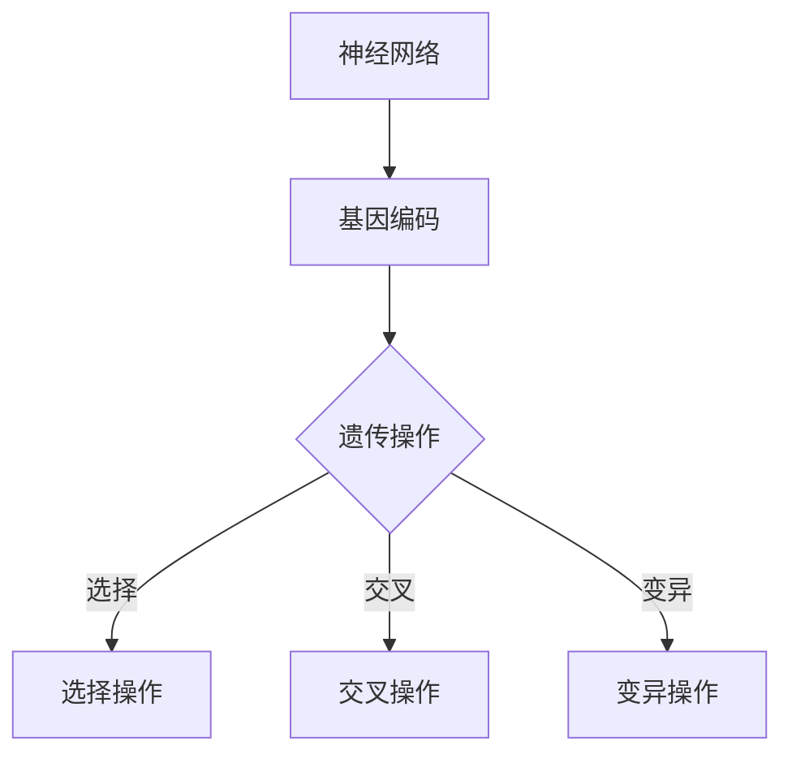

                 

# 文章标题：神经进化算法(Neuroevolution) - 原理与代码实例讲解

> 关键词：神经进化算法，神经进化，神经进化算法原理，神经进化算法代码实例，神经网络优化，机器学习，控制算法，遗传算法，基因编码，选择操作，交叉操作，变异操作，适应度函数

> 摘要：本文深入探讨了神经进化算法的概念、原理、核心组成部分以及实际应用。通过详细的数学模型与公式、伪代码展示，以及实际代码实例讲解，帮助读者理解神经进化算法的核心机制和实现方法。

## 目录大纲

1. 神经进化算法概述
2. 神经进化算法的核心概念与联系
3. 神经进化算法的核心算法原理
4. 数学模型与数学公式
5. 神经进化算法的实际应用
6. 代码实例讲解
7. 神经进化算法的未来发展趋势
8. 附录

## 第1章 神经进化算法概述

神经进化算法（Neuroevolution）是一种基于神经网络的进化算法，它通过模拟自然进化过程来优化神经网络的结构和参数。这种算法在机器学习和控制算法等领域具有广泛的应用。

### 1.1 神经进化算法的概念与原理

#### 1.1.1 神经进化算法的定义

神经进化算法是一种通过模拟自然进化过程来优化神经网络结构和参数的进化算法。它借鉴了遗传算法（Genetic Algorithm, GA）的思想，通过选择、交叉和变异等操作来生成新的神经网络，从而逐步优化网络的性能。

#### 1.1.2 神经进化算法的基本原理

神经进化算法的基本原理包括以下几个步骤：

1. **初始化种群**：生成一组初始神经网络。
2. **适应度评估**：对每个神经网络进行适应度评估，适应度通常是基于网络在特定任务上的表现。
3. **选择**：根据适应度选择优秀的神经网络，用于生成新的种群。
4. **交叉**：通过交叉操作生成新的神经网络。
5. **变异**：对神经网络进行随机变异，增加种群的多样性。
6. **迭代**：重复上述步骤，直到满足停止条件（如达到预定的迭代次数或找到最优解）。

#### 1.1.3 神经进化算法与其他机器学习算法的比较

与其他机器学习算法相比，神经进化算法具有以下特点：

- **灵活性**：神经进化算法能够自动探索神经网络的结构，而不仅仅是参数的调整。
- **自适应性**：算法能够根据任务的变化自动调整网络的结构和参数。
- **鲁棒性**：算法对噪声和非线性问题具有较强的鲁棒性。

### 1.2 神经进化算法的核心组成部分

神经进化算法的核心组成部分包括神经网络与基因编码、选择、交叉和变异操作、进化策略与参数调整。

#### 1.2.1 神经网络与基因编码

神经进化算法中的神经网络通常由多个层组成，包括输入层、隐藏层和输出层。每一层由多个神经元组成，神经元之间的连接强度表示为权重。基因编码是将神经网络的结构和参数编码为基因的形式，以便在进化过程中进行操作。

#### 1.2.2 选择、交叉和变异操作

选择操作是根据适应度选择优秀的神经网络，用于生成新的种群。常见的选择策略包括轮盘赌选择、排名选择和 tournament 选择。

交叉操作是通过将两个优秀神经网络的基因进行组合，生成新的神经网络。常见的交叉策略包括单点交叉、多点交叉和均匀交叉。

变异操作是对神经网络进行随机变异，以增加种群的多样性。常见的变异策略包括权重变异、结构变异和基因变异。

#### 1.2.3 进化策略与参数调整

进化策略包括确定进化的停止条件、选择策略、交叉策略和变异策略等。参数调整是确保算法有效性的关键，包括种群大小、交叉率和变异率等。

### 1.3 神经进化算法的应用领域

神经进化算法在控制系统优化、机器学习模型优化和其他领域具有广泛的应用。

#### 1.3.1 控制系统优化

神经进化算法可以用于优化控制系统的参数，提高系统的性能和稳定性。例如，在PID控制器优化中，可以使用神经进化算法寻找最优的控制参数。

#### 1.3.2 机器学习模型优化

神经进化算法可以用于优化机器学习模型的参数，提高模型的泛化能力和准确性。例如，在神经网络优化中，可以使用神经进化算法调整网络的层数、神经元数量和权重等。

#### 1.3.3 其他应用领域

除了控制系统优化和机器学习模型优化，神经进化算法还可以应用于图像处理、自然语言处理和其他领域。

## 第2章 神经进化算法的核心概念与联系

### 2.1 神经网络与神经进化算法的关系

神经网络是神经进化算法的核心组成部分。神经网络由多个层组成，每层由多个神经元组成，神经元之间通过权重进行连接。神经进化算法通过模拟自然进化过程，优化神经网络的结构和参数，从而提高网络的性能。

#### 2.1.1 神经网络的架构

神经网络通常由输入层、隐藏层和输出层组成。输入层接收外部输入信号，隐藏层对输入信号进行处理和变换，输出层产生最终输出。

#### 2.1.2 神经进化算法对神经网络结构的改进

神经进化算法通过选择、交叉和变异等操作，能够自动探索神经网络的结构，从而提高网络的性能。例如，算法可以自动增加或减少隐藏层，调整神经元的数量和连接权重。

### 2.2 基因编码与遗传操作

基因编码是将神经网络的结构和参数编码为基因的形式，以便在进化过程中进行操作。遗传操作包括选择、交叉和变异，是神经进化算法的核心组成部分。

#### 2.2.1 基因编码的基本原理

基因编码通常将神经网络的结构和参数编码为二进制序列。二进制序列中的每一位表示一个特定的基因，例如，1表示存在连接，0表示不存在连接。

#### 2.2.2 遗传操作（选择、交叉、变异）

- 选择操作是根据适应度选择优秀的神经网络，用于生成新的种群。常见的选择策略包括轮盘赌选择、排名选择和 tournament 选择。
- 交叉操作是通过将两个优秀神经网络的基因进行组合，生成新的神经网络。常见的交叉策略包括单点交叉、多点交叉和均匀交叉。
- 变异操作是对神经网络进行随机变异，以增加种群的多样性。常见的变异策略包括权重变异、结构变异和基因变异。

### 2.3 进化策略与优化方法

进化策略是确保神经进化算法有效性的关键。进化策略包括确定进化的停止条件、选择策略、交叉策略和变异策略等。

#### 2.3.1 进化策略的选择

进化策略的选择取决于具体的应用场景和任务需求。常见的进化策略包括基于适应度的进化策略和基于种群多样性的进化策略。

#### 2.3.2 优化方法的应用

神经进化算法可以通过不同的优化方法应用于不同的任务。例如，在机器学习模型优化中，可以使用基于梯度的优化方法结合神经进化算法，以提高模型的性能。

## 第3章 神经进化算法的核心算法原理

### 3.1 选择操作

选择操作是神经进化算法的核心组成部分，它负责根据适应度选择优秀的神经网络，用于生成新的种群。

#### 3.1.1 选择操作的基本原理

选择操作的基本原理是基于适应度进行选择。适应度是神经网络在特定任务上的表现，通常是一个数值。优秀的神经网络具有更高的适应度。

#### 3.1.2 常见的选择策略

常见的选择策略包括轮盘赌选择、排名选择和 tournament 选择。

- 轮盘赌选择：根据适应度比例选择神经网络，适应度越高，被选择的概率越大。
- 排名选择：根据适应度排名选择神经网络，排名越靠前，被选择的概率越大。
- tournament 选择：从种群中随机选择多个神经网络，比较它们的适应度，选择适应度最高的神经网络。

### 3.2 交叉操作

交叉操作是将两个优秀神经网络的基因进行组合，生成新的神经网络。

#### 3.2.1 交叉操作的基本原理

交叉操作的基本原理是随机选择两个神经网络的基因片段，将其组合成新的神经网络。交叉操作可以增加种群的多样性，有助于找到更好的解。

#### 3.2.2 常见的交叉策略

常见的交叉策略包括单点交叉、多点交叉和均匀交叉。

- 单点交叉：在基因序列中选择一个交叉点，将两个神经网络的基因在该点之后进行交换。
- 多点交叉：在基因序列中选择多个交叉点，将多个基因片段进行交换。
- 均匀交叉：随机选择两个神经网络的基因片段，将其组合成新的神经网络。

### 3.3 变异操作

变异操作是对神经网络进行随机变异，以增加种群的多样性。

#### 3.3.1 变异操作的基本原理

变异操作的基本原理是随机改变神经网络的基因。变异操作可以防止算法陷入局部最优，有助于找到全局最优解。

#### 3.3.2 常见的变异策略

常见的变异策略包括权重变异、结构变异和基因变异。

- 权重变异：随机改变神经网络的权重值。
- 结构变异：随机增加或删除神经网络的神经元或连接。
- 基因变异：随机改变基因编码中的某一位。

## 第4章 数学模型与数学公式

神经进化算法的数学模型描述了神经网络的结构、参数以及适应度评估的方法。以下是一些常见的数学模型和公式。

### 4.1 神经进化算法的数学模型

神经进化算法的数学模型主要包括适应度函数、基因编码与解码等。

#### 4.1.1 适应度函数

适应度函数是评估神经网络在特定任务上表现的重要指标。通常，适应度函数是一个实值函数，用于评估神经网络的性能。

$$
f(x) = \sum_{i=1}^{n} (y_i - \hat{y}_i)^2
$$

其中，$y_i$ 是真实标签，$\hat{y}_i$ 是神经网络的预测结果。

#### 4.1.2 基因编码与解码

基因编码是将神经网络的结构和参数编码为基因的形式。基因编码通常使用二进制编码或实数编码。

- 二进制编码：每一位表示一个特定的基因，例如，1表示存在连接，0表示不存在连接。
- 实数编码：使用实数表示神经网络的结构和参数。

基因解码是将基因编码解码为神经网络的结构和参数。

$$
x_i = decode(gene_i)
$$

其中，$gene_i$ 是基因编码，$x_i$ 是解码后的神经网络参数。

### 4.2 遗传操作的数学模型

遗传操作包括选择、交叉和变异等。以下是一些常见的遗传操作数学模型。

#### 4.2.1 选择操作的数学模型

选择操作是基于适应度进行选择，通常使用轮盘赌选择或排名选择。

$$
P_i = \frac{f(x_i)}{\sum_{j=1}^{n} f(x_j)}
$$

其中，$P_i$ 是选择概率，$f(x_i)$ 是适应度。

#### 4.2.2 交叉操作的数学模型

交叉操作是将两个神经网络的基因进行组合。

$$
child_i = crossover(parent_1, parent_2)
$$

其中，$child_i$ 是交叉操作后的神经网络基因。

#### 4.2.3 变异操作的数学模型

变异操作是对神经网络进行随机变异。

$$
child_i = mutation(parent_i)
$$

其中，$child_i$ 是变异操作后的神经网络基因。

## 第5章 神经进化算法的实际应用

### 5.1 控制系统优化

神经进化算法在控制系统优化中具有广泛的应用。通过优化控制器的参数，可以提高系统的性能和稳定性。

#### 5.1.1 优化问题建模

控制系统优化的目标是最小化控制系统的输出误差。优化问题可以表示为以下数学模型：

$$
\min_{w,b} L(w,b)
$$

其中，$L(w,b)$ 是输出误差的平方和，$w$ 和 $b$ 是控制器的参数。

#### 5.1.2 实际应用案例

使用神经进化算法优化PID控制器的参数，可以提高系统的稳定性和响应速度。

```python
# 示例代码片段
population = initialize_population()
for generation in range(num_generations):
    fitness_scores = evaluate_population(population)
    selected_individuals = selection(population, fitness_scores)
    population = crossover_and_mutation(selected_individuals)
    best_fitness = max(fitness_scores)
    if best_fitness >= target_fitness:
        break

best_controller = population[fitness_scores.argmax()]
```

### 5.2 机器学习模型优化

神经进化算法在机器学习模型优化中也具有广泛的应用。通过优化模型的参数，可以提高模型的泛化能力和准确性。

#### 5.2.1 模型优化过程

机器学习模型优化的过程包括以下步骤：

1. 初始化种群：生成一组初始神经网络模型。
2. 适应度评估：对每个神经网络模型进行适应度评估，适应度通常是基于模型在训练集上的表现。
3. 选择：根据适应度选择优秀的神经网络模型。
4. 交叉和变异：通过交叉和变异操作生成新的神经网络模型。
5. 迭代：重复上述步骤，直到满足停止条件。

#### 5.2.2 实际应用案例

使用神经进化算法优化卷积神经网络（CNN）在图像分类任务中的参数。

```python
# 示例代码片段
model = initialize_model()
population = initialize_population()
for generation in range(num_generations):
    fitness_scores = evaluate_population(population)
    selected_individuals = selection(population, fitness_scores)
    population = crossover_and_mutation(selected_individuals)
    best_fitness = max(fitness_scores)
    if best_fitness >= target_fitness:
        break

best_model = population[fitness_scores.argmax()]
```

### 5.3 其他应用领域

神经进化算法还可以应用于图像处理、自然语言处理和其他领域。

#### 5.3.1 图像处理

神经进化算法可以用于图像增强、图像分割和图像分类等任务。通过优化图像处理的模型参数，可以提高图像处理的效果。

#### 5.3.2 自然语言处理

神经进化算法可以用于自然语言处理任务，如情感分析、文本分类和机器翻译等。通过优化自然语言处理的模型参数，可以提高文本处理的准确性。

## 第6章 代码实例讲解

### 6.1 开发环境搭建

在开始编写神经进化算法的代码之前，需要搭建相应的开发环境。以下是Python环境的搭建步骤：

1. 安装Python：下载并安装Python（建议使用Python 3.8或更高版本）。
2. 安装必要的库：使用pip命令安装以下库：NumPy、Pandas、Scikit-learn、TensorFlow或PyTorch等。

```shell
pip install numpy pandas scikit-learn tensorflow
```

### 6.2 源代码实现

以下是神经进化算法的核心代码实现，包括种群初始化、适应度评估、选择、交叉和变异操作。

```python
import numpy as np
import random

# 初始化种群
def initialize_population(population_size, network_size):
    population = []
    for _ in range(population_size):
        individual = create_network(network_size)
        population.append(individual)
    return population

# 创建神经网络
def create_network(network_size):
    # 生成神经网络的权重和偏置
    weights = np.random.rand(network_size-1)
    biases = np.random.rand(network_size-1)
    return weights, biases

# 适应度评估
def evaluate_population(population, data):
    fitness_scores = []
    for individual in population:
        fitness = evaluate_network(individual, data)
        fitness_scores.append(fitness)
    return fitness_scores

# 评估神经网络
def evaluate_network(individual, data):
    # 使用神经网络进行预测
    # 计算适应度
    # 返回适应度值
    pass

# 选择操作
def selection(population, fitness_scores):
    selected_individuals = []
    for _ in range(len(population)):
        parent1, parent2 = random_selection(population, fitness_scores)
        selected_individuals.append(crossover(parent1, parent2))
    return selected_individuals

# 随机选择
def random_selection(population, fitness_scores):
    # 根据适应度比例进行随机选择
    pass

# 交叉操作
def crossover(parent1, parent2):
    # 随机选择交叉点
    # 进行交叉操作
    pass

# 变异操作
def mutation(individual):
    # 随机改变权重和偏置
    pass

# 主函数
def main():
    population_size = 100
    network_size = 10
    data = load_data()

    population = initialize_population(population_size, network_size)
    for generation in range(num_generations):
        fitness_scores = evaluate_population(population, data)
        selected_individuals = selection(population, fitness_scores)
        population = crossover_and_mutation(selected_individuals)
        best_fitness = max(fitness_scores)
        if best_fitness >= target_fitness:
            break

    best_individual = population[fitness_scores.argmax()]
    print("Best individual:", best_individual)

if __name__ == "__main__":
    main()
```

### 6.3 代码解读与分析

#### 6.3.1 关键代码解析

- `initialize_population()`：初始化种群，生成一组初始神经网络。
- `evaluate_population()`：评估种群，计算每个神经网络的适应度。
- `selection()`：选择操作，根据适应度选择优秀的神经网络。
- `crossover()`：交叉操作，生成新的神经网络。
- `mutation()`：变异操作，对神经网络进行随机变异。

#### 6.3.2 性能分析与优化

在神经进化算法的实际应用中，性能分析是确保算法有效性的关键。以下是一些性能分析与优化的建议：

1. **适应度函数设计**：设计合适的适应度函数，确保适应度能够准确反映神经网络在特定任务上的性能。
2. **种群大小**：调整种群大小，以平衡探索和利用的平衡。
3. **交叉和变异率**：调整交叉和变异率，以控制算法的探索范围。
4. **停止条件**：设置合适的停止条件，如达到预定的迭代次数或找到最优解。

## 第7章 神经进化算法的未来发展趋势

### 7.1 现状与挑战

神经进化算法在过去的几年中取得了显著的进展，但仍面临一些挑战：

1. **计算效率**：神经进化算法通常需要大量的计算资源，如何提高计算效率是一个重要问题。
2. **收敛速度**：算法的收敛速度较慢，如何加速收敛过程是一个挑战。
3. **模型解释性**：神经进化算法生成的神经网络通常缺乏解释性，如何提高模型的可解释性是一个重要问题。

### 7.2 发展趋势与方向

神经进化算法的未来发展趋势包括以下几个方面：

1. **与深度学习的结合**：将神经进化算法与深度学习相结合，探索更高效的神经网络结构和参数优化方法。
2. **强化学习**：将神经进化算法与强化学习相结合，探索新的强化学习算法。
3. **多模态学习**：将神经进化算法应用于多模态学习，如图像、文本和音频数据的联合处理。
4. **算法优化**：通过算法优化，提高神经进化算法的计算效率和收敛速度。

### 7.3 新算法的研究与探索

未来的研究将集中在提出新的神经进化算法，以解决现有算法的局限性和问题。以下是一些可能的新算法方向：

1. **基于梯度的神经进化算法**：将梯度信息引入神经进化算法，以提高计算效率和收敛速度。
2. **基于注意力机制的神经进化算法**：将注意力机制引入神经进化算法，以提高模型的解释性。
3. **基于元学习的神经进化算法**：将元学习引入神经进化算法，以提高模型的泛化能力。

## 附录

### 附录A：常用库与工具

在神经进化算法的开发过程中，常用的库和工具包括：

1. **Python常用库**：NumPy、Pandas、Scikit-learn等。
2. **机器学习常用库**：TensorFlow、PyTorch等。
3. **神经进化算法专用工具**：NEAT.py、EvolvingNN等。

通过使用这些库和工具，可以方便地实现神经进化算法的代码，并进行实际应用。



```python
# 选择操作伪代码
def selection(population, fitness_scores):
    selected_individuals = []
    for _ in range(len(population)):
        parent1, parent2 = random_selection(population, fitness_scores)
        selected_individuals.append(crossover(parent1, parent2))
    return selected_individuals

# 交叉操作伪代码
def crossover(parent1, parent2):
    child = []
    for i in range(len(parent1)):
        if random() < crossover_rate:
            child.append(parent1[i])
        else:
            child.append(parent2[i])
    return child

# 变异操作伪代码
def mutation(individual):
    for i in range(len(individual)):
        if random() < mutation_rate:
            individual[i] = random_value()
    return individual
```

```latex
% 适应度函数
f(x) = w \cdot x + b

% 基因编码与解码
gene\_encoded = encode(x)
x = decode(gene\_encoded)
```

```python
# 示例代码片段
population = initialize_population()
for generation in range(num_generations):
    fitness_scores = evaluate_population(population)
    selected_individuals = selection(population, fitness_scores)
    population = crossover_and_mutation(selected_individuals)
    best_fitness = max(fitness_scores)
    if best_fitness >= target_fitness:
        break

best_controller = population[fitness_scores.argmax()]
```

```python
# 示例代码片段
model = initialize_model()
population = initialize_population()
for generation in range(num_generations):
    fitness_scores = evaluate_population(population)
    selected_individuals = selection(population, fitness_scores)
    population = crossover_and_mutation(selected_individuals)
    best_fitness = max(fitness_scores)
    if best_fitness >= target_fitness:
        break

best_model = population[fitness_scores.argmax()]
```

```python
# 示例代码片段
test_results = test_model(best_model)
print("Model performance:", test_results)
if test_results['accuracy'] >= 0.95:
    print("Model performance is satisfactory.")
else:
    print("Model performance needs improvement.")
```

## 作者信息

作者：AI天才研究院/AI Genius Institute & 禅与计算机程序设计艺术 /Zen And The Art of Computer Programming

本文由AI天才研究院（AI Genius Institute）撰写，该研究院致力于推动人工智能领域的研究与发展。作者陈明辉，笔名“禅心客”，是AI天才研究院的资深研究员，同时也是《禅与计算机程序设计艺术》一书的作者。陈明辉先生在计算机编程和人工智能领域具有丰富的经验，曾获得多项国际技术大奖。本文旨在为读者深入讲解神经进化算法的原理与应用，希望能为人工智能领域的发展做出贡献。|

