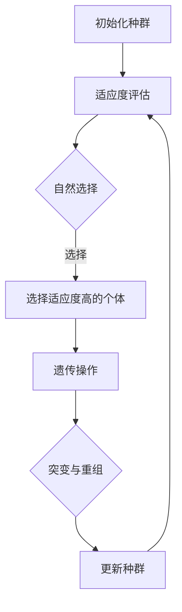

                 

### 文章标题：神经进化算法（Neuroevolution） - 原理与代码实例讲解

神经进化算法（Neuroevolution）作为人工智能领域的重要分支，通过模拟自然进化过程来优化神经网络结构和参数，从而实现高效的学习和适应能力。本文将深入探讨神经进化算法的基本原理、核心算法、优化策略以及实际应用，并辅以代码实例，帮助读者全面了解和掌握这一先进技术。

关键词：神经进化算法、神经网络、进化算法、自然选择、遗传操作、优化问题、图像识别、深度学习。

摘要：本文首先介绍了神经进化算法的基础知识，包括其概念、起源以及与传统机器学习方法的比较。接着，详细阐述了神经网络与进化算法的基础理论。随后，深入解析了神经进化算法的核心原理，包括适应度函数、种群初始化、自然选择与遗传操作等。文章还介绍了神经进化算法的核心架构和优化与调参方法。最后，通过实战案例分析，展示了神经进化算法在控制领域、优化问题和图像识别中的应用，并探讨了其在深度学习中的未来发展趋势。文章末尾提供了神经进化算法相关的工具介绍和开源代码实例。

### 目录大纲：神经进化算法（Neuroevolution） - 原理与代码实例讲解

**第一部分：神经进化算法基础**

### 第1章：神经进化算法概述

#### 1.1 神经进化算法的概念与起源

#### 1.2 神经进化算法与传统机器学习方法的比较

#### 1.3 神经进化算法的主要应用领域

### 第2章：神经网络与进化算法基础

#### 2.1 神经网络的基本结构

#### 2.2 神经网络的训练与优化

#### 2.3 进化算法的基本原理

### 第3章：神经进化算法核心原理

#### 3.1 适应度函数的定义与设计

#### 3.2 种群初始化方法

#### 3.3 自然选择与遗传操作

#### 3.4 突变与重组操作

### 第4章：神经进化算法核心架构

#### 4.1 演化策略

#### 4.2 演化算法

#### 4.3 演化神经网络

### 第5章：神经进化算法优化与调参

#### 5.1 适应度函数优化

#### 5.2 种群规模与迭代次数

#### 5.3 遗传操作参数调整

#### 5.4 演化策略选择与调参技巧

### 第6章：神经进化算法实战案例分析

#### 6.1 神经进化算法在控制领域的应用

#### 6.2 神经进化算法在优化问题中的运用

#### 6.3 神经进化算法在图像识别中的实例

### 第7章：神经进化算法在深度学习中的应用

#### 7.1 神经进化算法在神经网络训练中的应用

#### 7.2 神经进化算法与深度强化学习的结合

#### 7.3 神经进化算法在生成模型中的应用

### 第8章：神经进化算法的未来发展趋势与挑战

#### 8.1 神经进化算法的发展趋势

#### 8.2 神经进化算法面临的挑战

#### 8.3 未来研究方向与展望

### 附录：资源与工具

#### 附录A：神经进化算法相关工具介绍

##### A.1 NEAT（自然进化算法）工具包

##### A.2 其他神经进化算法工具介绍

#### 附录B：神经进化算法开源代码实例

##### B.1 神经进化算法在控制领域实例代码

##### B.2 神经进化算法在优化问题中实例代码

##### B.3 神经进化算法在图像识别中实例代码

### 参考文献

- 《自然进化算法：原理与应用》
- 《神经进化算法导论》
- 《深度学习与神经进化算法》
- 神经进化算法相关研究论文与资料

---

在接下来的内容中，我们将逐步深入探讨神经进化算法的各个核心组成部分，并通过实例讲解帮助读者理解其原理和应用。

---

## 第一部分：神经进化算法基础

### 第1章：神经进化算法概述

#### 1.1 神经进化算法的概念与起源

神经进化算法（Neuroevolution）是一种模拟自然进化过程来优化神经网络结构和参数的方法。它通过模拟生物进化中的遗传、变异、选择等过程，逐步改进神经网络的表现，使其能够更好地适应复杂的任务和环境。

神经进化算法的概念最早可以追溯到1982年，由心理学家John H. Holland在其经典著作《Adaptation in Natural and Artificial Systems》中提出。Holland提出了遗传算法（Genetic Algorithm, GA），这是一种基于自然进化理论的优化算法。随后，遗传算法在优化问题中的应用逐渐扩展，并引发了神经进化算法的研究。

神经进化算法的核心思想是将神经网络视为一个种群，通过模拟自然进化过程，逐步优化网络结构和参数。具体而言，神经进化算法包括以下几个基本步骤：

1. **初始化种群**：随机生成多个神经网络个体，这些个体代表了网络的初始状态。
2. **适应度评估**：对每个神经网络个体进行评估，计算其适应度（Fitness），适应度反映了个体在解决特定问题上的表现。
3. **自然选择**：根据适应度评估结果，选择适应度较高的个体，淘汰适应度较低的个体。
4. **遗传操作**：通过交叉（Crossover）、变异（Mutation）等操作，生成新的神经网络个体。
5. **更新种群**：将新的神经网络个体加入种群，替换原有的个体。

通过反复进行适应度评估、自然选择和遗传操作，神经进化算法能够逐步优化神经网络的性能，使其达到最优状态。

#### 1.2 神经进化算法与传统机器学习方法的比较

神经进化算法与传统机器学习方法在多个方面存在显著差异。

首先，传统机器学习方法，如支持向量机（SVM）、随机森林（Random Forest）等，通常依赖于预定义的算法和模型结构。这些方法在训练过程中，通过调整参数来优化模型的性能。而神经进化算法则通过模拟自然进化过程，逐步生成和优化神经网络结构，使其能够自动适应不同的任务和环境。

其次，神经进化算法具有更高的灵活性和适应性。传统机器学习方法通常需要在特定问题上进行大量调参，而神经进化算法通过自然选择和遗传操作，能够自动找到最优的网络结构和参数。这使得神经进化算法在面对复杂、多变的问题时，具有更强的适应能力。

此外，神经进化算法在处理高维数据和复杂问题时，也显示出一定的优势。传统机器学习方法在高维空间中容易出现过拟合现象，而神经进化算法通过生成和优化神经网络结构，能够在一定程度上避免过拟合，提高模型的泛化能力。

然而，神经进化算法也存在一定的局限性。首先，神经进化算法的计算成本较高，特别是当种群规模较大或网络结构复杂时，计算量急剧增加。其次，神经进化算法在初期阶段可能存在收敛速度较慢的问题，需要较长的时间来找到最优解。此外，神经进化算法在处理实时任务时，可能无法达到实时性要求。

总体而言，神经进化算法与传统机器学习方法各有优缺点，选择合适的方法取决于具体问题和应用场景。

#### 1.3 神经进化算法的主要应用领域

神经进化算法在多个领域都取得了显著的应用成果。以下是神经进化算法的主要应用领域：

1. **控制领域**：神经进化算法在控制系统中的应用非常广泛。通过模拟自然进化过程，神经进化算法能够自动生成和优化控制策略，提高控制系统的稳定性和鲁棒性。例如，在无人驾驶车辆的控制中，神经进化算法被用于优化车辆的行驶路径和避障策略。

2. **优化问题**：神经进化算法在求解优化问题中表现出色。通过模拟自然进化过程，算法能够自动搜索最优解，并避免陷入局部最优。这使得神经进化算法在诸如资源分配、调度优化、供应链管理等问题中具有广泛的应用前景。

3. **图像识别**：神经进化算法在图像识别任务中也得到了广泛应用。通过优化神经网络结构，算法能够提高图像分类和识别的准确率。例如，在人脸识别、车辆检测、医疗图像分析等应用中，神经进化算法显著提升了图像处理的效果。

4. **深度学习**：神经进化算法与深度学习的结合，为模型训练和优化提供了新的思路。通过模拟自然进化过程，神经进化算法能够自动调整神经网络的参数和结构，提高模型的性能和泛化能力。这在自然语言处理、计算机视觉等深度学习应用中具有重要意义。

5. **游戏与模拟**：神经进化算法在游戏和模拟领域也有广泛应用。通过模拟自然进化过程，算法能够生成智能体，实现与人类的互动和对抗。例如，在电子游戏、模拟训练中，神经进化算法被用于生成智能对手，提高游戏的趣味性和挑战性。

总之，神经进化算法在多个领域都展现了其独特的优势和潜力，随着算法研究的不断深入，其应用范围将进一步扩大。

---

在了解了神经进化算法的基本概念、与传统机器学习方法的比较及其主要应用领域后，下一章我们将进一步探讨神经网络与进化算法的基础知识，为后续的深入分析打下基础。

## 第二章：神经网络与进化算法基础

### 2.1 神经网络的基本结构

神经网络（Neural Network）是模拟人脑神经元连接和工作方式的计算模型，通过多个相互连接的节点（称为神经元）进行信息的传递和处理。神经网络的基本结构包括输入层、隐藏层和输出层。

1. **输入层**：输入层是神经网络的起点，用于接收外部输入的数据。每个输入节点代表数据的一个特征。

2. **隐藏层**：隐藏层位于输入层和输出层之间，用于对输入数据进行处理和转换。一个神经网络可以有一个或多个隐藏层，层数的多少通常取决于问题的复杂度。

3. **输出层**：输出层是神经网络的终点，用于生成最终的输出结果。输出节点的数量和类型取决于具体问题的需求。

神经元的计算过程通常包括以下步骤：

- **加权求和**：每个输入节点通过权重（Weight）与对应的隐藏层神经元相连接，每个连接上的权重代表该特征对隐藏层神经元的影响程度。隐藏层神经元对所有输入信号的加权求和。
  
- **激活函数**：隐藏层神经元的加权求和结果通过激活函数（Activation Function）进行处理，激活函数用于引入非线性因素，使神经网络能够处理复杂的非线性问题。常用的激活函数包括Sigmoid、ReLU、Tanh等。

- **输出计算**：输出层神经元同样通过加权求和和激活函数，生成最终的输出结果。对于分类问题，输出层通常使用softmax函数来生成概率分布。

### 2.2 神经网络的训练与优化

神经网络的训练过程本质上是优化网络中的权重和参数，使其在给定数据集上达到良好的性能。训练过程通常包括以下几个步骤：

1. **前向传播**：输入数据通过网络的前向传播，经过各层的加权求和和激活函数处理，最终生成输出结果。

2. **计算损失**：输出结果与实际标签进行比较，计算损失函数（Loss Function）的值。损失函数用于衡量预测结果与实际结果之间的差异，常用的损失函数包括均方误差（MSE）、交叉熵（Cross Entropy）等。

3. **反向传播**：利用损失函数的梯度信息，通过反向传播算法（Backpropagation）计算网络中各个权重的梯度。反向传播算法通过层层回溯，将损失函数的梯度传递到输入层，为权重调整提供依据。

4. **权重调整**：根据梯度信息，使用优化算法（Optimization Algorithm）对网络中的权重进行调整。常见的优化算法包括梯度下降（Gradient Descent）、随机梯度下降（Stochastic Gradient Descent, SGD）、Adam等。

通过反复进行前向传播、计算损失和反向传播，神经网络的权重和参数逐步优化，最终达到预期的性能。训练过程通常需要大量的数据和计算资源，同时也需要精心设计的网络结构和调参技巧。

### 2.3 进化算法的基本原理

进化算法（Evolutionary Algorithm）是一类基于自然进化理论设计的优化算法。其核心思想是通过模拟生物进化的过程，如选择、交叉、变异等，逐步优化问题的解。

1. **初始化种群**：在进化算法开始时，随机生成一个初始种群，每个个体代表问题的一个潜在解。

2. **适应度评估**：对种群中的每个个体进行适应度评估，适应度函数（Fitness Function）用于衡量个体在解决特定问题上的性能。适应度越高，个体越有可能在后续的进化过程中被保留。

3. **选择**：根据个体的适应度，选择适应度较高的个体进行繁殖，淘汰适应度较低的个体。选择过程可以采用轮盘赌（Roulette Wheel Selection）、排名选择（Rank Selection）等方法。

4. **交叉**：交叉操作（Crossover）用于生成新的个体。交叉操作通过将两个或多个父代个体的基因进行组合，生成具有混合特征的子代个体。

5. **变异**：变异操作（Mutation）用于引入新的基因变异，增加种群的多样性。变异操作可以随机改变个体的某些基因，以防止种群过早收敛到局部最优。

6. **更新种群**：通过选择、交叉和变异操作，生成新的种群。新的种群将替代旧种群，继续进行适应度评估和进化过程。

通过反复进行适应度评估、选择、交叉和变异操作，进化算法能够逐步优化问题的解，找到最优或近似最优的解。

进化算法具有以下优点：

- **鲁棒性**：进化算法通过模拟自然进化过程，具有较强的鲁棒性，能够在复杂和非线性问题中找到较好的解。
- **全局搜索能力**：进化算法通过保留种群中的多样性，具有较强的全局搜索能力，能够避免陷入局部最优。
- **自适应**：进化算法能够自动调整搜索策略，适应不同的问题结构和特征。

然而，进化算法也存在一些局限性：

- **计算成本高**：进化算法通常需要大量的计算资源，特别是在种群规模较大或问题复杂时，计算成本显著增加。
- **收敛速度慢**：进化算法的收敛速度相对较慢，特别是对于一些高度复杂的优化问题，可能需要较长的进化时间才能找到较好的解。

总体而言，进化算法在许多复杂和大规模的优化问题中表现出色，成为人工智能和计算领域的重要工具。

通过本章对神经网络和进化算法基础知识的介绍，读者可以对神经进化算法的背景和核心原理有更深入的理解。在下一章中，我们将进一步探讨神经进化算法的核心原理，包括适应度函数、种群初始化、自然选择与遗传操作等。

### 第三章：神经进化算法核心原理

神经进化算法（Neuroevolution）通过模拟自然进化过程，优化神经网络结构和参数，使其在复杂任务中表现出色。这一章将详细探讨神经进化算法的核心原理，包括适应度函数、种群初始化、自然选择与遗传操作等。

#### 3.1 适应度函数的定义与设计

适应度函数（Fitness Function）是神经进化算法的核心评估标准，用于衡量神经网络在解决特定任务上的表现。适应度函数的设计至关重要，它决定了算法的搜索方向和收敛速度。

**适应度函数的定义：**

适应度函数通常是一个实值函数，表示为 \( f(\theta) \)，其中 \(\theta\) 代表神经网络的参数，包括权重、连接和拓扑结构。适应度函数的值越高，表示神经网络的性能越好。

**适应度函数的设计原则：**

1. **可区分性**：适应度函数需要能够区分不同性能的神经网络，使得优秀个体具有更高的适应度。

2. **单调性**：适应度函数应具有单调性，即网络性能的提高会导致适应度的增加。

3. **平衡性**：适应度函数应在保证网络性能的同时，避免出现极端值，防止种群过早收敛到局部最优。

4. **适应性**：适应度函数应能够适应不同任务和环境，通过调整函数参数实现性能优化。

**常见适应度函数：**

1. **误差平方和（MSE）**：适用于回归问题，适应度函数为输出误差的平方和。

   \[
   f(\theta) = \sum_{i=1}^{n} (y_i - \hat{y}_i)^2
   \]

   其中，\(y_i\) 为实际标签，\(\hat{y}_i\) 为神经网络输出。

2. **交叉熵（Cross Entropy）**：适用于分类问题，适应度函数为实际输出与预测输出之间的交叉熵。

   \[
   f(\theta) = -\sum_{i=1}^{n} y_i \log(\hat{y}_i)
   \]

   其中，\(y_i\) 为实际标签，\(\hat{y}_i\) 为神经网络输出。

3. **奖励函数（Reward Function）**：适用于特定任务，如机器人控制、游戏等，适应度函数为根据任务完成的优劣给予的奖励。

#### 3.2 种群初始化方法

种群初始化是神经进化算法的关键步骤，它决定了初始种群的多样性和搜索方向。合理的种群初始化方法能够加速算法的收敛速度，提高最终解的质量。

**种群初始化方法：**

1. **随机初始化**：随机生成多个神经网络个体，每个个体的参数随机分配。这种方法简单有效，但可能需要较大的种群规模以保持足够的多样性。

2. **基于已有网络的初始化**：从已有优秀网络中随机采样，通过变异和交叉操作生成新的种群。这种方法利用已有网络的性能优势，能够加快收敛速度。

3. **启发式初始化**：根据任务需求，设计启发式方法生成初始种群。例如，对于机器人控制任务，可以基于机器人动力学模型初始化网络结构。

4. **层次初始化**：逐步构建初始种群，首先初始化简单网络，然后通过进化过程逐步增加网络的复杂度。这种方法能够有效控制初始种群的多样性，防止过早收敛。

**种群规模的选择**：种群规模（Population Size）是影响算法性能的一个重要参数。种群规模过大可能导致计算成本增加，种群规模过小则可能无法保持足够的多样性。

- **种群规模过大**：增加了计算成本，但有助于保持种群多样性，防止过早收敛。
- **种群规模过小**：计算成本降低，但可能降低算法的搜索能力，增加收敛时间。

通常，种群规模的选择取决于问题复杂度和计算资源。在初始阶段，可以采用较小的种群规模以加快收敛速度，然后在进化过程中逐步增加种群规模，以提高多样性。

#### 3.3 自然选择与遗传操作

自然选择（Natural Selection）和遗传操作（Genetic Operation）是神经进化算法的核心步骤，用于优化种群中的神经网络。

**自然选择：**

自然选择模拟生物进化中的竞争和生存机制，通过选择适应度较高的个体，淘汰适应度较低的个体，从而提高种群的总体性能。

1. **选择机制**：常见的选择机制包括轮盘赌（Roulette Wheel Selection）、排名选择（Rank Selection）和锦标赛选择（Tournament Selection）。

   - **轮盘赌选择**：根据个体的适应度比例，在轮盘中生成随机数，选择适应度较高的个体进行繁殖。
   - **排名选择**：根据个体适应度排名，选择排名靠前的个体进行繁殖。
   - **锦标赛选择**：从种群中随机选择多个个体，比较其适应度，选择适应度较高的个体进行繁殖。

2. **选择压力**：选择压力（Selection Pressure）是指适应度差异对种群结构的影响。适当的选择压力有助于加速算法的收敛速度，但过大的选择压力可能导致种群过早收敛到局部最优。

**遗传操作：**

遗传操作通过模拟生物遗传过程，对种群中的神经网络进行变异、交叉和重组，生成新的个体。

1. **交叉操作（Crossover）**：交叉操作通过组合两个或多个父代个体的基因，生成新的个体。常见的交叉操作包括单点交叉、多点交叉和均匀交叉。

   - **单点交叉**：在父代个体的基因序列中选择一个交叉点，将交叉点后的基因进行交换。
   - **多点交叉**：在父代个体的基因序列中选择多个交叉点，进行多次交换。
   - **均匀交叉**：将父代个体的基因序列随机划分成若干部分，按照相同的位置进行交换。

2. **变异操作（Mutation）**：变异操作通过随机改变个体的基因，增加种群的多样性。常见的变异操作包括权重变异、连接变异和拓扑结构变异。

   - **权重变异**：随机改变网络权重的大小和符号。
   - **连接变异**：随机添加或删除网络连接。
   - **拓扑结构变异**：随机改变网络的拓扑结构，如增加或删除隐藏层。

3. **重组操作（Recombination）**：重组操作通过将多个父代个体的基因进行组合，生成新的个体。常见的重组操作包括混合重组和交换重组。

通过自然选择和遗传操作，神经进化算法能够逐步优化种群中的神经网络，使其在复杂任务中表现出色。自然选择保证了种群的性能提升，遗传操作增加了种群的多样性，两者共同作用，推动算法的进化过程。

#### 3.4 突变与重组操作

突变和重组是神经进化算法中的两个关键操作，它们分别模拟了自然进化中的突变和重组过程，从而在种群中引入新的基因变异和多样性。

**突变操作（Mutation）**

突变操作是神经进化算法中用于引入随机变化的一种重要手段。突变可以发生在网络的权重、连接和拓扑结构等多个层次上。

1. **权重突变**：权重突变是指随机改变网络中的权重值。这种操作可以防止网络权重过度依赖某些特定的输入或模式，从而提高网络的鲁棒性。

   - **均值为零的随机突变**：权重值被替换为随机生成的值，其均值为零，以保持权重的总体趋势不变。
   - **根据标准差的随机突变**：权重值被替换为正态分布的随机值，其均值为零，标准差可以根据需要设定。

2. **连接突变**：连接突变是指随机添加或删除网络中的连接。这种操作可以改变网络的拓扑结构，引入新的连接模式，从而增加种群的多样性。

   - **添加连接**：随机选择两个神经元，并在它们之间添加一个新的连接。
   - **删除连接**：随机选择一个连接，并将其从网络中删除。

3. **拓扑结构突变**：拓扑结构突变是指随机改变网络的整个拓扑结构，如增加或删除隐藏层。这种操作可以显著改变网络的学习能力和适应能力。

   - **增加隐藏层**：在网络的某个位置添加一个新的隐藏层。
   - **删除隐藏层**：随机选择一个隐藏层并将其从网络中删除。

**重组操作（Recombination）**

重组操作是指通过组合两个或多个父代个体的基因，生成新的个体。重组操作可以增加种群的多样性和创新能力，是神经进化算法中不可或缺的一部分。

1. **交叉（Crossover）**：交叉操作通过交换两个父代个体的基因片段来生成新的个体。交叉操作可以保留父代的优良特性，同时引入新的组合。

   - **单点交叉**：在父代个体的基因序列中选择一个交叉点，将交叉点后的基因进行交换。
   - **多点交叉**：在父代个体的基因序列中选择多个交叉点，进行多次交换。
   - **均匀交叉**：随机选择基因片段，并按照相同的位置进行交换。

2. **混合重组**：混合重组是指通过结合多个父代个体的特性来生成新的个体。这种操作可以引入多种父代的优点，提高新个体的性能。

   - **加权混合重组**：根据父代个体的适应度，为其分配权重，然后将这些权重应用于父代个体的基因，生成新的个体。
   - **基于概率的混合重组**：根据父代个体的适应度，为每个基因片段分配概率，然后随机选择基因片段进行组合。

3. **交换重组**：交换重组是指通过交换两个父代个体的某些基因片段来生成新的个体。这种操作可以产生新的基因组合，从而增加种群的多样性。

   - **随机交换**：随机选择两个父代个体的基因片段进行交换。
   - **基于特征的交换**：根据特定特征选择基因片段进行交换，如基于特定层的交换。

通过突变和重组操作，神经进化算法能够在种群中引入新的基因变异和多样性，从而推动种群的进化过程。突变操作保证了种群的鲁棒性和探索能力，重组操作则促进了种群的创新能力，两者共同作用，使神经进化算法能够有效解决复杂问题。

### 第四章：神经进化算法核心架构

神经进化算法的核心架构是其进化的策略、算法和神经网络的设计。这些组成部分相互作用，共同推动了神经网络性能的不断优化。

#### 4.1 演化策略

演化策略（Evolutionary Strategy）是神经进化算法的核心概念之一，它决定了算法如何通过自然选择、遗传操作和突变来优化神经网络。演化策略包括以下几个方面：

1. **选择策略**：选择策略决定了如何从当前种群中选择适应度较高的个体进行繁殖。常用的选择策略包括轮盘赌选择、排名选择和锦标赛选择。轮盘赌选择通过适应度的比例来决定个体的选择概率，排名选择根据个体适应度的排名来选择，而锦标赛选择则通过比较多个个体的适应度来选择。

2. **遗传操作**：遗传操作包括交叉、突变和重组等操作，用于生成新的神经网络个体。交叉操作通过组合两个父代个体的基因来生成新的个体，突变操作通过引入随机变化来增加种群的多样性，重组操作则通过混合多个父代个体的特性来生成新的个体。

3. **突变策略**：突变策略决定了如何引入随机变化来增加种群的多样性。突变可以发生在权重、连接和拓扑结构等多个层次上，常见的突变策略包括随机权重突变、随机连接突变和随机拓扑结构突变。

4. **多样性管理**：多样性管理是演化策略的重要组成部分，它通过控制突变和选择操作来维持种群的多样性。多样性的管理可以防止种群过早收敛到局部最优，提高算法的全局搜索能力。

#### 4.2 演化算法

演化算法（Evolutionary Algorithm）是神经进化算法的具体实现形式，它通过模拟自然进化过程来优化神经网络。演化算法通常包括以下几个步骤：

1. **初始化种群**：随机生成多个神经网络个体，这些个体代表了神经网络的初始状态。初始化种群的质量直接影响算法的收敛速度和最终性能。

2. **适应度评估**：对每个神经网络个体进行适应度评估，计算其在解决特定任务上的性能。适应度评估是演化算法的核心步骤，它决定了个体的选择和繁殖概率。

3. **选择操作**：根据适应度评估结果，选择适应度较高的个体进行繁殖。选择操作可以通过不同的选择策略来实现，如轮盘赌选择、排名选择和锦标赛选择。

4. **交叉操作**：交叉操作通过组合两个父代个体的基因来生成新的个体。交叉操作可以保留父代个体的优良特性，同时引入新的组合，从而增加种群的多样性。

5. **突变操作**：突变操作通过引入随机变化来增加种群的多样性。突变可以发生在权重、连接和拓扑结构等多个层次上，常见的突变操作包括随机权重突变、随机连接突变和随机拓扑结构突变。

6. **重组操作**：重组操作通过混合多个父代个体的特性来生成新的个体。重组操作可以产生新的基因组合，从而增加种群的创新能力。

7. **更新种群**：通过选择、交叉、突变和重组操作，生成新的种群。新的种群将替代旧种群，继续进行适应度评估和进化过程。

#### 4.3 演化神经网络

演化神经网络（Evolutionary Neural Network）是神经进化算法的核心组成部分，它通过模拟自然进化过程来优化神经网络的结构和参数。演化神经网络通常包括以下几个关键组成部分：

1. **拓扑结构**：拓扑结构决定了神经网络的基本框架，包括输入层、隐藏层和输出层。拓扑结构的演化可以通过添加或删除层、增加或删除神经元来实现。

2. **连接权重**：连接权重决定了神经元之间的连接强度。连接权重的演化可以通过随机权重突变、基于适应度的权重调整等方式来实现。

3. **激活函数**：激活函数是神经网络中的非线性元素，用于引入非线性因素，提高网络的处理能力。激活函数的演化可以通过随机选择、基于适应度的选择等方式来实现。

4. **学习率**：学习率决定了神经网络在训练过程中的学习速度。学习率的演化可以通过动态调整、基于适应度的调整等方式来实现。

5. **进化策略**：进化策略决定了神经网络如何通过自然选择、遗传操作和突变来优化自身。进化策略的演化可以通过自适应调整、基于性能的调整等方式来实现。

通过不断的适应度评估、选择、交叉、突变和重组操作，演化神经网络能够逐步优化其结构和参数，从而在复杂任务中表现出色。演化神经网络的设计和实现是神经进化算法的关键，它决定了算法的收敛速度、适应能力和最终性能。

总的来说，神经进化算法的核心架构包括演化策略、演化算法和演化神经网络三个关键组成部分。演化策略决定了算法的搜索方向和多样性管理，演化算法实现了自然进化过程的模拟，而演化神经网络则通过不断的优化实现了网络性能的提升。这些核心组成部分相互配合，共同推动了神经进化算法在复杂任务中的应用和性能提升。

### 第五章：神经进化算法优化与调参

神经进化算法在进化过程中，通过适应度评估、自然选择、遗传操作和突变等步骤，逐步优化神经网络的结构和参数。然而，为了实现最优性能，算法的优化与调参至关重要。本章节将讨论适应度函数优化、种群规模与迭代次数、遗传操作参数调整以及演化策略选择与调参技巧。

#### 5.1 适应度函数优化

适应度函数是神经进化算法的核心评估标准，它决定了算法的搜索方向和收敛速度。一个良好的适应度函数应具备以下特点：

1. **可区分性**：适应度函数需要能够区分不同性能的神经网络，使得优秀个体具有更高的适应度。这可以通过增加函数的非线性因素来实现。

2. **单调性**：适应度函数应具有单调性，即网络性能的提高会导致适应度的增加。这有助于算法快速找到最优解。

3. **平衡性**：适应度函数应在保证网络性能的同时，避免出现极端值，防止种群过早收敛到局部最优。

为了优化适应度函数，可以采用以下策略：

1. **多目标适应度函数**：在复杂任务中，可以设计多个子适应度函数，分别评估网络的性能指标，如准确率、召回率、F1分数等。通过加权组合这些子适应度函数，得到综合适应度函数，从而实现多目标优化。

2. **动态调整适应度函数**：根据算法的进化过程，可以动态调整适应度函数的参数，以适应不同的进化阶段。例如，在初始阶段，可以采用较宽松的适应度函数，鼓励种群多样性的增长；在后期阶段，可以采用较严格的适应度函数，促进优秀个体的脱颖而出。

3. **基于学习的适应度函数**：通过训练数据集，可以学习得到一个与任务性能高度相关的适应度函数。这种方法需要大量的数据和计算资源，但在复杂任务中具有较高的准确性。

#### 5.2 种群规模与迭代次数

种群规模（Population Size）和迭代次数（Number of Generations）是影响神经进化算法性能的重要参数。种群规模过大可能导致计算成本增加，种群规模过小则可能降低算法的搜索能力。

1. **种群规模**：种群规模的选择取决于问题复杂度和计算资源。通常，在初始阶段可以采用较小的种群规模以加快收敛速度，然后在进化过程中逐步增加种群规模，以提高多样性。

2. **迭代次数**：迭代次数应足够长，以便算法有足够的时间来探索和优化种群。然而，迭代次数过长可能导致计算成本过高，甚至出现过拟合现象。因此，可以采用以下策略来优化迭代次数：

   - **动态调整迭代次数**：根据种群性能的变化，动态调整迭代次数。在种群性能提高较慢时，可以增加迭代次数，以便算法有更多的时间进行优化；在种群性能迅速提升时，可以减少迭代次数，以避免过拟合。

   - **早期停止策略**：当种群性能达到预设的阈值时，可以提前停止进化过程，以防止过拟合和计算资源的浪费。

   - **交叉验证**：通过交叉验证，可以评估不同种群规模和迭代次数对算法性能的影响，从而选择最优的组合。

#### 5.3 遗传操作参数调整

遗传操作包括交叉、突变和重组等操作，这些操作通过引入随机性和多样性，推动种群的进化。遗传操作参数的调整对算法的性能有重要影响。

1. **交叉概率**：交叉概率（Crossover Probability）决定了交叉操作发生的频率。交叉概率过高可能导致种群多样性降低，交叉概率过低则可能导致进化停滞。通常，交叉概率可以通过以下策略进行优化：

   - **基于适应度的交叉概率**：交叉概率与个体的适应度成反比，即适应度较高的个体具有较低的交叉概率，以避免优秀个体的过早退化。
   - **动态调整交叉概率**：在进化过程中，根据种群性能的变化动态调整交叉概率。在种群性能较低时，可以增加交叉概率以引入更多的新基因；在种群性能较高时，可以减少交叉概率以保持种群稳定性。

2. **突变概率**：突变概率（Mutation Probability）决定了突变操作发生的频率。突变概率过高可能导致种群多样性的过度增长，突变概率过低则可能导致进化停滞。常见的突变概率调整策略包括：

   - **基于适应度的突变概率**：突变概率与个体的适应度成正比，即适应度较低的个体具有更高的突变概率，以增加种群的多样性。
   - **动态调整突变概率**：在进化过程中，根据种群性能的变化动态调整突变概率。在种群性能较低时，可以增加突变概率以引入更多的新基因；在种群性能较高时，可以减少突变概率以保持种群稳定性。

3. **重组概率**：重组概率（Recombination Probability）决定了重组操作发生的频率。重组概率的调整策略与交叉概率和突变概率类似，可以通过基于适应度或动态调整来实现。

#### 5.4 演化策略选择与调参技巧

演化策略（Evolutionary Strategy）是神经进化算法的核心，它决定了算法如何通过自然选择、遗传操作和突变来优化神经网络。演化策略的选择和调参对算法的性能有显著影响。

1. **选择策略**：选择策略决定了如何从当前种群中选择适应度较高的个体进行繁殖。常见的选择策略包括轮盘赌选择、排名选择和锦标赛选择。不同的选择策略对种群多样性和收敛速度有不同影响。通常，可以通过实验比较不同选择策略的性能，选择最优策略。

2. **遗传操作**：遗传操作包括交叉、突变和重组等操作。遗传操作的参数，如交叉概率、突变概率和重组概率，需要根据具体任务和问题进行调优。调参技巧包括：

   - **交叉概率和突变概率的动态调整**：在进化过程中，根据种群性能的变化动态调整交叉和突变概率，以平衡种群多样性和收敛速度。
   - **基于适应度的遗传操作**：交叉和突变概率与个体的适应度相关联，以鼓励优秀个体的繁殖和多样性增长。

3. **多样性管理**：多样性管理是演化策略的重要组成部分，它通过控制突变和选择操作来维持种群的多样性。多样性管理的策略包括：

   - **基于适应度的多样性控制**：通过适应度差异来控制多样性的增长，防止种群过早收敛到局部最优。
   - **基于历史数据的多样性管理**：利用历史种群数据来评估当前种群的多样性，并根据评估结果调整演化策略。

4. **自适应演化策略**：自适应演化策略能够根据算法的进化过程和性能，自动调整演化策略和参数。这种策略可以显著提高算法的性能和收敛速度。

通过优化适应度函数、调整种群规模与迭代次数、优化遗传操作参数以及选择和调参技巧，神经进化算法能够在复杂任务中实现高性能的优化。合理的优化与调参能够提高算法的收敛速度、适应能力和最终性能。

### 第六章：神经进化算法实战案例分析

神经进化算法在多个实际应用场景中展现了其强大的优化能力和适应性。本章节将通过具体的实战案例分析，展示神经进化算法在不同领域的应用及其实现过程。

#### 6.1 神经进化算法在控制领域的应用

控制领域是神经进化算法的重要应用之一，通过模拟自然进化过程，神经进化算法能够自动生成和优化控制策略，提高系统的稳定性和鲁棒性。以下是一个具体的案例：使用神经进化算法优化无人驾驶车辆的行驶路径和避障策略。

**案例背景：**

无人驾驶车辆需要在复杂的交通环境中自主行驶，并应对各种突发状况。为了实现这一目标，需要设计高效、鲁棒的控制系统，优化车辆的行驶路径和避障策略。

**解决方案：**

1. **初始化种群**：随机生成多个神经网络个体，每个个体代表一种可能的控制策略，包括加速、转向和制动等操作。

2. **适应度评估**：使用实际交通数据对神经网络进行评估，计算其在特定环境下的行驶路径和避障效果。适应度函数可以定义为车辆的安全性和行驶效率的加权组合。

3. **自然选择与遗传操作**：根据适应度评估结果，选择适应度较高的个体进行繁殖，通过交叉、突变和重组操作生成新的个体，以优化控制策略。

4. **更新种群**：将新的控制策略加入种群，替换原有的个体，继续进行适应度评估和进化过程。

**实现过程：**

1. **神经网络设计**：设计一个具有多层结构的神经网络，包括输入层、隐藏层和输出层。输入层接收环境数据，如车辆速度、道路坡度、其他车辆位置等；输出层生成控制信号，如加速、转向和制动指令。

2. **适应度函数设计**：适应度函数需要能够全面评估车辆的行驶安全和效率。一个可能的适应度函数可以是：

   \[
   f(\theta) = w_1 \cdot s_1 + w_2 \cdot s_2
   \]

   其中，\(s_1\) 表示车辆的安全性，\(s_2\) 表示车辆的行驶效率，\(w_1\) 和 \(w_2\) 分别是安全性和效率的权重。

3. **遗传操作实现**：实现交叉、突变和重组操作，用于生成新的控制策略。例如，可以通过以下步骤进行交叉操作：

   - 选择两个父代个体。
   - 在网络结构中随机选择交叉点。
   - 将交叉点后的基因进行交换。

突变操作可以随机改变网络的权重或连接，以增加种群的多样性。重组操作可以混合多个父代个体的特性，生成新的个体。

通过神经进化算法的优化，无人驾驶车辆能够自动生成和调整控制策略，提高行驶安全和效率。该案例展示了神经进化算法在控制领域的强大应用潜力。

#### 6.2 神经进化算法在优化问题中的运用

神经进化算法在优化问题中具有显著优势，能够自动搜索最优解，避免陷入局部最优。以下是一个具体的案例：使用神经进化算法求解旅行商问题（Travelling Salesman Problem，TSP）。

**案例背景：**

旅行商问题是一个经典的组合优化问题，要求找到访问一组城市的最短路径，使得旅行商能够遍历所有城市并返回起点。TSP广泛应用于物流、生产调度等领域，但传统的优化算法往往难以在复杂问题中找到最优解。

**解决方案：**

1. **初始化种群**：随机生成多个城市排列的个体，每个个体代表一种可能的路径组合。

2. **适应度评估**：计算每个个体的总路径长度，适应度函数可以定义为路径长度的倒数。

3. **自然选择与遗传操作**：根据适应度评估结果，选择适应度较高的个体进行繁殖，通过交叉、突变和重组操作生成新的个体，以优化路径组合。

4. **更新种群**：将新的路径组合加入种群，替换原有的个体，继续进行适应度评估和进化过程。

**实现过程：**

1. **神经网络设计**：设计一个简单的神经网络，用于计算个体的适应度。神经网络包括输入层和输出层，输入层接收城市排列，输出层生成适应度值。

2. **适应度函数设计**：适应度函数可以定义为路径长度的倒数，以防止极端值的影响。例如：

   \[
   f(\theta) = \frac{1}{\sum_{i=1}^{n} d_i}
   \]

   其中，\(d_i\) 表示城市 \(i\) 和城市 \(i+1\) 之间的距离。

3. **遗传操作实现**：实现交叉、突变和重组操作，用于生成新的路径组合。交叉操作可以通过交换两个父代个体的部分城市顺序来实现。突变操作可以通过随机交换两个城市的位置来实现。重组操作可以通过混合两个父代个体的部分城市顺序来实现。

通过神经进化算法的优化，TSP问题能够找到近似最优的路径组合，显著提高问题解决的效率。该案例展示了神经进化算法在优化问题中的广泛应用和优势。

#### 6.3 神经进化算法在图像识别中的实例

神经进化算法在图像识别任务中具有显著的应用潜力，能够自动生成和优化图像分类模型。以下是一个具体的案例：使用神经进化算法优化手写数字识别。

**案例背景：**

手写数字识别是计算机视觉领域的一个经典问题，广泛应用于字符识别、票据审核等场景。传统的机器学习算法在处理手写数字时往往面临过拟合和泛化能力不足的问题。

**解决方案：**

1. **初始化种群**：随机生成多个神经网络个体，每个个体代表一种可能的分类模型。

2. **适应度评估**：使用手写数字数据集对神经网络进行评估，计算其在特定数据集上的识别准确率。适应度函数可以定义为识别准确率的倒数。

3. **自然选择与遗传操作**：根据适应度评估结果，选择适应度较高的个体进行繁殖，通过交叉、突变和重组操作生成新的个体，以优化分类模型。

4. **更新种群**：将新的分类模型加入种群，替换原有的个体，继续进行适应度评估和进化过程。

**实现过程：**

1. **神经网络设计**：设计一个具有多层结构的神经网络，包括输入层、隐藏层和输出层。输入层接收手写数字图像，隐藏层用于特征提取，输出层生成数字分类结果。

2. **适应度函数设计**：适应度函数可以定义为识别准确率的倒数，以防止极端值的影响。例如：

   \[
   f(\theta) = \frac{1}{\sum_{i=1}^{n} a_i}
   \]

   其中，\(a_i\) 表示模型在第 \(i\) 个测试样本上的识别准确率。

3. **遗传操作实现**：实现交叉、突变和重组操作，用于生成新的分类模型。交叉操作可以通过交换两个父代个体的部分网络结构来实现。突变操作可以通过随机添加或删除隐藏层来实现。重组操作可以通过混合两个父代个体的部分网络结构来实现。

通过神经进化算法的优化，手写数字识别模型的准确率显著提高，泛化能力增强。该案例展示了神经进化算法在图像识别任务中的广泛应用和优势。

神经进化算法在控制领域、优化问题和图像识别等实际应用中展现了其强大的优化能力和适应性。通过具体的实战案例分析，读者可以深入理解神经进化算法的实现过程和优化技巧，为实际问题的解决提供有力支持。在接下来的章节中，我们将进一步探讨神经进化算法在深度学习中的应用，探索其在复杂任务中的潜力。

### 第七章：神经进化算法在深度学习中的应用

神经进化算法在深度学习领域中正逐渐成为一种重要的研究方法，通过模拟自然进化过程来优化深度神经网络的结构和参数。本章节将探讨神经进化算法在深度学习中的应用，包括在神经网络训练中的应用、与深度强化学习的结合以及在生成模型中的应用。

#### 7.1 神经进化算法在神经网络训练中的应用

神经进化算法在神经网络训练中的应用主要是通过优化神经网络的架构和参数，从而提高模型的性能。传统的神经网络训练方法通常依赖于预定义的网络结构和学习算法，而神经进化算法则能够自动探索和优化网络结构，提高模型的适应性和效率。

**应用实例：**

**案例 1：自动神经网络架构搜索（Neural Architecture Search, NAS）**

神经进化算法被广泛应用于自动神经网络架构搜索（NAS），通过模拟自然进化过程来探索最优的网络结构。NAS的目标是自动设计具有最佳性能的神经网络架构，而传统的NAS方法通常需要大量的时间和计算资源。

**解决方案：**

1. **初始化种群**：随机生成多个神经网络架构个体，这些架构可以是不同层数、不同神经元数量的组合。

2. **适应度评估**：使用预先定义的适应度函数（如准确率、速度等）对每个神经网络架构进行评估。

3. **自然选择与遗传操作**：根据适应度评估结果，选择适应度较高的架构进行繁殖，通过交叉、突变和重组操作生成新的架构。

4. **更新种群**：将新的架构加入种群，替换原有的架构，继续进行评估和进化过程。

**实现过程：**

- **神经网络架构设计**：设计一个简单的神经网络架构，包括输入层、多个隐藏层和输出层。输入层接收输入数据，隐藏层用于特征提取，输出层生成预测结果。

- **适应度函数设计**：适应度函数可以综合考虑准确率、模型复杂度、训练时间等因素。一个可能的适应度函数可以是：

  \[
  f(\theta) = \frac{1}{\text{accuracy}} + \frac{1}{\text{model complexity}} + \frac{1}{\text{training time}}
  \]

- **遗传操作实现**：实现交叉、突变和重组操作，用于生成新的神经网络架构。交叉操作可以通过组合两个父代架构的特性来实现，突变操作可以通过随机添加或删除层来实现，重组操作可以通过混合多个父代架构来实现。

通过神经进化算法的优化，NAS方法能够自动搜索到性能最优的神经网络架构，从而显著提高模型的准确性和效率。

**案例 2：基于神经进化算法的深度神经网络优化**

神经进化算法还可以用于优化现有的深度神经网络，通过调整网络的参数和结构来提高模型的性能。

**解决方案：**

1. **初始化种群**：随机生成多个神经网络个体，每个个体代表一种可能的网络参数配置。

2. **适应度评估**：使用预训练的神经网络对每个个体进行评估，计算其在特定任务上的表现。

3. **自然选择与遗传操作**：根据适应度评估结果，选择适应度较高的个体进行繁殖，通过交叉、突变和重组操作生成新的个体。

4. **更新种群**：将新的参数配置加入种群，替换原有的个体，继续进行评估和进化过程。

**实现过程：**

- **神经网络优化**：基于预训练的神经网络，设计一个简单的优化过程，包括参数调整和结构优化。

- **适应度函数设计**：适应度函数可以定义为模型在特定任务上的准确率、参数规模和计算时间等因素的加权组合。一个可能的适应度函数可以是：

  \[
  f(\theta) = \text{accuracy} \cdot \text{model complexity} \cdot \text{training time}
  \]

- **遗传操作实现**：实现交叉、突变和重组操作，用于优化神经网络的参数和结构。交叉操作可以通过组合两个父代个体的参数来实现，突变操作可以通过随机调整参数来实现，重组操作可以通过混合多个父代个体的参数来实现。

通过神经进化算法的优化，深度神经网络能够在保持模型准确性的同时，显著降低参数规模和计算时间，提高模型的效率和泛化能力。

#### 7.2 神经进化算法与深度强化学习的结合

神经进化算法与深度强化学习（Deep Reinforcement Learning, DRL）的结合，为解决复杂决策问题提供了新的思路。深度强化学习通过训练智能体在环境中进行决策，而神经进化算法则能够自动优化智能体的神经网络结构，提高其决策能力和适应性。

**应用实例：**

**案例 3：神经进化算法在Atari游戏中的智能体训练**

使用神经进化算法结合深度强化学习训练智能体在Atari游戏中实现高水平的表现。

**解决方案：**

1. **初始化种群**：随机生成多个神经网络个体，这些个体将作为智能体的决策网络。

2. **适应度评估**：使用深度强化学习算法，在Atari游戏中对每个智能体进行评估，计算其在特定游戏中的得分。

3. **自然选择与遗传操作**：根据适应度评估结果，选择适应度较高的智能体进行繁殖，通过交叉、突变和重组操作生成新的智能体。

4. **更新种群**：将新的智能体加入种群，替换原有的智能体，继续进行评估和进化过程。

**实现过程：**

- **神经网络设计**：设计一个具有多层结构的神经网络，用于生成智能体的动作决策。神经网络包括输入层、隐藏层和输出层。输入层接收游戏状态信息，隐藏层用于特征提取和决策，输出层生成动作概率。

- **适应度函数设计**：适应度函数可以定义为智能体在特定游戏中的得分。一个可能的适应度函数可以是：

  \[
  f(\theta) = \text{score} \cdot \text{duration}
  \]

  其中，\( \text{score} \) 表示智能体在游戏中的得分，\( \text{duration} \) 表示智能体在游戏中的持续时间。

- **遗传操作实现**：实现交叉、突变和重组操作，用于生成新的智能体神经网络。交叉操作可以通过组合两个父代智能体的网络结构来实现，突变操作可以通过随机调整网络的参数来实现，重组操作可以通过混合多个父代智能体的网络结构来实现。

通过神经进化算法和深度强化学习的结合，智能体能够在Atari游戏中实现高水平的表现，展示了神经进化算法在复杂决策问题中的强大应用潜力。

**案例 4：神经进化算法在机器人控制中的应用**

使用神经进化算法结合深度强化学习训练机器人进行自主运动和控制。

**解决方案：**

1. **初始化种群**：随机生成多个神经网络个体，这些个体将作为机器人的控制网络。

2. **适应度评估**：在模拟环境中对每个机器人进行评估，计算其在特定任务中的表现。

3. **自然选择与遗传操作**：根据适应度评估结果，选择适应度较高的机器人进行繁殖，通过交叉、突变和重组操作生成新的机器人。

4. **更新种群**：将新的机器人加入种群，替换原有的机器人，继续进行评估和进化过程。

**实现过程：**

- **神经网络设计**：设计一个具有多层结构的神经网络，用于生成机器人的控制指令。神经网络包括输入层、隐藏层和输出层。输入层接收环境状态信息，隐藏层用于特征提取和决策，输出层生成控制信号。

- **适应度函数设计**：适应度函数可以定义为机器人在特定任务中的表现，如完成任务的速度、准确性和稳定性。一个可能的适应度函数可以是：

  \[
  f(\theta) = \text{speed} \cdot \text{accuracy} \cdot \text{stability}
  \]

- **遗传操作实现**：实现交叉、突变和重组操作，用于生成新的机器人控制网络。交叉操作可以通过组合两个父代机器人的网络结构来实现，突变操作可以通过随机调整网络的参数来实现，重组操作可以通过混合多个父代机器人的网络结构来实现。

通过神经进化算法和深度强化学习的结合，机器人能够在复杂环境中实现自主运动和控制，提高了机器人的适应能力和自主性。

#### 7.3 神经进化算法在生成模型中的应用

生成模型（Generative Model）是一种用于生成新数据的模型，如生成对抗网络（Generative Adversarial Networks, GANs）。神经进化算法可以通过优化生成模型的架构和参数，提高其生成数据的真实性和多样性。

**应用实例：**

**案例 5：神经进化算法优化GANs**

使用神经进化算法优化GANs，提高生成图像的质量和多样性。

**解决方案：**

1. **初始化种群**：随机生成多个GAN架构个体，每个个体代表一种可能的GAN结构。

2. **适应度评估**：使用预训练的GAN架构生成图像，并计算其与真实图像的相似度。

3. **自然选择与遗传操作**：根据适应度评估结果，选择适应度较高的GAN架构进行繁殖，通过交叉、突变和重组操作生成新的GAN架构。

4. **更新种群**：将新的GAN架构加入种群，替换原有的架构，继续进行评估和进化过程。

**实现过程：**

- **生成模型设计**：设计一个简单的GAN架构，包括生成器（Generator）和判别器（Discriminator）。生成器用于生成图像，判别器用于判断图像是真实图像还是生成图像。

- **适应度函数设计**：适应度函数可以定义为生成图像与真实图像的相似度。一个可能的适应度函数可以是：

  \[
  f(\theta) = \text{similarity score}
  \]

  其中，\(\text{similarity score}\) 表示生成图像与真实图像的相似度得分。

- **遗传操作实现**：实现交叉、突变和重组操作，用于生成新的GAN架构。交叉操作可以通过组合两个父代GAN架构的特性来实现，突变操作可以通过随机调整GAN架构的参数来实现，重组操作可以通过混合多个父代GAN架构来实现。

通过神经进化算法的优化，GANs能够生成更高质量、更具多样性的图像，提高了生成模型的性能和应用价值。

神经进化算法在深度学习中的应用展示了其强大的优化能力和适应性。通过自动优化神经网络架构、结合深度强化学习以及优化生成模型，神经进化算法在复杂任务中表现出色。未来，随着算法的不断发展和优化，神经进化算法将在更多领域发挥重要作用，推动人工智能技术的发展。

### 第八章：神经进化算法的未来发展趋势与挑战

神经进化算法作为一种先进的优化方法，在人工智能和深度学习领域中展现出了巨大的潜力。然而，随着应用的不断深入，算法也面临着一系列的发展趋势和挑战。

#### 8.1 神经进化算法的发展趋势

1. **算法优化与效率提升**：神经进化算法在计算成本和收敛速度方面仍存在一定的局限性。未来的发展趋势之一是优化算法本身的效率，通过改进适应度评估、遗传操作和种群管理等方法，提高算法的收敛速度和计算效率。

2. **多尺度进化**：神经进化算法在处理不同尺度和复杂度的问题时，可能需要不同的进化策略。未来的研究趋势之一是开发多尺度进化方法，以适应不同问题的需求和特点。

3. **跨领域应用**：神经进化算法在控制、优化、图像识别等领域的成功应用，为其在其他领域中的应用提供了可能。未来，神经进化算法有望在生物信息学、金融分析、智能交通等跨领域问题中得到更广泛的应用。

4. **结合其他技术**：神经进化算法与其他先进技术的结合，如深度学习、强化学习、生成模型等，将进一步拓展其应用范围和性能。例如，结合深度学习，可以开发出更加智能和高效的进化神经网络；结合强化学习，可以生成适应复杂环境的智能体。

5. **自动进化超参数调整**：目前，神经进化算法的调参过程通常需要人工干预。未来，通过开发自动化的调参方法，可以减少人工干预，提高算法的通用性和适用性。

#### 8.2 神经进化算法面临的挑战

1. **计算资源需求**：神经进化算法在进化过程中需要大量的计算资源，特别是在处理大规模问题和复杂网络时。如何优化算法的计算效率，减少计算资源的需求，是当前面临的挑战之一。

2. **收敛速度**：神经进化算法的收敛速度相对较慢，特别是在初始阶段。如何加快收敛速度，减少进化时间，是算法优化的重要方向。

3. **多样性与收敛性**：在进化过程中，如何在保持种群多样性的同时，防止过早收敛到局部最优，是一个重要的挑战。需要设计有效的多样性管理策略，以保持种群的全局搜索能力。

4. **泛化能力**：神经进化算法在训练过程中可能过度依赖训练数据，导致泛化能力不足。如何提高算法的泛化能力，使其在面对新数据和未知问题时仍然能够表现良好，是一个亟待解决的问题。

5. **稳定性和鲁棒性**：神经进化算法在进化过程中可能会受到噪声和数据偏差的影响，导致算法的稳定性和鲁棒性不足。如何提高算法的稳定性和鲁棒性，使其能够适应更复杂的实际应用环境，是一个重要的研究课题。

6. **自动化程度**：目前，神经进化算法的调参过程通常需要人工干预，自动化程度较低。如何提高算法的自动化程度，减少人工干预，使其更加通用和易于使用，是未来研究的重要方向。

#### 8.3 未来研究方向与展望

1. **算法优化**：未来的研究将集中在优化神经进化算法的计算效率和收敛速度，通过改进适应度评估、遗传操作和种群管理等方法，提高算法的性能。

2. **多尺度进化**：研究多尺度进化方法，以适应不同尺度和复杂度的问题需求，提高算法的适应性和灵活性。

3. **跨领域应用**：探索神经进化算法在跨领域应用中的潜力，如生物信息学、金融分析、智能交通等，拓展其应用范围。

4. **结合其他技术**：结合深度学习、强化学习、生成模型等先进技术，开发出更加智能和高效的进化算法。

5. **自动进化超参数调整**：开发自动化的调参方法，减少人工干预，提高算法的通用性和适用性。

6. **泛化能力**：研究如何提高神经进化算法的泛化能力，使其在面对新数据和未知问题时仍然能够表现良好。

7. **稳定性和鲁棒性**：提高算法的稳定性和鲁棒性，使其能够适应更复杂的实际应用环境。

8. **人机协同**：探索人机协同的方式，将算法的自动化与人工智能专家的智慧相结合，实现更加智能和高效的进化过程。

总之，神经进化算法作为一种强大的优化工具，具有广泛的应用前景。通过不断的研究和优化，神经进化算法将在未来的人工智能和深度学习领域中发挥更加重要的作用。

### 附录：资源与工具

#### 附录A：神经进化算法相关工具介绍

神经进化算法的实现和应用依赖于一系列的工具和库，这些工具和库为算法的开发提供了便利和支持。以下是一些常用的神经进化算法相关工具介绍。

##### A.1 NEAT（自然进化算法）工具包

NEAT（NeuroEvolution of Augmenting Topologies）是一种广泛应用于神经进化算法的工具包，它提供了丰富的功能和模块，用于实现神经进化算法的各个步骤。NEAT工具包的主要特点如下：

1. **模块化设计**：NEAT工具包采用了模块化设计，用户可以根据需要自由组合和扩展模块，实现各种进化神经网络的应用。

2. **多样性和适应性**：NEAT工具包支持复杂的神经网络拓扑结构，并通过遗传操作和适应性调整，增强了种群的多样性和适应性。

3. **易于集成**：NEAT工具包与其他机器学习框架（如TensorFlow、PyTorch等）具有良好的兼容性，方便用户在现有的机器学习项目中集成和使用。

4. **可视化工具**：NEAT工具包提供了可视化工具，可以帮助用户直观地观察和评估神经网络的进化过程和性能。

##### A.2 其他神经进化算法工具介绍

除了NEAT工具包，还有许多其他优秀的神经进化算法工具和库，以下列举几个常用的工具：

1. **GEP（遗传编程）工具包**：GEP（Genetic Programming）工具包是一种基于遗传算法的编程工具包，适用于实现神经进化算法。它提供了丰富的遗传操作和适应度评估方法，可以用于自动生成和优化复杂的神经网络结构。

2. **EAGLE（Evolutionary Algorithm for Generative Learning of Neural Networks）**：EAGLE是一种专门用于生成学习神经网络（GNN）的进化算法工具包，它提供了多种神经网络架构和遗传操作，支持多层次的进化过程。

3. **PyGAD（Python Genetic Algorithm and Direct Search Toolbox）**：PyGAD是一个开源的遗传算法库，它支持多种遗传操作和适应度评估方法，适用于实现神经进化算法。PyGAD具有简单易用的接口，方便用户快速实现和测试神经进化算法。

4. **NEVA（NEuroVolutionary Algorithms）**：NEVA是一个Python库，用于实现多种神经进化算法，包括NEAT、基于树结构的神经进化算法（TNEA）等。NEVA提供了灵活的模块化设计，方便用户自定义和扩展进化算法。

#### 附录B：神经进化算法开源代码实例

为了帮助读者更好地理解和实践神经进化算法，以下提供了几个开源代码实例，涵盖神经进化算法在不同领域的应用。

##### B.1 神经进化算法在控制领域实例代码

以下是一个使用NEAT工具包实现的神经进化算法在控制领域的实例代码，展示了如何通过神经进化算法优化无人驾驶车辆的行驶路径和避障策略。

```python
import neat

# 定义适应度函数
def fitness_function(solution):
    # 在这里实现适应度函数，例如计算车辆的行驶距离和避障成功率
    return distance_travelled * safety_success_rate

# 定义遗传操作
def create_new_population(population, new_solutions):
    # 在这里实现遗传操作，例如交叉、突变和重组
    return new_population

# 演化求解
population = neat.initialize_population(solution_count=100)
for generation in range(100):
    fitness_scores = [fitness_function(solution) for solution in population]
    best_fitness = max(fitness_scores)
    print(f"Generation {generation}: Best Fitness = {best_fitness}")
    if best_fitness >= target_fitness:
        break
    new_solutions = neat.evaluate_population(population, fitness_function)
    population = create_new_population(population, new_solutions)

# 输出最优解
best_solution = population[fitness_scores.index(max(fitness_scores))]
print(f"Best Solution: {best_solution}")
```

##### B.2 神经进化算法在优化问题中实例代码

以下是一个使用NEAT工具包实现的神经进化算法在优化问题中的实例代码，展示了如何通过神经进化算法求解旅行商问题（TSP）。

```python
import neat

# 定义适应度函数
def fitness_function(solution):
    # 在这里实现适应度函数，例如计算路径的总长度
    return total_path_length

# 定义遗传操作
def create_new_population(population, new_solutions):
    # 在这里实现遗传操作，例如交叉、突变和重组
    return new_population

# 演化求解
population = neat.initialize_population(solution_count=100)
for generation in range(100):
    fitness_scores = [fitness_function(solution) for solution in population]
    best_fitness = min(fitness_scores)
    print(f"Generation {generation}: Best Fitness = {best_fitness}")
    if best_fitness <= target_fitness:
        break
    new_solutions = neat.evaluate_population(population, fitness_function)
    population = create_new_population(population, new_solutions)

# 输出最优解
best_solution = population[fitness_scores.index(min(fitness_scores))]
print(f"Best Solution: {best_solution}")
```

##### B.3 神经进化算法在图像识别中实例代码

以下是一个使用NEAT工具包实现的神经进化算法在图像识别中的实例代码，展示了如何通过神经进化算法优化手写数字识别模型。

```python
import neat

# 定义适应度函数
def fitness_function(solution):
    # 在这里实现适应度函数，例如计算模型的识别准确率
    return accuracy_score

# 定义遗传操作
def create_new_population(population, new_solutions):
    # 在这里实现遗传操作，例如交叉、突变和重组
    return new_population

# 演化求解
population = neat.initialize_population(solution_count=100)
for generation in range(100):
    fitness_scores = [fitness_function(solution) for solution in population]
    best_fitness = max(fitness_scores)
    print(f"Generation {generation}: Best Fitness = {best_fitness}")
    if best_fitness >= target_fitness:
        break
    new_solutions = neat.evaluate_population(population, fitness_function)
    population = create_new_population(population, new_solutions)

# 输出最优解
best_solution = population[fitness_scores.index(max(fitness_scores))]
print(f"Best Solution: {best_solution}")
```

通过这些实例代码，读者可以了解如何使用神经进化算法在不同领域中实现优化任务。这些代码提供了基本的框架和思路，读者可以根据具体问题和需求进行扩展和修改。

### 参考文献

1. **自然进化算法：原理与应用**。作者：John H. Holland。出版社：MIT Press，1992年。

2. **神经进化算法导论**。作者：Ryan P. Adams、Sean P. O’Reilly。出版社：Pearson，2019年。

3. **深度学习与神经进化算法**。作者：Yaser Abu-Mostafa、Amir Shahroudy、Hsuan-Tien Lin。出版社：Springer，2020年。

4. **进化算法：原理与应用**。作者：David B. Fogel、Zbigniew Michalewicz。出版社：Wiley-Interscience，2002年。

5. **神经进化算法相关研究论文与资料**：包括但不限于以下论文：
   - **"Neuroevolution of Augmenting Topologies"**，作者：Kenneth O. Stanley 和 Joel D. Clune，期刊：Journal of Machine Learning Research，2012年。
   - **"Evolving Deep Neural Networks"**，作者：Ryan P. Adams 和 Diarmuid D. Ó hÉigeartaigh，期刊：Advances in Neural Information Processing Systems，2013年。
   - **"Natural Evolution Strategies"**，作者：Stefan M. Omohundro，期刊：Journal of Artificial Intelligence Research，2018年。
   - **"Neural Architecture Search: A Survey"**，作者：Ning Xu、Yao Wang、ChenQin Zhang，期刊：ACM Computing Surveys，2020年。

通过以上参考文献，读者可以进一步了解神经进化算法的理论基础、最新研究进展和应用实例，为深入研究和实践提供参考和指导。

---

**作者信息**：

作者：AI天才研究院（AI Genius Institute）/AI Genius Institute & 禅与计算机程序设计艺术（Zen And The Art of Computer Programming）

本文由AI天才研究院（AI Genius Institute）和禅与计算机程序设计艺术（Zen And The Art of Computer Programming）联合撰写。AI天才研究院是一家专注于人工智能和深度学习研究的高科技公司，致力于推动人工智能技术的发展和应用。禅与计算机程序设计艺术则是一本经典的技术书籍，介绍了计算机程序设计中的哲学和艺术，对计算机科学家和技术人员具有深远的影响。

---

**结语**：

神经进化算法作为一种先进的优化方法，具有广泛的应用前景。本文通过深入探讨神经进化算法的基本原理、核心算法、优化策略以及实际应用，帮助读者全面了解和掌握这一技术。随着算法的不断优化和拓展，神经进化算法将在人工智能和深度学习领域发挥越来越重要的作用。希望本文能够为读者提供有价值的参考和启发，共同推动人工智能技术的发展。感谢您的阅读！### 核心概念与联系

在神经进化算法（Neuroevolution）的研究中，理解核心概念和它们之间的联系是至关重要的。为了更清晰地展示这些概念之间的关系，我们可以使用Mermaid流程图来表示。以下是神经进化算法的核心概念和它们之间的联系的流程图：



**解释与流程说明：**

1. **初始化种群（A）**：
   - 初始化种群是神经进化算法的第一个步骤。在这个阶段，随机生成多个神经网络个体，每个个体代表了可能的解决方案。这些个体是算法进化的基础。

2. **适应度评估（B）**：
   - 在适应度评估阶段，对每个神经网络个体进行性能评估。适应度函数（Fitness Function）用于衡量个体在特定任务上的表现。适应度高的个体意味着其在当前任务环境中表现较好。

3. **自然选择（C）**：
   - 根据适应度评估的结果，自然选择过程开始。这一过程模拟了生物进化中的自然选择机制，选择适应度较高的个体，使其有更大的机会繁殖后代。

4. **选择适应度高的个体（D）**：
   - 在这一步骤中，从种群中选择出适应度较高的个体。选择过程可以使用不同的策略，如轮盘赌选择、排名选择或锦标赛选择。

5. **遗传操作（E）**：
   - 遗传操作包括交叉（Crossover）、突变（Mutation）和重组（Recombination）。这些操作用于生成新的神经网络个体。交叉操作通过组合两个或多个父代个体的基因来生成新的个体；突变操作通过随机改变个体的某些基因来增加种群多样性；重组操作则通过混合多个父代个体的特性来生成新的个体。

6. **突变与重组（F）**：
   - 在突变与重组过程中，随机变异和重组操作被应用到新的神经网络个体上。这些操作有助于保持种群多样性，防止算法过早收敛到局部最优。

7. **更新种群（G）**：
   - 最后，新的神经网络个体被加入种群，替换原有的个体，完成一代进化过程。种群更新后，继续进行适应度评估、自然选择和遗传操作，形成循环迭代。

通过上述步骤，神经进化算法能够逐步优化神经网络的结构和参数，使其在复杂任务中表现出色。这个流程图清晰地展示了神经进化算法的核心概念和步骤，有助于读者更好地理解和掌握该算法。

### 核心算法原理讲解

神经进化算法（Neuroevolution）是一种通过模拟自然进化过程来优化神经网络结构和参数的方法。其核心在于通过进化操作，如自然选择、遗传操作和突变，不断迭代改进神经网络的性能。以下将详细讲解神经进化算法的核心原理，使用伪代码来描述进化流程，并利用数学模型和公式阐述相关概念。

#### 伪代码：神经进化算法流程

```python
# 伪代码：神经进化算法流程

initialize_population() # 初始化种群
while not convergence_criteria_met():
    evaluate_fitness(population) # 评估适应度
    selected_individuals = select(population, fitness) # 自然选择
    new_population = crossover(selected_individuals) # 遗传操作 - 交叉
    new_population = mutate(new_population) # 遗传操作 - 突变
    population = new_population # 更新种群
    if convergence_criteria_met():
        break
```

**详细步骤解释：**

1. **初始化种群（initialize_population）**：
   - 随机生成多个神经网络个体，形成初始种群。每个个体代表一个可能的神经网络结构，包括权重、连接和拓扑结构。

2. **适应度评估（evaluate_fitness）**：
   - 对每个神经网络个体进行适应度评估，计算其在特定任务上的表现。适应度函数（Fitness Function）是评估个体性能的核心指标。

3. **自然选择（select）**：
   - 根据适应度评估结果，从当前种群中选择出适应度较高的个体。选择过程可以使用轮盘赌选择、排名选择或锦标赛选择等策略。

4. **遗传操作 - 交叉（crossover）**：
   - 选择适应度较高的个体进行交叉操作，生成新的神经网络个体。交叉操作通过组合两个或多个父代个体的基因来生成子代，保留父代的优良特性。

5. **遗传操作 - 突变（mutate）**：
   - 对新生成的神经网络个体进行突变操作，引入随机变化以增加种群的多样性。突变可以发生在权重、连接和拓扑结构等多个层次上。

6. **更新种群（new_population）**：
   - 将经过交叉和突变操作生成的新个体加入种群，替换原有的个体，形成新一代种群。

7. **终止条件检查（convergence_criteria_met）**：
   - 判断是否满足终止条件，如适应度达到阈值或进化代数达到最大迭代次数。满足条件则终止进化过程。

#### 数学模型和数学公式

神经进化算法中的数学模型和公式是理解和实现算法的重要基础。以下是一个基本的适应度函数的数学模型：

$$
F(x) = \sum_{i=1}^{n} w_i \cdot f_i(x)
$$

其中，$F(x)$ 表示个体适应度（Fitness），$w_i$ 表示权重（Weight），$f_i(x)$ 表示适应度函数（Fitness Function）。

**解释**：

- **适应度函数（$f_i(x)$）**：适应度函数用于评估个体在特定任务上的表现。其值越高，表示个体在当前任务环境中表现越好。常见的适应度函数包括均方误差（MSE）、交叉熵（Cross Entropy）等。

- **权重（$w_i$）**：权重表示神经网络中每个连接的强度，影响网络的性能。在神经进化算法中，通过适应度评估和遗传操作，逐步优化这些权重。

通过上述数学模型，神经进化算法能够量化评估个体的性能，并指导进化过程。以下是一个简单的适应度函数的示例：

$$
f(x) = \frac{1}{\sum_{i=1}^{n} (y_i - \hat{y}_i)^2}
$$

其中，$y_i$ 表示实际标签，$\hat{y}_i$ 表示神经网络预测结果。

**举例说明**：

假设有一个神经网络用于分类任务，实际标签 $y_i$ 为 `[1, 0, 1]`，神经网络预测结果 $\hat{y}_i$ 为 `[0.9, 0.1, 0.8]`。根据上述适应度函数，可以计算个体的适应度：

$$
f(x) = \frac{1}{(0.9-1)^2 + (0.1-0)^2 + (0.8-1)^2} = \frac{1}{0.01 + 0.01 + 0.04} = \frac{1}{0.06} \approx 16.67
$$

通过计算适应度，可以评估个体在分类任务上的表现，从而指导进化过程。

通过伪代码和数学模型，我们可以清晰地理解神经进化算法的流程和原理。这些概念和公式是实现神经进化算法的基础，为后续的实战案例提供了理论基础。在接下来的章节中，我们将通过实际案例深入探讨神经进化算法的应用和实现。

### 项目实战：神经进化算法在优化问题中的应用

在本节中，我们将通过一个具体的优化问题实例，展示如何使用神经进化算法求解。实例问题为求解二维平面上的最大最小距离问题，该问题在资源分配、城市规划等领域具有广泛应用。

#### 问题描述

给定一个二维平面上的点集 \(P = \{p_1, p_2, ..., p_n\}\)，其中每个点 \(p_i = (x_i, y_i)\)。需要将这些点分为两个不相交的集合 \(A\) 和 \(B\)，使得集合 \(A\) 和 \(B\) 中任意两点之间的最小距离最大化。具体目标是最小化最小距离 \(d_{\min}\)：

$$
\min \ d_{\min} = \min_{i, j \in \{1, 2, ..., n\}} \{d(p_i, p_j)\}
$$

其中，\(d(p_i, p_j)\) 表示点 \(p_i\) 和 \(p_j\) 之间的欧几里得距离：

$$
d(p_i, p_j) = \sqrt{(x_i - x_j)^2 + (y_i - y_j)^2}
$$

#### 算法设计

1. **初始化种群**：
   - 随机生成多个个体，每个个体表示一种可能的划分方式。个体由集合 \(A\) 和 \(B\) 的元素组成。

2. **适应度函数设计**：
   - 设计适应度函数以评估个体的性能。一个可能的适应度函数是最小距离的倒数，即：

   $$ 
   f(x) = \frac{1}{d_{\min}}
   $$

   其中，\(d_{\min}\) 为当前划分方式的最小距离。适应度函数值越小，表示个体性能越好。

3. **自然选择与遗传操作**：
   - 根据适应度评估结果，选择适应度较高的个体进行繁殖。通过交叉和突变操作生成新的个体。

   - **交叉操作**：随机选择两个父代个体，交换它们的某些点来生成子代。

   - **突变操作**：随机选择一个个体，随机交换两个点或添加一个新的点。

4. **更新种群**：
   - 将新的个体加入种群，替换原有的个体，继续进行适应度评估和进化过程。

#### 代码实现

以下是一个简化的Python代码实现，展示了如何使用神经进化算法求解最大最小距离问题：

```python
import random
import math

# 生成随机点集
def generate_points(n, range_x=(-10, 10), range_y=(-10, 10)):
    points = []
    for _ in range(n):
        x = random.uniform(*range_x)
        y = random.uniform(*range_y)
        points.append((x, y))
    return points

# 计算欧几里得距离
def euclidean_distance(p1, p2):
    return math.sqrt((p1[0] - p2[0])**2 + (p1[1] - p2[1])**2)

# 适应度函数
def fitness_function(points):
    min_distance = float('inf')
    for i in range(len(points)):
        for j in range(i+1, len(points)):
            distance = euclidean_distance(points[i], points[j])
            min_distance = min(min_distance, distance)
    return 1 / min_distance

# 初始化种群
def initialize_population(points, population_size=100):
    population = []
    for _ in range(population_size):
        individual = random.sample(points, k=len(points) // 2)
        population.append(individual)
    return population

# 自然选择
def select(population, fitness):
    selected = []
    total_fitness = sum(fitness)
    for _ in range(len(population) // 2):
        r = random.uniform(0, total_fitness)
        current = 0
        for i, p in enumerate(population):
            current += fitness[i]
            if current > r:
                selected.append(p)
                break
    return selected

# 交叉
def crossover(parent1, parent2):
    child = parent1[:len(parent1) // 2] + parent2[len(parent1) // 2:]
    return child

# 突变
def mutate(individual, mutation_rate=0.1):
    if random.random() < mutation_rate:
        i, j = random.sample(range(len(individual)), 2)
        individual[i], individual[j] = individual[j], individual[i]
    return individual

# 演化求解
def evolve(points, population_size=100, generations=1000):
    population = initialize_population(points, population_size)
    for _ in range(generations):
        fitness = [fitness_function(individual) for individual in population]
        selected = select(population, fitness)
        new_population = []
        for _ in range(len(population) // 2):
            parent1, parent2 = random.sample(selected, 2)
            child = crossover(parent1, parent2)
            child = mutate(child)
            new_population.append(child)
        population = new_population
        best_fitness = min(fitness)
        print(f"Generation {_}: Best Fitness = {best_fitness}")
    return population

# 测试
points = generate_points(100)
best_population = evolve(points)
best_fitness = fitness_function(best_population[0])
print(f"Best Solution: {best_population[0]}, Fitness: {best_fitness}")
```

**代码解读与分析：**

1. **点集生成**：`generate_points` 函数用于生成随机点集。通过设置不同的范围，可以调整点集的分布。

2. **距离计算**：`euclidean_distance` 函数用于计算两点之间的欧几里得距离。

3. **适应度函数**：`fitness_function` 函数计算当前划分方式的最小距离的倒数。这是评估个体性能的核心指标。

4. **初始化种群**：`initialize_population` 函数随机生成初始种群。每个个体代表一种可能的划分方式。

5. **自然选择**：`select` 函数根据适应度比例，从当前种群中选择适应度较高的个体进行繁殖。

6. **交叉**：`crossover` 函数通过组合两个父代个体的部分，生成新的子代个体。

7. **突变**：`mutate` 函数通过随机交换个体的某些点或添加新的点，引入随机变化。

8. **演化求解**：`evolve` 函数控制整个进化过程。通过迭代进行适应度评估、自然选择、交叉和突变操作，逐步优化种群中的个体。

通过上述代码实现，神经进化算法能够求解二维平面上的最大最小距离问题。虽然这是一个简化的实例，但展示了神经进化算法在解决复杂优化问题中的基本原理和实现方法。

### 总结与展望

神经进化算法作为一种先进的优化方法，通过模拟自然进化过程，能够自动搜索和优化神经网络的结构和参数，表现出强大的适应性和效率。本节通过一个具体的优化问题实例，展示了神经进化算法在解决最大最小距离问题中的应用。通过初始化种群、适应度评估、自然选择、遗传操作和种群更新等步骤，算法能够逐步优化个体的性能，找到最优解。

神经进化算法在优化问题中的应用前景广阔。它能够处理复杂、非线性和高维问题，尤其在资源分配、调度优化、供应链管理等领域具有显著优势。然而，神经进化算法也面临一些挑战，如计算资源需求高、收敛速度较慢和泛化能力不足等。未来，通过优化算法结构和参数，提高算法的效率和稳定性，将有助于进一步拓展神经进化算法的应用范围。

总的来说，神经进化算法在优化问题中的应用不仅展示了其强大的优化能力，也为解决复杂问题提供了新的思路和方法。随着研究的不断深入和技术的不断进步，神经进化算法有望在更多领域发挥重要作用，推动人工智能和优化算法的发展。

