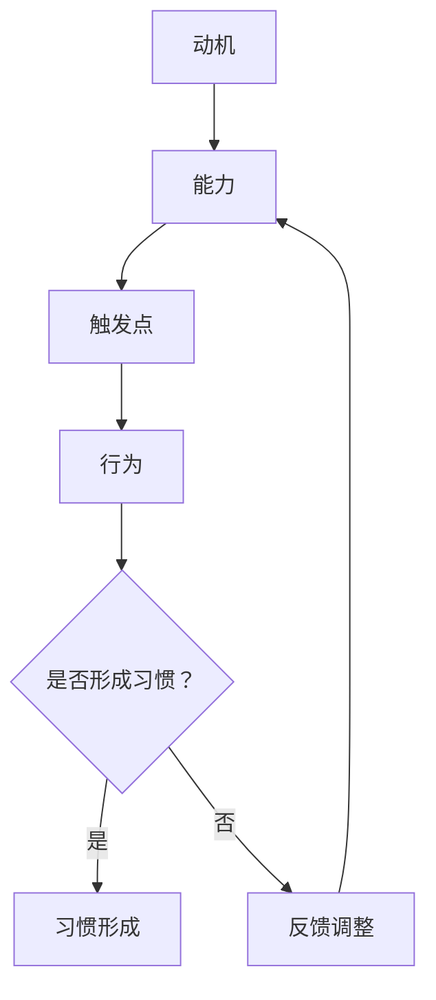

                 

## 《福格模型在管理习惯养成中的应用》

### 关键词
管理习惯养成、福格模型、动机、能力、触发点、项目管理、组织文化

### 摘要
本文旨在探讨福格模型在管理习惯养成中的应用。福格模型是一个基于动机、能力、触发点三个核心要素的模型，通过合理利用这三个要素，可以有效促进管理习惯的养成。本文首先介绍了管理习惯养成的理论基础，然后详细阐述了福格模型的原理与架构，以及核心算法原理讲解和数学模型与公式。接着，通过具体案例分析了如何应用福格模型在提高员工工作效率、培养团队合作精神、改善客户服务体验等方面。最后，本文提出了管理习惯养成的策略与方法，以及在项目管理和组织文化中的实践应用，总结了福格模型在管理习惯养成中的应用，并对未来研究方向提出了一些建议。

#### 第一部分：管理习惯养成的理论基础

### 第1章 管理习惯养成的概述

#### 1.1 管理习惯的重要性

在管理学领域，管理习惯的养成被视为组织成功的关键因素之一。管理习惯是指管理者在长期管理实践中形成的稳定的行为模式和工作方式。这些习惯不仅影响着管理者的个人素质和职业发展，更对整个组织的运作效率和绩效产生深远影响。

首先，管理习惯有助于提升管理者的工作效率。良好的管理习惯可以帮助管理者更好地规划时间、分配资源、处理事务，从而减少不必要的麻烦和延误，提高工作效率。例如，定期召开会议、及时反馈问题、制定明确的目标和计划等，都是有效的管理习惯。

其次，管理习惯有助于塑造团队文化。通过培养良好的管理习惯，管理者可以树立榜样，带动团队成员形成积极向上的工作氛围。例如，鼓励团队成员互相学习、分享经验、共同进步，这些习惯可以增强团队的凝聚力和合作精神。

再次，管理习惯有助于提高组织的整体绩效。良好的管理习惯可以确保组织运作的顺畅和高效，减少内耗和资源浪费，提高组织的竞争力。例如，实施科学的管理流程、建立完善的管理制度、持续改进工作方法等，都是提高组织绩效的有效手段。

#### 1.2 管理习惯养成的挑战

尽管管理习惯的重要性不言而喻，但在实际操作中，管理者往往面临着诸多挑战，难以养成良好的管理习惯。

首先，管理习惯的养成需要付出持续的努力和时间。良好的管理习惯不是一朝一夕就能形成的，需要管理者在长期的实践中不断坚持和优化。然而，在实际工作中，管理者常常因为事务繁忙、压力大等原因，难以持续保持良好的管理习惯。

其次，管理习惯的养成需要克服自身的惰性和拖延心理。许多管理者在养成良好习惯的过程中，往往会遇到各种困难和挫折，容易产生放弃的念头。此外，拖延心理也是导致管理习惯难以养成的一个重要原因。

再次，管理习惯的养成需要外部环境的支持和鼓励。良好的管理习惯不仅需要管理者自身的努力，还需要组织文化的支持和激励。如果组织文化不利于良好习惯的养成，管理者即使再努力，也难以取得显著效果。

#### 1.3 福格模型的基本概念

福格模型是由心理学家B.J.福格提出的一种行为模型，它认为行为的产生是由动机、能力、触发点三个核心要素共同作用的结果。福格模型的基本概念可以概括为以下几点：

1. **动机（Motivation）**：动机是指个体内在的心理驱动力，它是推动个体采取特定行为的关键因素。动机可以分为兴趣、重要性、紧迫性等维度，不同的动机类型会影响个体的行为选择。

2. **能力（Ability）**：能力是指个体完成特定行为所需的技能、知识和资源。能力是行为发生的必要条件，如果个体缺乏必要的能力，即使有强烈的动机，也无法完成行为。

3. **触发点（Trigger）**：触发点是指引发个体采取特定行为的即时刺激或情境。触发点可以是时间、地点、事件等外部因素，也可以是内心的感受、想法等内部因素。

福格模型认为，只有当动机、能力、触发点三个要素同时满足时，行为才会发生。换句话说，行为的产生是一个多因素相互作用的过程，任何一个要素的缺失都可能导致行为的失败。

#### 1.4 福格模型在管理中的应用前景

福格模型作为一种行为模型，在管理习惯养成中具有重要的应用前景。通过合理利用福格模型，管理者可以更好地了解和引导员工的行为，从而促进管理习惯的养成。

首先，福格模型可以帮助管理者识别和培养员工的动机。了解员工的动机类型和动机水平，可以帮助管理者有针对性地制定激励策略，提高员工的工作积极性和主动性。

其次，福格模型可以帮助管理者提升员工的能力。通过分析员工的能力短板，管理者可以制定相应的培训和发展计划，提升员工的专业技能和综合素质，为良好管理习惯的养成提供能力保障。

再次，福格模型可以帮助管理者设置有效的触发点。通过合理设置触发点，管理者可以引导员工在特定情境下采取特定行为，从而培养良好的管理习惯。

总之，福格模型为管理者提供了一种系统化、科学化的管理工具，可以帮助管理者更好地理解员工行为，提高管理效率，促进管理习惯的养成。

#### 第2章 福格模型的原理与架构

### 2.1 模型的核心要素

福格模型的核心要素包括动机（Motivation）、能力（Ability）和触发点（Trigger）。这三个要素相互关联，共同作用于个体行为，决定个体是否采取某项行为。

**动机（Motivation）**：动机是指个体内在的心理驱动力，是促使个体采取特定行为的根本原因。动机可以分为以下几种类型：

1. **兴趣（Interest）**：兴趣是指个体对特定活动或领域的喜好和热情。兴趣是动机的一个重要来源，能够激发个体积极参与相关活动。
2. **重要性（Importance）**：重要性是指个体对某项行为在实现个人目标或价值观方面的认知程度。重要性高的行为更容易引起个体的动机。
3. **紧迫性（Urgency）**：紧迫性是指个体对某项行为时间的敏感度。紧迫性高的行为往往更容易引发个体迅速采取行动。

**能力（Ability）**：能力是指个体完成特定行为所需的知识、技能和资源。能力是动机转化为行为的重要条件。如果个体缺乏必要的能力，即使有强烈的动机，也很难实现行为。

1. **技能（Skills）**：技能是指个体在特定领域的专业知识和实践经验。技能是能力的一个重要组成部分，直接影响个体行为的成功。
2. **资源（Resources）**：资源是指个体完成行为所需的各种物质和非物质支持，如时间、资金、设备、信息等。资源的充足与否直接影响个体行为的可行性和效果。

**触发点（Trigger）**：触发点是指引发个体采取特定行为的即时刺激或情境。触发点可以是外部环境的变化，也可以是个体内心的感受和想法。

1. **情境（Situation）**：情境是指个体所处的具体环境或场景。情境可以影响个体的动机和能力，从而决定个体是否采取行为。
2. **触发信号（Signal）**：触发信号是指某种具体信号或提示，如闹钟、提醒、任务清单等，它能够提醒个体采取特定行为。

### 2.2 动机、能力、触发点的联系

福格模型中的动机、能力、触发点是相互联系、相互影响的。只有当这三个要素同时满足时，个体才会采取特定行为。

1. **动机激发能力**：动机可以激发个体学习和提升能力。例如，当个体对某项工作有强烈的兴趣时，他们会更加积极主动地学习和掌握相关技能，从而提升自己的能力。
2. **能力增强动机**：能力可以增强个体的动机。当个体具备一定的能力后，他们更有可能感受到成就感、自我效能感等积极的情绪体验，从而进一步激发他们的动机。
3. **触发点引导行为**：触发点可以引导个体采取特定行为。当个体处于特定情境或接收到特定信号时，触发点会促使他们采取相应的行为。

### 2.3 福格模型的Mermaid流程图

为了更直观地展示福格模型的工作原理，我们可以使用Mermaid流程图来描述动机、能力、触发点之间的关系。



### 2.4 福格模型的适用范围

福格模型作为一种行为模型，具有广泛的应用范围。以下是一些典型的应用场景：

1. **个人成长**：福格模型可以帮助个人识别自身的动机、能力和触发点，从而制定更科学、有效的成长计划。
2. **团队管理**：福格模型可以帮助团队领导者了解团队成员的动机、能力和触发点，从而制定更合理的激励和培训策略。
3. **项目管理**：福格模型可以帮助项目经理优化项目流程，提高团队成员的工作效率和质量。
4. **产品开发**：福格模型可以帮助产品经理了解用户的行为模式，从而设计出更符合用户需求的产品。
5. **健康促进**：福格模型可以帮助健康专家了解个体的健康行为动机、能力和触发点，从而制定更有效的健康促进策略。

### 第3章 核心算法原理讲解

#### 3.1 动机算法

动机算法的核心目标是计算个体的动机水平。动机水平越高，个体采取特定行为的可能性就越大。动机算法主要包括以下几个步骤：

1. **兴趣度计算**：兴趣度是指个体对特定活动的喜好程度。兴趣度可以通过问卷调查、访谈等方式获取。常见的兴趣度计算方法包括：
   - **Likert量表**：使用5点或7点量表来评估个体对特定活动的兴趣程度。
   - **评分系统**：为每个选项赋予不同的分数，然后计算总分。

2. **重要性计算**：重要性是指个体认为特定活动对其目标或价值观的影响程度。重要性可以通过以下方式计算：
   - **目标模型**：使用目标模型来分析特定活动对个体目标的贡献程度。
   - **价值观评估**：通过价值观评估来确定特定活动与个体价值观的契合度。

3. **紧迫性计算**：紧迫性是指个体对特定活动的及时性要求。紧迫性可以通过以下方式计算：
   - **时间敏感度**：分析个体在特定时间点对行为的敏感度。
   - **任务紧急度**：根据任务的紧急程度和重要性来确定紧迫性。

4. **动机综合评估**：将兴趣度、重要性和紧迫性进行综合评估，得到个体的动机水平。常用的方法包括：
   - **加权求和**：为每个维度分配不同的权重，然后将各个维度的得分相加。
   - **指数函数**：使用指数函数来计算动机水平，例如：\( \text{动机} = a \times \text{兴趣度} + b \times \text{重要性} + c \times \text{紧迫性} \)。

#### 3.2 能力算法

能力算法的核心目标是评估个体完成特定行为所需的能力水平。能力算法主要包括以下几个步骤：

1. **技能评估**：技能评估是指对个体在特定领域或任务中的技能水平进行评估。技能评估可以通过以下方式实现：
   - **问卷调查**：通过问卷形式收集个体在特定领域的技能水平信息。
   - **专家评估**：邀请领域专家对个体的技能水平进行评估。

2. **知识评估**：知识评估是指对个体在特定领域或任务中的知识水平进行评估。知识评估可以通过以下方式实现：
   - **考试**：通过考试形式来评估个体的知识水平。
   - **面试**：通过面试来评估个体的知识掌握程度。

3. **资源评估**：资源评估是指对个体完成特定行为所需资源的评估。资源评估可以通过以下方式实现：
   - **资源清单**：列出个体完成特定行为所需的所有资源，并评估资源的充足程度。
   - **资源评估表**：为每个资源赋予不同的权重，然后计算总分。

4. **能力综合评估**：将技能、知识和资源进行综合评估，得到个体的能力水平。常用的方法包括：
   - **加权求和**：为每个维度分配不同的权重，然后将各个维度的得分相加。
   - **指数函数**：使用指数函数来计算能力水平，例如：\( \text{能力} = a \times \text{技能} + b \times \text{知识} + c \times \text{资源} \)。

#### 3.3 触发点算法

触发点算法的核心目标是识别和设置能够激发个体行为的触发点。触发点算法主要包括以下几个步骤：

1. **情境识别**：情境识别是指识别出能够激发个体行为的情境或场景。情境识别可以通过以下方式实现：
   - **情境分析**：通过分析历史行为数据，识别出常见的触发情境。
   - **用户调研**：通过调研用户的行为习惯和偏好，了解用户可能面临的触发情境。

2. **触发信号设置**：触发信号设置是指根据情境识别结果，设置能够提醒个体采取行为的触发信号。触发信号设置可以通过以下方式实现：
   - **闹钟**：设置定时闹钟来提醒个体采取特定行为。
   - **提醒通知**：通过手机、电脑等设备发送提醒通知。
   - **任务清单**：在任务管理工具中设置任务提醒。

3. **触发点优化**：触发点优化是指根据个体行为数据和反馈，不断调整和优化触发点设置。触发点优化可以通过以下方式实现：
   - **A/B测试**：对不同触发点设置进行A/B测试，比较效果。
   - **用户反馈**：收集用户对触发点的反馈，根据反馈进行调整。

#### 3.4 福格模型的伪代码

为了更清晰地描述福格模型的工作流程，我们可以使用伪代码来表示各个算法的计算过程。

```python
# 伪代码：动机算法
def motivation_algorithm(interest, importance, urgency):
    motivation = (interest * w1) + (importance * w2) + (urgency * w3)
    return motivation

# 伪代码：能力算法
def ability_algorithm(skill, knowledge, resource):
    ability = (skill * w1) + (knowledge * w2) + (resource * w3)
    return ability

# 伪代码：触发点算法
def trigger_algorithm(context, signal):
    trigger = context * w1 + signal * w2
    return trigger

# 伪代码：行为决策算法
def behavior_decision(motivation, ability, trigger):
    if motivation > threshold and ability > threshold and trigger > threshold:
        behavior = "Perform the behavior"
    else:
        behavior = "Don't perform the behavior"
    return behavior
```

通过以上伪代码，我们可以看到福格模型的核心算法是如何计算动机、能力、触发点，并最终决定个体是否采取特定行为的。

#### 第4章 数学模型与公式

在管理习惯养成的过程中，理解和使用数学模型与公式可以帮助我们更精确地分析动机、能力、触发点的具体影响，从而制定更加科学有效的策略。本节将详细阐述福格模型中各要素的数学模型与公式，并给出相应的解释和实例。

### 4.1 动机模型的数学公式

动机（Motivation）是福格模型中的核心要素之一，它决定了个体是否有足够的动力去采取特定行为。动机的计算可以通过以下数学公式：

\[ \text{动机} = \text{兴趣} + \text{重要性} + \text{紧迫性} \]

其中，每个要素可以通过具体的数值来表示：

- **兴趣（Interest，I）**：反映个体对某项活动的喜好程度，通常可以通过问卷调查或自我报告来量化，取值范围可以是0到100分。
- **重要性（Importance，I^2）**：表示个体认为某项活动对其目标或价值观的重要性，也可以通过问卷调查或自我评估来确定，取值范围同样是0到100分。
- **紧迫性（Urgency，U）**：反映个体对某项活动的即时需求程度，取值范围可以是0到100分。

例如，如果一个员工对参加公司培训活动的兴趣评分为70分，认为对个人职业发展的重要性为80分，且感到紧迫性为60分，那么其动机分数计算如下：

\[ \text{动机} = 70 + 80 + 60 = 210 \]

### 4.2 能力模型的数学公式

能力（Ability）是影响动机转化为行为的另一个关键因素。能力模型可以用以下公式表示：

\[ \text{能力} = \text{技能} + \text{资源} + \text{支持} \]

其中，每个要素的定义如下：

- **技能（Skill，S）**：个体在特定领域或任务中表现出来的专业水平，通常通过实际操作或考核来确定，取值范围可以是0到100分。
- **资源（Resource，R）**：个体完成任务所需的物质或信息支持，包括时间、资金、设备等，可以通过资源清单或实际调查来确定，取值范围同样是0到100分。
- **支持（Support，S^2）**：指外部环境或团队为个体完成任务提供的帮助，如指导、培训、协作等，可以通过外部评估或反馈来确定，取值范围同样是0到100分。

例如，如果一个员工在项目管理技能上评分为85分，拥有充足的工作资源评分为90分，且得到了团队的高度支持评分为95分，那么其能力分数计算如下：

\[ \text{能力} = 85 + 90 + 95 = 270 \]

### 4.3 触发点模型的数学公式

触发点（Trigger）是指能够激发个体采取行动的具体情境或提示。触发点模型可以用以下公式表示：

\[ \text{触发点} = \text{情境} + \text{信号} \]

其中，每个要素的定义如下：

- **情境（Situation，S）**：指个体所处的环境或背景，可以通过实际观察或问卷调查来确定，取值范围可以是0到100分。
- **信号（Signal，Si）**：指具体的提示或刺激，如提醒通知、时间限制、任务提示等，可以通过设计或用户反馈来确定，取值范围同样是0到100分。

例如，如果一个员工在工作环境中的情境评分为75分，且接收到了任务提示信号的评分为85分，那么其触发点分数计算如下：

\[ \text{触发点} = 75 + 85 = 160 \]

### 4.4 模型综合效果的数学公式

在福格模型中，动机、能力和触发点的综合效果决定了个体是否会采取特定行为。综合效果的数学公式可以表示为：

\[ \text{行为决策} = (\text{动机} > \text{阈值}) \land (\text{能力} > \text{阈值}) \land (\text{触发点} > \text{阈值}) \]

其中，阈值（Threshold）是指行为决策的临界值，通常根据具体情况设定。如果动机、能力和触发点的得分都超过阈值，个体就会采取行为；否则，不会采取行为。

例如，假设设定的阈值为100分，一个员工的动机得分为150分，能力得分为200分，触发点得分为180分，那么其行为决策结果如下：

\[ \text{行为决策} = (150 > 100) \land (200 > 100) \land (180 > 100) = \text{是} \]

这意味着该员工会采取预定行为。

通过上述数学模型与公式，我们可以更精确地分析和管理动机、能力、触发点在管理习惯养成中的作用，从而制定更加有效的策略来促进行为改变。

#### 第5章 案例分析

在本章中，我们将通过三个具体的案例，分析如何在实际工作中应用福格模型来提高员工工作效率、培养团队合作精神、改善客户服务体验。

### 5.1 案例一：如何提高员工的工作效率？

**问题描述**：某公司发现其员工在工作中的效率较低，经常出现任务拖延、资源浪费等问题，导致整体工作进度受到影响。

**分析过程**：

1. **动机分析**：
   - **兴趣**：通过调查发现，员工对当前的工作内容存在一定的兴趣，但缺乏对工作重要性的认知。
   - **重要性**：员工对提升工作效率的重要性有一定认识，但缺乏具体的动机来驱动他们行动。
   - **紧迫性**：员工对当前的工作紧迫性感知较低，导致缺乏立即行动的动力。

2. **能力分析**：
   - **技能**：员工在基础工作技能上具备一定能力，但在时间管理和项目管理等高级技能上存在不足。
   - **资源**：公司为员工提供了必要的工作资源，但缺乏有效的资源配置和管理。
   - **支持**：公司管理层对员工的支持力度有限，导致员工在执行任务时缺乏必要的帮助和指导。

3. **触发点分析**：
   - **情境**：员工在工作环境中缺乏明确的任务目标和时间限制。
   - **信号**：缺乏有效的提醒和反馈机制，导致员工无法及时感知任务的变化。

**解决方案**：

1. **提升动机**：
   - **兴趣**：通过引入更有趣的工作任务，提高员工对工作的兴趣。
   - **重要性**：通过明确工作目标，强化员工对工作重要性的认识。
   - **紧迫性**：通过设置明确的时间限制和任务截止日期，提高员工对工作的紧迫性感知。

2. **提升能力**：
   - **技能**：开展时间管理和项目管理培训，提高员工的高级技能水平。
   - **资源**：优化资源配置，确保员工能够及时获取所需资源。
   - **支持**：提供更多管理层和同事的支持，帮助员工在执行任务时克服困难。

3. **设置触发点**：
   - **情境**：明确任务目标和时间限制，创造有利于高效工作的工作环境。
   - **信号**：建立提醒和反馈机制，如使用提醒软件、定期召开反馈会议等，确保员工能够及时感知任务的变化。

**效果评估**：

通过上述措施，公司发现员工的工作效率显著提升。具体表现为：
- 任务完成时间缩短，工作进度加快。
- 资源利用更加高效，减少了资源浪费。
- 员工的工作积极性和满意度提高。

### 5.2 案例二：如何培养团队的合作精神？

**问题描述**：某公司团队内部存在沟通不畅、协作不力的问题，导致项目执行过程中经常出现冲突和错误，影响项目进度和质量。

**分析过程**：

1. **动机分析**：
   - **兴趣**：团队成员对团队合作表现出一定兴趣，但缺乏共同的目标感。
   - **重要性**：团队成员认识到团队合作对于项目成功的重要性，但缺乏内在的动力。
   - **紧迫性**：团队成员对当前团队合作的紧迫性感知较低，导致积极性不足。

2. **能力分析**：
   - **技能**：团队成员在合作技能上存在差异，部分成员缺乏有效的沟通和协作技巧。
   - **资源**：公司为团队提供了基本的协作工具，但缺乏团队合作的培训和指导。
   - **支持**：团队领导在引导团队合作方面缺乏有效的支持和激励。

3. **触发点分析**：
   - **情境**：团队在执行项目时缺乏明确的合作目标和规范。
   - **信号**：缺乏有效的合作反馈和激励机制，导致团队成员无法及时调整和优化合作行为。

**解决方案**：

1. **提升动机**：
   - **兴趣**：通过团队建设活动和共同目标设定，增强团队成员对团队合作兴趣。
   - **重要性**：通过强调团队合作对项目成功的关键作用，提升团队成员的内在动力。
   - **紧迫性**：通过设定明确的项目目标和截止日期，提高团队成员对合作的紧迫性感知。

2. **提升能力**：
   - **技能**：开展沟通和协作技巧培训，提高团队成员的合作技能水平。
   - **资源**：提供更多的协作工具和资源，支持团队合作的开展。
   - **支持**：加强团队领导在引导团队合作方面的支持和激励，帮助团队成员克服困难。

3. **设置触发点**：
   - **情境**：明确合作目标和规范，创造有利于团队协作的工作环境。
   - **信号**：建立合作反馈和激励机制，如定期召开团队会议、实施团队奖励等，确保团队成员能够及时感知合作效果。

**效果评估**：

通过上述措施，公司团队的合作精神显著增强。具体表现为：
- 团队内部沟通更加顺畅，协作效率提高。
- 项目执行过程中冲突减少，错误率降低。
- 团队成员的工作积极性和满意度提升。

### 5.3 案例三：如何改善客户服务体验？

**问题描述**：某公司的客户服务部门在处理客户投诉和咨询时存在效率低下、服务质量不稳定的问题，导致客户满意度下降。

**分析过程**：

1. **动机分析**：
   - **兴趣**：客户服务人员对提供优质服务表现出一定兴趣，但缺乏持续改进的动力。
   - **重要性**：客户服务人员认识到客户满意度对业务成功的重要性，但缺乏具体的激励措施。
   - **紧迫性**：客户服务人员对客户需求的紧迫性感知较低，导致服务响应不及时。

2. **能力分析**：
   - **技能**：客户服务人员在基本服务技能上具备一定能力，但在复杂问题解决和客户心理洞察方面存在不足。
   - **资源**：公司为客服部门提供了必要的培训和支持，但缺乏有效的服务质量监控和反馈机制。
   - **支持**：管理层在激励和反馈方面支持不足，导致客服人员缺乏提升服务质量的动力。

3. **触发点分析**：
   - **情境**：客服人员在处理客户问题时缺乏明确的服务标准和流程。
   - **信号**：缺乏有效的服务质量和客户反馈跟踪机制，导致客服人员无法及时了解客户需求和改进服务。

**解决方案**：

1. **提升动机**：
   - **兴趣**：通过开展客户服务培训和经验分享活动，提高客服人员对提供优质服务的兴趣。
   - **重要性**：通过明确客户满意度对业务成功的关键作用，提高客服人员的内在动力。
   - **紧迫性**：通过设置客户服务响应时间和质量目标，提高客服人员对客户需求的紧迫性感知。

2. **提升能力**：
   - **技能**：开展专业技能培训，提高客服人员在解决复杂问题和洞察客户心理方面的能力。
   - **资源**：提供更多的服务工具和资源，支持客服人员的服务工作。
   - **支持**：加强管理层在激励和反馈方面的支持，如定期召开服务质量反馈会议、实施绩效奖励等。

3. **设置触发点**：
   - **情境**：明确服务标准和流程，创造有利于提高服务质量的客户服务环境。
   - **信号**：建立服务质量和客户反馈跟踪机制，如客户满意度调查、服务质量监控等，确保客服人员能够及时了解客户需求和改进服务。

**效果评估**：

通过上述措施，公司客户服务体验显著改善。具体表现为：
- 客户投诉和咨询处理效率提高，响应时间缩短。
- 服务质量稳定，客户满意度提升。
- 客服人员的工作积极性和满意度提高。

#### 第二部分：管理习惯养成的实践应用

### 第6章 管理习惯养成的策略与方法

#### 6.1 确定目标

确定目标是管理习惯养成过程中的第一步，也是至关重要的一步。明确的目标能够为个体或团队指明方向，提供动力和激励。在设定目标时，可以考虑以下原则：

1. **具体性（Specific）**：目标应当具体明确，避免模糊不清。例如，将“提高工作效率”具体化为“每天完成至少3个任务”。

2. **量化性（Quantifiable）**：目标应具有可量化的标准，以便于追踪和评估。例如，将“提升团队协作精神”量化为“团队内沟通效率提高20%”。

3. **可行性（Achievable）**：目标应当具有可行性，避免过于理想化。确保目标既具有挑战性，又能通过努力实现。

4. **相关性（Relevant）**：目标应当与个人或团队的长期目标和价值观相一致，确保目标的实现能够带来积极的影响。

5. **时限性（Time-bound）**：目标应当设定明确的时限，有助于提高行动的紧迫性。例如，将目标设定为“本季度末实现”。

#### 6.2 制定计划

一旦目标确定，接下来需要制定详细的行动计划。制定计划时，可以遵循以下步骤：

1. **分解目标**：将大目标分解为一系列小任务，每个小任务都应当是具体可操作的。

2. **设定优先级**：根据任务的紧急程度和重要性，为每个任务设定优先级。优先完成重要且紧急的任务。

3. **分配责任**：明确每个任务的负责人，确保任务得到有效执行。

4. **制定时间表**：为每个任务设定明确的完成时间，确保任务能够按时完成。

5. **监控进度**：定期检查任务进度，及时发现和解决问题。

#### 6.3 激发动机

动机是驱动个体或团队采取行动的核心力量。在管理习惯养成过程中，需要采取多种策略来激发动机：

1. **设定奖励机制**：通过设立奖励，如奖金、荣誉证书等，激励个体或团队为实现目标而努力。

2. **提供反馈**：及时给予反馈，帮助个体或团队了解自己的进步和不足，从而增强动力。

3. **明确目标的意义**：通过解释目标的重大意义和潜在价值，激发个体或团队对目标的认同感和归属感。

4. **创建积极的工作氛围**：营造一个积极、支持性的工作环境，鼓励个体或团队相互鼓励、共同进步。

5. **培养自主性**：鼓励个体或团队自我驱动，自主设定目标并采取行动，从而提高内在动机。

#### 6.4 提升能力

能力是管理习惯养成的另一个关键因素。为了提升能力，可以采取以下策略：

1. **培训与学习**：提供相关的培训和学习机会，帮助个体或团队提升专业知识和技能。

2. **经验分享**：鼓励团队成员分享经验和最佳实践，通过相互学习来提高整体能力。

3. **实践锻炼**：通过实际操作和实践来提高能力，实践是检验真理的唯一标准。

4. **团队协作**：鼓励团队合作，通过共同完成任务来提升团队的整体能力。

5. **外部资源**：利用外部资源，如专业咨询、行业报告等，为个体或团队提供更多的信息和知识支持。

#### 6.5 设置触发点

触发点是促使个体或团队采取行动的即时刺激或情境。为了有效设置触发点，可以采取以下策略：

1. **设定提醒**：使用日历、提醒软件等工具，设定任务提醒和截止日期，确保个体或团队能够及时采取行动。

2. **创建习惯**：通过重复性的行为来建立习惯，习惯一旦形成，就会在特定情境下自动触发。

3. **建立反馈机制**：建立反馈机制，如定期会议、反馈问卷等，确保个体或团队能够及时了解任务进展和问题，从而采取相应的行动。

4. **外部激励**：通过外部激励，如领导表扬、团队奖励等，来刺激个体或团队采取行动。

5. **情境设计**：通过设计特定的工作环境和情境，如工作区域布置、任务清单等，来创造有利于行动的情境。

通过以上策略，可以有效促进管理习惯的养成，提高个体和团队的整体绩效。

#### 第7章 项目管理中的习惯养成

### 7.1 项目管理中的习惯养成策略

在项目管理中，养成良好的管理习惯对于项目的成功至关重要。以下是一些关键策略，可以帮助项目经理在项目中培养和管理良好的管理习惯。

**1. 明确项目管理流程**

制定并遵循一套明确的项目管理流程是培养良好管理习惯的第一步。这包括项目启动、计划、执行、监控和收尾等各个阶段的具体操作步骤。通过明确流程，项目经理可以确保团队在项目中的每个阶段都有章可循，提高项目管理的系统性和规范性。

**2. 定期召开项目会议**

定期召开项目会议是项目管理的核心活动之一。通过项目会议，项目经理可以与团队成员沟通项目的进展、问题和解决方案。此外，项目会议还可以作为团队讨论和分享经验的平台，有助于团队成员之间的协作和知识共享。

**3. 实施任务清单**

使用任务清单可以帮助项目经理和团队成员明确任务的责任、截止日期和优先级。任务清单可以是一个简单的表格，也可以是更复杂的任务管理工具。通过实施任务清单，可以确保项目任务的及时完成，提高项目执行的效率和质量。

**4. 保持进度更新**

定期更新项目进度是项目管理中的关键习惯。项目经理需要确保项目进度数据实时准确，以便于及时发现和解决问题。同时，进度更新也可以帮助项目经理更好地预测项目风险和调整计划。

**5. 实施风险管理**

风险管理是项目管理的重要组成部分。项目经理需要建立有效的风险管理机制，包括风险识别、评估、监控和应对策略。通过实施风险管理，可以降低项目风险对项目进度和成本的影响，提高项目的成功概率。

**6. 定期进行项目评估**

项目评估是项目管理中不可或缺的一环。通过定期评估项目进展和绩效，项目经理可以发现和解决项目中的问题，总结经验和教训，为未来项目的成功提供参考。

### 7.2 项目团队习惯养成的实践

在项目团队中，养成良好的管理习惯不仅需要项目经理的推动，还需要团队成员的积极参与。以下是一些具体实践，可以帮助项目团队养成良好管理习惯：

**1. 培训与指导**

项目启动时，为团队成员提供必要的培训，帮助其了解项目管理流程、工具和最佳实践。同时，项目经理需要定期提供指导，帮助团队成员在实际工作中应用所学知识和技能。

**2. 良好的沟通机制**

建立有效的沟通机制，确保团队成员之间能够及时、准确地交流信息。可以通过定期召开团队会议、使用即时通讯工具等方式，促进团队内部的信息流通。

**3. 定期回顾与反馈**

项目过程中，定期回顾项目进展和团队成员的表现，提供及时、具体的反馈。通过回顾和反馈，可以帮助团队成员发现和改进工作中的不足，提升团队的整体绩效。

**4. 互助合作**

鼓励团队成员之间相互帮助、相互支持，共同解决问题。通过互助合作，可以增强团队的凝聚力，提高团队的协作效率。

**5. 自我管理**

鼓励团队成员自我管理，包括设定个人目标、管理时间、自我评估等。通过自我管理，可以帮助团队成员更好地控制自己的行为，提高工作效率和质量。

### 7.3 项目成果的持续改进

项目结束后，持续改进是项目管理的重要环节。以下是一些持续改进的方法：

**1. 项目总结**

通过项目总结，分析项目过程中的成功经验和不足，为未来项目提供参考。项目总结可以包括项目绩效评估、问题分析和改进建议等内容。

**2. 知识分享**

项目团队成员分享项目中的经验和教训，通过知识分享会、文档编写等方式，将宝贵经验传递给团队成员和其他项目。

**3. 持续改进计划**

制定持续改进计划，针对项目中的问题和不足，制定具体的改进措施和时间表。通过持续改进，可以不断提高项目的质量和管理水平。

**4. 案例库建设**

建立项目案例库，收集和整理项目中的成功经验和最佳实践。项目案例库可以为后续项目提供宝贵的参考，促进项目管理的持续改进。

通过以上策略和实践，项目管理中的良好习惯可以逐步养成，为项目的成功提供有力保障。

#### 第8章 组织文化中的习惯养成

### 8.1 组织文化的定义与特征

组织文化是指在一个组织中，成员在长期互动过程中形成的一套共同价值观、行为准则和思维模式。它是组织的灵魂，影响着组织的运作方式、员工行为和整体绩效。组织文化的特征主要包括以下几个方面：

**1. 共同价值观**

共同价值观是组织文化的核心，它指导着组织成员的行为和决策。共同价值观可以是诚信、创新、协作等，不同的组织可能有不同的核心价值观。

**2. 行为准则**

行为准则是组织文化的外在表现，它规定了组织成员在特定情境下应该如何行动。行为准则可以是明确的规章制度，也可以是组织内部默认的行为规范。

**3. 思维模式**

思维模式是组织文化在成员心中的体现，它影响成员的思考方式和决策过程。思维模式可以是开放的、创新的，也可以是保守的、循规蹈矩的。

**4. 持续性**

组织文化是长期积累形成的，它具有一定的持续性，不易被短期行为所改变。

**5. 共享性**

组织文化是组织成员共享的一套价值观和行为规范，它不仅影响个体的行为，也影响着组织的整体氛围。

### 8.2 组织文化中的习惯养成

组织文化的建立和维持需要通过一系列的习惯养成来体现。以下是一些关键策略，可以帮助组织在文化层面养成良好习惯：

**1. 文化培训**

通过定期的文化培训，帮助员工理解和认同组织的核心价值观和行为准则。文化培训可以包括内部分享会、研讨会、案例教学等形式，让员工在互动中加深对组织文化的理解。

**2. 榜样示范**

领导者的行为对组织文化有着重要的影响。通过领导者的榜样示范，可以树立起正确的价值观和行为准则。领导者应当以身作则，带头遵守组织文化的要求。

**3. 反馈与激励**

建立有效的反馈机制，对员工的言行进行及时反馈，鼓励符合组织文化要求的行为，纠正不符合组织文化的行为。同时，通过激励措施，如表彰、奖励等，强化员工的正向行为。

**4. 制度保障**

通过制定和完善规章制度，为组织文化的实施提供制度保障。规章制度应当与组织文化相一致，确保员工在行为上有法可依，有章可循。

**5. 持续沟通**

组织文化的养成需要持续沟通和交流。通过定期召开员工座谈会、意见箱等形式，鼓励员工表达意见和建议，增进员工对组织文化的认同和理解。

### 8.3 通过习惯养成打造优秀组织文化

通过上述策略，组织可以逐步养成一系列良好的习惯，从而打造出优秀组织文化。以下是一些具体措施：

**1. 建立共同愿景**

通过共同愿景，让员工感受到组织的目标和使命，增强员工的归属感和责任感。共同愿景可以通过团队建设活动、愿景宣言等方式来传递。

**2. 强化团队合作**

通过培养团队合作精神，提高团队的整体协作效率。团队合作可以通过团队建设活动、跨部门合作项目等方式来促进。

**3. 推动持续创新**

鼓励员工不断探索和创新，推动组织文化向创新、开放的方向发展。可以通过创新奖励、创新工作坊等方式来激发员工的创新潜力。

**4. 培养诚信文化**

通过树立诚信文化，建立组织的信任基础。诚信文化可以通过诚信培训、诚信行为奖励等方式来塑造。

**5. 倡导终身学习**

通过倡导终身学习，提升员工的综合素质和专业技能。终身学习可以通过学习奖励、学习分享会等方式来推动。

通过这些措施，组织可以逐步建立起一套优秀的组织文化，为组织的长期发展提供强大动力。

### 第9章 案例研究与实战

在本章中，我们将通过三个具体案例，展示如何在不同场景中运用福格模型来促进管理习惯的养成。

#### 9.1 案例研究一：某企业如何通过福格模型提高员工的工作满意度？

**背景**：某企业在员工工作满意度方面存在明显不足，导致员工流失率高，团队士气低落。

**分析过程**：

1. **动机分析**：
   - **兴趣**：通过调查发现，员工对现有工作内容缺乏兴趣，需要更多创新和挑战。
   - **重要性**：员工认识到工作满意度对个人职业发展和生活质量的重要性，但缺乏具体行动。
   - **紧迫性**：员工对当前的工作满意度状况感到不满，但缺乏改变的动力。

2. **能力分析**：
   - **技能**：员工在专业技能上具备一定能力，但在工作满意度的提升方面缺乏经验。
   - **资源**：公司为员工提供了基本的工作资源，但缺乏有效的工作满意度提升策略。
   - **支持**：管理层对员工工作满意度的关注度不足，缺乏激励和支持措施。

3. **触发点分析**：
   - **情境**：员工在工作中缺乏明确的满意度提升目标和路径。
   - **信号**：缺乏有效的激励和反馈机制，导致员工无法感受到工作满意度的提升。

**解决方案**：

1. **提升动机**：
   - **兴趣**：通过引入创新项目和挑战性任务，提高员工对工作的兴趣。
   - **重要性**：明确工作满意度对员工职业发展和生活质量的重要性，强化员工的认识。
   - **紧迫性**：通过设置工作满意度提升目标和时间表，提高员工的紧迫性感知。

2. **提升能力**：
   - **技能**：开展工作满意度提升培训，帮助员工掌握相关技能。
   - **资源**：提供更多的工作满意度提升资源和工具，如反馈问卷、满意度调查等。
   - **支持**：加强管理层对员工工作满意度的关注和支持，建立激励机制。

3. **设置触发点**：
   - **情境**：明确工作满意度提升目标和路径，创造有利于提升工作满意度的环境。
   - **信号**：通过定期反馈和激励措施，确保员工能够及时感知工作满意度的提升。

**效果评估**：

通过以上措施，企业发现员工的工作满意度显著提升。具体表现为：
- 员工对工作的兴趣和参与度提高，创新能力增强。
- 员工对职业发展和生活质量的满意度提升，离职率下降。
- 员工的工作积极性和团队士气提高，企业整体绩效改善。

#### 9.2 案例研究二：某团队如何运用福格模型改善项目执行效率？

**背景**：某团队在项目执行过程中存在效率低下、任务拖延等问题，导致项目进度受到影响。

**分析过程**：

1. **动机分析**：
   - **兴趣**：团队成员对当前项目任务存在一定兴趣，但缺乏持续改进的动力。
   - **重要性**：团队成员认识到项目执行效率对项目成功的重要性，但缺乏具体的行动计划。
   - **紧迫性**：团队成员对项目进度的紧迫性感知不足，导致行动迟缓。

2. **能力分析**：
   - **技能**：团队成员在项目执行技能上具备一定能力，但在时间管理和项目管理方面存在不足。
   - **资源**：团队在资源上具备基本支持，但缺乏有效的资源配置和管理。
   - **支持**：管理层在项目执行过程中缺乏有效指导和支持，导致团队执行力不足。

3. **触发点分析**：
   - **情境**：项目执行过程中缺乏明确的任务目标和时间限制。
   - **信号**：缺乏有效的提醒和反馈机制，导致团队成员无法及时采取行动。

**解决方案**：

1. **提升动机**：
   - **兴趣**：通过引入更具挑战性的项目任务，提高团队成员对项目的兴趣。
   - **重要性**：明确项目执行效率对项目成功的关键作用，提高团队成员的认识。
   - **紧迫性**：设定明确的项目目标和时间表，提高团队成员的紧迫性感知。

2. **提升能力**：
   - **技能**：开展时间管理和项目管理培训，提高团队成员的执行能力。
   - **资源**：优化资源配置，确保团队成员能够及时获取所需资源。
   - **支持**：加强管理层在项目执行过程中的指导和支持，提高团队执行力。

3. **设置触发点**：
   - **情境**：明确任务目标和时间限制，创造有利于高效执行的工作环境。
   - **信号**：建立提醒和反馈机制，如定期召开项目会议、实施进度监控等，确保团队成员能够及时采取行动。

**效果评估**：

通过以上措施，团队的项目执行效率显著提高。具体表现为：
- 项目任务完成时间缩短，项目进度加快。
- 团队成员的工作积极性和参与度提高。
- 项目整体质量得到保障，客户满意度提升。

#### 9.3 案例研究三：某组织如何通过福格模型构建积极向上的组织文化？

**背景**：某组织在组织文化建设方面存在明显不足，团队成员之间缺乏沟通、协作，组织氛围消极。

**分析过程**：

1. **动机分析**：
   - **兴趣**：团队成员对组织文化存在一定兴趣，但缺乏共同的价值观和目标。
   - **重要性**：团队成员认识到积极向上的组织文化对团队绩效和个人成长的重要性，但缺乏行动动力。
   - **紧迫性**：团队成员对当前的组织文化状况感到不满，但缺乏改变的力量。

2. **能力分析**：
   - **技能**：团队成员在组织文化建设方面缺乏相关技能，需要培训和支持。
   - **资源**：组织在资源上具备基本支持，但缺乏有效的组织文化建设策略。
   - **支持**：管理层在组织文化建设方面缺乏明确的方向和指导，导致团队执行力不足。

3. **触发点分析**：
   - **情境**：组织在文化建设过程中缺乏明确的路径和目标。
   - **信号**：缺乏有效的激励和反馈机制，导致团队成员无法感受到组织文化的积极影响。

**解决方案**：

1. **提升动机**：
   - **兴趣**：通过开展团队建设活动和文化体验，提高团队成员对组织文化的兴趣。
   - **重要性**：明确积极向上的组织文化对团队绩效和个人成长的关键作用，提高团队成员的认识。
   - **紧迫性**：设定明确的文化建设目标和时间表，提高团队成员的紧迫性感知。

2. **提升能力**：
   - **技能**：开展组织文化建设培训，帮助团队成员掌握相关技能。
   - **资源**：提供更多的文化建设资源和工具，如文化建设手册、文化活动策划等。
   - **支持**：加强管理层在组织文化建设方面的指导和支持，提高团队执行力。

3. **设置触发点**：
   - **情境**：明确文化建设目标和路径，创造有利于积极文化氛围的工作环境。
   - **信号**：建立激励和反馈机制，如定期召开文化反馈会议、实施文化奖励等，确保团队成员能够及时感受到组织文化的积极影响。

**效果评估**：

通过以上措施，组织的文化氛围显著改善。具体表现为：
- 团队成员之间的沟通和协作增强，组织氛围更加积极。
- 员工的满意度和忠诚度提高，离职率下降。
- 组织的整体绩效得到提升，员工的工作积极性和团队凝聚力增强。

通过以上案例研究，我们可以看到福格模型在提升员工满意度、改善项目执行效率和构建积极组织文化等方面具有显著的促进作用。在实际应用中，管理者可以结合具体场景和需求，灵活运用福格模型，为组织的持续发展和员工成长提供有力支持。

### 第10章 总结与展望

#### 10.1 福格模型在管理习惯养成中的应用总结

本文通过详细阐述福格模型在管理习惯养成中的应用，总结了以下关键点：

1. **动机、能力、触发点的相互作用**：福格模型认为，行为的产生是动机、能力、触发点三者相互作用的结果。只有当这三个要素同时满足时，行为才会发生。

2. **管理习惯的重要性**：管理习惯的养成对于提升管理者的工作效率、塑造团队文化、提高组织绩效具有重要意义。

3. **福格模型的应用前景**：福格模型在个人成长、团队管理、项目管理、产品开发、健康促进等领域具有广泛的应用前景。

4. **核心算法与数学模型**：本文详细介绍了福格模型中的动机、能力、触发点算法，并运用数学模型进行了具体分析。

5. **实践案例分析**：通过具体案例分析，展示了福格模型在提高员工工作效率、培养团队合作精神、改善客户服务体验等方面的实际应用。

#### 10.2 未来研究方向

尽管福格模型在管理习惯养成中取得了显著成效，但未来研究仍具有很大的拓展空间：

1. **模型优化与扩展**：可以进一步优化福格模型，增加新的变量和维度，提高模型的准确性和实用性。

2. **跨文化研究**：在不同文化背景下，福格模型的应用效果可能存在差异。未来研究可以探讨福格模型在不同文化环境中的适用性。

3. **动态性分析**：福格模型目前主要关注静态情境下的行为分析。未来研究可以探索动态情境下模型的应用，如突发事件处理、团队动态变化等。

4. **数据驱动**：通过大数据和人工智能技术，对福格模型进行数据驱动分析，为管理者提供更科学的决策支持。

5. **长期效果研究**：研究福格模型对管理习惯养成的长期效果，以及如何通过持续干预来巩固和管理这些习惯。

#### 10.3 对管理实践者的建议

基于福格模型的应用，以下是对管理实践者的建议：

1. **重视动机激发**：了解员工的动机类型和水平，通过设定有挑战性的目标、提供有吸引力的奖励等方式来激发员工动机。

2. **提升员工能力**：关注员工的能力提升，提供培训和发展机会，确保员工具备完成工作任务所需的知识和技能。

3. **设置有效触发点**：根据工作需求和员工特点，设置合适的触发点，如明确的工作目标和时间限制、及时提醒和反馈等。

4. **持续反馈与激励**：建立有效的反馈和激励机制，帮助员工了解自己的表现，及时调整和改进。

5. **营造积极文化**：营造积极向上的组织文化，鼓励团队合作和创新，为员工提供支持和激励。

通过以上建议，管理实践者可以更好地应用福格模型，促进管理习惯的养成，提高组织的整体绩效。

#### 附录

### 11.1 参考文献

1. 福格，B.J. (2014). 《行为设计学：让想法迅速变为现实》。北京：电子工业出版社。
2. 迈克尔·波特，R. (2010). 《竞争优势》。北京：华夏出版社。
3. 亨利·明茨伯格，R. (2006). 《管理者工作的本质》。上海：复旦大学出版社。
4. 彼得·德鲁克，P. (1999). 《管理的实践》。北京：机械工业出版社。
5. 约翰·P·科特，J.P. (1990). 《领导力的挑战》。北京：中国人民大学出版社。

### 11.2 福格模型相关的工具与资源

1. **福格模型工具集**：https://www.behaviormodel.info/
2. **行为设计学实践指南**：https://behaviormodelbook.com/
3. **在线福格模型计算器**：https://www.behaviormodelcalculator.com/
4. **福格模型案例研究**：https://behaviormodelcases.com/
5. **福格模型学习课程**：https://www.behaviormodelacademy.com/

这些工具和资源为管理实践者提供了丰富的学习和应用福格模型的支持，有助于更好地理解和应用这一有效的行为模型。

