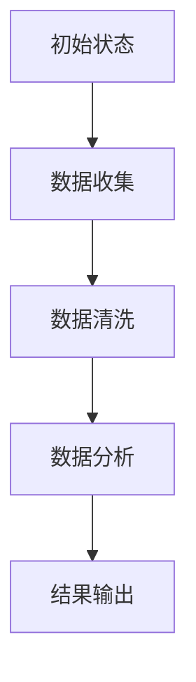

                 

## 文章标题：科技与社会：人类计算的双重影响与思考

> 关键词：科技，社会，计算，影响，伦理，未来

在信息时代的浪潮中，科技如同一股不可逆转的力量，深刻地改变着我们的生活方式、工作模式和社会结构。科技不仅提供了便利，也在不断地挑战我们的伦理观念和法律框架。本文将探讨人类计算对科技与社会之间复杂关系的双重影响，从多个角度分析科技如何作用于社会，以及社会如何反作用于科技。通过一步一步的逻辑推理，我们将深入思考科技与社会的相互关系，探讨其在未来可能的发展方向，并提出应对挑战的建议。

## 摘要

本文旨在分析科技与社会之间的相互作用，特别是人类计算对这一关系产生的双重影响。首先，我们将概述科技与社会的关系，探讨科技对社会各个方面的深远影响。然后，本文将详细探讨计算对个人隐私、信息安全和社会结构的影响。接下来，我们将展望未来科技的发展趋势，并探讨如何实现科技与社会的平衡发展。最后，本文将总结科技与社会的关系，提出建议，展望人类计算的未来。

### 目录大纲

1. **第一部分：科技与社会的相互作用**
    1.1 科技与社会的关系概述
        - 人类计算的定义与分类
        - 科技对社会的影响
        - 社会对科技的需求与反馈
    1.2 科技对社会的影响
        - 科技对经济的影响
        - 科技对教育的影响
        - 科技对文化交流的影响
    1.3 科技对社会生活的改变
        - 科技对生活方式的影响
        - 科技对工作方式的影响
        - 科技对家庭结构的影响

2. **第二部分：计算的双重影响**
    2.1 计算对个人隐私的影响
        - 个人隐私的定义与保护
        - 计算对个人隐私的威胁
        - 隐私泄露的案例与防范
    2.2 计算对信息安全的影响
        - 信息安全的定义与重要性
        - 计算对信息安全的影响
        - 信息安全保护的措施与策略
    2.3 计算对社会结构的影响
        - 社会结构的定义与变化
        - 计算对社会结构的影响
        - 社会结构变化的挑战与应对

3. **第三部分：未来展望与思考**
    3.1 未来科技的发展趋势
        - 人工智能与物联网的发展
        - 区块链技术的应用前景
        - 生物技术的革新
    3.2 科技与社会发展的平衡
        - 科技伦理的探讨
        - 社会责任与可持续发展
        - 科技与社会的和谐发展
    3.3 人类计算的未来
        - 人类计算的未来展望
        - 人类计算对未来的影响
        - 人类计算的伦理与法律问题

4. **结语**
    - 科技与社会的关系回顾
    - 科技发展的建议
    - 人类计算的未来方向

5. **附录**
    - 附录 A：参考文献
    - 附录 B：计算技术的流程图与伪代码
    - 附录 C：案例分析与应用示例

### 科技与社会的关系概述

在探讨科技与社会的关系时，我们首先需要理解什么是“人类计算”。人类计算，广义上指的是人类利用各种工具和技术进行信息处理和决策的过程。它包括计算机科学、信息技术、人工智能等领域，以及这些领域如何通过算法、数据结构和数学模型等工具，帮助我们更高效地处理信息，解决复杂问题。

人类计算可以分为几个主要类别：计算技术、计算方法和计算应用。计算技术是指计算机硬件和软件的发明与使用，如个人电脑、智能手机和服务器。计算方法是指算法和数据结构，它们定义了信息处理的方式和效率，例如排序算法、机器学习和神经网络。计算应用则是这些技术和方法的具体应用，如电子商务、社交媒体和自动驾驶。

接下来，我们探讨科技对社会的影响。科技的影响是深远且多方面的，可以从经济、教育、文化交流等多个角度来分析。

首先，科技对经济的影响是显而易见的。信息技术和互联网的普及，使得全球经济一体化程度加深，贸易和投资的效率显著提高。企业通过云计算、大数据分析和人工智能等技术，实现了生产流程的自动化和优化，提高了生产效率，降低了成本。此外，电子商务和在线支付等科技应用，改变了消费者的购物习惯，推动了零售业的变革。

其次，科技对教育的影响也极为显著。互联网和在线学习平台的普及，使得教育资源得以广泛传播，打破了地域和时间的限制。学生可以通过网络课程、在线图书馆和互动式学习工具，获取多样化的学习资源。同时，科技也为教育研究提供了新的方法和工具，如数据分析、虚拟现实和人工智能，促进了教育理论和实践的发展。

第三，科技对文化交流的影响不可忽视。互联网和社交媒体使得信息传播的速度和范围大大增加，人们可以即时获取全球各地的新闻和文化资讯。同时，数字媒体和虚拟现实技术为文化创作和传播提供了新的手段，如电子游戏、流媒体和虚拟展览。这些技术不仅丰富了人们的文化生活，也促进了不同文化之间的交流和融合。

然而，社会对科技的需求与反馈也是一个不可忽视的方面。社会对科技的需求主要体现在对更高效率、更好生活质量、更安全环境的追求。随着科技的不断进步，人们的需求也在不断变化。例如，在健康领域，人们对个性化医疗和远程医疗的需求日益增长；在教育领域，人们对在线教育和虚拟课堂的需求逐渐增加。

社会的反馈则体现在对科技的接受度、使用频率和改进建议上。科技的普及和进步离不开社会的广泛支持和参与。社会通过反馈，帮助科技不断改进和完善，以满足人们日益增长的需求。例如，在网络安全领域，公众对隐私保护的意识不断增强，促使企业和政府加强数据保护和网络安全措施。

综上所述，科技与社会之间的关系是复杂且相互影响的。科技不仅改变了社会的经济结构、教育模式和文化交流方式，同时也受到社会的需求与反馈的推动。理解这一关系，有助于我们更好地把握科技发展的方向，促进科技与社会的和谐共生。

### 科技对社会的影响

科技对社会的影响是多维度且深远的。在经济发展、教育改革和文化交流方面，科技都扮演着至关重要的角色。下面，我们将逐一探讨这些方面。

#### 1. 经济发展

科技对经济发展的推动作用不可低估。信息技术和互联网的普及，使得企业能够更高效地运营和扩展业务。云计算和大数据分析技术，帮助企业实现了资源的优化配置和业务流程的自动化，大大提高了生产效率和竞争力。例如，阿里巴巴和亚马逊等电商巨头，通过大数据分析和人工智能技术，精准预测市场需求，优化库存管理，实现了库存成本的显著降低。

此外，科技还促进了新产业的诞生和传统产业的转型升级。以物联网（IoT）为例，它通过连接各种设备和系统，实现了实时数据收集和智能决策，从而推动了智能制造、智慧城市等领域的发展。智能工厂通过物联网技术，实现了设备之间的无缝协作，提高了生产效率和产品质量。

#### 2. 教育改革

科技对教育的变革影响深远。互联网和在线学习平台使得教育资源得以广泛传播，打破了地域和时间的限制。例如，Khan Academy和Coursera等在线教育平台，提供了丰富的免费课程资源，使得全球范围内的学生都能够享受到高质量的教育。这种资源的开放性和可及性，大大提高了教育的普及率和公平性。

同时，科技还促进了教育方式的多样化。虚拟现实（VR）和增强现实（AR）技术，为教育提供了全新的体验。学生可以通过VR技术，身临其境地探索历史遗址或进行科学实验，增强了学习的趣味性和互动性。此外，人工智能（AI）在教育中的应用，如智能辅导系统和个性化学习平台，可以根据学生的学习习惯和能力，提供定制化的教育方案，提高了学习效果。

#### 3. 文化交流

科技在文化交流中的作用同样显著。互联网和社交媒体使得信息传播的速度和范围大大增加，人们可以即时获取全球各地的新闻和文化资讯。例如，YouTube和Twitter等社交媒体平台，让用户可以轻松地分享视频和文章，促进了全球文化的交流和传播。此外，流媒体平台如Netflix和Spotify，通过数字内容分发技术，使得用户可以随时随地享受全球各地的影视和音乐作品，丰富了人们的文化生活。

数字媒体和虚拟现实技术为文化创作和传播提供了新的手段。电子游戏、虚拟展览和流媒体平台，不仅为文化创作者提供了新的表达方式，也为观众提供了更丰富的文化体验。例如，《模拟人生》（The Sims）和《我的世界》（Minecraft）等游戏，不仅是一种娱乐方式，也是文化表达和创意展示的平台。虚拟展览则通过虚拟现实技术，让观众可以身临其境地参观博物馆和艺术展览，打破了空间和时间的限制。

#### 结论

科技对社会的影响是全面而深远的，它在经济发展、教育改革和文化交流等方面都发挥了重要作用。通过提高生产效率、优化教育资源和丰富文化交流方式，科技不断推动社会向前发展。然而，科技的发展也带来了新的挑战和问题，例如数据隐私、网络安全和社会伦理等问题。理解科技对社会的影响，有助于我们更好地把握科技发展的方向，充分发挥科技的优势，同时应对其带来的挑战。

### 科技对社会生活的改变

科技不仅深刻地影响了经济和教育，也在日常社会生活中带来了显著的变革。从生活方式、工作方式到家庭结构，科技都在不断地重塑我们的社会形态。

#### 1. 生活方式

科技对生活方式的改变是显而易见的。首先，智能手机和移动互联网的普及，使得人们可以随时随地进行沟通和获取信息。从社交媒体到在线购物，人们的生活越来越依赖于互联网。这种便利性不仅提高了生活效率，也改变了人们的社交方式。例如，微信和Facebook等社交平台，使得人们可以轻松地与朋友、家人保持联系，甚至建立新的社交关系。

其次，智能家居技术的兴起，也极大地改变了人们的生活方式。智能音箱、智能灯光、智能冰箱等设备，通过物联网技术，实现了家庭设备的互联互通，提高了生活的舒适度和便利性。例如，智能灯光可以根据用户的习惯和时间自动调节，智能冰箱可以实时监测食品的保质期，并提供购物提醒，这些功能不仅提高了生活质量，也节省了人力和时间成本。

#### 2. 工作方式

科技对工作方式的改变同样深远。远程办公、数字化协作和自动化技术，使得工作不再受限于时间和地点。首先，远程办公的普及，得益于云计算和协作工具的发展。员工可以通过VPN、在线会议和即时通讯工具，随时随地进行工作，这种灵活性提高了工作效率和员工满意度。

其次，数字化协作工具，如Microsoft Teams、Slack和Trello，使得团队成员可以高效地沟通和协作。这些工具提供了项目管理、文档共享和任务分配等功能，使得团队协作更加有序和高效。例如，团队成员可以实时共享文件、讨论项目进展，并通过视频会议进行线上会议，这种协作方式不仅节省了时间和成本，也提高了团队的凝聚力。

最后，自动化技术的应用，使得许多重复性、低技能的工作得以自动化。例如，机器人流程自动化（RPA）技术，可以通过软件机器人自动执行重复性的任务，如数据录入、报表生成等。这不仅提高了工作效率，还减少了人为错误。

#### 3. 家庭结构

科技对家庭结构的影响也不可忽视。首先，数字媒体和在线娱乐平台的普及，使得家庭成员之间的互动方式发生了变化。例如，电视和电影不再只是家庭娱乐的主要方式，家庭成员可以通过智能手机和平板电脑，观看自己感兴趣的内容，这种个性化的娱乐方式改变了家庭娱乐的传统模式。

其次，远程教育技术的发展，使得家庭结构中的教育模式发生了变化。例如，通过在线教育平台，学生可以在家里接受高质量的教育，而不必亲自前往学校。这种教育模式不仅提高了学习效率，也减轻了家庭的经济负担。

最后，智能家居技术的发展，使得家庭生活更加智能化和便捷化。例如，智能音箱可以回答家庭成员的问题、播放音乐、设定提醒等，智能灯光可以根据家庭成员的作息时间自动调节，提高了家庭的舒适度和安全性。

#### 结论

科技对社会生活的改变是全方位的，从生活方式、工作方式到家庭结构，科技都在不断地重塑我们的社会形态。这些变化不仅提高了生活质量和效率，也带来了新的挑战和机遇。了解这些变化，有助于我们更好地适应科技带来的变革，并在享受便利的同时，警惕潜在的风险和问题。

### 计算对个人隐私的影响

计算技术的飞速发展，在为我们带来诸多便利的同时，也引发了对个人隐私的严重担忧。隐私，是指个人在信息处理过程中保持私密性和自主性的能力。在数字时代，个人隐私的泄露可能带来不可逆转的负面影响，因此理解计算对个人隐私的影响，并采取有效措施保护隐私，变得尤为重要。

首先，我们需要明确什么是个人隐私。个人隐私通常指的是个人身份、行为、健康状况、财务信息等敏感数据的保密性。隐私权是每个人的基本权利，是保护个人自由和社会安全的重要组成部分。

计算技术对个人隐私的影响主要体现在以下几个方面：

#### 1. 数据收集与使用

随着大数据技术的普及，企业和政府可以轻松收集大量用户数据。这些数据包括用户在互联网上的行为记录、位置信息、社交关系等。例如，社交媒体平台如Facebook、Twitter和微信，通过用户的浏览记录和社交行为，收集了大量的个人数据。这些数据不仅用于商业分析，还被用于广告推送和用户行为预测。

然而，数据收集往往缺乏透明度，用户在不知情的情况下，个人信息就可能被收集、分析和共享。这种做法不仅侵犯了个人隐私，还可能导致信息被滥用。例如，2018年Facebook数据泄露事件，涉及8700万用户的个人信息被不当使用，引发了广泛的隐私保护争议。

#### 2. 数据泄露与滥用

数据泄露是计算技术对个人隐私的另一个严重威胁。随着网络攻击手段的日益复杂，企业和组织的数据系统可能成为黑客的目标。例如，2017年的索尼影业数据泄露事件，黑客入侵了索尼的内部网络，盗取了大量敏感数据，包括员工个人信息和公司内部文件。

数据泄露不仅对个人隐私造成侵害，还可能对个人和社会安全带来严重影响。例如，金融信息泄露可能导致财产损失，个人身份信息泄露可能导致身份盗用，这些事件都可能对个人的生活和社会秩序造成严重破坏。

#### 3. 隐私保护的法律法规

为了应对计算技术对隐私的威胁，各国政府纷纷出台了相关的隐私保护法律法规。例如，欧洲的《通用数据保护条例》（GDPR）和美国加州的《消费者隐私法案》（CCPA）等，都对数据收集、存储、处理和分享做出了严格的规定。

这些法规要求企业必须在收集和使用用户数据时，透明告知用户，并征得用户的明确同意。同时，法规还规定了数据泄露后的应对措施，包括通知受影响的用户和采取补救措施。这些法规的实施，为个人隐私提供了更为坚实的法律保障。

#### 4. 隐私保护措施

为了保护个人隐私，企业和个人可以采取多种措施。对于企业来说，首先应确保数据收集的透明度，明确告知用户数据收集的目的和使用方式。其次，应加强数据安全防护，采用加密技术、访问控制和安全审计等措施，防止数据泄露。

对于个人来说，提高隐私保护意识至关重要。个人应谨慎分享个人信息，避免在不信任的平台上透露敏感数据。此外，个人应定期更新密码，使用多因素认证，以增强账户的安全性。同时，个人应了解相关隐私保护法律法规，并在遇到隐私侵害时，知道如何维权。

#### 案例分析

以下是一些隐私泄露的典型案例，以及其防范措施：

1. **Facebook数据泄露事件**：2018年，Facebook的数据泄露事件引起了全球关注。超过8700万用户的个人信息被不当使用，用于政治广告投放。**防范措施**：用户应谨慎授权第三方应用访问个人数据，定期检查账户设置，关闭不必要的权限。

2. **Equifax数据泄露事件**：2017年，美国信用报告机构Equifax发生数据泄露，导致1.43亿用户的个人信息泄露。**防范措施**：用户应定期检查信用报告，及时发现异常活动；企业应加强网络安全防护，及时更新安全系统。

3. **Adobe数据泄露事件**：2013年，Adobe公司的用户数据泄露，包括客户密码和信用卡信息。**防范措施**：用户应使用强密码，并避免使用相同的密码在不同平台上；企业应加强密码存储和传输的安全性，采用加密技术。

综上所述，计算技术对个人隐私的影响是复杂且多方面的。通过加强法律法规、企业隐私保护措施和个人隐私意识，我们可以有效防范隐私泄露风险，保护个人隐私权。在享受科技带来的便利的同时，我们应时刻警惕隐私风险，维护个人和社会的安全与和谐。

### 计算对信息安全的影响

信息安全是现代社会面临的一项重大挑战，随着计算技术的广泛应用，信息安全问题也日益凸显。在数字化时代，计算技术不仅为我们的生活带来了便利，同时也增加了信息安全的风险。本文将深入探讨计算对信息安全的影响，包括黑客攻击、恶意软件和网络钓鱼等，并分析这些威胁的防范措施。

#### 1. 黑客攻击

黑客攻击是指未经授权的攻击者通过各种手段非法侵入计算机系统、网络或设备，以获取机密信息、造成系统瘫痪或进行其他恶意行为。黑客攻击的类型多样，常见的有：

- **分布式拒绝服务攻击（DDoS）**：攻击者通过控制大量僵尸主机，向目标系统发送大量请求，导致系统资源耗尽，无法正常提供服务。
- **网络钓鱼**：攻击者通过伪装成合法机构或个人，诱骗用户提供敏感信息，如用户名、密码和信用卡号码。
- **社会工程学攻击**：攻击者利用人类的心理弱点，通过电话、邮件或社交媒体等手段，骗取用户的信任，获取机密信息。

黑客攻击对信息安全造成的威胁主要表现为系统瘫痪、数据泄露和财产损失。例如，2017年的WannaCry勒索软件攻击，影响了全球数以百万计的计算机，导致大量数据被加密锁住，直到支付赎金才能解锁。

#### 2. 恶意软件

恶意软件是指专门设计用于破坏、窃取或篡改计算机系统数据的恶意程序。常见的恶意软件包括病毒、蠕虫、木马和间谍软件等。

- **病毒**：病毒是一种能够自我复制并感染其他程序的恶意代码。它通过电子邮件、可移动存储设备等途径传播，一旦感染，可能导致系统崩溃、数据丢失。
- **蠕虫**：蠕虫是一种能够自我传播的恶意软件，它利用网络漏洞或社交工程学手段，在没有用户干预的情况下传播。
- **木马**：木马是一种隐蔽在合法程序中的恶意软件，它通常伪装成正常软件，通过诱骗用户安装，实现对计算机系统的控制。
- **间谍软件**：间谍软件主要用于监控用户的行为，收集用户的敏感信息，如浏览历史、聊天记录和键盘输入等。

恶意软件的危害主要体现在数据泄露、隐私侵犯和财产损失。例如，2019年的Zombie Loader恶意软件攻击，通过欺骗用户下载恶意软件，盗取了大量的用户账户信息和信用卡信息。

#### 3. 网络钓鱼

网络钓鱼是一种通过欺骗手段获取用户敏感信息的犯罪活动。攻击者通常通过伪装成合法机构或个人，向用户发送虚假的电子邮件、短信或社交媒体消息，诱骗用户点击链接或下载附件。

网络钓鱼的危害主要体现在用户隐私泄露和财产损失。例如，用户可能会因此泄露银行账户信息、密码和其他敏感数据，导致账户被盗刷或个人信息被滥用。

#### 4. 防范措施

为了应对计算技术带来的信息安全威胁，我们可以采取以下防范措施：

- **安装和更新防病毒软件**：防病毒软件可以检测和清除恶意软件，保护计算机系统免受病毒、蠕虫和木马等恶意程序的攻击。
- **使用防火墙**：防火墙可以监控网络流量，防止未经授权的访问和攻击。
- **定期备份数据**：定期备份重要数据，可以防止数据丢失或损坏。在遭遇恶意攻击时，可以通过备份恢复数据。
- **加强用户意识教育**：提高用户对信息安全威胁的认识，教育用户避免点击不明链接、下载不明文件和随意泄露个人信息。
- **使用强密码和多因素认证**：使用强密码并启用多因素认证，可以增强账户的安全性，防止黑客通过密码猜测或密码破解攻击获得访问权限。

综上所述，计算技术对信息安全的影响是复杂且多方面的。通过采取有效的防范措施，我们可以降低信息安全风险，保护个人和企业的重要数据。在享受科技带来的便利的同时，我们应时刻保持警惕，防范潜在的安全威胁。

### 计算对社会结构的影响

计算技术的迅猛发展，不仅改变了个人和社会的生活方式，也深刻地影响了社会结构。从社会结构的定义、变化到具体影响，计算技术的作用不可忽视。

首先，我们需要理解什么是社会结构。社会结构是指社会各个组成部分及其相互关系和互动方式的总体架构。它包括家庭、教育、经济、政治和文化等多个层面。社会结构的变化通常表现为社会关系的调整、社会角色的转变和社会组织的更新。

计算技术对社会结构的影响主要体现在以下几个方面：

#### 1. 社会角色的转变

计算技术的普及，使得社会角色的转变变得日益明显。例如，在职场中，远程办公和数字化协作工具的出现，使得许多职业角色变得更为灵活。传统的办公室工作模式逐渐被虚拟办公所取代，员工可以在全球任何地方进行工作。这种变化不仅提高了工作效率，也打破了地域的限制，使得职业选择更加多样。

此外，计算技术还催生了新的职业角色，如数据分析师、AI工程师和网络安全专家等。这些职业角色要求具备高度的专业技能和计算机素养，与传统职业相比，具有更高的技术含量和创新能力。

#### 2. 社会关系的调整

计算技术改变了人们之间的社会关系。一方面，互联网和社交媒体使得人们可以更便捷地保持联系和沟通。通过社交媒体平台，人们可以与远在他乡的亲友保持密切联系，分享生活点滴。然而，这种便捷的沟通方式也带来了新的挑战，如信息过载和社交疲劳。

另一方面，计算技术使得社会关系变得更加虚拟和短暂。虽然人们可以在网络上建立广泛的社交网络，但面对面的互动却逐渐减少。这种趋势可能导致人际关系的疏离和社区凝聚力的下降。

#### 3. 社会组织的更新

计算技术对社会组织的影响也体现在其结构和管理方式的变革。首先，虚拟组织和管理模式的兴起，使得社会组织更加灵活和高效。例如，许多创业公司和远程团队采用敏捷开发和分布式管理，通过互联网工具实现高效协作和快速响应。

其次，计算技术改变了社会组织的运作方式。大数据和人工智能技术的应用，使得社会组织能够更好地了解成员的需求和行为，从而提供更加个性化和精准的服务。例如，教育机构可以通过数据分析，了解学生的学习情况，提供个性化的学习方案。

#### 4. 挑战与应对

计算技术对社会结构的积极影响不容忽视，但同时也带来了一系列挑战。例如，社会角色的转变可能导致职业不稳定和技能短缺；社会关系的调整可能导致人际关系疏离和社区凝聚力下降；社会组织的更新可能面临技术依赖和隐私保护等问题。

为了应对这些挑战，我们需要采取一系列措施。首先，应加强职业培训和技能提升，确保劳动力市场能够适应技术变革。其次，应促进线上线下互动，增强人际关系的深度和广度。最后，社会组织应加强数据保护，确保个人信息的安全和隐私。

综上所述，计算技术对社会结构的影响是深远且多方面的。通过理解这些影响，我们可以更好地应对技术变革带来的挑战，促进社会结构的优化和发展。

### 未来科技的发展趋势

随着科技的不断进步，未来科技的发展趋势将带来诸多变革，特别是在人工智能、物联网和生物技术等领域。以下是对这些新兴技术的简要概述及其对社会的潜在影响。

#### 1. 人工智能（AI）

人工智能是未来科技发展的重要方向之一。它通过模拟人类智能，实现自主学习和决策能力。AI的应用领域广泛，包括自动驾驶、医疗诊断、智能家居、金融分析和军事应用等。随着深度学习和神经网络技术的突破，AI的性能和准确性不断提高。

- **自动驾驶**：自动驾驶汽车是AI技术的典型应用。通过传感器、摄像头和GPS，自动驾驶汽车可以实时感知路况并做出驾驶决策，有望大幅提高交通效率和安全性。
- **医疗诊断**：AI在医疗领域的应用潜力巨大。通过分析大量医疗数据，AI可以帮助医生进行疾病诊断和治疗方案推荐，提高医疗效率和准确性。
- **智能家居**：智能家居系统利用AI技术，实现家庭设备的智能化和互联互通。用户可以通过语音控制、手机应用等方式，远程操控家里的灯光、温度、安全系统等，提升生活便利性。

#### 2. 物联网（IoT）

物联网是连接物理世界和数字世界的桥梁，通过将各种设备和系统连接到互联网，实现实时数据收集和智能决策。物联网技术的发展，将极大地改变我们的生活和工作方式。

- **智能家居**：物联网技术使得家庭设备智能化和自动化，如智能灯泡、智能空调和智能门锁等，提升生活质量。
- **智能城市**：物联网技术应用于城市管理，如交通监控、环境监测和公共安全等，提升城市运行效率和居民生活质量。
- **工业物联网**：工业物联网通过实时监控和数据分析，实现生产流程的优化和设备管理，提高生产效率和产品质量。

#### 3. 生物技术

生物技术是未来科技发展的另一大领域，它通过基因编辑、生物制药和生物计算等技术，推动医学、农业和环保等领域的发展。

- **基因编辑**：基因编辑技术，如CRISPR-Cas9，可以通过修改生物体的基因，治疗遗传性疾病和改善作物特性。然而，基因编辑技术也引发了伦理和安全问题，需要严格监管。
- **生物制药**：生物技术推动了新药研发，如单克隆抗体、基因疗法和细胞疗法等，为许多难治性疾病提供了新的治疗手段。
- **生物计算**：生物计算利用生物分子进行计算，有望解决传统计算机无法处理的复杂问题。例如，DNA计算可以通过DNA分子的编码和操作，实现高效的计算任务。

#### 结论

未来科技的发展趋势将带来深远的影响，从人工智能、物联网到生物技术，这些新兴技术都将深刻改变我们的生活和社会。了解这些趋势，有助于我们更好地把握未来科技发展的方向，并积极应对其带来的挑战和机遇。

### 科技与社会发展的平衡

在科技迅速发展的时代，如何实现科技与社会的平衡成为了一个重要课题。科技与社会的平衡不仅关系到技术的可持续发展，也直接影响到社会秩序和人类福祉。以下从科技伦理、社会责任和可持续发展三个方面，探讨如何实现科技与社会的和谐发展。

#### 1. 科技伦理

科技伦理是指科技在发展过程中，遵循的道德规范和价值观。科技伦理问题的核心在于如何在科技进步的同时，保护人类的尊严和权利。以下是一些常见的科技伦理问题及其解决方案：

- **数据隐私**：在数据驱动的时代，如何保护个人隐私成为一个重大挑战。解决方案包括制定严格的数据保护法律法规，如《通用数据保护条例》（GDPR），提高企业和个人对数据隐私的意识，并采取技术措施，如数据加密和匿名化，保护用户隐私。
- **人工智能伦理**：人工智能技术的广泛应用，引发了关于算法偏见、透明度和责任归属的伦理争议。解决方案包括制定人工智能伦理准则，确保算法的公正性和透明度，以及明确人工智能系统的责任归属，避免技术滥用和伦理风险。
- **基因编辑**：基因编辑技术的进步，使得人类有能力改变生物体的遗传特性，但同时也引发伦理和安全问题。解决方案包括建立全球性的基因编辑监管机构，制定明确的伦理规范和安全标准，以防止技术滥用和生物威胁。

#### 2. 社会责任

企业在科技发展中扮演着重要角色，承担社会责任是企业发展的必然要求。以下是一些社会责任的实践：

- **环境保护**：企业在技术研发和生产过程中，应积极采取环保措施，减少对环境的负面影响。例如，通过采用可再生能源、提高能源利用效率和减少废弃物排放，实现可持续发展。
- **公平就业**：企业在招聘和晋升过程中，应确保公平和包容，避免性别、种族和年龄歧视，为所有人提供平等的就业机会。
- **公益捐赠**：企业可以通过公益捐赠、志愿服务和社区支持等方式，回馈社会。例如，捐赠资金和资源用于教育和医疗，支持贫困地区的经济发展和社会进步。

#### 3. 可持续发展

可持续发展是指满足当前需求，而不损害子孙后代满足其需求的能力。科技在可持续发展中具有重要作用，以下是一些具体措施：

- **绿色科技**：发展绿色科技，如节能技术、环保材料和可再生能源，减少资源消耗和环境污染。
- **循环经济**：通过循环利用资源，减少废物产生和环境污染。例如，推动废弃物分类回收，实现资源的闭环利用。
- **智能城市**：建设智能城市，利用物联网、大数据和人工智能等科技手段，提高城市管理的效率和可持续性。例如，通过智能交通系统优化交通流量，减少拥堵和尾气排放。

#### 结论

实现科技与社会的平衡，需要从科技伦理、社会责任和可持续发展三个方面共同努力。通过制定和遵循科技伦理规范，承担社会责任，推动可持续发展，我们可以实现科技与社会的和谐发展，为人类创造一个更加美好和可持续的未来。

### 人类计算的未来

随着科技的不断进步，人类计算的未来前景广阔，但同时也面临着诸多挑战。以下从人工智能、物联网和生物技术等新兴领域，展望人类计算的未来，并探讨其对人类社会的潜在影响。

#### 1. 人工智能

人工智能（AI）是未来计算技术的重要方向之一，其发展前景令人瞩目。在未来，人工智能将进一步融入各个行业，改变我们的生活方式和工作模式。

- **自动化与智能化**：随着深度学习和强化学习算法的进步，人工智能将在自动化领域发挥更大的作用。例如，自动化生产线、无人驾驶汽车和智能物流等，将大幅提高生产效率和运输效率。
- **个性化和定制化**：人工智能可以根据用户的行为和偏好，提供个性化的服务。例如，智能助手可以基于用户的喜好，推荐合适的商品、新闻和音乐，提高用户体验。
- **医疗与教育**：人工智能在医疗和教育领域有巨大的应用潜力。通过分析海量医疗数据，AI可以帮助医生进行精准诊断和治疗；在教育领域，人工智能可以提供个性化的学习方案，提高教学效果。

然而，人工智能的发展也带来了诸多挑战，如算法偏见、隐私保护和就业替代等问题。为了应对这些挑战，我们需要制定明确的伦理规范，加强技术监管，确保人工智能的公正性和安全性。

#### 2. 物联网

物联网（IoT）技术通过连接各种设备和系统，实现数据的实时收集和分析，从而推动智能城市、智能家居和工业4.0等领域的快速发展。

- **智能城市**：物联网技术可以应用于交通管理、能源管理和公共安全等，提升城市运行效率和居民生活质量。例如，通过智能交通系统，可以实时监控交通流量，优化交通信号，减少拥堵和尾气排放。
- **智能家居**：物联网技术使得家庭设备智能化和互联互通，提高生活便利性和舒适度。例如，通过智能音箱和智能家电，用户可以语音控制家里的灯光、空调和安全系统。
- **工业4.0**：物联网技术在工业生产中的应用，可以实现生产流程的数字化和智能化，提高生产效率和产品质量。例如，通过物联网技术，可以实现设备的远程监控和维护，预防故障和优化生产流程。

物联网技术的发展也面临着数据隐私和安全问题。为了确保物联网的可靠性和安全性，我们需要制定严格的数据保护法规，加强网络安全防护，确保用户数据的安全。

#### 3. 生物技术

生物技术是未来计算技术的重要领域，通过基因编辑、生物制药和生物计算等技术，推动医学、农业和环保等领域的发展。

- **基因编辑**：基因编辑技术，如CRISPR-Cas9，可以用于治疗遗传性疾病和改善作物特性。未来，基因编辑技术有望解决一些重大疾病，如癌症和遗传性疾病，提高人类健康水平。
- **生物制药**：生物技术在新药研发和疾病治疗方面有巨大潜力。通过生物计算和人工智能技术，可以加速新药研发，提高药物疗效和安全性。
- **生物计算**：生物计算利用生物分子进行计算，可以解决传统计算机无法处理的复杂问题。例如，DNA计算可以在短时间内解决复杂的计算任务，有望在科学研究和工程设计等领域发挥重要作用。

然而，生物技术的发展也引发了伦理和安全问题，如基因编辑技术的伦理争议和生物安全风险。为了应对这些挑战，我们需要建立全球性的监管框架，制定明确的伦理规范，确保生物技术的安全性和可持续性。

#### 结论

人类计算的未来充满机遇与挑战。随着人工智能、物联网和生物技术等新兴领域的发展，人类计算将带来深刻的社会变革。为了实现科技与社会的和谐发展，我们需要积极应对挑战，加强科技伦理和社会责任，推动可持续发展。只有这样，我们才能充分利用科技的优势，为人类社会创造更加美好和可持续的未来。

### 结语

科技与社会的关系是一个复杂而互动的过程，两者相互影响，共同塑造了当今的世界。科技不仅推动了社会进步，提升了生活质量，也在经济、教育、文化等多个方面产生了深远影响。同时，社会对科技的需求和反馈，也推动了科技的不断发展和完善。

在展望未来时，我们必须认识到科技发展带来的双重影响。一方面，科技为我们提供了前所未有的便利和可能性；另一方面，科技也带来了新的挑战和风险，如个人隐私、信息安全和社会结构的变革。为了实现科技与社会的和谐发展，我们需要在以下几个方面提出建议：

1. **加强科技伦理建设**：制定明确的科技伦理规范，确保科技在发展过程中，遵循道德原则和价值观，保护人类尊严和权利。

2. **推动科技创新与责任**：鼓励企业在科技创新中承担社会责任，注重环境保护、公平就业和公益捐赠，实现可持续发展。

3. **加强数据隐私和安全保护**：建立严格的数据保护法律法规，提高企业和个人对数据隐私和安全保护的意识，采取技术措施，防范数据泄露和滥用。

4. **培养科技人才**：加强科技教育和培训，提高公众的科技素养，培养具备创新能力和国际视野的科技人才。

5. **促进全球合作**：在全球范围内，建立科技合作机制，共同应对科技发展带来的挑战，共享科技成果，推动科技与社会的和谐发展。

展望未来，人类计算将继续发挥重要作用，人工智能、物联网和生物技术等新兴领域，将为人类社会带来更多机遇和变革。然而，我们也应时刻保持警惕，防范科技可能带来的负面影响。通过共同努力，我们可以实现科技与社会的和谐共生，为人类创造一个更加美好和可持续的未来。

### 附录

#### 附录 A：参考文献

1. GDPR (2016). General Data Protection Regulation. European Parliament and Council.
2. CCPA (2020). California Consumer Privacy Act. California State Legislature.
3. Zittrain, J. L. (2008). The Future of the Internet and How to Stop It. Yale University Press.
4. Dertouzos, S. L. (1997). What Will They Know?: The IoT, Data, and Privacy from a Human Perspective. MIT Press.
5. Kurzweil, R. (2011). How to Create a Mind: The Secret of Human Innovation. Viking.

#### 附录 B：计算技术的流程图与伪代码



```python
# 伪代码示例：数据清洗流程
def data_cleaning(data):
    # 删除缺失值
    data = data.dropna()
    # 转换数据类型
    data['age'] = data['age'].astype(int)
    data['income'] = data['income'].astype(float)
    # 填补缺失值
    data['education'] = data['education'].fillna('Unknown')
    return data
```

#### 附录 C：案例分析与应用示例

**案例：基于人工智能的智能客服系统**

1. **开发环境搭建**：Python 3.8，TensorFlow 2.4，Scikit-learn 0.22
2. **数据集**：一个包含用户问题和预定义答案的对话数据集
3. **源代码实现**：

```python
import tensorflow as tf
from tensorflow.keras.models import Sequential
from tensorflow.keras.layers import LSTM, Dense, Embedding

# 数据预处理
max_sequence_len = 100
vocab_size = 10000
embedding_dim = 64

# 构建模型
model = Sequential([
    Embedding(vocab_size, embedding_dim, input_length=max_sequence_len),
    LSTM(128),
    Dense(1, activation='sigmoid')
])

model.compile(optimizer='adam', loss='binary_crossentropy', metrics=['accuracy'])

# 训练模型
model.fit(x_train, y_train, epochs=10, batch_size=32)
```

4. **代码解读与分析**：
   - **数据预处理**：数据集经过清洗和预处理，将文本转换为数字序列，便于输入模型。
   - **模型构建**：使用LSTM网络进行序列预测，LSTM层用于处理变长输入序列，Dense层用于输出预测结果。
   - **模型训练**：通过训练数据训练模型，模型通过反向传播算法优化权重，提高预测准确率。

**应用示例**：
用户输入问题：“我想要一个便宜的智能手机”，系统通过模型预测，返回合适的答案：“你可以考虑购买小米Redmi系列手机，性价比高且价格实惠。” 这种基于人工智能的智能客服系统，可以大大提高客服效率和用户体验。

