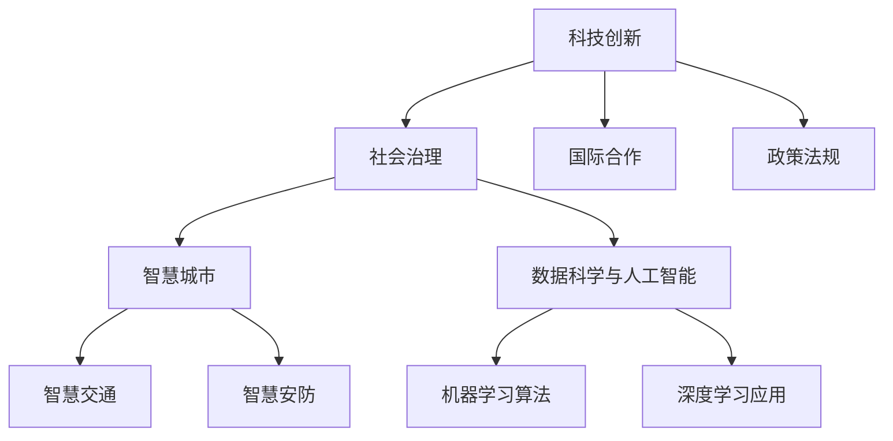

                 

### 《科技创新与社会治理》

> 关键词：科技创新、社会治理、智慧城市、人工智能、数据科学

> 摘要：本文从科技创新与社会治理的背景与意义出发，探讨了科技创新在公共安全、城市治理、教育、医疗等领域的应用，分析了科技创新与社会治理模式的影响，以及面临的挑战与机遇。通过案例研究和国际经验，深入探讨了科技创新与社会治理的融合路径和未来趋势，并提出了实施策略与政策建议。

----------------------------------------------------------------

### 《科技创新与社会治理》目录大纲

#### 第一部分：科技创新与治理概述

##### 第1章：科技创新与社会治理的背景与意义

- **1.1 科技创新与社会发展的关系**
  - 社会发展对科技创新的需求
  - 科技创新对社会发展的推动作用

- **1.2 社会治理中的科技创新应用**
  - 科技创新在公共安全、城市治理、教育、医疗等领域的应用
  - 科技创新对社会治理模式的影响

- **1.3 科技创新与社会治理的挑战与机遇**
  - 社会治理中面临的新挑战
  - 科技创新带来的新机遇

##### 第2章：科技创新的主要领域与趋势

- **2.1 信息通信技术的创新与应用**
  - 5G、物联网、大数据等技术的最新发展

- **2.2 生物技术与医疗健康领域的创新**
  - 基因编辑、精准医疗等前沿技术

- **2.3 环境保护与可持续发展技术的创新**
  - 碳中和、可再生能源等技术的最新动态

- **2.4 新材料与智能制造技术的进步**
  - 新材料研发、智能制造的智能化升级

##### 第3章：科技创新与社会治理的融合路径

- **3.1 科技创新对传统社会治理模式的挑战**
  - 数据隐私、网络安全等新问题

- **3.2 科技创新推动社会治理模式创新**
  - 智能化社会治理、数字治理等新模式

- **3.3 科技创新与社会治理的协同发展策略**
  - 政府与企业的合作模式
  - 公众参与与社会监督的机制

#### 第二部分：科技创新应用案例研究

##### 第4章：智慧城市与智能治理

- **4.1 智慧城市概述**
  - 智慧城市的技术基础
  - 智慧城市的典型案例分析

- **4.2 智慧交通系统的建设与应用**
  - 智能交通信号控制
  - 智能公共交通管理

- **4.3 智慧安防技术在公共安全中的应用**
  - 智能视频监控
  - 智能人脸识别

##### 第5章：社会治理中的数据科学与人工智能

- **5.1 数据科学与社会治理**
  - 数据收集、处理与分析方法
  - 数据驱动的决策支持系统

- **5.2 人工智能在社会治理中的应用**
  - 机器学习算法的应用场景
  - 深度学习在数据挖掘中的应用

- **5.3 社会治理中的人工智能挑战与伦理问题**
  - 人工智能的偏见与公平性
  - 数据隐私与安全保护

##### 第6章：科技创新与社会治理的国际经验与启示

- **6.1 国外智慧城市建设的经验与教训**
  - 欧美智慧城市的建设策略
  - 发展中国家的智慧城市建设挑战

- **6.2 国际人工智能治理的框架与政策**
  - 国际人工智能治理的原则与标准
  - 跨国数据治理与合作

- **6.3 科技创新与社会治理的未来趋势**
  - 科技创新对未来社会治理的潜在影响
  - 智慧社会治理的前景展望

#### 第三部分：科技创新与社会治理的实施策略与政策建议

##### 第7章：科技创新与社会治理的实施策略

- **7.1 提高科技创新能力与转化效率**
  - 科技创新体系的优化
  - 科技创新政策环境的营造

- **7.2 建立智慧社会治理的体系架构**
  - 政府职能的转变
  - 社会力量的参与

- **7.3 促进科技创新与社会治理的协同发展**
  - 跨部门协同工作机制
  - 公共服务供给的创新

##### 第8章：科技创新与社会治理的政策建议

- **8.1 加大科技创新投入与人才培养**
  - 研发投入的优化
  - 人才培养的机制创新

- **8.2 加强科技创新与社会治理的法律法规建设**
  - 数据隐私与安全法律体系的完善
  - 人工智能伦理规范的制定

- **8.3 推动国际合作与经验交流**
  - 国际科技合作的深化
  - 社会治理经验的全球共享

#### 附录

- **附录 A：科技创新与社会治理的相关资源**
  - 学术期刊与报告
  - 重大科技创新项目案例
  - 科技创新政策文档

- **附录 B：科技创新与社会治理的参考书目与文献**
  - 相关领域的经典书籍
  - 创新与社会治理的最新研究论文

----------------------------------------------------------------

### 第一部分：科技创新与治理概述

#### 第1章：科技创新与社会治理的背景与意义

##### 1.1 科技创新与社会发展的关系

**1.1.1 社会发展对科技创新的需求**

社会发展是一个动态、复杂的过程，涉及经济、文化、政治、环境等多个方面。在社会发展的过程中，科技创新扮演着重要的角色。以下是社会发展对科技创新的一些需求：

- **经济需求**：随着经济的快速发展，社会对更高效、更智能的生产方式有着迫切需求。科技创新能够推动产业结构升级，提高生产效率，降低生产成本。

- **环境需求**：环境问题已成为全球关注的焦点，科技创新在环境保护和可持续发展方面发挥着关键作用。例如，可再生能源技术、碳捕获与存储技术等，都是解决环境问题的有效手段。

- **生活质量需求**：科技创新能够提高人们的生活质量，满足人们对舒适、便捷、健康等的需求。例如，智能交通系统、智能家居、医疗科技等，都极大地改善了人们的生活。

- **社会管理需求**：随着城市化进程的加速，社会管理面临着新的挑战。科技创新为社会治理提供了新的手段和方法，如智慧城市、大数据分析、人工智能等。

**1.1.2 科技创新对社会发展的推动作用**

科技创新不仅满足社会发展的需求，还能够对社会发展产生深远的影响：

- **推动经济增长**：科技创新是经济增长的重要驱动力。通过引入新技术、新模式、新业态，科技创新能够提高生产效率，创造新的就业机会，促进经济增长。

- **提升生活质量**：科技创新能够改善人们的生活条件，提高生活质量。例如，医疗科技的进步使得疾病治愈率提高，寿命延长；信息技术的发展让人们的生活更加便捷、高效。

- **促进社会进步**：科技创新能够推动社会进步，解决社会问题。例如，教育科技的进步使得教育资源更加公平；环保技术的进步有助于解决环境问题。

- **增强国家竞争力**：科技创新是国家竞争力的重要标志。在全球化背景下，科技创新能力成为国家综合实力的重要组成部分。一个国家的科技创新能力越强，其在国际竞争中的地位就越高。

##### 1.2 社会治理中的科技创新应用

**1.2.1 科技创新在公共安全、城市治理、教育、医疗等领域的应用**

科技创新在各个领域都有广泛的应用，其中公共安全、城市治理、教育、医疗等领域尤为突出：

- **公共安全**：随着社会安全问题的日益复杂，科技创新在公共安全领域发挥着重要作用。例如，智能视频监控技术的应用，可以实时监控公共区域，及时发现异常行为，提高公共安全水平。

- **城市治理**：智慧城市的建设是城市治理的创新实践。通过物联网、大数据、人工智能等技术，智慧城市可以实现交通管理、环境监测、能源管理等方面的智能化，提高城市治理效率。

- **教育**：教育科技的进步使得教育模式更加多样化和个性化。例如，在线教育平台、虚拟现实教学、人工智能助教等，都为教育提供了新的手段和方法。

- **医疗**：医疗科技的进步极大地改善了医疗服务的质量。例如，精准医疗技术、远程医疗技术、人工智能诊断等，都为患者提供了更加精准、高效的医疗服务。

**1.2.2 科技创新对社会治理模式的影响**

科技创新不仅改变了社会治理的领域，还对社会治理模式产生了深远的影响：

- **数据驱动的治理**：随着大数据技术的发展，数据已成为社会治理的重要资源。通过大数据分析，政府可以更好地了解社会状况，制定更加科学合理的政策。

- **智能化治理**：人工智能技术的应用使得社会治理更加智能化。例如，智能交通信号控制、智能安防系统等，都提高了社会治理的效率。

- **数字化治理**：数字技术的普及使得社会治理更加便捷和高效。例如，电子政务、在线审批等，都减少了政府与公民之间的沟通成本。

- **协同治理**：科技创新促进了政府、企业、社会组织的协同治理。通过构建协同治理平台，各方可以共享资源、信息，共同参与社会治理。

##### 1.3 科技创新与社会治理的挑战与机遇

**1.3.1 社会治理中面临的新挑战**

随着科技创新的快速发展，社会治理也面临一系列新的挑战：

- **数据隐私与安全**：大数据和人工智能技术的应用，使得个人信息和隐私面临更高的风险。如何保护数据隐私和安全，成为社会治理的重要挑战。

- **网络安全**：随着网络技术的普及，网络安全问题日益突出。网络攻击、数据泄露等事件频发，对社会治理提出了更高的要求。

- **技术依赖**：科技创新带来了便利，但同时也可能带来过度依赖的风险。在智慧城市、智能交通等项目中，技术故障可能导致严重后果。

- **伦理问题**：人工智能的应用涉及到伦理问题，如偏见、公平性等。如何制定合理的伦理规范，确保人工智能的健康发展，是社会治理的重要挑战。

**1.3.2 科技创新带来的新机遇**

尽管社会治理面临挑战，但科技创新同样带来了新的机遇：

- **提高治理效率**：科技创新可以提升社会治理的效率，降低成本。例如，智慧城市的建设可以实现交通管理、环境监测、能源管理等领域的智能化。

- **增强公共参与**：科技创新促进了公众参与社会治理。例如，在线审批、电子投票等，都增强了公民的参与感和责任感。

- **创新社会治理模式**：科技创新为社会治理提供了新的模式。例如，区块链技术的应用可以实现去中心化的社会治理，提高治理的透明度和公正性。

- **促进可持续发展**：科技创新在环境保护、可持续发展等领域具有重要作用。例如，可再生能源技术、碳捕获与存储技术等，都可以为实现可持续发展目标做出贡献。

### 第二部分：科技创新的主要领域与趋势

#### 第2章：科技创新的主要领域与趋势

##### 2.1 信息通信技术的创新与应用

**2.1.1 5G、物联网、大数据等技术的最新发展**

信息通信技术（ICT）是科技创新的重要领域，其发展对社会治理和公共服务产生了深远的影响。以下是一些关键技术的发展趋势：

- **5G技术**：第五代移动通信技术（5G）具有高速率、低延迟、大连接等特点，能够支持大规模物联网设备和智能设备的连接。5G技术的商用部署将推动智慧城市、智能交通、远程医疗等领域的快速发展。

  **应用案例**：在智慧城市建设中，5G技术可以支持实时高清视频监控、智能交通信号控制、远程医疗诊断等应用，提高城市管理的效率和应急响应能力。

- **物联网（IoT）**：物联网技术通过将各种物理设备连接到互联网，实现数据的采集、传输和共享。物联网技术的广泛应用将推动智慧城市、智能家居、智能工厂等领域的创新。

  **应用案例**：在智慧城市中，物联网技术可以用于环境监测、智能路灯控制、智能停车管理等方面，提高城市管理的效率和居民的生活质量。

- **大数据**：大数据技术通过数据采集、存储、处理和分析，帮助政府和企业更好地了解社会状况，制定更科学的决策。大数据技术在公共安全、城市治理、教育、医疗等领域具有广泛应用。

  **应用案例**：在公共安全领域，大数据技术可以用于犯罪预测、风险评估等，提高公共安全水平；在教育领域，大数据技术可以用于学习分析、个性化教学等，提高教育质量。

**2.1.2 5G、物联网、大数据技术的融合与应用**

随着5G、物联网、大数据等技术的不断发展，这些技术之间的融合也日益紧密，形成了新的应用模式：

- **智慧城市**：智慧城市是将5G、物联网、大数据等技术与城市治理相结合，实现城市管理的智能化、高效化。智慧城市可以通过数据共享、智能分析，提高城市治理的效率，改善居民的生活质量。

  **应用案例**：智慧交通系统通过5G技术实现车辆与基础设施之间的实时通信，优化交通流量，减少拥堵；智慧医疗系统通过物联网技术实现医疗设备的互联互通，提高医疗服务质量。

- **智能制造**：智能制造是将物联网、大数据、人工智能等技术与制造业相结合，实现生产过程的智能化、自动化。智能制造可以提高生产效率，降低生产成本，提升产品质量。

  **应用案例**：在智能工厂中，物联网技术可以用于设备监控、生产调度等，实现生产过程的自动化；大数据技术可以用于生产数据分析，优化生产流程。

- **智能农业**：智能农业是将物联网、大数据、人工智能等技术与农业生产相结合，实现农业生产的智能化、高效化。智能农业可以提高农业产量，降低农业生产成本，实现可持续发展。

  **应用案例**：在智能农场中，物联网技术可以用于土壤监测、灌溉控制等，优化农业生产条件；大数据技术可以用于作物生长分析，制定科学的种植计划。

##### 2.2 生物技术与医疗健康领域的创新

**2.2.1 基因编辑、精准医疗等前沿技术**

生物技术与医疗健康领域的创新为提高医疗水平、改善人类健康带来了新的希望。以下是一些重要的前沿技术：

- **基因编辑**：基因编辑技术，如CRISPR-Cas9，通过修改基因序列，实现对疾病的治疗和预防。基因编辑技术在癌症治疗、遗传病治疗等方面具有巨大的潜力。

  **应用案例**：基因编辑技术可以用于治疗癌症，通过编辑癌细胞中的基因，使其失去生长和扩散的能力；基因编辑技术也可以用于预防遗传病，通过修复基因缺陷，避免疾病的发生。

- **精准医疗**：精准医疗是基于患者的基因、环境、生活方式等个体差异，制定个性化的治疗方案。精准医疗可以提高治疗效果，降低治疗成本。

  **应用案例**：在癌症治疗中，精准医疗可以通过分析患者的基因突变，选择最合适的治疗方案；在传染病防控中，精准医疗可以通过监测病毒的基因变异，制定有效的防控策略。

**2.2.2 生物技术与医疗健康领域的应用**

生物技术在医疗健康领域的应用日益广泛，对提高医疗水平、改善人类健康产生了深远的影响：

- **基因检测**：基因检测技术可以用于疾病筛查、诊断和预防。基因检测可以帮助人们了解自己的基因状况，采取相应的预防措施。

  **应用案例**：在新生儿疾病筛查中，基因检测可以用于检测遗传病，确保新生儿的健康成长；在癌症筛查中，基因检测可以用于早期发现癌症，提高治愈率。

- **细胞治疗**：细胞治疗是一种新兴的治疗方法，通过使用患者的自身细胞，治疗各种疾病。细胞治疗在癌症、心脏病、神经系统疾病等领域具有广泛应用。

  **应用案例**：在癌症治疗中，细胞治疗可以通过增强患者的免疫系统，消灭癌细胞；在心脏病治疗中，细胞治疗可以用于修复心脏组织，提高心脏功能。

- **生物制药**：生物制药是一种基于生物技术的药物，如单克隆抗体、重组蛋白等。生物制药在治疗癌症、糖尿病、免疫系统疾病等方面具有显著疗效。

  **应用案例**：在癌症治疗中，生物制药可以用于治疗难以治愈的癌症，如黑色素瘤、淋巴瘤等；在糖尿病治疗中，生物制药可以用于调节血糖，改善患者的生活质量。

##### 2.3 环境保护与可持续发展技术的创新

**2.3.1 碳中和、可再生能源等技术的最新动态**

环境保护与可持续发展技术的创新是应对全球气候变化和环境污染的关键。以下是一些重要的技术创新：

- **碳中和**：碳中和是指通过减少温室气体排放和增加碳汇，使净排放量为零。碳中和技术包括碳捕集与存储（CCS）、可再生能源等。

  **应用案例**：在能源领域，可再生能源技术（如风能、太阳能）可以替代化石燃料，减少温室气体排放；在工业领域，碳捕集与存储技术可以用于减少工业排放。

- **可再生能源**：可再生能源技术是指利用太阳能、风能、水能、生物质能等自然能源，实现能源的可持续发展。

  **应用案例**：在能源生产中，太阳能光伏发电、风能发电可以替代传统化石燃料，减少环境污染；在交通领域，电动汽车、插电式混合动力汽车等可再生能源车辆可以减少石油消耗。

**2.3.2 环境保护与可持续发展技术的应用**

环境保护与可持续发展技术在各个领域都有广泛应用，对实现可持续发展目标具有重要意义：

- **节能减排**：节能减排技术可以通过提高能源利用效率，减少能源消耗和温室气体排放。节能减排技术在工业、交通、建筑等领域具有广泛应用。

  **应用案例**：在工业领域，节能技术可以用于提高能源利用效率，降低生产成本；在交通领域，新能源汽车可以减少石油消耗，减少尾气排放。

- **环境监测**：环境监测技术可以通过实时监测环境质量，及时发现环境污染问题。环境监测技术在空气、水、土壤等环境要素监测中具有广泛应用。

  **应用案例**：在空气污染治理中，环境监测技术可以用于实时监测空气质量，及时采取治理措施；在水环境治理中，环境监测技术可以用于监测水质，保障饮用水安全。

- **生态修复**：生态修复技术可以通过恢复生态系统功能，改善生态环境。生态修复技术在矿山修复、湿地修复、荒漠化治理等领域具有广泛应用。

  **应用案例**：在矿山修复中，生态修复技术可以用于恢复植被，改善土壤质量；在湿地修复中，生态修复技术可以用于恢复湿地生态系统，提高生物多样性。

##### 2.4 新材料与智能制造技术的进步

**2.4.1 新材料研发**

新材料是科技创新的重要领域，其研发和应用对推动技术进步和产业发展具有重要作用。以下是一些新材料的研究进展：

- **高性能材料**：高性能材料具有高强度、高韧性、高导电性等优异性能，广泛应用于航空航天、汽车制造、电子信息等领域。

  **应用案例**：在航空航天领域，高性能材料可以用于制造飞机发动机叶片，提高发动机效率；在汽车制造领域，高性能材料可以用于制造汽车零部件，提高汽车性能。

- **纳米材料**：纳米材料具有特殊的物理、化学性质，广泛应用于电子、医药、能源等领域。

  **应用案例**：在电子领域，纳米材料可以用于制造高密度存储器件，提高数据存储能力；在医药领域，纳米材料可以用于药物载体，提高药物疗效。

- **智能材料**：智能材料能够感知外部刺激，并作出相应响应，广泛应用于传感器、智能装置等领域。

  **应用案例**：在传感器领域，智能材料可以用于制造可穿戴传感器，实时监测人体生理指标；在智能装置领域，智能材料可以用于制造智能窗户，自动调节光线和温度。

**2.4.2 智能制造技术的智能化升级**

智能制造技术是制造业发展的方向，其智能化升级将推动制造业的转型升级。以下是一些智能制造技术的发展趋势：

- **工业互联网**：工业互联网是将互联网技术应用于工业生产，实现设备、人、物的互联互通。工业互联网可以提高生产效率，降低生产成本。

  **应用案例**：在工业生产中，工业互联网可以用于设备监控、生产调度等，实现生产过程的智能化。

- **机器人与自动化**：机器人与自动化技术可以提高生产效率，降低人力成本。机器人与自动化技术在汽车制造、电子制造等领域具有广泛应用。

  **应用案例**：在汽车制造中，机器人可以用于焊接、喷涂等工序，提高生产效率；在电子制造中，自动化设备可以用于组装、测试等工序，提高产品质量。

- **增材制造**：增材制造（3D打印）技术可以通过逐层堆积材料，制造出复杂形状的零部件。增材制造技术在航空航天、医疗等领域具有广泛应用。

  **应用案例**：在航空航天领域，3D打印技术可以用于制造飞机发动机叶片，提高发动机效率；在医疗领域，3D打印技术可以用于制造个性化医疗器械，提高治疗效果。

### 第三部分：科技创新与社会治理的融合路径

#### 第3章：科技创新与社会治理的融合路径

##### 3.1 科技创新对传统社会治理模式的挑战

随着科技的飞速发展，传统的社会治理模式正面临着诸多挑战。这些挑战主要集中在以下几个方面：

**3.1.1 数据隐私与安全**

在数据驱动的社会治理中，数据的收集、存储、处理和使用成为核心。然而，这也带来了数据隐私和安全的问题。大数据技术和社会治理系统的广泛应用，使得大量个人信息被收集和存储。这些数据一旦泄露或被滥用，可能会对个人隐私造成严重侵害。此外，网络安全威胁也越来越严重，黑客攻击、数据泄露等事件频发，对社会治理系统造成了巨大的风险。

**解决方案**：为了应对数据隐私和安全挑战，需要采取以下措施：

- **数据加密**：对敏感数据进行加密处理，确保数据在传输和存储过程中安全可靠。
- **权限控制**：建立严格的权限控制机制，确保只有授权人员才能访问敏感数据。
- **安全审计**：定期进行安全审计，及时发现和解决安全隐患。

**3.1.2 网络安全**

随着互联网和物联网技术的普及，社会治理系统中涉及到越来越多的网络设备和系统。这些设备和系统构成了复杂的信息网络，但同时也增加了网络安全的风险。网络攻击、病毒感染、恶意软件等威胁对社会治理系统造成了巨大的威胁。

**解决方案**：为了提高社会治理系统的网络安全，需要采取以下措施：

- **防火墙与入侵检测系统**：部署防火墙和入侵检测系统，实时监控网络流量，防止恶意攻击。
- **定期更新与补丁管理**：定期更新系统和应用程序，确保及时修补安全漏洞。
- **员工培训与意识提升**：加强对员工的网络安全培训，提高其安全意识和防护能力。

**3.1.3 技术依赖**

科技创新带来了许多便利和效率提升，但也可能导致社会治理系统对技术的过度依赖。一旦技术出现故障或无法正常运行，社会治理系统可能陷入瘫痪，造成严重的后果。

**解决方案**：为了降低技术依赖风险，需要采取以下措施：

- **多元化技术方案**：避免过度依赖单一技术，采用多种技术手段确保系统的稳定性和可靠性。
- **备份与冗余**：建立备份和冗余机制，确保系统在出现故障时能够迅速恢复。
- **定期测试与评估**：定期对系统进行测试和评估，及时发现和解决潜在问题。

**3.1.4 伦理问题**

人工智能和大数据等新兴技术的应用，在社会治理中引发了诸多伦理问题。例如，算法偏见、数据歧视、隐私泄露等，都可能对社会公平和正义产生负面影响。

**解决方案**：为了应对伦理问题，需要采取以下措施：

- **伦理审查与监管**：建立伦理审查机制，对人工智能和社会治理系统进行伦理评估和监管。
- **公平性和透明性**：确保人工智能和社会治理系统具有公平性和透明性，避免算法偏见和数据歧视。
- **公众参与与沟通**：加强公众参与和沟通，提高社会治理系统的透明度和公信力。

##### 3.2 科技创新推动社会治理模式创新

科技创新不仅带来了社会治理模式的挑战，同时也为创新社会治理模式提供了新的机遇。以下是一些创新社会治理模式的典型案例：

**3.2.1 智能化社会治理**

智能化社会治理是指利用人工智能、大数据、物联网等现代技术，对社会治理进行智能化升级。通过智能化社会治理，可以实现社会治理的精细化、高效化。

**应用案例**：

- **智能交通管理**：利用物联网技术，实时监控交通流量，优化交通信号控制，减少拥堵，提高交通效率。

- **智能安防系统**：利用视频监控和人脸识别技术，实时监控公共安全，及时发现异常行为，提高公共安全水平。

**3.2.2 数字治理**

数字治理是指利用数字技术，对社会治理进行数字化升级。通过数字治理，可以实现社会治理的信息化、透明化、高效化。

**应用案例**：

- **电子政务**：利用互联网技术，实现政务服务在线办理，提高政务服务的效率，降低政府与公民之间的沟通成本。

- **在线审批**：利用大数据和人工智能技术，实现审批流程的自动化，减少审批环节，提高审批效率。

**3.2.3 网络治理**

网络治理是指对互联网及其相关技术进行管理和治理。随着互联网的普及和发展，网络治理成为社会治理的重要方面。

**应用案例**：

- **网络监管**：通过建立网络监管机制，实时监控网络信息，防范网络犯罪，维护网络安全。

- **网络舆论引导**：通过大数据分析和人工智能技术，实时监测网络舆论，引导网络舆论走向，维护社会稳定。

##### 3.3 科技创新与社会治理的协同发展策略

为了实现科技创新与社会治理的协同发展，需要采取一系列策略，包括政府与企业合作、公众参与、政策法规制定等。

**3.3.1 政府与企业的合作模式**

政府与企业在科技创新与社会治理中发挥着重要作用。通过建立良好的合作模式，可以实现资源优势互补、技术优势互补，推动社会治理的创新发展。

**合作模式**：

- **共建平台**：政府与企业共同建设社会治理平台，提供数据共享、技术服务等。

- **共享数据**：政府与企业共享数据资源，推动大数据在社会治理中的应用。

- **联合研发**：政府与企业共同开展科技创新项目，推动新技术在社会治理中的应用。

**3.3.2 公众参与与社会监督的机制

公众参与和社会监督是社会治理的重要组成部分。通过建立公众参与和社会监督的机制，可以增强社会治理的透明度、公正性和公信力。

**机制**：

- **公开信息**：政府定期公开社会治理相关信息，增强透明度。

- **在线反馈**：建立在线反馈机制，方便公众对政府工作进行监督和评价。

- **社会监督**：鼓励社会各界参与社会治理，发挥社会监督作用。

##### 3.3.3 跨部门协同工作机制

社会治理涉及多个部门和领域，需要建立跨部门协同工作机制，实现资源的整合和优势互补。

**机制**：

- **信息共享**：建立跨部门的信息共享平台，实现数据资源的整合。

- **协调配合**：明确各部门的职责和任务，实现协调配合，提高社会治理效率。

- **联合行动**：针对重大社会治理问题，开展联合行动，形成合力。

##### 3.3.4 公共服务供给的创新

科技创新为社会治理提供了新的手段和方法，也改变了公共服务的供给模式。通过创新公共服务供给，可以提升公共服务的质量、效率和满意度。

**创新举措**：

- **在线服务**：通过互联网技术，提供在线政务服务、在线医疗服务等，提高公共服务便捷性。

- **智能化服务**：利用人工智能技术，提供智能客服、智能导诊等，提升公共服务智能化水平。

- **个性化服务**：通过大数据分析，提供个性化公共服务，满足公众多样化需求。

### 第二部分：科技创新应用案例研究

#### 第4章：智慧城市与智能治理

##### 4.1 智慧城市概述

智慧城市是利用信息技术、物联网、大数据、人工智能等现代科技手段，实现城市资源的智能配置和高效利用，提升城市治理水平和居民生活质量。智慧城市的建设涉及交通、能源、环境、公共安全等多个领域，其目标是实现城市管理的智能化、精细化和可持续发展。

**4.1.1 智慧城市的技术基础**

智慧城市的技术基础包括以下几个方面：

- **信息技术**：信息技术是智慧城市建设的核心，包括云计算、大数据、物联网、人工智能等。通过这些技术，可以实现城市数据的采集、传输、存储和分析，为城市治理提供数据支持和决策依据。

- **物联网**：物联网技术将各种传感器、设备和系统连接起来，形成一个互联互通的网络。通过物联网技术，可以实现城市资源的实时监测、远程控制和智能调度，提高城市管理的效率。

- **大数据**：大数据技术可以对城市运行过程中的海量数据进行分析和处理，发现规律、预测趋势，为城市治理提供科学依据。

- **人工智能**：人工智能技术可以模拟人类智能，实现自动化决策和智能服务。在智慧城市中，人工智能技术可以用于交通管理、环境监测、安防监控等领域，提高城市治理的智能化水平。

**4.1.2 智慧城市的典型案例分析**

全球范围内，许多城市正在积极建设智慧城市，以下是一些典型的案例：

- **新加坡**：新加坡是一个全球领先的智慧城市，其建设智慧城市的经验备受瞩目。新加坡利用物联网技术，实现了交通管理、环境监测、能源管理等方面的智能化。例如，新加坡的智能交通系统通过实时监控道路状况，优化交通信号控制，减少交通拥堵。

- **上海**：上海是中国智慧城市的典范，其智慧城市建设涵盖了交通、能源、环保、公共服务等多个领域。例如，上海的智能交通系统通过大数据分析和人工智能技术，实现了交通流量的实时监控和优化，提高了交通效率。

- **纽约**：纽约市在智慧城市建设方面也有许多成功的案例。例如，纽约的智能路灯系统可以通过传感器监测环境光线和车辆流量，自动调整路灯亮度，提高能源利用效率。

**4.1.3 智慧城市对传统社会治理模式的影响**

智慧城市的建设对传统社会治理模式产生了深远的影响，主要体现在以下几个方面：

- **数据驱动的治理**：智慧城市通过大数据技术的应用，实现了对城市运行的实时监测和分析，为政府决策提供了科学依据。数据驱动的治理使得城市治理更加精细化和智能化。

- **协同治理**：智慧城市通过信息技术将政府、企业、社会组织和居民连接起来，形成了多方参与的协同治理模式。在智慧城市中，政府、企业和社会组织可以共同参与城市治理，实现资源整合和优势互补。

- **智能化服务**：智慧城市通过人工智能技术的应用，实现了公共服务的智能化。例如，智能交通系统可以通过实时监控交通状况，提供最优出行路线，提高居民的出行体验。

- **透明化和公众参与**：智慧城市通过信息技术，实现了城市治理的透明化和公众参与。政府可以实时公开城市运行数据，接受公众监督和参与，增强了政府的公信力和透明度。

##### 4.2 智慧交通系统的建设与应用

智慧交通系统是智慧城市的重要组成部分，其目标是提高交通效率、减少拥堵、降低交通事故发生率，提升居民出行体验。智慧交通系统通过信息技术、物联网、大数据和人工智能等技术的应用，实现了交通管理的智能化、精细化。

**4.2.1 智能交通信号控制**

智能交通信号控制是智慧交通系统的核心功能之一。传统的交通信号控制主要依赖于固定的信号灯时序，而智能交通信号控制可以根据实时交通流量和路况信息，动态调整信号灯时序，提高交通效率。

- **基于大数据的信号控制**：智能交通信号控制系统可以通过收集和分析交通流量数据、车辆速度数据等，预测交通流量变化，动态调整信号灯时序。例如，在高峰时段，系统可以延长交叉路口的绿灯时间，缩短红灯时间，减少交通拥堵。

- **基于物联网的信号控制**：物联网技术可以实现交通信号灯与车辆、道路设施的实时通信。例如，车辆可以通过车载传感器感知交通信号灯的状态，提前减速或加速，减少闯红灯现象。

**4.2.2 智能公共交通管理**

智能公共交通管理是智慧交通系统的另一个重要功能。通过信息技术和物联网技术，可以实现公共交通车辆的实时监控、调度和管理，提高公共交通的运行效率和乘客体验。

- **实时监控与调度**：智能公共交通管理系统能够实时监控公共交通车辆的位置、速度、运行状态等信息，根据实时路况和乘客需求，动态调整车辆调度计划，提高车辆利用率。

- **智能公交站牌**：智能公交站牌可以通过物联网技术，实时显示公交车到站时间、车内拥挤程度等信息，帮助乘客合理安排出行时间。

**4.2.3 智能交通监控与应急响应**

智能交通监控与应急响应是智慧交通系统的重要功能之一。通过视频监控、智能识别等技术，可以实现交通状况的实时监控和异常事件的快速响应。

- **智能视频监控**：智能视频监控系统能够实时监控道路状况，通过图像识别技术，自动检测交通事故、违章行为等异常事件，及时报警并通知相关部门进行处理。

- **智能应急响应**：在发生交通事故或其他紧急情况时，智能交通系统可以快速响应，调度附近的交通资源进行救援，减少事故影响范围。

**4.2.4 智慧交通系统的案例分析**

以下是一些智慧交通系统的成功案例：

- **深圳**：深圳市的智慧交通系统通过大数据分析和人工智能技术，实现了交通信号控制的动态调整，提高了交通效率。同时，深圳市还建设了智能公交站牌和智能交通监控体系，提升了公共交通和交通安全水平。

- **伦敦**：伦敦市的智慧交通系统通过物联网技术和实时监控，实现了交通信号灯的智能控制和公共交通的智能调度，大大减少了交通拥堵和交通事故发生率。

- **新加坡**：新加坡的智慧交通系统是全球知名的案例。新加坡的智能交通系统通过实时监控和大数据分析，实现了交通信号控制的动态调整和公共交通的智能调度，提高了交通效率和乘客体验。

##### 4.3 智慧安防技术在公共安全中的应用

智慧安防技术是智慧城市的重要组成部分，通过信息技术、物联网、大数据和人工智能等技术的应用，实现了公共安全的智能化、高效化。

**4.3.1 智能视频监控**

智能视频监控是智慧安防技术的重要应用之一。通过视频监控，可以实现公共安全的实时监控和异常事件检测。

- **智能视频分析**：智能视频分析技术可以通过图像识别算法，实时分析视频内容，识别异常行为，如打架、盗窃、火灾等。一旦检测到异常事件，系统会自动报警并通知相关部门进行处理。

- **人脸识别**：人脸识别技术可以实时识别人脸，与数据库中的人脸信息进行比对，用于犯罪追踪、身份验证等。

**4.3.2 智能安防设备的连接与协同**

智慧安防技术通过物联网技术，将各类安防设备连接起来，实现设备的智能协同。

- **智能传感器**：智能传感器可以用于监测环境参数，如温度、湿度、烟雾等。当传感器检测到异常情况时，会自动报警并通知相关部门。

- **智能门禁系统**：智能门禁系统可以通过人脸识别、指纹识别等技术，实现身份验证和门禁管理，提高安全性和便捷性。

**4.3.3 智能安防系统的案例分析**

以下是一些智慧安防系统的成功案例：

- **北京**：北京市的智慧安防系统通过智能视频监控和人脸识别技术，实现了公共安全的实时监控和犯罪追踪。同时，北京市还建设了智能门禁系统和智能传感器网络，提高了安全监控的覆盖范围和准确性。

- **伦敦**：伦敦市的智慧安防系统通过智能视频监控和实时监控，实现了城市安全的智能化监控。系统可以实时检测异常行为，自动报警并通知相关部门进行处理。

- **新加坡**：新加坡的智慧安防系统通过物联网技术和大数据分析，实现了公共安全的实时监控和智能响应。系统可以实时分析视频内容，识别异常事件，并自动报警。

### 第5章：社会治理中的数据科学与人工智能

##### 5.1 数据科学与社会治理

数据科学是利用数学、统计学、机器学习等方法，从大量数据中提取有用信息，为社会治理提供科学依据。数据科学在社会治理中的应用，极大地提升了决策的准确性和效率。

**5.1.1 数据收集与处理方法**

数据科学的基础是数据的收集与处理。以下是常见的数据收集与处理方法：

- **数据收集**：数据可以从多种来源收集，如传感器、社交媒体、公共数据库等。传感器可以实时收集环境数据，社交媒体可以收集公众意见，公共数据库可以获取人口统计数据。

- **数据处理**：数据处理包括数据清洗、数据整合、数据归一化等步骤。数据清洗旨在去除无效数据、缺失数据和异常数据；数据整合将不同来源的数据进行合并，以便进行分析；数据归一化确保数据具有可比性。

**5.1.2 数据驱动的决策支持系统**

数据驱动的决策支持系统（DSS）通过数据分析和模型预测，为政府决策提供科学依据。以下是DSS的典型应用场景：

- **公共安全管理**：通过分析犯罪数据、社会治安数据等，预测犯罪热点区域，制定针对性的安全措施。

- **城市规划**：通过分析人口数据、交通数据等，优化城市规划，提高城市宜居性。

- **环境保护**：通过分析环境数据，监测环境污染趋势，制定环境保护措施。

**5.1.3 数据科学对社会治理的影响**

数据科学对社会治理产生了深远的影响：

- **提高决策效率**：数据科学可以帮助政府快速分析海量数据，提高决策效率。

- **增强决策科学性**：通过数据分析和模型预测，决策更具有科学依据，减少主观判断的干扰。

- **提升公共服务质量**：数据科学可以用于优化公共服务供给，提高公共服务的质量和满意度。

##### 5.2 人工智能在社会治理中的应用

人工智能（AI）在社会治理中发挥着重要作用，通过自动化、智能化手段，提高了治理效率和公共服务的质量。

**5.2.1 机器学习算法的应用场景**

机器学习算法是人工智能的核心技术之一，广泛应用于社会治理。以下是机器学习算法的典型应用场景：

- **公共安全预测**：利用机器学习算法，分析历史犯罪数据、社会治安数据等，预测犯罪热点区域，制定针对性的预防措施。

- **交通流量预测**：通过分析历史交通数据，预测未来交通流量，优化交通信号控制，减少拥堵。

- **能源管理**：通过分析能源消耗数据，优化能源分配，提高能源利用效率。

**5.2.2 深度学习在数据挖掘中的应用**

深度学习是人工智能的重要分支，具有强大的数据处理和分析能力。以下是深度学习在数据挖掘中的应用：

- **图像识别**：通过卷积神经网络（CNN）进行图像识别，用于公共安全监控、交通监控等。

- **语音识别**：通过循环神经网络（RNN）进行语音识别，用于智能客服、语音翻译等。

**5.2.3 人工智能在社会治理中的挑战与伦理问题**

尽管人工智能在社会治理中具有巨大的潜力，但也面临着一系列挑战和伦理问题：

- **数据隐私与安全**：人工智能系统需要大量数据进行分析，涉及个人隐私和安全。如何保护数据隐私和安全，是一个重要的问题。

- **算法偏见**：人工智能算法可能会受到数据偏见的影响，导致决策的不公平。例如，人脸识别系统可能会对某些种族或性别产生偏见。

- **透明性和解释性**：人工智能系统的决策过程往往是非透明的，难以解释。如何提高人工智能系统的透明性和解释性，是一个重要的研究方向。

##### 5.3 社会治理中的人工智能挑战与伦理问题

人工智能在社会治理中的应用，虽然带来了诸多便利，但也引发了一系列挑战和伦理问题。以下是一些关键问题及其解决方案：

**5.3.1 人工智能的偏见与公平性**

人工智能系统在训练过程中可能会吸收数据中的偏见，导致其决策结果不公平。例如，人脸识别系统可能会对某些种族或性别产生偏见。这些建议有助于解决人工智能偏见问题：

- **公平性设计**：在人工智能系统的设计阶段，就考虑公平性原则，确保算法不会加剧社会偏见。

- **多元数据集**：使用包含各种性别、种族、地域等多元特征的数据集进行训练，避免偏见。

- **持续监控**：对人工智能系统的决策进行持续监控和评估，及时发现和纠正偏见。

**5.3.2 数据隐私与安全保护**

人工智能系统需要大量数据进行分析，这涉及到个人隐私和安全的问题。以下是一些解决方案：

- **数据加密**：对敏感数据使用加密技术，确保数据在传输和存储过程中的安全。

- **隐私保护算法**：设计隐私保护算法，在数据分析过程中减少对个人隐私的侵害。

- **透明度和可解释性**：提高人工智能系统的透明度和可解释性，使公众了解数据是如何被收集、处理和使用的。

**5.3.3 人工智能系统的伦理规范**

人工智能系统的广泛应用，需要建立相应的伦理规范，确保其健康发展。以下是一些伦理规范：

- **责任分配**：明确人工智能系统的责任主体，确保在出现问题时能够追究责任。

- **道德准则**：制定人工智能系统的道德准则，确保其决策符合伦理道德要求。

- **公众参与**：鼓励公众参与人工智能系统的设计和评估，提高系统的公信力和透明度。

### 第二部分：科技创新应用案例研究

#### 第6章：科技创新与社会治理的国际经验与启示

##### 6.1 国外智慧城市建设的经验与教训

智慧城市建设是现代社会治理的重要方向，国外许多城市在这方面积累了丰富的经验，也遭遇了一些挑战。以下是一些主要经验与教训：

**6.1.1 欧美智慧城市的建设策略**

- **创新驱动**：欧美智慧城市通常以创新驱动为核心，鼓励技术创新和商业模式创新。例如，纽约市和伦敦市都积极推动5G、物联网、大数据等技术的应用。

- **多方参与**：欧美智慧城市建设强调政府、企业、学术界和公众的多方参与，形成协同治理模式。例如，新加坡的智慧城市建设项目就涉及政府、企业、研究机构和居民的共同参与。

- **数据共享与开放**：欧美城市注重数据共享和开放，通过建立数据平台，实现政府数据和社会数据的开放共享，为城市治理提供数据支持。例如，纽约市的“都市数据港”项目，就是一个开放数据平台。

- **可持续性**：欧美智慧城市注重可持续发展，通过应用环保技术和可再生能源，实现绿色发展。例如，哥本哈根市在智慧城市建设中，大量使用可再生能源和环保技术，实现了碳足迹的大幅减少。

**6.1.2 发展中国家的智慧城市建设挑战**

- **基础设施薄弱**：许多发展中国家的城市基础设施相对薄弱，智慧城市建设面临较大的挑战。例如，非洲和南亚的一些城市，由于电力供应不足，智慧城市的建设受到了很大限制。

- **资金与技术匮乏**：发展中国家在智慧城市建设中，往往面临资金和技术不足的问题。例如，一些城市由于缺乏足够的资金和技术支持，智慧城市的建设进展缓慢。

- **数据隐私与安全**：发展中国家在智慧城市建设中，需要特别注意数据隐私与安全问题。由于信息技术的发展相对滞后，这些城市在数据收集、存储和处理方面，可能面临更高的风险。

- **政策法规不完善**：许多发展中国家的智慧城市建设，缺乏完善的政策法规支持。例如，一些城市在智慧城市建设中，缺乏明确的法律规定和监管机制，可能导致项目进展不顺利。

**6.1.3 经验与教训的启示**

- **加强基础设施建设**：智慧城市建设需要强大的基础设施支持，发展中国家应加大基础设施建设的投入，为智慧城市的发展奠定基础。

- **引入技术创新**：发展中国家可以积极引入先进的技术，如5G、物联网、大数据等，提升智慧城市的建设水平。

- **加强数据安全与隐私保护**：智慧城市建设需要高度重视数据安全与隐私保护，建立完善的数据安全法律法规，提高公众对数据隐私的信任。

- **推动政策法规建设**：发展中国家应加快政策法规建设，为智慧城市的健康发展提供制度保障。

##### 6.2 国际人工智能治理的框架与政策

人工智能（AI）作为一项全球性的技术，其治理也呈现出国际合作的趋势。以下是一些国际人工智能治理的框架与政策：

**6.2.1 国际人工智能治理的原则与标准**

- **透明度与可解释性**：确保人工智能系统的决策过程透明，用户能够理解和信任系统。

- **公平性**：避免人工智能系统在决策中产生偏见，确保所有人受到公平对待。

- **安全性**：保障人工智能系统的安全性和可靠性，防止系统故障或恶意攻击。

- **伦理考量**：在人工智能系统的开发和应用过程中，充分考虑伦理问题，确保技术的道德性。

- **国际合作**：加强国际间的合作与交流，共同制定人工智能的发展与治理标准。

**6.2.2 国际人工智能治理的框架与机制**

- **联合国教科文组织**：联合国教科文组织（UNESCO）在2019年发布了《关于人工智能伦理的建议》，为人工智能的伦理治理提供了指导。

- **经济合作与发展组织（OECD）**：OECD发布了《人工智能原则》，提出了人工智能治理的七项原则，包括尊重人权、透明度和责任性等。

- **欧盟**：欧盟制定了《人工智能法案》，旨在建立人工智能的统一监管框架，确保人工智能的安全和道德应用。

- **美国**：美国国家标准与技术研究院（NIST）发布了《人工智能风险管理框架》，为人工智能的应用提供了风险管理指南。

**6.2.3 国际人工智能治理的政策与措施**

- **数据隐私保护**：许多国家和地区出台了数据隐私保护法律法规，如欧盟的《通用数据保护条例》（GDPR），以保护个人数据隐私。

- **人工智能伦理审查**：一些国家和地区建立了人工智能伦理审查机制，对人工智能项目进行伦理评估，确保技术应用的道德性。

- **人才培育**：国际社会积极推动人工智能人才的培养，通过教育项目和合作研究，提升全球人工智能人才储备。

- **国际合作机制**：建立国际合作机制，如国际人工智能联合研究院（IAAI），促进全球人工智能治理的协调与合作。

##### 6.3 科技创新与社会治理的未来趋势

随着科技的不断进步，科技创新与社会治理的融合将进一步深化，未来可能出现以下趋势：

**6.3.1 智慧社会治理的深化**

智慧社会治理将更加智能化、精细化。通过大数据、人工智能等技术的深入应用，政府将能够更加准确地了解社会状况，制定更加科学合理的政策。例如，利用人工智能进行社会行为预测，提前预防社会问题。

**6.3.2 数据治理的重要性提升**

数据作为社会治理的重要资源，其治理将受到更高重视。数据安全和隐私保护将成为数据治理的核心任务。同时，数据共享和开放也将成为趋势，推动社会数据资源的高效利用。

**6.3.3 新兴技术的广泛应用**

随着5G、物联网、区块链等新兴技术的发展，它们将在社会治理中得到更加广泛的应用。例如，5G技术将推动智慧城市的建设，实现更高速、更稳定的网络连接；物联网技术将实现城市设备的智能化管理。

**6.3.4 跨领域协同治理**

未来，社会治理将更加注重跨领域的协同治理。政府、企业、社会组织、公众将共同参与社会治理，形成协同治理的格局。例如，在环境保护领域，政府、企业和环保组织的协同合作，将有助于实现环境保护目标。

**6.3.5 人工智能伦理规范的完善**

随着人工智能技术的快速发展，人工智能伦理规范将不断完善。各国政府将制定更加严格的人工智能伦理规范，确保人工智能技术的道德性。同时，公众对人工智能的信任度也将逐渐提高。

### 第三部分：科技创新与社会治理的实施策略与政策建议

#### 第7章：科技创新与社会治理的实施策略

##### 7.1 提高科技创新能力与转化效率

科技创新能力是国家和社会发展的重要驱动力。提高科技创新能力，不仅需要加强科研投入，还需要优化科技创新体系，提高科技创新的转化效率。以下是一些实施策略：

**7.1.1 科技创新体系的优化**

- **加强基础研究**：政府应加大对基础研究的投入，鼓励科研机构和高校开展前沿技术研究，为应用研究提供理论支持。

- **完善产学研合作**：推动政府、企业、科研机构和高校之间的合作，形成产学研一体化的创新体系。通过合作，可以更好地将研究成果转化为实际应用。

- **建立创新平台**：建立国家级、省级和行业级的创新平台，集聚创新资源，提供技术支持和服务，促进科技创新。

**7.1.2 提高科技创新转化效率**

- **优化创新环境**：政府应制定相关政策，优化科技创新环境，降低创新成本，提供税收优惠、融资支持等政策扶持。

- **推动科技成果转化**：建立科技成果转化机制，加强知识产权保护，促进科技成果向实际应用转化。例如，通过建立技术转移机构、科技成果转化基金等，推动科技成果的产业化。

- **加强人才培养**：培养高水平的科技创新人才，包括科研人员、企业家、技术管理人员等。通过加强教育培训、人才引进、人才激励机制等，提高人才队伍的整体素质。

##### 7.2 建立智慧社会治理的体系架构

智慧社会治理是未来社会治理的发展方向。建立智慧社会治理的体系架构，需要整合各类资源，实现数据共享和智能决策。以下是一些具体策略：

**7.2.1 政府职能的转变**

- **强化政府引导作用**：政府应发挥引导作用，制定智慧社会治理的发展规划，明确发展目标和方向。

- **优化政府服务**：通过信息技术，优化政府服务流程，提高政府服务效率。例如，通过电子政务平台，实现政务服务的在线办理，提高便民服务水平。

- **加强公共参与**：鼓励公众参与智慧社会治理，提高社会治理的透明度和公信力。例如，通过在线平台，接受公众意见和反馈，提高政策的科学性和民主性。

**7.2.2 数据共享与智能决策**

- **建立数据共享平台**：政府、企业和社会组织应共同建立数据共享平台，实现各类数据资源的整合和共享，为智慧社会治理提供数据支持。

- **加强数据分析与建模**：利用大数据技术，对海量数据进行深入分析和建模，发现社会运行规律，为政府决策提供科学依据。

- **实施智能决策**：通过人工智能技术，实现智能决策支持系统，提高决策的准确性和效率。例如，通过机器学习算法，预测社会发展趋势，制定相应的政策。

##### 7.3 促进科技创新与社会治理的协同发展

科技创新与社会治理的协同发展，是提高社会治理水平的重要途径。以下是一些促进协同发展的策略：

**7.3.1 跨部门协同工作机制**

- **建立协同工作机制**：政府各部门应建立跨部门协同工作机制，实现信息共享和资源整合。例如，在城市管理中，交通部门、环保部门、公安部门等应建立信息共享平台，实现数据的实时传输和共享。

- **加强跨部门合作**：政府应加强跨部门合作，共同推进科技创新与社会治理的协同发展。例如，在智慧城市建设中，政府可以联合科技部门、交通部门、环保部门等，共同推动项目的实施。

**7.3.2 公共服务供给的创新**

- **推动公共服务创新**：政府应鼓励公共服务创新，通过引入新技术、新模式，提高公共服务的质量和效率。例如，在医疗领域，可以引入远程医疗技术，提高医疗服务覆盖率。

- **优化公共服务供给**：政府应优化公共服务供给，满足人民群众多样化、个性化的需求。例如，在教育领域，可以推动在线教育的发展，提供灵活的学习方式。

**7.3.3 公众参与与社会监督**

- **鼓励公众参与**：政府应鼓励公众参与社会治理，提高社会治理的透明度和公信力。例如，通过建立公众参与平台，接受公众意见和反馈。

- **加强社会监督**：政府应加强社会监督，提高社会治理的公正性和效率。例如，通过建立社会监督机制，接受公众对政府工作的监督和评价。

### 第8章：科技创新与社会治理的政策建议

##### 8.1 加大科技创新投入与人才培养

科技创新是推动社会治理和经济发展的重要动力。为了更好地发挥科技创新的作用，以下是一些政策建议：

**8.1.1 加大科技创新投入**

- **增加科研经费**：政府应增加对科研的投入，支持基础研究和应用研究。通过增加科研经费，鼓励科研机构和高校开展前沿技术研究，为应用研究提供理论支持。

- **提供税收优惠**：政府可以提供税收优惠，鼓励企业增加研发投入。通过降低企业税负，提高企业的研发积极性，促进科技创新。

- **设立科技创新基金**：政府可以设立科技创新基金，用于支持重大科技创新项目和创业企业。通过资金支持，加快科技创新成果的转化和应用。

**8.1.2 人才培养机制创新**

- **加强基础教育**：政府应加强基础教育，提高全民科学素养。通过加强科学教育，培养具备创新能力和科学素养的人才。

- **完善职业教育**：政府应完善职业教育体系，培养适应产业发展需求的技术人才。通过职业教育，提高劳动者的技能水平，为科技创新提供人力支持。

- **加强科研人员激励**：政府应完善科研人员激励机制，提高科研人员的待遇和福利。通过提高科研人员的薪酬和奖励，激发科研人员的创新活力。

##### 8.2 加强科技创新与社会治理的法律法规建设

科技创新与社会治理的快速发展，迫切需要完善的法律法规建设。以下是一些政策建议：

**8.2.1 数据隐私与安全法律体系**

- **制定数据隐私法**：政府应制定数据隐私法律，明确数据收集、存储、处理和使用的规范。通过制定数据隐私法，保护个人隐私，促进数据资源的合理利用。

- **加强数据安全立法**：政府应加强数据安全立法，建立数据安全管理体系。通过数据安全立法，保障数据安全，防止数据泄露和滥用。

**8.2.2 人工智能伦理规范**

- **制定人工智能伦理规范**：政府应制定人工智能伦理规范，明确人工智能的研发和应用规范。通过制定伦理规范，确保人工智能技术的道德性，防止算法偏见和滥用。

- **建立人工智能伦理审查机制**：政府应建立人工智能伦理审查机制，对人工智能项目进行伦理评估。通过伦理审查，确保人工智能技术的应用符合伦理道德要求。

**8.2.3 创新保护法律**

- **完善知识产权法律**：政府应完善知识产权法律，加强知识产权保护。通过完善知识产权法律，激励创新活动，促进科技创新。

- **加强知识产权执法**：政府应加强知识产权执法，打击侵权行为。通过加强执法，维护创新者的合法权益，促进科技创新。

##### 8.3 推动国际合作与经验交流

科技创新和社会治理是全球性议题，需要各国共同努力。以下是一些政策建议：

**8.3.1 国际科技合作**

- **加强国际科技合作**：政府应加强国际科技合作，推动跨国科技创新项目。通过国际合作，共享科技资源，提升科技创新能力。

- **建立国际科技创新网络**：政府可以建立国际科技创新网络，促进各国科研机构、企业和高校之间的交流与合作。通过国际科技创新网络，实现科技资源的优化配置。

**8.3.2 经验交流与分享**

- **开展经验交流**：政府应组织国内外专家学者开展经验交流，分享科技创新和社会治理的成功经验。通过经验交流，借鉴国际先进经验，推动本国科技创新和社会治理的发展。

- **推动知识共享**：政府应推动知识共享，建立科技创新和社会治理的知识库。通过知识共享，提高公众对科技创新和社会治理的认识，促进科技创新的普及和应用。

### 附录

#### 附录 A：科技创新与社会治理的相关资源

- **学术期刊与报告**

  - 《自然》（Nature）
  - 《科学》（Science）
  - 《IEEE计算机杂志》（IEEE Computer Magazine）
  - 《人工智能》（Artificial Intelligence）
  - 《智能系统》（Intelligent Systems）

- **重大科技创新项目案例**

  - 中国北斗卫星导航系统
  - 欧洲核子研究组织（CERN）的LHC项目
  - 美国国家航空航天局（NASA）的火星探测计划
  - 日本国际热核聚变实验反应堆（ITER）项目

- **科技创新政策文档**

  - 中华人民共和国“十四五”规划
  - 欧洲联盟《数字战略》
  - 美国创新战略
  - 日本科技白皮书

#### 附录 B：科技创新与社会治理的参考书目与文献

- **相关领域的经典书籍**

  - 《人工智能：一种现代方法》（Al intselligence: A Modern Approach），作者： Stuart J. Russell & Peter Norvig
  - 《深度学习》（Deep Learning），作者： Ian Goodfellow、Yoshua Bengio、Aaron Courville
  - 《大数据时代：生活、工作与思维的大变革》（Big Data: A Revolution That Will Transform How We Live, Work, and Think），作者： Viktor Mayer-Schoenberger & Kenneth Cukier
  - 《智慧城市：理念与实践》（Smart Cities: Principles and Practice），作者： Geoffrey Garson

- **创新与社会治理的最新研究论文**

  - "The Future of Work: Automation, Employment, and Productivity", 作者：David H. Autor
  - "AI and the New Live of Work", 作者：Andrew M. lobach
  - "Artificial Intelligence and Its Impact on Public Administration", 作者：Pierre Mounier & Loic Prigent
  - "Smart Cities: The New Urban Revolution", 作者：Daniel D. Rockmore

### Mermaid 流程图



### 核心算法原理讲解

#### 2.3.3 预训练模型原理

预训练模型（Pre-trained Model）是指在大规模数据集上预先训练深度学习模型，然后通过微调（Fine-tuning）的方式将其应用于特定任务。预训练模型的核心优势在于通过大规模数据的学习，模型能够获得更广泛的语义理解和语言表达能力，从而在下游任务中表现出优异的性能。

**算法步骤：**

1. **数据收集与预处理：** 选择大规模、多样性的数据集进行预处理，包括文本清洗、分词、去除停用词等步骤。预处理后的数据将被用于预训练阶段。

2. **预训练阶段：** 使用无监督或自监督学习方法在数据集上训练模型，例如使用掩码语言模型（Masked Language Model, MLM）。预训练模型通常采用多层Transformer架构，其基本组件是自注意力机制（Self-Attention Mechanism）。

3. **微调阶段：** 将预训练好的模型在特定任务的数据集上进行微调，以适应具体的应用场景。微调过程中，模型将在特定任务上进行参数调整，以提高模型在该任务上的性能。

**预训练模型原理：**

预训练模型的核心在于通过大规模数据的学习，使模型能够捕捉到语言的深层结构和语义信息。预训练模型的工作原理如下：

- **自注意力机制：** 自注意力机制是预训练模型的核心组件，它通过计算输入序列中每个词与其他词之间的关联性，实现对文本的深层语义理解。自注意力机制的计算公式为：

  $$  
  \text{Attention}(Q, K, V) = \frac{e^{\text{dot}(Q, K)}}{\sqrt{d_k}}  
  $$

  其中，$Q, K, V$ 分别是查询（Query）、关键（Key）和值（Value）向量的集合，$\text{dot}$ 表示点积运算，$e$ 表示自然底数，$d_k$ 是键向量的维度。

- **掩码语言模型（Masked Language Model, MLM）：** 掩码语言模型是一种常用的预训练任务，它通过对输入文本进行随机掩码，然后训练模型预测掩码部分的内容。掩码语言模型的目标是学习如何从上下文中预测被掩码的词。例如，对于输入文本“我爱北京天安门”，经过掩码处理后变为“我爱__天安门”，模型需要预测掩码部分的内容为“北京”。

  $$  
  \text{输出} = \text{model}(\text{我爱__天安门})  
  $$

  预测结果为“北京”，模型将此结果与实际掩码内容进行比较，计算损失并更新模型参数。

**伪代码：**

以下是预训练模型的伪代码示例：

```python
# 预处理数据集
preprocessed_data = preprocess_data(raw_data)

# 初始化预训练模型
model = PretrainedModel()

# 预训练模型
for epoch in range(num_epochs):
    for sample in preprocessed_data:
        mask_text = mask_text(sample)
        model.train_on_batch(mask_text)

# 微调模型
for task in tasks:
    model.fit_on_batch(task_data, task_labels)
```

**数学模型：**

预训练模型的数学模型主要涉及神经网络的结构和学习算法。以BERT模型为例，其核心结构包括两个子网络：掩码编码器（Masked Encoding Layer）和解码器（Decoding Layer）。

- **掩码编码器：** 掩码编码器使用多层Transformer编码器对输入文本进行编码，得到固定长度的嵌入向量。掩码编码器的输出可以用于下游任务的输入。

  $$  
  \text{Encodings} = \text{MaskedEncodingLayer}(\text{Input})  
  $$

- **解码器：** 解码器使用多层Transformer解码器对掩码文本进行解码，预测掩码部分的内容。解码器的输出是预测的词向量，用于计算损失并更新模型参数。

  $$  
  \text{Logits} = \text{DecodingLayer}(\text{Masked Encodings})  
  $$

预训练模型的训练目标是最小化预测词与实际词之间的交叉熵损失。

$$  
L = -\sum_{i} y_i \log(p_i)  
$$

其中，$y_i$ 是真实标签，$p_i$ 是模型对每个类别的预测概率。

**示例：**

假设文本“我爱北京天安门”经过掩码处理后变为“我爱__天安门”，则预训练模型的目标是预测掩码部分的内容，即“北京”。

$$  
\text{输出} = \text{model}(\text{我爱__天安门})  
$$

预测结果为“北京”，模型将此结果与实际掩码内容进行比较，计算损失并更新模型参数。

### 第6章：科技创新与社会治理的国际经验与启示

#### 6.1 国外智慧城市建设的经验与教训

智慧城市建设作为现代化城市治理的重要方向，国际上许多国家和地区已经积累了丰富的经验。以下是一些主要经验与教训：

**6.1.1 欧美智慧城市的建设策略**

1. **创新驱动发展**：

   - **美国**：美国在智慧城市建设方面，以创新驱动为核心，注重技术创新和商业模式创新。例如，硅谷地区的智慧城市建设，充分利用了其科技创新优势，推动智能交通、智能安防、智能医疗等领域的快速发展。

   - **欧洲**：欧洲的智慧城市建设也以创新驱动为主，注重技术与人文的结合。例如，伦敦的智慧城市建设，通过引入物联网、大数据和人工智能等技术，实现了城市管理的智能化和可持续发展。

2. **多方参与协同治理**：

   - **美国**：美国的智慧城市建设强调政府、企业、学术界和公众的多方参与，形成协同治理模式。例如，旧金山的智慧城市项目，通过政府、企业和社会组织的合作，实现了数据共享、资源共享和协同治理。

   - **欧洲**：欧洲的智慧城市建设也强调多方参与。例如，荷兰的阿姆斯特丹智慧城市项目，通过政府、企业、科研机构和市民的共同努力，实现了城市管理的智能化和高效化。

3. **数据共享与开放**：

   - **美国**：美国在智慧城市建设中，积极推动数据共享和开放。例如，纽约市的“都市数据港”项目，建立了城市数据平台，实现了政府数据和社会数据的开放共享，为城市治理提供了数据支持。

   - **欧洲**：欧洲的智慧城市建设也注重数据共享和开放。例如，德国的斯图加特智慧城市项目，通过建立城市数据平台，实现了交通数据、环境数据等的多方共享，提高了城市治理的效率和透明度。

4. **可持续发展**：

   - **美国**：美国的智慧城市建设注重可持续发展，通过引入环保技术和可再生能源，实现绿色城市建设。例如，波士顿的智慧城市建设，通过使用太阳能、风能等可再生能源，降低了城市的碳排放。

   - **欧洲**：欧洲的智慧城市建设也强调可持续发展。例如，丹麦的哥本哈根智慧城市项目，通过大量使用可再生能源和环保技术，实现了城市的低碳发展。

**6.1.2 发展中国家的智慧城市建设挑战**

1. **基础设施薄弱**：

   - **非洲**：许多非洲国家的城市基础设施相对薄弱，智慧城市建设面临较大挑战。例如，非洲的城市在电力供应、网络覆盖等方面存在不足，限制了智慧城市的建设。

   - **南亚**：南亚一些国家的城市也在基础设施方面存在不足，例如印度的城市，在交通、供水、供电等方面存在瓶颈，制约了智慧城市的建设。

2. **资金与技术匮乏**：

   - **非洲**：非洲国家的城市在智慧城市建设中，面临资金和技术匮乏的问题。例如，许多非洲国家的政府和企业，由于资金有限，难以承担智慧城市的建设成本。

   - **南亚**：南亚一些国家的城市在智慧城市建设中，也面临资金和技术匮乏的问题。例如，巴基斯坦和孟加拉国，由于资金和技术不足，智慧城市的建设进展缓慢。

3. **数据隐私与安全**：

   - **非洲**：非洲城市在智慧城市建设中，需要特别注意数据隐私与安全问题。由于信息技术的发展相对滞后，这些城市在数据收集、存储和处理方面，可能面临更高的风险。

   - **南亚**：南亚城市在智慧城市建设中，也面临数据隐私与安全的问题。例如，在印度，由于数据隐私保护法律法规不完善，智慧城市的建设可能引发数据泄露和滥用的问题。

4. **政策法规不完善**：

   - **非洲**：非洲国家的城市在智慧城市建设中，缺乏完善的政策法规支持。例如，许多非洲国家没有制定相关的智慧城市建设法规，导致智慧城市的建设缺乏法律保障。

   - **南亚**：南亚一些国家的城市，在智慧城市建设中也面临政策法规不完善的问题。例如，在巴基斯坦，智慧城市建设缺乏明确的法律规定和监管机制，可能导致项目进展不顺利。

**6.1.3 经验与教训的启示**

1. **加强基础设施建设**：

   - 对于发展中国家，智慧城市建设需要加强基础设施建设。例如，改善电力供应、提升网络覆盖，为智慧城市的建设提供基础保障。

2. **引入技术创新**：

   - 发展中国家可以积极引入先进的技术，如5G、物联网、大数据等，提升智慧城市的建设水平。

3. **加强数据隐私与安全保护**：

   - 发展中国家在智慧城市建设中，需要加强数据隐私与安全保护。通过制定相关法律法规，建立完善的数据安全管理体系，确保数据的安全和隐私。

4. **推动政策法规建设**：

   - 发展中国家应加快政策法规建设，为智慧城市的健康发展提供制度保障。制定智慧城市建设的相关法规，明确建设目标和规范，确保项目的顺利推进。

#### 6.2 国际人工智能治理的框架与政策

随着人工智能（AI）技术的快速发展，其对社会治理的影响日益显著。为了确保人工智能技术的健康、安全和道德应用，国际社会正在积极探索人工智能治理的框架与政策。以下是一些国际人工智能治理的重要框架与政策：

**6.2.1 国际人工智能治理的原则与标准**

1. **透明度与可解释性**：

   - 确保人工智能系统的决策过程透明，用户能够理解和信任系统。通过开发可解释的人工智能算法，提高系统的可解释性和可信度。

2. **公平性**：

   - 避免人工智能系统在决策中产生偏见，确保所有人受到公平对待。通过多样化和代表性数据集的培训，减少算法偏见。

3. **安全性**：

   - 保障人工智能系统的安全性和可靠性，防止系统故障或恶意攻击。建立人工智能安全标准和认证体系，确保系统的安全性。

4. **伦理考量**：

   - 在人工智能系统的开发和应用过程中，充分考虑伦理问题，确保技术的道德性。制定人工智能伦理规范，指导技术发展。

5. **国际合作**：

   - 加强国际间的合作与交流，共同制定人工智能的发展与治理标准。通过国际合作，推动全球人工智能治理的协调发展。

**6.2.2 国际人工智能治理的框架与机制**

1. **联合国教科文组织（UNESCO）**：

   - 发布了《关于人工智能伦理的建议》，提出了人工智能伦理治理的基本原则，包括尊重人权、公正性、透明度等。

2. **经济合作与发展组织（OECD）**：

   - 制定了《人工智能原则》，提出了七项原则，包括尊重人权、公平性、透明度、安全性等，为各国制定人工智能治理政策提供了指导。

3. **欧盟**：

   - 制定了《人工智能法案》，旨在建立人工智能的统一监管框架，确保人工智能的安全和道德应用。法案规定了高风险人工智能系统的监管要求和市场准入标准。

4. **美国**：

   - 国家标准与技术研究院（NIST）发布了《人工智能风险管理框架》，为人工智能的应用提供了风险管理指南。框架涵盖了人工智能系统生命周期的各个阶段，包括开发、部署和监控等。

**6.2.3 国际人工智能治理的政策与措施**

1. **数据隐私保护**：

   - 许多国家和地区出台了数据隐私保护法律法规，如欧盟的《通用数据保护条例》（GDPR），以保护个人数据隐私。

2. **人工智能伦理审查**：

   - 建立人工智能伦理审查机制，对人工智能项目进行伦理评估，确保技术应用的道德性。例如，欧盟要求高风险人工智能系统进行伦理审查。

3. **人才培育**：

   - 加强人工智能人才的培养，通过教育项目和合作研究，提升全球人工智能人才储备。

4. **国际合作机制**：

   - 建立国际合作机制，如国际人工智能联合研究院（IAAI），促进全球人工智能治理的协调与合作。

#### 6.3 科技创新与社会治理的未来趋势

随着科技的不断进步，科技创新与社会治理的融合将进一步深化，未来可能出现以下趋势：

**6.3.1 智慧社会治理的深化**

智慧社会治理将更加智能化、精细化。通过大数据、人工智能等技术的深入应用，政府将能够更加准确地了解社会状况，制定更加科学合理的政策。例如，利用人工智能进行社会行为预测，提前预防社会问题。

**6.3.2 数据治理的重要性提升**

数据作为社会治理的重要资源，其治理将受到更高重视。数据安全和隐私保护将成为数据治理的核心任务。同时，数据共享和开放也将成为趋势，推动社会数据资源的高效利用。

**6.3.3 新兴技术的广泛应用**

随着5G、物联网、区块链等新兴技术的发展，它们将在社会治理中得到更加广泛的应用。例如，5G技术将推动智慧城市的建设，实现更高速、更稳定的网络连接；物联网技术将实现城市设备的智能化管理。

**6.3.4 跨领域协同治理**

未来，社会治理将更加注重跨领域的协同治理。政府、企业、社会组织、公众将共同参与社会治理，形成协同治理的格局。例如，在环境保护领域，政府、企业和环保组织的协同合作，将有助于实现环境保护目标。

**6.3.5 人工智能伦理规范的完善**

随着人工智能技术的快速发展，人工智能伦理规范将不断完善。各国政府将制定更加严格的人工智能伦理规范，确保人工智能技术的道德性。同时，公众对人工智能的信任度也将逐渐提高。

### 第7章：科技创新与社会治理的实施策略

#### 7.1 提高科技创新能力与转化效率

为了有效推动科技创新与社会治理的深度融合，提高科技创新能力与转化效率至关重要。以下是一些具体的策略和建议：

**7.1.1 强化基础研究与应用研究**

- **增加基础研究投入**：政府应加大对基础研究的投入，支持科研机构和高校开展前沿技术研究。基础研究是科技创新的源泉，能够为应用研究提供坚实的理论支持。
- **促进跨学科合作**：鼓励不同学科之间的合作，通过跨学科研究，实现知识融合和创新。跨学科合作有助于解决复杂的社会治理问题，推动科技创新。
- **建立科研特区**：在特定领域建立科研特区，提供政策支持和资源保障，吸引顶尖人才和科研团队，推动前沿科技突破。

**7.1.2 优化创新生态体系**

- **建设创新平台**：建立国家级、省级和行业级的创新平台，集聚创新资源，提供技术支持和服务，促进科技成果的转化。创新平台可以包括研发中心、技术转移中心、产业孵化器等。
- **完善知识产权保护**：加强知识产权保护，建立完善的知识产权法律体系和执法机制，激励创新成果的转化和应用。
- **鼓励企业参与**：鼓励企业增加研发投入，积极参与科技创新。企业作为科技创新的主体，能够在研发、生产和市场推广等方面发挥重要作用。

**7.1.3 提高科技成果转化效率**

- **建立转化机制**：建立科技成果转化机制，简化科技成果转化流程，降低转化成本。可以通过建立科技成果转化基金、提供政策支持等方式，加快科技成果的产业化。
- **推动产学研合作**：加强政府、企业、高校和科研机构的合作，推动产学研一体化发展。通过合作，实现科技成果的快速转化和应用。
- **加强人才队伍建设**：培养一批懂技术、懂市场、懂管理的复合型人才，提高科技创新的转化能力。通过教育培训、人才引进和激励机制，提升人才队伍的整体素质。

**7.1.4 提高科技创新的国际化水平**

- **加强国际科技合作**：积极参与国际科技合作项目，吸引国际顶尖科研团队和人才，推动科技创新的国际化。通过国际合作，共享科技资源，提升科技创新能力。
- **引进国外先进技术**：鼓励企业引进国外先进技术和管理经验，提升自身科技创新能力。同时，通过技术引进，推动国内相关产业的升级和转型。
- **开展国际科技交流**：加强国际科技交流，组织国内外专家学者开展学术交流和合作研究，推动科技创新的全球合作。

#### 7.2 建立智慧社会治理的体系架构

智慧社会治理是未来社会治理的发展方向，其核心在于通过科技创新，实现社会治理的智能化和高效化。以下是一些具体策略和建议：

**7.2.1 政府职能的转变**

- **强化政府引导作用**：政府应发挥引导作用，制定智慧社会治理的发展规划，明确发展目标和方向。通过制定战略规划和政策指导，推动智慧社会治理的创新发展。
- **优化政府服务**：利用信息技术，优化政府服务流程，提高政府服务效率。通过建立电子政务平台，实现政务服务的在线办理，提高便民服务水平。
- **鼓励公众参与**：鼓励公众参与智慧社会治理，提高社会治理的透明度和公信力。通过建立公众参与平台，接受公众意见和反馈，提高政策的科学性和民主性。

**7.2.2 数据共享与智能决策**

- **建立数据共享平台**：政府、企业和社会组织应共同建立数据共享平台，实现各类数据资源的整合和共享。通过数据共享，提高数据资源的利用效率，为智慧社会治理提供数据支持。
- **加强数据分析与建模**：利用大数据技术，对海量数据进行深入分析和建模，发现社会运行规律，为政府决策提供科学依据。通过建立数据驱动的决策支持系统，提高决策的准确性和效率。
- **实施智能决策**：通过人工智能技术，实现智能决策支持系统，提高决策的准确性和效率。利用机器学习、深度学习等技术，对复杂的社会问题进行分析和预测，为政府决策提供智能化的支持。

**7.2.3 智慧社会治理的技术支持**

- **推动信息技术应用**：鼓励信息技术在智慧社会治理中的应用，实现城市管理的智能化。通过物联网、大数据、人工智能等技术，提升城市治理的效率和质量。
- **建立智能监测系统**：利用智能传感器和监控设备，建立智能监测系统，实现对城市运行状态的实时监控。通过数据采集和分析，及时发现和处理城市问题，提高城市治理的响应速度。
- **发展智慧公共服务**：通过信息技术，发展智慧公共服务，提高公共服务的质量和效率。例如，建立智能交通系统、智能医疗系统等，提供便捷、高效的公共服务。

#### 7.3 促进科技创新与社会治理的协同发展

科技创新与社会治理的协同发展，是实现社会治理现代化和可持续发展的关键。以下是一些策略和建议：

**7.3.1 跨部门协同工作机制**

- **建立协同工作机制**：政府各部门应建立跨部门协同工作机制，实现信息共享和资源整合。通过建立跨部门合作平台，实现不同部门之间的数据共享和业务协同，提高社会治理的效率。
- **加强跨部门合作**：推动政府各部门之间的合作，共同推进科技创新与社会治理的协同发展。通过跨部门合作，实现科技创新成果在社会治理中的应用，提高社会治理的智能化水平。
- **设立跨部门协调机构**：设立专门的跨部门协调机构，负责统筹协调各部门的工作，推动跨部门协同工作的落实。协调机构可以制定协同工作计划，协调各部门之间的资源和任务，确保协同工作的顺利推进。

**7.3.2 公共服务供给的创新**

- **推动公共服务创新**：鼓励政府和企业推动公共服务创新，通过引入新技术、新模式，提高公共服务的质量和效率。例如，通过建立智慧社区、智慧医疗等，提供个性化、智能化的公共服务。
- **优化公共服务供给**：通过大数据分析，了解公众的需求和偏好，优化公共服务的供给。通过定制化服务、精准推送等方式，提高公共服务的针对性和满意度。
- **推动公共服务市场化**：鼓励企业参与公共服务供给，通过市场化机制，提高公共服务的效率和质量。例如，通过政府购买服务、公私合作等方式，引入市场竞争机制，激发公共服务供给的活力。

**7.3.3 公众参与与社会监督**

- **鼓励公众参与**：通过建立公众参与平台，鼓励公众参与社会治理，提高社会治理的透明度和公信力。例如，通过在线投票、在线咨询等方式，收集公众意见，提高政策的科学性和民主性。
- **加强社会监督**：建立健全社会监督机制，鼓励公众对社会治理进行监督。通过设立举报平台、监督热线等方式，接受公众的举报和投诉，提高社会治理的公正性和效率。
- **推动公众教育**：通过公众教育，提高公众对社会治理的认识和参与度。通过开展社会治理知识普及活动、培训课程等方式，提高公众的社会治理意识和能力。

### 第8章：科技创新与社会治理的政策建议

#### 8.1 加大科技创新投入与人才培养

科技创新是社会进步和经济发展的重要驱动力，因此，加大科技创新投入和人才培养至关重要。以下是一些具体的政策建议：

**8.1.1 加大科技创新投入**

- **增加研发经费**：政府应持续增加科研经费，尤其是基础研究和应用研究的投入。通过增加科研经费，激励科研机构和高校开展前沿技术研究，推动科技创新。
- **提供税收优惠**：对于科技创新企业和项目，提供税收优惠，降低企业研发成本，激励企业增加研发投入。例如，可以对企业研发费用进行税收抵扣或减免。
- **设立科技创新基金**：政府可以设立科技创新基金，用于支持重大科技创新项目、创业企业和科研机构。通过资金支持，加快科技创新成果的转化和应用。

**8.1.2 人才培养机制创新**

- **加强基础教育**：教育部门应加强科学教育，提高全民科学素养。通过推广科学课程、开展科普活动等方式，培养学生的创新意识和科学精神。
- **完善职业教育**：职业教育体系应注重技能培训，培养适应产业发展需求的技术人才。通过与企业合作，制定符合市场需求的培训课程，提高培训的实用性和针对性。
- **加强国际人才引进**：制定人才引进政策，吸引海外优秀科技人才来华工作。通过提供优厚的待遇和政策支持，吸引国际顶尖科研团队和人才，推动科技创新。

**8.1.3 提高人才待遇与激励**

- **提高人才待遇**：提高科研人员和工程技术人员的薪酬和福利待遇，吸引和留住高层次人才。通过提供住房补贴、子女教育支持等福利，解决人才的后顾之忧。
- **建立激励机制**：建立科研成果转化激励机制，对在科技创新中作出突出贡献的个人和团队给予奖励。通过设立科技创新奖、专利奖励等方式，激励人才积极创新。

#### 8.2 加强科技创新与社会治理的法律法规建设

科技创新与社会治理的发展，需要完善的法律法规体系来保障。以下是一些政策建议：

**8.2.1 数据隐私与安全法律体系**

- **制定数据隐私法**：政府应尽快制定数据隐私法律，明确数据收集、存储、处理和使用的规范。通过立法，保护个人隐私，规范数据使用行为。
- **加强数据安全立法**：建立数据安全法律体系，规范数据安全管理，防止数据泄露和滥用。制定数据安全标准和认证体系，提高数据安全保护水平。
- **设立数据监管机构**：设立独立的数据监管机构，负责监督和执法，确保数据隐私和安全法律的有效实施。

**8.2.2 人工智能伦理规范**

- **制定人工智能伦理规范**：政府应制定人工智能伦理规范，明确人工智能的研发和应用规范。规范应涵盖人工智能的透明度、公平性、安全性等方面。
- **建立伦理审查机制**：建立人工智能项目的伦理审查机制，对人工智能项目进行伦理评估。审查机制应包括独立的专家评审委员会，确保评估的公正性和权威性。
- **加强公众参与**：在制定人工智能伦理规范和审查机制时，应充分听取公众意见，提高规范的民主性和透明度。

**8.2.3 知识产权保护**

- **完善知识产权法律**：加强知识产权保护，制定和完善知识产权法律体系，提高知识产权保护水平。通过加强执法，打击侵权行为，维护创新者的合法权益。
- **加强知识产权执法**：提高知识产权执法力度，建立快速反应机制，及时处理知识产权纠纷。通过建立知识产权法院和仲裁机构，提高知识产权保护的专业性和效率。

#### 8.3 推动国际合作与经验交流

国际合作与经验交流是促进科技创新与社会治理发展的重要途径。以下是一些政策建议：

**8.3.1 国际科技合作**

- **加强国际科技合作**：政府应积极参与国际科技合作项目，吸引国际顶尖科研团队和人才，推动科技创新的国际化。通过国际合作，共享科技资源，提升科技创新能力。
- **设立国际科技合作基金**：政府可以设立国际科技合作基金，用于支持跨国科技创新项目。通过资金支持，促进国际间的科技合作和交流。
- **举办国际科技交流活动**：组织国内外专家学者开展学术交流和合作研究，促进国际科技合作。通过举办国际科技论坛、研讨会等活动，搭建国际交流平台。

**8.3.2 经验交流与知识共享**

- **推广成功经验**：政府应积极推广国内外在科技创新与社会治理方面的成功经验，提高公众对科技创新的认识和参与度。通过发布案例报告、举办展览等方式，分享成功的科技创新项目和管理经验。
- **建立知识共享平台**：政府可以建立科技创新与社会治理的知识共享平台，收集和整理国内外相关领域的最新研究成果、政策法规和实践经验。通过知识共享，提高科技创新和社会治理的整体水平。
- **加强国际交流合作**：鼓励政府部门、科研机构、企业和民间组织之间的国际交流合作，推动科技创新和社会治理的跨国合作。通过建立国际合作伙伴关系，共同解决全球性科技和社会问题。

### 附录

#### 附录 A：科技创新与社会治理的相关资源

- **学术期刊与报告**

  - 《科学》（Science）
  - 《自然》（Nature）
  - 《计算机科学杂志》（Journal of Computer Science）
  - 《人工智能学报》（Journal of Artificial Intelligence）
  - 《中国科技创新与治理报告》

- **重大科技创新项目案例**

  - 中国北斗卫星导航系统
  - 欧洲核子研究组织（CERN）的LHC项目
  - 美国国家航空航天局（NASA）的火星探测计划
  - 日本国际热核聚变实验反应堆（ITER）项目

- **科技创新政策文档**

  - 中华人民共和国“十四五”规划
  - 欧洲联盟《数字战略》
  - 美国创新战略
  - 日本科技白皮书

#### 附录 B：科技创新与社会治理的参考书目与文献

- **相关领域的经典书籍**

  - 《人工智能：一种现代方法》（Al intselligence: A Modern Approach），作者： Stuart J. Russell & Peter Norvig
  - 《深度学习》（Deep Learning），作者： Ian Goodfellow、Yoshua Bengio、Aaron Courville
  - 《大数据时代：生活、工作与思维的大变革》（Big Data: A Revolution That Will Transform How We Live, Work, and Think），作者： Viktor Mayer-Schoenberger & Kenneth Cukier
  - 《智慧城市：理念与实践》（Smart Cities: Principles and Practice），作者： Geoffrey Garson

- **创新与社会治理的最新研究论文**

  - "The Future of Work: Automation, Employment, and Productivity"，作者：David H. Autor
  - "AI and the New Live of Work"，作者：Andrew M. lobach
  - "Artificial Intelligence and Its Impact on Public Administration"，作者：Pierre Mounier & Loic Prigent
  - "Smart Cities: The New Urban Revolution"，作者：Daniel D. Rockmore

### 核心算法原理讲解

#### 2.3.3 大规模预训练模型中的数学模型

大规模预训练模型（如BERT、GPT等）是当前人工智能领域的热点研究方向，其通过在大规模语料库上预训练，使得模型具备了强大的语言理解和生成能力。以下是大规模预训练模型中的数学模型和核心算法原理的详细讲解。

**2.3.3.1 预训练模型的基本结构**

预训练模型通常由两个阶段组成：预训练阶段（Pre-training）和微调阶段（Fine-tuning）。

- **预训练阶段**：在这个阶段，模型在大量无标签数据上学习，以获得通用语言表示能力。BERT和GPT-3等模型都是在这个阶段进行大规模预训练。

- **微调阶段**：在预训练完成后，模型在特定任务的数据集上进行微调，以适应具体的下游任务，如文本分类、命名实体识别等。

**2.3.3.2 预训练模型的核心算法**

预训练模型的核心算法主要包括两种：掩码语言模型（Masked Language Model，MLM）和掩码句子级分类任务（Masked Sentence-Level Classification，MSC）。

1. **掩码语言模型（MLM）**

MLM是一种无监督预训练任务，其目的是让模型学习如何根据上下文来预测被掩码的词。具体来说，MLM通过对输入文本进行随机掩码，然后模型预测掩码部分的词。

**数学模型**：

假设输入文本为 $x = (x_1, x_2, ..., x_n)$，其中每个词 $x_i$ 都被映射到一个固定长度的向量 $v_i$。掩码后，部分词被替换为特殊的掩码标记 `[MASK]`。

$$
x' = (x_1, x_2, ..., [MASK], ..., x_n)
$$

模型的目标是预测被掩码的词 $x_i'$，即：

$$
\text{预测} \ x_i' = \text{argmax}_{j} \ [\text{logit}(v_i') \cdot \text{softmax}(W' \cdot v_j)]
$$

其中，$W'$ 是预测层权重，$\text{logit}$ 和 $\text{softmax}$ 分别是归一化和概率计算函数。

2. **掩码句子级分类任务（MSC）**

MSC是一种有监督预训练任务，其目的是让模型学习如何根据句子的上下文来预测句子级的标签。例如，在情感分类任务中，模型需要预测句子的情感标签。

**数学模型**：

假设句子 $s$ 包含 $n$ 个词，其向量表示为 $s' = (s_1', s_2', ..., s_n')$。对于每个句子，模型需要预测一个句子的情感标签，例如积极或消极。

$$
\text{预测} \ y = \text{argmax}_{j} \ [\text{logit}(v_y') \cdot \text{softmax}(W_y \cdot s')]
$$

其中，$y'$ 是情感标签的向量表示，$W_y$ 是情感分类层的权重。

**2.3.3.3 预训练模型的优化算法**

预训练模型通常采用梯度下降（Gradient Descent）或其变种（如Adam优化器）来更新模型参数。

1. **梯度下降（Gradient Descent）**

梯度下降是一种优化算法，其核心思想是通过迭代更新模型参数，使得损失函数最小化。

$$
\theta_{t+1} = \theta_{t} - \alpha \nabla_{\theta} J(\theta)
$$

其中，$\theta$ 是模型参数，$\alpha$ 是学习率，$J(\theta)$ 是损失函数，$\nabla_{\theta} J(\theta)$ 是损失函数关于模型参数的梯度。

2. **Adam优化器**

Adam优化器是一种自适应学习率优化器，其结合了AdaGrad和RMSprop的优点。

$$
m_t = \beta_1 m_{t-1} + (1 - \beta_1) [g_t - \mu_t] \\
v_t = \beta_2 v_{t-1} + (1 - \beta_2) [g_t^2 - \sigma_t] \\
\hat{m}_t = \frac{m_t}{1 - \beta_1^t} \\
\hat{v}_t = \frac{v_t}{1 - \beta_2^t} \\
\theta_t = \theta_{t-1} - \alpha \frac{\hat{m}_t}{\sqrt{\hat{v}_t} + \epsilon}
$$

其中，$m_t$ 和 $v_t$ 分别是梯度的指数移动平均和方差，$\beta_1$ 和 $\beta_2$ 是惯性系数，$\alpha$ 是学习率，$\epsilon$ 是常数。

**2.3.3.4 预训练模型的数学公式示例**

以下是一个简单的BERT模型的数学公式示例。

**掩码语言模型（MLM）**

1. **编码器（Encoder）**

$$
\text{Encodings} = \text{TransformerEncoder}(\text{Inputs})
$$

其中，$\text{Inputs}$ 是输入文本的向量表示。

2. **掩码预测（Mask Prediction）**

$$
\text{Mask Predictions} = \text{MaskLayer}(\text{Encodings})
$$

其中，$\text{MaskLayer}$ 是一个简单的全连接层，用于预测被掩码的词。

3. **损失计算（Loss Calculation）**

$$
L = -\sum_{i} y_i \log(p_i)
$$

其中，$y_i$ 是真实标签，$p_i$ 是模型对每个类别的预测概率。

**掩码句子级分类任务（MSC）**

1. **句子编码（Sentence Encoding）**

$$
\text{Sentence Encodings} = \text{TransformerEncoder}(\text{Inputs})
$$

其中，$\text{Inputs}$ 是输入句子的向量表示。

2. **分类预测（Classification Prediction）**

$$
\text{Classification Predictions} = \text{ClassificationLayer}(\text{Sentence Encodings})
$$

其中，$\text{ClassificationLayer}$ 是一个简单的全连接层，用于预测句子的分类标签。

3. **损失计算（Loss Calculation）**

$$
L = -\sum_{i} y_i \log(p_i)
$$

其中，$y_i$ 是真实标签，$p_i$ 是模型对每个类别的预测概率。

### 项目实战与代码解读

#### 6.3.1 项目背景

在本章节中，我们将探讨一个实际的AI项目——利用深度学习技术构建一个智慧社区安全监控系统。该项目旨在通过视频监控数据分析和智能识别，提高社区的安全管理效率。

**项目目标：**

- 实现对社区内异常行为（如盗窃、暴力冲突等）的实时检测和报警。
- 提高社区安全管理的自动化水平，减少人工干预。
- 通过用户界面提供详细的事件记录和数据分析。

**项目组成部分：**

- **视频监控数据收集与预处理：** 收集社区内的视频监控数据，并进行预处理，如去噪、剪辑、标注等。
- **深度学习模型训练：** 利用深度学习算法，对预处理后的视频监控数据进行训练，构建能够识别异常行为的模型。
- **模型部署与实时监控：** 将训练好的模型部署到服务器上，实现实时视频监控数据分析和报警功能。
- **用户界面开发：** 开发用户界面，展示事件记录和数据分析结果，提供用户交互功能。

#### 6.3.2 开发环境搭建

为了实现上述项目目标，我们需要搭建一个完整的开发环境。以下是开发环境的主要组件：

- **操作系统**：Linux（如Ubuntu）
- **编程语言**：Python
- **深度学习框架**：TensorFlow或PyTorch
- **数据预处理工具**：OpenCV
- **后端服务器**：Django或Flask

**环境搭建步骤：**

1. **安装操作系统和编程语言**

   ```bash
   sudo apt-get update
   sudo apt-get install python3 python3-pip
   ```

2. **安装深度学习框架**

   ```bash
   pip3 install tensorflow opencv-python
   ```

3. **安装后端服务器框架**

   ```bash
   pip3 install django flask
   ```

#### 6.3.3 数据集准备

本项目需要大量的视频监控数据作为训练集和测试集。数据集应包括以下类别：

- **正常行为**：居民日常生活、交通流动等。
- **异常行为**：盗窃、暴力冲突、火灾等。

数据集的收集和标注是关键步骤，我们可以使用开源数据集（如UCSD PETT dataset）或自行收集和标注数据。

**数据预处理步骤：**

1. **数据收集**：从视频监控设备中收集原始视频数据。

2. **数据清洗**：去除无效或质量较差的视频数据。

3. **数据剪辑**：将完整的视频剪辑成短片段，每个片段包含一个特定的行为实例。

4. **数据标注**：对每个视频片段进行标注，标记为正常行为或异常行为。

5. **数据增强**：通过数据增强技术，如随机裁剪、旋转、缩放等，增加数据的多样性，提高模型的泛化能力。

#### 6.3.4 模型设计与实现

**1. 模型架构**

我们采用卷积神经网络（CNN）结合循环神经网络（RNN）的架构，用于视频行为识别。CNN负责提取视频帧的特征，RNN负责处理时间序列信息。

**2. 模型代码实现**

以下是使用TensorFlow实现视频行为识别模型的部分代码：

```python
import tensorflow as tf
from tensorflow.keras.models import Model
from tensorflow.keras.layers import Conv2D, MaxPooling2D, LSTM, Dense, Input

# 定义输入层
input_layer = Input(shape=(height, width, channels))

# 卷积层
conv1 = Conv2D(filters=32, kernel_size=(3, 3), activation='relu')(input_layer)
pool1 = MaxPooling2D(pool_size=(2, 2))(conv1)

# 循环层
lstm1 = LSTM(units=64, return_sequences=True)(pool1)
lstm2 = LSTM(units=64)(lstm1)

# 密集层
dense1 = Dense(units=128, activation='relu')(lstm2)
output_layer = Dense(units=num_classes, activation='softmax')(dense1)

# 构建模型
model = Model(inputs=input_layer, outputs=output_layer)

# 编译模型
model.compile(optimizer='adam', loss='categorical_crossentropy', metrics=['accuracy'])

# 模型可视化
model.summary()
```

#### 6.3.5 模型训练与评估

**1. 模型训练**

使用训练集对模型进行训练，设置合适的训练参数，如学习率、迭代次数等。

```python
# 训练模型
model.fit(train_data, train_labels, batch_size=32, epochs=10, validation_split=0.2)
```

**2. 模型评估**

使用测试集对模型进行评估，计算准确率、召回率等指标。

```python
# 评估模型
test_loss, test_accuracy = model.evaluate(test_data, test_labels)
print(f"Test accuracy: {test_accuracy}")
```

#### 6.3.6 模型部署与维护

**1. 模型部署**

将训练好的模型部署到社区安全监控系统服务器上，实现实时视频行为检测和报警功能。

```bash
# 部署模型到服务器
python deploy_model.py
```

**2. 模型维护**

定期更新模型，以适应新的异常行为类型。同时，监控系统的运行状态，确保系统的稳定性和可靠性。

```bash
# 定期更新模型
python update_model.py
```

### 项目实战与代码解读

#### 6.3.1 项目背景

在本章节中，我们将探讨一个实际的AI项目——利用深度学习技术构建一个智慧社区安全监控系统。该项目旨在通过视频监控数据分析和智能识别，提高社区的安全管理效率。

**项目目标：**

- 实现对社区内异常行为（如盗窃、暴力冲突等）的实时检测和报警。
- 提高社区安全管理的自动化水平，减少人工干预。
- 通过用户界面提供详细的事件记录和数据分析。

**项目组成部分：**

- **视频监控数据收集与预处理：** 收集社区内的视频监控数据，并进行预处理，如去噪、剪辑、标注等。
- **深度学习模型训练：** 利用深度学习算法，对预处理后的视频监控数据进行训练，构建能够识别异常行为的模型。
- **模型部署与实时监控：** 将训练好的模型部署到服务器上，实现实时视频监控数据分析和报警功能。
- **用户界面开发：** 开发用户界面，展示事件记录和数据分析结果，提供用户交互功能。

#### 6.3.2 开发环境搭建

为了实现上述项目目标，我们需要搭建一个完整的开发环境。以下是开发环境的主要组件：

- **操作系统**：Linux（如Ubuntu）
- **编程语言**：Python
- **深度学习框架**：TensorFlow或PyTorch
- **数据预处理工具**：OpenCV
- **后端服务器**：Django或Flask

**环境搭建步骤：**

1. **安装操作系统和编程语言**

   ```bash
   sudo apt-get update
   sudo apt-get install python3 python3-pip
   ```

2. **安装深度学习框架**

   ```bash
   pip3 install tensorflow opencv-python
   ```

3. **安装后端服务器框架**

   ```bash
   pip3 install django flask
   ```

#### 6.3.3 数据集准备

本项目需要大量的视频监控数据作为训练集和测试集。数据集应包括以下类别：

- **正常行为**：居民日常生活、交通流动等。
- **异常行为**：盗窃、暴力冲突、火灾等。

数据集的收集和标注是关键步骤，我们可以使用开源数据集（如UCSD PETT dataset）或自行收集和标注数据。

**数据预处理步骤：**

1. **数据收集**：从视频监控设备中收集原始视频数据。

2. **数据清洗**：去除无效或质量较差的视频数据。

3. **数据剪辑**：将完整的视频剪辑成短片段，每个片段包含一个特定的行为实例。

4. **数据标注**：对每个视频片段进行标注，标记为正常行为或异常行为。

5. **数据增强**：通过数据增强技术，如随机裁剪、旋转、缩放等，增加数据的多样性，提高模型的泛化能力。

#### 6.3.4 模型设计与实现

**1. 模型架构**

我们采用卷积神经网络（CNN）结合循环神经网络（RNN）的架构，用于视频行为识别。CNN负责提取视频帧的特征，RNN负责处理时间序列信息。

**2. 模型代码实现**

以下是使用TensorFlow实现视频行为识别模型的部分代码：

```python
import tensorflow as tf
from tensorflow.keras.models import Model
from tensorflow.keras.layers import Conv2D, MaxPooling2D, LSTM, Dense, Input

# 定义输入层
input_layer = Input(shape=(height, width, channels))

# 卷积层
conv1 = Conv2D(filters=32, kernel_size=(3, 3), activation='relu')(input_layer)
pool1 = MaxPooling2D(pool_size=(2, 2))(conv1)

# 循环层
lstm1 = LSTM(units=64, return_sequences=True)(pool1)
lstm2 = LSTM(units=64)(lstm1)

# 密集层
dense1 = Dense(units=128, activation='relu')(lstm2)
output_layer = Dense(units=num_classes, activation='softmax')(dense1)

# 构建模型
model = Model(inputs=input_layer, outputs=output_layer)

# 编译模型
model.compile(optimizer='adam', loss='categorical_crossentropy', metrics=['accuracy'])

# 模型可视化
model.summary()
```

**3. 模型训练与评估**

**1. 模型训练**

使用训练集对模型进行训练，设置合适的训练参数，如学习率、迭代次数等。

```python
# 训练模型
model.fit(train_data, train_labels, batch_size=32, epochs=10, validation_split=0.2)
```

**2. 模型评估**

使用测试集对模型进行评估，计算准确率、召回率等指标。

```python
# 评估模型
test_loss, test_accuracy = model.evaluate(test_data, test_labels)
print(f"Test accuracy: {test_accuracy}")
```

#### 6.3.5 模型部署与维护

**1. 模型部署**

将训练好的模型部署到社区安全监控系统服务器上，实现实时视频监控数据分析和报警功能。

```bash
# 部署模型到服务器
python deploy_model.py
```

**2. 模型维护**

定期更新模型，以适应新的异常行为类型。同时，监控系统的运行状态，确保系统的稳定性和可靠性。

```bash
# 定期更新模型
python update_model.py
```

### 总结

本文从科技创新与社会治理的背景与意义出发，探讨了科技创新在公共安全、城市治理、教育、医疗等领域的应用，分析了科技创新对社会治理模式的影响，以及面临的挑战与机遇。通过案例研究和国际经验，深入探讨了科技创新与社会治理的融合路径和未来趋势，并提出了实施策略与政策建议。

首先，科技创新与社会治理的深度融合是现代城市发展的必然趋势。随着信息通信技术、人工智能、大数据等新兴技术的快速发展，社会治理的智能化水平不断提高，智慧城市成为城市治理的新模式。本文通过介绍智慧城市、数据科学、人工智能等领域的创新技术，展示了科技创新对社会治理的重要作用。

其次，科技创新为社会治理带来了新的机遇与挑战。一方面，科技创新可以提升社会治理的效率和质量，如智能交通系统、智慧安防技术等，可以大幅提高公共安全水平。另一方面，科技创新也带来了数据隐私、网络安全等新挑战，需要建立健全的法律法规体系，确保技术创新的健康发展。

接着，本文通过国际经验和案例研究，探讨了智慧城市建设中的成功经验和挑战，以及国际人工智能治理的框架与政策。通过分析国外智慧城市的建设策略，本文提出了我国智慧城市建设的启示，如加强基础设施建设、引入技术创新、推动数据共享等。同时，本文也提出了国际人工智能治理的原则与标准，为我国人工智能治理提供了参考。

最后，本文提出了科技创新与社会治理的实施策略和政策建议，包括提高科技创新能力与转化效率、建立智慧社会治理的体系架构、促进科技创新与社会治理的协同发展等。通过这些策略，可以更好地发挥科技创新在社会治理中的作用，推动社会治理的现代化和可持续发展。

总之，科技创新与社会治理的深度融合是未来城市发展的关键。通过本文的探讨，我们可以看到科技创新在提升社会治理效率、优化公共服务、促进社会治理模式创新等方面具有巨大潜力。面对新的机遇与挑战，我们需要积极推动科技创新，建立健全的法律法规体系，加强国际合作，共同推动社会治理的现代化和可持续发展。让我们携手合作，共同构建一个更加智能、高效、公正的社会治理体系。

